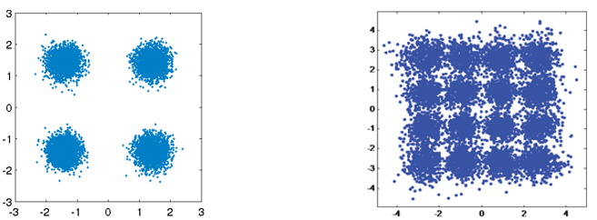
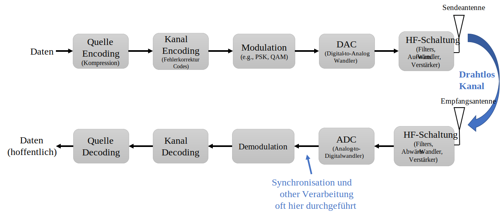
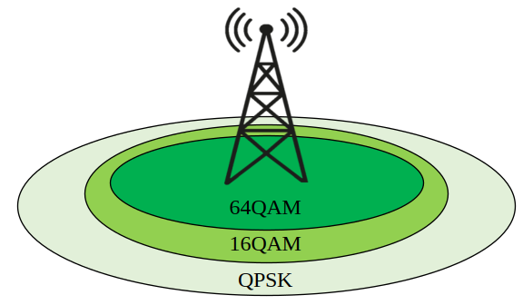
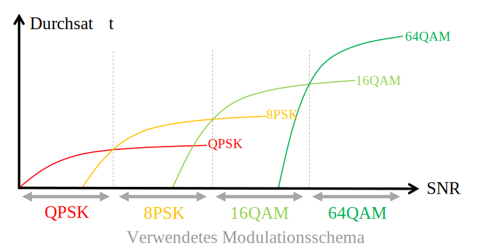
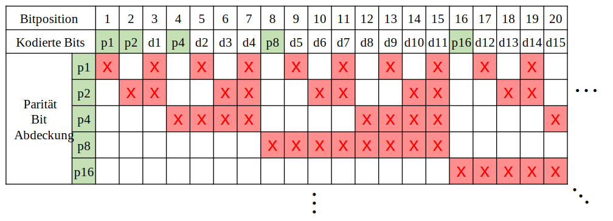
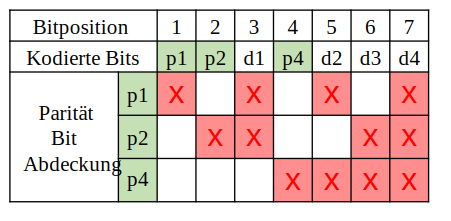
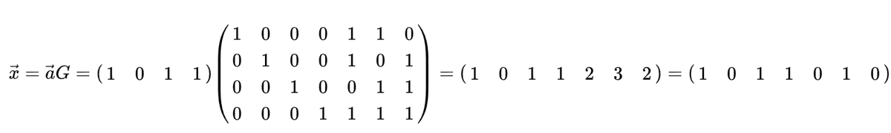
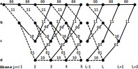
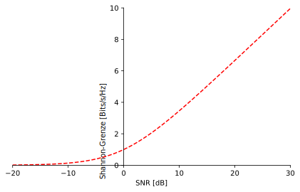
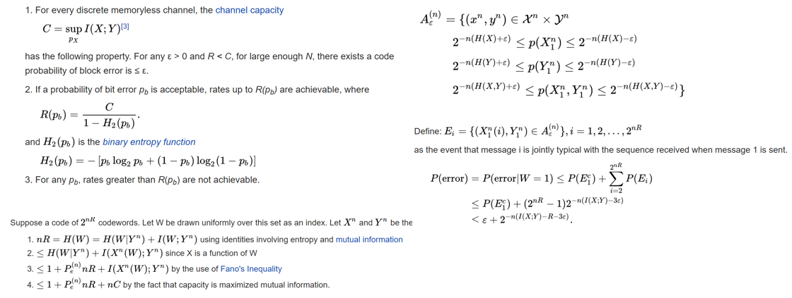

.. _channel-coding-chapter:

#####################
Kanalcodierung
#####################

In diesem Kapitel stellen wir die Grundlagen der Kanalcodierung vor, auch bekannt als Vorwärtsfehlerkorrektur (FEC), die Shannon-Grenze, Hamming-Codes, Turbo-Codes und LDPC-Codes. Kanalcodierung ist ein riesiges Gebiet innerhalb der drahtlosen Kommunikation und ein Zweig der „Informationstheorie", die sich mit der Quantifizierung, Speicherung und Übertragung von Informationen befasst.

***************************
Warum wir Kanalcodierung brauchen
***************************

Wie wir im Kapitel :ref:`noise-chapter` gelernt haben, sind drahtlose Kanäle verrauscht, und unsere digitalen Symbole erreichen den Empfänger nicht perfekt. Wenn du einen Netzwerkkurs belegt hast, weißt du vielleicht bereits von zyklischen Redundanzprüfungen (CRCs), die Fehler auf der Empfangsseite **erkennen**. Der Zweck der Kanalcodierung ist es, Fehler am Empfänger zu erkennen **und zu korrigieren**. Wenn wir etwas Spielraum für Fehler zulassen, können wir zum Beispiel mit einem höherwertigen Modulationsschema senden, ohne eine unterbrochene Verbindung zu haben. Als visuelles Beispiel betrachte die folgenden Konstellationen, die QPSK (links) und 16QAM (rechts) bei gleichem Rauschen zeigen. QPSK liefert 2 Bits pro Symbol, während 16QAM mit 4 Bits pro Symbol die doppelte Datenrate bietet. Beachte jedoch, wie in der QPSK-Konstellation die Symbole tendenziell die Symbolentscheidungsgrenze (die x- und y-Achse) nicht überschreiten, was bedeutet, dass die Symbole korrekt empfangen werden. In der 16QAM-Darstellung hingegen gibt es Überlappungen in den Clustern, und infolgedessen werden viele Symbole falsch empfangen.

Ein fehlgeschlagener CRC führt normalerweise zu einer erneuten Übertragung, zumindest bei Protokollen wie TCP. Wenn Alice eine Nachricht an Bob sendet, wäre es vorzuziehen, Bob nicht dazu bringen zu müssen, eine Nachricht an Alice zurückzusenden, um die Informationen erneut anzufordern. Der Zweck der Kanalcodierung ist es, **redundante** Informationen zu übertragen. Die Redundanz ist eine Ausfallsicherung, die die Anzahl fehlerhafter Pakete, Neuübertragungen oder verlorener Daten reduziert.

Wir haben besprochen, warum wir Kanalcodierung brauchen. Schauen wir uns an, wo sie in der Sende-Empfangs-Kette vorkommt:

Beachte, dass es mehrere Codierungsschritte in der Sende-Empfangs-Kette gibt. Quellencodierung, unser erster Schritt, ist nicht dasselbe wie Kanalcodierung; Quellencodierung soll die zu übertragenden Daten so weit wie möglich komprimieren, ähnlich wie beim Zippen von Dateien zur Platzeinsparung. Die Ausgabe des Quellencodierungsblocks sollte nämlich **kleiner** als die Dateneingabe sein, aber die Ausgabe der Kanalcodierung wird größer als ihre Eingabe sein, da Redundanz hinzugefügt wird.

***************************
Arten von Codes
***************************

Zur Kanalcodierung verwenden wir einen „Fehlerkorrekturcode". Dieser Code sagt uns, welche Bits wir angesichts der zu übertragenden Bits tatsächlich senden? Der grundlegendste Code wird als „Wiederholungscodierung" bezeichnet, bei der man einfach ein Bit N-mal hintereinander wiederholt. Bei Wiederholungs-3-Code würde man jedes Bit dreimal übertragen:

.. role::  raw-html(raw)
    :format: html

- 0 :raw-html:`&rarr;` 000
- 1 :raw-html:`&rarr;` 111

Die Nachricht 10010110 wird nach der Kanalcodierung als 111000000111000111111000 übertragen.

Einige Codes arbeiten auf „Blöcken" von Eingangsbits, während andere einen Streamansatz verwenden. Codes, die auf Blöcken mit fester Länge arbeiten, werden als „Blockcodes" bezeichnet, während Codes, die auf einem Bitstrom beliebiger Länge arbeiten, als „Faltungscodes" bezeichnet werden. Dies sind die zwei primären Arten von Codes. Unser Wiederholungs-3-Code ist ein Blockcode, bei dem jeder Block drei Bits umfasst.

Als Anmerkung: Diese Fehlerkorrekturcodes werden nicht nur bei der Kanalcodierung für drahtlose Verbindungen verwendet. Hast du schon einmal Informationen auf einer Festplatte oder SSD gespeichert und dich gewundert, warum es beim Zurücklesen nie zu Bitfehlern kommt? Das Schreiben und Lesen von Speicher ist ähnlich wie ein Kommunikationssystem. Festplatten-/SSD-Controller haben eingebaute Fehlerkorrektur. Sie ist für das Betriebssystem transparent und kann proprietär sein, da sie sich vollständig auf der Festplatte/SSD befindet. Für tragbare Medien wie CDs muss die Fehlerkorrektur standardisiert sein. Reed-Solomon-Codes waren bei CD-ROMs üblich.

***************************
Coderate
***************************

Alle Fehlerkorrekturen beinhalten eine Form von Redundanz. Das bedeutet, wenn wir 100 Bits an Informationen übertragen möchten, müssen wir tatsächlich **mehr als** 100 Bits senden. Die „Coderate" ist das Verhältnis zwischen der Anzahl der Informationsbits und der Gesamtzahl der gesendeten Bits (d.h. Informations- plus Redundanzbits). Zurück zum Wiederholungs-3-Codierungsbeispiel: Wenn ich 100 Bits an Informationen habe, können wir Folgendes bestimmen:

- 300 Bits werden gesendet
- Nur 100 Bits repräsentieren Informationen
- Coderate = 100/300 = 1/3

Die Coderate wird immer kleiner als 1 sein, da es einen Kompromiss zwischen Redundanz und Durchsatz gibt. Eine niedrigere Coderate bedeutet mehr Redundanz und weniger Durchsatz.

***************************
Modulation und Codierung
***************************

Im Kapitel :ref:`modulation-chapter` haben wir uns mit Rauschen in Modulationsschemas befasst. Bei einem niedrigen SNR benötigst du ein Modulationsschema niedrigerer Ordnung (z.B. QPSK), um mit dem Rauschen umzugehen, und bei einem hohen SNR kannst du Modulation wie 256QAM verwenden, um mehr Bits pro Sekunde zu erhalten. Kanalcodierung ist ähnlich; du möchtest bei niedrigen SNRs niedrigere Coderaten, und bei hohen SNRs kannst du eine Coderate von fast 1 verwenden. Moderne Kommunikationssysteme haben eine Reihe von kombinierten Modulations- und Codierungsschemas, sogenannte MCS (Modulation and Coding Scheme). Jedes MCS spezifiziert ein Modulationsschema und ein Codierungsschema für bestimmte SNR-Pegel.

Moderne Kommunikationssysteme ändern das MCS adaptiv in Echtzeit basierend auf den Drahtlosnalkanalzuständen. Der Empfänger sendet Feedback über die Kanalqualität an den Sender. Das Feedback muss ausgetauscht werden, bevor sich die Qualität des drahtlosen Kanals ändert, was in der Größenordnung von Millisekunden liegen kann. Dieser adaptive Prozess führt zu höchstmöglichem Durchsatz und wird von modernen Technologien wie LTE, 5G und WLAN verwendet. Unten ist eine Visualisierung eines Zellturms, der während der Übertragung das MCS ändert, während sich die Entfernung eines Benutzers zur Zelle ändert.

Wenn du bei adaptivem MCS den Durchsatz über dem SNR aufträgst, erhältst du eine treppenförmige Kurve wie im Graphen unten. Protokolle wie LTE haben oft eine Tabelle, die angibt, welches MCS bei welchem SNR verwendet werden soll.

***************************
Hamming-Code
***************************

Schauen wir uns einen einfachen Fehlerkorrekturcode an. Der Hamming-Code war der erste nicht-triviale entwickelte Code. In den späten 1940er Jahren arbeitete Richard Hamming bei Bell Labs und verwendete einen elektromechanischen Computer, der gestanztes Papierband verwendete. Wenn Fehler in der Maschine erkannt wurden, hielt sie an und Bediener mussten sie beheben. Hamming wurde frustriert davon, seine Programme aufgrund erkannter Fehler von vorne starten zu müssen. Er sagte: „Verdammt nochmal, wenn die Maschine einen Fehler erkennen kann, warum kann sie dann nicht die Position des Fehlers lokalisieren und ihn korrigieren?" Er verbrachte die nächsten Jahre damit, den Hamming-Code zu entwickeln, damit der Computer genau das tun konnte.

Bei Hamming-Codes werden zusätzliche Bits, sogenannte Paritätsbits oder Prüfbits, zur Information für Redundanz hinzugefügt. Alle Bitpositionen, die Zweierpotenzen sind, sind Paritätsbits: 1, 2, 4, 8 usw. Die anderen Bitpositionen sind für Informationen. Die Tabelle unter diesem Absatz hebt Paritätsbits in Grün hervor. Jedes Paritätsbit „deckt" alle Bits ab, bei denen das bitweise UND des Paritätsbits und der Bitposition ungleich null ist, unten mit einem roten X markiert. Wenn wir ein Datenbit verwenden möchten, brauchen wir die Paritätsbits, die es abdecken. Um bis zum Datenbit d9 gehen zu können, benötigen wir Paritätsbit p8 und alle Paritätsbits, die davor kommen, also sagt uns diese Tabelle, wie viele Paritätsbits wir für eine bestimmte Anzahl von Bits benötigen. Dieses Muster setzt sich unbegrenzt fort.

Hamming-Codes sind Blockcodes, also arbeiten sie auf N Datenbits auf einmal. Mit drei Paritätsbits können wir also auf Blöcken von vier Datenbits auf einmal arbeiten. Wir stellen dieses Fehlercodierungsschema als Hamming(7,4) dar, wobei das erste Argument die insgesamt übertragenen Bits und das zweite Argument die Datenbits sind.

Im Folgenden sind drei wichtige Eigenschaften von Hamming-Codes aufgeführt:

- Die minimale Anzahl von Bitänderungen, die benötigt wird, um von einem beliebigen Codewort zu einem anderen zu gelangen, ist drei
- Es kann Einzelbit-Fehler korrigieren
- Es kann Zweibit-Fehler erkennen, aber nicht korrigieren

Algorithmisch kann der Codierungsprozess durch eine einfache Matrixmultiplikation durchgeführt werden, unter Verwendung der sogenannten „Generatormatrix". Im folgenden Beispiel ist der Vektor 1011 die zu codierende Dateneingabe, d.h. die Information, die wir an den Empfänger senden möchten. Die 2D-Matrix ist die Generatormatrix und definiert das Codierungsschema. Das Ergebnis der Multiplikation liefert das zu übertragende Codewort.

Der Sinn des Eintauchens in Hamming-Codes war es, einen Eindruck davon zu geben, wie Fehlercodierung funktioniert. Blockcodes folgen tendenziell diesem Muster. Faltungscodes funktionieren anders, aber wir gehen hier nicht darauf ein; sie verwenden oft die Trellis-Dekodierung, die in einem Diagramm dargestellt werden kann, das so aussieht:

***************************
Weiche vs. harte Dekodierung
***************************

Erinnere dich, dass beim Empfänger die Demodulation vor der Dekodierung erfolgt. Der Demodulator kann uns seine beste Schätzung darüber mitteilen, welches Symbol gesendet wurde, oder er kann den „weichen" Wert ausgeben. Bei BPSK kann der Demodulator anstatt uns 1 oder 0 zu sagen, 0,3423 oder -1,1234 sagen, was auch immer der „weiche" Wert des Symbols war. Typischerweise ist die Dekodierung so ausgelegt, dass sie harte oder weiche Werte verwendet.

- **Weiche Entscheidungsdekodierung** – verwendet die weichen Werte
- **Harte Entscheidungsdekodierung** – verwendet nur die 1en und 0en

Weich ist robuster, weil du alle dir zur Verfügung stehenden Informationen verwendest, aber weich ist auch viel komplizierter zu implementieren. Die Hamming-Codes, über die wir gesprochen haben, verwenden harte Entscheidungen, während Faltungscodes dazu neigen, weiche zu verwenden.

***************************
Shannon-Grenze
***************************

Die Shannon-Grenze oder Shannon-Kapazität ist ein unglaubliches Stück Theorie, das uns sagt, wie viele Bits pro Sekunde an fehlerfreien Informationen wir senden können:

.. math::
 C = B \cdot log_2 \left( 1 + \frac{S}{N}   \right)

- C – Kanalkapazität [Bits/Sek]
- B – Kanalbandbreite [Hz]
- S – Mittlere empfangene Signalleistung [Watt]
- N – Mittlere Rauschleistung [Watt]

Diese Gleichung stellt das Beste dar, was ein MCS erreichen kann, wenn es bei einem ausreichend hohen SNR fehlerfrei arbeitet. Es macht mehr Sinn, die Grenze in Bits/Sek/Hz darzustellen, d.h. Bits/Sek pro Spektrumsmenge:

.. math::
 \frac{C}{B} = log_2 \left( 1 + \mathrm{SNR}   \right)

mit SNR in linearen Einheiten (nicht dB). Beim Aufzeichnen stellen wir SNR jedoch normalerweise in dB dar:

Wenn du Shannon-Limit-Diagramme anderswo siehst, die etwas anders aussehen, verwenden sie wahrscheinlich eine x-Achse von „Energie pro Bit" oder :math:`E_b/N_0`, was nur eine Alternative zur Arbeit mit SNR ist.

Es könnte helfen, die Dinge zu vereinfachen, indem man erkennt, dass bei relativ hohem SNR (z.B. 10 dB oder höher) die Shannon-Grenze als :math:`log_2 \left( \mathrm{SNR} \right)` angenähert werden kann, was ungefähr :math:`\mathrm{SNR_{dB}}/3` entspricht (`hier erklärt <https://en.wikipedia.org/wiki/Shannon%E2%80%93Hartley_theorem#Bandwidth-limited_case>`_). Zum Beispiel bei 24 dB SNR erhältst du 8 Bits/Sek/Hz; wenn du also 1 MHz zur Verfügung hast, sind das 8 Mbps. Du denkst vielleicht: „Na ja, das ist nur die theoretische Grenze", aber moderne Kommunikation kommt dieser Grenze sehr nahe, sodass sie zumindest einen groben Anhaltspunkt liefert. Du kannst diese Zahl immer halbieren, um Paket-/Frame-Overhead und nicht-ideale MCS zu berücksichtigen.

Der maximale Durchsatz von 802.11n WLAN im 2,4-GHz-Band (das 20 MHz breite Kanäle verwendet) beträgt laut Spezifikation 300 Mbps. Natürlich könntest du direkt neben deinem Router sitzen und ein extrem hohes SNR erhalten, vielleicht 60 dB, aber um zuverlässig/praktisch zu sein, wird das MCS mit maximalem Durchsatz (erinnere dich an die Treppenkurve von oben) wahrscheinlich kein so hohes SNR erfordern. Du kannst sogar einen Blick auf die `MCS-Liste für 802.11n <https://en.wikipedia.org/wiki/IEEE_802.11n-2009#Data_rates>`_ werfen. 802.11n geht bis zu 64-QAM, und kombiniert mit Kanalcodierung erfordert es laut `dieser Tabelle <https://d2cpnw0u24fjm4.cloudfront.net/wp-content/uploads/802.11n-and-802.11ac-MCS-SNR-and-RSSI.pdf>`_ ein SNR von etwa 25 dB. Das bedeutet, dass dein WLAN selbst bei 60 dB SNR noch 64-QAM verwenden wird. Also bei 25 dB liegt die Shannon-Grenze bei etwa 8,3 Bits/Sek/Hz, was bei 20 MHz Spektrum 166 Mbps ergibt. Wenn du jedoch MIMO berücksichtigst (das wir in einem zukünftigen Kapitel behandeln werden), kannst du vier dieser Streams parallel laufen lassen, was 664 Mbps ergibt. Teile diese Zahl durch zwei und du erhältst etwas, das der beworbenen Maximalgeschwindigkeit von 300 Mbps für 802.11n WLAN im 2,4-GHz-Band sehr nahekommt.

Der Beweis hinter der Shannon-Grenze ist ziemlich verrückt; er beinhaltet Mathematik, die so aussieht:

Für weitere Informationen siehe `hier <https://en.wikipedia.org/wiki/Shannon%E2%80%93Hartley_theorem>`_.

***************************
Modernste Codes
***************************

Derzeit sind die besten Kanalcodierungsschemas:

1. Turbo-Codes, verwendet in 3G, 4G und NASA-Raumfahrzeugen.
2. LDPC-Codes, verwendet in DVB-S2, WiMAX, IEEE 802.11n.

Beide Codes nähern sich der Shannon-Grenze (d.h. sie erreichen sie fast unter bestimmten SNRs). Hamming-Codes und andere einfachere Codes kommen der Shannon-Grenze bei weitem nicht nahe. Aus Forschungssicht bleibt in Bezug auf die Codes selbst nicht viel Verbesserungspotenzial. Die aktuelle Forschung konzentriert sich mehr darauf, die Dekodierung recheneffizienter und adaptiver gegenüber Kanal-Feedback zu machen.

LDPC-Codes (Low-Density Parity-Check) sind eine Klasse hocheffizienter linearer Blockcodes. Sie wurden erstmals von Robert G. Gallager in seiner Doktorarbeit im Jahr 1960 am MIT vorgestellt. Aufgrund der Rechenkomplexität ihrer Implementierung wurden sie bis in die 1990er Jahre ignoriert! Er war 89 Jahre alt zum Zeitpunkt dieses Schreibens (2020), lebt noch und hat viele Preise für seine Arbeit gewonnen (Jahrzehnte nachdem er sie geleistet hatte). LDPC ist nicht patentiert und daher frei verwendbar (im Gegensatz zu Turbo-Codes), weshalb es in vielen offenen Protokollen verwendet wurde.

Turbo-Codes basieren auf Faltungscodes. Es ist eine Klasse von Codes, die zwei oder mehr einfachere Faltungscodes und einen Interleaver kombiniert. Der grundlegende Patentantrag für Turbo-Codes wurde am 23. April 1991 eingereicht. Die Erfinder waren Franzosen; als Qualcomm Turbo-Codes in CDMA für 3G verwenden wollte, musste es eine gebührenpflichtige Patentlizenzvereinbarung mit France Télécom abschließen. Das primäre Patent lief am 29. August 2013 ab.
