.. _filters-chapter:

#############
Filter
#############

In diesem Kapitel lernst du digitale Filter mit Python kennen. Wir behandeln Filtertypen (FIR/IIR sowie Tiefpass/Hochpass/Bandpass/Bandsperr-Filter), wie Filter digital dargestellt werden und wie sie entworfen werden. Wir schließen mit einer Einführung in das Pulsformen, das wir im Kapitel :ref:`pulse-shaping-chapter` weiter vertiefen.

*************************
Grundlagen der Filter
*************************

Filter werden in vielen Bereichen eingesetzt. Beispielsweise macht die Bildverarbeitung intensiven Gebrauch von 2D-Filtern, bei denen Ein- und Ausgaben Bilder sind. Vielleicht verwendest du jeden Morgen einen Filter, um deinen Kaffee zu brühen, der Feststoffe von Flüssigkeit trennt. In der DSP werden Filter hauptsächlich verwendet für:

1. Trennung von Signalen, die kombiniert wurden (z.B. das gewünschte Signal herausfiltern)
2. Entfernung von überschüssigem Rauschen nach dem Empfang eines Signals
3. Wiederherstellung von Signalen, die in irgendeiner Weise verzerrt wurden (z.B. ist ein Audio-Equalizer ein Filter)

Es gibt sicherlich weitere Anwendungen für Filter, aber dieses Kapitel soll das Konzept einführen, anstatt alle Möglichkeiten des Filterns zu erklären.

Du denkst vielleicht, dass wir uns nur um digitale Filter kümmern; dieses Lehrbuch befasst sich schließlich mit DSP. Es ist jedoch wichtig zu wissen, dass viele Filter analog sein werden, wie die in unseren SDRs, die vor dem Analog-Digital-Wandler (ADC) auf der Empfangsseite platziert sind. Das folgende Bild stellt einen schematischen Analogfilterschaltkreis einem Ablaufdiagramm eines digitalen Filteralgorithmus gegenüber.

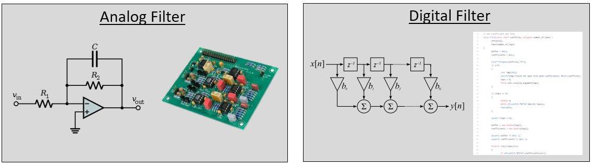

In der DSP, wo Ein- und Ausgaben Signale sind, hat ein Filter ein Eingangssignal und ein Ausgangssignal:

.. tikz:: [font=\sffamily\Large, scale=2]
   \definecolor{babyblueeyes}{rgb}{0.36, 0.61, 0.83}
   \node [draw,
    color=white,
    fill=babyblueeyes,
    minimum width=4cm,
    minimum height=2.4cm
   ]  (filter) {Filter};
   \draw[<-, very thick] (filter.west) -- ++(-2,0) node[left,align=center]{Eingang\\(Zeitbereich)} ;
   \draw[->, very thick] (filter.east) -- ++(2,0) node[right,align=center]{Ausgang\\(Zeitbereich)};
   :libs: positioning
   :xscale: 80

Du kannst nicht zwei verschiedene Signale in einen einzigen Filter einspeisen, ohne sie vorher zusammenzuaddieren oder eine andere Operation durchzuführen. Ebenso ist die Ausgabe immer ein Signal, d.h. ein 1D-Array von Zahlen.

Es gibt vier grundlegende Filtertypen: Tiefpass, Hochpass, Bandpass und Bandsperr. Jeder Typ verändert Signale, um sich auf verschiedene Frequenzbereiche zu konzentrieren. Die folgenden Diagramme zeigen, wie Frequenzen in Signalen für jeden Typ gefiltert werden, zunächst nur mit positiven Frequenzen (leichter zu verstehen), dann auch mit negativen.

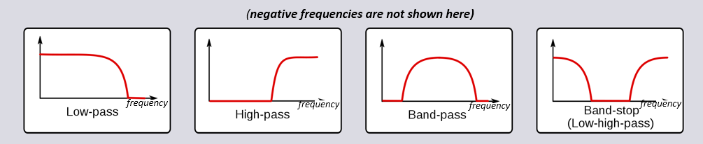

.. START OF FILTER TYPES TIKZ
.. raw:: html

   <table><tbody><tr><td>

.. This draw the lowpass filter
.. tikz:: [font=\sffamily\large]
   \draw[->, thick] (-5,0) -- (5,0) node[below]{Frequenz};
   \draw[->, thick] (0,-0.5) node[below]{0 Hz} -- (0,5) node[left=1cm]{\textbf{Tiefpass}};
   \draw[red, thick, smooth] plot[tension=0.5] coordinates{(-5,0) (-2.5,0.5) (-1.5,3) (1.5,3) (2.5,0.5) (5,0)};
   :xscale: 100

.. raw:: html

   </td><td  style="padding: 0px">

.. this draws the highpass filter
.. tikz:: [font=\sffamily\large]
   \draw[->, thick] (-5,0) -- (5,0) node[below]{Frequenz};
   \draw[->, thick] (0,-0.5) node[below]{0 Hz} -- (0,5) node[left=1cm]{\textbf{Hochpass}};
   \draw[red, thick, smooth] plot[tension=0.5] coordinates{(-5,3) (-2.5,2.5) (-1.5,0.3) (1.5,0.3) (2.5,2.5) (5,3)};
   :xscale: 100

.. raw:: html

   </td></tr><tr><td>

.. this draws the bandpass filter
.. tikz:: [font=\sffamily\large]
   \draw[->, thick] (-5,0) -- (5,0) node[below]{Frequenz};
   \draw[->, thick] (0,-0.5) node[below]{0 Hz} -- (0,5) node[left=1cm]{\textbf{Bandpass}};
   \draw[red, thick, smooth] plot[tension=0.5] coordinates{(-5,0) (-4.5,0.3) (-3.5,3) (-2.5,3) (-1.5,0.3) (1.5, 0.3) (2.5,3) (3.5, 3) (4.5,0.3) (5,0)};
   :xscale: 100

.. raw:: html

   </td><td>

.. and finally the bandstop filter
.. tikz:: [font=\sffamily\large]
   \draw[->, thick] (-5,0) -- (5,0) node[below]{Frequenz};
   \draw[->, thick] (0,-0.5) node[below]{0 Hz} -- (0,5) node[left=1cm]{\textbf{Bandsperre}};
   \draw[red, thick, smooth] plot[tension=0.5] coordinates{(-5,3) (-4.5,2.7) (-3.5,0.3) (-2.5,0.3) (-1.5,2.7) (1.5, 2.7) (2.5,0.3) (3.5, 0.3) (4.5,2.7) (5,3)};
   :xscale: 100

.. raw:: html

   </td></tr></tbody></table>

.. .......................... end of filter plots in tikz

Jeder Filter lässt bestimmte Frequenzen in einem Signal durch und blockiert andere. Der Frequenzbereich, den ein Filter durchlässt, wird als „Durchlassbereich" bezeichnet, und der blockierte Bereich heißt „Sperrbereich". Im Fall des Tiefpassfilters lässt er niedrige Frequenzen durch und sperrt hohe Frequenzen, sodass 0 Hz immer im Durchlassbereich liegt. Bei einem Hochpass- und Bandpassfilter liegt 0 Hz immer im Sperrbereich.

Verwechsle diese Filtertypen nicht mit der algorithmischen Implementierung des Filters (z.B. IIR vs. FIR). Der mit Abstand häufigste Typ ist der Tiefpassfilter (TF), da wir Signale oft im Basisband darstellen. Ein Tiefpassfilter ermöglicht es uns, alles „rund um" unser Signal herauszufiltern und überschüssiges Rauschen sowie andere Signale zu entfernen.

*************************
Filterdarstellung
*************************

Für die meisten Filter, die wir sehen werden (bekannt als FIR- oder Finite Impulse Response-Filter), können wir den Filter selbst mit einem einzigen Array von Fließkommazahlen darstellen. Für im Frequenzbereich symmetrische Filter sind diese Zahlen reell (im Gegensatz zu komplex), und es gibt in der Regel eine ungerade Anzahl davon. Wir nennen dieses Array von Fließkommazahlen „Filterkoeffizienten" (engl. filter taps). Wir verwenden oft :math:`h` als Symbol für Filterkoeffizienten. Hier ist ein Beispiel für eine Menge von Filterkoeffizienten, die einen Filter definieren:

.. code-block:: python

    h =  [ 9.92977939e-04  1.08410297e-03  8.51595307e-04  1.64604862e-04
     -1.01714338e-03 -2.46268845e-03 -3.58236429e-03 -3.55412543e-03
     -1.68583512e-03  2.10562324e-03  6.93100252e-03  1.09302641e-02
      1.17766532e-02  7.60955496e-03 -1.90555639e-03 -1.48306750e-02
     -2.69313236e-02 -3.25659606e-02 -2.63400086e-02 -5.04184562e-03
      3.08099470e-02  7.64264738e-02  1.23536693e-01  1.62377258e-01
      1.84320776e-01  1.84320776e-01  1.62377258e-01  1.23536693e-01
      7.64264738e-02  3.08099470e-02 -5.04184562e-03 -2.63400086e-02
     -3.25659606e-02 -2.69313236e-02 -1.48306750e-02 -1.90555639e-03
      7.60955496e-03  1.17766532e-02  1.09302641e-02  6.93100252e-03
      2.10562324e-03 -1.68583512e-03 -3.55412543e-03 -3.58236429e-03
     -2.46268845e-03 -1.01714338e-03  1.64604862e-04  8.51595307e-04
      1.08410297e-03  9.92977939e-04]

Anwendungsbeispiel
########################

Um zu lernen, wie Filter verwendet werden, schauen wir uns ein Beispiel an, bei dem wir unser SDR auf die Frequenz eines vorhandenen Signals einstellen und es von anderen Signalen isolieren möchten. Denke daran, dass wir unserem SDR mitteilen, auf welche Frequenz es sich einstellen soll, aber die Samples, die das SDR aufnimmt, befinden sich im Basisband, was bedeutet, dass das Signal als um 0 Hz zentriert angezeigt wird. Wir müssen verfolgen, auf welche Frequenz wir das SDR eingestellt haben. Folgendes könnten wir empfangen:

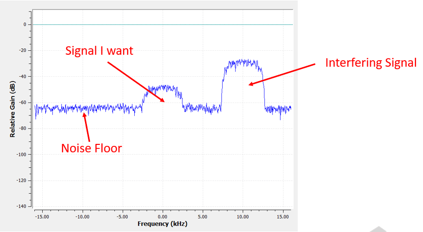

Da unser Signal bereits bei DC (0 Hz) zentriert ist, wissen wir, dass wir einen Tiefpassfilter wollen. Wir müssen eine „Grenzfrequenz" (auch Eckfrequenz genannt) wählen, die bestimmt, wann der Durchlassbereich in den Sperrbereich übergeht. Die Grenzfrequenz wird immer in Hz angegeben. In diesem Beispiel scheinen 3 kHz ein guter Wert zu sein:

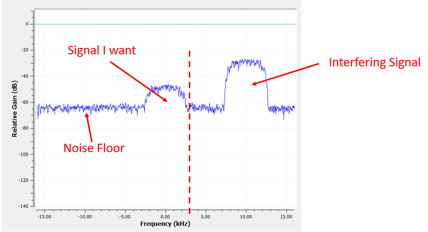

Allerdings liegt die negative Frequenzgrenze bei den meisten Tiefpassfiltern ebenfalls bei -3 kHz, d.h. sie ist symmetrisch um DC (später wirst du sehen, warum). Unsere Grenzfrequenzen sehen etwa so aus (der Durchlassbereich ist der Bereich dazwischen):

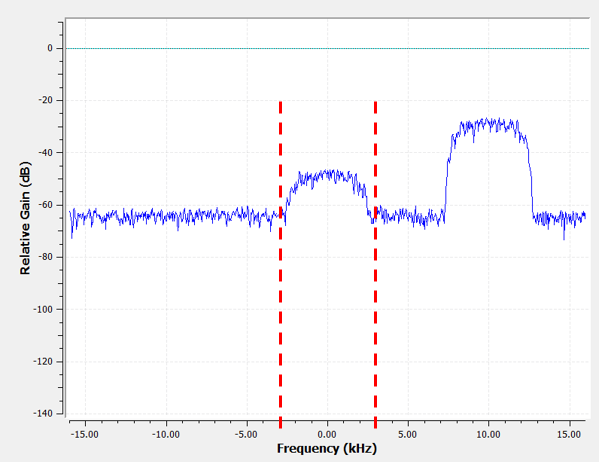

Nach dem Erstellen und Anwenden des Filters mit einer Grenzfrequenz von 3 kHz erhalten wir:

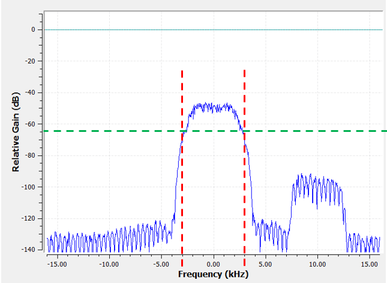

Dieses gefilterte Signal wird verwirrend aussehen, bis du dich erinnerst, dass unser Rauschboden *bei* der grünen Linie bei etwa -65 dB lag. Obwohl wir das störende Signal bei 10 kHz noch sehen können, haben wir die Leistung dieses Signals *erheblich* reduziert. Sie liegt jetzt unter dem ursprünglichen Rauschboden! Wir haben auch den größten Teil des Rauschens entfernt, das im Sperrbereich vorhanden war.

Neben der Grenzfrequenz ist der andere Hauptparameter unseres Tiefpassfilters die sogenannte „Übergangsbreite". Die Übergangsbreite, auch in Hz gemessen, gibt dem Filter vor, wie schnell er zwischen Durchlass- und Sperrbereich wechseln muss, da ein sofortiger Übergang unmöglich ist.

Lass uns die Übergangsbreite visualisieren. Im Diagramm unten stellt die :green:`grüne` Linie die ideale Reaktion für den Übergang zwischen Durchlass- und Sperrbereich dar, die im Wesentlichen eine Übergangsbreite von null hat. Die :red:`rote` Linie demonstriert das Ergebnis eines realistischen Filters, das etwas Welligkeit und eine bestimmte Übergangsbreite aufweist.

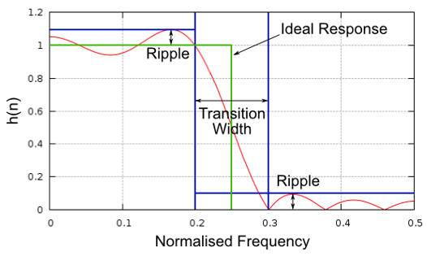

Du fragst dich vielleicht, warum wir die Übergangsbreite nicht einfach so klein wie möglich machen. Der Grund ist hauptsächlich, dass eine kleinere Übergangsbreite zu mehr Koeffizienten führt, und mehr Koeffizienten bedeuten mehr Berechnungen — wir werden bald sehen, warum. Ein 50-Koeffizienten-Filter kann den ganzen Tag laufen und dabei 1 % der CPU eines Raspberry Pi verwenden. Ein 50.000-Koeffizienten-Filter hingegen würde deine CPU zum Explodieren bringen! Normalerweise verwenden wir ein Filter-Design-Tool, schauen dann, wie viele Koeffizienten es ausgibt, und wenn es viel zu viele sind (z.B. mehr als 100), erhöhen wir die Übergangsbreite. Das hängt natürlich alles von der Anwendung und der Hardware ab, auf der der Filter läuft.

Im obigen Filterbeispiel haben wir eine Grenzfrequenz von 3 kHz und eine Übergangsbreite von 1 kHz verwendet (es ist schwer, die Übergangsbreite nur durch Betrachten dieser Screenshots zu erkennen). Der resultierende Filter hatte 77 Koeffizienten.

Zurück zur Filterdarstellung. Obwohl wir möglicherweise die Liste der Koeffizienten für einen Filter zeigen, stellen wir Filter normalerweise visuell im Frequenzbereich dar. Wir nennen das den „Frequenzgang" des Filters, und er zeigt uns das Verhalten des Filters in der Frequenz. Hier ist der Frequenzgang des Filters, den wir gerade verwendet haben:

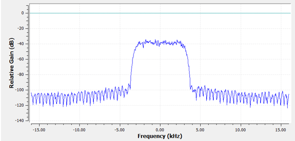

Beachte, dass das, was ich hier zeige, *kein* Signal ist — es ist lediglich die Frequenzbereichsdarstellung des Filters. Das kann anfangs etwas schwer zu begreifen sein, aber wenn wir uns Beispiele und Code ansehen, wird es klar.

Ein gegebener Filter hat auch eine Zeitbereichsdarstellung; sie wird als „Impulsantwort" des Filters bezeichnet, weil es das ist, was du im Zeitbereich siehst, wenn du einen Impuls durch den Filter schickst. (Suche nach „Dirac-Delta-Funktion" für weitere Informationen darüber, was ein Impuls ist.) Bei einem FIR-Filter sind die Impulsantwort einfach die Koeffizienten selbst. Für den 77-Koeffizienten-Filter, den wir zuvor verwendet haben, sind die Koeffizienten:

.. code-block:: python

    h =  [-0.00025604525581002235, 0.00013669139298144728, 0.0005385575350373983,
    0.0008378280326724052, 0.000906112720258534, 0.0006353431381285191,
    -9.884083502996931e-19, -0.0008822851814329624, -0.0017323142383247614,
    -0.0021665366366505623, -0.0018335371278226376, -0.0005912294145673513,
    0.001349081052467227, 0.0033936649560928345, 0.004703888203948736,
    0.004488115198910236, 0.0023609865456819534, -0.0013707970501855016,
    -0.00564080523326993, -0.008859002031385899, -0.009428252466022968,
    -0.006394983734935522, 4.76480351940553e-18, 0.008114570751786232,
    0.015200719237327576, 0.018197273835539818, 0.01482443418353796,
    0.004636279307305813, -0.010356673039495945, -0.025791890919208527,
    -0.03587324544787407, -0.034922562539577484, -0.019146423786878586,
    0.011919975280761719, 0.05478153005242348, 0.10243935883045197,
    0.1458890736103058, 0.1762896478176117, 0.18720689415931702,
    0.1762896478176117, 0.1458890736103058, 0.10243935883045197,
    0.05478153005242348, 0.011919975280761719, -0.019146423786878586,
    -0.034922562539577484, -0.03587324544787407, -0.025791890919208527,
    -0.010356673039495945, 0.004636279307305813, 0.01482443418353796,
    0.018197273835539818, 0.015200719237327576, 0.008114570751786232,
    4.76480351940553e-18, -0.006394983734935522, -0.009428252466022968,
    -0.008859002031385899, -0.00564080523326993, -0.0013707970501855016,
    0.0023609865456819534, 0.004488115198910236, 0.004703888203948736,
    0.0033936649560928345, 0.001349081052467227, -0.0005912294145673513,
    -0.0018335371278226376, -0.0021665366366505623, -0.0017323142383247614,
    -0.0008822851814329624, -9.884083502996931e-19, 0.0006353431381285191,
    0.000906112720258534, 0.0008378280326724052, 0.0005385575350373983,
    0.00013669139298144728, -0.00025604525581002235]

Und obwohl wir noch nicht mit dem Filterdesign begonnen haben, ist hier der Python-Code, der diesen Filter erzeugt hat:

.. code-block:: python

    import numpy as np
    from scipy import signal
    import matplotlib.pyplot as plt

    num_taps = 51 # Es hilft, eine ungerade Anzahl von Koeffizienten zu verwenden
    cut_off = 3000 # Hz
    sample_rate = 32000 # Hz

    # Tiefpassfilter erstellen
    h = signal.firwin(num_taps, cut_off, fs=sample_rate)

    # Impulsantwort darstellen
    plt.plot(h, '.-')
    plt.show()

Das einfache Darstellen dieses Arrays von Fließkommazahlen gibt uns die Impulsantwort des Filters:

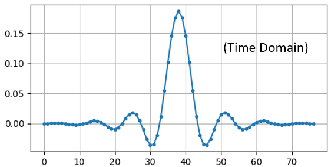

Und hier ist der Code, der verwendet wurde, um den Frequenzgang zu erzeugen, der zuvor gezeigt wurde. Er ist etwas komplizierter, da wir das x-Achsen-Array der Frequenzen erstellen müssen.

.. code-block:: python

    # Frequenzgang darstellen
    H = np.abs(np.fft.fft(h, 1024)) # 1024-Punkt-FFT nehmen und Betrag berechnen
    H = np.fft.fftshift(H) # 0 Hz in die Mitte legen
    w = np.linspace(-sample_rate/2, sample_rate/2, len(H)) # x-Achse
    plt.plot(w, H, '.-')
    plt.show()

Reelle vs. komplexe Filter
############################

Der Filter, den ich dir gezeigt habe, hatte reelle Koeffizienten, aber Koeffizienten können auch komplex sein. Ob die Koeffizienten reell oder komplex sind, muss nicht mit dem Signal übereinstimmen, das du durchschickst, d.h. du kannst ein komplexes Signal durch einen Filter mit reellen Koeffizienten schicken und umgekehrt. Wenn die Koeffizienten reell sind, ist der Frequenzgang des Filters symmetrisch um DC (0 Hz). Typischerweise verwenden wir komplexe Koeffizienten, wenn wir Asymmetrie benötigen, was nicht sehr häufig vorkommt.

.. draw real vs complex filter
.. tikz:: [font=\sffamily\Large,scale=2]
   \definecolor{babyblueeyes}{rgb}{0.36, 0.61, 0.83}
   \draw[->, thick] (-5,0) node[below]{$-\frac{f_s}{2}$} -- (5,0) node[below]{$\frac{f_s}{2}$};
   \draw[->, thick] (0,-0.5) node[below]{0 Hz} -- (0,1);
   \draw[babyblueeyes, smooth, line width=3pt] plot[tension=0.1] coordinates{(-5,0) (-1,0) (-0.5,2) (0.5,2) (1,0) (5,0)};
   \draw[->,thick] (6,0) node[below]{$-\frac{f_s}{2}$} -- (16,0) node[below]{$\frac{f_s}{2}$};
   \draw[->,thick] (11,-0.5) node[below]{0 Hz} -- (11,1);
   \draw[babyblueeyes, smooth, line width=3pt] plot[tension=0] coordinates{(6,0) (11,0) (11,2) (11.5,2) (12,0) (16,0)};
   \draw[font=\huge\bfseries] (0,2.5) node[above,align=center]{Tiefpassfilter\\mit reellen Koeffizienten};
   \draw[font=\huge\bfseries] (11,2.5) node[above,align=center]{Tiefpassfilter\\mit komplexen Koeffizienten};

Als Beispiel für komplexe Koeffizienten kehren wir zum Filteranwendungsfall zurück, außer dass wir diesmal das andere störende Signal empfangen möchten (ohne das Radio neu einstellen zu müssen). Das bedeutet, wir wollen einen Bandpassfilter, aber keinen symmetrischen. Wir möchten nur Frequenzen zwischen etwa 7 kHz und 13 kHz durchlassen (wir wollen nicht auch -13 kHz bis -7 kHz durchlassen):

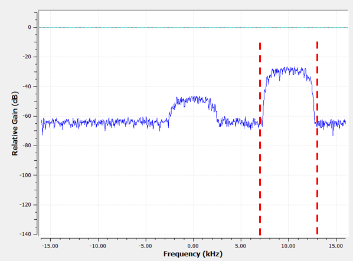

Eine Möglichkeit, diese Art von Filter zu entwerfen, besteht darin, einen Tiefpassfilter mit einer Grenzfrequenz von 3 kHz zu erstellen und ihn dann im Frequenzbereich zu verschieben. Erinnere dich, dass wir x(t) (Zeitbereich) durch Multiplikation mit :math:`e^{j2\pi f_0t}` im Frequenzbereich verschieben können. In diesem Fall sollte :math:`f_0` 10 kHz sein, was unseren Filter um 10 kHz nach oben verschiebt. Beachte, dass in unserem Python-Code von oben :math:`h` die Filterkoeffizienten des Tiefpassfilters waren. Um unseren Bandpassfilter zu erstellen, müssen wir diese Koeffizienten mit :math:`e^{j2\pi f_0t}` multiplizieren, wobei es erforderlich ist, einen Zeitvektor basierend auf unserer Abtastperiode (Kehrwert der Abtastrate) zu erstellen:

.. code-block:: python

    # (h wurde mit dem ersten Code-Snippet gefunden)

    # Den Filter im Frequenzbereich verschieben durch Multiplikation mit exp(j*2*pi*f0*t)
    f0 = 10e3 # Verschiebungsbetrag
    Ts = 1.0/sample_rate # Abtastperiode
    t = np.arange(0.0, Ts*len(h), Ts) # Zeitvektor. Argumente sind (Start, Stop, Schritt)
    exponential = np.exp(2j*np.pi*f0*t) # das ist im Wesentlichen eine komplexe Sinuswelle

    h_band_pass = h * exponential # Verschiebung durchführen

    # Impulsantwort darstellen
    plt.figure('impulse')
    plt.plot(np.real(h_band_pass), '.-')
    plt.plot(np.imag(h_band_pass), '.-')
    plt.legend(['real', 'imag'], loc=1)

    # Frequenzgang darstellen
    H = np.abs(np.fft.fft(h_band_pass, 1024)) # 1024-Punkt-FFT und Betrag berechnen
    H = np.fft.fftshift(H) # 0 Hz in die Mitte legen
    w = np.linspace(-sample_rate/2, sample_rate/2, len(H)) # x-Achse
    plt.figure('freq')
    plt.plot(w, H, '.-')
    plt.xlabel('Frequenz [Hz]')
    plt.show()

Die Diagramme der Impulsantwort und des Frequenzgangs sind unten gezeigt:

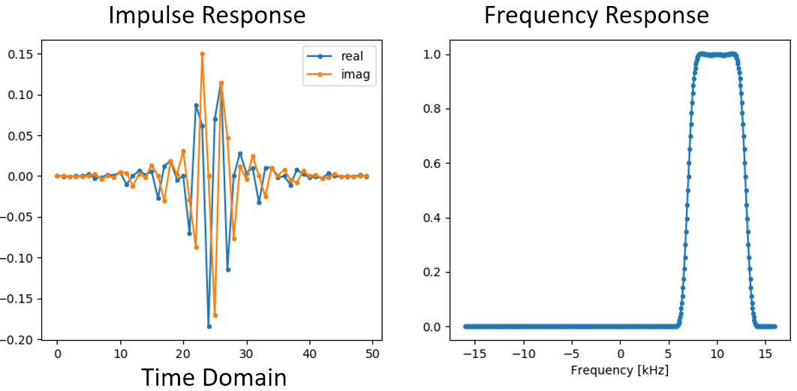

Da unser Filter nicht symmetrisch um 0 Hz ist, muss er komplexe Koeffizienten verwenden. Daher benötigen wir zwei Linien, um diese komplexen Koeffizienten darzustellen. Was wir im linken Diagramm oben sehen, ist immer noch die Impulsantwort. Unser Frequenzgangdiagramm ist das, was wirklich bestätigt, dass wir den gewünschten Filter erstellt haben, der alles außer dem Signal bei 10 kHz herausfiltert. Denke noch einmal daran, dass das obige Diagramm *kein* tatsächliches Signal ist: Es ist lediglich eine Darstellung des Filters. Es kann sehr verwirrend sein zu verstehen, denn wenn du den Filter auf das Signal anwendest und die Ausgabe im Frequenzbereich darstellst, wird es in vielen Fällen ungefähr wie der Frequenzgang des Filters selbst aussehen.

Wenn dieser Abschnitt zur Verwirrung beigetragen hat, keine Sorge — 99 % der Zeit wirst du sowieso mit einfachen Tiefpassfiltern mit reellen Koeffizienten arbeiten.

.. _convolution-section:

***********
Faltung
***********

Wir machen einen kurzen Abstecher, um den Faltungsoperator einzuführen. Überspringe diesen Abschnitt, wenn du bereits damit vertraut bist.

Zwei Signale zusammenzuaddieren ist eine Möglichkeit, zwei Signale zu einem zu kombinieren. Im Kapitel :ref:`freq-domain-chapter` haben wir untersucht, wie die Linearitätseigenschaft beim Addieren zweier Signale gilt. Faltung ist eine weitere Möglichkeit, zwei Signale zu einem zu kombinieren, aber sie unterscheidet sich sehr stark von der einfachen Addition. Die Faltung zweier Signale ist wie das Schieben eines über das andere und Integrieren. Sie ist der Kreuzkorrelation *sehr* ähnlich, falls du mit dieser Operation vertraut bist. Tatsächlich ist sie in vielen Fällen äquivalent zu einer Kreuzkorrelation. Wir verwenden typischerweise das Symbol :code:`*`, um eine Faltung zu bezeichnen, insbesondere in mathematischen Gleichungen.

Ich glaube, die Faltungsoperation lässt sich am besten durch Beispiele erlernen. In diesem ersten Beispiel falten wir zwei Rechteckimpulse miteinander:

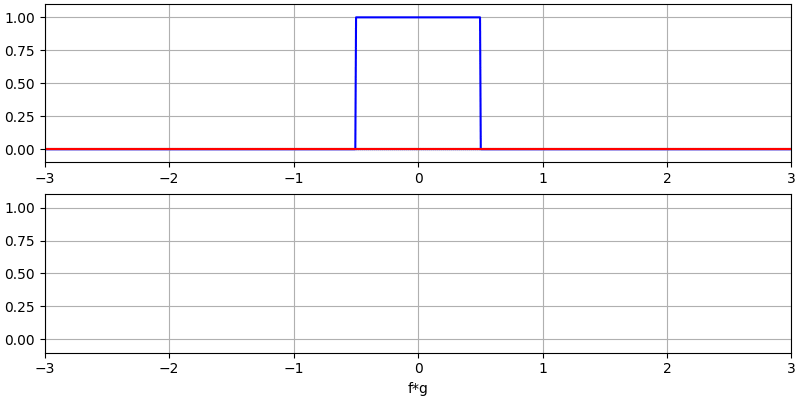

Wir haben zwei Eingangssignale (ein rotes, ein blaues), und dann wird die Ausgabe der Faltung in schwarz angezeigt. Du kannst sehen, dass die Ausgabe die Integration der beiden Signale ist, während eines über das andere gleitet. Da es sich um eine gleitende Integration handelt, ist das Ergebnis ein Dreieck mit einem Maximum an dem Punkt, wo beide Rechteckimpulse perfekt übereinander lagen.

Schauen wir uns einige weitere Faltungen an:

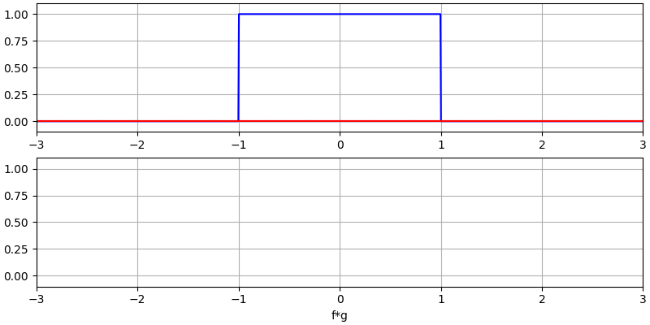

|

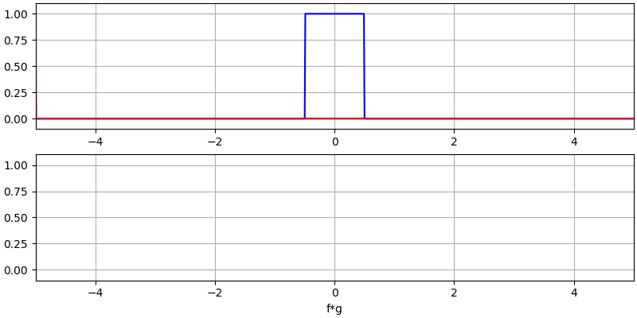

|

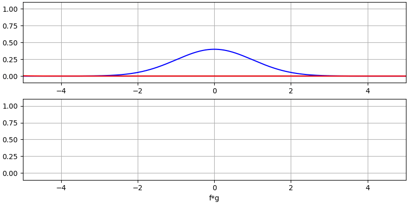

Beachte, dass eine Gauß-Kurve, die mit einer Gauß-Kurve gefaltet wird, eine weitere Gauß-Kurve ergibt, aber mit einem breiteren Impuls und niedrigerer Amplitude.

Aufgrund dieser „gleitenden" Natur ist die Länge der Ausgabe tatsächlich länger als die Eingabe. Wenn ein Signal :code:`M` Samples und das andere Signal :code:`N` Samples hat, kann die Faltung der beiden :code:`N+M-1` Samples erzeugen. Funktionen wie :code:`numpy.convolve()` haben jedoch eine Möglichkeit anzugeben, ob du die gesamte Ausgabe (:code:`max(M, N)` Samples) oder nur die Samples möchtest, wo sich die Signale vollständig überlappten (:code:`max(M, N) - min(M, N) + 1`, falls du neugierig bist). Es ist nicht nötig, sich in dieses Detail zu vertiefen. Wisse nur, dass die Länge der Ausgabe einer Faltung nicht einfach die Länge der Eingaben ist.

Warum ist Faltung in der DSP wichtig? Nun, zunächst einmal können wir ein Signal einfach filtern, indem wir die Impulsantwort dieses Filters nehmen und sie mit dem Signal falten. FIR-Filterung ist einfach eine Faltungsoperation.

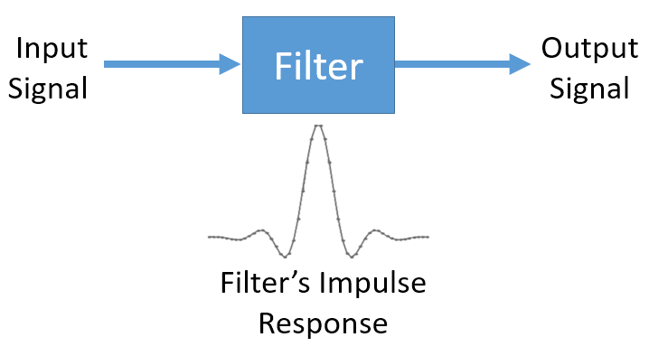

Es kann verwirrend sein, weil wir früher erwähnt haben, dass die Faltung zwei *Signale* als Eingabe nimmt und eines ausgibt. Wir können die Impulsantwort wie ein Signal behandeln, und Faltung ist schließlich ein mathematischer Operator, der auf zwei 1D-Arrays operiert. Wenn eines dieser 1D-Arrays die Impulsantwort des Filters ist, kann das andere 1D-Array ein Stück des Eingangssignals sein, und die Ausgabe wird eine gefilterte Version der Eingabe sein.

Schauen wir uns ein weiteres Beispiel an, damit es klarer wird. Im folgenden Beispiel stellt das Dreieck die Impulsantwort unseres Filters dar, und das :green:`grüne` Signal ist unser zu filterndes Signal.

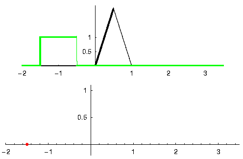

Die :red:`rote` Ausgabe ist das gefilterte Signal.

Frage: Welcher Filtertyp war das Dreieck?

.. raw:: html

   

   
Antwort

Es hat die hochfrequenten Komponenten des grünen Signals geglättet (d.h. die scharfen Übergänge des Rechtecks), also wirkt es als Tiefpassfilter.

.. raw:: html

   

Nun, da wir beginnen, die Faltung zu verstehen, präsentiere ich die mathematische Gleichung dafür. Das Sternchen (*) wird typischerweise als Symbol für Faltung verwendet:

.. math::

 (f * g)(t) = \int f(\tau) g(t - \tau) d\tau

In dem obigen Ausdruck ist :math:`g(t)` das Signal oder die Eingabe, die gespiegelt wird und über :math:`f(t)` gleitet, aber :math:`g(t)` und :math:`f(t)` können ausgetauscht werden und der Ausdruck bleibt gleich. In der Regel wird das kürzere Array als :math:`g(t)` verwendet. Faltung ist gleich einer Kreuzkorrelation, definiert als :math:`\int f(\tau) g(t+\tau)`, wenn :math:`g(t)` symmetrisch ist, d.h. sich nicht ändert, wenn es um den Ursprung gespiegelt wird.

*************************
Filterimplementierung
*************************

Wir werden nicht zu tief in die Implementierung von Filtern eintauchen. Stattdessen konzentriere ich mich auf das Filterdesign (einsatzbereite Implementierungen findest du sowieso in jeder Programmiersprache). Für jetzt gibt es folgendes zu merken: Um ein Signal mit einem FIR-Filter zu filtern, fältest du einfach die Impulsantwort (das Array von Koeffizienten) mit dem Eingangssignal. In der diskreten Welt verwenden wir eine diskrete Faltung (Beispiel unten). Die als b bezeichneten Dreiecke sind die Koeffizienten. In dem Ablaufdiagramm bedeuten die mit :math:`z^{-1}` beschrifteten Quadrate über den Dreiecken eine Verzögerung um einen Zeitschritt.

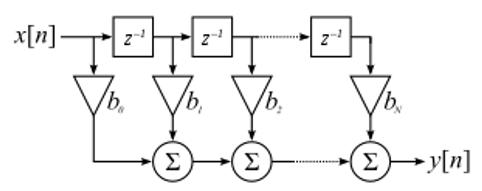

Du kannst jetzt vielleicht verstehen, warum wir sie Filter-„Koeffizienten" (engl. taps) nennen, basierend auf der Art, wie der Filter selbst implementiert ist.

FIR vs. IIR
##############

Es gibt zwei Hauptklassen von Digitalfiltern: FIR und IIR

1. Finite Impulse Response (FIR) — endliche Impulsantwort
2. Infinite Impulse Response (IIR) — unendliche Impulsantwort

Wir werden nicht zu tief in die Theorie gehen, aber für jetzt erinnere: FIR-Filter sind einfacher zu entwerfen und können alles tun, was du möchtest, wenn du genug Koeffizienten verwendest. IIR-Filter sind komplizierter und können instabil werden, sind aber effizienter (verwenden weniger CPU und Speicher für den gegebenen Filter). Wenn jemand dir einfach eine Liste von Koeffizienten gibt, wird angenommen, dass es sich um Koeffizienten für einen FIR-Filter handelt. Wenn er anfängt, „Pole" zu erwähnen, spricht er von IIR-Filtern. Wir bleiben in diesem Lehrbuch bei FIR-Filtern.

Unten ist ein Beispiel-Frequenzgang, der einen FIR- und IIR-Filter vergleicht, die fast genau dasselbe Filtern durchführen; sie haben eine ähnliche Übergangsbreite, die wie wir gelernt haben bestimmt, wie viele Koeffizienten benötigt werden. Der FIR-Filter hat 50 Koeffizienten und der IIR-Filter hat 12 Pole, was in Bezug auf die erforderlichen Berechnungen etwa 12 Koeffizienten entspricht.

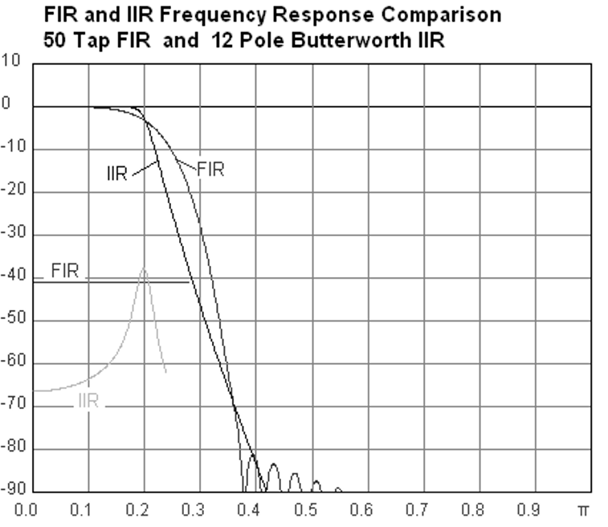

Die Lektion ist, dass der FIR-Filter für die ungefähr gleiche Filteroperation erheblich mehr Rechenressourcen benötigt als der IIR.

Hier sind einige Beispiele aus der realen Welt von FIR- und IIR-Filtern, die du vielleicht schon verwendet hast.

Wenn du einen „gleitenden Durchschnitt" über eine Liste von Zahlen berechnest, ist das einfach ein FIR-Filter mit Koeffizienten von 1:
- h = [1 1 1 1 1 1 1 1 1 1] für einen gleitenden Durchschnittsfilter mit einer Fenstergröße von 10. Es ist auch ein Tiefpassfilter — warum ist das so? Was ist der Unterschied zwischen der Verwendung von 1en und der Verwendung von Koeffizienten, die auf null abklingen?

.. raw:: html

   

   
Antwort

Ein gleitender Durchschnittsfilter ist ein Tiefpassfilter, weil er „hochfrequente" Änderungen glättet, was normalerweise der Grund ist, warum man einen verwenden würde. Der Grund für die Verwendung von Koeffizienten, die auf beiden Enden auf null abklingen, besteht darin, einen plötzlichen Sprung in der Ausgabe zu vermeiden, z.B. wenn das zu filternde Signal eine Weile null war und dann plötzlich hochsprang.

.. raw:: html

   

Jetzt ein IIR-Beispiel. Hast du schon einmal so etwas gemacht:

    x = x*0.99 + new_value*0.01

wobei 0,99 und 0,01 die Aktualisierungsgeschwindigkeit des Wertes (oder die Abklingrate, das Gleiche) darstellen? Es ist eine bequeme Möglichkeit, eine Variable langsam zu aktualisieren, ohne sich die letzten mehreren Werte merken zu müssen. Das ist eigentlich eine Form eines IIR-Tiefpassfilters. Hoffentlich kannst du sehen, warum IIR-Filter weniger stabil sind als FIR. Werte verschwinden nie vollständig!

*************************
FIR-Filterdesign
*************************

In der Praxis werden die meisten Menschen ein Filter-Design-Tool oder eine Funktion im Code (z.B. Python/SciPy) verwenden, die den Filter entwirft. Wir beginnen damit zu zeigen, was in Python möglich ist, und gehen dann zu Tools von Drittanbietern über. Unser Fokus liegt auf FIR-Filtern, da sie bei weitem am häufigsten in der DSP verwendet werden.

Mit Python
#################

Als Teil des Filterdesigns, bei dem es darum geht, die Filterkoeffizienten für unsere gewünschte Antwort zu generieren, müssen wir den Filtertyp (Tiefpass, Hochpass, Bandpass oder Bandsperre), die Grenzfrequenz(en), die Anzahl der Koeffizienten und optional die Übergangsbreite festlegen.

Es gibt zwei Hauptfunktionen in SciPy, die wir zum Entwerfen von FIR-Filtern verwenden, beide verwenden die sogenannte Fenstermethode. Zunächst gibt es :code:`scipy.signal.firwin()`, das am einfachsten zu verwenden ist; es liefert die Koeffizienten für einen linearphasigen FIR-Filter. Der Funktion muss die Anzahl der Koeffizienten und die Grenzfrequenz (für Tief-/Hochpass) und zwei Grenzfrequenzen für Bandpass/Bandsperre angegeben werden. Optional kann die Übergangsbreite angegeben werden. Wenn du die Abtastrate über :code:`fs` angibst, sind die Einheiten deiner Grenzfrequenz und Übergangsbreite in Hz, andernfalls sind sie in normalisierten Hz (0 bis 1 Hz). Der Parameter :code:`pass_zero` ist standardmäßig :code:`True`, aber wenn du einen Hochpass- oder Bandpassfilter möchtest, musst du ihn auf :code:`False` setzen; er gibt an, ob 0 Hz im Durchlassbereich enthalten sein soll. Es wird empfohlen, eine ungerade Anzahl von Koeffizienten zu verwenden, und 101 Koeffizienten sind ein guter Ausgangspunkt. Lass uns z.B. einen Bandpassfilter von 100 kHz bis 200 kHz mit einer Abtastrate von 1 MHz generieren:

.. code-block:: python

   from scipy.signal import firwin
   sample_rate = 1e6
   h = firwin(101, [100e3, 200e3], pass_zero=False, fs=sample_rate)
   print(h)

Die zweite Funktion ist :code:`scipy.signal.firwin2()`, die flexibler ist und zum Entwerfen von Filtern mit benutzerdefinierten Frequenzgängen verwendet werden kann, da du ihr eine Liste von Frequenzen und den gewünschten Gewinn bei jeder Frequenz angibst. Sie erfordert ebenfalls die Anzahl der Koeffizienten und unterstützt denselben :code:`fs`-Parameter wie oben erwähnt. Lass uns z.B. einen Filter mit einem Tiefpassbereich bis 100 kHz und einem separaten Bandpassbereich von 200 kHz bis 300 kHz generieren, aber mit dem halben Gewinn des Tiefpassbereichs, und wir verwenden eine Übergangsbreite von 10 kHz:

.. code-block:: python

   from scipy.signal import firwin2
   sample_rate = 1e6
   freqs = [0, 100e3, 110e3, 190e3, 200e3, 300e3, 310e3, 500e3]
   gains = [1, 1,     0,     0,     0.5,   0.5,   0,     0]
   h2 = firwin2(101, freqs, gains, fs=sample_rate)
   print(h2)

Um den FIR-Filter tatsächlich auf ein Signal anzuwenden, gibt es mehrere Möglichkeiten, die alle eine Faltungsoperation zwischen den zu filternden Samples und den oben generierten Filterkoeffizienten beinhalten:

- :code:`np.convolve`
- :code:`scipy.signal.convolve`
- :code:`scipy.signal.fftconvolve`
- :code:`scipy.signal.lfilter`

Die oben genannten Faltungsfunktionen haben alle einen :code:`mode`-Parameter, der die Optionen :code:`'full'`, :code:`'valid'` oder :code:`'same'` akzeptiert. Der Unterschied liegt in der Größe der Ausgabe, da bei einer Faltung am Anfang und Ende Transienten entstehen, wie wir früher in diesem Kapitel gesehen haben. Die Option :code:`'valid'` enthält keine Transienten, aber die Ausgabe wird etwas kleiner sein als das in die Funktion eingespeiste Signal. Die Option :code:`'same'` gibt eine Ausgabe der gleichen Größe wie das Eingangssignal aus, was nützlich ist, wenn man die Zeit oder andere zeitbereichsbezogene Signalmerkmale verfolgt. Schließlich enthält die Option :code:`'full'` alle Transienten und gibt das gesamte Faltungsergebnis aus.

Wir werden nun alle vier Funktionen auf die oben erstellten firwin2-Koeffizienten anwenden, und zwar auf ein Testsignal aus weißem Gaußschen Rauschen. Beachte, dass :code:`lfilter` ein zusätzliches Argument hat (das 2. Argument), das für einen FIR-Filter immer 1 ist.

.. code-block:: python

    import numpy as np
    from scipy.signal import firwin2, convolve, fftconvolve, lfilter

    # Testsignal erstellen, wir verwenden Gaußsches Rauschen
    sample_rate = 1e6 # Hz
    N = 1000 # zu simulierende Samples
    x = np.random.randn(N) + 1j * np.random.randn(N)

    # FIR-Filter erstellen, gleicher wie das 2. Beispiel oben
    freqs = [0, 100e3, 110e3, 190e3, 200e3, 300e3, 310e3, 500e3]
    gains = [1, 1,     0,     0,     0.5,   0.5,   0,     0]
    h2 = firwin2(101, freqs, gains, fs=sample_rate)

    # Filter mit vier verschiedenen Methoden anwenden
    x_numpy = np.convolve(h2, x)
    x_scipy = convolve(h2, x) # SciPy-Faltung
    x_fft_convolve = fftconvolve(h2, x)
    x_lfilter = lfilter(h2, 1, x) # 2. Arg ist für FIR-Filter immer 1

    # Beweisen, dass alle dieselbe Ausgabe liefern
    print(x_numpy[0:2])
    print(x_scipy[0:2])
    print(x_fft_convolve[0:2])
    print(x_lfilter[0:2])

Der obige Code zeigt die grundlegende Verwendung dieser vier Methoden, aber du fragst dich vielleicht, welche die beste ist. Die Diagramme unten zeigen alle vier Methoden mit einem Bereich von Koeffizientengrößen, auf einem Eingangssignal von 1.000 bzw. 100.000 Samples. Es wurde auf einem Intel Core i9-10900K ausgeführt.

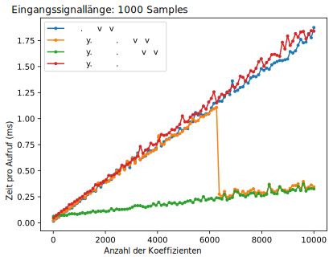

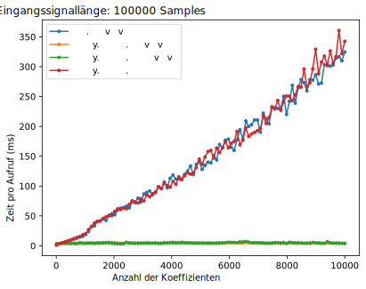

Wie du sehen kannst, wechselt :code:`scipy.signal.convolve` ab einer bestimmten Eingabegröße automatisch zu einer FFT-basierten Methode. So oder so ist :code:`fftconvolve` der klare Gewinner für diese Koeffizienten- und Eingangsgrößen, die in HF-Anwendungen recht typisch sind. Viel Code in PySDR verwendet tatsächlich :code:`np.convolve`, einfach weil es einen Import weniger ist und der Leistungsunterschied bei niedrigen Datenraten oder Nicht-Echtzeit-Anwendungen vernachlässigbar ist.

Schließlich zeigen wir die Ausgabe im Frequenzbereich, damit wir endlich überprüfen können, ob die firwin2-Methode uns einen Filter gegeben hat, der unseren Entwurfsparametern entspricht. Ausgehend vom obigen Code, der uns :code:`h2` geliefert hat:

.. code-block:: python

    # Signal aus Gaußschem Rauschen simulieren
    N = 100000 # Signallänge
    x = np.random.randn(N) + 1j * np.random.randn(N) # komplexes Signal

    # PSD des Eingangssignals speichern
    PSD_input = 10*np.log10(np.fft.fftshift(np.abs(np.fft.fft(x))**2)/len(x))

    # Filter anwenden
    x = fftconvolve(x, h2, 'same')

    # PSD des Ausgangssignals betrachten
    PSD_output = 10*np.log10(np.fft.fftshift(np.abs(np.fft.fft(x))**2)/len(x))
    f = np.linspace(-sample_rate/2/1e6, sample_rate/2/1e6, len(PSD_output))
    plt.plot(f, PSD_input, alpha=0.8)
    plt.plot(f, PSD_output, alpha=0.8)
    plt.xlabel('Frequenz [MHz]')
    plt.ylabel('PSD [dB]')
    plt.axis([sample_rate/-2/1e6, sample_rate/2/1e6, -40, 20])
    plt.legend(['Eingang', 'Ausgang'], loc=1)
    plt.grid()
    plt.savefig('../_images/fftconvolve.svg', bbox_inches='tight')
    plt.show()

Wir können sehen, dass der Bandpassbereich 3 dB niedriger ist als der Tiefpassbereich:

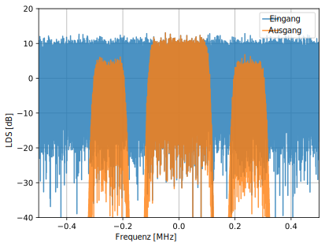

Am Rande gibt es noch eine weitere wenig bekannte Option zum Anwenden des Filters auf ein Signal, namens :code:`scipy.signal.filtfilt`, die „Nullphasenfilterung" durchführt. Sie hilft dabei, Merkmale in einem gefilterten Zeitwellenform genau dort zu erhalten, wo sie im ungefilterten Signal auftreten. Sie tut dies, indem sie die Filterkoeffizienten zweimal anwendet, zuerst in Vorwärtsrichtung und dann in Rückwärtsrichtung. Der Frequenzgang ist also eine quadrierte Version dessen, was man normalerweise erhalten würde. Weitere Informationen findest du unter https://www.mathworks.com/help/signal/ref/filtfilt.html oder https://docs.scipy.org/doc/scipy/reference/generated/scipy.signal.filtfilt.html.

Zustandsbehaftetes Filtern
###########################

Wenn du eine Echtzeit-Anwendung erstellst und die Filterfunktion auf aufeinanderfolgende Blöcke von Samples aufrufen musst, profitierst du davon, dass dein Filter zustandsbehaftet ist. Das bedeutet, du gibst jedem Aufruf Anfangsbedingungen an, die aus der Ausgabe des vorherigen Filteraufrufs stammen. Dies beseitigt Transienten, die entstehen, wenn ein Signal startet und stoppt (schließlich sind die Samples, die du in nachfolgenden Blöcken einspeist, zusammenhängend, vorausgesetzt, deine Anwendung kann mithalten). Der Zustand muss zwischen den Aufrufen gespeichert werden, und er muss auch ganz zu Beginn deines Codes für den ersten Filteraufruf initialisiert werden. Glücklicherweise enthält SciPy :code:`lfilter_zi`, das Anfangsbedingungen für lfilter konstruiert. Unten ist ein Beispiel für die Verarbeitung von Blöcken zusammenhängender Samples mit zustandsbehaftetem Filtern:

.. code-block:: python

    b = taps
    a = 1 # für FIR, aber nicht 1 für IIR
    zi = lfilter_zi(b, a) # Anfangsbedingungen berechnen
    while True:
        samples = sdr.read_samples(num_samples) # Durch die Empfangsfunktion deines SDR ersetzen
        samples_filtered, zi = lfilter(b, a, samples, zi=zi) # Filter anwenden

Tools von Drittanbietern
#########################

Du kannst auch Tools außerhalb von Python verwenden, um einen benutzerdefinierten FIR-Filter zu entwerfen. Für Studenten empfehle ich diese benutzerfreundliche Web-App von Peter Isza, die Impuls- und Frequenzgang anzeigt: http://t-filter.engineerjs.com. Mit den Standardwerten (zumindest zum Zeitpunkt des Schreibens) ist sie so eingerichtet, einen Tiefpassfilter mit einem Durchlassband von 0 bis 400 Hz und einem Sperrband ab 500 Hz zu entwerfen. Die Abtastrate beträgt 2 kHz, sodass die maximale Frequenz, die wir „sehen" können, 1 kHz ist.

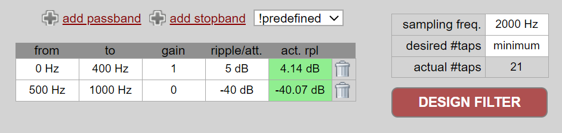

Klicke auf die Schaltfläche „Design Filter", um die Koeffizienten zu erstellen und den Frequenzgang darzustellen.

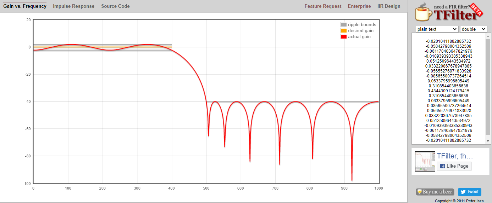

Klicke auf den Text „Impulse Response" über dem Graphen, um die Impulsantwort zu sehen, die eine Darstellung der Koeffizienten ist, da dies ein FIR-Filter ist.

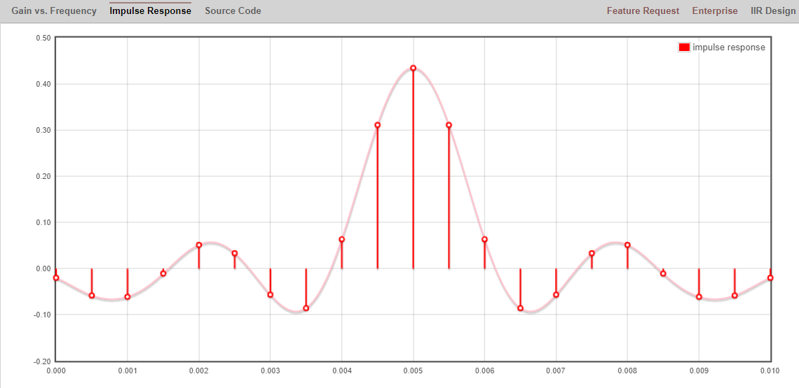

Diese App enthält sogar den C++-Quellcode zur Implementierung und Verwendung dieses Filters. Die Web-App enthält keine Möglichkeit, IIR-Filter zu entwerfen, die im Allgemeinen viel schwieriger zu entwerfen sind.

****************************
Beliebiger Frequenzgang
****************************

Jetzt werden wir eine Möglichkeit betrachten, selbst einen FIR-Filter in Python zu entwerfen, beginnend mit dem gewünschten Frequenzbereichsgang und rückwärts zur Impulsantwort arbeitend. Letztendlich wird unser Filter so dargestellt (durch seine Koeffizienten).

Du beginnst damit, einen Vektor deines gewünschten Frequenzgangs zu erstellen. Lass uns einen willkürlich geformten Tiefpassfilter entwerfen, der unten gezeigt wird:

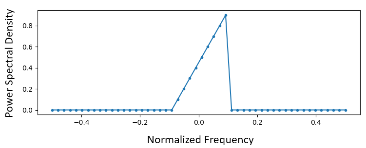

Der Code zur Erstellung dieses Filters ist recht einfach:

.. code-block:: python

    import numpy as np
    import matplotlib.pyplot as plt
    H = np.hstack((np.zeros(20), np.arange(10)/10, np.zeros(20)))
    w = np.linspace(-0.5, 0.5, 50)
    plt.plot(w, H, '.-')
    plt.show()

:code:`hstack()` ist eine Möglichkeit, Arrays in numpy zu verketten. Wir wissen, dass es zu einem Filter mit komplexen Koeffizienten führen wird. Warum?

.. raw:: html

   

   
Antwort

Es ist nicht symmetrisch um 0 Hz.

.. raw:: html

   

Unser Endziel ist es, die Koeffizienten dieses Filters zu finden, damit wir ihn tatsächlich verwenden können. Wie erhalten wir die Koeffizienten aus dem Frequenzgang? Nun, wie konvertieren wir vom Frequenzbereich zurück in den Zeitbereich? Inverse FFT (IFFT)! Erinnere dich, dass die IFFT-Funktion fast genau dieselbe wie die FFT-Funktion ist. Wir müssen auch unseren gewünschten Frequenzgang vor der IFFT mit IFFTshift verschieben, und dann nach der IFFT noch einmal einen IFFTshift anwenden (nein, sie heben sich nicht gegenseitig auf, du kannst es versuchen). Dieser Prozess mag verwirrend erscheinen. Erinnere dich einfach, dass du immer nach einer FFT einen FFTshift und nach einer IFFT einen IFFTshift anwenden solltest.

.. code-block:: python

    h = np.fft.ifftshift(np.fft.ifft(np.fft.ifftshift(H)))
    plt.plot(np.real(h))
    plt.plot(np.imag(h))
    plt.legend(['real','imag'], loc=1)
    plt.show()

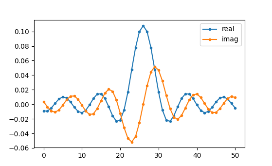

Wir verwenden diese oben gezeigten Koeffizienten als unseren Filter. Wir wissen, dass die Impulsantwort die Koeffizienten darstellt, also ist das, was wir oben sehen, *unsere* Impulsantwort. Lass uns die FFT unserer Koeffizienten nehmen, um zu sehen, wie der Frequenzbereich tatsächlich aussieht. Wir führen eine 1.024-Punkt-FFT durch, um eine hohe Auflösung zu erhalten:

.. code-block:: python

    H_fft = np.fft.fftshift(np.abs(np.fft.fft(h, 1024)))
    plt.plot(H_fft)
    plt.show()

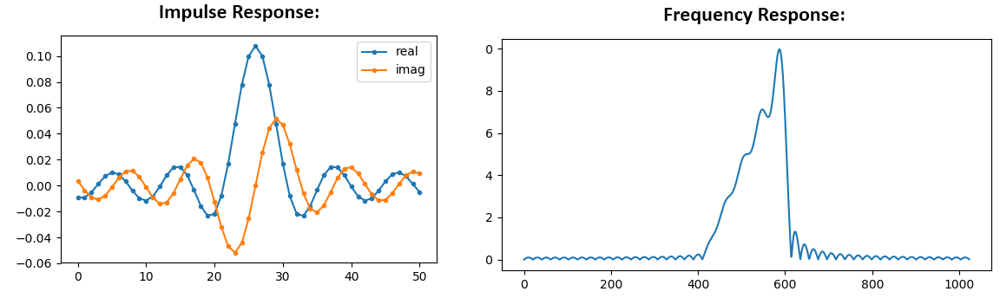

Sieh, wie der Frequenzgang nicht sehr gerade ist... er entspricht nicht sehr gut unserem Original, wenn du dich an die Form erinnerst, für die wir ursprünglich einen Filter erstellen wollten. Ein Hauptgrund ist, dass unsere Impulsantwort noch nicht zu Ende abgeklungen ist, d.h. linke und rechte Seiten erreichen nicht null. Wir haben zwei Möglichkeiten, damit sie auf null abklingt:

**Option 1:** Wir „fenstern" unsere aktuelle Impulsantwort, sodass sie auf beiden Seiten auf 0 abklingt. Es beinhaltet die Multiplikation unserer Impulsantwort mit einer „Fensterfunktion", die bei null beginnt und endet.

.. code-block:: python

    # Nach dem Erstellen von h mit dem vorherigen Code, Fenster erstellen und anwenden
    window = np.hamming(len(h))
    h = h * window

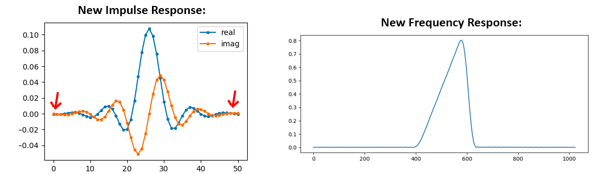

**Option 2:** Wir regenerieren unsere Impulsantwort mit mehr Punkten, sodass sie Zeit hat abzuklingen. Wir müssen unsere ursprünglichen Frequenzbereichsarray (Interpolation) auflösen.

.. code-block:: python

    H = np.hstack((np.zeros(200), np.arange(100)/100, np.zeros(200)))
    w = np.linspace(-0.5, 0.5, 500)
    plt.plot(w, H, '.-')
    plt.show()
    # (der Rest des Codes ist derselbe)

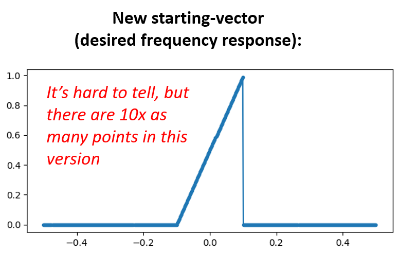

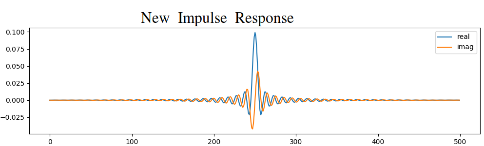

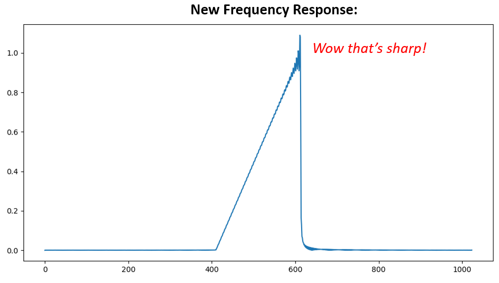

Beide Optionen haben funktioniert. Welche würdest du wählen? Die zweite Methode führte zu mehr Koeffizienten, aber die erste Methode führte zu einem Frequenzgang, der nicht sehr scharf war und dessen Abfallflanke nicht sehr steil war. Es gibt zahlreiche Möglichkeiten, einen Filter zu entwerfen, jede mit ihren eigenen Kompromissen. Viele betrachten Filterdesign als Kunst.

*************************
Einführung in das Pulsformen
*************************

Wir werden kurz ein sehr interessantes Thema in der DSP einführen: das Pulsformen. Wir werden das Thema in einem eigenen Kapitel später ausführlicher behandeln, siehe :ref:`pulse-shaping-chapter`. Es lohnt sich, es neben dem Filtern zu erwähnen, da Pulsformen letztendlich eine Art Filter ist, der für einen bestimmten Zweck mit besonderen Eigenschaften verwendet wird.

Wie wir gelernt haben, verwenden digitale Signale Symbole, um ein oder mehrere Bits an Information darzustellen. Wir verwenden ein digitales Modulationsschema wie ASK, PSK, QAM, FSK usw., um einen Träger zu modulieren, damit Informationen drahtlos gesendet werden können. Als wir QPSK im Kapitel :ref:`modulation-chapter` simulierten, simulierten wir nur ein Sample pro Symbol, d.h. jede komplexe Zahl, die wir erstellt haben, war einer der Punkte auf dem Konstellationsdiagramm — es war ein Symbol. In der Praxis generieren wir normalerweise mehrere Samples pro Symbol, und der Grund hat mit Filterung zu tun.

Wir verwenden Filter, um die „Form" unserer Symbole zu gestalten, weil die Form im Zeitbereich die Form im Frequenzbereich ändert. Der Frequenzbereich informiert uns darüber, wie viel Spektrum/Bandbreite unser Signal verwendet, und wir wollen es normalerweise minimieren. Es ist wichtig zu verstehen, dass sich die spektralen Eigenschaften (Frequenzbereich) der Basisbandsymbole nicht ändern, wenn wir einen Träger modulieren; es verschiebt das Basisband nur im Frequenzbereich nach oben, während die Form gleich bleibt, was bedeutet, dass die verwendete Bandbreite gleich bleibt. Wenn wir 1 Sample pro Symbol verwenden, ist es wie das Senden von Rechteckimpulsen. Tatsächlich ist BPSK mit 1 Sample pro Symbol *nur* eine Rechteckwelle aus zufälligen 1en und -1en:

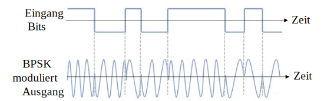

Und wie wir gelernt haben, sind Rechteckimpulse nicht effizient, weil sie eine übermäßige Menge an Spektrum verwenden:

.. image:: ../_images_de/square-wave.svg
   :align: center

Also „pulsformen" wir diese blockartigen Symbole, damit sie im Frequenzbereich weniger Bandbreite belegen. Wir „pulsformen" durch die Verwendung eines Tiefpassfilters, weil er die höherfrequenten Komponenten unserer Symbole verwirft. Unten ist ein Beispiel für Symbole im Zeit- (oben) und Frequenzbereich (unten), vor und nach der Anwendung eines Pulsformungsfilters:

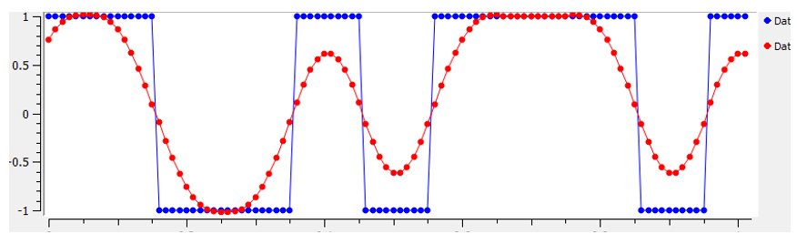

|

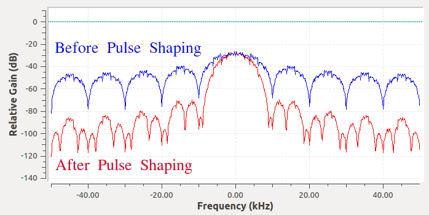

Beachte, wie viel schneller das Signal im Frequenzbereich abfällt. Die Nebenzipfel sind nach der Pulsformung ~30 dB niedriger; das ist 1.000-fach weniger! Und noch wichtiger: Die Hauptkeule ist schmaler, sodass für dieselbe Anzahl von Bits pro Sekunde weniger Spektrum genutzt wird.

Für jetzt solltest du wissen, dass gängige Pulsformungsfilter folgende sind:

1. Raised-Cosine-Filter
2. Wurzel-Raised-Cosine-Filter
3. Sinc-Filter
4. Gaußscher Filter

Diese Filter haben im Allgemeinen einen Parameter, den du anpassen kannst, um die verwendete Bandbreite zu verringern. Unten wird der Zeit- und Frequenzbereich eines Raised-Cosine-Filters mit verschiedenen Werten von :math:`\beta` gezeigt, dem Parameter, der definiert, wie steil der Abfall ist.

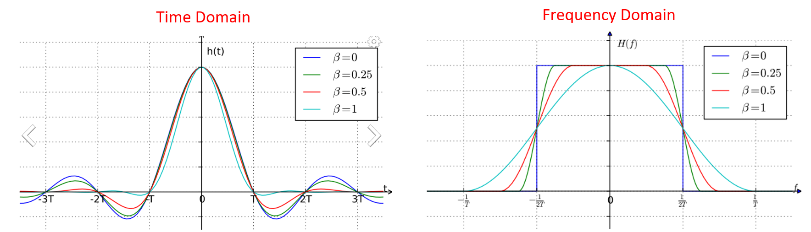

Du kannst sehen, dass ein niedrigerer Wert von :math:`\beta` das verwendete Spektrum reduziert (für dieselbe Datenmenge). Wenn der Wert jedoch zu niedrig ist, dauert es länger, bis die Zeitbereichssymbole auf null abklingen. Tatsächlich klingen die Symbole bei :math:`\beta=0` nie vollständig auf null ab, was bedeutet, dass wir solche Symbole in der Praxis nicht übertragen können. Ein :math:`\beta`-Wert von etwa 0,35 ist üblich.

Du wirst im Kapitel :ref:`pulse-shaping-chapter` noch viel mehr über Pulsformen lernen, einschließlich einiger besonderer Eigenschaften, die Pulsformungsfilter erfüllen müssen.
