.. _freq-domain-chapter:

#####################
Frequenzbereich
#####################

Dieses Kapitel führt den Frequenzbereich ein und behandelt Fourier-Reihen, Fourier-Transformation, Fourier-Eigenschaften, FFT, Fensterfunktionen und Spektrogramme anhand von Python-Beispielen.

Einer der coolsten Nebeneffekte beim Erlernen von DSP und drahtloser Kommunikation ist, dass du auch lernst, im Frequenzbereich zu denken. Die meiste Erfahrung der Menschen beim *Arbeiten* im Frequenzbereich beschränkt sich auf das Einstellen der Bass-/Mitten-/Höhen-Regler im Audiosystem eines Autos. Die meiste Erfahrung beim *Betrachten* von etwas im Frequenzbereich beschränkt sich auf das Sehen eines Audio-Equalizers, wie in diesem Clip:

Am Ende dieses Kapitels wirst du verstehen, was der Frequenzbereich wirklich bedeutet, wie man zwischen Zeit und Frequenz konvertiert (und was dabei passiert), und einige interessante Prinzipien, die wir in unserem gesamten Studium von DSP und SDR verwenden werden. Am Ende dieses Lehrbuchs wirst du garantiert ein Meister im Arbeiten im Frequenzbereich sein!

Zunächst: Warum schauen wir uns Signale gerne im Frequenzbereich an? Hier sind zwei Beispielsignale, sowohl im Zeit- als auch im Frequenzbereich dargestellt.

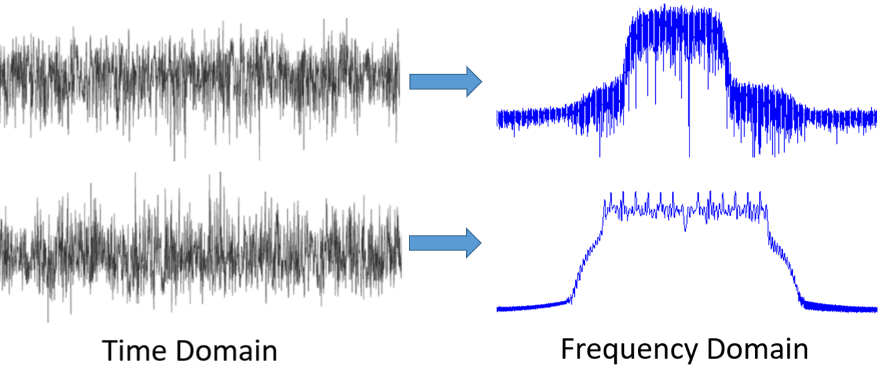

Wie du siehst, sehen sie im Zeitbereich beide irgendwie wie Rauschen aus, aber im Frequenzbereich können wir verschiedene Merkmale erkennen. Alles befindet sich in seiner natürlichen Form im Zeitbereich; wenn wir Signale abtasten, werden wir sie im Zeitbereich abtasten, weil man ein Signal nicht *direkt* im Frequenzbereich abtasten kann. Aber das Interessante passiert normalerweise im Frequenzbereich.

***************
Fourier-Reihe
***************

Die Grundlagen des Frequenzbereichs beginnen mit dem Verständnis, dass jedes Signal als Summe von Sinuswellen dargestellt werden kann. Wenn wir ein Signal in seine zusammensetzenden Sinuswellen zerlegen, nennen wir das eine Fourier-Reihe. Hier ist ein Beispiel für ein Signal, das nur aus zwei Sinuswellen besteht:

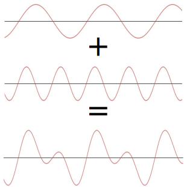

Hier ist ein weiteres Beispiel; die rote Kurve unten approximiert eine Sägezahnwelle durch Summierung von bis zu 10 Sinuswellen. Wir können sehen, dass es keine perfekte Rekonstruktion ist – es würde eine unendliche Anzahl von Sinuswellen benötigen, um diese Sägezahnwelle aufgrund der scharfen Übergänge zu reproduzieren:

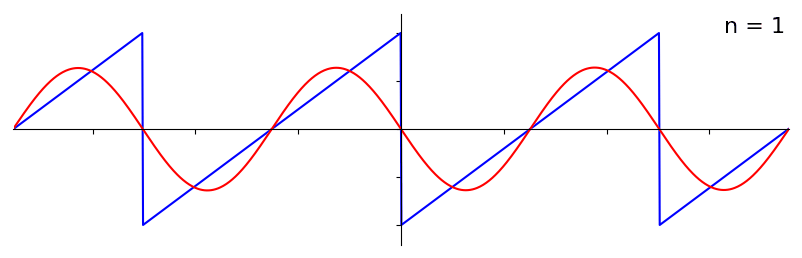

Einige Signale benötigen mehr Sinuswellen als andere, und einige benötigen eine unendliche Anzahl, obwohl sie immer mit einer begrenzten Anzahl approximiert werden können. Hier ist ein weiteres Beispiel für ein Signal, das in eine Reihe von Sinuswellen zerlegt wird:

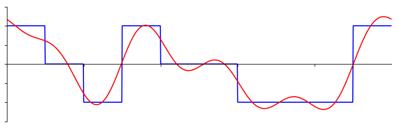

Um zu verstehen, wie wir ein Signal in Sinuswellen oder Sinusoide zerlegen können, müssen wir zunächst die drei Attribute einer Sinuswelle wiederholen:

#. Amplitude
#. Frequenz
#. Phase

**Amplitude** gibt die „Stärke" der Welle an, während **Frequenz** die Anzahl der Wellen pro Sekunde ist. **Phase** wird verwendet, um darzustellen, wie die Sinuswelle in der Zeit verschoben ist, von 0 bis 360 Grad (oder 0 bis :math:`2\pi`), aber sie muss relativ zu etwas sein, um eine Bedeutung zu haben, z. B. zwei Signale mit der gleichen Frequenz, die 30 Grad außer Phase zueinander sind.

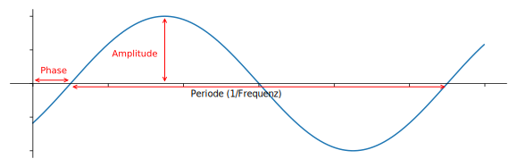

An diesem Punkt hast du vielleicht erkannt, dass ein „Signal" im Wesentlichen nur eine Funktion ist, die normalerweise „über die Zeit" dargestellt wird (d. h. die x-Achse). Ein weiteres Attribut, das leicht zu merken ist, ist die **Periode**, die die Umkehrung der **Frequenz** ist. Die **Periode** eines Sinusoids ist die Zeitspanne in Sekunden, die die Welle benötigt, um einen Zyklus abzuschließen. Daher ist die Einheit der Frequenz 1/Sekunden oder Hz.

Wenn wir ein Signal in eine Summe von Sinuswellen zerlegen, hat jede eine bestimmte **Amplitude**, **Phase** und **Frequenz**. Die **Amplitude** jeder Sinuswelle sagt uns, wie stark die **Frequenz** im ursprünglichen Signal vorhanden war. Mach dir im Moment nicht zu viele Gedanken über die **Phase**, außer dass du erkennst, dass der einzige Unterschied zwischen sin() und cos() eine Phasenverschiebung (Zeitverschiebung) ist.

Es ist wichtiger, das zugrundeliegende Konzept zu verstehen als die eigentlichen Gleichungen zur Lösung einer Fourier-Reihe, aber für diejenigen, die an den Gleichungen interessiert sind, verweise ich auf Wolframs prägnante Erklärung: https://mathworld.wolfram.com/FourierSeries.html.

********************
Zeit-Frequenz-Paare
********************

Wir haben festgestellt, dass Signale als Sinuswellen dargestellt werden können, die mehrere Attribute haben. Lass uns nun lernen, Signale im Frequenzbereich darzustellen. Während der Zeitbereich zeigt, wie ein Signal sich über die Zeit verändert, zeigt der Frequenzbereich, wie viel eines Signals in welchen Frequenzen steckt. Statt dass die x-Achse die Zeit ist, ist sie nun die Frequenz. Wir können ein gegebenes Signal sowohl im Zeit- *als auch* im Frequenzbereich darstellen. Schauen wir uns einige einfache Beispiele an.

Hier sieht eine Sinuswelle mit Frequenz f im Zeit- und Frequenzbereich aus:

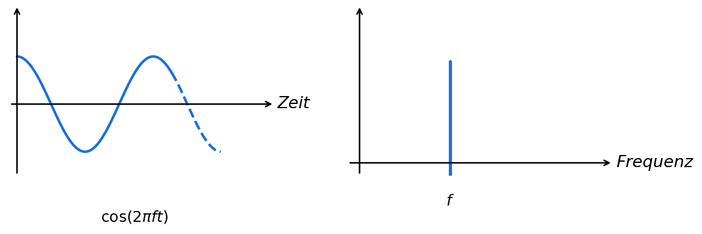

Der Zeitbereich sollte sehr vertraut aussehen. Es ist eine oszillierende Funktion. Mach dir keine Sorgen darüber, an welchem Punkt im Zyklus es beginnt oder wie lange es dauert. Die wichtigste Erkenntnis ist, dass das Signal eine **einzelne Frequenz** hat, weshalb wir im Frequenzbereich eine einzelne Spitze sehen. Bei welcher Frequenz diese Sinuswelle auch immer schwingt, dort werden wir die Spitze im Frequenzbereich sehen. Der mathematische Name für eine solche Spitze wird „Impuls" genannt.

Was passiert nun, wenn wir einen Impuls im Zeitbereich haben? Stell dir eine Tonaufnahme vor, bei der jemand in die Hände klatscht oder einen Nagel mit einem Hammer schlägt. Dieses Zeit-Frequenz-Paar ist etwas weniger intuitiv.

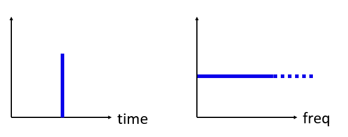

Wie wir sehen können, ist eine Spitze/ein Impuls im Zeitbereich im Frequenzbereich flach und enthält theoretisch jede Frequenz. Es gibt keinen theoretisch perfekten Impuls, da er im Zeitbereich unendlich kurz sein müsste. Wie die Sinuswelle spielt es keine Rolle, wo im Zeitbereich der Impuls auftritt. Die wichtigste Erkenntnis hier ist, dass schnelle Änderungen im Zeitbereich zu vielen auftretenden Frequenzen führen.

Als nächstes schauen wir uns die Zeit- und Frequenzbereichsdarstellungen einer Rechteckwelle an:

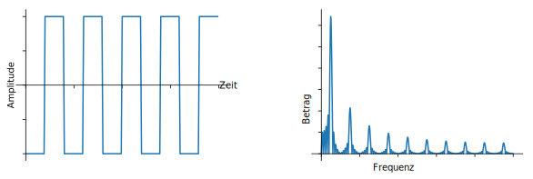

Auch dies ist weniger intuitiv, aber wir können sehen, dass der Frequenzbereich eine starke Spitze hat, die zufällig bei der Frequenz der Rechteckwelle liegt, aber es gibt mehr Spitzen, wenn wir in höhere Frequenzen gehen. Dies liegt an der schnellen Änderung im Zeitbereich, genau wie im vorherigen Beispiel. Aber es ist nicht flach in der Frequenz. Es hat Spitzen in Abständen, und der Pegel nimmt langsam ab (obwohl er für immer weitergeht). Eine Rechteckwelle im Zeitbereich hat ein sin(x)/x-Muster im Frequenzbereich (a.k.a. die Sinc-Funktion).

Was passiert, wenn wir ein konstantes Signal im Zeitbereich haben? Ein konstantes Signal hat keine „Frequenz". Schauen wir mal:

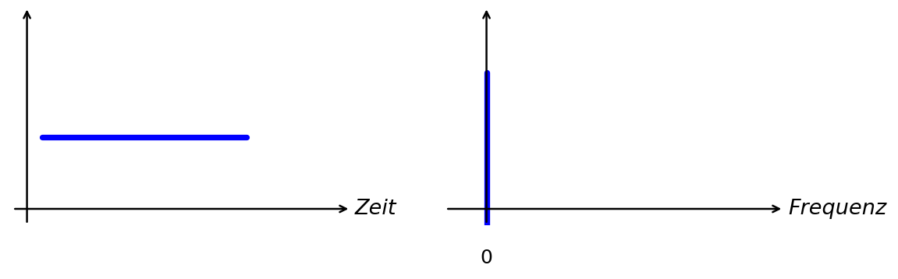

Da es im konstantes Signal im Zeitbereich keine Frequenz gibt, haben wir im Frequenzbereich eine Spitze bei 0 Hz. Das macht Sinn, wenn man darüber nachdenkt. Der Frequenzbereich wird nicht „leer" sein, weil das nur passiert, wenn kein Signal vorhanden ist (d.h. Zeitbereich von 0en). Wir nennen 0 Hz im Frequenzbereich „DC", weil es durch ein DC-Signal in der Zeit verursacht wird (ein konstantes Signal, das sich nicht ändert). Beachte, dass wenn wir die Amplitude unseres DC-Signals im Zeitbereich erhöhen, die Spitze bei 0 Hz im Frequenzbereich ebenfalls zunimmt.

Später werden wir lernen, was genau die y-Achse im Frequenzbereichsdiagramm bedeutet, aber im Moment kannst du es dir als eine Art Amplitude vorstellen, die dir sagt, wie viel von dieser Frequenz im Zeitbereichssignal vorhanden war.

*****************
Fourier-Transformation
*****************

Mathematisch wird die „Transformation", die wir verwenden, um vom Zeitbereich in den Frequenzbereich und zurück zu gehen, als Fourier-Transformation bezeichnet. Sie ist wie folgt definiert:

.. math::
   X(f) = \int x(t) e^{-j2\pi ft} dt

Für ein Signal :math:`x(t)` können wir die Frequenzbereichsversion :math:`X(f)` mit dieser Formel erhalten. Wir werden die Zeitbereichsversion einer Funktion mit :math:`x(t)` oder :math:`y(t)` darstellen und die entsprechende Frequenzbereichsversion mit :math:`X(f)` und :math:`Y(f)`. Beachte das :math:`t` für Zeit und :math:`f` für Frequenz. Das :math:`j` ist einfach die imaginäre Einheit; du hast sie vielleicht als :math:`i` im Mathematikunterricht gesehen. In der Ingenieurwissenschaft und Informatik verwenden wir „j", weil „i" oft auf Strom verweist, und in der Programmierung wird es oft als Iterator verwendet.

Die Rückkehr vom Frequenzbereich in den Zeitbereich ist fast dasselbe, abgesehen von einem negativen Vorzeichen:

.. math::
   x(t) = \int X(f) e^{j2\pi ft} df

Beachte, dass viele Lehrbücher und andere Ressourcen :math:`w` anstelle von :math:`2\pi f` verwenden, wobei :math:`w` die Winkelfrequenz in Radiant pro Sekunde ist, während :math:`f` in Hz ist. Alles, was du wissen musst, ist:

.. math::
   \omega = 2 \pi f

Auch wenn es einen :math:`2 \pi`-Term zu vielen Gleichungen hinzufügt, ist es einfacher, bei Frequenz in Hz zu bleiben, da wir in Hz bei den meisten SDR- und HF-Signalverarbeitungsanwendungen arbeiten.

Die obige Gleichung für die Fourier-Transformation ist die kontinuierliche Form, die du nur in mathematischen Problemen sehen wirst. Die diskrete Form ist viel näher an dem, was im Code implementiert wird:

.. math::
   X_k = \sum_{n=0}^{N-1} x_n e^{-\frac{j2\pi}{N}kn}

Beachte, dass der Hauptunterschied darin besteht, dass wir das Integral durch eine Summation ersetzt haben. Der Index :math:`k` geht von 0 bis N-1.

Es ist OK, wenn keine dieser Gleichungen viel für dich bedeutet. Wir müssen sie eigentlich nicht direkt verwenden, um coole Sachen mit DSP und SDRs zu machen!

*************************
Zeit-Frequenz-Eigenschaften
*************************

Früher haben wir uns Beispiele angeschaut, wie Signale im Zeit- und Frequenzbereich aussehen. Jetzt werden wir fünf wichtige „Fourier-Eigenschaften" behandeln. Dies sind Eigenschaften, die uns sagen: Wenn wir ____ mit unserem Zeitbereichssignal machen, dann passiert ____ mit unserem Frequenzbereichssignal. Sie geben uns einen wichtigen Einblick in die Art der digitalen Signalverarbeitung (DSP), die wir in der Praxis an Zeitbereichssignalen durchführen werden.

1. Linearitätseigenschaft:

.. math::
   a x(t) + b y(t) \leftrightarrow a X(f) + b Y(f)

Diese Eigenschaft ist wahrscheinlich die einfachste zu verstehen. Wenn wir zwei Signale in der Zeit addieren, wird die Frequenzbereichsversion ebenfalls die beiden addierten Frequenzbereichssignale sein. Es sagt uns auch, dass wenn wir eines davon mit einem Skalierungsfaktor multiplizieren, der Frequenzbereich ebenfalls um denselben Betrag skaliert wird. Der Nutzen dieser Eigenschaft wird deutlicher, wenn wir mehrere Signale zusammenaddieren.

2. Frequenzverschiebungseigenschaft:

.. math::
   e^{2 \pi j f_0 t}x(t) \leftrightarrow X(f-f_0)

Der Term links von x(t) ist das, was wir einen „komplexen Sinus" oder „komplexen Exponential" nennen. Im Moment müssen wir nur wissen, dass es im Wesentlichen nur eine Sinuswelle bei Frequenz :math:`f_0` ist. Diese Eigenschaft sagt uns, dass wenn wir ein Signal :math:`x(t)` nehmen und es mit einer Sinuswelle multiplizieren, wir im Frequenzbereich :math:`X(f)` erhalten, das jedoch um eine bestimmte Frequenz :math:`f_0` verschoben ist. Diese Frequenzverschiebung lässt sich leichter visualisieren:

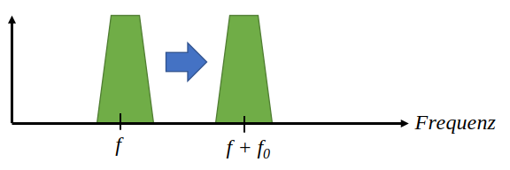

Frequenzverschiebung ist ein wesentlicher Bestandteil von DSP, da wir Signale aus vielen Gründen in der Frequenz nach oben und unten verschieben wollen. Diese Eigenschaft sagt uns, wie das geht (mit einer Sinuswelle multiplizieren). Hier ist eine weitere Möglichkeit, diese Eigenschaft zu visualisieren:

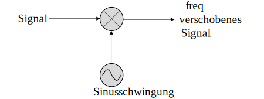

3. Zeitskalierungseigenschaft:

.. math::
   x(at) \leftrightarrow X\left(\frac{f}{a}\right)

Auf der linken Seite der Gleichung sehen wir, dass wir unser Signal x(t) im Zeitbereich skalieren. Hier ist ein Beispiel für ein Signal, das in der Zeit skaliert wird, und dann was mit den Frequenzbereichsversionen passiert.

Skalierung in der Zeit schrumpft oder dehnt das Signal im Wesentlichen auf der x-Achse. Was uns diese Eigenschaft sagt, ist, dass die Skalierung im Zeitbereich eine umgekehrte Skalierung im Frequenzbereich verursacht. Wenn wir zum Beispiel Bits schneller übertragen, müssen wir mehr Bandbreite verwenden. Die Eigenschaft hilft zu erklären, warum Signale mit höherer Datenrate mehr Bandbreite/Spektrum belegen. Wenn Zeit-Frequenz-Skalierung proportional statt umgekehrt proportional wäre, könnten Mobilfunkanbieter so viele Bits pro Sekunde übertragen, wie sie wollten, ohne Milliarden für das Spektrum zu bezahlen! Leider ist das nicht der Fall.

Diejenigen, die mit dieser Eigenschaft bereits vertraut sind, werden möglicherweise einen fehlenden Skalierungsfaktor bemerken; er wird der Einfachheit halber weggelassen. Für praktische Zwecke macht es keinen Unterschied.

4. Faltungseigenschaft im Zeitbereich:

.. math::
   \int x(\tau) y(t-\tau) d\tau  \leftrightarrow X(f)Y(f)

Es wird die Faltungseigenschaft genannt, weil wir im Zeitbereich x(t) und y(t) falten. Du weißt vielleicht noch nichts über die Faltungsoperation, also stell sie dir im Moment wie eine Kreuzkorrelation vor, obwohl wir in :ref:`diesem Abschnitt <convolution-section>` tiefer in Faltungen eintauchen werden. Wenn wir Zeitbereichssignale falten, ist das äquivalent zur Multiplikation der Frequenzbereichsversionen dieser beiden Signale. Es ist sehr verschieden von der Addition zweier Signale. Wenn du zwei Signale addierst, passiert, wie wir gesehen haben, nichts Besonderes; du addierst einfach die Frequenzbereichsversion. Aber wenn du zwei Signale faltest, ist es wie das Erstellen eines neuen dritten Signals aus ihnen. Faltung ist die einzeln wichtigste Technik in DSP, obwohl wir zuerst verstehen müssen, wie Filter funktionieren, um sie vollständig zu begreifen.

Bevor wir weitermachen, um kurz zu erklären, warum diese Eigenschaft so wichtig ist, betrachte diese Situation: Du hast ein Signal, das du empfangen möchtest, und es gibt ein störendes Signal daneben.

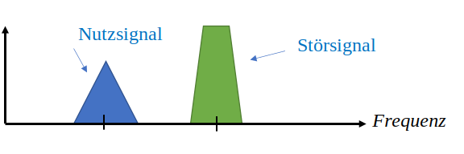

Das Konzept der Maskierung wird in der Programmierung häufig verwendet, also lass es uns hier verwenden. Was wäre, wenn wir die folgende Maske erstellen und sie mit dem Signal oben multiplizieren könnten, um das unerwünschte herauszufiltern?

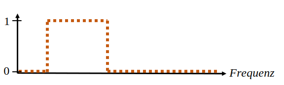

Wir führen DSP-Operationen normalerweise im Zeitbereich durch, also nutzen wir die Faltungseigenschaft, um zu sehen, wie wir diese Maskierung im Zeitbereich durchführen können. Sagen wir, x(t) ist unser empfangenes Signal. Sei Y(f) die Maske, die wir im Frequenzbereich anwenden wollen. Das bedeutet, y(t) ist die Zeitbereichsdarstellung unserer Maske, und wenn wir sie mit x(t) falten, können wir das unerwünschte Signal „herausfiltern".

.. tikz:: [font=\Large\bfseries\sffamily]
   \definecolor{babyblueeyes}{rgb}{0.36, 0.61, 0.83}
   \draw (0,0) node[align=center,babyblueeyes]           {E.g., our received signal};
   \draw (0,-4) node[below, align=center,babyblueeyes]   {E.g., the mask};
   \draw (0,-2) node[align=center,scale=2]{$\int x(\tau)y(t-\tau)d\tau \leftrightarrow X(f)Y(f)$};
   \draw[->,babyblueeyes,thick] (-4,0) -- (-5.5,-1.2);
   \draw[->,babyblueeyes,thick] (2.5,-0.5) -- (3,-1.3);
   \draw[->,babyblueeyes,thick] (-2.5,-4) -- (-3.8,-2.8);
   \draw[->,babyblueeyes,thick] (3,-4) -- (5.2,-2.8);
   :xscale: 70

Wenn wir über Filterung sprechen, wird die Faltungseigenschaft mehr Sinn ergeben.

5. Faltungseigenschaft im Frequenzbereich:

Zuletzt möchte ich darauf hinweisen, dass die Faltungseigenschaft auch umgekehrt funktioniert, obwohl wir sie nicht so häufig wie die Zeitbereichsfaltung verwenden werden:

.. math::
   x(t)y(t)  \leftrightarrow  \int X(g) Y(f-g) dg

Es gibt andere Eigenschaften, aber die obigen fünf sind meiner Meinung nach die wichtigsten zu verstehen. Auch wenn wir den Beweis für jede Eigenschaft nicht durchgegangen sind, benutzen wir die mathematischen Eigenschaften, um Einblick zu gewinnen, was mit realen Signalen passiert, wenn wir Analyse und Verarbeitung durchführen. Lass dich nicht von den Gleichungen ablenken. Stelle sicher, dass du die Beschreibung jeder Eigenschaft verstehst.

******************************
Schnelle Fourier-Transformation (FFT)
******************************

Zurück zur Fourier-Transformation. Ich habe dir die Gleichung für die diskrete Fourier-Transformation gezeigt, aber was du beim Codieren 99,9 % der Zeit verwenden wirst, ist die FFT-Funktion fft(). Die Fast Fourier Transform (FFT) ist einfach ein Algorithmus zur Berechnung der diskreten Fourier-Transformation. Sie wurde vor Jahrzehnten entwickelt, und obwohl es Variationen bei der Implementierung gibt, ist sie immer noch der führende Algorithmus zur Berechnung einer diskreten Fourier-Transformation. Zum Glück, wenn man bedenkt, dass sie „Fast" (Schnell) im Namen verwendet haben.

Die FFT ist eine Funktion mit einem Eingang und einem Ausgang. Sie konvertiert ein Signal von Zeit in Frequenz:

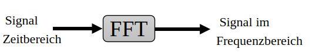

Wir werden in diesem Lehrbuch nur 1D-FFTs behandeln (2D wird für die Bildverarbeitung und andere Anwendungen verwendet). Für unsere Zwecke stell dir die FFT-Funktion als eine Funktion mit einem Eingang vor: ein Vektor von Samples, und einem Ausgang: die Frequenzbereichsversion dieses Vektors von Samples. Die Größe des Ausgangs ist immer gleich der Größe des Eingangs. Wenn ich 1.024 Samples in die FFT eingebe, erhalte ich 1.024 zurück. Der verwirrende Teil ist, dass der Ausgang immer im Frequenzbereich liegt, und daher ändert sich die „Spanne" der x-Achse, wenn wir sie darstellen würden, nicht basierend auf der Anzahl der Samples im Zeitbereichseingang. Visualisieren wir das, indem wir die Eingangs- und Ausgangsarrays zusammen mit den Einheiten ihrer Indizes betrachten:

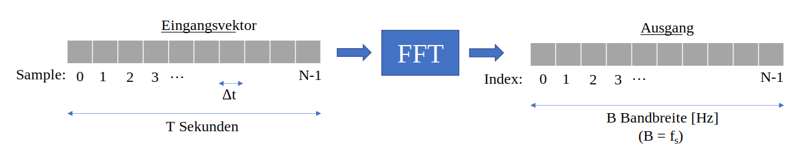

Da der Ausgang im Frequenzbereich liegt, basiert die Spanne der x-Achse auf der Abtastrate, die wir im nächsten Kapitel behandeln werden. Wenn wir mehr Samples für den Eingangsvektor verwenden, erhalten wir eine bessere Auflösung im Frequenzbereich (zusätzlich zur Verarbeitung von mehr Samples auf einmal). Wir „sehen" durch einen größeren Eingang nicht wirklich mehr Frequenzen. Die einzige Möglichkeit wäre, die Abtastrate zu erhöhen (die Abtastperiode :math:`\Delta t` zu verringern).

Wie stellen wir diesen Ausgang tatsächlich dar? Als Beispiel, sagen wir, unsere Abtastrate war 1 Million Samples pro Sekunde (1 MHz). Wie wir im nächsten Kapitel lernen werden, bedeutet das, dass wir unabhängig davon, wie viele Samples wir in die FFT eingeben, nur Signale bis zu 0,5 MHz sehen können. Der Ausgang der FFT wird wie folgt dargestellt:

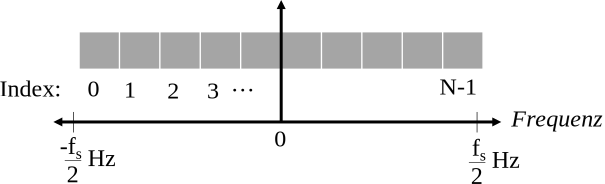

Es ist immer der Fall; der Ausgang der FFT zeigt immer :math:`\text{-} f_s/2` bis :math:`f_s/2`, wobei :math:`f_s` die Abtastrate ist. D.h., der Ausgang wird immer einen negativen und einen positiven Teil haben. Wenn der Eingang komplex ist, werden die negativen und positiven Teile unterschiedlich sein, aber wenn er real ist, werden sie identisch sein.

Bezüglich des Frequenzintervalls entspricht jeder Bin :math:`f_s/N` Hz, d.h. das Eingeben von mehr Samples in jede FFT führt zu einer feineren Auflösung im Ausgang. Ein sehr kleines Detail, das ignoriert werden kann, wenn du neu bist: mathematisch entspricht der letzte Index nicht *genau* :math:`f_s/2`, sondern :math:`f_s/2 - f_s/N`, was für ein großes :math:`N` ungefähr :math:`f_s/2` sein wird.

********************
Negative Frequenzen
********************

Was zum Teufel ist eine negative Frequenz? Im Moment musst du nur wissen, dass sie mit der Verwendung komplexer Zahlen (imaginäre Zahlen) zusammenhängen – es gibt eigentlich keine „negative Frequenz" beim Senden/Empfangen von HF-Signalen, es ist nur eine Darstellung, die wir verwenden. Hier ist eine intuitive Möglichkeit, darüber nachzudenken. Stell dir vor, wir sagen unserem SDR, es soll auf 100 MHz (das UKW-Radio-Band) abstimmen und mit einer Rate von 10 MHz abtasten. Mit anderen Worten, wir werden das Spektrum von 95 MHz bis 105 MHz betrachten. Vielleicht gibt es drei Signale:

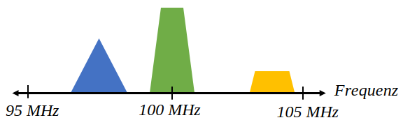

Wenn das SDR uns nun die Samples gibt, wird es so aussehen:

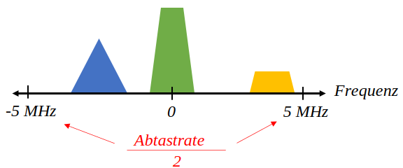

Denk daran, dass wir das SDR auf 100 MHz abgestimmt haben. Das Signal, das bei etwa 97,5 MHz war, erscheint also bei -2,5 MHz, wenn wir es digital darstellen, was technisch gesehen eine negative Frequenz ist. In Wirklichkeit ist es nur eine Frequenz, die niedriger als die Mittenfrequenz ist. Das wird mehr Sinn ergeben, wenn wir mehr über Sampling lernen und Erfahrung mit unseren SDRs sammeln.

Aus mathematischer Sicht können negative Frequenzen durch Betrachtung der komplexen Exponentialfunktion :math:`e^{2j \pi f t}` gesehen werden. Wenn wir eine negative Frequenz haben, können wir sehen, dass es ein komplexer Sinus ist, der sich in die entgegengesetzte Richtung dreht.

.. math::
   e^{2j \pi f t} = \cos(2 \pi f t) + j \sin(2 \pi f t) \quad \mathrm{\textcolor{blue}{blau}}

.. math::
   e^{2j \pi (-f) t} = \cos(2 \pi f t) - j \sin(2 \pi f t) \quad \mathrm{\textcolor{red}{rot}}

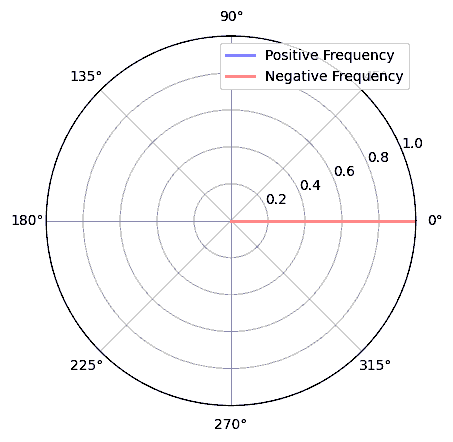

Der Grund, warum wir den komplexen Exponential oben verwendet haben, ist, dass ein einfaches :math:`cos()` oder :math:`sin()` sowohl positive als auch negative Frequenzen enthält, wie durch die Euler-Formel angewendet auf einen Sinus bei Frequenz :math:`f` über die Zeit :math:`t` zu sehen ist:

.. math::
   \cos(2 \pi f t) = \underbrace{\frac{1}{2} e^{2j \pi f t}}_\text{positiv} + \underbrace{\frac{1}{2} e^{-2j \pi f t}}_\text{negativ}

.. math::
   \sin(2 \pi f t) = \underbrace{\frac{1}{2j} e^{2j \pi f t}}_\text{positiv} - \underbrace{\frac{1}{2j} e^{-2j \pi f t}}_\text{negativ}

In der HF-Signalverarbeitung neigen wir daher dazu, im Allgemeinen komplexe Exponentialfunktionen anstelle von Cosinus und Sinus zu verwenden.

****************************
Reihenfolge in der Zeit spielt keine Rolle
****************************

Denk daran, dass eine FFT auf vielen Samples gleichzeitig durchgeführt wird, d.h., du kannst den Frequenzbereich eines einzelnen Zeitpunkts (eines Samples) nicht beobachten; es braucht eine Zeitspanne, um damit zu arbeiten (viele Samples). Die FFT-Funktion „mischt" im Wesentlichen das Eingangssignal, um den Ausgang zu bilden, der eine andere Skala und andere Einheiten hat. Wir sind schließlich nicht mehr im Zeitbereich. Eine gute Möglichkeit, diesen Unterschied zwischen den Bereichen zu internalisieren, ist die Erkenntnis, dass das Ändern der Reihenfolge der Ereignisse im Zeitbereich die Frequenzkomponenten im Signal nicht verändert. D.h., das Durchführen **einer einzigen** FFT der folgenden zwei Signale ergibt beide dieselben zwei Spitzen, weil das Signal einfach zwei Sinuswellen bei verschiedenen Frequenzen sind. Das Ändern der Reihenfolge, in der die Sinuswellen auftreten, ändert nicht die Tatsache, dass es zwei Sinuswellen bei verschiedenen Frequenzen sind. Das setzt voraus, dass beide Sinuswellen innerhalb derselben Zeitspanne auftreten, die in die FFT eingegeben wird; wenn du die FFT-Größe verkleinerst und mehrere FFTs durchführst (wie wir es im Spektrogramm-Abschnitt tun werden), kannst du die beiden Sinuswellen unterscheiden.

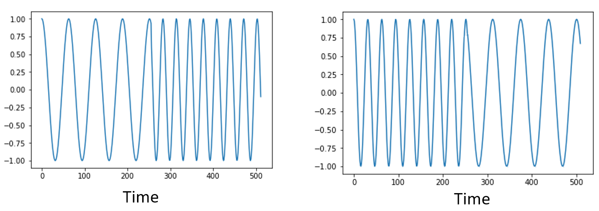

Technisch gesehen ändert sich die Phase der FFT-Werte aufgrund der Zeitverschiebung der Sinusoide. Für die ersten Kapitel dieses Lehrbuchs werden wir uns jedoch hauptsächlich mit der Magnitude der FFT befassen.

*******************
FFT in Python
*******************

Nachdem wir gelernt haben, was eine FFT ist und wie der Ausgang dargestellt wird, lass uns tatsächlich etwas Python-Code ansehen und NumPys FFT-Funktion np.fft.fft() verwenden. Es wird empfohlen, eine vollständige Python-Konsole/IDE auf deinem Computer zu verwenden, aber im Notfall kannst du die verlinkte Online-Web-Python-Konsole am unteren Rand der Navigationsleiste links verwenden.

Zuerst müssen wir ein Signal im Zeitbereich erstellen. Mach gerne mit deiner eigenen Python-Konsole mit. Um die Dinge einfach zu halten, werden wir eine einfache Sinuswelle bei 0,15 Hz erstellen. Wir werden auch eine Abtastrate von 1 Hz verwenden, was bedeutet, dass wir in der Zeit bei 0, 1, 2, 3 Sekunden usw. abtasten.

.. code-block:: python

 import numpy as np
 t = np.arange(100)
 s = np.sin(0.15*2*np.pi*t)

Wenn wir :code:`s` darstellen, sieht es so aus:

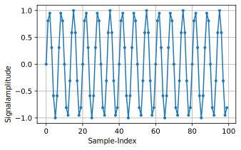

Als nächstes verwenden wir NumPys FFT-Funktion:

.. code-block:: python

 S = np.fft.fft(s)

Wenn wir uns :code:`S` ansehen, sehen wir, dass es ein Array komplexer Zahlen ist:

.. code-block:: python

    S =  array([-0.01865008 +0.00000000e+00j, -0.01171553 -2.79073782e-01j,0.02526446 -8.82681208e-01j,  3.50536075 -4.71354150e+01j, -0.15045671 +1.31884375e+00j, -0.10769903 +7.10452463e-01j, -0.09435855 +5.01303240e-01j, -0.08808671 +3.92187956e-01j, -0.08454414 +3.23828386e-01j, -0.08231753 +2.76337148e-01j, -0.08081535 +2.41078885e-01j, -0.07974909 +2.13663710e-01j,...

Hinweis: Egal was du tust, wenn du auf komplexe Zahlen stößt, versuche die Magnitude und die Phase zu berechnen und sieh, ob sie mehr Sinn ergeben. Lass uns genau das tun und die Magnitude und Phase darstellen. In den meisten Sprachen ist abs() eine Funktion für die Magnitude einer komplexen Zahl. Die Funktion für die Phase variiert je nach Programmiersprache, aber in Python können wir NumPys :code:`np.angle()` verwenden, das die Phase in Radiant zurückgibt.

.. code-block:: python

 import matplotlib.pyplot as plt
 S_mag = np.abs(S)
 S_phase = np.angle(S)
 plt.plot(t,S_mag,'.-')
 plt.plot(t,S_phase,'.-')

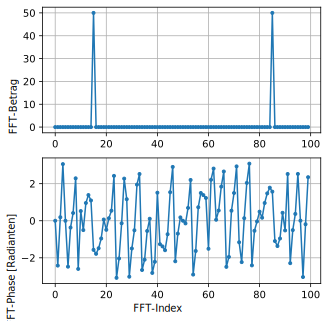

Im Moment geben wir keine x-Achse für die Diagramme an, es ist nur der Index des Arrays (von 0 aufwärts zählend). Aus mathematischen Gründen hat der Ausgang der FFT das folgende Format:

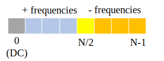

Wir wollen jedoch 0 Hz (DC) in der Mitte und negative Frequenzen links (so möchten wir Dinge gerne visualisieren). Jedes Mal, wenn wir eine FFT durchführen, müssen wir daher eine „FFT-Verschiebung" durchführen, was nur eine einfache Array-Neuanordnungsoperation ist, ähnlich wie eine zirkuläre Verschiebung, aber mehr ein „Leg das hierher und das dorthin". Das Diagramm unten definiert vollständig, was die FFT-Verschiebungsoperation tut:

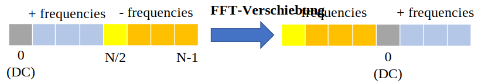

Zu unserer Bequemlichkeit hat NumPy eine FFT-Verschiebungsfunktion, :code:`np.fft.fftshift()`. Ersetze die np.fft.fft()-Zeile durch:

.. code-block:: python

 S = np.fft.fftshift(np.fft.fft(s))

Wir müssen auch die x-Achsenwerte/Beschriftungen herausfinden. Denk daran, dass wir eine Abtastrate von 1 Hz verwendet haben, um die Dinge einfach zu halten. Das bedeutet, dass der linke Rand des Frequenzbereichsdiagramms -0,5 Hz und der rechte Rand 0,5 Hz ist. Wenn das keinen Sinn ergibt, wird es nach dem Kapitel über :ref:`sampling-chapter` klar sein. Bleiben wir bei der Annahme, dass unsere Abtastrate 1 Hz war, und stellen den Ausgang der FFT-Magnitude und -Phase mit einer richtigen x-Achsenbeschriftung dar. Hier ist die endgültige Version dieses Python-Beispiels und die Ausgabe:

.. code-block:: python

 import numpy as np
 import matplotlib.pyplot as plt

 Fs = 1 # Hz
 N = 100 # Anzahl der zu simulierenden Punkte und unsere FFT-Größe

 t = np.arange(N) # weil unsere Abtastrate 1 Hz ist
 s = np.sin(0.15*2*np.pi*t)
 S = np.fft.fftshift(np.fft.fft(s))
 S_mag = np.abs(S)
 S_phase = np.angle(S)
 f = np.arange(Fs/-2, Fs/2, Fs/N)
 plt.figure(0)
 plt.plot(f, S_mag,'.-')
 plt.figure(1)
 plt.plot(f, S_phase,'.-')
 plt.show()

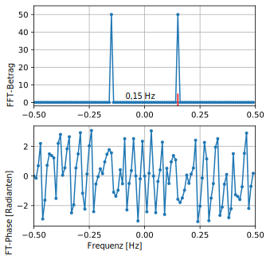

Wir sehen unsere Spitze bei 0,15 Hz, was die Frequenz ist, die wir beim Erstellen der Sinuswelle verwendet haben. Das bedeutet, dass unsere FFT funktioniert hat! Wenn wir den Code, der diese Sinuswelle erzeugt hat, nicht kennen würden, aber nur die Liste der Samples hätten, könnten wir die FFT verwenden, um die Frequenz zu bestimmen. Der Grund, warum wir auch bei -0,15 Hz eine Spitze sehen, hängt damit zusammen, dass es ein reales Signal war, kein komplexes, und wir werden das später vertiefen.

******************************
Fensterfunktionen
******************************

Wenn wir eine FFT verwenden, um die Frequenzkomponenten unseres Signals zu messen, nimmt die FFT an, dass ihr ein Teil eines *periodischen* Signals gegeben wird. Sie verhält sich so, als ob der von uns bereitgestellte Signalabschnitt sich auf unbestimmte Zeit fortsetzt. Es ist so, als ob das letzte Sample des Abschnitts mit dem ersten Sample verbunden wäre. Dies ergibt sich aus der Theorie hinter der Fourier-Transformation. Es bedeutet, dass wir abrupte Übergänge zwischen dem ersten und letzten Sample vermeiden wollen, da abrupte Übergänge im Zeitbereich wie viele Frequenzen aussehen, und in Wirklichkeit verbindet unser letztes Sample nicht wirklich zurück mit unserem ersten Sample. Einfach ausgedrückt: Wenn wir eine FFT von 100 Samples durchführen und dabei :code:`np.fft.fft(x)` verwenden, wollen wir, dass :code:`x[0]` und :code:`x[99]` gleich oder nahe beieinander liegen.

Die Art, wie wir diese zyklische Eigenschaft ausgleichen, ist durch „Fensterfunktionen". Direkt vor der FFT multiplizieren wir den Signalabschnitt mit einer Fensterfunktion, die einfach eine beliebige Funktion ist, die an beiden Enden auf null abfällt. Das stellt sicher, dass der Signalabschnitt bei null beginnt und endet und sich verbindet. Gebräuchliche Fensterfunktionen sind Hamming, Hanning, Blackman und Kaiser. Wenn du keine Fensterfunktion anwendest, wird das als Verwendung eines „rechteckigen" Fensters bezeichnet, weil es wie die Multiplikation mit einem Array von Einsen ist. Hier sehen mehrere Fensterfunktionen aus:

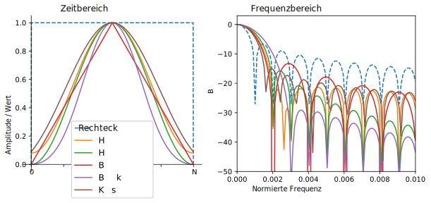

Ein einfacher Ansatz für Anfänger ist, bei einem Hamming-Fenster zu bleiben, das in Python mit :code:`np.hamming(N)` erstellt werden kann, wobei N die Anzahl der Elemente im Array ist, was deine FFT-Größe ist. In der obigen Übung würden wir das Fenster direkt vor der FFT anwenden. Nach der 2. Codezeile würden wir einfügen:

.. code-block:: python

 s = s * np.hamming(100)

Wenn du Angst hast, das falsche Fenster zu wählen, mach dir keine Sorgen. Der Unterschied zwischen Hamming, Hanning, Blackman und Kaiser ist im Vergleich zur Nichtverwendung eines Fensters sehr minimal, da sie alle auf beiden Seiten auf null abfallen und das zugrundeliegende Problem lösen.

*******************
FFT-Größenauswahl
*******************

Das Letzte, was zu beachten ist, ist die FFT-Größe. Die beste FFT-Größe ist immer eine Zweierpotenz, wegen der Art und Weise, wie die FFT implementiert wird. Du kannst eine Größe verwenden, die keine Zweierpotenz ist, aber es wird langsamer sein. Gebräuchliche Größen liegen zwischen 128 und 4.096, obwohl du durchaus größer gehen kannst. In der Praxis müssen wir möglicherweise Signale verarbeiten, die Millionen oder Milliarden von Samples lang sind, daher müssen wir das Signal aufteilen und viele FFTs durchführen. Das bedeutet, dass wir viele Ausgaben erhalten werden. Wir können sie entweder mitteln oder sie über die Zeit darstellen (besonders wenn sich unser Signal über die Zeit ändert). Du musst nicht *jedes* Sample eines Signals durch eine FFT führen, um eine gute Frequenzbereichsdarstellung dieses Signals zu erhalten. Du könntest beispielsweise nur 1.024 von jeweils 100.000 Samples in einem Signal mit FFT verarbeiten und es wird wahrscheinlich trotzdem gut aussehen, solange das Signal immer eingeschaltet ist.

.. _spectrogram-section:

*********************
Spektrogramm/Wasserfall
*********************

Ein Spektrogramm ist die Darstellung, die Frequenz über Zeit zeigt. Es ist einfach eine Reihe von FFTs, die übereinander gestapelt sind (vertikal, wenn du die Frequenz auf der horizontalen Achse haben möchtest). Wir können es auch in Echtzeit anzeigen, oft als Wasserfall bezeichnet. Ein Spektrumanalysator ist das Gerät, das dieses Spektrogramm/diesen Wasserfall anzeigt. Das Diagramm unten zeigt, wie ein Array von IQ-Samples aufgeteilt werden kann, um ein Spektrogramm zu bilden:

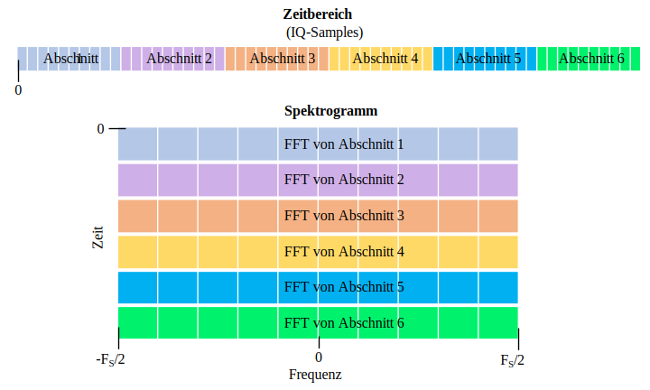

Da ein Spektrogramm das Darstellen von 2D-Daten beinhaltet, ist es effektiv ein 3D-Diagramm, daher müssen wir eine Farbkarte verwenden, um die FFT-Magnituden darzustellen, die die „Werte" sind, die wir darstellen möchten. Hier ist ein Beispiel eines Spektrogramms mit Frequenz auf der horizontalen/x-Achse und Zeit auf der vertikalen/y-Achse. Blau stellt die niedrigste Energie dar und Rot ist die höchste. Wir können sehen, dass es bei DC (0 Hz) in der Mitte eine starke Spitze gibt, mit einem variierenden Signal darum herum. Blau stellt unseren Rauschpegel dar.

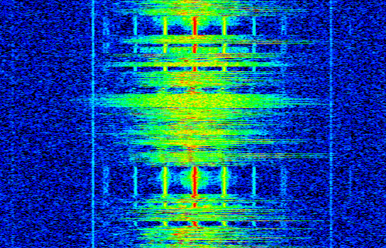

Denk daran, es sind nur Reihen von FFTs, die aufeinander gestapelt sind, jede Reihe ist 1 FFT (technisch gesehen die Magnitude von 1 FFT). Stelle sicher, dass du dein Eingangssignal in Scheiben deiner FFT-Größe aufteilst (z. B. 1.024 Samples pro Scheibe). Bevor wir in den Code zum Erstellen eines Spektrogramms einsteigen, hier ist ein Beispielsignal, das wir verwenden werden; es ist einfach ein Ton im weißem Rauschen:

.. code-block:: python

 import numpy as np
 import matplotlib.pyplot as plt

 sample_rate = 1e6

 # Ton plus Rauschen generieren
 t = np.arange(1024*1000)/sample_rate # Zeitvektor
 f = 50e3 # Frequenz des Tons
 x = np.sin(2*np.pi*f*t) + 0.2*np.random.randn(len(t))

Hier ist, wie es im Zeitbereich aussieht (erste 200 Samples):

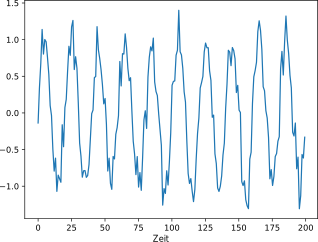

In Python können wir ein Spektrogramm wie folgt generieren:

.. code-block:: python

 # Simuliere das obige Signal oder verwende dein eigenes Signal

 fft_size = 1024
 num_rows = len(x) // fft_size # // ist eine ganzzahlige Division, die abrundet
 spectrogram = np.zeros((num_rows, fft_size))
 for i in range(num_rows):
     spectrogram[i,:] = 10*np.log10(np.abs(np.fft.fftshift(np.fft.fft(x[i*fft_size:(i+1)*fft_size])))**2)

 # Zeit beginnt oben und geht nach unten, z.B. wird Sample x[0] Teil der obersten angezeigten Zeile sein
 plt.imshow(spectrogram, aspect='auto', extent = [sample_rate/-2/1e6, sample_rate/2/1e6, len(x)/sample_rate, 0])
 plt.xlabel("Frequenz [MHz]")
 plt.ylabel("Zeit [s]")
 plt.show()

Dies sollte das Folgende erzeugen, was kein sehr interessantes Spektrogramm ist, da es kein zeitvariables Verhalten gibt. Es gibt zwei Töne, weil wir ein reales Signal simuliert haben, und reale Signale haben immer eine negative PSD, die mit der positiven Seite übereinstimmt. Beachte, dass bei dieser Implementierung die oberste Zeile dem Beginn des Signals entspricht. Für interessantere Beispiele von Spektrogrammen schau dir https://www.IQEngine.org an!

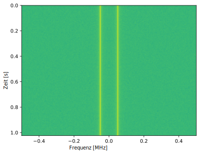

*********************
FFT-Implementierung
*********************

Auch wenn NumPy die FFT bereits für uns implementiert hat, ist es schön zu wissen, wie sie im Wesentlichen funktioniert. Der beliebteste FFT-Algorithmus ist der Cooley-Tukey-FFT-Algorithmus, der um 1805 von Carl Friedrich Gauss erfunden und später 1965 von James Cooley und John Tukey wiederentdeckt und popularisiert wurde.

Die Grundversion dieses Algorithmus funktioniert bei FFT-Größen als Zweierpotenz und ist für komplexe Eingaben gedacht, kann aber auch mit realen Eingaben arbeiten. Der Baustein dieses Algorithmus ist als Schmetterling bekannt, was im Wesentlichen eine N = 2 große FFT ist, bestehend aus zwei Multiplikationen und zwei Summationen:

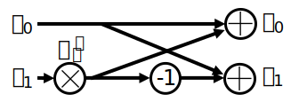

oder

.. math::
   y_0 = x_0 + x_1 w^k_N

   y_1 = x_0 - x_1 w^k_N

wobei :math:`w^k_N = e^{j2\pi k/N}` als Twiddle-Faktoren bekannt sind (:math:`N` ist die Größe der Teil-FFT und :math:`k` ist der Index). Beachte, dass der Eingang und Ausgang komplex sein soll, z. B. könnte :math:`x_0` 0,6123 - 0,5213j sein, und die Summen/Multiplikationen sind komplex.

Der Algorithmus ist rekursiv und teilt sich in zwei Hälften, bis alles, was übrig bleibt, eine Reihe von Schmetterlingen ist; dies wird unten anhand einer FFT der Größe 8 dargestellt:

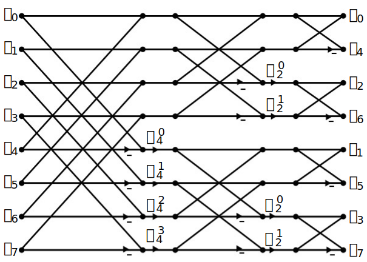

Jede Spalte in diesem Muster ist eine Reihe von Operationen, die parallel durchgeführt werden können, und :math:`log_2(N)` Schritte werden durchgeführt, weshalb die rechnerische Komplexität der FFT O(:math:`N\log N`) beträgt, während eine DFT O(:math:`N^2`) ist.

Für diejenigen, die lieber in Code als in Gleichungen denken, zeigt folgendes eine einfache Python-Implementierung der FFT, zusammen mit einem Beispielsignal bestehend aus einem Ton plus Rauschen, um die FFT auszuprobieren.

.. code-block:: python

 import numpy as np
 import matplotlib.pyplot as plt

 def fft(x):
     N = len(x)
     if N == 1:
         return x
     twiddle_factors = np.exp(-2j * np.pi * np.arange(N//2) / N)
     x_even = fft(x[::2]) # Rekursion!
     x_odd = fft(x[1::2])
     return np.concatenate([x_even + twiddle_factors * x_odd,
                            x_even - twiddle_factors * x_odd])

 # Ton + Rauschen simulieren
 sample_rate = 1e6
 f_offset = 0.2e6 # 200 kHz Versatz vom Träger
 N = 1024
 t = np.arange(N)/sample_rate
 s = np.exp(2j*np.pi*f_offset*t)
 n = (np.random.randn(N) + 1j*np.random.randn(N))/np.sqrt(2) # Einheitliches komplexes Rauschen
 r = s + n # 0 dB SNR

 # FFT durchführen, FFT-Verschiebung, in dB umwandeln
 X = fft(r)
 X_shifted = np.roll(X, N//2) # äquivalent zu np.fft.fftshift
 X_mag = 10*np.log10(np.abs(X_shifted)**2)

 # Ergebnisse darstellen
 f = np.linspace(sample_rate/-2, sample_rate/2, N)/1e6 # Darstellung in MHz
 plt.plot(f, X_mag)
 plt.plot(f[np.argmax(X_mag)], np.max(X_mag), 'rx') # Maximum anzeigen
 plt.grid()
 plt.xlabel('Frequenz [MHz]')
 plt.ylabel('Magnitude [dB]')
 plt.show()

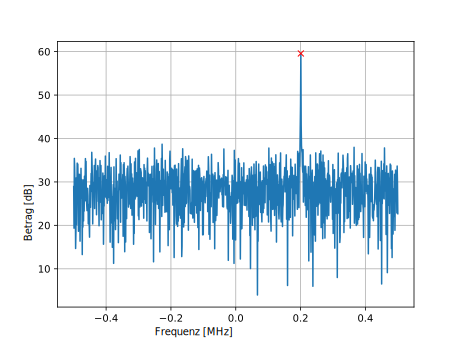

Für diejenigen, die an JavaScript- und/oder WebAssembly-basierten Implementierungen interessiert sind, schau dir die `WebFFT <https://github.com/IQEngine/WebFFT>`_-Bibliothek für die Durchführung von FFTs in Web- oder NodeJS-Anwendungen an; sie enthält mehrere Implementierungen und es gibt ein `Benchmark-Tool <https://webfft.com>`_, das zur Leistungsvergleich der einzelnen Implementierungen verwendet wird.
