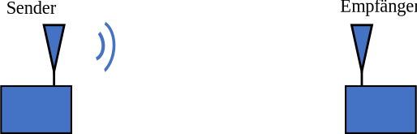
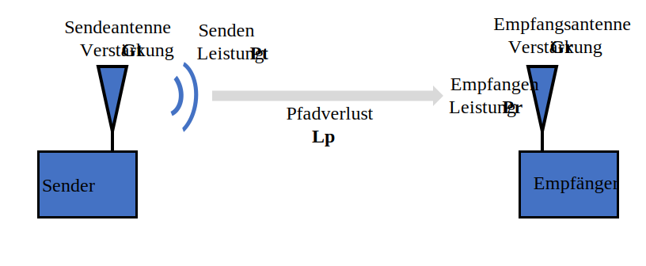
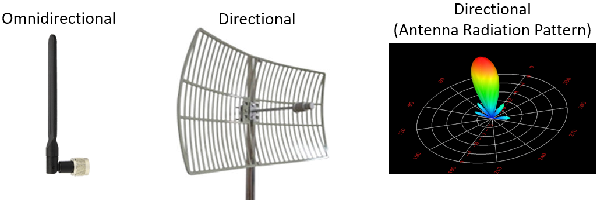
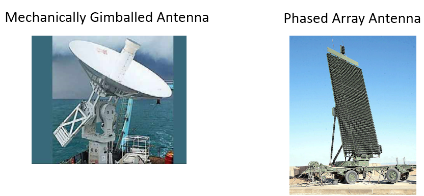
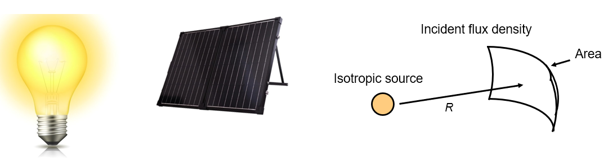
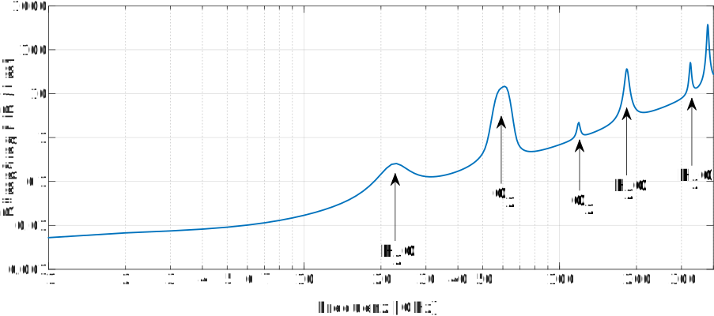
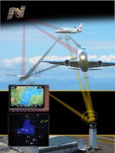

.. _link-budgets-chapter:

##################
Linkbudgets
##################

Dieses Kapitel behandelt Linkbudgets. Ein großer Teil davon ist das Verständnis von Sende-/Empfangsleistung, Pfadverlust, Antennengewinn, Rauschen und SNR. Wir schließen mit der Erstellung eines Beispiel-Linkbudgets für ADS-B ab, das sind Signale, die von Verkehrsflugzeugen ausgestrahlt werden, um ihre Position und andere Informationen zu übermitteln.

*************************
Einführung
*************************

Ein Linkbudget ist eine Aufstellung aller Gewinne und Verluste vom Sender zum Empfänger in einem Kommunikationssystem. Linkbudgets beschreiben eine Richtung der Funkverbindung. Die meisten Kommunikationssysteme sind bidirektional, daher muss es ein separates Uplink- und Downlink-Budget geben. Das „Ergebnis" des Linkbudgets sagt dir ungefähr, welches Signal-Rausch-Verhältnis (abgekürzt SNR, wie in diesem Lehrbuch verwendet, oder S/N) du an deinem Empfänger erwarten kannst. Eine weitere Analyse wäre notwendig, um zu prüfen, ob dieses SNR für deine Anwendung ausreichend hoch ist.

Du studierst Linkbudgets nicht, um tatsächlich ein Linkbudget für eine bestimmte Situation erstellen zu können, sondern um eine systemebenenbasierte Sichtweise der drahtlosen Kommunikation zu erlernen und zu entwickeln.

Wir behandeln zunächst das Budget für die empfangene Signalleistung, dann das Rauschleistungsbudget, und kombinieren schließlich beide, um das SNR (Signalleistung geteilt durch Rauschleistung) zu ermitteln.

*************************
Signalleistungsbudget
*************************

Unten ist das grundlegendste Diagramm einer generischen Funkverbindung. In diesem Kapitel konzentrieren wir uns auf eine Richtung, d.h. von einem Sender (Tx) zum Empfänger (Rx). Für ein gegebenes System kennen wir die *Sendeleistung*; sie ist normalerweise eine Einstellung im Sender. Wie ermitteln wir die *empfangene* Leistung am Empfänger?

Wir benötigen vier Systemparameter, um die empfangene Leistung zu bestimmen, die unten mit ihren üblichen Abkürzungen aufgeführt sind. Dieses Kapitel geht auf jeden von ihnen ein.

- **Pt** - Sendeleistung
- **Gt** - Gewinn der Sendeantenne
- **Gr** - Gewinn der Empfangsantenne
- **Lp** - Abstand zwischen Tx und Rx (d.h. wie viel Drahtlos-Pfadverlust)

Sendeleistung
#####################

Sendeleistung ist recht einfach; sie ist ein Wert in Watt, dBW oder dBm (erinnere dich, dBm ist eine Kurzform für dBmW). Jeder Sender hat einen oder mehrere Verstärker, und die Sendeleistung ist größtenteils eine Funktion dieser Verstärker. Eine Analogie für Sendeleistung wäre die Wattangabe (Leistung) einer Glühbirne: Je höher die Wattzahl, desto mehr Licht strahlt die Birne ab. Hier sind Beispiele für ungefähre Sendeleistungen verschiedener Technologien:

==================  =====  =======
\                       Leistung
------------------  --------------
Bluetooth           10 mW  -20 dBW
WLAN                100mW  -10 dBW
LTE-Basisstation    1W     0 dBW
UKW-Sender          10kW   40 dBW
==================  =====  =======

Antennengewinne
#####################

Sende- und Empfangsantennengewinne sind entscheidend für die Berechnung von Linkbudgets. Was ist der Antennengewinn, fragst du dich? Er gibt die Richtwirkung der Antenne an. Du wirst ihn vielleicht als Antennenleistungsgewinn bezeichnet sehen, aber lass dich davon nicht irreführen — die einzige Möglichkeit für eine Antenne, einen höheren Gewinn zu haben, besteht darin, Energie in einem konzentrierteren Bereich auszustrahlen.

Gewinne werden in dB (einheitenlos) angegeben; erinnere dich im Kapitel :ref:`noise-chapter` warum dB für unser Szenario einheitenlos ist. Typischerweise sind Antennen entweder omnidirektional, was bedeutet, dass ihre Leistung in alle Richtungen abstrahlt, oder direktional, was bedeutet, dass ihre Leistung in eine bestimmte Richtung abstrahlt. Wenn sie omnidirektional sind, liegt ihr Gewinn zwischen 0 dB und 3 dB. Eine direktionale Antenne hat einen höheren Gewinn, normalerweise 5 dB oder mehr, und kann bis zu etwa 60 dB gehen.

Wenn eine direktionale Antenne verwendet wird, muss sie entweder in die richtige Richtung installiert werden oder an einem mechanischen Schwenkkopf befestigt sein. Sie könnte auch ein Phased Array sein, das elektronisch gesteuert werden kann (d.h. durch Software).

Omnidirektionale Antennen werden verwendet, wenn eine Ausrichtung in die richtige Richtung nicht möglich ist, wie bei deinem Mobiltelefon und Laptop. In 5G können Telefone in den höheren Frequenzbändern wie 28 GHz (Verizon) und 39 GHz (AT&T) mit einem Array von Antennen und elektronischem Strahlschwenken arbeiten.

In einem Linkbudget müssen wir davon ausgehen, dass jede direktionale Antenne, ob Sende- oder Empfangsantenne, in die richtige Richtung zeigt. Wenn sie nicht richtig ausgerichtet ist, wird unser Linkbudget ungenau sein und es könnte zu Kommunikationsausfällen kommen (z.B. wenn die Satellitenschüssel auf deinem Dach von einem Basketball getroffen wird und sich verschiebt). Im Allgemeinen gehen unsere Linkbudgets von idealen Bedingungen aus, während ein sonstiger Verlust hinzugefügt wird, um reale Faktoren zu berücksichtigen.

Pfadverlust
#####################

Wenn sich ein Signal durch die Luft (oder das Vakuum) bewegt, nimmt seine Stärke ab. Stell dir vor, du hältst ein kleines Solarpanel vor eine Glühbirne. Je weiter das Solarpanel entfernt ist, desto weniger Energie nimmt es von der Glühbirne auf. **Fluss** ist ein Begriff in der Physik und Mathematik, definiert als „wie viel Zeug durch dein Ding geht". Bei uns ist es die Menge des elektromagnetischen Feldes, das in unsere Empfangsantenne eintritt. Wir möchten wissen, wie viel Leistung für eine gegebene Entfernung verloren geht.

Der freie-Raum-Pfadverlust (FSPL, Free Space Path Loss) gibt uns den Pfadverlust ohne Hindernisse für eine gegebene Entfernung an. In seiner allgemeinen Form: :math:`\mathrm{FSPL} = ( 4\pi d / \lambda )^2`. Für weitere Informationen siehe die Friis-Übertragungsformel. (Fun Fact: Signale begegnen beim Durchqueren des freien Raums einem Impedanzwiderstand von 377 Ohm.) Für die Erstellung von Linkbudgets können wir dieselbe Gleichung verwenden, aber in dB umgewandelt:

.. math::
 \mathrm{FSPL}_{dB} = 20 \log_{10} d + 20 \log_{10} f - 147{,}55 \left[ dB \right]

In Linkbudgets erscheint er in dB, einheitenlos, da es ein Verlust ist. :math:`d` ist in Metern und ist der Abstand zwischen Sender und Empfänger. :math:`f` ist in Hz und ist die Trägerfrequenz. Es gibt nur ein Problem mit dieser einfachen Gleichung: Wir werden nicht immer freien Raum zwischen Sender und Empfänger haben. Frequenzen reflektieren stark in Innenräumen (die meisten Frequenzen können durch Wände gehen, nur nicht durch Metall oder dickes Mauerwerk). Für diese Situationen gibt es verschiedene Nicht-Freiraummodelle. Ein gängiges für Städte und Vorstadtbereiche (z.B. Mobilfunk) ist das Okumura-Hata-Modell:

.. math::
 L_{path} = 69{,}55 + 26{,}16 \log_{10} f - 13{,}82 \log_{10} h_B - C_H + \left[ 44{,}9 - 6{,}55 \log_{10} h_B \right] \log_{10} d

wobei :math:`L_{path}` der Pfadverlust in dB ist, :math:`h_B` die Höhe der Sendeantenne über dem Boden in Metern ist, :math:`f` die Trägerfrequenz in MHz ist, :math:`d` der Abstand zwischen Tx und Rx in km ist und :math:`C_H` der sogenannte „Antennenhöhen-Korrekturfaktor" ist, der basierend auf der Stadtgröße und dem Trägerfrequenzbereich definiert wird:

:math:`C_H` für kleine/mittlere Städte:

.. math::
 C_H = 0{,}8 + (1{,}1 \log_{10} f - 0{,}7 ) h_M - 1{,}56 \log_{10} f

:math:`C_H` für große Städte, wenn :math:`f` unter 200 MHz liegt:

.. math::
 C_H = 8{,}29 ( log_{10}(1{,}54 h_M))^2 - 1{,}1

:math:`C_H` für große Städte, wenn :math:`f` über 200 MHz, aber unter 1,5 GHz liegt:

.. math::
 C_H = 3{,}2 ( log_{10}(11{,}75 h_M))^2 - 4{,}97

wobei :math:`h_M` die Höhe der Empfangsantenne über dem Boden in Metern ist.

Mache dir keine Sorgen, wenn das obige Okumura-Hata-Modell verwirrend erschien; es wird hier hauptsächlich gezeigt, um zu demonstrieren, wie viel komplizierter Nicht-Freiraummodelle im Vergleich zu unserer einfachen FSPL-Gleichung sind. Das Endergebnis all dieser Modelle ist eine einzelne Zahl, die wir für den Pfadverlustanteil unseres Linkbudgets verwenden können. Im Rest dieses Kapitels bleiben wir bei FSPL.

Sonstige Verluste
#####################

In unserem Linkbudget möchten wir auch sonstige Verluste berücksichtigen. Wir fassen diese zu einem Begriff zusammen, normalerweise irgendwo zwischen 1 und 3 dB. Beispiele für sonstige Verluste:

- Kabelverlust
- Atmosphärischer Verlust
- Ungenauigkeiten bei der Antennenausrichtung
- Niederschlag

Das Diagramm unten zeigt den atmosphärischen Verlust in dB/km über der Frequenz (wir werden normalerweise < 40 GHz sein). Wenn du dir etwas Zeit nimmst, die y-Achse zu verstehen, wirst du sehen, dass Kurzstrecken-Kommunikation unter 40 GHz **und** unter 1 km einen atmosphärischen Verlust von 1 dB oder weniger hat, und wir ihn daher im Allgemeinen ignorieren. Atmosphärischer Verlust spielt eine wichtige Rolle bei der Satellitenkommunikation, wo das Signal viele Kilometer durch die Atmosphäre zurücklegen muss.

Signalleistungsgleichung
###########################

Jetzt ist es an der Zeit, all diese Gewinne und Verluste zusammenzuführen, um unsere Signalleistung am Empfänger :math:`P_r` zu berechnen:

.. math::
 P_r = P_t + G_t + G_r - L_p - L_{misc} \quad \mathrm{dBW}

Insgesamt ist es eine einfache Gleichung. Wir addieren die Gewinne und Verluste. Manche betrachten es nicht einmal als Gleichung. Normalerweise zeigen wir die Gewinne, Verluste und Summen in einer Tabelle ähnlich einer Buchhaltung:

.. list-table::
   :widths: 15 10
   :header-rows: 0

   * - Pt = 1,0 W
     - 0 dBW
   * - Gt = 100
     - 20,0 dB
   * - Gr = 1
     - 0 dB
   * - Lp
     - -162,0 dB
   * - Lmisc
     - -1,0 dB
   * - **Pr**
     - **-143,0 dBW**

EIRP
#####

Als kurzer Einschub: Du wirst möglicherweise die Kenngröße EIRP (Equivalent Isotropically Radiated Power, äquivalente isotropisch abgestrahlte Leistung) sehen, die als :math:`P_t + G_t - L_{Kabel}` definiert ist und die Einheit dBW hat. Durch Addition der Sendeleistung mit dem Sendeantennengain und Subtraktion der sendeseitigen Kabelverluste erhalten wir eine nützliche Kenngröße, die die „hypothetische" Leistung darstellt, die von einer isotropischen (perfekt omnidirektionalen) Antenne abgestrahlt werden müsste, um dieselbe Signalstärke **in Richtung des Hauptstrahls der Antenne** zu liefern. Dieser letzte Teil wird betont, weil jede Antenne mit einem hohen Gewinn (:math:`G_t`) diesen hohen Gewinn nur liefert, wenn sie richtig ausgerichtet ist. Wenn du also gut ausgerichtet bist, gibt dir EIRP alles, was du über die Sendeseite des Linkbudgets wissen musst, weshalb es eine Kenngröße ist, die häufig in Datenblättern von direktionalen Sendern wie Satelliten-Bodenstationen zu finden ist (normalerweise in Form von „max EIRP").

*************************
Rauschleistungsbudget
*************************

Jetzt, da wir die empfangene Signalleistung kennen, wechseln wir das Thema zum empfangenen Rauschen, da wir beides benötigen, um das SNR zu berechnen. Wir können die empfangene Rauschleistung mit einem ähnlichen Leistungsbudget ermitteln.

Jetzt ist ein guter Zeitpunkt, darüber zu sprechen, wo Rauschen in unsere Kommunikationsverbindung eintritt. Antwort: **Am Empfänger!** Das Signal wird erst dann mit Rauschen korrumpiert, wenn wir es empfangen wollen. Es ist *äußerst* wichtig, diese Tatsache zu verstehen! Viele Studierende internalisieren das nicht ganz und machen daher einen törichten Fehler. Es schwirrt kein Rauschen in der Luft um uns herum. Das Rauschen kommt daher, dass unser Empfänger einen Verstärker und andere Elektronik hat, die nicht perfekt sind und nicht bei 0 Grad Kelvin (K) betrieben werden.

Eine verbreitete und einfache Formulierung für das Rauschbudget verwendet den „kTB"-Ansatz:

.. math::
 P_{Rauschen} = kTB

- :math:`k` – Boltzmann-Konstante = 1,38 x 10-23 J/K = **-228,6 dBW/K/Hz**. Für alle Neugierigen ist die Boltzmann-Konstante eine physikalische Konstante, die die mittlere kinetische Energie der Teilchen in einem Gas mit der Temperatur des Gases verknüpft.
- :math:`T` – Systemrauschtemperatur in K (Kryokühler?), größtenteils basierend auf unserem Verstärker. Das ist der Term, der am schwierigsten zu bestimmen ist und normalerweise sehr ungefähr ist. Du wirst möglicherweise mehr für einen Verstärker mit einer niedrigeren Rauschtemperatur zahlen.
- :math:`B` – Signalbandbreite in Hz, vorausgesetzt, du filterst das Rauschen um dein Signal herum heraus. Ein LTE-Downlink-Signal mit einer Breite von 10 MHz hat :math:`B` auf 10 MHz gesetzt, was 70 dBHz entspricht.

Das Multiplizieren (oder Addieren in dB) von kTB ergibt unsere Rauschleistung, d.h. den unteren Term unserer SNR-Gleichung.

*************************
SNR
*************************

Jetzt, da wir beide Zahlen haben, können wir das Verhältnis nehmen, um das SNR zu finden (weitere Informationen über SNR findest du im Kapitel :ref:`noise-chapter`):

.. math::
   \mathrm{SNR} = \frac{P_{Signal}}{P_{Rauschen}}

.. math::
   \mathrm{SNR_{dB}} = P_{Signal\_dB} - P_{Rauschen\_dB}

Wir streben normalerweise ein SNR > 10 dB an, obwohl es wirklich von der Anwendung abhängt. In der Praxis kann das SNR durch Betrachten der FFT des empfangenen Signals oder durch Berechnen der Leistung mit und ohne das vorhandene Signal überprüft werden (erinnere dich: Varianz = Leistung). Je höher das SNR, desto mehr Bits pro Symbol kannst du ohne zu viele Fehler verwalten.

***************************
Beispiel-Linkbudget: ADS-B
***************************

Automatic Dependent Surveillance-Broadcast (ADS-B) ist eine Technologie, die von Flugzeugen verwendet wird, um Signale auszusenden, die ihre Position und anderen Status mit Flugsicherungs-Bodenstationen und anderen Flugzeugen teilen. ADS-B ist automatisch, da es keinen Piloten oder externe Eingaben erfordert; es hängt von Daten aus dem Navigationssystem des Flugzeugs und anderen Computern ab. Die Nachrichten sind nicht verschlüsselt (super!). ADS-B-Ausrüstung ist derzeit in Teilen des australischen Luftraums obligatorisch, während die Vereinigten Staaten je nach Größe die Ausrüstung einiger Flugzeuge vorschreiben.

Die physikalische (PHY) Schicht von ADS-B hat folgende Eigenschaften:

- Übertragung auf 1.090 MHz
- Signalbandbreite ca. 2 MHz
- PPM-Modulation
- Datenrate von 1 Mbit/s, mit Nachrichten zwischen 56 und 112 Mikrosekunden
- Nachrichten tragen jeweils 15 Bytes an Daten, sodass normalerweise mehrere Nachrichten für alle Flugzeuginformationen benötigt werden
- Mehrfachzugriff wird dadurch erreicht, dass Nachrichten mit einer zufällig zwischen 0,4 und 0,6 Sekunden variierenden Periode ausgesendet werden. Diese Randomisierung soll verhindern, dass alle Übertragungen von Flugzeugen aufeinander treffen (einige können sich trotzdem überschneiden, aber das ist in Ordnung)
- ADS-B-Antennen sind vertikal polarisiert
- Die Sendeleistung variiert, sollte aber in der Größenordnung von 100 W (20 dBW) liegen
- Der Sendeantennengain ist omnidirektional, zeigt aber nur nach unten, also sagen wir 3 dB
- ADS-B-Empfänger haben ebenfalls eine omnidirektionale Antenne, also sagen wir 0 dB

Der Pfadverlust hängt davon ab, wie weit das Flugzeug von unserem Empfänger entfernt ist. Als Beispiel: Es sind etwa 30 km von der University of Maryland (wo der Kurs, aus dem der Inhalt dieses Lehrbuchs stammt, gelehrt wurde) zum BWI-Flughafen. Lass uns den FSPL für diese Entfernung und eine Frequenz von 1.090 MHz berechnen:

.. math::
    \mathrm{FSPL}_{dB} = 20 \log_{10} d + 20 \log_{10} f - 147{,}55  \left[ \mathrm{dB} \right]

    \mathrm{FSPL}_{dB} = 20 \log_{10} 30e3 + 20 \log_{10} 1090e6 - 147{,}55  \left[ \mathrm{dB} \right]

    \mathrm{FSPL}_{dB} = 122{,}7 \left[ \mathrm{dB} \right]

Eine andere Möglichkeit ist, :math:`d` als Variable im Linkbudget zu belassen und herauszufinden, wie weit entfernt wir Signale basierend auf einem erforderlichen SNR hören können.

Da wir definitiv keinen freien Raum haben werden, fügen wir noch 3 dB sonstiger Verluste hinzu. Wir setzen den sonstigen Verlust auf insgesamt 6 dB, um zu berücksichtigen, dass unsere Antenne nicht gut angepasst ist und Kabel-/Steckverbinderverluste vorhanden sind. Angesichts all dieser Kriterien sieht unser Signal-Linkbudget wie folgt aus:

.. list-table::
   :widths: 15 10
   :header-rows: 0

   * - Pt
     - 20 dBW
   * - Gt
     - 3 dB
   * - Gr
     - 0 dB
   * - Lp
     - -122,7 dB
   * - Lmisc
     - -6 dB
   * - **Pr**
     - **-105,7 dBW**

Für unser Rauschbudget:

- B = 2 MHz = 2e6 = 63 dBHz
- T müssen wir schätzen, sagen wir 300 K, was 24,8 dBK entspricht. Es variiert je nach Qualität des Empfängers
- k ist immer -228,6 dBW/K/Hz

.. math::
 P_{Rauschen} = k + T + B = -140{,}8 \quad \mathrm{dBW}

Daher ist unser SNR -105,7 - (-140,8) = **35,1 dB**. Es ist nicht überraschend, dass es eine große Zahl ist, wenn man bedenkt, dass wir behaupten, nur 30 km vom Flugzeug unter freiem Raum entfernt zu sein. Wenn ADS-B-Signale keine 30 km reichen könnten, wäre ADS-B kein sehr effektives System — niemand würde den anderen hören, bis er sehr nah heran ist. In diesem Beispiel können wir die Signale leicht dekodieren; Pulspositionsmodulation (PPM) ist recht robust und erfordert kein so hohes SNR. Was schwierig ist, ist wenn du versuchst, ADS-B in einem Klassenraum zu empfangen, mit einer Antenne, die sehr schlecht angepasst ist, und einem starken UKW-Radiosender in der Nähe, der Interferenz verursacht. Diese Faktoren könnten leicht zu 20–30 dB an Verlusten führen.

Dieses Beispiel war wirklich nur eine Überschlagsrechnung, aber es hat die Grundlagen der Erstellung eines Linkbudgets und das Verständnis der wichtigen Parameter einer Kommunikationsverbindung demonstriert.
