.. _noise-chapter:

##################################
Rauschen und Zufallsvariablen
##################################

In diesem Kapitel besprechen wir Rauschen, einschließlich dessen Modellierung und Behandlung in einem drahtlosen Kommunikationssystem. Konzepte umfassen AWGN, komplexes Rauschen und SNR/SINR. Wir führen auch Dezibel (dB) ein, da es in der drahtlosen Kommunikation und bei SDRs weit verbreitet ist. Abschließend gehen wir tiefer in die grundlegenden Konzepte der Zufallsvariablen und Zufallsprozesse ein, die für das Verständnis von Rauschen, Kanaleffekten und vielen Signalverarbeitungstechniken in der drahtlosen Kommunikation unerlässlich sind. Wir behandeln Wahrscheinlichkeitsverteilungen, Erwartungswert, Varianz und wie sich Zufallsprozesse im Laufe der Zeit entwickeln. Diese Konzepte bilden das mathematische Fundament für die Analyse von Rauschen und vielen anderen Themen in SDR und DSP.

************************
Gaußsches Rauschen
************************

Die meisten Menschen kennen das Konzept von Rauschen: unerwünschte Schwankungen, die unser gewünschtes Signal verdecken können. Rauschen sieht etwa so aus:

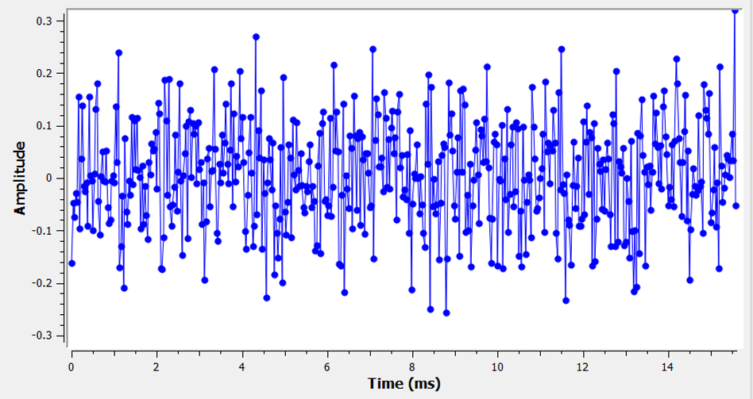

Beachte, dass der Durchschnittswert im Zeitbereichsgraph null ist. Wenn der Durchschnittswert nicht null wäre, könnten wir den Durchschnittswert subtrahieren, ihn als Bias bezeichnen, und wir hätten einen Durchschnitt von null übrig. Beachte auch, dass die einzelnen Punkte im Graphen *nicht* „gleichmäßig zufällig" sind, d.h. größere Werte sind seltener; die meisten Punkte liegen näher an null.

Wir nennen diese Art von Rauschen „Gaußsches Rauschen". Es ist ein gutes Modell für die Art von Rauschen, die aus vielen natürlichen Quellen stammt, wie z.B. thermische Schwingungen von Atomen im Silizium der HF-Komponenten unseres Empfängers. Der **zentrale Grenzwertsatz** sagt uns, dass die Summe vieler Zufallsprozesse dazu neigt, eine Gaußsche Verteilung zu haben, selbst wenn die einzelnen Prozesse andere Verteilungen haben. Mit anderen Worten: Wenn viele zufällige Dinge passieren und sich akkumulieren, erscheint das Ergebnis annähernd Gaußsch, selbst wenn die einzelnen Dinge nicht Gaußsch verteilt sind.

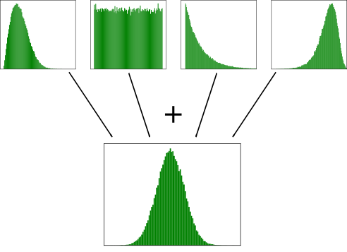

Die Gaußsche Verteilung wird auch als „Normalverteilung" bezeichnet (erinnere dich an die Glockenkurve).

Die Gaußsche Verteilung hat zwei Parameter: Mittelwert und Varianz. Wir haben bereits besprochen, wie der Mittelwert als null betrachtet werden kann, da man den Mittelwert (oder Bias) immer entfernen kann, wenn er nicht null ist. Die Varianz ändert, wie „stark" das Rauschen ist. Eine höhere Varianz führt zu größeren Zahlen. Aus diesem Grund definiert die Varianz die Rauschleistung.

Varianz ist gleich Standardabweichung hoch zwei (:math:`\sigma^2`).

************************
Dezibel (dB)
************************

Wir machen jetzt einen kurzen Ausflug, um dB formal einzuführen. Du hast vielleicht schon von dB gehört, und wenn du bereits damit vertraut bist, kannst du diesen Abschnitt überspringen.

Das Arbeiten mit dB ist äußerst nützlich, wenn wir gleichzeitig mit kleinen und großen Zahlen umgehen müssen oder einfach mit einer Reihe von sehr großen Zahlen. Überlege, wie umständlich es wäre, mit Zahlen der Größenordnung in Beispiel 1 und Beispiel 2 zu arbeiten.

Beispiel 1: Signal 1 wird mit 2 Watt empfangen und der Rauschboden liegt bei 0,0000002 Watt.

Beispiel 2: Eine Küchenmaschine ist 100.000 Mal lauter als ein ruhiges Landgebiet, und eine Kettensäge ist 10.000 Mal lauter als eine Küchenmaschine (in Bezug auf die Leistung der Schallwellen).

Ohne dB, d.h. wenn wir in normalen „linearen" Einheiten arbeiten, müssen wir viele Nullen verwenden, um die Werte in den Beispielen 1 und 2 darzustellen. Ehrlich gesagt würden wir den Rauschboden nicht einmal sehen, wenn wir Signal 1 über die Zeit aufzeichnen würden. Wenn die Skala der y-Achse z.B. von 0 bis 3 Watt reicht, wäre das Rauschen zu klein, um im Diagramm sichtbar zu sein. Um diese Skalen gleichzeitig darzustellen, arbeiten wir mit einer logarithmischen Skala.

Um die Skalierungsprobleme, die wir in der Signalverarbeitung begegnen, weiter zu veranschaulichen, betrachte die folgenden Wasserfalldarstellungen von drei gleichen Signalen. Die linke Seite zeigt das Originalsignal auf linearer Skala, und die rechte Seite zeigt die in logarithmische Skala (dB) umgewandelten Signale. Beide Darstellungen verwenden exakt dieselbe Farbkarte, wobei Blau der niedrigste Wert und Gelb der höchste ist. Das Signal auf der linken Seite auf der linearen Skala ist kaum zu erkennen.

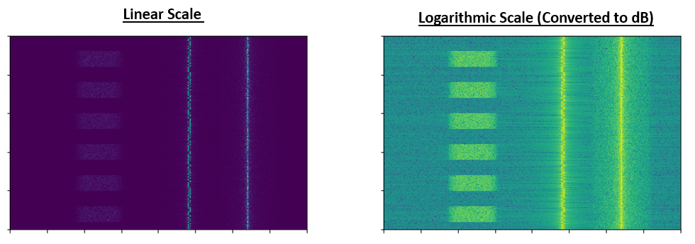

Für einen gegebenen Wert x können wir x in dB mit der folgenden Formel darstellen:

.. math::
    x_{dB} = 10 \log_{10} x

In Python:

.. code-block:: python

 x_db = 10.0 * np.log10(x)

Du hast vielleicht gesehen, dass :code:`10 *` in anderen Bereichen ein :code:`20 *` ist. Immer wenn du es mit einer Leistung zu tun hast, verwendest du 10, und du verwendest 20, wenn du mit einem Nicht-Leistungswert wie Spannung oder Strom arbeitest. In der DSP arbeiten wir in der Regel mit Leistung.

Wir rechnen von dB zurück in linear (normale Zahlen) mit:

.. math::
    x = 10^{x_{dB}/10}

In Python:

.. code-block:: python

 x = 10.0 ** (x_db / 10.0)

Verliere dich nicht in der Formel, denn es gibt hier ein wichtiges Konzept zu verstehen. In der DSP arbeiten wir gleichzeitig mit sehr großen und sehr kleinen Zahlen (z.B. die Stärke eines Signals im Vergleich zur Stärke des Rauschens). Die logarithmische Skala von dB ermöglicht uns eine größere Dynamik, wenn wir Zahlen ausdrücken oder darstellen. Sie bietet auch einige Vorteile, wie z.B. die Möglichkeit zu addieren, wo wir normalerweise multiplizieren würden (wie wir im Kapitel :ref:`link-budgets-chapter` sehen werden).

Einige häufige Fehler, auf die man bei Neulingen in Bezug auf dB stößt:

1. Verwenden des natürlichen Logarithmus anstelle des Logarithmus zur Basis 10, da die log()-Funktion der meisten Programmiersprachen eigentlich der natürliche Logarithmus ist.
2. Vergessen, dB anzugeben, wenn eine Zahl ausgedrückt oder eine Achse beschriftet wird. Wenn wir in dB sind, müssen wir es irgendwo kennzeichnen.
3. Wenn du in dB bist, addierst/subtrahierst du Werte anstatt zu multiplizieren/dividieren, z.B.:

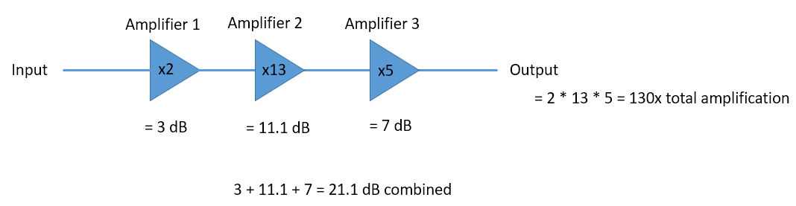

Es ist auch wichtig zu verstehen, dass dB technisch gesehen keine „Einheit" ist. Ein Wert in dB allein ist einheitenlos, wie wenn etwas 2x größer ist — es gibt keine Einheiten, bis du mir die Einheiten nennst. dB ist eine relative Angabe. In der Audiotechnik meinen sie, wenn sie dB sagen, eigentlich dBA, was eine Einheit für den Schallpegel ist (das A sind die Einheiten). In der Funktechnik verwenden wir typischerweise Watt für einen tatsächlichen Leistungspegel. Daher kannst du dBW als Einheit sehen, die relativ zu 1 W ist. Du kannst auch dBmW sehen (oft kurz als dBm geschrieben), was relativ zu 1 mW ist. Zum Beispiel kann jemand sagen „unser Sender ist auf 3 dBW eingestellt" (also 2 Watt). Manchmal verwenden wir dB allein, was bedeutet, es ist relativ und hat keine Einheiten. Man kann sagen: „unser Signal wurde 20 dB über dem Rauschboden empfangen". Hier ist ein kleiner Tipp: 0 dBm = -30 dBW.

Hier sind einige häufige Umrechnungen, die ich dir zu merken empfehle:

======  =====
Linear   dB
======  =====
1x      0 dB
2x      3 dB
10x     10 dB
0,5x    -3 dB
0,1x    -10 dB
100x    20 dB
1000x   30 dB
10000x  40 dB
======  =====

Hier sind schließlich einige Beispielleistungspegel in dBm, um diese Zahlen in eine Perspektive zu setzen:

=========== ===
80 dBm      Sendeleistung eines ländlichen UKW-Radiosenders
62 dBm      Maximale Leistung eines Amateurfunksenders
60 dBm      Leistung einer typischen Haushaltsmikrowelle
37 dBm      Maximale Leistung eines typischen tragbaren CB- oder Amateurfunkgeräts
27 dBm      Typische Sendeleistung eines Mobiltelefons
15 dBm      Typische WLAN-Sendeleistung
10 dBm      Maximale Sendeleistung von Bluetooth (Version 4)
-10 dBm     Maximale empfangene Leistung für WLAN
-70 dBm     Beispiel für empfangene Leistung eines Amateurfunksignals
-100 dBm    Minimale empfangene Leistung für WLAN
-127 dBm    Typische empfangene Leistung von GPS-Satelliten
=========== ===

*************************
Rauschen im Frequenzbereich
*************************

Im Kapitel :ref:`freq-domain-chapter` haben wir uns mit „Fourier-Paaren" befasst, d.h. wie ein bestimmtes Zeitbereichssignal im Frequenzbereich aussieht. Wie sieht nun Gaußsches Rauschen im Frequenzbereich aus? Die folgenden Graphen zeigen simuliertes Rauschen im Zeitbereich (oben) und eine Darstellung der Leistungsspektraldichte (PSD) dieses Rauschens (unten). Diese Diagramme wurden aus GNU Radio entnommen.

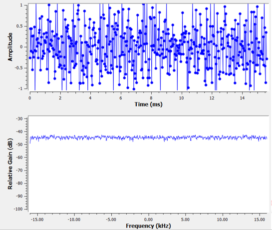

Wir können sehen, dass es über alle Frequenzen hinweg ungefähr gleich aussieht und relativ flach ist. Es stellt sich heraus, dass Gaußsches Rauschen im Zeitbereich auch im Frequenzbereich Gaußsches Rauschen ist. Warum sehen die beiden obigen Diagramme dann nicht gleich aus? Das liegt daran, dass das Frequenzbereichsdiagramm den Betrag der FFT zeigt, sodass es nur positive Zahlen gibt. Wichtig ist, dass eine logarithmische Skala verwendet wird, also der Betrag in dB angezeigt wird. Andernfalls würden diese Graphen gleich aussehen. Wir können das selbst beweisen, indem wir etwas Rauschen (im Zeitbereich) in Python erzeugen und dann die FFT berechnen.

.. code-block:: python

 import numpy as np
 import matplotlib.pyplot as plt

 N = 1024 # Anzahl der zu simulierenden Samples, beliebige Zahl wählbar
 x = np.random.randn(N)
 plt.plot(x, '.-')
 plt.show()

 X = np.fft.fftshift(np.fft.fft(x))
 X = X[N//2:] # nur positive Frequenzen betrachten; // ist ganzzahlige Division
 plt.plot(np.real(X), '.-')
 plt.show()

Beachte, dass die Funktion :code:`randn()` standardmäßig Mittelwert = 0 und Varianz = 1 verwendet. Beide Diagramme werden etwa so aussehen:

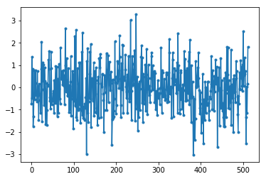

Du kannst dann die flache PSD, die wir in GNU Radio hatten, erzeugen, indem du den Logarithmus nimmst und viele davon mittelst. Das Signal, das wir erzeugen und dessen FFT wir berechnet haben, war ein reelles Signal (im Gegensatz zu einem komplexen), und die FFT eines reellen Signals hat übereinstimmende negative und positive Teile; deshalb haben wir nur den positiven Teil der FFT-Ausgabe gespeichert (die zweite Hälfte). Aber warum haben wir nur „reelles" Rauschen erzeugt, und wie spielen komplexe Signale dabei eine Rolle?

*************************
Komplexes Rauschen
*************************

„Komplexes Gaußsches Rauschen" ist das, was wir erleben werden, wenn wir ein Signal im Basisband haben; die Rauschleistung ist gleichmäßig auf den Real- und Imaginärteil aufgeteilt. Und am wichtigsten ist, dass Real- und Imaginärteil unabhängig voneinander sind — wenn du die Werte des einen kennst, sagt das dir nichts über die Werte des anderen.

Wir können komplexes Gaußsches Rauschen in Python erzeugen mit:

.. code-block:: python

 n = np.random.randn() + 1j * np.random.randn()

Aber Vorsicht! Die obige Gleichung erzeugt nicht die gleiche „Menge" an Rauschen wie :code:`np.random.randn()` in Bezug auf die Leistung (bekannt als Rauschleistung). Wir können die durchschnittliche Leistung eines Signals (oder Rauschens) mit null Mittelwert berechnen mit:

.. code-block:: python

 power = np.var(x)

wobei np.var() die Funktion für die Varianz ist. Hier ist die Leistung unseres Signals n gleich 2. Um komplexes Rauschen mit „Einheitsleistung", d.h. einer Leistung von 1 (was die Dinge vereinfacht), zu erzeugen, müssen wir folgendes verwenden:

.. code-block:: python

 n = (np.random.randn(N) + 1j*np.random.randn(N))/np.sqrt(2) # AWGN mit Einheitsleistung

Um komplexes Rauschen im Zeitbereich darzustellen, benötigen wir wie bei jedem komplexen Signal zwei Linien:

.. code-block:: python

 n = (np.random.randn(N) + 1j*np.random.randn(N))/np.sqrt(2)
 plt.plot(np.real(n),'.-')
 plt.plot(np.imag(n),'.-')
 plt.legend(['real','imag'])
 plt.show()

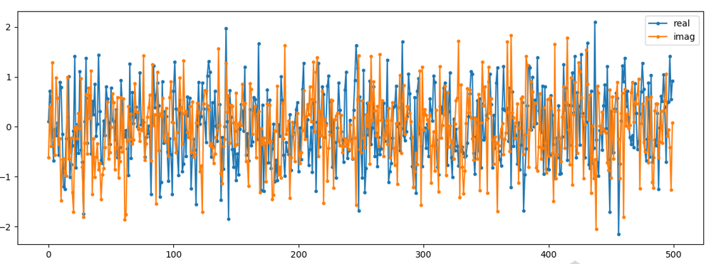

Du kannst sehen, dass Real- und Imaginärteil vollständig unabhängig sind.

Wie sieht komplexes Gaußsches Rauschen auf einem IQ-Diagramm aus? Erinnere dich, dass das IQ-Diagramm den Realteil (horizontale Achse) und den Imaginärteil (vertikale Achse) zeigt, die beide unabhängige Gaußsche Zufallsvariablen sind.

.. code-block:: python

 plt.plot(np.real(n),np.imag(n),'.')
 plt.grid(True, which='both')
 plt.axis([-2, 2, -2, 2])
 plt.show()

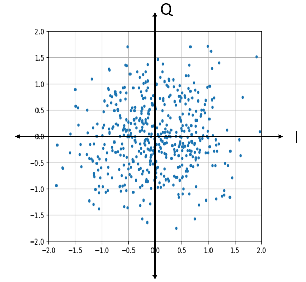

Es sieht so aus, wie wir es erwarten würden: ein zufälliger Blob, der um 0 + 0j oder den Ursprung zentriert ist. Lass uns zum Spaß versuchen, einem QPSK-Signal Rauschen hinzuzufügen, um zu sehen, wie das IQ-Diagramm aussieht:

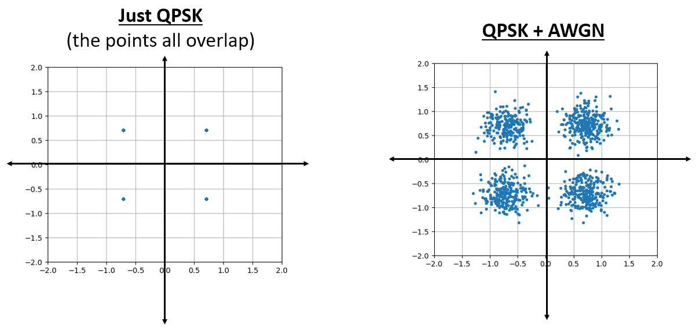

Was passiert, wenn das Rauschen stärker wird?

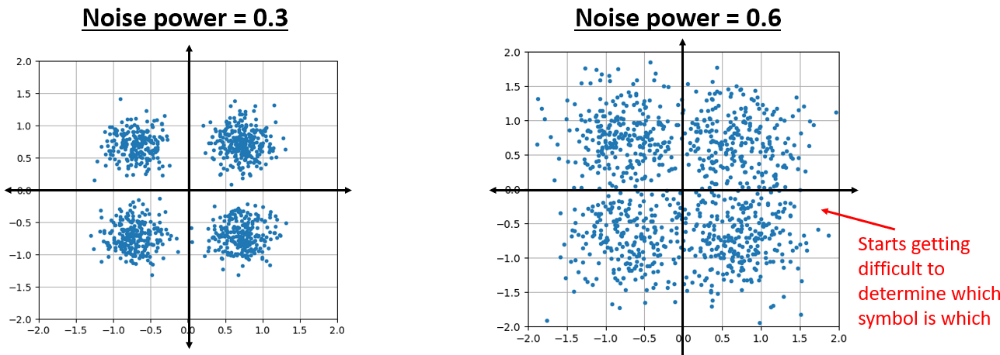

Wir beginnen zu verstehen, warum das drahtlose Übertragen von Daten nicht so einfach ist. Wir möchten so viele Bits pro Symbol wie möglich senden, aber wenn das Rauschen zu hoch ist, erhalten wir fehlerhafte Bits auf der Empfangsseite.

*************************
AWGN
*************************

Additives Weißes Gaußsches Rauschen (AWGN, engl. Additive White Gaussian Noise) ist eine Abkürzung, die du in der DSP- und SDR-Welt häufig hören wirst. Das GN (Gaußsches Rauschen) haben wir bereits besprochen. „Additiv" bedeutet einfach, dass das Rauschen zu unserem empfangenen Signal addiert wird. „Weiß" bedeutet im Frequenzbereich, dass das Spektrum über das gesamte Beobachtungsband flach ist. In der Praxis wird es fast immer weiß oder annähernd weiß sein. In diesem Lehrbuch verwenden wir AWGN als einzige Form von Rauschen bei Kommunikationsverbindungen, Linkbudgets usw. Nicht-AWGN-Rauschen ist eher ein Nischenthema.

*************************
SNR und SINR
*************************

Das Signal-Rausch-Verhältnis (SNR, engl. Signal-to-Noise Ratio) ist die Messgröße, mit der wir die Stärkeunterschiede zwischen Signal und Rauschen messen. Es ist ein Verhältnis und daher einheitenlos. SNR wird in der Praxis fast immer in dB angegeben. Oft programmieren wir in Simulationen so, dass unsere Signale eine Einheitsleistung haben (Leistung = 1). Auf diese Weise können wir ein SNR von 10 dB erzeugen, indem wir Rauschen mit -10 dB Leistung erzeugen, indem wir die Varianz bei der Erzeugung des Rauschens anpassen.

.. math::
   \mathrm{SNR} = \frac{P_{Signal}}{P_{Rauschen}}

.. math::
   \mathrm{SNR_{dB}} = P_{Signal\_dB} - P_{Rauschen\_dB}

Wenn jemand „SNR = 0 dB" sagt, bedeutet das, dass Signal- und Rauschleistung gleich sind. Ein positives SNR bedeutet, dass unser Signal höhere Leistung als das Rauschen hat, während ein negatives SNR bedeutet, dass das Rauschen höhere Leistung hat. Das Erkennen von Signalen bei negativem SNR ist in der Regel ziemlich schwierig.

Wie bereits erwähnt, ist die Leistung in einem Signal gleich der Varianz des Signals. Daher können wir SNR als das Verhältnis von Signal- zu Rauschvarianz darstellen:

.. math::
   \mathrm{SNR} = \frac{P_{Signal}}{P_{Rauschen}} = \frac{\sigma^2_{Signal}}{\sigma^2_{Rauschen}}

Das Signal-zu-Interferenz-plus-Rausch-Verhältnis (SINR, engl. Signal-to-Interference-plus-Noise Ratio) ist im Wesentlichen dasselbe wie SNR, außer dass Interferenz zusammen mit dem Rauschen im Nenner enthalten ist.

.. math::
   \mathrm{SINR} = \frac{P_{Signal}}{P_{Interferenz} + P_{Rauschen}}

Was als Interferenz gilt, hängt von der Anwendung/Situation ab, aber in der Regel handelt es sich um ein anderes Signal, das das Nutz-Signal (SOI, Signal of Interest) stört, und entweder im Frequenzbereich mit dem SOI überlappt und/oder aus irgendeinem Grund nicht herausgefiltert werden kann.

*********************************
Tieferer Einblick in Zufallsvariablen
*********************************

Bisher haben wir vermieden, zu mathematisch zu werden, aber jetzt machen wir einen Schritt zurück und stellen das Konzept der Zufallsvariablen vor und wie sie im Kontext der drahtlosen Kommunikation und SDR verwendet werden. Eine **Zufallsvariable** ist ein mathematisches Konzept, das Ergebnisse eines Zufallsexperiments auf numerische Werte abbildet. Zufallsvariablen repräsentieren Größen, deren Werte bis zur Beobachtung oder Messung ungewiss sind, wie unsere Rausch-Samples. Denke an das Würfeln mit einem sechsseitigen Würfel. Bevor du würfelst, weißt du nicht, welche Zahl erscheint. Wir können eine Zufallsvariable :math:`X` definieren, die das Ergebnis des Würfelns darstellt. Der Wert von :math:`X` ist eine der Zahlen {1, 2, 3, 4, 5, 6}, aber wir wissen nicht welche, bis wir tatsächlich würfeln.

Im Kontext der drahtlosen Kommunikation und SDR sind Zufallsvariablen überall:

* Das thermische Rauschen in einem Empfänger wird zu jedem Zeitpunkt als Zufallsvariable modelliert
* Die Amplitude eines empfangenen Signals, das von Mehrwegeausbreitung beeinflusst wird, ist zufällig
* Der durch einen sich ändernden Kanal eingeführte Phasenversatz kann als Zufallsvariable zwischen :math:`0` und :math:`2\pi` modelliert werden
* Selbst die Datenbits, die wir senden, können als Zufallsvariablen behandelt werden

**Einzelne Stichprobe vs. viele Stichproben**

Dies ist eine entscheidende Unterscheidung, die oft zu Verwirrung führt:

* Eine **einzelne Realisierung** oder **einzelne Stichprobe** einer Zufallsvariable ist nur eine Zahl — ein Ergebnis des Zufallsexperiments
* Um eine Zufallsvariable zu charakterisieren (ihren Durchschnitt, ihre Streuung usw. zu finden), benötigen wir **viele Realisierungen** — viele Ergebnisse

Wenn du z.B. ``np.random.randn()`` in Python ohne Argumente aufrufst, gibt es eine einzelne Zufallszahl aus einer Gaußschen Verteilung zurück. Diese einzelne Zahl sagt dir fast nichts über die Verteilung selbst. Aber wenn du ``np.random.randn(10000)`` aufrufst und 10.000 Samples erzeugst, kannst du jetzt Eigenschaften der Verteilung wie ihren Mittelwert und ihre Varianz schätzen.

.. code-block:: python

 import numpy as np

 # Einzelne Stichprobe - nur eine Zahl
 x_single = np.random.randn()
 print(x_single)  # könnte 0.534, -1.23 oder ein anderer Wert sein

 # Viele Stichproben - jetzt können wir die Verteilung charakterisieren
 x_many = np.random.randn(10000)
 print(np.mean(x_many))  # wird nahe bei 0 liegen
 print(np.var(x_many))   # wird nahe bei 1 liegen

Gemeinsame Verteilungen
########################

Bisher haben wir uns auf einzelne Zufallsvariablen konzentriert. Wenn wir gleichzeitig mit zwei oder mehr Zufallsvariablen arbeiten, verwenden wir eine **gemeinsame Verteilung** (engl. Joint Distribution).

Für kontinuierliche Variablen :math:`X` und :math:`Y` wird dies durch die **gemeinsame Wahrscheinlichkeitsdichtefunktion (PDF)** beschrieben:

.. math::
   f_{X,Y}(x,y)

Die gemeinsame PDF sagt uns, wie wahrscheinlich es ist, dass :math:`X` den Wert :math:`x` *und* :math:`Y` gleichzeitig den Wert :math:`y` annimmt.

Aus der gemeinsamen PDF können wir berechnen:

* Marginale PDFs (z.B. :math:`f_X(x)` oder :math:`f_Y(y)`)
* Erwartungswerte wie :math:`E[XY]`
* Kovarianz und Korrelation
* Wahrscheinlichkeiten, die beide Variablen betreffen

Die marginale PDF von :math:`X` erhält man z.B. durch Integration über :math:`Y`:

.. math::
   f_X(x) = \int_{-\infty}^{\infty} f_{X,Y}(x,y)\,dy

Gemeinsame Verteilungen bilden das mathematische Fundament für das Verständnis von Abhängigkeit, Korrelation und Unabhängigkeit zwischen Zufallsvariablen.

Wahrscheinlichkeitsverteilungen
################################

Eine **Wahrscheinlichkeitsverteilung** beschreibt, wie wahrscheinlich verschiedene Werte einer Zufallsvariablen sind. Für eine stetige Zufallsvariable verwenden wir eine **Wahrscheinlichkeitsdichtefunktion (PDF)**, die mit :math:`f_X(x)` bezeichnet wird. Die PDF sagt uns die relative Wahrscheinlichkeit, dass die Zufallsvariable verschiedene Werte annimmt.

Die wichtigste Verteilung in SDR und Kommunikation ist die **Gaußsche (Normal-)Verteilung**. Eine Gaußsche Zufallsvariable :math:`X` mit Mittelwert :math:`\mu` und Varianz :math:`\sigma^2` hat die PDF:

.. math::
   f_X(x) = \frac{1}{\sqrt{2\pi\sigma^2}} e^{-\frac{(x-\mu)^2}{2\sigma^2}}

Das ist die berühmte „Glockenkurve", die du wahrscheinlich schon gesehen hast. Die Verteilung wird vollständig durch zwei Parameter charakterisiert:

* **Mittelwert** :math:`\mu`: der Mittelpunkt der Verteilung
* **Varianz** :math:`\sigma^2`: wie weit die Verteilung gestreut ist (die Standardabweichung :math:`\sigma` ist die Quadratwurzel der Varianz)

In Python erzeugt ``np.random.randn()`` Stichproben aus einer **Standard-Gaußverteilung** mit :math:`\mu = 0` und :math:`\sigma^2 = 1`. Wir können das visualisieren:

.. code-block:: python

 import numpy as np
 import matplotlib.pyplot as plt

 # 10.000 Stichproben aus der Standard-Gaußverteilung erzeugen
 x = np.random.randn(10000)

 # Histogramm zur Visualisierung der Verteilung erstellen
 plt.hist(x, bins=50, density=True, alpha=0.7, edgecolor='black')
 plt.xlabel('Wert')
 plt.ylabel('Wahrscheinlichkeitsdichte')
 plt.title('Gaußverteilung (μ=0, σ²=1)')
 plt.grid(True)
 plt.show()

.. image:: ../_images_de/gaussian_histogram.png
   :scale: 80%
   :align: center
   :alt: Histogramm von Gaußsch verteilten Stichproben
   :target: ../_images_de/gaussian_histogram.png

Erwartungswert (a.k.a. Mittelwert)
####################################

Der **Erwartungswert** einer Zufallsvariablen, bezeichnet als :math:`E[X]` oder :math:`\mu`, stellt ihren durchschnittlichen Wert über viele Realisierungen dar. Für eine stetige Zufallsvariable mit PDF :math:`f_X(x)` ist der Erwartungswert:

.. math::
   E[X] = \int_{-\infty}^{\infty} x \cdot f_X(x) \, dx

In der Praxis schätzen wir den Erwartungswert, wenn wir :math:`N` Stichproben :math:`x_1, x_2, \ldots, x_N` aus der Verteilung haben, mit dem **Stichprobenmittelwert**:

.. math::
   \hat{\mu} = \frac{1}{N} \sum_{n=1}^{N} x_n

Der Erwartungswert ist ein **linearer Operator**, was bedeutet:

* :math:`E[aX + b] = aE[X] + b` für Konstanten :math:`a` und :math:`b`
* :math:`E[X + Y] = E[X] + E[Y]` für beliebige zwei Zufallsvariablen

Diese Linearität ist in der Signalverarbeitung äußerst nützlich!

Varianz und Standardabweichung
################################

Die **Varianz** einer Zufallsvariablen, bezeichnet als :math:`\text{Var}(X)` oder :math:`\sigma^2`, misst, wie weit ihre Werte um den Mittelwert gestreut sind. Sie ist definiert als der Erwartungswert der quadrierten Abweichung vom Mittelwert:

.. math::
   \text{Var}(X) = E[(X - \mu)^2] = E[X^2] - (E[X])^2

Wenn wir :math:`N` Stichproben haben, schätzen wir die Varianz mit:

.. math::
   \hat{\sigma}^2 = \frac{1}{N} \sum_{n=1}^{N} (x_n - \hat{\mu})^2

Die **Standardabweichung** :math:`\sigma` ist einfach die Quadratwurzel der Varianz: :math:`\sigma = \sqrt{\sigma^2}`.

Beachte das Symbol :math:`\enspace \hat{} \enspace`, bekannt als „Hut" (engl. hat), in der obigen Gleichung bei :math:`\sigma` und beim Stichprobenmittelwert. Der Hut symbolisiert, dass wir den Mittelwert/die Varianz schätzen. Es ist nicht immer genau gleich dem wahren Mittelwert/der wahren Varianz, aber es nähert sich dem wahren Wert an, je mehr Stichproben wir hinzufügen.

**Wichtige Eigenschaft:** Wenn :math:`X` eine Zufallsvariable mit Varianz :math:`\sigma^2` ist, dann gilt:

* Skalierung: :math:`\text{Var}(aX) = a^2 \text{Var}(X)`
* Verschiebung: :math:`\text{Var}(X + b) = \text{Var}(X)` (das Hinzufügen einer Konstante ändert die Streuung nicht)

Und entsprechend für die Standardabweichung :math:`\sigma`:

* Skalierung: :math:`\sigma(aX) = a\sigma(X)`
* Verschiebung: :math:`\sigma(X+b) = \sigma(X)`

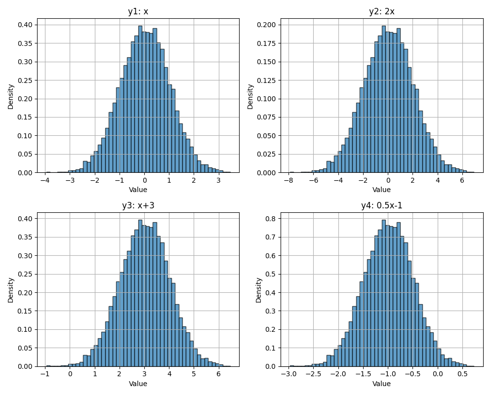

Skalierung und Verschiebung der Gaußverteilung. (Beachte die Skalen auf den x- und y-Achsen)

**Varianz und Leistung**

In der Signalverarbeitung ist für ein Signal **mit Mittelwert null** (Mittelwert ≈ 0) die Varianz gleich der **mittleren Leistung**. Deshalb verwenden wir diese Begriffe oft synonym:

.. math::
   P = \text{Var}(X) = E[X^2] \quad \text{(wenn } E[X] = 0\text{)}

Diese Beziehung ist fundamental für die Analyse von Rauschleistung, Signal-Rausch-Verhältnis (SNR) und Linkbudgets.

.. code-block:: python

 noise_power = 2.0
 n = np.random.randn(N) * np.sqrt(noise_power)
 print(np.var(n))  # wird ungefähr 2,0 sein

Kovarianz
##########

Die **Kovarianz** zwischen zwei Zufallsvariablen :math:`X` und :math:`Y` ist definiert als:

.. math::
   \text{Cov}(X,Y) = E[(X - E[X])(Y - E[Y])]

Eine äquivalente und oft bequemere Form ist:

.. math::
   \text{Cov}(X,Y) = E[XY] - E[X]E[Y]

Kovarianz misst, wie zwei Variablen gemeinsam variieren:

* Positive Kovarianz: sie neigen dazu, gemeinsam zu steigen und zu fallen
* Negative Kovarianz: eine neigt dazu zu steigen, wenn die andere fällt
* Null-Kovarianz: sie sind unkorreliert

Wenn beide Variablen den Mittelwert null haben, vereinfacht sich das zu:

.. math::
   \text{Cov}(X,Y) = E[XY]

Kovarianz hat Einheiten (sie ist nicht normiert), weshalb wir in der Praxis oft den **Korrelationskoeffizienten** (oder einfach Korrelation) verwenden:

.. math::
   \rho_{XY} = \frac{\text{Cov}(X,Y)}{\sigma_X \sigma_Y}

Dies ergibt einen dimensionslosen Wert zwischen −1 und +1.

Varianz einer Summe von Variablen
##################################

In der Signalverarbeitung haben wir es oft mit Summen von Zufallsvariablen zu tun, wie z.B. Signal plus Rauschen:

.. math::
   Z = X + Y

Die Varianz dieser Summe hängt davon ab, ob :math:`X` und :math:`Y` unabhängig sind (oder allgemeiner, korreliert sind).

Im allgemeinen Fall:

.. math::
   \text{Var}(X + Y) = \text{Var}(X) + \text{Var}(Y) + 2\,\text{Cov}(X,Y)

wobei :math:`\text{Cov}(X,Y)` die **Kovarianz** zwischen :math:`X` und :math:`Y` ist.

**Unabhängiger Fall**

Wenn :math:`X` und :math:`Y` unabhängig (oder einfach unkorreliert) sind, vereinfacht sich der Ausdruck zu:

.. math::
   \text{Var}(X + Y) = \text{Var}(X) + \text{Var}(Y)

Dieses Ergebnis ist in der Kommunikationstechnik äußerst wichtig. Wenn z.B. ein empfangenes Signal lautet:

.. math::
   R = S + N

wobei :math:`S` das Signal und :math:`N` unabhängiges Rauschen ist, dann ist die Gesamtleistung einfach die Summe von Signalleistung und Rauschleistung.

Deshalb sind SNR-Berechnungen so unkompliziert.

************************
Komplexe Zufallsvariablen
************************

In SDR arbeiten wir intensiv mit **komplexwertigen Signalen**, was bedeutet, dass wir auch mit komplexen Zufallsvariablen arbeiten. Eine komplexe Zufallsvariable hat die Form:

.. math::
   Z = X + jY

wobei :math:`X` und :math:`Y` beide reellwertige Zufallsvariablen sind, die die Inphase- (I) und Quadraturkomponenten (Q) darstellen.

**Komplexes Gaußsches Rauschen**

Die häufigste komplexe Zufallsvariable in der drahtlosen Kommunikation ist das **komplexe Gaußsche Rauschen**, bei dem sowohl :math:`X` als auch :math:`Y` unabhängige Gaußsche Zufallsvariablen mit derselben Varianz sind.

Wenn z.B. :math:`X \sim \mathcal{N}(\alpha_1, \sigma_1^2)` und :math:`Y \sim \mathcal{N}(\alpha_2, \sigma_2^2)` unabhängig sind, dann hat die komplexe Zufallsvariable :math:`Z = X + jY`:

* Mittelwert: :math:`E[Z] = E[X] + jE[Y] = \alpha_1 + j\alpha_2`
* Varianz (Leistung): :math:`\text{Var}(Z) = \text{Var}(X) + \text{Var}(Y) = \sigma_1^2 + \sigma_2^2`

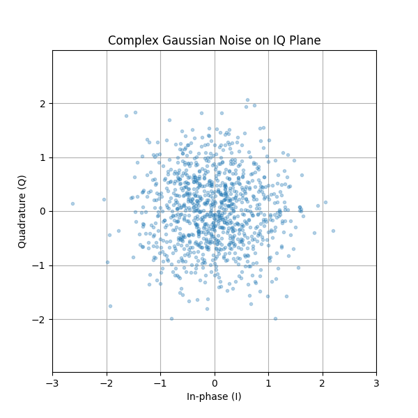

Deshalb verwenden wir folgendes, wenn wir komplexes Gaußsches Rauschen mit Einheitsleistung (Varianz = 1) erzeugen wollen:

.. code-block:: python

 N = 10000
 n = (np.random.randn(N) + 1j*np.random.randn(N)) / np.sqrt(2)
 print(np.var(n))  # ~ 1

Die Division durch :math:`\sqrt{2}` stellt sicher, dass die Gesamtleistung (Summe der I- und Q-Varianzen) gleich 1 ist.

.. code-block:: python

 # Ohne Normalisierung:
 n_raw = np.random.randn(N) + 1j*np.random.randn(N)
 print(np.var(np.real(n_raw)))  # ~ 1
 print(np.var(np.imag(n_raw)))  # ~ 1
 print(np.var(n_raw))            # ~ 2 (Gesamtleistung)

 # Mit Normalisierung:
 n_norm = n_raw / np.sqrt(2)
 print(np.var(n_norm))           # ~ 1 (Einheitsleistung)

****************
Zufallsprozesse
****************

Bisher haben wir Zufallsvariablen besprochen — zufällige Werte an einem einzelnen Punkt. Ein **Zufallsprozess** (auch als **stochastischer Prozess** bezeichnet) ist eine Sammlung von Zufallsvariablen, die durch die Zeit indiziert sind:

.. math::
   X(t) \quad \text{oder} \quad X[n] \text{ für diskrete Zeit}

Zu jedem Zeitpunkt :math:`t` ist :math:`X(t)` eine Zufallsvariable. Stelle dir einen Zufallsprozess als ein Signal vor, das sich zufällig im Laufe der Zeit entwickelt.

Beispiele in der drahtlosen Kommunikation:

* Rauschen am Empfänger: :math:`N(t)` oder :math:`N[n]`
* Ein Signal, das zeitlich variablem Fading ausgesetzt ist: :math:`H(t)S(t)`
* Stichproben von einem SDR: jeder Batch ist eine Realisierung eines Zufallsprozesses

**Stationäre Prozesse**

Ein Zufallsprozess ist **stationär**, wenn sich seine statistischen Eigenschaften nicht über die Zeit ändern. Insbesondere hat ein **Weitgehend stationärer (WSS, Wide-Sense Stationary)** Prozess:

* Konstanten Mittelwert: :math:`E[X(t)] = \mu` für alle :math:`t`
* Autokorrelation, die nur von der Zeitdifferenz abhängt: :math:`E[X(t)X(t+\tau)]` hängt nur von :math:`\tau` ab, nicht von :math:`t`

Viele Rauschquellen in drahtlosen Systemen sind annähernd stationär, was die Analyse erheblich vereinfacht.

**Weißes Rauschen**

**Weißes Rauschen** ist ein Zufallsprozess, bei dem Samples zu verschiedenen Zeitpunkten unkorreliert sind und die Leistungsspektraldichte über alle Frequenzen konstant ist. Additives Weißes Gaußsches Rauschen (AWGN) ist sowohl:

* **Weiß**: zeitlich unkorreliert, flaches Leistungsspektrum
* **Gaußsch**: jedes Sample ist Gaußsch verteilt

Wenn wir Rauschen in Python mit ``np.random.randn(N)`` erzeugen, ist jedes der :math:`N` Samples eine unabhängige Gaußsche Zufallsvariable, was einen Weißrauschprozess erzeugt.

Unabhängigkeit und Korrelation
################################

Zwei Zufallsvariablen :math:`X` und :math:`Y` sind **unabhängig**, wenn das Wissen über den Wert einer nichts über die andere aussagt. Mathematisch faktorisiert ihre gemeinsame PDF:

.. math::
   f_{X,Y}(x,y) = f_X(x) \cdot f_Y(y)

Unabhängigkeit ist eine starke Bedingung. Eine schwächere Bedingung ist **unkorreliert**, was bedeutet:

.. math::
   E[XY] = E[X]E[Y]

Für Gaußsche Zufallsvariablen impliziert Unkorreliertheit Unabhängigkeit (das ist eine spezielle Eigenschaft der Gaußverteilung).

Bei komplexem Gaußschen Rauschen sind I- und Q-Komponenten unabhängig:

.. code-block:: python

 N = 10000
 I = np.random.randn(N)
 Q = np.random.randn(N)

 # Unabhängigkeit über Korrelation überprüfen
 correlation = np.corrcoef(I, Q)[0, 1]
 print(f"Korrelation zwischen I und Q: {correlation:.4f}")  # ~ 0

***************************
Weiterführende Literatur
***************************

1. Papoulis, A., & Pillai, S. U. (2002). *Probability, Random Variables, and Stochastic Processes*. McGraw-Hill.
2. Kay, S. M. (2006). *Intuitive Probability and Random Processes using MATLAB®*. Springer.
3. https://en.wikipedia.org/wiki/Random_variable
4. https://en.wikipedia.org/wiki/Normal_distribution
5. https://en.wikipedia.org/wiki/Stochastic_process
6. https://en.wikipedia.org/wiki/Additive_white_Gaussian_noise
7. https://en.wikipedia.org/wiki/Signal-to-noise_ratio
