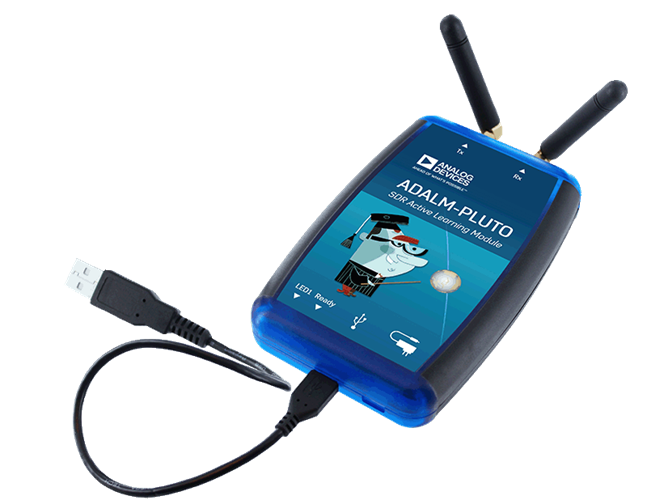
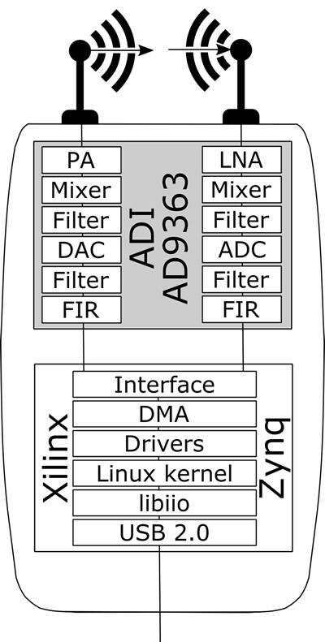
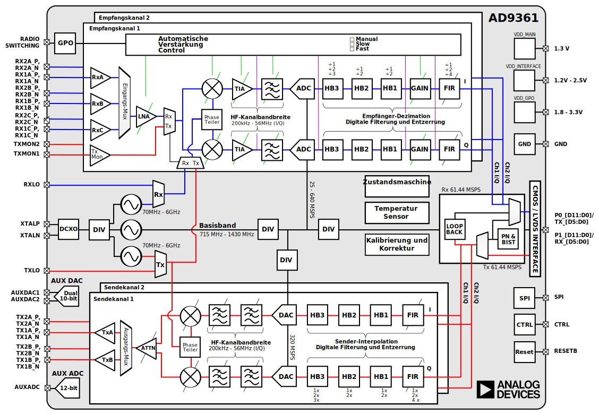
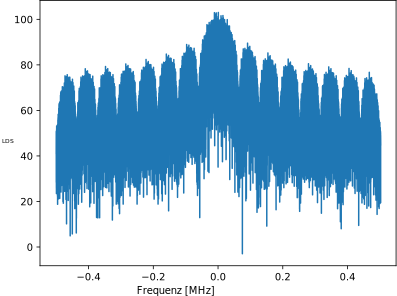
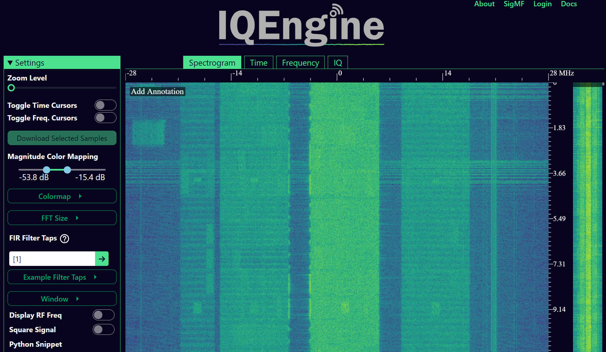
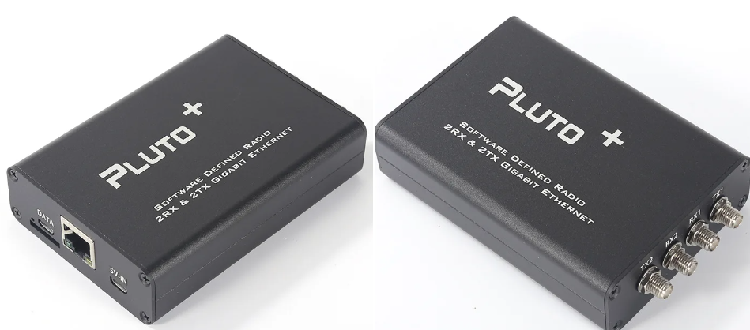
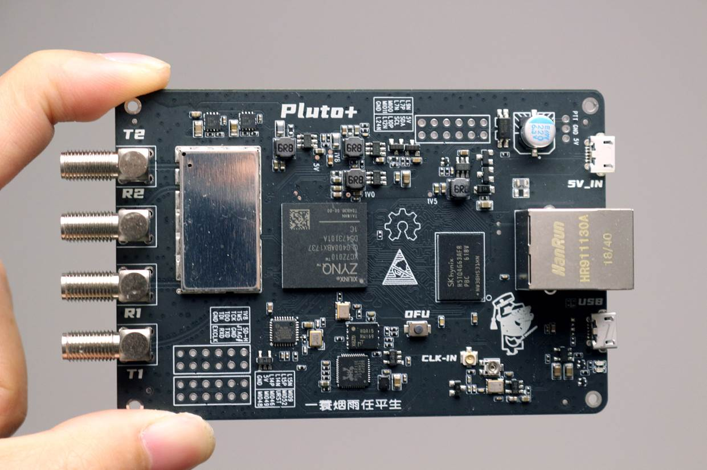
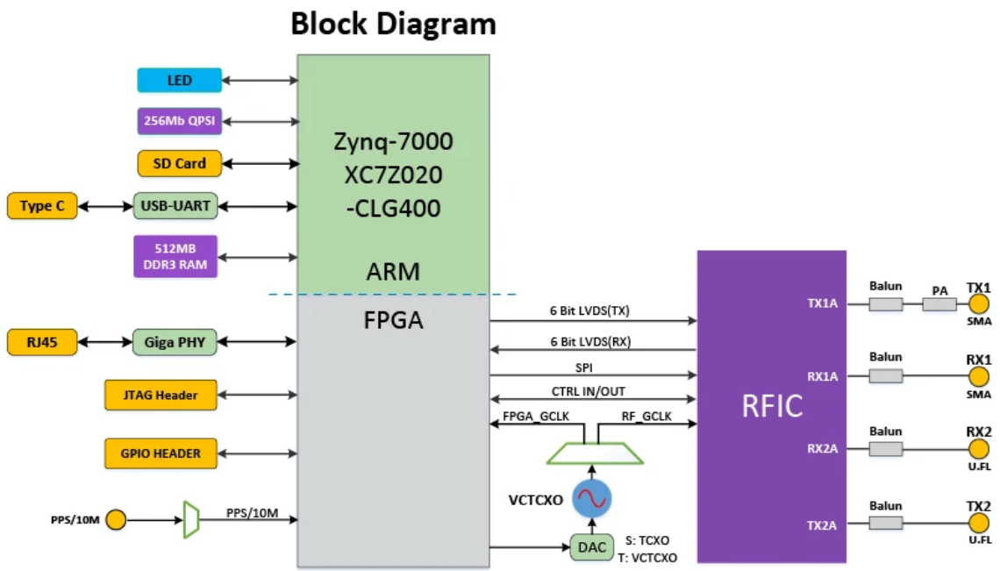
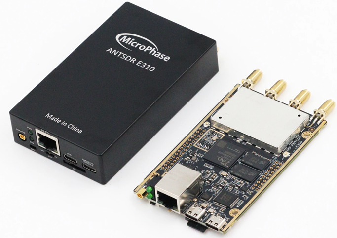
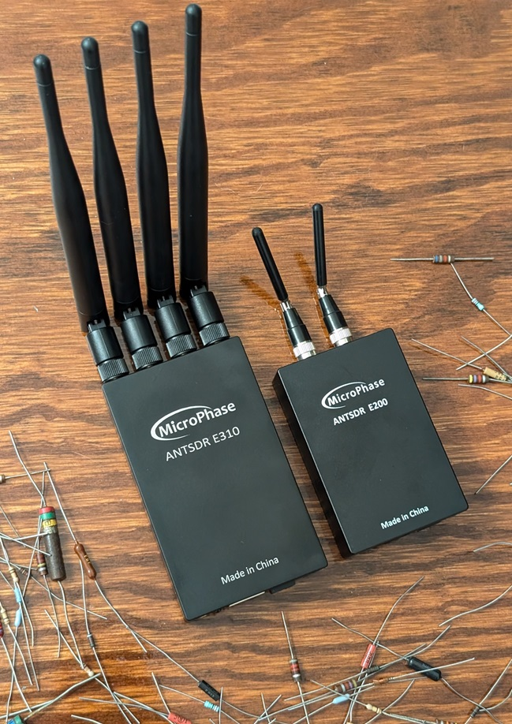

.. _pluto-chapter:

####################################
PlutoSDR in Python
####################################

In diesem Kapitel lernst du, wie du die Python-API für das `PlutoSDR <https://www.analog.com/en/design-center/evaluation-hardware-and-software/evaluation-boards-kits/adalm-pluto.html>`_ verwendest, ein kostengünstiges SDR von Analog Devices. Wir behandeln die Installationsschritte für das PlutoSDR, um Treiber und Software zum Laufen zu bringen, und besprechen dann das Senden und Empfangen mit dem PlutoSDR in Python. Zuletzt zeigen wir, wie du `Maia SDR <https://maia-sdr.org/>`_ und `IQEngine <https://iqengine.org/>`_ verwendest, um das PlutoSDR in einen leistungsstarken Spektrumanalysator zu verwandeln!

************************
Überblick über das PlutoSDR
************************

Das PlutoSDR (auch bekannt als ADALM-PLUTO) ist ein kostengünstiges SDR (etwas über 200 US-Dollar), das in der Lage ist, Signale von 70 MHz bis 6 GHz zu senden und zu empfangen. Es ist ein großartiges SDR für alle, die über das 20-Dollar-RTL-SDR hinausgewachsen sind. Das Pluto verwendet eine USB-2.0-Schnittstelle, was die Abtastrate auf etwa 5 MHz begrenzt, wenn du 100 % der Samples über die Zeit empfangen möchtest. Dennoch kann es bis zu 61 MHz abtasten, und du kannst zusammenhängende Bursts von bis zu etwa 10 Millionen Samples auf einmal aufnehmen, sodass das Pluto eine enorme Menge an Spektrum gleichzeitig erfassen kann. Es ist technisch gesehen ein 2x2-Gerät, aber der zweite Sende- und Empfangskanal ist nur über U.FL-Steckverbinder im Gehäuse zugänglich, und sie teilen sich dieselben Oszillatoren, sodass du nicht gleichzeitig auf zwei verschiedenen Frequenzen empfangen kannst. Unten ist das Blockdiagramm des Pluto sowie der AD936x gezeigt, der integrierte HF-Schaltkreis (RFIC) im Inneren des Pluto.

************************
Software/Treiber Installation
************************

VM einrichten
#############

Der in diesem Lehrbuch bereitgestellte Python-Code sollte unter Windows, Mac und Linux funktionieren, aber die folgenden Installationsanweisungen gelten speziell für Ubuntu 22. Wenn du Schwierigkeiten hast, die Software auf deinem Betriebssystem zu installieren, und den `von Analog Devices bereitgestellten Anweisungen <https://wiki.analog.com/university/tools/pluto/users/quick_start>`_ folgst, empfehle ich, eine Ubuntu-22-VM zu installieren und die folgenden Anweisungen auszuprobieren. Alternativ, wenn du Windows 11 verwendest, läuft das Windows-Subsystem für Linux (WSL) mit Ubuntu 22 recht gut und unterstützt Grafik von Haus aus.

1. Installiere und öffne `VirtualBox <https://www.virtualbox.org/wiki/Downloads>`_.
2. Erstelle eine neue VM. Für die Speichergröße empfehle ich, 50 % des RAM deines Computers zu verwenden.
3. Erstelle die virtuelle Festplatte, wähle VDI und weise dynamisch Größe zu. 15 GB sollten ausreichen. Wenn du auf der sicheren Seite sein möchtest, kannst du mehr verwenden.
4. Lade Ubuntu 22 Desktop .iso herunter – https://ubuntu.com/download/desktop
5. Starte die VM. Du wirst nach Installationsmedien gefragt. Wähle die Ubuntu-22-Desktop-.iso-Datei. Wähle „Ubuntu installieren", verwende Standardoptionen, und ein Popup warnt dich vor den Änderungen, die du vornehmen wirst. Klicke auf „Fortfahren". Wähle Name/Passwort und warte dann, bis die VM die Initialisierung abgeschlossen hat. Nach dem Abschluss wird die VM neu gestartet, aber du solltest die VM nach dem Neustart ausschalten.
6. Gehe in die VM-Einstellungen (das Zahnrad-Symbol).
7. Wähle unter System > Prozessor mindestens 3 CPUs. Wenn du eine echte Grafikkarte hast, wähle unter Anzeige > Videospeicher einen viel höheren Wert.
8. Starte deine VM.
9. Ich empfehle, VM-Gastzusätze zu installieren. Gehe innerhalb der VM zu Geräte > Gasterweiterungen-CD einlegen > klicke auf „Ausführen", wenn ein Fenster erscheint. Folge den Anweisungen. Starte die VM neu. Die gemeinsame Zwischenablage kann über Geräte > Gemeinsame Zwischenablage > Bidirektional aktiviert werden.

PlutoSDR verbinden
##################

1. Wenn du OSX verwendest, aktiviere innerhalb von OSX (nicht in der VM) in den Systemeinstellungen „Kernel-Erweiterungen". Installiere dann HoRNDIS (möglicherweise musst du danach neu starten).
2. Wenn du Windows verwendest, installiere diesen Treiber: https://github.com/analogdevicesinc/plutosdr-m2k-drivers-win/releases/download/v0.7/PlutoSDR-M2k-USB-Drivers.exe
3. Wenn du Linux verwendest, musst du nichts Besonderes tun.
4. Schließe das Pluto über USB an den Host-Rechner an. Achte darauf, den mittleren USB-Anschluss am Pluto zu verwenden, da der andere nur zur Stromversorgung dient. Das Anschließen des Pluto sollte einen virtuellen Netzwerkadapter erstellen, d.h. das Pluto erscheint wie ein USB-Ethernet-Adapter.
5. Öffne auf dem Host-Rechner (nicht in der VM) ein Terminal oder dein bevorzugtes Ping-Tool und pinge 192.168.2.1. Wenn das nicht funktioniert, halte an und behebe das Netzwerkinterface-Problem.
6. Öffne innerhalb der VM ein neues Terminal.
7. Pinge 192.168.2.1. Wenn das nicht funktioniert, halte hier an und behebe das Problem. Während des Pingens trenne dein Pluto und stelle sicher, dass das Pingen stoppt. Wenn es weiter pingt, befindet sich etwas anderes mit dieser IP-Adresse im Netzwerk, und du musst die IP des Pluto (oder des anderen Geräts) ändern, bevor du fortfährst.
8. Notiere dir die IP-Adresse des Pluto, da du sie benötigst, wenn wir mit dem Pluto in Python arbeiten.

PlutoSDR-Treiber installieren
##############################

Die folgenden Terminal-Befehle sollten die neueste Version von folgendem erstellen und installieren:

1. **libiio**, Analog Devices' „plattformübergreifende" Bibliothek zur Anbindung von Hardware
2. **libad9361-iio**, der AD9361 ist der spezifische HF-Chip im PlutoSDR
3. **pyadi-iio**, die Python-API des Pluto, *das ist unser eigentliches Ziel*, aber es hängt von den beiden vorherigen Bibliotheken ab

.. code-block:: bash

 sudo apt-get update
 sudo apt-get install build-essential git libxml2-dev bison flex libcdk5-dev cmake python3-pip libusb-1.0-0-dev libavahi-client-dev libavahi-common-dev libaio-dev
 cd ~
 git clone --branch v0.23 https://github.com/analogdevicesinc/libiio.git
 cd libiio
 mkdir build
 cd build
 cmake -DPYTHON_BINDINGS=ON ..
 make -j$(nproc)
 sudo make install
 sudo ldconfig

 cd ~
 git clone https://github.com/analogdevicesinc/libad9361-iio.git
 cd libad9361-iio
 mkdir build
 cd build
 cmake ..
 make -j$(nproc)
 sudo make install

 cd ~
 git clone --branch v0.0.14 https://github.com/analogdevicesinc/pyadi-iio.git
 cd pyadi-iio
 pip3 install --upgrade pip
 pip3 install -r requirements.txt
 sudo python3 setup.py install

PlutoSDR-Treiber testen
########################

Öffne ein neues Terminal (in deiner VM) und gib folgende Befehle ein:

.. code-block:: bash

 python3
 import adi
 sdr = adi.Pluto('ip:192.168.2.1') # oder die IP deines Pluto
 sdr.sample_rate = int(2.5e6)
 sdr.rx()

Wenn du bis hierher ohne Fehler gekommen bist, kannst du mit den nächsten Schritten fortfahren.

IP-Adresse des Pluto ändern
############################

Wenn die Standard-IP 192.168.2.1 aus irgendeinem Grund nicht funktioniert, weil du bereits ein 192.168.2.0-Subnetz hast oder weil du mehrere Plutos gleichzeitig verbinden möchtest, kannst du die IP mit diesen Schritten ändern:

1. Bearbeite die Datei config.txt auf dem PlutoSDR-Massenspeichergerät (d.h. dem USB-Laufwerk, das nach dem Anschließen des Pluto erscheint). Gib die neue gewünschte IP ein.
2. Wirf das Massenspeichergerät aus (ziehe das Pluto nicht ab!). In Ubuntu 22 gibt es ein Auswurf-Symbol neben dem PlutoSDR-Gerät im Datei-Explorer.
3. Warte einige Sekunden und trenne dann das Pluto und schließe es wieder an. Überprüfe die config.txt, um festzustellen, ob deine Änderungen gespeichert wurden.

Beachte, dass dieser Vorgang auch zum Aufspielen eines anderen Firmware-Images auf das Pluto verwendet wird. Weitere Details findest du unter https://wiki.analog.com/university/tools/pluto/users/firmware.

PlutoSDR „hacken" zur Erweiterung des HF-Bereichs
####################################################

Das PlutoSDR wird mit einem eingeschränkten Mittelfrequenzbereich und einer begrenzten Abtastrate geliefert, aber der zugrunde liegende Chip ist für viel höhere Frequenzen ausgelegt. Folge diesen Schritten, um den vollen Frequenzbereich des Chips freizuschalten. Bitte beachte, dass dieser Vorgang von Analog Devices bereitgestellt wird und daher so risikoarm wie möglich ist. Die Frequenzbeschränkung des PlutoSDR hängt damit zusammen, dass Analog Devices die AD936x-Chips nach strengen Leistungsanforderungen bei höheren Frequenzen verlagern (engl.„binning" bzw. sortiert). Als SDR-Enthusiasten und Experimentatoren sind wir nicht allzu besorgt über diese Leistungsanforderungen.

Zeit zum Hacken! Öffne ein Terminal (entweder Host oder VM, es spielt keine Rolle):

.. code-block:: bash

 ssh root@192.168.2.1

Das Standardpasswort lautet :code:`analog`

Du solltest den PlutoSDR-Willkommensbildschirm sehen. Du hast jetzt eine SSH-Verbindung zum ARM-Prozessor des Pluto hergestellt!
Wenn du ein Pluto mit Firmware-Version 0.31 oder niedriger hast, gib die folgenden Befehle ein:

.. code-block:: bash

 fw_setenv attr_name compatible
 fw_setenv attr_val ad9364
 reboot

Und für 0.32 und höher verwende:

.. code-block:: bash

 fw_setenv compatible ad9364
 reboot

Du solltest jetzt in der Lage sein, bis auf 6 GHz zu tunen und bis auf 70 MHz herunterzugehen, ganz zu schweigen von einer Abtastrate von bis zu 56 MHz!

************************
Empfangen
************************

Das Abtasten mit der Python-API des PlutoSDR ist unkompliziert. Bei jeder SDR-Anwendung müssen wir die Mittelfrequenz, die Abtastrate und die Verstärkung (oder ob automatische Verstärkungsregelung verwendet werden soll) angeben. Es kann weitere Details geben, aber diese drei Parameter sind notwendig, damit das SDR genügend Informationen hat, um Samples zu empfangen. Einige SDRs haben einen Befehl, um das Abtasten zu starten, während andere wie das Pluto mit dem Abtasten beginnen, sobald es initialisiert wird. Sobald der interne Puffer des SDR voll ist, werden die ältesten Samples verworfen. Alle SDR-APIs haben eine Art „Samples empfangen"-Funktion, und beim Pluto ist das rx(), die einen Batch von Samples zurückgibt. Die spezifische Anzahl von Samples pro Batch wird durch die zuvor eingestellte Puffergröße definiert.

Der folgende Code setzt voraus, dass du die Python-API des Pluto installiert hast. Dieser Code initialisiert das Pluto, stellt die Abtastrate auf 1 MHz ein, setzt die Mittelfrequenz auf 100 MHz und stellt die Verstärkung auf 70 dB ein, wobei die automatische Verstärkungsregelung ausgeschaltet ist. Beachte, dass die Reihenfolge, in der du Mittelfrequenz, Verstärkung und Abtastrate festlegst, normalerweise keine Rolle spielt. Im folgenden Code-Snippet teilen wir dem Pluto mit, dass wir 10.000 Samples pro Aufruf von rx() erhalten möchten. Wir geben die ersten 10 Samples aus.

.. code-block:: python

    import numpy as np
    import adi

    sample_rate = 1e6 # Hz
    center_freq = 100e6 # Hz
    num_samps = 10000 # Anzahl der Samples pro rx()-Aufruf

    sdr = adi.Pluto('ip:192.168.2.1')
    sdr.gain_control_mode_chan0 = 'manual'
    sdr.rx_hardwaregain_chan0 = 70.0 # dB
    sdr.rx_lo = int(center_freq)
    sdr.sample_rate = int(sample_rate)
    sdr.rx_rf_bandwidth = int(sample_rate) # Filterbreite, vorerst gleich der Abtastrate setzen
    sdr.rx_buffer_size = num_samps

    samples = sdr.rx() # Samples vom Pluto empfangen
    print(samples[0:10])

Vorerst werden wir mit diesen Samples nichts Interessantes anstellen, aber der Rest dieses Lehrbuchs ist voll von Python-Code, der auf IQ-Samples wie die oben empfangenen arbeitet.

Empfangsverstärkung
###################

Das Pluto kann entweder mit einer festen Empfangsverstärkung oder einer automatischen konfiguriert werden. Eine automatische Verstärkungsregelung (AGC) passt die Empfangsverstärkung automatisch an, um einen starken Signalpegel aufrechtzuerhalten (-12 dBFS für alle Interessierten). AGC darf nicht mit dem Analog-Digital-Wandler (ADC) verwechselt werden, der das Signal digitalisiert. Technisch gesehen ist der AGC ein geschlossener Rückkopplungskreis, der die Verstärkung des Verstärkers in Abhängigkeit vom empfangenen Signal regelt. Sein Ziel ist es, trotz eines schwankenden Eingangsleistungspegels einen konstanten Ausgangsleistungspegel aufrechtzuerhalten. In der Regel passt der AGC die Verstärkung an, um eine Sättigung des Empfängers zu vermeiden (d.h. das Erreichen der Obergrenze des ADC-Bereichs), während das Signal gleichzeitig so viele ADC-Bits wie möglich „ausfüllt".

Der integrierte HF-Schaltkreis (RFIC) im PlutoSDR hat ein AGC-Modul mit einigen verschiedenen Einstellungen. (Ein RFIC ist ein Chip, der als Transceiver fungiert: Er sendet und empfängt Radiowellen.) Zunächst ist zu beachten, dass die Empfangsverstärkung am Pluto einen Bereich von 0 bis 74,5 dB hat. Im „manuellen" AGC-Modus ist der AGC ausgeschaltet und du musst dem Pluto mitteilen, welche Empfangsverstärkung es verwenden soll, z.B.:

.. code-block:: python

  sdr.gain_control_mode_chan0 = "manual" # AGC ausschalten
  gain = 50.0 # zulässiger Bereich ist 0 bis 74,5 dB
  sdr.rx_hardwaregain_chan0 = gain # Empfangsverstärkung einstellen

Wenn du den AGC aktivieren möchtest, musst du einen von zwei Modi wählen:

1. :code:`sdr.gain_control_mode_chan0 = "slow_attack"`
2. :code:`sdr.gain_control_mode_chan0 = "fast_attack"`

Wenn der AGC aktiviert ist, gibst du keinen Wert für :code:`rx_hardwaregain_chan0` an. Er wird ignoriert, da das Pluto selbst die Verstärkung für das Signal anpasst. Das Pluto hat zwei Modi für den AGC: schneller Angriff und langsamer Angriff, wie im obigen Code-Snippet gezeigt. Der Unterschied zwischen den beiden ist intuitiv. Der Fast-Attack-Modus reagiert schneller auf Signale. Mit anderen Worten: Der Verstärkungswert ändert sich schneller, wenn sich der empfangene Signalpegel ändert. Die Anpassung an Signalleistungspegel kann wichtig sein, insbesondere für Systeme mit Zeitduplex (TDD), die dieselbe Frequenz zum Senden und Empfangen verwenden. Die Einstellung der Verstärkungsregelung auf den Fast-Attack-Modus begrenzt in diesem Szenario die Signaldämpfung. In beiden Modi maximiert der AGC die Verstärkungseinstellung, wenn kein Signal vorhanden ist und nur Rauschen vorliegt; wenn ein Signal erscheint, sättigt es kurzzeitig den Empfänger, bis der AGC reagieren und die Verstärkung herunterregeln kann. Du kannst den aktuellen Verstärkungspegel immer in Echtzeit mit folgendem Befehl überprüfen:

.. code-block:: python

 sdr._get_iio_attr('voltage0','hardwaregain', False)

Weitere Details über den AGC des Pluto, wie z.B. das Ändern der erweiterten AGC-Einstellungen, findest du im `Abschnitt „RX Gain Control" dieser Seite <https://wiki.analog.com/resources/tools-software/linux-drivers/iio-transceiver/ad9361>`_.

************************
Senden
************************

Bevor du ein Signal mit deinem Pluto über die Luft überträgst, stelle sicher, dass du ein SMA-Kabel zwischen dem TX-Anschluss des Pluto und dem Gerät verbindest, das als Empfänger dient. Es ist wichtig, immer zunächst über ein Kabel zu übertragen, besonders während du lernst, *wie* man sendet, um sicherzustellen, dass sich das SDR so verhält, wie du es beabsichtigst. Halte deine Sendeleistung stets sehr niedrig, damit du den Empfänger nicht übersteuert, da das Kabel das Signal nicht wie der Funkkanal dämpft. Wenn du ein Dämpfungsglied besitzt (z.B. 30 dB), wäre jetzt ein guter Zeitpunkt, es zu verwenden. Wenn du kein anderes SDR oder einen Spektrumanalysator als Empfänger hast, kannst du theoretisch den RX-Anschluss desselben Pluto verwenden, aber das kann kompliziert werden. Ich empfehle, ein 10-Dollar-RTL-SDR als empfangendes SDR zu verwenden.

Das Senden ist dem Empfangen sehr ähnlich, nur dass wir dem SDR anstatt zu sagen, es soll eine bestimmte Anzahl von Samples empfangen, eine bestimmte Anzahl von Samples zum Senden geben. Anstatt :code:`rx_lo` werden wir :code:`tx_lo` einstellen, um anzugeben, auf welcher Trägerfrequenz gesendet werden soll. Die Abtastrate wird zwischen RX und TX geteilt, sodass wir sie wie gewohnt einstellen werden. Ein vollständiges Beispiel für das Senden ist unten gezeigt, wo wir einen Sinuston bei +100 kHz erzeugen und dann das komplexe Signal bei einer Trägerfrequenz von 915 MHz übertragen, sodass der Empfänger einen Träger bei 915,1 MHz sieht. Es gibt eigentlich keinen praktischen Grund dafür; wir hätten die center_freq einfach auf 915,1e6 setzen und ein Array von 1en übertragen können, aber wir wollten komplexe Samples zu Demonstrationszwecken erzeugen.

.. code-block:: python

    import numpy as np
    import adi

    sample_rate = 1e6 # Hz
    center_freq = 915e6 # Hz

    sdr = adi.Pluto("ip:192.168.2.1")
    sdr.sample_rate = int(sample_rate)
    sdr.tx_rf_bandwidth = int(sample_rate) # Filtergrenzfrequenz, gleich der Abtastrate setzen
    sdr.tx_lo = int(center_freq)
    sdr.tx_hardwaregain_chan0 = -50 # Erhöhen für mehr Sendeleistung, gültiger Bereich ist -90 bis 0 dB

    N = 10000 # Anzahl der auf einmal zu sendenden Samples
    t = np.arange(N)/sample_rate
    samples = 0.5*np.exp(2.0j*np.pi*100e3*t) # Sinuston von 100 kHz, sollte beim Empfänger bei 915,1 MHz erscheinen
    samples *= 2**14 # Das PlutoSDR erwartet Samples zwischen -2^14 und +2^14, nicht -1 und +1 wie einige SDRs

    # Unseren Batch von Samples 100 Mal senden, insgesamt 1 Sekunde, wenn USB mithalten kann
    for i in range(100):
        sdr.tx(samples) # den Batch von Samples einmal senden

Hier einige Hinweise zu diesem Code. Zunächst möchtest du deine IQ-Samples so simulieren, dass sie zwischen -1 und 1 liegen, aber bevor du sie überträgst, musst du sie aufgrund der Implementierung der :code:`tx()`-Funktion von Analog Devices mit 2^14 skalieren. Wenn du dir nicht sicher bist, welche Minimal- und Maximalwerte deine Samples haben, gib sie einfach mit :code:`print(np.min(samples), np.max(samples))` aus oder schreibe eine if-Anweisung, um sicherzustellen, dass sie nie über 1 oder unter -1 gehen (vorausgesetzt, dieser Code kommt vor der 2^14-Skalierung). Was die Sendeleistung betrifft, ist der Bereich -90 bis 0 dB, wobei 0 dB die höchste Sendeleistung ist. Wir möchten immer mit einer niedrigen Sendeleistung beginnen und sie bei Bedarf erhöhen, daher ist die Verstärkung standardmäßig auf -50 dB eingestellt, was am unteren Ende liegt. Stelle sie nicht einfach auf 0 dB, nur weil dein Signal nicht erscheint; es könnte etwas anderes falsch sein, und du möchtest deinen Empfänger nicht beschädigen.

Samples wiederholt senden
##########################

Wenn du denselben Satz von Samples kontinuierlich wiederholen möchtest, anstatt eine for/while-Schleife in Python wie oben zu verwenden, kannst du dem Pluto dies mit nur einer Zeile mitteilen:

.. code-block:: python

 sdr.tx_cyclic_buffer = True # Zyklische Puffer aktivieren

Du würdest dann deine Samples wie gewohnt senden: :code:`sdr.tx(samples)` nur einmal, und das Pluto sendet das Signal unbegrenzt, bis der :code:`sdr`-Objektdestruktor aufgerufen wird. Um die kontinuierlich gesendeten Samples zu ändern, kannst du nicht einfach erneut :code:`sdr.tx(samples)` mit einem neuen Satz von Samples aufrufen; du musst zuerst :code:`sdr.tx_destroy_buffer()` aufrufen und dann :code:`sdr.tx(samples)`.

Rechtlich über die Luft senden
################################

Unzählige Male wurden ich von Studenten gefragt, auf welchen Frequenzen sie mit einer Antenne senden dürfen (in den Vereinigten Staaten). Die kurze Antwort ist: auf keiner, soweit ich weiß. Wenn Menschen auf spezifische Vorschriften hinweisen, die von Sendeleistungsgrenzen sprechen, beziehen sie sich normalerweise auf die `FCC-Vorschriften „Titel 47, Teil 15" (47 CFR 15) <https://www.ecfr.gov/cgi-bin/text-idx?SID=7ce538354be86061c7705af3a5e17f26&mc=true&node=pt47.1.15&rgn=div5>`_. Aber das sind Vorschriften für Hersteller, die Geräte bauen und verkaufen, die im ISM-Band betrieben werden, und die Vorschriften erörtern, wie sie getestet werden sollen. Ein Part-15-Gerät ist eines, bei dem eine Einzelperson keine Lizenz benötigt, um das Gerät im verwendeten Spektrum zu betreiben, aber das Gerät selbst muss autorisiert/zertifiziert sein, bevor es vermarktet und verkauft wird. Die Part-15-Vorschriften legen maximale Sende- und Empfangsleistungspegel für die verschiedenen Spektralbereiche fest, aber keine davon gilt tatsächlich für eine Person, die ein Signal mit einem SDR oder einem selbst gebauten Radio überträgt. Die einzigen Vorschriften, die ich finden konnte und die sich auf Radios beziehen, die keine eigentlichen Produkte sind, galten speziell für den Betrieb einer Kleinsendestelle im AM/FM-Band. Es gibt auch einen Abschnitt über „selbst gebaute Geräte", aber er besagt ausdrücklich, dass er nicht für etwas gilt, das aus einem Bausatz zusammengebaut wurde, und es wäre eine Dehnung zu sagen, ein Sendesystem mit einem SDR sei ein selbst gebautes Gerät. Zusammenfassend sind die FCC-Vorschriften nicht so einfach wie „du kannst auf diesen Frequenzen nur unterhalb dieser Leistungspegel senden", sondern vielmehr eine riesige Menge von Regeln für Tests und Compliance.

Eine andere Betrachtungsweise wäre zu sagen: „Nun, das sind keine Part-15-Geräte, aber lass uns die Part-15-Regeln so befolgen, als wären sie es." Für das 915-MHz-ISM-Band lauten die Regeln, dass „die Feldstärke jeglicher Emissionen innerhalb des angegebenen Frequenzbandes 500 Mikrovolt/Meter bei 30 Metern nicht überschreiten darf. Die Emissionsgrenze in diesem Absatz basiert auf Messinstrumenten, die einen Mittelwertdetektor verwenden." Wie du sehen kannst, ist es nicht so einfach wie eine maximale Sendeleistung in Watt.

Wenn du deine Amateurfunklizenz hast, erlaubt die FCC die Nutzung bestimmter Bänder, die für den Amateurfunk reserviert sind. Es gibt immer noch Richtlinien zu befolgen und maximale Sendeleistungen, aber zumindest sind diese Zahlen in Watt effektiver Strahlungsleistung angegeben. `Diese Infografik <https://www.arrl.org/files/file/Regulatory/Band%20Chart/Hambands4_Color_11x8_5.pdf>`_ zeigt, welche Bänder je nach Lizenzklasse (Technician, General und Extra) zur Verfügung stehen. Ich empfehle jedem, der mit SDRs senden möchte, die Amateurfunklizenz zu erwerben; weitere Informationen findest du auf `ARRL's Getting Licensed-Seite <http://www.arrl.org/getting-licensed>`_.

Wenn jemand mehr Details darüber hat, was erlaubt und was nicht erlaubt ist, schreib mir bitte eine E-Mail.

************************************************
Gleichzeitiges Senden und Empfangen
************************************************

Mit dem tx_cyclic_buffer-Trick kannst du ganz einfach gleichzeitig empfangen und senden, indem du den Sender startest und dann empfängst.
Das folgende Codebeispiel zeigt das gleichzeitige Senden eines QPSK-Signals im 915-MHz-Band, den Empfang und die Darstellung der Leistungsspektraldichte (PSD).

.. code-block:: python

    import numpy as np
    import adi
    import matplotlib.pyplot as plt

    sample_rate = 1e6 # Hz
    center_freq = 915e6 # Hz
    num_samps = 100000 # Anzahl der Samples pro rx()-Aufruf

    sdr = adi.Pluto("ip:192.168.2.1")
    sdr.sample_rate = int(sample_rate)

    # TX konfigurieren
    sdr.tx_rf_bandwidth = int(sample_rate) # Filtergrenzfrequenz, gleich der Abtastrate setzen
    sdr.tx_lo = int(center_freq)
    sdr.tx_hardwaregain_chan0 = -50 # Erhöhen für mehr Sendeleistung, gültiger Bereich ist -90 bis 0 dB

    # RX konfigurieren
    sdr.rx_lo = int(center_freq)
    sdr.rx_rf_bandwidth = int(sample_rate)
    sdr.rx_buffer_size = num_samps
    sdr.gain_control_mode_chan0 = 'manual'
    sdr.rx_hardwaregain_chan0 = 0.0 # dB, erhöhen für mehr Empfangsverstärkung, aber vorsichtig sein, ADC nicht zu sättigen

    # Sendesignal erstellen (QPSK, 16 Samples pro Symbol)
    num_symbols = 1000
    x_int = np.random.randint(0, 4, num_symbols) # 0 bis 3
    x_degrees = x_int*360/4.0 + 45 # 45, 135, 225, 315 Grad
    x_radians = x_degrees*np.pi/180.0 # sin() und cos() nehmen Radiant
    x_symbols = np.cos(x_radians) + 1j*np.sin(x_radians) # erzeugt unsere QPSK-Komplexsymbole
    samples = np.repeat(x_symbols, 16) # 16 Samples pro Symbol (Rechteckimpulse)
    samples *= 2**14 # Das PlutoSDR erwartet Samples zwischen -2^14 und +2^14, nicht -1 und +1 wie einige SDRs

    # Sender starten
    sdr.tx_cyclic_buffer = True # Zyklische Puffer aktivieren
    sdr.tx(samples) # Senden beginnen

    # Puffer zur Sicherheit leeren
    for i in range (0, 10):
        raw_data = sdr.rx()

    # Samples empfangen
    rx_samples = sdr.rx()
    print(rx_samples)

    # Senden stoppen
    sdr.tx_destroy_buffer()

    # Leistungsspektraldichte berechnen (Frequenzbereichsversion des Signals)
    psd = np.abs(np.fft.fftshift(np.fft.fft(rx_samples)))**2
    psd_dB = 10*np.log10(psd)
    f = np.linspace(sample_rate/-2, sample_rate/2, len(psd))

    # Zeitbereich darstellen
    plt.figure(0)
    plt.plot(np.real(rx_samples[::100]))
    plt.plot(np.imag(rx_samples[::100]))
    plt.xlabel("Zeit")

    # Frequenzbereich darstellen
    plt.figure(1)
    plt.plot(f/1e6, psd_dB)
    plt.xlabel("Frequenz [MHz]")
    plt.ylabel("PSD")
    plt.show()

Du solltest etwas wie das Folgende sehen, vorausgesetzt, du hast richtige Antennen oder ein Kabel angeschlossen:

Es ist eine gute Übung, :code:`sdr.tx_hardwaregain_chan0` und :code:`sdr.rx_hardwaregain_chan0` langsam anzupassen, um sicherzustellen, dass das empfangene Signal wie erwartet schwächer/stärker wird.

**********************************
Maia SDR und IQEngine
**********************************

Möchtest du dein Pluto als Echtzeit-Spektrumanalysator auf deinem PC oder Smartphone verwenden? Das Open-Source-Projekt `Maia SDR <https://maia-sdr.org/>`_ bietet ein modifiziertes Firmware-Image für das Pluto, das eine FFT auf dem FPGA des Pluto ausführt und einen Webserver auf dem ARM-Prozessor des Pluto betreibt! Diese Weboberfläche wird verwendet, um die Frequenz und andere SDR-Parameter einzustellen und das Spektrogramm in einer Wasserfalldarstellung anzuzeigen. Du kannst Aufnahmen der rohen IQ-Samples bis zu 400 MB speichern und sie auf deinen Computer/dein Telefon herunterladen oder in IQEngine anzeigen.

Installiere die neueste Maia-Pluto-Firmware, indem du das `neueste Release <https://github.com/maia-sdr/plutosdr-fw/releases/>`_ herunterlädst, insbesondere die Datei namens :code:`plutosdr-fw-maia-sdr-vX.Y.Z.zip`. Entpacke die Datei und kopiere die :code:`pluto.frm`-Datei auf das Massenspeichergerät deines Pluto (es ähnelt einem USB-Flash-Laufwerk), dann wirf das Pluto aus (ziehe es nicht ab). Dies ist derselbe Vorgang wie das Aktualisieren der Firmware des Pluto; es blinkt mehrere Minuten lang und startet dann neu. Stelle abschließend eine SSH-Verbindung zum Pluto her, wie wir es im Abschnitt „Pluto hacken" getan haben, indem du :code:`ssh root@192.168.2.1` in einem Terminal eingibst, mit dem Standardpasswort :code:`analog`. Sobald du verbunden bist, musst du die folgenden drei Befehle nacheinander ausführen:

.. code-block:: bash

 fw_setenv ramboot_verbose 'adi_hwref;echo Copying Linux from DFU to RAM... && run dfu_ram;if run adi_loadvals; then echo Loaded AD936x refclk frequency and model into devicetree; fi; envversion;setenv bootargs console=ttyPS0,115200 maxcpus=${maxcpus} rootfstype=ramfs root=/dev/ram0 rw earlyprintk clk_ignore_unused uio_pdrv_genirq.of_id=uio_pdrv_genirq uboot="${uboot-version}" && bootm ${fit_load_address}#${fit_config}'

 fw_setenv qspiboot_verbose 'adi_hwref;echo Copying Linux from QSPI flash to RAM... && run read_sf && if run adi_loadvals; then echo Loaded AD936x refclk frequency and model into devicetree; fi; envversion;setenv bootargs console=ttyPS0,115200 maxcpus=${maxcpus} rootfstype=ramfs root=/dev/ram0 rw earlyprintk clk_ignore_unused uio_pdrv_genirq.of_id=uio_pdrv_genirq uboot="${uboot-version}" && bootm ${fit_load_address}#${fit_config} || echo BOOT failed entering DFU mode ... && run dfu_sf'

 fw_setenv qspiboot 'set stdout nulldev;adi_hwref;test -n $PlutoRevA || gpio input 14 && set stdout serial@e0001000 && sf probe && sf protect lock 0 100000 && run dfu_sf;  set stdout serial@e0001000;itest *f8000258 == 480003 && run clear_reset_cause && run dfu_sf; itest *f8000258 == 480007 && run clear_reset_cause && run ramboot_verbose; itest *f8000258 == 480006 && run clear_reset_cause && run qspiboot_verbose; itest *f8000258 == 480002 && run clear_reset_cause && exit; echo Booting silently && set stdout nulldev; run read_sf && run adi_loadvals; envversion;setenv bootargs console=ttyPS0,115200 maxcpus=${maxcpus} rootfstype=ramfs root=/dev/ram0 rw quiet loglevel=4 clk_ignore_unused uio_pdrv_genirq.of_id=uio_pdrv_genirq uboot="${uboot-version}" && bootm ${fit_load_address}#${fit_config} || set stdout serial@e0001000;echo BOOT failed entering DFU mode ... && sf protect lock 0 100000 && run dfu_sf'

(Weitere Informationen dazu, warum dies notwendig ist, findest du auf der `Maia-Installationsseite <https://maia-sdr.org/installation/#set-up-the-u-boot-environment>`_)

Starte dein Pluto noch einmal neu. Ab diesem Zeitpunkt sollte das Pluto Maia ausführen! Öffne http://192.168.2.1:8000 in einem Webbrowser und du solltest den Maia-Echtzeit-Spektrumanalysator und das SDR-Bedienfeld sehen, wie im Screenshot unten gezeigt:

.. image:: ../_images_de/Maia.png
   :scale: 40 %
   :align: center
   :alt: Screenshot von Maia SDR

Um zu testen, wie schnell Maia laufen kann, versuche, die :code:`Spectrum Rate` auf 100 Hz oder mehr zu erhöhen. Neben der Steuerung der wichtigsten SDR-Parameter wie Frequenz, Abtastrate und Verstärkung kannst du auf die Schaltfläche :code:`Record` am unteren Rand klicken, und es beginnt, die rohen IQ-Samples im Speicher des Pluto aufzuzeichnen. Du kannst dann die Aufnahme in IQEngine öffnen, um sie über die Schaltfläche :code:`Recording` und den Link :code:`View in IQEngine` anzuzeigen, wie im Screenshot unten gezeigt, oder die Datei auf deinem Gerät speichern.

************************
Referenz-API
************************

Die vollständige Liste der SDR-Eigenschaften und -Funktionen, die du aufrufen kannst, findest du im `pyadi-iio Pluto Python-Code (AD936X) <https://github.com/analogdevicesinc/pyadi-iio/blob/master/adi/ad936x.py>`_.

************************
Python-Übungen
************************

Anstatt dir Code zum Ausführen bereitzustellen, habe ich mehrere Übungen erstellt, bei denen 95 % des Codes vorhanden ist und der restliche Code einfaches Python ist, das du selbst erstellen musst. Die Übungen sollen nicht schwierig sein. Es fehlt gerade genug Code, damit du nachdenken musst.

Übung 1: USB-Durchsatz bestimmen
##################################

Lass uns Samples vom PlutoSDR empfangen und dabei sehen, wie viele Samples pro Sekunde wir durch die USB-2.0-Verbindung übertragen können.

**Deine Aufgabe ist es, ein Python-Skript zu erstellen, das die Rate bestimmt, mit der Samples in Python empfangen werden, d.h., zähle die empfangenen Samples und verfolge die Zeit, um die Rate zu ermitteln. Dann probiere verschiedene sample_rate- und buffer_size-Werte aus, um zu sehen, wie sie die maximal erreichbare Rate beeinflussen.**

Beachte, dass es bedeutet, wenn du weniger Samples pro Sekunde empfängst als die angegebene sample_rate, dass du einen gewissen Anteil von Samples verlierst/verwirfst, was bei hohen sample_rate-Werten wahrscheinlich passieren wird. Das Pluto verwendet nur USB 2.0.

Der folgende Code dient als Ausgangspunkt und enthält die Anweisungen, die du benötigst, um diese Aufgabe zu erfüllen.

.. code-block:: python

 import numpy as np
 import adi
 import matplotlib.pyplot as plt
 import time

 sample_rate = 10e6 # Hz
 center_freq = 100e6 # Hz

 sdr = adi.Pluto("ip:192.168.2.1")
 sdr.sample_rate = int(sample_rate)
 sdr.rx_rf_bandwidth = int(sample_rate) # Filtergrenzfrequenz, gleich der Abtastrate setzen
 sdr.rx_lo = int(center_freq)
 sdr.rx_buffer_size = 1024 # Puffer, den das Pluto zum Puffern von Samples verwendet
 samples = sdr.rx() # Samples vom Pluto empfangen

Zum Messen, wie lange etwas dauert, kannst du folgenden Code verwenden:

.. code-block:: python

 start_time = time.time()
 # etwas tun
 end_time = time.time()
 print('Vergangene Sekunden:', end_time - start_time)

Hier sind einige Hinweise zum Einstieg.

Hinweis 1: Du musst die Zeile :code:`samples = sdr.rx()` in eine Schleife setzen, die viele Male läuft (z.B. 100 Mal). Du musst zählen, wie viele Samples du bei jedem Aufruf von :code:`sdr.rx()` erhältst, während du die verstrichene Zeit verfolgst.

Hinweis 2: Nur weil du Samples pro Sekunde berechnest, bedeutet das nicht, dass du genau 1 Sekunde lang Samples empfangen musst. Du kannst die Anzahl der empfangenen Samples durch die verstrichene Zeit dividieren.

Hinweis 3: Beginne mit :code:`sample_rate = 10e6` wie im Code gezeigt, da diese Rate viel höher ist als USB 2.0 unterstützen kann. Du kannst sehen, wie viele Daten durchkommen. Dann kannst du rx_buffer_size anpassen. Mache es viel größer und schau, was passiert. Sobald du ein funktionierendes Skript hast und mit :code:`rx_buffer_size` herumgespielt hast, versuche :code:`sample_rate` anzupassen. Finde heraus, wie weit du heruntergehen musst, bis du 100 % der Samples in Python empfangen kannst (d.h. mit 100 % Auslastung abtasten).

Hinweis 4: Versuche in der Schleife, in der du :code:`sdr.rx()` aufrufst, so wenig wie möglich zu tun, damit keine zusätzliche Verzögerung in der Ausführungszeit entsteht. Führe keine rechenintensiven Operationen wie Ausgaben innerhalb der Schleife durch.

Als Teil dieser Übung bekommst du eine Vorstellung vom maximalen Durchsatz von USB 2.0. Du kannst online nachschlagen, um deine Ergebnisse zu überprüfen.

Als Bonus versuche, :code:`center_freq` und :code:`rx_rf_bandwidth` zu ändern, um zu sehen, ob es die Rate beeinflusst, mit der du Samples vom Pluto empfangen kannst.

Übung 2: Ein Spektrogramm/Wasserfall erstellen
###############################################

Für diese Übung erstellst du ein Spektrogramm (auch bekannt als Wasserfall), wie wir am Ende des :ref:`freq-domain-chapter`-Kapitels gelernt haben. Ein Spektrogramm ist einfach eine Menge von FFTs, die übereinander angezeigt werden. Mit anderen Worten: Es ist ein Bild, bei dem eine Achse die Frequenz und die andere Achse die Zeit darstellt.

Im :ref:`freq-domain-chapter`-Kapitel haben wir den Python-Code gelernt, um eine FFT durchzuführen. Für diese Übung kannst du Code-Schnipsel aus der vorherigen Übung sowie ein wenig grundlegenden Python-Code verwenden.

Hinweise:

1. Versuche, :code:`sdr.rx_buffer_size` auf die FFT-Größe zu setzen, sodass du immer 1 FFT für jeden Aufruf von :code:`sdr.rx()` durchführst.
2. Erstelle ein 2D-Array, um alle FFT-Ergebnisse zu speichern, wobei jede Zeile 1 FFT ist. Ein 2D-Array gefüllt mit Nullen kann erstellt werden mit: :code:`np.zeros((num_rows, fft_size))`. Greife auf Zeile :code:`i` des Arrays zu mit: :code:`waterfall_2darray[i,:]`.
3. :code:`plt.imshow()` ist eine bequeme Möglichkeit, ein 2D-Array anzuzeigen. Es skaliert die Farbe automatisch.

Als erweiterte Aufgabe lass das Spektrogramm live aktualisieren.

******
Pluto+
******

Das Pluto+ (auch bekannt als Pluto Plus) ist eine inoffizielle und verbesserte Version des originalen PlutoSDR, die hauptsächlich bei AliExpress erhältlich ist. Es enthält einen Gigabit-Ethernet-Anschluss, beide RX- und beide TX-Kanäle als SMA-Buchsen, einen MicroSD-Slot, einen 0,5-PPM-VCTCXO und einen externen Takteingang über einen U.FL-Anschluss auf der Platine.

Der Ethernet-Anschluss ist ein enormes Upgrade, da er die erreichbare Abtastrate beim Empfangen oder Senden mit 100 % Auslastung erheblich erhöht. Das Pluto und das Pluto+ verwenden standardmäßig 16 Bit für I und Q, obwohl es nur einen 12-Bit-ADC hat, was 4 Bytes pro IQ-Sample entspricht. Gigabit-Ethernet mit 90 % Effizienz entspricht 900 Mb/s oder 112,5 MB/s, also bei 4 Bytes pro IQ-Sample entspricht das einer maximalen Abtastrate von etwa 28 MHz, wenn du alle Samples über einen längeren Zeitraum empfangen möchtest (z.B. mehr als eine Sekunde). Zum Vergleich: USB 3.0 kann etwa 56 MHz erreichen, und USB 2.0 liegt bei etwa 5 MHz. Es gibt auch eine Grenze dafür, was Python basierend auf der Leistung deines Computers verarbeiten kann, sowie die spezifische DSP-Anwendung, die du auf den Samples ausführen möchtest (oder die Schreibgeschwindigkeit auf die Festplatte, wenn du sie einfach in eine Datei aufzeichnest). Abtastraten von etwa 10 MHz sind für Python-basierte SDR-Anwendungen mit dem Pluto+ über Ethernet realistischer.

Um die IP-Adresse für den Ethernet-Anschluss einzustellen, schließe das Pluto+ über USB an und öffne das Massenspeichergerät, bearbeite config.txt, um :code:`[USB_ETHERNET]` auszufüllen. Trenne das Pluto+ kurz vom Strom. Du solltest jetzt in der Lage sein, über Ethernet per SSH unter der eingegebenen IP eine Verbindung zum Pluto+ herzustellen. Wenn es funktioniert hat, kannst du das Micro-USB-Kabel an den 5V-Anschluss umstecken, sodass es das Pluto+ nur noch mit Strom versorgt und alle Kommunikation über Ethernet erzwingt. Denke daran, dass du sowohl mit dem regulären PlutoSDR (als auch mit dem Pluto+) bis zu 61 MHz Bandbreite abtasten und zusammenhängende Chunks von bis zu ~10 Millionen Samples gleichzeitig empfangen kannst, solange du zwischen den Chunks wartest. Das ermöglicht leistungsstarke Spektrumsensierungsanwendungen.

Der Python-Code für das Pluto+ ist derselbe wie für das PlutoSDR, außer dass du :code:`192.168.2.1` durch die eingestellte Ethernet-IP ersetzen musst. Versuche, Samples in einer Schleife zu empfangen und zu zählen, wie viele du empfängst, um zu sehen, wie hoch du die Abtastrate erhöhen kannst, während du in Python noch ungefähr die entsprechende Anzahl von Samples pro Sekunde empfängst. Als Hinweis: Das Erhöhen von rx_buffer_size auf einen sehr großen Wert hilft, den Durchsatz zu erhöhen.

************
AntSDR E200
************

Das AntSDR E200, das wir als AntSDR bezeichnen werden, ist ein kostengünstiges SDR auf Basis des 936X, sehr ähnlich dem Pluto und Pluto+, hergestellt von einem Unternehmen namens MicroPhase aus Shanghai, China. Ähnlich wie das Pluto+ verwendet es eine 1-GB-Ethernet-Verbindung, obwohl das AntSDR keine USB-Datentverbindung bietet. Was das AntSDR einzigartig macht, ist seine Fähigkeit, genau wie ein Pluto mit der IIO-Bibliothek oder als USRP mit der UHD-Bibliothek zu fungieren. Standardmäßig wird es mit dem Pluto-Verhalten geliefert, aber der Wechsel in den USRP/UHD-Modus ist ein einfaches Firmware-Update. Beide Firmware-Sätze sind im Wesentlichen nur Kopien von Analog Devices/Ettus mit sehr geringfügigen Anpassungen zur Unterstützung der Hardware des AntSDR. Ein weiterer einzigartiger Aspekt ist, dass du die Platine entweder mit dem 9363- oder dem 9361-Chip kaufen kannst; obwohl es sich funktional um dasselbe Teil handelt, ist der 9361 im Werk für höhere HF-Leistung bei den oberen Frequenzen sortiert. Beachte, dass das Pluto und das Pluto+ nur mit dem 9363 geliefert werden. Die AntSDR-Spezifikationen behaupten, dass die 9363-basierte Version nur bis 3,8 GHz und eine 20-MHz-Abtastrate erreicht, aber das stimmt nicht; es kann die vollen 6 GHz und etwa 60 MHz Abtastrate erreichen (obwohl nicht 100 % der Samples über 1-GB-Ethernet übertragen werden). Wie die anderen Plutos ist das AntSDR ein 2x2-Gerät, wobei die zweiten Sende- und Empfangskanäle über U.FL-Steckverbinder auf der Platine zugänglich sind. Alle anderen HF-Leistungs- und technischen Spezifikationen sind dem Pluto/Pluto+ ähnlich oder identisch. Es ist bei `Crowd Supply <https://www.crowdsupply.com/microphase-technology/antsdr-e200#products>`_ und AliExpress erhältlich.

.. image:: ../_images_de/AntSDR.png
   :scale: 80 %
   :align: center
   :alt: Das AntSDR E200 SDR mit optionalem Gehäuse

Der kleine DIP-Schalter auf dem AntSDR wechselt zwischen dem Booten von der SD-Karte oder dem integrierten Quad-SPI-Flash-Speicher (QSPI). Zum Zeitpunkt dieses Schreibens wird das E200 mit der Pluto-Firmware im QPSI und der USRP/UHD-Firmware auf der SD-Karte geliefert, sodass der Schalter verwendet werden kann, um ohne weitere Schritte zwischen den Modi zu wechseln.

Das Blockdiagramm des E200 ist unten gezeigt.

Das Einrichten und Verwenden des AntSDR im Pluto-Modus ähnelt dem Pluto+. Beachte nur, dass die Standard-IP 192.168.1.10 ist und es keine USB-Datenverbindung hat, sodass kein Massenspeichergerät zum Aktualisieren der Firmware oder zum Ändern von Einstellungen vorhanden ist. Stattdessen kann eine SD-Karte zum Aktualisieren der Firmware und SSH zum Ändern von Einstellungen verwendet werden. Alternativ, wenn du SSH in das Gerät verwenden kannst, kannst du die IP-Adresse des Geräts mit dem Befehl ändern: :code:`fw_setenv ipaddr_eth 192.168.2.1`, wobei du die IP-Adresse durch die gewünschte ersetzt. Die Pluto/IIO-Firmware findest du hier https://github.com/MicroPhase/antsdr-fw-patch und die USRP/UHD-Firmware hier https://github.com/MicroPhase/antsdr_uhd.

Wenn die SD-Karte nicht mit dem USRP/UHD-Treiber geliefert wurde oder du die neueste Version installieren möchtest, kannst du `diese Schritte <https://github.com/MicroPhase/antsdr_uhd?tab=readme-ov-file#quick-start-guide>`_ befolgen, um die USRP/UHD-Firmware auf dem AntSDR sowie die hostseitigen Treiber auf deinem Rechner zu installieren, die eine leicht angepasste Version des normalen UHD-hostseitigen Codes sind. Du kannst dann :code:`uhd_find_devices` und :code:`uhd_usrp_probe` wie gewohnt verwenden (siehe das USRP-Kapitel für weitere Informationen und Beispielcode, der mit dem AntSDR im USRP-Modus funktioniert). Die folgenden Befehle wurden zum Installieren des hostseitigen Codes auf Ubuntu 22 verwendet:

.. code-block:: bash

 sudo apt-get update
 sudo apt-get install autoconf automake build-essential ccache cmake cpufrequtils doxygen ethtool \
 g++ git inetutils-tools libboost-all-dev libncurses5 libncurses5-dev libusb-1.0-0 libusb-1.0-0-dev \
 libusb-dev python3-dev python3-mako python3-numpy python3-requests python3-scipy python3-setuptools \
 python3-ruamel.yaml
 cd ~
 git clone git@github.com:MicroPhase/antsdr_uhd.git
 cd host
 mkdir build
 cd build
 cmake -DENABLE_X400=OFF -DENABLE_N320=OFF -DENABLE_X300=OFF -DENABLE_USRP2=OFF -DENABLE_USRP1=OFF -DENABLE_N300=OFF -DENABLE_E320=OFF  -DENABLE_E300=OFF ../
 (HINWEIS - stelle an diesem Punkt sicher, dass du in den „aktivierten Komponenten" ANT und LibUHD - Python API siehst)
 make -j8
 sudo make install
 sudo ldconfig
 export PYTHONPATH="${PYTHONPATH}:/usr/local/lib/python3/dist-packages"
 sudo sysctl -w net.core.rmem_max=1000000
 sudo sysctl -w net.core.wmem_max=1000000

Auf der Geräteseite wurde die bereits auf der SD-Karte befindliche USRP-Firmware verwendet, indem der DIP-Schalter unter dem Ethernet-Anschluss auf „SD" umgeschaltet wurde.

Das AntSDR kann mit den folgenden Befehlen identifiziert und überprüft werden:

.. code-block:: bash

 uhd_find_devices --args addr=192.168.1.10
 uhd_usrp_probe --args addr=192.168.1.10

Unten ist ein Beispiel der Ausgabe bei korrekter Funktion:

.. code-block:: bash

   $ uhd_find_devices --args addr=192.168.1.10
   [INFO] [UHD] linux; GNU C++ version 11.3.0; Boost_107400; UHD_4.1.0.0-0-d2f0b1b1
   --------------------------------------------------
   -- UHD Device 0
   --------------------------------------------------
   Device Address:
      serial: 0223D80FF0D767EBC6D3AAAA6793E64D
      addr: 192.168.1.10
      name: ANTSDR-E200
      product: E200  v1
      type: ant

   $ uhd_usrp_probe --args addr=192.168.1.10
   [INFO] [UHD] linux; GNU C++ version 11.3.0; Boost_107400; UHD_4.1.0.0-0-d2f0b1b1
   [INFO] [ANT] Detected Device: ANTSDR
   [INFO] [ANT] Initialize CODEC control...
   [INFO] [ANT] Initialize Radio control...
   [INFO] [ANT] Performing register loopback test...
   [INFO] [ANT] Register loopback test passed
   [INFO] [ANT] Performing register loopback test...
   [INFO] [ANT] Register loopback test passed
   [INFO] [ANT] Setting master clock rate selection to 'automatic'.
   [INFO] [ANT] Asking for clock rate 16.000000 MHz...
   [INFO] [ANT] Actually got clock rate 16.000000 MHz.
   _____________________________________________________
   /
   |       Device: B-Series Device
   |     _____________________________________________________
   |    /
   |   |       Mboard: B210
   |   |   magic: 45568
   |   |   eeprom_revision: v0.1
   |   |   eeprom_compat: 1
   |   |   product: MICROPHASE
   |   |   name: ANT
   |   |   serial: 0223D80FF0D767EBC6D3AAAA6793E64D
   |   |   FPGA Version: 16.0
   |   |
   |   |   Time sources:  none, internal, external
   |   |   Clock sources: internal, external
   |   |   Sensors: ref_locked
   |   |     _____________________________________________________
   |   |    /
   |   |   |       RX DSP: 0
   |   |   |
   |   |   |   Freq range: -8.000 to 8.000 MHz
   |   |     _____________________________________________________
   |   |    /
   |   |   |       RX DSP: 1
   |   |   |
   |   |   |   Freq range: -8.000 to 8.000 MHz
   |   |     _____________________________________________________
   |   |    /
   |   |   |       RX Dboard: A
   |   |   |     _____________________________________________________
   |   |   |    /
   |   |   |   |       RX Frontend: A
   |   |   |   |   Name: FE-RX1
   |   |   |   |   Antennas: TX/RX, RX2
   |   |   |   |   Sensors: temp, rssi, lo_locked
   |   |   |   |   Freq range: 50.000 to 6000.000 MHz
   |   |   |   |   Gain range PGA: 0.0 to 76.0 step 1.0 dB
   |   |   |   |   Bandwidth range: 200000.0 to 56000000.0 step 0.0 Hz
   |   |   |   |   Connection Type: IQ
   |   |   |   |   Uses LO offset: No
   |   |   |     _____________________________________________________
   |   |   |    /
   |   |   |   |       RX Frontend: B
   |   |   |   |   Name: FE-RX2
   |   |   |   |   Antennas: TX/RX, RX2
   |   |   |   |   Sensors: temp, rssi, lo_locked
   |   |   |   |   Freq range: 50.000 to 6000.000 MHz
   |   |   |   |   Gain range PGA: 0.0 to 76.0 step 1.0 dB
   |   |   |   |   Bandwidth range: 200000.0 to 56000000.0 step 0.0 Hz
   |   |   |   |   Connection Type: IQ
   |   |   |   |   Uses LO offset: No
   |   |   |     _____________________________________________________
   |   |   |    /
   |   |   |   |       RX Codec: A
   |   |   |   |   Name: B210 RX dual ADC
   |   |   |   |   Gain Elements: None
   |   |     _____________________________________________________
   |   |    /
   |   |   |       TX DSP: 0
   |   |   |
   |   |   |   Freq range: -8.000 to 8.000 MHz
   |   |     _____________________________________________________
   |   |    /
   |   |   |       TX DSP: 1
   |   |   |
   |   |   |   Freq range: -8.000 to 8.000 MHz
   |   |     _____________________________________________________
   |   |    /
   |   |   |       TX Dboard: A
   |   |   |     _____________________________________________________
   |   |   |    /
   |   |   |   |       TX Frontend: A
   |   |   |   |   Name: FE-TX1
   |   |   |   |   Antennas: TX/RX
   |   |   |   |   Sensors: temp, lo_locked
   |   |   |   |   Freq range: 50.000 to 6000.000 MHz
   |   |   |   |   Gain range PGA: 0.0 to 89.8 step 0.2 dB
   |   |   |   |   Bandwidth range: 200000.0 to 56000000.0 step 0.0 Hz
   |   |   |   |   Connection Type: IQ
   |   |   |   |   Uses LO offset: No
   |   |   |     _____________________________________________________
   |   |   |    /
   |   |   |   |       TX Frontend: B
   |   |   |   |   Name: FE-TX2
   |   |   |   |   Antennas: TX/RX
   |   |   |   |   Sensors: temp, lo_locked
   |   |   |   |   Freq range: 50.000 to 6000.000 MHz
   |   |   |   |   Gain range PGA: 0.0 to 89.8 step 0.2 dB
   |   |   |   |   Bandwidth range: 200000.0 to 56000000.0 step 0.0 Hz
   |   |   |   |   Connection Type: IQ
   |   |   |   |   Uses LO offset: No
   |   |   |     _____________________________________________________
   |   |   |    /
   |   |   |   |       TX Codec: A
   |   |   |   |   Name: B210 TX dual DAC
   |   |   |   |   Gain Elements: None

Schließlich kannst du die Python-API mit dem folgenden Python-Snippet testen, entweder in einem Python-Terminal oder einem Python-Skript:

.. code-block:: python

 import uhd
 usrp = uhd.usrp.MultiUSRP("addr=192.168.1.10")
 samples = usrp.recv_num_samps(10000, 100e6, 1e6, [0], 50)
 print(samples[0:10])

Dies sollte 10.000 Samples bei 100 MHz Mittelfrequenz, 1 MHz Abtastrate und 50 dB Verstärkung empfangen. Es werden die IQ-Werte der ersten 10 Samples ausgegeben, um zu überprüfen, ob alles funktioniert hat. Für die nächsten Schritte und weitere Beispiele findest du im :ref:`usrp-chapter`-Kapitel.

Wenn :code:`import uhd` einen ModuleNotFoundError ausgibt, musst du möglicherweise folgende Zeile zu deiner .bashrc-Datei hinzufügen:

.. code-block:: bash

 export PYTHONPATH="${PYTHONPATH}:/usr/local/lib/python3/dist-packages"

************
AntSDR E310
************

Zusätzlich zum E200 stellt MicroPhase auch ein Modell namens AntSDR E310 her. Das AntSDR E310 ist dem E200 sehr ähnlich, außer dass es den zweiten Empfangs- und zweiten Sendekanal als SMA-Buchsen an der Vorderseite hat und derzeit nur den Pluto/IIO-Modus unterstützt (kein USRP-Modus). Es verwendet denselben FPGA wie das E200. Ein weiterer Unterschied ist ein extra USB-C-Anschluss, der als USB-OTG-Schnittstelle fungiert (z.B. zum Anschließen eines USB-Laufwerks). Das AntSDR E310 ist nur bei `AliExpress <https://www.aliexpress.us/item/3256802994929985.html?gatewayAdapt=glo2usa4itemAdapt>`_ erhältlich (nicht bei Crowd Supply wie das E200). Zum Zeitpunkt dieses Schreibens hat das E310 ungefähr denselben Preis wie das E200. Wenn du also nicht vorhast, den „USRP-Modus" zu verwenden, und es wünschenswert findest, die zusätzlichen Kanäle über SMA zugänglich zu haben, auch wenn es einen etwas größeren Formfaktor bedeutet, ist das E310 eine gute Wahl.

