.. _sampling-chapter:

##################
IQ-Abtastung
##################

In diesem Kapitel stellen wir ein Konzept namens IQ-Abtastung vor, auch bekannt als komplexe Abtastung oder Quadratur-Abtastung. Wir behandeln auch Nyquist-Abtastung, komplexe Zahlen, HF-Träger, Abwärtsmischung und spektrale Leistungsdichte. IQ-Abtastung ist die Form der Abtastung, die ein SDR durchführt, sowie viele digitale Empfänger (und Sender). Es ist eine etwas komplexere Version der regulären digitalen Abtastung (Wortspiel beabsichtigt), also werden wir es langsam angehen, und mit etwas Übung wird das Konzept sicher klick machen!

*************************
Grundlagen der Abtastung
*************************

Bevor wir in die IQ-Abtastung einsteigen, lass uns besprechen, was Abtastung eigentlich bedeutet. Du bist vielleicht auf Abtastung gestoßen, ohne es zu merken, indem du Audio mit einem Mikrofon aufgezeichnet hast. Das Mikrofon ist ein Wandler, der Schallwellen in ein elektrisches Signal (einen Spannungspegel) umwandelt. Dieses elektrische Signal wird von einem Analog-Digital-Wandler (ADC) transformiert, der eine digitale Darstellung der Schallwelle erzeugt. Vereinfacht gesagt nimmt das Mikrofon Schallwellen auf, die in Elektrizität umgewandelt werden, und diese Elektrizität wird wiederum in Zahlen umgewandelt. Der ADC fungiert als Brücke zwischen den analogen und digitalen Domänen. SDRs sind überraschend ähnlich. Anstatt eines Mikrofons verwenden sie jedoch eine Antenne, obwohl sie auch ADCs verwenden. In beiden Fällen wird der Spannungspegel mit einem ADC abgetastet. Für SDRs gilt: Funkwellen rein, Zahlen raus.

Egal ob wir es mit Audio- oder Hochfrequenzfrequenzen zu tun haben, müssen wir abtasten, wenn wir ein Signal digital erfassen, verarbeiten oder speichern wollen. Abtastung mag unkompliziert erscheinen, aber es steckt viel dahinter. Eine technischere Möglichkeit, die Abtastung eines Signals zu betrachten, ist das Erfassen von Werten zu bestimmten Zeitpunkten und das digitale Speichern. Sagen wir, wir haben eine zufällige Funktion :math:`S(t)`, die alles darstellen kann, und es ist eine kontinuierliche Funktion, die wir abtasten wollen:

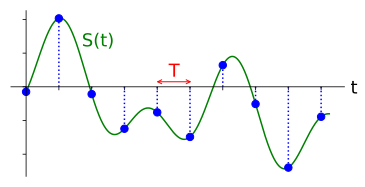

Dann zeichnen wir den Wert von :math:`S(t)` in regelmäßigen Abständen von :math:`T` Sekunden auf, bekannt als die **Abtastperiode**. Die Häufigkeit, mit der wir abtasten, d.h. die Anzahl der pro Sekunde genommenen Samples, ist einfach :math:`\frac{1}{T}`. Wir nennen dies die **Abtastrate**, und sie ist die Umkehrung der Abtastperiode. Wenn wir beispielsweise eine Abtastrate von 10 Hz haben, beträgt die Abtastperiode 0,1 Sekunden; zwischen jedem Sample liegen 0,1 Sekunden. In der Praxis werden unsere Abtastraten in der Größenordnung von Hunderten von kHz bis zu Zehnten von MHz oder sogar höher liegen. Wenn wir Signale abtasten, müssen wir auf die Abtastrate achten, es ist ein sehr wichtiger Parameter.

Für diejenigen, die die Mathematik bevorzugen: Sei :math:`S_n` das Sample :math:`n`, normalerweise eine ganze Zahl beginnend bei 0. Mit dieser Konvention kann der Abtastprozess mathematisch als :math:`S_n = S(nT)` für ganzzahlige Werte von :math:`n` dargestellt werden. D.h., wir werten das analoge Signal :math:`S(t)` bei diesen Intervallen von :math:`nT` aus.

*************************
Nyquist-Abtastung
*************************

Für ein gegebenes Signal ist die große Frage oft, wie schnell wir abtasten müssen. Lass uns ein Signal untersuchen, das nur eine Sinuswelle der Frequenz f ist, unten in Grün gezeigt. Sagen wir, wir tasten mit einer Rate Fs ab (Samples in Blau gezeigt). Wenn wir dieses Signal mit einer Rate abtasten, die gleich f ist (d.h. Fs = f), erhalten wir etwas, das so aussieht:

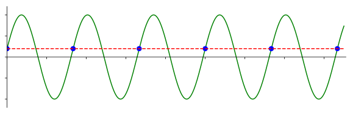

Die rote gestrichelte Linie im obigen Bild rekonstruiert eine andere (falsche) Funktion, die zu denselben aufgezeichneten Samples hätte führen können. Dies zeigt, dass unsere Abtastrate zu niedrig war, da dieselben Samples von zwei verschiedenen Funktionen stammen könnten, was zu Mehrdeutigkeit führt. Wenn wir das ursprüngliche Signal genau rekonstruieren wollen, dürfen wir diese Mehrdeutigkeit nicht haben.

Lass uns etwas schneller abtasten, bei Fs = 1,2f:

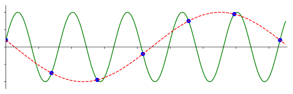

Auch hier gibt es ein anderes Signal, das zu diesen Samples passen könnte. Diese Mehrdeutigkeit bedeutet, dass wenn jemand uns diese Liste von Samples geben würde, wir nicht unterscheiden könnten, welches Signal das ursprüngliche war, basierend auf unserer Abtastung.

Wie wäre es mit Abtastung bei Fs = 1,5f:

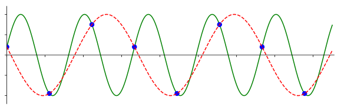

Immer noch nicht schnell genug! Gemäß einem DSP-Theoriestück, das wir nicht vertiefen werden, musst du mit **der doppelten** Frequenz des Signals abtasten, um die Mehrdeutigkeit zu beseitigen, die wir erleben:

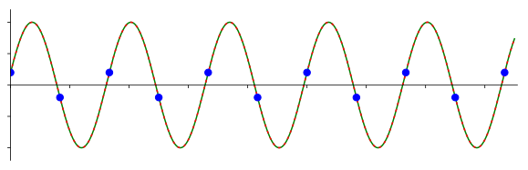

Diesmal gibt es kein falsches Signal, weil wir schnell genug abgetastet haben, dass kein Signal existiert, das zu diesen Samples passt außer dem, das du siehst (es sei denn, du gehst *höher* in der Frequenz, aber das werden wir später besprechen).

Im obigen Beispiel war unser Signal nur eine einfache Sinuswelle, die meisten tatsächlichen Signale werden viele Frequenzkomponenten haben. Um ein gegebenes Signal genau abzutasten, muss die Abtastrate „mindestens doppelt so hoch wie die Frequenz der maximalen Frequenzkomponente" sein. Hier ist eine Visualisierung anhand eines Beispiel-Frequenzbereichsdiagramms; beachte, dass es immer einen Rauschpegel gibt, sodass die höchste Frequenz normalerweise eine Annäherung ist:

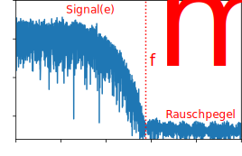

Wir müssen die höchste Frequenzkomponente identifizieren, sie verdoppeln und sicherstellen, dass wir mit dieser Rate oder schneller abtasten. Die Mindestrate, mit der wir abtasten können, wird als Nyquist-Rate bezeichnet. Mit anderen Worten, die Nyquist-Rate ist die Mindestrate, mit der ein (bandbegrenztes) Signal abgetastet werden muss, um alle seine Informationen zu erhalten. Es ist ein äußerst wichtiges Stück Theorie in DSP und SDR, das als Brücke zwischen kontinuierlichen und diskreten Signalen dient.

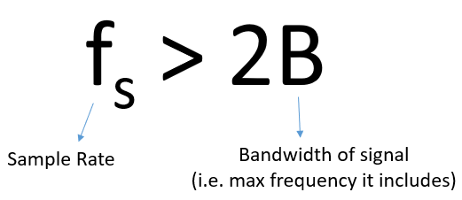

Wenn wir nicht schnell genug abtasten, erhalten wir etwas, das Aliasing genannt wird, worüber wir später lernen werden, aber wir versuchen es um jeden Preis zu vermeiden. Was unsere SDRs tun (und die meisten Empfänger im Allgemeinen) ist, alles über Fs/2 direkt vor der Abtastung herauszufiltern. Wenn wir versuchen, ein Signal mit einer zu niedrigen Abtastrate zu empfangen, wird dieser Filter einen Teil des Signals abschneiden. Unsere SDRs gehen große Mühe darauf, uns Samples frei von Aliasing und anderen Unvollkommenheiten zu liefern. Da der Anti-Aliasing-Filter des SDRs nicht sofort vom Durchlassbereich zum Sperrbereich übergeht (er braucht ein kleines Übergangsband), lautet die Faustregel, dass nur die mittleren 4/5 deiner Abtastrate nutzbare Bandbreite sind, bekannt als „Seans 4/5-Regel".

*************************
Quadratur-Abtastung
*************************

Der Begriff „Quadratur" hat viele Bedeutungen, aber im Kontext von DSP und SDR bezieht er sich auf zwei Wellen, die 90 Grad außer Phase sind. Warum 90 Grad außer Phase? Betrachte, wie zwei Wellen, die 180 Grad außer Phase sind, im Wesentlichen dieselbe Welle sind, wobei eine mit -1 multipliziert wird. Durch 90 Grad außer Phase werden sie orthogonal, und es gibt viele coole Dinge, die du mit orthogonalen Funktionen machen kannst. Der Einfachheit halber verwenden wir Sinus und Kosinus als unsere zwei Sinuswellen, die 90 Grad außer Phase sind.

Als nächstes weisen wir Variablen zu, um die **Amplitude** von Sinus und Kosinus darzustellen. Wir verwenden :math:`I` für den cos() und :math:`Q` für den sin():

.. math::
  I \cos(2\pi ft)

  Q \sin(2\pi ft)

Wir können dies visuell sehen, indem wir I und Q gleich 1 setzen:

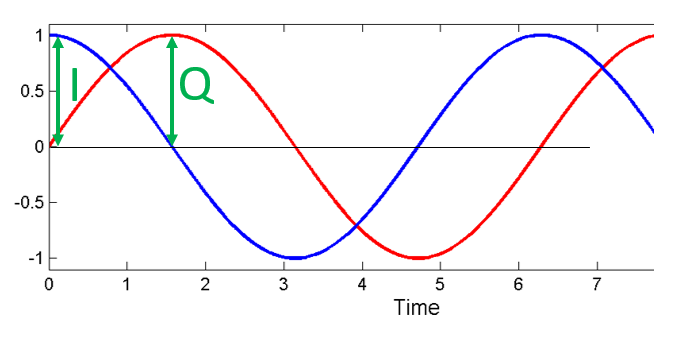

Wir nennen den cos() die „In-Phase"-Komponente, daher der Name I, und der sin() ist die um 90 Grad phasenverschobene oder „Quadratur"-Komponente, daher Q. Auch wenn du es versehentlich vertauschst und Q dem cos() und I dem sin() zuweist, macht das in den meisten Situationen keinen Unterschied.

IQ-Abtastung ist einfacher aus der Sicht des Senders zu verstehen. Betrachte die Aufgabe, ein HF-Signal bei einer bestimmten Frequenz :math:`f` (in Hz) durch die Luft zu senden. Wir möchten diese Sinuswelle der Frequenz :math:`f` nehmen und ihre Amplitude :math:`A` und Phase :math:`\phi` steuern:

.. math::

 A \cos(2 \pi f t - \phi)

Das negative Vorzeichen ist reine Konvention und ist nicht wichtig für das Verständnis des Konzepts. Zu jedem gegebenen Zeitpunkt gibt es möglicherweise eine andere Amplitude und Phase, die wir übertragen möchten, sodass wir sie als Funktion der Zeit darstellen können, um formeller zu sein:

.. math::

 A(t) \cos(2 \pi f t - \phi(t))

Es stellt sich heraus, dass es in HF-Schaltkreisen einfach ist, die Amplitude einer Sinuswelle zu steuern, aber schwer, die Phase zu steuern. Was wir tun können, ist die trigonometrische Identität zu nutzen: :math:`a \cos(x) + b \sin(x) = A \cos(x - \phi)`, die uns sagt, dass eine Summe eines cos() und sin() der gleichen Frequenz, jeweils mit Phase 0, äquivalent zu einem einzelnen cos() mit Amplitude :math:`A` und Phase :math:`\phi` ist. Mit I und Q anstelle von :math:`a` und :math:`b` und dem Hinzufügen von :math:`2 \pi f t` erhalten wir:

.. math::

 A \cos(2 \pi f t - \phi)

 = I \cos(2 \pi f t) + Q \sin(2 \pi f t)

wobei

.. math::

 A = \sqrt{I^2 + Q^2}

 \phi = \tan^{-1}\left(\frac{Q}{I}\right)

Mit diesem I- und Q-Ansatz können wir jede gewünschte Magnitude und Phase übertragen, mithilfe einer Schaltung, die ungefähr so aussieht:

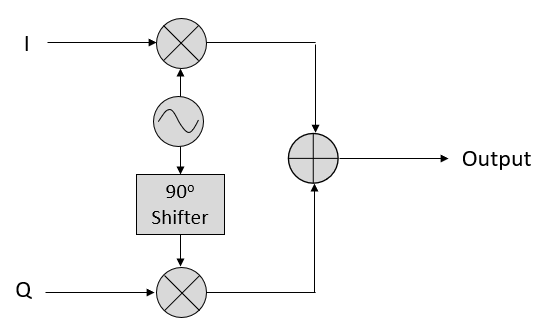

Sagen wir, wir haben ein IQ-Sample, die einzelne komplexe Zahl :math:`I + jQ`. Wir können dieses IQ-Sample auf eine Sinuswelle **modulieren**; die Amplitude und Phase werden durch das IQ-Sample bestimmt:

.. math::

 x(t) = I \cos(2\pi ft) + Q \sin(2\pi ft)

 \qquad \qquad \qquad \qquad = \left(\sqrt{I^2+Q^2}\right) \cos\left(2\pi ft - \tan^{-1}\left(\frac{Q}{I}\right)\right)

Obwohl wir die Mathematik gesehen haben, lass uns mit dem Addieren zweier Sinusoide spielen, die 90 Grad außer Phase sind. Im folgenden Video gibt es einen Schieberegler zum Anpassen von I und einen weiteren für Q, die Amplitude des Kosinus und Sinus. Was dargestellt wird, sind der Kosinus (rot), der Sinus (blau) und die Summe der beiden (grün).

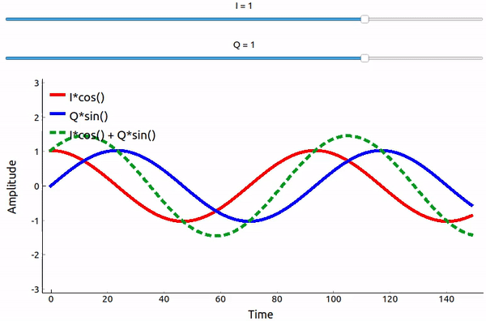

Der Code, der für diese auf pyqtgraph basierende Python-App verwendet wurde, kann `hier <https://raw.githubusercontent.com/777arc/PySDR/master/figure-generating-scripts/sin_plus_cos.py>`_ gefunden werden.

Die wichtigsten Erkenntnisse sind, dass wenn wir cos() und sin() addieren, wir eine weitere reine Sinuswelle derselben Frequenz erhalten, aber mit einer anderen Phase und Amplitude. Auch ändert sich die Phase, wenn wir langsam einen der beiden Teile entfernen oder hinzufügen (die Amplitude ändert sich auch). Das ist alles ein Ergebnis der trigonometrischen Identität: :math:`a \cos(x) + b \sin(x) = A \cos(x-\phi)`. Der „Nutzen" dieses Verhaltens ist, dass wir die Phase und Amplitude einer resultierenden Sinuswelle steuern können, indem wir die Amplituden I und Q anpassen (wir müssen nicht die Phase des Kosinus oder Sinus anpassen). Beispielsweise könnten wir I und Q so anpassen, dass die Amplitude konstant bleibt und die Phase das ist, was wir wollen. Als Sender ist diese Fähigkeit äußerst nützlich, weil wir wissen, dass wir ein sinusförmiges Signal senden müssen, damit es als elektromagnetische Welle durch die Luft fliegen kann. Und es ist viel einfacher, zwei Amplituden anzupassen und eine Additionsoperation durchzuführen, als eine Amplitude und eine Phase anzupassen. Es ermöglicht uns auch, Basisbandsignale bequemer darzustellen, unabhängig vom Träger.

*************************
Komplexe Zahlen
*************************

Letztendlich ist die IQ-Konvention eine alternative Möglichkeit, Magnitude und Phase darzustellen, was uns zu komplexen Zahlen und der Fähigkeit führt, sie auf einer komplexen Ebene darzustellen. Du hast vielleicht komplexe Zahlen in anderen Kursen gesehen. Nehmen wir die komplexe Zahl 0,7-0,4j als Beispiel:

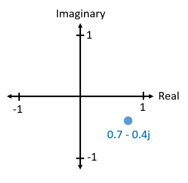

Eine komplexe Zahl ist wirklich nur zwei Zahlen zusammen, ein realer und ein imaginärer Anteil. Eine komplexe Zahl hat auch eine Magnitude und Phase, was mehr Sinn ergibt, wenn du sie als Vektor statt als Punkt betrachtest. Magnitude ist die Länge der Linie zwischen dem Ursprung und dem Punkt (d.h. Länge des Vektors), während die Phase der Winkel zwischen dem Vektor und 0 Grad ist, den wir als die positive reale Achse definieren:

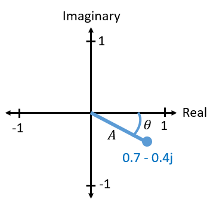

Diese Darstellung eines Sinusoids ist als „Phasor-Diagramm" bekannt. Es geht einfach darum, komplexe Zahlen darzustellen und sie als Vektoren zu behandeln. Was sind nun Magnitude und Phase unserer Beispiel-Komplexzahl 0,7-0,4j? Für eine gegebene komplexe Zahl, wobei :math:`a` der Realteil und :math:`b` der Imaginärteil ist:

.. math::
  \mathrm{Magnitude} = \sqrt{a^2 + b^2} = 0{,}806

  \mathrm{Phase} = \tan^{-1} \left( \frac{b}{a} \right) = -29{,}7^{\circ} = -0{,}519 \quad \mathrm{Radiant}

In Python kannst du np.abs(x) und np.angle(x) für die Magnitude und Phase verwenden. Der Eingang kann eine komplexe Zahl oder ein Array komplexer Zahlen sein, und der Ausgang ist eine **reelle** Zahl(en) (vom Datentyp float).

Du hast vielleicht inzwischen herausgefunden, wie dieses Vektor- oder Phasor-Diagramm mit der IQ-Konvention zusammenhängt: I ist real und Q ist imaginär. Von diesem Punkt an, wenn wir die komplexe Ebene zeichnen, werden wir sie mit I und Q anstelle von real und imaginär beschriften. Sie sind immer noch komplexe Zahlen!

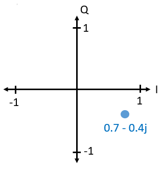

Sagen wir nun, wir möchten unseren Beispielpunkt 0,7-0,4j übertragen. Wir werden folgendes übertragen:

.. math::

 x(t) = I \cos(2\pi ft)  + Q \sin(2\pi ft)

 \quad \quad \quad = 0{,}7 \cos(2\pi ft) - 0{,}4 \sin(2\pi ft)

Wir können die trigonometrische Identität :math:`a \cos(x) + b \sin(x) = A \cos(x-\phi)` verwenden, wobei :math:`A` unsere Magnitude ist, die mit :math:`\sqrt{I^2 + Q^2}` berechnet wird, und :math:`\phi` unsere Phase ist, gleich :math:`\tan^{-1} \left( Q/I \right)`. Die obige Gleichung wird nun:

.. math::
  x(t) = 0{,}806 \cos(2\pi ft + 0{,}519)

Auch wenn wir mit einer komplexen Zahl begonnen haben, ist das, was wir übertragen, ein reales Signal mit einer bestimmten Magnitude und Phase; man kann mit elektromagnetischen Wellen nicht wirklich etwas Imaginäres übertragen. Wir verwenden nur imaginäre/komplexe Zahlen, um darzustellen, *was* wir übertragen. Wir werden über das :math:`f` in Kürze sprechen.

*************************
Komplexe Zahlen in FFTs
*************************

Die obigen komplexen Zahlen wurden als Zeitbereich-Samples angenommen, aber du wirst auch auf komplexe Zahlen stoßen, wenn du eine FFT durchführst. Als wir im letzten Kapitel Fourier-Reihen und FFTs behandelt haben, waren wir noch nicht in komplexe Zahlen eingetaucht. Wenn du die FFT einer Reihe von Samples nimmst, findet sie die Frequenzbereichsdarstellung. Wir haben darüber gesprochen, wie die FFT herausfindet, welche Frequenzen in dieser Menge von Samples vorhanden sind (die Magnitude der FFT gibt die Stärke jeder Frequenz an). Aber was die FFT auch tut, ist herauszufinden, welche Verzögerung (Zeitverschiebung) auf jede dieser Frequenzen angewendet werden muss, damit die Menge von Sinusoiden addiert werden kann, um das Zeitbereichssignal zu rekonstruieren. Diese Verzögerung ist einfach die Phase der FFT. Der Ausgang einer FFT ist ein Array komplexer Zahlen, und jede komplexe Zahl gibt dir die Magnitude und Phase, und der Index dieser Zahl gibt dir die Frequenz. Wenn du Sinusoide bei diesen Frequenzen/Magnituden/Phasen erzeugst und sie zusammen addierst, erhältst du dein ursprüngliches Zeitbereichssignal (oder etwas sehr ähnliches, und dort kommt das Nyquist-Abtasttheorem ins Spiel).

*************************
Empfängerseite
*************************

Lass uns nun die Perspektive eines Radioempfängers einnehmen, der versucht, ein Signal zu empfangen (z.B. ein UKW-Radiosignal). Mit IQ-Abtastung sieht das Diagramm nun so aus:

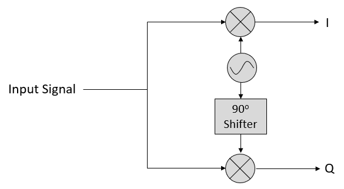

Was hereinkommt, ist ein reales Signal, das von unserer Antenne empfangen wird, und diese werden in IQ-Werte umgewandelt. Was wir tun, ist die I- und Q-Zweige einzeln mit zwei ADCs abzutasten, und dann kombinieren wir die Paare und speichern sie als komplexe Zahlen. Mit anderen Worten, zu jedem Zeitschritt tastest du einen I-Wert und einen Q-Wert ab und kombinierst sie in der Form :math:`I + jQ` (d.h. eine komplexe Zahl pro IQ-Sample). Es wird immer eine „Abtastrate" geben, die Rate, mit der die Abtastung durchgeführt wird. Jemand könnte sagen: „Ich habe ein SDR, das mit einer Abtastrate von 2 MHz läuft." Was er meint, ist, dass das SDR zwei Millionen IQ-Samples pro Sekunde empfängt.

Wenn jemand dir ein paar IQ-Samples gibt, sehen sie wie ein 1D-Array/Vektor komplexer Zahlen aus. Dieser Punkt, komplex oder nicht, ist das, worauf dieses gesamte Kapitel hingearbeitet hat, und wir haben es endlich geschafft.

In diesem Lehrbuch wirst du **sehr** vertraut damit werden, wie IQ-Samples funktionieren, wie man sie mit einem SDR empfängt und sendet, wie man sie in Python verarbeitet und wie man sie zur späteren Analyse in einer Datei speichert.

Ein letzter wichtiger Hinweis: Die obige Abbildung zeigt, was **innerhalb** des SDR passiert. Wir müssen tatsächlich keine Sinuswelle erzeugen, um 90 Grad verschieben, multiplizieren oder addieren – das SDR macht das für uns. Wir sagen dem SDR, mit welcher Frequenz wir abtasten oder bei welcher Frequenz wir unsere Samples übertragen möchten. Auf der Empfängerseite wird uns das SDR die IQ-Samples liefern. Für die Übertragungsseite müssen wir dem SDR die IQ-Samples bereitstellen. Was den Datentyp betrifft, werden sie entweder komplexe Ints oder Floats sein.

.. _downconversion-section:

**************************
Träger und Abwärtsmischung
**************************

Bis jetzt haben wir nicht über Frequenz gesprochen, aber wir haben gesehen, dass es ein :math:`f` in den Gleichungen mit dem cos() und sin() gab. Diese Frequenz ist die Mittenfrequenz des Signals, das wir tatsächlich durch die Luft senden (die Frequenz der elektromagnetischen Welle). Wir bezeichnen es als den „Träger", weil er unser Signal auf einer bestimmten HF-Frequenz trägt. Wenn wir auf eine Frequenz mit unserem SDR abstimmen und Samples empfangen, werden unsere Informationen in I und Q gespeichert; dieser Träger erscheint nicht in I und Q.

Zur Referenz verwenden Radiosignale wie UKW-Radio, WiFi, Bluetooth, LTE, GPS usw. normalerweise eine Frequenz (d.h. einen Träger) zwischen 100 MHz und 6 GHz. Diese Frequenzen reisen sehr gut durch die Luft, aber sie benötigen keine sehr langen Antennen oder viel Strom zum Senden oder Empfangen. Deine Mikrowelle kocht Essen mit elektromagnetischen Wellen bei 2,4 GHz. Wenn es ein Leck in der Tür gibt, wird deine Mikrowelle WiFi-Signale stören und möglicherweise auch deine Haut verbrennen. Eine andere Form elektromagnetischer Wellen ist Licht. Sichtbares Licht hat eine Frequenz von etwa 500 THz. Es ist so hoch, dass wir keine traditionellen Antennen verwenden, um Licht zu übertragen. Wir verwenden Methoden wie LEDs, die Halbleiterbauelemente sind. Sie erzeugen Licht, wenn Elektronen zwischen den Atomorbitalen des Halbleitermaterials springen, und die Farbe hängt davon ab, wie weit sie springen. Technisch gesehen ist Hochfrequenz (HF) als der Bereich von etwa 20 kHz bis 300 GHz definiert. Dies sind die Frequenzen, bei denen Energie aus einem oszillierenden elektrischen Strom von einem Leiter (einer Antenne) abstrahlen und durch den Raum reisen kann. Der Bereich von 100 MHz bis 6 GHz sind die nützlicheren Frequenzen, zumindest für die meisten modernen Anwendungen. Frequenzen über 6 GHz werden seit Jahrzehnten für Radar und Satellitenkommunikation verwendet und werden jetzt in 5G „mmWave" (24-29 GHz) eingesetzt, um die unteren Bänder zu ergänzen und die Geschwindigkeiten zu erhöhen.

Wenn wir unsere IQ-Werte schnell ändern und unseren Träger übertragen, nennt man das das Modulieren des Trägers (mit Daten oder was auch immer wir wollen). Wenn wir I und Q ändern, ändern wir die Phase und Amplitude des Trägers. Eine andere Option ist, die Frequenz des Trägers zu ändern, d.h. ihn leicht nach oben oder unten zu verschieben, was das UKW-Radio macht. Es ist leicht, zwischen dem Signal, das wir übertragen möchten (das typischerweise viele Frequenzkomponenten enthält), und der Frequenz, auf der wir es übertragen (unsere Trägerfrequenz), zu verwechseln. Dies wird hoffentlich klarer, wenn wir Basisband- und Bandpasssignale behandeln.

Zurück zur Abtastung für einen Moment. Anstatt Samples zu empfangen, indem wir das von der Antenne empfangene Signal mit cos() und sin() multiplizieren und dann I und Q aufzeichnen, was wäre, wenn wir das Signal von der Antenne direkt in einen einzelnen ADC einspeisen? Angenommen, die Trägerfrequenz ist 2,4 GHz, wie bei WiFi oder Bluetooth. Das bedeutet, dass wir mit 4,8 GHz abtasten müssten, wie wir gelernt haben. Das ist extrem schnell! Ein ADC, der so schnell abtastet, kostet Tausende von Euro. Stattdessen „mischen wir das Signal herunter", sodass das Signal, das wir abtasten möchten, um DC oder 0 Hz zentriert ist. Diese Abwärtsmischung erfolgt vor dem Abtasten. Wir gehen von:

.. math::

 I \underbrace{\cos(2\pi ft)}_{Träger} \ + \ \ Q \underbrace{\sin(2\pi ft)}_{Träger}

zu nur I und Q.

Lass uns die Abwärtsmischung im Frequenzbereich visualisieren:

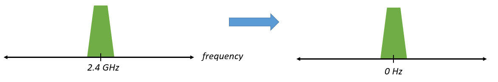

Wenn wir um 0 Hz zentriert sind, ist die maximale Frequenz nicht mehr 2,4 GHz, sondern basiert auf den Eigenschaften des Signals, da wir den Träger entfernt haben. Die meisten Signale sind etwa 100 kHz bis 40 MHz breit in der Bandbreite, sodass wir durch Abwärtsmischung mit einer *viel* niedrigeren Rate abtasten können. Sowohl die B2X0 USRPs als auch der PlutoSDR enthalten einen HF-integrierten Schaltkreis (RFIC), der bis zu 56 MHz abtasten kann, was für die meisten Signale, denen wir begegnen werden, hoch genug ist.

Um es noch einmal zu betonen: Der Abwärtsmischungsprozess wird von unserem SDR durchgeführt; als Benutzer des SDRs müssen wir nichts anderes tun, als ihm zu sagen, auf welche Frequenz es abstimmen soll. Abwärts- (und Aufwärts-)mischung wird von einer Komponente namens Mischer durchgeführt, der normalerweise in Diagrammen als Multiplikationssymbol innerhalb eines Kreises dargestellt wird. Der Mischer nimmt ein Signal auf, gibt das herunter-/hochgemischte Signal aus und hat einen dritten Anschluss, der verwendet wird, um einen Oszillator einzuspeisen. Die Frequenz des Oszillators bestimmt die auf das Signal angewendete Frequenzverschiebung, und der Mischer ist im Wesentlichen nur eine Multiplikationsfunktion (denk daran, dass die Multiplikation mit einem Sinus eine Frequenzverschiebung verursacht).

Zuletzt bist du vielleicht neugierig, wie schnell Signale durch die Luft reisen. Erinnere dich aus dem Physikunterricht, dass Radiowellen nur elektromagnetische Wellen bei niedrigen Frequenzen sind (zwischen ungefähr 3 kHz und 80 GHz). Sichtbares Licht sind auch elektromagnetische Wellen bei viel höheren Frequenzen (400 THz bis 700 THz). Alle elektromagnetischen Wellen reisen mit Lichtgeschwindigkeit, die ungefähr 3e8 m/s beträgt, zumindest wenn sie durch Luft oder ein Vakuum reisen. Da sie sich immer mit der gleichen Geschwindigkeit bewegen, hängt die Entfernung, die die Welle in einer vollständigen Oszillation zurücklegt (ein vollständiger Zyklus der Sinuswelle), von ihrer Frequenz ab. Wir nennen diese Entfernung die Wellenlänge, bezeichnet als :math:`\lambda`. Du hast diese Beziehung wahrscheinlich schon gesehen:

.. math::
 f = \frac{c}{\lambda}

wobei :math:`c` die Lichtgeschwindigkeit ist, typischerweise auf 3e8 gesetzt, wenn :math:`f` in Hz und :math:`\lambda` in Metern ist. In der drahtlosen Kommunikation wird diese Beziehung wichtig, wenn wir zu Antennen kommen, weil du für den Empfang eines Signals bei einer bestimmten Trägerfrequenz :math:`f` eine Antenne benötigst, die zu ihrer Wellenlänge :math:`\lambda` passt; normalerweise hat die Antenne eine Länge von :math:`\lambda/2` oder :math:`\lambda/4`. Unabhängig von der Frequenz/Wellenlänge werden Informationen in diesem Signal jedoch immer mit Lichtgeschwindigkeit vom Sender zum Empfänger reisen. Bei der Berechnung dieser Verzögerung durch die Luft lautet eine Faustregel, dass Licht ungefähr einen Fuß in einer Nanosekunde zurücklegt. Eine weitere Faustregel: Ein Signal, das zu einem Satelliten in geostationärer Umlaufbahn und zurück reist, benötigt ungefähr 0,25 Sekunden für den gesamten Trip.

**************************
Empfängerarchitekturen
**************************

Die Abbildung im Abschnitt „Empfängerseite" zeigt, wie das Eingangssignal heruntergemischt und in I und Q aufgeteilt wird. Diese Anordnung wird als „Direktmischung" oder „Zero-IF" bezeichnet, weil die HF-Frequenzen direkt ins Basisband konvertiert werden. Eine weitere Option ist, gar nicht herunterzumischen und so schnell abzutasten, um alles von 0 Hz bis 1/2 der Abtastrate zu erfassen. Diese Strategie wird „Direktabtastung" oder „Direkt-HF" genannt und erfordert einen äußerst teuren ADC-Chip. Eine dritte Architektur, die beliebt ist, weil es so war, wie alte Radios arbeiteten, ist als „Superhet" bekannt. Sie beinhaltet Abwärtsmischung, aber nicht bis auf 0 Hz. Sie platziert das Zielsignal bei einer Zwischenfrequenz, bekannt als „ZF". Ein rauscharmer Verstärker (LNA) ist einfach ein Verstärker, der für sehr schwache Signale am Eingang ausgelegt ist. Hier sind die Blockdiagramme dieser drei Architekturen; beachte, dass auch Variationen und Hybriden dieser Architekturen existieren:

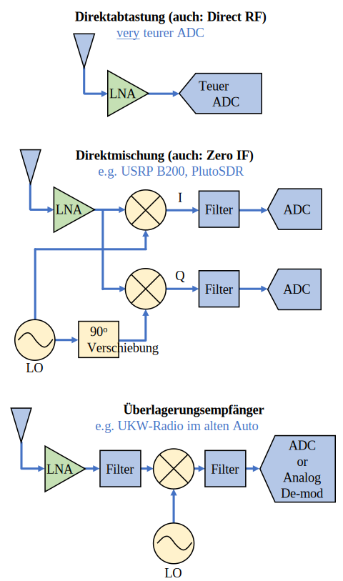

***********************************
Basisband- und Bandpasssignale
***********************************

Wir bezeichnen ein Signal, das um 0 Hz zentriert ist, als „Basisband". Umgekehrt bezieht sich „Bandpass" darauf, wenn ein Signal bei einer HF-Frequenz weit von 0 Hz entfernt existiert, das für die drahtlose Übertragung nach oben verschoben wurde. Es gibt keine Vorstellung von einer „Basisbandübertragung", weil man nichts Imaginäres übertragen kann. Ein Signal im Basisband kann perfekt bei 0 Hz zentriert sein, wie der rechte Teil der Abbildung in Abschnitt :ref:`downconversion-section`. Es könnte *nahe* an 0 Hz sein, wie die zwei unten gezeigten Signale. Diese zwei Signale gelten immer noch als Basisband. Ebenfalls gezeigt ist ein Beispiel-Bandpasssignal, das bei einer sehr hohen Frequenz :math:`f_c` zentriert ist.

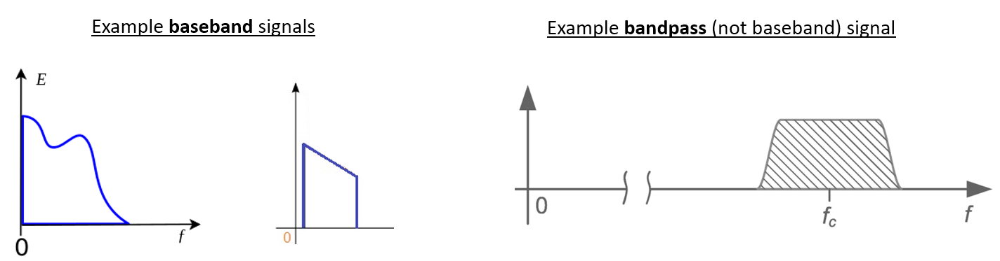

Du hörst vielleicht auch den Begriff Zwischenfrequenz oder ZF, was ein intermediärer Konvertierungsschritt innerhalb eines Radios zwischen Basisband und Bandpass/HF ist.

Wir neigen dazu, Signale im Basisband zu erstellen, aufzuzeichnen oder zu analysieren, weil wir mit einer niedrigeren Abtastrate arbeiten können (aus im vorherigen Unterabschnitt besprochenen Gründen). Es ist wichtig zu beachten, dass Basisband-HF-Signale **komplexe** Signale sind, während Signale im Bandpass (z.B. Signale, die wir tatsächlich über HF senden) **reelle** Signale sind. Jedes Signal, das durch eine Antenne geleitet wird, muss real sein, weil man ein komplexes/imaginäres Signal nicht direkt übertragen kann. Du weißt, dass ein Signal definitiv ein komplexes Signal ist, wenn die negativen und positiven Frequenzanteile des Signals nicht exakt gleich sind. Komplexe Zahlen ermöglichen es uns, negative Frequenzen darzustellen. In Wirklichkeit gibt es keine negativen Frequenzen; es ist nur der Teil des Signals unterhalb der Trägerfrequenz.

Wenn wir keine imaginäre Komponente in unserem Signal haben, haben wir keine Q-Werte (oder du kannst dir vorstellen, dass alle Q-Werte gleich null sind). Das bedeutet, dass wir nur Kosinussignale ohne Phasenverschiebung haben. Eine Summe von Kosinussignalen ohne Phasenverschiebung wird symmetrisch um die y-Achse sein, wenn wir den Frequenzbereich darstellen, weil die positiven und negativen Komponenten dieselben sind.

Im früheren Abschnitt, wo wir mit dem komplexen Punkt 0,7 - 0,4j gespielt haben, war das im Wesentlichen ein Sample in einem Basisbandsignal. Die meiste Zeit, wenn du komplexe Samples (IQ-Samples) siehst, bist du im Basisband. Signale werden selten digital bei HF dargestellt oder gespeichert, wegen der Datenmenge, die das erfordern würde, und der Tatsache, dass wir uns normalerweise nur für einen kleinen Teil des HF-Spektrums interessieren.

***************************
DC-Spitze und Offset-Abstimmung
***************************

Sobald du anfängst, mit SDRs zu arbeiten, wirst du oft eine große Spitze in der Mitte der FFT finden.
Sie wird als „DC-Versatz" oder „DC-Spitze" oder manchmal „LO-Leckage" bezeichnet, wobei LO für lokalen Oszillator steht.

Hier ist ein Beispiel einer DC-Spitze:

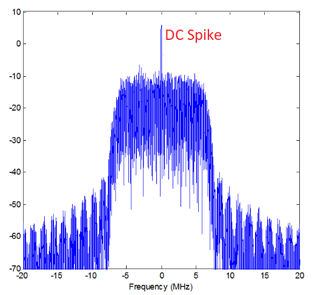

Da das SDR auf eine Mittenfrequenz abstimmt, entspricht der 0-Hz-Anteil der FFT der Mittenfrequenz.
Das heißt, eine DC-Spitze bedeutet nicht unbedingt, dass bei der Mittenfrequenz Energie vorhanden ist.
Wenn es nur eine DC-Spitze gibt und der Rest der FFT wie Rauschen aussieht, ist höchstwahrscheinlich kein Signal an der angezeigten Stelle vorhanden.

Ein DC-Versatz ist ein häufiges Artefakt in Direktmischempfängern, das ist die Architektur, die für SDRs wie den PlutoSDR, RTL-SDR, LimeSDR und viele Ettus USRPs verwendet wird. In Direktmischempfängern mischt ein Oszillator, der LO, das Signal von seiner tatsächlichen Frequenz ins Basisband. Infolgedessen erscheint die Leckage dieses LO in der Mitte der beobachteten Bandbreite. LO-Leckage ist zusätzliche Energie, die durch die Kombination von Frequenzen entsteht. Das Entfernen dieses zusätzlichen Rauschens ist schwierig, weil es nahe am gewünschten Ausgangssignal liegt. Viele HF-integrierte Schaltkreise (RFICs) haben einen eingebauten automatischen DC-Versatz-Entfernungsmechanismus, aber er erfordert typischerweise ein vorhandenes Signal, um zu funktionieren. Deshalb wird die DC-Spitze sehr deutlich sein, wenn keine Signale vorhanden sind.

Eine schnelle Möglichkeit, mit dem DC-Versatz umzugehen, ist das Signal zu überabtasten und es zu dezentrieren. Diese Technik nennt sich *Offset-Abstimmung*.
Als Beispiel sagen wir, wir wollen 5 MHz Spektrum bei 100 MHz betrachten.
Was wir stattdessen tun können, ist mit 20 MHz bei einer Mittenfrequenz von 95 MHz abzutasten.

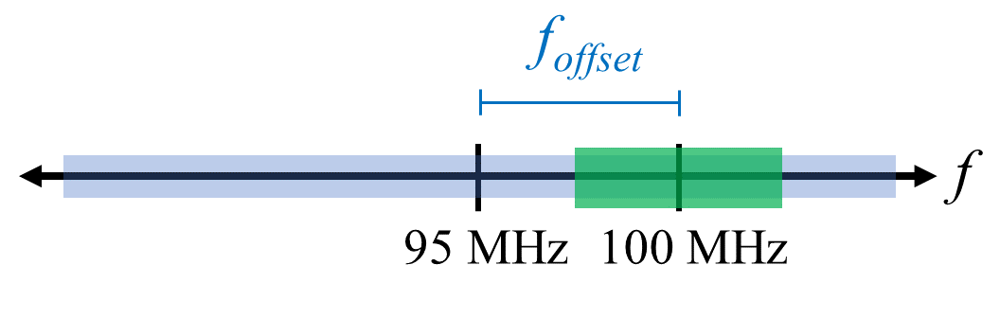

Das blaue Kästchen oben zeigt, was vom SDR tatsächlich abgetastet wird, und das grüne Kästchen zeigt den Teil des Spektrums, den wir wollen. Unser LO wird auf 95 MHz eingestellt, weil das die Frequenz ist, auf die wir das SDR abstimmen. Da 95 MHz außerhalb des grünen Kästchens liegt, erhalten wir keine DC-Spitze.

Es gibt ein Problem: Wenn wir wollen, dass unser Signal bei 100 MHz zentriert ist und nur 5 MHz enthält, müssen wir selbst eine Frequenzverschiebung, Filterung und Dezimierung des Signals durchführen (etwas, das wir später lernen werden). Glücklicherweise ist dieser Prozess der Offset-Abstimmung, auch als Anwenden eines LO-Versatzes bezeichnet, oft in die SDRs eingebaut, wo sie automatisch eine Offset-Abstimmung durchführen und dann die Frequenz auf deine gewünschte Mittenfrequenz verschieben. Wir profitieren davon, wenn das SDR es intern tun kann: Wir müssen keine höhere Abtastrate über unsere USB- oder Ethernet-Verbindung senden, was der Flaschenhals ist, wie hoch eine Abtastrate wir verwenden können.

Dieser Unterabschnitt zu DC-Versätzen ist ein gutes Beispiel dafür, wie sich dieses Lehrbuch von anderen unterscheidet. Ein durchschnittliches DSP-Lehrbuch wird über Abtastung sprechen, aber es neigt dazu, Implementierungshürden wie DC-Versätze trotz ihrer Verbreitung in der Praxis nicht einzubeziehen.

****************************
Abtastung mit unserem SDR
****************************

Für SDR-spezifische Informationen zur Durchführung von Abtastungen siehe eines der folgenden Kapitel:

* :ref:`pluto-chapter` Kapitel
* :ref:`usrp-chapter` Kapitel

*************************
Durchschnittliche Leistung berechnen
*************************

In HF-DSP möchten wir oft die Leistung eines Signals berechnen, z.B. um das Vorhandensein des Signals zu erkennen, bevor wir versuchen, weitere DSP-Verarbeitung durchzuführen. Für ein diskretes komplexes Signal, d.h. eines, das wir abgetastet haben, können wir die durchschnittliche Leistung berechnen, indem wir die Magnitude jedes Samples nehmen, es quadrieren und dann den Mittelwert berechnen:

.. math::
   P = \frac{1}{N} \sum_{n=1}^{N} |x[n]|^2

Denk daran, dass der Absolutbetrag einer komplexen Zahl nur die Magnitude ist, d.h. :math:`\sqrt{I^2+Q^2}`

In Python sieht die Berechnung der durchschnittlichen Leistung so aus:

.. code-block:: python

 avg_pwr = np.mean(np.abs(x)**2)

Hier ist ein sehr nützlicher Trick zur Berechnung der durchschnittlichen Leistung eines abgetasteten Signals.
Wenn dein Signal ungefähr null Mittelwert hat – was normalerweise bei SDR der Fall ist (wir werden später sehen warum) – kann die Signalleistung gefunden werden, indem die Varianz der Samples berechnet wird. Unter diesen Umständen kannst du die Leistung in Python so berechnen:

.. code-block:: python

 avg_pwr = np.var(x) # (Signal sollte ungefähr null Mittelwert haben)

Der Grund, warum die Varianz der Samples die durchschnittliche Leistung berechnet, ist ganz einfach: Die Gleichung für die Varianz ist :math:`\frac{1}{N}\sum^N_{n=1} |x[n]-\mu|^2`, wobei :math:`\mu` der Mittelwert des Signals ist. Diese Gleichung sieht vertraut aus! Wenn :math:`\mu` null ist, wird die Gleichung zur Bestimmung der Varianz der Samples äquivalent zur Gleichung für die Leistung. Du kannst auch den Mittelwert aus den Samples in deinem Beobachtungsfenster subtrahieren und dann die Varianz berechnen. Wisse einfach, dass wenn der Mittelwert nicht null ist, Varianz und Leistung nicht gleich sind.

**********************************
Spektrale Leistungsdichte berechnen
**********************************

Im letzten Kapitel haben wir gelernt, dass wir ein Signal mit einer FFT in den Frequenzbereich konvertieren können, und das Ergebnis wird als spektrale Leistungsdichte (PSD) bezeichnet.
Die PSD ist ein äußerst nützliches Werkzeug zur Visualisierung von Signalen im Frequenzbereich, und viele DSP-Algorithmen werden im Frequenzbereich durchgeführt.
Um aber tatsächlich die PSD einer Gruppe von Samples zu finden und sie darzustellen, tun wir mehr als nur eine FFT zu nehmen.
Wir müssen die folgenden sechs Operationen durchführen, um die PSD zu berechnen:

1. Nehmen die FFT unserer Samples. Wenn wir x Samples haben, ist die FFT-Größe standardmäßig die Länge von x. Lass uns die ersten 1024 Samples als Beispiel nehmen, um eine 1024-große FFT zu erstellen. Der Ausgang wird 1024 komplexe Floats sein.
2. Nehmen die Magnitude des FFT-Ausgangs, was uns 1024 reelle Floats liefert.
3. Die resultierende Magnitude quadrieren, um die Leistung zu erhalten.
4. Normalisieren: durch die FFT-Größe (:math:`N`) und Abtastrate (:math:`Fs`) dividieren.
5. In dB umrechnen mit :math:`10 \log_{10}()`; wir betrachten PSDs immer in logarithmischer Skala.
6. Eine FFT-Verschiebung durchführen, die im vorherigen Kapitel behandelt wurde, um „0 Hz" in der Mitte und negative Frequenzen links davon zu platzieren.

Diese sechs Schritte in Python sind:

.. code-block:: python

 Fs = 1e6 # sagen wir, wir haben mit 1 MHz abgetastet
 # nehme an, x enthält dein Array von IQ-Samples
 N = 1024
 x = x[0:N] # wir nehmen nur die FFT der ersten 1024 Samples, siehe Text unten
 PSD = np.abs(np.fft.fft(x))**2 / (N*Fs)
 PSD_log = 10.0*np.log10(PSD)
 PSD_shifted = np.fft.fftshift(PSD_log)

Optional können wir eine Fensterfunktion anwenden, wie wir im Kapitel :ref:`freq-domain-chapter` gelernt haben. Die Fensterfunktion würde direkt vor der Codezeile mit fft() angewendet werden.

.. code-block:: python

 # füge die folgende Zeile nach x = x[0:1024] hinzu
 x = x * np.hamming(len(x)) # Hamming-Fenster anwenden

Um diese PSD darzustellen, müssen wir die Werte der x-Achse kennen.
Wie wir im letzten Kapitel gelernt haben, wenn wir ein Signal abtasten, „sehen" wir nur das Spektrum zwischen -Fs/2 und Fs/2, wobei Fs unsere Abtastrate ist.
Die Auflösung, die wir im Frequenzbereich erzielen, hängt von der Größe unserer FFT ab, die standardmäßig gleich der Anzahl der Samples ist, an denen wir die FFT-Operation durchführen.
In diesem Fall ist unsere x-Achse 1024 gleichmäßig verteilte Punkte zwischen -0,5 MHz und 0,5 MHz.
Wenn wir unser SDR auf 2,4 GHz abgestimmt hätten, wäre unser Beobachtungsfenster zwischen 2,3995 GHz und 2,4005 GHz.
In Python sieht das Verschieben des Beobachtungsfensters so aus:

.. code-block:: python

 center_freq = 2.4e9 # Frequenz, auf die wir unser SDR abgestimmt haben
 f = np.arange(Fs/-2.0, Fs/2.0, Fs/N) # Start, Stopp, Schritt. Zentriert um 0 Hz
 f += center_freq # jetzt Mittenfrequenz hinzufügen
 plt.plot(f, PSD_shifted)
 plt.show()

Wir sollten eine schöne PSD erhalten!

Wenn du die PSD von Millionen von Samples finden möchtest, mach keine Millionen-Punkte-FFT, weil es wahrscheinlich ewig dauern wird. Es gibt dir einen Ausgang von einer Million „Frequenz-Bins", schließlich zu viel für eine Darstellung.
Stattdessen empfehle ich, mehrere kleinere PSDs durchzuführen und sie zu mitteln oder sie als Spektrogramm-Diagramm darzustellen.
Alternativ, wenn du weißt, dass sich dein Signal nicht schnell ändert, reicht es aus, ein paar Tausend Samples zu verwenden und die PSD davon zu finden; in diesem Zeitrahmen von ein paar Tausend Samples wirst du wahrscheinlich genug vom Signal erfassen, um eine gute Darstellung zu erhalten.

Hier ist ein vollständiges Codebeispiel, das das Generieren eines Signals (komplexer Exponential bei 50 Hz) und Rauschen enthält. Beachte, dass N, die Anzahl der zu simulierenden Samples, zur FFT-Länge wird, weil wir die FFT des gesamten simulierten Signals nehmen.

.. code-block:: python

 import numpy as np
 import matplotlib.pyplot as plt

 Fs = 300 # Abtastrate
 Ts = 1/Fs # Abtastperiode
 N = 2048 # Anzahl der zu simulierenden Samples

 t = Ts*np.arange(N)
 x = np.exp(1j*2*np.pi*50*t) # simuliert Sinus bei 50 Hz

 n = (np.random.randn(N) + 1j*np.random.randn(N))/np.sqrt(2) # komplexes Rauschen mit Einheitsleistung
 noise_power = 2
 r = x + n * np.sqrt(noise_power)

 PSD = np.abs(np.fft.fft(r))**2 / (N*Fs)
 PSD_log = 10.0*np.log10(PSD)
 PSD_shifted = np.fft.fftshift(PSD_log)

 f = np.arange(Fs/-2.0, Fs/2.0, Fs/N) # Start, Stopp, Schritt

 plt.plot(f, PSD_shifted)
 plt.xlabel("Frequenz [Hz]")
 plt.ylabel("Magnitude [dB]")
 plt.grid(True)
 plt.show()

Ausgabe:

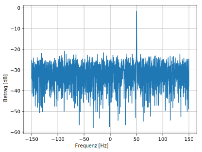

******************
Weiterführende Literatur (auf Englisch)
******************

#. https://web.archive.org/web/20220613052830/http://rfic.eecs.berkeley.edu/~niknejad/ee242/pdf/eecs242_lect3_rxarch.pdf
