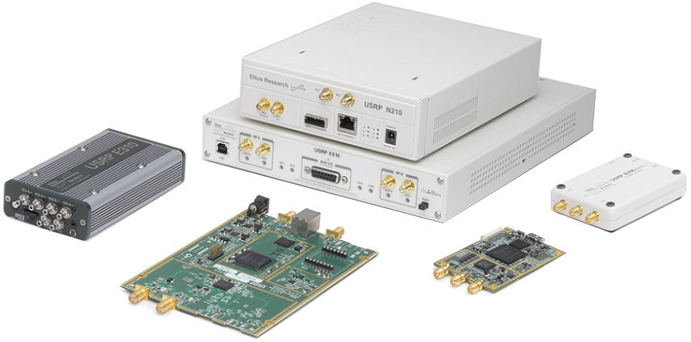

.. _usrp-chapter:

####################################
USRP in Python
####################################

In diesem Kapitel lernst du, wie du die UHD-Python-API verwendest, um ein `USRP <https://www.ettus.com/>`_ zu steuern und Signale zu empfangen/senden. Das USRP ist eine Reihe von SDRs von Ettus Research (jetzt Teil von NI). Wir besprechen das Senden und Empfangen am USRP in Python und gehen auf USRP-spezifische Themen ein, darunter Stream-Argumente, Subdevices, Kanäle sowie 10-MHz- und PPS-Synchronisation.

************************
Software/Treiber Installation
************************

Der in diesem Lehrbuch bereitgestellte Python-Code sollte unter Windows, Mac und Linux funktionieren, aber wir werden nur Treiber-/API-Installationsanweisungen für Ubuntu 22 bereitstellen (obwohl die folgenden Anweisungen auf den meisten Debian-basierten Distributionen funktionieren sollten). Wir beginnen mit der Erstellung einer Ubuntu-22-VirtualBox-VM; überspringe den VM-Teil, wenn dein Betriebssystem bereits einsatzbereit ist. Alternativ, wenn du Windows 11 verwendest, läuft das Windows-Subsystem für Linux (WSL) mit Ubuntu 22 recht gut und unterstützt Grafik von Haus aus.

Ubuntu-22-VM einrichten
########################

(Optional)

1. Ubuntu 22.04 Desktop .iso herunterladen – https://ubuntu.com/download/desktop
2. `VirtualBox <https://www.virtualbox.org/wiki/Downloads>`_ installieren und öffnen.
3. Eine neue VM erstellen. Für die Speichergröße empfehle ich, 50 % des RAM deines Computers zu verwenden.
4. Die virtuelle Festplatte erstellen, VDI wählen und dynamisch Größe zuweisen. 15 GB sollten ausreichen. Wenn du auf der sicheren Seite sein möchtest, kannst du mehr verwenden.
5. Die VM starten. Du wirst nach Installationsmedien gefragt. Wähle die Ubuntu-22-Desktop-.iso-Datei. Wähle „Ubuntu installieren", verwende Standardoptionen, und ein Popup warnt dich vor den Änderungen, die du vornehmen wirst. Klicke auf „Fortfahren". Wähle Name/Passwort und warte dann, bis die VM die Initialisierung abgeschlossen hat. Nach dem Abschluss wird die VM neu gestartet, aber du solltest die VM nach dem Neustart ausschalten.
6. In die VM-Einstellungen gehen (das Zahnrad-Symbol).
7. Unter System > Prozessor mindestens 3 CPUs auswählen. Wenn du eine echte Grafikkarte hast, wähle unter Anzeige > Videospeicher einen viel höheren Wert.
8. Die VM starten.
9. Für USRP-Geräte mit USB-Anschluss musst du VM-Gastzusätze installieren. Gehe innerhalb der VM zu Geräte > Gasterweiterungen-CD einlegen > klicke auf „Ausführen", wenn ein Fenster erscheint. Folge den Anweisungen. Starte die VM neu und versuche dann, das USRP an die VM weiterzuleiten, vorausgesetzt, es erscheint in der Liste unter Geräte > USB. Die gemeinsame Zwischenablage kann über Geräte > Gemeinsame Zwischenablage > Bidirektional aktiviert werden.

UHD und Python-API installieren
#################################

Die folgenden Terminal-Befehle sollten die neueste Version von UHD einschließlich der Python-API erstellen und installieren:

.. code-block:: bash

 sudo apt update
 sudo apt install git cmake libboost-all-dev libusb-1.0-0-dev build-essential
 sudo pip install pybind11[global]
 pip install numpy==1.26.4 docutils mako requests ruamel.yaml setuptools
 cd ~
 git clone https://github.com/EttusResearch/uhd.git
 cd uhd
 git checkout v4.8.0.0
 cd host
 mkdir build
 cd build
 cmake -DENABLE_TESTS=OFF -DENABLE_C_API=OFF -DENABLE_PYTHON_API=ON -DENABLE_MANUAL=OFF ..
 make -j8
 sudo make install
 sudo ldconfig

Weitere Hilfe findest du auf Ettus' offizieller Seite `Building and Installing UHD from source <https://files.ettus.com/manual/page_build_guide.html>`_. Beachte, dass es auch Methoden zum Installieren der Treiber gibt, die kein Erstellen aus dem Quellcode erfordern.

UHD-Treiber und Python-API testen
###################################

Öffne ein neues Terminal und gib folgende Befehle ein:

.. code-block:: bash

 python3
 import uhd
 usrp = uhd.usrp.MultiUSRP()
 samples = usrp.recv_num_samps(10000, 100e6, 1e6, [0], 50)
 print(samples[0:10])

Wenn keine Fehler auftreten, bist du startklar!

USRP-Geschwindigkeit in Python benchmarken
############################################

(Optional)

Wenn du die Standardinstallation aus dem Quellcode verwendet hast, sollte der folgende Befehl die Empfangsrate deines USRP mit der Python-API benchmarken. Wenn die Verwendung von 56e6 viele verworfene Samples oder Überläufe verursacht, versuche die Zahl zu verringern. Verworfene Samples werden nicht unbedingt alles ruinieren, aber es ist eine gute Möglichkeit, die Ineffizienzen zu testen, die z.B. bei der Verwendung einer VM oder eines älteren Computers auftreten können. Bei Verwendung eines B 2X0 sollte ein relativ moderner Computer mit einem USB-3.0-Anschluss in der Lage sein, 56 MHz ohne verworfene Samples zu verarbeiten, insbesondere wenn num_recv_frames so hoch eingestellt ist.

.. code-block:: bash

 python /usr/lib/uhd/examples/python/benchmark_rate.py --rx_rate 56e6 --args "num_recv_frames=1000"

************************
Empfangen
************************

Das Empfangen von Samples von einem USRP ist mit der integrierten Komfortfunktion „recv_num_samps()" extrem einfach. Der folgende Python-Code stimmt das USRP auf 100 MHz ein, verwendet eine Abtastrate von 1 MHz und nimmt 10.000 Samples vom USRP auf, mit einer Empfangsverstärkung von 50 dB:

.. code-block:: python

 import uhd
 usrp = uhd.usrp.MultiUSRP()
 samples = usrp.recv_num_samps(10000, 100e6, 1e6, [0], 50) # Einheiten: N, Hz, Hz, Liste der Kanal-IDs, dB
 print(samples[0:10])

Die [0] weist das USRP an, seinen ersten Eingangsport zu verwenden und nur einen Kanal an Samples zu empfangen (um z.B. mit einem B210 gleichzeitig auf zwei Kanälen zu empfangen, könntest du [0, 1] verwenden).

Hier ist ein Tipp, wenn du versuchst, mit einer hohen Rate zu empfangen, aber Überläufe bekommst (O's erscheinen in der Konsole). Anstatt :code:`usrp = uhd.usrp.MultiUSRP()` verwende:

.. code-block:: python

 usrp = uhd.usrp.MultiUSRP("num_recv_frames=1000")

Dies macht den Empfangspuffer viel größer (der Standardwert ist 32) und hilft, Überläufe zu reduzieren. Die tatsächliche Größe des Puffers in Bytes hängt vom USRP und der Art der Verbindung ab, aber :code:`num_recv_frames` auf einen Wert deutlich höher als 32 zu setzen, hilft in der Regel.

Für ernsthafte Anwendungen empfehle ich, die Komfortfunktion recv_num_samps() nicht zu verwenden, da sie einige interessante Vorgänge im Hintergrund verbirgt, und es gibt eine Einrichtung, die bei jedem Aufruf stattfindet und die wir möglicherweise nur einmal zu Beginn durchführen möchten, z.B. wenn wir Samples unbegrenzt empfangen möchten. Der folgende Code hat die gleiche Funktionalität wie recv_num_samps() — tatsächlich ist es fast genau das, was aufgerufen wird, wenn du die Komfortfunktion verwendest — aber jetzt haben wir die Möglichkeit, das Verhalten zu ändern:

.. code-block:: python

 import uhd
 import numpy as np

 usrp = uhd.usrp.MultiUSRP()

 num_samps = 10000 # Anzahl der empfangenen Samples
 center_freq = 100e6 # Hz
 sample_rate = 1e6 # Hz
 gain = 50 # dB

 usrp.set_rx_rate(sample_rate, 0)
 usrp.set_rx_freq(uhd.libpyuhd.types.tune_request(center_freq), 0)
 usrp.set_rx_gain(gain, 0)

 # Stream und Empfangspuffer einrichten
 st_args = uhd.usrp.StreamArgs("fc32", "sc16")
 st_args.channels = [0]
 metadata = uhd.types.RXMetadata()
 streamer = usrp.get_rx_stream(st_args)
 recv_buffer = np.zeros((1, 1000), dtype=np.complex64)

 # Stream starten
 stream_cmd = uhd.types.StreamCMD(uhd.types.StreamMode.start_cont)
 stream_cmd.stream_now = True
 streamer.issue_stream_cmd(stream_cmd)

 # Samples empfangen
 samples = np.zeros(num_samps, dtype=np.complex64)
 for i in range(num_samps//1000):
     streamer.recv(recv_buffer, metadata)
     samples[i*1000:(i+1)*1000] = recv_buffer[0]

 # Stream stoppen
 stream_cmd = uhd.types.StreamCMD(uhd.types.StreamMode.stop_cont)
 streamer.issue_stream_cmd(stream_cmd)

 print(len(samples))
 print(samples[0:10])

Mit num_samps auf 10.000 und recv_buffer auf 1000 gesetzt, läuft die for-Schleife 10 Mal, d.h. es gibt 10 Aufrufe von streamer.recv. Beachte, dass wir recv_buffer fest auf 1000 kodiert haben, aber du kannst den maximalen erlaubten Wert mit :code:`streamer.get_max_num_samps()` ermitteln, der oft bei etwa 3000 liegt. Beachte außerdem, dass recv_buffer 2D sein muss, da dieselbe API beim gleichzeitigen Empfangen auf mehreren Kanälen verwendet wird, aber in unserem Fall haben wir nur einen Kanal empfangen, sodass recv_buffer[0] uns das gewünschte 1D-Array von Samples lieferte. Du musst jetzt nicht zu viel darüber verstehen, wie der Stream gestartet/gestoppt wird, aber wisse, dass es neben dem „kontinuierlichen" Modus auch andere Optionen gibt, wie z.B. eine bestimmte Anzahl von Samples zu empfangen und den Stream automatisch stoppen zu lassen. Obwohl wir Metadaten in diesem Beispielcode nicht verarbeiten, enthält er alle auftretenden Fehler, die du durch Überprüfen von metadata.error_code bei jeder Iteration der Schleife kontrollieren kannst, falls gewünscht (Fehler erscheinen auch in der Konsole selbst als Ergebnis von UHD, also musst du sie nicht unbedingt in deinem Python-Code prüfen).

Empfangsverstärkung
####################

Die folgende Liste zeigt den Verstärkungsbereich der verschiedenen USRPs — sie gehen alle von 0 dB bis zur unten angegebenen Zahl. Beachte, dass dies nicht dBm ist; es ist im Wesentlichen dBm kombiniert mit einem unbekannten Offset, da es sich nicht um kalibrierte Geräte handelt.

* B200/B210/B200-mini: 76 dB
* X310/N210 mit WBX/SBX/UBX: 31,5 dB
* X310 mit TwinRX: 93 dB
* E310/E312: 76 dB
* N320/N321: 60 dB

Du kannst auch den Befehl :code:`uhd_usrp_probe` in einem Terminal verwenden, und im Abschnitt „RX Frontend" wird der Verstärkungsbereich erwähnt.

Beim Angeben der Verstärkung kannst du die normale set_rx_gain()-Funktion verwenden, die den Verstärkungswert in dB nimmt, aber du kannst auch set_normalized_rx_gain() verwenden, die einen Wert von 0 bis 1 nimmt und ihn automatisch in den Bereich des verwendeten USRP umrechnet. Dies ist praktisch, wenn du eine Anwendung erstellst, die verschiedene USRP-Modelle unterstützt. Der Nachteil der normalisierten Verstärkung ist, dass du keine Einheiten in dB mehr hast, sodass du z.B. den Betrag berechnen musst, wenn du deine Verstärkung um 10 dB erhöhen möchtest.

Automatische Verstärkungsregelung
###################################

Einige USRPs, einschließlich der B200- und E310-Serie, unterstützen die automatische Verstärkungsregelung (AGC), die die Empfangsverstärkung als Reaktion auf den empfangenen Signalpegel automatisch anpasst, um die ADC-Bits bestmöglich zu „füllen". AGC kann aktiviert werden mit:

.. code-block:: python

 usrp.set_rx_agc(True, 0) # 0 für Kanal 0, d.h. den ersten Kanal des USRP

Wenn du ein USRP hast, das keinen AGC implementiert, wird beim Ausführen der obigen Zeile eine Ausnahme ausgelöst. Wenn AGC aktiviert ist, hat das Einstellen der Verstärkung keinen Effekt.

Stream-Argumente
****************

Im vollständigen Beispiel oben siehst du die Zeile :code:`st_args = uhd.usrp.StreamArgs("fc32", "sc16")`. Das erste Argument ist das CPU-Datenformat, also der Datentyp der Samples, sobald sie auf deinem Host-Computer sind. UHD unterstützt die folgenden CPU-Datentypen bei der Verwendung der Python-API:

.. list-table::
   :widths: 15 20 30
   :header-rows: 1

   * - Stream-Arg
     - NumPy-Datentyp
     - Beschreibung
   * - fc64
     - np.complex128
     - Komplexwertige Daten mit doppelter Genauigkeit
   * - fc32
     - np.complex64
     - Komplexwertige Daten mit einfacher Genauigkeit

Möglicherweise siehst du andere Optionen in der Dokumentation für die UHD-C++-API, aber diese wurden in der Python-API nie implementiert, zumindest zum Zeitpunkt dieses Schreibens.

Das zweite Argument ist das „Over-the-Wire"-Datenformat, d.h. der Datentyp der Samples, wie sie über USB/Ethernet/SFP zum Host gesendet werden. Für die Python-API sind die Optionen: „sc16", „sc12" und „sc8", wobei die 12-Bit-Option nur von bestimmten USRPs unterstützt wird. Diese Wahl ist wichtig, da die Verbindung zwischen dem USRP und dem Host-Computer oft der Engpass ist — durch den Wechsel von 16 Bit auf 8 Bit kannst du möglicherweise eine höhere Rate erreichen. Denke auch daran, dass viele USRPs ADCs mit 12 oder 14 Bit haben; die Verwendung von „sc16" bedeutet nicht, dass der ADC 16 Bit hat.

Für den Kanalabschnitt der :code:`st_args` siehe den Abschnitt „Subdevice und Kanäle" unten.

************************
Senden
************************

Ähnlich wie die Komfortfunktion recv_num_samps() bietet UHD die Funktion send_waveform() zum Senden eines Batches von Samples. Ein Beispiel ist unten gezeigt. Wenn du eine Dauer (in Sekunden) angibst, die länger als das bereitgestellte Signal ist, wird es einfach wiederholt. Es hilft, die Werte der Samples zwischen -1,0 und 1,0 zu halten.

.. code-block:: python

 import uhd
 import numpy as np
 usrp = uhd.usrp.MultiUSRP()
 samples = 0.1*np.random.randn(10000) + 0.1j*np.random.randn(10000) # zufälliges Signal erzeugen
 duration = 10 # Sekunden
 center_freq = 915e6
 sample_rate = 1e6
 gain = 20 # [dB] niedrig starten und bei Bedarf erhöhen
 usrp.send_waveform(samples, duration, center_freq, sample_rate, [0], gain)

Für Details dazu, wie diese Komfortfunktion im Hintergrund funktioniert, sieh dir den Quellcode `hier <https://github.com/EttusResearch/uhd/blob/master/host/python/uhd/usrp/multi_usrp.py>`_ an.

Sendeleistungsverstärkung
##########################

Ähnlich wie auf der Empfangsseite variiert der Sendeleistungsbereich je nach USRP-Modell und geht von 0 dB bis zur unten angegebenen Zahl:

* B200/B210/B200-mini: 90 dB
* N210 mit WBX: 25 dB
* N210 mit SBX oder UBX: 31,5 dB
* E310/E312: 90 dB
* N320/N321: 60 dB

Es gibt auch eine set_normalized_tx_gain()-Funktion, wenn du die Sendeleistungsverstärkung im Bereich 0 bis 1 angeben möchtest.

************************************************
Gleichzeitiges Senden und Empfangen
************************************************

Wenn du mit demselben USRP gleichzeitig senden und empfangen möchtest, ist der Schlüssel, dies mit mehreren Threads innerhalb desselben Prozesses zu tun; das USRP kann nicht mehrere Prozesse überspannen. Im C++-Beispiel `txrx_loopback_to_file <https://github.com/EttusResearch/uhd/blob/master/host/examples/txrx_loopback_to_file.cpp>`_ wird z.B. ein separater Thread erstellt, um den Sender auszuführen, und der Empfang erfolgt im Haupt-Thread. Du kannst auch einfach zwei Threads starten, einen zum Senden und einen zum Empfangen, wie es im Python-Beispiel `benchmark_rate <https://github.com/EttusResearch/uhd/blob/master/host/examples/python/benchmark_rate.py>`_ gemacht wird. Ein vollständiges Beispiel wird hier nicht gezeigt, da es ein ziemlich langes Beispiel wäre und Ettus' benchmark_rate.py immer als Ausgangspunkt dienen kann.

*********************************
Subdevice, Kanäle und Antennen
*********************************

Eine häufige Fehlerquelle bei der Verwendung von USRPs ist die Auswahl des richtigen Subdevice und der Kanal-ID. Du hast vielleicht bemerkt, dass wir in jedem obigen Beispiel Kanal 0 verwendet haben und nichts im Zusammenhang mit Subdev angegeben haben. Wenn du ein B210 verwendest und einfach RF:B statt RF:A verwenden möchtest, musst du nur Kanal 1 statt 0 wählen. Aber bei USRPs wie dem X310, das zwei Tochterplatinen-Steckplätze hat, musst du UHD mitteilen, ob du Steckplatz A oder B und welchen Kanal auf dieser Tochterplatine verwenden möchtest, zum Beispiel:

.. code-block:: python

 usrp.set_rx_subdev_spec("B:0")

Wenn du den TX/RX-Anschluss statt RX2 (dem Standard) verwenden möchtest, ist es so einfach wie:

.. code-block:: python

 usrp.set_rx_antenna('TX/RX', 0) # Kanal 0 auf 'TX/RX' setzen

Dies steuert im Wesentlichen nur einen HF-Schalter auf dem USRP, um vom anderen SMA-Steckverbinder weiterzuleiten.

Um gleichzeitig auf zwei Kanälen zu empfangen oder zu senden, gib anstelle von :code:`st_args.channels = [0]` eine Liste an, z.B. :code:`[0,1]`. Der Empfangs-Samples-Puffer muss in diesem Fall die Größe (2, N) statt (1, N) haben. Denke daran, dass bei den meisten USRPs beide Kanäle einen LO teilen, sodass du nicht gleichzeitig auf verschiedene Frequenzen abstimmen kannst.

**************************
Synchronisation auf 10 MHz und PPS
**************************

Einer der großen Vorteile der Verwendung eines USRP gegenüber anderen SDRs ist die Fähigkeit, sich mit einer externen Quelle oder einem integrierten `GPSDO <https://www.ettus.com/all-products/gpsdo-tcxo-module/>`_ zu synchronisieren, was Anwendungen mit mehreren Empfängern wie TDOA ermöglicht. Wenn du eine externe 10-MHz- und PPS-Quelle an dein USRP angeschlossen hast, musst du nach der Initialisierung deines USRP diese zwei Zeilen aufrufen:

.. code-block:: python

 usrp.set_clock_source("external")
 usrp.set_time_source("external")

Wenn du ein integriertes GPSDO verwendest, nutze stattdessen:

.. code-block:: python

 usrp.set_clock_source("gpsdo")
 usrp.set_time_source("gpsdo")

Auf der Frequenzsynchronisationsseite gibt es nicht viel mehr zu tun; der im Mischer des USRP verwendete LO wird jetzt an die externe Quelle oder das `GPSDO <https://www.ettus.com/all-products/gpsdo-tcxo-module/>`_ gebunden. Aber auf der Zeitseite möchtest du möglicherweise das USRP anweisen, genau beim PPS mit der Abtastung zu beginnen. Dies kann mit folgendem Code gemacht werden:

.. code-block:: python

 # Kopiere das Empfangsbeispiel oben, alles bis zu # Stream starten

 # Auf 1 PPS warten, dann die Zeit beim nächsten PPS auf 0.0 setzen
 time_at_last_pps = usrp.get_time_last_pps().get_real_secs()
 while time_at_last_pps == usrp.get_time_last_pps().get_real_secs():
     time.sleep(0.1) # weiter warten, bis es passiert – wenn diese while-Schleife nie endet, ist das PPS-Signal nicht vorhanden
 usrp.set_time_next_pps(uhd.libpyuhd.types.time_spec(0.0))

 # Empfang von num_samps Samples genau 3 Sekunden nach dem letzten PPS planen
 stream_cmd = uhd.types.StreamCMD(uhd.types.StreamMode.num_done)
 stream_cmd.num_samps = num_samps
 stream_cmd.stream_now = False
 stream_cmd.time_spec = uhd.libpyuhd.types.time_spec(3.0) # Startzeit festlegen (versuche, diesen Wert anzupassen)
 streamer.issue_stream_cmd(stream_cmd)

 # Samples empfangen. recv() gibt zuerst Nullen zurück, dann unsere Samples, dann weitere Nullen
 waiting_to_start = True # verfolgen, wo wir uns im Zyklus befinden
 nsamps = 0
 i = 0
 samples = np.zeros(num_samps, dtype=np.complex64)
 while nsamps != 0 or waiting_to_start:
     nsamps = streamer.recv(recv_buffer, metadata)
     if nsamps and waiting_to_start:
         waiting_to_start = False
     elif nsamps:
         samples[i:i+nsamps] = recv_buffer[0][0:nsamps]
     i += nsamps

Wenn es scheint, als würde es nicht funktionieren, aber keine Fehler auftreten, versuche den Wert 3.0 auf etwas zwischen 1.0 und 5.0 zu ändern. Du kannst auch die Metadaten nach dem Aufruf von recv() überprüfen, indem du :code:`if metadata.error_code != uhd.types.RXMetadataErrorCode.none:` prüfst.

Zum Debuggen kannst du überprüfen, ob das 10-MHz-Signal beim USRP ankommt, indem du den Rückgabewert von :code:`usrp.get_mboard_sensor("ref_locked", 0)` überprüfst. Wenn das PPS-Signal nicht ankommt, wirst du es merken, weil die erste while-Schleife im obigen Code nie endet.

**********************************************
Phasenkohärente Synchronisation mehrerer B210s für MIMO
**********************************************

Um Operationen wie Ankunftsrichtungsbestimmung (DOA) und digitales Beamforming mit phasengesteuerter Antennengruppe durchzuführen, benötigst du in der Regel alle Empfangskanäle phasenkohärent, d.h. die relativen Phasen zwischen den Empfangskanälen bleiben konstant und können herausgerechnet werden. Die USRPs B200 und B210 basieren auf dem AD9361-RFIC, der den LO intern generiert; es gibt keine Möglichkeit, ihm einen externen LO zuzuführen. Selbst wenn du dem USRP ein 10-MHz-Referenzsignal und PPS zuführst, ermöglicht das nur die Synchronisation mehrerer USRPs in Frequenz und Abtasttakt, nicht in Phase, da jedes Mal, wenn das Gerät eingeschaltet oder auf eine andere Frequenz abgestimmt wird, ein neuer zufälliger Phasenversatz durch die Teiler in den VCO/PLL-Ketten entsteht. Weitere Informationen findest du auf `dieser Seite <https://files.ettus.com/manual/page_sync.html>`_. Eine Methode zur Phasensynchronisation besteht darin, Hardware hinzuzufügen, bei der ein Kalibriersignal (entweder vom USRP erzeugt, eine Breitbandrauschquelle oder ein Ton) aufgeteilt und in alle Empfangsanschlüsse eingespeist wird, und bei jedem Ein- oder Umschalten der USRPs eine schnelle Kalibrierung durchgeführt wird. Beachte, dass auch das Ändern der Verstärkung zu Phasenverschiebungen führt, aber solange die B210s auf derselben Verstärkung gehalten werden, sollte sich die Phasendifferenz nicht wesentlich ändern. Das `Techtile-Projekt <https://github.com/techtile-by-dramco/NI-B210-Sync/blob/main/README.md>`_ enthält weitere Informationen zu diesem Thema, einschließlich benutzerdefinierter Images, die es mehreren B210s ermöglichen können, gemeinsam umzustimmen und die Synchronisation aufrechtzuerhalten, obwohl wahrscheinlich jedes Mal, wenn die Radios eingeschaltet werden, eine Kalibrierung mit externer Hardware erforderlich ist.

****
GPIO
****

Die meisten USRPs haben einen GPIO-Header. Beim B200/B210 ist es der J504-Header, beim X310 befindet er sich an der Vorderseite.

Zunächst einige der von Ettus verwendeten Begriffe. **CTRL** legt fest, ob der Pin durch ATR (automatisch) oder nur durch manuelle Steuerung gesteuert wird (1 für ATR, 0 für manuell). **DDR** (Data Direction Register) definiert, ob ein GPIO ein Ausgang (0) oder ein Eingang (1) ist. **OUT** wird verwendet, um den Wert eines Pins manuell zu setzen (nur im manuellen CTRL-Modus zu verwenden).

Beispiel für die Verwendung von GPIO als Ausgang für den „AUX I/O"-Anschluss an der Vorderseite des X310; weitere Informationen findest du in `dieser Dokumentation <https://files.ettus.com/manual/page_gpio_api.html>`_.

.. code-block:: python

  import uhd
  import time
  usrp = uhd.usrp.MultiUSRP()
  usrp.set_gpio_attr('FP0A', 'CTRL', 0x000, 0xFFF)
  usrp.set_gpio_attr('FP0A', 'DDR', 0xFFF, 0xFFF)
  for i in range(10):
      print("Aus")
      usrp.set_gpio_attr('FP0A', 'OUT', 0x000, 0xFFF)
      time.sleep(1)
      print("An")
      usrp.set_gpio_attr('FP0A', 'OUT', 0xFFF, 0xFFF)
      time.sleep(1)
