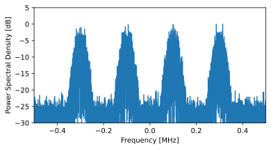

.. _modulation-chapter:

###################
Modulación Digital
###################

En este capítulo discutiremos *la transmisión real de datos* usando modulación digital y símbolos inalámbricos. Diseñaremos señales que transmitan "información", por ejemplo, 1 y 0, utilizando esquemas de modulación como ASK, PSK, QAM y FSK. También discutiremos los diagramas y constelaciones de IQ y finalizaremos el capítulo con algunos ejemplos de Python.

El objetivo principal de la modulación es exprimir la mayor cantidad de datos en la menor cantidad de espectro posible. Técnicamente hablando, queremos maximizar la "eficiencia espectral" en unidades bits/seg/Hz. Transmitir unos y ceros más rápido aumentará el ancho de banda de nuestra señal (recordemos las propiedades de Fourier), lo que significa que se utiliza más espectro. También examinaremos otras técnicas además de transmitir más rápido. Habrá muchas compensaciones a la hora de decidir cómo modular, pero también habrá espacio para la creatividad.

*******************
Simbolos
*******************
¡Alerta de nuevo término! Nuestra señal de transmisión estará compuesta de "símbolos". Cada símbolo llevará una cierta cantidad de bits de información y transmitiremos símbolos uno tras otro, miles o incluso millones en fila.

Como ejemplo simplificado, digamos que tenemos un cable y estamos enviando unos y ceros usando niveles de voltaje alto y bajo. Un símbolo es uno de esos 1 o 0:

.. image:: ../_images/symbols.png
   :scale: 60 %
   :align: center
   :alt: Pulse train of ones and zeros depicting the concept of a digital symbol that carries information

En el ejemplo anterior, cada símbolo representa un bit. ¿Cómo podemos transmitir más de un bit por símbolo? Estudiemos las señales que viajan por los cables Ethernet, que se define en un estándar IEEE llamado IEEE 802.3 1000BASE-T. El modo de funcionamiento común de Ethernet utiliza una modulación de amplitud de 4 niveles (2 bits por símbolo) con símbolos de 8 ns.

.. image:: ../_images/ethernet.svg
   :align: center
   :target: ../_images/ethernet.svg
   :alt: Plot of IEEE 802.3 1000BASE-T ethernet voltage signal showing 4-level amplitude shift keying (ASK)

Tómate un momento para intentar responder estas preguntas:

1. ¿Cuántos bits por segundo se transmiten en el ejemplo mostrado arriba?
2. ¿Cuántos pares de estos cables de datos se necesitarían para transmitir 1 gigabit/seg?
3. Si un esquema de modulación tiene 16 niveles diferentes, ¿cuántos bits por símbolo son?
4. Con 16 niveles diferentes y símbolos de 8 ns, ¿cuántos bits por segundo son eso?

.. raw:: html

   

   
Answers

1. 250Mbps - (1/8e-9)*2
2. Cuatro (que es lo que tienen los cables ethernet)
3. 4 bits por símbolo - log_2(16)
4. 0,5 Gbps - (1/8e-9)*4

.. raw:: html

   

*********************************
Simbolos por un medio inalámbrico
*********************************
Pregunta: ¿Por qué no podemos transmitir directamente la señal de Ethernet que se muestra en la figura anterior? Hay muchas razones, las dos más importantes son:

1. Las bajas frecuencias requieren antenas *enormes*, y la señal anterior contiene frecuencias de hasta CC (0 Hz). No podemos transmitir DC.
2. Las ondas cuadradas ocupan una cantidad excesiva de espectro para los bits por segundo. En el capitulo :ref:`freq-domain-chapter` vimos que los cambios bruscos en el dominio del tiempo utilizan una gran cantidad de ancho de banda/espectro: 

.. image:: ../_images/square-wave.svg
   :align: center
   :target: ../_images/square-wave.svg
   :alt: A square wave in time and frequency domain showing the large amount of bandwidth that a square wave uses

Lo que hacemos con las señales inalámbricas es comenzar con una portadora, que es simplemente una sinusoide. Por ejemplo, la radio FM utiliza una portadora como 101,1 MHz o 100,3 MHz. Modulamos esa portadora de alguna manera (hay muchas). Para la radio FM es una modulación analógica, no digital, pero es el mismo concepto que la modulación digital.

¿De qué manera podemos modular la portadora? Otra forma de hacer la misma pregunta: ¿cuáles son las diferentes propiedades de una sinusoide?

1. amplitud
2. Fase
3. Frecuencia

Podemos modular nuestros datos en un soporte modificando cualquiera (o más) de estos tres.

****************************
Amplitude Shift Keying (ASK)
****************************

Amplitude Shift Keying (ASK) es el primer esquema de modulación digital que analizaremos porque la modulación de amplitud es la más sencilla de visualizar de las tres propiedades sinusoideas. Literalmente modulamos la **amplitud** de la portadora. Aquí hay un ejemplo de ASK de 2 niveles, llamado 2-ASK:

.. image:: ../_images/ASK.svg
   :align: center
   :target: ../_images/ASK.svg
   :alt: Example of amplitude shift keying (ASK) in the time domain, specifically 2-ASK

Observe cómo el valor promedio es cero; Siempre preferimos esto siempre que sea posible.

Podemos usar más de dos niveles, lo que permite más bits por símbolo. A continuación se muestra un ejemplo de 4-ASK. En este caso cada símbolo lleva 2 bits de información.

.. image:: ../_images/ask2.svg
   :align: center
   :target: ../_images/ask2.svg
   :alt: Example of amplitude shift keying (ASK) in the time domain, specifically 4-ASK

Pregunta: ¿Cuántos símbolos se muestran en el fragmento de señal de arriba? ¿Cuántos bits están representados en total?

.. raw:: html

   

   
Answers

20 símbolos, es decir, 40 bits de información.

.. raw:: html

   

¿Cómo creamos realmente esta señal digitalmente, a través de código? Todo lo que tenemos que hacer es crear un vector con N muestras por símbolo y luego multiplicar ese vector por una sinusoide. Esto modula la señal sobre una portadora (la sinusoide actúa como esa portadora). El siguiente ejemplo muestra 2-ASK con 10 muestras por símbolo.

.. image:: ../_images/ask3.svg
   :align: center
   :target: ../_images/ask3.svg
   :alt: Samples per symbol depiction using 2-ASK in the time domain, with 10 samples per symbol (sps)

El gráfico superior muestra las muestras discretas representadas por puntos rojos, es decir, nuestra señal digital. El gráfico inferior muestra cómo se ve la señal modulada resultante, que podría transmitirse por aire. En los sistemas reales, la frecuencia de la portadora suele ser mucho mayor que la velocidad a la que cambian los símbolos. En este ejemplo hay sólo tres ciclos de la sinusoide en cada símbolo, pero en la práctica puede haber miles, dependiendo de qué tan alto en el espectro se esté transmitiendo la señal.

************************
Phase Shift Keying (PSK)
************************

Ahora consideremos modular la fase de manera similar a como lo hicimos con la amplitud. La forma más simple es PSK binario, también conocido como BPSK, donde hay dos niveles de fase:

1. Sin cambio de fase
2. Cambio de fase de 180 grados

Ejemplo de BPSK (tenga en cuenta los cambios de fase):

.. image:: ../_images/bpsk.svg
   :align: center
   :target: ../_images/bpsk.svg
   :alt: Simple example of binary phase shift keying (BPSK) in the time domain, showing a modulated carrier

No es muy divertido ver tramas como esta:

.. image:: ../_images/bpsk2.svg
   :align: center
   :target: ../_images/bpsk2.svg
   :alt: Phase shift keying like BPSK in the time domain is difficult to read, so we tend to use a constellation plot or complex plane

En cambio, normalmente representamos la fase en el plano complejo.

****************************
Gráficas IQ y Constelaciones
****************************

Ya has visto gráficos IQ antes en la subsección de números complejos del capitulo :ref:`sampling-chapter` , pero ahora los usaremos de una manera nueva y divertida. Para un símbolo dado, podemos mostrar la amplitud y la fase en un gráfico de IQ. Para el ejemplo de BPSK dijimos que teníamos fases de 0 y 180 grados. Tracemos esos dos puntos en el gráfico del coeficiente intelectual. Asumiremos una magnitud de 1. En la práctica, realmente no importa qué magnitud uses; un valor más alto significa una señal de mayor potencia, pero también puedes aumentar la ganancia del amplificador.

.. image:: ../_images/bpsk_iq.png
   :scale: 80 %
   :align: center
   :alt: IQ plot or constellation plot of BPSK

El gráfico IQ anterior muestra lo que transmitiremos, o más bien el conjunto de símbolos desde el que transmitiremos. No muestra la portadora, por lo que puedes pensar que representa los símbolos en la banda base. Cuando mostramos el conjunto de posibles símbolos para un esquema de modulación determinado, lo llamamos "constelación". Muchos esquemas de modulación pueden definirse por su constelación.

Para recibir y decodificar BPSK podemos usar el muestreo IQ, como aprendimos en el capítulo anterior, y examinar dónde terminan los puntos en el gráfico de IQ. Sin embargo, habrá una rotación de fase aleatoria debido al canal inalámbrico porque la señal tendrá un retraso aleatorio a medida que pasa por el aire entre las antenas. La rotación de fase aleatoria se puede revertir utilizando varios métodos que aprenderemos más adelante. A continuación se muestra un ejemplo de algunas formas diferentes en que la señal BPSK podría aparecer en el receptor (esto no incluye el ruido):

.. image:: ../_images/bpsk3.png
   :scale: 60 %
   :align: center
   :alt: A random phase rotation of BPSK occurs as the wireless signal travels through the air

Volvamos a PSK. ¿Qué pasa si queremos cuatro niveles diferentes de fase? Es decir, 0, 90, 180 y 270 grados. En este caso, se representaría así en el gráfico IQ y forma un esquema de modulación que llamamos modulación por desplazamiento de fase en cuadratura (QPSK):

.. image:: ../_images/qpsk.png
   :scale: 60 %
   :align: center
   :alt: Example of Quadrature Phase Shift Keying (QPSK) in the IQ plot or constellation plot

Para PSK siempre tenemos N fases diferentes, igualmente espaciadas alrededor de 360 grados para obtener mejores resultados. A menudo mostramos el círculo unitario para enfatizar que todos los puntos tienen la misma magnitud:

.. image:: ../_images/psk_set.png
   :scale: 60 %
   :align: center
   :alt: Phase shift keying uses equally spaced constellation points on the IQ plot

Pregunta: ¿Qué hay de malo en usar un esquema PSK como el de la imagen de abajo? ¿Es un esquema de modulación PSK válido?

.. image:: ../_images/weird_psk.png
   :scale: 60 %
   :align: center
   :alt: Example of non-uniformly spaced PSK constellation plot

.. raw:: html

   

   
Answer

No hay nada inválido en este esquema PSK. Ciertamente puedes usarlo, pero debido a que los símbolos no están espaciados uniformemente, este esquema no es tan efectivo como podría ser. La eficiencia del esquema quedará clara una vez que analicemos cómo el ruido afecta nuestros símbolos. La respuesta corta es que queremos dejar tanto espacio como sea posible entre los símbolos, en caso de que haya ruido, para que el receptor no interprete un símbolo como uno de los otros símbolos (incorrectos). No queremos que un 0 se reciba como un 1.

.. raw:: html

   

Volvamos a PREGUNTAR por un momento. Tenga en cuenta que podemos mostrar ASK en el gráfico IQ al igual que PSK. Aquí está el gráfico de coeficiente intelectual de 2-ASK, 4-ASK y 8-ASK, en la configuración bipolar, así como de 2-ASK y 4-ASK en la configuración unipolar.

.. image:: ../_images/ask_set.png
   :scale: 50 %
   :align: center
   :alt: Bipolar and unipolar amplitude shift keying (ASK) constellation or IQ plots

Como habrás notado, el 2-ASK bipolar y el BPSK son iguales. Un cambio de fase de 180 grados es lo mismo que multiplicar la sinusoide por -1. Lo llamamos BPSK, probablemente porque PSK se usa mucho más que ASK.

*****************************************
Modulación en Amplitud y Cuadratura (QAM)
*****************************************
¿Qué pasa si combinamos ASK y PSK? A este esquema de modulación lo llamamos modulación de amplitud en cuadratura (QAM). QAM normalmente se parece a esto:

.. image:: ../_images/64qam.png
   :scale: 90 %
   :align: center
   :alt: Example of Quadrature Amplitude Modulation (QAM) on the IQ or constellation plot

Aquí hay algunos otros ejemplos de QAM:

.. image:: ../_images/qam.png
   :scale: 50 %
   :align: center
   :alt: Example of 16QAM, 32QAM, 64QAM, and 256QAM on the IQ or constellation plot

Para un esquema de modulación QAM, técnicamente podemos colocar puntos donde queramos en el gráfico IQ ya que la fase *y* la amplitud están moduladas. Los "parámetros" de un esquema QAM determinado se definen mejor mostrando la constelación QAM. Alternativamente, puede enumerar los valores I y Q para cada punto, como se muestra a continuación para QPSK:

.. image:: ../_images/qpsk_list.png
   :scale: 80 %
   :align: center
   :alt: Constellation or IQ plots can also be represented using a table of symbols

Tenga en cuenta que la mayoría de los esquemas de modulación, excepto los distintos ASK y BPSK, son bastante difíciles de "ver" en el dominio del tiempo. Para demostrar mi punto, aquí hay un ejemplo de QAM en el dominio del tiempo. ¿Puedes distinguir entre la fase de cada símbolo en la imagen de abajo? Está duro.

.. image:: ../_images/qam_time_domain.png
   :scale: 50 %
   :align: center
   :alt: Looking at QAM in the time domain is difficult which is why we use constellation or IQ plots

Dada la dificultad para discernir esquemas de modulación en el dominio del tiempo, preferimos utilizar gráficos de IQ en lugar de mostrar la señal en el dominio del tiempo. No obstante, podríamos mostrar la señal en el dominio del tiempo si hay una determinada estructura de paquete o si la secuencia de símbolos importa.

****************************
Frequency Shift Keying (FSK)
****************************

El último en la lista es la manipulación por desplazamiento de frecuencia (FSK). FSK es bastante sencillo de entender: simplemente cambiamos entre N frecuencias donde cada frecuencia es un símbolo posible. Sin embargo, debido a que estamos modulando una portadora, en realidad es nuestra frecuencia portadora +/- estas N frecuencias. Por ejemplo, podríamos estar en una portadora de 1,2 GHz y cambiar entre estas cuatro frecuencias:

1. 1,2005 GHz
2. 1,2010 GHz
3. 1,1995GHz
4. 1,1990GHz

El ejemplo anterior sería 4-FSK y habría dos bits por símbolo. Una señal 4-FSK en el dominio de la frecuencia podría verse así:

Si usa FSK, debe hacerse una pregunta crítica: ¿Cuál debería ser el espacio entre frecuencias? A menudo denotamos este espaciado como :math:`\Delta f` en Hz. Queremos evitar la superposición en el dominio de la frecuencia para que el receptor sepa qué frecuencia utilizó un símbolo determinado, por lo que :math:`\Delta f` debe ser lo suficientemente grande. El ancho de cada portadora en frecuencia es función de nuestra velocidad de símbolo. Más símbolos por segundo significa símbolos más cortos, lo que significa un ancho de banda más amplio (recuerde la relación inversa entre el escalado de tiempo y frecuencia). Cuanto más rápido transmitamos símbolos, más ancha se volverá cada portadora y, en consecuencia, más grandes tendremos que hacer. :math:`\Delta f` para evitar la superposición de portadores. No entraremos en más detalles sobre el diseño de FSK en este libro de texto.

Los gráficos IQ no se pueden utilizar para mostrar diferentes frecuencias. Muestran magnitud y fase. Si bien es posible mostrar FSK en el dominio del tiempo, más de 2 frecuencias dificultan la distinción entre símbolos:

.. image:: ../_images/fsk2.svg
   :align: center
   :target: ../_images/fsk2.svg
   :alt: Frequency Shift Keying (FSK) or 2FSK in the time domain

Además, tenga en cuenta que la radio FM utiliza modulación de frecuencia (FM), que es como una versión analógica de FSK. En lugar de tener frecuencias discretas entre las que saltamos, la radio FM utiliza una señal de audio continua para modular la frecuencia de la portadora. A continuación se muestra un ejemplo de modulación de FM y AM donde la "señal" en la parte superior es la señal de audio que se modula en la portadora.

.. image:: ../_images/Carrier_Mod_AM_FM.webp
   :align: center
   :target: ../_images/Carrier_Mod_AM_FM.webp
   :alt: Animation of a carrier, amplitude modulation (AM), and frequency modulation (FM) in the time domain

En este libro de texto nos ocupamos principalmente de las formas digitales de modulación.

************************
Codificación diferencial
************************

En muchos protocolos de comunicaciones inalámbricos (y cableados) basados en PSK o QAM, es probable que se encuentre con un paso que ocurre justo antes de que se modulen los bits (o inmediatamente después de la demodulación), llamado codificación diferencial. Para demostrar su utilidad, considere recibir una señal BPSK. A medida que la señal vuela por el aire, experimenta un retraso aleatorio entre el transmisor y el receptor, lo que provoca una rotación aleatoria en la constelación, como mencionamos anteriormente. Cuando el receptor se sincroniza con él y alinea el BPSK con el eje "I" (real), no tiene forma de saber si está desfasado 180 grados o no, porque la constelación es simétrica. Una opción es transmitir símbolos cuyo valor el receptor conoce de antemano, mezclados con la información, conocidos como símbolos piloto. El receptor puede utilizar estos símbolos conocidos para determinar qué grupo es 1 o 0, en el caso de BPSK. Los símbolos piloto deben enviarse en algún período, relacionado con la rapidez con la que cambia el canal inalámbrico, lo que en última instancia reducirá la velocidad de datos. En lugar de tener que mezclar símbolos piloto en la forma de onda transmitida, podemos optar por utilizar codificación diferencial.

El caso más simple de codificación diferencial es cuando se utiliza junto con BPSK, que implica un bit por símbolo. En lugar de simplemente transmitir un 1 para 1 binario y un -1 para 0 binario, la codificación diferencial BPSK implica transmitir un 0 cuando el bit de entrada es el mismo que la **codificación** del bit anterior (no el bit de entrada anterior en sí), y transmitiendo un 1 cuando difiere. Seguimos transmitiendo la misma cantidad de bits, aparte de un bit adicional que se necesita al principio para iniciar la secuencia de salida, pero ahora no tenemos que preocuparnos por la ambigüedad de fase de 180 grados. Este esquema de codificación se puede describir utilizando la siguiente ecuación, donde :math:`x` son los bits de entrada y :math:`y` son los bits de salida que se modularán con BPSK:

.. math::
  y_i = y_{i-1} \oplus x_i

Debido a que la salida se basa en la salida del paso anterior, debemos comenzar la salida con un 1 o 0 arbitrario y, como mostraremos durante el proceso de decodificación, no importa cuál elijamos (aún debemos transmitir este ¡símbolo! inicial).

Para aquellos estudiantes visuales, el proceso de codificación diferencial se puede representar como un diagrama, donde el bloque de retardo es una operación de retardo por 1:

.. image:: ../_images/differential_coding2.svg
   :align: center
   :target: ../_images/differential_coding2.svg
   :alt: Differential coding block diagram

Como ejemplo de codificación, considere transmitir los 10 bits [1, 1, 0, 0, 1, 1, 1, 1, 1, 0] usando BPSK. Supongamos que comenzamos la secuencia de salida con 1; en realidad no importa si usas 1 o 0. Es útil mostrar los bits apilados uno encima del otro, asegurándote de cambiar la entrada para dejar espacio para el bit de salida inicial:

.. code-block::

 Input:     1 1 0 0 1 1 1 1 1 0
 Output:  1

A continuación, construye la salida comparando el bit de entrada con el bit de **salida** anterior y aplica la operación XOR que se muestra en la tabla anterior. Por lo tanto, el siguiente bit de salida es 0, porque 1 y 1 coinciden:

.. code-block::

 Input:     1 1 0 0 1 1 1 1 1 0
 Output:  1 0

Repeat for the rest and you will get:

.. code-block::

 Input:     1 1 0 0 1 1 1 1 1 0
 Output:  1 0 1 1 1 0 1 0 1 0 0

Después de aplicar la codificación diferencial, finalmente transmitiríamos [1, 0, 1, 1, 1, 0, 1, 0, 1, 0, 0]. Los 1 y 0 todavía están asignados a los símbolos positivos y negativos que analizamos anteriormente.

El proceso de decodificación, que ocurre en el receptor, compara el bit recibido con el bit  anterior **recibido**, lo cual es mucho más sencillo de entender:

.. math::
  x_i = y_i \oplus y_{i-1}

Si recibiera los símbolos BPSK [1, 0, 1, 1, 1, 0, 1, 0, 1, 0, 0], comenzaría por la izquierda y verificaría si los dos primeros coinciden; en este caso no es así, por lo que el primer bit es 1. Repita y obtendrá la secuencia con la que comenzamos, [1, 1, 0, 0, 1, 1, 1, 1, 1, 0]. Puede que no sea obvio, pero el bit inicial que agregamos podría haber sido un 1 o un 0 y obtendríamos el mismo resultado.

El proceso de codificación y decodificación se resume en el siguiente gráfico:

.. image:: ../_images/differential_coding.svg
   :align: center
   :target: ../_images/differential_coding.svg
   :alt: Demonstration of differential coding using sequence of encoded and decoded bits

La gran desventaja de utilizar codificación diferencial es que si tiene un error de bit, se producirán errores de dos bits. La alternativa al uso de codificación diferencial para BPSK es agregar símbolos piloto periódicamente, como se analizó anteriormente, que también se pueden usar para revertir/invertir trayectos múltiples causados por el canal. Pero un problema con los símbolos piloto es que el canal inalámbrico puede cambiar muy rápidamente, del orden de decenas o cientos de símbolos si se trata de un receptor y/o transmisor en movimiento, por lo que necesitaría símbolos piloto con la frecuencia suficiente para reflejar el canal cambiante. Entonces, si un protocolo inalámbrico pone gran énfasis en reducir la complejidad del receptor, como el RDS que estudiamos en el capitulo :ref:`rds-chapter` , puede optar por utilizar codificación diferencial.

Recuerde que el ejemplo de codificación diferencial anterior era específico de BPSK. La codificación diferencial se aplica a nivel de símbolo, por lo que para aplicarla a QPSK se trabaja con pares de bits a la vez, y así sucesivamente para esquemas QAM de orden superior. La QPSK diferencial a menudo se denomina DQPSK.

*******************
Ejemplo Python
*******************

Como ejemplo breve de Python, generemos QPSK en banda base y grafiquemos la constelación.

Aunque podríamos generar los símbolos complejos directamente, comencemos sabiendo que QPSK tiene cuatro símbolos a intervalos de 90 grados alrededor del círculo unitario. Usaremos 45, 135, 225 y 315 grados para nuestros puntos. Primero generaremos números aleatorios entre 0 y 3 y realizaremos cálculos para obtener los grados que queremos antes de convertirlos a radianes.

.. code-block:: python

 import numpy as np
 import matplotlib.pyplot as plt

 num_symbols = 1000

 x_int = np.random.randint(0, 4, num_symbols) # 0 to 3
 x_degrees = x_int*360/4.0 + 45 # 45, 135, 225, 315 degrees
 x_radians = x_degrees*np.pi/180.0 # sin() and cos() takes in radians
 x_symbols = np.cos(x_radians) + 1j*np.sin(x_radians) # this produces our QPSK complex symbols
 plt.plot(np.real(x_symbols), np.imag(x_symbols), '.')
 plt.grid(True)
 plt.show()

.. image:: ../_images/qpsk_python.svg
   :align: center
   :target: ../_images/qpsk_python.svg
   :alt: QPSK generated or simulated in Python

Observa cómo se superponen todos los símbolos que generamos. No hay ruido por lo que todos los símbolos tienen el mismo valor. Agreguemos algo de ruido:

.. code-block:: python

 n = (np.random.randn(num_symbols) + 1j*np.random.randn(num_symbols))/np.sqrt(2) # AWGN with unity power
 noise_power = 0.01
 r = x_symbols + n * np.sqrt(noise_power)
 plt.plot(np.real(r), np.imag(r), '.')
 plt.grid(True)
 plt.show()

.. image:: ../_images/qpsk_python2.svg
   :align: center
   :target: ../_images/qpsk_python2.svg
   :alt: QPSK with AWGN noise generated or simulated in Python

Considere cómo el ruido blanco gaussiano aditivo (AWGN) produce una dispersión uniforme alrededor de cada punto de la constelación. Si hay demasiado ruido, los símbolos comenzarán a sobrepasar el límite (los cuatro cuadrantes) y el receptor los interpretará como un símbolo incorrecto. Intenta aumentar :code:`noise_power` hasta que eso suceda.

Para aquellos interesados en simular el ruido de fase, que podría resultar de la fluctuación de fase dentro del oscilador local (LO), reemplace el :code:`r` con:

.. code-block:: python

 phase_noise = np.random.randn(len(x_symbols)) * 0.1 # adjust multiplier for "strength" of phase noise
 r = x_symbols * np.exp(1j*phase_noise)

.. image:: ../_images/phase_jitter.svg
   :align: center
   :target: ../_images/phase_jitter.svg
   :alt: QPSK with phase jitter generated or simulated in Python

Incluso puedes combinar ruido de fase con AWGN para obtener la experiencia completa:

.. image:: ../_images/phase_jitter_awgn.svg
   :align: center
   :target: ../_images/phase_jitter_awgn.svg
   :alt: QPSK with AWGN noise and phase jitter generated or simulated in Python

Nos detendremos en este punto. Si quisiéramos ver cómo se ve la señal QPSK en el dominio del tiempo, necesitaríamos generar múltiples muestras por símbolo (en este ejercicio solo hicimos 1 muestra por símbolo). Aprenderá por qué necesita generar varias muestras por símbolo una vez que analicemos la configuración de pulsos. El ejercicio de Python en el capitulo :ref:`pulse-shaping-chapter` Continuaremos donde lo dejamos aquí.

*******************
Otras lecturas
*******************

#. https://en.wikipedia.org/wiki/Differential_coding
