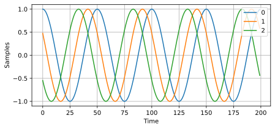
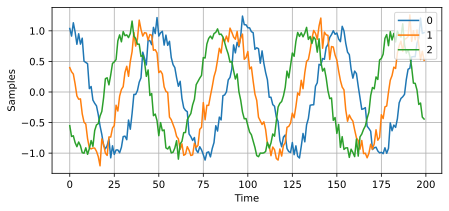
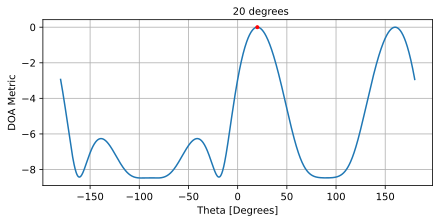
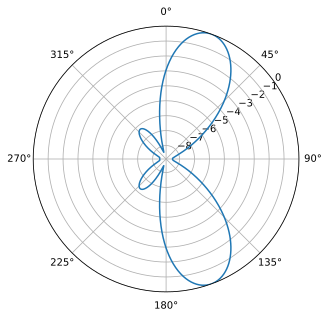
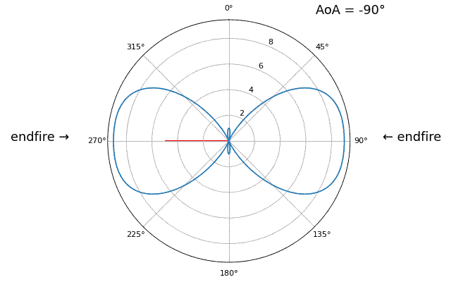
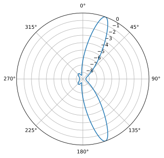
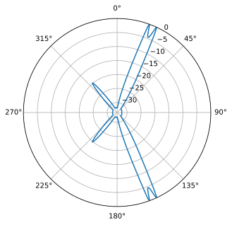
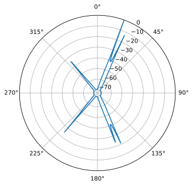
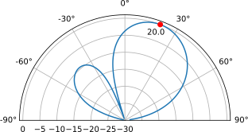

.. _doa-chapter:

####################################
DOA & Beamforming
####################################

En este capítulo cubrimos los conceptos de beamforming, dirección de llegada (DOA) y arreglos en fase en general. Se analizan técnicas como Capon y MUSIC, utilizando ejemplos de simulación de Python. Cubrimos beamforming frente a DOA y analizamos los dos tipos diferentes de matrices en fase (matriz pasiva escaneada electrónicamente o PESA y matriz activa escaneada electrónicamente o AESA).

***************************************************
Descripción general y terminología
***************************************************

Un Phase Array, también conocido como conjunto dirigido electrónicamente, es un conjunto de antenas que se pueden usar en el lado de transmisión o recepción para formar haces en una o más direcciones deseadas. Se utilizan tanto en comunicaciones como en radar, y los encontrará en tierra, en aire y en satélites.

Los arreglos en fase se pueden dividir en tres tipos:

1. **Passive electronically scanned array (PESA)**, también conocida como matriz en fase analógica o tradicional, donde se utilizan desfasadores analógicos para dirigir el haz. En el lado de recepción, todos los elementos se suman después del cambio de fase (y opcionalmente, ganancia ajustable) y se convierten en un canal de señal que se convierte y se recibe. En el lado de transmisión ocurre lo contrario; se emite una única señal digital desde el lado digital, y en el lado analógico se utilizan desfasadores y etapas de ganancia para producir la salida que va a cada antena. Estos desfasadores digitales tendrán un número limitado de bits de resolución y controlarán la latencia.
2. **Active electronically scanned array (AESA)**, también conocidos como matrices totalmente digitales, donde cada elemento tiene su propia interfaz de RF y la formación del haz se realiza completamente en el dominio digital. Este es el enfoque más caro, ya que los componentes de RF son caros, pero proporciona mucha más flexibilidad y velocidad que los PESA. Los arreglos digitales son populares entre los SDR, aunque la cantidad de canales de recepción o transmisión del SDR limita la cantidad de elementos en su arreglo.
3. **Hybrid array**, que consta de subconjuntos que se asemejan individualmente a los PESA, donde cada subconjunto tiene su propia interfaz de RF al igual que los AESA. Este es el enfoque más común para los arreglos en fase modernos, ya que ofrece lo mejor de ambos mundos.

A continuación se muestra un ejemplo de cada uno de los tipos.

.. image:: ../_images/beamforming_examples.svg
   :align: center 
   :target: ../_images/beamforming_examples.svg
   :alt: Example of phased arrays including Passive electronically scanned array (PESA), Active electronically scanned array (AESA), Hybrid array, showing Raytheon's MIM-104 Patriot Radar, ELM-2084 Israeli Multi-Mission Radar, Starlink User Terminal, aka Dishy

En este capítulo nos centramos principalmente en DSP para arreglos totalmente digitales, ya que son más adecuados para la simulación y DSP, pero en el siguiente capítulo nos ponemos manos a la obra con el arreglo "Phaser" y SDR de Analog Devices que tiene 8 desfasadores analógicos. alimentando a un Pluto.

Normalmente nos referimos a las antenas que forman un conjunto como elementos y, a veces, al conjunto se le llama "sensor". Estos elementos del conjunto suelen ser antenas omnidireccionales, igualmente espaciadas en una línea o en dos dimensiones.

Un formador de haces es esencialmente un filtro espacial; filtra señales de todas las direcciones excepto las direcciones deseadas. En lugar de taps, utilizamos pesos (también conocidos como coeficientes) aplicados a cada elemento de un arreglo. Luego manipulamos los pesos para formar los aces (s) del arreglo, ¡de ahí el nombre formador de haces (beamforming)! Podemos dirigir estos aces (y nulos) extremadamente rápido; debe ser más rápido que las antenas con cardán mecánico, que pueden considerarse una alternativa a los conjuntos en fase. Una sola matriz puede rastrear electrónicamente múltiples señales a la vez y al mismo tiempo anular las interferencias, siempre que tenga suficientes elementos. Normalmente analizaremos la formación de haces en el contexto de un enlace de comunicaciones, donde el receptor pretende recibir una o más señales con la SNR más alta posible. 

Los enfoques de beamforming suelen dividirse en convencionales y adaptativos. Con la formación de haces convencional se supone que ya se conoce la dirección de llegada de la señal de interés, y el formador de haces implica elegir pesos para maximizar la ganancia en esa dirección. Esto se puede utilizar en el lado de recepción o transmisión de un sistema de comunicación. La formación de haz adaptativa, por otro lado, implica ajustar constantemente los pesos en función de la salida del formador de haz, para optimizar algunos criterios, lo que a menudo implica anular una fuente de interferencia. Debido al circuito cerrado y la naturaleza adaptativa, la formación de haz adaptativa generalmente solo se usa en el lado de recepción, por lo que la "salida del formador de haz" es simplemente la señal recibida, y la formación de haz adaptativa implica ajustar los pesos en función de las estadísticas de los datos recibidos.

La dirección de llegada (DOA) dentro de DSP/SDR se refiere al proceso de utilizar un conjunto de antenas para estimar las direcciones de llegada de una o más señales recibidas por ese conjunto (a diferencia de la formación de haces, que se centra en el proceso de recibir una señal mientras rechaza la mayor cantidad de ruido e interferencia). Aunque DOA ciertamente se incluye dentro del tema de beamforming, los términos pueden resultar confusos. Algunas técnicas como MVDR/Capon se aplicarán tanto a DOA como a la formación de haces, porque la misma técnica utilizada para la formación de haces se utiliza para realizar DOA barriendo el ángulo de interés y realizando la operación de formación de haces en cada ángulo, luego buscando picos en el resultado ( cada pico es una señal, pero no sabemos si es la señal de interés, una interferencia o incluso un rebote multitrayecto de la señal de interés). Puede pensar en estas técnicas DOA como una envoltura alrededor de un formador de haz específico. Existen técnicas DOA como MUSIC y ESPIRT que son estrictamente para el propósito de DOA. Debido a que la mayoría de las técnicas de formación de haces suponen que usted conoce el ángulo de llegada de la señal de interés, si el objetivo se está moviendo o el conjunto se está moviendo, tendrá que realizar DOA continuamente como paso intermedio, incluso si su objetivo principal es recibir y demodular la señal de interés.

Los arreglos en fase y el beamforming/DOA se utilizan en todo tipo de aplicaciones, aunque con mayor frecuencia los verá utilizados en múltiples formas de radar, comunicación mmWave dentro de 5G, comunicaciones por satélite e interferencias. Cualquier aplicación que requiera una antena de alta ganancia, o que requiera una antena de alta ganancia que se mueva rápidamente, es buena candidata para los arreglos en fase.

*******************
Requerimientos SDR
*******************

Como se mencionó, los arreglos en fase analógicos implican un desfasador analógico (y generalmente una ganancia ajustable) por canal, lo que significa que un arreglo en fase analógico es una pieza de hardware dedicada que debe ir junto con un SDR. Por otro lado, cualquier SDR que contenga más de un canal se puede utilizar como una matriz digital sin hardware adicional, siempre que los canales sean coherentes en fase y se muestreen utilizando el mismo reloj, lo que suele ser el caso de los SDR que tienen múltiples canales. Recibir canales a bordo. Hay muchos SDR que contienen **dos** canales de recepción, como el Ettus USRP B210 y Analog Devices Pluto (el segundo canal está expuesto mediante un conector uFL en la propia placa). Desafortunadamente, ir más allá de dos canales implica entrar en el segmento de SDR de más de 10.000 dólares, al menos a partir de 2023, como el USRP N310. El principal problema es que los SDR de bajo costo normalmente no se pueden "encadenar" para escalar el número de canales. La excepción son KerberosSDR (4 canales) y KrakenSDR (5 canales), que utilizan múltiples RTL-SDR que comparten un LO para formar una matriz digital de bajo costo; la desventaja es la frecuencia de muestreo (hasta 2,56 MHz) y el rango de sintonización muy limitados (hasta 1766 MHz). A continuación se muestran la placa KrakenSDR y un ejemplo de configuración de antena.

.. image:: ../_images/krakensdr.jpg
   :align: center 
   :alt: The KrakenSDR
   :target: ../_images/krakensdr.jpg

En este capítulo no utilizamos ningún SDR específico; en lugar de eso, simulamos la recepción de señales usando Python y luego pasamos por el DSP y observamos el desempeño del Beamforming/DOA para arreglos digitales.

******************************************
Introducción a Matrix Math en Python/NumPy
******************************************

Python tiene muchas ventajas sobre MATLAB, como ser gratuito y de código abierto, diversidad de aplicaciones, comunidad vibrante, índices que comienzan desde 0 como cualquier otro lenguaje, uso dentro de AI/ML y parece haber una biblioteca para cualquier cosa que se pueda imaginar. Pero lo que se queda corto es cómo se codifica/representa la manipulación de matrices (en términos de computación/velocidad, es bastante rápido, con funciones implementadas bajo un lenguaje más eficiente como C/C++). No ayuda que haya múltiples formas de representar matrices en Python, con el método :code:`np.matrix` obsoleto en favor de :code:`np.ndarray`. En esta sección proporcionamos una breve introducción a cómo hacer cálculos matriciales en Python usando NumPy, para que cuando lleguemos a los ejemplos de DOA se sienta más cómodo.

Comencemos saltando a la parte más molesta de las matemáticas matriciales en NumPy; Los vectores se tratan como matrices 1D, por lo que no hay forma de distinguir entre un vector de fila y un vector de columna (se tratará como un vector de fila de forma predeterminada), mientras que en MATLAB un vector es un objeto 2D. En Python puedes crear un nuevo vector usando :code:`a = np.array([2,3,4,5])` o convertir una lista en un vector usando :code:`mylist = [2, 3, 4 , 5]` entonces :code:`a = np.asarray(mylist)`, pero tan pronto como quieras hacer cálculos matriciales, la orientación importa y estos se interpretarán como vectores de fila. Intentando hacer una transposición en este vector, p.e. usando :code:`a.T`, **no** lo cambiará a un vector de columna. La forma de hacer un vector de columna a partir de un vector normal :code:`a` es usar :code:`a = a.reshape(-1,1)`. El :code:`-1` le dice a NumPy que calcule el tamaño de esta dimensión automáticamente, mientras mantiene la longitud de la segunda dimensión 1. Lo que esto crea es técnicamente una matriz 2D, pero la segunda dimensión tiene una longitud 1, por lo que sigue siendo esencialmente 1D de una perspectiva matemática. Es sólo una línea adicional, pero realmente puede alterar el flujo del código matemático matricial.

Ahora veamos un ejemplo rápido de matemáticas matriciales en Python; multiplicaremos una matriz :code:`3x10` por una matriz :code:`10x1`. Recuerde que :code:`10x1` significa 10 filas y 1 columna, lo que se conoce como vector de columna porque es solo una columna. Desde nuestros primeros años escolares sabemos que esta es una multiplicación de matrices válida porque las dimensiones internas coinciden y el tamaño de la matriz resultante son las dimensiones externas, o :code:`3x1`. Usaremos :code:`np.random.randn()` para crear :code:`3x10` y :code:`np.arange()` para crear :code:`10x1`, por conveniencia:

.. code-block:: python

 A = np.random.randn(3,10) # 3x10
 B = np.arange(10) # 1D array of length 10
 B = B.reshape(-1,1) # 10x1
 C = A @ B # matrix multiply
 print(C.shape) # 3x1
 C = C.squeeze() # see next subsection
 print(C.shape) # 1D array of length 3, easier for plotting and other non-matrix Python code

Después de realizar cálculos matriciales, es posible que el resultado se parezca a: :code:`[[ 0. 0.125 0.251 -0.376 -0.251 ...]]` que claramente tiene solo una dimensión de datos, pero si va a trazarlo, obtendrá un error o un gráfico que no muestra nada. Esto se debe a que el resultado es técnicamente una matriz 2D y necesitas convertirla a una matriz 1D usando :code:`a.squeeze()`. La función :code:`squeeze()` elimina cualquier dimensión de longitud 1 y resulta útil al realizar cálculos matriciales en Python. En el ejemplo anterior, el resultado sería :code:`[ 0. 0.125 0.251 -0.376 -0.251 ...]` (observe los segundos corchetes que faltan), que se puede trazar o usar en otro código Python que espere algo 1D .

Al codificar matemáticas matriciales, la mejor comprobación de cordura que puede hacer es imprimir las dimensiones (usando :code:`A.shape`) para verificar que sean lo que espera. Considere pegar la forma en los comentarios después de cada línea para referencia futura, de modo que sea fácil asegurarse de que las dimensiones coincidan al realizar multiplicaciones matriciales o por elementos.

A continuación se muestran algunas operaciones comunes tanto en MATLAB como en Python, como una especie de hoja de referencia a la que recurrir:

.. list-table::
   :widths: 35 25 40
   :header-rows: 1

   * - Operation
     - MATLAB
     - Python/NumPy
   * - Create (Row) Vector, size :code:`1 x 4`
     - :code:`a = [2 3 4 5];`
     - :code:`a = np.array([2,3,4,5])`
   * - Create Column Vector, size :code:`4 x 1`
     - :code:`a = [2; 3; 4; 5];` or :code:`a = [2 3 4 5].'`
     - :code:`a = np.array([[2],[3],[4],[5]])` or |br| :code:`a = np.array([2,3,4,5])` then |br| :code:`a = a.reshape(-1,1)`
   * - Create 2D Matrix
     - :code:`A = [1 2; 3 4; 5 6];`
     - :code:`A = np.array([[1,2],[3,4],[5,6]])`
   * - Get Size
     - :code:`size(A)`
     - :code:`A.shape`
   * - Transpose a.k.a. :math:`A^T`
     - :code:`A.'`
     - :code:`A.T`
   * - Complex Conjugate Transpose |br| a.k.a. Conjugate Transpose |br| a.k.a. Hermitian Transpose |br| a.k.a. :math:`A^H`
     - :code:`A'`
     - :code:`A.conj().T` |br| |br| (unfortunately there is no :code:`A.H` for ndarrays)
   * - Elementwise Multiply
     - :code:`A .* B`
     - :code:`A * B` or :code:`np.multiply(a,b)`
   * - Matrix Multiply
     - :code:`A * B`
     - :code:`A @ B` or :code:`np.matmul(A,B)`
   * - Dot Product of two vectors (1D)
     - :code:`dot(a,b)`
     - :code:`np.dot(a,b)` (never use np.dot for 2D)
   * - Concatenate
     - :code:`[A A]`
     - :code:`np.concatenate((A,A))`

****************************
Factor de Arreglo Matemático
****************************

Para llegar a la parte divertida, tenemos que hacer un poco de matemáticas, pero la siguiente sección se ha escrito para que las matemáticas sean extremadamente simples y tengan diagramas que las acompañen, solo se utilizan las propiedades trigonométricas y exponenciales más básicas. . Es importante comprender las matemáticas básicas detrás de lo que haremos en Python para realizar DOA.

Considere una matriz 1D de tres elementos espaciados uniformemente:

.. image:: ../_images/doa.svg
   :align: center 
   :target: ../_images/doa.svg
   :alt: Diagram showing direction of arrival (DOA) of a signal impinging on a uniformly spaced antenna array, showing boresight angle and distance between elements or apertures

En este ejemplo, una señal llega desde el lado derecho, por lo que llega primero al elemento más a la derecha. Calculemos el retraso entre el momento en que la señal llega a ese primer elemento y el momento en que llega al siguiente elemento. Podemos hacer esto formando el siguiente problema trigonométrico. Intenta visualizar cómo se formó este triángulo a partir del diagrama de arriba. El segmento resaltado en rojo representa la distancia que la señal tiene que recorrer *después* de haber alcanzado el primer elemento, antes de llegar al siguiente.

.. image:: ../_images/doa_trig.svg
   :align: center 
   :target: ../_images/doa_trig.svg
   :alt: Trig associated with direction of arrival (DOA) of uniformly spaced array

Si recuerdas SOH CAH TOA, en este caso estamos interesados en el lado "adyacente" y tenemos la longitud de la hipotenusa (:math:`d`), por lo que necesitamos usar un coseno:

.. math::
  \cos(90 - \theta) = \frac{\mathrm{adjacent}}{\mathrm{hypotenuse}}

Debemos resolver para la adyacente, ya que eso es lo que nos dirá qué tan lejos debe viajar la señal entre el primer y el segundo elemento, para que se vuelva adyacente :math:`= d \cos(90 - \theta)`. Ahora hay una identidad trigonométrica que nos permite convertir esto en :math:`= d \sin(\theta)` adyacente. Sin embargo, esto es solo una distancia, necesitamos convertir esto a un tiempo, usando la velocidad de la luz: tiempo transcurrido :math:`= d \sin(\theta) / c` [segundos]. Esta ecuación se aplica entre cualquier elemento adyacente de nuestra matriz, aunque podemos multiplicar todo por un número entero para calcular entre elementos no adyacentes, ya que están espaciados uniformemente (lo haremos más adelante).  

Ahora, para conectar estas matemáticas de activación y velocidad de la luz con el mundo del procesamiento de señales. Denotemos nuestra señal de transmisión en banda base :math:`s(t)` y se está transmitiendo en alguna portadora, :math:`f_c` , por lo que la señal de transmisión es :math:`s(t) e^{2j \pi f_ct}`. Digamos que esta señal llega al primer elemento en el momento :math:`t = 0`, lo que significa que llega al siguiente elemento después de :math:`d \sin(\theta) / c` [segundos] como calculamos anteriormente. Esto significa que el segundo elemento recibe:

.. math::
 s(t - \Delta t) e^{2j \pi f_c (t - \Delta t)}

.. math::
 \mathrm{where} \quad \Delta t = d \sin(\theta) / c

recuerde que cuando tiene un cambio de tiempo, se resta del argumento de tiempo.

Cuando el receptor o SDR realiza el proceso de conversión descendente para recibir la señal, esencialmente la multiplica por la portadora pero en la dirección inversa, por lo que después de realizar la conversión descendente el receptor ve:

.. math::
 s(t - \Delta t) e^{2j \pi f_c (t - \Delta t)} e^{-2j \pi f_c t}

.. math::
 = s(t - \Delta t) e^{-2j \pi f_c \Delta t}

Ahora podemos hacer un pequeño truco para simplificar esto aún más; considere cómo cuando tomamos muestras de una señal, se puede modelar sustituyendo :math:`t` por :math:`nT` donde :math:`T` es el período de muestra y :math:`n` es solo 0, 1, 2 , 3... Sustituyendo esto obtenemos :math:`s(nT - \Delta t) e^{-2j \pi f_c \Delta t}`. Bueno, :math:`nT` es mucho mayor que :math:`\Delta t` que podemos deshacernos del primer término :math:`\Delta t` y nos queda :math:`s(nT ) e^{-2j \pi f_c \Delta t}`. Si la frecuencia de muestreo alguna vez llega a ser lo suficientemente rápida como para acercarse a la velocidad de la luz en una distancia pequeña, podemos revisar esto, pero recuerde que nuestra frecuencia de muestreo solo necesita ser un poco mayor que el ancho de banda de la señal de interés.

Sigamos con estos cálculos, pero comenzaremos a representar las cosas en términos discretos para que se parezca mejor a nuestro código Python. La última ecuación se puede representar de la siguiente manera, volvamos a conectar :math:`\Delta t`:

.. math::
 s[n] e^{-2j \pi f_c \Delta t}

.. math::
 = s[n] e^{-2j \pi f_c d \sin(\theta) / c}

Ya casi hemos terminado, pero afortunadamente hay una simplificación más que podemos hacer. Recuerde la relación entre la frecuencia central y la longitud de onda: :math:`\lambda = \frac{c}{f_c}` o la forma que usaremos: :math:`f_c = \frac{c}{\lambda}`. Al conectar esto obtenemos:

.. math::
 s[n] e^{-2j \pi \frac{c}{\lambda} d \sin(\theta) / c}

.. math::
 = s[n] e^{-2j \pi d \sin(\theta) / \lambda}

En DOA lo que nos gusta hacer es representar :math:`d`, la distancia entre elementos adyacentes, como una fracción de longitud de onda (en lugar de metros), el valor más común elegido para :math:`d` durante el proceso de diseño del arreglo. es utilizar la mitad de la longitud de onda. Independientemente de lo que sea :math:`d`, a partir de este momento vamos a representar :math:`d` como una fracción de longitud de onda en lugar de metros, simplificando la ecuación y todo nuestro código:

.. math::
 s[n] e^{-2j \pi d \sin(\theta)}

Esto es para elementos adyacentes, para el :math:`k`'ésimo elemento solo necesitamos multiplicar :math:`d` por :math:`k`:

.. math::
 s[n] e^{-2j \pi d k \sin(\theta)}

¡Y hemos terminado! ¡Esta ecuación anterior es lo que verá en los documentos e implementaciones de DOA en todas partes! Normalmente llamamos a ese término exponencial el "factor de matriz" (a menudo indicado como :math:`a`) y lo representamos como una matriz, una matriz 1D para una matriz de antenas 1D, etc. En Python :math:`a` es:

.. code-block:: python

 a = [np.exp(-2j*np.pi*d*0*np.sin(theta)), np.exp(-2j*np.pi*d*1*np.sin(theta)), np.exp(-2j*np.pi*d*2*np.sin(theta)), ...] # note the increasing k
 # or
 a = np.exp(-2j * np.pi * d * np.arange(Nr) * np.sin(theta)) # where Nr is the number of receive antenna elements

Observe cómo el elemento 0 da como resultado 1+0j (porque :math:`e^{0}=1`); Esto tiene sentido porque todo lo anterior era relativo a ese primer elemento, por lo que recibe la señal tal como está sin ningún cambio de fase relativa. Así es puramente como funcionan las matemáticas; en realidad, cualquier elemento podría considerarse como la referencia, pero como verá en nuestro código/matemático más adelante, lo que importa es la diferencia en fase/amplitud recibida entre los elementos. Todo es relativo.

*******************
Recibiendo señales
*******************

Usemos el concepto de factor de matriz para simular una señal que llega a una matriz. Para una señal de transmisión solo usaremos un tono por ahora:

.. code-block:: python

 import numpy as np
 import matplotlib.pyplot as plt
 
 sample_rate = 1e6
 N = 10000 # number of samples to simulate
 
 # Create a tone to act as the transmitter signal
 t = np.arange(N)/sample_rate # time vector
 f_tone = 0.02e6
 tx = np.exp(2j * np.pi * f_tone * t)

Ahora simulemos un conjunto que consta de tres antenas omnidireccionales en una línea, con 1/2 longitud de onda entre las adyacentes (también conocido como "espaciado de media longitud de onda"). Simularemos la señal del transmisor que llega a esta matriz en un cierto ángulo, theta. Comprender el factor de matriz :code:`a` a continuación es la razón por la que revisamos todos los cálculos anteriores.

.. code-block:: python

 d = 0.5 # half wavelength spacing
 Nr = 3
 theta_degrees = 20 # direction of arrival (feel free to change this, it's arbitrary)
 theta = theta_degrees / 180 * np.pi # convert to radians
 a = np.exp(-2j * np.pi * d * np.arange(Nr) * np.sin(theta)) # array factor
 print(a) # note that it's 3 elements long, it's complex, and the first element is 1+0j

Para aplicar el factor de matriz tenemos que hacer una multiplicación matricial de :code:`a` y :code:`tx`, así que primero conviertamos ambos a 2D, usando el enfoque que discutimos anteriormente cuando revisamos cómo hacer matemáticas matriciales en Python. Comenzaremos convirtiendo ambos en vectores de fila usando :code:`x.reshape(-1,1)`. Luego realizamos la multiplicación matricial, indicada por el símbolo :code:`@`. También tenemos que convertir :code:`tx` de un vector de fila a un vector de columna usando una operación de transposición (imagínelo girando 90 grados) para que la matriz multiplique las dimensiones internas coincidan.

.. code-block:: python

 a = a.reshape(-1,1)
 print(a.shape) # 3x1
 tx = tx.reshape(-1,1)
 print(tx.shape) # 10000x1
 
 # matrix multiply
 r = a @ tx.T  # dont get too caught up by the transpose, the important thing is we're multiplying the array factor by the tx signal
 print(r.shape) # 3x10000.  r is now going to be a 2D array, 1D is time and 1D is the spatial dimension

En este punto :code:`r` es una matriz 2D, tamaño 3 x 10000 porque tenemos tres elementos de la matriz y 10000 muestras simuladas. Podemos extraer cada señal individual y trazar las primeras 200 muestras; a continuación trazaremos solo la parte real, pero también hay una parte imaginaria, como cualquier señal de banda base. Una parte molesta de las matemáticas matriciales en Python es la necesidad de agregar :code:`.squeeze()`, que elimina todas las dimensiones con longitud 1, para volver a una matriz NumPy 1D normal que se espera para el trazado y otras operaciones.

.. code-block:: python

 plt.plot(np.asarray(r[0,:]).squeeze().real[0:200]) # the asarray and squeeze are just annoyances we have to do because we came from a matrix
 plt.plot(np.asarray(r[1,:]).squeeze().real[0:200])
 plt.plot(np.asarray(r[2,:]).squeeze().real[0:200])
 plt.show()

Tenga en cuenta los cambios de fase entre elementos como esperamos que sucedan (a menos que la señal llegue de forma paralela, en cuyo caso llegará a todos los elementos al mismo tiempo y no habrá un cambio, establezca theta en 0 para ver). El elemento 0 parece llegar primero, y los demás se retrasan ligeramente. Intente ajustar el ángulo y vea qué sucede.

Como paso final, agreguemos ruido a esta señal recibida, ya que cada señal con la que trataremos tiene cierta cantidad de ruido. Queremos aplicar el ruido después de aplicar el factor de matriz, porque cada elemento experimenta una señal de ruido independiente (podemos hacer esto porque AWGN con un cambio de fase aplicado sigue siendo AWGN):

.. code-block:: python

 n = np.random.randn(Nr, N) + 1j*np.random.randn(Nr, N)
 r = r + 0.5*n # r and n are both 3x10000

*******************
DOA convencional
*******************

Ahora procesaremos estos ejemplos :code:`r`, fingiendo que no conocemos el ángulo de llegada, y realizaremos DOA, que implica estimar los ángulos de llegada con un DSP y algo de código Python. Como se analizó anteriormente en este capítulo, el beamforming y realizar DOA son muy similares y a menudo se basan en las mismas técnicas. A lo largo del resto de este capítulo investigaremos diferentes "beamfirming", y para cada uno comenzaremos con el código/matemática del beamforming que calcula los pesos, :math:`w`. Estos pesos se pueden "aplicar" a la señal entrante :code:`r` mediante la ecuación simple :math:`w^H r`, o en Python :code:`w.conj().T @ r`. En el ejemplo anterior, :code:`r` es una matriz :code:`3x10000`, pero después de aplicar los pesos nos queda :code:`1x10000`, como si nuestro receptor solo tuviera una antena, y podemos utilizar un DSP RF normal para procesar la señal. Después de desarrollar el beamforming, lo aplicaremos al problema de DOA.

Comenzaremos con el enfoque del beamforming "convencional", también conocido como beamforming de retardo y suma. Nuestro vector de pesos :code:`w` necesita ser una matriz 1D para una matriz lineal uniforme; en nuestro ejemplo de tres elementos, :code:`w` es una matriz :code:`3x1` de pesos complejos. Con la formación de haces convencional dejamos la magnitud de los pesos en 1 y ajustamos las fases para que la señal se sume constructivamente en la dirección de nuestra señal deseada, a la que nos referiremos como :math:`\theta`. ¡Resulta que estos son exactamente los mismos cálculos que hicimos arriba!

.. math::
 w_{conventional} = e^{-2j \pi d k \sin(\theta)}

o en Python:

.. code-block:: python

 w = np.exp(-2j * np.pi * d * np.arange(Nr) * np.sin(theta)) # Conventional, aka delay-and-sum, beamformer
 r = w.conj().T @ r # example of applying the weights to the received signal (i.e., perform the beamforming)

donde :code:`Nr` es el número de elementos en nuestra matriz lineal uniforme con espaciado de :code:`d` fracciones de longitud de onda (más a menudo ~0,5). Como puede ver, los pesos no dependen de nada más que de la geometría de la matriz y el ángulo de interés. Si nuestra matriz implicara calibrar la fase, también incluiríamos esos valores de calibración.

Pero ¿cómo sabemos el ángulo de interés :code:`theta`? Debemos comenzar realizando DOA, que implica escanear (muestrear) todas las direcciones de llegada desde -π a +π (-180 a +180 grados), por ejemplo, en incrementos de 1 grado. En cada dirección calculamos los pesos usando un formador de haces; Comenzaremos usando el formador de haz convencional. Aplicar los pesos a nuestra señal :code:`r` nos dará una matriz 1D de muestras, como si la recibiéramos con 1 antena direccional. Luego podemos calcular la potencia en la señal tomando la varianza con :code:`np.var()`, y repetir para cada ángulo en nuestro escaneo. Trazaremos los resultados y los veremos con nuestros ojos/cerebro humanos, pero lo que hace la mayoría de los DSP RF es encontrar el ángulo de potencia máxima (con un algoritmo de búsqueda de picos) y llamarlo estimación de DOA.

.. code-block:: python

 theta_scan = np.linspace(-1*np.pi, np.pi, 1000) # 1000 different thetas between -180 and +180 degrees
 results = []
 for theta_i in theta_scan:
    w = np.exp(-2j * np.pi * d * np.arange(Nr) * np.sin(theta_i)) # Conventional, aka delay-and-sum, beamformer
    r_weighted = w.conj().T @ r # apply our weights. remember r is 3x10000
    results.append(10*np.log10(np.var(r_weighted))) # power in signal, in dB so its easier to see small and large lobes at the same time
 results -= np.max(results) # normalize
 
 # print angle that gave us the max value
 print(theta_scan[np.argmax(results)] * 180 / np.pi) # 19.99999999999998
 
 plt.plot(theta_scan*180/np.pi, results) # lets plot angle in degrees
 plt.xlabel("Theta [Degrees]")
 plt.ylabel("DOA Metric")
 plt.grid()
 plt.show()

¡Encontramos nuestra señal! Probablemente esté empezando a darse cuenta de dónde entra el término matriz dirigida eléctricamente. Intente aumentar la cantidad de ruido para llevarlo al límite; es posible que necesite simular la recepción de más muestras para SNR bajas. Intente también cambiar la dirección de llegada.

If you prefer viewing angle on a polar plot, use the following code:

.. code-block:: python

 fig, ax = plt.subplots(subplot_kw={'projection': 'polar'})
 ax.plot(theta_scan, results) # MAKE SURE TO USE RADIAN FOR POLAR
 ax.set_theta_zero_location('N') # make 0 degrees point up
 ax.set_theta_direction(-1) # increase clockwise
 ax.set_rlabel_position(55)  # Move grid labels away from other labels
 plt.show()

Seguiremos viendo este patrón de bucles sobre ángulos y teniendo algún método para calcular los pesos del beamforming y luego aplicarlos a la señal recibida. En el próximo método de beamforming (MVDR), usaremos nuestra señal recibida :code:`r` como parte de los cálculos de peso, lo que la convierte en una técnica adaptativa. Pero primero investigaremos algunas cosas interesantes que suceden con los arreglos en fase, incluido por qué tenemos ese segundo pico a 160 grados.

************************
Ambiguedad de 180 grados
************************

Hablemos de por qué hay un segundo pico a 160 grados; el DOA que simulamos fue de 20 grados, pero no es casualidad que 180 - 20 = 160. Imagínese tres antenas omnidireccionales en línea colocadas sobre una mesa. La mira del conjunto es de 90 grados con respecto al eje del conjunto, como se indica en el primer diagrama de este capítulo. Ahora imagine el transmisor frente a las antenas, también sobre la mesa (muy grande), de modo que su señal llegue en un ángulo de +20 grados desde el punto de mira. Bueno, la matriz ve el mismo efecto ya sea que la señal llegue con respecto a su frente o atrás, el retraso de fase es el mismo, como se muestra a continuación con los elementos de la matriz en rojo y los dos posibles DOA del transmisor en verde. Por lo tanto, cuando realizamos el algoritmo DOA, siempre habrá una ambigüedad de 180 grados como esta, la única forma de evitarla es tener una matriz 2D o una segunda matriz 1D colocada en cualquier otro ángulo con respecto a la primera matriz. Quizás se pregunte si esto significa que también podríamos calcular solo -90 a +90 grados para ahorrar ciclos de cálculo, ¡y estaría en lo cierto!

.. image:: ../_images/doa_from_behind.svg
   :align: center 
   :target: ../_images/doa_from_behind.svg

***********************
Orientación del arreglo
***********************

Para demostrar el siguiente concepto, intentemos barrer el ángulo de llegada (AoA) de -90 a +90 grados en lugar de mantenerlo constante en 20:

A medida que nos acercamos a la orientación de la matriz (también conocido como endfire), que es cuando la señal llega al eje de la matriz o cerca de él, el rendimiento disminuye. Vemos dos degradaciones principales: 1) el lóbulo principal se ensancha y 2) obtenemos ambigüedad y no sabemos si la señal proviene de la izquierda o de la derecha. Esta ambigüedad se suma a la ambigüedad de 180 grados discutida anteriormente, donde obtenemos un lóbulo adicional en 180 theta, lo que hace que ciertos AoA conduzcan a tres lóbulos de aproximadamente el mismo tamaño. Sin embargo, esta ambigüedad general tiene sentido, los cambios de fase que ocurren entre los elementos son idénticos ya sea que la señal llegue del lado izquierdo o derecho. el eje de la matriz. Al igual que con la ambigüedad de 180 grados, la solución es utilizar una matriz 2D o dos matrices 1D en diferentes ángulos. En general, la formación de haces funciona mejor cuando el ángulo está más cerca del eje de puntería.

*******************
Cuando d no es λ/2
*******************

Hasta ahora hemos estado usando una distancia entre elementos, d, igual a la mitad de la longitud de onda. Entonces, por ejemplo, una matriz diseñada para WiFi de 2,4 GHz con espaciado λ/2 tendría un espaciado de 3e8/2,4e9/2 = 12,5 cm o aproximadamente 5 pulgadas, lo que significa que una matriz de 4x4 elementos tendría aproximadamente 15" x 15" x el Altura de las antenas. Hay ocasiones en las que es posible que una matriz no pueda lograr exactamente un espaciado λ/2, como cuando el espacio es restringido o cuando la misma matriz tiene que funcionar en una variedad de frecuencias portadoras.

Examinemos cuándo el espaciado es mayor que λ/2, es decir, demasiado espaciado, variando d entre λ/2 y 4λ. Eliminaremos la mitad inferior del gráfico polar ya que de todos modos es un espejo de la parte superior.

.. image:: ../_images/doa_d_is_large_animation.gif
   :scale: 100 %
   :align: center
   :alt: Animation of direction of arrival (DOA) showing what happens when distance d is much more than half-wavelength

Como puede ver, además de la ambigüedad de 180 grados que discutimos anteriormente, ahora tenemos ambigüedad adicional, y empeora a medida que d aumenta (forma de lóbulos extra/incorrectos). Estos lóbulos adicionales se conocen como lóbulos de rejilla y son el resultado de un "aliasing espacial". Como aprendimos en el capítulo :ref:`sampling-chapter`, cuando no tomamos muestras lo suficientemente rápido obtenemos alias. Lo mismo ocurre en el ámbito espacial; si nuestros elementos no están lo suficientemente espaciados con respecto a la frecuencia portadora de la señal, obtenemos resultados basura en nuestro análisis. ¡Puedes pensar en espaciar las antenas como espacio de muestreo! En este ejemplo podemos ver que los lóbulos de la rejilla no se vuelven demasiado problemáticos hasta que d > λ, pero ocurrirán tan pronto como supere el espaciado λ/2.

Ahora bien, ¿qué sucede cuando d es menor que λ/2, como cuando necesitamos ajustar la matriz en un espacio pequeño? Repitamos la misma simulación:

.. image:: ../_images/doa_d_is_small_animation.gif
   :scale: 100 %
   :align: center
   :alt: Animation of direction of arrival (DOA) showing what happens when distance d is much less than half-wavelength

Si bien el lóbulo principal se ensancha a medida que d disminuye, todavía tiene un máximo a 20 grados y no hay lóbulos reticulares, por lo que, en teoría, esto aún funcionaría (al menos con una SNR alta). Para comprender mejor qué se rompe cuando d se vuelve demasiado pequeño, repitamos el experimento pero con una señal adicional que llega desde -40 grados:

.. image:: ../_images/doa_d_is_small_animation2.gif
   :scale: 100 %
   :align: center
   :alt: Animation of direction of arrival (DOA) showing what happens when distance d is much less than half-wavelength and there are two signals present

Una vez que llegamos a un nivel inferior a λ/4, no se puede distinguir entre los dos caminos diferentes y la matriz funciona mal. Como veremos más adelante en este capítulo, existen técnicas de formación de haces que proporcionan haces más precisos que la formación de haces convencional, pero mantener d lo más cerca posible de λ/2 seguirá siendo un tema.

**********************
MVDR/Capon Beamformer
**********************

Ahora veremos un beamformer que es un poco más complicado que la técnica convencional/de retardo y suma, pero que tiende a funcionar mucho mejor, llamado Respuesta sin distorsión de varianza mínima (MVDR) o Capon Beamformer. Recuerde que la varianza de una señal corresponde a la cantidad de potencia que hay en la señal. La idea detrás de MVDR es mantener la señal en el ángulo de interés con una ganancia fija de 1 (0 dB), minimizando al mismo tiempo la variación/potencia total de la señal formada en haz resultante. Si nuestra señal de interés se mantiene fija, minimizar la potencia total significa minimizar las interferencias y el ruido tanto como sea posible. A menudo se lo denomina beamformer "estadísticamente óptimo".

El MVDR/Capon beamformer puede resumirse en la siguiente ecuación:

.. math::

 w_{mvdr} = \frac{R^{-1} a}{a^H R^{-1} a}

donde :math:`R` es la estimación de la matriz de covarianza basada en las muestras recibidas, calculada multiplicando :code:`r` por la transpuesta compleja conjugada de sí mismo, es decir, :math:`R = r r^H`, y el resultado será una matriz de tamaño :code:`Nr` x :code:`Nr` (3x3 en los ejemplos que hemos visto hasta ahora). Esta matriz de covarianza nos dice qué tan similares son las muestras recibidas de los tres elementos. El vector :math:`a` es el vector de dirección correspondiente a la dirección deseada y se analizó al principio de este capítulo.

Si ya conocemos la dirección de la señal de interés, y esa dirección no cambia, solo nos queda calcular los pesos una vez y simplemente usarlos para recibir nuestra señal de interés. Aunque incluso si la dirección no cambia, nos beneficia recalcular estos pesos periódicamente, para tener en cuenta los cambios en la interferencia/ruido, razón por la cual nos referimos a estos beamformer digitales no convencionales como beamforming "adaptativa"; utilizan información de la señal que recibimos para calcular los mejores pesos. Solo como recordatorio, podemos *realizar* formación de haces usando MVDR calculando estos pesos y aplicándolos a la señal con :code:`w.conj().T @ r`, tal como lo hicimos en el método convencional, el único La diferencia es cómo se calculan los pesos.

Para realizar DOA utilizando el beamformer MVDR, simplemente repetimos el cálculo de MVDR mientras escaneamos todos los ángulos de interés. Es decir, actuamos como si nuestra señal viniera del ángulo :math:`\theta`, incluso si no es así. En cada ángulo calculamos los pesos MVDR, luego los aplicamos a la señal recibida y luego calculamos la potencia en la señal. El ángulo que nos da la mayor potencia es nuestra estimación de DOA, o mejor aún, podemos trazar la potencia en función del ángulo para ver el patrón del haz, como hicimos anteriormente con el formador de haz convencional, de esa manera no necesitamos asumir cuantas señales están presentes.

En Python podemos implementar el beamformer MVDR/Capon de la siguiente manera, lo cual se hará como una función para que sea fácil de usar más adelante:

.. code-block:: python

 # theta is the direction of interest, in radians, and r is our received signal
 def w_mvdr(theta, r):
    a = np.exp(-2j * np.pi * d * np.arange(Nr) * np.sin(theta)) # steering vector in the desired direction theta
    a = a.reshape(-1,1) # make into a column vector (size 3x1)
    R = r @ r.conj().T # Calc covariance matrix. gives a Nr x Nr covariance matrix of the samples
    Rinv = np.linalg.pinv(R) # 3x3. pseudo-inverse tends to work better/faster than a true inverse
    w = (Rinv @ a)/(a.conj().T @ Rinv @ a) # MVDR/Capon equation! numerator is 3x3 * 3x1, denominator is 1x3 * 3x3 * 3x1, resulting in a 3x1 weights vector
    return w

Al utilizar este beamformer MVDR en el contexto de DOA, obtenemos el siguiente ejemplo de Python:

.. code-block:: python

 theta_scan = np.linspace(-1*np.pi, np.pi, 1000) # 1000 different thetas between -180 and +180 degrees
 results = []
 for theta_i in theta_scan:
    w = w_mvdr(theta_i, r) # 3x1
    r_weighted = w.conj().T @ r # apply weights
    power_dB = 10*np.log10(np.var(r_weighted)) # power in signal, in dB so its easier to see small and large lobes at the same time
    results.append(power_dB)
 results -= np.max(results) # normalize

Cuando se aplica a la simulación del ejemplo DOA anterior, obtenemos lo siguiente:

Parece funcionar bien, pero para compararlo realmente con otras técnicas tendremos que crear un problema más interesante. Configuremos una simulación con una matriz de 8 elementos que recibe tres señales desde diferentes ángulos: 20, 25 y 40 grados, con la de 40 grados recibida a una potencia mucho menor que las otras dos, como una forma de darle vida a las cosas. Nuestro objetivo será detectar las tres señales, lo que significa que queremos poder ver picos notables (lo suficientemente altos como para que un algoritmo de búsqueda de picos los extraiga). El código para generar este nuevo escenario es el siguiente:

.. code-block:: python

 Nr = 8 # 8 elements
 theta1 = 20 / 180 * np.pi # convert to radians
 theta2 = 25 / 180 * np.pi
 theta3 = -40 / 180 * np.pi
 a1 = np.exp(-2j * np.pi * d * np.arange(Nr) * np.sin(theta1)).reshape(-1,1) # 8x1
 a2 = np.exp(-2j * np.pi * d * np.arange(Nr) * np.sin(theta2)).reshape(-1,1)
 a3 = np.exp(-2j * np.pi * d * np.arange(Nr) * np.sin(theta3)).reshape(-1,1)
 # we'll use 3 different frequencies.  1xN
 tone1 = np.exp(2j*np.pi*0.01e6*t).reshape(1,-1)
 tone2 = np.exp(2j*np.pi*0.02e6*t).reshape(1,-1)
 tone3 = np.exp(2j*np.pi*0.03e6*t).reshape(1,-1)
 r = a1 @ tone1 + a2 @ tone2 + 0.1 * a3 @ tone3
 n = np.random.randn(Nr, N) + 1j*np.random.randn(Nr, N)
 r = r + 0.05*n # 8xN

Puedes poner este código en la parte superior de tu script, ya que estamos generando una señal diferente a la del ejemplo original. Si ejecutamos nuestro beamformer MVDR en este nuevo escenario obtenemos los siguientes resultados:

Funciona bastante bien, podemos ver las dos señales recibidas con solo 5 grados de diferencia, y también podemos ver la tercera señal (a -40 o 320 grados) que se recibió a una décima parte de la potencia de las demás. Ahora ejecutemos el formador de haces convencional en este nuevo escenario:

.. image:: ../_images/doa_complex_scenario.svg
   :align: center 
   :target: ../_images/doa_complex_scenario.svg

Si bien puede tener una forma bonita, no encuentra las tres señales en absoluto... Al comparar estos dos resultados, podemos ver el beneficio de usar un beamformer más complejo y "adaptativo".

Como comentario breve para el lector interesado, en realidad existe una optimización que se puede realizar al realizar DOA con MVDR, mediante un truco. Recuerde que calculamos la potencia de una señal tomando la varianza, que es la media de la magnitud al cuadrado (asumiendo que el valor promedio de nuestra señal es cero, lo que casi siempre es el caso de la RF de banda base). Podemos representar tomando la potencia en nuestra señal después de aplicar nuestros pesos como:

.. math::

 P_{mvdr} = \frac{1}{N} \sum_{n=0}^{N-1} \left| w^H_{mvdr} r_n \right|^2

Si reemplazamos la ecuación para los pesos MVDR obtenemos:

.. math::

 P_{mvdr} = \frac{1}{N} \sum_{n=0}^{N-1} \left| \left( \frac{R^{-1} a}{a^H R^{-1} a} \right)^H r_n \right|^2

   = \frac{1}{N} \sum_{n=0}^{N-1} \left| \frac{a^H R^{-1}}{a^H R^{-1} a} r_n \right|^2
  
  ... \mathrm{math}
   
   = \frac{1}{a^H R^{-1} a}

Lo que significa que no tenemos que aplicar los pesos en absoluto, esta ecuación final definida para la potencia se puede usar directamente en nuestro escaneo DOA, ahorrándonos algunos cálculos:

.. code-block:: python

    def power_mvdr(theta, r):
        a = np.exp(-2j * np.pi * d * np.arange(r.shape[0]) * np.sin(theta)) # steering vector in the desired direction theta_i
        a = a.reshape(-1,1) # make into a column vector (size 3x1)
        R = r @ r.conj().T # Calc covariance matrix. gives a Nr x Nr covariance matrix of the samples
        Rinv = np.linalg.pinv(R) # 3x3. pseudo-inverse tends to work better than a true inverse
        return 1/(a.conj().T @ Rinv @ a).squeeze()

Para usar esto en la simulación anterior, dentro del bucle for, lo único que queda por hacer es tomar el :code:`10*np.log10()` y listo, no hay pesos que aplicar; ¡Nos saltamos el cálculo de los pesos!

Hay muchos más formadores de haces por ahí, pero a continuación nos tomaremos un momento para analizar cómo la cantidad de elementos afecta nuestra capacidad para realizar formación de haces y DOA.

*******************
Numero de elementos
*******************

Proximamente!

*******************
MUSIC
*******************

Ahora cambiaremos de tema y hablaremos de un tipo diferente de beamforming. Todos los anteriores han caído en la categoría de "retraso y suma", pero ahora nos sumergiremos en los métodos "subespaciales". Estos implican dividir el subespacio de señal y el subespacio de ruido, lo que significa que debemos estimar cuántas señales recibe la matriz para obtener un buen resultado. La clasificación de señales múltiples (MUSIC) es un método subespacial muy popular que implica calcular los vectores propios de la matriz de covarianza (que, por cierto, es una operación computacionalmente intensiva). Dividimos los vectores propios en dos grupos: subespacio de señal y subespacio de ruido, luego proyectamos vectores de dirección en el subespacio de ruido y nos dirigimos hacia los nulos. Esto puede parecer confuso al principio, ¡y es parte del por qué MÚSICA parece magia negra!

La ecuación central de MUSIC es la siguiente:

.. math::
 \hat{\theta} = \mathrm{argmax}\left(\frac{1}{a^H V_n V^H_n a}\right)

donde :math:`V_n` es la lista de vectores propios subespaciales de ruido que mencionamos (una matriz 2D). Se encuentra calculando primero los vectores propios de :math:`R`, lo cual se hace simplemente con :code:`w, v = np.linalg.eig(R)` en Python, y luego dividiendo los vectores (:code :`w`) en función de cuántas señales creemos que está recibiendo la matriz. Hay un truco para estimar el número de señales del que hablaremos más adelante, pero debe estar entre 1 y :code:`Nr - 1`. Es decir, si estás diseñando un arreglo, al momento de elegir el número de elementos debes tener uno más que el número de señales anticipadas. Una cosa a tener en cuenta sobre la ecuación anterior es que :math:`V_n` no depende del factor de matriz :math:`a`, por lo que podemos precalcularlo antes de comenzar a recorrer theta. El código completo de MUSIC es el siguiente:

.. code-block:: python

 num_expected_signals = 3 # Try changing this!
 
 # part that doesn't change with theta_i
 R = r @ r.conj().T # Calc covariance matrix, it's Nr x Nr
 w, v = np.linalg.eig(R) # eigenvalue decomposition, v[:,i] is the eigenvector corresponding to the eigenvalue w[i]
 eig_val_order = np.argsort(np.abs(w)) # find order of magnitude of eigenvalues
 v = v[:, eig_val_order] # sort eigenvectors using this order
 # We make a new eigenvector matrix representing the "noise subspace", it's just the rest of the eigenvalues
 V = np.zeros((Nr, Nr - num_expected_signals), dtype=np.complex64)
 for i in range(Nr - num_expected_signals):
    V[:, i] = v[:, i]
 
 theta_scan = np.linspace(-1*np.pi, np.pi, 1000) # -180 to +180 degrees
 results = []
 for theta_i in theta_scan:
     a = np.exp(-2j * np.pi * d * np.arange(Nr) * np.sin(theta_i)) # array factor
     a = a.reshape(-1,1)
     metric = 1 / (a.conj().T @ V @ V.conj().T @ a) # The main MUSIC equation
     metric = np.abs(metric.squeeze()) # take magnitude
     metric = 10*np.log10(metric) # convert to dB
     results.append(metric) 
 
 results /= np.max(results) # normalize

Al ejecutar este algoritmo en el complejo escenario que hemos estado usando, obtenemos los siguientes resultados muy precisos, que muestran el poder de MUSIC:

Ahora, ¿qué pasaría si no tuviéramos idea de cuántas señales estaban presentes? Bueno, hay un truco; ordena las magnitudes de los valores propios de mayor a menor y graficalas (puede ser útil graficarlas en dB):

.. code-block:: python

 plot(10*np.log10(np.abs(w)),'.-')

.. image:: ../_images/doa_eigenvalues.svg
   :align: center 
   :target: ../_images/doa_eigenvalues.svg

Los valores propios asociados con el subespacio de ruido serán los más pequeños y todos tenderán alrededor del mismo valor, por lo que podemos tratar estos valores bajos como un "piso de ruido", y cualquier valor propio por encima del piso de ruido representa una señal. Aquí podemos ver claramente que se están recibiendo tres señales y ajustar nuestro algoritmo de MUSIC en consecuencia. Si no tiene muchas muestras de IQ para procesar o las señales tienen una SNR baja, es posible que la cantidad de señales no sea tan obvia. Siéntase libre de jugar ajustando :code:`num_expected_signals` entre 1 y 7; descubrirá que subestimar el número provocará que falten señales, mientras que sobreestimar solo afectará ligeramente el rendimiento.

Otro experimento que vale la pena probar con MUSIC es ver qué tan cerca pueden llegar dos señales (en ángulo) sin dejar de distinguirlas; Las técnicas subespaciales son especialmente buenas en eso. La siguiente animación muestra un ejemplo, con una señal a 18 grados y otro ángulo de llegada que se desplaza lentamente.

.. image:: ../_images/doa_music_animation.gif
   :scale: 100 %
   :align: center

*******************
ESPRIT
*******************

Proximamente!

**************************
Patrón de antena Inactivo
**************************

Recuerde que nuestro vector de dirección lo seguimos viendo,

.. code-block:: python

 np.exp(-2j * np.pi * d * np.arange(Nr) * np.sin(theta))

encapsula la geometría de la matriz y su único otro parámetro es la dirección hacia la que desea dirigirse. Podemos calcular y trazar el patrón de antena "Inactivo" (respuesta del conjunto) cuando se dirige hacia una determinada dirección, lo que nos indicará la respuesta natural del conjunto si no realizamos ninguna formación de haz adicional. Esto se puede hacer tomando la FFT de los pesos conjugados complejos, no se necesita bucle for. La parte complicada es asignar los contenedores de la salida FFT a ángulos en radianes o grados, lo que implica un arcoseno como se puede ver en el ejemplo completo a continuación:

.. code-block:: python

    N_fft = 512
    theta = theta_degrees / 180 * np.pi # doesnt need to match SOI, we arent processing samples, this is just the direction we want to point at
    w = np.exp(-2j * np.pi * d * np.arange(Nr) * np.sin(theta)) # steering vector
    w = np.conj(w) # or else our answer will be negative/inverted
    w_padded = np.concatenate((w, np.zeros(N_fft - Nr))) # zero pad to N_fft elements to get more resolution in the FFT
    w_fft_dB = 10*np.log10(np.abs(np.fft.fftshift(np.fft.fft(w_padded)))**2) # magnitude of fft in dB
    w_fft_dB -= np.max(w_fft_dB) # normalize to 0 dB at peak
    
    # Map the FFT bins to angles in radians
    theta_bins = np.arcsin(np.linspace(-1, 1, N_fft)) # in radians
    
    # find max so we can add it to plot
    theta_max = theta_bins[np.argmax(w_fft_dB)]
    
    fig, ax = plt.subplots(subplot_kw={'projection': 'polar'})
    ax.plot(theta_bins, w_fft_dB) # MAKE SURE TO USE RADIAN FOR POLAR
    ax.plot([theta_max], [np.max(w_fft_dB)],'ro')
    ax.text(theta_max - 0.1, np.max(w_fft_dB) - 4, np.round(theta_max * 180 / np.pi))
    ax.set_theta_zero_location('N') # make 0 degrees point up
    ax.set_theta_direction(-1) # increase clockwise
    ax.set_rlabel_position(55)  # Move grid labels away from other labels
    ax.set_thetamin(-90) # only show top half
    ax.set_thetamax(90)
    ax.set_ylim([-30, 1]) # because there's no noise, only go down 30 dB
    plt.show()

Resulta que este patrón coincidirá casi exactamente con el patrón que se obtiene al realizar DOA con el beamforming convencional (retraso y suma), cuando hay un solo tono presente en "theta_grados" y poco o ningún ruido. La gráfica puede verse diferente debido a qué tan bajo llega el eje y en dB, o debido al tamaño de la FFT utilizada para crear este patrón de respuesta inactivo. Intente modificar :code:`theta_ Degrees` o el número de elementos :code:`Nr` para ver cómo cambia la respuesta.

*******************
2D DOA
*******************

Proximamente!

*******************
Nulos de dirección
*******************

Proximament!

*************************
Conclusión y Referencias
*************************

Todo el código Python, incluido el código utilizado para generar las figuras/animaciones, se puede encontrar `en la página de GitHub del libro <https://github.com/777arc/PySDR/blob/master/figure-generating-scripts/doa.py>`_.

* Implementación de DOA en GNU Radio - https://github.com/EttusResearch/gr-doa
* Implementación de DOA utilizada por KrakenSDR - https://github.com/krakenrf/krakensdr_doa/blob/main/_signal_processing/krakenSDR_signal_processor.py

.. |br| raw:: html

       
