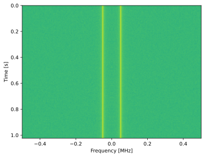

.. _freq-domain-chapter:

########################
Dominio de la Frecuencia
########################

Este capítulo presenta el dominio de la frecuencia y cubre series de Fourier, transformada de Fourier, propiedades de Fourier, FFT, ventanas y espectrogramas, utilizando ejemplos de Python.  

Uno de los efectos secundarios más interesantes de aprender acerca de DSP y las comunicaciones inalámbricas es que también aprenderá a pensar en el dominio de la frecuencia. La experiencia de la mayoría de las personas *trabajando* en el dominio de la frecuencia se limita a ajustar las perillas de graves/medios/agudos en el sistema de audio de un automóvil. La experiencia de la mayoría de las personas al *ver* algo en el dominio de la frecuencia se limita a ver un ecualizador de audio, como este clip:

.. image:: ../_images/audio_equalizer.webp
   :align: center
   
Al final de este capítulo comprenderá lo que realmente significa el dominio de la frecuencia, cómo convertir entre tiempo y frecuencia (además de lo que sucede cuando lo hacemos) y algunos principios interesantes que usaremos a lo largo de nuestros estudios de DSP y SDR. Al final de este libro de texto, serás un maestro trabajando en el dominio de la frecuencia, ¡garantizado!

Primero, ¿por qué nos gusta observar señales en el dominio de la frecuencia? Bueno, aquí hay dos señales de ejemplo, mostradas tanto en el dominio del tiempo como en el de la frecuencia.

.. image:: ../_images/time_and_freq_domain_example_signals.png
   :scale: 40 %
   :align: center
   :alt: Two signals in the time domain may look like noise, but in the frequency domain we see additional features

Como puede ver, en el dominio del tiempo ambos parecen ruido, pero en el dominio de la frecuencia podemos ver características diferentes. Todo está en el dominio del tiempo en su forma natural; cuando muestreamos señales, las estaremos muestreando en el dominio del tiempo, porque no se puede muestrear *directamente* una señal en el dominio de la frecuencia. Pero lo interesante suele ocurrir en el dominio de la frecuencia. 

*****************
Series de Fourier
*****************

Los conceptos básicos del dominio de la frecuencia comienzan con la comprensión de que cualquier señal puede representarse mediante la suma de ondas sinusoidales. Cuando descomponemos una señal en sus componentes sinusoidales, la llamamos serie de Fourier. A continuación se muestra un ejemplo de una señal que se compone sólo de dos ondas sinusoidales:

.. image:: ../_images/summing_sinusoids.svg
   :align: center
   :target: ../_images/summing_sinusoids.svg
   :alt: Simple example of how a signal can be made up of multiple sinusoids, demonstrating the Fourier Series
   
Aquí hay otro ejemplo; La curva roja a continuación se aproxima a una onda en diente de sierra sumando hasta 10 ondas sinusoidales. Podemos ver que no es una reconstrucción perfecta: se necesitaría un número infinito de ondas sinusoidales para reproducir esta onda en dientes de sierra debido a las transiciones bruscas:

.. image:: ../_images/fourier_series_triangle.gif
   :scale: 70 %   
   :align: center
   :alt: Animation of the Fourier series decomposition of a triangle wave (a.k.a. sawtooth)
   
Algunas señales requieren más ondas sinusoidales que otras y algunas requieren una cantidad infinita, aunque siempre se pueden aproximar con un número limitado. Aquí hay otro ejemplo de una señal que se descompone en una serie de ondas sinusoidales:

.. image:: ../_images/fourier_series_arbitrary_function.gif
   :scale: 70 %   
   :align: center  
   :alt: Animation of the Fourier series decomposition of an arbitrary function made up of square pulses

Para comprender cómo podemos descomponer una señal en ondas sinusoidales o sinusoides, primero debemos revisar los tres atributos de una onda sinusoidal:

#. Amplitud
#. Frecuencia
#. Fase

**Amplitud** indica la "fuerza" de la onda, mientras que **frecuencia** es el número de ondas por segundo. **Fase** se utiliza para representar cómo se desplaza la onda sinusoidal en el tiempo, entre 0 y 360 grados (o 0 a :math:`2\pi`), pero debe ser relativo a algo para que tenga algún significado, como dos señales con la misma frecuencia que estén desfasadas 30 grados entre sí.

.. image:: ../_images/amplitude_phase_period.svg
   :align: center
   :target: ../_images/amplitude_phase_period.svg
   :alt: Reference diagram of amplitude, phase, and frequency of a sine wave (a.k.a. sinusoid)
   
En este punto, es posible que se haya dado cuenta de que una "señal" es esencialmente solo una función, generalmente representada "a lo largo del tiempo" (es decir, el eje x). Otro atributo que es fácil de recordar es **período**, que es el inverso de **frecuencia**. El **período** de una sinusoide es la cantidad de tiempo, en segundos, que tarda la onda en finalizar un ciclo. Por tanto, la unidad de frecuencia es 1/segundo o Hz.
   
Cuando descomponemos una señal en una suma de ondas sinusoidales, cada una tendrá una determinada **amplitud**, **fase** y **frecuencia**. La **amplitud** de cada onda sinusoidal nos dirá qué tan fuerte existía la **frecuencia** en la señal original. No te preocupes demasiado por la **fase** por ahora, aparte de darte cuenta de que la única diferencia entre sin() y cos() es un cambio de fase (cambio de tiempo).

Es más importante comprender el concepto subyacente que las ecuaciones reales para resolver una serie de Fourier, pero para aquellos que estén interesados en las ecuaciones, los remito a la explicación concisa de Wolfram: https://mathworld.wolfram.com/FourierSeries.html.  

***********************
Pares Tiempo-Frecuencia
***********************

Hemos establecido que las señales se pueden representar como ondas sinusoidales, que tienen varios atributos. Ahora, aprendamos a trazar señales en el dominio de la frecuencia. Mientras que el dominio del tiempo demuestra cómo cambia una señal con el tiempo, el dominio de la frecuencia muestra qué parte de una señal descansa en qué frecuencias. En lugar de que el eje x sea el tiempo, será la frecuencia. Podemos trazar una señal dada tanto en tiempo * como * en frecuencia. Veamos algunos ejemplos simples para comenzar.

Así es como se ve una onda sinusoidal, con frecuencia f, en el dominio del tiempo y la frecuencia:

.. image:: ../_images/sine-wave.png
   :scale: 70 % 
   :align: center
   :alt: The time-frequency Fourier pair of a sine wave, which is an impulse in the frequency domain

El dominio del tiempo debería resultarle muy familiar. Es una función oscilante. No te preocupes por en qué momento del ciclo comienza ni por cuánto dura. La conclusión es que la señal tiene una **frecuencia única**, por lo que vemos un único pico en el dominio de la frecuencia. Cualquiera que sea la frecuencia a la que oscile esa onda sinusoidal será donde veremos el pico en el dominio de la frecuencia. El nombre matemático para un pico como este se llama "impulso".

Ahora, ¿qué pasaría si tuviéramos un impulso en el dominio del tiempo? Imagine una grabación de sonido de alguien aplaudiendo o golpeando un clavo con un martillo. Este par tiempo-frecuencia es un poco menos intuitivo.

.. image:: ../_images/impulse.png
   :scale: 70 % 
   :align: center  
   :alt: The time-frequency Fourier pair of an impulse in the time domain, which is a horizontal line (all frequencies) in the frequency domain

Como podemos ver, un pico/impulso en el dominio del tiempo es plano en el dominio de la frecuencia y, en teoría, contiene todas las frecuencias. No existe un impulso teóricamente perfecto porque tendría que ser infinitamente corto en el dominio del tiempo. Al igual que la onda sinusoidal, no importa en qué parte del dominio del tiempo se produzca el impulso. Lo importante aquí es que los cambios rápidos en el dominio del tiempo dan como resultado que ocurran muchas frecuencias.

A continuación, veamos los gráficos en el dominio del tiempo y la frecuencia de una onda cuadrada:

.. image:: ../_images/square-wave.svg
   :align: center 
   :target: ../_images/square-wave.svg
   :alt: The time-frequency Fourier pair of a square wave, which is a sinc (sin(x)/x function) in the frequency domain

Este también es menos intuitivo, pero podemos ver que el dominio de la frecuencia tiene un pico fuerte, que resulta estar en la frecuencia de la onda cuadrada, pero hay más picos a medida que aumentamos en frecuencia. Se debe al cambio rápido en el dominio del tiempo, como en el ejemplo anterior. Pero su frecuencia no es uniforme. Tiene picos a intervalos y el nivel decae lentamente (aunque continuará para siempre). Una onda cuadrada en el dominio del tiempo tiene un patrón sin(x)/x en el dominio de la frecuencia (también conocida como función sinc).

¿Y ahora qué pasa si tenemos una señal constante en el dominio del tiempo? Una señal constante no tiene "frecuencia". Vamos a ver:

.. image:: ../_images/dc-signal.png
   :scale: 80 % 
   :align: center 
   :alt: The time-frequency Fourier pair of a DC signal, which is an impulse at 0 Hz in the frequency domain

Como no hay frecuencia, en el dominio de la frecuencia tenemos un pico a 0 Hz. Tiene sentido si lo piensas. El dominio de la frecuencia no estará "vacío" porque eso solo sucede cuando no hay señal presente (es decir, dominio del tiempo de 0). Llamamos a 0 Hz en el dominio de la frecuencia "DC", porque es causado por una señal DC en el tiempo (una señal constante que no cambia). Tenga en cuenta que si aumentamos la amplitud de nuestra señal de CC en el dominio del tiempo, el pico a 0 Hz en el dominio de la frecuencia también aumentará.

Más adelante aprenderemos qué significa exactamente el eje y en el gráfico del dominio de la frecuencia, pero por ahora puedes considerarlo como una especie de amplitud que te indica cuánta de esa frecuencia estaba presente en la señal del dominio del tiempo.
   
***********************
Transformada de Fourier
***********************

Matemáticamente, la "transformada" que utilizamos para pasar del dominio del tiempo al dominio de la frecuencia y viceversa se llama Transformada de Fourier. Se define de la siguiente manera:

.. math::
   X(f) = \int x(t) e^{-j2\pi ft} dt

Para una señal x(t) podemos obtener la versión en el dominio de la frecuencia, X(f), usando esta fórmula. Representaremos la versión en el dominio del tiempo de una función con x(t) o y(t), y la versión correspondiente en el dominio de la frecuencia con X(f) e Y(f). Tenga en cuenta la "t" para el tiempo y la "f" para la frecuencia. La "j" es simplemente la unidad imaginaria. Es posible que lo hayas visto como "i" en la clase de matemáticas de la escuela secundaria. Usamos "j" en ingeniería e informática porque "i" a menudo se refiere a corriente y en programación a menudo se usa como iterador.

Volver al dominio del tiempo desde la frecuencia es casi lo mismo, aparte de un factor de escala y un signo negativo:

.. math::
   x(t) = \frac{1}{2 \pi} \int X(f) e^{j2\pi ft} df

Tenga en cuenta que muchos libros de texto y otros recursos utilizan :math:`w` en lugar de :math:`2\pi f`.  :math:`w` es la frecuencia angular en radianes por segundo, mientras que :math:`f` es en Hz.  Todo lo que tienes que saber es que

.. math::
   \omega = 2 \pi f

Aunque añade termino :math:`2 \pi` para muchas ecuaciones, es más fácil seguir con la frecuencia en Hz. En última instancia, trabajará con Hz en su aplicación SDR.

La ecuación anterior para la Transformada de Fourier es la forma continua, que sólo verás en problemas de matemáticas. La forma discreta está mucho más cerca de lo que se implementa en el código:

.. math::
   X_k = \sum_{n=0}^{N-1} x_n e^{-\frac{j2\pi}{N}kn}
   
Tenga en cuenta que la principal diferencia es que reemplazamos la integral con una suma. El índice :math:`k` va desde 0 a N-1.  

Está bien si ninguna de estas ecuaciones significa mucho para ti. ¡En realidad no necesitamos usarlos directamente para hacer cosas interesantes con DSP y SDR!

********************************
Propiedades en Tiempo-Frecuencia
********************************

Anteriormente examinamos ejemplos de cómo aparecen las señales en el dominio del tiempo y en el dominio de la frecuencia. Ahora cubriremos cinco "propiedades de Fourier" importantes. Estas son propiedades que nos dicen que si hacemos ____ con nuestra señal en el dominio del tiempo, entonces ____ sucede con nuestra señal en el dominio de la frecuencia. Nos dará una idea importante del tipo de procesamiento de señales digitales (DSP) que realizaremos en las señales en el dominio del tiempo en la práctica.

1. Propiedad de linealidad:

.. math::
   a x(t) + b y(t) \leftrightarrow a X(f) + b Y(f)

Esta propiedad es probablemente la más fácil de entender. Si agregamos dos señales en el tiempo, entonces la versión en el dominio de la frecuencia también será la suma de las dos señales en el dominio de la frecuencia. También nos dice que si multiplicamos cualquiera de ellos por un factor de escala, el dominio de la frecuencia también escalará en la misma cantidad. La utilidad de esta propiedad será más evidente cuando sumamos múltiples señales.

2. Propiedad de desplazamiento en frecuencia:

.. math::
   e^{2 \pi j f_0 t}x(t) \leftrightarrow X(f-f_0)

El término a la izquierda de x(t) es lo que llamamos "sinusoide compleja" o "exponencial compleja". Por ahora, todo lo que necesitamos saber es que es esencialmente sólo una onda sinusoidal en la frecuencia :math:`f_0`.  Esta propiedad nos dice que si tomamos una señal :math:`x(t)` y lo multiplicamos por una onda sinusoidal, entonces en el dominio de la frecuencia obtenemos :math:`X(f)` excepto que desplazado por una cierta frecuencia, :math:`f_0`.  Este cambio de frecuencia puede ser más fácil de visualizar:

.. image:: ../_images/freq-shift.svg
   :align: center 
   :target: ../_images/freq-shift.svg
   :alt: Depiction of a frequency shift of a signal in the frequency domain

El cambio de frecuencia es parte integral del DSP porque querremos cambiar la frecuencia de las señales hacia arriba y hacia abajo por muchas razones. Esta propiedad nos dice cómo hacerlo (multiplicar por una onda sinusoidal). Aquí hay otra forma de visualizar esta propiedad:

.. image:: ../_images/freq-shift-diagram.svg
   :align: center
   :target: ../_images/freq-shift-diagram.svg
   :alt: Visualization of a frequency shift by multiplying by a sine wave or sinusoid
   
3. Propiedad de escalamiento en tiempo:

.. math::
   x(at) \leftrightarrow X\left(\frac{f}{a}\right)

En el lado izquierdo de la ecuación, podemos ver que estamos escalando nuestra señal x(t) en el dominio del tiempo. A continuación se muestra un ejemplo de una señal que se escala en el tiempo y luego qué sucede con las versiones en el dominio de la frecuencia de cada una.

.. image:: ../_images/time-scaling.svg
   :align: center
   :target: ../_images/time-scaling.svg
   :alt: Depiction of the time scaling Fourier transform property in both time and frequency domain

El escalado en el tiempo esencialmente reduce o expande la señal en el eje x. Lo que esta propiedad nos dice es que el escalamiento en el dominio del tiempo provoca un escalamiento inverso en el dominio de la frecuencia. Por ejemplo, cuando transmitimos bits más rápido tenemos que utilizar más ancho de banda. La propiedad ayuda a explicar por qué las señales de mayor velocidad de datos ocupan más ancho de banda/espectro. Si la escala de tiempo-frecuencia fuera proporcional en lugar de inversamente proporcional, los operadores de telefonía celular podrían transmitir todos los bits por segundo que quisieran sin pagar miles de millones por el espectro. Lamentablemente ese no es el caso.

Quienes ya estén familiarizados con esta propiedad pueden notar que falta un factor de escala; se omite por razones de simplicidad. A efectos prácticos, no hace ninguna diferencia.

4. Propiedad de convolución en el tiempo:

.. math::
   \int x(\tau) y(t-\tau) d\tau  \leftrightarrow X(f)Y(f)

Se llama propiedad de convolución porque en el dominio del tiempo estamos convolucionando x(t) e y(t). Es posible que aún no conozcas la operación de convolución, así que por ahora imagínala como una correlación cruzada, aunque profundizaremos en las convoluciones en :ref:`esta sección <convolution-section>`. Cuando convolucionamos señales en el dominio del tiempo, es equivalente a multiplicar las versiones en el dominio de la frecuencia de esas dos señales. Es muy diferente a sumar dos señales. Cuando agregas dos señales, como vimos, en realidad no sucede nada, simplemente sumas la versión en el dominio de la frecuencia. Pero cuando convolucionas dos señales, es como crear una tercera señal nueva a partir de ellas. La convolución es la técnica más importante en DSP, aunque primero debemos comprender cómo funcionan los filtros para comprenderla por completo.

Antes de continuar, para explicar brevemente por qué esta propiedad es tan importante, considere esta situación: tiene una señal que desea recibir y hay una señal de interferencia junto a ella.

.. image:: ../_images/two-signals.svg
   :align: center
   :target: ../_images/two-signals.svg
   
El concepto de enmascaramiento se usa mucho en programación, así que usémoslo aquí. ¿Qué pasaría si pudiéramos crear la máscara de abajo y multiplicarla por la señal de arriba para enmascarar la que no queremos?

.. image:: ../_images/masking.svg
   :align: center
   :target: ../_images/masking.svg

Normalmente realizamos operaciones DSP en el dominio del tiempo, así que utilicemos la propiedad de convolución para ver cómo podemos hacer este enmascaramiento en el dominio del tiempo. Digamos que x(t) es nuestra señal recibida. Sea Y(f) la máscara que queremos aplicar en el dominio de la frecuencia. Bueno, eso significa que y(t) es la representación en el dominio del tiempo de nuestra máscara, y si la convolucionamos con x(t), podemos "filtrar" la señal que no queremos.

.. tikz:: [font=\Large\bfseries\sffamily]
   \definecolor{babyblueeyes}{rgb}{0.36, 0.61, 0.83}
   \draw (0,0) node[align=center,babyblueeyes]           {E.g., our received signal};
   \draw (0,-4) node[below, align=center,babyblueeyes]   {E.g., the mask}; 
   \draw (0,-2) node[align=center,scale=2]{$\int x(\tau)y(t-\tau)d\tau \leftrightarrow X(f)Y(f)$};   
   \draw[->,babyblueeyes,thick] (-4,0) -- (-5.5,-1.2);
   \draw[->,babyblueeyes,thick] (2.5,-0.5) -- (3,-1.3);
   \draw[->,babyblueeyes,thick] (-2.5,-4) -- (-3.8,-2.8);
   \draw[->,babyblueeyes,thick] (3,-4) -- (5.2,-2.8);
   :xscale: 70

Cuando analicemos el filtrado, la propiedad de convolución tendrá más sentido.

5. Propiedad de la convolución en frecuencia:

Por último, quiero señalar que la propiedad de convolución funciona a la inversa, aunque no la usaremos tanto como la convolución en el dominio del tiempo:

.. math::
   x(t)y(t)  \leftrightarrow  \int X(g) Y(f-g) dg

Hay otras propiedades, pero en mi opinión, las cinco anteriores son las más importantes de comprender. Aunque no analizamos la prueba de cada propiedad, el punto es que usamos las propiedades matemáticas para obtener información sobre lo que sucede con las señales reales cuando realizamos análisis y procesamiento. No te dejes atrapar por las ecuaciones. Asegúrese de comprender la descripción de cada propiedad.

************************************
Transformada Rapida de Fourier (FFT)
************************************

Ahora volvamos a la transformada de Fourier. Te mostré la ecuación para la Transformada de Fourier discreta, pero lo que usarás mientras codificas el 99,9% del tiempo será la función FFT, fft(). La Transformada Rápida de Fourier (FFT) es simplemente un algoritmo para calcular la Transformada de Fourier discreta. Fue desarrollado hace décadas y, aunque existen variaciones en la implementación, sigue siendo el líder reinante en el cálculo de una transformada de Fourier discreta. Suerte, considerando que usaron "Fast" en el nombre.

La FFT es una función con una entrada y una salida. Convierte una señal de tiempo a frecuencia:

.. image:: ../_images/fft-block-diagram.svg
   :align: center
   :target: ../_images/fft-block-diagram.svg
   :alt: FFT is a function with one input (time domain) and one output (frequency domain) 
   
En este libro de texto solo nos ocuparemos de FFT de 1 dimensión (2D se utiliza para el procesamiento de imágenes y otras aplicaciones). Para nuestros propósitos, piense en la función FFT como si tuviera una entrada: un vector de muestras y una salida: la versión en el dominio de la frecuencia de ese vector de muestras. El tamaño de la salida es siempre el mismo que el tamaño de la entrada. Si introduzco 1024 muestras en la FFT, sacaré 1024. La parte confusa es que la salida siempre estará en el dominio de la frecuencia y, por lo tanto, el "intervalo" del eje x si lo graficamos no cambia según el número de muestras en la entrada del dominio del tiempo. Visualicémoslo mirando las matrices de entrada y salida, junto con las unidades de sus índices:

.. image:: ../_images/fft-io.svg
   :align: center
   :target: ../_images/fft-io.svg
   :alt: Reference diagram for the input (seconds) and output (bandwidth) format of the FFT function showing frequency bins and delta-t and delta-f

Debido a que la salida está en el dominio de la frecuencia, el intervalo del eje x se basa en la frecuencia de muestreo, que cubriremos en el próximo capítulo. Cuando usamos más muestras para el vector de entrada, obtenemos una mejor resolución en el dominio de la frecuencia (además de procesar más muestras a la vez). En realidad, no "vemos" más frecuencias al tener una entrada más grande. La única forma sería aumentar la tasa de muestreo (disminuir el período de muestreo :math:`\Delta t`).

¿Cómo realmente graficamos este resultado? Como ejemplo, digamos que nuestra frecuencia de muestreo fue de 1 millón de muestras por segundo (1 MHz). Como aprenderemos en el próximo capítulo, eso significa que solo podemos ver señales de hasta 0,5 MHz, independientemente de cuántas muestras introduzcamos en la FFT. La forma en que se representa la salida de la FFT es la siguiente:

.. image:: ../_images/negative-frequencies.svg
   :align: center
   :target: ../_images/negative-frequencies.svg
   :alt: Introducing negative frequencies

Siempre es así; la salida de la FFT siempre mostrará :math:`\text{-} f_s/2` a :math:`f_s/2` where :math:`f_s` es la frecuencia de muestreo.  i.e., la salida siempre tendrá una parte negativa y una parte positiva. Si la entrada es compleja, las partes negativa y positiva serán diferentes, pero si es real, serán idénticas.

En cuanto al intervalo de frecuencia, cada bin corresponde a :math:`f_s/N` Hz, i.e., introducir más muestras en cada FFT generará una resolución más granular en su salida. Un detalle muy pequeño que puedes ignorar si eres nuevo: matemáticamente, el último índice no corresponde *exactamente* :math:`f_s/2`, más bien es :math:`f_s/2 - f_s/N` que para un gran :math:`N` será aproximadamente :math:`f_s/2`.

*********************
Frecuencias Negativas
*********************

¿Qué diablos es una frecuencia negativa? Por ahora, solo sepa que tienen que ver con el uso de números complejos (números imaginarios); en realidad, no existe una "frecuencia negativa" cuando se trata de transmitir/recibir señales de RF, es solo una representación que usamos. He aquí una forma intuitiva de pensar en ello. Considere que le decimos a nuestro SDR que sintonice 100 MHz (la banda de radio FM) y muestree a una velocidad de 10 MHz. Es decir, veremos el espectro desde 95 MHz hasta 105 MHz. Quizás haya tres señales presentes:

.. image:: ../_images/negative-frequencies2.svg
   :align: center
   :target: ../_images/negative-frequencies2.svg
   
Ahora, cuando el DEG nos dé las muestras, nos aparecerá así:

.. image:: ../_images/negative-frequencies3.svg
   :align: center
   :target: ../_images/negative-frequencies3.svg
   :alt: Negative frequencies are simply the frequencies below the center (a.k.a. carrier) frequency that the radio tuned to

Recuerde que sintonizamos el SDR a 100 MHz. Entonces, la señal que estaba en aproximadamente 97,5 MHz aparece en -2,5 MHz cuando la representamos digitalmente, que técnicamente es una frecuencia negativa. En realidad es sólo una frecuencia más baja que la frecuencia central. Esto tendrá más sentido cuando aprendamos más sobre el muestreo y obtengamos experiencia en el uso de nuestros SDRs.

*******************************
¿El orden en tiempo no importa?
*******************************
Una última propiedad antes de pasar a las FFT. La función FFT es algo asi como "una mezcla de" la señal de entrada para formar la salida, que tiene una escala y unidades diferentes. Después de todo, ya no estamos en el dominio del tiempo. Una buena manera de internalizar esta diferencia entre dominios es darse cuenta de que cambiar el orden en que suceden las cosas en el dominio del tiempo no cambia los componentes de frecuencia en la señal. Es decir, la FFT de las siguientes dos señales tendrá los mismos dos picos porque la señal es solo dos ondas sinusoidales en diferentes frecuencias. Cambiar el orden en que ocurren las ondas sinusoidales no cambia el hecho de que son dos ondas sinusoidales en diferentes frecuencias.

.. image:: ../_images/fft_signal_order.png
   :scale: 50 % 
   :align: center
   :alt: When performing an FFT on a set of samples, the order in time that different frequencies occurred within those samples doesn't change the resulting FFT output

Técnicamente, la fase de los valores de FFT cambiará debido al desplazamiento temporal de las sinusoides. Sin embargo, durante los primeros capítulos de este libro de texto nos ocuparemos principalmente de la magnitud de la FFT.

*******************
FFT en Python
*******************

Ahora que hemos aprendido qué es una FFT y cómo se representa la salida, veamos algo de código Python y usemos la función FFT de Numpy, np.fft.fft(). Se recomienda que utilice una consola/IDE Python completo en su computadora, pero en caso de necesidad puede usar la consola Python en línea basada en la web vinculada en la parte inferior de la barra de navegación a la izquierda.

Primero necesitamos crear una señal en el dominio del tiempo. Siéntete libre de seguirlo con tu propia consola Python. Para simplificar las cosas, haremos una onda sinusoidal simple a 0,15 Hz. También usaremos una frecuencia de muestreo de 1 Hz, es decir, en el tiempo muestreamos a 0, 1, 2, 3 segundos, etc.

.. code-block:: python

 import numpy as np
 t = np.arange(100)
 s = np.sin(0.15*2*np.pi*t)

Si lo graficamos :code:`s` será algo como esto:

.. image:: ../_images/fft-python1.png
   :scale: 70 % 
   :align: center 

A continuación, usemos la función FFT de Numpy:

.. code-block:: python

 S = np.fft.fft(s)

si miramos :code:`S` lo que vemos es una matriz de números complejos:

.. code-block:: python

    S =  array([-0.01865008 +0.00000000e+00j, -0.01171553 -2.79073782e-01j,0.02526446 -8.82681208e-01j,  3.50536075 -4.71354150e+01j, -0.15045671 +1.31884375e+00j, -0.10769903 +7.10452463e-01j, -0.09435855 +5.01303240e-01j, -0.08808671 +3.92187956e-01j, -0.08454414 +3.23828386e-01j, -0.08231753 +2.76337148e-01j, -0.08081535 +2.41078885e-01j, -0.07974909 +2.13663710e-01j,...

Sugerencia: independientemente de lo que esté haciendo, si alguna vez se encuentra con números complejos, intente calcular la magnitud y la fase y vea si tienen más sentido. Hagamos exactamente eso y tracemos la magnitud y la fase. En la mayoría de los idiomas, abs() es una función para la magnitud de un número complejo. La función de fase varía, pero en Python es :code:`np.angle()`.

.. code-block:: python

 import matplotlib.pyplot as plt
 S_mag = np.abs(S)
 S_phase = np.angle(S)
 plt.plot(t,S_mag,'.-')
 plt.plot(t,S_phase,'.-')

.. image:: ../_images/fft-python2.png
   :scale: 80 % 
   :align: center 

En este momento no proporcionamos ningún eje x para los gráficos, es solo el índice de la matriz (contando desde 0). Por razones matemáticas, la salida de la FFT tiene el siguiente formato:

.. image:: ../_images/fft-python3.svg
   :align: center
   :target: ../_images/fft-python3.svg
   :alt: Arrangement of the output of an FFT before doing an FFT shift
   
Pero queremos 0 Hz (DC) en el centro y frecuencias negativas a la izquierda (así es como nos gusta visualizar las cosas). Entonces, cada vez que hacemos una FFT, necesitamos realizar un "desplazamiento FFT", que es simplemente una simple operación de reordenamiento de matriz, algo así como un desplazamiento circular pero más bien como "poner esto aquí y aquello allí". El siguiente diagrama define completamente lo que hace la operación de cambio FFT:

.. image:: ../_images/fft-python4.svg
   :align: center
   :target: ../_images/fft-python4.svg
   :alt: Reference diagram of the FFT shift function, showing positive and negative frequencies and DC

Para nuestra comodidad, Numpy tiene una función de desplazamiento FFT, :code:`np.fft.fftshift()`.  Reemplace la línea np.fft.fft() con:

.. code-block:: python

 S = np.fft.fftshift(np.fft.fft(s))

También necesitamos calcular los valores/etiqueta del eje x. Recuerde que utilizamos una frecuencia de muestreo de 1 Hz para simplificar las cosas. Eso significa que el borde izquierdo del gráfico en el dominio de la frecuencia será -0,5 Hz y el borde derecho será 0,5 Hz. Si eso no tiene sentido, lo tendrá después de leer el capítulo sobre :ref:`sampling-chapter`.  Sigamos con la suposición de que nuestra frecuencia de muestreo fue de 1 Hz y tracemos la magnitud y la fase de la salida FFT con una etiqueta adecuada en el eje x. Aquí está la versión final de este ejemplo de Python y el resultado:

.. code-block:: python

 import numpy as np
 import matplotlib.pyplot as plt
 
 Fs = 1 # Hz
 N = 100 # number of points to simulate, and our FFT size
 
 t = np.arange(N) # because our sample rate is 1 Hz
 s = np.sin(0.15*2*np.pi*t)
 S = np.fft.fftshift(np.fft.fft(s))
 S_mag = np.abs(S)
 S_phase = np.angle(S)
 f = np.arange(Fs/-2, Fs/2, Fs/N)
 plt.figure(0)
 plt.plot(f, S_mag,'.-')
 plt.figure(1)
 plt.plot(f, S_phase,'.-')
 plt.show()

.. image:: ../_images/fft-python5.png
   :scale: 80 % 
   :align: center 

Tenga en cuenta que vemos nuestro pico a 0,15 Hz, que es la frecuencia que utilizamos al crear la onda sinusoidal. ¡Eso significa que nuestra FFT funcionó! Si no supiéramos el código utilizado para generar esa onda sinusoidal, pero solo nos dieran la lista de muestras, podríamos usar la FFT para determinar la frecuencia. La razón por la que vemos un pico también a -0,15 Hz tiene que ver con el hecho de que era una señal real, no compleja, y profundizaremos en eso más adelante.

******************************
Windowing
******************************

Cuando usamos una FFT para medir los componentes de frecuencia de nuestra señal, la FFT supone que se le está dando una parte de una señal *periódica*. Se comporta como si la señal que proporcionamos se continuara repitiendo indefinidamente. Es como si la última muestra del segmento se conectara con la primera muestra. Surge de la teoría detrás de la Transformada de Fourier. Significa que queremos evitar transiciones repentinas entre la primera y la última muestra porque las transiciones repentinas en el dominio del tiempo parecen muchas frecuencias y, en realidad, nuestra última muestra no se conecta con nuestra primera muestra. En pocas palabras: si estamos haciendo una FFT de 100 muestras, usando :code:`np.fft.fft(x)`, queremos :code:`x[0]` y :code:`x[99]` ser igual o cercano en valor.

La forma de compensar esta propiedad cíclica es mediante "windowing". Justo antes de la FFT, multiplicamos la porción de señal por una función de ventana, que es cualquier función que se reduce a cero en ambos extremos. Eso garantiza que el segmento de señal comience y termine en cero y se conecte. Las funciones de ventana comunes incluyen Hamming, Hanning, Blackman y Kaiser. Cuando no se aplica ninguna ventana, se le llama ventana "rectangular" porque es como multiplicar por una matriz de unos. Así es como se ven varias funciones de ventana:

.. image:: ../_images/windows.svg
   :align: center
   :target: ../_images/windows.svg
   :alt: Windowing function in time and frequency domain of rectangular, hamming, hanning, bartlet, blackman, and kaiser windows

Un enfoque sencillo para principiantes es seguir con una ventana Hamming, que se puede crear en Python con :code:`np.hamming(N)` donde N es la cantidad de elementos en la matriz, que es su tamaño FFT. En el ejercicio anterior, aplicaríamos la ventana justo antes de la FFT. Después de la segunda línea de código insertaríamos:

.. code-block:: python

 s = s * np.hamming(100)

Si tiene miedo de elegir la ventana equivocada, no lo tenga. La diferencia entre Hamming, Hanning, Blackman y Kaiser es mínima en comparación con no usar ninguna ventana, ya que todos se reducen a cero en ambos lados y resuelven el problema subyacente.

**************************
Dimensionamiento de la FFT
**************************

Lo último a tener en cuenta es el tamaño de FFT. El mejor tamaño de FFT es siempre del orden de 2 debido a la forma en que se implementa la FFT. Puedes usar un tamaño que no sea del orden de 2, pero será más lento. Los tamaños comunes están entre 128 y 4096, aunque ciertamente puedes elegir uno más grande. En la práctica, es posible que tengamos que procesar señales que tienen millones o miles de millones de muestras, por lo que necesitamos dividir la señal y realizar muchas FFT. Eso significa que obtendremos muchos resultados. Podemos promediarlos o trazarlos a lo largo del tiempo (especialmente cuando nuestra señal cambia con el tiempo). No es necesario pasar *cada* muestra de una señal a través de una FFT para obtener una buena representación en el dominio de frecuencia de esa señal. Por ejemplo, solo puede realizar FFT 1.024 de cada 100.000 muestras en una señal y probablemente aún se verá bien, siempre que la señal esté siempre encendida.

.. _spectrogram-section:

*************
Espectrograma
*************
Un espectrograma es el gráfico que muestra la frecuencia a lo largo del tiempo. Es simplemente un montón de FFT apiladas (verticalmente, si desea frecuencia en el eje horizontal). También podemos mostrarlo en tiempo real, a menudo denominado cascada. Un analizador de espectro es el equipo que muestra este espectrograma. El siguiente diagrama muestra cómo se puede dividir una serie de muestras de coeficiente intelectual para formar un espectrograma:

.. image:: ../_images/spectrogram_diagram.svg
   :align: center
   :target: ../_images/spectrogram_diagram.svg
   :alt: Spectrogram (a.k.a. waterfall) diagram showing how FFT slices are arrange/stacked to form a time-frequency plot

Debido a que un espectrograma implica graficar datos 2D, es efectivamente un gráfico 3D, por lo que tenemos que usar un mapa de colores para representar las magnitudes FFT, que son los "valores" que queremos graficar. A continuación se muestra un ejemplo de espectrograma, con la frecuencia en el eje horizontal x y el tiempo en el eje vertical y. El azul representa la energía más baja y el rojo la más alta. Podemos ver que hay un fuerte pico en DC (0 Hz) en el centro con una señal variable a su alrededor. El azul representa nuestro piso de ruido.

.. image:: ../_images/waterfall.png
   :scale: 120 % 
   :align: center 

Recuerde, son solo filas de FFT apiladas una encima de otra, cada fila es 1 FFT (técnicamente, la magnitud de 1 FFT). Asegúrese de dividir en el tiempo su señal de entrada en porciones de su tamaño FFT (por ejemplo, 1024 muestras por porción). Antes de saltar al código para producir un espectrograma, aquí hay una señal de ejemplo que usaremos, es simplemente un tono en ruido blanco:

.. code-block:: python

 import numpy as np
 import matplotlib.pyplot as plt
 
 sample_rate = 1e6
 
 # Generate tone plus noise
 t = np.arange(1024*1000)/sample_rate # time vector
 f = 50e3 # freq of tone
 x = np.sin(2*np.pi*f*t) + 0.2*np.random.randn(len(t))

Así es como se ve en el dominio del tiempo (primeras 200 muestras):

.. image:: ../_images/spectrogram_time.svg
   :align: center
   :target: ../_images/spectrogram_time.svg

En Python podemos generar un espectrograma de la siguiente manera:

.. code-block:: python

 # simulate the signal above, or use your own signal
  
 fft_size = 1024
 num_rows = len(x) // fft_size # // is an integer division which rounds down
 spectrogram = np.zeros((num_rows, fft_size))
 for i in range(num_rows):
     spectrogram[i,:] = 10*np.log10(np.abs(np.fft.fftshift(np.fft.fft(x[i*fft_size:(i+1)*fft_size])))**2)
 
 plt.imshow(spectrogram, aspect='auto', extent = [sample_rate/-2/1e6, sample_rate/2/1e6, 0, len(x)/sample_rate])
 plt.xlabel("Frequency [MHz]")
 plt.ylabel("Time [s]")
 plt.show()

Lo que debería producir lo siguiente, que no es el espectrograma más interesante porque no hay un comportamiento que varíe en el tiempo. Hay dos tonos porque simulamos una señal real, y las señales reales siempre tienen un PSD negativo que coincide con el lado positivo. Para obtener ejemplos más interesantes de espectrogramas, consulte https://www.IQEngine.org!

************************
Implementación de la FFT
************************

Aunque NumPy ya ha implementado FFT para nosotros, es bueno saber los conceptos básicos de cómo funciona. El algoritmo FFT más popular es el algoritmo FFT de Cooley-Tukey, inventado por primera vez alrededor de 1805 por Carl Friedrich Gauss y luego redescubierto y popularizado por James Cooley y John Tukey en 1965.

La versión básica de este algoritmo funciona con FFT de potencia de dos tamaños y está diseñada para entradas complejas, pero también puede funcionar con entradas reales. El componente básico de este algoritmo se conoce como mariposa, que es esencialmente una FFT de tamaño N = 2, que consta de dos multiplicaciones y dos sumas: 

.. image:: ../_images/butterfly.svg
   :align: center
   :target: ../_images/butterfly.svg
   :alt: Cooley-Tukey FFT algorithm butterfly radix-2

or

.. math::
   y_0 = x_0 + x_1 w^k_N

   y_1 = x_0 - x_1 w^k_N

donde :math:`w^k_N = e^{j2\pi k/N}` se conocen como factores de giro (:math:`N` es el tamaño de la sub-FFT y :math:`k` es el índice).  Tenga en cuenta que la entrada y la salida deben ser complejas., e.g., :math:`x_0` puede ser 0.6123 - 0.5213j, y las sumas/múltiplos son complejas.

El algoritmo es recursivo y se divide por la mitad hasta que todo lo que queda es una serie de mariposas, esto se muestra a continuación usando una FFT de tamaño 8:

.. image:: ../_images/butterfly2.svg
   :align: center
   :target: ../_images/butterfly2.svg
   :alt: Cooley-Tukey FFT algorithm size 8

Cada columna de este patrón es un conjunto de operaciones que se pueden realizar en paralelo y :math:`log_2(N)` se realizan los pasos, razón por la cual la complejidad computacional de la FFT es O(:math:`N\log N`) mientras que un DFT es O(:math:`N^2`).

Para aquellos que prefieren pensar en código en lugar de ecuaciones, a continuación se muestra una implementación simple de la FFT en Python, junto con una señal de ejemplo que consiste en un tono más ruido, para probar la FFT.

.. code-block:: python

 import numpy as np
 import matplotlib.pyplot as plt
 
 def fft(x):
     N = len(x)
     if N == 1:
         return x
     twiddle_factors = np.exp(-2j * np.pi * np.arange(N//2) / N)
     x_even = fft(x[::2]) # yay recursion!
     x_odd = fft(x[1::2])
     return np.concatenate([x_even + twiddle_factors * x_odd,
                            x_even - twiddle_factors * x_odd])
 
 # Simulate a tone + noise
 sample_rate = 1e6
 f_offset = 0.2e6 # 200 kHz offset from carrier
 N = 1024
 t = np.arange(N)/sample_rate
 s = np.exp(2j*np.pi*f_offset*t)
 n = (np.random.randn(N) + 1j*np.random.randn(N))/np.sqrt(2) # unity complex noise
 r = s + n # 0 dB SNR
 
 # Perform fft, fftshift, convert to dB
 X = fft(r)
 X_shifted = np.roll(X, N//2) # equivalent to np.fft.fftshift
 X_mag = 10*np.log10(np.abs(X_shifted)**2)
 
 # Plot results
 f = np.linspace(sample_rate/-2, sample_rate/2, N)/1e6 # plt in MHz
 plt.plot(f, X_mag)
 plt.plot(f[np.argmax(X_mag)], np.max(X_mag), 'rx') # show max
 plt.grid()
 plt.xlabel('Frequency [MHz]')
 plt.ylabel('Magnitude [dB]')
 plt.show()

.. image:: ../_images/fft_in_python.svg
   :align: center
   :target: ../_images/fft_in_python.svg
   :alt: python implementation of fft example

Para aquellos interesados en implementaciones basadas en JavaScript y/o WebAssembly, consulte la `WebFFT <https://github.com/IQEngine/WebFFT>`_ biblioteca para realizar FFT en aplicaciones web o NodeJS, incluye varias implementaciones internas y hay una `benchmarking tool <https://webfft.com>`_ se utiliza para comparar el rendimiento de cada implementación.
