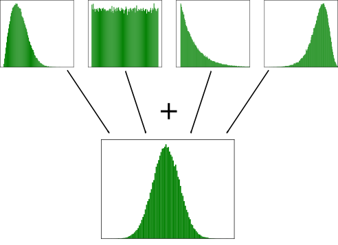

.. _noise-chapter:

#############
Ruido y dB
#############

En este capítulo analizaremos el ruido, incluido cómo se modela y maneja en un sistema de comunicaciones inalámbricas. Los conceptos incluyen AWGN, ruido complejo y SNR/SINR. También introduciremos los decibelios (dB) a lo largo del camino, ya que están ampliamente presentes en las comunicaciones inalámbricas y SDR.

************************
Ruido Gausiano
************************

En este capítulo analizaremos el ruido, incluido cómo se modela y maneja en un sistema de comunicaciones inalámbricas. Los conceptos incluyen AWGN, complejo de ruido y SNR/SINR. También introduciremos los decibelios (dB) a lo largo del camino, ya que están ampliamente presentes en las comunicaciones inalámbricas y SDR.
.. image:: ../_images/noise.png
   :scale: 70 % 
   :align: center 

Observe cómo el valor promedio es cero en el gráfico en el dominio del tiempo. Si el valor promedio no fuera cero, entonces podríamos restar el valor promedio, llamarlo sesgo, y nos quedaría un promedio de cero. También tenga en cuenta que los puntos individuales en el gráfico *no* son "uniformemente aleatorios", es decir, los valores más grandes son más raros, la mayoría de los puntos están más cerca de cero.

A este tipo de ruido lo llamamos "ruido gaussiano". Es un buen modelo para el tipo de ruido que proviene de muchas fuentes naturales, como las vibraciones térmicas de los átomos en el silicio de los componentes de RF de nuestro receptor. El **teorema del límite central** nos dice que la suma de muchos procesos aleatorios tenderá a tener una distribución gaussiana, incluso si los procesos individuales tienen otras distribuciones. En otras palabras, cuando suceden y se acumulan muchas cosas aleatorias, el resultado parece aproximadamente gaussiano, incluso cuando las cosas individuales no tienen una distribución gaussiana.

La distribución gaussiana también se llama distribución "normal" (recordemos una curva de campana).

La distribución gaussiana tiene dos parámetros: media y varianza. Ya analizamos cómo la media puede considerarse cero porque siempre se puede eliminar la media, o el sesgo, si no es cero. La variación cambia qué tan "fuerte" es el ruido. Una variación mayor dará como resultado números mayores. Es por esta razón que la varianza define la potencia del ruido.

La varianza es igual a la desviación estándar al cuadrado (:math:`\sigma^2`).

************************
Decibelios (dB)
************************

Vamos a tomar una tangente rápida para introducir formalmente dB. Es posible que haya oído hablar de dB y, si ya está familiarizado con él, no dude en saltarse esta sección.

Trabajar en dB es extremadamente útil cuando necesitamos trabajar con números pequeños y grandes al mismo tiempo, o simplemente con un montón de números realmente grandes. Considere lo engorroso que sería trabajar con números de la escala del Ejemplo 1 y del Ejemplo 2.

Ejemplo 1: La señal 1 se recibe a 2 vatios y el ruido de fondo está a 0,0000002 vatios.

Ejemplo 2: Un triturador de basura hace 100.000 veces más ruido que una zona rural tranquila, y una motosierra es 10.000 veces más ruidosa que un triturador de basura (en términos de potencia de ondas sonoras).

Sin dB, es decir, trabajando en términos "lineales" normales, necesitamos usar muchos ceros para representar los valores en los Ejemplos 1 y 2. Francamente, si tuviéramos que trazar algo como la Señal 1 a lo largo del tiempo, ni siquiera veríamos el piso de ruido. Si la escala del eje y pasara de 0 a 3 vatios, por ejemplo, el ruido sería demasiado pequeño para aparecer en el gráfico. Para representar estas escalas simultáneamente, trabajamos en una escala logarítmica.

Para ilustrar mejor los problemas de escala que encontramos en el procesamiento de señales, considere las siguientes cascadas de tres de las mismas señales. El lado izquierdo es la señal original en escala lineal y el lado derecho muestra las señales convertidas a escala logarítmica (dB). Ambas representaciones utilizan exactamente el mismo mapa de colores, donde el azul es el valor más bajo y el amarillo el más alto. Apenas se puede ver la señal a la izquierda en la escala lineal.

.. image:: ../_images/linear_vs_log.png
   :scale: 70 % 
   :align: center
   :alt: Depiction of why it's important to understand dB or decibels, showing a spectrogram using linear vs log scale

Para un valor x dado, podemos representar x en dB usando la siguiente fórmula:

.. math::
    x_{dB} = 10 \log_{10} x

En Python:  

.. code-block:: python

 x_db = 10.0 * np.log10(x)

Es posible que hayas visto que :code:`10 *` es un :code:`20 *` en otros dominios. Siempre que se trata de una potencia de algún tipo, se utiliza 10 y se utiliza 20 si se trata de un valor que no es de potencia, como voltaje o corriente. En DSP tendemos a tratar con una potencia. De hecho, no hay una sola vez en todo este libro de texto en la que necesitemos usar 20 en lugar de 10.

Convertimos de dB nuevamente a lineales (números normales) usando:

.. math::
    x = 10^{x_{dB}/10}

In Python: 

.. code-block:: python

 x = 10.0 ** (x_db / 10.0)

No se deje atrapar por la fórmula, ya que hay un concepto clave que aprender aquí. En DSP trabajamos con números realmente grandes y números realmente pequeños juntos (por ejemplo, la intensidad de una señal en comparación con la intensidad del ruido). La escala logarítmica de dB nos permite tener más rango dinámico cuando expresamos números o los trazamos. También proporciona algunas comodidades como poder sumar cuando normalmente multiplicaríamos (como veremos en el capitulo :ref:`link-budgets-chapter` ).

Some common errors people will run into when new to dB are:

1. Usar registro natural en lugar de registro base 10 porque la función log() de la mayoría de los lenguajes de programación es en realidad el registro natural.
2. Olvidar incluir los dB al expresar un número o etiquetar un eje. Si estamos en dB necesitamos identificarlo en alguna parte.
3. Cuando estás en dB, sumas/restas valores en lugar de multiplicar/dividir, por ejemplo:

.. image:: ../_images/db.png
   :scale: 80 % 
   :align: center 

También es importante entender que dB no es técnicamente una "unidad". Un valor en dB solo no tiene unidades, como si algo fuera 2 veces más grande, no hay unidades hasta que te diga las unidades. dB es algo relativo. En audio, cuando dicen dB, en realidad se refieren a dBA, que son unidades de nivel de sonido (la A son las unidades). En tecnología inalámbrica normalmente usamos vatios para referirnos a un nivel de potencia real. Por lo tanto, es posible que vea dBW como una unidad, que es relativa a 1 W. También puede ver dBmW (a menudo escrito como dBm para abreviar), que es relativo a 1 mW. Por ejemplo, alguien puede decir "nuestro transmisor está configurado en 3 dBW" (es decir, 2 vatios). A veces usamos dB solo, lo que significa que es relativo y no hay unidades. Se puede decir: "nuestra señal se recibió a 20 dB por encima del nivel de ruido". Aquí tienes un pequeño consejo: 0 dBm = -30 dBW.

Aquí hay algunas conversiones comunes que recomiendo memorizar:

======  =====
Lineal   dB
======  ===== 
1x      0 dB 
2x      3 dB 
10x     10 dB 
0.5x    -3 dB  
0.1x    -10 dB
100x    20 dB
1000x   30 dB
10000x  40 dB
======  ===== 

Finalmente, para poner estos números en perspectiva, a continuación se muestran algunos niveles de potencia de ejemplo, en dBm:

=========== ===
80 dBm      Potencia Tx de emisora de radio FM rural
62 dBm      Potencia máxima de un transmisor de radioaficionado
60 dBm      Potencia del típico microondas doméstico
37 dBm      Potencia máxima de un radioaficionado o CB portátil típico
27 dBm      Potencia de transmisión típica de un teléfono celular
15 dBm      Potencia de transmisión WiFi típica
10 dBm      Bluetooth (versión 4) potencia máxima de transmisión
-10 dBm     Potencia máxima recibida para WiFi
-70 dBm     Ejemplo de potencia recibida para una señal de aficionado
-100 dBm    Potencia mínima recibida para WiFi
-127 dBm    Potencia típica recibida de los satélites GPS
=========== ===

************************************
Ruido en el dominio de la frecuencia
************************************

En el capitulo :ref:`freq-domain-chapter` abordamos los "pares de Fourier", es decir, cómo se ve una determinada señal en el dominio del tiempo en el dominio de la frecuencia. Bueno, ¿cómo se ve el ruido gaussiano en el dominio de la frecuencia? Los siguientes gráficos muestran algo de ruido simulado en el dominio del tiempo (arriba) y un gráfico de la densidad espectral de potencia (PSD) de ese ruido (abajo). Estas tramas fueron tomadas de GNU Radio.

.. image:: ../_images/noise_freq.png
   :scale: 110 % 
   :align: center
   :alt: AWGN in the time domain is also Gaussian noise in the frequency domain, although it looks like a flat line when you take the magnitude and perform averaging

Podemos ver que se ve más o menos igual en todas las frecuencias y es bastante plano. Resulta que el ruido gaussiano en el dominio del tiempo también es ruido gaussiano en el dominio de la frecuencia. Entonces, ¿por qué los dos gráficos anteriores no parecen iguales? Esto se debe a que el gráfico en el dominio de la frecuencia muestra la magnitud de la FFT, por lo que solo habrá números positivos. Es importante destacar que utiliza una escala logarítmica o muestra la magnitud en dB. De lo contrario, estos gráficos se verían iguales. Podemos demostrarnos esto a nosotros mismos generando algo de ruido (en el dominio del tiempo) en Python y luego tomando la FFT.

.. code-block:: python

 import numpy as np
 import matplotlib.pyplot as plt
 
 N = 1024 # number of samples to simulate, choose any number you want
 x = np.random.randn(N)
 plt.plot(x, '.-')
 plt.show()
 
 X = np.fft.fftshift(np.fft.fft(x))
 X = X[N//2:] # only look at positive frequencies.  remember // is just an integer divide
 plt.plot(np.real(X), '.-')
 plt.show()

Tenga en cuenta que la función randn() por defecto usa media = 0 y varianza = 1. Ambos gráficos se verán así:

.. image:: ../_images/noise_python.png
   :scale: 100 % 
   :align: center
   :alt: Example of white noise simulated in Python

Luego puedes producir el PSD plano que teníamos en GNU Radio tomando el registro y promediando un montón. La señal que generamos y tomamos la FFT era una señal real (contra compleja), y la FFT de cualquier señal real tendrá partes negativas y positivas coincidentes, por eso solo guardamos la parte positiva de la salida FFT (la segunda mitad). Pero, ¿por qué sólo generamos ruido "real" y cómo intervienen en ello señales complejas?

*************************
Ruido Complejo
*************************

El ruido "gaussiano complejo" es lo que experimentaremos cuando tengamos una señal en banda base; la potencia del ruido se divide por igual entre las partes real e imaginaria. Y lo más importante, las partes real e imaginaria son independientes entre sí; conocer los valores de uno no te da los valores del otro.

Podemos generar ruido gaussiano complejo en Python usando:

.. code-block:: python

 n = np.random.randn() + 1j * np.random.randn()

¡Pero espera! La ecuación anterior no genera la misma "cantidad" de ruido que :code:`np.random.randn()`, en términos de potencia (conocida como potencia de ruido). Podemos encontrar la potencia promedio de una señal (o ruido) de media cero usando:

.. code-block:: python

 power = np.var(x)

donde np.var() es la función de varianza. Aquí la potencia de nuestra señal n es 2. Para generar ruido complejo con "potencia unitaria", es decir, una potencia de 1 (lo que hace las cosas convenientes), tenemos que usar:

.. code-block:: python

 n = (np.random.randn(N) + 1j*np.random.randn(N))/np.sqrt(2) # AWGN with unity power

Para trazar ruido complejo en el dominio del tiempo, como cualquier señal compleja, necesitamos dos líneas:

.. code-block:: python

 n = (np.random.randn(N) + 1j*np.random.randn(N))/np.sqrt(2)
 plt.plot(np.real(n),'.-')
 plt.plot(np.imag(n),'.-')
 plt.legend(['real','imag'])
 plt.show()

.. image:: ../_images/noise3.png
   :scale: 80 % 
   :align: center
   :alt: Complex noise simulated in Python

Puedes ver que las porciones real e imaginaria son completamente independientes.

¿Cómo se ve el ruido gaussiano complejo en un gráfico de coeficiente intelectual? Recuerde que el gráfico IQ muestra la porción real (eje horizontal) y la porción imaginaria (eje vertical), las cuales son gaussianas aleatorias independientes.

.. code-block:: python

 plt.plot(np.real(n),np.imag(n),'.')
 plt.grid(True, which='both')
 plt.axis([-2, 2, -2, 2])
 plt.show()

.. image:: ../_images/noise_iq.png
   :scale: 60 % 
   :align: center
   :alt: Complex noise on an IQ or constellation plot, simulated in Python

Se ve como esperábamos; una mancha aleatoria centrada alrededor de 0 + 0j, o el origen. Sólo por diversión, intentemos agregar ruido a una señal QPSK para ver cómo se ve el gráfico de IQ:

.. image:: ../_images/noisey_qpsk.png
   :scale: 60 % 
   :align: center
   :alt: Noisy QPSK simulated in Python

Ahora bien, ¿qué pasa cuando el ruido es más fuerte? 

.. image:: ../_images/noisey_qpsk2.png
   :scale: 50 % 
   :align: center 

Estamos empezando a tener una idea de por qué transmitir datos de forma inalámbrica no es tan sencillo. Queremos enviar tantos bits por símbolo como podamos, pero si el ruido es demasiado alto, obtendremos bits erróneos en el extremo receptor.

*************************
AWGN
*************************

El ruido blanco gaussiano aditivo (AWGN) es una abreviatura que escuchará mucho en el mundo DSP y SDR. El GN, Ruido Gaussiano, ya lo comentamos. Aditivo simplemente significa que el ruido se agrega a nuestra señal recibida. El blanco, en el dominio de la frecuencia, significa que el espectro es plano en toda nuestra banda de observación. En la práctica casi siempre será blanco, o aproximadamente blanco. En este libro de texto usaremos AWGN como la única forma de ruido cuando tratemos con enlaces de comunicaciones y balances de enlaces y demás. El ruido no relacionado con AWGN tiende a ser un tema especializado.

*************************
SNR y SINR
*************************

La relación señal-ruido (SNR) es la forma en que mediremos las diferencias de intensidad entre la señal y el ruido. Es una proporción, por lo que no tiene unidades. En la práctica, la SNR casi siempre está en dB. A menudo, en la simulación codificamos de manera que nuestras señales sean una unidad de potencia (potencia = 1). De esa manera, podemos crear una SNR de 10 dB produciendo un ruido de -10 dB de potencia ajustando la variación cuando generamos el ruido.

.. math::
   \mathrm{SNR} = \frac{P_{signal}}{P_{noise}}

.. math::
   \mathrm{SNR_{dB}} = P_{signal\_dB} - P_{noise\_dB}

Si alguien dice "SNR = 0 dB", significa que la potencia de la señal y el ruido son las mismas. Una SNR positiva significa que nuestra señal tiene mayor potencia que el ruido, mientras que una SNR negativa significa que el ruido tiene mayor potencia. Detectar señales con SNR negativa suele ser bastante difícil.

Como mencionamos antes, la potencia de una señal es igual a la varianza de la señal. Entonces podemos representar la SNR como la relación entre la varianza de la señal y la varianza del ruido:

.. math::
   \mathrm{SNR} = \frac{P_{signal}}{P_{noise}} = \frac{\sigma^2_{signal}}{\sigma^2_{noise}}

La relación señal-interferencia más ruido (SINR) es esencialmente la misma que la SNR, excepto que incluye la interferencia junto con el ruido en el denominador.

.. math::
   \mathrm{SINR} = \frac{P_{signal}}{P_{interference} + P_{noise}}

Lo que constituye interferencia se basa en la aplicación/situación, pero normalmente es otra señal que interfiere con la señal de interés (SOI) y se superpone con la SOI en frecuencia y/o no se puede filtrar por algún motivo.

*************************
Recursos Externos
*************************

Más recursos sobre AWGN, SNR y varianza:

1. https://en.wikipedia.org/wiki/Additive_white_Gaussian_noise
2. https://en.wikipedia.org/wiki/Signal-to-noise_ratio
3. https://en.wikipedia.org/wiki/Variance

