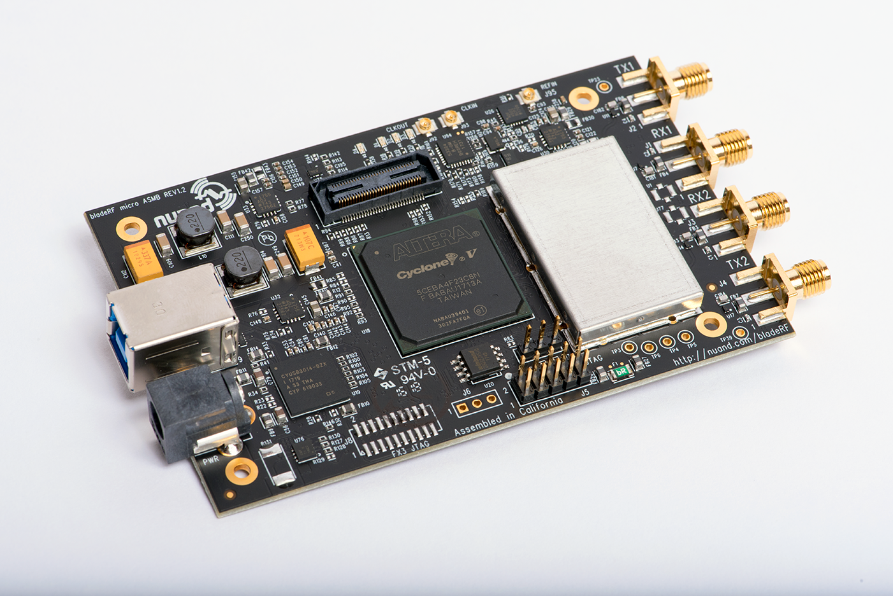
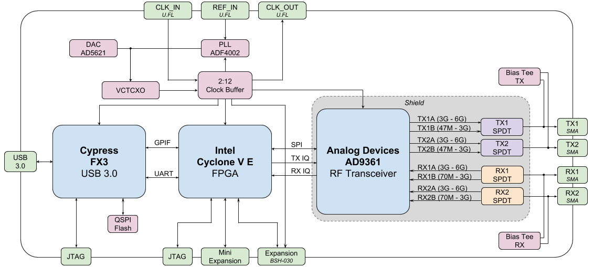
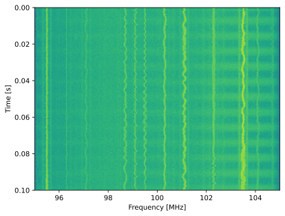
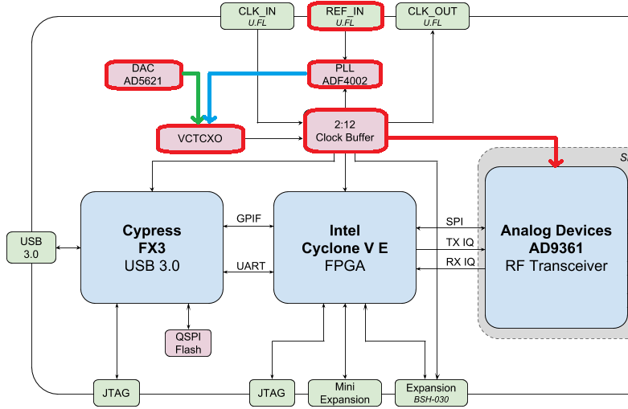

.. _bladerf-chapter:

##################
BladeRF en Python
##################

Le bladeRF 2.0 (également appelé bladeRF 2.0 micro) de Nuand `Nuand <https://www.nuand.com>`_ est un SDR (récepteur audio numérique) USB 3.0 doté de deux canaux de réception, deux canaux d'émission, une bande passante ajustable de 47 MHz à 6 GHz et une capacité d'échantillonnage jusqu'à 61 MHz, voire 122 MHz après modification. Il utilise le circuit intégré RF AD9361, tout comme l'USRP B210 et le PlutoSDR, offrant ainsi des performances RF similaires. Sorti en 2021, le bladeRF 2.0 conserve un format compact de 2,5" x 4,5" et est disponible en deux tailles de FPGA (xA4 et xA9). Bien que ce chapitre soit consacré au bladeRF 2.0, une grande partie du code est également applicable au bladeRF original, `sorti en 2013 <https://www.kickstarter.com/projects/1085541682/bladerf-usb-30-software-defined-radio>`_.

********************************
Architecture du bladeRF
********************************

De manière générale, le bladeRF 2.0 repose sur le circuit intégré RF AD9361, associé à un FPGA Cyclone V (49 kLE :code:`5CEA4` ou 301 kLE :code:`5CEA9`), et un contrôleur USB 3.0 Cypress FX3 doté d'un cœur ARM9 cadencé à 200 MHz et d'un firmware personnalisé. Le schéma fonctionnel du bladeRF 2.0 est présenté ci-dessous :

Le FPGA contrôle le circuit intégré RF, effectue le filtrage numérique et formate les paquets pour leur transfert via USB (entre autres). Le code source de l'image FPGA, disponible à l'adresse `<https://github.com/Nuand/bladeRF/tree/master/hdl>`_, est écrit en VHDL et nécessite le logiciel de conception gratuit Quartus Prime Lite pour compiler des images personnalisées. Des images précompilées sont disponibles `ici : <https://www.nuand.com/fpga_images/>`_.

Le code source du firmware Cypress FX3 (disponible à l'adresse `<https://github.com/Nuand/bladeRF/tree/master/fx3_firmware>`_) est open source et inclut le code permettant de :

1. Charger l'image FPGA
2. Transférer les échantillons IQ entre le FPGA et l'hôte via USB 3.0
3. Contrôler les E/S du FPGA via UART

Du point de vue du flux de signal, il existe deux canaux de réception et deux canaux d'émission. Chaque canal possède une entrée/sortie basse et haute fréquence vers le circuit intégré RF (RFIC), selon la bande utilisée. C'est pourquoi un commutateur électronique RF unipolaire bidirectionnel (SPDT) est nécessaire entre le RFIC et les connecteurs SMA. Le circuit de polarisation intégré fournit environ 4,5 V CC sur le connecteur SMA et permet d'alimenter un amplificateur externe ou d'autres composants RF. Ce décalage CC supplémentaire se situe côté RF du SDR et n'interfère donc pas avec le fonctionnement de base en réception/émission.

JTAG est une interface de débogage permettant de tester et de vérifier les conceptions pendant leur développement.

À la fin de ce chapitre, nous aborderons l'oscillateur VCTCXO, la PLL et le port d'extension.         

********************************
Configuration matérielle et logicielle
********************************

Ubuntu (ou Ubuntu dans WSL)
#############################

Sur Ubuntu et autres systèmes basés sur Debian, vous pouvez installer le logiciel bladeRF avec les commandes suivantes :

.. code-block:: bash

 sudo apt update
 sudo apt install cmake python3-pip libusb-1.0-0
 cd ~
 git clone --depth 1 https://github.com/Nuand/bladeRF.git
 cd bladeRF/host
 mkdir build && cd build
 cmake ..
 make -j8
 sudo make install
 sudo ldconfig
 cd ../libraries/libbladeRF_bindings/python
 sudo python3 setup.py install

Cela installera la bibliothèque libbladerf, les liaisons Python, les outils en ligne de commande bladeRF, le programme de téléchargement du firmware et celui du flux de bits FPGA. Pour vérifier la version de la bibliothèque installée, utilisez la commande :code:`bladerf-tool version` (ce guide a été rédigé avec la version 2.5.0 de libbladerf).

Si vous utilisez Ubuntu via WSL, vous devrez, côté Windows, rediriger le périphérique USB bladeRF vers WSL. Pour cela, installez d'abord la dernière version de l'utilitaire usbipd (fichier MSI :` <https://github.com/dorssel/usbipd-win/releases>`_) (ce guide suppose que vous disposez de usbipd-win 4.0.0 ou version ultérieure), puis ouvrez PowerShell en mode administrateur et exécutez la commande suivante :

.. code-block:: bash

    usbipd list
    # (Trouvez le BUSID étiqueté bladeRF 2.0 et remplacez-le dans la commande ci-dessous.)
    usbipd bind --busid 1-23
    usbipd attach --wsl --busid 1-23

Sous WSL, vous devriez pouvoir exécuter la commande :code:`lsusb` et voir un nouvel élément nommé :code:`Nuand LLC bladeRF 2.0 micro`. Notez que vous pouvez ajouter l'option :code:`--auto-attach` à la commande :code:`usbipd attach` pour activer la reconnexion automatique.

(Cette étape peut être inutile.) Sous Linux natif et sous WSL, il est nécessaire d'installer les règles udev afin d'éviter les erreurs de permissions.

.. code-block::

 sudo nano /etc/udev/rules.d/88-nuand.rules

et collez la ligne suivante :
.. code-block::

 ATTRS{idVendor}=="2cf0", ATTRS{idProduct}=="5250", MODE="0666"

Pour enregistrer et quitter nano, utilisez : Ctrl+O, puis Entrée, puis Ctrl+X. Pour actualiser udev, exécutez :

.. code-block:: bash

    sudo udevadm control --reload-rules && sudo udevadm trigger

Si vous utilisez WSL et que le message d'erreur suivant s'affiche :code:`Échec de l'envoi de la requête de rechargement : Aucun fichier ou répertoire de ce type`, cela signifie que le service udev n'est pas en cours d'exécution et que vous devrez exécuter la commande :code:`sudo nano /etc/wsl.conf` et ajouter les lignes suivantes :

.. code-block:: bash

 [boot]
 command="service udev start"

Redémarrez ensuite WSL à l'aide de la commande suivante dans PowerShell en tant qu'administrateur : :code:`wsl.exe --shutdown`.

Débranchez puis rebranchez votre bladeRF (les utilisateurs de WSL devront la reconnecter), et testez les autorisations avec :

.. code-block:: bash

 bladerf-tool probe
 bladerf-tool info

and you'll know it worked if you see your bladeRF 2.0 listed, and you **don't** see :code:`Found a bladeRF via VID/PID, but could not open it due to insufficient permissions`.  If it worked, note reported FPGA Version and Firmware Version.

(Optionally) Install the latest firmware and FPGA images (v2.4.0 and v0.15.0 respectively when this guide was written) using:

.. code-block:: bash

 cd ~/Downloads
 wget https://www.nuand.com/fx3/bladeRF_fw_latest.img
 bladerf-tool flash_fw bladeRF_fw_latest.img

 # for xA4 use:
 wget https://www.nuand.com/fpga/hostedxA4-latest.rbf
 bladerf-tool flash_fpga hostedxA4-latest.rbf

 # for xA9 use:
 wget https://www.nuand.com/fpga/hostedxA9-latest.rbf
 bladerf-tool flash_fpga hostedxA9-latest.rbf

Unplug and plug in your bladeRF to cycle power.

Now we will test its functionality by receiving 1M samples in the FM radio band, at 10 MHz sample rate, to a file /tmp/samples.sc16:

.. code-block:: bash

 bladerf-tool rx --num-samples 1000000 /tmp/samples.sc16 100e6 10e6

a couple :code:`Hit stall for buffer` is expected, but you'll know if it worked if you see a 4MB /tmp/samples.sc16 file.

Lastly, we will test the Python API with:

.. code-block:: bash

 python3
 import bladerf
 bladerf.BladeRF()
 exit()

You'll know it worked if you see something like :code:`<BladeRF(<DevInfo(...)>)>` and no warnings/errors.

Windows and macOS
###################

For Windows users (who do not prefer to use WSL), see https://github.com/Nuand/bladeRF/wiki/Getting-Started%3A-Windows, and for macOS users, see https://github.com/Nuand/bladeRF/wiki/Getting-started:-Mac-OSX.

********************************
bladeRF Python API Basics
********************************

To start with, let's poll the bladeRF for some useful information, using the following script.  **Do not name your script bladerf.py** or it will conflict with the bladeRF Python module itself!

.. code-block:: python

 from bladerf import _bladerf
 import numpy as np
 import matplotlib.pyplot as plt

 sdr = _bladerf.BladeRF()
 
 print("Device info:", _bladerf.get_device_list()[0])
 print("libbladeRF version:", _bladerf.version()) # v2.5.0
 print("Firmware version:", sdr.get_fw_version()) # v2.4.0
 print("FPGA version:", sdr.get_fpga_version())   # v0.15.0
 
 rx_ch = sdr.Channel(_bladerf.CHANNEL_RX(0)) # give it a 0 or 1
 print("sample_rate_range:", rx_ch.sample_rate_range)
 print("bandwidth_range:", rx_ch.bandwidth_range)
 print("frequency_range:", rx_ch.frequency_range)
 print("gain_modes:", rx_ch.gain_modes)
 print("manual gain range:", sdr.get_gain_range(_bladerf.CHANNEL_RX(0))) # ch 0 or 1

For the bladeRF 2.0 xA9, the output should look something like:

.. code-block:: python
 
    Device info: Device Information
        backend  libusb
        serial   f80a27b1010448dfb7a003ef7fa98a59
        usb_bus  2
        usb_addr 5
        instance 0
    libbladeRF version: v2.5.0 ("2.5.0-git-624994d")
    Firmware version: v2.4.0 ("2.4.0-git-a3d5c55f")
    FPGA version: v0.15.0 ("0.15.0")
    sample_rate_range: Range
        min   520834
        max   61440000
        step  2
        scale 1.0

    bandwidth_range: Range
        min   200000
        max   56000000
        step  1
        scale 1.0

    frequency_range: Range
        min   70000000
        max   6000000000
        step  2
        scale 1.0

    gain_modes: [<GainMode.Default: 0>, <GainMode.Manual: 1>, <GainMode.FastAttack_AGC: 2>, <GainMode.SlowAttack_AGC: 3>, <GainMode.Hybrid_AGC: 4>]

    manual gain range: Range
        min   -15
        max   60
        step  1
        scale 1.0

The bandwidth parameter sets the filter used by the SDR when performing the receive operation, so we typically set it to be equal or slightly less than the sample_rate/2.  The gain modes are important to understand: the SDR uses either a manual gain mode, where you provide the gain in dB, or automatic gain control (AGC), which has three different settings (fast, slow, hybrid).  For applications such as spectrum monitoring, manual gain is advised so you can see when signals come and go.  For applications such as receiving a specific signal you expect to exist, AGC is more useful because it automatically adjusts the gain to allow the signal to fill the analog-to-digital converter (ADC).

To set the main parameters of the SDR, we can add the following code:

.. code-block:: python

 sample_rate = 10e6
 center_freq = 100e6
 gain = 50 # -15 to 60 dB
 num_samples = int(1e6)
 
 rx_ch.frequency = center_freq
 rx_ch.sample_rate = sample_rate
 rx_ch.bandwidth = sample_rate/2
 rx_ch.gain_mode = _bladerf.GainMode.Manual
 rx_ch.gain = gain

********************************
Receiving Samples in Python
********************************

Next, we will work off the previous code block to receive 1M samples in the FM radio band, at 10 MHz sample rate, just like we did before.  Any antenna on the RX1 port should be able to receive FM, since it is so strong.  The code below shows how the bladeRF synchronous stream API works; it must be configured and a receive buffer must be created, before the receiving begins.  The :code:`while True:` loop will continue to receive samples until the number of samples requested is reached.  The received samples are stored in a separate numpy array, so that we can process them after the loop finishes.

.. code-block:: python

 # Setup synchronous stream
 sdr.sync_config(layout = _bladerf.ChannelLayout.RX_X1, # or RX_X2
                 fmt = _bladerf.Format.SC16_Q11, # int16s
                 num_buffers    = 16,
                 buffer_size    = 8192,
                 num_transfers  = 8,
                 stream_timeout = 3500)
 
 # Create receive buffer
 bytes_per_sample = 4 # don't change this, it will always use int16s
 buf = bytearray(1024 * bytes_per_sample)
 
 # Enable module
 print("Starting receive")
 rx_ch.enable = True
 
 # Receive loop
 x = np.zeros(num_samples, dtype=np.complex64) # storage for IQ samples
 num_samples_read = 0
 while True:
     if num_samples > 0 and num_samples_read == num_samples:
         break
     elif num_samples > 0:
         num = min(len(buf) // bytes_per_sample, num_samples - num_samples_read)
     else:
         num = len(buf) // bytes_per_sample
     sdr.sync_rx(buf, num) # Read into buffer
     samples = np.frombuffer(buf, dtype=np.int16)
     samples = samples[0::2] + 1j * samples[1::2] # Convert to complex type
     samples /= 2048.0 # Scale to -1 to 1 (it is using a 12-bit ADC)
     x[num_samples_read:num_samples_read+num] = samples[0:num] # Store buf in samples array
     num_samples_read += num
 
 print("Stopping")
 rx_ch.enable = False
 print(x[0:10]) # look at first 10 IQ samples
 print(np.max(x)) # if this is close to 1, you are overloading the ADC, and should reduce the gain

A few :code:`Hit stall for buffer` is expected at the end.  The last number printed shows the maximum sample received; you will want to adjust your gain to try to get that value around 0.5 to 0.8.  If it is 0.999 that means your receiver is overloaded/saturated and the signal is going to be distorted (it will look smeared throughout the frequency domain).

In order to visualize the received signal, let's display the IQ samples using a spectrogram (see :ref:`spectrogram-section` for more details on how spectrograms work).  Add the following to the end of the previous code block:

.. code-block:: python

 # Create spectrogram
 fft_size = 2048
 num_rows = len(x) // fft_size # // is an integer division which rounds down
 spectrogram = np.zeros((num_rows, fft_size))
 for i in range(num_rows):
     spectrogram[i,:] = 10*np.log10(np.abs(np.fft.fftshift(np.fft.fft(x[i*fft_size:(i+1)*fft_size])))**2)
 extent = [(center_freq + sample_rate/-2)/1e6, (center_freq + sample_rate/2)/1e6, len(x)/sample_rate, 0]
 plt.imshow(spectrogram, aspect='auto', extent=extent)
 plt.xlabel("Frequency [MHz]")
 plt.ylabel("Time [s]")
 plt.show()

Chaque ligne verticale ondulée représente un signal radio FM. L'origine des pulsations à droite reste inconnue ; même en baissant le gain, elles persistent.

********************************
Transmission d'échantillons en Python
********************************

Le processus de transmission d'échantillons avec la bladeRF est très similaire à la réception. La principale différence réside dans la génération des échantillons à transmettre, suivie de leur écriture sur la bladeRF à l'aide de la méthode :code:`sync_tx`, capable de traiter l'ensemble du lot d'échantillons en une seule fois (jusqu'à environ 4 milliards d'échantillons). Le code ci-dessous illustre la transmission d'une tonalité simple, répétée 30 fois. La tonalité est générée avec NumPy, puis mise à l'échelle entre -2048 et 2048 pour s'adapter au convertisseur numérique-analogique (CNA) 12 bits. Elle est ensuite convertie en octets (représentant des entiers 16 bits) et utilisée comme tampon de transmission. L'API de flux synchrone est utilisée pour la transmission des échantillons, et la boucle :code:`while True:` assure la transmission jusqu'à ce que le nombre de répétitions souhaité soit atteint. Si vous souhaitez transmettre des échantillons à partir d'un fichier, utilisez simplement :code:`samples = np.fromfile('yourfile.iq', dtype=np.int16)` (ou tout autre type de données) pour lire les échantillons, puis convertissez-les en octets à l'aide de :code:`samples.tobytes()`, en tenant compte de la plage de -2048 à 2048 du CNA.

.. code-block:: python

 from bladerf import _bladerf
 import numpy as np
 
 sdr = _bladerf.BladeRF()
 tx_ch = sdr.Channel(_bladerf.CHANNEL_TX(0)) # Donnez-lui un 0 ou un 1
 
 sample_rate = 10e6
 center_freq = 100e6
 gain = 0 # de -15dB à 60 dB pour transmettre, commencez par une faible valeur et augmentez-la progressivement, en veillant à ce que l'antenne soit bien connectée.
 num_samples = int(1e6)
 repeat = 30 # nombre de fois pour répéter notre signal
 print('duration of transmission:', num_samples/sample_rate*repeat, 'seconds')
 
 # Générer des échantillons IQ à transmettre (dans ce cas, une simple tonalité)
 t = np.arange(num_samples) / sample_rate
 f_tone = 1e6
 samples = np.exp(1j * 2 * np.pi * f_tone * t) # will be -1 to +1
 samples = samples.astype(np.complex64)
 samples *= 2048.0 # Scale to -1 to 1 (it is using a 12-bit DAC)
 samples = samples.view(np.int16)
 buf = samples.tobytes() # Convertir nos échantillons en octets et les utiliser comme tampon de transmission
 
 tx_ch.frequency = center_freq
 tx_ch.sample_rate = sample_rate
 tx_ch.bandwidth = sample_rate/2
 tx_ch.gain = gain
  
# Configurer le flux synchrone
 sdr.sync_config(layout=_bladerf.ChannelLayout.TX_X1, # ou TX_X2
                 fmt=_bladerf.Format.SC16_Q11, # int16s
                 num_buffers=16,
                 buffer_size=8192,
                 num_transfers=8,
                 stream_timeout=3500)
 
 print("Démarrage de la transmission!")
 repeats_remaining = repeat - 1
 tx_ch.enable = True
 while True:
     sdr.sync_tx(buf, num_samples) # write to bladeRF
     print(repeats_remaining)
     if repeats_remaining > 0:
         repeats_remaining -= 1
     else:
         break
 
 print("Arrêt de la transmission")
 tx_ch.enable = False

Quelques erreurs de type :code:`Hit stall for buffer` à la fin sont normales.

Pour transmettre et recevoir simultanément, il faut utiliser des threads. Vous pouvez par exemple utiliser l'exemple de Nuand : `txrx.py <https://github.com/Nuand/bladeRF/blob/624994d65c02ad414a01b29c84154260912f4e4f/host/examples/python/txrx/txrx.py>`_, qui fait exactement cela. 

***********************************
Oscillateurs, PLLs, and étalonnage
***********************************

Tous les SDR à conversion directe (y compris ceux basés sur l'AD9361, comme l'USRP B2X0, l'Analog Devices Pluto et le bladeRF) utilisent un oscillateur unique pour fournir une horloge stable à l'émetteur-récepteur RF. Tout décalage ou gigue de fréquence produit par cet oscillateur se traduit par un décalage et une gigue de fréquence dans le signal reçu ou émis. Cet oscillateur est intégré, mais peut être stabilisé par un signal carré ou sinusoïdal externe injecté dans le bladeRF via un connecteur U.FL sur la carte.

La carte bladeRF embarque un `oscillateur Abracon VCTCXO <https://abracon.com/Oscillators/ASTX12_ASVTX12.pdf>`_ (oscillateur à compensation de température commandé en tension) cadencé à 38,4 MHz. La compensation de température lui confère une grande stabilité sur une large plage de températures. La commande en tension permet d'ajuster finement la fréquence de l'oscillateur grâce à un niveau de tension spécifique. Sur la bladeRF, cette tension est fournie par un convertisseur numérique-analogique (CNA) 10 bits externe, représenté en vert dans le schéma fonctionnel ci-dessous. Ce système permet un réglage précis de la fréquence de l'oscillateur par logiciel, et c'est ainsi que l'on calibre (ou ajuste) le VCTCXO de la bladeRF. Heureusement, les lames RF sont calibrées en usine, comme nous le verrons plus loin dans cette section, mais si vous disposez de l'équipement de test nécessaire, vous pouvez toujours affiner cette valeur, surtout au fil des années et de la dérive de la fréquence de l'oscillateur.

Lorsqu'une référence de fréquence externe est utilisée (pouvant atteindre pratiquement n'importe quelle fréquence jusqu'à 300 MHz), le signal de référence est directement injecté dans la boucle à verrouillage de phase (PLL) `Analog Devices ADF4002 <http://www.analog.com/en/adf4002>`_ intégrée à la carte bladeRF. Cette PLL se synchronise sur le signal de référence et envoie un signal à l'oscillateur VCTCXO (représenté en bleu ci-dessus) proportionnel à la différence de fréquence et de phase entre l'entrée de référence (mise à l'échelle) et la sortie du VCTCXO. Une fois la PLL synchronisée, ce signal entre la PLL et le VCTCXO constitue une tension continue stable qui maintient la sortie du VCTCXO à 38,4 MHz (en supposant que la référence soit correcte) et synchronisée en phase avec l'entrée de référence. Pour utiliser une référence externe, vous devez activer :code:`clock_ref` (via Python ou l'interface de ligne de commande) et définir la fréquence de référence d'entrée (:code:`refin_freq`), qui est de 10 MHz par défaut. L'utilisation d'une référence externe permet notamment une meilleure précision de fréquence et la possibilité de synchroniser plusieurs SDR sur la même référence.

Chaque valeur de réglage du convertisseur numérique-analogique (CNA) VCTCXO de bladeRF est calibrée en usine à 1 Hz près à 38,4 MHz à température ambiante. Vous pouvez consulter la valeur de calibration d'usine en saisissant votre numéro de série sur la page <https://www.nuand.com/calibration/>`_ (trouvez votre numéro de série sur la carte ou à l'aide de l'outil :code:`bladerf-tool probe`). Selon Nuand, une carte neuve devrait présenter une précision largement inférieure à 0,5 ppm, et probablement plus proche de 0,1 ppm. Si vous disposez d'un équipement de test pour mesurer la précision de fréquence ou si vous souhaitez la rétablir à la valeur d'usine, vous pouvez utiliser les commandes suivantes :

.. code-block:: bash

 $ bladeRF-cli -i
 bladeRF> flash_init_cal 301 0x2049

Remplacez :code:`301` par la taille de votre bladeRF et :code:`0x2049` par la valeur de réglage DAC VCTCXO au format hexadécimal. Un redémarrage est nécessaire pour que la modification soit prise en compte. 

***********************************
Échantillonnage à 122 MHz
***********************************

À venir!

***********************************
Ports d'extension
***********************************

Le bladeRF 2.0 est dotée d'un port d'extension utilisant un connecteur BSH-030. Plus d'informations sur l'utilisation de ce port prochainement !

********************************
Pour en savoir plus
********************************

#. `bladeRF Wiki <https://github.com/Nuand/bladeRF/wiki>`_
#. `Nuand's txrx.py example <https://github.com/Nuand/bladeRF/blob/master/host/examples/python/txrx/txrx.py>`_
