.. _doa-chapter:

#################
Beamforming & direction d'arrivée
#################

Ce chapitre aborde les concepts de formation de faisceaux ou beamforming, de direction d'arrivée (DOA = Direction Of Arrival) et d'antennes à commande de phase.  Il compare les différents types et géométries d'antennes et explique l'importance de l'espacement des éléments. Des techniques telles que MVDR/Capon et MUSIC sont présentées et illustrées par des simulations en Python.

*********************
Présentation du Beamforming
*********************

Un réseau  d'antennes à commande  de phase, également appelé  réseau à balayage  électronique,  est  un ensemble  d'antennes  utilisables  en émission  ou  en  réception  dans les  systèmes  de communication  et radar. On  trouve des réseaux d'antennes  à commande de phase sur des systèmes  terrestres, aéroportés  et satellitaires. Les antennes  qui composent un  réseau sont  généralement appelées "éléments",  et le réseau lui-même est parfois désigné comme un "capteur". Ces éléments sont le  plus souvent des antennes  omnidirectionnelles, équidistantes horizontalement ou verticalement.

Le beamforming aussi appelé formation de faisceau est une opération de traitement du signal utilisée avec les réseaux d'antennes pour créer un filtre spatial ; il élimine les signaux provenant de toutes les directions sauf celle(s) souhaitée(s). Le beamforming permet d'améliorer le rapport signal/bruit des signaux utiles, d'annuler les interférences, de modeler les diagrammes de rayonnement, voire de transmettre/recevoir simultanément plusieurs flux de données à la même fréquence.  Le beamforming utilise des pondérations (ou coefficients) appliquées à chaque élément du réseau, soit numériquement, soit par un circuit analogique.  Nous ajustons les pondérations pour former le ou les faisceaux de l'antenne, d'où le nom de formation de faisceaux ! Nous pouvons orienter ces faisceaux (et les zones d'annulation) extrêmement rapidement, bien plus rapidement que les antennes à cardan mécanique, qui peuvent être considérées comme une alternative aux antennes à commande de phase.  Nous aborderons généralement la formation de
faisceaux dans le contexte d'une liaison de communication, où le récepteur vise à capter un ou plusieurs signaux avec le meilleur rapport signal/bruit possible. Les antennes jouent également un rôle crucial en radar, où l'objectif est de détecter et de suivre des cibles.

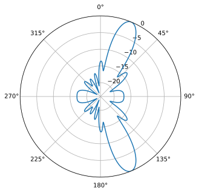

Les techniques beamforming se répartissent en trois catégories : /conventionnelle/, /adaptative/ et /aveugle/. La formation de faisceaux conventionnelle est particulièrement utile lorsque la direction d'arrivée du signal d'intérêt est connue. Le processus consiste alors à pondérer les signaux afin de maximiser le gain de l'antenne dans cette direction. Cette méthode peut être utilisée aussi bien en réception qu'en émission. La formation de faisceaux adaptative, quant à elle, ajuste généralement les pondérations en fonction des données reçues, afin d'optimiser certains critères (par exemple, éliminer un signal interférent, obtenir plusieurs faisceaux principaux, etc.). Du fait de son fonctionnement en boucle fermée et de sa nature adaptative, la formation de faisceaux adaptative est généralement utilisée uniquement en réception. Dans ce cas, les données reçues constituent les "entrées du formateur de faisceaux", et la formation de faisceaux adaptative ajuste les pondérations en fonction des statistiques de ces données.

La taxonomie suivante vise à catégoriser les différents domaines de la formation de faisceaux et propose des exemples de techniques_:

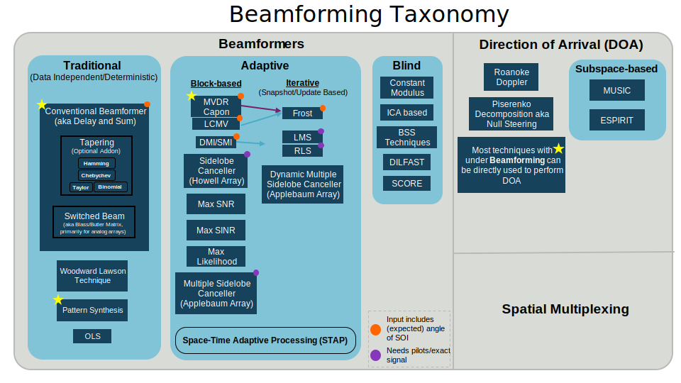

******************************
La direction d'arrivée
******************************

en traitement numérique du signal (DSP) et en radio logicielle (SDR) désigne le processus utilisant un réseau d'antennes pour détecter et estimer la direction d'arrivée d'un ou plusieurs signaux reçus par ce réseau (contrairement à la formation de faisceaux, qui vise à recevoir un signal en minimisant le bruit et les interférences). Bien que la DOA relève du domaine de la formation de faisceaux, la distinction entre les deux termes peut être source de confusion. Certaines techniques, comme la formation de faisceaux conventionnelle et MVDR, peuvent s'appliquer à la fois à la DOA et à la formation de faisceaux, car la même méthode est utilisée pour la DOA : balayer l'angle d'intérêt et effectuer l'opération de formation de faisceaux à chaque angle, puis rechercher les pics dans le résultat (chaque pic représente un signal, mais on ignore s'il s'agit du signal recherché, d'une interférence ou d'un signal réfléchi par trajets multiples). On peut considérer ces techniques de DOA comme une surcouche à un formateur de faisceaux spécifique. D'autres techniques de formation de faisceaux ne peuvent pas être simplement intégrées à une routine DOA, notamment en raison d'entrées supplémentaires non disponibles dans le contexte du DOA. Il existe également des techniques DOA telles que MUSIC et ESPIRT, spécifiquement dédiées au DOA et qui ne sont pas des techniques de formation de faisceaux. La plupart des techniques de formation de faisceaux supposant la connaissance de l'angle d'arrivée du signal d'intérêt, si la cible ou le réseau d'antennes se déplace, il sera nécessaire d'effectuer un DOA en continu comme étape intermédiaire, même si l'objectif principal est la réception et la démodulation du signal.

Les réseaux d'antennes à commande de phase et la formation de faisceaux/DOA trouvent des applications dans de nombreux domaines, notamment les radars, les nouvelles normes Wi-Fi, les communications millimétriques 5G, les communications par satellite et le brouillage. De manière générale, toute application nécessitant une antenne à gain élevé, ou une antenne à gain élevé à déplacement rapide, est une bonne candidate pour les réseaux d'antennes à commande de phase. Types de réseaux d'antennes

******************
Différents types de réseaux
******************

Les réseaux d'antennes à commande de phase se divisent en trois catégories :
1. **Analogiques**, également appelés réseaux passifs à balayage électronique (PESA) ou réseaux à commande de phase traditionnels, utilisent des déphaseurs analogiques pour orienter le faisceau. À la réception, tous les éléments sont additionnés après déphasage (et éventuellement gain ajustable) et convertis en un canal de signal, puis abaissés en fréquence avant d'être reçus. À l'émission, le processus est inverse : un signal numérique unique est émis par la partie numérique, tandis que des déphaseurs et des étages de gain sont utilisés côté analogique pour produire le signal destiné à chaque antenne. Ces déphaseurs numériques ont une résolution limitée en bits et contrôlent la latence.
2. **Numériques**, également appelés réseaux actifs à balayage électronique (AESA), où chaque élément possède son propre étage d'entrée RF et où la formation du faisceau est entièrement réalisée numériquement. Cette approche est la plus coûteuse, car les composants RF sont onéreux, mais elle offre une flexibilité et une vitesse bien supérieures aux PESA. Les antennes numériques sont couramment utilisées avec les SDR, bien que le nombre de canaux de réception ou d'émission du SDR limite le nombre d'éléments de l'antenne.
3. **Hybrides**,    composés    de    nombreux    sous-réseaux    qui, individuellement,  ressemblent à  des antennes  analogiques, chaque sous-réseau possédant son propre étage  d'entrée RF, comme pour les antennes numériques.   Ils constituent l'approche la  plus courante pour les  antennes à commande  de phase modernes. Elles  offrent en effet le meilleur des deux mondes.Il convient de noter que les termes PESA et AESA sont principalement utilisés dans le contexte des radars, et leur définition exacte reste parfois ambiguë. Par conséquent, l'utilisation des termes « antenne analogique/numérique/hybride » est plus claire et applicable à tout type d'application.

Un exemple concret pour chaque type est présenté ci-dessous :

.. image:: ../_images/beamforming_examples.svg
   :align: center 
   :target: ../_images/beamforming_examples.svg
   :alt: Exemples  de réseaux  à commande  phase comprenant  un réseau PESA (Passive  electronically scanned array), un  réseau AESA (Active  electronically scanned  array), un réseau hybride, soit un Raytheon MIM-104 Patriot Radar, un Radal Multi-Mission israélien ELM-2084 , Un terminal utilisateur Starlink Dishy

En plus de ces trois types,  il faut également considérer la géométrie d'un  réseau. La  géométrie  la  plus simple  est  le réseau  linéaire uniforme (ULA = Uniform Linear Array), où les antennes sont alignées et équidistantes (c'est-à-dire disposées selon  une seule dimension). Les ULA souffrent d'une ambiguïté de  180 degrés, que nous aborderons plus loin. Une  solution consiste à  disposer les  antennes en cercle  : on parle  alors de  réseau  circulaire uniforme  (UCA).  Enfin, pour  les faisceaux 2D, on utilise généralement un réseau rectangulaire uniforme (URA = Uniform Rectangular Array), où les antennes sont disposées en grille.
Dans ce chapitre, nous nous concentrons sur les réseaux numériques, car ils sont plus adaptés à la simulation et au traitement numérique du signal (DSP), mais les concepts s'appliquent également aux réseaux analogiques et hybrides. Le chapitre suivant sera consacré à la manipulation du SDR « Phaser » d'Analog Devices, qui intègre un réseau analogique de 8 éléments fonctionnant à 10 GHz, avec des déphaseurs et des convertisseurs de gain, connecté à un Pluto et un Raspberry Pi. Nous nous concentrerons également sur la géométrie ULA car elle offre les mathématiques et le code les plus simples, mais tous les concepts s'appliquent à d'autres géométries, et à la fin du chapitre, nous aborderons la géométrie UCA.

*******************
Exigences relatives aux SDR
*******************

Les  antennes réseau  à  commande de  phase  analogiques utilisent  un déphaseur (et souvent  un étage de gain  ajustable) par canal/élément, implémenté  dans des  circuits RF  analogiques.  Cela  signifie qu'une antenne  réseau  à  commande  de phase  analogique  est  un  composant matériel  dédié  qui   doit  être  utilisé  avec  un   SDR,  ou  conçu spécifiquement pour  une application  particulière. En  revanche, tout SDR comportant  plusieurs canaux peut  être utilisé comme  une antenne réseau  numérique sans  matériel supplémentaire,  à condition  que les canaux  soient  cohérents  en  phase et  échantillonnés  sur  la  même horloge, ce  qui est  généralement le  cas pour  les SDR  disposant de
plusieurs canaux  de réception  intégrés. De nombreuses  SDR possèdent deux canaux de réception, comme  l'Ettus USRP B210 et l'Analog Devices Pluto (le deuxième  canal est accessible via un connecteur  uFL sur la carte). Malheureusement, l'utilisation de plus de deux canaux implique de passer à la catégorie des SDR à plus de 10 000 € (prix constaté en 2024),  comme  l'Ettus USRP  N310  ou  l'Analog Devices  QuadMXFE  (16 canaux). Le principal  défi réside dans l'impossibilité,  pour les SDR économiques, de les chaîner afin d'augmenter le nombre de canaux. Font exception  les KerberosSDR  (4 canaux)  et KrakenSDR  (5 canaux),  qui utilisent  plusieurs  SDR RTL  partageant  un  oscillateur local  pour former un réseau numérique économique. Leur principal inconvénient est la     fréquence    d'échantillonnage     très    limitée     (jusqu'à 2,56  MHz) et  la plage  de fréquences  très restreinte  (jusqu'à 1766 MHz).
La carte KrakenSDR et un exemple de configuration d'antenne sont présentés ci-dessous.

.. image:: ../_images/krakensdr.jpg
   :align: center 
   :alt: The KrakenSDR
   :target: ../_images/krakensdr.jpg

Dans  ce  chapitre,  nous  n'utilisons aucun  SDR  spécifique  ;  nous simulons plutôt la réception des signaux à l'aide de Python, puis nous passons en revue le DSP utilisé pour effectuer la formation de faisceaux/DOA pour les réseaux numériques.

**************************************
Introduction aux calculs matriciels en Python/Numpy
**************************************
Python présente de nombreux avantages par rapport à MATLAB : il est gratuit et open source, offre une grande diversité d’applications, une communauté dynamique, les indices commencent à 0 comme dans tous les langages, il est utilisé en IA/ML et il existe une bibliothèque pour presque tout. Cependant, son point faible réside dans la manière dont la manipulation des matrices est codée/représentée (en termes de performances, c’est très rapide, grâce à des fonctions implémentées efficacement en C/C++). Le fait qu’il existe plusieurs façons de représenter les matrices en Python, la méthode :code:`np.matrix` étant obsolète et remplacée par :code:`np.ndarray`, n’arrange rien. Dans cette section, nous proposons une brève introduction aux calculs matriciels en Python avec NumPy, afin que vous soyez plus à l’aise avec les exemples DOA.

Commençons  par   aborder  l’aspect  le  plus   complexe  des  calculs
matriciels avec NumPy ; Les vecteurs sont traités comme des tableaux unidimensionnels (1D), il est donc impossible de distinguer un vecteur ligne  d'un vecteur  colonne  (par  défaut, il  sera  traité comme  un vecteur  ligne). En  revanche,  en  MATLAB, un  vecteur  est un  objet bidimensionnel (2D). En  Python, vous pouvez créer  un nouveau vecteur
avec :code:`a = np.array([2,3,4,5])` ou convertir une liste en vecteur avec   :code:`mylist   =    [2,   3,   4,   5]`    puis   :code:`a = np.asarray(mylist)`.  Cependant, dès  que vous  effectuez des  calculs matriciels,  l'orientation  est  importante  et  les  vecteurs  seront interprétés  comme des  vecteurs  lignes. Transposer  ce vecteur,  par exemple avec :code:`a.T`, ne le  transformera pas en vecteur colonne !
Pour  convertir  un vecteur  :code:`a`  en  vecteur colonne,  utilisez :code:`a = a.reshape(-1,1)`. Le paramètre :code:`-1` indique à NumPy de calculer  automatiquement  la  taille  de  cette  dimension,  tout  en conservant    la   longueur    de   la    seconde   dimension    égale à 1.  Techniquement, cela crée  un tableau  2D, mais comme  la seconde dimension est de longueur 1, il s'agit essentiellement d'un tableau 1D d'un  point  de vue  mathématique.  Cela  ne représente  qu'une  ligne supplémentaire, mais  peut considérablement perturber le  flux de code lors de calculs matriciels.

Voici un exemple rapide de  calcul matriciel en Python : multiplions une matrice  :code:`3x10`  par  une matrice  :code:`10x1`.  Rappelons  que :code:`10x1` signifie 10 lignes et  1 colonne, soit un vecteur colonne puisqu'il  ne   contient  qu'une  seule  colonne.    Depuis  nos premières années d'école, nous savons que cette multiplication matricielle est valide car les dimensions internes correspondent et la matrice résultante a la même taille que les dimensions externes, soit :code:`3x1`.  Par commodité, nous utiliserons :code:`np.random.randn()` pour créer le tableau :code:`3x10` et :code:`np.arange()` pour créer le tableau :code:`10x1` : 

.. code-block:: python
                
 A = np.random.randn(3,10) # 3x10
 B = np.arange(10) # Tableau 1D de longueur 10
 B = B.reshape(-1,1) # 10x1
 C = A @ B # Multiplication matricielle
 print(C.shape) # 3x1
 C = C.squeeze() # voir la sous-section suivante
 print(C.shape) #  Tableau 1D  de longueur 3,  plus pratique  pour les
 graphiques et autres opérations Python non-matricielles

Après avoir  effectué des calculs matriciels,  votre résultat pourrait
ressembler à ceci : :code:`[[ 0.  0.125  0.251  -0.376  -0.251 ...]]`. Ce tableau ne contient qu'une seule dimension de données, mais si vous tentez de le représenter graphiquement, vous obtiendrez soit une erreur, soit un graphique incohérent. Le résultat ne s'affiche pas. En effet, il s'agit techniquement d'un tableau 2D, qu'il faut convertir en tableau 1D à l'aide de :code:`a.squeeze()`. Cette fonction supprime les dimensions de longueur 1 et s'avère très utile pour les calculs matriciels en Python. Dans l'exemple ci-dessus, le résultat serait : :code:`[ 0.  0.125  0.251  -0.376  -0.251 ...]` (notez l'absence des deuxièmes parenthèses). Ce tableau peut être tracé ou utilisé dans d'autres portions de code Python qui attendent des données 1D.

Lors  de   la  programmation  de  calculs   matriciels,  la  meilleure vérification consiste à afficher  les dimensions (avec :code:`A.shape`) pour s'assurer qu'elles correspondent  à vos attentes. Pensez  à ajouter la forme du tableau en commentaire après chaque ligne pour vous y référer ultérieurement ;  cela facilitera la vérification  des dimensions lors de multiplications matricielles ou élément par élément.

Voici quelques opérations courantes en MATLAB et en Python, sous forme de pense-bête :

.. list-table::
   :widths: 35 25 40
   :header-rows: 1

   * - Operation
     - MATLAB
     - Python/NumPy
   * - Créer un vecteur ligne , taille :code:`1 x 4`
     - :code:`a = [2 3 4 5];`
     - :code:`a = np.array([2,3,4,5])`
   * - Créer un vecteur colonne, taille :code:`4 x 1`
     - :code:`a = [2; 3; 4; 5];` or :code:`a = [2 3 4 5].'`
     - :code:`a = np.array([[2],[3],[4],[5]])` ou |br| :code:`a = np.array([2,3,4,5])` puis |br| :code:`a = a.reshape(-1,1)`
   * - Créer une matrice 2D
     - :code:`A = [1 2; 3 4; 5 6];`
     - :code:`A = np.array([[1,2],[3,4],[5,6]])`
   * - Obtenir la taille
     - :code:`size(A)`
     - :code:`A.shape`
   * - Transposition c'est à dire :math:`A^T`
     - :code:`A.'`
     - :code:`A.T`
   * - Transposition  complexe conjuguée |br|  également Transposition
     conjuguéee |br| également Transposition hermitienne|br| :math:`A^H`
     - :code:`A'`
     - :code:`A.conj().T` |br| |br| (malheureusement il n'y a pas 
       :code:`A.H` pour ndarrays)
   * - Multiplication élément par élément
     - :code:`A .* B`
     - :code:`A * B` or :code:`np.multiply(a,b)`
   * - Multiplication matricielle
     - :code:`A * B`
     - :code:`A @ B` or :code:`np.matmul(A,B)`
   * - PRoduit scalaire de 2 vecteurs (1D)
     - :code:`dot(a,b)`
     - :code:`np.dot(a,b)` (ne jamais utiliser np.dot pour la 2D)
   * - Concatenatation
     - :code:`[A A]`
     - :code:`np.concatenate((A,A))`

*********************
Vecteur de direction
*********************

Pour passer à la partie intéressante, il nous faut aborder quelques notions mathématiques. La section suivante est rédigée de manière à ce que les calculs restent relativement simples et soient accompagnés de schémas. Seules les propriétés trigonométriques et exponentielles les plus élémentaires sont utilisées. Il est important de comprendre les bases mathématiques qui sous-tendent les opérations que nous effectuerons en Python pour calculer la direction d'arrivée (DOA).

Considérons un réseau unidimensionnel à trois éléments uniformément espacés :

.. image:: ../_images/doa.svg
   :align: center 
   :target: ../_images/doa.svg
   :alt: Schéma illustrant la direction  d'arrivée (DOA = Direction Of
         Arrival)  d'un  signal  incident  sur  un  réseau  d'antennes
         uniformément espacées, indiquant l'angle de visée (boresight)
         et la distance d entre les éléments (ou ouvertures).

Dans cet exemple, un signal arrive par la droite et atteint donc d'abord l'élément le plus à droite. Calculons le délai entre le moment où le signal atteint ce premier élément et celui où il atteint le suivant. Pour ce faire, nous pouvons formuler le problème trigonométrique suivant. Essayez de visualiser comment ce triangle a été formé à partir du schéma ci-dessus. Le segment en rouge représente la distance que le signal doit parcourir *après* avoir atteint le premier élément avant d'atteindre le suivant.

.. image:: ../_images/doa_trig.svg
   :align: center 
   :target: ../_images/doa_trig.svg
   :alt: Trigonométrie associée à la direction d'arrivée (DOA) d'un réseau uniformément espacé

Si vous vous souvenez de SOH CAH TOA, dans ce cas, nous nous intéressons au côté "adjacent" et nous connaissons la longueur de l'hypoténuse (:math:`d`). Nous devons donc utiliser le cosinus :

.. math::
  \cos(90 - \theta) = \frac{\mathrm{adjacent}}{\mathrm{hypotenuse}}

Nous devons isoler  le côté adjacent, car c'est ce  qui nous indiquera
la distance que le signal doit parcourir entre l'impact sur le premier
et  le deuxième  élément.  On  obtient donc  :  :math:`=  d \cos(90  -
\theta)`.  Une   identité  trigonométrique  nous  permet   ensuite  de
convertir cette  expression en :  :math:`= d \sin(\theta)`.  Il s'agit
cependant  d'une distance  ; nous  devons  la convertir  en temps,  en
utilisant la vitesse de la lumière : :math:`= d \sin(\theta) / c` secondes. Cette équation s'applique entre tous les éléments adjacents de notre tableau. Cependant, pour calculer la distance entre des éléments non adjacents, puisqu'ils sont uniformément espacés, on peut multiplier l'ensemble par un entier (nous le verrons plus tard).

Appliquons maintenant ces notions de trigonométrie et de vitesse de la
lumière au  traitement du  signal. Notons  notre signal  d'émission en
bande de base : :math:`x(t)` ; il  est émis à une fréquence porteuse :
:math:`f_c` ; le signal d'émission est donc : :math:`x(t) e^{2j \pi f_c t}`. Nous utiliserons : :math:`d_m` pour désigner l'espacement des antennes en mètres. Supposons que ce signal atteigne le premier élément à l'instant : t = 0 ; il atteindra donc l'élément suivant après : :math:`d_m \sin(\theta) / c` secondes, comme calculé précédemment. Cela signifie que le deuxième élément reçoit :

.. math::
 x(t - \Delta t) e^{2j \pi f_c (t - \Delta t)}

.. math::
 \mathrm{où} \quad \Delta t = d_m \sin(\theta) / c

Rappelons que lorsqu'il y a un décalage temporel, celui-ci est soustrait de l'argument temporel.

Lorsque le récepteur ou le SDR effectue la conversion de fréquence pour recevoir le signal, il le multiplie essentiellement par la porteuse, mais en sens inverse. Après la conversion, le récepteur voit donc :

.. math::
 x(t - \Delta t) e^{2j \pi f_c (t - \Delta t)} e^{-2j \pi f_c t}

.. math::
 = x(t - \Delta t) e^{-2j \pi f_c \Delta t}

On peut maintenant utiliser une petite astuce pour simplifier encore davantage cette expression ; Considérons comment, lors de l'échantillonnage d'un signal, on peut modéliser le processus en remplaçant :math:`t` par :math:`nT`, où :math:`T` est la période d'échantillonnage et :math:`n` prend simplement les valeurs 0, 1, 2, 3… En substituant ces valeurs, on obtient : :math:`x(nT - Δt) e^{-2j π f_c Δt}`. Or, :math:`nT` est tellement supérieur à `Δt` que l'on peut négliger le premier terme :math:`Δt` et obtenir : :math:`x(nT) e^{-2j π f_c Δt}`. Si la fréquence d'échantillonnage devient un jour suffisamment rapide pour approcher la vitesse de la lumière sur une distance infime, on pourra réexaminer ce point. Mais n'oublions pas que notre fréquence d'échantillonnage doit seulement être légèrement supérieure à la bande passante du signal d'intérêt.

Continuons avec ces calculs, mais nous allons commencer à représenter les termes de manière discrète afin de mieux les rapprocher de notre code Python. La dernière équation peut être représentée comme suit ; remplaçons :math:`\Delta t` :

.. math::
 x[n] e^{-2j \pi f_c \Delta t}

.. math::
 = x[n] e^{-2j \pi f_c d_m \sin(\theta) / c}

Nous avons presque terminé, mais heureusement, il nous reste une simplification à effectuer. Rappelons la relation entre la fréquence centrale et la longueur d'onde : :math:`\lambda = \frac{c}{f_c}`, ou inversement, :math:`f_c = \frac{c}{\lambda}`. En remplaçant ces valeurs, on obtient :

.. math::
   x[n] e^{-2j \pi d_m \sin(\theta) / \lambda}

En formation de faisceaux et en orientation de la direction d'arrivée (DOA), on préfère représenter la distance entre éléments adjacents, :math:`d`, comme une fraction de longueur d'onde (plutôt qu'en mètres). La valeur la plus courante de :math:`d` lors de la conception d'un réseau d'antennes est la moitié de la longueur d'onde. Quelle que soit la valeur de :math:`d`, nous la représenterons désormais comme une fraction de longueur d'onde plutôt qu'en mètres, ce qui simplifie les équations et le code. Autrement dit, :math:`d` (sans l'indice :math:`m`) représente la distance normalisée et est égal à :math:`d = d_m / \lambda`. Cela signifie que nous pouvons simplifier l'équation ci-dessus comme suit :

.. math::
   x[n] e^{-2j \pi d \sin(\theta)}

Cette équation est spécifique aux éléments adjacents. Pour le signal reçu par le k-ième élément, il suffit de multiplier d par k :

.. math::
   x[n] e^{-2j \pi d k \sin(\theta)}

Considérons maintenant la convention de coordonnées que nous souhaitons utiliser. Dans cet ouvrage, 0 degré représentera la tangente à la matrice (c'est-à-dire la ligne sur laquelle se trouvent les éléments), comme illustré dans le schéma ci-dessus, et θ augmentera dans le sens horaire. L'élément de référence sera l'élément le plus à gauche, et chaque élément suivant sera situé à une distance d_m vers la droite. Ceci est l'inverse de notre diagramme précédent, nous devons donc inverser le sens du déphasage, c'est-à-dire supprimer le signe négatif :

.. math::
   x[n] e^{2j \pi d k \sin(\theta)}

Nous pouvons représenter cela sous forme matricielle en réarrangeant simplement l'équation ci-dessus pour tous les :code:`Nr` éléments du tableau, de :math:`k = 0, 1, ... , N-1` :

.. math::
   \begin{bmatrix}
     e^{2j \pi d (0) \sin(\theta)} \\
     e^{2j \pi d (1) \sin(\theta)} \\
     e^{2j \pi d (2) \sin(\theta)} \\
     \vdots \\
     e^{2j \pi d (N_r - 1) \sin(\theta)} \\
   \end{bmatrix}

où :math:`x` est le vecteur ligne unidimensionnel contenant le signal émis, et le vecteur colonne est ce que l'on appelle le « vecteur de direction » (souvent noté :math:`s` et :code:`s` dans le code). Ce vecteur est représenté par un tableau, par exemple un tableau unidimensionnel pour un réseau d'antennes unidimensionnel. Comme :math:`e^{0} = 1`, le premier élément du vecteur de direction vaut toujours 1, et les suivants représentent les déphasages relatifs. Au premier élément :

.. math::
   s = \begin{bmatrix}
    1 \\
    e^{2j \pi d (1) \sin(\theta)} \\
    e^{2j \pi d (2) \sin(\theta)} \\
    \vdots \\
    e^{2j \pi d (N_r - 1) \sin(\theta)} \\
  \end{bmatrix}

Et voilà ! Ce vecteur est celui que vous rencontrerez dans les articles sur l'optimisation par déplacement d'atomes (DOA) et les implémentations d'automates linéaires universels (ULA) ! Vous pouvez également le rencontrer avec :math:`2\pi\sin(\theta)` exprimé sous la forme :math:`\psi`, auquel cas le vecteur directeur serait simplement :math:`e^{jd\psi}`, qui est la forme plus générale (nous n'utiliserons cependant pas cette forme). En Python, `s` s'écrit :

.. code-block:: python
                
 s = [np.exp(2j*np.pi*d*0*np.sin(theta)), np.exp(2j*np.pi*d*1*np.sin(theta)), np.exp(2j*np.pi*d*2*np.sin(theta)), ...] # notez l'augmentation de k
 # ou
 s = np.exp(2j * np.pi * d * np.arange(Nr) * np.sin(theta)) # où Nr est le nombre d'éléments de l'antenne de réception

Remarquez que l'élément 0 donne 1+0j (car :math:`e^{0}=1`) ; cela est logique car tout ce qui précède était relatif à ce premier élément, qui reçoit donc le signal tel quel, sans déphasage relatif. C'est ainsi que fonctionnent les calculs ; en réalité, n'importe quel élément pourrait servir de référence, mais comme vous le verrez plus loin dans notre code, ce qui importe, c'est la différence de phase/amplitude reçue entre les éléments. Tout est relatif.

N'oubliez pas que notre :math:`d` est exprimé en longueurs d'onde, et non en mètres !

*******************
Réception d'un signal
*******************

Utilisons le concept de vecteur de direction pour simuler un signal arrivant sur un réseau d'antennes. Pour le signal d'émission, nous utiliserons simplement une tonalité pour l'instant :

.. code-block:: python
                
 import numpy as np
 import matplotlib.pyplot as plt
 
 sample_rate = 1e6
 N = 10000 # nombre d'échantillons à simuler
 
 # Creation d'une tonalité qui servira de signal émetteur
 t = np.arange(N)/sample_rate # vecteur temps
 f_tone = 0.02e6
 tx = np.exp(2j * np.pi * f_tone * t)

Simulons maintenant  un réseau  de trois  antennes omnidirectionnelles
alignées, séparées par une demi-longueur d'onde (ou « espacement d'une
demi-longueur  d'onde  »). Nous  simulerons  le  signal de  l'émetteur
arrivant sur  ce réseau sous  un angle  donné, θ. La  compréhension du
vecteur de direction :code:`s` (voir le code ci-dessous) justifie tous les
calculs précédents.

.. code-block:: python
                
 d = 0.5 # espacement d'une demi-longueur d'onde
 Nr = 3
 theta_degrees = 20 # direction d'arrivée  (N'hésitez pas à modifier cela, c'est arbitraire.)
 theta = theta_degrees / 180 * np.pi # convertion en radians
 s = np.exp(2j * np.pi *  d * np.arange(Nr) * np.sin(theta)) # Vecteur
 de direction
 print(s) # Notez qu'il comporte 3 éléments, qu'il est complexe et que le premier élément est 1+0j1+0j

Pour  appliquer  le  vecteur  directeur,  nous  devons  effectuer  une multiplication  matricielle  de  :code:`s`  et  :code:`tx`.  Commençons  donc  par convertir les  deux en  2D, en utilisant  la méthode  vue précédemment lors de notre  révision des calculs matriciels en  Python. Nous allons d'abord   les   transformer   en   vecteurs   lignes   à   l'aide   de :code:`ourarray.reshape(-1,1)`.  Nous effectuons  ensuite la  multiplication matricielle,  indiquée  par  le  symbole :code:`@`.  Nous  devons  également convertir :code:`tx` d'un  vecteur ligne en un vecteur  colonne en utilisant
une transposition  (imaginez une rotation  de 90 degrés) afin  que les dimensions internes de la multiplication matricielle correspondent.

.. code-block:: python
                
 s = s.reshape(-1,1) # modifie s en vecteur colonne
 print(s.shape) # 3x1
 tx = tx.reshape(1,-1) # modifie tx en vecteur ligne
 print(tx.shape) # 1x10000
 X = s @ tx # Simuler le signal reçu X par multiplication matricielle
 print(X.shape) # 3x10000. X sera désormais un tableau 2D, 1D représentant le temps et 1D la dimension spatiale.

À ce stade, :code:`X` est un tableau 2D de taille 3 x 10 000, car nous avons trois éléments et 10 000 échantillons simulés. Nous utilisons la majuscule :code:`X` pour indiquer qu'il s'agit de la combinaison (empilement) de plusieurs signaux reçus. Nous pouvons extraire chaque signal individuellement et tracer les 200 premiers échantillons ; ci-dessous, nous ne représenterons que la partie réelle, mais il existe également une partie imaginaire, comme pour tout signal en bande de base. Un aspect fastidieux du calcul matriciel en Python est la nécessité d'utiliser la fonction :code:`.squeeze()`, qui supprime toutes les dimensions de longueur 1, pour obtenir un tableau NumPy 1D standard, compatible avec les tracés et autres opérations.
 
.. code-block:: python
                
 plt.plot(np.asarray(X[0,:]).squeeze().real[0:200]) # l' asarray et le
 squeeze ne sont  que des désagréments que nous devons  subit car l'on
 provient d'une matrice
 plt.plot(np.asarray(X[1,:]).squeeze().real[0:200])
 plt.plot(np.asarray(X[2,:]).squeeze().real[0:200])
 plt.show()

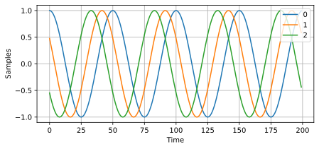

Observez les déphasages entre les éléments, comme prévu (sauf si le signal arrive dans l'axe de visée, auquel cas il atteindra tous les éléments simultanément et il n'y aura pas de déphasage ; fixez θ à 0 pour le constater). Essayez de modifier l'angle et observez le résultat.

Enfin, ajoutons  du bruit à ce  signal reçu, car tout  signal que nous
traiterons  comporte  un  certain  niveau de  bruit.  Nous  souhaitons
appliquer le  bruit après l'application  du vecteur de  direction, car
chaque élément subit un signal de bruit indépendant (cela est possible
car  un signal  AWGN (Arbitrary  White  Gaussion Noise  = Bruit  blanc
gaussien arbitraire) avec déphasage reste un signal AWGN).

.. code-block:: python
 n = np.random.randn(Nr, N) + 1j*np.random.randn(Nr, N)
 X = X + 0.1*n # X et n sont tous les 2 de taille 3x10000

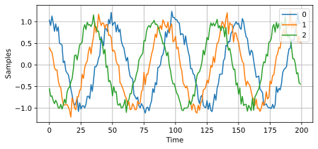

******************************
Formation conventionnelle de faisceaux (conventionnal beamforming) et direction d'arrivée (DOA) 
******************************

Nous  allons   maintenant  traiter  ces  échantillons   :code:`X`,  en supposant que nous ignorons l'angle  d'arrivée, et effectuer le calcul de la direction d'arrivée (DOA). Cette opération consiste à estimer le ou les angles  d'arrivée à l'aide d'un traitement  numérique du signal (DSP) et  d'un peu de code  Python. Comme évoqué précédemment  dans ce chapitre, la  formation de  faisceaux et  le calcul  du DOA  sont très similaires et reposent souvent sur les mêmes techniques. Dans la suite de   ce   chapitre,   nous   étudierons   différents   formateurs   de faisceaux.  Pour   chacun  d'eux,   nous  commencerons  par   le  code mathématique qui calcule les pondérations, :math:`w`. Ces pondérations peuvent être  appliquées  au signal  entrant  :code:`X`  grâce  à la  simple  équation suivante  :  :math:`w^H  X`,  ou, en  Python,  à  :code:`w.conj().T  @ X`.   Dans   l'exemple   ci-dessus,    :code:`X`   est   une   matrice :code:`3x10000`, mais après application des pondérations, il ne reste qu'une matrice :code:`1x10000`, comme si notre récepteur ne possédait qu'une seule antenne. Nous pouvons alors utiliser un DSP RF classique pour traiter le signal. Une fois le formateur de faisceaux développé, nous l'appliquerons au problème du DOA.

Nous  allons  commencer par  l'approche  de  formation de  faisceau  « classique », également appelée formation  de faisceau par sommation et retard. Notre  vecteur de pondération  :code:`w` doit être  un tableau unidimensionnel pour un réseau linéaire  uniforme ; dans notre exemple à trois éléments, :code:`w` est un tableau :code:`3x1` de pondérations complexes.  Avec la  formation  de faisceau  classique, nous  laissons l'amplitude des  pondérations à 1 et  ajustons les phases afin  que le signal  s'additionne  de manière  constructive  dans  la direction  du signal souhaité, que nous appellerons : :math:`\theta`. Il s'avère que c'est exactement le même calcul que celui effectué précédemment : nos pondérations constituent notre vecteur de direction !

.. math::
 w_{conv} = e^{2j \pi d k \sin(\theta)}

ou en Python:

.. code-block:: python
                
 w  =  np.exp(2j *  np.pi  *  d  *  np.arange(Nr) *  np.sin(theta))  # Formation de faisceaux conventionnelle ou à sommation et delai
 X_weighted = w.conj().T @ X # Exemple d'application des pondérations au signal reçu (formation de faisceau)
 print(X_weighted.shape) # 1x10000

où :code:`Nr` est le nombre d'éléments de notre réseau linéaire uniforme  avec un espacement de :code:`d` fractions de longueur d'onde (généralement ~0,5). Comme vous pouvez le constater, les pondérations ne dépendent que de la géométrie du réseau et de l'angle d'intérêt. Si notre réseau nécessitait un étalonnage de phase, nous inclurions également les valeurs d'étalonnage correspondantes. L'équation de :code:`w` vous a peut-être permis de remarquer que les pondérations sont complexes et que leurs magnitudes sont toutes égales à un.

Mais comment déterminer l'angle d'intérêt :code:`theta` ? Il faut commencer par effectuer une analyse de la direction d'arrivée (DOA), qui consiste à balayer (échantillonner) toutes les directions d'arrivée de -π à +π (-180° à +180°), par exemple par incréments de 1°. Pour chaque direction, nous calculons les pondérations à l'aide d'un formateur de faisceau ; nous commencerons par utiliser le formateur de faisceau conventionnel. L'application des pondérations à notre signal :code:`X` nous donne un tableau unidimensionnel d'échantillons, comme si nous l'avions reçu avec une antenne directionnelle. Nous pouvons ensuite calculer la puissance du signal en calculant sa variance avec :code:`np.var()`, et répéter l'opération pour chaque angle de balayage. Nous visualiserons les résultats graphiquement, mais la plupart des logiciels de traitement numérique du signal RF déterminent l'angle de puissance maximale (grâce à un algorithme de détection de pics) et l'appellent l'estimation de la direction d'arrivée (DOA).

.. code-block:: python
                
 theta_scan  =  np.linspace(-1*np.pi,  np.pi,   1000)  #  1000  thetas
 différents compris entre -180 et +180 degrés
 results = []
 for theta_i in theta_scan:
    w =  np.exp(2j * np.pi  * d  * np.arange(Nr) *  np.sin(theta_i)) #
    Conventionnel, c'est à dire délai et addition, beamformer
    X_weighted = w.conj().T @ X # application des poids. rappelez-vous X est 3x10000
    results.append(10*np.log10(np.var(X_weighted)))  #   puissance  du signal, en dB ainsi c'est  plus facile d'observer les lobes petits et grands en même temps
 results -= np.max(results) # normalize (optional)
 
 # affichage de l'angle qui nous donne la valeur maximale
 print(theta_scan[np.argmax(results)] * 180 / np.pi) # 19.99999999999998
 
 plt.plot(theta_scan*180/np.pi, results) # affichons l'angle en degrés
 plt.xlabel("Theta [Degrees]")
 plt.ylabel("DOA Metric")
 plt.grid()
 plt.show()

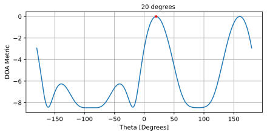

Nous avons trouvé notre signal ! Vous commencez sans doute à comprendre le principe du réseau à balayage électrique. Essayez d'augmenter le niveau de bruit pour pousser le système à ses limites ; il vous faudra peut-être simuler la réception d'un plus grand nombre d'échantillons pour les faibles rapports signal/bruit. Essayez également de modifier la direction d'arrivée.

Si vous préférez visualiser les résultats de la direction d'arrivée sur un diagramme polaire, utilisez le code suivant :

.. code-block:: python
                
 fig, ax = plt.subplots(subplot_kw={'projection': 'polar'})
 ax.plot(theta_scan, results) # SOYEZ SURE D'UTILISEZTO USE RADIAN FOR POLAR
 ax.set_theta_zero_location('N') # Orienter le point 0 degré vers le haut
 ax.set_theta_direction(-1) # Augmenter theta dans le sens horaire
 ax.set_rlabel_position(55) # Déplacement des  étiquettes de la grille
 loin des autres étiquettes.
 plt.show()

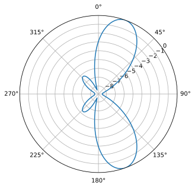

Nous observerons régulièrement ce phénomène de boucle angulaire, nécessitant une méthode de calcul des pondérations de formation de faisceau, puis leur application au signal reçu. Dans la méthode de formation de faisceau suivante (MVDR), nous utiliserons notre signal reçu :code:`X` dans le calcul des pondérations, ce qui en fera une technique adaptative. Mais auparavant, nous examinerons certains phénomènes intéressants liés aux réseaux d'antennes à commande de phase, notamment l'origine de ce second pic à 160 degrés.

*******************
Ambiguïté à 180 degrés
********************

Examinons l'origine de ce second pic à 160 degrés ; la DOA simulée était de 20 degrés, mais le fait que 180 - 20 = 160 n'est pas fortuit. Imaginez trois antennes omnidirectionnelles alignées sur une table. L'axe de visée du réseau est perpendiculaire à celui-ci, comme indiqué sur le premier schéma de ce chapitre. Imaginons maintenant l'émetteur placé devant les antennes, également sur la (très grande) table, de sorte que son signal arrive avec un angle de +20 degrés par rapport à l'axe de visée. Le réseau subit le même effet, que le signal arrive par l'avant ou par l'arrière : le déphasage est identique, comme illustré ci-dessous avec les éléments du réseau en rouge et les deux directions d'arrivée possibles de l'émetteur en vert. Par conséquent, lors de l'exécution de l'algorithme de détermination de la direction d'arrivée (DOA), une ambiguïté de 180 degrés de ce type apparaîtra toujours. La seule solution consiste à utiliser un réseau 2D, ou un second réseau 1D positionné à un angle différent par rapport au premier. Vous vous demandez peut-être si cela signifie qu'il est plus simple de ne calculer que l'intervalle de -90 à +90 degrés afin d'économiser des cycles de calcul, et vous avez tout à fait raison !
            

.. image:: ../_images/doa_from_behind.svg
   :align: center 
   :target: ../_images/doa_from_behind.svg

Essayons de faire varier l'angle d'arrivée (AoA) de -90 à +90 degrés au lieu de le maintenir constant à 20 :

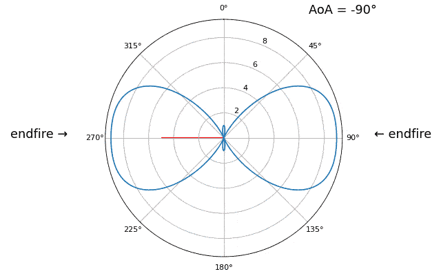
         direction endfire du réseau

À l'approche de l'axe du réseau (lorsque le signal arrive sur ou près de cet axe), les performances diminuent. On observe deux dégradations principales : 1) le lobe principal s'élargit et 2) une ambiguïté apparaît, empêchant de déterminer si le signal provient de la gauche ou de la droite. Cette ambiguïté s'ajoute à l'ambiguïté à 180° évoquée précédemment, où un lobe supplémentaire apparaît à 180° - θ, ce qui peut entraîner, pour certains angles d'arrivée, la présence de trois lobes de taille sensiblement égale. Cette ambiguïté liée à l'axe du réseau est toutefois logique : les déphasages entre les éléments sont identiques, que le signal arrive de la gauche ou de la droite par rapport à l'axe du réseau. Tout comme pour l'ambiguïté à 180°, la solution consiste à utiliser un réseau 2D ou deux réseaux 1D positionnés à des angles différents. En général, la formation de faisceau est optimale lorsque l'angle est proche de l'axe de visée.

À partir  de maintenant, nous n'afficherons  que les degrés -90  à +90 dans nos  graphiques polaires, car  le motif sera  toujours symétrique par rapport à l'axe du réseau,  du moins pour les réseaux linéaires 1D (qui sont tous ceux que nous abordons dans ce chapitre).

*******************
Diagramme de rayonnement
********************

Les graphiques présentés jusqu'à présent correspondent aux résultats de la direction d'arrivée (DOA) ; ils représentent la puissance reçue à chaque angle après application du formateur de faisceau. Ils étaient spécifiques à un scénario où les émetteurs arrivaient de certains angles. Mais nous pouvons également observer le diagramme de rayonnement lui-même, avant toute réception de signal. On parle alors de « diagramme de rayonnement au repos » ou de « réponse du réseau ».

Rappelons que notre vecteur de pointage, que nous voyons régulièrement,

.. code-block:: python
                
   np.exp(2j * np.pi * d * np.arange(Nr) * np.sin(theta))

encapsule la géométrie du réseau linéaire uniforme (ULA), et son seul autre paramètre est la direction de pointage souhaitée. Nous pouvons calculer et tracer le diagramme de rayonnement au repos (réponse du réseau) lorsqu'il est pointé dans une direction donnée, ce qui nous indiquera la réponse naturelle du réseau si nous n'effectuons aucun formage de faisceau supplémentaire. Ceci peut être réalisé en effectuant la FFT des poids complexes conjugués ; aucune boucle n'est nécessaire ! La difficulté réside dans le remplissage pour augmenter la résolution et dans la conversion des intervalles de la sortie FFT en angles en radians ou en degrés, ce qui implique un arcsinus comme vous pouvez le voir dans l'exemple complet ci-dessous :       

.. code-block:: python
                
   Nr = 3
   d = 0.5
   N_fft = 512
   theta_degrees = 20 # il n'y a pas de SOI (Signal d'Intérêt), nous ne traitons pas d'échantillons, il s'agit simplement de la direction vers laquelle nous voulons pointer
   theta = theta_degrees / 180 * np.pi
   w = np.exp(2j * np.pi * d * np.arange(Nr) * np.sin(theta)) # beamformer classique
   w_padded = np.concatenate((w, np.zeros(N_fft - Nr))) # zero padding à N_fft élements pour obtenir une meilleure résolution dans la FFT
   w_fft_dB = 10*np.log10(np.abs(np.fft.fftshift(np.fft.fft(w_padded)))**2) # amplitude de la FFT en dB
   w_fft_dB -= np.max(w_fft_dB) # normalisation à 0 dB au niveau du pic

   # Mapper les bins de la FFT aux angles en radians
   theta_bins = np.arcsin(np.linspace(-1, 1, N_fft)) # in radians
   
   # trouver la valeur maximale afin de l'ajouter au graphique
   theta_max = theta_bins[np.argmax(w_fft_dB)]
   
   fig, ax = plt.subplots(subplot_kw={'projection': 'polar'})
   ax.plot(theta_bins, w_fft_dB) # ASSUREZ-VOUS D'UTILISER LE RADIAN POUR LES POINTS POLAIRES
   ax.plot([theta_max], [np.max(w_fft_dB)],'ro')
   ax.text(theta_max - 0.1, np.max(w_fft_dB) - 4, np.round(theta_max * 180 / np.pi))
   ax.set_theta_zero_location('N') # Orienter le point 0 degré vers le haut
   ax.set_theta_direction(-1) # Augmenter dans le sens horaire
   ax.set_rlabel_position(55)  # Éloignez les étiquettes de la grille des autres étiquettes.
   ax.set_thetamin(-90) # Afficher uniquement la moitié supérieure
   ax.set_thetamax(90)
   ax.set_ylim([-30, 1]) # Comme il n'y a pas de bruit, on ne baisse que de 30 dB
   plt.show()

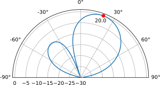

Notez que tous les poids ont une magnitude unitaire (ils restent sur le cercle unité) et que les éléments de numéro le plus élevé « tournent » plus vite. En observant attentivement, vous remarquerez qu'à 0 degré, ils sont tous alignés ; leur déphasage est alors nul (1+0j).

*******************
Largeur du faisceau du réseau
********************

Pour les plus curieux, il existe des équations permettant d'approximer la largeur du faisceau du lobe principal en fonction du nombre d'éléments, bien qu'elles ne soient précises que pour un grand nombre d'éléments (par exemple, 8 ou plus). La largeur du faisceau à mi-puissance (HPBW) est définie comme la largeur à 3 dB en dessous du pic du lobe principal et est approximativement égale à :math:`\frac{0,9 \lambda}{N_rd\cos(\theta)}` [1], ce qui, pour un espacement d'une demi-longueur d'onde, se simplifie à :

.. math::

 \text{HPBW} \approx \frac{1.8}{N_r\cos(\theta)} \text{ [radians]} \qquad \text{lorsque } d = \lambda/2

La première largeur de faisceau nul (FNBW), la largeur du lobe principal d'un point nul à un autre, est approximativement :math:`\frac{2\lambda}{N_rd}` [1], ce qui, pour un espacement d'une demi-longueur d'onde, se simplifie en :

.. math::

 \text{FNBW} \approx \frac{4}{N_r} \text{ [radians]} \qquad \text{lorsque } d = \lambda/2

Utilisons  le   code  précédent,  mais  augmentons   :code:`Nr`  à  16 éléments. D'après  les équations ci-dessus,  la largeur de  faisceau à mi-puissance (HPBW) pour  un angle de 20 degrés  (0,35 radian) devrait être  d'environ  0,12  radian,  soit **6,8  degrés**.  La  largeur  de faisceau au point mort haut (FNBW) devrait être d'environ 0,25 radian, soit  **14,3  degrés**. Effectuons  une  simulation  pour vérifier  la précision  des résultats.  Pour visualiser  les largeurs  de faisceau, nous utilisons  généralement des graphiques rectangulaires  plutôt que polaires.  Les résultats sont présentés ci-dessous, la HPBW est indiquée en vert et la FNBW en rouge :

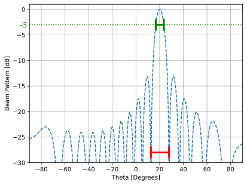

Il est peut-être difficile de le voir sur le graphique, mais en zoomant fortement, on constate que la largeur de bande à mi-puissance (HPBW) est d'environ 6,8 degrés et la largeur de bande à mi-puissance (FNBW) d'environ 15,4 degrés, ce qui est très proche de nos calculs, surtout pour la HPBW !

******************
Quand d n'est pas égal à λ/2
*******************

Jusqu'à présent, nous avons utilisé une distance entre les éléments, d, égale à une demi-longueur d'onde. Par exemple, un réseau conçu pour le Wi-Fi 2,4 GHz avec un espacement de λ/2 aurait un espacement de 3 × 10⁸ / 2,4 × 10⁹ / 2 = 12,5 cm, soit environ 5 pouces. Cela signifie qu'un réseau 4 × 4 éléments aurait des dimensions d'environ 15 pouces × 15 pouces × la hauteur des antennes. Il arrive qu'un réseau ne puisse pas atteindre exactement un espacement de λ/2, par exemple lorsque l'espace est limité ou lorsque le même réseau doit fonctionner sur différentes fréquences porteuses.

Examinons le cas où l'espacement  est supérieur à λ/2, c'est-à-dire un espacement  excessif,  en faisant  varier  d  entre  λ/2 et  4λ.  Nous supprimerons la moitié inférieure du diagramme polaire puisqu'elle est de toute façon l'image miroir de la partie supérieure.

.. image:: ../_images/doa_d_is_large_animation.gif
   :scale: 100 %
   :align: center
   :alt: Animation de la direction d'arrivée (DOA) illustrant ce qui se produit lorsque la distance d est bien supérieure à la moitié de la longueur d'onde

         
Comme vous pouvez le constater, outre l'ambiguïté à 180 degrés évoquée précédemment,  une ambiguïté  supplémentaire  apparaît, qui  s'aggrave lorsque   d  augmente   (apparition   de   lobes  supplémentaires   ou incorrects).  Ces  lobes  supplémentaires, appelés  lobes  de  réseau, résultent du repliement de spectre spatial. Comme nous l'avons vu dans le   chapitre   sur    :ref:`sampling-chapter`,   un   échantillonnage insuffisant entraîne  un repliement de  spectre. Le même  phénomène se produit  dans  le domaine  spatial  :  si  les  éléments ne  sont  pas suffisamment espacés  par rapport  à la  fréquence porteuse  du signal observé, l'analyse aboutit à des  résultats erronés. On peut assimiler l'espacement  des antennes  à  l'espace d'échantillonnage  ! Dans  cet exemple, les lobes de réseau ne posent pas de problème majeur tant que d >  λ, mais  ils apparaissent  dès que  l'espacement dépasse  λ/2. En effet, le  théorème de  Nyquist stipule  qu'il faut  échantillonner au moins  deux  fois   plus  vite  que  le  signal   observé,  soit  deux échantillons  par cycle.  Nous mesurons  notre taux  d'échantillonnage spatial  en  échantillons  par  mètre, et  comme  l'équivalent  de  la fréquence  radiane dans  l'espace est  de 2π/λ  radians par  mètre, et sachant qu'il y  a 2π radians (360 degrés) dans  un cycle, nous devons échantillonner l'espace au moins à :

.. math::

 \text{fréquence d'échantillonnage spatia} \geq 2 \text{ [échantillons/cycle]} \cdot \frac{2\pi/\lambda \text{ [radians/metre]}}{2\pi \text{ [radians/cycle]}}

  \text{fréquence d'échantillonnage spatial} \geq 2/\lambda \text{ [échantillons/metre]}

ou en terme de distance entre les éléments, :math:`d`, ce qui correspond essentiellement à des mètres par échantillon spatial :

.. math::

 d \leq \lambda/2
         
Tant que :math:`d \leq λ/2`, il n'y aura pas de lobes de réseau !

Que se passe-t-il lorsque d est inférieur à λ/2, par exemple lorsqu'il faut intégrer le réseau dans un espace réduit ? On sait qu'il n'y aura pas de lobes de réseau, mais un autre phénomène se produit... Répétons la même simulation en commençant par 0,5λ et en diminuant d.

.. image:: ../_images/doa_d_is_small_animation.gif
    :scale: 100 %
    :align: center
    :alt: Animation de la direction d'arrivée (DOA) montrant ce qui se passe lorsque la distance d est bien inférieure à la moitié de la longueur d'onde.

Bien que le lobe principal s'élargisse lorsque d diminue, il présente toujours un maximum à 20 degrés, et il n'y a pas de lobes de réseau. En théorie, cela fonctionnerait donc (du moins à un rapport signal/bruit élevé et si le couplage mutuel ne devient pas un problème majeur). Pour mieux comprendre ce qui se produit lorsque d devient trop petit, répétons l'expérience en ajoutant un signal supplémentaire provenant de -40 degrés :

.. image:: ../_images/doa_d_is_small_animation2.gif
   :scale: 100 %
   :align: center
   :alt: Animation de la direction d'arrivée (DOA) montrant ce qui se passe lorsque la distance d est bien inférieure à la moitié de la longueur d'onde et que deux signaux sont présents.

En dessous de λ/4, il n'est plus possible de distinguer les deux trajets, et le réseau d'antennes est fortement dégradé. Comme nous le verrons plus loin dans ce chapitre, il existe des techniques de formation de faisceaux plus précises que les techniques conventionnelles, mais maintenir d aussi proche que possible de λ/2 restera un principe fondamental.

..
   COMMENTED OUT BECAUSE IT"S NOT CLEAR WHAT THIS SECTION IS PROVIDING TO THE READER BESIDES AN ALTERNATIVE EQUATION AND TERM WHICH COULD BE PRESENTED A LOT MORE CONCISE
   **********************
   Bartlett Beamformer
   **********************

   Now that we've covered the basics, we will take a quick detour into some notational and algebraic details of what we just did, to gain knowledge on how to mathematically represent sweeping beams across space in a condensed and elegant manner.  The following algebriac notations renders itself well to vectorization, making it suitable for real-time processing.

   The process of sweeping beams across space to get an estimate of DOA actually has a technical name; it goes by "Bartlett Beamforming" (a.k.a. Fourier beamforming to some, but note that Fourier beamforming can also mean a different technique altogether).  Let's do a quick recap of what we did earlier in order to calculate our DOA, using what we now know is called Bartlett beamforming:

   #. We picked a bunch of directions to point at (e.g., -90 to +90 degrees at some interval)
   #. We calculated the beamforming weights at each direction, to point our beam in that direction
   #. The outputs of the array elements were multiplied with their corresponding wieght, and all results were summed
   #. We calculated the signal power at each direction, then plotted the results
   #. Peaks were found, each one inferring that a signal was likely received from that direction

   We are now going to write the series of steps we just reiterated mathematically.  Let the signal received by the array be represented by the steering vector :math:`\mathbf{s}`. This received signal is a function of the direction of arrival (DOA) of the signal, which we will denote as :math:`\theta`. Let the weight applied to the steering vector be represented by :math:`\mathbf{w}`. The output of the array is the dot product of the steering vector and the weight, which we will denote as :math:`\mathbf{w}^{H} \mathbf{s}`.  Now, the power of the received signal can be obtained by squaring the magnitude of the output of the array. This is represented as :math:`\left| \mathbf{w}^{H} \mathbf{s} \right|^{2} = \mathbf{w}^{H} \mathbf{s} \mathbf{s}^{H} \mathbf{w} = \mathbf{w} \mathbf{R_{ss}} \mathbf{w}`, where :math:`\mathbf{R}` is the spatial covariance matrix estimate. The spatial covariance matrix measures the similarity between the samples received from the different elements of the array. We repeat for each direction we want to scan, but note that the only thing that changes between direction is \mathbf{w}.  We are also free to pick the list of directions, it doesn't have to be a -90 to +90 degree sweep, and we can process them all in parallel if we wish, using the same value of :math:`\mathbf{R}` for all.  This is the essence of Bartlett beamforming, i.e the beam sweep that we described using the earlier generated python code.

   .. math::
      P = \left\| \mathbf{w} \mathbf{s}\right\|^2 
      
      = (\mathbf{w}^H\mathbf{s})(\mathbf{w}^H\mathbf{s})^* 
      
      = \mathbf{s}^H\mathbf{w}\mathbf{w}^H\mathbf{s}
      
      = \mathbf{s}^H\mathbf{R}\mathbf{s}

   This mathematical representation extends to other DOA techniques as well.

**********************
Ajustement spatial
**********************

L'ajustement spatial est une  technique utilisée conjointement avec le formateur  de   faisceau  conventionnel.   Elle  consiste   à  ajuster l'amplitude  des   pondérations  pour  obtenir   des  caractéristiques spécifiques.  Même si  vous n'utilisez  pas le  formateur de  faisceau conventionnel,   il   est   important   de   comprendre   le   concept d'ajustement. Rappelons que le calcul des pondérations du formateur de faisceau conventionnel  s'effectuait à  l'aide d'une série  de nombres complexes  dont  l'amplitude  était  égale  à  un.  Avec  l'ajustement spatial, nous multiplions  les pondérations par des  scalaires afin de modifier leur  amplitude. Voyons ce  qui se passe si  nous multiplions les pondérations par des valeurs aléatoires comprises entre 0 et 1 :

.. code-block:: python
    tapering = np.random.uniform(0, 1, Nr) # atténuation aléatoire
    w *= tapering

Nous allons simuler la réception d'un signal dans l'axe de visée (0 degré) avec un rapport signal/bruit élevé afin d'observer le résultat. Notez que ce processus est équivalent et produira les mêmes résultats que la simulation du diagramme de rayonnement d'antenne au repos pour les pondérations données, comme nous l'expliquons à la fin de ce chapitre.

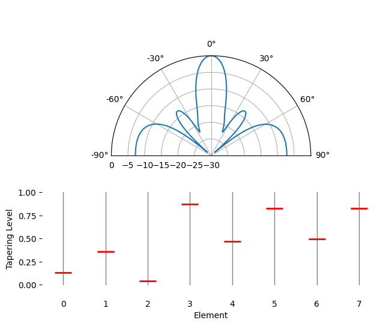

Observez la largeur du lobe principal et la position des zéros.

Il s'avère que l'atténuation permet de réduire les lobes secondaires, ce qui est souvent souhaitable, en diminuant l'amplitude des pondérations aux **bords** du réseau. Par exemple, une fonction fenêtre de Hamming peut être utilisée comme valeur de pondération, comme suit :

.. code-block:: python
    tapering = np.hamming(Nr) # fonction fenêtre Hamming
    w *= tapering

Pour le plaisir, nous allons comparer l'utilisation d'une fenêtre rectangulaire (sans fenêtre) et d'une fenêtre de Hamming comme fonction de pondération :

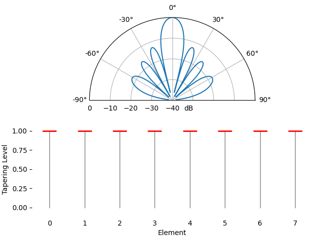

On observe deux différences. Premièrement, la largeur du lobe principal peut être augmentée ou diminuée selon la fonction de pondération utilisée (moins de lobes secondaires entraînent généralement un lobe principal plus large). Une pondération rectangulaire (c'est-à-dire sans pondération) produira le lobe principal le plus étroit, mais les lobes secondaires les plus larges. Deuxièmement, nous constatons que le gain du lobe principal diminue lorsqu'on applique un facteur d'atténuation. Cela s'explique par le fait que l'énergie du signal reçue est moindre, car le gain maximal de tous les éléments n'est pas utilisé. Ce phénomène peut s'avérer très problématique en cas de très faible rapport signal/bruit.

Si vous vous demandez pourquoi on observe autant de lobes secondaires avec une fenêtre rectangulaire (sans facteur d'atténuation), c'est pour la même raison qu'une fenêtre rectangulaire dans le domaine temporel induit une fuite spectrale dans le domaine fréquentiel. La transformée de Fourier d'une fenêtre rectangulaire est une fonction sinus cardinal, :math:`sin(x)/x`, dont les lobes secondaires tendent vers l'infini. Avec les réseaux d'antennes, l'échantillonnage est effectué dans le domaine spatial, et le diagramme de rayonnement est la transformée de Fourier de cet échantillonnage spatial, pondérée par les facteurs. C'est pourquoi nous avons pu visualiser le diagramme de rayonnement à l'aide d'une FFT plus tôt dans ce chapitre. Rappelons que dans la section consacrée au fenêtrage du chapitre sur le domaine fréquentiel, nous avons comparé la réponse fréquentielle de chaque type de fenêtre :

.. image:: ../_images/windows.svg
   :align: center 
   :target: ../_images/windows.svg

******************************
Modification manuelle des pondérations
******************************

Le formateur de faisceau classique nous fournit une équation pour calculer les pondérations afin de pointer dans une direction spécifique. Mais imaginons un instant que nous n'ayons aucune méthode de calcul des pondérations et que nous les modifions manuellement (amplitude et phase) pour observer les résultats. Ci-dessous se trouve une petite application écrite en JavaScript qui simule le diagramme de rayonnement d'un réseau à 8 éléments, avec des curseurs pour contrôler le gain et la phase de chaque élément. Vous pouvez essayer d'ajouter un effet de transition ou de simuler moins de 8 éléments en annulant l'amplitude d'un ou plusieurs d'entre eux.

.. raw:: html

    
<!-- Plotly chart will be drawn inside this DIV -->

     
    Element &nbsp;&nbsp;&nbsp; Magnitude (Gain) &nbsp;&nbsp;&nbsp;&nbsp;&nbsp;&nbsp;&nbsp;&nbsp;&nbsp;&nbsp;&nbsp;&nbsp;&nbsp;&nbsp;&nbsp;&nbsp; Phase
    

    
    

**********************
Formation de faisceaux adaptative
**********************

Le formateur de faisceaux conventionnel présenté précédemment est une méthode simple et efficace, mais il présente certaines limitations. Par exemple, il est peu performant en présence de plusieurs signaux provenant de directions différentes ou lorsque le niveau de bruit est élevé. Dans ces cas, il est nécessaire d'utiliser des techniques de formation de faisceaux plus avancées, souvent qualifiées de « adaptatives ». Le principe de la formation de faisceaux adaptative est d'utiliser le signal reçu pour calculer les pondérations, au lieu d'utiliser un ensemble fixe de pondérations comme avec le formateur de faisceaux conventionnel. Cela permet au formateur de faisceaux de s'adapter à l'environnement et d'offrir de meilleures performances, car les pondérations sont désormais basées sur les statistiques des données reçues.

Les techniques de formation de faisceaux adaptatives se divisent en deux catégories : les méthodes classiques et les méthodes basées sur les sous-espaces. Les méthodes de sous-espaces telles que MUSIC et ESPRIT sont très puissantes, mais elles nécessitent d'estimer le nombre de signaux présents et requièrent au moins trois éléments pour fonctionner (quatre étant recommandés).

La première technique de formation de faisceaux adaptatifs que nous allons étudier est MVDR, qui tend à être l'algorithme de référence lorsque l'on parle de formation de faisceaux adaptatifs.

**********************
Formateur de faisceau MVDR/Capon
**********************

Nous allons maintenant examiner un formateur de faisceau légèrement plus complexe que la technique conventionnelle de sommation et de retard, mais généralement beaucoup plus performant : le formateur de faisceau à réponse sans distorsion à variance minimale (MVDR), également appelé formateur de faisceau Capon. Rappelons que la variance d'un signal correspond à sa puissance. Le principe du MVDR est de maintenir le signal à l'angle d'intérêt avec un gain fixe de 1 (0 dB), tout en minimisant la variance/puissance totale du signal formé. Si le signal d'intérêt est maintenu fixe, minimiser la puissance totale revient à minimiser autant que possible les interférences et le bruit. On le qualifie souvent de formateur de faisceau « statistiquement optimal ».

Le formateur de faisceau MVDR/Capon peut être résumé par l'équation suivante :

.. math::
   w_{mvdr} = \frac{R^{-1} s}{s^H R^{-1} s}

Le vecteur :math:`s` est le vecteur de direction correspondant à la direction souhaitée et a été présenté au début de ce chapitre. :math:`R` est l'estimation de la matrice de covariance spatiale basée sur nos échantillons reçus, obtenue à l'aide de :math:`R = np.cov(X)` ou calculée manuellement en multipliant :math:`X` par sa transposée conjuguée complexe, c'est-à-dire :math:`R = X X^H`. La matrice de covariance spatiale est une matrice de taille :math:`Nr` x :math:`Nr` (3x3 dans les exemples précédents) qui indique la similarité des échantillons reçus des trois éléments. Bien que cette équation puisse paraître complexe au premier abord, il est utile de savoir que le dénominateur sert principalement à la mise à l'échelle, et que le numérateur, qui correspond à la matrice de covariance inversée multipliée par le vecteur de direction, est l'élément essentiel sur lequel il faut se concentrer. Cela étant dit, il est nécessaire d'inclure le dénominateur ; il agit comme une constante de normalisation afin que, lorsque :math:`R` varie au fil du temps, les poids conservent leur amplitude.

.. raw:: html
   

   
Pour ceux qui s'intéressent à la dérivation du MVDR, voir le développement suivant :

**Sortie du beamforming** - La sortie du beamformer utilisant un vecteur de pondération :math:`\mathbf{w}` est donnée par :
   
.. math::
 y(t) = \mathbf{w}^H \mathbf{x}(t)

**Problème d'optimisation** - L'objectif est de déterminer les pondérations du beamforming qui minimisent la puissance de sortie tout en assurant une réponse sans distorsion dans la direction souhaitée :math:`\theta_0`. Formellement, le problème peut être exprimé comme suit :

.. math::

 \min_{\mathbf{w}} \, \mathbf{w}^H \mathbf{R} \mathbf{w} \quad \text{subject to} \quad \mathbf{w}^H \mathbf{s} = 1

où :

* :math:`\mathbf{R} = E[\mathbf{X}\mathbf{X}^H]` est la matrice de covariance des signaux reçus
* :math:`\mathbf{s}` est le vecteur de direction vers la direction du signal souhaité :math:`\theta_0`

**Méthode Lagrangienne** - Introduisons un multiplieur lagrangien :math:`\lambda` et construisons le lagrangien :

.. math::

 L(\mathbf{w}, \lambda) = \mathbf{w}^H \mathbf{R} \mathbf{w} - \lambda (\mathbf{w}^H \mathbf{s} - 1)

**Résolution de l'optimisation** - En dérivant le lagrangien par rapport à :math:`\mathbf{w^H}` et en annulant la dérivée, on obtient :

.. math::

 \frac{\partial L}{\partial \mathbf{w}^*} = 2\mathbf{R}\mathbf{w} - \lambda \mathbf{s} = 0

 \mathbf{w} = \lambda \mathbf{s} \mathbf{{R^{-1}}}

Pour résoudre :math:`\lambda`, appliquons la contrainte :math:`\mathbf{w}^H \mathbf{s} = 1`:

.. math::

 \implies (\lambda \mathbf{s^{H}}\mathbf{{R^{-1}}})s = 1

 \implies \lambda = \frac{1}{\mathbf{s}^{H}\mathbf{R}^{-1}\mathbf{s}}
 
 \mathbf{R}\mathbf{w} = \lambda \mathbf{s}
 
 \mathbf{w_{mvdr}} = \frac{\mathbf{R}^{-1} \mathbf{s}}{\mathbf{s}^H \mathbf{R}^{-1} \mathbf{s}}

.. raw:: html
   

   Si la direction du signal d'intérêt est connue et reste constante, il suffit de calculer les pondérations une seule fois et de les utiliser pour recevoir ce signal. Même si la direction est constante, il est avantageux de recalculer périodiquement ces pondérations pour compenser les variations d'interférences et de bruit. C'est pourquoi on parle de formation de faisceaux « adaptative » pour ces formateurs de faisceaux numériques non conventionnels : ils utilisent les informations du signal reçu pour calculer les pondérations optimales. Pour rappel, la formation de faisceaux avec MVDR peut se faire en calculant ces pondérations et en les appliquant au signal avec :code:`w.conj().T @ X`, comme avec la méthode conventionnelle. Seule la méthode de calcul des pondérations diffère.

Pour effectuer une détermination de la direction d'arrivée (DOA) avec le formateur de faisceaux MVDR, il suffit de répéter le calcul MVDR en balayant tous les angles d'intérêt. Autrement dit, on considère que le signal provient de l'angle :math:`\theta`, même si ce n'est pas le cas. Pour chaque angle, nous calculons les pondérations MVDR, puis nous les appliquons au signal reçu, et enfin nous calculons la puissance du signal. L'angle qui nous donne la puissance la plus élevée correspond à notre estimation de la direction d'arrivée (DOA). Mieux encore, nous pouvons tracer la puissance en fonction de l'angle pour visualiser le diagramme de rayonnement, comme nous l'avons fait précédemment avec le formateur de faisceau conventionnel. Ainsi, nous n'avons pas besoin de supposer le nombre de signaux présents.

En Python, nous pouvons implémenter le formateur de faisceau MVDR/Capon comme suit, sous forme de fonction pour faciliter son utilisation ultérieure :

.. code-block:: python

   # theta est la direction d'intérêt, en radians, et X est notre signal reçu
   def w_mvdr(theta, X):
                s = np.exp(2j * np.pi * d * np.arange(Nr) * np.sin(theta)) # Vecteur de direction dans la direction souhaitée theta
                s = s.reshape(-1,1) # Transformation en vecteur colonne (taille 3x1)
                R = (X @ X.conj().T)/X.shape[1] # Calcul de la matrice de covariance. Donne une matrice de covariance Nr x Nr des échantillons
                Rinv = np.linalg.pinv(R) # 3x3. La pseudo-inverse est généralement plus performante/rapide qu'une véritable inverse.
                w = (Rinv @ s)/(s.conj().T @ Rinv @ s) # Équation MVDR/Capon ! Le numérateur est de dimension 3x3 * 3x1, le dénominateur de dimension 1x3 * 3x3 * 3x1, ce qui donne un vecteur de pondération 3x1.
                return w

En utilisant ce formateur de faisceau MVDR dans le contexte de la DOA, on obtient l'exemple Python suivant :

.. code-block:: python

   theta_scan = np.linspace(-1*np.pi, np.pi, 1000) # 1000 valeurs de theta différentes entre -180 et +180 degrés
   results = []
   for theta_i in theta_scan:
                w = w_mvdr(theta_i, X) # 3x1
                X_weighted = w.conj().T @ X # application des pondérations
                power_dB = 10*np.log10(np.var(X_weighted)) # puissance du signal, en dB, pour faciliter la visualisation simultanée des lobes de petite et de grande taille
                results.append(power_dB)
   results -= np.max(results) # normalisation

   
Appliquée à l'exemple de simulation DOA précédent, cette méthode donne le résultat suivant :

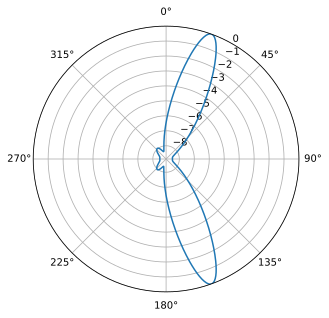

Cela semble fonctionner correctement, mais pour comparer cette technique à d'autres, il nous faut créer un problème plus intéressant. Créons une simulation avec un réseau de 8 éléments recevant trois signaux provenant d'angles différents : 20°, 25° et 40°. Le signal à 40° est reçu à une puissance bien inférieure aux deux autres, afin de complexifier la simulation. Notre objectif est de détecter les trois signaux, c'est-à-dire de repérer des pics significatifs (suffisamment élevés pour être extraits par un algorithme de détection de pics). Le code permettant de générer ce nouveau scénario est le suivant :

.. code-block:: python
                
   Nr = 8 # 8 éléments
   theta1 = 20 / 180 * np.pi # conversion en radians
   theta2 = 25 / 180 * np.pi
   theta3 = -40 / 180 * np.pi
   s1 = np.exp(2j * np.pi * d * np.arange(Nr) * np.sin(theta1)).reshape(-1,1) # 8x1
   s2 = np.exp(2j * np.pi * d * np.arange(Nr) * np.sin(theta2)).reshape(-1,1)
   s3 = np.exp(2j * np.pi * d * np.arange(Nr) * np.sin(theta3)).reshape(-1,1)
   # Nous utiliserons 3 fréquences différentes. 1xN
   tonalité1 = np.exp(2j*np.pi*0.01e6*t).reshape(1,-1)
   tonalité2 = np.exp(2j*np.pi*0.02e6*t).reshape(1,-1)
   tonalité3 = np.exp(2j*np.pi*0.03e6*t).reshape(1,-1)
   X = s1@tone1 + s2@tone2 + 0.1 * s3@tone3 # notez que la dernière valeur représente 1/10e de la puissance
   n = np.random.randn(Nr, N) + 1j*np.random.randn(Nr, N)
   X = X + 0.05*n # 8xN

Vous pouvez placer ce code en haut de votre script, car nous générons un signal différent de celui de l'exemple original. Si nous appliquons notre formateur de faisceau MVDR à ce nouveau scénario, nous obtenons les résultats suivants :

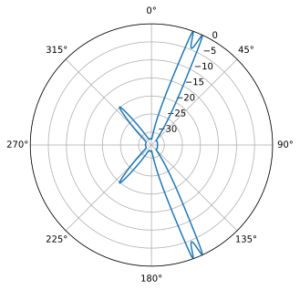

Il fonctionne plutôt bien : nous pouvons observer les deux signaux reçus, séparés de seulement 5 degrés, ainsi que le troisième signal (à -40° ou 320°) reçu à une puissance dix fois inférieure à celle des autres. Appliquons maintenant le formateur de faisceau conventionnel à ce même scénario :

Bien que la forme du faisceau soit plutôt esthétique, il ne détecte pas du tout les trois signaux… En comparant ces deux résultats, nous pouvons constater l’avantage.

Pour information, il est possible d'optimiser le calcul de la DOA avec MVDR grâce à une astuce. Rappelons que la puissance d'un signal est calculée en prenant sa variance, qui est la moyenne du carré de son amplitude (en supposant que la valeur moyenne de nos signaux est nulle, ce qui est presque toujours le cas pour les signaux RF en bande de base). On peut représenter la puissance de notre signal après pondération par l'équation suivante :

.. math::
   
   P_{mvdr} = \frac{1}{N} \sum_{n=0}^{N-1} \left| w^H_{mvdr} r_n \right|^2

Si l'on remplace la sommation par l'opérateur d'espérance et que l'on substitue l'équation des poids MVDR, on obtient :

.. math::
   
   P_{mvdr} & = E \left( \left| w^H_{mvdr} X_n \right| ^2 \right) \\
            & = w^H_{mvdr} E \left( X X^H \right) w_{mvdr}\\
            & = w^H_{mvdr} R w_{mvdr}\\
            & = \frac{s^H R^{-1} s}{s^H R^{-1} s} \cdot R \cdot \frac{R^{-1} s}{s^H R^{-1} s}\\
            & = \frac{s^H R^{-1} s}{(s^H R^{-1} s)(s^H) R^{-1} s)}\\
            & = \frac{1}{s^H R^{-1} s}

Ce qui signifie que nous n'avons pas besoin d'appliquer les pondérations. Cette dernière équation de puissance ci-dessus peut être utilisée directement dans notre analyse DOA, ce qui nous permet d'économiser des calculs :

.. code-block:: python
    def power_mvdr(theta, X):
                s = np.exp(2j * np.pi * d * np.arange(r.shape[0]) * np.sin(theta)) # vecteur de direction dans la direction souhaitée theta
                s = s.reshape(-1,1) # transformation en vecteur colonne (taille 3x1)
                R = (X @ X.conj().T)/X.shape[1] # Calcul de la matrice de covariance. Donne une matrice de covariance Nr x Nr des échantillons
                Rinv = np.linalg.pinv(R) # 3x3. La pseudo-inverse est généralement plus performante que l'inverse exacte.
                return 1/(s.conj().T @ Rinv @ s).squeeze()

Pour utiliser cette fonction dans la simulation précédente, au sein de la boucle for, il suffit d'effectuer le calcul suivant :code:`10*np.log10()`. C'est terminé ! Aucun poids n'est à appliquer ; nous avons omis de les calculer.

Il existe de nombreux autres formateurs de faisceaux, mais nous allons maintenant examiner l'influence du nombre d'éléments sur la formation de faisceaux et la détermination de la direction d'arrivée (DOA).

*********************
Matrice de covariance
**********************
   
Prenons un instant pour aborder la matrice de covariance spatiale, concept clé du *beamforming adaptatif*. Une matrice de covariance est une représentation mathématique de la similarité entre paires d'éléments d'un vecteur aléatoire (dans notre cas, les éléments de notre réseau, d'où le terme de matrice de covariance *spatiale*). Une matrice de covariance est toujours carrée, et les valeurs de sa diagonale correspondent à la covariance de chaque élément avec lui-même. Nous calculons une estimation de la matrice de covariance spatiale ; il ne s'agit que d'une estimation, compte tenu du nombre limité d'échantillons.

De manière générale, la matrice de covariance est définie comme suit :
:math:`\mathrm{cov}(X) = E \left[ (X - E[X])(X - E[X])^H \right]`

for wireless signals at baseband, :math:`E[X]` is typically zero or very close to zero, so this simplifies to:

:math:`\mathrm{cov}(X) = E[X X^H]`

Given a limited number of IQ samples, :math:`\boldsymbol{X}`, we can estimate this covariance, which we will denote as :math:`\hat{R}`:

.. math::
   \hat{R} = \frac{\boldsymbol{X} \boldsymbol{X}^H}{N}
           = \frac{1}{N} \sum^N_{n=1} X_n X_n^H

where :math:`N` is the number of samples (not the number of elements).  In Python this looks like:

:code:`R = (X @ X.conj().T)/X.shape[1]`

Alternatively, we can use the built-in NumPy function:

:code:`R = np.cov(X)`
    
As an example, we will look at the spatial covariance matrix for the scenario where we only had one transmitter and three elements:

.. code-block:: python

   [[ 1.494+0.j    0.486+0.881j -0.543+0.839j]
    [ 0.486-0.881j 1.517 +0.j    0.483+0.886j]
    [-0.543-0.839j 0.483-0.886j  1.499+0.j   ]]

Remarquez que les éléments diagonaux sont réels et sensiblement identiques. En effet, ils indiquent uniquement la puissance du signal reçu à chaque élément, qui sera sensiblement la même d'un élément à l'autre puisque leur gain est identique. Les éléments hors diagonale contiennent les valeurs importantes, même si l'examen des valeurs brutes ne nous apprend pas grand-chose, si ce n'est une forte corrélation entre les éléments.

Dans le cadre de la formation de faisceaux adaptative, vous observerez un motif où l'on calcule l'inverse de la matrice de corrélation spatiale. Cette inverse indique la relation entre deux éléments après avoir éliminé l'influence des autres éléments. On l'appelle « matrice de précision » en statistiques et « matrice de blanchiment » en radar.

*********************
Formateur de faisceaux LCMV
**********************

Bien que le MVDR soit puissant, que se passe-t-il si nous avons plusieurs signaux d'intérêts (SOI) ? Heureusement, grâce à une légère modification du MVDR, nous pouvons implémenter un schéma gérant plusieurs SOI, appelé formateur de faisceau à variance minimale contrainte linéaire (LCMV). Il s'agit d'une généralisation du MVDR, où l'on spécifie la réponse souhaitée pour plusieurs directions, un peu comme une version spatiale de la fonction `firwin2()` de SciPy pour ceux qui la connaissent. Le vecteur de pondération optimal pour le formateur de faisceau LCMV peut être résumé par l'équation suivante :

.. math::
    w_{lcmv} = R^{-1} C [C^H R^{-1} C]^{-1} f

où :math:`C` est une matrice comprenant les vecteurs de direction des SOI et des interférents correspondants, et :math:`f` est le vecteur de réponse souhaité. Le vecteur :math:`f` d'une ligne donnée prend la valeur 0 lorsque le vecteur de direction correspondant doit être annulé, et la valeur 1 lorsqu'un faisceau doit être dirigé vers cette ligne. Par exemple, avec deux sources d'intérêt et deux sources d'interférence, on peut définir :math:`f = [1,1,0,0]`. Le formateur de faisceaux LCMV est un outil puissant permettant de supprimer les interférences et le bruit provenant de plusieurs directions, tout en amplifiant le signal d'intérêt provenant également de plusieurs directions. Cependant, le nombre total d'annulations et de faisceaux pouvant être formés simultanément est limité par la taille du réseau (le nombre d'éléments). De plus, il est nécessaire de définir le vecteur de direction pour chaque source d'intérêt et chaque interféreur, ce qui n'est pas toujours possible en pratique. L'utilisation d'estimations peut dégrader les performances du formateur de faisceaux LCMV. C'est pourquoi nous préférons orienter les zones d'interférence nulle (ou « nulls ») à l'aide de la matrice de covariance spatiale :math:`R` (basée sur les statistiques du signal reçu), plutôt que de les « coder en dur » en estimant l'angle d'arrivée (AoA) de l'interférent (ce qui peut engendrer des erreurs) et en construisant le vecteur de direction dans cette direction, en ajoutant un 0 à :math:`f`.

L'implémentation de LCMV en Python est très similaire à celle de MVDR, mais nous devons spécifier :math:`C`, composé de plusieurs vecteurs de direction potentiels, et :math:`f`, un tableau unidimensionnel de 1 et de 0, comme mentionné précédemment. L'extrait de code suivant illustre l'implémentation du formateur de faisceau LCMV pour deux angles d'incidence (15° et 60°). Rappelons que MVDR ne prend en charge qu'un seul angle d'incidence à la fois. Par conséquent, notre :math:`f` est initialisé à :math:`[1; 1]` sans zéros, car nous n'incluons aucune zone d'interférence nulle « codée en dur ». Nous allons simuler un scénario avec quatre interférents arrivant d'angles de -60, -30, 0 et 30 degrés.

.. code-block:: python

   # Pointons vers le SOI à 15° et un autre SOI potentiel, non simulé, à 60°.
   soi1_theta = 15 / 180 * np.pi # Conversion en radians
   soi2_theta = 60 / 180 * np.pi
   # Poids LCMV
   R_inv = np.linalg.pinv(np.cov(X)) # 8x8
   s1 = np.exp(2j * np.pi * d * np.arange(Nr) * np.sin(soi1_theta)).reshape(-1,1) # 8x1
   s2 = np.exp(2j * np.pi * d * np.arange(Nr) * np.sin(soi2_theta)).reshape(-1,1) # 8x1
   C = np.concatenate((s1, s2), axis=1) # 8x2
   f = np.ones(2).reshape(-1,1) # 2x1

   # Équation LCMV
   # 8x8 8x2 2x8 8x8 8x2 2x1
   w = R_inv @ C @ np.linalg.pinv(C.conj().T @ R_inv @ C) @ f # Sortie : 8x1

Nous pouvons tracer le diagramme de rayonnement de :code:`w` à l'aide de la méthode FFT présentée précédemment :

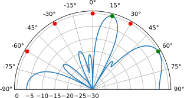

Comme vous pouvez le constater, nous avons des faisceaux pointant dans les deux directions d'intérêt. Des points nuls sont ajoutés aux emplacements des interférents (comme pour le MVDR, il n'est pas nécessaire de spécifier la position des émetteurs ; le logiciel la détermine à partir du signal reçu). Des points verts et rouges sont ajoutés au graphique pour indiquer les angles d'arrivée (AoA) des SOI et des interférents, respectivement.

.. raw:: html
   

   
Pour le code complet, développez cette section

.. code-block:: python
                
    # Simulation du signal reçu
    Nr = 8 # 8 éléments
    theta1 = -60 / 180 * np.pi # Conversion en radians
    theta2 = -30 / 180 * np.pi
    theta3 = 0 / 180 * np.pi
    theta4 = 30 / 180 * np.pi
    s1 = np.exp(2j * np.pi * d * np.arange(Nr) * np.sin(the)
    s2 = np.exp(2j * np.pi * d * np.arange(Nr) * np.sin(theta2)).reshape(-1,1)
    s3 = np.exp(2j * np.pi * d * np.arange(Nr) * np.sin(theta3)).reshape(-1,1)
    s4 = np.exp(2j * np.pi * d * np.arange(Nr) * np.sin(theta4)).reshape(-1,1)
    # we'll use 3 different frequencies.  1xN
    tone1 = np.exp(2j*np.pi*0.01e6*t).reshape(1,-1)
    tone2 = np.exp(2j*np.pi*0.02e6*t).reshape(1,-1)
    tone3 = np.exp(2j*np.pi*0.03e6*t).reshape(1,-1)
    tone4 = np.exp(2j*np.pi*0.04e6*t).reshape(1,-1)
    X = s1 @ tone1 + s2 @ tone2 + s3 @ tone3 + s4 @ tone4
    n = np.random.randn(Nr, N) + 1j*np.random.randn(Nr, N)
    X = X + 0.5*n # 8xN

    # Prenons comme exemples le SOI à 15 degrés, et un autre SOI potentiel que nous n'avons pas simulé à 60 degrés.
    soi1_theta = 15 / 180 * np.pi # conversion en radians
    soi2_theta = 60 / 180 * np.pi

    # Poids du LCMV
    R_inv = np.linalg.pinv(np.cov(X)) # 8x8
    s1 = np.exp(2j * np.pi * d * np.arange(Nr) * np.sin(soi1_theta)).reshape(-1,1) # 8x1
    s2 = np.exp(2j * np.pi * d * np.arange(Nr) * np.sin(soi2_theta)).reshape(-1,1) # 8x1
    C = np.concatenate((s1, s2), axis=1) # 8x2
    f = np.ones(2).reshape(-1,1) # 2x1

    # Équation du LCMV
    #    8x8   8x2                    2x8        8x8   8x2  2x1
    w = R_inv @ C @ np.linalg.pinv(C.conj().T @ R_inv @ C) @ f # la sortie est 8x1

    # Tracé du diagramme de rayonnement
    w = w.squeeze() # reduction à un tableau 1D
    N_fft = 1024
    w_padded = np.concatenate((w, np.zeros(N_fft - Nr))) # zero pad à N_fft éléments pour obtenir un meilleur résolution dans la FFT
    w_fft_dB = 10*np.log10(np.abs(np.fft.fftshift(np.fft.fft(w_padded)))**2) # amplitude de la FFT en dB
    w_fft_dB -= np.max(w_fft_dB) # normalisation à 0 dB au maximum
    theta_bins = np.arcsin(np.linspace(-1, 1, N_fft)) #  Associer les échantillons de la FFT à des angles en radians
    fig, ax = plt.subplots(subplot_kw={'projection': 'polar'})
    ax.plot(theta_bins, w_fft_dB) # MAKE SURE TO USE RADIAN FOR POLAR
    # Add dots where interferers and SOIs are
    ax.plot([theta1], [0], 'or')
    ax.plot([theta2], [0], 'or')
    ax.plot([theta3], [0], 'or')
    ax.plot([theta4], [0], 'or')
    ax.plot([soi1_theta], [0], 'og')
    ax.plot([soi2_theta], [0], 'og')
    ax.set_theta_zero_location('N') # Orienter 0 degré vers le haut
    ax.set_theta_direction(-1) # Incrémenter dans le sens horaire
    ax.set_thetagrids(np.arange(-90, 105, 15)) # c'est en degrés
    ax.set_rlabel_position(55)  #  Éloigner les étiquettes de la grille des autres étiquettes
    ax.set_thetamin(-90) # Afficher uniquement la moitié supérieure
    ax.set_thetamax(90)
    ax.set_ylim([-30, 1]) # En l'absence de bruit, réduire de 30 dB seulement
    plt.show()

.. raw:: html

   

Il existe un cas d'utilisation particulier de LCMV auquel vous avez peut-être déjà pensé : supposons qu'au lieu de pointer le faisceau principal à exactement 20 degrés, vous souhaitiez un faisceau plus large que celui fourni par un formateur de faisceau classique. Pour ce faire, définissez le vecteur de réponse souhaité :code:`f` comme un vecteur de 1 sur une plage d'angles (par exemple, plusieurs valeurs entre 10 et 30 degrés) et de 0 ailleurs. Cet outil puissant permet de créer un diagramme de rayonnement plus large que le lobe principal d'un formateur de faisceau classique, ce qui est toujours un avantage dans les situations réelles où l'angle d'arrivée exact est inconnu. La même approche peut être utilisée pour créer un zéro dans une direction spécifique, réparti sur une plage d'angles relativement large. N'oubliez pas que cela nécessite plusieurs degrés de liberté ! À titre d'exemple, simulons un réseau de 18 éléments et définissons l'angle d'intérêt entre 15 et 30 degrés à l'aide de 4 valeurs différentes de θ, et un angle nul entre 45 et 60 degrés à l'aide de 4 autres valeurs différentes de θ. Nous ne simulerons aucun interférent réel.

.. code-block:: python

    Nr = 18
    X = np.random.randn(Nr, N) + 1j*np.random.randn(Nr, N) # Simulation d'un signal reçu composé uniquement de bruit.

    # Poitons vers le SOI de 15 à 30 degrés en utilisant 4 thetas différents
    soi_thetas = np.linspace(15, 30, 4) / 180 * np.pi # conversio en radians

    # Let's make a null from 45 to 60 degrees using 4 different thetas
    null_thetas = np.linspace(45, 60, 4) / 180 * np.pi # convert to radians

    # poids LCMV
    R_inv = np.linalg.pinv(np.cov(X))
    s = []
    for soi_theta in soi_thetas:
        s.append(np.exp(2j * np.pi * d * np.arange(Nr) * np.sin(soi_theta)).reshape(-1,1))
    for null_theta in null_thetas:
        s.append(np.exp(2j * np.pi * d * np.arange(Nr) * np.sin(null_theta)).reshape(-1,1))
    C = np.concatenate(s, axis=1)
    f = np.asarray([1]*len(soi_thetas) + [0]*len(null_thetas)).reshape(-1,1)
    w = R_inv @ C @ np.linalg.pinv(C.conj().T @ R_inv @ C) @ f # LCMV equation

    # Tracé du diagramme de rayonnement comme précédemment...

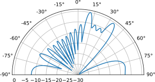

Le faisceau et le point d'annulation sont répartis sur la plage demandée ! Essayez de modifier le nombre de θ pour le faisceau principal et/ou le point d'annulation, ainsi que le nombre d'éléments, afin de vérifier si les pondérations résultantes permettent d'obtenir la réponse souhaitée.

******************
Orientation du point d'annulation
*******************

Maintenant que nous avons vu le LCMV, il est intéressant d'explorer une technique plus simple, utilisable avec les réseaux analogiques et numériques : l'orientation du point d'annulation. Il s'agit d'une extension du formateur de faisceau classique, permettant non seulement de diriger un faisceau dans la direction souhaitée, mais aussi de placer des points d'annulation à des angles spécifiques. Cette technique n'implique pas de modification des pondérations en fonction du signal reçu (par exemple, le coefficient de réflexion :code:`R` n'est jamais calculé) et n'est donc pas considérée comme adaptative. Dans la simulation ci-dessous, il n'est même pas nécessaire de simuler un signal : il suffit de paramétrer les poids de notre formateur de faisceau en utilisant la technique de suppression des zéros pour placer des zéros à des angles prédéfinis, puis de visualiser le diagramme de rayonnement.

Les poids pour la suppression des zéros sont calculés en partant d'un formateur de faisceau conventionnel pointé dans la direction souhaitée, puis en utilisant l'équation d'annulation des lobes secondaires pour mettre à jour les poids afin d'inclure les zéros, un à un. L'équation d'annulation des lobes secondaires est :

.. math::

 w_{\text{new}} = w_{\text{orig}} - \frac{w_{\text{null}}^H w_{\text{orig}}}{w_{\text{null}}^H w_{\text{null}}} w_{\text{null}}

   

Notez que nous obtenons toujours des zéros provenant de A et B (le zéro de B est plus faible, mais B correspond également à un signal plus faible), mais cette fois-ci, un lobe principal important est dirigé vers notre angle d'intérêt, C. C'est là toute la puissance des données d'apprentissage, et pourquoi elles sont si importantes dans les applications radar.

******************************
Simulation d'interférences à large bande
*******************************

La méthode que nous avons utilisée tout au long de ce chapitre pour simuler les signaux atteignant notre réseau depuis un certain angle d'arrivée (en multipliant le vecteur de direction par le signal émis) repose sur une hypothèse de bande étroite : le signal est supposé avoir une seule fréquence, et le vecteur de direction est calculé à cette fréquence. Cette approximation est acceptable pour de nombreux signaux, mais elle ne convient pas aux signaux à large bande, par exemple ceux dont la bande passante est supérieure à environ 5 % de la fréquence centrale. Nous aborderons brièvement une astuce permettant de simuler du **bruit** à large bande provenant d'une direction donnée (par exemple, un brouillage par barrage provenant d'un seul angle d'arrivée).

Cette méthode fonctionne en construisant une matrice de covariance :code:`R` obtenue en sommant les contributions de chaque source de bruit à large bande. La matrice racine carrée :code:`A` est ensuite calculée, et l'ensemble d'échantillons :code:`X` est généré en « colorant » un bruit gaussien complexe standard avec :code:`A`. Un paramètre clé est :code:`fractional_bw`, qui correspond à la bande passante du signal de bruit divisée par sa fréquence centrale. Lorsque :code:`fractional_bw` = 0, le code suivant devrait reproduire le même résultat que la méthode traditionnelle de simulation des signaux reçus. Le code Python ci-dessous peut être intégré aux exemples précédents pour simuler le signal reçu :code:`X`.

.. code-block:: python

 N = 10 # Nombre d'éléments dans le réseau linéaire uniforme (ULA)
 num_samples = 10000
 d = 0.5
 num_jammers = 3
 jammer_pow_dB = np.array([30, 30, 30]) # Puissances des brouilleurs en dB
 jammer_aoa_deg = np.array([-70, -20, 40]) # Angles des brouilleurs en degrés
 jammer_aoa = np.sin(np.deg2rad(jammer_aoa_deg)) * np.pi
 element_gain_dB = np.zeros(N) # Gains en dB pour les éléments du réseau (tous à 0 dB dans notre cas)
 element_gain_linear = 10.0 ** (element_gain_dB / 10) # Conversion des gains du réseau en valeurs linéaires
 fractional_bw = 0.1 # si ceci Si la valeur est 0, la méthode correspond à la méthode traditionnelle utilisant le facteur de réseau pour simuler les signaux reçus.
 # Construction de la matrice de covariance NxN du brouilleur R
 R = np.zeros((N, N), dtype=complex)
 for m in range(N):
     for n in range(N):
         for j in range(num_jammers):
             total_element_gain = np.sqrt(element_gain_linear[m] * element_gain_linear[n])
             sinc_term = np.sinc(0.5 * fractional_bw * (m - n) * jammer_aoa[j] / np.pi)
             exp_term = np.exp(1j * (m - n) * jammer_aoa[j])
             R[m, n] += 10.0 ** (jammer_pow_dB[j] / 10) * total_element_gain * sinc_term * exp_term
 R = np.eye(N, dtype=complex) + R

 # Générer les échantillons reçus
 A = fractional_matrix_power(R, 0.5) # Calculer la racine carrée de la matrice (factorisation de Cholesky effective)
 A = A / np.sqrt(2)
 X = np.zeros((N, num_samples), dtype=complex)
 for k in range(num_samples):
     noise_vec = np.random.randn(N) + 1j * np.random.randn(N) # bruit complexe
     X[:, k] = A.conj().T @ noise_vec

Dans les graphiques ci-dessous, les pondérations MVDR sont calculées pour une visée à 20 degrés et affichées en noir, tandis que le formateur de faisceau conventionnel pour 20 degrés est représenté en bleu pointillé. Les trois sources de bruit sont indiquées en rouge. Dans ce premier graphique, une bande passante fractionnelle de 0 est utilisée, ce qui signifie que ces pondérations MVDR devraient correspondre aux scénarios précédents utilisant l'hypothèse de bande étroite. D'après le graphique, tout semble fonctionner correctement. Cependant, si le bruit réel s'avère être à large bande passante (et que votre SOI l'est également, ce qui signifie qu'un simple filtrage du bruit est impossible), la simulation ne correspondra pas à la réalité.

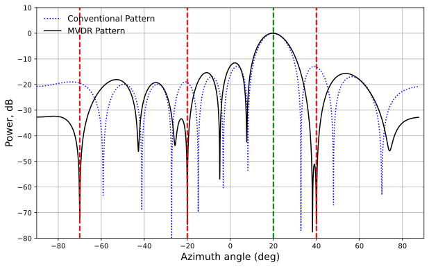

Nous appliquons maintenant une bande passante fractionnelle de 0,1, ce qui répartit les sources de bruit sur une large bande passante et entraîne la création de zones d'annulation beaucoup plus larges par MVDR. Dans de nombreux scénarios réels, cela représente une simulation plus réaliste.

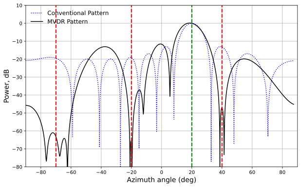

*******************
Réseaux circulaires
*******************

Nous aborderons brièvement le réseau circulaire uniforme (UCA), une géométrie de réseau couramment utilisée pour la détection d'arrivée (DOA) car elle résout le problème d'ambiguïté à 180 degrés des réseaux circulaires uniformes (ULA). Le KrakenSDR, par exemple, est un réseau à 5 éléments, généralement disposés en cercle avec un espacement régulier. En théorie, trois éléments suffisent pour former un UCA, tout comme deux éléments suffisent pour un ULA.

Tout le code étudié jusqu'à présent s'applique aux UCA ; il suffit de remplacer l'équation du vecteur de direction par une équation spécifique aux UCA :

.. code-block:: python
                
    radius = 0.05 # normalisé par la longueur d'onde !
    d = np.sqrt(2 * rayon**2 * (1 - np.cos(2*np.pi/Nr)))
    sf = 1.0 / (np.sqrt(2.0) * np.sqrt(1.0 - np.cos(2*np.pi/Nr))) # Facteur d'échelle basé sur la géométrie, par exemple 1.0 pour un hexagone
    x = d * sf * np.cos(2 * np.pi / Nr * np.arange(Nr))
    y = -1 * d * sf * np.sin(2 * np.pi / Nr * np.arange(Nr))
    s = np.exp(1j * 2 * np.pi * (x * np.cos(theta) + y * np.sin(theta)))
    s = s.reshape(-1, 1) # Nrx1

Enfin, il est conseillé de balayer de 0 à 360 degrés, et non seulement de -90 à +90 degrés comme avec un réseau linéaire uniforme (ULA).

Pour les réseaux 2D (par exemple, rectangulaires), consultez le chapitre :ref:`2d-beamforming-chapter`.

************************
Conclusion et références
*************************

L'ensemble du code Python, y compris celui utilisé pour générer les figures et les animations, est disponible `sur la page GitHub du manuel : <https://github.com/777arc/PySDR/blob/master/figure-generating-scripts/doa.py>`_.

* Implémentation DOA dans GNU Radio - https://github.com/EttusResearch/gr-doa
* Implémentation DOA utilisée par KrakenSDR - https://github.com/krakenrf/krakensdr_doa/blob/main/_signal_processing/krakenSDR_signal_processor.py

[1] Mailloux, Robert J. Phased Array Antenna Handbook. Deuxième édition, Artech House, 2005

[2] Van Trees, Harry L. Optimum Array Processing: Part IV of Detection, Estimation, and Modulation Theory. Wiley, 2002.

.. |br| raw:: html

 
