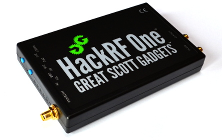
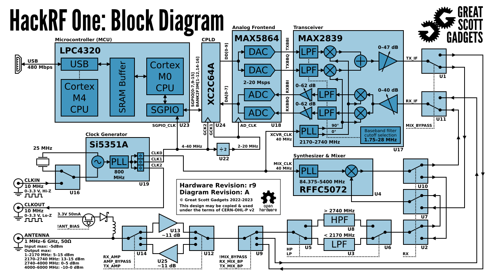
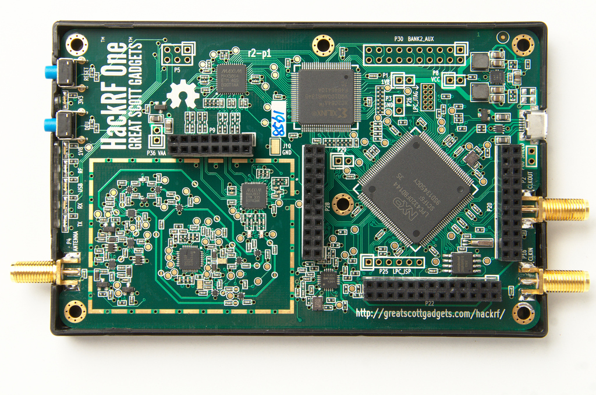
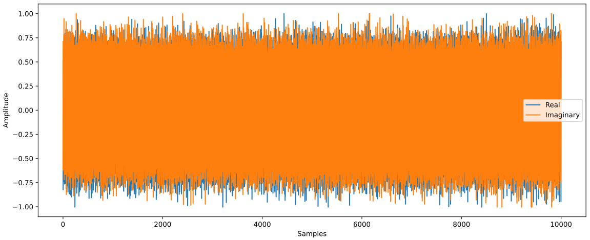

.. _hackrf-chapter:

####################
HackRF One en Python
####################

Le `HackRF One <https://greatscottgadgets.com/hackrf/one/>`_ de Great Scott Gadgets est un SDR USB 2.0 qui peut émettre ou recevoir de 1 MHz à 6 GHz et possède une fréquence d'échantillonnage de 2 à 20 MHz. Lancé en 2014, il a bénéficié de plusieurs améliorations mineures au fil des ans. C'est l'un des rares SDR économiques capables d'émettre jusqu'à 1 MHz, ce qui le rend idéal pour les applications HF (par exemple, la radioamateur) et les applications à plus haute fréquence. Sa puissance d'émission maximale de 15 dBm est également supérieure à celle de la plupart des autres SDR, pour plus de détails sur la puissance d'émissionallez allez voir `cette page <https://hackrf.readthedocs.io/en/latest/faq.html#what-is-the-transmit-power-of-hackrf>`_ .   Il utilise un fonctionnement half-duplex, ce qui signifie qu'il est soit en mode émission, soit en mode réception à tout moment, et il utilise un convertisseur analogique-numérique/numérique-analogique 8 bits.

********************************
HackRF Architecture
********************************

Le HackRF est basé sur la puce Analog Devices MAX2839, un émetteur-récepteur de 2,3 GHz à 2,7 GHz. Conçue initialement pour le WiMAX, elle est associée à une puce frontale RF MAX5864 (qui intègre essentiellement le CAN et le CNA) et à un synthétiseur/VCO large bande RFFC5072 (utilisé pour la conversion de fréquence du signal). Cela contraste avec la plupart des autres SDR économiques qui utilisent une seule puce appelée RFIC. Hormis le réglage de la fréquence générée par le RFFC5072, tous les autres paramètres que nous ajusterons, tels que l'atténuation et le filtrage analogique, seront gérés par le MAX2839. Au lieu d'utiliser un FPGA ou un système sur puce (SoC) comme de nombreux SDR, le HackRF utilise un circuit logique programmable complexe (CPLD) qui sert de simple logique d'interface, et un microcontrôleur, le LPC4320 basé sur ARM, qui gère tout le traitement numérique du signal (DSP) embarqué et l'interface USB avec l'hôte (transfert d'échantillons IQ dans les deux sens et contrôle des paramètres du SDR). Le magnifique schéma fonctionnel suivant, tiré de Great Scott Gadgets, illustre l'architecture de la dernière version du HackRF One :

Le HackRF One est hautement extensible et personnalisable. À l'intérieur du boîtier en plastique se trouvent quatre connecteurs (P9, P20, P22, and P28). Les détails sont `disponibles ici <https://hackrf.readthedocs.io/en/latest/expansion_interface.html>`_. Notez que 8 broches GPIO et 4 entrées ADC sont sur le connecteur P20, tandis que les interfaces SPI, I2C, et UART sont sur le connecteur P22.  Le connecteur P28 peut être utilisé pour déclencher/synchroniser les opérations avec un autre appareil (par exemple un commutateur TR, un amplificateur externe ou un autre HackRF), via l'entrée et la sortie de déclenchement, avec un déali inférieur à une période d'échantillonnage.

L'horloge utilisée pour l'oscillateur local (LO) et le convertisseur analogique-numérique (ADC/DAC) provient soit de l'oscillateur intégré de 25 MHz, soit d'une référence externe de 10 MHz fournie via un connecteur SMA. Quelle que soit l'horloge utilisée, le HackRF génère un signal d'horloge de 10 MHz sur CLKOUT ; un signal carré standard de 3,3 V et 10 MHz conçu pour une charge à haute impédance. Le port CLKIN est conçu pour recevoir un signal carré similaire de 10 MHz et 3,3 V, et le HackRF utilisera l'horloge d'entrée au lieu du cristal interne lorsqu'un signal d'horloge est détecté (notez que la transition vers ou depuis CLKIN n'a lieu qu'au début d'une opération d'émission ou de réception).

********************************
Configuration matérielle et logicielle
********************************

Le processus d'installation du logiciel comporte deux étapes : nous installerons d'abord la bibliothèque principale HackRF de Great Scott Gadgets, puis l'API Python.

Installation de la bibliothèque du HackRF
#############################

Le code suivant a été testé et fonctionne sous Ubuntu 22.04 (avec le hachage de commit 17f3943 de mars 2025) :

.. code-block:: bash

    git clone https://github.com/greatscottgadgets/hackrf.git
    cd hackrf
    git checkout 17f3943
    cd host
    mkdir build
    cd build
    cmake ..
    make
    sudo make install
    sudo ldconfig
    sudo cp /usr/local/bin/hackrf* /usr/bin/.

Après avoir installé :code:`hackrf` vous pourrez exécuter les utilitaires suivants :
* :code:`hackrf_info` - Lire les informations du périphérique HackRF, telles que le numéro de série et la version du firmware.
* :code:`hackrf_transfer` - Envoyer et recevoir des signaux via HackRF. Les fichiers d'entrée/sortie sont des échantillons en quadrature de signaux 8 bits.
* :code:`hackrf_sweep` - Analyseur de spectre en ligne de commande.
* :code:`hackrf_clock` - Lire et écrire la configuration d'entrée et de sortie d'horloge.
* :code:`hackrf_operacake` - Configurer le commutateur d'antenne Opera Cake connecté à HackRF.
* :code:`hackrf_spiflash` - Outil permettant d'écrire un nouveau firmware sur HackRF. Voir : Mise à jour du firmware.
* :code:`hackrf_debug` - Lire et écrire les registres et autres paramètres de configuration bas niveau pour le débogage.

  Si vous utilisez Ubuntu via WSL, côté Windows, vous devrez transférer le périphérique USB HackRF vers WSL. Pour cela, commencez par installer la dernière version de l'`utilitaire usbipd (fichier msi <https://github.com/dorssel/usbipd-\win/releases>`_) (ce guide suppose que vous disposez de usbipd-win 4.0.0 ou version ultérieure), puis ouvrez PowerShell en mode administrateur et exécutez :

.. code-block:: bash

    usbipd list
    <find the BUSID labeled HackRF One and substitute it in the two commands below>
    usbipd bind --busid 1-10
    usbipd attach --wsl --busid 1-10

Du côté WSL, vous devriez pouvoir exécuter :code:`lsusb` et voir un nouvel élément nommé :code:`Great Scott Gadgets HackRF One`. Notez que vous pouvez ajouter l'option :code:`--auto-attach` à la commande :code:`usbipd attach` si vous souhaitez une reconnexion automatique.

Enfin, vous devez ajouter les règles udev à l'aide de la commande suivante :    

.. code-block:: bash

    echo 'ATTR{idVendor}=="1d50", ATTR{idProduct}=="6089", SYMLINK+="hackrf-one-%k", MODE="660", TAG+="uaccess"' | sudo tee /etc/udev/rules.d/53-hackrf.rules
    sudo udevadm trigger

Débranchez puis rebranchez votre HackRF One (et réexécutez la commande :code:`usbipd attach`). Notez que j'ai rencontré des problèmes d'autorisations avec l'étape suivante jusqu'à ce que j'utilise `WSL USB Manager <https://gitlab.com/alelec/wsl-usb-gui/-/releases>`_ côté Windows, pour gérer le transfert vers WSL, qui gère apparemment aussi les règles udev.

Que vous soyez sous Linux natif ou WSL, vous devriez maintenant pouvoir exécuter :code:`hackrf_info` et voir quelque chose comme :

.. code-block:: bash

    hackrf_info version: git-17f39433
    libhackrf version: git-17f39433 (0.9)
    Found HackRF
    Index: 0
    Serial number: 00000000000000007687865765a765
    Board ID Number: 2 (HackRF One)
    Firmware Version: 2024.02.1 (API:1.08)
    Part ID Number: 0xa000cb3c 0x004f4762
    Hardware Revision: r10
    Hardware appears to have been manufactured by Great Scott Gadgets.
    Hardware supported by installed firmware: HackRF One

Effectuons également un enregistrement IQ de la bande FM, d'une largeur de 10 MHz centrée sur 100 MHz, et nous enregistrerons 1 million d'échantillons :

.. code-block:: bash

    hackrf_transfer -r out.iq -f 100000000 -s 10000000 -n 1000000 -a 0 -l 30 -g 50

Cet utilitaire produit un fichier binaire IQ d'échantillons int8 (2 octets par échantillon IQ), qui devrait peser 2 Mo dans notre cas. Si vous êtes curieux, vous pouvez lire l'enregistrement du signal en Python à l'aide du code suivant :

.. code-block:: python

    import numpy as np
    samples = np.fromfile('out.iq', dtype=np.int8)
    samples = samples[::2] + 1j * samples[1::2]
    print(len(samples))
    print(samples[0:10])
    print(np.max(samples))

Si votre valeur maximale est de 127 (ce qui signifie que vous avez saturé le CAN), alors abaissez les deux valeurs de gain à la fin de la commande.

Installation de l'API Python
#########################

Enfin, nous devons installer les `bindings Python HackRF One <https://github.com/GvozdevLeonid/python_hackrf>`_, maintenues par `GvozdevLeonid <https://github.com/GvozdevLeonid>`_. Elles ont été testées et fonctionnent correctement sous Ubuntu 22.04 le 11/04/2024 avec la dernière version de la branche principale.

.. code-block:: bash

    sudo apt install libusb-1.0-0-dev
    pip install python_hackrf==1.2.7

Nous pouvons tester l'installation ci-dessus en exécutant le code suivant. S'il n'y a pas d'erreurs (il n'y aura donc aucune sortie), tout devrait fonctionner correctement !

.. code-block:: python

    from python_hackrf import pyhackrf  # type: ignore
    pyhackrf.pyhackrf_init()
    sdr = pyhackrf.pyhackrf_open()
    sdr.pyhackrf_set_sample_rate(10e6)
    sdr.pyhackrf_set_antenna_enable(False)
    sdr.pyhackrf_set_freq(100e6)
    sdr.pyhackrf_set_amp_enable(False)
    sdr.pyhackrf_set_lna_gain(30) # LNA gain - 0 dB à 40 dB par pas de 8 dB
    sdr.pyhackrf_set_vga_gain(50) # VGA gain - 0 dB à 62 dB par pas de 2 dB
    sdr.pyhackrf_close()

Pour un test concret de réception d'échantillons, consultez l'exemple de code ci-dessous.

********************************
Gain Tx et Rx
********************************

Côté réception
############

Le HackRF One possède côté réception, 3 étages de gain différents :

* RF (:code:`amp`, soit 0 dB soit 11 dB)
* IF (:code:`lna`, de 0 dB à 40 dB par pas de 8 dB)
* baseband (:code:`vga`, de 0 dB à 62 dB par pas de 2 dB)

Pour la réception de la plupart des signaux, il est recommandé de désactiver l’amplificateur RF (0 dB), sauf si le signal est extrêmement faible et qu’aucun signal fort n’est présent à proximité. Le gain FI (LNA) est l’étage de gain le plus important à régler pour optimiser le rapport signal/bruit tout en évitant la saturation du CAN ; c’est le premier bouton à ajuster. Le gain de bande de base peut être laissé à une valeur relativement élevée, par exemple, nous le laisserons à 50 dB.

Côté transmission
#############

Côté émission, on trouve deux étages de gain :

* RF [soit 0 dB soit 11 dB]
* IF [de 0 dB à 47 dB par pas de 1 dB]

Vous souhaiterez probablement activer l'amplificateur RF, puis vous pourrez ajuster le gain IF en fonction de vos besoins.

**************************************************
Réception d'échantillons IQ en Python avec le HackRF
**************************************************

Actuellement, le package Python :code:`python_hackrf` ne comprend aucune fonction pratique pour la réception d'échantillons. Il s'agit simplement d'un ensemble de liaisons Python qui correspondent à l'API C++ du HackRF. Pour recevoir facilement des données IQ, nous devons utiliser une quantité de code non négligeable. Le package Python est configuré pour utiliser une fonction de rappel afin de recevoir davantage d'échantillons. Cette fonction doit être initialisée, mais elle sera automatiquement appelée dès que de nouveaux échantillons seront disponibles en provenance du HackRF.
Cette fonction de rappel doit toujours prendre trois arguments spécifiques et doit renvoyer :code:`0` si nous souhaitons recevoir un autre ensemble d'échantillons. Dans le code ci-dessous, à chaque appel de notre fonction de rappel, nous convertissons les échantillons au type complexe de NumPy, les mettons à l'échelle de -1 à +1, puis les stockons, dans un tableau :code:`samples` plus grand.

Après l'exécution du code ci-dessous, si sur votre graphique temporel, les échantillons atteignent les limites de l'ADC (-1 et +1), réduisez alors :code:`lna_gain` de 3 dB jusqu'à ce que les limites ne soient clairement plus atteintes.

.. code-block:: python

    from python_hackrf import pyhackrf  # type: ignore
    import matplotlib.pyplot as plt
    import numpy as np
    import time

    # These settings should match the hackrf_transfer example used in the textbook, and the resulting waterfall should look about the same
    recording_time = 1  # seconds
    center_freq = 100e6  # Hz
    sample_rate = 10e6
    baseband_filter = 7.5e6
    lna_gain = 30 # 0 to 40 dB in 8 dB steps
    vga_gain = 50 # 0 to 62 dB in 2 dB steps

    pyhackrf.pyhackrf_init()
    sdr = pyhackrf.pyhackrf_open()

    allowed_baseband_filter = pyhackrf.pyhackrf_compute_baseband_filter_bw_round_down_lt(baseband_filter) # calculate the supported bandwidth relative to the desired one

    sdr.pyhackrf_set_sample_rate(sample_rate)
    sdr.pyhackrf_set_baseband_filter_bandwidth(allowed_baseband_filter)
    sdr.pyhackrf_set_antenna_enable(False)  # It seems this setting enables or disables power supply to the antenna port. False by default. the firmware auto-disables this after returning to IDLE mode

    sdr.pyhackrf_set_freq(center_freq)
    sdr.pyhackrf_set_amp_enable(False)  # False by default
    sdr.pyhackrf_set_lna_gain(lna_gain)  # LNA gain - 0 to 40 dB in 8 dB steps
    sdr.pyhackrf_set_vga_gain(vga_gain)  # VGA gain - 0 to 62 dB in 2 dB steps

    print(f'center_freq: {center_freq} sample_rate: {sample_rate} baseband_filter: {allowed_baseband_filter}')

    num_samples = int(recording_time * sample_rate)
    samples = np.zeros(num_samples, dtype=np.complex64)
    last_idx = 0

    def rx_callback(device, buffer, buffer_length, valid_length):  # this callback function always needs to have these four args
        global samples, last_idx

        accepted = valid_length // 2
        accepted_samples = buffer[:valid_length].astype(np.int8) # -128 to 127
        accepted_samples = accepted_samples[0::2] + 1j * accepted_samples[1::2]  # Convert to complex type (de-interleave the IQ)
        accepted_samples /= 128 # -1 to +1
        samples[last_idx: last_idx + accepted] = accepted_samples

        last_idx += accepted

        return 0

    sdr.set_rx_callback(rx_callback)
    sdr.pyhackrf_start_rx()
    print('is_streaming', sdr.pyhackrf_is_streaming())

    time.sleep(recording_time)

    sdr.pyhackrf_stop_rx()
    sdr.pyhackrf_close()
    pyhackrf.pyhackrf_exit()

    samples = samples[100000:] # get rid of the first 100k samples just to be safe, due to transients

    fft_size = 2048
    num_rows = len(samples) // fft_size
    spectrogram = np.zeros((num_rows, fft_size))
    for i in range(num_rows):
        spectrogram[i, :] = 10 * np.log10(np.abs(np.fft.fftshift(np.fft.fft(samples[i * fft_size:(i+1) * fft_size]))) ** 2)
    extent = [(center_freq + sample_rate / -2) / 1e6, (center_freq + sample_rate / 2) / 1e6, len(samples) / sample_rate, 0]

    plt.figure(0)
    plt.imshow(spectrogram, aspect='auto', extent=extent) # type: ignore
    plt.xlabel("Frequency [MHz]")
    plt.ylabel("Time [s]")

    plt.figure(1)
    plt.plot(np.real(samples[0:10000]))
    plt.plot(np.imag(samples[0:10000]))
    plt.xlabel("Samples")
    plt.ylabel("Amplitude")
    plt.legend(["Real", "Imaginary"])

    plt.show()

Lorsque vous utilisez une antenne capable de recevoir la bande FM, vous devriez obtenir un résultat similaire à celui-ci, avec plusieurs stations FM visibles sur le graphique en cascade :

   

.. image:: ../_images/hackrf_freq_screenshot.png
   :align: center 
   :scale: 50 %
   :alt: Spectrogramme (frequence en fonction du temps) des échantillons extraits du HackRF

