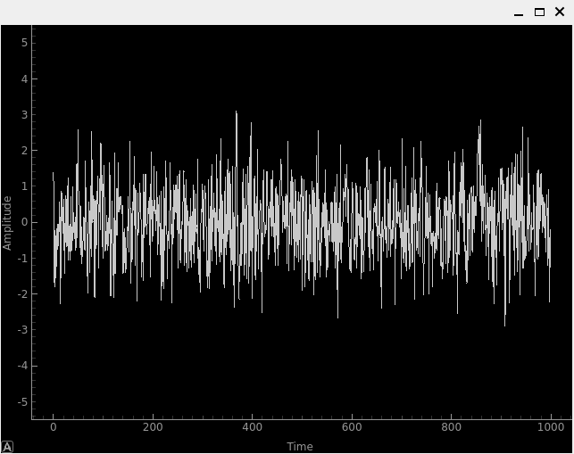
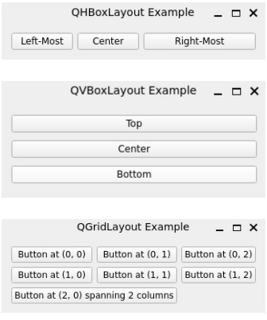
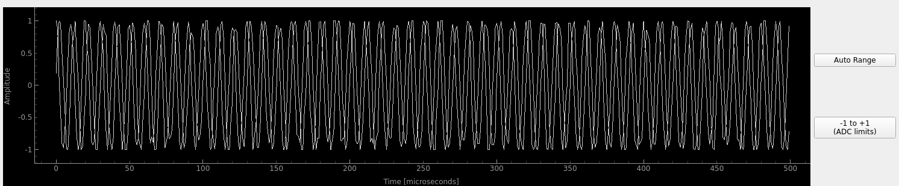
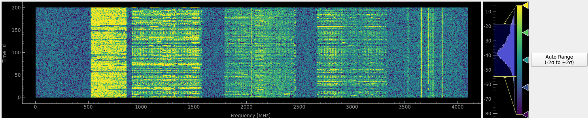

.. _pyqt-chapter:

##########################
Interfaces Homme Machine temps-réel avec PyQt
##########################

Dans ce chapitre, nous apprenons à créer des interfaces graphiques utilisateur (GUI) en temps réel avec Python grâce à PyQt, l'interface Python pour Qt. Nous y construirons un analyseur de spectre avec affichage du temps, de la fréquence et d'un spectrogramme/diagramme en cascade, ainsi que des widgets de saisie pour ajuster les différents paramètres SDR. Cet exemple est compatible avec PlutoSDR, USRP et le mode simulation uniquement.

****************
Introduction
****************

Qt  (prononcé «  cute  ») est  un framework  permettant  de créer  des
applications GUI compatibles avec Linux, Windows, macOS et Android. Ce
framework   puissant,   utilisé   dans  de   nombreuses   applications
commerciales, est écrit  en C++ pour des  performances optimales. PyQt
est  l'interface Python  de Qt,  offrant la  possibilité de  créer des
applications GUI en  Python tout en bénéficiant  des performances d'un
framework  C++  performant.  Dans  ce  chapitre,  nous  apprendrons  à
utiliser  PyQt pour  créer  un  analyseur de  spectre  en temps  réel,
utilisable avec un SDR (ou  un signal simulé). Cet analyseur affichera
le temps, la fréquence et un spectrogramme/diagramme en cascade, ainsi
que des  widgets de saisie  pour ajuster les différents  paramètres du
SDR.  Nous utiliserons  `PyQtGraph <https://www.pyqtgraph.org/>`,  une
bibliothèque  distincte  basée sur  PyQt,  pour  la visualisation  des
données.  Côté  saisie,  nous  utiliserons des  curseurs,  des  listes
déroulantes et des boutons. Cet  exemple est compatible avec PlutoSDR,
USRP  et le  mode simulation  uniquement. Bien  que le  code d'exemple
utilise  PyQt6,  chaque  ligne  est  identique à  celle  de  PyQt5  (à
l'exception  de :code:`import`),  les  différences entre  les deux  versions
étant minimes du point de vue de l'API. Ce chapitre fait naturellement
la  part  belle  au  code  Python, comme  nous  l'illustrons  par  des
exemples. À  la fin de ce  chapitre, vous maîtriserez les  éléments de
base  nécessaires  à  la  création de  votre  propre  application  SDR
interactive personnalisée !

****************
Aperçu de Qt 
****************

Qt est un framework très complet, et nous n'aborderons ici que quelques notions de base. Cependant, il est important de comprendre certains concepts clés pour travailler avec Qt/PyQt :

- **Widgets** : Les widgets sont les éléments constitutifs d'une application Qt et servent à créer l'interface graphique. Il existe différents types de widgets, comme les boutons, les curseurs, les étiquettes et les graphiques. Les widgets peuvent être organisés en mises en page, qui déterminent leur position à l'écran.

- **Mises en page** : Les mises en page permettent d'organiser les widgets dans une fenêtre. Il existe plusieurs types de mises en page, notamment horizontales, verticales, en grille et en formulaire. Les mises en page permettent de créer des interfaces graphiques complexes qui s'adaptent aux changements de taille de la fenêtre.

- **Signaux et slots** : Les signaux et les slots permettent la communication entre les différentes parties d'une application Qt. Un signal est émis par un objet lorsqu'un événement particulier se produit et est associé à un slot, une fonction de rappel appelée lors de l'émission du signal. Les signaux et les slots permettent de créer une structure événementielle dans une application Qt et de garantir la réactivité de l'interface graphique.

- **Feuilles de style** : Les feuilles de style servent à personnaliser l'apparence des widgets dans une application Qt. Écrites dans un langage similaire à CSS, elles permettent de modifier la couleur, la police et la taille des widgets.

- **Graphismes** : Qt dispose d'un puissant framework graphique permettant de créer des graphismes personnalisés dans une application Qt. Ce framework inclut des classes pour dessiner des lignes, des rectangles, des ellipses et du texte, ainsi que des classes pour gérer les événements de la souris et du clavier.

- **Multithreading** : Qt prend en charge nativement le multithreading et fournit des classes pour créer des threads de travail s'exécutant en arrière-plan. Le multithreading permet d'exécuter des opérations longues dans une application Qt sans bloquer le thread principal de l'interface graphique.

- **OpenGL** : Qt  intègre la prise en charge d’OpenGL  et fournit des classes pour la  création de graphismes 3D dans  une application Qt. OpenGL est utilisé pour créer des applications exigeant des performances  graphiques 3D  élevées.  Dans ce  chapitre, nous  nous concentrerons uniquement sur les applications 2D.
  

*************************
Structure de base d'une application
*************************

Avant d'explorer les différents widgets Qt, examinons la structure d'une application Qt typique. Une application Qt se compose d'une fenêtre principale contenant un widget central, lequel contient le contenu principal de l'application. Avec PyQt, nous pouvons créer une application Qt minimale, ne contenant qu'un seul QPushButton, comme suit :

.. code-block:: python

    from PyQt6.QtWidgets import QApplication, QMainWindow, QPushButton

    # Sous-classe QMainWindow pour paramétrer la fenêtre principale de
    l'application
    class MainWindow(QMainWindow):
        def __init__(self):
            super().__init__()
            
            # Example de composant IHM
            example_button = QPushButton('Push Me')
            def on_button_click():
                print("beep")
            example_button.clicked.connect(on_button_click)

            self.setCentralWidget(example_button)

    app = QApplication([])
    window = MainWindow()
    window.show() # les fenêtres sont cachées par défaut
    app.exec() # Start the event loop

Essayez d'exécuter le code vous-même ; vous devrez probablement installer PyQt6 avec :code:`pip install PyQt6`. Notez que la dernière ligne est bloquante : tout ce que vous ajouterez après ne s'exécutera pas tant que vous n'aurez pas fermé la fenêtre. Le bouton QPushButton que nous créons a son signal :code:`clicked` connecté à une fonction de rappel qui affiche « beep » dans la console.

*******************************
Application avec thread de worker
*******************************

L'exemple minimal présenté ci-dessus pose problème : il ne laisse aucune place pour le code SDR/DSP. La méthode :code:`__init__` de la classe :code:`MainWindow` est configurée et les fonctions de rappel sont définies, mais il est absolument impératif de ne pas y ajouter d'autre code (SDR ou DSP, par exemple). En effet, l'interface graphique étant monothread, bloquer ce thread avec du code long entraînerait des blocages ou des saccades, or nous recherchons une interface aussi fluide que possible. Pour contourner ce problème, nous pouvons utiliser un thread de travail pour exécuter le code SDR/DSP en arrière-plan.

L'exemple ci-dessous étend l'exemple  minimal précédent en incluant un
thread de worker qui exécute du code (dans la fonction :code:`run`) en
continu.  Nous  n'utilisons pas de  boucle :code:`while True`,  car le
fonctionnement interne de PyQt exige que la fonction :code:`run` se termine et redémarre périodiquement.  Pour ce faire, le signal
:code:`end_of_run` du thread de worker (que nous détaillerons dans la
      section  suivante) est  associé  à une  fonction  de rappel  qui
      relance la fonction  :code:`run` de ce même thread. Il est également
      nécessaire d'initialiser  le thread  de worker  dans le  code de
      :code:`MainWindow`,  ce qui  implique la  création d'un  nouveau
            :code:`QThread` et l'affectation de notre thread de worker
                  personnalisé. Ce  code peut paraître  complexe, mais
                  il s'agit d'une pratique courante dans les applications PyQt. L'essentiel à retenir
est  que   le  code  orienté   interface  graphique  se   trouve  dans
:code:`MainWindow`, tandis  que le  code orienté SDR/DSP  se trouve  dans la
fonction :code:`run` du thread de travail.

.. code-block:: python

    from PyQt6.QtCore import QThread, pyqtSignal, QObject, QTimer
    from PyQt6.QtWidgets import QApplication, QMainWindow, QPushButton
    import time

    # Non-IHM  opérations (notamment SDR) néccessitant d'être lancées dans un thread spéaré.
    class SDRWorker(QObject):
        end_of_run = pyqtSignal()

        # Boucle principale
        def run(self):
            print("Starting run()")
            time.sleep(1)
            self.end_of_run.emit() # let MainWindow know we're done

    # Sous-classe QMainWindow pour personnaliser la fenêtre principale de votre application
    class MainWindow(QMainWindow):
        def __init__(self):
            super().__init__()

            # Initialisation du worker et du thread
            self.sdr_thread = QThread()
            worker = SDRWorker()
            worker.moveToThread(self.sdr_thread)
            
            # Exemple de composant IHM
            example_button = QPushButton('Push Me')
            def on_button_click():
                print("beep")
            example_button.clicked.connect(on_button_click)
            self.setCentralWidget(example_button)

            # C'est ce qui permet à la fonction run() de se répéter en continu
            def end_of_run_callback():
                QTimer.singleShot(0, worker.run) # Run worker again immediately
            worker.end_of_run.connect(end_of_run_callback)

            self.sdr_thread.started.connect(worker.run) # kicks off the first run() when the thread starts
            self.sdr_thread.start() # start thread

    app = QApplication([])
    window = MainWindow()
    window.show() # Les fenêtres sont cachées par défaut
    app.exec() # Démarrer l'évenèment boucle

Essayez d'exécuter le code ci-dessus ; vous devriez voir « Starting run()» s'afficher dans la console toutes les secondes, et le bouton-poussoir devrait toujours fonctionner (sans délai). Dans le thread de travail, nous effectuons pour l'instant uniquement un affichage et une pause, mais nous y ajouterons prochainement la gestion du signal SDR et le code de traitement du signal numérique.

*************************
Signaux et slots
*************************

Dans   l'exemple    précédent,   nous   avons   utilisé    le   signal
:code:`end_of_run` pour la communication entre le thread de travail et le thread d'interface graphique. Ce modèle, courant dans les applications PyQt,
est connu  sous le nom  de mécanisme «  signaux et emplacements  ». Un
signal  est émis  par un  objet  (ici, le  thread de  travail) et  est
associé à un slot (/NDLR : emplacement en français/) (ici, la fonction de rappel
:code:`end_of_run_callback` du thread d'interface graphique). Un signal peut
être  associé à  plusieurs  slots,  et un  slot  peut  être associé  à
plusieurs signaux. Le signal peut également transporter des arguments,
qui  sont transmis  à l'emplacement  lors de  son émission.  Notez que
l'opération  est réversible  :  le thread  d'interface graphique  peut
envoyer un signal  à l'emplacement du thread de  travail. Le mécanisme
de signaux/emplacements est un moyen puissant de communiquer entre les
différentes  parties  d'une  application PyQt,  créant  une  structure
événementielle.  Il  est  largement  utilisé dans  l'exemple  de  code
suivant.  Retenez simplement qu'un slot est une fonction de rappel, et
qu'un signal est un moyen de signaler cette fonction de rappel.
  

*************************
PyQtGraph
*************************

PyQtGraph est une bibliothèque basée sur PyQt et NumPy qui offre des capacités de traçage rapides et efficaces, PyQt étant trop généraliste pour intégrer des fonctionnalités de traçage. Conçue pour les applications temps réel, elle est optimisée pour la vitesse. Elle est similaire à Matplotlib à bien des égards, mais destinée aux applications temps réel plutôt qu'aux graphiques individuels. L'exemple simple ci-dessous permet de comparer les performances de PyQtGraph et de Matplotlib : il suffit de remplacer :code:`if True` par :code:`False`. Sur un processeur Intel Core i9-10900K à 3,70 GHz, le code PyQtGraph s'est mis à jour à plus de 1 000 images par seconde, tandis que le code Matplotlib s'est mis à jour à 40 images par seconde. Cela étant dit, si vous constatez que l'utilisation de Matplotlib vous est utile (par exemple, pour gagner du temps de développement ou parce que vous souhaitez une fonctionnalité spécifique que PyQtGraph ne prend pas en charge), vous pouvez intégrer des graphiques Matplotlib dans une application PyQt, en utilisant le code ci-dessous comme point de départ.

.. raw:: html

   

   
Développez pour afficher le code

.. code-block:: python

    import numpy as np
    import time
    import matplotlib
    matplotlib.use('Qt5Agg')
    from PyQt6 import QtCore, QtWidgets
    from matplotlib.backends.backend_qtagg import FigureCanvasQTAgg as FigureCanvas
    from matplotlib.figure import Figure
    import pyqtgraph as pg # tested with pyqtgraph==0.13.7

    n_data = 1024

    if True:
        class MplCanvas(FigureCanvas):
            def __init__(self):
                fig = Figure(figsize=(13, 8), dpi=100)
                self.axes = fig.add_subplot(111)
                super(MplCanvas, self).__init__(fig)

        class MainWindow(QtWidgets.QMainWindow):
            def __init__(self):
                super(MainWindow, self).__init__()

                self.canvas = MplCanvas()
                self._plot_ref = self.canvas.axes.plot(np.arange(n_data), '.-r')[0]
                self.canvas.axes.set_xlim(0, n_data)
                self.canvas.axes.set_ylim(-5, 5)
                self.canvas.axes.grid(True)
                self.setCentralWidget(self.canvas)

                # Setup a timer to trigger the redraw by calling update_plot.
                self.timer = QtCore.QTimer()
                self.timer.setInterval(0) # causes the timer to start immediately
                self.timer.timeout.connect(self.update_plot) # causes the timer to start itself again automatically
                self.timer.start()
                self.start_t = time.time() # used for benchmarking

                self.show()

            def update_plot(self):
                self._plot_ref.set_ydata(np.random.randn(n_data))
                self.canvas.draw() # Trigger the canvas to update and redraw.
                print('FPS:', 1/(time.time()-self.start_t)) # got ~42 FPS on an i9-10900K
                self.start_t = time.time()

    else:
        class MainWindow(QtWidgets.QMainWindow):
            def __init__(self):
                super(MainWindow, self).__init__()
                
                self.time_plot = pg.PlotWidget()
                self.time_plot.setYRange(-5, 5)
                self.time_plot_curve = self.time_plot.plot([])
                self.setCentralWidget(self.time_plot)

                # Setup a timer to trigger the redraw by calling update_plot.
                self.timer = QtCore.QTimer()
                self.timer.setInterval(0) # causes the timer to start immediately
                self.timer.timeout.connect(self.update_plot) # causes the timer to start itself again automatically
                self.timer.start()
                self.start_t = time.time() # used for benchmarking

                self.show()

            def update_plot(self):
                self.time_plot_curve.setData(np.random.randn(n_data))
                print('FPS:', 1/(time.time()-self.start_t)) # got ~42 FPS on an i9-10900K
                self.start_t = time.time()

    app = QtWidgets.QApplication([])
    w = MainWindow()
    app.exec()

.. raw:: html

    

Pour  ce   qui  est   d'utiliser  PyQtGraph,  nous   l'importons  avec
:code:`import pyqtgraph as pg` et nous pouvons ensuite créer un widget
      Qt qui représente un graphique 1D comme suit (ce code va dans la
      méthode :code:`__init__` de :code:`MainWindow`).

.. code-block:: python

        # Exemple de graphique PyQtGraph
        time_plot = pg.PlotWidget(labels={'left': 'Amplitude', 'bottom': 'Time'})
        time_plot_curve        =       time_plot.plot(np.arange(1000),
        np.random.randn(1000)) # x et y
        time_plot.setYRange(-5, 5)

        self.setCentralWidget(time_plot)

Vous pouvez constater qu'il est relativement simple de configurer un graphique, et le résultat est simplement un widget supplémentaire à ajouter à votre interface graphique. Outre les graphiques 1D, PyQtGraph possède également un équivalent de la fonction :code:`imshow()` de Matplotlib, qui permet de tracer des graphiques 2D à l'aide d'une palette de couleurs, que nous utiliserons pour notre spectrogramme/waterfall en temps réel. L'un des avantages de PyQtGraph est que les graphiques qu'il crée sont de simples widgets Qt, et que nous ajoutons d'autres éléments Qt (par exemple, un rectangle d'une certaine taille à une certaine coordonnée) en utilisant uniquement PyQt. En effet, PyQtGraph utilise la classe :code:`QGraphicsScene` de PyQt, qui fournit une interface pour gérer un grand nombre d'éléments graphiques 2D. Rien ne nous empêche donc d'ajouter des lignes, des rectangles, du texte, des ellipses, des polygones et des bitmaps, directement en utilisant PyQt.

*******
Dispositions
*******

Dans les exemples précédents, nous avons utilisé :code:`self.setCentralWidget()` pour définir le widget principal de la fenêtre. Cette méthode simple ne permet pas de créer des dispositions plus complexes. Pour cela, nous pouvons utiliser des dispositions, qui permettent d'organiser les widgets dans une fenêtre. Il existe plusieurs types de dispositions, notamment :code:`QHBoxLayout`, :code:`QVBoxLayout`, :code:`QGridLayout` et :code:`QFormLayout`. :code:`QHBoxLayout` et :code:`QVBoxLayout` disposent les widgets horizontalement et verticalement, respectivement. :code:`QGridLayout` les dispose sous forme de grille, et :code:`QFormLayout` les dispose sur deux colonnes : la première colonne contient les étiquettes et la seconde, les champs de saisie.

Pour créer une nouvelle mise en page et y ajouter des widgets, essayez
d'ajouter ce qui suit dans la méthode :code:`__init__` de votre :code:`MainWindow` :

.. code-block:: python

    layout = QHBoxLayout()
    layout.addWidget(QPushButton("Left-Most"))
    layout.addWidget(QPushButton("Center"), 1)
    layout.addWidget(QPushButton("Right-Most"), 2)
    self.setLayout(layout)

    
Dans cet exemple, les widgets sont empilés horizontalement. Cependant, en remplaçant :code:`QHBoxLayout` par :code:`QVBoxLayout`, il est possible de les empiler verticalement. La fonction :code:`addWidget` permet d'ajouter des widgets à la mise en page. Son deuxième argument, optionnel, est un facteur d'étirement qui détermine l'espace occupé par le widget par rapport aux autres.

:code:`QGridLayout` possède des paramètres supplémentaires : il est nécessaire de spécifier la ligne et la colonne du widget, ainsi que le nombre de lignes et de colonnes qu'il doit occuper (par défaut : 1 et 1). Voici un exemple de :code:`QGridLayout` :

.. code-block:: python

    layout = QGridLayout()
    layout.addWidget(QPushButton("Button at (0, 0)"), 0, 0)
    layout.addWidget(QPushButton("Button at (0, 1)"), 0, 1)
    layout.addWidget(QPushButton("Button at (0, 2)"), 0, 2)
    layout.addWidget(QPushButton("Button at (1, 0)"), 1, 0)
    layout.addWidget(QPushButton("Button at (1, 1)"), 1, 1)
    layout.addWidget(QPushButton("Button at (1, 2)"), 1, 2)
    layout.addWidget(QPushButton("Button at (2, 0) spanning 2 columns"), 2, 0, 1, 2)
    self.setLayout(layout)

Pour notre analyseur de spectre, nous utiliserons :code:`QGridLayout` pour la mise en page générale, mais nous ajouterons également :code:`QHBoxLayout` pour empiler les widgets horizontalement dans un espace de la grille. Vous pouvez imbriquer des mises en page simplement en créant une nouvelle mise en page et en l'ajoutant à la mise en page de niveau supérieur (ou parente), par exemple :

.. code-block:: python

    layout = QGridLayout()
    self.setLayout(layout)
    inner_layout = QHBoxLayout()
    layout.addLayout(inner_layout)

*******************
:code:`QPushButton`
*******************

The first actual widget we will cover is the :code:`QPushButton`, which is a simple button that can be clicked.  We have already seen how to create a :code:`QPushButton` and connect its :code:`clicked` signal to a callback function.  The :code:`QPushButton` has a few other signals, including :code:`pressed`, :code:`released`, and :code:`toggled`.  The :code:`toggled` signal is emitted when the button is checked or unchecked, and is useful for creating toggle buttons.  The :code:`QPushButton` also has a few properties, including :code:`text`, :code:`icon`, and :code:`checkable`.  The :code:`QPushButton` also has a method called :code:`click()` which simulates a click on the button.  For our SDR spectrum analyzer application we will be using buttons to trigger an auto-range for plots, using the current data to calculate the y limits.  Because we have already used the :code:`QPushButton`, we won't go into more detail here, but you can find more information in the `QPushButton documentation <https://doc.qt.io/qtforpython/PySide6/QtWidgets/QPushButton.html>`_.

***************
:code:`QSlider`
***************

The :code:`QSlider` is a widget that allows the user to select a value from a range of values.  The :code:`QSlider` has a few properties, including :code:`minimum`, :code:`maximum`, :code:`value`, and :code:`orientation`.  The :code:`QSlider` also has a few signals, including :code:`valueChanged`, :code:`sliderPressed`, and :code:`sliderReleased`.  The :code:`QSlider` also has a method called :code:`setValue()` which sets the value of the slider, we will be using this a lot.  The documentation page for `QSlider is here <https://doc.qt.io/qtforpython/PySide6/QtWidgets/QSlider.html>`_.

For our spectrum analyzer application we will be using :code:`QSlider`'s to adjust the center frequency and gain of the SDR.  Here is the snippet from the final application code that creates the gain slider:

.. code-block:: python

    # Gain slider with label
    gain_slider = QSlider(Qt.Orientation.Horizontal)
    gain_slider.setRange(0, 73) # min and max, inclusive. interval is always 1
    gain_slider.setValue(50) # initial value
    gain_slider.setTickPosition(QSlider.TickPosition.TicksBelow)
    gain_slider.setTickInterval(2) # for visual purposes only
    gain_slider.sliderMoved.connect(worker.update_gain)
    gain_label = QLabel()
    def update_gain_label(val):
        gain_label.setText("Gain: " + str(val))
    gain_slider.sliderMoved.connect(update_gain_label)
    update_gain_label(gain_slider.value()) # initialize the label
    layout.addWidget(gain_slider, 5, 0)
    layout.addWidget(gain_label, 5, 1)

One very important thing to know about :code:`QSlider` is it uses integers, so by setting the range from 0 to 73 we are allowing the slider to choose integer values between those numbers (inclusive of start and end).  The :code:`setTickInterval(2)` is purely a visual thing.  It is for this reason that we will use kHz as the units for the frequency slider, so that we can have granularity down to the 1 kHz.

Halfway into the code above you'll notice we create a :code:`QLabel`, which is just a text label for display purposes, but in order for it to display the current value of the slider we must create a slot (i.e., callback function) that updates the label.  We connect this callback function to the :code:`sliderMoved` signal, which is automatically emitted whenever the slider is moved.  We also call the callback function once to initialize the label with the current value of the slider (50 in our case).  We also have to connect the :code:`sliderMoved` signal to a slot that lives within the worker thread, which will update the gain of the SDR (remember, we don't like to manage the SDR or do DSP in the main GUI thread). The callback function that defines this slot will be discussed later.

*****************
:code:`QComboBox`
*****************

The :code:`QComboBox` is a dropdown-style widget that allows the user to select an item from a list of items.  The :code:`QComboBox` has a few properties, including :code:`currentText`, :code:`currentIndex`, and :code:`count`.  The :code:`QComboBox` also has a few signals, including :code:`currentTextChanged`, :code:`currentIndexChanged`, and :code:`activated`.  The :code:`QComboBox` also has a method called :code:`addItem()` which adds an item to the list, and :code:`insertItem()` which inserts an item at a specific index, although we will not be using them in our spectrum analyzer example.  The documentation page for `QComboBox is here <https://doc.qt.io/qtforpython/PySide6/QtWidgets/QComboBox.html>`_.

For our spectrum analyzer application we will be using :code:`QComboBox` to select the sample rate from a list we pre-define.  At the beginning of our code we define the possible sample rates using :code:`sample_rates = [56, 40, 20, 10, 5, 2, 1, 0.5]`.  Within the :code:`MainWindow`'s :code:`__init__` we create the :code:`QComboBox` as follows:

.. code-block:: python

    # Sample rate dropdown using QComboBox
    sample_rate_combobox = QComboBox()
    sample_rate_combobox.addItems([str(x) + ' MHz' for x in sample_rates])
    sample_rate_combobox.setCurrentIndex(0) # must give it the index, not string
    sample_rate_combobox.currentIndexChanged.connect(worker.update_sample_rate)
    sample_rate_label = QLabel()
    def update_sample_rate_label(val):
        sample_rate_label.setText("Sample Rate: " + str(sample_rates[val]) + " MHz")
    sample_rate_combobox.currentIndexChanged.connect(update_sample_rate_label)
    update_sample_rate_label(sample_rate_combobox.currentIndex()) # initialize the label
    layout.addWidget(sample_rate_combobox, 6, 0)
    layout.addWidget(sample_rate_label, 6, 1)

The only real difference between this and the slider is the :code:`addItems()` where you give it the list of strings to use as options, and :code:`setCurrentIndex()` which sets the starting value.

****************
Lambda Functions
****************

Recall in the above code where we did:

.. code-block:: python

    def update_sample_rate_label(val):
        sample_rate_label.setText("Sample Rate: " + str(sample_rates[val]) + " MHz")
    sample_rate_combobox.currentIndexChanged.connect(update_sample_rate_label)

We are creating a function that has only a single line of code inside of it, then passing that function (functions are objects too!) to :code:`connect()`.  To simplify things, let's rewrite this code pattern using basic Python:

.. code-block:: python

    def my_function(x):
        print(x)
    y.call_that_takes_in_function_obj(my_function)

In this situation, we have a function that only has one line of code inside of it, and we only reference that function once; when we are setting the :code:`connect` callback.  In these situations we can use a lambda function, which is a way to define a function in a single line.  Here is the above code rewritten using a lambda function:

.. code-block:: python

    y.call_that_takes_in_function_obj(lambda x: print(x))

If you have never used a lambda function before, this might seem foreign, and you certainly don't need to use them, but it gets rid of two lines of code and makes the code more concise.  The way it works is, the temporary argument name comes from after "lambda", and then everything after the colon is the code that will operate on that variable.  It supports multiple arguments as well, using commas, or even no arguments by using :code:`lambda : <code>`.  As an exercise, try rewriting the :code:`update_sample_rate_label` function above using a lambda function.

***********************
PyQtGraph's PlotWidget
***********************

PyQtGraph's :code:`PlotWidget` is a PyQt widget used to produce 1D plots, similar to Matplotlib's :code:`plt.plot(x,y)`.  We will be using it for the time and frequency (PSD) domain plots, although it is also good for IQ plots (which our spectrum analyzer does not contain).  For those curious, PlotWidget is a subclass of PyQt's `QGraphicsView <https://doc.qt.io/qtforpython-5/PySide2/QtWidgets/QGraphicsView.html>`_ which is a widget for displaying the contents of a `QGraphicsScene <https://doc.qt.io/qtforpython-5/PySide2/QtWidgets/QGraphicsScene.html#PySide2.QtWidgets.PySide2.QtWidgets.QGraphicsScene>`_, which is a surface for managing a large number of 2D graphical items in Qt.  But the important thing to know about PlotWidget is that it is simply a widget containing a single `PlotItem <https://pyqtgraph.readthedocs.io/en/latest/api_reference/graphicsItems/plotitem.html#pyqtgraph.PlotItem>`_, so from a documentation perspective you're better off just referring to the PlotItem docs: `<https://pyqtgraph.readthedocs.io/en/latest/api_reference/graphicsItems/plotitem.html>`_.  A PlotItem contains a ViewBox for displaying the data we want to plot, as well as AxisItems and labels for displaying the axes and title, as you may expect.

The simplest example of using a PlotWidget is as follows (which must be added inside of the :code:`MainWindow`'s :code:`__init__`):

.. code-block:: python

 import pyqtgraph as pg
 plotWidget = pg.plot(title="My Title")
 plotWidget.plot(x, y)

where x and y are typically numpy arrays just like with Matplotlib's :code:`plt.plot()`.  However, this represents a static plot where the data never changes.  For our spectrum analyzer we want to update the data inside of our worker thread, so when we initialize our plot we don't even need to pass it any data yet, we just have to set it up.  Here is how we initialize the Time Domain plot in our spectrum analyzer app:

.. code-block:: python

    # Time plot
    time_plot = pg.PlotWidget(labels={'left': 'Amplitude', 'bottom': 'Time [microseconds]'})
    time_plot.setMouseEnabled(x=False, y=True)
    time_plot.setYRange(-1.1, 1.1)
    time_plot_curve_i = time_plot.plot([]) 
    time_plot_curve_q = time_plot.plot([]) 
    layout.addWidget(time_plot, 1, 0)

You can see we are creating two different plots/curves, one for I and one for Q.  The rest of the code should be self-explanatory.  To be able to update the plot, we need to create a slot (i.e., callback function) within the :code:`MainWindow`'s :code:`__init__`:

.. code-block:: python

    def time_plot_callback(samples):
        time_plot_curve_i.setData(samples.real)
        time_plot_curve_q.setData(samples.imag)

We will connect this slot to the worker thread's signal that is emitted when new samples are available, as shown later.  

The final thing we will do in the :code:`MainWindow`'s :code:`__init__` is to add a couple buttons to the right of the plot that will trigger an auto-range of the plot.  One will use the current min/max, and another will set the range to -1.1 to 1.1 (which is the ADC limits of many SDRs, plus a 10% margin).  We will create an inner layout, specifically QVBoxLayout, to vertically stack these two buttons.  Here is the code to add the buttons:

.. code-block:: python

    # Time plot auto range buttons
    time_plot_auto_range_layout = QVBoxLayout()
    layout.addLayout(time_plot_auto_range_layout, 1, 1)
    auto_range_button = QPushButton('Auto Range')
    auto_range_button.clicked.connect(lambda : time_plot.autoRange()) # lambda just means its an unnamed function
    time_plot_auto_range_layout.addWidget(auto_range_button)
    auto_range_button2 = QPushButton('-1 to +1\n(ADC limits)')
    auto_range_button2.clicked.connect(lambda : time_plot.setYRange(-1.1, 1.1))
    time_plot_auto_range_layout.addWidget(auto_range_button2)

And what it ultimately looks like:

We will use a similar pattern for the frequency domain (PSD) plot.

*********************
PyQtGraph's ImageItem
*********************

A spectrum analyzer is not complete without a waterfall (a.k.a. real-time spectrogram), and for that we will use PyQtGraph's ImageItem, which renders images with 1, 3 or 4 "channels".  One channel just means you give it a 2D array of floats or ints, which then uses a lookup table (LUT) to apply a colormap and ultimately create the image.  Alternatively, you can give it RGB (3 channels) or RGBA (4 channels).  We will calculate our spectrogram as a 2D numpy array of floats, and pass it to the ImageItem directly.  We will pick a colormap, and even make use of the built-in functionality for showing a graphical LUT that can display our data's value distribution and how the colormap is applied.

The actual initialization of the waterfall plot is fairly straightforward, we use a PlotWidget as the container (so that we can still have our x and y axis displayed) and then add an ImageItem to it:

.. code-block:: python

    # Waterfall plot
    waterfall = pg.PlotWidget(labels={'left': 'Time [s]', 'bottom': 'Frequency [MHz]'})
    imageitem = pg.ImageItem(axisOrder='col-major') # this arg is purely for performance
    waterfall.addItem(imageitem)
    waterfall.setMouseEnabled(x=False, y=False)
    waterfall_layout.addWidget(waterfall)

The slot/callback associated with updating the waterfall data, which goes in :code:`MainWindow`'s :code:`__init__`, is as follows:

.. code-block:: python

    def waterfall_plot_callback(spectrogram):
        imageitem.setImage(spectrogram, autoLevels=False)
        sigma = np.std(spectrogram)
        mean = np.mean(spectrogram) 
        self.spectrogram_min = mean - 2*sigma # save to window state
        self.spectrogram_max = mean + 2*sigma

Where spectrogram will be a 2D numpy array of floats.  In addition to setting the image data, we will calculate a min and max for the colormap, based on the mean and variance of the data, which we will use later.  The last part of the GUI code for the spectrogram is creating the colorbar, which also sets the colormap used:

.. code-block:: python

    # Colorbar for waterfall
    colorbar = pg.HistogramLUTWidget()
    colorbar.setImageItem(imageitem) # connects the bar to the waterfall imageitem
    colorbar.item.gradient.loadPreset('viridis') # set the color map, also sets the imageitem
    imageitem.setLevels((-30, 20)) # needs to come after colorbar is created for some reason
    waterfall_layout.addWidget(colorbar)

The second line is important, it is what ultimately connects this colorbar to the ImageItem.  This code is also where we choose the colormap, and set the starting levels (-30 dB to +20 dB in our case).  Within the worker thread code you will see how the spectrogram 2D array is calculated/stored.  Below is a screenshot of this part of the GUI, showing the incredible built-in functionality of the colorbar and LUT display, note that the sideways bell-shaped curve is the distribution of spectrogram values, which is very useful to see.

***********************
Worker Thread
***********************

Recall towards the beginning of this chapter we learned how to create a separate thread, using a class we called SDRWorker with a run() function.  This is where we will put all of our SDR and DSP code, with the exception of initialization of the SDR which we will do globally for now.  The worker thread will also be responsible for updating the three plots, by emitting signals when new samples are available, to trigger the callback functions we have already created in :code:`MainWindow`, which ultimately updates the plots.  The SDRWorker class can be split up into three sections:

#. :code:`init()` - used to initialize any state, such as the spectrogram 2D array
#. PyQt Signals - we must define our custom signals that will be emitted
#. PyQt Slots - the callback functions that are triggered by GUI events like a slider moving
#. :code:`run()` - the main loop that runs nonstop

***********************
PyQt Signals
***********************

In the GUI code we didn't have to define any Signals, because they were built into the widgets we were using, like :code:`QSlider`s :code:`valueChanged`.  Our SDRWorker class is custom, and any Signals we want to emit must be defined before we start calling run().  Here is the code for the SDRWorker class, which defines four signals we will be using, and their corresponding data types:

.. code-block:: python

    # PyQt Signals
    time_plot_update = pyqtSignal(np.ndarray)
    freq_plot_update = pyqtSignal(np.ndarray)
    waterfall_plot_update = pyqtSignal(np.ndarray)
    end_of_run = pyqtSignal() # happens many times a second

The first three signals send a single object; a numpy array.  The last signal does not send any object with it.  You can also send multiple objects at a time, simply use commas between data types, but we don't need to do that for our application here.  Anywhere within run() we can emit a signal to the GUI thread, using just one line of code, for example:

.. code-block:: python

    self.time_plot_update.emit(samples)

There is one last step to make all of the signals/slots connections- in the GUI code (comes at the very end of :code:`MainWindow`'s :code:`__init__`) we must connect the worker thread's signals to the GUI's slots, for example:

.. code-block:: python

    worker.time_plot_update.connect(time_plot_callback) # connect the signal to the callback

Remember that :code:`worker` is the instance of the SDRWorker class that we created in the GUI code.  So what we are doing above is connecting the worker thread's signal called :code:`time_plot_update` to the GUI's slot called :code:`time_plot_callback` that we defined earlier.  Now is a good time to go back and review the code snippets we have shown so far, and see how they all fit together, to ensure you understand how the GUI and worker thread are communicating, as it is a crucial part of PyQt programming.

***********************
Worker Thread Slots
***********************

The worker thread's slots are the callback functions that are triggered by GUI events, like the gain slider moving.  They are pretty straightforward, for example, this slot updates the SDR's gain value to the new value chosen by the slider:

.. code-block:: python

    def update_gain(self, val):
        print("Updated gain to:", val, 'dB')
        sdr.set_rx_gain(val)

***********************
Worker Thread Run()
***********************

The :code:`run()` function is where all the fun DSP part happens!  In our application, we will start each run function by receiving a set of samples from the SDR (or simulating some samples if you don't have an SDR).  

.. code-block:: python

    # Main loop
    def run(self):
        if sdr_type == "pluto":
            samples = sdr.rx()/2**11 # Receive samples
        elif sdr_type == "usrp":
            streamer.recv(recv_buffer, metadata)
            samples = recv_buffer[0] # will be np.complex64
        elif sdr_type == "sim":
            tone = np.exp(2j*np.pi*self.sample_rate*0.1*np.arange(fft_size)/self.sample_rate)
            noise = np.random.randn(fft_size) + 1j*np.random.randn(fft_size)
            samples = self.gain*tone*0.02 + 0.1*noise
            # Truncate to -1 to +1 to simulate ADC bit limits
            np.clip(samples.real, -1, 1, out=samples.real)
            np.clip(samples.imag, -1, 1, out=samples.imag)
        
        ...

As you can see, for the simulated example, we generate a tone with some white noise, and then truncate the samples from -1 to +1.

Now for the DSP!  We know we will need to take the FFT for the frequency domain plot and spectrogram.  It turns out that we can simply use the PSD for that set of samples as one row of the spectrogram, so all we have to do is shift our spectrogram/waterfall up by a row, and add the new row to the bottom (or top, doesn't matter).  For each of the plot updates, we emit the signal which contains the updated data to plot.  We also signal the end of the :code:`run()` function so that the GUI thread immediately starts another call to :code:`run()` again.  Overall, it's actually not much code:

.. code-block:: python

        ...

        self.time_plot_update.emit(samples[0:time_plot_samples])
        
        PSD = 10.0*np.log10(np.abs(np.fft.fftshift(np.fft.fft(samples)))**2/fft_size)
        self.PSD_avg = self.PSD_avg * 0.99 + PSD * 0.01
        self.freq_plot_update.emit(self.PSD_avg)

        self.spectrogram[:] = np.roll(self.spectrogram, 1, axis=1) # shifts waterfall 1 row
        self.spectrogram[:,0] = PSD # fill last row with new fft results
        self.waterfall_plot_update.emit(self.spectrogram)

        self.end_of_run.emit() # emit the signal to keep the loop going
        # end of run()

Note how we don't send the entire batch of samples to the time plot, because it would be too many points to show, instead we only send the first 500 samples (configurable at the top of the script, not shown here).  For the PSD plot, we use a running average of the PSD, by storing the previous PSD and adding 1% of the new PSD to it.  This is a simple way to smooth out the PSD plot.  Note that it doesn't matter the order you call :code:`emit()` for the signals, they could have all just as easily gone at the end of :code:`run()`.

***********************
Exemple final : Code complet
***********************

Jusqu’à présent, nous avons examiné des extraits de code de l’application d’analyse de spectre. Nous allons maintenant étudier le code complet et l’exécuter. Il est compatible avec PlutoSDR, USRP et le mode simulation. Si vous ne possédez ni PlutoSDR ni USRP, laissez le code tel quel ; il utilisera alors le mode simulation. Sinon, modifiez :code:`sdr_type`. En mode simulation, si vous augmentez le gain au maximum, vous constaterez que le signal est tronqué dans le domaine temporel, ce qui provoque l’apparition de signaux parasites dans le domaine fréquentiel.

N’hésitez pas  à utiliser  ce code  comme point  de départ  pour votre
propre application SDR  en temps réel ! Vous  trouverez ci-dessous une
animation  de  l’application en  action,  utilisant  un PlutoSDR  pour
analyser la bande cellulaire 750 MHz, puis la bande Wi-Fi 2,4 GHz. Une
version de meilleure qualité est disponible sur YouTube ici `here <https://youtu.be/hvofiY3Q_yo>`_.

.. image:: ../_images/pyqt_animation.gif
   :scale: 100 %
   :align: center
   :alt:  gif animé montrant le fonctionnement l'application analyseur de spectre PyQt
  
         
Bogues connus  (pour aider à  les corriger, modifiez ce  fichier `edit
this
<https://github.com/777arc/PySDR/edit/master/figure-generating-scripts/pyqt_example.py>`_)
:

#. L'axe des x du spectrogramme ne se met pas à jour lorsque l'on modifie la fréquence centrale (contrairement au graphique PSD)

Code complet :

.. code-block:: python

    from PyQt6.QtCore import QSize, Qt, QThread, pyqtSignal, QObject, QTimer
    from PyQt6.QtWidgets import QApplication, QMainWindow, QGridLayout, QWidget, QSlider, QLabel, QHBoxLayout, QVBoxLayout, QPushButton, QComboBox  # tested with PyQt6==6.7.0
    import pyqtgraph as pg # tested with pyqtgraph==0.13.7
    import numpy as np
    import time
    import signal # lets control-C actually close the app

    # Valeurs par défaut
    fft_size = 4096 # determines buffer size
    num_rows = 200
    center_freq = 750e6
    sample_rates = [56, 40, 20, 10, 5, 2, 1, 0.5] # MHz
    sample_rate = sample_rates[0] * 1e6
    time_plot_samples = 500
    gain = 50 # 0 to 73 dB. int

    sdr_type = "sim" # or "usrp" or "pluto"

    # Initialisation du SDR
    if sdr_type == "pluto":
        import adi
        sdr = adi.Pluto("ip:192.168.1.10")
        sdr.rx_lo = int(center_freq)
        sdr.sample_rate = int(sample_rate)
        sdr.rx_rf_bandwidth = int(sample_rate*0.8) # antialiasing filter bandwidth
        sdr.rx_buffer_size = int(fft_size)
        sdr.gain_control_mode_chan0 = 'manual'
        sdr.rx_hardwaregain_chan0 = gain # dB
    elif sdr_type == "usrp":
        import uhd
        #usrp = uhd.usrp.MultiUSRP(args="addr=192.168.1.10")
        usrp = uhd.usrp.MultiUSRP(args="addr=192.168.1.201")
        usrp.set_rx_rate(sample_rate, 0)
        usrp.set_rx_freq(uhd.libpyuhd.types.tune_request(center_freq), 0)
        usrp.set_rx_gain(gain, 0)

        # Configuration du flux (stream) et du buiffer de réception
        st_args = uhd.usrp.StreamArgs("fc32", "sc16")
        st_args.channels = [0]
        metadata = uhd.types.RXMetadata()
        streamer = usrp.get_rx_stream(st_args)
        recv_buffer = np.zeros((1, fft_size), dtype=np.complex64)

        # Démarrage du flux
        stream_cmd = uhd.types.StreamCMD(uhd.types.StreamMode.start_cont)
        stream_cmd.stream_now = True
        streamer.issue_stream_cmd(stream_cmd)

        def flush_buffer():
            for _ in range(10):
                streamer.recv(recv_buffer, metadata)

    class SDRWorker(QObject):
        def __init__(self):
            super().__init__()
            self.gain = gain
            self.sample_rate = sample_rate
            self.freq = 0 # in kHz, to deal with QSlider being ints and with a max of 2 billion
            self.spectrogram = -50*np.ones((fft_size, num_rows))
            self.PSD_avg = -50*np.ones(fft_size)

        # Signaux PyQt
        time_plot_update = pyqtSignal(np.ndarray)
        freq_plot_update = pyqtSignal(np.ndarray)
        waterfall_plot_update = pyqtSignal(np.ndarray)
        end_of_run = pyqtSignal() # happens many times a second

        # Slots PyQt
        def update_freq(self, val): # TODO: WE COULD JUST MODIFY THE SDR IN THE GUI THREAD
            print("Updated freq to:", val, 'kHz')
            if sdr_type == "pluto":
                sdr.rx_lo = int(val*1e3)
            elif sdr_type == "usrp":
                usrp.set_rx_freq(uhd.libpyuhd.types.tune_request(val*1e3), 0)
                flush_buffer()
        
        def update_gain(self, val):
            print("Updated gain to:", val, 'dB')
            self.gain = val
            if sdr_type == "pluto":
                sdr.rx_hardwaregain_chan0 = val
            elif sdr_type == "usrp":
                usrp.set_rx_gain(val, 0)
                flush_buffer()

        def update_sample_rate(self, val):
            print("Updated sample rate to:", sample_rates[val], 'MHz')
            if sdr_type == "pluto":
                sdr.sample_rate = int(sample_rates[val] * 1e6)
                sdr.rx_rf_bandwidth = int(sample_rates[val] * 1e6 * 0.8)
            elif sdr_type == "usrp":
                usrp.set_rx_rate(sample_rates[val] * 1e6, 0)
                flush_buffer()

        # Boucle principale
        def run(self):
            start_t = time.time()
                    
            if sdr_type == "pluto":
                samples = sdr.rx()/2**11 # Receive samples
            elif sdr_type == "usrp":
                streamer.recv(recv_buffer, metadata)
                samples = recv_buffer[0] # will be np.complex64
            elif sdr_type == "sim":
                tone = np.exp(2j*np.pi*self.sample_rate*0.1*np.arange(fft_size)/self.sample_rate)
                noise = np.random.randn(fft_size) + 1j*np.random.randn(fft_size)
                samples = self.gain*tone*0.02 + 0.1*noise
                # Truncate to -1 to +1 to simulate ADC bit limits
                np.clip(samples.real, -1, 1, out=samples.real)
                np.clip(samples.imag, -1, 1, out=samples.imag)

            self.time_plot_update.emit(samples[0:time_plot_samples])
            
            PSD = 10.0*np.log10(np.abs(np.fft.fftshift(np.fft.fft(samples)))**2/fft_size)
            self.PSD_avg = self.PSD_avg * 0.99 + PSD * 0.01
            self.freq_plot_update.emit(self.PSD_avg)
        
            self.spectrogram[:] = np.roll(self.spectrogram, 1, axis=1) # shifts waterfall 1 row
            self.spectrogram[:,0] = PSD # fill last row with new fft results
            self.waterfall_plot_update.emit(self.spectrogram)

            print("Frames per second:", 1/(time.time() - start_t))
            self.end_of_run.emit() # emit the signal to keep the loop going

    # Sous-classe QMainWindow pour configurer la fenêtre principale de
    la fenêtre application
    class MainWindow(QMainWindow):
        def __init__(self):
            super().__init__()

            self.setWindowTitle("The PySDR Spectrum Analyzer")
            self.setFixedSize(QSize(1500, 1000)) # window size, starting size should fit on 1920 x 1080

            self.spectrogram_min = 0
            self.spectrogram_max = 0

            layout = QGridLayout() # overall layout

            # Initialisation du worker et du thread
            self.sdr_thread = QThread()
            self.sdr_thread.setObjectName('SDR_Thread') # so we can see it in htop, note you have to hit F2 -> Display options -> Show custom thread names
            worker = SDRWorker()
            worker.moveToThread(self.sdr_thread)

            # Affichage temporel
            time_plot = pg.PlotWidget(labels={'left': 'Amplitude', 'bottom': 'Time [microseconds]'})
            time_plot.setMouseEnabled(x=False, y=True)
            time_plot.setYRange(-1.1, 1.1)
            time_plot_curve_i = time_plot.plot([]) 
            time_plot_curve_q = time_plot.plot([]) 
            layout.addWidget(time_plot, 1, 0)

            # Boutons de plage automatique du graphique temporel
            time_plot_auto_range_layout = QVBoxLayout()
            layout.addLayout(time_plot_auto_range_layout, 1, 1)
            auto_range_button = QPushButton('Auto Range')
            auto_range_button.clicked.connect(lambda : time_plot.autoRange()) # lambda just means its an unnamed function
            time_plot_auto_range_layout.addWidget(auto_range_button)
            auto_range_button2 = QPushButton('-1 to +1\n(ADC limits)')
            auto_range_button2.clicked.connect(lambda : time_plot.setYRange(-1.1, 1.1))
            time_plot_auto_range_layout.addWidget(auto_range_button2)

            # Graohique fréquentiel
            freq_plot = pg.PlotWidget(labels={'left': 'PSD', 'bottom': 'Frequency [MHz]'})
            freq_plot.setMouseEnabled(x=False, y=True)
            freq_plot_curve = freq_plot.plot([]) 
            freq_plot.setXRange(center_freq/1e6 - sample_rate/2e6, center_freq/1e6 + sample_rate/2e6)
            freq_plot.setYRange(-30, 20)
            layout.addWidget(freq_plot, 2, 0)
            
            # Bouton de sélection automatique de la plage de fréquence
            auto_range_button = QPushButton('Auto Range')
            auto_range_button.clicked.connect(lambda : freq_plot.autoRange()) # lambda just means its an unnamed function
            layout.addWidget(auto_range_button, 2, 1)

            # Conteneur pour les éléments liés au flux vidéo
            waterfall_layout = QHBoxLayout()
            layout.addLayout(waterfall_layout, 3, 0)

            # Affichage graphique du spectrogramme
            waterfall = pg.PlotWidget(labels={'left': 'Time [s]', 'bottom': 'Frequency [MHz]'})
            imageitem = pg.ImageItem(axisOrder='col-major') # this arg is purely for performance
            waterfall.addItem(imageitem)
            waterfall.setMouseEnabled(x=False, y=False)
            waterfall_layout.addWidget(waterfall)

            # Colorbar for waterfall
            colorbar = pg.HistogramLUTWidget()
            colorbar.setImageItem(imageitem) # connects the bar to the waterfall imageitem
            colorbar.item.gradient.loadPreset('viridis') # set the color map, also sets the imageitem
            imageitem.setLevels((-30, 20)) # needs to come after colorbar is created for some reason
            waterfall_layout.addWidget(colorbar)

            # Waterfall auto range button
            auto_range_button = QPushButton('Auto Range\n(-2σ to +2σ)')
            def update_colormap():
                imageitem.setLevels((self.spectrogram_min, self.spectrogram_max))
                colorbar.setLevels(self.spectrogram_min, self.spectrogram_max)
            auto_range_button.clicked.connect(update_colormap)
            layout.addWidget(auto_range_button, 3, 1)

            # Freq slider with label, all units in kHz
            freq_slider = QSlider(Qt.Orientation.Horizontal)
            freq_slider.setRange(0, int(6e6))
            freq_slider.setValue(int(center_freq/1e3))
            freq_slider.setTickPosition(QSlider.TickPosition.TicksBelow)
            freq_slider.setTickInterval(int(1e6))
            freq_slider.sliderMoved.connect(worker.update_freq) # there's also a valueChanged option
            freq_label = QLabel()
            def update_freq_label(val):
                freq_label.setText("Frequency [MHz]: " + str(val/1e3))
                freq_plot.autoRange()
            freq_slider.sliderMoved.connect(update_freq_label)
            update_freq_label(freq_slider.value()) # initialize the label
            layout.addWidget(freq_slider, 4, 0)
            layout.addWidget(freq_label, 4, 1)

            # Gain slider with label
            gain_slider = QSlider(Qt.Orientation.Horizontal)
            gain_slider.setRange(0, 73)
            gain_slider.setValue(gain)
            gain_slider.setTickPosition(QSlider.TickPosition.TicksBelow)
            gain_slider.setTickInterval(2)
            gain_slider.sliderMoved.connect(worker.update_gain)
            gain_label = QLabel()
            def update_gain_label(val):
                gain_label.setText("Gain: " + str(val))
            gain_slider.sliderMoved.connect(update_gain_label)
            update_gain_label(gain_slider.value()) # initialize the label
            layout.addWidget(gain_slider, 5, 0)
            layout.addWidget(gain_label, 5, 1)

            # Sample rate dropdown using QComboBox
            sample_rate_combobox = QComboBox()
            sample_rate_combobox.addItems([str(x) + ' MHz' for x in sample_rates])
            sample_rate_combobox.setCurrentIndex(0) # should match the default at the top
            sample_rate_combobox.currentIndexChanged.connect(worker.update_sample_rate)
            sample_rate_label = QLabel()
            def update_sample_rate_label(val):
                sample_rate_label.setText("Sample Rate: " + str(sample_rates[val]) + " MHz")
            sample_rate_combobox.currentIndexChanged.connect(update_sample_rate_label)
            update_sample_rate_label(sample_rate_combobox.currentIndex()) # initialize the label
            layout.addWidget(sample_rate_combobox, 6, 0)
            layout.addWidget(sample_rate_label, 6, 1)

            central_widget = QWidget()
            central_widget.setLayout(layout)
            self.setCentralWidget(central_widget)

            # Signals and slots stuff
            def time_plot_callback(samples):
                time_plot_curve_i.setData(samples.real)
                time_plot_curve_q.setData(samples.imag)
            
            def freq_plot_callback(PSD_avg):
                # TODO figure out if there's a way to just change the visual ticks instead of the actual x vals
                f = np.linspace(freq_slider.value()*1e3 - worker.sample_rate/2.0, freq_slider.value()*1e3 + worker.sample_rate/2.0, fft_size) / 1e6
                freq_plot_curve.setData(f, PSD_avg)
                freq_plot.setXRange(freq_slider.value()*1e3/1e6 - worker.sample_rate/2e6, freq_slider.value()*1e3/1e6 + worker.sample_rate/2e6)
            
            def waterfall_plot_callback(spectrogram):
                imageitem.setImage(spectrogram, autoLevels=False)
                sigma = np.std(spectrogram)
                mean = np.mean(spectrogram) 
                self.spectrogram_min = mean - 2*sigma # save to window state
                self.spectrogram_max = mean + 2*sigma

            def end_of_run_callback():
                QTimer.singleShot(0, worker.run) # Run worker again immediately
            
            worker.time_plot_update.connect(time_plot_callback) # connect the signal to the callback
            worker.freq_plot_update.connect(freq_plot_callback)
            worker.waterfall_plot_update.connect(waterfall_plot_callback)
            worker.end_of_run.connect(end_of_run_callback)

            self.sdr_thread.started.connect(worker.run) # kicks off the worker when the thread starts
            self.sdr_thread.start()

    app = QApplication([])
    window = MainWindow()
    window.show() # Windows are hidden by default
    signal.signal(signal.SIGINT, signal.SIG_DFL) # this lets control-C actually close the app
    app.exec() # Start the event loop

    if sdr_type == "usrp":
        stream_cmd = uhd.types.StreamCMD(uhd.types.StreamMode.stop_cont)
        streamer.issue_stream_cmd(stream_cmd)
