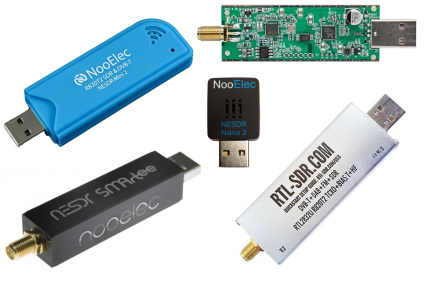
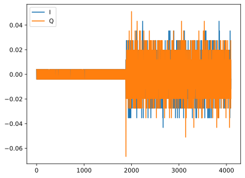
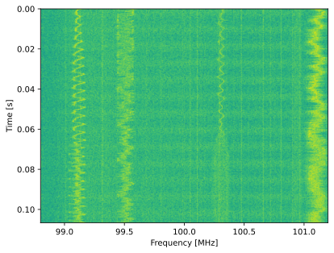

.. _rtlsdr-chapter:

####################
RTL-SDR en Python
####################

Le RTL-SDR est de loin le SDR le plus abordable, à environ 40 €, et un excellent choix pour débuter. Bien qu'il ne permette que la réception et que sa bande passante soit limitée à environ 1,75 GHz, il offre de nombreuses applications. Dans ce chapitre, nous apprendrons à configurer le logiciel RTL-SDR et à utiliser son API Python.

********************************
Contexte du RTL-SDR
********************************

Le RTL-SDR a vu le jour vers 2010, lorsque certains ont découvert qu'il était possible de pirater des dongles DVB-T bon marché équipés de la puce Realtek RTL2832U. Le DVB-T est une norme de télévision numérique principalement utilisée en Europe. L'intérêt du RTL2832U résidait dans l'accès direct aux échantillons IQ bruts, permettant ainsi de concevoir un SDR (récepteur audio numérique) polyvalent.

La puce RTL2832U intègre le convertisseur analogique-numérique (CAN) et le contrôleur USB, mais elle doit être associée à un tuner RF. Parmi les tuners les plus courants, on trouve les Rafael Micro R820T et R828D, ainsi que l'Elonics E4000. La plage de fréquences réglables dépend du tuner et se situe généralement entre 50 et 1700 MHz. La fréquence d'échantillonnage maximale, quant à elle, est déterminée par le RTL2832U et le bus USB de votre ordinateur. Elle est généralement d'environ 2,4 MHz, sans perte significative d'échantillons. Notez que ces tuners sont extrêmement bon marché et présentent une très faible sensibilité RF. L'ajout d'un amplificateur à faible bruit (LNA) et d'un filtre passe-bande est donc souvent nécessaire pour recevoir des signaux faibles.

Le RTL2832U utilise toujours des échantillons 8 bits ; l'ordinateur hôte recevra donc deux octets par échantillon IQ. Les RTL-SDR haut de gamme sont généralement équipés d'un oscillateur à température contrôlée (TCXO) en remplacement de l'oscillateur à quartz, moins coûteux, ce qui assure une meilleure stabilité de fréquence. Une autre option est le circuit de polarisation (bias-T), un circuit intégré fournissant environ 4,5 V CC sur le connecteur SMA. Ce circuit permet d'alimenter facilement un LNA externe ou d'autres composants RF. Ce décalage CC supplémentaire se situe côté RF du SDR et n'interfère donc pas avec le fonctionnement de réception.

Pour ceux qui s'intéressent à la direction d'arrivée (DOA) ou à d'autres applications de formation de faisceaux, le `KrakenSDR <https://www.crowdsupply.com/krakenrf/krakensdr>`_ est un SDR à cohérence de phase composé de cinq RTL-SDR partageant un oscillateur et une horloge d'échantillonnage.

*******************************
Installation du logiciel
*******************************

Ubuntu (ou Ubuntu sous WSL)
###############################

Sur Ubuntu 20, 22 et autres systèmes basés sur Debian, vous pouvez installer le logiciel RTL-SDR avec la commande suivante.

.. code-block:: bash

 sudo apt install rtl-sdr

Cela va installer la bibliothèque librtlsdr , et les outils en lignes de commande suivants :code:`rtl_sdr`, :code:`rtl_tcp`, :code:`rtl_fm`, and :code:`rtl_test`.

Ensuite, installez le wrapper Python pour librtlsdr en utilisant :

.. code-block:: bash

 sudo pip install pyrtlsdr

Si vous utilisez Ubuntu via WSL, téléchargez sous Windows la dernière version de `Zadig <https://zadig.akeo.ie/>`_ et exécutez-la pour installer le pilote « WinUSB » pour le RTL-SDR (il peut y avoir deux interfaces Bulk-In ; dans ce cas, installez « WinUSB » sur les deux). Débranchez puis rebranchez le RTL-SDR une fois l'installation de Zadig terminée.

Ensuite, vous devrez configurer WSL pour qu'il prenne en charge le périphérique USB du RTL-SDR. Pour cela, installez d'abord la dernière version de l'utilitaire usbipd (`fichier MSI <https://github.com/dorssel/usbipd-win/releases>`_) (ce guide suppose que vous disposez de usbipd-win 4.0.0 ou version ultérieure), puis ouvrez PowerShell en mode administrateur et exécutez la commande suivante :

.. code-block:: bash

    # (unplug RTL-SDR)
    usbipd list
    # (plug in RTL-SDR)
    usbipd list
    # (find the new device and substitute its index in the command below)
    usbipd bind --busid 1-5
    usbipd attach --wsl --busid 1-5

Du côté WSL, vous devriez pouvoir exécuter la commande :code:`lsusb` et voir un nouvel élément nommé RTL2838 DVB-T ou un nom similaire.

Si vous rencontrez des problèmes d'autorisation (par exemple, le test ci-dessous ne fonctionne qu'avec :code:`sudo`), vous devrez configurer des règles udev. Commencez par exécuter :code:`lsusb` pour trouver l'ID du RTL-SDR, puis créez le fichier :code:`/etc/udev/rules.d/10-rtl-sdr.rules` avec le contenu suivant, en remplaçant :code:`idVendor` et :code:`idProduct` par ceux de votre RTL-SDR si nécessaire :

.. code-block::

 SUBSYSTEM=="usb", ATTRS{idVendor}=="0bda", ATTRS{idProduct}=="2838", MODE="0666"

Pour actualiser udev, exécutez :

.. code-block:: bash

    sudo udevadm control --reload-rules
    sudo udevadm trigger

Si vous utilisez WSL et que le message d'erreur suivant s'affiche :code:`Failed to send reload request: No such file or directory`, cela signifie que le service udev n'est pas en cours d'exécution et que vous devrez exécuter la commande :code:`sudo nano /etc/wsl.conf` et ajouter les lignes suivantes :

.. code-block:: bash

 [boot]
 command="service udev start"

Redémarrez ensuite WSL à l'aide de la commande suivante dans PowerShell en tant qu'administrateur : :code:`wsl.exe --shutdown`.

Il peut également être nécessaire de débrancher puis de rebrancher le RTL-SDR (pour WSL, vous devrez relancer la commande :code:`usbipd attach`).

Windows
###################

For Windows users, see https://www.rtl-sdr.com/rtl-sdr-quick-start-guide/.  

********************************
Test du RTL-SDR
********************************

Si l'installation du logiciel a fonctionné, vous devriez pouvoir exécuter le test suivant, qui réglera le RTL-SDR sur la bande radio FM et enregistrera 1 million d'échantillons dans un fichier nommé :code:`recording.iq` dans :code:`/tmp`.

.. code-block:: bash

    rtl_sdr /tmp/recording.iq -s 2e6 -f 100e6 -n 1e6

Si vous obtenez le message :code:`No supported devices found`, même après avoir ajouté :code:`sudo` au début de la commande, Linux ne détecte pas le RTL-SDR. Si la détection fonctionne avec :code:`sudo`, il s'agit d'un problème de configuration udev. Essayez de redémarrer l'ordinateur après avoir suivi les instructions de configuration udev ci-dessus. Vous pouvez également utiliser :code:`sudo` pour toutes les opérations, y compris l'exécution de Python.

Vous pouvez tester la capacité de Python à détecter le RTL-SDR à l'aide du script suivant :

.. code-block:: python

 from rtlsdr import RtlSdr

 sdr = RtlSdr()
 sdr.sample_rate = 2.048e6 # Hz
 sdr.center_freq = 100e6   # Hz
 sdr.freq_correction = 60  # PPM
 sdr.gain = 'auto'
 
 print(len(sdr.read_samples(1024)))
 sdr.close()

qui devrait afficher :

.. code-block:: bash

 Found Rafael Micro R820T tuner
 [R82XX] PLL not locked!
 1024

********************************
Code Python RTL-SDR
********************************

Le code ci-dessus constitue un exemple d'utilisation basique du RTL-SDR en Python. Les sections suivantes détaillent les différents paramètres et astuces d'utilisation.

Prévenir les dysfonctionnements du RTL-SDR
################################################

À la fin de notre script, ou une fois l'acquisition des échantillons terminée, nous appellerons :code:`sdr.close()`. Cela permettra d'éviter que le RTL-SDR ne se bloque et nécessite d'être débranché/rebranché. Malgré l'utilisation de :code:`close()`, un blocage peut survenir ; vous le constaterez si le RTL-SDR se bloque pendant l'appel à :code:`read_samples()`. Dans ce cas, vous devrez débrancher et rebrancher le RTL-SDR, et éventuellement redémarrer votre ordinateur. Si vous utilisez WSL, vous devrez reconnecter le RTL-SDR à l'aide de usbipd.

Réglage du gain
##################

En définissant :code:`sdr.gain = 'auto'`, vous activez le contrôle automatique du gain (CAG). Le RTL-SDR ajustera alors le gain de réception en fonction des signaux reçus, afin d'optimiser la capacité du convertisseur analogique-numérique (CAN) 8 bits sans le saturer. Dans de nombreuses situations, comme la réalisation d'un analyseur de spectre, il est utile de maintenir le gain à une valeur constante, ce qui implique un réglage manuel. Le gain du RTL-SDR n'est pas réglable en continu ; vous pouvez consulter la liste des valeurs de gain valides avec :code:`print(sdr.valid_gains_db)`. Si vous définissez un gain qui ne figure pas dans cette liste, le système choisira automatiquement la valeur autorisée la plus proche. Vous pouvez vérifier le gain actuel avec :code:`print(sdr.gain)`. Dans l'exemple ci-dessous, le gain est réglé à 49,6 dB et 4 096 échantillons sont reçus, puis représentés dans le domaine temporel :

.. code-block:: python

 from rtlsdr import RtlSdr
 import numpy as np
 import matplotlib.pyplot as plt
 
 sdr = RtlSdr()
 sdr.sample_rate = 2.048e6 # Hz
 sdr.center_freq = 100e6   # Hz
 sdr.freq_correction = 60  # PPM
 print(sdr.valid_gains_db)
 sdr.gain = 49.6
 print(sdr.gain)
 
 x = sdr.read_samples(4096)
 sdr.close()
 
 plt.plot(x.real)
 plt.plot(x.imag)
 plt.legend(["I", "Q"])
 plt.savefig("../_images/rtlsdr-gain.svg", bbox_inches='tight')
 plt.show()

Il y a quelques points à noter. Les 2 000 premiers échantillons environ semblent avoir une faible puissance de signal, car ils représentent des transitoires. Il est recommandé de les ignorer à chaque exécution de script, par exemple en utilisant :code:`sdr.read_samples(2048)` et en ne traitant pas la sortie. Par ailleurs, pyrtlsdr renvoie les échantillons sous forme de nombres à virgule flottante, compris entre -1 et +1. Bien qu'il utilise un convertisseur analogique-numérique 8 bits et produise des valeurs entières, pyrtlsdr effectue une division par 127.0 pour simplifier les calculs.

Fréquences d'échantillonnage autorisées
############################################

La plupart des récepteurs RTL-SDR nécessitent une fréquence d'échantillonnage comprise entre 230 et 300 kHz, ou entre 900 et 3,2 MHz. Notez que les fréquences élevées, en particulier supérieures à 2,4 MHz, peuvent ne pas permettre d'obtenir 100 % des échantillons via la connexion USB. Si vous spécifiez une fréquence d'échantillonnage non prise en charge, l'erreur suivante s'affichera : :code:`rtlsdr.rtlsdr.LibUSBError: Error code -22: Could not set sample rate to 899000 Hz`. Lors de la configuration d'une fréquence d'échantillonnage autorisée, le message de la console affichera la fréquence exacte ; cette valeur peut également être obtenue en appelant la fonction :code:`sdr.sample_rate`. Certaines applications peuvent tirer parti d'une valeur plus précise pour leurs calculs.

À titre d'exercice, nous allons configurer la fréquence d'échantillonnage à 2,4 MHz et créer un spectrogramme de la bande radio FM :

.. code-block:: python

 # ...
 sdr.sample_rate = 2.4e6 # Hz
 # ...
 
 fft_size = 512
 num_rows = 500
 x = sdr.read_samples(2048) # get rid of initial empty samples
 x = sdr.read_samples(fft_size*num_rows) # get all the samples we need for the spectrogram
 spectrogram = np.zeros((num_rows, fft_size))
 for i in range(num_rows):
     spectrogram[i,:] = 10*np.log10(np.abs(np.fft.fftshift(np.fft.fft(x[i*fft_size:(i+1)*fft_size])))**2)
 extent = [(sdr.center_freq + sdr.sample_rate/-2)/1e6,
             (sdr.center_freq + sdr.sample_rate/2)/1e6,
             len(x)/sdr.sample_rate, 0]
 plt.imshow(spectrogram, aspect='auto', extent=extent)
 plt.xlabel("Frequency [MHz]")
 plt.ylabel("Time [s]")
 plt.show()

Réglage PPM
##############

Pour ceux qui s'intéressent au réglage PPM, sachez que chaque récepteur RTL-SDR présente un léger décalage/erreur de fréquence, dû au faible coût des puces de tuner et à l'absence d'étalonnage. Ce décalage de fréquence est relativement linéaire (et non constant) sur l'ensemble du spectre. On peut donc le corriger en saisissant une valeur PPM (parties par million). Par exemple, si vous syntonisez sur 100 MHz et que vous réglez le PPM sur 25, le signal reçu sera décalé vers le haut de 100 x 10⁶ / (1 x 10⁶ * 25) = 2500 Hz. L'impact de l'erreur de fréquence est plus important pour les signaux plus étroits. Cela dit, de nombreux signaux modernes intègrent une étape de synchronisation de fréquence qui corrige tout décalage de fréquence sur l'émetteur, le récepteur ou dû à l'effet Doppler.

********************************
Pour en savoir plus
********************************

#. `RTL-SDR.com's About Page <https://www.rtl-sdr.com/about-rtl-sdr/>`_
#. https://hackaday.com/2019/07/31/rtl-sdr-seven-years-later/
#. https://osmocom.org/projects/rtl-sdr/wiki/Rtl-sdr
