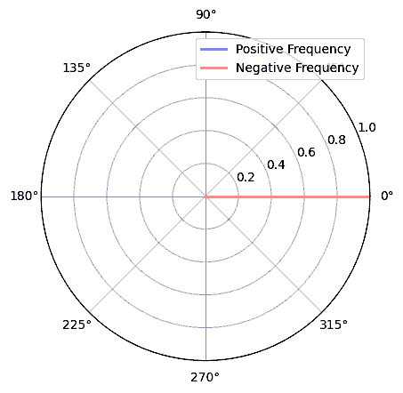
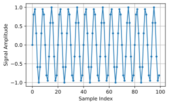
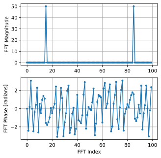
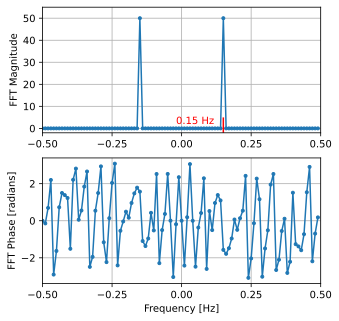

.. _freq-domain-chapter:

#####################
周波数領域
#####################

この章ではPythonによる例を用いて周波数領域の導入を行い、フーリエ級数、フーリエ変換、フーリエ変換の性質、FFT、窓掛け、スペクトログラムについて解説します。

DSPと無線通信を学んでいく中で自然と身につく面白い力の一つが、周波数領域で考える力です。
ほとんどの人にとっての周波数領域を *扱う* 経験といえば、車のオーディオシステムで低音／中音／高音(bass/mid/treble)のつまみを調整することくらいでしょう。
そして *見る* 経験といえば、次のようなオーディオイコライザーの映像を見ることくらいかもしれません。

.. image:: ../_images/audio_equalizer.webp
   :align: center

この章を読み終える頃には、周波数領域の真の意味や時間領域との変換方法(および変換時に何が起こるのか)、そしてDSPやSDRの学習において繰り返し登場する興味深い原理を理解する力が身につきます。
この教材を最後まで終えれば、周波数領域の扱いは必ず完璧になります!

そもそも、なぜ周波数領域で信号を見る理由はなんでしょうか？
以下に、時間領域と周波数領域で示された2つの信号の例を示します。

.. image:: ../_images/time_and_freq_domain_example_signals.png
   :scale: 40 %
   :align: center
   :alt: Two signals in the time domain may look like noise, but in the frequency domain we see additional features

見ての通り、時間領域ではどちらの信号も単なるノイズのように見えますが、周波数領域では異なる特徴が現れます。
すべての信号は本来、時間領域に存在しています。
というのも、周波数領域では *直接* 信号をサンプリングすることはできないため、時間領域でサンプリングすることになるからです。
しかし、面白い現象はたいてい周波数領域で起きているのです。

***************
フーリエ級数
***************

周波数領域の基礎は、あらゆる信号が複数の正弦波(サイン波)の重ね合わせで表現できるという理解から始まります。
信号を正弦波に分解したものをフーリエ級数と呼びます。
以下はたった2つの正弦波だけで構成された信号の例です。

.. image:: ../_images/summing_sinusoids.svg
   :align: center
   :target: ../_images/summing_sinusoids.svg
   :alt: 信号がどのようにして複数の正弦波から構成されるか示した例。フーリエ級数の様子を示している。

別の例を見てみましょう。
下図の赤い曲線は、のこぎり波を最大で10個の正弦波を足し合わせで近似したものです。
完全には信号を復元できていないことがわかります。
のこぎり波の急激な変化が存在するため、復元するためには無限の正弦波が必要です。

.. image:: ../_images/fourier_series_triangle.gif
   :scale: 70 %   
   :align: center
   :alt: 三角波がフーリエ級数により分解される様子を示したアニメーション

ある信号の復元に要する正弦波の数が少ない場合もあれば、無限に必要な場合もありますが、常に限られた数の正弦波で近似可能です。
次の例は、任意の波形を正弦波の重ね合わせで分解しているアニメーションです。

.. image:: ../_images/fourier_series_arbitrary_function.gif
   :scale: 70 %   
   :align: center  
   :alt: 矩形波から構成される任意の関数をフーリエ級数により分解するアニメーション

信号を正弦波に分解する方法を理解する前に、まず正弦波３つの要素をおさらいしましょう：

#. 振幅(amplitude)
#. 周波数(frequency)
#. 位相(phase)

**振幅** は波の「強さ」を、 **周波数** は1秒あたりの波の繰り返し回数を示します。
**位相** は正弦波の時間軸上でのずれを表し、0度から360度(または 0から :math:`2\pi` )の値を取ります。
ただし位相は、何か基準となる信号に対してずれを示す相対的な概念です。
たとえば、同じ周波数を持つ2つの信号の位相が30度ずれている、というように使います。

.. image:: ../_images/amplitude_phase_period.svg
   :align: center
   :target: ../_images/amplitude_phase_period.svg
   :alt: Reference diagram of amplitude, phase, and frequency of a sine wave (a.k.a. sinusoid)
   
ここで「信号」は本質的には、通常は「時間」を変数とする(つまりx軸が時間となる)単なる関数であるということに気づいたかもしれません。
もう一つ覚えやすい要素に、 **周期(period)** があり、これは周波数の逆数です。
周期は正弦波が１サイクルを完了するのに要する時間(秒)を表します。
したがって周波数の単位は1/秒、すなわちHzです。

信号を正弦波の重ね合わせに分解するとき、各正弦波はそれぞれ **振幅**・ **位相** ・ **周波数** を持ちます。
ある **周波数** が元の信号にどれだけ強く含まれていたかは、その正弦波の **振幅** でわかります。
**位相** については今は細かく気にせず、sin() と cos() の唯一の違いは位相(時間)がシフトしていることだと理解すれば大丈夫です。

フーリエ級数を実際に求める方程式よりも、まずはこの考え方をしっかりイメージすることのほうが重要です。
式や導出に興味がある方は、Wolfram MathWorld の解説をご参照ください： https://mathworld.wolfram.com/FourierSeries.html.  

********************
時間・周波数の関係
********************

ここまで、信号は複数の正弦波で表現でき、各正弦波は複数の要素を持つことを学びました。
ここからは、信号を周波数領域でプロットする方法を学びます。
時間領域は信号が時間とともにどのように変化するかを示す一方で、周波数領域は信号がどれくらいの周波数成分を含んでいるかを示します。
横軸(x軸)は時間ではなく周波数になります。
信号は時間領域と周波数領域の *両方* でプロットすることができます。
まずはシンプルな例から見ていきましょう。

下図は、周波数fの正弦波を時間領域と周波数領域でそれぞれ表したものです。

.. image:: ../_images/sine-wave.png
   :scale: 70 % 
   :align: center
   :alt: 正弦波の時間・周波数領域の対応。周波数領域ではインパルスになる。

時間領域での波形は見慣れた形でしょう。
これは振動する関数です。
サイクルの始まりや、どれだけ続くのかを気にする必要はありません。
ここで大事なのは、この信号が **1つの周波数** を持っており、そのため周波数領域では1つのピークが現れるということです。
数学的には、このようなピークは「インパルス」と呼ばれます。

では、逆に時間領域でインパルスがあった場合はどうなるでしょうか？
手を叩いた音や、ハンマーで釘を叩いた音を録音した場合を想像してみてください。
時間・周波数領域の関係は、やや直感と異なるものになります。

.. image:: ../_images/impulse.png
   :scale: 70 % 
   :align: center  
   :alt: 時間領域におけるインパルスのフーリエ変換対は、周波数領域では全体に広がる(すべての周波数を含む)

見ての通り、時間領域にインパルスがあると、周波数領域ではフラットになります。
理論上、これはすべての周波数を含んでいるということです。
理論上の完全なインパルスは時間領域で限りなく短い必要があり、現実には存在しません。
また、正弦波の時と同様、時間領域上のどこでインパルスが現れたかは問題ではありません。
ここでのポイントは、時間領域で急激な変化があると、広範囲に周波数成分が現れるということです。

続いて、 矩形波を時間・周波数領域の両方で見てみましょう

.. image:: ../_images/square-wave.svg
   :align: center 
   :target: ../_images/square-wave.svg
   :alt: 矩形波とそのフーリエ対。周波数領域ではsinc関数(sin(x)/x)となる

これも直感的ではありませんが、周波数領域にはまず基本周波数に対応する大きなピークがあり、さらに高周波側にもピークが現れていることが分かります。
これは先ほどの例と同様、時間領域に急激な変化があるからです。
ただし、周波数はフラットではありません。
ピークが等間隔で現れ、だんだん小さくなっていきます(ただし無限に続きます)。
このように時間領域での矩形波は、周波数領域ではsinc関数(sin(x)/x)になります。

最後に、時間領域で信号が一定値である場合を考えてみましょう。
信号が一定値である場合には周波数成分を持ちません。
以下の図を見てください。

.. image:: ../_images/dc-signal.png
   :scale: 80 % 
   :align: center 
   :alt: DC信号(一定信号)のフーリエ変換対。周波数領域では0 Hzのインパルスになる。

周波数が存在しないため、周波数領域では0 Hzにピークが立ちます。
考えてみると、これは理にかなっています。
時間領域で信号がない場合(つまり信号の値がすべて0である場合)を除き、周波数領域が「空」になることはありません。
周波数領域における0 Hz のことをDCと呼びます。
これは時間領域でDC信号(一定の変化しない信号)によって現れるからです。
また、時間領域でのDC信号の振幅を大きくすれば、周波数領域の0 Hzのピークも比例して大きくなります。

周波数領域におけるy軸(縦軸)が正確には何を表しているのかについては、この後の章で詳しく説明しますが、ひとまずは「その周波数がどれだけ含まれていたかを示す量」だと考えておけば大丈夫です。

*****************
フーリエ変換
*****************

時間領域から周波数領域へ、またその逆への「変換」は、数学的にはフーリエ変換(Fourier Transform)と呼ばれます。
その定義は次のとおりです。

.. math::
   X(f) = \int x(t) e^{-j2\pi ft} dt

信号 :math:`x(t)` に対して、この式を使うことで周波数領域の :math:`X(f)` を得ることができます。
時間領域の関数 :math:`x(t)` や :math:`y(t)` に対応する周波数領域の関数は :math:`X(f)` や :math:`Y(f)` として表します。
ここで :math:`t` は時間(time)を、:math:`f` は周波数(frequency)を表しています。
また :math:`j` は虚数単位で、高校の数学では :math:`i` として見たことがあるかもしれません。
工学や情報分野では、"i" が電流やイテレータを指すことが多いため、代わりに "j" を使います。

周波数領域から時間領域に戻す変換もほとんど同じで、マイナス符号のところだけが異なります。

.. math::
   x(t) = \int X(f) e^{j2\pi ft} df

多くの教科書や資料では :math:`2\pi f` の代わりに :math:`w` が使われていることに注意してください。
角周波数 :math:`w` の単位はrad/sで、:math:`f` はHzです。
覚えておくべき関係は次の通りです。

.. math::
   \omega = 2 \pi f

SDRやRF信号処理の分野ではHzを使うことが一般的なので、多くの式に :math:`2\pi` が追加されることにはなりますが、周波数をHzで統一して考える方が楽です。

上記のフーリエ変換の式は連続型で、数学の問題で目にすることが多いでしょう。
実際のコードの実装は、離散型の式に近いです。

.. math::
   X_k = \sum_{n=0}^{N-1} x_n e^{-\frac{j2\pi}{N}kn}
   
主な違いは、積分が総和に置き換えられている点です。
インデックス :math:`k`` は0からN-1までの範囲を取ります。

これらの数式がピンとこなくても大丈夫です。
実際のところ、DSPやSDRを使って面白いことをするために、これらの式を直接使う必要はあまりありません!

*************************
時間-周波数の性質
*************************

前の章では、時間領域と周波数領域での信号の見え方をいくつかの例を用いて確認しました。
ここでは、5つの重要な「フーリエ変換の性質」を紹介します。
これらは、「時間領域の信号に____をすると、周波数領域の信号に____が起こる」という対応関係を示す性質です。
これらの性質を理解することで、時間領域の信号に対して行うべきDSPの実践的な洞察が得られます。

1. 線形性 (Linearity):

.. math::
   a x(t) + b y(t) \leftrightarrow a X(f) + b Y(f)

この性質は最も理解しやすいでしょう。
時間領域で2つの信号を加算すれば、周波数領域でもその2つの信号の周波数成分が加算されます。
また、一方の信号を定数倍すれば、周波数領域でも同様に定数倍されます。
複数の信号を足し合わせて扱う場面で、この性質の有用性がはっきりとわかるでしょう。

2. 周波数シフト (Frequency Shift):

.. math::
   e^{2 \pi j f_0 t}x(t) \leftrightarrow X(f-f_0)

x(t) の左側の項は複素正弦波または複素指数関数と呼ばれます。
今のところは、これを単に周波数 :math:`f_0` の正弦波だと考えて構いません。
この性質は、信号 :math:`x(t)` に正弦波を掛けると、周波数領域では :math:`X(f)` が :math:`f_0` だけシフトされるということを意味します。
この周波数のシフトの様子は、図で示した方がわかりやすいです。

.. image:: ../_images/freq-shift.svg
   :align: center 
   :target: ../_images/freq-shift.svg
   :alt: 信号が周波数領域で周波数シフトする様子を示した図

多くの理由から信号の周波数を上または下方向にシフトしたい場面があるため、周波数シフトはDSPに必要不可欠です。
この性質は、その方法(すなわち正弦波の乗算)を示しています。
以下ではこの性質をもう1つの観点で可視化しています。

.. image:: ../_images/freq-shift-diagram.svg
   :align: center
   :target: ../_images/freq-shift-diagram.svg
   :alt: 正弦波との乗算による周波数シフトの視覚化

3. 時間領域でのスケーリング:

.. math::
   x(at) \leftrightarrow X\left(\frac{f}{a}\right)

式の左辺では、信号 x(t) を時間領域でスケーリングしています。
以下の例では、信号を時間領域でスケーリングした際の、周波数領域の変化を示しています。

.. image:: ../_images/time-scaling.svg
   :align: center
   :target: ../_images/time-scaling.svg
   :alt: 時間領域および周波数領域でフーリエ変換の時間のスケーリングを示した図

時間のスケーリングとは、信号を時間軸方向に伸縮することです。
この性質が示すのは、時間領域でのスケーリングが、周波数領域では逆スケーリングになるということです。
たとえば、より速くビットを送信すると、より広い帯域幅が必要になります。
この性質は、なぜデータレートが高速であるほど広い帯域を必要とするのかを理解するのに役立ちます。
もし時間と周波数のスケーリングが逆比例でなく正比例だったなら、通信事業者は1秒で好きなだけビットを送信でき、周波数利用料に数十億円も払う必要がなかったでしょう。
残念ながらそうはいきません。

なお、この性質に精通している方は、スケーリング係数が足りないと思うかもしれませんが、理解を簡単にするために省略しています。
実用的には、違いは特にありません。

4. 時間領域での畳み込み:

.. math::
   \int x(\tau) y(t-\tau) d\tau  \leftrightarrow X(f)Y(f)

この性質は、時間領域でx(t)とy(t)を畳み込むため、畳み込みと呼ばれます。
畳み込みについてまだ知らなくても、今は「相互相関(cross-correlation)のようなもの」と思ってもらえれば大丈夫です。
詳しくは :ref:`この章 <convolution-section>` で説明します。
時間領域で信号を畳み込むことは、周波数領域で信号を掛け算することと同じです。
これは2つの信号の加算とは大きく異なります。
加算では周波数領域でも単に加算されるだけでした。
しかし、2つの信号の畳み込みは、元の2つの信号から新しい第3の信号を作るようなものです。
畳み込みはDSPにおいて最も重要な技術の1つですが、十分に理解するにはフィルタの原理をしっかり理解する必要があります。

次に進む前にこの性質がなぜ重要なのかを簡単に説明します。
例えば、あなたが受信したい信号の隣に干渉信号があるとします。

.. image:: ../_images/two-signals.svg
   :align: center
   :target: ../_images/two-signals.svg
   
プログラミングでよく使われるマスキングの考え方をここでも応用してみましょう。
もし、以下のようなマスクを作って、それを上の信号に掛けることで、不要な信号を除去できたらどうなるでしょうか？

.. image:: ../_images/masking.svg
   :align: center
   :target: ../_images/masking.svg

私たちは通常、DSPの処理を時間領域で行うので、畳み込みの性質を利用してこのマスキングを時間領域でどう実現できるか見てみましょう。
たとえば、x(t) が受信信号、Y(f) が周波数領域でのマスクとします。
すると y(t) はそのマスクの時間領域での表現であり、これを x(t) に畳み込めば不要な信号を「フィルタで取り除く」ことができるわけです。

.. tikz:: [font=\Large\bfseries\sffamily]
   \definecolor{babyblueeyes}{rgb}{0.36, 0.61, 0.83}
   \draw (0,0) node[align=center,babyblueeyes]           {E.g., our received signal};
   \draw (0,-4) node[below, align=center,babyblueeyes]   {E.g., the mask}; 
   \draw (0,-2) node[align=center,scale=2]{$\int x(\tau)y(t-\tau)d\tau \leftrightarrow X(f)Y(f)$};   
   \draw[->,babyblueeyes,thick] (-4,0) -- (-5.5,-1.2);
   \draw[->,babyblueeyes,thick] (2.5,-0.5) -- (3,-1.3);
   \draw[->,babyblueeyes,thick] (-2.5,-4) -- (-3.8,-2.8);
   \draw[->,babyblueeyes,thick] (3,-4) -- (5.2,-2.8);
   :xscale: 70

フィルタについて学ぶと、この畳み込みの性質がより明確に理解できるようになります。

5. 周波数領域での畳み込み:

最後に、畳み込みが逆にも成り立つということを紹介しますが、時間領域での畳み込みほど詳しくは説明しません。

.. math::
   x(t)y(t)  \leftrightarrow  \int X(g) Y(f-g) dg

他にもさまざまな性質がありますが、私の考えではここで紹介した5つが最も重要です。
それぞれの性質の証明には立ち入りませんでしたが、ポイントは、私たちが分析と処理を行う上で、実際の信号に何が起きているのか洞察を得られるということです。
数式に囚われすぎないでください。
それぞれの性質の解説をしっかり理解することが大切です。

******************************
高速フーリエ変換
******************************

さて、フーリエ変換に話を戻しましょう。
すでに離散フーリエ変換を紹介しましたが、コーディングする際に使用するのは99.9%、FFT関数であるfft()です。
高速フーリエ変換(Fast Fourier Transform、FFT)は、離散フーリエ変換を高速に計算するためのアルゴリズムです。
数十年前に開発され、いくつかのバリエーションがあるものの、今でも離散フーリエ変換を計算する最も強力な手段です。
「Fast」という名前のアルゴリズムが本当に高速であったのは幸運でした。

FFTは1つの入力と1つの出力を持つ関数で、時間領域の信号を周波数領域に変換します。

.. image:: ../_images/fft-block-diagram.svg
   :align: center
   :target: ../_images/fft-block-diagram.svg
   :alt: FFTは時間領域の入力と周波数領域の出力を持つ関数
   
この教材では、1次元のFFTのみを扱います(2次元のFFTは画像処理などの分野で使用されます)。
ここではFFT関数を、サンプルのベクトルという1つの入力と、サンプルに対応した周波数領域のベクトルという1つの出力を持つものだと考えてください。
出力のサイズは、常に入力と同じです。
たとえば、FFTに1,024個のサンプルを入力すれば、出力も1,024個になります。
少しややこしいのは、出力は常に周波数領域なので、プロットするx軸の「間隔」は時間領域のサンプル数に依存しないということです。
これを可視化して、入力と出力の配列と、各インデックスの単位を見てみましょう。

.. image:: ../_images/fft-io.svg
   :align: center
   :target: ../_images/fft-io.svg
   :alt: FFT関数の入力(秒)と出力(帯域幅)の形式の参考図。周波数ビン、Δt(時間分解能)、およびΔf(周波数分解能)を示す。

出力が周波数領域であるため、x軸の間隔はサンプリングレートに基づきます(この内容は次章で詳しく扱います)。
FFTの入力にサンプルを多く渡すと、周波数領域での分解能が上がります(同時に処理するサンプル数が増えます)。
ただし、入力のサンプルを多くすることで、より広い周波数が「見える」わけではありません。
より高い周波数を扱うには、サンプリングレートを上げる(サンプル周期 :math:`\Delta t` を小さくする)しかないのです。

FFTの出力はどうプロットするのでしょうか?
たとえば、サンプリングレートが毎秒100万サンプル(1 MHz)だったとしましょう。
次章で詳しく学びますが、この場合、入力するサンプル数に関係なく、FFTで観測できるのは最大0.5 MHzまでの信号になります。
FFTの出力がどう表現されるかを見てみましょう。

.. image:: ../_images/negative-frequencies.svg
   :align: center
   :target: ../_images/negative-frequencies.svg
   :alt: 負の周波数の導入。

:math:`f_s` をサンプリングレートとした時、FFTの出力は常に :math:`\text{-} f_s/2` から :math:`f_s/2` になります。
つまり、出力は常に正と負の周波数成分を含んでいます。
もし入力が複素数であれば、正の成分と負の成分の値は異なりますが、実数ならば同じになります。

また、各周波数ビン(FFT出力のインデックス)に対応する周波数間隔は :math:`f_s/N` Hz です。
したがって、より多くのサンプルをFFTに入力することで、より細かい周波数分解能が得られます。
なお、初学者が気にする必要のない非常に細かい点として、最後のインデックスが *ぴったり* :math:`f_s/2` に対応するわけではありません。
正確には :math:`f_s/2 - f_s/N` ですが、N が大きければ :math:`f_s/2` に近似できます。

********************
負の周波数
********************

負の周波数とはいったい何でしょうか？
今の段階では、負の周波数は複素数(虚数)を使うことに関係があるとだけ理解しておいてください。
実際にRF信号を送受信する際に負の周波数が存在するわけではなく、あくまで表現上のものです。
直感的に理解するための例を挙げましょう。
たとえば、SDRを100 MHz(FM放送の帯域)にチューニングし、サンプリングレートを10 MHzに設定したとします。
つまり、私たちは95 MHzから105 MHzまでのスペクトルを観測することになります。
おそらくその中には3つの信号が存在しているかもしれません。

.. image:: ../_images/negative-frequencies2.svg
   :align: center
   :target: ../_images/negative-frequencies2.svg
   
そして、SDRが出力するサンプルは次のように見えるでしょう。

.. image:: ../_images/negative-frequencies3.svg
   :align: center
   :target: ../_images/negative-frequencies3.svg
   :alt: 負の周波数は、SDRがチューニングされた中心周波数(キャリア周波数とも呼ばれる)よりも下の周波数を表すだけです。

SDRが100 MHzにチューニングされていたことを思い出してください。
つまり、約97.5 MHzにあった信号は、デジタル的には-2.5 MHzとして表されることになります。
これは技術的には「負の周波数」となりますが、実際には単に中心周波数よりも低い周波数というだけです。

数学的な観点から見ると、負の周波数は複素指数関数 :math:`e^{2j \pi f t}` から理解できます。
周波数が負の場合、それは反対方向に回転する複素正弦波になることがわかります。

.. math::
   e^{2j \pi f t} = \cos(2j \pi f t) + j \sin(2j \pi f t) \quad \mathrm{\textcolor{blue}{blue}}

.. math::
   e^{2j \pi (-f) t} = \cos(2j \pi f t) - j \sin(2j \pi f t) \quad \mathrm{\textcolor{red}{red}}

上記で複素指数関数を使った理由は、:math:`cos()` あるいは :math:`sin()` が実は正と負の周波数の両方を含んでいるからです。
これは、周波数 :math:`f` 、時間 :math:`t` の正弦波に対してオイラーの公式を適用することで分かります。

.. math::
   \cos(2 \pi f t) = \underbrace{\frac{1}{2} e^{2j \pi f t}}_\text{positive} + \underbrace{\frac{1}{2} e^{-2j \pi f t}}_\text{negative}

.. math::
   \sin(2 \pi f t) = \underbrace{\frac{1}{2j} e^{2j \pi f t}}_\text{positive} - \underbrace{\frac{1}{2j} e^{-2j \pi f t}}_\text{negative}

従って、RF信号処理ではコサインやサインの代わりに複素指数関数を使うことが一般的です。

****************************
時間の順序は関係ない
****************************

FFTは1度に多数のサンプルに対して実行されることを思い出してください。
つまり、ある1時点の(1つの)サンプルでは周波数領域を観測することはできず、ある程度のスパンの時間(多数のサンプル)が必要になります。
FFT関数は入力信号を「かき混ぜて」出力を生成しますが、この出力は異なるスケールと単位を持っています。
つまり、我々はもう時間領域にはいないのです。
この時間領域と周波数領域の違いを理解する良い方法は、時間領域での出来事の順序を入れ替えても、信号の周波数成分は変わらないという点を理解することです。
つまり、以下の2つの信号に対して **1回だけ** FFTを実行した場合、どちらも同じ2つのピークが現れます。
なぜなら、どちらの信号も異なる周波数を持つ2つの正弦波で構成されているからです。
正弦波が発生する順番を変えても、それが「異なる周波数を持つ2つの正弦波」であることには変わりありません。
ただしこれは、両方の正弦波がFFTに渡される時間スパン内に収まっていることを前提としています。
FFTのサイズを小さくして複数回FFTを実行する場合(これはスペクトログラムのセクションで扱います)には、2つの正弦波を区別することが可能になります。

.. image:: ../_images/fft_signal_order.png
   :scale: 50 % 
   :align: center
   :alt: サンプルのセットに対してFFTを実行するとき、それらのサンプル内で異なる周波数が発生した時間の順序は、FFT出力に影響を与えない

厳密には、正弦波の時間シフトによってFFTの位相は変化します。
しかし、本書の最初の数章では、主にFFTの振幅に注目します。

*******************
PythonによるFFT
*******************

これまでにFFTとは何か、その出力がどのように表現されるかを学びました。
ここからは、実際にPythonのコードを見てNumPyのFFT関数 np.fft.fft() を使ってみましょう。
可能であれば、PC上のPythonのコンソールやIDEを使うことをおすすめしますが、急ぎの場合は、左のナビゲーションバーの一番下にあるリンクからWebベースのPythonのコンソールを使うこともできます。

まずは時間領域の信号を作成する必要があります。
お手元のPythonのコンソールで一緒に試してみてください。
今回はシンプルに、0.15 Hzの正弦波を作ります。
サンプリング周波数は1 Hzとし、したがって0秒、1秒、2秒、3秒...というようにサンプリングします。

.. code-block:: python

 import numpy as np
 t = np.arange(100)
 s = np.sin(0.15*2*np.pi*t)

:code:`s` は以下のようになります。

次に、NumPyのFFT関数を見てみましょう。

.. code-block:: python

 S = np.fft.fft(s)

:code:`S` を見ると、複素数の配列であることがわかります。

.. code-block:: python

    S =  array([-0.01865008 +0.00000000e+00j, -0.01171553 -2.79073782e-01j,0.02526446 -8.82681208e-01j,  3.50536075 -4.71354150e+01j, -0.15045671 +1.31884375e+00j, -0.10769903 +7.10452463e-01j, -0.09435855 +5.01303240e-01j, -0.08808671 +3.92187956e-01j, -0.08454414 +3.23828386e-01j, -0.08231753 +2.76337148e-01j, -0.08081535 +2.41078885e-01j, -0.07974909 +2.13663710e-01j,...

ヒント：何をしているかにかかわらず、複素数列が出てきたら振幅と位相を計算してみると、理解が進むことがあります。
実際に振幅と位相をプロットしてみましょう。
複素数の絶対値を求めるには多くの言語で abs() 関数を使います。
位相の取得方法は言語によって異なりますが、PythonではNumPyの :code:`np.angle()` を使ってラジアン単位で位相を取得できます。

.. code-block:: python

 import matplotlib.pyplot as plt
 S_mag = np.abs(S)
 S_phase = np.angle(S)
 plt.plot(t,S_mag,'.-')
 plt.plot(t,S_phase,'.-')

今はx軸の目盛りを指定していないため、単に配列のインデックス(0からのカウント)が表示されています。
数学的な理由により、FFTの出力は次のようなフォーマットになります。

.. image:: ../_images/fft-python3.svg
   :align: center
   :target: ../_images/fft-python3.svg
   :alt: FFTシフトを行う前のFFT出力の並び
   
しかし、見やすくするために、0 Hz(DC)を中央に、負の周波数を左側に表示するのが望ましいです。
そのためには、FFTの後に「FFTシフト」と呼ばれる処理を行います。
これは配列の単純な並び替え処理で、単純な循環シフトのようでもありますが、実のところは「これをあそこに、あれをここに置く」といった操作です。
下図にFFTシフト操作の完全な定義を示しています。

.. image:: ../_images/fft-python4.svg
   :align: center
   :target: ../_images/fft-python4.svg
   :alt: FFTシフト関数の参考図。正と負の周波数、DC成分の位置を示す。

NumPyにはこのFFTシフトのための関数 :code:`np.fft.fftshift()` が用意されています。
np.fft.fft()の行を次のように書き換えましょう。

.. code-block:: python

 S = np.fft.fftshift(np.fft.fft(s))

また、x軸の値とラベルも考慮する必要があります。
簡単にするためにサンプリング周波数を1 Hzに設定したのを思い出してください。
これは、周波数領域のプロットの左端が-0.5 Hz、右端が0.5 Hzとなることを意味します。
これがピンとこなくても、:ref:`sampling-chapter` を読めば納得できるようになります。
ここではサンプリング周波数が1 Hzであるという前提に従い、FFTの出力の振幅と位相を適切なx軸ラベル付きでプロットしてみましょう。
以下がその最終的なPythonコードと出力です。

.. code-block:: python

 import numpy as np
 import matplotlib.pyplot as plt
 
 Fs = 1 # Hz
 N = 100 # number of points to simulate, and our FFT size
 
 t = np.arange(N) # because our sample rate is 1 Hz
 s = np.sin(0.15*2*np.pi*t)
 S = np.fft.fftshift(np.fft.fft(s))
 S_mag = np.abs(S)
 S_phase = np.angle(S)
 f = np.arange(Fs/-2, Fs/2, Fs/N)
 plt.figure(0)
 plt.plot(f, S_mag,'.-')
 plt.figure(1)
 plt.plot(f, S_phase,'.-')
 plt.show()

正弦波を作成した時の周波数である0.15 Hzにピークが現れていることに注目してください。
したがって、FFTはうまく機能していることがわかります!
仮に正弦波を生成したコードを知らなかったとしても、サンプルのリストがあればFFTを使って周波数を特定することができます。
-0.15 Hzの位置にもピークが見えているのは、信号が複素数ではなく実数だったためで、この点については後ほど詳しく扱います。

******************************
窓掛け
******************************

FFTを使って信号の周波数成分を測定する際、FFTは入力が *周期的* 信号であると仮定して処理します。
つまり、与えられた信号が無限に繰り返されるという前提で動作します。
あたかも最後のサンプルが最初のサンプルとつながってループしているかのように扱われます。
これはフーリエ変換の理論に由来します。
そしてこれは、最初と最後のサンプルの間の急激な変化を避けるべきであるということを意味します。
なぜなら、時間領域での急激な変化があると、周波数領域で多くの周波数があるように見えてしまいますが、実際には、最後のサンプルと最初のサンプルは連続していないからです。
簡単に言うと、たとえば100個のサンプルに対して :code:`np.fft.fft(x)` を使ってFFTを行う場合、:code:`x[0]` と :code:`x[99]` が等しいか、近いことが望ましいです。

このようなFFTの周期的な性質を補うために使われるのが「窓掛け(windowing)」です。
FFTを行う直前に、両端がゼロに向かってなだらかに減衰していくような窓関数を信号に乗算します。
これにより、信号の開始と終了がゼロとなって繋がります。
よく使われる窓関数には、ハミング(Hamming)、ハニング(Hanning)、ブラックマン(Blackman)、カイザー(Kaiser)ウィンドウなどがあります。
ウィンドウを使わない場合は、すべて1の配列を掛けることになるため、矩形(rectangular)ウィンドウと呼ばれます。
以下の図は、窓関数がどのような形をしているかを示しています。

.. image:: ../_images/windows.svg
   :align: center
   :target: ../_images/windows.svg
   :alt: 矩形、ハミング、ハニング、ブラックマン、カイザーウィンドウの時間および周波数領域における関数

初めはハミングウィンドウを使用するのが無難です。
Pythonでは、:code:`np.hamming(N)` を使用してハミング窓を作成できます。
ここで、Nは配列の要素数、すなわちFFTのサイズです。
先ほどの演習では、FFTの直前に窓関数を適用します。
具体的には、2行目のコードの後に以下を挿入します。

.. code-block:: python

 s = s * np.hamming(100)

窓関数の選択で迷う必要はありません。
ハミング、ハニング、ブラックマン、カイザーウィンドウの違いは、窓関数を全く使用しない場合と比較すると非常に小さいものです。
なぜならこれらの窓関数は全て、両端が0になるように減衰することで基本的な問題を解決しているという性質を持つからです。

*******************
FFTのサイズ
*******************

最後にFFTのサイズについて説明します。
FFTの最適なサイズは常に2の累乗です。
これは、FFTがそのように実装されているからです。
2の累乗でないサイズも使用できますが、その場合には処理速度が遅くなります。
一般的なサイズは128から4,096の範囲ですが、より大きなサイズも使用可能です。
実際には、数百万や数十億サンプルの長さの信号を処理する必要があるため、信号を分割して何度もFFTを実行することになります。
従って、多くの出力が得られます。
これらの出力の平均を取ることもできますし、(特に信号が時間とともに変化する場合)時間軸上でプロットすることもできます。
信号のちゃんとした周波数領域の表現を得るために、 *全て* のサンプルにFFTを適用する必要はありません。
例えば、信号の中から100kサンプルごとに1,024サンプルだけFFTを実行しても、信号が存在している間は十分な結果が得られるでしょう。

.. _spectrogram-section:

*********************
スペクトログラム／ウォーターフォール
*********************

スペクトログラム(spectrogram)は、時間に対する周波数の変化を示すプロットです。
これは、複数のFFTを積み重ねて表示したものです。
横軸に周波数を配置する場合は縦方向に積み重ねます。
リアルタイムに表示することもでき、この場合はウォーターフォール(waterfall)とも呼ばれます。
スペクトラムアナライザー(spectrum analyzer)は、スペクトログラムあるいはウォーターフォールを表示する装置です。
以下の図は、IQサンプルの配列をスライしてスペクトログラムを形成する方法を示しています。

.. image:: ../_images/spectrogram_diagram.svg
   :align: center
   :target: ../_images/spectrogram_diagram.svg
   :alt: FFTのスライスが並べれられ、スタックされて時間-周波数のプロットとなることを示したスペクトログラム(ウォーターフォールとも呼ばれる)

スペクトログラムは2次元データをプロットしているので、実質的には3次元プロットとなります。
そのため、プロットしたい値であるFFTの振幅を表現するためにカラーマップを使用します。
以下は、x軸(横軸)に周波数、y軸(縦軸)に時間を取ったスペクトログラムの例です。
青は最も低いエネルギーを、赤は最も高いエネルギーを示します。
中央のDC(0Hz)にエネルギーが集中していることがわかり、その周囲で信号が変動していることがわかります。
青はノイズフロア(noise floor)を表しています。

.. image:: ../_images/waterfall.png
   :scale: 120 % 
   :align: center 

これは単に複数のFFTを縦に並べたものであるということを忘れないでください。
各行は1つのFFT(正確には、1つのFFTの振幅)です。
入力信号は、FFTサイズ(例えば1024サンプル)ごとに時間方向でスライスされていなくてはなりません。
スペクトログラムを生成するコードに入る前に、例として使用する信号を示します。
これはホワイトノイズ下でのトーン(単一周波数の信号)です。

.. code-block:: python

 import numpy as np
 import matplotlib.pyplot as plt
 
 sample_rate = 1e6
 
 # トーンとノイズを生成
 t = np.arange(1024*1000)/sample_rate # 時間ベクトル
 f = 50e3 # 浸透の周波数
 x = np.sin(2*np.pi*f*t) + 0.2*np.random.randn(len(t))

以下は、最初の200サンプルを示した時間領域での信号です。

.. image:: ../_images/spectrogram_time.svg
   :align: center
   :target: ../_images/spectrogram_time.svg

Pythonでは、以下のようにしてスペクトログラムを生成できます。

.. code-block:: python

 # 上の模擬信号を使うか、ご自身の信号を使用してください
  
 fft_size = 1024
 num_rows = len(x) // fft_size # //は小数点以下を切り捨てる演算
 spectrogram = np.zeros((num_rows, fft_size))
 for i in range(num_rows):
     spectrogram[i,:] = 10*np.log10(np.abs(np.fft.fftshift(np.fft.fft(x[i*fft_size:(i+1)*fft_size])))**2)
 
 plt.imshow(spectrogram, aspect='auto', extent = [sample_rate/-2/1e6, sample_rate/2/1e6, len(x)/sample_rate, 0])
 plt.xlabel("Frequency [MHz]")
 plt.ylabel("Time [s]")
 plt.show()

これにより以下のようなスペクトログラムが生成されますが、時間変化がないためそれほど面白くはありません。
2つのトーンが見えるのは実数信号をシミュレーションしているためで、実数信号はパワースペクトル密度(Power Spectral Density、PSD)が正と負で常に対称になります。
もっと面白いスペクトログラムの例は、https://www.IQEngine.org をチェックしてみてください！

.. image:: ../_images/spectrogram.svg
   :align: center
   :target: ../_images/spectrogram.svg

*********************
FFTの実装
*********************

NumPyがすでにFFTを実装してくれているとはいえ、その仕組みの基本を知っておくのは良いことです。
最も広く使われているFFTアルゴリズムは Cooley-Tukey FFTアルゴリズムで、1805年頃にカール・フリードリヒ・ガウス(Carl Friedrich Gauss)によって初めて考案され、その後1965年にジェームズ・クーリー(James Cooley)とジョン・トゥーキー(John Tukey)によって再発見され普及しました。

このアルゴリズムの基本的なバージョンでは、FFTのサイズが2の累乗であるときに動作します。
入力が複素数であるであることが意図されていますが、実数を入力することも可能です。
このアルゴリズムの構成要素はバタフライ(butterfly)として知られています。
バタフライはN = 2のFFTに相当し、2つの乗算と2つの加算から成り立ちます。

.. image:: ../_images/butterfly.svg
   :align: center
   :target: ../_images/butterfly.svg
   :alt: Cooley-Tukey FFT algorithm butterfly radix-2

数式で表すと以下のようになります。

.. math::
   y_0 = x_0 + x_1 w^k_N

   y_1 = x_0 - x_1 w^k_N

ここで、:math:`w^k_N = e^{j2\pi k/N}` は回転子(twiddle factor)と呼ばれます(:math:`N` はsub-FFTのサイズで :math:`k` はインデックスです)。
入力・出力は複素数であることを想定しており、例えば :math:`x_0` は0.6123 - 0.5213j のようになります。
加算・乗算の結果も複素数です。

このアルゴリズムは全てがバタフライで表現できるまで再起的に分割を行います。
以下はサイズ8のFFTに対するこの処理を以下に示します。

.. image:: ../_images/butterfly2.svg
   :align: center
   :target: ../_images/butterfly2.svg
   :alt: サイズが8の時のCooley-Tukey FFTアルゴリズム

この図における各列は、並列に実行可能な一連の処理を表しており、それぞれの処理ステップ数は :math:`log_2(N)` になります。
従って、DFTの計算量がO(:math:`N^2`)であるのに対し、FFTの計算量は O(:math:`N\log N`) となります。

式よりもコードで考えたい人向けに、以下にFFTのPythonによる簡単な実装を示します。
例としてトーン信号とノイズの合成信号に対してこのFFTを試してみましょう。

.. code-block:: python

 import numpy as np
 import matplotlib.pyplot as plt
 
 def fft(x):
     N = len(x)
     if N == 1:
         return x
     twiddle_factors = np.exp(-2j * np.pi * np.arange(N//2) / N)
     x_even = fft(x[::2]) # 再帰ばんざい！
     x_odd = fft(x[1::2])
     return np.concatenate([x_even + twiddle_factors * x_odd,
                            x_even - twiddle_factors * x_odd])
 
 # トーン+ノイズをシミュレーション
 sample_rate = 1e6
 f_offset = 0.2e6 #　キャリア(搬送波)からの200 kHzのオフセット
 N = 1024
 t = np.arange(N)/sample_rate
 s = np.exp(2j*np.pi*f_offset*t)
 n = (np.random.randn(N) + 1j*np.random.randn(N))/np.sqrt(2) # 単位複素ノイズ (unity complex noise)
 r = s + n # 0 dB SNR
 
 # FFTをかけて、スペクトルを中心周波数に並べ替え（fftshift）、デシベル単位に変換する
 X = fft(r)
 X_shifted = np.roll(X, N//2) # np.fft.fftshift と同等
 X_mag = 10*np.log10(np.abs(X_shifted)**2)
 
 # 結果をプロット
 f = np.linspace(sample_rate/-2, sample_rate/2, N)/1e6 # MHz単位で描画
 plt.plot(f, X_mag)
 plt.plot(f[np.argmax(X_mag)], np.max(X_mag), 'rx') # 最大値を表示
 plt.grid()
 plt.xlabel('Frequency [MHz]')
 plt.ylabel('Magnitude [dB]')
 plt.show()

.. image:: ../_images/fft_in_python.svg
   :align: center
   :target: ../_images/fft_in_python.svg
   :alt: PythonによるFFTの実装例

JavaScriptやWebAssemblyでのFFT実装に興味がある方は、WebやNode.jsアプリケーションでFFTを実行できる `WebFFT <https://github.com/IQEngine/WebFFT>`_ ライブラリをチェックしてみてください。
内部に複数の実装が含まれており、それぞれの実装の性能を比較するための `ベンチマークツール <https://webfft.com>`_ も用意されています。
