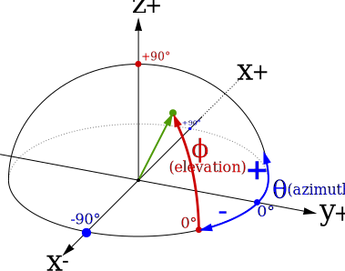
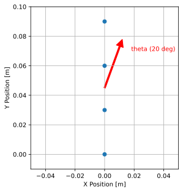
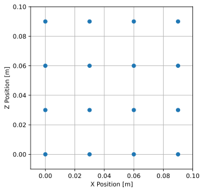
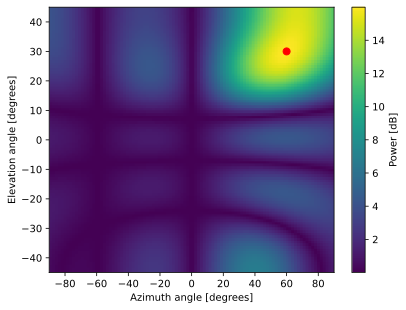
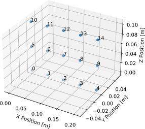
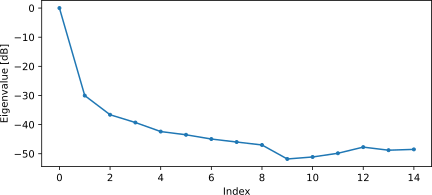
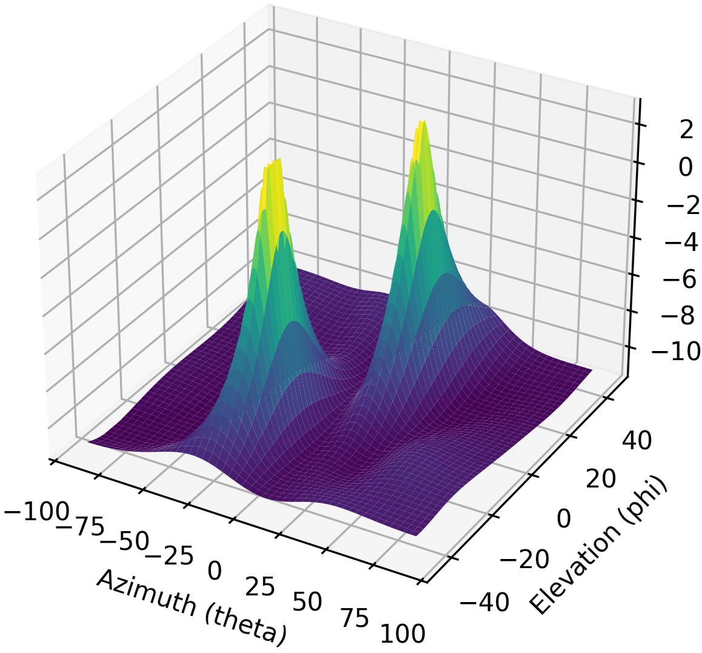
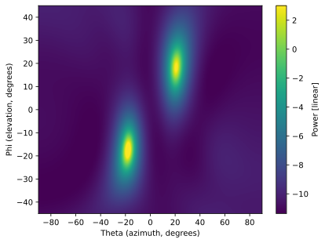

.. _2d-beamforming-chapter:

#################
2D-bundelvorming
#################

Dit hoofdstuk breidt het 1D-hoofdstuk over bundelvorming/DOA uit naar 2D-arrays. We starten met een eenvoudige rechthoekige array en leiden de stuurvectorvergelijking en MVDR-bundelvormer af, daarna werken we met echte data van een 3x5-array. Tot slot gebruiken we de interactieve tool om de effecten van verschillende arraygeometrieen en elementafstand te verkennen.

****************************************
Rechthoekige Arrays en 2D-bundelvorming
****************************************

Rechthoekige arrays (ook wel planaire arrays) bestaan uit een 2D-array van elementen. Met een extra dimensie komt wat extra complexiteit, maar dezelfde basisprincipes blijven gelden, en het lastigste deel is het visualiseren van de resultaten (geen eenvoudige polaire grafieken meer, maar 3D-oppervlakteplots). Ook al is onze array nu 2D, dat betekent niet dat we aan elke datastructuur een extra dimensie moeten toevoegen. Zo houden we de gewichten gewoon als een 1D-array van complexe getallen. Wel moeten we de posities van onze elementen in 2D representeren. We blijven :code:`theta` gebruiken voor de azimuthoek, maar introduceren nu ook :code:`phi`, de elevatiehoek. Er bestaan meerdere conventies voor bolcoordinaten, maar wij gebruiken de volgende:

Dat komt overeen met:

.. math::

 x = \sin(\theta) \cos(\phi)

 y = \cos(\theta) \cos(\phi)

 z = \sin(\phi)

We stappen ook over op een gegeneraliseerde stuurvectorvergelijking, die niet aan een specifieke arraygeometrie is gebonden:

.. math::

   s = e^{2j \pi \boldsymbol{p} u / \lambda}

waarbij :math:`\boldsymbol{p}` de verzameling x/y/z-posities van de elementen in meter is (grootte :code:`Nr` x 3) en :math:`u` de richting is waar we naartoe willen wijzen als een eenheidsvector in x/y/z (grootte 3x1). In Python ziet dat er zo uit:

.. code-block:: python

 def steering_vector(pos, dir):
     #                           Nrx3  3x1   
     return np.exp(2j * np.pi * pos @ dir / wavelength) # outputs Nr x 1 (column vector)

Laten we deze gegeneraliseerde stuurvectorvergelijking toepassen op een eenvoudige ULA met 4 elementen, zodat de koppeling met eerdere stof duidelijk blijft. We drukken :code:`d` nu uit in meters in plaats van relatief ten opzichte van de golflengte. We plaatsen de elementen langs de y-as:

.. code-block:: python

 Nr = 4
 fc = 5e9
 wavelength = 3e8 / fc
 d = 0.5 * wavelength # in meters

 # We will store our element positions in a list of (x,y,z)'s, even though it's just a ULA along the y-axis
 pos = np.zeros((Nr, 3)) # Element positions, as a list of x,y,z coordinates in meters
 for i in range(Nr):
     pos[i,0] = 0     # x position
     pos[i,1] = d * i # y position
     pos[i,2] = 0     # z position

De onderstaande afbeelding toont een bovenaanzicht van de ULA, met als voorbeeld een theta van 20 graden.

Het enige dat nog rest is het koppelen van onze oude :code:`theta` aan deze nieuwe aanpak met eenheidsvectoren. We kunnen :code:`dir` eenvoudig uit :code:`theta` berekenen: de x- en z-component van de eenheidsvector zijn 0 omdat we nog in 1D werken, en volgens onze bolcoordinatenconventie is de y-component :code:`np.cos(theta)`, dus de volledige code is :code:`dir = np.asmatrix([0, np.cos(theta_i), 0]).T`. Op dit punt kun je de gegeneraliseerde stuurvectorvergelijking koppelen aan de ULA-stuurvectorvergelijking die we al gebruikten. Probeer deze nieuwe code uit, kies een :code:`theta` tussen 0 en 360 graden (vergeet niet om naar radialen om te rekenen!), en de stuurvector moet een 4x1-array zijn.

Laten we nu naar het 2D-geval gaan. We plaatsen onze array in het X-Z-vlak, met kijkrichting horizontaal gericht naar de positieve y-as (:math:`\theta = 0`, :math:`\phi = 0`). We gebruiken dezelfde elementafstand als eerder, maar nu hebben we in totaal 16 elementen:

.. code-block:: python

 # Now let's switch to 2D, using a 4x4 array with half wavelength spacing, so 16 elements total
 Nr = 16
 
 # Element positions, still as a list of x,y,z coordinates in meters, we'll place the array in the X-Z plane
 pos = np.zeros((Nr,3))
 for i in range(Nr):
     pos[i,0] = d * (i % 4)  # x position
     pos[i,1] = 0            # y position
     pos[i,2] = d * (i // 4) # z position

Bovenaanzicht van onze rechthoekige 4x4-array:

Om naar een bepaalde theta en phi te wijzen, moeten we die hoeken omzetten naar een eenheidsvector. We gebruiken dezelfde gegeneraliseerde stuurvectorvergelijking als eerder, maar nu berekenen we de eenheidsvector op basis van zowel theta als phi, met de vergelijkingen uit het begin van dit hoofdstuk:

.. code-block:: python

 # Let's point towards an arbitrary direction
 theta = np.deg2rad(60) # azimith angle
 phi = np.deg2rad(30) # elevation angle

 # Using our spherical coordinate convention, we can calculate the unit vector:
 def get_unit_vector(theta, phi):  # angles are in radians
     return np.asmatrix([np.sin(theta) * np.cos(phi), # x component
                         np.cos(theta) * np.cos(phi), # y component
                         np.sin(phi)]).T              # z component
 
 dir = get_unit_vector(theta, phi)
 # dir is a 3x1
 # [[0.75     ]
 #  [0.4330127]
 #  [0.5      ]]

Laten we nu onze gegeneraliseerde stuurvectorfunctie gebruiken om de stuurvector te berekenen:

.. code-block:: python

 s = steering_vector(pos, dir)
 
 # Use the conventional beamformer, which is simply the weights equal to the steering vector, plot the beam pattern
 w = s # 16x1 vector of weights

Het is belangrijk om op te merken dat we bij de stap van 1D naar 2D de dimensies van de datastructuren niet echt hebben aangepast: we hebben nu alleen niet-nul x/y/z-componenten. De stuurvectorvergelijking blijft hetzelfde en de gewichten blijven een 1D-array. Het kan verleidelijk zijn om gewichten als 2D-array op te slaan zodat dit visueel bij de arraygeometrie past, maar dat is niet nodig en 1D is doorgaans beter. Voor elk element bestaat er een corresponderend gewicht, en de volgorde van de gewichten is dezelfde als die van de elementposities.

Het bundelpatroon dat bij deze gewichten hoort visualiseren is wat complexer, omdat we een 3D-plot of een 2D-heatmap nodig hebben. We scannen :code:`theta` en :code:`phi` om een 2D-array met vermogensniveaus te krijgen, en plotten die vervolgens met :code:`imshow()`. De code hieronder doet precies dat, en het resultaat staat in de figuur eronder, inclusief een punt op de eerder gekozen hoek:

.. code-block:: python

    resolution = 100 # number of points in each direction
    theta_scan = np.linspace(-np.pi/2, np.pi/2, resolution) # azimuth angles
    phi_scan = np.linspace(-np.pi/4, np.pi/4, resolution) # elevation angles
    results = np.zeros((resolution, resolution)) # 2D array to store results
    for i, theta_i in enumerate(theta_scan):
        for j, phi_i in enumerate(phi_scan):
            a = steering_vector(pos, get_unit_vector(theta_i, phi_i)) # array factor
            results[i, j] = np.abs(w.conj().T @ a)[0,0] # power in signal, looks better as linear
    plt.imshow(results.T, extent=(theta_scan[0]*180/np.pi, theta_scan[-1]*180/np.pi, phi_scan[0]*180/np.pi, phi_scan[-1]*180/np.pi), origin='lower', aspect='auto', cmap='viridis')
    plt.colorbar(label='Power [linear]')
    plt.scatter(theta*180/np.pi, phi*180/np.pi, color='red', s=50) # Add a dot at the correct theta/phi
    plt.xlabel('Azimuth angle [degrees]')
    plt.ylabel('Elevation angle [degrees]')
    plt.show()

Laten we nu echte samples simuleren; we voegen twee toon-stoorzenders toe die uit verschillende richtingen aankomen:

.. code-block:: python

 N = 10000 # number of samples to simulate
 
 jammer1_theta = np.deg2rad(-30)
 jammer1_phi = np.deg2rad(10)
 jammer1_dir = get_unit_vector(jammer1_theta, jammer1_phi)
 jammer1_s = steering_vector(pos, jammer1_dir) # Nr x 1
 jammer1_tone = np.exp(2j*np.pi*0.1*np.arange(N)).reshape(1,-1) # make a row vector
 
 jammer2_theta = np.deg2rad(10)
 jammer2_phi = np.deg2rad(50)
 jammer2_dir = get_unit_vector(jammer2_theta, jammer2_phi)
 jammer2_s = steering_vector(pos, jammer2_dir)
 jammer2_tone = np.exp(2j*np.pi*0.2*np.arange(N)).reshape(1,-1) # make a row vector
 
 noise = np.random.normal(0, 1, (Nr, N)) + 1j * np.random.normal(0, 1, (Nr, N)) # complex Gaussian noise
 r = jammer1_s @ jammer1_tone + jammer2_s @ jammer2_tone + noise # produces 16 x 10000 matrix of samples

Voor de volledigheid berekenen we nu de MVDR-bundelvormergewichten richting de theta en phi die we eerder gebruikten (een eenheidsvector in die richting staat nog steeds in :code:`dir`):

.. code-block:: python

 s = steering_vector(pos, dir) # 16 x 1
 R = np.cov(r) # Covariance matrix, 16 x 16
 Rinv = np.linalg.pinv(R)
 w = (Rinv @ s)/(s.conj().T @ Rinv @ s) # MVDR/Capon equation

In plaats van naar een matige 3D-plot van het bundelpatroon te kijken, gebruiken we een alternatieve methode om te controleren of deze gewichten logisch zijn: we evalueren de respons van de gewichten voor verschillende richtingen en berekenen het vermogen in dB. We beginnen met de richting waarnaar we wijzen:

.. code-block:: python

 # Power in the direction we are pointing (theta=60, phi=30, which is still saved as dir):
 a = steering_vector(pos, dir) # array factor
 resp = w.conj().T @ a # scalar
 print("Power in direction we are pointing:", 10*np.log10(np.abs(resp)[0,0]), 'dB')

Dit geeft 0 dB, wat we verwachten omdat het doel van MVDR is om eenheidsvermogen in de gewenste richting te realiseren. Laten we nu ook het vermogen controleren in de richtingen van de twee jammers, plus een willekeurige richting en een richting die een graad afwijkt van de gewenste richting (dezelfde code, alleen :code:`dir` wijzigen). De resultaten staan in de tabel hieronder:

.. list-table::
   :widths: 70 30
   :header-rows: 1

   * - Direction Pointed
     - Gain
   * - :code:`dir` (direction used to find MVDR weights)
     - 0 dB
   * - Jammer 1
     - -17.488 dB
   * - Jammer 2
     - -18.551 dB
   * - 1 degree off from :code:`dir` in both :math:`\theta` and :math:`\phi`
     - -0.00683 dB
   * - Een willekeurige richting
     - -10.591 dB

Je resultaten kunnen verschillen door de willekeurige ruis die wordt gebruikt om de ontvangen samples te berekenen, waarmee vervolgens :code:`R` wordt bepaald. De hoofdboodschap is echter dat de jammers in een null terechtkomen met zeer laag vermogen, de richting die 1 graad afwijkt van :code:`dir` net onder 0 dB zit maar nog in de hoofdlob, en dat een willekeurige richting meestal lager is dan 0 dB maar hoger dan de jammers, en sterk kan variëren per simulatie-run. Let op dat MVDR een versterking van 0 dB in de hoofdlob geeft; bij de conventionele bundelvormer krijg je :math:`10 \log_{10}(Nr)`, dus ongeveer 12 dB voor onze 16-element-array. Dat laat een van de afwegingen van MVDR zien.

De code voor dit onderdeel staat `hier <https://github.com/777arc/PySDR/blob/master/figure-generating-scripts/doa_2d.py>`_.

**********************************************
Signalen Verwerken van een Echte 2D-array
**********************************************

In dit onderdeel werken we met echte data die is opgenomen met een 3x5-array gebouwd op een `QUAD-MxFE <https://www.analog.com/en/resources/evaluation-hardware-and-software/evaluation-boards-kits/quad-mxfe.html#eb-overview>`_-platform van Analog Devices, dat tot 16 zend- en ontvangstkanalen ondersteunt (wij gebruikten er 15, alleen in ontvangstmodus). Er zijn twee opnames beschikbaar: de eerste bevat een enkele zender op kijkrichting van de array, die we voor calibratie gebruiken. De tweede opname bevat twee zenders uit verschillende richtingen, die we voor bundelvorming en DOA-testen gebruiken.

- `IQ-opname van alleen C <https://github.com/777arc/RADAR-2025-Beamforming-Labs/raw/refs/heads/main/Lab%207%20-%202D%20Rectangular%20Array/C_only_capture1.npy>`_ (gebruikt voor calibratie, omdat C op kijkrichting staat)
- `IQ-opname van B en D <https://github.com/777arc/RADAR-2025-Beamforming-Labs/raw/refs/heads/main/Lab%207%20-%202D%20Rectangular%20Array/DandB_capture1.npy>`_ (gebruikt voor bundelvorming/DOA-testen)

De QUAD-MxFE was afgestemd op 2,8 GHz en alle zenders gebruikten een eenvoudige toon binnen de observatiebandbreedte. Interessant aan deze DSP is dat de sample rate hier niet doorslaggevend is: geen van de arrayverwerkingstechnieken die we gebruiken hangt ervan af, zolang het signaal maar ergens in de basisband zit. De DSP hangt wel af van de centerfrequentie, omdat de faseverschuiving tussen elementen afhangt van frequentie en aankomstrichting. Dat is het omgekeerde van veel andere signaalverwerking, waar sample rate cruciaal is en centerfrequentie meestal niet.

We kunnen deze opnames in Python laden met de volgende code:

.. code-block:: python

    import numpy as np
    import matplotlib.pyplot as plt

    r = np.load("DandB_capture1.npy")[0:15] # 16th element is not connected but was still recorded
    r_cal = np.load("C_only_capture1.npy")[0:15] # only the calibration signal (at kijkrichting) on

De afstand tussen de antennes was 0,051 meter. We representeren de elementposities als een lijst met x,y,z-coordinaten in meter. We plaatsen de array in het X-Z-vlak, omdat de array verticaal gemonteerd was (met kijkrichting horizontaal gericht).

.. code-block:: python

	fc = 2.8e9 # center frequency in Hz
	d = 0.051 # spacing between antennas in meters
	wavelength = 3e8 / fc
	Nr = 15
	rows = 3
	cols = 5

	# Element positions, as a list of x,y,z coordinates in meters
	pos = np.zeros((Nr, 3))
	for i in range(Nr):
		pos[i,0] = d * (i % cols)  # x position
		pos[i,1] = 0 # y position
		pos[i,2] = d * (i // cols) # z position

	# Plot and label positions of elements
	fig = plt.figure()
	ax = fig.add_subplot(projection='3d')
	ax.scatter(pos[:,0], pos[:,1], pos[:,2], 'o')
	# Label indices
	for i in range(Nr):
		ax.text(pos[i,0], pos[i,1], pos[i,2], str(i), fontsize=10)
	plt.xlabel("X Position [m]")
	plt.ylabel("Y Position [m]")
	ax.set_zlabel("Z Position [m]")
	plt.grid()
	plt.show()

De plot labelt elk element met zijn index, overeenkomend met de volgorde van de elementen in de opgenomen :code:`r`- en :code:`r_cal`-IQ-samples.

Calibratie gebeurt met alleen de :code:`r_cal`-samples, die zijn opgenomen terwijl enkel de zender op kijkrichting actief was. Het doel is om voor elk element de fase- en amplitude-offset te vinden. Bij perfecte calibratie, en als de zender exact op kijkrichting staat, zouden alle afzonderlijke ontvangstkanalen hetzelfde signaal moeten ontvangen: onderling in fase en met gelijke amplitude. Door onvolkomenheden in array/kabels/antennes heeft elk element echter een andere fase- en amplitude-offset. In het calibratieproces bepalen we deze offsets, die we later op de :code:`r`-samples toepassen voordat we arrayverwerking uitvoeren.

Er zijn veel manieren om te calibreren, maar wij gebruiken een methode op basis van eigenwaardedecompositie van de covariantiematrix. De covariantiematrix is een vierkante matrix met grootte :code:`Nr x Nr`, waarbij :code:`Nr` het aantal ontvangstkanalen is. De eigenvector die hoort bij de grootste eigenwaarde representeert idealiter het ontvangen signaal; die gebruiken we om fase-offsets te bepalen door van elk element in de eigenvector de fase te nemen en te normaliseren op het eerste element, dat als referentie dient. De amplitudecalibratie gebruikt de eigenvector niet, maar de gemiddelde amplitude van het ontvangen signaal per element.

.. code-block:: python

	# Calc covariance matrix, it's Nr x Nr
	R_cal = r_cal @ r_cal.conj().T

    # eigenvalue decomposition, v[:,i] is the eigenvector corresponding to the eigenvalue w[i]
	w, v = np.linalg.eig(R_cal) 

	# Plot eigenvalues to make sure we have just one large one
	w_dB = 10*np.log10(np.abs(w))
	w_dB -= np.max(w_dB) # normalize
	fig, (ax1) = plt.subplots(1, 1, figsize=(7, 3))
	ax1.plot(w_dB, '.-')
	ax1.set_xlabel('Index')
	ax1.set_ylabel('Eigenvalue [dB]')
	plt.show()

	# Use max eigenvector to calibrate
	v_max = v[:, np.argmax(np.abs(w))]
	mags = np.mean(np.abs(r_cal), axis=1)
	mags = mags[0] / mags # normalize to first element
	phases = np.angle(v_max)
	phases = phases[0] - phases # normalize to first element
	cal_table = mags * np.exp(1j * phases)
	print("cal_table", cal_table)

Hieronder staat de plot van de eigenwaardeverdeling. We willen zien dat er slechts een grote waarde is en de rest klein, wat overeenkomt met een enkel ontvangen signaal. Eventuele interferers of multipad verslechteren het calibratieproces.

De calibratietabel is een lijst met complexe getallen, een per element, die de fase- en amplitude-offsets representeren (rechthoekige notatie is hier praktischer dan polaire notatie). Het eerste element is het referentie-element en is altijd 1.0 + 0.j. De overige elementen zijn de offsets per element in dezelfde volgorde als in :code:`pos`.

.. code-block:: python

	[1.        +0.j          0.99526771+0.76149029j -0.91754588-0.66825262j
	-0.96840297+0.37251012j  0.87866849+0.40446665j  0.56040169+1.50499875j
	-0.80109196-1.29299264j -1.28464742-0.31133052j  1.26622038+0.46047599j
	 2.01855809+9.77121302j -0.29249322-1.09413205j -1.0372309 -0.17983522j
	-0.70614339+0.78682873j -0.75612972+5.67234809j  1.00032754-0.60824109j]

We kunnen deze offsets op elke sample-set van de array toepassen door elk samplekanaal te vermenigvuldigen met het corresponderende element uit de calibratietabel:

.. code-block:: python

	# Apply cal offsets to r
	for i in range(Nr):
		r[i, :] *= cal_table[i]

Terzijde: daarom berekenden we de offsets met :code:`mags[0] / mags` en :code:`phases[0] - phases`. Met de omgekeerde volgorde zouden we bij toepassing moeten delen in plaats van vermenigvuldigen, en vermenigvuldigen is hier handiger.

Vervolgens voeren we DOA-schatting uit met het MUSIC-algoritme. We gebruiken de functies :code:`steering_vector()` en :code:`get_unit_vector()` die we eerder definieerden om voor elk array-element de stuurvector te berekenen, en gebruiken daarna MUSIC om de DOA van de twee zenders in de :code:`r`-samples te schatten. Het MUSIC-algoritme is in het vorige hoofdstuk behandeld.

.. code-block:: python

	# DOA using MUSIC
	resolution = 400 # number of points in each direction
	theta_scan = np.linspace(-np.pi/2, np.pi/2, resolution) # azimuth angles
	phi_scan = np.linspace(-np.pi/4, np.pi/4, resolution) # elevation angles
	results = np.zeros((resolution, resolution)) # 2D array to store results
	R = np.cov(r) # Covariance matrix, 15 x 15
	Rinv = np.linalg.pinv(R)
	expected_num_signals = 4
	w, v = np.linalg.eig(R) # eigenvalue decomposition, v[:,i] is the eigenvector corresponding to the eigenvalue w[i]
	eig_val_order = np.argsort(np.abs(w))
	v = v[:, eig_val_order] # sort eigenvectors using this order
	V = np.zeros((Nr, Nr - expected_num_signals), dtype=np.complex64) # Noise subspace is the rest of the eigenvalues
	for i in range(Nr - expected_num_signals):
		V[:, i] = v[:, i]
	for i, theta_i in enumerate(theta_scan):
		for j, phi_i in enumerate(phi_scan):
			dir_i = get_unit_vector(-1*theta_i, phi_i) # TODO figure out why -1* was needed to match reality
			s = steering_vector(pos, dir_i) # 15 x 1
			music_metric = 1 / (s.conj().T @ V @ V.conj().T @ s)
			music_metric = np.abs(music_metric).squeeze()
			music_metric = np.clip(music_metric, 0, 2) # Useful for ABCD one
			results[i, j] = music_metric

Onze resultaten zijn 2D, omdat de array 2D is, dus we moeten een 3D-plot of een 2D-heatmap gebruiken. We doen beide. Eerst een 3D-plot met elevatie op de ene as en azimuth op de andere:

.. code-block:: python

	# 3D az-el DOA results
	results = 10*np.log10(results) # convert to dB
	results[results < -20] = -20 # crop the z axis to some level of dB
	fig, ax = plt.subplots(subplot_kw={"projection": "3d", "computed_zorder": False})
	surf = ax.plot_surface(np.rad2deg(theta_scan[:,None]), # type: ignore
							np.rad2deg(phi_scan[None,:]),
							results,
							cmap='viridis')
	#ax.set_zlim(-10, results[max_idx])
	ax.set_xlabel('Azimuth (theta)')
	ax.set_ylabel('Elevation (phi)')
	ax.set_zlabel('Power [dB]') # type: ignore
	fig.savefig('../_images/2d_array_3d_doa_plot.svg', bbox_inches='tight')
	plt.show()

Afhankelijk van de situatie kan het lastig zijn om waarden uit een 3D-plot af te lezen, dus we kunnen ook een 2D-heatmap met :code:`imshow()` maken:

.. code-block:: python

	# 2D, az-el heatmap (same as above, but 2D)
	extent=(np.min(theta_scan)*180/np.pi,
			np.max(theta_scan)*180/np.pi,
			np.min(phi_scan)*180/np.pi,
			np.max(phi_scan)*180/np.pi)
	plt.imshow(results.T, extent=extent, origin='lower', aspect='auto', cmap='viridis') # type: ignore
	plt.colorbar(label='Power [linear]')
	plt.xlabel('Theta (azimuth, degrees)')
	plt.ylabel('Phi (elevation, degrees)')
	plt.savefig('../_images/2d_array_2d_doa_plot.svg', bbox_inches='tight')
	plt.show()

Met deze 2D-plot kunnen we de geschatte azimuth en elevatie van de twee zenders eenvoudig aflezen (en zien dat het er inderdaad twee zijn). Op basis van de testopstelling die voor deze opname is gebruikt, komen deze resultaten overeen met de werkelijkheid. De *exacte* azimuth en elevatie zijn nooit gemeten, omdat daarvoor zeer specialistische apparatuur nodig is.

Als oefening kun je zowel de conventionele bundelvormer als MVDR proberen en de resultaten vergelijken met MUSIC.

De volledige code van dit onderdeel staat `hier <https://github.com/777arc/PySDR/blob/master/figure-generating-scripts/2d_array_recording.py>`_.

************************
Interactieve Ontwerptool
************************

De onderstaande interactieve tool is gemaakt door `Jason Durbin <https://www.linkedin.com/in/jasondurbin/>`_, een freelance phased-array-engineer, die toestemming gaf om de tool in PySDR op te nemen. Bekijk gerust het `volledige project <https://jasondurbin.github.io/PhasedArrayVisualizer>`_ of zijn `adviesbureau <https://neonphysics.com/>`_. Met deze tool kun je de geometrie van een phased array aanpassen, elementafstanden wijzigen, de stuurpositie veranderen, sidelobe-tapering toevoegen en meer.

Enkele details over deze tool: antenne-elementen worden als isotroop aangenomen. De directiviteitsberekening gaat echter uit van straling over een halve hemisfeer (dus zonder achterlobben). Daardoor is de berekende directiviteit 3 dBi hoger dan bij volledig isotroop (de individuele elementgain is dus +3,0 dBi). De mesh kan fijner worden gemaakt door theta/phi-, u/v- of azimuth/elevatiepunten te verhogen. Door in de fase-/attenuatieplots op elementen te klikken (of lang te drukken) kun je fase/attenuatie handmatig instellen (let op: kies dan "enable override"). In de attenuatie-popup kun je elementen ook uitschakelen. Door met de muis over de 2D far-field- of geometrieplots te bewegen (of aan te raken) zie je de plotwaarde onder de cursor.

.. raw:: html

	<input type="text" id="pa-atten-manual" hidden />
	<input type="text" id="pa-phase-manual" hidden />
	

		

			

				<h3>Geometry</h3>
			

			

				<h3>Steering</h3>
				<select id="pa-steering-domain" style="width:100%;"></select>
				

					<label for="pa-theta">Theta (deg)</label>
					<input type="number" min="-90" max="90" value="0" id="pa-theta" name="pa-theta" />
				

				

					<label for="pa-phi">Phi (deg)</label>
					<input type="number" min="-90" max="90" value="0" id="pa-phi" name="pa-phi" />
				

			

			

				<h3>Taper(s)</h3>
				

					<label for="pa-taper-sampling">Sampling</label>
					<select id="pa-taper-sampling"><option>X & Y</option><option>Radial</option></select>
				

				

				

			

			

				<h3>Quantization</h3>
				

					<label for="pa-phase-bits">Phase Bits</label>
					<input type="number" min="0" max="10" value="0" step="1" id="pa-phase-bits" name="pa-phase-bits" />
				

				

					<label for="pa-atten-bits">Atten. Bits</label>
					<input type="number" min="0" max="10" value="0" step="1" id="pa-atten-bits" name="pa-atten-bits" />
				

				

					<label for="pa-atten-lsb">Atten. LSB (dB)</label>
					<input type="number" min="0" max="5" value="0.5" step="0.25" id="pa-atten-lsb" name="pa-atten-lsb" />
				

				

					0 bits would be no quantization.
				

			

		

		

			
<button id="pa-refresh">Update</button><button id="pa-reset">Reset</button>

			<progress id="pa-progress" max="100" value="70"></progress>
			
Loading...

		

	

	

		

			
<h2>Element Phase</h2>&nbsp;

			

				<canvas id="pa-geometry-phase-canvas" class="canvas-grid"></canvas>
			

			

				

					<label for="pa-geometry-phase-colormap">Colormap</label>
					<select id="pa-geometry-phase-colormap" name="pa-geometry-phase-colormap"></select>
				

			

		

		

			
<h2>Element Attenuation</h2>&nbsp;

			

				<canvas id="pa-geometry-magnitude-canvas" class="canvas-grid"></canvas>
			

			

				

					<label for="pa-atten-scale">Scale</label>
					<input type="number" max="200" min="5" value="40" id="pa-atten-scale" name="pa-atten-scale">
				

				

					<label for="pa-geometry-magnitude-colormap">Colormap</label>
					<select id="pa-geometry-magnitude-colormap" name="pa-geometry-magnitude-colormap"></select>
				

			

		

		

			
<h2>2-D Radiation Pattern</h2>&nbsp;

			

				<canvas id="pa-farfield-canvas-2d" class="canvas-grid"></canvas>
			

			

				

					

						<label for="pa-farfield-domain">Domain</label>
						<select id="pa-farfield-domain"></select>
					

					

						<label for="pa-farfield-2d-scale">Scale</label>
						<input type="number" max="200" min="5" value="40" id="pa-farfield-2d-scale" name="pa-farfield-2d-scale">
					

					

						<label for="pa-farfield-2d-colormap">Colormap</label>
						<select id="pa-farfield-2d-colormap" name="pa-farfield-2d-colormap"></select>
					

					

						<label for="pa-farfield-ax1-points">Theta Points</label>
						<input type="number" min="11" max="513" value="257" size="6" id="pa-farfield-ax1-points" name="pa-farfield-ax1-points">
					

					

						<label for="pa-farfield-ax2-points">Phi Points</label>
						<input type="number" min="11" max="513" value="257" size="6" id="pa-farfield-ax2-points" name="pa-farfield-ax2-points">
					

				

			

		

	

	

		

			
<h2>1-D Pattern Cuts</h2>

			

				<canvas id="pa-farfield-canvas-1d"></canvas>
			

			

				

					Phi = 0 deg
					Phi = 90 deg
					Click to hide/show trace.
				

				

					<label for="pa-farfield-1d-scale">Scale</label>
					<input type="number" max="200" min="5" value="40" id="pa-farfield-1d-scale" name="pa-farfield-1d-scale">
					<label for="pa-farfield-1d-colormap">Colormap</label>
					<select id="pa-farfield-1d-colormap" name="pa-farfield-1d-colormap"></select>
				

			

		

	

	

		

			
<h2>Taper</h2>

			

				<canvas id="pa-taper-canvas-1d"></canvas>
			

			

				

					X-Axis
					Y-Axis
					Click to hide/show trace.
				

				

					<label for="pa-taper-1d-colormap">Colormap</label>
					<select id="pa-taper-1d-colormap" name="pa-taper-1d-colormap"></select>
				

			

		

	

