.. _freq-domain-chapter:

###################################
Cyclostationaire Signaalverwerking
###################################

.. raw:: html

 Mede-auteur: <a href="https://www.linkedin.com/in/samuel-brown-vt">Sam Brown</a>

In dit hoofdstuk maken we cyclostationaire signaalverwerking (CSP) inzichtelijker. Dit is een relatief nichegebied binnen RF-signaalverwerking dat wordt gebruikt om signalen met cyclostationaire eigenschappen te analyseren of te detecteren (vaak bij zeer lage SNR), zoals de meeste moderne digitale modulatieschema's. We behandelen de Cyclic Autocorrelation Function (CAF), Spectral Correlation Function (SCF), Spectral Coherence Function (COH), de geconjugeerde varianten ervan, en hoe je ze toepast. Het hoofdstuk bevat meerdere volledige Python-implementaties met voorbeelden voor BPSK, QPSK, OFDM en combinaties van meerdere signalen.

****************
Introductie
****************

Cyclostationaire signaalverwerking (CSP) is een verzameling technieken die de cyclostationaire eigenschap van veel echte communicatiesignalen benut. Denk aan gemoduleerde signalen zoals AM/FM/TV-uitzendingen, cellulair verkeer, WiFi, radarsignalen en andere signalen waarvan statistische eigenschappen periodiek veranderen. Veel traditionele signaalverwerking gaat uit van stationariteit: gemiddelde, variantie en hogere orde momenten veranderen dan niet in de tijd. In de praktijk zijn veel RF-signalen echter cyclostationair: hun statistiek verandert *periodiek* in de tijd. CSP benut dit en kan worden gebruikt om signalen in ruis te detecteren, modulatie te herkennen en signalen te scheiden die zowel in tijd als in frequentie overlappen.

Als je na dit hoofdstuk en wat experimenteren in Python dieper in CSP wilt duiken, bekijk dan William Gardner's leerboek uit 1994 `Cyclostationarity in Communications and Signal Processing <https://faculty.engineering.ucdavis.edu/gardner/wp-content/uploads/sites/146/2014/05/Cyclostationarity.pdf>`_, zijn boek uit 1987 `Statistical Spectral Analysis <https://faculty.engineering.ucdavis.edu/gardner/wp-content/uploads/sites/146/2013/02/Statistical_Spectral_Analysis_A_Nonprobabilistic_Theory.pdf>`_, of Chad Spooner's `verzameling blogposts <https://cyclostationary.blog/>`_.

Een bron die je hier vindt en vrijwel nergens anders: aan het einde van het SCF-deel staat een interactieve JavaScript-app waarmee je in je browser met de SCF van een voorbeeldsignaal kunt spelen en direct ziet hoe de SCF verandert bij andere signaal- en SCF-parameters. Deze interactieve demo's zijn gratis voor iedereen en worden in belangrijke mate mogelijk gemaakt door de steun van PySDR's `Patreon <https://www.patreon.com/PySDR>`_-leden.

*****************************
Herhaling van Autocorrelatie
*****************************

Zelfs als je de autocorrelatiefunctie al kent, is een korte herhaling nuttig omdat dit de basis van CSP is. De autocorrelatiefunctie meet de overeenkomst (correlatie) tussen een signaal en een in de tijd verschoven versie van zichzelf. Intuitief geeft ze aan in welke mate een signaal repetitief gedrag vertoont. De autocorrelatie van :math:`x(t)` is:

.. math::
    R_x(\tau) = E[x(t)x^*(t-\tau)]

waar :math:`E` de verwachtingsoperator is, :math:`\tau` de tijdsvertraging, en :math:`*` het complex geconjugeerde teken. In discrete tijd met een eindig aantal samples (ons praktische geval) wordt dit:

.. math::
    R_x(\tau) = \frac{1}{N} \sum_{n=-N/2}^{N/2} x\left[ n+\frac{\tau}{2} \right] x^*\left[ n-\frac{\tau}{2} \right]

waar :math:`N` het aantal samples in het signaal is.

Als een signaal op een bepaalde manier periodiek is, zoals de herhalende symboolvorm van een QPSK-signaal, dan zal de autocorrelatie over een bereik van tau ook periodiek zijn. Als een QPSK-signaal bijvoorbeeld 8 samples per symbool heeft, dan is bij tau als geheel veelvoud van 8 de overeenkomst veel sterker dan bij andere tau-waarden. Deze periodiciteit in de autocorrelatie is precies wat we met CSP-technieken willen detecteren.

************************************************
De Cyclic Autocorrelation Function (CAF)
************************************************

Zoals in de vorige sectie besproken, willen we bepalen wanneer periodiciteit in de autocorrelatie aanwezig is. Herinner de Fouriertransformatie: als we willen testen hoe sterk een frequentie :math:`f` in een willekeurig signaal :math:`x(t)` aanwezig is, gebruiken we:

.. math::
    X(f) = \int x(t) e^{-j2\pi ft} dt

Als we periodiciteit in de autocorrelatie willen vinden, berekenen we dus:

.. math::
    R_x(\tau, \alpha) = \lim_{T\rightarrow\infty} \frac{1}{T} \int_{-T/2}^{T/2} x(t + \tau/2)x^*(t - \tau/2)e^{-j2\pi \alpha t}dt.

of in discrete tijd:

.. math::
    R_x(\tau, \alpha) = \frac{1}{N} \sum_{n=-N/2}^{N/2} x\left[ n+\frac{\tau}{2} \right] x^*\left[ n-\frac{\tau}{2} \right] e^{-j2\pi \alpha n}

waarmee we testen hoe sterk frequentie :math:`\alpha` aanwezig is. Deze vergelijking noemen we de Cyclic Autocorrelation Function (CAF). Je kunt de CAF ook zien als een set Fourier-reekscoefficienten die de periodiciteit beschrijven. Met andere woorden: de CAF bevat amplitude en fase van harmonischen in de autocorrelatie van een signaal. We noemen signalen "cyclostationair" wanneer ze een periodieke of bijna periodieke autocorrelatie hebben. De CAF is daarmee een uitbreiding van de klassieke autocorrelatie voor cyclostationaire signalen.

De CAF is een functie van twee variabelen: vertraging :math:`\tau` (tau) en cyclische frequentie :math:`\alpha`. Cyclische frequenties in CSP representeren de snelheid waarmee signaalstatistiek verandert, in het geval van de CAF vooral het tweede-ordemoment/variantiegedrag. Daarom corresponderen cyclische frequenties vaak met duidelijke periodiciteit zoals gemoduleerde symbolen in communicatiesignalen. We gaan zien hoe de symboolsnelheid van een BPSK-signaal en de gehele veelvouden daarvan (harmonischen) zichtbaar worden als cyclische frequenties in de CAF.

In Python kan de CAF van basisbandsignaal :code:`samples` voor gegeven :code:`alpha` en :code:`tau` zo worden berekend (de omliggende code vullen we zo aan):

.. code-block:: python
 
 CAF = (np.exp(1j * np.pi * alpha * tau) *
        np.sum(samples * np.conj(np.roll(samples, tau)) * 
               np.exp(-2j * np.pi * alpha * np.arange(N))))

We gebruiken :code:`np.roll()` om een van de sample-sets met tau te verschuiven, omdat verschuiving in gehele aantallen samples moet gebeuren. Als we beide sets tegengesteld zouden verschuiven, slaan we om-en-om verschuivingen over. Daarnaast voegen we een frequentieverschuiving toe, omdat we telkens 1 sample verschuiven en slechts aan een kant (in plaats van een halve sample aan beide kanten zoals in de basis-CAF). De frequentie van die correctie is :code:`alpha/2`.

Om met de CAF in Python te spelen, simuleren we eerst een voorbeeldsignaal. We gebruiken een rechthoekig BPSK-signaal (dus zonder pulse shaping) met 20 samples per symbool, plus witte Gaussische ruis (AWGN). We voegen een frequentie-offset toe aan het BPSK-signaal, zodat we later laten zien hoe cyclostationaire verwerking zowel frequentie-offset als cyclische frequentie kan schatten. Deze offset is vergelijkbaar met een radio die een signaal ontvangt zonder precies op de middenfrequentie afgestemd te zijn.

De volgende code simuleert de IQ-samples die we in de volgende twee secties gebruiken:

.. code-block:: python

 N = 100000 # number of samples to simulate
 f_offset = 0.2 # Hz normalized
 sps = 20 # cyclic freq (alpha) will be 1/sps or 0.05 Hz normalized
 
 symbols = np.random.randint(0, 2, int(np.ceil(N/sps))) * 2 - 1 # random 1's and -1's
 bpsk = np.repeat(symbols, sps)  # repeat each symbol sps times to make rectangular BPSK
 bpsk = bpsk[:N]  # clip off the extra samples
 bpsk = bpsk * np.exp(2j * np.pi * f_offset * np.arange(N)) # Freq shift up the BPSK, this is also what makes it complex
 noise = np.random.randn(N) + 1j*np.random.randn(N) # complex white Gaussian noise
 samples = bpsk + 0.1*noise  # add noise to the signal

Omdat absolute sample rate en symboolsnelheid in dit hoofdstuk niet doorslaggevend zijn, gebruiken we genormaliseerde frequentie. Dat komt neer op sample rate = 1 Hz. Het signaal moet dan tussen -0.5 en +0.5 Hz liggen. Daarom zul je de variabele :code:`sample_rate` bewust niet in de code-snippets zien; we werken met samples per symbool (:code:`sps`).

Ter illustratie kijken we eerst naar de power spectral density (FFT) van het signaal zelf, *voordat* CSP wordt toegepast:

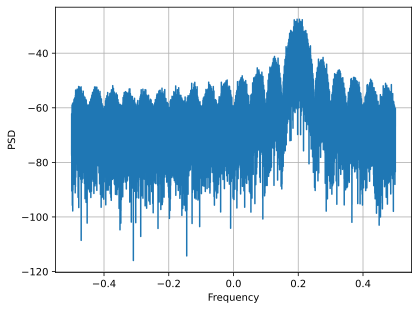

Je ziet de toegepaste frequentieverschuiving van 0.2 Hz. Door 20 samples per symbool is het signaal relatief smal, maar zonder pulse shaping valt het in frequentie langzaam af.

Nu berekenen we de CAF bij de juiste alpha en over een bereik aan tau-waarden (als start nemen we tau van -50 tot +50). De juiste alpha is hier simpelweg de inverse van samples per symbool: 1/20 = 0.05 Hz. In Python genereren we de CAF door over tau te itereren:

.. code-block:: python

    # CAF only at the correct alpha
    alpha_of_interest = 1/sps # equates to 0.05 Hz
    taus = np.arange(-50, 51)
    CAF = np.zeros(len(taus), dtype=complex)
    for i in range(len(taus)):
        CAF[i] = (np.exp(1j * np.pi * alpha_of_interest * taus[i]) * # This term is to make up for the fact we're shifting by 1 sample at a time, and only on one side
                  np.sum(samples * np.conj(np.roll(samples, taus[i])) * 
                         np.exp(-2j * np.pi * alpha_of_interest * np.arange(N))))

Laten we het reele deel van :code:`CAF` plotten met :code:`plt.plot(taus, np.real(CAF))`:

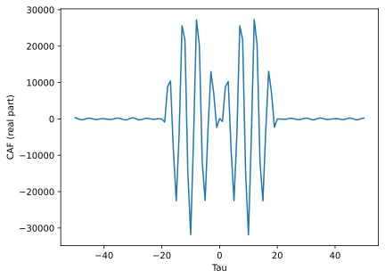

Dit ziet er misschien wat vreemd uit, maar onthoud dat tau het tijddomein representeert. Het belangrijkste is dat er veel energie in de CAF zit bij deze alpha, omdat deze alpha overeenkomt met een cyclische frequentie in ons signaal. Ter vergelijking bekijken we de CAF bij een onjuiste alpha, bijvoorbeeld 0.08 Hz:

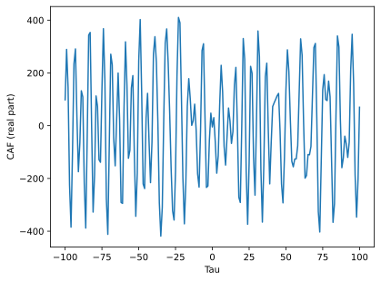

Let op de y-as: er zit nu veel minder energie in de CAF. De precieze patronen zijn op dit moment minder belangrijk en worden duidelijker na de SCF in de volgende sectie.

Wat we ook kunnen doen is de CAF over een bereik van alpha's berekenen en per alpha het vermogen in de CAF bepalen via de magnitude en vervolgens som of gemiddelde (in dit geval maakt dat weinig uit). Als we deze vermogens over alpha plotten, verwachten we pieken op de cyclische frequenties in het signaal. De volgende code voegt een :code:`for`-loop toe en gebruikt een alpha-stap van 0.005 Hz (dit kan lang duren):

.. code-block:: python

    alphas = np.arange(0, 0.5, 0.005)
    CAF = np.zeros((len(alphas), len(taus)), dtype=complex)
    for j in range(len(alphas)):
        for i in range(len(taus)):
            CAF[j, i] = (np.exp(1j * np.pi * alphas[j] * taus[i]) *
                         np.sum(samples * np.conj(np.roll(samples, taus[i])) * 
                                np.exp(-2j * np.pi * alphas[j] * np.arange(N))))
    CAF_magnitudes = np.average(np.abs(CAF), axis=1) # at each alpha, calc power in the CAF
    plt.plot(alphas, CAF_magnitudes)
    plt.xlabel('Alpha')
    plt.ylabel('CAF Power')

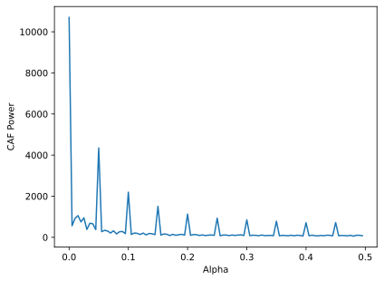

We zien niet alleen de verwachte piek op 0.05 Hz, maar ook pieken op gehele veelvouden daarvan. Dat komt doordat de CAF een Fourier-reeks is en harmonischen van de grondfrequentie zichtbaar zijn, zeker bij PSK/QAM zonder pulse shaping. De energie bij alpha = 0 is het totale vermogen in de PSD. Meestal nullen we die component uit omdat 1) we de PSD vaak al apart plotten en 2) deze anders het dynamisch bereik van de colormap verstoort bij 2D-plots.

Hoewel de CAF interessant is, willen we vaak cyclische frequentie *als functie van RF-frequentie* bekijken, in plaats van alleen cyclische frequentie op zichzelf. Dat brengt ons bij de Spectral Correlation Function (SCF).

************************************************
De Spectral Correlation Function (SCF)
************************************************

Net zoals de CAF periodiciteit in de autocorrelatie laat zien, laat de SCF periodiciteit in de PSD zien. Autocorrelatie en PSD vormen een Fouriertransformatie-paar; daarom is het logisch dat CAF en SCF dat ook doen. Dit heet de *Cyclic Wiener Relationship*. Dit wordt nog duidelijker als je bedenkt dat CAF en SCF bij :math:`\alpha=0` respectievelijk de gewone autocorrelatie en PSD zijn.

Je kunt de SCF verkrijgen door de Fouriertransformatie van de CAF te nemen. Voor ons BPSK-signaal met 20 samples per symbool bekijken we de SCF bij de juiste alpha (0.05 Hz). Dat vereist alleen de FFT van de CAF en een magnitudeplot. De volgende code sluit aan op de eerdere CAF-code met een enkele alpha:

.. code-block:: python

 f = np.linspace(-0.5, 0.5, len(taus))
 SCF = np.fft.fftshift(np.fft.fft(CAF))
 plt.plot(f, np.abs(SCF))
 plt.xlabel('Frequency')
 plt.ylabel('SCF')

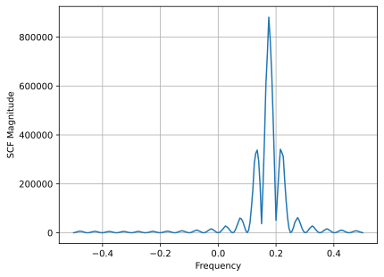

Let op dat we de toegepaste 0.2 Hz frequentie-offset terugzien van de BPSK-simulatie (dit staat los van cyclische frequentie en samples per symbool). Daarom zag de CAF er sinusvormig uit in het tau-domein: dat werd vooral bepaald door de relatief hoge RF-frequentie in dit voorbeeld.

Helaas is dit voor duizenden of miljoenen alpha's extreem rekenintensief. Een tweede nadeel van direct FFT op de CAF is dat er geen averaging plaatsvindt. Efficiënte/praktische SCF-berekening gebruikt meestal een vorm van averaging, op tijd- of frequentiebasis, zoals in de volgende twee secties.

Hieronder staat een interactieve JavaScript-app met SCF-implementatie, zodat je met verschillende signaal- en SCF-parameters intuïtie kunt opbouwen. De signaalfrequentie is een vrij directe regelaar en laat zien hoe goed de SCF RF-frequentie identificeert. Probeer pulse shaping door de optie Rectangular Pulse uit te zetten en varieer de roll-off. Let op: met de standaard alpha-stap geeft niet elke samples-per-symbool-waarde een zichtbare SCF-piek. Een kleinere alpha-stap helpt vaak, maar kost meer rekentijd.

.. raw:: html

    <form id="mainform" name="mainform">
        <label>Samples to Simulate </label>
        <select id="N">
            <option value="1024">1024</option>
            <option value="2048">2048</option>
            <option value="4096">4096</option>
            <option value="8192" selected="selected">8192</option>
            <option value="16384">16384</option>
            <option value="32768">32768</option>
            <option value="65536">65536</option>
            <option value="131072">131072</option>
            <option value="262144">262144</option>
        </select>
         
        <label>Frequency [normalized Hz] </label>
        <input type="range" id="freq" value="0.2" min="-0.5" max="0.5" step="0.05">
        0.2
         
        <label>Samples per Symbol [int] </label>
        <input type="range" id="sps" value="20" min="4" max="30" step="1">
        20
         
        <label>RC Rolloff [0 to 1] </label>
        <input type="number" id="rolloff" value="0.5" min="0" max="1" step="0.0001">
        <label>Rectangular Pulses </label>
        <input type="checkbox" id="rect" checked>
         
        <label>Alpha Start </label>
        <input type="number" id="alpha_start" value="0" min="0" max="100" step="0.0001">
         
        <label>Alpha Stop </label>
        <input type="number" id="alpha_stop" value="0.3" min="0" max="1" step="0.0001">
         
        <label>Alpha Step </label>
        <input type="number" id="alpha_step" value="0.001" min="0.0001" max="0.1" step="0.0001">
         
        <label>Noise Level </label>
        <input type="number" id="noise" value="0.001" min="0" max="10" step="0.0001">
         
        <button type="submit" id="submit_button">Submit</button>
    </form>
    <form id="resetform" name="resetform">
        <button type="submit" id="submit_button">Reset</button>
    </form>
    <canvas id="scf_canvas"></canvas>
    
    </body>

********************************
Frequentie-smoothingmethode (FSM)
********************************

Nu we conceptueel begrijpen wat de SCF doet, kijken we naar een efficiente berekeningsmethode. We starten met het periodogram, de gekwadrateerde magnitude van de Fouriertransformatie van een signaal:

.. math::

 I(u,f) = \frac{1}{N}\left|X(u,f)\right|^2
 
Het cyclische periodogram krijgen we uit het product van twee in frequentie verschoven Fouriertransformaties:

.. math::

 I(u,f,\alpha) = \frac{1}{N}X(u,f + \alpha/2) X^*(u,f - \alpha/2)

Beide zijn schattingen van PSD en SCF, maar voor een betrouwbare SCF moet je middelen over tijd of frequentie. Middelen over tijd heet de Time Smoothing Method (TSM):

.. math::
    S_X(f, \alpha) = \lim_{T\rightarrow\infty} \frac{1}{T} \lim_{U\rightarrow\infty} \frac{1}{U} \int_{-U/2}^{U/2} X(t,f + \alpha/2) X^*(t,f - \alpha/2) dt

middelen over frequentie heet de Frequency Smoothing Method (FSM):

.. math::
    S_X(f, \alpha) = \lim_{\Delta\rightarrow 0} \lim_{T\rightarrow \infty} \frac{1}{T} g_{\Delta}(f) \otimes \left[X(t,f + \alpha/2) X^*(t,f - \alpha/2)\right]

waar de functie :math:`g_{\Delta}(f)` een frequentiesmoothingfunctie is die over een klein frequentiebereik middelt.

Hieronder staat een minimale Python-implementatie van FSM, een op frequentiemiddeling gebaseerde methode om de SCF van een signaal te berekenen. Eerst wordt het cyclische periodogram berekend door twee verschoven FFT-versies te vermenigvuldigen, daarna wordt elke slice gefilterd met een vensterfunctie waarvan de lengte de resolutie van de SCF-schatting bepaalt. Langere vensters geven gladdere resultaten met lagere resolutie; kortere vensters doen het omgekeerde.

.. code-block:: python

    alphas = np.arange(0, 0.3, 0.001)
    Nw = 256 # window length
    N = len(samples) # signal length
    window = np.hanning(Nw)

    X = np.fft.fftshift(np.fft.fft(samples)) # FFT of entire signal
    
    num_freqs = int(np.ceil(N/Nw)) # freq resolution after decimation
    SCF = np.zeros((len(alphas), num_freqs), dtype=complex)
    for i in range(len(alphas)):
        shift = int(alphas[i] * N/2)
        SCF_slice = np.roll(X, -shift) * np.conj(np.roll(X, shift))
        SCF[i, :] = np.convolve(SCF_slice, window, mode='same')[::Nw] # apply window and decimate by Nw
    SCF = np.abs(SCF)
    SCF[0, :] = 0 # null out alpha=0 which is just the PSD of the signal, it throws off the dynamic range

    extent = (-0.5, 0.5, float(np.max(alphas)), float(np.min(alphas)))
    plt.imshow(SCF, aspect='auto', extent=extent, vmax=np.max(SCF)/2)
    plt.xlabel('Frequency [Normalized Hz]')
    plt.ylabel('Cyclic Frequency [Normalized Hz]')
    plt.show()

Let op dat door de manier waarop de verschuiving als geheel aantal samples wordt berekend en afgerond, het helpt om minstens :code:`2 / alpha_resolution` samples tegelijk te verwerken.

Laten we de SCF berekenen voor het rechthoekige BPSK-signaal van eerder, met 20 samples per symbool en cyclische frequenties van 0 tot 0.3 met stapgrootte 0.001:

Deze methode heeft als voordeel dat maar een grote FFT nodig is, maar als nadeel dat voor smoothing veel convoluties nodig zijn. Let op de decimatie na de convolve via :code:`[::Nw]`; dit is optioneel maar sterk aanbevolen om het aantal weer te geven pixels te beperken, en door de opbouw van de SCF gooi je hiermee in de praktijk geen bruikbare informatie weg.

***************************
Tijd-smoothingmethode (TSM)
***************************

Nu bekijken we een TSM-implementatie in Python. De code hieronder splitst het signaal in *num_windows* blokken, elk van lengte *Nw* met overlap *Noverlap*. Overlap is niet verplicht, maar geeft vaak een netter resultaat. Daarna wordt per blok een vensterfunctie toegepast (hier Hanning, maar andere vensters kunnen ook) en een FFT genomen. De SCF ontstaat vervolgens door over blokken te middelen. De vensterlengte bepaalt, net als bij FSM, de afweging tussen resolutie en gladheid.

.. code-block:: python

    alphas = np.arange(0, 0.3, 0.001)
    Nw = 256 # window length
    N = len(samples) # signal length
    Noverlap = int(2/3*Nw) # block overlap
    num_windows = int((N - Noverlap) / (Nw - Noverlap)) # Number of windows
    window = np.hanning(Nw)

    SCF = np.zeros((len(alphas), Nw), dtype=complex)
    for ii in range(len(alphas)): # Loop over cyclic frequencies
        neg = samples * np.exp(-1j*np.pi*alphas[ii]*np.arange(N))
        pos = samples * np.exp( 1j*np.pi*alphas[ii]*np.arange(N))
        for i in range(num_windows):
            pos_slice = window * pos[i*(Nw-Noverlap):i*(Nw-Noverlap)+Nw]
            neg_slice = window * neg[i*(Nw-Noverlap):i*(Nw-Noverlap)+Nw]
            SCF[ii, :] += np.fft.fft(neg_slice) * np.conj(np.fft.fft(pos_slice)) # Cross Cyclic Power Spectrum
    SCF = np.fft.fftshift(SCF, axes=1) # shift the RF freq axis
    SCF = np.abs(SCF)
    SCF[0, :] = 0 # null out alpha=0 which is just the PSD of the signal, it throws off the dynamic range

    extent = (-0.5, 0.5, float(np.max(alphas)), float(np.min(alphas)))
    plt.imshow(SCF, aspect='auto', extent=extent, vmax=np.max(SCF)/2)
    plt.xlabel('Frequency [Normalized Hz]')
    plt.ylabel('Cyclic Frequency [Normalized Hz]')
    plt.show()

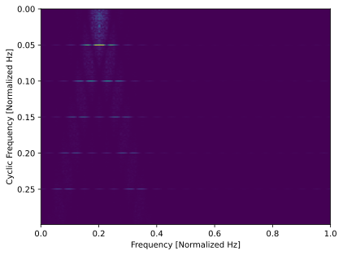

Ziet er grofweg hetzelfde uit als FSM.

*****************
Pulse-shaped BPSK
*****************

Tot nu toe onderzochten we CSP alleen voor een *rechthoekig* BPSK-signaal. In echte RF-systemen zien we echter bijna nooit rechthoekige pulsen; een uitzondering is de BPSK-chippingsequentie in direct-sequence spread spectrum (DSSS), die vaak ongeveer rechthoekig is.

Laten we nu kijken naar een BPSK-signaal met raised-cosine (RC) pulse shaping, een veelgebruikte vorm in digitale communicatie om de bezette bandbreedte te verkleinen ten opzichte van rechthoekig BPSK. Zoals besproken in :ref:`pulse-shaping-chapter` is de RC-pulsvorm in het tijddomein:

.. math::
 h(t) = \mathrm{sinc}\left( \frac{t}{T} \right) \frac{\cos\left(\frac{\pi\beta t}{T}\right)}{1 - \left( \frac{2 \beta t}{T}   \right)^2}

De parameter :math:`\beta` bepaalt hoe snel het filter in het tijddomein afvalt, wat omgekeerd samenhangt met het afvallen in frequentie:

.. image:: ../_images/raised_cosine_freq.svg
   :align: center 
   :target: ../_images/raised_cosine_freq.svg
    :alt: Raised-cosinefilter in het frequentiedomein met verschillende roll-offwaarden

Let op dat :math:`\beta=0` overeenkomt met een oneindig lange pulsvorm en dus niet praktisch is. Ook geldt dat :math:`\beta=1` *niet* overeenkomt met een rechthoekige pulsvorm. In de praktijk ligt roll-off vaak tussen 0.2 en 0.4.

We kunnen een BPSK-signaal met raised-cosine pulse shaping simuleren met onderstaande code; de eerste 5 en laatste 4 regels zijn gelijk aan rechthoekig BPSK:

.. code-block:: python

    N = 100000 # number of samples to simulate
    f_offset = 0.2 # Hz normalized
    sps = 20 # cyclic freq (alpha) will be 1/sps or 0.05 Hz normalized
    num_symbols = int(np.ceil(N/sps))
    symbols = np.random.randint(0, 2, num_symbols) * 2 - 1 # random 1's and -1's

    pulse_train = np.zeros(num_symbols * sps)
    pulse_train[::sps] = symbols # easier explained by looking at an example output
    print(pulse_train[0:96].astype(int))

    # Raised-Cosine Filter for Pulse Shaping
    beta = 0.3 # roll-off parameter (avoid exactly 0.2, 0.25, 0.5, and 1.0)
    num_taps = 101 # somewhat arbitrary
    t = np.arange(num_taps) - (num_taps-1)//2
    h = np.sinc(t/sps) * np.cos(np.pi*beta*t/sps) / (1 - (2*beta*t/sps)**2) # RC equation
    bpsk = np.convolve(pulse_train, h, 'same') # apply the pulse shaping
    
    bpsk = bpsk[:N]  # clip off the extra samples
    bpsk = bpsk * np.exp(2j * np.pi * f_offset * np.arange(N)) # Freq shift up the BPSK, this is also what makes it complex
    noise = np.random.randn(N) + 1j*np.random.randn(N) # complex white Gaussian noise
    samples = bpsk + 0.1*noise  # add noise to the signal

Let op dat :code:`pulse_train` simpelweg onze symbolen zijn met :code:`sps - 1` nullen na elk symbool, dus in volgorde bijvoorbeeld:

.. code-block:: bash

 [ 1  0  0  0  0  0  0  0  0  0  0  0  0  0  0  0  0  0  0  0  1  0  0  0
   0  0  0  0  0  0  0  0  0  0  0  0  0  0  0  0  1  0  0  0  0  0  0  0
   0  0  0  0  0  0  0  0  0  0  0  0  1  0  0  0  0  0  0  0  0  0  0  0
   0  0  0  0  0  0  0  0 -1  0  0  0  0  0  0  0  0  0  0  0  0  0  0  0...

De onderstaande plot toont het pulse-shaped BPSK-signaal in het tijddomein, nog zonder ruis en zonder frequentieverschuiving:

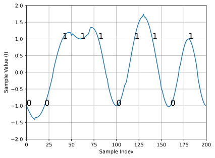

Laten we nu de SCF van dit pulse-shaped BPSK-signaal berekenen met roll-off 0.3, 0.6 en 0.9. We gebruiken dezelfde frequentieverschuiving van 0.2 Hz, dezelfde FSM-implementatie, FSM-parameters en symboollengte als in het rechthoekige BPSK-voorbeeld voor een eerlijke vergelijking:

:code:`beta = 0.3`:

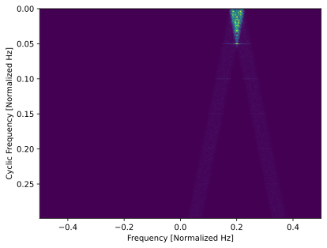

:code:`beta = 0.6`:

:code:`beta = 0.9`:

In alle drie gevallen verdwijnen de sterke sidelobes op de frequentie-as, en op de cyclische frequentie-as zien we niet dezelfde krachtige harmonischen van de grondfrequentie. Dat komt doordat raised-cosine pulse shaping de energie spectraal veel beter begrenst dan rechthoekige pulsenvormen. Hierdoor hebben pulse-shaped signalen doorgaans een "schonere" SCF dan rechthoekige signalen, vaak als een dominante piek met smeer erboven. Dit geldt voor alle enkelvoudige draaggolfsignalen met digitale modulatie, niet alleen BPSK. Bij grotere beta wordt de piek op de frequentie-as breder doordat het signaal meer bandbreedte gebruikt.

********************************
SNR en Aantal Symbolen
********************************

Komt binnenkort. We behandelen dan waarom boven een bepaald punt hogere SNR niet meer helpt, maar meer symbolen wel, en hoe packet-gebaseerde golfvormen leiden tot een beperkt aantal symbolen per transmissie.

********************************
QPSK en Hogere-orde Modulatie
********************************

Komt binnenkort. Dit deel zal QPSK, hogere orde PSK, QAM en een korte introductie tot hogere-orde cyclische momenten en cumulanten bevatten.

********************************
Meerdere Overlappende Signalen
********************************

Tot nu toe keken we naar een signaal tegelijk. Maar wat als het ontvangen signaal meerdere individuele signalen bevat die in frequentie, tijd en zelfs cyclische frequentie overlappen (dus hetzelfde aantal samples per symbool hebben)? Als signalen niet in frequentie overlappen, kun je ze met simpele filtering scheiden en met een PSD detecteren, mits boven de ruisvloer. Overlappen ze niet in de tijd, dan kun je stijg- en daalflanken per transmissie detecteren en met time-gating per signaal verwerken. In CSP richten we ons vaak op detectie van signalen met verschillende cyclische frequenties die in zowel tijd als frequentie overlappen.

Laten we drie signalen simuleren met verschillende eigenschappen:

* Signaal 1: rechthoekig BPSK met 20 samples per symbool en 0.2 Hz frequentie-offset
* Signaal 2: pulse-shaped BPSK met 20 samples per symbool, -0.1 Hz frequentie-offset en 0.35 roll-off
* Signaal 3: pulse-shaped QPSK met 4 samples per symbool, 0.2 Hz frequentie-offset en 0.21 roll-off

Zoals je ziet hebben twee signalen dezelfde cyclische frequentie en twee dezelfde RF-frequentie. Daarmee kunnen we met verschillende graden van parameteroverlap experimenteren.

Op elk signaal passen we een fractional-delay-filter toe met een willekeurige (niet-gehele) vertraging, zodat geen artefacten ontstaan doordat gesimuleerde samples exact uitgelijnd zijn (meer hierover in :ref:`sync-chapter`). Het rechthoekige BPSK-signaal verlagen we in vermogen ten opzichte van de andere twee, omdat rechthoekige pulsen zeer sterke cyclostationaire eigenschappen hebben en anders de SCF domineren.

.. raw:: html

   

    
Klap open voor Python-code die de drie signalen simuleert

.. code-block:: python

    N = 1000000 # number of samples to simulate

    def fractional_delay(x, delay):
        N = 21 # number of taps
        n = np.arange(-N//2, N//2) # ...-3,-2,-1,0,1,2,3...
        h = np.sinc(n - delay) # calc filter taps
        h *= np.hamming(N) # window the filter to make sure it decays to 0 on both sides
        h /= np.sum(h) # normalize to get unity gain, we don't want to change the amplitude/power
        return np.convolve(x, h, 'same') # apply filter

    # Signal 1, Rect BPSK
    sps = 20
    f_offset = 0.2
    signal1 = np.repeat(np.random.randint(0, 2, int(np.ceil(N/sps))) * 2 - 1, sps)
    signal1 = signal1[:N] * np.exp(2j * np.pi * f_offset * np.arange(N))
    signal1 = fractional_delay(signal1, 0.12345)

    # Signal 2, Pulse-shaped BPSK
    sps = 20
    f_offset = -0.1
    beta = 0.35
    symbols = np.random.randint(0, 2, int(np.ceil(N/sps))) * 2 - 1
    pulse_train = np.zeros(int(np.ceil(N/sps)) * sps)
    pulse_train[::sps] = symbols
    t = np.arange(101) - (101-1)//2
    h = np.sinc(t/sps) * np.cos(np.pi*beta*t/sps) / (1 - (2*beta*t/sps)**2)
    signal2 = np.convolve(pulse_train, h, 'same')
    signal2 = signal2[:N] * np.exp(2j * np.pi * f_offset * np.arange(N))
    signal2 = fractional_delay(signal2, 0.52634)

    # Signal 3, Pulse-shaped QPSK
    sps = 4
    f_offset = 0.2
    beta = 0.21
    data = x_int = np.random.randint(0, 4, int(np.ceil(N/sps))) # 0 to 3
    data_degrees = data*360/4.0 + 45 # 45, 135, 225, 315 degrees
    symbols = np.cos(data_degrees*np.pi/180.0) + 1j*np.sin(data_degrees*np.pi/180.0)
    pulse_train = np.zeros(int(np.ceil(N/sps)) * sps, dtype=complex)
    pulse_train[::sps] = symbols
    t = np.arange(101) - (101-1)//2
    h = np.sinc(t/sps) * np.cos(np.pi*beta*t/sps) / (1 - (2*beta*t/sps)**2)
    signal3 = np.convolve(pulse_train, h, 'same')
    signal3 = signal3[:N] * np.exp(2j * np.pi * f_offset * np.arange(N))
    signal3 = fractional_delay(signal3, 0.3526)

    # Add noise
    noise = np.random.randn(N) + 1j*np.random.randn(N)
    samples = 0.5*signal1 + signal2 + 1.5*signal3 + 0.1*noise

.. raw:: html

   

Voordat we in de CSP-resultaten duiken, bekijken we eerst de PSD van dit signaal:

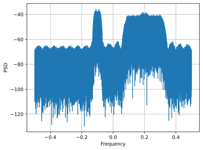

Signalen 1 en 3, die aan de positieve kant van de PSD liggen, overlappen, en je ziet signaal 1 (smaller) maar net uitsteken. Je krijgt hier ook een indruk van het ruisniveau.

We gebruiken nu FSM om de SCF van deze gecombineerde signalen te berekenen:

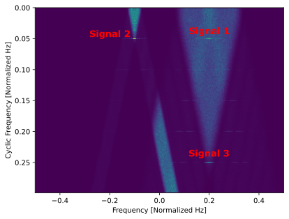

Let op dat signaal 1, ondanks de rechthoekige pulsvorm, zijn harmonischen grotendeels verborgen ziet onder de "kegel" boven signaal 3. In de PSD zagen we al dat signaal 1 als het ware achter signaal 3 zat. Met CSP kunnen we toch detecteren dat signaal 1 aanwezig is en de cyclische frequentie redelijk nauwkeurig benaderen, wat vervolgens voor synchronisatie bruikbaar is. Dat is precies de kracht van cyclostationaire signaalverwerking.

************************
Alternatieve CSP-kenmerken
************************

SCF is niet de enige manier om cyclostationariteit te detecteren, zeker niet als je cyclische frequentie niet per se over RF-frequentie hoeft te bekijken. Een eenvoudige methode (zowel conceptueel als qua rekentijd) is de **FFT van de magnitude** van het signaal te nemen en op pieken te zoeken. In Python is dat erg simpel:

.. code-block:: python

    samples_mag = np.abs(samples)
    #samples_mag = samples * np.conj(samples) # pretty much the same as line above
    magnitude_metric = np.abs(np.fft.fft(samples_mag))

Let op dat deze methode in essentie gelijk is aan het signaal vermenigvuldigen met zijn complex geconjugeerde en daarna een FFT nemen.

Voordat we de metric plotten, nullen we de DC-component uit omdat die veel energie bevat en het dynamisch bereik verstoort. We halen ook de helft van de FFT-output weg, omdat de FFT-invoer reeel is en de output dus symmetrisch is. Daarna kunnen we de metric plotten en pieken zien:

.. code-block:: python

    magnitude_metric = magnitude_metric[:len(magnitude_metric)//2] # only need half because input is real
    magnitude_metric[0] = 0 # null out the DC component
    f = np.linspace(-0.5, 0.5, len(samples))
    plt.plot(f, magnitude_metric)

Daarna kun je een piekzoekalgoritme gebruiken, zoals SciPy's :code:`signal.find_peaks()`. Hieronder plotten we :code:`magnitude_metric` voor elk van de drie signalen uit de sectie met overlappende signalen, eerst apart en daarna gecombineerd:

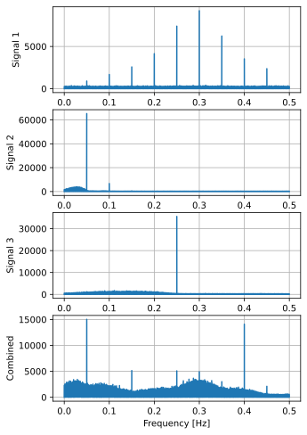

De harmonischen van rechthoekig BPSK overlappen helaas met cyclische frequenties van de andere signalen. Dit toont meteen een nadeel van deze alternatieve aanpak: je kunt cyclische frequentie niet over RF-frequentie bekijken zoals bij SCF.

Hoewel deze methode cyclostationariteit benut, wordt ze meestal niet als volwaardige "CSP-techniek" gezien, mogelijk door haar eenvoud.

Voor het vinden van de RF-frequentie (carrier frequency offset) bestaat een vergelijkbare truc. Voor BPSK neem je de FFT van het signaal in het kwadraat (complexe FFT-invoer); je krijgt dan een piek op tweemaal de carrier-offset. Voor QPSK neem je de FFT van het signaal tot de vierde macht; dan krijg je een piek op viermaal de carrier-offset.

.. code-block:: python

    samples_squared = samples**2
    squared_metric = np.abs(np.fft.fftshift(np.fft.fft(samples_squared)))/len(samples)
    squared_metric[len(squared_metric)//2] = 0 # null out the DC component

    samples_quartic = samples**4
    quartic_metric = np.abs(np.fft.fftshift(np.fft.fft(samples_quartic)))/len(samples)
    quartic_metric[len(quartic_metric)//2] = 0 # null out the DC component

Probeer deze methode gerust op eigen gesimuleerde of opgenomen signalen; ook buiten CSP is dit erg bruikbaar.

*********************************
Spectral Coherence Function (COH)
*********************************

*TLDR: de spectral coherence function is een genormaliseerde versie van de SCF die in sommige situaties beter werkt dan de gewone SCF.*

Een andere maat voor cyclostationariteit, die vaak informatiever is dan ruwe SCF, is de Spectral Coherence Function (COH). COH normaliseert de SCF zodat de uitkomst tussen -1 en 1 ligt (voor magnitude bekijken we 0 tot 1). Dit is nuttig omdat informatie over cyclostationariteit wordt gescheiden van informatie over het vermogensspectrum, die in ruwe SCF door elkaar zitten. Door normalisatie blijft vooral het effect van cyclische correlatie over.

Om COH beter te begrijpen helpt het om het statistische concept van de `correlatiecoefficient <https://en.wikipedia.org/wiki/Pearson_correlation_coefficient>`_ te herhalen. De correlatiecoefficient :math:`\rho_{X,Y}` kwantificeert hoe sterk twee toevalsvariabelen :math:`X` en :math:`Y` samenhangen op schaal -1 tot 1. Definitie:

.. math::
    \rho_{X,Y} = \frac{E[(X-\mu_X)(Y-\mu_Y)]}{\sigma_X \sigma_Y}

COH breidt dit concept uit naar spectrale correlatie: het meet hoe sterk de PSD van een signaal op de ene frequentie samenhangt met de PSD van datzelfde signaal op een andere frequentie. Deze twee frequenties zijn de verschuivingen die we bij SCF-berekening toepassen. Voor COH berekenen we eerst de SCF zoals eerder, :math:`S_X(f,\alpha)`, en normaliseren vervolgens met het product van twee verschoven PSD-termen, analoog aan normaliseren met standaarddeviaties:

.. math::
    \rho = C_x(f, \alpha) = \frac{S_X(f,\alpha)}{\sqrt{C_x^0(f + \alpha/2) C_x^0(f - \alpha/2)}}

De noemer is het belangrijkste nieuwe onderdeel: de termen :math:`C_x^0(f + \alpha/2)` en :math:`C_x^0(f - \alpha/2)` zijn simpelweg de PSD verschoven met :math:`\alpha/2` en :math:`-\alpha/2`. Anders gezegd: de SCF is een cross-spectral density (vermogensspectrum met twee ingangen), terwijl de normalisatietermen autospectrale dichtheden zijn (een ingang).

We passen dit nu toe in Python, specifiek op SCF met FSM. Omdat FSM in het frequentiedomein middelt, hebben we :math:`C_x^0(f + \alpha/2)` en :math:`C_x^0(f - \alpha/2)` al beschikbaar; in code zijn dat :code:`np.roll(X, -shift)` en :code:`np.roll(X, shift)`, omdat :code:`X` het signaal na FFT is. We vermenigvuldigen die, nemen de wortel en delen de SCF-slice door dat resultaat (binnen de for-loop over alpha):

.. code-block:: python

    COH_slice = SCF_slice / np.sqrt(np.roll(X, -shift) * np.roll(X, shift))

Tot slot herhalen we dezelfde convolve- en decimatiestap als bij de uiteindelijke SCF-slice.

.. code-block:: python

    COH[i, :] = np.convolve(COH_slice, window, mode='same')[::Nw]

.. raw:: html

   

    
Klap open voor volledige code om zowel SCF als COH te genereren en te plotten

.. code-block:: python

    alphas = np.arange(0, 0.3, 0.001)
    Nw = 256 # window length
    N = len(samples) # signal length
    window = np.hanning(Nw)
    
    X = np.fft.fftshift(np.fft.fft(samples)) # FFT of entire signal
    
    num_freqs = int(np.ceil(N/Nw)) # freq resolution after decimation
    SCF = np.zeros((len(alphas), num_freqs), dtype=complex)
    COH = np.zeros((len(alphas), num_freqs), dtype=complex)
    for i in range(len(alphas)):
        shift = int(alphas[i] * N/2)
        SCF_slice = np.roll(X, -shift) * np.conj(np.roll(X, shift))
        SCF[i, :] = np.convolve(SCF_slice, window, mode='same')[::Nw] # apply window and decimate by Nw
        COH_slice = SCF_slice / np.sqrt(np.roll(X, -shift) * np.roll(X, shift))
        COH[i, :] = np.convolve(COH_slice, window, mode='same')[::Nw] # apply the same windowing + decimation
    SCF = np.abs(SCF)
    COH = np.abs(COH)

    # null out alpha=0 for both so that it doesnt hurt our dynamic range and ability to see the non-zero alphas
    SCF[np.argmin(np.abs(alphas)), :] = 0
    COH[np.argmin(np.abs(alphas)), :] = 0

    extent = (-0.5, 0.5, float(np.max(alphas)), float(np.min(alphas)))
    fig, [ax0, ax1] = plt.subplots(1, 2, figsize=(10, 5))
    ax0.imshow(SCF, aspect='auto', extent=extent, vmax=np.max(SCF)/2)
    ax0.set_xlabel('Frequency [Normalized Hz]')
    ax0.set_ylabel('Cyclic Frequency [Normalized Hz]')
    ax0.set_title('Regular SCF')
    ax1.imshow(COH, aspect='auto', extent=extent, vmax=np.max(COH)/2)
    ax1.set_xlabel('Frequency [Normalized Hz]')
    ax1.set_title('Spectral Coherence Function (COH)')
    plt.show()

.. raw:: html

   

Laten we nu COH (en gewone SCF) berekenen voor een rechthoekig BPSK-signaal met 20 samples per symbool en 0.2 Hz frequentie-offset:

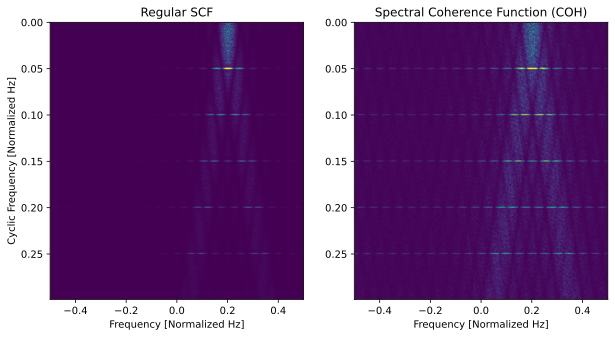

Zoals je ziet zijn hogere alpha's in COH veel duidelijker dan in SCF. Draaien we dezelfde code op pulse-shaped BPSK, dan is het verschil kleiner:

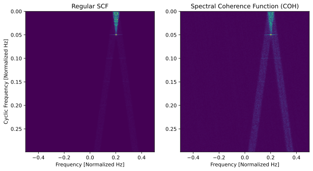

Probeer voor je eigen toepassing zowel SCF als COH te genereren om te zien welke het beste werkt.

**********
Conjugates
**********

Tot nu toe gebruikten we voor CAF en SCF formules waarin in de tweede term het complex geconjugeerde (:math:`*`) van het signaal staat:

.. math::
    R_x(\tau,\alpha) = \lim_{T\rightarrow\infty} \frac{1}{T} \int_{-T/2}^{T/2} x(t + \tau/2)x^*(t - \tau/2)e^{-j2\pi \alpha t}dt \\
    S_X(f,\alpha) = \lim_{T\rightarrow\infty} \frac{1}{T} \lim_{U\rightarrow\infty} \frac{1}{U} \int_{-U/2}^{U/2} X(t,f + \alpha/2) X^*(t,f - \alpha/2) dt

Er bestaat echter ook een alternatieve vorm van CAF en SCF zonder geconjugeerde term. Deze heten respectievelijk *conjugate CAF* en *conjugate SCF*. De naamgeving is wat verwarrend; onthoud vooral dat er een "normale" en een geconjugeerde variant is. De geconjugeerde versie kan extra informatie opleveren, maar is niet altijd nodig.

.. math::
    R_{x^*}(\tau,\alpha) = \lim_{T\rightarrow\infty} \frac{1}{T} \int_{-T/2}^{T/2} x(t + \tau/2)x(t - \tau/2)e^{-j2\pi \alpha t}dt \\
    S_{x^*}(f,\alpha) = \lim_{T\rightarrow\infty} \frac{1}{T} \lim_{U\rightarrow\infty} \frac{1}{U} \int_{-U/2}^{U/2} X(t,f + \alpha/2) X(t,f - \alpha/2) dt

Dit is dezelfde structuur als de oorspronkelijke CAF/SCF, maar zonder geconjugeerde term. Ook in discrete tijd geldt hetzelfde verschil.

Om de betekenis van de geconjugeerde vormen goed te begrijpen, bekijken we de kwadratuurrepresentatie van een reeel bandpass-signaal:

.. math::
    y(t) = x_I(t) \cos(2\pi f_c t + \phi) + x_Q(t) \sin(2\pi f_c t + \phi)

:math:`x_I(t)` en :math:`x_Q(t)` zijn respectievelijk de in-phase (I) en quadratuur (Q)-component van het signaal, en het zijn deze IQ-samples die we uiteindelijk met CSP in baseband verwerken.

Met de formule van Euler, :math:`e^{jx} = \cos(x) + j \sin(x)`, kunnen we de vergelijking hierboven herschrijven met complexe exponenten:

.. math::
    y(t) = \frac{x_I(t) - j x_Q(t)}{2} e^{j 2\pi f_c t + j \phi} + \frac{x_I(t) + j x_Q(t)}{2} e^{-j 2\pi f_c t - j \phi}

We kunnen de complexe envelop, die we :math:`z(t)` noemen, gebruiken om het reele signaal :math:`y(t)` te representeren, onder de aanname dat de signaalbandbreedte veel kleiner is dan de draaggolffrequentie :math:`f_c`, wat typisch zo is in RF-toepassingen:

.. math::
    y(t) = z(t) e^{j 2 \pi f_c t + j \phi} + z^*(t) e^{-j 2 \pi f_c t - j \phi}

Dit staat bekend als de complex-basebandrepresentatie.

Terug naar de CAF: laten we het deel berekenen dat bekend staat als het "lag product", oftewel :math:`x(t + \tau/2) x(t - \tau/2)`.

.. math::
    \left(z(t + \tau/2) e^{j 2 \pi f_c (t + \tau/2) + j \phi} + z^*(t + \tau/2) e^{-j 2 \pi f_c (t + \tau/2) - j \phi}\right) \times \\ \left(z(t - \tau/2) e^{j 2 \pi f_c (t - \tau/2) + j \phi} + z^*(t - \tau/2) e^{-j 2 \pi f_c (t - \tau/2) - j \phi}\right)

Hoewel het niet meteen zichtbaar is, bevat dit resultaat vier termen die overeenkomen met de vier combinaties van geconjugeerde en niet-geconjugeerde :math:`z(t)`:

.. math::
    z(t + \tau/2) z(t - \tau/2) e^{(\ldots)} \\
    z(t + \tau/2) z^*(t - \tau/2) e^{(\ldots)} \\
    z^*(t + \tau/2) z(t - \tau/2) e^{(\ldots)} \\
    z^*(t + \tau/2) z^*(t - \tau/2) e^{(\ldots)}

Het blijkt dat de 1e en 4e term qua informatie-inhoud effectief hetzelfde zijn, net als de 2e en 3e. In de praktijk blijven dus twee relevante gevallen over: het geconjugeerde en het niet-geconjugeerde geval. Samengevat: om alle statistische informatie uit :math:`y(t)` te halen, moeten beide combinaties worden meegenomen.

Om de geconjugeerde SCF met de frequentie-smoothingmethode te implementeren, is er naast het verwijderen van :code:`conj()` nog een extra stap nodig, omdat we een grote FFT doen en daarna in het frequentiedomein middelen. Een eigenschap van de Fouriertransformatie is dat complex geconjugeerd in het tijddomein overeenkomt met omklappen en conjugeren in het frequentiedomein:

.. math::
    x^*(t) \leftrightarrow X^*(-f)

Omdat we in de normale SCF de tweede term al complex conjugeren (met :code:`SCF_slice = np.roll(X, -shift) * np.conj(np.roll(X, shift))`), valt die extra conjugatie weg. Dan blijft het volgende over:

.. code-block:: python

    SCF_slice = np.roll(X, -shift) * np.flip(np.roll(X, -shift - 1))

Let op de toegevoegde :code:`np.flip()`, en dat :code:`roll()` in omgekeerde richting moet gebeuren. De volledige FSM-implementatie van de geconjugeerde SCF is:

.. code-block:: python

    alphas = np.arange(-1, 1, 0.01) # Conj SCF should be calculated from -1 to +1
    Nw = 256 # window length
    N = len(samples) # signal length
    window = np.hanning(Nw)

    X = np.fft.fftshift(np.fft.fft(samples)) # FFT of entire signal
    
    num_freqs = int(np.ceil(N/Nw)) # freq resolution after decimation
    SCF = np.zeros((len(alphas), num_freqs), dtype=complex)
    for i in range(len(alphas)):
        shift = int(np.round(alphas[i] * N/2))
        SCF_slice = np.roll(X, -shift) * np.flip(np.roll(X, -shift - 1)) # THIS LINE IS THE ONLY DIFFERENCE
        SCF[i, :] = np.convolve(SCF_slice, window, mode='same')[::Nw]
    SCF = np.abs(SCF)

    extent = (-0.5, 0.5, float(np.min(alphas)), float(np.max(alphas)))
    plt.imshow(SCF, aspect='auto', extent=extent, vmax=np.max(SCF)/2, origin='lower')
    plt.xlabel('Frequency [Normalized Hz]')
    plt.ylabel('Cyclic Frequency [Normalized Hz]')
    plt.show()

Een andere grote wijziging is dat we voor geconjugeerde SCF alpha's tussen -1 en +1 willen berekenen, terwijl we bij normale SCF door symmetrie vaak 0.0 tot 0.5 gebruikten. Zodra we voorbeeldsignalen bekijken, wordt duidelijk waarom.

Waarom is de geconjugeerde SCF belangrijk? Om dat te laten zien bekijken we de geconjugeerde SCF van ons basisvoorbeeld: rechthoekig BPSK met 20 samples per symbool (cyclische frequentie 0.05 Hz) en 0.2 Hz frequentie-offset:

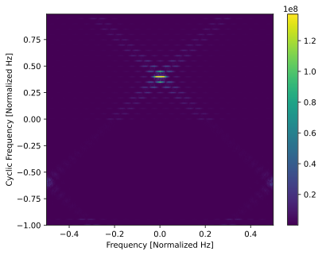

De kern uit deze sectie: in de geconjugeerde SCF krijg je pieken op de cyclische frequentie +/- **tweemaal** de carrier-frequency-offset, die we :math:`f_c` noemen. Op de frequentie-as liggen ze rond 0 Hz in plaats van rond :math:`f_c`. Met onze offset van 0.2 Hz krijg je dus pieken op 0.4 Hz +/- de cyclische frequentie van 0.05 Hz. Onthoud vooral dat je in de geconjugeerde SCF pieken verwacht op:

.. math::
    2f_c \pm \alpha

Laten we nu naar pulse-shaped BPSK kijken met dezelfde 0.2 Hz offset, 20 samples per symbool en 0.3 roll-off:

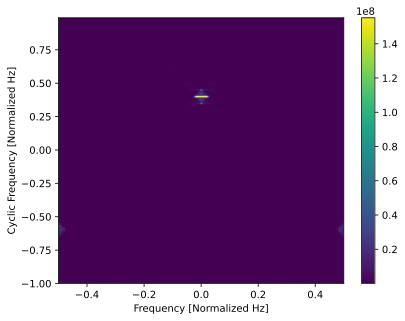

Dit is logisch gezien het normale SCF-patroon dat we voor BPSK zagen.

Nu het interessante deel: de geconjugeerde SCF van rechthoekig QPSK met dezelfde 0.2 Hz en 20 samples per symbool:

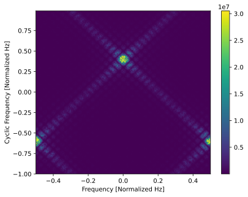

Op het eerste gezicht lijkt dit misschien op een bug in de code, maar kijk naar de colorbar: die geeft aan welke waarden bij welke kleuren horen. Bij :code:`plt.imshow()` met automatische schaal worden kleuren (hier paars tot geel) altijd geschaald van minimum tot maximum van de 2D-array. Bij de geconjugeerde SCF van QPSK is de volledige output relatief laag, omdat *er bij QPSK geen duidelijke pieken in de geconjugeerde SCF zitten*. Hieronder dezelfde QPSK-output met schaalinstelling zoals in de eerdere BPSK-voorbeelden:

Let op het bereik van de colorbar.

De geconjugeerde SCF voor QPSK, en ook voor hogere-orde PSK en QAM, is in essentie nul/ruis. Dat betekent dat we de geconjugeerde SCF kunnen gebruiken om de aanwezigheid van BPSK te detecteren (bijvoorbeeld de chipping-sequentie in DSSS), zelfs als er veel overlappende QPSK/QAM-signalen aanwezig zijn. Dit is een zeer krachtig hulpmiddel in de CSP-gereedschapskist.

Laten we de geconjugeerde SCF draaien op het drie-signalen-scenario dat we eerder meerdere keren gebruikten, met de volgende signalen:

* Signaal 1: rechthoekig BPSK met 20 samples per symbool en 0.2 Hz frequentie-offset
* Signaal 2: pulse-shaped BPSK met 20 samples per symbool, -0.1 Hz frequentie-offset en 0.35 roll-off
* Signaal 3: pulse-shaped QPSK met 4 samples per symbool, 0.2 Hz frequentie-offset en 0.21 roll-off

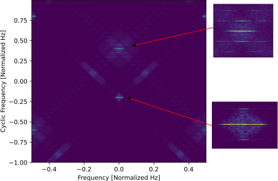

Merk op dat we de twee BPSK-signalen zien, terwijl het QPSK-signaal niet zichtbaar is; anders zouden we een piek op alpha = 0.65 en 0.15 Hz zien. Zonder inzoomen is dat soms lastig, maar er zijn pieken op 0.4 +/- 0.05 Hz en -0.2 +/- 0.05 Hz.

********************************
FFT-accumulatiemethode (FAM)
********************************

De eerder besproken FSM- en TSM-technieken werken uitstekend, vooral als je een specifieke set cyclische frequenties wilt berekenen (beide implementaties hebben een buitenste lus over cyclische frequentie). Er is echter een nog efficientere SCF-implementatie: de FFT Accumulation Method (FAM), die direct de volledige set cyclische frequenties berekent (dus de frequenties die horen bij alle gehele verschuivingen van het signaal; het aantal hangt af van de signaallengte). Een vergelijkbare techniek is de `Strip Spectral Correlation Analyzer (SSCA) <https://cyclostationary.blog/2016/03/22/csp-estimators-the-strip-spectral-correlation-analyzer/>`_, die ook alle cyclische frequenties tegelijk berekent, maar om herhaling te vermijden hier niet wordt behandeld. Deze klasse technieken wordt soms "blind estimators" genoemd, omdat ze vaak worden gebruikt wanneer vooraf geen kennis van cyclische frequenties beschikbaar is. De FAM is een tijd-smoothingmethode (zie het als geavanceerde TSM), terwijl SSCA te vergelijken is met geavanceerde FSM.

De minimale Python-code voor FAM is eigenlijk vrij compact, al is de koppeling met de wiskunde minder direct omdat we niet meer over alpha itereren. Net als bij TSM splitsen we het signaal op in tijdvensters met overlap. Op elk sampleblok passen we een Hanning-venster toe. In het FAM-algoritme zitten twee FFT-stappen; de eerste gebeurt op een 2D-array, dus veel FFT's worden in een regel uitgevoerd. Na een frequentieverschuiving voeren we een tweede FFT uit om de SCF op te bouwen (daarna nemen we de magnitude in het kwadraat). Voor meer detail zie de externe bronnen onderaan deze sectie.

.. code-block:: python

    N = 2**14
    x = samples[0:N]
    Np = 512 # Number of input channels, should be power of 2
    L = Np//4 # Offset between points in the same column at consecutive rows in the same channelization matrix. It should be chosen to be less than or equal to Np/4
    num_windows = (len(x) - Np) // L + 1
    Pe = int(np.floor(int(np.log(num_windows)/np.log(2))))
    P = 2**Pe
    N = L*P

    # channelization
    xs = np.zeros((num_windows, Np), dtype=complex)
    for i in range(num_windows):
        xs[i,:] = x[i*L:i*L+Np]
    xs2 = xs[0:P,:]

    # windowing
    xw = xs2 * np.tile(np.hanning(Np), (P,1))

    # first FFT
    XF1 = np.fft.fftshift(np.fft.fft(xw))

    # freq shift down
    f = np.arange(Np)/float(Np) - 0.5
    f = np.tile(f, (P, 1))
    t = np.arange(P)*L
    t = t.reshape(-1,1) # make it a column vector
    t = np.tile(t, (1, Np))
    XD = XF1 * np.exp(-2j*np.pi*f*t)

    # main calcs
    SCF = np.zeros((2*N, Np))
    Mp = N//Np//2
    for k in range(Np):
        for l in range(Np):
            XF2 = np.fft.fftshift(np.fft.fft(XD[:,k]*np.conj(XD[:,l]))) # second FFT
            i = (k + l) // 2
            a = int(((k - l) / Np + 1) * N)
            SCF[a-Mp:a+Mp, i] = np.abs(XF2[(P//2-Mp):(P//2+Mp)])**2

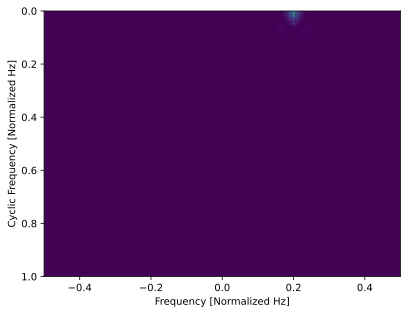

Laten we inzoomen op het interessante gebied rond 0.2 Hz en lage cyclische frequenties voor meer detail:

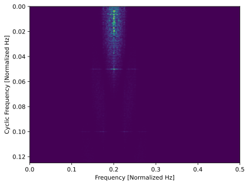

Er is een duidelijke hotspot op 0.05 Hz en een zwakkere op 0.1 Hz die met deze kleurenschaal lastig te zien kan zijn.

We kunnen de RF-frequentie-as ook samendrukken en de SCF in 1D plotten om makkelijker te zien welke cyclische frequenties aanwezig zijn:

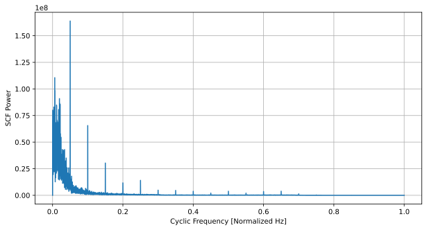

Een belangrijke valkuil van FAM is dat het, afhankelijk van je signaallengte, een enorm aantal pixels kan opleveren. Als slechts een of twee rijen in :code:`imshow()` de energie bevatten, kunnen die door de schaalinstelling op je scherm deels gemaskeerd worden. Let daarom op de afmeting van de 2D-SCF-matrix. Wil je minder pixels op de cyclische-frequentie-as, gebruik dan max pooling of mean pooling. Zet onderstaande code na de SCF-berekening en voor het plotten (mogelijk moet je :code:`pip install scikit-image` uitvoeren):

.. code-block:: python

    # Max pooling in cyclic domain
    import skimage.measure
    print("Old shape of SCF:", SCF.shape)
    SCF = skimage.measure.block_reduce(SCF, block_size=(16, 1), func=np.max) # type: ignore
    print("New shape of SCF:", SCF.shape)

Externe bronnen over FAM:

* R.S. Roberts, W. A. Brown, and H. H. Loomis, Jr., "Computationally Efficient Algorithms for Cyclic Spectral Analysis," IEEE Signal Processing Magazine, April 1991, pp. 38-49. `Hier beschikbaar <https://www.researchgate.net/profile/Faxin-Zhang-2/publication/353071530_Computationally_efficient_algorithms_for_cyclic_spectral_analysis/links/60e69d2d30e8e50c01eb9484/Computationally-efficient-algorithms-for-cyclic-spectral-analysis.pdf>`_
* Da Costa, Evandro Luiz. Detection and identification of cyclostationary signals. Diss. Naval Postgraduate School, 1996. `Hier beschikbaar <https://apps.dtic.mil/sti/pdfs/ADA311555.pdf>`_
* Chad's blog post on FAM: https://cyclostationary.blog/2018/06/01/csp-estimators-the-fft-accumulation-method/

********************************
OFDM
********************************

Cyclostationariteit is extra sterk in OFDM-signalen door het gebruik van een cyclic prefix (CP), waarbij de laatste samples van elk OFDM-symbool worden gekopieerd en vooraan toegevoegd. Dat levert een sterke cyclische frequentie op die hoort bij de OFDM-symboollengte (de inverse van de subcarrier spacing plus de CP-duur).

Laten we met een OFDM-signaal experimenteren. Hieronder staat een simulatie van OFDM met CP, 64 subcarriers, 25% CP en QPSK-modulatie op elke subcarrier. We interpoleren 2x om een realistische sample rate te simuleren, waardoor de OFDM-symboollengte in samples (64 + (64*0.25)) * 2 = 160 wordt. Dan verwachten we pieken op alpha's die gehele veelvouden van 1/160 zijn: 0.00625, 0.0125, 0.01875, enzovoort. We simuleren 200k samples, wat overeenkomt met 1250 OFDM-symbolen (elk OFDM-symbool is relatief lang).

.. code-block:: python

    from scipy.signal import resample
    N = 200000 # number of samples to simulate
    num_subcarriers = 64
    cp_len = num_subcarriers // 4 # length of the cyclic prefix in symbols, in this case 25% of the starting OFDM symbol
    print("CP length in samples", cp_len*2) # remember there is 2x interpolation at the end
    print("OFDM symbol length in samples", (num_subcarriers+cp_len)*2) # remember there is 2x interpolation at the end
    num_symbols = int(np.floor(N/(num_subcarriers+cp_len))) // 2 # remember the interpolate by 2
    print("Number of OFDM symbols:", num_symbols)

    qpsk_mapping = {
        (0,0) : 1+1j,
        (0,1) : 1-1j,
        (1,0) : -1+1j,
        (1,1) : -1-1j,
    }
    bits_per_symbol = 2

    samples = np.empty(0, dtype=np.complex64)
    for _ in range(num_symbols):
        data = np.random.binomial(1, 0.5, num_subcarriers*bits_per_symbol) # 1's and 0's
        data = data.reshape((num_subcarriers, bits_per_symbol)) # group into subcarriers
        symbol_freq = np.array([qpsk_mapping[tuple(b)] for b in data]) # remember we start in the freq domain with OFDM
        symbol_time = np.fft.ifft(symbol_freq)
        symbol_time = np.hstack([symbol_time[-cp_len:], symbol_time]) # take the last CP samples and stick them at the start of the symbol
        samples = np.concatenate((samples, symbol_time)) # add symbol to samples buffer

    samples = resample(samples, len(samples)*2) # interpolate by 2x
    samples = samples[:N] # clip off the few extra samples

    # Add noise
    SNR_dB = 5
    n = np.sqrt(np.var(samples) * 10**(-SNR_dB/10) / 2) * (np.random.randn(N) + 1j*np.random.randn(N))
    samples = samples + n

Omdat we pieken verwachten op 0.00625, 0.0125 en 0.01875, gebruiken we een cyclische-frequentieresolutie van 1e-5 zodat dit op nette veelvouden uitkomt. Als zo'n fijne resolutie onpraktisch is of cyclische frequenties onbekend zijn, kun je oversampling gebruiken (bijvoorbeeld meer samples per symbool; hier factor 2). Binnen de FSM-aanpak verwerken we dan minstens :code:`2 / alpha_resolution` samples, dus 200k samples. Hieronder staan resultaten met :code:`alphas = np.arange(0, 0.02, 1e-5)` en max pooling actief:

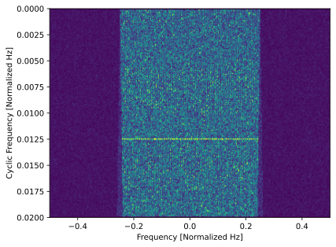

Let op de drie pieken; die worden nog duidelijker als je de RF-frequentie-as comprimeert en cyclische frequentie in 1D plot.

Externe bronnen over OFDM binnen CSP:

#. Sutton, Paul D., Keith E. Nolan, and Linda E. Doyle. "Cyclostationary signatures in practical cognitive radio applications." IEEE Journal on selected areas in Communications 26.1 (2008): 13-24. `Hier beschikbaar <https://ieeexplore.ieee.org/stamp/stamp.jsp?arnumber=4413137&casa_token=81U1yMeRKMsAAAAA:6sQr9-VngNa2p_OW4zVyeQsRdUrZPkx3L-6ZPsH9LCo-pnTxs_AhjfAx27MFBbo4kl3YlgdkQJk&tag=1>`_

********************************************
Signaaldetectie met Bekende Cyclische Frequentie
********************************************

In sommige toepassingen wil je CSP gebruiken om een al bekend signaal of golfvorm te detecteren, zoals varianten van 802.11, LTE of 5G. Als je de cyclische frequentie van het signaal kent en je sample rate bekend is, hoef je in principe maar een enkele alpha en tau te berekenen. Een voorbeeld van dit type probleem met een RF-opname van WiFi volgt binnenkort.
