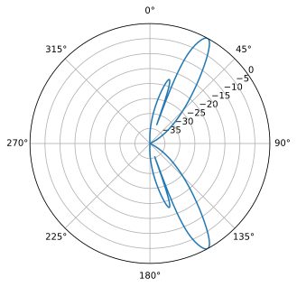

.. _doa-chapter:

####################################
DOA & Beamforming
####################################

We zullen in dit hoofdstuk het gaan hebben over de concepten van bundelvorming (eng: beamforming), direction-of-arrival (DOA) (Nederlands: aankomstrichting) en phased arrays. Met behulp van Python simulatievoorbeelden worden Technieken zoals Capon en MUSIC besproken. We behandelen beamforming vs. DOA en twee verschillende soorten phased arrays (passief en actief).

************************
Overzicht en termen
************************

Een phased array, ook wel een elektronisch gestuurd array genoemd, is een array van antennes die aan de zend- of ontvangstkant kan worden gebruikt om (elektronische) bundels op een bepaalde richting op te focussen. 
Deze techniek wordt gebruikt in communicatie- en radartoepassingen. 

Phased arrays kun je grofweg in drie categorieën indelen:

1. **Passive electronically scanned array (PESA)**, beter bekend als een analoge of traditionele phased array. Hierbij worden analoge faseverschuivers gebruikt om de bundelrichting aan te passen.
   Bij de ontvanger worden alle elementen na een faseverschuiving (en eventueel versterking) opgeteld en met een mixer naar de basisband  geschoven om te verwerken.
   Bij de zender gebeurt het tegenovergestelde; een enkel digitaal signaal wordt analoog gemaakt waarna meerdere faseverschuivers en versterkers worden gebruikt om het signaal voor elke antenne te produceren.
2. **Active electronically scanned array (AESA)**, beter bekend als een volledig digitale array. Hier heeft elk element zijn eigen RF-componenten en het richten van de bundel gebeurt dan volledig digitaal. Vanwege de RF-componenten is dit de duurste aanpak, maar het geeft flexibiliteit en maakt hogere snelheden mogelijk. Digitale arrays zijn ideaal voor SDR's alhoewel het aantal kanalen van de SDR de grootte van de array beperkt. Wanneer er digitale faseverschuivers worden toegepast, dan hebben deze een bepaalde amplitude- en faseresolutie.
3. **Hybride array**, Nu worden meer PESA subarrays gebruikt, waarbij elke subarray zijn eigen RF voorkant heeft net als bij AESA's. Deze aanpak geeft het beste van beide werelden enwordt het meest toegepast in moderne arrays.

Hieronder vind je een voorbeeld van de drie typen:

.. image:: ../_images/beamforming_examples.svg
   :align: center 
   :target: ../_images/beamforming_examples.svg
   :alt: Example of phased arrays including Passive electronically scanned array (PESA), Active electronically scanned array (AESA), Hybrid array, showing Raytheon's MIM-104 Patriot Radar, ELM-2084 Israeli Multi-Mission Radar, Starlink User Terminal, aka Dishy

We zullen in dit hoofdstuk voornamelijk focussen op de signaalbewerking voor volledig digitale arrays, omdat deze beter geschikt zijn voor simulatie en DSP toepassingen. In het volgende hoofdstuk gaan we aan de slag met de "Phaser" array en SDR van Analog Devices die 8 analoge faseverschuivers heeft aangesloten op een Pluto.

We zullen de antennes die de array vormen meestal elementen noemen, en soms wordt de array ook wel een "sensor" genoemd. Deze array-elementen zijn meestal omnidirectionele antennes, die gelijkmatig verdeeld zijn in een lijn of over twee dimensies.

Een bundelvormer is in wezen een ruimtelijk filter; het filtert signalen uit alle richtingen behalve de gewenste richting(en). Net als bij normale filters, gebruiken we gewichten (coefficienten) op elk element van een array. We manipuleren dan de gewichten om de bundel(s) van de array te vormen, vandaar de naam bundelvormer! We kunnen deze bundels (en nullen) extreem snel sturen; veel sneller dan mechanisch gestuurde antennes (een mogelijk alternatief). Een enkele array kan, zolang het maar genoeg elementen heeft, tegelijkertijd meerdere signalen elektronisch volgen terwijl het interferentie onderdrukt. We zullen bundelvorming meestal bespreken in de context van een communicatieverbinding, waarbij de ontvanger probeert een of meerdere signalen met een zo hoog mogelijke SNR te ontvangen.

Bundelvormingstechnieken worden meestal onderverdeeld in conventionele en adaptieve technieken. Bij conventionele bundelvorming ga je er vanuit dat je al weet waar het signaal vandaan komt. De bundelvormer kiest dan gewichten om de versterking in die richting te maximaliseren. Dit kan zowel aan de ontvangende als aan de zendende kant van een communicatiesysteem worden gebruikt. Bij adaptieve bundelvorming daarentegen worden, om een bepaald criterium te optimaliseren, de gewichten voortdurend aangepast op basis van de uitgang van de bundelvormer. Vaak is het doel een interferentiebron te onderdrukken. Vanwege de gesloten lus en adaptieve aard wordt adaptieve bundelvorming typisch alleen aan de ontvangende kant gebruikt, dus de "uitgang van de bundelvormer" is gewoon je ontvangen signaal.  Adaptieve bundelvorming houdt dus in dat je de gewichten aanpast op basis van de statistieken van de ontvangen gegevens.

Direction-of-Arrival (DOA) binnen DSP/SDR verwijst naar de manier waarop een array van antennes wordt gebruikt om de aankomstrichtingen van een of meerdere signalen in te schatten (in tegenstelling tot bundelvorming, dat zich richt op het ontvangen van een signaal terwijl zoveel mogelijk ruis en interferentie wordt onderdrukt). Omdat DOA zeker onder het onderwerp bundelvorming valt, kunnen de termen verwarrend zijn. 
Dezelfde technieken die bij bundelvorming worden gebruikt, zijn ook toepasbaar bij DOA. Het vinden van de richting gebeurt op dezelfde manieren. 
De meeste bundelvormingstechnieken gaan er van uit dat de aankomstrichting van het signaal bekend is. Wanneer de zender of ontvanger zich verplaatsten zal het alsnog continu DOA moeten uitvoeren, zelfs als het primaire doel is om het signaal te ontvangen en demoduleren.

Phased arrays en bundelvorming/DOA worden gebruikt in allerlei toepassingen. Je kunt ze onder andere vinden in verschillende vormen van radar, mmWave-communicatie binnen 5G, satellietcommunicatie en voor het storen van verbindingen. Elke toepassing die een antenne met een hoge versterking vereist, of een snel bewegende antenne met een hoge versterking, zijn goede kandidaten voor phased arrays.

*******************
Eisen SDR
*******************

Zoals besproken bestaat een analoge phased array uit een faseverschuiver (en versterker) per kanaal. Dit betekent dat er analoge hardware nodig is naast de SDR. Aan de andere kant kan elke SDR met meer dan één kanaal, waarbij alle kanelen fasegekoppeld zijn en dezelfde klok gebruiken, als een digitale array worden gebruikt. Dit is meestal het geval bij SDR's met meerdere kanalen.
Er zijn veel SDR's die **twee** ontvangstkanalen bevatten, zoals de Ettus USRP B210 en de Analog Devices Pluto (het 2e kanaal wordt blootgesteld met een uFL-connector op het bord zelf). Helaas, als je verder gaat dan twee kanalen, kom je in het segment van SDR's van $10k+ terecht, althans in 2023, zoals de USRP N310. Het grootste probleem is dat goedkope SDR's meestal niet aan elkaar kunnen worden "gekoppeld" om het aantal kanalen te vermeerderen. De uitzondering is de KerberosSDR (4 kanalen) en KrakenSDR (5 kanalen) die meerdere RTL-SDR's gebruiken die een LO delen met een gedeelde LO om een goedkope digitale array te vormen; het nadeel is de zeer beperkte bemonsteringsfrequentie (tot 2,56 MHz) en afstemmingsbereik (tot 1766 MHz). De KrakenSDR-kaart en een antenneconfiguratievoorbeeld wordt hieronder getoond. 

.. image:: ../_images/krakensdr.jpg
   :align: center 
   :alt: The KrakenSDR
   :target: ../_images/krakensdr.jpg

In dit hoofdstuk zullen we geen specifieke SDR's gebruiken; in plaats daarvan simuleren we het ontvangen van signalen met Python, en gaan we door de benodigde bewerkingen voor bundelvorming/DOA.

**************************************
Introductie Matrix wiskunde in Python/NumPy
**************************************

Python heeft veel voordelen ten opzichte van MATLAB. Het is gratis en open-source en heeft een diversiteit aan toepassingen. Het heeft een levendige gemeenschap, indexen beginnen bij 0 zoals in elke andere taal, het wordt gebruikt binnen AI/ML, en er lijkt een bibliotheek te zijn voor alles wat je maar kunt bedenken. 
Maar waar Python tekort schiet, is de syntax van matrixmanipulatie (berekenings- /snelheidsgewijs is het snel genoeg, met functies die efficiënt in C/C++ zijn geïmplementeerd). Het helpt ook niet dat er meerdere manieren zijn om matrices in Python te vertegenwoordigen, waarbij de methode :code:`np.matrix` is verouderd ten gunste van :code:`np.ndarray`. In dit hoofdstuk geven we een korte inleiding over het uitvoeren van matrixwiskunde in Python met behulp van NumPy, zodat je je comfortabeler voelt wanneer we bij de DOA-voorbeelden komen.

We zullen beginnen met het vervelendste deel van matrixwiskunde met NumPy: vectoren worden behandeld als 1D arrays. Het is dus onmogelijk om onderscheid te maken tussen een rij- of kolomvector (het wordt standaard als een rijvector behandeld). In MATLAB is een vector een 2D-object. 
In Python kun je een nieuwe vector maken met :code:`a = np.array([2,3,4,5])` of een lijst omzetten in een vector met :code:`mylist = [2, 3, 4, 5]` en dan :code:`a = np.asarray(mylist)`, maar zodra je enige matrixwiskunde wilt doen, is de oriëntatie belangrijk, en :code:`a` wordt geïnterpreteerd als een rijvector.
De vector transponderen met bijv. :code:`a.T` zal het **niet** veranderen in een kolomvector! De manier om van een normale vector :code:`a` een kolomvector te maken, is door :code:`a = a.reshape(-1,1)` te gebruiken. De :code:`-1` vertelt NumPy om de grootte van deze dimensie automatisch te bepalen, terwijl de tweede dimensie lengte 1 behoudt, dus het is vanuit een wiskundig perspectief nog steeds 1D. Het is maar één extra regel, maar het kan de leesbaarheid van matrix code echt verstoren.

Als een kort voorbeeld voor matrixwiskunde in Python zullen we een :code:`3x10` matrix vermenigvuldigen met een :code:`10x1` matrix. Onthoud dat :code:`10x1` 10 rijen en 1 kolom betekent. Het is dus een kolomvector omdat het slechts één kolom is. In school hebben we geleerd dat, omdat de binnenste dimensies overeenkomen, dit een geldige matrixvermenigvuldiging is, en dat de resulterende matrix :code:`3x1` groot is (de buitenste dimensies). We zullen :code:`np.random.randn()` gebruiken om de :code:`3x10` te maken, en :code:`np.arange()` om de :code:`10x1` te maken:

.. code-block:: python

 A = np.random.randn(3,10) # 3x10
 B = np.arange(10) # 1D array met lengte 10
 B = B.reshape(-1,1) # 10x1
 C = A @ B # matrixvermenigvuldiging
 print(C.shape) # 3x1
 C = C.squeeze() # zie het volgende deel
 print(C.shape) # 1D array met lengte 3, makkelijker om te plotten of verder te gebruiken

Na het uitvoeren van matrixwiskunde, kan het resultaat er ongeveer zo uitzien: :code:`[[ 0.  0.125  0.251  -0.376  -0.251 ...]]`. Deze data heeft duidelijk maar 1 dimensie, maar je kunt het niet doorgeven aan andere functies zoals :code:`plot()`. Je krijgt een foutmelding of lege grafiek.
Dit komt omdat het resultaat technisch gezien een 2D-Pythonarray is. Je moet  het naar een 1D-array omzetten met :code:`a.squeeze()`. 
De :code:`squeeze()`-functie verwijdert alle dimensies met lengte 1, en is handig bij het uitvoeren van matrixwiskunde in Python. In het bovenstaande voorbeeld zou het resultaat :code:`[ 0.  0.125  0.251  -0.376  -0.251 ...]` zijn (let op de ontbrekende tweede haakjes). Dit kan nu verder gebruikt worden om een grafiek te plotten of iets anders te doen.

De beste check die je kunt uitvoeren op je matrixwiskunde is het afdrukken van de dimensies (met :code:`A.shape`) en te controleren of ze zijn wat je verwacht. Overweeg om de dimensies op elke regel als commentaar te plaatsen, zodat nadien controleren makkelijker wordt.

Hier zijn enkele veelvoorkomende bewerkingen in zowel MATLAB als Python, als een soort spiekbriefje:

.. list-table::
   :widths: 35 25 40
   :header-rows: 1

   * - Operatie
     - MATLAB
     - Python/NumPy
   * - Maak een rijvector met grootte :code:`1 x 4`
     - :code:`a = [2 3 4 5];`
     - :code:`a = np.array([2,3,4,5])`
   * - Maak een kolomvector met grootte :code:`4 x 1`
     - :code:`a = [2; 3; 4; 5];` or :code:`a = [2 3 4 5].'`
     - :code:`a = np.array([[2],[3],[4],[5]])` or |br| :code:`a = np.array([2,3,4,5])` then |br| :code:`a = a.reshape(-1,1)`
   * - Maak een 2D Matrix
     - :code:`A = [1 2; 3 4; 5 6];`
     - :code:`A = np.array([[1,2],[3,4],[5,6]])`
   * - Krijg grootte van een matrix
     - :code:`size(A)`
     - :code:`A.shape`
   * - Transponeer matrix :math:`A^T`
     - :code:`A.'`
     - :code:`A.T`
   * - Complex Conjugeerde transponatie |br| a.k.a. Conjugeerde Transponatie |br| a.k.a. Hermitische Transponatie |br| a.k.a. :math:`A^H`
     - :code:`A'`
     - :code:`A.conj().T` |br| |br| (Helaas is er geen :code:`A.H` voor ndarrays)
   * - Vermenigvulging per element
     - :code:`A .* B`
     - :code:`A * B` or :code:`np.multiply(a,b)`
   * - Matrixvermenigvuldiging
     - :code:`A * B`
     - :code:`A @ B` or :code:`np.matmul(A,B)`
   * - Inwendig product van twee vectoren (1D)
     - :code:`dot(a,b)`
     - :code:`np.dot(a,b)` (gebruik np.dot nooit voor 2D)
   * - Aan elkaar plakken van matrices
     - :code:`[A A]`
     - :code:`np.concatenate((A,A))`

*******************
Basiswiskunde
*******************

Voordat we met de leuke dingen beginnen zullen we eerst een beetje wiskunde moeten behandelen. Het volgende deel is wel zo geschreven dat de wiskunde extreem simpel is met figuren erbij. Alleen de meest basale goniometrische en exponentiële eigenschappen worden gebruikt. Deze basiswiskude is belangrijk om later de pythoncode te begrijpen waarmee we DOA uitvoeren.

We hebben een 1 dimensionale array van antennes die uniform zijn uitgespreid:

.. image:: ../_images/doa.svg
   :align: center 
   :target: ../_images/doa.svg
   :alt: Diagram showing direction of arrival (DOA) of a signal impinging on a uniformly spaced antenna array, showing boresight angle and distance between elements or apertures

In dit voorbeeld komt het signaal van rechts dus het raakt het meest rechtste element als eerste. Laten we de vertraging berekenen tussen wanneer het signaal het eerste element raakt en wanneer het het volgende element bereikt. We kunnen dit doen door het volgende trigonometrische probleem te vormen, probeer te begrijpen hoe deze driehoek is gevormd vanuit het bovenstaande figuur. Het rode segment vertegenwoordigt de afstand die het signaal moet afleggen *nadat* het het eerste element heeft bereikt en voordat het het volgende element raakt.

.. image:: ../_images/doa_trig.svg
   :align: center 
   :target: ../_images/doa_trig.svg
   :alt: Trig associated with direction of arrival (DOA) of uniformly spaced array

Als je SOS CAS TOA nog kent, zijn we in dit geval geinteresseerd in de "aanliggende" en hebben we de lengte van de "schuine" (:math:`d`), dus we moeten een cosinus gebruiken:

.. math::
  \cos(90 - \theta) = \frac{\mathrm{aanliggende}}{\mathrm{schuine}}

De aanliggende vertelt ons hoe ver het signaal moet reizen tussen het raken van het eerste en het raken van het volgende element. We moeten de aanliggende berekenen omdat dat ons vertelt hoe ver het signaal moet reizen tussen het raken van het eerste en het raken van het volgende element, dus het wordt aanliggende :math:`= d \cos(90 - \theta)`. Nu is er een goniometrische identiteit die ons in staat stelt dit om te zetten in aanliggende :math:`= d \sin(\theta)`. Dit is slechts een afstand, we moeten dit omzetten in een tijd met behulp van de lichtsnelheid: verstreken tijd :math:`= d \sin(\theta) / c` [seconden]. Deze vergelijking geldt tussen elk aangrenzend element van onze array, hoewel we het hele ding met een geheel getal kunnen vermenigvuldigen om tussen niet-aangrenzende elementen te berekenen, omdat ze gelijkmatig verdeeld zijn (dit zullen we later doen).

Nu zullen we deze formules koppelen aan de DSP-wereld. Laten we ons signaal op de basisband :math:`s(t)` noemen en het verzenden op een bepaalde frequentie, :math:`f_c`, dus het verzonden signaal is :math:`s(t) e^{2j \pi f_c t}`. Laten we zeggen dat dit signaal het eerste element op tijd :math:`t = 0` raakt, wat betekent dat het volgende element na :math:`d \sin(\theta) / c` [seconden] wordt geraakt, zoals we hierboven hebben berekend. Het tweede element ontvangt dan:

.. math::
 s(t - \Delta t) e^{2j \pi f_c (t - \Delta t)}

.. math::
 \mathrm{waar} \quad \Delta t = d \sin(\theta) / c

tijdverschuivingen worden afgetrokken van het tijdsargument.

De ontvanger of SDR vermenigvuldigt effectief het signaal met de draaggolf, maar in omgekeerde richting. Na de verschuiving naar de basisband ziet de ontvanger:

.. math::
 s(t - \Delta t) e^{2j \pi f_c (t - \Delta t)} e^{-2j \pi f_c t}

.. math::
 = s(t - \Delta t) e^{-2j \pi f_c \Delta t}

Met een kleine truuk is dit nog verder te vereenvoudigen. Bedenk 

Now we can do a little trick to simplify this even further; consider how when we sample a signal it can be modeled by substituting :math:`t` for :math:`nT` where :math:`T` is sample period and :math:`n` is just 0, 1, 2, 3...  Substituting this in we get :math:`s(nT - \Delta t) e^{-2j \pi f_c \Delta t}`. Well, :math:`nT` is so much greater than :math:`\Delta t` that we can get rid of the first :math:`\Delta t` term and we are left with :math:`s(nT) e^{-2j \pi f_c \Delta t}`.  If the sample rate ever gets fast enough to approach the speed of light over a tiny distance, we can revisit this, but remember that our sample rate only needs to be a bit larger than the signal of interest's bandwidth.

Let's keep going with this math but we'll start representing things in discrete terms so that it will better resemble our Python code.  The last equation can be represented as the following, let's plug back in :math:`\Delta t`:

.. math::
 s[n] e^{-2j \pi f_c \Delta t}

.. math::
 = s[n] e^{-2j \pi f_c d \sin(\theta) / c}

We're almost done, but luckily there's one more simplification we can make.  Recall the relationship between center frequency and wavelength: :math:`\lambda = \frac{c}{f_c}` or the form we'll use: :math:`f_c = \frac{c}{\lambda}`.  Plugging this in we get:

.. math::
 s[n] e^{-2j \pi \frac{c}{\lambda} d \sin(\theta) / c}

.. math::
 = s[n] e^{-2j \pi d \sin(\theta) / \lambda}

In DOA what we like to do is represent :math:`d`, the distance between adjacent elements, as a fraction of wavelength (instead of meters), the most common value chosen for :math:`d` during the array design process is to use one half the wavelength. Regardless of what :math:`d` is, from this point on we're going to represent :math:`d` as a fraction of wavelength instead of meters, making the equation and all our code simpler:

.. math::
 s[n] e^{-2j \pi d \sin(\theta)}

This is for adjacent elements, for the :math:`k`'th element we just need to multiply :math:`d` times :math:`k`:

.. math::
 s[n] e^{-2j \pi d k \sin(\theta)}

And we're done! This equation above is what you'll see in DOA papers and implementations everywhere! We typically call that exponential term the "array factor" (often denoted as :math:`a`) and represent it as an array, a 1D array for a 1D antenna array, etc.  In python :math:`a` is:

.. code-block:: python

 a = [np.exp(-2j*np.pi*d*0*np.sin(theta)), np.exp(-2j*np.pi*d*1*np.sin(theta)), np.exp(-2j*np.pi*d*2*np.sin(theta)), ...] # note the increasing k
 # or
 a = np.exp(-2j * np.pi * d * np.arange(Nr) * np.sin(theta)) # where Nr is the number of receive antenna elements

Note how element 0 results in a 1+0j (because :math:`e^{0}=1`); this makes sense because everything above was relative to that first element, so it's receiving the signal as-is without any relative phase shifts.  This is purely how the math works out, in reality any element could be thought of as the reference, but as you'll see in our math/code later on, what matters is the difference in phase/amplitude received between elements.  It's all relative.

*******************
Receiving a Signal
*******************

Let's use the array factor concept to simulate a signal arriving at an array.  For a transmit signal we'll just use a tone for now:

.. code-block:: python

 import numpy as np
 import matplotlib.pyplot as plt
 
 sample_rate = 1e6
 N = 10000 # number of samples to simulate
 
 # Create a tone to act as the transmitter signal
 t = np.arange(N)/sample_rate # time vector
 f_tone = 0.02e6
 tx = np.exp(2j * np.pi * f_tone * t)

Now let's simulate an array consisting of three omnidirectional antennas in a line, with 1/2 wavelength between adjacent ones (a.k.a. "half-wavelength spacing").  We will simulate the transmitter's signal arriving at this array at a certain angle, theta.  Understanding the array factor :code:`a` below is why we went through all that math above.

.. code-block:: python

 d = 0.5 # half wavelength spacing
 Nr = 3
 theta_degrees = 20 # direction of arrival (feel free to change this, it's arbitrary)
 theta = theta_degrees / 180 * np.pi # convert to radians
 a = np.exp(-2j * np.pi * d * np.arange(Nr) * np.sin(theta)) # array factor
 print(a) # note that it's 3 elements long, it's complex, and the first element is 1+0j

To apply the array factor we have to do a matrix multiplication of :code:`a` and :code:`tx`, so first let's convert both to 2D, using the approach we discussed earlier when we reviewed doing matrix math in Python.  We'll start off by making both into row vectors using :code:`x.reshape(-1,1)`.  We then perform the matrix multiply, indicated by the :code:`@` symbol.  We also have to convert :code:`tx` from a row vector to a column vector using a transpose operation (picture it rotating 90 degrees) so that the matrix multiply inner dimensions match.

.. code-block:: python

 a = a.reshape(-1,1)
 print(a.shape) # 3x1
 tx = tx.reshape(-1,1)
 print(tx.shape) # 10000x1
 
 # matrix multiply
 r = a @ tx.T  # dont get too caught up by the transpose, the important thing is we're multiplying the array factor by the tx signal
 print(r.shape) # 3x10000.  r is now going to be a 2D array, 1D is time and 1D is the spatial dimension

At this point :code:`r` is a 2D array, size 3 x 10000 because we have three array elements and 10000 samples simulated.  We can pull out each individual signal and plot the first 200 samples, below we'll plot the real part only, but there's also an imaginary part, like any baseband signal.  One annoying part of matrix math in Python is needing to add the :code:`.squeeze()`, which removes all dimensions with length 1, to get it back to a normal 1D NumPy array that plotting and other operations expects.

.. code-block:: python

 plt.plot(np.asarray(r[0,:]).squeeze().real[0:200]) # the asarray and squeeze are just annoyances we have to do because we came from a matrix
 plt.plot(np.asarray(r[1,:]).squeeze().real[0:200])
 plt.plot(np.asarray(r[2,:]).squeeze().real[0:200])
 plt.show()

.. image:: ../_images/doa_time_domain.svg
   :align: center 
   :target: ../_images/doa_time_domain.svg

Note the phase shifts between elements like we expect to happen (unless the signal arrives at boresight in which case it will reach all elements at the same time and there wont be a shift, set theta to 0 to see).  Element 0 appears to arrive first, with the others slightly delayed.  Try adjusting the angle and see what happens.

As one final step, let's add noise to this received signal, as every signal we will deal with has some amount of noise. We want to apply the noise after the array factor is applied, because each element experiences an independent noise signal (we can do this because AWGN with a phase shift applied is still AWGN):

.. code-block:: python

 n = np.random.randn(Nr, N) + 1j*np.random.randn(Nr, N)
 r = r + 0.5*n # r and n are both 3x10000

.. image:: ../_images/doa_time_domain_with_noise.svg
   :align: center 
   :target: ../_images/doa_time_domain_with_noise.svg

*******************
Conventional DOA
*******************

We will now process these samples :code:`r`, pretending we don't know the angle of arrival, and perform DOA, which involves estimating the angle of arrival(s) with DSP and some Python code!  As discussed earlier in this chapter, the act of beamforming and performing DOA are very similar and are often built off the same techniques.  Throughout the rest of this chapter we will investigate different "beamformers", and for each one we will start with the beamformer math/code that calculates the weights, :math:`w`.  These weights can be "applied" to the incoming signal :code:`r` through the simple equation :math:`w^H r`, or in Python :code:`w.conj().T @ r`.  In the example above, :code:`r` is a :code:`3x10000` matrix, but after we apply the weights we are left with :code:`1x10000`, as if our receiver only had one antenna, and we can use normal RF DSP to process the signal.  After developing the beamformer, we will apply that beamformer to the DOA problem.

We'll start with the "conventional" beamforming approach, a.k.a. delay-and-sum beamforming.  Our weights vector :code:`w` needs to be a 1D array for a uniform linear array, in our example of three elements, :code:`w` is a :code:`3x1` array of complex weights.  With conventional beamforming we leave the magnitude of the weights at 1, and adjust the phases so that the signal constructively adds up in the direction of our desired signal, which we will refer to as :math:`\theta`.  It turns out that this is the exact same math we did above!

.. math::
 w_{conventional} = e^{-2j \pi d k \sin(\theta)}

or in Python:

.. code-block:: python

 w = np.exp(-2j * np.pi * d * np.arange(Nr) * np.sin(theta)) # Conventional, aka delay-and-sum, beamformer
 r = w.conj().T @ r # example of applying the weights to the received signal (i.e., perform the beamforming)

where :code:`Nr` is the number of elements in our uniform linear array with spacing of :code:`d` fractions of wavelength (most often ~0.5).  As you can see, the weights don't depend on anything other than the array geometry and the angle of interest.  If our array involved calibrating the phase, we would include those calibration values too.

But how do we know the angle of interest :code:`theta`?  We must start by performing DOA, which involves scanning through (sampling) all directions of arrival from -π to +π (-180 to +180 degrees), e.g., in 1 degree increments.  At each direction we calculate the weights using a beamformer; we will start by using the conventional beamformer.  Applying the weights to our signal :code:`r` will give us a 1D array of samples, as if we received it with 1 directional antenna.  We can then calculate the power in the signal by taking the variance with :code:`np.var()`, and repeat for every angle in our scan.  We will plot the results and look at it with our human eyes/brain, but what most RF DSP does is find the angle of maximum power (with a peak-finding algorithm) and call it the DOA estimate.

.. code-block:: python

 theta_scan = np.linspace(-1*np.pi, np.pi, 1000) # 1000 different thetas between -180 and +180 degrees
 results = []
 for theta_i in theta_scan:
    w = np.exp(-2j * np.pi * d * np.arange(Nr) * np.sin(theta_i)) # Conventional, aka delay-and-sum, beamformer
    r_weighted = w.conj().T @ r # apply our weights. remember r is 3x10000
    results.append(10*np.log10(np.var(r_weighted))) # power in signal, in dB so its easier to see small and large lobes at the same time
 results -= np.max(results) # normalize
 
 # print angle that gave us the max value
 print(theta_scan[np.argmax(results)] * 180 / np.pi) # 19.99999999999998
 
 plt.plot(theta_scan*180/np.pi, results) # lets plot angle in degrees
 plt.xlabel("Theta [Degrees]")
 plt.ylabel("DOA Metric")
 plt.grid()
 plt.show()

.. image:: ../_images/doa_conventional_beamformer.svg
   :align: center 
   :target: ../_images/doa_conventional_beamformer.svg

We found our signal!  You're probably starting to realize where the term electrically steered array comes in. Try increasing the amount of noise to push it to its limit, you might need to simulate more samples being received for low SNRs.  Also try changing the direction of arrival. 

If you prefer viewing angle on a polar plot, use the following code:

.. code-block:: python

 fig, ax = plt.subplots(subplot_kw={'projection': 'polar'})
 ax.plot(theta_scan, results) # MAKE SURE TO USE RADIAN FOR POLAR
 ax.set_theta_zero_location('N') # make 0 degrees point up
 ax.set_theta_direction(-1) # increase clockwise
 ax.set_rlabel_position(55)  # Move grid labels away from other labels
 plt.show()

.. image:: ../_images/doa_conventional_beamformer_polar.svg
   :align: center 
   :target: ../_images/doa_conventional_beamformer_polar.svg
   :alt: Example polar plot of performing direction of arrival (DOA) showing the beam pattern and 180 degree ambiguity

We will keep seeing this pattern of looping over angles, and having some method of calculating the beamforming weights, then applying them to the recieved signal.  In the next beamforming method (MVDR) we will use our received signal :code:`r` as part of the weight calculations, making it an adaptive technique.  But first we will investigate some interesting things that happen with phased arrays, including why we have that second peak at 160 degrees.

********************
180 Degree Ambiguity
********************

Let's talk about why is there a second peak at 160 degrees; the DOA we simulated was 20 degrees, but it is not a coincidence that 180 - 20 = 160.  Picture three omnidirectional antennas in a line placed on a table.  The array's boresight is 90 degrees to the axis of the array, as labeled in the first diagram in this chapter.  Now imagine the transmitter in front of the antennas, also on the (very large) table, such that its signal arrives at a +20 degree angle from boresight.  Well the array sees the same effect whether the signal is arriving with respect to its front or back, the phase delay is the same, as depicted below with the array elements in red and the two possible transmitter DOA's in green.  Therefore, when we perform the DOA algorithm, there will always be a 180 degree ambiguity like this, the only way around it is to have a 2D array, or a second 1D array positioned at any other angle w.r.t the first array.  You may be wondering if this means we might as well only calculate -90 to +90 degrees to save compute cycles, and you would be correct!

.. image:: ../_images/doa_from_behind.svg
   :align: center 
   :target: ../_images/doa_from_behind.svg

***********************
Broadside of the Array
***********************

To demonstrate this next concept, let's try sweeping the angle of arrival (AoA) from -90 to +90 degrees instead of keeping it constant at 20:

.. image:: ../_images/doa_sweeping_angle_animation.gif
   :scale: 100 %
   :align: center
   :alt: Animation of direction of arrival (DOA) showing the broadside of the array

As we approach the broadside of the array (a.k.a. endfire), which is when the signal arrives at or near the axis of the array, performance drops.  We see two main degradations: 1) the main lobe gets wider and 2) we get ambiguity and don't know whether the signal is coming from the left or the right.  This ambiguity adds to the 180 degree ambiguity discussed earlier, where we get an extra lobe at 180 - theta, causing certain AoA to lead to three lobes of roughly equal size.  This broadside ambiguity makes sense though, the phase shifts that occur between elements are identical whether the signal arrives from the left or right side w.r.t. the array axis.  Just like with the 180 degree ambiguity, the solution is to use a 2D array or two 1D arrays at different angles.  In general, beamforming works best when the angle is closer to the boresight.

*******************
When d is not λ/2
*******************

So far we have been using a distance between elements, d, equal to one half wavelength.  So for example, an array designed for 2.4 GHz WiFi with λ/2 spacing would have a spacing of 3e8/2.4e9/2 = 12.5cm or about 5 inches, meaning a 4x4 element array would be about 15" x 15" x the height of the antennas.  There are times when an array may not be able to achieve exactly λ/2 spacing, such as when space is restricted, or when the same array has to work on a variety of carrier frequencies.

Let's examine when the spacing is greater than λ/2, i.e., too much spacing, by varying d between λ/2 and 4λ.  We will remove the bottom half of the polar plot since it's a mirror of the top anyway.

.. image:: ../_images/doa_d_is_large_animation.gif
   :scale: 100 %
   :align: center
   :alt: Animation of direction of arrival (DOA) showing what happens when distance d is much more than half-wavelength

As you can see, in addition to the 180 degree ambiguity we discussed earlier, we now have additional ambiguity, and it gets worse as d gets higher (extra/incorrect lobes form).  These extra lobes are known as grating lobes, and they are a result of "spatial aliasing".  As we learned in the :ref:`sampling-chapter` chapter, when we don't sample fast enough we get aliasing.  The same thing happens in the spatial domain; if our elements are not spaced close enough together w.r.t. the carrier frequency of the signal being observed, we get garbage results in our analysis.  You can think of spacing out antennas as sampling space!  In this example we can see that the grating lobes don't get too problematic until d > λ, but they will occur as soon as you go above λ/2 spacing.

Now what happens when d is less than λ/2, such as when we need to fit the array in a small space?  Let's repeat the same simulation:

.. image:: ../_images/doa_d_is_small_animation.gif
   :scale: 100 %
   :align: center
   :alt: Animation of direction of arrival (DOA) showing what happens when distance d is much less than half-wavelength

While the main lobe gets wider as d gets lower, it still has a maximum at 20 degrees, and there are no grating lobes, so in theory this would still work (at least at high SNR).  To better understand what breaks as d gets too small, let's repeat the experiment but with an additional signal arriving from -40 degrees:

.. image:: ../_images/doa_d_is_small_animation2.gif
   :scale: 100 %
   :align: center
   :alt: Animation of direction of arrival (DOA) showing what happens when distance d is much less than half-wavelength and there are two signals present

Once we get lower than λ/4 there is no distinguishing between the two different paths, and the array performs poorly.  As we will see later in this chapter, there are beamforming techniques that provide more precise beams than conventional beamforming, but keeping d as close to λ/2 as possible will continue to be a theme.

**********************
MVDR/Capon Beamformer
**********************

We will now look at a beamformer that is slightly more complicated than the conventional/delay-and-sum technique, but tends to perform much better, called the Minimum Variance Distortionless Response (MVDR) or Capon Beamformer.  Recall that variance of a signal corresponds to how much power is in the signal.  The idea behind MVDR is to keep the signal at the angle of interest at a fixed gain of 1 (0 dB), while minimizing the total variance/power of the resulting beamformed signal.  If our signal of interest is kept fixed then minimizing the total power means minimizing interferers and noise as much as possible.  It is often refered to as a "statistically optimal" beamformer.

The MVDR/Capon beamformer can be summarized in the following equation:

.. math::

 w_{mvdr} = \frac{R^{-1} a}{a^H R^{-1} a}

where :math:`R` is the covariance matrix estimate based on our recieved samples, calculated by multiplying :code:`r` with the complex conjugate transpose of itself, i.e., :math:`R = r r^H`, and the result will be a :code:`Nr` x :code:`Nr` size matrix (3x3 in the examples we have seen so far).  This covariance matrix tells us how similar the samples received from the three elements are.  The vector :math:`a` is the steering vector corresponding to the desired direction and was discussed at the beginning of this chapter.

If we already know the direction of the signal of interest, and that direction does not change, we only have to calculate the weights once and simply use them to receive our signal of interest.  Although even if the direction doesn't change, we benefit from recalculating these weights periodically, to account for changes in the interference/noise, which is why we refer to these non-conventional digital beamformers as "adaptive" beamforming; they use information in the signal we receive to calculate the best weights.  Just as a reminder, we can *perform* beamforming using MVDR by calculating these weights and applying them to the signal with :code:`w.conj().T @ r`, just like we did in the conventional method, the only difference is how the weights are calculated.

To perform DOA using the MVDR beamformer, we simply repeat the MVDR calculation while scanning through all angles of interest.  I.e., we act like our signal is coming from angle :math:`\theta`, even if it isn't.  At each angle we calculate the MVDR weights, then apply them to the received signal, then calculate the power in the signal.  The angle that gives us the highest power is our DOA estimate, or even better we can plot power as a function of angle to see the beam pattern, as we did above with the conventional beamformer, that way we don't need to assume how many signals are present.

In Python we can implement the MVDR/Capon beamformer as follows, which will be done as a function so that it's easy to use later on:

.. code-block:: python

 # theta is the direction of interest, in radians, and r is our received signal
 def w_mvdr(theta, r):
    a = np.exp(-2j * np.pi * d * np.arange(Nr) * np.sin(theta)) # steering vector in the desired direction theta
    a = a.reshape(-1,1) # make into a column vector (size 3x1)
    R = r @ r.conj().T # Calc covariance matrix. gives a Nr x Nr covariance matrix of the samples
    Rinv = np.linalg.pinv(R) # 3x3. pseudo-inverse tends to work better/faster than a true inverse
    w = (Rinv @ a)/(a.conj().T @ Rinv @ a) # MVDR/Capon equation! numerator is 3x3 * 3x1, denominator is 1x3 * 3x3 * 3x1, resulting in a 3x1 weights vector
    return w

Using this MVDR beamformer in the context of DOA, we get the following Python example:

.. code-block:: python

 theta_scan = np.linspace(-1*np.pi, np.pi, 1000) # 1000 different thetas between -180 and +180 degrees
 results = []
 for theta_i in theta_scan:
    w = w_mvdr(theta_i, r) # 3x1
    r_weighted = w.conj().T @ r # apply weights
    power_dB = 10*np.log10(np.var(r_weighted)) # power in signal, in dB so its easier to see small and large lobes at the same time
    results.append(power_dB)
 results -= np.max(results) # normalize

When applied to the previous DOA example simulation, we get the following:

.. image:: ../_images/doa_capons.svg
   :align: center 
   :target: ../_images/doa_capons.svg

It appears to work fine, but to really compare this to other techniques we'll have to create a more interesting problem.  Let's set up a simulation with an 8-element array receiving three signals from different angles: 20, 25, and 40 degrees, with the 40 degree one received at a much lower power than the other two, as a way to spice things up.  Our goal will be to detect all three signals, meaning we want to be able to see noticeable peaks (high enough for a peak-finder algorithm to extract).  The code to generate this new scenario is as follows:

.. code-block:: python

 Nr = 8 # 8 elements
 theta1 = 20 / 180 * np.pi # convert to radians
 theta2 = 25 / 180 * np.pi
 theta3 = -40 / 180 * np.pi
 a1 = np.exp(-2j * np.pi * d * np.arange(Nr) * np.sin(theta1)).reshape(-1,1) # 8x1
 a2 = np.exp(-2j * np.pi * d * np.arange(Nr) * np.sin(theta2)).reshape(-1,1)
 a3 = np.exp(-2j * np.pi * d * np.arange(Nr) * np.sin(theta3)).reshape(-1,1)
 # we'll use 3 different frequencies.  1xN
 tone1 = np.exp(2j*np.pi*0.01e6*t).reshape(1,-1)
 tone2 = np.exp(2j*np.pi*0.02e6*t).reshape(1,-1)
 tone3 = np.exp(2j*np.pi*0.03e6*t).reshape(1,-1)
 r = a1 @ tone1 + a2 @ tone2 + 0.1 * a3 @ tone3
 n = np.random.randn(Nr, N) + 1j*np.random.randn(Nr, N)
 r = r + 0.05*n # 8xN

You can put this code at the top of your script, since we are generating a different signal than the original example. If we run our MVDR beamformer on this new scenario we get the following results:

.. image:: ../_images/doa_capons2.svg
   :align: center 
   :target: ../_images/doa_capons2.svg

It works pretty well, we can see the two signals received only 5 degrees apart, and we can also see the 3rd signal (at -40 or 320 degrees) that was received at one tenth the power of the others.   Now let's run the conventional beamformer on this new scenario:

.. image:: ../_images/doa_complex_scenario.svg
   :align: center 
   :target: ../_images/doa_complex_scenario.svg

While it might be a pretty shape, it's not finding all three signals at all...  By comparing these two results we can see the benefit from using a more complex and "adptive" beamformer.  

As a quick aside for the interested reader, there is actually an optimization that can be made when performing DOA with MVDR, using a trick.  Recall that we calculate the power in a signal by taking the variance, which is the mean of the magnitude squared (assuming our signals average value is zero which is almost always the case for baseband RF).  We can represent taking the power in our signal after applying our weights as:

.. math::

 P_{mvdr} = \frac{1}{N} \sum_{n=0}^{N-1} \left| w^H_{mvdr} r_n \right|^2

If we plug in the equation for the MVDR weights we get:

.. math::

 P_{mvdr} = \frac{1}{N} \sum_{n=0}^{N-1} \left| \left( \frac{R^{-1} a}{a^H R^{-1} a} \right)^H r_n \right|^2

   = \frac{1}{N} \sum_{n=0}^{N-1} \left| \frac{a^H R^{-1}}{a^H R^{-1} a} r_n \right|^2
  
  ... \mathrm{math}
   
   = \frac{1}{a^H R^{-1} a}

Meaning we don't have to apply the weights at all, this final equation above for power can be used directly in our DOA scan, saving us some computations:

.. code-block:: python

    def power_mvdr(theta, r):
        a = np.exp(-2j * np.pi * d * np.arange(r.shape[0]) * np.sin(theta)) # steering vector in the desired direction theta_i
        a = a.reshape(-1,1) # make into a column vector (size 3x1)
        R = r @ r.conj().T # Calc covariance matrix. gives a Nr x Nr covariance matrix of the samples
        Rinv = np.linalg.pinv(R) # 3x3. pseudo-inverse tends to work better than a true inverse
        return 1/(a.conj().T @ Rinv @ a).squeeze()

To use this in the previous simulation, within the for loop, the only thing left to do is take the :code:`10*np.log10()` and you're done, there are no weights to apply; we skipped calculating the weights!

There are many more beamformers out there, but next we are going to take a moment to discuss how the number of elements impacts our ability to perform beamforming and DOA.

*******************
Number of Elements
*******************

Coming soon!

*******************
MUSIC
*******************

We will now change gears and talk about a different kind of beamformer. All of the previous ones have fallen in the "delay-and-sum" category, but now we will dive into "sub-space" methods.  These involve dividing the signal subspace and noise subspace, which means we must estimate how many signals are being received by the array, to get a good result.  MUltiple SIgnal Classification (MUSIC) is a very popular sub-space method that involves calculating the eigenvectors of the covariance matrix (which is a computationally intensive operation by the way).  We split the eigenvectors into two groups: signal sub-space and noise-subspace, then project steering vectors into the noise sub-space and steer for nulls.  That might seem confusing at first, which is part of why MUSIC seems like black magic!

The core MUSIC equation is the following:

.. math::
 \hat{\theta} = \mathrm{argmax}\left(\frac{1}{a^H V_n V^H_n a}\right)

where :math:`V_n` is that list of noise sub-space eigenvectors we mentioned (a 2D matrix).  It is found by first calculating the eigenvectors of :math:`R`, which is done simply by :code:`w, v = np.linalg.eig(R)` in Python, and then splitting up the vectors (:code:`w`) based on how many signals we think the array is receiving.  There is a trick for estimating the number of signals that we'll talk about later, but it must be between 1 and :code:`Nr - 1`.  I.e., if you are designing an array, when you are choosing the number of elements you must have one more than the number of anticipated signals.  One thing to note about the equation above is :math:`V_n` does not depend on the array factor :math:`a`, so we can precalculate it before we start looping through theta.  The full MUSIC code is as follows:

.. code-block:: python

 num_expected_signals = 3 # Try changing this!
 
 # part that doesn't change with theta_i
 R = r @ r.conj().T # Calc covariance matrix, it's Nr x Nr
 w, v = np.linalg.eig(R) # eigenvalue decomposition, v[:,i] is the eigenvector corresponding to the eigenvalue w[i]
 eig_val_order = np.argsort(np.abs(w)) # find order of magnitude of eigenvalues
 v = v[:, eig_val_order] # sort eigenvectors using this order
 # We make a new eigenvector matrix representing the "noise subspace", it's just the rest of the eigenvalues
 V = np.zeros((Nr, Nr - num_expected_signals), dtype=np.complex64)
 for i in range(Nr - num_expected_signals):
    V[:, i] = v[:, i]
 
 theta_scan = np.linspace(-1*np.pi, np.pi, 1000) # -180 to +180 degrees
 results = []
 for theta_i in theta_scan:
     a = np.exp(-2j * np.pi * d * np.arange(Nr) * np.sin(theta_i)) # array factor
     a = a.reshape(-1,1)
     metric = 1 / (a.conj().T @ V @ V.conj().T @ a) # The main MUSIC equation
     metric = np.abs(metric.squeeze()) # take magnitude
     metric = 10*np.log10(metric) # convert to dB
     results.append(metric) 
 
 results /= np.max(results) # normalize

Running this algorithm on the complex scenario we have been using, we get the following very precise results, showing the power of MUSIC:

.. image:: ../_images/doa_music.svg
   :align: center 
   :target: ../_images/doa_music.svg
   :alt: Example of direction of arrival (DOA) using MUSIC algorithm beamforming

Now what if we had no idea how many signals were present?  Well there is a trick; you sort the eigenvalue magnitudes from highest to lowest, and plot them (it may help to plot them in dB):

.. code-block:: python

 plot(10*np.log10(np.abs(w)),'.-')

.. image:: ../_images/doa_eigenvalues.svg
   :align: center 
   :target: ../_images/doa_eigenvalues.svg

The eigenvalues associated with the noise-subspace are going to be the smallest, and they will all tend around the same value, so we can treat these low values like a "noise floor", and any eigenvalue above the noise floor represents a signal.  Here we can clearly see there are three signals being received, and adjust our MUSIC algorithm accordingly.  If you don't have a lot of IQ samples to process or the signals are at low SNR, the number of signals might not be as obvious.  Feel free to play around by adjusting :code:`num_expected_signals` between 1 and 7, you'll find that underestimating the number will lead to missing signal(s) while overestimating will only slightly hurt performance.

Another experiment worth trying with MUSIC is to see how close two signals can arrive at (in angle) while still distinguishing between them; sub-space techniques are especially good at that.  The animation below shows an example, with one signal at 18 degrees and another slowly sweeping angle of arrival.

.. image:: ../_images/doa_music_animation.gif
   :scale: 100 %
   :align: center

*******************
ESPRIT
*******************

Coming soon!

*********************
Radar-Style Scenario
*********************

In all of the previous DOA examples, we had one or more signals and we were interested in finding the directions of all of them.  Now we will shift gears to a more radar-oriented scenario, where you have an environment with noise and interferers, and then a signal of interest (SOI) that is only present during certain times.  A training phase, occurring when you know the SOI is not present, is performed, to capture the characteristics of the interference.  We will be using the MVDR beamformer.

A new scenario is used in the Python simulation below, involving one jammer and one SOI.  In addition to simulating the samples of both signals combined (with noise), we also simulate just the jammer (with noise), which represents samples taken before the SOI was present.  The received samples :code:`r` that only contain the jammer, are used as part of a training step, where we calculate the :code:`R_inv` in the MVDR equation.  We then "turn on" the SOI by using :code:`r` that contains both the jammer and SOI, and the rest of the code is the same as normal MVDR DOA, except for one little but important detail- the :code:`R_inv`'s we use in the MVDR equation have to be:

.. math::

 w_{mvdr} = \frac{R_{jammer}^{-1} a}{a^H R_{both}^{-1} a}

The full Python code example is as follows, try tweaking :code:`Nr` and :code:`theta1`:

.. code-block:: python

    # 1 jammer 1 SOI, generating two different received signals so we can isolate jammer for the training step
    Nr = 4 # number of elements
    theta1 = 20 / 180 * np.pi # Jammer
    theta2 = 30 / 180 * np.pi # SOI
    a1 = np.exp(-2j * np.pi * d * np.arange(Nr) * np.sin(theta1)).reshape(-1,1) # Nr x 1
    a2 = np.exp(-2j * np.pi * d * np.arange(Nr) * np.sin(theta2)).reshape(-1,1)
    tone1 = np.exp(2j*np.pi*0.01*np.arange(N)).reshape(1,-1) # assume sample rate = 1 Hz, its arbitrary
    tone2 = np.exp(2j*np.pi*0.02*np.arange(N)).reshape(1,-1)
    r_jammer = a1 @ tone1 + 0.1*(np.random.randn(Nr, N) + 1j*np.random.randn(Nr, N))
    r_both = a1 @ tone1 + a2 @ tone2 + 0.1*(np.random.randn(Nr, N) + 1j*np.random.randn(Nr, N))

    # "Training" step, with just jammer present
    Rinv_jammer = np.linalg.pinv(r_jammer @ r_jammer.conj().T) # Nr x Nr, inverse covariance matrix estimate using the received samples

    # Now add in the SOI and perform DOA
    theta_scan = np.linspace(-1*np.pi, np.pi, 1000) # sweep theta between -180 and +180 degrees
    results = []
    for theta_i in theta_scan:
        s = np.exp(-2j * np.pi * d * np.arange(Nr) * np.sin(theta_i)) # steering vector in the desired direction theta
        s = s.reshape(-1,1) # make into a column vector (size Nr x 1)
        Rinv_both = np.linalg.pinv(r_both @ r_both.conj().T) # could be outside for loop but more clear having it here
        w = (Rinv_jammer @ s)/(s.conj().T @ Rinv_both @ s) # MVDR/Capon equation!  Note which R's are being used where
        r_weighted = w.conj().T @ r_both # apply weights to the signal that contains both jammer and SOI
        power_dB = 10*np.log10(np.var(r_weighted)) # power in signal, in dB so its easier to see small and large lobes at the same time
        results.append(power_dB)

    results -= np.max(results) # normalize

    fig, ax = plt.subplots(subplot_kw={'projection': 'polar'})
    ax.plot(theta_scan, results)
    ax.set_theta_zero_location('N') # make 0 degrees point up
    ax.set_theta_direction(-1) # increase clockwise
    ax.set_rlabel_position(55)  # Move grid labels away from other labels
    ax.set_ylim([-40, 0]) # only plot down to -40 dB

    plt.show()

As you can see, there is a peak at the SOI (30 degrees) and null in the direction of the jammer (20 degrees).  The jammers null is not as low as the -90 to 0 degree region (which are so low they are not even displayed on the plot), but that's only because there are no signals coming from that direction, and even though we are nulling the jammer, it's not perfectly nulled out because it's so close to the angle of arrival of the SOI and we only simulated 4 elements.

Note that you don't have to perform full DOA, your goal may be simply to receive the SOI (at an angle you already know) with the interferers nulled out as well as possible, e.g., if you were receiving a radar pulse from a certain direction and wanted to check if it contained energy above a threshold.

**************************
Quiescent Antenna Pattern
**************************

Recall that our steering vector we keep seeing,

.. code-block:: python

 np.exp(-2j * np.pi * d * np.arange(Nr) * np.sin(theta))

encapsulates the array geometry, and its only other parameter is the direction you want to steer towards.  We can calculate and plot the "quiescent" antenna pattern (array response) when steered towards a certain direction, which will tell us the arrays natural response if we don't do any additional beamforming.  This can be done by taking the FFT of the complex conjugated weights, no for loop needed.  The tricky part is mapping the bins of the FFT output to angle in radians or degrees, which involves an arcsine as you can see in the full example below:

.. code-block:: python

    N_fft = 512
    theta = theta_degrees / 180 * np.pi # doesnt need to match SOI, we arent processing samples, this is just the direction we want to point at
    w = np.exp(-2j * np.pi * d * np.arange(Nr) * np.sin(theta)) # steering vector
    w = np.conj(w) # or else our answer will be negative/inverted
    w_padded = np.concatenate((w, np.zeros(N_fft - Nr))) # zero pad to N_fft elements to get more resolution in the FFT
    w_fft_dB = 10*np.log10(np.abs(np.fft.fftshift(np.fft.fft(w_padded)))**2) # magnitude of fft in dB
    w_fft_dB -= np.max(w_fft_dB) # normalize to 0 dB at peak
    
    # Map the FFT bins to angles in radians
    theta_bins = np.arcsin(np.linspace(-1, 1, N_fft)) # in radians
    
    # find max so we can add it to plot
    theta_max = theta_bins[np.argmax(w_fft_dB)]
    
    fig, ax = plt.subplots(subplot_kw={'projection': 'polar'})
    ax.plot(theta_bins, w_fft_dB) # MAKE SURE TO USE RADIAN FOR POLAR
    ax.plot([theta_max], [np.max(w_fft_dB)],'ro')
    ax.text(theta_max - 0.1, np.max(w_fft_dB) - 4, np.round(theta_max * 180 / np.pi))
    ax.set_theta_zero_location('N') # make 0 degrees point up
    ax.set_theta_direction(-1) # increase clockwise
    ax.set_rlabel_position(55)  # Move grid labels away from other labels
    ax.set_thetamin(-90) # only show top half
    ax.set_thetamax(90)
    ax.set_ylim([-30, 1]) # because there's no noise, only go down 30 dB
    plt.show()

.. image:: ../_images/doa_quiescent.svg
   :align: center 
   :target: ../_images/doa_quiescent.svg

It turns out that this pattern is going to almost exactly match the pattern you get when performing DOA with the conventional beamformer (delay-and-sum), when there is a single tone present at `theta_degrees` and little-to-no noise.  The plot may look different because of how low the y-axis gets in dB, or due to the size of the FFT used to create this quiescent response pattern.  Try tweaking :code:`theta_degrees` or the number of elements :code:`Nr` to see how the response changes.

*******************
2D DOA
*******************

Coming soon!

*******************
Steering Nulls
*******************

Coming soon!

*************************
Conclusion and References
*************************

All Python code, including code used to generate the figures/animations, can be found `on the textbook's GitHub page <https://github.com/777arc/PySDR/blob/master/figure-generating-scripts/doa.py>`_.

* DOA implementation in GNU Radio - https://github.com/EttusResearch/gr-doa
* DOA implementation used by KrakenSDR - https://github.com/krakenrf/krakensdr_doa/blob/main/_signal_processing/krakenSDR_signal_processor.py

.. |br| raw:: html

       