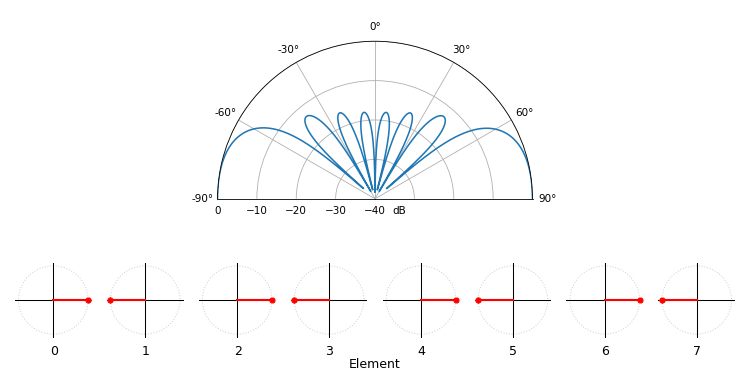
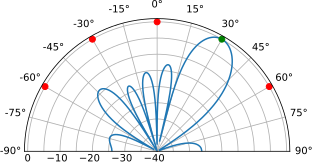
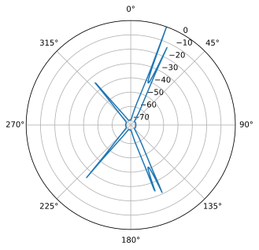
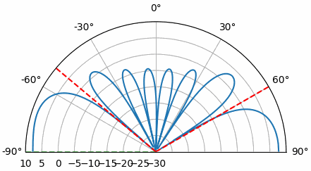
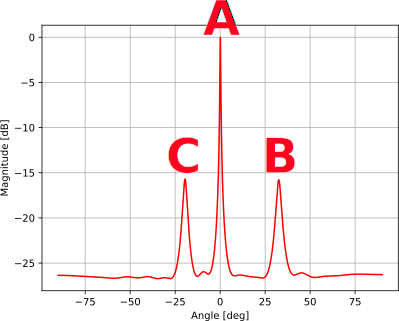
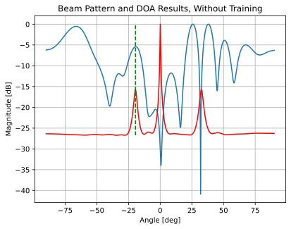
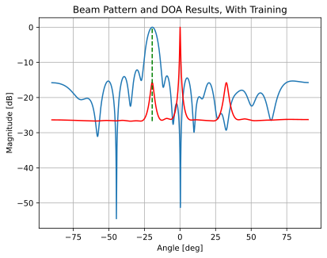

.. _doa-chapter:

####################################
DOA en Bundelvorming
####################################

In dit hoofdstuk behandelen we bundelvorming, direction-of-arrival (DOA, aankomstrichting) en phased arrays. Met Python-simulatievoorbeelden bespreken we technieken zoals Capon en MUSIC. Ook vergelijken we bundelvorming met DOA en behandelen we twee soorten phased arrays (passief en actief).
**N.B. Dit hoofdstuk wordt momenteel vertaald en kan nog fouten bevatten.** 

************************
Overzicht en termen
************************

Een phased array, ook wel een elektronisch gestuurd array genoemd, is een array van antennes die aan de zend- of ontvangstkant kan worden gebruikt om (elektronische) bundels op een bepaalde richting op te focussen. 
Deze techniek wordt gebruikt in communicatie- en radartoepassingen. 

Phased arrays kun je grofweg in drie categorieën indelen:

1. **Passive electronically scanned array (PESA)**, beter bekend als een analoge of traditionele phased array. Hierbij worden analoge faseverschuivers gebruikt om de bundelrichting aan te passen.
   Bij de ontvanger worden alle elementen na een faseverschuiving (en eventueel versterking) opgeteld en met een mixer naar de basisband  geschoven om te verwerken.
   Bij de zender gebeurt het tegenovergestelde; een enkel digitaal signaal wordt analoog gemaakt waarna meerdere faseverschuivers en versterkers worden gebruikt om het signaal voor elke antenne te produceren.
2. **Active electronically scanned array (AESA)**, beter bekend als een volledig digitale array. Hier heeft elk element zijn eigen RF-componenten en het richten van de bundel gebeurt dan volledig digitaal. Vanwege de RF-componenten is dit de duurste aanpak, maar het geeft flexibiliteit en maakt hogere snelheden mogelijk. Digitale arrays zijn ideaal voor SDR's alhoewel het aantal kanalen van de SDR de grootte van de array beperkt. Wanneer er digitale faseverschuivers worden toegepast, dan hebben deze een bepaalde amplitude- en faseresolutie.
3. **Hybride array**, Nu worden meer PESA subarrays gebruikt, waarbij elke subarray zijn eigen RF voorkant heeft net als bij AESA's. Deze aanpak geeft het beste van beide werelden enwordt het meest toegepast in moderne arrays.

Hieronder vind je een voorbeeld van de drie typen:

.. image:: ../_images/beamforming_examples.svg
   :align: center 
   :target: ../_images/beamforming_examples.svg
   :alt: Example of phased arrays including Passive electronically scanned array (PESA), Active electronically scanned array (AESA), Hybrid array, showing Raytheon's MIM-104 Patriot Radar, ELM-2084 Israeli Multi-Mission Radar, Starlink User Terminal, aka Dishy

We zullen in dit hoofdstuk voornamelijk focussen op de signaalbewerking voor volledig digitale arrays, omdat deze beter geschikt zijn voor simulatie en DSP toepassingen. In het volgende hoofdstuk gaan we aan de slag met de "Phaser" array en SDR van Analog Devices die 8 analoge faseverschuivers heeft aangesloten op een Pluto.

We zullen de antennes die de array vormen meestal elementen noemen, en soms wordt de array ook wel een "sensor" genoemd. Deze array-elementen zijn meestal omnidirectionele antennes, die gelijkmatig verdeeld zijn in een lijn of over twee dimensies.

Een bundelvormer is in wezen een ruimtelijk filter; het filtert signalen uit alle richtingen behalve de gewenste richting(en). Net als bij normale filters, gebruiken we gewichten (coefficienten) op elk element van een array. We manipuleren dan de gewichten om de bundel(s) van de array te vormen, vandaar de naam bundelvormer! We kunnen deze bundels (en nullen) extreem snel sturen; veel sneller dan mechanisch gestuurde antennes (een mogelijk alternatief). Een enkele array kan, zolang het maar genoeg elementen heeft, tegelijkertijd meerdere signalen elektronisch volgen terwijl het interferentie onderdrukt. We zullen bundelvorming meestal bespreken in de context van een communicatieverbinding, waarbij de ontvanger probeert een of meerdere signalen met een zo hoog mogelijke SNR te ontvangen.

Bundelvormingstechnieken worden meestal onderverdeeld in conventionele en adaptieve technieken. Bij conventionele bundelvorming ga je er vanuit dat je al weet waar het signaal vandaan komt. De bundelvormer kiest dan gewichten om de versterking in die richting te maximaliseren. Dit kan zowel aan de ontvangende als aan de zendende kant van een communicatiesysteem worden gebruikt. Bij adaptieve bundelvorming daarentegen worden, om een bepaald criterium te optimaliseren, de gewichten voortdurend aangepast op basis van de uitgang van de bundelvormer. Vaak is het doel een interferentiebron te onderdrukken. Vanwege de gesloten lus en adaptieve aard wordt adaptieve bundelvorming typisch alleen aan de ontvangende kant gebruikt, dus de "uitgang van de bundelvormer" is gewoon je ontvangen signaal.  Adaptieve bundelvorming houdt dus in dat je de gewichten aanpast op basis van de statistieken van de ontvangen gegevens.

Direction-of-Arrival (DOA) binnen DSP/SDR verwijst naar de manier waarop een array van antennes wordt gebruikt om de aankomstrichtingen van een of meerdere signalen in te schatten (in tegenstelling tot bundelvorming, dat zich richt op het ontvangen van een signaal terwijl zoveel mogelijk ruis en interferentie wordt onderdrukt). Omdat DOA zeker onder het onderwerp bundelvorming valt, kunnen de termen verwarrend zijn. 
Dezelfde technieken die bij bundelvorming worden gebruikt, zijn ook toepasbaar bij DOA. Het vinden van de richting gebeurt op dezelfde manieren. 
De meeste bundelvormingstechnieken gaan er van uit dat de aankomstrichting van het signaal bekend is. Wanneer de zender of ontvanger zich verplaatsten zal het alsnog continu DOA moeten uitvoeren, zelfs als het primaire doel is om het signaal te ontvangen en demoduleren.

Phased arrays en bundelvorming/DOA worden gebruikt in allerlei toepassingen. Je kunt ze onder andere vinden in verschillende vormen van radar, mmWave-communicatie binnen 5G, satellietcommunicatie en voor het storen van verbindingen. Elke toepassing die een antenne met een hoge versterking vereist, of een snel bewegende antenne met een hoge versterking, zijn goede kandidaten voor phased arrays.

*******************
Eisen SDR
*******************

Zoals besproken bestaat een analoge phased array uit een faseverschuiver (en versterker) per kanaal. Dit betekent dat er analoge hardware nodig is naast de SDR. Aan de andere kant kan elke SDR met meer dan één kanaal, waarbij alle kanelen fasegekoppeld zijn en dezelfde klok gebruiken, als een digitale array worden gebruikt. Dit is meestal het geval bij SDR's met meerdere kanalen.
Er zijn veel SDR's die **twee** ontvangstkanalen bevatten, zoals de Ettus USRP B210 en de Analog Devices Pluto (het 2e kanaal wordt blootgesteld met een uFL-connector op het bord zelf). Helaas, als je verder gaat dan twee kanalen, kom je in het segment van SDR's van $10k+ terecht, althans in 2023, zoals de USRP N310. Het grootste probleem is dat goedkope SDR's meestal niet aan elkaar kunnen worden "gekoppeld" om het aantal kanalen te vermeerderen. De uitzondering is de KerberosSDR (4 kanalen) en KrakenSDR (5 kanalen) die meerdere RTL-SDR's gebruiken die een LO delen met een gedeelde LO om een goedkope digitale array te vormen; het nadeel is de zeer beperkte bemonsteringsfrequentie (tot 2,56 MHz) en afstemmingsbereik (tot 1766 MHz). De KrakenSDR-kaart en een antenneconfiguratievoorbeeld wordt hieronder getoond. 

.. image:: ../_images/krakensdr.jpg
   :align: center 
   :alt: The KrakenSDR
   :target: ../_images/krakensdr.jpg

In dit hoofdstuk zullen we geen specifieke SDR's gebruiken; in plaats daarvan simuleren we het ontvangen van signalen met Python, en gaan we door de benodigde bewerkingen voor bundelvorming/DOA.

********************************************
Introductie Matrix wiskunde in Python/NumPy
********************************************

Python heeft veel voordelen ten opzichte van MATLAB. Het is gratis en open-source en heeft een diversiteit aan toepassingen. Het heeft een levendige gemeenschap, indexen beginnen bij 0 zoals in elke andere taal, het wordt gebruikt binnen AI/ML, en er lijkt een bibliotheek te zijn voor alles wat je maar kunt bedenken. 
Maar waar Python tekort schiet, is de syntax van matrixmanipulatie (berekenings- /snelheidsgewijs is het snel genoeg, met functies die efficiënt in C/C++ zijn geïmplementeerd). Het helpt ook niet dat er meerdere manieren zijn om matrices in Python te vertegenwoordigen, waarbij de methode :code:`np.matrix` is verouderd ten gunste van :code:`np.ndarray`. In dit hoofdstuk geven we een korte inleiding over het uitvoeren van matrixwiskunde in Python met behulp van NumPy, zodat je je comfortabeler voelt wanneer we bij de DOA-voorbeelden komen.

We zullen beginnen met het vervelendste deel van matrixwiskunde met NumPy: vectoren worden behandeld als 1D arrays. Het is dus onmogelijk om onderscheid te maken tussen een rij- of kolomvector (het wordt standaard als een rijvector behandeld). In MATLAB is een vector een 2D-object. 
In Python kun je een nieuwe vector maken met :code:`a = np.array([2,3,4,5])` of een lijst omzetten in een vector met :code:`mylist = [2, 3, 4, 5]` en dan :code:`a = np.asarray(mylist)`, maar zodra je enige matrixwiskunde wilt doen, is de oriëntatie belangrijk, en :code:`a` wordt geïnterpreteerd als een rijvector.
De vector transponderen met bijv. :code:`a.T` zal het **niet** veranderen in een kolomvector! De manier om van een normale vector :code:`a` een kolomvector te maken, is door :code:`a = a.reshape(-1,1)` te gebruiken. De :code:`-1` vertelt NumPy om de grootte van deze dimensie automatisch te bepalen, terwijl de tweede dimensie lengte 1 behoudt, dus het is vanuit een wiskundig perspectief nog steeds 1D. Het is maar één extra regel, maar het kan de leesbaarheid van matrix code echt verstoren.

Als een kort voorbeeld voor matrixwiskunde in Python zullen we een :code:`3x10` matrix vermenigvuldigen met een :code:`10x1` matrix. Onthoud dat :code:`10x1` 10 rijen en 1 kolom betekent. Het is dus een kolomvector omdat het slechts één kolom is. In school hebben we geleerd dat, omdat de binnenste dimensies overeenkomen, dit een geldige matrixvermenigvuldiging is, en dat de resulterende matrix :code:`3x1` groot is (de buitenste dimensies). We zullen :code:`np.random.randn()` gebruiken om de :code:`3x10` te maken, en :code:`np.arange()` om de :code:`10x1` te maken:

.. code-block:: python

 A = np.random.randn(3,10) # 3x10
 B = np.arange(10) # 1D array met lengte 10
 B = B.reshape(-1,1) # 10x1
 C = A @ B # matrixvermenigvuldiging
 print(C.shape) # 3x1
 C = C.squeeze() # zie het volgende deel
 print(C.shape) # 1D array met lengte 3, makkelijker om te plotten of verder te gebruiken

Na het uitvoeren van matrixwiskunde, kan het resultaat er ongeveer zo uitzien: :code:`[[ 0.  0.125  0.251  -0.376  -0.251 ...]]`. Deze data heeft duidelijk maar 1 dimensie, maar je kunt het niet doorgeven aan andere functies zoals :code:`plot()`. Je krijgt een foutmelding of lege grafiek.
Dit komt omdat het resultaat technisch gezien een 2D-Pythonarray is. Je moet  het naar een 1D-array omzetten met :code:`a.squeeze()`. 
De :code:`squeeze()`-functie verwijdert alle dimensies met lengte 1, en is handig bij het uitvoeren van matrixwiskunde in Python. In het bovenstaande voorbeeld zou het resultaat :code:`[ 0.  0.125  0.251  -0.376  -0.251 ...]` zijn (let op de ontbrekende tweede haakjes). Dit kan nu verder gebruikt worden om een grafiek te plotten of iets anders te doen.

De beste check die je op je matrixwiskunde kunt uitvoeren is het afdrukken van de dimensies (met :code:`A.shape`) en te controleren of ze zijn wat je verwacht. Overweeg om de dimensies op elke regel als commentaar te plaatsen, zodat nadien controleren makkelijker wordt.

Hier zijn enkele veelvoorkomende bewerkingen in zowel MATLAB als Python, als een soort spiekbriefje:

.. list-table::
   :widths: 35 25 40
   :header-rows: 1

   * - Operatie
     - MATLAB
     - Python/NumPy
   * - Maak een rijvector met grootte :code:`1 x 4`
     - :code:`a = [2 3 4 5];`
     - :code:`a = np.array([2,3,4,5])`
   * - Maak een kolomvector met grootte :code:`4 x 1`
     - :code:`a = [2; 3; 4; 5];` or :code:`a = [2 3 4 5].'`
     - :code:`a = np.array([[2],[3],[4],[5]])` or |br| :code:`a = np.array([2,3,4,5])` then |br| :code:`a = a.reshape(-1,1)`
   * - Maak een 2D Matrix
     - :code:`A = [1 2; 3 4; 5 6];`
     - :code:`A = np.array([[1,2],[3,4],[5,6]])`
   * - Krijg grootte van een matrix
     - :code:`size(A)`
     - :code:`A.shape`
   * - Transponeer matrix :math:`A^T`
     - :code:`A.'`
     - :code:`A.T`
   * - Complex Conjugeerde transponatie |br| a.k.a. Conjugeerde Transponatie |br| a.k.a. Hermitische Transponatie |br| a.k.a. :math:`A^H`
     - :code:`A'`
     - :code:`A.conj().T` |br| |br| (Helaas is er geen :code:`A.H` voor ndarrays)
   * - Vermenigvulging per element
     - :code:`A .* B`
     - :code:`A * B` or :code:`np.multiply(a,b)`
   * - Matrixvermenigvuldiging
     - :code:`A * B`
     - :code:`A @ B` or :code:`np.matmul(A,B)`
   * - Inwendig product van twee vectoren (1D)
     - :code:`dot(a,b)`
     - :code:`np.dot(a,b)` (gebruik np.dot nooit voor 2D)
   * - Aan elkaar plakken van matrices
     - :code:`[A A]`
     - :code:`np.concatenate((A,A))`

*******************
Basiswiskunde
*******************

Voordat we met de leuke dingen beginnen zullen we eerst een beetje wiskunde moeten behandelen. Het volgende deel is wel zo geschreven dat de wiskunde extreem simpel is met figuren erbij. Alleen de meest basale goniometrische en exponentiële eigenschappen worden gebruikt. Deze basiswiskude is belangrijk om later de pythoncode te begrijpen waarmee we DOA uitvoeren.

We hebben een 1 dimensionale array van antennes die uniform zijn uitgespreid:

.. image:: ../_images/doa.svg
   :align: center 
   :target: ../_images/doa.svg
   :alt: Diagram showing direction of arrival (DOA) of a signal impinging on a uniformly spaced antenna array, showing kijkrichting angle and distance between elements or apertures

In dit voorbeeld komt het signaal van rechts dus het raakt het meest rechtste element als eerste. Laten we de vertraging berekenen tussen wanneer het signaal het eerste element raakt en wanneer het het volgende element bereikt. We kunnen dit doen door het volgende trigonometrische probleem te vormen, probeer te begrijpen hoe deze driehoek is gevormd vanuit het bovenstaande figuur. Het rode segment vertegenwoordigt de afstand die het signaal moet afleggen *nadat* het het eerste element heeft bereikt en voordat het het volgende element raakt.

.. image:: ../_images/doa_trig.svg
   :align: center 
   :target: ../_images/doa_trig.svg
   :alt: Trig associated with direction of arrival (DOA) of uniformly spaced array

Als je SOS CAS TOA nog kent, zijn we in dit geval geinteresseerd in de "aanliggende" en hebben we de lengte van de "schuine" (:math:`d`), dus we moeten een cosinus gebruiken:

.. math::
  \cos(90 - \theta) = \frac{\mathrm{aanliggende}}{\mathrm{schuine}}

De aanliggende vertelt ons hoe ver het signaal moet reizen tussen het raken van het eerste en het raken van het volgende element, dus het wordt aanliggende :math:`= d \cos(90 - \theta)`. Nu is er een goniometrische identiteit die ons in staat stelt dit om te zetten in aanliggende :math:`= d \sin(\theta)`. Dit is slechts een afstand, we moeten dit omzetten in een tijd met behulp van de lichtsnelheid: verstreken tijd :math:`= d \sin(\theta) / c` [seconden]. Deze vergelijking geldt tussen elk aangrenzend element van onze array, hoewel we het hele ding met een geheel getal kunnen vermenigvuldigen om de niet-aangrenzende elementen te berekenen, omdat ze gelijkmatig verdeeld zijn (dit zullen we later doen).

Nu zullen we deze gonio en lichtsnelheid formules koppelen aan de DSP-wereld. Laten we ons signaal op de basisband :math:`x(t)` noemen en het verzenden op een bepaalde frequentie, :math:`f_c`, dus het verzonden signaal is :math:`x(t) e^{2j \pi f_c t}`. We gebruiken :math:`d_m` om de afstand in meters tussen de elementen aan te geven. Laten we zeggen dat dit signaal het eerste element op tijd :math:`t = 0` raakt, wat betekent dat het volgende element na :math:`d_m \sin(\theta) / c` [seconden] wordt geraakt, zoals we hierboven hebben berekend. Het tweede element ontvangt dan:

.. math::
 x(t - \Delta t) e^{2j \pi f_c (t - \Delta t)}

.. math::
 \mathrm{waar} \quad \Delta t = d_m \sin(\theta) / c

tijdverschuivingen worden afgetrokken van het tijdsargument.

De ontvanger of SDR vermenigvuldigt het signaal met de draaggolf, maar in omgekeerde richting. Na de verschuiving naar de basisband ziet de ontvanger:

.. math::
 x(t - \Delta t) e^{2j \pi f_c (t - \Delta t)} e^{-2j \pi f_c t}

.. math::
 = x(t - \Delta t) e^{-2j \pi f_c \Delta t}

Met een kleine truc is dit nog verder te vereenvoudigen. Bedenk dat wanneer we een signaal samplen, we dit kunnen modelleren door :math:`t` te vervangen door :math:`nT` waar :math:`T` de sampleperiodetijd is en :math:`n` gewoon 0, 1, 2, 3... . Door dit in te vullen krijgen we :math:`x(nT - \Delta t) e^{-2j \pi f_c \Delta t}`. Nu is :math:`nT` zoveel groter dan :math:`\Delta t` dat we de eerste :math:`\Delta t`-term weg kunnen laten en we :math:`x(nT) e^{-2j \pi f_c \Delta t}` overhouden. Als de samplefrequentie ooit snel genoeg wordt om de snelheid van het licht over een kleine afstand te benaderen, kunnen we dit opnieuw bekijken, maar onthoud dat onze samplefrequentie slechts een beetje hoger moet zijn dan de bandbreedte van het signaal van belang.

Laten we doorgaan met deze wiskunde maar dingen in discrete termen gaan vertegenwoordigen zodat het meer op onze Python-code lijkt. De laatste vergelijking kan als volgt worden voorgesteld, laten we :math:`\Delta t` weer invullen:

.. math::
 x[n] e^{-2j \pi f_c \Delta t}

.. math::
 = x[n] e^{-2j \pi f_c d_m \sin(\theta) / c}

We zijn bijna klaar. Gelukkig is er nog een vereenvoudiging die we kunnen maken. Herinner je de relatie tussen middenfrequentie en golflengte: :math:`\lambda = \frac{c}{f_c}` of de vorm die we zullen gebruiken: :math:`f_c = \frac{c}{\lambda}`. Als we dit invullen krijgen we:

.. math::
 = x[n] e^{-2j \pi d \sin(\theta) / \lambda}

Wat we normaal willen doen met DOA is de afstand tussen twee elementen uit te drukken als een fractie van de golflengte in plaats van meters. De meest gekozen waarde tijdens het ontwerpen van een array is om voor :math:`d` een halve golflengte te gebruiken. Ongeacht wat :math:`d` is, vanaf dit punt gaan we :math:`d` uitdrukken als een fractie van de golflengte in plaats van meters, waardoor de vergelijking en al onze code eenvoudiger wordt. Dus, :math:`d` (zonder subscript :math:`m`) is de genormaliseerde afstand, gelijk aan :math:`d = d_m / \lambda`.  Dan kunnen we de vergelijking nog verder vereenvoudigen tot:

.. math::
 x[n] e^{-2j \pi d \sin(\theta)}

Dit is voor aangrenzende elementen, voor het :math:`k`'de element moeten we gewoon :math:`d` keer :math:`k` vermenigvuldigen:

.. math::
 x[n] e^{-2j \pi d k \sin(\theta)}

Nu moeten we afspreken welke conventies we willen gebruiken voor het coordinatenstelsel. In dit boek gaan we ervan uit dat 0 graden de raaklijn is van de plaatsing van de array (d.w.z. de lijn waarop de elementen zich bevinden), zoals te zien is in het bovenstaande diagram, en dat theta met de klok mee toeneemt. We zullen ook het meest linker element als het referentie-element beschouwen, en elk extra element ligt dan :math:`d_m` verder naar rechts. Dit is het tegenovergestelde van ons diagram hierboven, dus we moeten de richting van de faseverschuiving omkeren, wat betekent dat we het negatieve teken moeten verwijderen:

.. math::
 x[n] e^{2j \pi d k \sin(\theta)}

Dit kunnen we in matrixformaat gieten door k op te laten lopen voor alle :code:`Nr`elementen in de array, van :math:`k = 0, 1, ... , N-1`:

.. math::

   x
   \begin{bmatrix}
           e^{2j \pi d (0) \sin(\theta)} \\
           e^{2j \pi d (1) \sin(\theta)} \\
           e^{2j \pi d (2) \sin(\theta)} \\
           \vdots \\
           e^{2j \pi d (N_r - 1) \sin(\theta)} \\
    \end{bmatrix}

Hierbij is :math:`x` de 1D rij-vector van het te verzenden signaal, en noemen we de getoonde kolom-vector de "stuurvector" (vaak aangeduid als :math:`s` en in code :code:`s`) en stellen we deze voor als een array, een 1D array voor een 1D antenne array, enz. Omdat :math:`e^{0} = 1`, is het eerste element van de stuurvector altijd 1, en de rest zijn faseverschuivingen ten opzichte van het eerste element:

.. math::

   s =
   \begin{bmatrix}
           1 \\
           e^{2j \pi d (1) \sin(\theta)} \\
           e^{2j \pi d (2) \sin(\theta)} \\
           \vdots \\
           e^{2j \pi d (N_r - 1) \sin(\theta)} \\
    \end{bmatrix}

Nu zijn we klaar! De bovenstaande vergelijking zul je in alle DOA artikelen en ULA implementaties tegenkomen! Je kunt ook tegenkomen dat :math:`2\pi\sin(\theta)` als :math:`\psi` wordt uitgedrukt, waardoor de stuurvector gelijk wordt aan :math:`e^{jd\psi}`, de meer algemene vorm (die we dus niet gebruiken). In python is :code:`s`:

.. code-block:: python

 s = [np.exp(2j*np.pi*d*0*np.sin(theta)), np.exp(2j*np.pi*d*1*np.sin(theta)), np.exp(2j*np.pi*d*2*np.sin(theta)), ...] # k wordt hier dus opgehoogd
 # of
 s = np.exp(2j * np.pi * d * np.arange(Nr) * np.sin(theta)) # met Nr het aaantal ontvangstantennes

Merk op dat het eerste element in een 1+0j resulteert (omdat :math:`e^{0}=1`); dit is logisch omdat alles hierboven relatief is aan dat eerste element, dus het ontvangt het signaal zoals het is zonder enige relatieve faseverschuivingen. Dit is puur hoe dat resulteert uit de wiskunde. In werkelijkheid kan elk element als referentie worden gebruikt, maar zoals je later in onze wiskunde/code zult zien, is het verschil in fase/amplitude dat tussen elementen wordt ontvangen wat telt. Het is allemaal relatief.

Vergeet niet dat :code:`d` is uitgedrukt in golflengte als eenheid en niet in meters!

**********************
Een signaal ontvangen
**********************

Laten we het bovenstaande concept gebruiken om een ontvangen signaal signaal te simuleren. Voorlopig gebruiken we een enkele toon als verzendsignaal:

.. code-block:: python

 import numpy as np
 import matplotlib.pyplot as plt
 
 sample_rate = 1e6
 N = 10000 # aantal samples om te simuleren
 
 # Maak een toon om het verzonden signaal mee te simuleren
 t = np.arange(N)/sample_rate # tijdsvector
 f_tone = 0.02e6
 tx = np.exp(2j * np.pi * f_tone * t)

Nu gaan we een antenne simuleren, met drie omnidirectionele antennes op een rij, elk een halve golflengte van elkaar verwijderd. We zullen simuleren dat het signaal van de zender op deze array aankomt onder een bepaalde hoek, :math:`\theta`. Het begrijpen van de factor :code:`a`, is de reden waarom we al die wiskunde hierboven hebben doorgenomen.

.. code-block:: python

 d = 0.5 #afstand van een halve golflengte
 Nr = 3
 theta_degrees = 20 # aankomstrichting in graden
 theta = theta_degrees / 180 * np.pi # naar radialen
 s = np.exp(2j * np.pi * d * np.arange(Nr) * np.sin(theta))  # de stuurvector
 print(s) # 3 complexe elementen, de eerste is 1+0j

Om de array factor toe te passen moeten we een matrixvermenigvuldiging doen van :code:`s` en :code:`tx`, dus laten we beide omzetten naar 2D met de methode die we eerder hebben besproken toen we de matrixwiskunde in Python doornamen. Eerst zetten we het om naar rijvectoren met :code:`onzearray.reshape(-1,1)`. Vervolgens voeren we de matrixvermenigvuldiging uit, aangegeven door het :code:`@`-symbool. Ook moeten we met een transpositie-operatie :code:`tx` omzetten van een rijvector naar een kolomvector (zie het als een rotatie van 90 graden), zodat de matrixvermenigvuldiging gelijke binnenste dimensies heeft.

.. code-block:: python

 s = s.reshape(-1,1) # omzetten naar een kolomvector
 print(s.shape) # 3x1
 tx = tx.reshape(1,-1) # meteen transponeren naar een rijvector
 print(tx.shape) # 1x10000x
 
 # matrixvermenigvuldiging
 X = s @ tx  # We simuleren het ontvangen signaal X met een matrixvermenigvuldiging
 print(X.shape) # 3x10000.  X  is nu tweedimensionaal: tijd en afstand

Op dit moment is :code:`X` een 2D array van 3 x 10000 elementen. Dit is omdat we drie array-elementen en 10000 gesimuleerde samples hebben. We gebruiken de hoofdletter :code:`X` om duidelijk aan tegeven dat het om meerdere ontvangen, opgestapelde signalen gaat. We kunnen elk individueel signaal eruit halen en de eerste 200 samples laten zien. Hieronder zullen we alleen de reële delen weergeven, maar net als bij elk basisbandsignaal is er ook een imaginair deel. Een vervelend onderdeel van matrixwiskunde in Python is dat we :code:`.squeeze()` moeten toevoegen oom de extra dimensies met lengte 1 te verwijderen, zodat we naar een normale 1D NumPy-array gaan die we verder kunnen gebruiken.

.. code-block:: python

 plt.plot(np.asarray(r[0,:]).squeeze().real[0:200]) # asarray en squeeze zijn helaas noodzakelijk omdat we van een 2D array komen
 plt.plot(np.asarray(r[1,:]).squeeze().real[0:200])
 plt.plot(np.asarray(r[2,:]).squeeze().real[0:200])
 plt.show()

.. image:: ../_images/doa_time_domain.svg
   :align: center 
   :target: ../_images/doa_time_domain.svg
   
Het faseverschil tussen de element is zoals we hadden verwacht (tenzij het signaal haaks aankomt, en dan alle element op het zelfde moment bereikt, en er dus geen verschuiving is, zet theta op 0 om dit te zien). Probeer de hoek aan te passen en kijk wat er gebeurt.

Laten we als laatste nog wat ruis toevoegen aan dit ontvangen signaal, want elk signaal dat we zullen behandelen heeft een bepaalde hoeveelheid ruis. We willen de ruis toepassen nadat de stuurvector is toegepast, omdat elk element een onafhankelijk ruisignaal ervaart (we kunnen dit doen omdat AWG-ruis na een faseverschuiving nog steeds AWG-ruis is):

.. code-block:: python

 n = np.random.randn(Nr, N) + 1j*np.random.randn(Nr, N)
 X = X + 0.1*n # X en n zijn allebij 3x10000

.. image:: ../_images/doa_time_domain_with_noise.svg
   :align: center 
   :target: ../_images/doa_time_domain_with_noise.svg

***********************************
Conventionele Bundelvorming en DOA
***********************************

We gaan deze samples :code:`X` nu verwerken alsof we de aankomstrichting niet kennen, en vervolgens DOA uitvoeren. Daarbij schatten we de aankomstrichting(en) met DSP en Python-code. Zoals eerder in dit hoofdstuk besproken zijn bundelvorming en DOA sterk aan elkaar verwant en vaak gebaseerd op dezelfde technieken. In de rest van dit hoofdstuk bekijken we verschillende "beamformers". Voor elke techniek starten we met de wiskunde/code om de gewichten, :math:`w`, te berekenen. Deze gewichten kunnen we vervolgens op het inkomende signaal :code:`X` "toepassen" met de eenvoudige vergelijking :math:`w^H X`, of in Python :code:`w.conj().T @ X`. In het voorbeeld hierboven is :code:`X` een :code:`3x10000`-matrix, maar na het toepassen van de gewichten houden we :code:`1x10000` over, alsof onze ontvanger maar één antenne heeft. Daarna kunnen we normale RF signaalbewerking toepassen op het signaal. Zodra we de beamformer hebben opgebouwd, passen we die toe op het DOA-probleem.

We beginnen met de "conventionele" bundelvormingsaanpak, ook wel delay-and-sum genoemd. Onze gewichtenvector :code:`w` moet voor een uniforme lineaire array een 1D-array zijn. In ons voorbeeld met drie elementen is :code:`w` een :code:`3x1`-array met complexe gewichten. Bij conventionele bundelvorming laten we de amplitudes van de gewichten op 1 staan en passen we alleen de fases aan, zodat het signaal constructief in de richting van het gewenste signaal optelt, aangeduid met :math:`\theta`. Dit blijkt exact dezelfde wiskunde te zijn als hierboven; onze gewichten zijn dus gewoon onze stuurvector.

.. math::
 w_{conv} = e^{2j \pi d k \sin(\theta)}

of in Python:

.. code-block:: python

 w = np.exp(2j * np.pi * d * np.arange(Nr) * np.sin(theta)) # conventionele, oftewel delay-and-sum-beamformer
 X_weighted = w.conj().T @ X # voorbeeld van gewichten toepassen op het ontvangen signaal (dus bundelvorming uitvoeren)
 print(X_weighted.shape) # 1x10000

waar :code:`Nr` het aantal elementen is in onze uniforme lineaire array met een onderlinge afstand van :code:`d` golflengtefracties (meestal ~0,5). Zoals je ziet hangen de gewichten alleen af van de arraygeometrie en de gewenste hoek. Als onze array fasekalibratie nodig heeft, nemen we die kalibratiewaarden ook mee. Je ziet in de vergelijking voor :code:`w` ook dat de gewichten complex zijn en allemaal een amplitude van één (unity) hebben.

Maar hoe kennen we de gewenste hoek :code:`theta`? We moeten eerst DOA uitvoeren, waarbij we alle aankomstrichtingen van -π tot +π (-180 tot +180 graden) scannen (samplen), bijvoorbeeld in stappen van 1 graad. Voor elke richting berekenen we de gewichten met een beamformer; we beginnen met de conventionele beamformer. Als we de gewichten op :code:`X` toepassen, krijgen we een 1D-array met samples, alsof we met één richtantenne ontvangen. Daarna kunnen we het signaalvermogen bepalen via de variantie met :code:`np.var()`, en dit herhalen voor elke hoek in de scan. We plotten de resultaten en beoordelen ze visueel, maar in de praktijk zoekt RF-DSP meestal de hoek met het maximale vermogen (via een piekzoekalgoritme) en noemt die de DOA-schatting.

.. code-block:: python

 theta_scan = np.linspace(-1*np.pi, np.pi, 1000) # 1000 verschillende theta-waarden tussen -180 en +180 graden
 results = []
 for theta_i in theta_scan:
    w = np.exp(2j * np.pi * d * np.arange(Nr) * np.sin(theta_i)) # conventionele, oftewel delay-and-sum-beamformer
    X_weighted = w.conj().T @ X # pas de gewichten toe; onthoud dat X 3x10000 is
    results.append(10*np.log10(np.var(X_weighted))) # signaalvermogen in dB, zodat kleine en grote lobben tegelijk zichtbaar zijn
 results -= np.max(results) # normalize (optional)
 
 # print de hoek die de maximale waarde geeft
 print(theta_scan[np.argmax(results)] * 180 / np.pi) # 19.99999999999998
 
 plt.plot(theta_scan*180/np.pi, results) # plot de hoek in graden
 plt.xlabel("Theta [Degrees]")
 plt.ylabel("DOA Metric")
 plt.grid()
 plt.show()

.. image:: ../_images/doa_conventional_beamformer.svg
   :align: center 
   :target: ../_images/doa_conventional_beamformer.svg

We hebben ons signaal gevonden. Je ziet nu waarschijnlijk ook waar de term "elektronisch gestuurde array" vandaan komt. Probeer de hoeveelheid ruis te verhogen om de limiet op te zoeken; bij lage SNR heb je mogelijk meer gesimuleerde samples nodig. Probeer ook de aankomstrichting te veranderen.

Als je de DOA-resultaten liever in een poolplot ziet, gebruik dan de volgende code:

.. code-block:: python

 fig, ax = plt.subplots(subplot_kw={'projection': 'polar'})
 ax.plot(theta_scan, results) # GEBRUIK RADIALEN VOOR EEN POOLPLOT
 ax.set_theta_zero_location('N') # maak dat 0 graden omhoog wijst
 ax.set_theta_direction(-1) # laat de hoek met de klok mee toenemen
 ax.set_rlabel_position(55)  # verplaats rasterlabels weg van andere labels
 plt.show()

.. image:: ../_images/doa_conventional_beamformer_polar.svg
   :align: center 
   :target: ../_images/doa_conventional_beamformer_polar.svg
   :alt: Example polar plot of performing direction of arrival (DOA) showing the beam pattern and 180-degree ambiguity

We blijven dit patroon terugzien: over alle hoeken, op een bepaalde manier de gewichten berekenen en die vervolgens op het ontvangen signaal toepassen. In de volgende methode (MVDR) gebruiken we het ontvangen signaal :code:`X` ook in de gewichtenberekening, waardoor het een adaptieve techniek wordt. Maar eerst bekijken we een paar interessante effecten van phased arrays, waaronder waarom er een tweede piek bij 160 graden staat.

*********************
180-gradenambiguiteit
*********************

Laten we bespreken waarom er een tweede piek op 160 graden staat. De gesimuleerde DOA was 20 graden, en het is geen toeval dat 180 - 20 = 160. Stel je drie omnidirectionele antennes in een lijn op een tafel voor. De kijkrichting van de array staat 90 graden op de as van de array, zoals in het eerste diagram van dit hoofdstuk. Denk nu aan een zender vóór de antennes, ook op die (erg grote) tafel, zodat het signaal binnenkomt onder +20 graden ten opzichte van de kijkrichting. Voor de array is het faseverschil echter hetzelfde of het signaal van voren of van achteren komt. Dat zie je hieronder, met de array-elementen in rood en de twee mogelijke DOA-posities van de zender in groen. Daarom krijg je bij het uitvoeren van een DOA-algoritme altijd dit soort 180-gradenambiguiteit. De enige oplossing is een 2D-array, of een tweede 1D-array onder een andere hoek ten opzichte van de eerste. Je vraagt je misschien af of je dan net zo goed alleen van -90 tot +90 graden kunt rekenen om rekentijd te besparen. Dat klopt.

.. image:: ../_images/doa_from_behind.svg
   :align: center 
   :target: ../_images/doa_from_behind.svg

Laten we de aankomstrichting (Engels: Angle of Arrival AoA) eens sweepen van -90 tot +90 graden, in plaats van hem constant op 20 te houden:

.. image:: ../_images/doa_sweeping_angle_animation.gif
   :scale: 100 %
   :align: center
   :alt: Animation of direction of arrival (DOA) showing the endfire of the array

Wanneer we de endfire-regio van de array naderen (dus wanneer het signaal op of dicht bij de array-as aankomt), daalt de prestatie. We zien twee belangrijke verslechteringen: 1) de hoofdlob wordt breder en 2) er ontstaat ambiguiteit, waardoor je niet weet of het signaal van links of rechts komt. Deze ambiguiteit komt boven op de eerder besproken 180-gradenambiguiteit, waarbij je een extra lob op 180 - theta krijgt. Daardoor kunnen bepaalde AoA's tot drie lobben van ongeveer gelijke grootte leiden. Deze endfire-ambiguiteit is logisch: de faseverschuivingen tussen elementen zijn identiek of het signaal nu van links of rechts van de array-as komt. Net als bij de 180-gradenambiguiteit is de oplossing een 2D-array of twee 1D-arrays onder verschillende hoeken. In het algemeen werkt beamforming het beste wanneer de hoek dichter bij de kijkrichting ligt.

Vanaf nu tonen we in poolplots alleen nog -90 tot +90 graden, omdat het patroon voor 1D-lineaire arrays (waar dit hoofdstuk over gaat) toch gespiegeld is rond de array-as.

********************
Beam Pattern
********************

De grafieken die we tot nu toe hebben getoond zijn DOA-resultaten; ze geven het ontvangen vermogen per hoek na het toepassen van de beamformer. Ze horen bij een specifiek scenario met zenders op bepaalde hoeken. We kunnen echter ook het bundelpatroon zelf bekijken, dus vóórdat we een signaal ontvangen. Dit heet soms het "quiescent antenna pattern" of "array response".

Onthoud dat onze stuurvector, die we steeds terugzien,

.. code-block:: python

 np.exp(2j * np.pi * d * np.arange(Nr) * np.sin(theta))

de ULA-geometrie vastlegt, en als extra parameter alleen de richting heeft waar je naartoe wilt sturen. We kunnen het quiescent antenna pattern (array response) berekenen en plotten voor een gekozen stuurhoek. Dat laat de natuurlijke respons van de array zien als we geen extra bundelvorming toepassen. Dit kan door de FFT van de complex geconjugeerde gewichten te nemen, dus zonder for-loop. Het lastige deel is zero-padding voor extra resolutie en het mappen van FFT-bins naar hoeken in radialen of graden, waarbij een arcsinus nodig is, zoals je in het voorbeeld hieronder ziet.

.. code-block:: python

    Nr = 3
    d = 0.5
    N_fft = 512
   theta_degrees = 20 # er is geen SOI; we verwerken geen samples, dit is alleen de richting waar we op richten
    theta = theta_degrees / 180 * np.pi
   w = np.exp(2j * np.pi * d * np.arange(Nr) * np.sin(theta)) # conventionele beamformer
   w_padded = np.concatenate((w, np.zeros(N_fft - Nr))) # zero-pad naar N_fft elementen voor meer FFT-resolutie
   w_fft_dB = 10*np.log10(np.abs(np.fft.fftshift(np.fft.fft(w_padded)))**2) # FFT-magnitude in dB
    w_fft_dB -= np.max(w_fft_dB) # normalize to 0 dB at peak
    
   # map FFT-bins naar hoeken in radialen
    theta_bins = np.arcsin(np.linspace(-1, 1, N_fft)) # in radians
    
   # vind het maximum zodat we het in de plot kunnen tonen
    theta_max = theta_bins[np.argmax(w_fft_dB)]
    
    fig, ax = plt.subplots(subplot_kw={'projection': 'polar'})
   ax.plot(theta_bins, w_fft_dB) # GEBRUIK RADIALEN VOOR EEN POOLPLOT
    ax.plot([theta_max], [np.max(w_fft_dB)],'ro')
    ax.text(theta_max - 0.1, np.max(w_fft_dB) - 4, np.round(theta_max * 180 / np.pi))
   ax.set_theta_zero_location('N') # laat 0 graden omhoog wijzen
   ax.set_theta_direction(-1) # laat de hoek met de klok mee toenemen
   ax.set_rlabel_position(55)  # verplaats rasterlabels weg van andere labels
   ax.set_thetamin(-90) # toon alleen de bovenste helft
    ax.set_thetamax(90)
   ax.set_ylim([-30, 1]) # zonder ruis hoeft de schaal maar tot -30 dB te gaan
    plt.show()

.. image:: ../_images/doa_quiescent.svg
   :align: center 
   :target: ../_images/doa_quiescent.svg

Dit patroon blijkt bijna exact overeen te komen met het patroon dat je krijgt bij DOA met de conventionele beamformer (delay-and-sum), wanneer er één toon op `theta_degrees` aanwezig is en weinig tot geen ruis. De plot kan er anders uitzien door hoe ver de y-as in dB naar beneden loopt, of door de FFT-grootte waarmee dit quiescent-patroon is gemaakt. Probeer :code:`theta_degrees` of het aantal elementen :code:`Nr` te variëren om te zien hoe de respons verandert.

Voor het leuke, laat de volgende animatie het bundelpatroon van de conventionele beamformer zien, voor een 8-element-array die tussen -90 en +90 graden wordt gestuurd. Ook zie je de acht gewichten in het complexe vlak (reële en imaginaire as).

Let erop dat alle gewichten eenheidsamplitude hebben (ze blijven op de eenheidscirkel), en dat elementen met een hoger indexnummer sneller "draaien". Als je goed kijkt, zie je dat ze bij 0 graden allemaal samenvallen; ze hebben dan allemaal 0 faseverschuiving (1+0j).

********************
Array Pulsbreedte
********************

Voor wie nieuwsgierig is: er bestaan vergelijkingen die de breedte van de hoofdlob benaderen op basis van het aantal elementen. Ze werken vooral goed bij grotere arrays (bijvoorbeeld 8 elementen of meer). De half-power beamwidth (HPBW) is de breedte op 3 dB onder de piek van de hoofdlob, en is ongeveer :math:`\frac{0.9 \lambda}{N_rd\cos(\theta)}` [1]. Voor halve-golflengteafstand vereenvoudigt dit tot:

.. math::

 \text{HPBW} \approx \frac{1.8}{N_r\cos(\theta)} \text{ [radians]} \qquad \text{when } d = \lambda/2

De first-null beamwidth (FNBW), dus de hoofdlobbreedte van nul tot nul, is ongeveer :math:`\frac{2\lambda}{N_rd}` [1]. Voor halve-golflengteafstand vereenvoudigt dit tot:

.. math::

 \text{FNBW} \approx \frac{4}{N_r} \text{ [radians]} \qquad \text{when } d = \lambda/2

Laten we de vorige code gebruiken maar :code:`Nr` verhogen naar 16 elementen. Met de vergelijkingen hierboven zou de HPBW, gericht op 20 graden (0,35 radialen), ongeveer 0,12 radialen of **6,8 graden** moeten zijn. De FNBW zou ongeveer 0,25 radialen of **14,3 graden** moeten zijn. Laten we simuleren hoe dicht we daarbij in de buurt komen. Voor het bekijken van bundelbreedtes gebruiken we meestal rechthoekige plots in plaats van poolplots. Hieronder staan de resultaten, met HPBW in groen en FNBW in rood.

.. image:: ../_images/doa_quiescent_beamwidth.svg
   :align: center
   :target: ../_images/doa_quiescent_beamwidth.svg

In de plot is het misschien lastig te zien, maar als je ver inzoomt blijkt de HPBW ongeveer 6,8 graden en de FNBW ongeveer 15,4 graden te zijn. Dat ligt dus behoorlijk dicht bij de berekening, zeker voor HPBW.

*********************
Wanneer d niet λ/2 is
*********************

Tot nu toe hebben we de elementafstand :math:`d` gelijk genomen aan een halve golflengte. Een array voor 2,4 GHz wifi met λ/2-afstand heeft bijvoorbeeld een elementafstand van 3e8/2.4e9/2 = 12,5 cm (ongeveer 5 inch). Een 4x4-array komt dan uit op ongeveer 15" x 15" x de hoogte van de antennes. Soms kun je echter geen exacte λ/2-afstand halen, bijvoorbeeld door ruimtegebrek, of omdat dezelfde array op meerdere draaggolffrequenties moet werken.

Laten we bekijken wat er gebeurt als de afstand groter is dan λ/2, dus te groot, door :math:`d` te variëren tussen λ/2 en 4λ. We laten de onderste helft van de poolplot weg, omdat die toch een spiegeling van de bovenkant is.

.. image:: ../_images/doa_d_is_large_animation.gif
   :scale: 100 %
   :align: center
   :alt: Animation of direction of arrival (DOA) showing what happens when distance d is much more than half-wavelength

Zoals je ziet krijgen we, naast de eerder besproken 180-gradenambiguiteit, extra ambiguiteit. Die wordt erger naarmate :math:`d` groter wordt (extra/foute lobben ontstaan). Deze extra lobben heten grating lobes en zijn het gevolg van "spatial aliasing". Zoals we in het :ref:`sampling-chapter`-hoofdstuk hebben gezien: als je niet snel genoeg samplet, krijg je aliasing. Hetzelfde gebeurt in het ruimtelijke domein. Als elementen niet dicht genoeg op elkaar staan ten opzichte van de draaggolffrequentie van het waargenomen signaal, krijg je slechte analyseresultaten. Je kunt antenneafstand zien als het samplen van ruimte. In dit voorbeeld worden grating lobes pas echt problematisch bij :math:`d > \lambda`, maar ze ontstaan al zodra je boven λ/2 gaat. Dat komt doordat Nyquist zegt dat we minstens twee keer zo snel moeten samplen als het waargenomen signaal, dus twee samples per cyclus. Onze ruimtelijke samplefrequentie meten we in samples per meter. Omdat de equivalente radiaalfrequentie in de ruimte :math:`2\pi/\lambda` radialen per meter is, en één cyclus :math:`2\pi` radialen (360 graden) bevat, moeten we de ruimte minstens samplen met:

.. math::

 \text{spatial sampling rate} \geq 2 \text{ [samples/cycle]} \cdot \frac{2\pi/\lambda \text{ [radians/meter]}}{2\pi \text{ [radians/cycle]}}

  \text{spatial sampling rate} \geq 2/\lambda \text{ [samples/meter]}

of, uitgedrukt in elementafstand :math:`d` (in feite meter per ruimtelijke sample):

.. math::

 d \leq \lambda/2

Zolang :math:`d \leq \lambda/2` krijgen we geen grating lobes.

Wat gebeurt er dan als :math:`d` kleiner is dan λ/2, bijvoorbeeld wanneer de array in een kleine ruimte moet passen? We weten dat we dan geen grating lobes krijgen, maar er gebeurt wel iets anders. Laten we dezelfde simulatie herhalen, startend bij 0,5λ en dan :math:`d` verlagen:

.. image:: ../_images/doa_d_is_small_animation.gif
   :scale: 100 %
   :align: center
   :alt: Animation of direction of arrival (DOA) showing what happens when distance d is much less than half-wavelength

Terwijl de hoofdlob breder wordt als :math:`d` kleiner wordt, blijft het maximum wel op 20 graden liggen en ontstaan er geen grating lobes. In theorie werkt dit dus nog steeds (tenminste bij hoge SNR en zolang onderlinge koppeling geen groot probleem wordt). Om beter te begrijpen wat er misgaat bij te kleine :math:`d`, herhalen we het experiment met een extra signaal dat binnenkomt op -40 graden:

.. image:: ../_images/doa_d_is_small_animation2.gif
   :scale: 100 %
   :align: center
   :alt: Animation of direction of arrival (DOA) showing what happens when distance d is much less than half-wavelength and there are two signals present

Zodra we onder λ/4 komen, is er nauwelijks nog onderscheid te maken tussen de twee verschillende paden en presteert de array slecht. Zoals we later in dit hoofdstuk zullen zien, zijn er beamformingtechnieken met scherpere bundels dan conventionele beamforming. Toch blijft het een belangrijk uitgangspunt om :math:`d` zo dicht mogelijk bij λ/2 te houden.

..
   UITGECOMMENTARIEERD OMDAT NIET DUIDELIJK IS WAT DEZE SECTIE TOEVOEGT VOOR DE LEZER, BEHALVE EEN ALTERNATIEVE VERGELIJKING EN TERM DIE VEEL COMPACTER GEPRESENTEERD KAN WORDEN
   **********************
   Bartlett Beamformer
   **********************

   Nu we de basis hebben behandeld, maken we een korte zijstap naar notatie en algebraische details van wat we net deden, zodat we bundelsweeps door de ruimte compact en elegant wiskundig kunnen beschrijven. De volgende algebraische notatie leent zich goed voor vectorisatie, en is daardoor geschikt voor realtime verwerking.

   Het proces van bundels door de ruimte sweepen om DOA te schatten heeft een technische naam: "Bartlett Beamforming" (soms ook Fourier beamforming genoemd, al kan die term ook naar een andere techniek verwijzen). Hieronder een korte samenvatting van wat we eerder hebben gedaan om DOA te berekenen, nu in Bartlett-termen:

   #. We kozen een reeks richtingen om op te richten (bijv. -90 tot +90 graden met een bepaalde stap)
   #. We berekenden voor elke richting bundelvormingsgewichten om de bundel daarheen te sturen
   #. De uitgangen van de array-elementen werden met hun bijbehorende gewichten vermenigvuldigd en opgeteld
   #. We berekenden het signaalvermogen per richting en plotten de resultaten
   #. Piekdetectie gaf aan uit welke richtingen waarschijnlijk signalen werden ontvangen

   We schrijven die stappen nu wiskundig op. Laat het door de array ontvangen signaal worden weergegeven met stuurvector :math:`\mathbf{s}`. Dit ontvangen signaal hangt af van de aankomstrichting (DOA), genoteerd als :math:`\theta`. De gewichten noteren we als :math:`\mathbf{w}`. De array-uitgang is dan het inwendig product :math:`\mathbf{w}^{H} \mathbf{s}`. Het signaalvermogen volgt uit het kwadraat van de magnitude van die uitgang: :math:`\left| \mathbf{w}^{H} \mathbf{s} \right|^{2} = \mathbf{w}^{H} \mathbf{s} \mathbf{s}^{H} \mathbf{w} = \mathbf{w} \mathbf{R_{ss}} \mathbf{w}`, waarbij :math:`\mathbf{R}` de geschatte ruimtelijke covariantiematrix is. Die covariantiematrix meet de overeenkomst tussen samples van verschillende array-elementen. Dit herhalen we voor elke te scannen richting; het enige dat per richting verandert is :math:`\mathbf{w}`. We zijn vrij in de gekozen richtingen, dus dat hoeft niet per se een sweep van -90 tot +90 graden te zijn. Alles kan desgewenst parallel met dezelfde :math:`\mathbf{R}` worden verwerkt. Dit is de essentie van Bartlett beamforming: de bundelsweep zoals eerder in Python beschreven.

   .. math::
      P = \left\| \mathbf{w} \mathbf{s}\right\|^2 
      
      = (\mathbf{w}^H\mathbf{s})(\mathbf{w}^H\mathbf{s})^* 
      
      = \mathbf{s}^H\mathbf{w}\mathbf{w}^H\mathbf{s}
      
      = \mathbf{s}^H\mathbf{R}\mathbf{s}

   Deze wiskundige representatie is ook toepasbaar op andere DOA-technieken.

**********************
Ruimtelijke Tapering
**********************

Spatial tapering is een techniek die je naast de conventionele beamformer gebruikt, waarbij je de amplitude van de gewichten aanpast om bepaalde eigenschappen te krijgen. Ook als je geen conventionele beamformer gebruikt, is het tapering-concept belangrijk om te begrijpen. Toen we de gewichten van de conventionele beamformer berekenden, waren dat complexe getallen met allemaal amplitude één (unity). Met spatial tapering vermenigvuldigen we de gewichten met scalars om die amplitude te schalen. Laten we beginnen met wat er gebeurt als we de gewichten met willekeurige waarden tussen 0 en 1 vermenigvuldigen:

.. code-block:: python

   tapering = np.random.uniform(0, 1, Nr) # willekeurige tapering
    w *= tapering

We simuleren een signaal dat op kijkrichting (0 graden) wordt ontvangen bij hoge SNR om te zien wat er gebeurt. Merk op dat dit proces equivalent is aan het simuleren van het quiescent antenna pattern voor deze gewichten, en dus dezelfde resultaten geeft, zoals we aan het eind van dit hoofdstuk bespreken.

.. image:: ../_images/spatial_tapering_animation.gif
   :scale: 80 %
   :align: center
   :alt: Spatial tapering using random values to adjust the magnitude of the weights

Probeer de breedte van de hoofdlob en de positie van de nullen te observeren.

Het blijkt dat tapering de zijlobben kan verlagen, wat vaak gewenst is, door de amplitude van de gewichten aan de **randen** van de array te verlagen. Een Hamming-venster kan bijvoorbeeld als taperingwaarden worden gebruikt:

.. code-block:: python

   tapering = np.hamming(Nr) # Hamming-vensterfunctie
    w *= tapering

Voor de leuk laten we de taperingfunctie geleidelijk overgaan van een rechthoekvenster (geen venster) naar een Hamming-venster:

.. image:: ../_images/spatial_tapering_animation2.gif
   :scale: 80 %
   :align: center
   :alt: Spatial tapering using a hamming window to adjust the magnitude of the weights

We zien hier een paar veranderingen. Ten eerste kan de hoofdlob breder of smaller worden afhankelijk van de taperingfunctie (minder zijlobben betekent meestal een bredere hoofdlob). Een rechthoekige taper (dus geen tapering) geeft de smalste hoofdlob, maar ook de hoogste zijlobben. Ten tweede zien we dat de gain van de hoofdlob afneemt wanneer we tapering toepassen. Dat komt doordat we uiteindelijk minder signaalenergie ontvangen doordat we niet de volledige gain van alle elementen gebruiken. Bij zeer lage SNR kan dat een belangrijk nadeel zijn.

Als je je afvraagt waarom er zoveel zijlobben zijn bij een rechthoekvenster (geen tapering): dat is dezelfde reden waarom een rechthoekvenster in het tijdsdomein tot spectrale lekkage in het frequentiedomein leidt. De Fourier-transformatie van een rechthoekvenster is een sinc-functie, :math:`sin(x)/x`, met zijlobben die oneindig doorlopen. Bij arrays samplen we in het ruimtelijke domein, en het bundelpatroon is de Fourier-transformatie van dat ruimtelijke sampleproces in combinatie met de gewichten. Daarom konden we eerder in dit hoofdstuk het bundelpatroon met een FFT plotten. In de sectie over vensterfuncties in het frequentiedomein hebben we de frequentierespons van venstertypen al vergeleken:

.. image:: ../_images/windows.svg
   :align: center 
   :target: ../_images/windows.svg

******************************
Gewichten Handmatig Aanpassen
******************************

De conventionele beamformer geeft ons een vergelijking om gewichten te berekenen voor een specifieke richting. Maar laten we nu even doen alsof we geen methode hebben en handmatig met de gewichten (zowel amplitude als fase) spelen om te zien wat er gebeurt. Hieronder staat een kleine JavaScript-app die het bundelpatroon van een 8-element-array simuleert, met sliders voor gain en fase per element. Je kunt tapering toevoegen, of minder dan 8 elementen simuleren door de amplitude van één of meer elementen op nul te zetten.

.. raw:: html

    
<!-- Plotly chart will be drawn inside this DIV -->

     
    Element &nbsp;&nbsp;&nbsp; Magnitude (Gain) &nbsp;&nbsp;&nbsp;&nbsp;&nbsp;&nbsp;&nbsp;&nbsp;&nbsp;&nbsp;&nbsp;&nbsp;&nbsp;&nbsp;&nbsp;&nbsp; Phase
    

    
    

************************
Adaptieve Bundelvorming
************************

De conventionele beamformer die we eerder hebben besproken is een eenvoudige en effectieve manier om bundelvorming uit te voeren, maar hij heeft beperkingen. Hij werkt bijvoorbeeld minder goed wanneer meerdere signalen uit verschillende richtingen binnenkomen, of wanneer het ruisniveau hoog is. In zulke gevallen gebruiken we geavanceerdere technieken, vaak "adaptieve" beamforming genoemd. Het idee hierachter is dat we het ontvangen signaal gebruiken om de gewichten te berekenen, in plaats van een vaste set gewichten zoals bij conventionele beamforming. Daardoor kan de beamformer zich aanpassen aan de omgeving en beter presteren, omdat de gewichten nu op statistieken van de ontvangen data zijn gebaseerd.

Adaptieve bundelvormingstechnieken kun je verder opdelen in reguliere en subspace-gebaseerde methoden. Subspace-methoden zoals MUSIC en ESPRIT zijn erg krachtig, maar vereisen dat je schat hoeveel signalen aanwezig zijn. Daarnaast hebben ze minimaal drie elementen nodig om te werken (al is minimaal vier aanbevolen).

De eerste adaptieve bundelvormingstechniek die we bekijken is MVDR, vaak het de-facto-algoritme wanneer mensen over adaptieve bundelvorming praten.

**********************
MVDR/Capon-beamformer
**********************

We bekijken nu een beamformer die iets complexer is dan de conventionele/delay-and-sum-techniek, maar meestal veel beter presteert: de Minimum Variance Distortionless Response (MVDR), ook wel Capon-beamformer genoemd. Onthoud dat de variantie van een signaal overeenkomt met het vermogen in dat signaal. Het idee achter MVDR is om de versterking van het signaal in de gewenste richting 1 (0 dB) te houden, terwijl de totale variantie/het totale vermogen van het gebundelde signaal wordt geminimaliseerd. Als het gewenste signaal vast staat, betekent het minimaliseren van het totale vermogen dat interferentie en ruis zo veel mogelijk worden onderdrukt. Daarom wordt MVDR vaak een "statistisch optimale" beamformer genoemd.

De MVDR/Capon-beamformer kan worden samengevat met de volgende vergelijking:

.. math::

 w_{mvdr} = \frac{R^{-1} s}{s^H R^{-1} s}

De vector :math:`s` is de stuurvector voor de gewenste richting en is aan het begin van dit hoofdstuk besproken. :math:`R` is de geschatte ruimtelijke covariantiematrix op basis van onze ontvangen samples, te bepalen via :code:`R = np.cov(X)` of handmatig met :math:`R = X X^H`, dus :code:`X` vermenigvuldigd met zijn complex geconjugeerde getransponeerde. De ruimtelijke covariantiematrix heeft grootte :code:`Nr` x :code:`Nr` (3x3 in de voorbeelden tot nu toe) en geeft aan hoe sterk de samples van de elementen op elkaar lijken. De vergelijking kan in eerste instantie verwarrend zijn, maar de noemer dient vooral voor schaling. De teller is het belangrijkst: de inverse van de covariantiematrix vermenigvuldigd met de stuurvector. Toch moeten we de noemer wel meenemen, omdat die als normalisatieconstante werkt zodat de amplitude van de gewichten niet wegdrijft wanneer :math:`R` in de tijd verandert.

.. raw:: html

   

   
Voor wie interesse heeft in de MVDR-afleiding: klap dit open

**Uitgang van de beamformer** - De uitgang van de beamformer met gewichtenvector :math:`\mathbf{w}` is:

.. math::

 y(t) = \mathbf{w}^H \mathbf{x}(t)

**Optimalisatieprobleem** - Het doel is om beamforminggewichten te bepalen die het uitgangsvermogen minimaliseren, onder de voorwaarde van een distortionless respons in de gewenste richting :math:`\theta_0`. Formeel schrijven we dat als:

.. math::

 \min_{\mathbf{w}} \, \mathbf{w}^H \mathbf{R} \mathbf{w} \quad \text{subject to} \quad \mathbf{w}^H \mathbf{s} = 1

waarbij:

* :math:`\mathbf{R} = E[\mathbf{X}\mathbf{X}^H]` de covariantiematrix van de ontvangen signalen is
* :math:`\mathbf{s}` de stuurvector in de gewenste signaalrichting :math:`\theta_0` is

**Lagrangemethode** - Introduceer een Lagrange-multiplier :math:`\lambda` en vorm de Lagrangiaan:

.. math::

 L(\mathbf{w}, \lambda) = \mathbf{w}^H \mathbf{R} \mathbf{w} - \lambda (\mathbf{w}^H \mathbf{s} - 1)

**Oplossen van de optimalisatie** - Door de Lagrangiaan af te leiden naar :math:`\mathbf{w^H}` en gelijk te stellen aan nul krijgen we:

.. math::

 \frac{\partial L}{\partial \mathbf{w}^*} = 2\mathbf{R}\mathbf{w} - \lambda \mathbf{s} = 0

 \mathbf{w} = \lambda \mathbf{s} \mathbf{{R^{-1}}}

Om :math:`\lambda` op te lossen, passen we de randvoorwaarde :math:`\mathbf{w}^H \mathbf{s} = 1` toe:

.. math::

 \implies (\lambda \mathbf{s^{H}}\mathbf{{R^{-1}}})s = 1

 \implies \lambda = \frac{1}{\mathbf{s}^{H}\mathbf{R}^{-1}\mathbf{s}}
 
 \mathbf{R}\mathbf{w} = \lambda \mathbf{s}
 
 \mathbf{w_{mvdr}} = \frac{\mathbf{R}^{-1} \mathbf{s}}{\mathbf{s}^H \mathbf{R}^{-1} \mathbf{s}}

.. raw:: html

   

Als we de richting van het gewenste signaal al kennen en die richting niet verandert, hoeven we de gewichten maar één keer te berekenen en kunnen we die gebruiken om het signaal te ontvangen. Toch is periodiek herberekenen vaak nuttig, zelfs bij constante richting, om veranderingen in interferentie/ruis op te vangen. Daarom noemen we dit soort niet-conventionele digitale beamformers "adaptief"; ze gebruiken informatie uit het ontvangen signaal om betere gewichten te berekenen. Ter herinnering: we *voeren* bundelvorming met MVDR uit door deze gewichten te berekenen en toe te passen met :code:`w.conj().T @ X`, net als bij de conventionele methode. Alleen de manier waarop de gewichten worden berekend verschilt.

Om DOA met de MVDR-beamformer uit te voeren, herhalen we eenvoudig de MVDR-berekening terwijl we alle relevante hoeken scannen. Met andere woorden: we doen alsof het signaal uit hoek :math:`\theta` komt, ook als dat niet zo is. Per hoek berekenen we de MVDR-gewichten, passen die toe op het ontvangen signaal en berekenen vervolgens het signaalvermogen. De hoek met het hoogste vermogen is onze DOA-schatting. Nog beter is om vermogen als functie van hoek te plotten, zoals we eerder deden met de conventionele beamformer, zodat we niet vooraf hoeven aan te nemen hoeveel signalen aanwezig zijn.

In Python kunnen we de MVDR/Capon-beamformer als volgt implementeren, hier als functie zodat hij later makkelijk te hergebruiken is:

.. code-block:: python

 # theta is de gewenste richting in radialen, en X is het ontvangen signaal
 def w_mvdr(theta, X):
      s = np.exp(2j * np.pi * d * np.arange(Nr) * np.sin(theta)) # stuurvector in de gewenste richting theta
      s = s.reshape(-1,1) # maak er een kolomvector van (grootte 3x1)
      R = (X @ X.conj().T)/X.shape[1] # bereken covariantiematrix; dit geeft een Nr x Nr-matrix van de samples
      Rinv = np.linalg.pinv(R) # 3x3. pseudo-inverse werkt meestal beter/sneller dan een echte inverse
      w = (Rinv @ s)/(s.conj().T @ Rinv @ s) # MVDR/Capon-vergelijking; teller is 3x3 * 3x1, noemer is 1x3 * 3x3 * 3x1, resultaat is 3x1
      return w

Als we deze MVDR-beamformer in DOA-context gebruiken, krijgen we het volgende Python-voorbeeld:

.. code-block:: python

 theta_scan = np.linspace(-1*np.pi, np.pi, 1000) # 1000 verschillende theta-waarden tussen -180 en +180 graden
 results = []
 for theta_i in theta_scan:
    w = w_mvdr(theta_i, X) # 3x1
    X_weighted = w.conj().T @ X # pas gewichten toe
    power_dB = 10*np.log10(np.var(X_weighted)) # vermogen in dB, zodat kleine en grote lobben tegelijk zichtbaar zijn
    results.append(power_dB)
 results -= np.max(results) # normalize

Toegepast op de vorige DOA-simulatie krijgen we:

.. image:: ../_images/doa_capons.svg
   :align: center 
   :target: ../_images/doa_capons.svg

Dit lijkt goed te werken, maar om echt met andere technieken te vergelijken maken we een interessanter scenario. We zetten een simulatie op met een 8-element-array die drie signalen ontvangt vanuit verschillende hoeken: 20, 25 en 40 graden, waarbij het signaal op 40 graden met veel lager vermogen binnenkomt dan de andere twee. Ons doel is alle drie signalen te detecteren, dus we willen duidelijk zichtbare pieken hebben (hoog genoeg voor een piekzoekalgoritme). De code om dit scenario te genereren is:

.. code-block:: python

 Nr = 8 # 8 elementen
 theta1 = 20 / 180 * np.pi # omzetten naar radialen
 theta2 = 25 / 180 * np.pi
 theta3 = -40 / 180 * np.pi
 s1 = np.exp(2j * np.pi * d * np.arange(Nr) * np.sin(theta1)).reshape(-1,1) # 8x1
 s2 = np.exp(2j * np.pi * d * np.arange(Nr) * np.sin(theta2)).reshape(-1,1)
 s3 = np.exp(2j * np.pi * d * np.arange(Nr) * np.sin(theta3)).reshape(-1,1)
 # we gebruiken 3 verschillende frequenties. 1xN
 tone1 = np.exp(2j*np.pi*0.01e6*t).reshape(1,-1)
 tone2 = np.exp(2j*np.pi*0.02e6*t).reshape(1,-1)
 tone3 = np.exp(2j*np.pi*0.03e6*t).reshape(1,-1)
 X = s1 @ tone1 + s2 @ tone2 + 0.1 * s3 @ tone3 # let op: de laatste heeft 1/10 van het vermogen
 n = np.random.randn(Nr, N) + 1j*np.random.randn(Nr, N)
 X = X + 0.05*n # 8xN

Je kunt deze code bovenaan je script plaatsen, omdat we hier een ander signaal genereren dan in het oorspronkelijke voorbeeld. Als we in dit scenario de MVDR-beamformer draaien, krijgen we:

.. image:: ../_images/doa_capons2.svg
   :align: center 
   :target: ../_images/doa_capons2.svg

Dit werkt vrij goed: we zien twee signalen die slechts 5 graden uit elkaar liggen, en ook het derde signaal (op -40 of 320 graden) dat met een tiende van het vermogen van de andere binnenkomt. Laten we nu in hetzelfde scenario de conventionele beamformer draaien:

.. image:: ../_images/doa_complex_scenario.svg
   :align: center 
   :target: ../_images/doa_complex_scenario.svg

Hoewel het er visueel mooi uitziet, vindt deze methode duidelijk niet alle drie de signalen. Door deze twee resultaten te vergelijken zie je het voordeel van een complexere en "adaptieve" beamformer.

Als korte zijstap voor geïnteresseerden: er is een optimalisatie mogelijk bij DOA met MVDR. Onthoud dat we signaalvermogen berekenen via de variantie, oftewel het gemiddelde van de magnitude in het kwadraat (aangenomen dat het gemiddelde van het signaal ongeveer nul is, wat bij basisband-RF vrijwel altijd zo is). Het vermogen na toepassen van de gewichten kunnen we schrijven als:

.. math::

 P_{mvdr} = \frac{1}{N} \sum_{n=0}^{N-1} \left| w^H_{mvdr} r_n \right|^2

Als we overstappen van een sommatie naar de verwachtingsoperator, en de vergelijking voor MVDR-gewichten invullen, krijgen we:

.. math::

   P_{mvdr} = E \left( \left| w^H_{mvdr} X_n \right| ^2 \right)

   = w^H_{mvdr} E \left( X X^H \right) w_{mvdr}

   = w^H_{mvdr} R w_{mvdr}

   = \frac{s^H R^{-1} s}{s^H R^{-1} s} \cdot R \cdot \frac{R^{-1} s}{s^H R^{-1} s}

   = \frac{s^H R^{-1} s}{(s^H R^{-1} s)(s^H R^{-1} s)}

   = \frac{1}{s^H R^{-1} s}

Dit betekent dat we de gewichten niet expliciet hoeven toe te passen; de laatste vermogensvergelijking hierboven kan direct in de DOA-scan worden gebruikt en bespaart rekenwerk:

.. code-block:: python

      def power_mvdr(theta, X):
            s = np.exp(2j * np.pi * d * np.arange(r.shape[0]) * np.sin(theta)) # stuurvector in de gewenste richting theta_i
            s = s.reshape(-1,1) # maak er een kolomvector van (grootte 3x1)
            R = (X @ X.conj().T)/X.shape[1] # bereken covariantiematrix; dit geeft een Nr x Nr-matrix van de samples
            Rinv = np.linalg.pinv(R) # 3x3. pseudo-inverse werkt meestal beter dan een echte inverse
            return 1/(s.conj().T @ Rinv @ s).squeeze()

Om dit in de vorige simulatie te gebruiken hoef je in de for-loop alleen nog :code:`10*np.log10()` toe te passen; er zijn geen gewichten meer om toe te passen, want die berekening hebben we overgeslagen.

Er bestaan nog veel meer beamformers, maar hierna staan we eerst kort stil bij hoe het aantal elementen invloed heeft op bundelvorming en DOA.

**********************
Covariantiematrix
**********************

Laten we kort de ruimtelijke covariantiematrix bespreken, een kernbegrip in *adaptieve* bundelvorming. Een covariantiematrix is een wiskundige representatie van de overeenkomst tussen paren elementen in een willekeurige vector (in ons geval de array-elementen, daarom noemen we dit de *ruimtelijke* covariantiematrix). Een covariantiematrix is altijd vierkant, en de waarden op de diagonaal zijn de covariantie van elk element met zichzelf. We berekenen in de praktijk een *schatting* van de ruimtelijke covariantiematrix, omdat we maar een beperkt aantal samples hebben.

In het algemeen is de covariantiematrix gedefinieerd als:

:math:`\mathrm{cov}(X) = E \left[ (X - E[X])(X - E[X])^H \right]`

voor draadloze basisbandsignalen is :math:`E[X]` meestal nul of bijna nul, dus dit vereenvoudigt tot:

:math:`\mathrm{cov}(X) = E[X X^H]`

Met een beperkt aantal IQ-samples, :math:`\boldsymbol{X}`, kunnen we deze covariantie schatten. We noteren die als :math:`\hat{R}`:

.. math::

 \hat{R} = \frac{\boldsymbol{X} \boldsymbol{X}^H}{N}

         = \frac{1}{N} \sum^N_{n=1} X_n X_n^H

waar :math:`N` het aantal samples is (niet het aantal elementen). In Python ziet dat er zo uit:

:code:`R = (X @ X.conj().T)/X.shape[1]`

Als alternatief kunnen we de ingebouwde NumPy-functie gebruiken:

:code:`R = np.cov(X)`
    
Als voorbeeld bekijken we de ruimtelijke covariantiematrix voor het scenario met één zender en drie elementen:

.. code-block:: python

   [[ 1.494+0.j    0.486+0.881j -0.543+0.839j]
    [ 0.486-0.881j 1.517 +0.j    0.483+0.886j]
    [-0.543-0.839j 0.483-0.886j  1.499+0.j   ]]

Let op dat de diagonale elementen reëel zijn en ongeveer gelijk. Dat komt doordat ze vooral het ontvangen signaalvermogen per element weergeven, en dat is vergelijkbaar omdat alle elementen dezelfde gain hebben. De off-diagonale elementen bevatten de meest relevante informatie, al zie je uit de ruwe waarden vooral dat er duidelijke correlatie tussen elementen aanwezig is.

Als onderdeel van adaptieve bundelvorming zie je vaak dat we de inverse van de ruimtelijke correlatiematrix nemen. Die inverse vertelt hoe twee elementen zich tot elkaar verhouden nadat de invloed van de andere elementen is verwijderd. In statistiek heet dit de "precision matrix" en in radar de "whitening matrix".

**********************
LCMV-beamformer
**********************

Hoewel MVDR krachtig is, wat als we meer dan één SOI hebben? Met een kleine aanpassing op MVDR kunnen we gelukkig een schema bouwen dat meerdere SOI's aankan: de Linearly Constrained Minimum Variance (LCMV)-beamformer. Dit is een generalisatie van MVDR waarbij we de gewenste respons voor meerdere richtingen specificeren, een beetje als een ruimtelijke variant van SciPy's :code:`firwin2()` voor wie dat kent. De optimale gewichtenvector voor de LCMV-beamformer is samen te vatten als:

.. math::

   w_{lcmv} = R^{-1} C [C^H R^{-1} C]^{-1} f

waar :math:`C` een matrix is met stuurvectoren van de bijbehorende SOI's en stoorzenders, en :math:`f` de gewenste responsvector is. Voor een bepaalde rij krijgt :math:`f` de waarde 0 als de bijbehorende stuurvector onderdrukt moet worden (null), en 1 als we er een bundel op willen richten. Hebben we bijvoorbeeld twee gewenste bronnen en twee interferentiebronnen, dan kunnen we :code:`f = [1,1,0,0]` kiezen. De LCMV-beamformer is een krachtig hulpmiddel om interferentie en ruis uit meerdere richtingen te onderdrukken en tegelijk gewenste signalen uit meerdere richtingen te versterken. De keerzijde is dat het totale aantal nullen en bundels dat je tegelijk kunt vormen beperkt is door de arraygrootte (het aantal elementen). Daarnaast moet je voor elke SOI en interferer een stuurvector opstellen, wat in de praktijk niet altijd eenvoudig beschikbaar is. Als je schattingen gebruikt, kan de prestatie van de LCMV-beamformer dalen. Daarom sturen we nullen liever met de ruimtelijke covariantiematrix :math:`R` (gebaseerd op statistiek van het ontvangen signaal), in plaats van nullen te "hardcoden" door de AoA van een interferer te schatten en daar een stuurvector voor te bouwen met een 0 in :math:`f`.

LCMV uitvoeren in Python lijkt sterk op MVDR, maar we moeten :code:`C` opgeven (mogelijk samengesteld uit meerdere stuurvectoren) en :code:`f` als 1D-array met 1'en en 0'en zoals hierboven beschreven. De volgende code laat zien hoe je de LCMV-beamformer implementeert voor twee SOI's (15 en 60 graden). Onthoud dat MVDR maar één SOI tegelijk ondersteunt. Daarom is hier :code:`f = [1; 1]` zonder nullen, omdat we geen "hardcoded" nullen opnemen. We simuleren een scenario met vier stoorzenders op -60, -30, 0 en 30 graden.

.. code-block:: python

   # Richt op de SOI bij 15 graden en nog een potentiële SOI op 60 graden die we niet hebben gesimuleerd
   soi1_theta = 15 / 180 * np.pi # omzetten naar radialen
   soi2_theta = 60 / 180 * np.pi

   # LCMV-gewichten
   R_inv = np.linalg.pinv(np.cov(X)) # 8x8
   s1 = np.exp(2j * np.pi * d * np.arange(Nr) * np.sin(soi1_theta)).reshape(-1,1) # 8x1
   s2 = np.exp(2j * np.pi * d * np.arange(Nr) * np.sin(soi2_theta)).reshape(-1,1) # 8x1
   C = np.concatenate((s1, s2), axis=1) # 8x2
   f = np.ones(2).reshape(-1,1) # 2x1

   # LCMV-vergelijking
   #    8x8   8x2                    2x8        8x8   8x2  2x1
   w = R_inv @ C @ np.linalg.pinv(C.conj().T @ R_inv @ C) @ f # output is 8x1

We kunnen het bundelpatroon van :code:`w` plotten met de FFT-methode van eerder:

.. image:: ../_images/lcmv_beam_pattern.svg
   :align: center 
   :target: ../_images/lcmv_beam_pattern.svg
   :alt: Example beam pattern when using the LCMV beamformer

Zoals je ziet hebben we bundels naar de twee gewenste richtingen en nullen op de locaties van de stoorzenders (net als bij MVDR hoeven we niet expliciet te zeggen waar de zenders zitten; dat volgt uit het ontvangen signaal). Groene en rode punten in de plot geven respectievelijk de AoA's van SOI's en stoorzenders aan.

.. raw:: html

   

   
Klap dit open voor de volledige code

.. code-block:: python

    # Simuleer ontvangen signaal
    Nr = 8 # 8 elementen
    theta1 = -60 / 180 * np.pi # omzetten naar radialen
    theta2 = -30 / 180 * np.pi
    theta3 = 0 / 180 * np.pi
    theta4 = 30 / 180 * np.pi
    s1 = np.exp(2j * np.pi * d * np.arange(Nr) * np.sin(theta1)).reshape(-1,1) # 8x1
    s2 = np.exp(2j * np.pi * d * np.arange(Nr) * np.sin(theta2)).reshape(-1,1)
    s3 = np.exp(2j * np.pi * d * np.arange(Nr) * np.sin(theta3)).reshape(-1,1)
    s4 = np.exp(2j * np.pi * d * np.arange(Nr) * np.sin(theta4)).reshape(-1,1)
    # we gebruiken 3 verschillende frequenties. 1xN
    tone1 = np.exp(2j*np.pi*0.01e6*t).reshape(1,-1)
    tone2 = np.exp(2j*np.pi*0.02e6*t).reshape(1,-1)
    tone3 = np.exp(2j*np.pi*0.03e6*t).reshape(1,-1)
    tone4 = np.exp(2j*np.pi*0.04e6*t).reshape(1,-1)
    X = s1 @ tone1 + s2 @ tone2 + s3 @ tone3 + s4 @ tone4
    n = np.random.randn(Nr, N) + 1j*np.random.randn(Nr, N)
    X = X + 0.5*n # 8xN

    # Richt op de SOI bij 15 graden en nog een potentiële SOI op 60 graden die we niet hebben gesimuleerd
    soi1_theta = 15 / 180 * np.pi # omzetten naar radialen
    soi2_theta = 60 / 180 * np.pi

    # LCMV-gewichten
    R_inv = np.linalg.pinv(np.cov(X)) # 8x8
    s1 = np.exp(2j * np.pi * d * np.arange(Nr) * np.sin(soi1_theta)).reshape(-1,1) # 8x1
    s2 = np.exp(2j * np.pi * d * np.arange(Nr) * np.sin(soi2_theta)).reshape(-1,1) # 8x1
    C = np.concatenate((s1, s2), axis=1) # 8x2
    f = np.ones(2).reshape(-1,1) # 2x1

    # LCMV-vergelijking
    #    8x8   8x2                    2x8        8x8   8x2  2x1
    w = R_inv @ C @ np.linalg.pinv(C.conj().T @ R_inv @ C) @ f # output is 8x1

    # Plot bundelpatroon
    w = w.squeeze() # reduceer naar een 1D-array
    N_fft = 1024
    w_padded = np.concatenate((w, np.zeros(N_fft - Nr))) # zero-pad naar N_fft elementen voor meer FFT-resolutie
    w_fft_dB = 10*np.log10(np.abs(np.fft.fftshift(np.fft.fft(w_padded)))**2) # FFT-magnitude in dB
    w_fft_dB -= np.max(w_fft_dB) # normalize to 0 dB at peak
    theta_bins = np.arcsin(np.linspace(-1, 1, N_fft)) # map FFT-bins naar hoeken in radialen

    fig, ax = plt.subplots(subplot_kw={'projection': 'polar'})
    ax.plot(theta_bins, w_fft_dB) # GEBRUIK RADIALEN VOOR EEN POOLPLOT
    # Voeg punten toe op de locaties van stoorzenders en SOI's
    ax.plot([theta1], [0], 'or')
    ax.plot([theta2], [0], 'or')
    ax.plot([theta3], [0], 'or')
    ax.plot([theta4], [0], 'or')
    ax.plot([soi1_theta], [0], 'og')
    ax.plot([soi2_theta], [0], 'og')
    ax.set_theta_zero_location('N') # laat 0 graden omhoog wijzen
    ax.set_theta_direction(-1) # laat de hoek met de klok mee toenemen
    ax.set_thetagrids(np.arange(-90, 105, 15)) # dit is in graden
    ax.set_rlabel_position(55)  # verplaats rasterlabels weg van andere labels
    ax.set_thetamin(-90) # toon alleen de bovenste helft
    ax.set_thetamax(90)
    ax.set_ylim([-30, 1]) # zonder ruis hoeven we maar tot -30 dB te gaan
    plt.show()

.. raw:: html

   

Er is een interessante toepassing van LCMV waar je misschien al aan dacht: stel dat je de hoofdbundel niet exact op 20 graden wilt richten, maar juist breder wilt maken dan conventionele beamforming normaal oplevert. Dat kan door de gewenste responsvector :code:`f` op 1 te zetten voor een hoekbereik (bijvoorbeeld meerdere waarden tussen 10 en 30 graden) en daarbuiten op 0. Daarmee kun je een bundelpatroon maken dat breder is dan de hoofdlob van de conventionele beamformer, wat handig is in praktijksituaties waar de exacte aankomstrichting niet bekend is. Je kunt dezelfde aanpak ook gebruiken om een null over een breder hoekbereik te maken. Houd er wel rekening mee dat dit meerdere vrijheidsgraden kost. Als voorbeeld simuleren we een 18-element-array, met een interessehoek van 15 tot 30 graden via 4 verschillende theta's, en een null van 45 tot 60 graden ook met 4 theta's. We simuleren hier geen echte stoorzenders.

.. code-block:: python

   Nr = 18
   X = np.random.randn(Nr, N) + 1j*np.random.randn(Nr, N) # simuleer ontvangen signaal met alleen ruis

   # Richt op de SOI van 15 tot 30 graden met 4 verschillende theta's
   soi_thetas = np.linspace(15, 30, 4) / 180 * np.pi # omzetten naar radialen

   # Maak een null van 45 tot 60 graden met 4 verschillende theta's
   null_thetas = np.linspace(45, 60, 4) / 180 * np.pi # omzetten naar radialen

   # LCMV-gewichten
   R_inv = np.linalg.pinv(np.cov(X))
   s = []
   for soi_theta in soi_thetas:
      s.append(np.exp(2j * np.pi * d * np.arange(Nr) * np.sin(soi_theta)).reshape(-1,1))
   for null_theta in null_thetas:
      s.append(np.exp(2j * np.pi * d * np.arange(Nr) * np.sin(null_theta)).reshape(-1,1))
   C = np.concatenate(s, axis=1)
   f = np.asarray([1]*len(soi_thetas) + [0]*len(null_thetas)).reshape(-1,1)
   w = R_inv @ C @ np.linalg.pinv(C.conj().T @ R_inv @ C) @ f # LCMV-vergelijking

   # Plot bundelpatroon zoals eerder...

.. image:: ../_images/lcmv_beam_pattern_spread.svg
   :align: center 
   :target: ../_images/lcmv_beam_pattern_spread.svg
   :alt: Example beam pattern when using the LCMV beamformer with a spread beam and a spread null

De bundel en null zijn nu uitgespreid over het gevraagde bereik. Probeer het aantal theta's voor de hoofdbundel en/of null te wijzigen, en ook het aantal elementen, om te zien of de resulterende gewichten de gewenste respons nog kunnen realiseren.

*******************
Nullsturing
*******************

Nu we LCMV hebben gezien, is het de moeite waard om een eenvoudigere techniek te bekijken die zowel in analoge als digitale arrays kan worden gebruikt: null steering. Zie het als een uitbreiding op de conventionele beamformer: naast een bundel naar de gewenste richting kun je ook nullen op specifieke hoeken plaatsen. Deze techniek past gewichten niet aan op basis van het ontvangen signaal (we berekenen bijvoorbeeld geen :code:`R`) en wordt dus niet als adaptief beschouwd. In de simulatie hieronder hoeven we zelfs geen signaal te simuleren; we construeren alleen de gewichten met null steering en visualiseren vervolgens het bundelpatroon.

De gewichten voor null steering bereken je door te starten met de conventionele beamformer op de interessehoek, en daarna met de sidelobe-canceler-vergelijking de gewichten bij te werken zodat nullen worden toegevoegd, één voor één. De sidelobe-canceler-vergelijking is:

.. math::

 w_{\text{new}} = w_{\text{orig}} - \frac{w_{\text{null}}^H w_{\text{orig}}}{w_{\text{null}}^H w_{\text{null}}} w_{\text{null}}

waar :math:`w_{\text{null}}` de stuurvector is in de richting van de null die we aan :math:`w_{\text{orig}}` willen toevoegen. De gewichten worden bijgewerkt door de geschaalde null-stuurvector van de huidige gewichten af te trekken. De schaalfactor volgt uit projectie van de huidige gewichten op de null-stuurvector, gedeeld door de projectie van die null-stuurvector op zichzelf. Dit herhaal je voor elke null-richting (:math:`w_{\text{orig}}` begint als conventionele beamforminggewichten en wordt na elke null bijgewerkt). Het volledige proces:

.. math::

 \text{1:} \qquad w_{\text{orig}} = e^{2j \pi d k \sin(\theta_{SOI})} \qquad

 \text{2:} \qquad w_{\text{null}} = e^{2j \pi d k \sin(\theta_{null})} \qquad

 \text{3:} \qquad w_{\text{new}} = w_{\text{orig}} - \frac{w_{\text{null}}^H w_{\text{orig}}}{w_{\text{null}}^H w_{\text{null}}} w_{\text{null}}

 \text{4:} \qquad w_{\text{orig}} = w_{\text{new}} \qquad \qquad \qquad

 \text{5:} \qquad \text{GOTO 2 to add next null}

Laten we een 8-element-array simuleren en vier nullen plaatsen:

.. code-block:: python

    d = 0.5
    Nr = 8

    theta_soi = 30 / 180 * np.pi # omzetten naar radialen
    nulls_deg = [-60, -30, 0, 60] # graden
    nulls_rad = np.asarray(nulls_deg) / 180 * np.pi

    # Start met een conventionele beamformer gericht op theta_soi
    w = np.exp(2j * np.pi * d * np.arange(Nr) * np.sin(theta_soi)).reshape(-1,1)

    # Loop over de nullen
    for null_rad in nulls_rad:
          # gewichten gelijk aan stuurvector in de gewenste null-richting
          w_null = np.exp(2j * np.pi * d * np.arange(Nr) * np.sin(null_rad)).reshape(-1,1)

          # scaling_factor (complex scalar) voor w in de genulde richting
          scaling_factor = w_null.conj().T @ w / (w_null.conj().T @ w_null)
          print("scaling_factor:", scaling_factor, scaling_factor.shape)

          # Werk gewichten bij om de null toe te voegen
          w = w - w_null @ scaling_factor # sidelobe-canceler equation

    # Plot bundelpatroon
    N_fft = 1024
    w_padded = np.concatenate((w.squeeze(), np.zeros(N_fft - Nr))) # zero-pad naar N_fft elementen voor meer FFT-resolutie
    w_fft_dB = 10*np.log10(np.abs(np.fft.fftshift(np.fft.fft(w_padded)))**2) # FFT-magnitude in dB
    w_fft_dB -= np.max(w_fft_dB) # normalize to 0 dB at peak
    theta_bins = np.arcsin(np.linspace(-1, 1, N_fft)) # map FFT-bins naar hoeken in radialen

    fig, ax = plt.subplots(subplot_kw={'projection': 'polar'})
    ax.plot(theta_bins, w_fft_dB)
    # Voeg punten toe op de locaties van nullen en SOI
    for null_rad in nulls_rad:
          ax.plot([null_rad], [0], 'or')
    ax.plot([theta_soi], [0], 'og')
    ax.set_theta_zero_location('N') # laat 0 graden omhoog wijzen
    ax.set_theta_direction(-1) # laat de hoek met de klok mee toenemen
    ax.set_thetagrids(np.arange(-90, 105, 15)) # dit is in graden
    ax.set_rlabel_position(55) # verplaats rasterlabels weg van andere labels
    ax.set_thetamin(-90) # toon alleen de bovenste helft
    ax.set_thetamax(90)
    ax.set_ylim([-40, 1]) # zonder ruis hoeven we maar tot -40 dB te gaan
    plt.show()

We krijgen het volgende bundelpatroon. Je ziet mogelijk nullen op posities die je niet expliciet hebt gevraagd; dat is verwacht gedrag en komt door het beperkte aantal elementen. Bij te weinig elementen kan het ook zijn dat nullen/bundel niet exact op de bedoelde plek liggen, of dat de criteria helemaal niet haalbaar zijn door een gebrek aan vrijheidsgraden (aantal elementen min 1).

*******************
MUSIC
*******************

We schakelen nu over naar een ander type beamformer. Alle eerdere methoden vielen in de "delay-and-sum"-categorie, maar nu duiken we in "sub-space"-methoden. Daarbij splitsen we in een signaal-subruimte en een ruis-subruimte, wat betekent dat we eerst moeten schatten hoeveel signalen de array ontvangt. MUltiple SIgnal Classification (MUSIC) is een populaire subspace-methode die eigenvectoren van de covariantiematrix gebruikt (een rekenintensieve operatie). We splitsen de eigenvectoren in twee groepen: signaal-subruimte en ruis-subruimte, en projecteren daarna stuurvectoren in de ruis-subruimte om nullen te sturen. Dat klinkt in het begin verwarrend, wat mede verklaart waarom MUSIC soms als zwarte magie voelt.

De kernvergelijking van MUSIC is:

.. math::
 \hat{\theta} = \mathrm{argmax}\left(\frac{1}{s^H V_n V^H_n s}\right)

waar :math:`V_n` de lijst is met eigenvectoren van de ruis-subruimte (een 2D-matrix). Die krijg je door eerst de eigenvectoren van :math:`R` te berekenen, in Python simpel met :code:`w, v = np.linalg.eig(R)`, en daarna de vectoren te splitsen op basis van hoeveel signalen we denken dat de array ontvangt. Er is een truc om het aantal signalen te schatten, die komt later, maar het moet tussen 1 en :code:`Nr - 1` liggen. Ontwerp je een array, dan moet het aantal elementen dus minstens één hoger zijn dan het verwachte aantal signalen. Belangrijk detail: in de vergelijking hierboven hangt :math:`V_n` niet af van stuurvector :math:`s`, dus :math:`V_n` kunnen we vooraf berekenen voordat we over theta loopen. De volledige MUSIC-code:

.. code-block:: python

 num_expected_signals = 3 # Probeer dit te veranderen!
 
 # deel dat niet verandert met theta_i
 R = np.cov(X) # bereken covariantiematrix; dit geeft een Nr x Nr-matrix
 w, v = np.linalg.eig(R) # eigenwaarde-ontbinding, v[:,i] is de eigenvector bij eigenwaarde w[i]
 eig_val_order = np.argsort(np.abs(w)) # bepaal volgorde op grootte van eigenwaarden
 v = v[:, eig_val_order] # sorteer eigenvectoren volgens die volgorde
 # maak een nieuwe eigenvectormatrix voor de "ruis-subruimte"; dit zijn de overblijvende eigenwaarden
 V = np.zeros((Nr, Nr - num_expected_signals), dtype=np.complex64)
 for i in range(Nr - num_expected_signals):
    V[:, i] = v[:, i]
 
 theta_scan = np.linspace(-1*np.pi, np.pi, 1000) # -180 tot +180 graden
 results = []
 for theta_i in theta_scan:
   s = np.exp(2j * np.pi * d * np.arange(Nr) * np.sin(theta_i)) # stuurvector
   s = s.reshape(-1,1)
   metric = 1 / (s.conj().T @ V @ V.conj().T @ s) # de hoofdvergelijking van MUSIC
   metric = np.abs(metric.squeeze()) # neem de magnitude
   metric = 10*np.log10(metric) # converteer naar dB
   results.append(metric) 
 
 results /= np.max(results) # normalize

Als we dit algoritme op het complexe scenario van hierboven toepassen, krijgen we zeer precieze resultaten, wat de kracht van MUSIC laat zien:

Wat als we geen idee hebben hoeveel signalen aanwezig zijn? Daar is een truc voor: sorteer de magnitudes van de eigenwaarden van hoog naar laag en plot ze (in dB plotten helpt vaak):

.. code-block:: python

 plot(10*np.log10(np.abs(w)),'.-')

.. image:: ../_images/doa_eigenvalues.svg
   :align: center 
   :target: ../_images/doa_eigenvalues.svg

De eigenwaarden die bij de ruis-subruimte horen zijn het kleinst en clusteren rond ongeveer dezelfde waarde. Je kunt deze lage waarden dus als "ruisvloer" zien, en elke eigenwaarde erboven komt overeen met een signaal. Hier zien we duidelijk dat er drie signalen worden ontvangen, en kunnen we het MUSIC-algoritme daarop afstemmen. Heb je weinig IQ-samples of lage SNR, dan is het aantal signalen minder duidelijk. Speel gerust met :code:`num_expected_signals` tussen 1 en 7; onderschatting zorgt voor gemiste signalen, overschatting schaadt de prestatie meestal maar beperkt.

Nog een interessant experiment met MUSIC is kijken hoe dicht twee signalen qua hoek bij elkaar kunnen liggen terwijl je ze nog kunt onderscheiden; subspace-technieken zijn hier juist erg goed in. De animatie hieronder laat een voorbeeld zien, met één signaal op 18 graden en een tweede waarvan de aankomstrichting langzaam sweept.

.. image:: ../_images/doa_music_animation.gif
   :scale: 100 %
   :align: center

***
LMS
***

De Least Mean Squares (LMS)-beamformer is een beamformer met lage complexiteit, geïntroduceerd door Bernard Widrow. Deze verschilt op twee punten van de beamformers die we eerder zagen: 1) je moet de SOI kennen, of ten minste een deel ervan (bijv. synchronisatiereeks, pilots, enz.), en 2) hij is iteratief, dus de gewichten worden in meerdere iteraties aangescherpt. LMS werkt door de gemiddelde kwadratische fout te minimaliseren tussen het gewenste signaal (SOI) en de uitgang van de beamformer (dus gewichten toegepast op ontvangen samples). In de klassieke implementatie is elk ontvangen sample de volgende iteratiestap: pas huidige gewichten toe op één sample, bereken fout, en gebruik die fout om gewichten bij te sturen. Daarna herhaal je dit. De LMS-beamformer is toepasbaar in zowel analoge als digitale bundelvorming. Het LMS-algoritme:

.. math::

 w_{n+1} = w_n + \mu \underbrace{\left(y_n -  w_{n}^H x_n\right)^*}_{error} x_n

waar :math:`w_n` de gewichtenvector is bij iteratie/sample :math:`n`, :math:`\mu` de stapgrootte is, :math:`x_n` het ontvangen sample op :math:`n`, :math:`y_n` de verwachte waarde in die iteratie (de bekende SOI), en :math:`*` de complex geconjugeerde is. Laat :math:`w_{n}^H x_n` de vergelijking niet ingewikkelder laten lijken dan nodig: dat is simpelweg het toepassen van de huidige gewichten op het ingangssignaal, oftewel standaard bundelvorming. De stapgrootte :math:`\mu` bepaalt hoe snel de gewichten convergeren naar optimale waarden. Een kleine :math:`\mu` geeft trage convergentie (je haalt mogelijk de beste gewichten niet voordat het bekende signaal weg is), terwijl een grote :math:`\mu` instabiliteit kan veroorzaken. LMS is krachtig voor adaptieve bundelvorming, maar heeft beperkingen: je hebt een bekende SOI nodig, en tijd- en frequentiesynchronisatie maken onderdeel uit van het LMS-proces zodat je SOI-referentie is uitgelijnd met de ontvangen samples.

In het Python-voorbeeld hieronder simuleren we een 8-element-array met een SOI die bestaat uit een herhaalde Gold-code, gemoduleerd als BPSK. Gold-codes worden gebruikt in 5G en GPS en hebben uitstekende kruiscorrelatie-eigenschappen, waardoor ze goed zijn als synchronisatiesignaal. In de simulatie nemen we ook twee toon-stoorzenders op, op 60 en -50 graden. Let op: deze simulatie bevat geen tijd- of frequentieverschuiving; anders zouden we SOI-synchronisatie in het LMS-proces moeten opnemen (dus gecombineerde bundelvorming en synchronisatie). In de animatie hieronder sweepen we de AoA van de SOI en plotten we het bundelpatroon dat LMS na 10k samples oplevert. Je ziet dat LMS de gain richting de SOI op exact 0 dB houdt (tenzij er een interferer precies bovenop zit), terwijl nullen naar de stoorzenders worden gezet.

.. code-block:: python

 # Scenario
 sample_rate = 1e6
 d = 0.5 # halve-golflengteafstand
 N = 100000 # aantal te simuleren samples
 Nr = 8 # elementen
 theta_soi = 20 / 180 * np.pi # omzetten naar radialen
 theta2    = 60 / 180 * np.pi
 theta3   = -50 / 180 * np.pi
 t = np.arange(N)/sample_rate # tijdsvector
 s1 = np.exp(2j * np.pi * d * np.arange(Nr) * np.sin(theta_soi)).reshape(-1,1) # 8x1
 s2 = np.exp(2j * np.pi * d * np.arange(Nr) * np.sin(theta2)).reshape(-1,1)
 s3 = np.exp(2j * np.pi * d * np.arange(Nr) * np.sin(theta3)).reshape(-1,1)

 # SOI is een Gold-code, herhaald, lengte 127
 gold_code = np.array([-1, 1, 1, -1, 1, 1, 1, 1, -1, -1, -1, 1, 1, -1, -1, -1, -1, -1, 1, 1, 1, -1, -1, 1, 1, 1, -1, 1, 1, 1, 1, 1, 1, -1, -1, -1, 1, 1, 1, -1, -1, 1, 1, -1, -1, 1, -1, 1, -1, -1, 1, -1, -1, -1, -1, -1, -1, 1, 1, -1, 1, -1, 1, -1, 1, 1, -1, -1, -1, -1, 1, 1, 1, -1, 1, -1, 1, 1, 1, 1, 1, -1, -1, -1, -1, 1, 1, 1, -1, 1, -1, -1, -1, 1, 1, 1, 1, -1, 1, 1, 1, -1, 1, -1, -1, -1, -1, 1, -1, 1, 1, -1, -1, -1, -1, 1, -1, 1, 1, -1, -1, -1, -1, -1, -1, 1, 1])
 soi_samples_per_symbol = 8
 soi = np.repeat(gold_code, soi_samples_per_symbol)
 num_sequence_repeats = int(N / soi.shape[0]) + 1 # aantal herhalingen om N samples te vullen
 soi = np.tile(soi, num_sequence_repeats)[:N] # herhaal reeks over simulatieduur en knip af
 soi = soi.reshape(1, -1) # 1xN

 # Interferentie, bv. toonjammers, uit verschillende richtingen
 tone2 = np.exp(2j*np.pi*0.02e6*t).reshape(1,-1)
 tone3 = np.exp(2j*np.pi*0.03e6*t).reshape(1,-1)

 # Simuleer ontvangen signaal
 r = s1 @ soi + s2 @ tone2 + s3 @ tone3
 n = np.random.randn(Nr, N) + 1j*np.random.randn(Nr, N)
 r = r + 0.5*n # 8xN

 # LMS: richting van SOI is onbekend, SOI-signaal zelf is wel bekend
 mu = 0.5e-5 # LMS-stapgrootte
 w_lms = np.zeros((Nr, 1), dtype=np.complex128) # start met nullen

 # Loop over ontvangen samples
 error_log = []
 for i in range(N):
    r_sample = r[:, i].reshape(-1, 1) # 8x1
    soi_sample = soi[0, i] # scalar
    y = w_lms.conj().T @ r_sample # pas de gewichten toe
    y = y.squeeze() # maak er een scalar van
    error = soi_sample - y
    error_log.append(np.abs(error)**2)
    w_lms += mu * np.conj(error) * r_sample # gewichten zijn nog steeds 8x1
 
 w_lms /= np.linalg.norm(w_lms) # normaliseer gewichten

 plt.plot(error_log)
 plt.xlabel('Iteration')
 plt.ylabel('Mean Square Error')
 plt.show()

 # Plot het bundelpatroon zoals eerder getoond

Probeer :code:`theta_soi`, de hoeveelheid ruis (dus :code:`0.5*n`) en de stapgrootte :code:`mu` te variëren om te zien hoe het LMS-algoritme presteert.

*******************
Training Data
*******************

Binnen array processing bestaat het concept "training", waarbij je covariantiematrix :code:`R` vastlegt voordat een mogelijke SOI aanwezig is. Dit wordt vooral in radar gebruikt, waar meestal geen SOI aanwezig is en het detectieproces bestaat uit het testen van hoeken om te zien of er ergens een SOI zit. Als we :code:`R` vóór aanwezigheid van de SOI berekenen, kunnen we met methoden zoals MVDR gewichten bepalen waarin alleen stoorzenders en ruisomgeving zijn opgenomen. Zo voorkom je dat MVDR een null op of vlak bij de SOI-richting zet. Daarna passen we de gewichten toe op het ontvangen signaal om te testen of de SOI nu op die hoek aanwezig is.

Om de waarde van trainingsdata te laten zien voeren we MVDR uit op een opname van een echte 16-element-array (met het QUAD-MxFE-platform van Analog Devices). Eerst doen we MVDR op de gebruikelijke manier, dus met het volledige ontvangen signaal voor :code:`R` en de gewichten. Daarna gebruiken we een aparte opname, gemaakt voordat de SOI werd ingeschakeld, om :code:`R` en de gewichten te berekenen.

Deze opnames zijn gemaakt op 3,3 GHz RF, met een array-elementafstand van 0,045 meter, dus :math:`d = 0.495`. Er is een samplefrequentie van 30 MHz gebruikt. We noemen de drie signalen A, B en C. Signaal C is de aangewezen SOI, A en B zijn stoorzenders. Daarom hebben we een opname nodig met alleen A en B om trainingsdata te maken, zonder dat A en B verplaatsen tussen de trainingsopname en de opname waarin C ook aanwezig is. Hieronder staan de links naar de twee opnames:

https://github.com/777arc/777arc.github.io/raw/master/3p3G_A_B.npy

https://github.com/777arc/777arc.github.io/raw/master/3p3G_A_B_C.npy

Laten we beginnen met normale MVDR op de A_B_C-opname. Die opname staat in :code:`np.save()`-formaat met een 2D-array: eerste dimensie is het aantal elementen in de array, tweede dimensie het aantal samples.

.. code-block:: python

   import matplotlib.pyplot as plt
   import numpy as np

   # Arrayparameters
   center_freq = 3.3e9
   sample_rate = 30e6
   d = 0.045 * center_freq / 3e8
   print("d:", d)

   # Bevat alle drie signalen; C noemen we onze SOI
   filename = '3p3G_A_B_C.npy'
   X = np.load(filename)
   Nr = X.shape[0]

Daarna voeren we basis-DOA met MVDR uit om de aankomstrichtingen van de drie signalen te bepalen:

.. code-block:: python

   # Voer DOA uit om de aankomstrichting van C te vinden
   theta_scan = np.linspace(-1*np.pi/2, np.pi/2, 10000) # tussen -90 en +90 graden
   results = []
   R = X @ X.conj().T # bereken covariantiematrix; dit geeft een Nr x Nr-matrix van de samples
   Rinv = np.linalg.pinv(R) # pseudo-inverse werkt meestal beter dan een echte inverse
   for theta_i in theta_scan:
      a = np.exp(2j * np.pi * d * np.arange(X.shape[0]) * np.sin(theta_i)) # stuurvector in de gewenste richting theta_i
      a = a.reshape(-1,1) # maak er een kolomvector van
      power = 1/(a.conj().T @ Rinv @ a).squeeze() # MVDR power equation
      power_dB = 10*np.log10(np.abs(power)) # vermogen in dB, zodat kleine en grote lobben tegelijk zichtbaar zijn
      results.append(power_dB)
   results -= np.max(results) # normalize to 0 dB at peak

Dit is zo'n situatie waarin een rechthoekige plot handiger is dan een poolplot. We hebben de signalen A, B en C gelabeld.

Als we C als SOI willen gebruiken en MVDR-gewichten willen maken die A en B nullen maar C behouden, moeten we de exacte aankomstrichting van C kennen. Dat doen we met een argmax op de DOA-resultaten van hierboven, maar pas nadat we de hoeken van A en B hebben onderdrukt (door de bovenste 60% van de DOA-resultaten op een zeer lage waarde te zetten).

.. code-block:: python

   # Haal de hoek van C eruit na het onderdrukken van hoeken met stoorzenders
   results_temp = np.array(results)
   results_temp[int(len(results)*0.4):] = -9999*np.ones(int(len(results)*0.6))
   max_angle = theta_scan[np.argmax(results_temp)] # radians
   print("max_angle:", max_angle)

Het blijkt dat C binnenkomt op -0,3407 radialen, en die waarde gebruiken we dus bij het berekenen van de MVDR-gewichten. Dat hebben we al vaker gedaan; het is gewoon de MVDR-vergelijking:

.. code-block:: python

   # Bereken MVDR-gewichten
   s = np.exp(2j * np.pi * d * np.arange(Nr) * np.sin(max_angle)) # stuurvector in de gewenste richting theta
   s = s.reshape(-1,1) # maak er een kolomvector van
   w = (Rinv @ s)/(s.conj().T @ Rinv @ s) # MVDR/Capon-vergelijking

Als laatste plotten we het bundelpatroon van de zojuist berekende MVDR-gewichten, samen met de eerdere DOA-resultaten en een groene stippellijn op :code:`max_angle`:

.. raw:: html

   

   
Klap dit open voor de plotcode (niets nieuws)

.. code-block:: python

   # Bereken bundelpatroon
   w = w.squeeze()
   N_fft = 2048
   w_padded = np.concatenate((w, np.zeros(N_fft - Nr))) # zero-pad naar N_fft elementen voor meer FFT-resolutie
   w_fft_dB = 10*np.log10(np.abs(np.fft.fftshift(np.fft.fft(w_padded)))**2) # FFT-magnitude in dB
   w_fft_dB -= np.max(w_fft_dB) # normalize to 0 dB at peak
   theta_bins = np.arcsin(np.linspace(-1, 1, N_fft)) # map FFT-bins naar hoeken in radialen

   # Plot bundelpatroon en DOA-resultaten
   plt.plot(theta_bins * 180 / np.pi, w_fft_dB) # GEBRUIK RADIALEN VOOR EEN POOLPLOT
   plt.plot(theta_scan * 180 / np.pi, results, 'r')
   plt.vlines(ymax=np.max(results), ymin=np.min(results) , x=max_angle*180/np.pi, color='g', linestyle='--')
   plt.xlabel("Angle [deg]")
   plt.ylabel("Magnitude [dB]")
   plt.title("Bundelpatroon en DOA-resultaten, zonder training")
   plt.grid()
   plt.show()

.. raw:: html

   

Het is gelukt om nullen op A en B te maken. Op de positie van C (groene stippellijn) hebben we geen null, maar ook niet echt een uitgesproken hoofdlob; eerder een verlaagde lob. Dat komt deels doordat er buiten de richtingen van A, B en C weinig tot geen energie binnenkomt, dus extra lobben (bijv. rond -70, 25 en 40 graden) maken in de praktijk weinig uit. Een andere reden dat de lob bij C niet sterker is, is dat de hoofdlob als het ware concurreert met nullen die MVDR zou plaatsen als we niet exact op die richting gericht waren. Een sterke hoofdlob op :code:`max_angle` zou mooier zijn, en daarvoor gebruiken we **training data**.

We laden nu de opname met alleen A en B om trainingsdata op te bouwen. In een radarsituatie is dit vergelijkbaar met :code:`R` berekenen voordat je een radar-puls uitzendt (idealiter kort daarvoor).

.. code-block:: python

   # Laad "training data" met alleen A en B, en bereken daarna Rinv
   filename = '3p3G_A_B.npy'
   X_A_B = np.load(filename)
   R_training = X_A_B @ X_A_B.conj().T # bereken covariantiematrix
   Rinv_training = np.linalg.pinv(R_training)

Het grote verschil is nu dat we :code:`Rinv_training` gebruiken bij het berekenen van de MVDR-gewichten. We hergebruiken :code:`max_angle` van eerder. Zo richten we op C, maar nemen we C niet op in het ontvangen signaal dat voor :code:`R` en :code:`R_inv` wordt gebruikt.

.. code-block:: python

   # Bereken MVDR-gewichten met training-Rinv
   s = np.exp(2j * np.pi * d * np.arange(Nr) * np.sin(max_angle)) # stuurvector in de gewenste richting theta
   s = s.reshape(-1,1) # maak er een kolomvector van (grootte 3x1)
   w = (Rinv_training @ s)/(s.conj().T @ Rinv_training @ s) # MVDR/Capon-vergelijking

Met dezelfde plotmethode krijgen we:

Let op dat we nog steeds nullen bij A en B krijgen (de null van B is minder diep, maar B is ook een zwakker signaal), maar nu zien we een sterke hoofdlob richting onze interessehoek C. Dit is precies de kracht van trainingsdata, en waarom het zo belangrijk is in radar-toepassingen.

****************************************
Simulatie van breedband-stoorzenders
****************************************

De methode die we dit hoofdstuk gebruikten om signalen op een bepaalde aankomstrichting op de array te simuleren (stuurvector maal verzonden signaal) gaat uit van een smalbandige-aanname: het signaal wordt als enkelvoudige frequentie beschouwd en de stuurvector wordt op die frequentie berekend. Dat is voor veel signalen een goede benadering, maar werkt minder goed voor breedband-signalen, bijvoorbeeld met bandbreedte groter dan circa 5% van de middenfrequentie. We behandelen kort een truc om breedband-**ruis** uit een bepaalde richting te simuleren (bijv. barrage jamming uit één hoekrichting).

Deze methode werkt door een covariantiematrix :code:`R` op te bouwen als som van bijdragen van elke breedband-ruisbron. Daarna berekenen we de wortelmatrix :code:`A`, en genereren we de sampleset :code:`X` door standaard complexe Gaussische ruis met :code:`A` te "kleuren". Een belangrijke parameter is :code:`fractional_bw`: de bandbreedte van het ruissignaal gedeeld door de middenfrequentie. Als :code:`fractional_bw=0` moet de code hieronder hetzelfde scenario geven als de traditionele methode voor ontvangen-signaalsimulatie. De onderstaande Python-code kun je in eerdere voorbeelden gebruiken om :code:`X` te simuleren.

.. code-block:: python

   N = 10 # aantal elementen in ULA
   num_samples = 10000
   d = 0.5
    
   num_jammers = 3
   jammer_pow_dB = np.array([30, 30, 30]) # jammervermogens in dB
   jammer_aoa_deg = np.array([-70, -20, 40])  # jammerhoeken in graden
   jammer_aoa = np.sin(np.deg2rad(jammer_aoa_deg)) * np.pi
   element_gain_dB = np.zeros(N) # gains in dB voor array-elementen (hier overal 0 dB)
   element_gain_linear = 10.0 ** (element_gain_dB / 10) # converteer arraygains naar lineaire waarden
   fractional_bw = 0.1 # als dit 0 is, komt deze methode overeen met traditionele arrayfactor-simulatie
    
   # Bouw NxN-jammer-covariantiematrix R
   R = np.zeros((N, N), dtype=complex)
   for m in range(N):
      for n in range(N):
         for j in range(num_jammers):
            total_element_gain = np.sqrt(element_gain_linear[m] * element_gain_linear[n])
            sinc_term = np.sinc(0.5 * fractional_bw * (m - n) * jammer_aoa[j] / np.pi)
            exp_term = np.exp(1j * (m - n) * jammer_aoa[j])
            R[m, n] += 10.0 ** (jammer_pow_dB[j] / 10) * total_element_gain * sinc_term * exp_term
   R = np.eye(N, dtype=complex) + R
    
   # Genereer ontvangen samples
   A = fractional_matrix_power(R, 0.5) # bereken matrixwortel (effectieve Cholesky-factorisatie)
   A = A / np.sqrt(2)
   X = np.zeros((N, num_samples), dtype=complex)
   for k in range(num_samples):
      noise_vec = np.random.randn(N) + 1j * np.random.randn(N) # complexe ruis
      X[:, k] = A.conj().T @ noise_vec

In de onderstaande plots zijn de MVDR-gewichten berekend voor 20 graden en in zwart weergegeven, terwijl de conventionele beamformer op 20 graden als blauwe stippellijn staat. De drie ruisbronnen zijn rood aangegeven. In de eerste plot is de fractionele bandbreedte 0, wat betekent dat de MVDR-gewichten overeen moeten komen met eerdere narrowband-scenario's. Volgens de plot werkt dit prima, maar als de werkelijke ruis breedband is (en je SOI ook breedband is, waardoor je ruis niet simpel kunt wegfilteren), dan komt de simulatie niet overeen met de praktijk.

.. image:: ../_images/doa_covariance_method_1.svg
   :align: center 
   :target: ../_images/doa_covariance_method_1.svg
   :alt: DOA Covariance method with a fractional bandwidth of 0

Nu passen we een fractionele bandbreedte van 0,1 toe, waardoor de ruisbronnen effectief over een brede band worden uitgesmeerd en MVDR veel bredere nullen vormt. Voor veel praktijkscenario's is dit realistischer.

.. image:: ../_images/doa_covariance_method_2.svg
   :align: center 
   :target: ../_images/doa_covariance_method_2.svg
   :alt: DOA Covariance method with a fractional bandwidth of 0.1

*******************
Cirkelarrays
*******************

We bespreken kort de Uniform Circular Array (UCA), een populaire arraygeometrie voor DOA omdat deze de 180-gradenambiguiteit van ULA's omzeilt. De KrakenSDR is bijvoorbeeld een 5-element-array, en vaak worden die vijf elementen in een cirkel met gelijke tussenafstand geplaatst. In theorie zijn maar drie elementen nodig om een UCA te vormen, net zoals je met twee elementen al een ULA kunt maken.

Alle code die we tot nu toe hebben bekeken geldt ook voor UCA's; we hoeven alleen de stuurvectorvergelijking te vervangen door de UCA-variant:

.. code-block:: python

   radius = 0.05 # genormaliseerd op golflengte!
   d = np.sqrt(2 * radius**2 * (1 - np.cos(2*np.pi/Nr)))
   sf = 1.0 / (np.sqrt(2.0) * np.sqrt(1.0 - np.cos(2*np.pi/Nr))) # schaalfactor op basis van geometrie; bij een hexagoon is dit bv. 1.0
   x = d * sf * np.cos(2 * np.pi / Nr * np.arange(Nr))
   y = -1 * d * sf * np.sin(2 * np.pi / Nr * np.arange(Nr))
   s = np.exp(1j * 2 * np.pi * (x * np.cos(theta) + y * np.sin(theta)))
   s = s.reshape(-1, 1) # Nrx1

Tot slot wil je hier van 0 tot 360 graden scannen, in plaats van -90 tot +90 zoals bij een ULA.

Voor 2D-arrays (bijv. rechthoekig), zie :ref:`2d-beamforming-chapter`.

**************************
Conclusie en Referenties
**************************

Alle Python-code, inclusief de code waarmee de figuren/animaties zijn gemaakt, staat `op de GitHub-pagina van het boek <https://github.com/777arc/PySDR/blob/master/figure-generating-scripts/doa.py>`_.

* DOA-implementatie in GNU Radio - https://github.com/EttusResearch/gr-doa
* DOA-implementatie gebruikt door KrakenSDR - https://github.com/krakenrf/krakensdr_doa/blob/main/_signal_processing/krakenSDR_signal_processor.py

[1] Mailloux, Robert J. Phased Array Antenna Handbook. Second edition, Artech House, 2005

[2] Van Trees, Harry L. Optimum Array Processing: Part IV of Detection, Estimation, and Modulation Theory. Wiley, 2002.

.. |br| raw:: html

       