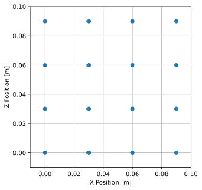
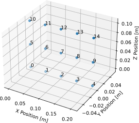
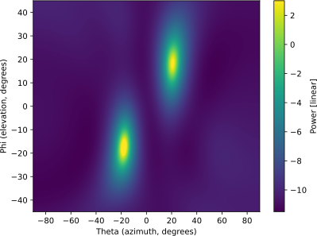

.. _2d-beamforming-chapter:

########################
2D формування променя
########################

Цей розділ розширює матеріал про 1D формування променя/визначення напрямку приходу (DOA) на двовимірні решітки.  Ми почнемо з простої прямокутної решітки та виведемо рівняння вектора наведення й формувач променя MVDR, після чого попрацюємо з реальними даними з решітки 3x5.  Наостанок скористаємося інтерактивним інструментом, щоб дослідити вплив різних геометрій решіток і відстаней між елементами.

******************************************
Прямокутні решітки та 2D формування променя
******************************************

Прямокутні решітки (відомі також як планарні решітки) складаються з двовимірного масиву елементів.  Додатковий вимір додає трохи складності, але діють ті ж базові принципи, і найважчою частиною стане візуалізація результатів (наприклад, простих полярних графіків уже не буде, нам знадобляться 3D-поверхні).  Хоч наша решітка тепер 2D, це не означає, що ми повинні додавати вимір до кожної структури даних, з якою працювали.  Наприклад, вагові коефіцієнти ми й далі зберігатимемо як 1D масив комплексних чисел.  Втім, позиції елементів нам доведеться представити у 2D.  Ми й надалі використовуватимемо :code:`theta` для позначення азимутального кута, але введемо новий кут — :code:`phi`, тобто кут місця.  Існує багато конвенцій сферичних координат, але ми використовуватимемо таку:

.. image:: ../_images/Spherical_Coordinates.svg
   :align: center
   :target: ../_images/Spherical_Coordinates.svg
   :alt: Сферична система координат із позначеними θ та φ

Що відповідає співвідношенням:

.. math::

 x = \sin(\theta) \cos(\phi)

 y = \cos(\theta) \cos(\phi)

 z = \sin(\phi)

Ми також перейдемо до узагальненого рівняння вектора наведення, яке не прив’язане до конкретної геометрії решітки:

.. math::

   s = e^{2j \pi \boldsymbol{p} u / \lambda}

де :math:`\boldsymbol{p}` — набір координат x/y/z елементів у метрах (розмір :code:`Nr` x 3), а :math:`u` — напрямок, у який ми хочемо спрямувати решітку, представлений одиничним вектором у координатах x/y/z (розмір 3x1).  У Python це виглядає так:

.. code-block:: python

 def steering_vector(pos, dir):
     #                           Nrx3  3x1
     return np.exp(2j * np.pi * pos @ dir / wavelength) # виводить вектор Nr x 1 (стовпчик)

Спробуймо використати це узагальнене рівняння вектора наведення для простої лінійної решітки (ULA) з чотирма елементами, щоб пов’язати його з тим, що ми вже вивчали. Тепер ми представлятимемо :code:`d` у метрах, а не відносно довжини хвилі.  Розмістимо елементи вздовж осі y:

.. code-block:: python

 Nr = 4
 fc = 5e9
 wavelength = 3e8 / fc
 d = 0.5 * wavelength # у метрах

 # Зберігатимемо позиції елементів у списку координат (x, y, z), навіть якщо це просто ULA вздовж осі y
 pos = np.zeros((Nr, 3)) # Позиції елементів як список координат x, y, z у метрах
 for i in range(Nr):
     pos[i,0] = 0     # координата x
     pos[i,1] = d * i # координата y
     pos[i,2] = 0     # координата z

Наступна ілюстрація показує вигляд ULA зверху з прикладом кута θ у 20 градусів.

.. image:: ../_images/2d_beamforming_ula.svg
   :align: center
   :target: ../_images/2d_beamforming_ula.svg
   :alt: ULA з θ у 20 градусів

Залишилося лише пов’язати нашу стару :code:`theta` з новим підходом через одиничний вектор.  Ми можемо досить просто обчислити :code:`dir` на основі :code:`theta`: знаємо, що компоненти x і z нашого одиничного вектора дорівнюватимуть 0, адже ми все ще в одномірному просторі, а згідно з нашою конвенцією сферичних координат компонент y дорівнюватиме :code:`np.cos(theta)`, тобто повний код виглядає як :code:`dir = np.asmatrix([0, np.cos(theta_i), 0]).T`. На цьому етапі ви маєте змогу пов’язати наше узагальнене рівняння вектора наведення з рівнянням вектора наведення для ULA, яке ми використовували раніше.  Спробуйте цей новий код, виберіть :code:`theta` між 0 і 360 градусами (не забудьте перевести в радіани!), і вектор наведення повинен мати розмір 4x1.

Тепер перейдемо до 2D-випадку.  Розмістимо нашу решітку в площині X-Z з осьовою лінією, спрямованою горизонтально вздовж додатного напрямку осі y (:math:`\theta = 0`, :math:`\phi = 0`).  Використаємо той самий крок між елементами, але тепер матимемо загалом 16 елементів:

.. code-block:: python

 # Тепер перейдемо до 2D, використовуючи решітку 4x4 з інтервалом у півдовжини хвилі, тобто 16 елементів
 Nr = 16

 # Позиції елементів як список координат x, y, z у метрах, розміщуємо решітку в площині X-Z
 pos = np.zeros((Nr,3))
 for i in range(Nr):
     pos[i,0] = d * (i % 4)  # координата x
     pos[i,1] = 0            # координата y
     pos[i,2] = d * (i // 4) # координата z

Вигляд зверху нашої прямокутної решітки 4x4:

Щоб спрямуватися на певні θ та φ, нам потрібно перетворити ці кути на одиничний вектор.  Ми можемо використати те саме узагальнене рівняння вектора наведення, але тепер мусимо обчислити одиничний вектор на основі обох кутів, використовуючи формули з початку цього розділу:

.. code-block:: python

 # Спрямуймося у довільному напрямку
 theta = np.deg2rad(60) # азимутальний кут
 phi = np.deg2rad(30) # кут місця

 # Використовуючи нашу конвенцію сферичних координат, можемо обчислити одиничний вектор:
 def get_unit_vector(theta, phi):  # кути в радіанах
     return np.asmatrix([np.sin(theta) * np.cos(phi), # компонент x
                         np.cos(theta) * np.cos(phi), # компонент y
                         np.sin(phi)]).T              # компонент z

 dir = get_unit_vector(theta, phi)
 # dir має розмір 3x1
 # [[0.75     ]
 #  [0.4330127]
 #  [0.5      ]]

Тепер скористаймося нашою функцією узагальненого вектора наведення, щоб обчислити сам вектор наведення:

.. code-block:: python

 s = steering_vector(pos, dir)

 # Застосуємо звичайний формувач променя, у якому ваги дорівнюють вектору наведення, та побудуємо діаграму спрямованості
 w = s # вектор ваг 16x1

На цьому етапі варто зазначити, що ми не змінювали розмірності даних, переходячи з 1D у 2D: ми просто отримали ненульові компоненти x/y/z, рівняння вектора наведення лишилося таким самим, а ваги — все ще 1D масивом.  Може виникнути спокуса сформувати ваги у вигляді 2D масиву, щоб візуально відповідати геометрії решітки, але в цьому немає потреби — краще залишити їх 1D.  Для кожного елемента існує відповідна вага, і список ваг має той самий порядок, що й список позицій елементів.

Візуалізувати діаграму спрямованості для цих ваг трохи складніше, бо нам потрібен 3D-графік або 2D-теплокарта.  Ми проскануємо :code:`theta` та :code:`phi`, щоб отримати 2D масив рівнів потужності, а потім побудуємо його за допомогою :code:`imshow()`.  Наведений нижче код саме це й робить, а результат показано на рисунку нижче, разом із точкою в раніше заданому куті:

.. code-block:: python

    resolution = 100 # кількість точок у кожному напрямку
    theta_scan = np.linspace(-np.pi/2, np.pi/2, resolution) # азимутальні кути
    phi_scan = np.linspace(-np.pi/4, np.pi/4, resolution) # кути місця
    results = np.zeros((resolution, resolution)) # 2D масив для зберігання результатів
    for i, theta_i in enumerate(theta_scan):
        for j, phi_i in enumerate(phi_scan):
            a = steering_vector(pos, get_unit_vector(theta_i, phi_i)) # фактор решітки
            results[i, j] = np.abs(w.conj().T @ a)[0,0] # потужність сигналу, лінійний масштаб виглядає краще
    plt.imshow(results.T, extent=(theta_scan[0]*180/np.pi, theta_scan[-1]*180/np.pi, phi_scan[0]*180/np.pi, phi_scan[-1]*180/np.pi), origin='lower', aspect='auto', cmap='viridis')
    plt.colorbar(label='Потужність [лінійна]')
    plt.scatter(theta*180/np.pi, phi*180/np.pi, color='red', s=50) # Додаємо точку в правильному θ/φ
    plt.xlabel('Азимутальний кут [градуси]')
    plt.ylabel('Кут місця [градуси]')
    plt.show()

.. image:: ../_images/2d_beamforming_2dplot.svg
   :align: center
   :target: ../_images/2d_beamforming_2dplot.svg
   :alt: 3D-графік діаграми спрямованості

Змоделюймо тепер реальні відліки; додамо два перешкодні тони, що приходять з різних напрямків:

.. code-block:: python

 N = 10000 # кількість відліків для симуляції

 jammer1_theta = np.deg2rad(-30)
 jammer1_phi = np.deg2rad(10)
 jammer1_dir = get_unit_vector(jammer1_theta, jammer1_phi)
 jammer1_s = steering_vector(pos, jammer1_dir) # Nr x 1
 jammer1_tone = np.exp(2j*np.pi*0.1*np.arange(N)).reshape(1,-1) # формуємо рядок

 jammer2_theta = np.deg2rad(10)
 jammer2_phi = np.deg2rad(50)
 jammer2_dir = get_unit_vector(jammer2_theta, jammer2_phi)
 jammer2_s = steering_vector(pos, jammer2_dir)
 jammer2_tone = np.exp(2j*np.pi*0.2*np.arange(N)).reshape(1,-1) # формуємо рядок

 noise = np.random.normal(0, 1, (Nr, N)) + 1j * np.random.normal(0, 1, (Nr, N)) # комплексний гаусів шум
 r = jammer1_s @ jammer1_tone + jammer2_s @ jammer2_tone + noise # отримуємо матрицю відліків 16 x 10000

Просто для цікавості обчислимо ваги формувача променя MVDR у напрямку тих самих θ та φ, які ми використовували раніше (одиничний вектор цього напрямку все ще збережено в :code:`dir`):

.. code-block:: python

 s = steering_vector(pos, dir) # 16 x 1
 R = np.cov(r) # коваріаційна матриця 16 x 16
 Rinv = np.linalg.pinv(R)
 w = (Rinv @ s)/(s.conj().T @ Rinv @ s) # рівняння MVDR/Капона

Замість того щоб дивитися на діаграму спрямованості у незручному 3D-графіку, скористаймося альтернативним способом перевірити адекватність цих ваг: оцінимо відгук ваг у різних напрямках і розрахуємо потужність у дБ.  Почнімо з напрямку, куди ми спрямовувалися:

.. code-block:: python

 # Потужність у напрямку наведення (theta=60, phi=30, цей напрямок і досі збережено в dir):
 a = steering_vector(pos, dir) # фактор решітки
 resp = w.conj().T @ a # скаляр
 print("Power in direction we are pointing:", 10*np.log10(np.abs(resp)[0,0]), 'dB')

Це виводить 0 дБ, що й очікувано, адже мета MVDR — забезпечити одиничну потужність у бажаному напрямку.  Тепер перевірмо потужність у напрямках двох глушників, а також у випадковому напрямку та в напрямку, що відхиляється на один градус від бажаного (код той самий, просто оновлюйте :code:`dir`).  Результати показано в таблиці нижче:

.. list-table::
   :widths: 70 30
   :header-rows: 1

   * - Напрямок
     - Підсилення
   * - :code:`dir` (напрямок, використаний для пошуку ваг MVDR)
     - 0 дБ
   * - Глушник 1
     - -17.488 дБ
   * - Глушник 2
     - -18.551 дБ
   * - Відхилення на 1 градус від :code:`dir` і за :math:`\theta`, і за :math:`\phi`
     - -0.00683 дБ
   * - Випадковий напрямок
     - -10.591 дБ

Ваші результати можуть відрізнятися через випадковий шум, що використовується для формування прийнятих відліків і, відповідно, для обчислення :code:`R`.  Але головний висновок у тому, що глушники потраплять у нуль і матимуть дуже низьку потужність, напрямок, зміщений на один градус від :code:`dir`, буде трохи нижче 0 дБ, але все ще в головній пелюстці, а випадковий напрямок буде нижче 0 дБ, але вищий за глушники і дуже різний у кожному запуску симуляції.  Зверніть увагу, що з MVDR ви отримуєте підсилення 0 дБ у головній пелюстці, тоді як зі звичайним формувачем променя ви отримали б :math:`10 \log_{10}(Nr)`, тобто близько 12 дБ для нашої 16-елементної решітки, що демонструє одну з особливостей MVDR.

Код для цього розділу можна знайти `тут <https://github.com/777arc/PySDR/blob/master/figure-generating-scripts/doa_2d.py>`_.

**********************************************
Обробка сигналів із реальної 2D решітки
**********************************************

У цій секції ми працюємо з реальними даними, записаними з решітки 3x5, створеної на основі платформи `QUAD-MxFE <https://www.analog.com/en/resources/evaluation-hardware-and-software/evaluation-boards-kits/quad-mxfe.html#eb-overview>`_ від Analog Devices, яка підтримує до 16 каналів передавання та приймання (ми використали лише 15 і тільки в режимі приймача).  Нижче наведено два записи: перший містить один випромінювач, розташований на осьовій лінії решітки, і використовується для калібрування.  Другий запис містить два випромінювачі в різних напрямках, які ми використаємо для формування променя та тестування DOA.

- `IQ-запис лише випромінювача C <https://github.com/777arc/RADAR-2025-Beamforming-Labs/raw/refs/heads/main/Lab%207%20-%202D%20Rectangular%20Array/C_only_capture1.npy>`_ (використовується для калібрування, оскільки C розташовано на осьовій лінії)
- `IQ-запис випромінювачів B і D <https://github.com/777arc/RADAR-2025-Beamforming-Labs/raw/refs/heads/main/Lab%207%20-%202D%20Rectangular%20Array/DandB_capture1.npy>`_ (використовується для формування променя/DOA)

QUAD-MxFE було налаштовано на 2.8 ГГц, а всі передавачі використовували простий тон у межах смуги спостереження.  Цікаво, що для цієї DSP частота дискретизації насправді неважлива: жодна з методик обробки решітки, які ми застосовуємо, не залежить від частоти дискретизації, вони лише припускають, що сигнал перебуває десь у сигналі базової смуги.  DSP залежить від центральної частоти, адже фазовий зсув між елементами залежить від частоти й кута приходу.  Це протилежно більшості інших видів обробки сигналів, де частота дискретизації важлива, а центральна — ні.

Ми можемо завантажити ці записи в Python за допомогою такого коду:

.. code-block:: python

    import numpy as np
    import matplotlib.pyplot as plt

    r = np.load("DandB_capture1.npy")[0:15] # 16-й елемент не підключено, але його все одно записали
    r_cal = np.load("C_only_capture1.npy")[0:15] # лише калібрувальний сигнал (на осьовій лінії)

Відстань між антенами становила 0.051 метра.  Ми можемо представити позиції елементів як список координат x, y, z у метрах.  Розмістимо решітку в площині X-Z, оскільки її було змонтовано вертикально (з осьовою лінією, спрямованою горизонтально).

.. code-block:: python

        fc = 2.8e9 # центральна частота в Гц
        d = 0.051 # відстань між антенами в метрах
        wavelength = 3e8 / fc
        Nr = 15
        rows = 3
        cols = 5

        # Позиції елементів як список координат x, y, z у метрах
        pos = np.zeros((Nr, 3))
        for i in range(Nr):
                pos[i,0] = d * (i % cols)  # координата x
                pos[i,1] = 0 # координата y
                pos[i,2] = d * (i // cols) # координата z

        # Побудуємо та підпишемо позиції елементів
        fig = plt.figure()
        ax = fig.add_subplot(projection='3d')
        ax.scatter(pos[:,0], pos[:,1], pos[:,2], 'o')
        # Підписи індексів
        for i in range(Nr):
                ax.text(pos[i,0], pos[i,1], pos[i,2], str(i), fontsize=10)
        plt.xlabel("Позиція X [м]")
        plt.ylabel("Позиція Y [м]")
        ax.set_zlabel("Позиція Z [м]")
        plt.grid()
        plt.show()

На графіку кожен елемент позначений власним індексом, який відповідає порядку елементів у IQ-відліках :code:`r` та :code:`r_cal`.

Калібрування виконується, використовуючи лише відліки :code:`r_cal`, які були записані з увімкненим передавачем на осьовій лінії.  Мета — знайти фазові та амплітудні зсуви для кожного елемента.  За ідеального калібрування і за умови, що передавач точно на осьовій лінії, усі окремі приймальні елементи мають отримувати однаковий сигнал, синфазний і з однаковою амплітудою.  Але через недоліки решітки/кабелів/антен кожен елемент матиме власні фазовий та амплітудний зсуви.  Процес калібрування полягає у знаходженні цих зсувів, які ми згодом застосуємо до відліків :code:`r` перед будь-якою обробкою решітки.

Існує багато способів калібрування, але ми використаємо метод, що передбачає власне розкладання коваріаційної матриці.  Коваріаційна матриця — це квадратна матриця розміру :code:`Nr x Nr`, де :code:`Nr` — кількість приймальних елементів.  Власний вектор, що відповідає найбільшому власному значенню, представляє отриманий сигнал (сподіваємося), і ми використаємо його для пошуку фазових зсувів кожного елемента, просто взявши фазу кожного елементу власного вектора і нормалізувавши її за першим елементом, який ми вважатимемо еталонним.  Амплітудне калібрування не використовує власний вектор, а натомість використовує середню амплітуду отриманого сигналу для кожного елементу.

.. code-block:: python

        # Обчислюємо коваріаційну матрицю, вона має розмір Nr x Nr
        R_cal = r_cal @ r_cal.conj().T

    # власне розкладання, v[:,i] — власний вектор, що відповідає власному значенню w[i]
        w, v = np.linalg.eig(R_cal)

        # Побудуємо власні значення, щоб переконатися, що одне з них значно більше за інші
        w_dB = 10*np.log10(np.abs(w))
        w_dB -= np.max(w_dB) # нормалізація
        fig, (ax1) = plt.subplots(1, 1, figsize=(7, 3))
        ax1.plot(w_dB, '.-')
        ax1.set_xlabel('Індекс')
        ax1.set_ylabel('Власне значення [дБ]')
        plt.show()

        # Використовуємо максимальний власний вектор для калібрування
        v_max = v[:, np.argmax(np.abs(w))]
        mags = np.mean(np.abs(r_cal), axis=1)
        mags = mags[0] / mags # нормалізуємо відносно першого елемента
        phases = np.angle(v_max)
        phases = phases[0] - phases # нормалізуємо відносно першого елемента
        cal_table = mags * np.exp(1j * phases)
        print("cal_table", cal_table)

На рисунку нижче показано розподіл власних значень; ми хочемо переконатися, що є лише одне велике значення, а решта малі, що відповідає одному прийнятому сигналу.  Будь-які завади або багатопроменевість погіршуватимуть процес калібрування.

.. image:: ../_images/2d_array_eigenvalues.svg
   :align: center
   :target: ../_images/2d_array_eigenvalues.svg
   :alt: Розподіл власних значень 2D-решітки

Таблиця калібрування — це список комплексних чисел, по одному для кожного елемента, що представляють фазові та амплітудні зсуви (їх простіше подавати у прямокутній формі, а не в полярній).  Перший елемент — еталонний і завжди дорівнює 1.0 + 0.j.  Решта елементів — це зсуви для кожного елемента у тому ж порядку, який ми використали для :code:`pos`.

.. code-block:: python

        [1.        +0.j          0.99526771+0.76149029j -0.91754588-0.66825262j
        -0.96840297+0.37251012j  0.87866849+0.40446665j  0.56040169+1.50499875j
        -0.80109196-1.29299264j -1.28464742-0.31133052j  1.26622038+0.46047599j
         2.01855809+9.77121302j -0.29249322-1.09413205j -1.0372309 -0.17983522j
        -0.70614339+0.78682873j -0.75612972+5.67234809j  1.00032754-0.60824109j]

Ми можемо застосувати ці зсуви до будь-якого набору відліків, записаних решіткою, просто перемноживши кожен елемент відліків на відповідний елемент таблиці калібрування:

.. code-block:: python

        # Застосовуємо калібрувальні зсуви до r
        for i in range(Nr):
                r[i, :] *= cal_table[i]

Як невеличкий відступ, саме тому ми обчислювали зсуви у вигляді :code:`mags[0] / mags` та :code:`phases[0] - phases`: якби ми зробили навпаки, то довелося б ділити значення під час застосування, а нам зручніше множити.

Далі виконаємо оцінювання DOA за допомогою алгоритму MUSIC.  Ми використаємо функції :code:`steering_vector()` та :code:`get_unit_vector()`, визначені раніше, щоб обчислити вектор наведення для кожного елемента решітки, а потім застосуємо MUSIC для оцінки напрямку приходу двох випромінювачів у відліках :code:`r`.  Алгоритм MUSIC розглядався в попередньому розділі.

.. code-block:: python

        # DOA з використанням MUSIC
        resolution = 400 # кількість точок у кожному напрямку
        theta_scan = np.linspace(-np.pi/2, np.pi/2, resolution) # азимутальні кути
        phi_scan = np.linspace(-np.pi/4, np.pi/4, resolution) # кути місця
        results = np.zeros((resolution, resolution)) # 2D масив для результатів
        R = np.cov(r) # коваріаційна матриця 15 x 15
        Rinv = np.linalg.pinv(R)
        expected_num_signals = 4
        w, v = np.linalg.eig(R) # власне розкладання, v[:,i] — власний вектор для w[i]
        eig_val_order = np.argsort(np.abs(w))
        v = v[:, eig_val_order] # сортуємо власні вектори у цьому порядку
        V = np.zeros((Nr, Nr - expected_num_signals), dtype=np.complex64) # шумовий підпростір — решта власних значень
        for i in range(Nr - expected_num_signals):
                V[:, i] = v[:, i]
        for i, theta_i in enumerate(theta_scan):
                for j, phi_i in enumerate(phi_scan):
                        dir_i = get_unit_vector(-1*theta_i, phi_i) # TODO з’ясувати, чому потрібний множник -1, щоб збігалося з реальністю
                        s = steering_vector(pos, dir_i) # 15 x 1
                        music_metric = 1 / (s.conj().T @ V @ V.conj().T @ s)
                        music_metric = np.abs(music_metric).squeeze()
                        music_metric = np.clip(music_metric, 0, 2) # Корисно для варіанта ABCD
                        results[i, j] = music_metric

Наші результати двовимірні, адже решітка теж 2D, тому нам доведеться використати або 3D-графік, або 2D-теплокарту.  Спробуймо обидва. Спочатку побудуємо 3D-графік, де на одній осі буде кут місця, а на іншій — азимут:

.. code-block:: python

        # 3D-графік DOA у координатах азимут/кут місця
        results = 10*np.log10(results) # переводимо в дБ
        results[results < -20] = -20 # обрізаємо вісь z на певному рівні дБ
        fig, ax = plt.subplots(subplot_kw={"projection": "3d", "computed_zorder": False})
        surf = ax.plot_surface(np.rad2deg(theta_scan[:,None]), # type: ignore
                                                        np.rad2deg(phi_scan[None,:]),
                                                        results,
                                                        cmap='viridis')
        #ax.set_zlim(-10, results[max_idx])
        ax.set_xlabel('Азимут (theta)')
        ax.set_ylabel('Кут місця (phi)')
        ax.set_zlabel('Потужність [дБ]') # type: ignore
        fig.savefig('../_images/2d_array_3d_doa_plot.svg', bbox_inches='tight')
        plt.show()

.. image:: ../_images/2d_array_3d_doa_plot.png
   :align: center
   :scale: 30%
   :target: ../_images/2d_array_3d_doa_plot.png
   :alt: 3D-графік DOA

Залежно від ситуації читати значення з 3D-графіка може бути незручно, тож можемо також побудувати 2D-теплокарту за допомогою :code:`imshow()`:

.. code-block:: python

        # 2D-теплокарта азимут/кут місця (аналогічно до попереднього, але в 2D)
        extent=(np.min(theta_scan)*180/np.pi,
                        np.max(theta_scan)*180/np.pi,
                        np.min(phi_scan)*180/np.pi,
                        np.max(phi_scan)*180/np.pi)
        plt.imshow(results.T, extent=extent, origin='lower', aspect='auto', cmap='viridis') # type: ignore
        plt.colorbar(label='Потужність [лінійна]')
        plt.xlabel('Theta (азимут, градуси)')
        plt.ylabel('Phi (кут місця, градуси)')
        plt.savefig('../_images/2d_array_2d_doa_plot.svg', bbox_inches='tight')
        plt.show()

З цієї 2D-карти ми легко можемо зчитати оцінені азимут і кут місця двох випромінювачів (і переконатися, що їх було лише два).  Відповідно до випробувальної установки, яка використовувалася для цього запису, результати відповідають реальності, хоча *точні* азимут і кут місця випромінювачів не вимірювалися, адже для цього потрібне спеціалізоване обладнання.

Як вправу, спробуйте застосувати звичайний формувач променя, а також MVDR, і порівняйте результати з MUSIC.

Повний код цієї частини можна знайти `тут <https://github.com/777arc/PySDR/blob/master/figure-generating-scripts/2d_array_recording.py>`_.

*************************
Інтерактивний інструмент
*************************

Наступний інтерактивний інструмент створив `Джейсон Дербін <https://www.linkedin.com/in/jasondurbin/>`_, інженер із фазованих решіток-фрилансер, який люб’язно дозволив вбудувати його в PySDR; ви можете відвідати `повну версію проєкту <https://jasondurbin.github.io/PhasedArrayVisualizer>`_ або його `консалтинговий бізнес <https://neonphysics.com/>`_.  Цей інструмент дозволяє змінювати геометрію фазованої решітки, крок між елементами, напрямок наведення, додавати аподизацію бічних пелюсток та інші можливості.

Декілька деталей про інструмент: антенні елементи вважаються ізотропними. Однак під час розрахунку направленості припускається випромінювання в напівсферу (тобто без задніх пелюсток). Тому обчислена направленість буде на 3 дБі вищою, ніж для ідеально ізотропних елементів (іншими словами, посилення окремого елемента становить +3.0 дБі). Сітку можна зробити щільнішою, збільшуючи кількість точок для theta/phi, u/v або азимуту/куту місця. Натискання (або довге натискання) на елементи графіків фази/атенюації дозволяє вручну встановлювати фазу/атенюацію («не забудьте увімкнути режим перевизначення»). Крім того, у вікні атенюації можна вимкнути окремі елементи. Наведення курсора (або торкання) 2D-графіка далекого поля чи графіків геометрії показує значення у точці під курсором.

.. raw:: html

        <input type="text" id="pa-atten-manual" hidden />
        <input type="text" id="pa-phase-manual" hidden />
        

                

                        

                                <h3>Geometry</h3>
                        

                        

                                <h3>Steering</h3>
                                <select id="pa-steering-domain" style="width:100%;"></select>
                                

                                        <label for="pa-theta">Theta (deg)</label>
                                        <input type="number" min="-90" max="90" value="0" id="pa-theta" name="pa-theta" />
                                

                                

                                        <label for="pa-phi">Phi (deg)</label>
                                        <input type="number" min="-90" max="90" value="0" id="pa-phi" name="pa-phi" />
                                

                        

                        

                                <h3>Taper(s)</h3>
                                

                                        <label for="pa-taper-sampling">Sampling</label>
                                        <select id="pa-taper-sampling"><option>X & Y</option><option>Radial</option></select>
                                

                                

                                

                        

                        

                                <h3>Quantization</h3>
                                

                                        <label for="pa-phase-bits">Phase Bits</label>
                                        <input type="number" min="0" max="10" value="0" step="1" id="pa-phase-bits" name="pa-phase-bits" />
                                

                                

                                        <label for="pa-atten-bits">Atten. Bits</label>
                                        <input type="number" min="0" max="10" value="0" step="1" id="pa-atten-bits" name="pa-atten-bits" />
                                

                                

                                        <label for="pa-atten-lsb">Atten. LSB (dB)</label>
                                        <input type="number" min="0" max="5" value="0.5" step="0.25" id="pa-atten-lsb" name="pa-atten-lsb" />
                                

                                

                                        0 bits would be no quantization.
                                

                        

                

                

                        
<button id="pa-refresh">Update</button><button id="pa-reset">Reset</button>

                        <progress id="pa-progress" max="100" value="70"></progress>
                        
Loading...

                

        

        

                

                        
<h2>Element Phase</h2>&nbsp;

                        

                                <canvas id="pa-geometry-phase-canvas" class="canvas-grid"></canvas>
                        

                        

                                

                                        <label for="pa-geometry-phase-colormap">Colormap</label>
                                        <select id="pa-geometry-phase-colormap" name="pa-geometry-phase-colormap"></select>
                                

                        

                

                

                        
<h2>Element Attenuation</h2>&nbsp;

                        

                                <canvas id="pa-geometry-magnitude-canvas" class="canvas-grid"></canvas>
                        

                        

                                

                                        <label for="pa-atten-scale">Scale</label>
                                        <input type="number" max="200" min="5" value="40" id="pa-atten-scale" name="pa-atten-scale">
                                

                                

                                        <label for="pa-geometry-magnitude-colormap">Colormap</label>
                                        <select id="pa-geometry-magnitude-colormap" name="pa-geometry-magnitude-colormap"></select>
                                

                        

                

                

                        
<h2>2-D Radiation Pattern</h2>&nbsp;

                        

                                <canvas id="pa-farfield-canvas-2d" class="canvas-grid"></canvas>
                        

                        

                                

                                        

                                                <label for="pa-farfield-domain">Domain</label>
                                                <select id="pa-farfield-domain"></select>
                                        

                                        

                                                <label for="pa-farfield-2d-scale">Scale</label>
                                                <input type="number" max="200" min="5" value="40" id="pa-farfield-2d-scale" name="pa-farfield-2d-scale">
                                        

                                        

                                                <label for="pa-farfield-2d-colormap">Colormap</label>
                                                <select id="pa-farfield-2d-colormap" name="pa-farfield-2d-colormap"></select>
                                        

                                        

                                                <label for="pa-farfield-ax1-points">Theta Points</label>
                                                <input type="number" min="11" max="513" value="257" size="6" id="pa-farfield-ax1-points" name="pa-farfield-ax1-points">
                                        

                                        

                                                <label for="pa-farfield-ax2-points">Phi Points</label>
                                                <input type="number" min="11" max="513" value="257" size="6" id="pa-farfield-ax2-points" name="pa-farfield-ax2-points">
                                        

                                

                        

                

        

        

                

                        
<h2>1-D Pattern Cuts</h2>

                        

                                <canvas id="pa-farfield-canvas-1d"></canvas>
                        

                        

                                

                                        Phi = 0 deg
                                        Phi = 90 deg
                                        Click to hide/show trace.
                                

                                

                                        <label for="pa-farfield-1d-scale">Scale</label>
                                        <input type="number" max="200" min="5" value="40" id="pa-farfield-1d-scale" name="pa-farfield-1d-scale">
                                        <label for="pa-farfield-1d-colormap">Colormap</label>
                                        <select id="pa-farfield-1d-colormap" name="pa-farfield-1d-colormap"></select>
                                

                        

                

        

        

                

                        
<h2>Taper</h2>

                        

                                <canvas id="pa-taper-canvas-1d"></canvas>
                        

                        

                                

                                        X-Axis
                                        Y-Axis
                                        Click to hide/show trace.
                                

                                

                                        <label for="pa-taper-1d-colormap">Colormap</label>
                                        <select id="pa-taper-1d-colormap" name="pa-taper-1d-colormap"></select>
                                

                        

                

        

