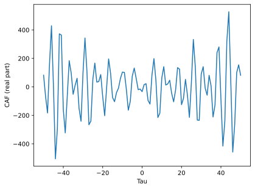
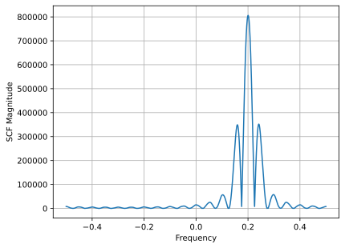
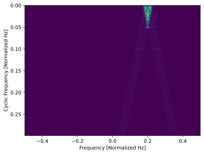
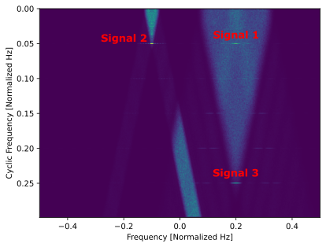
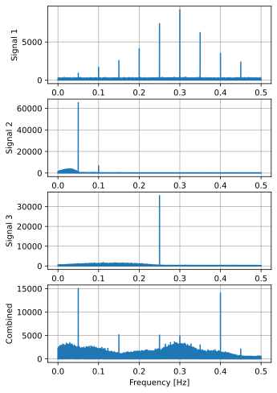
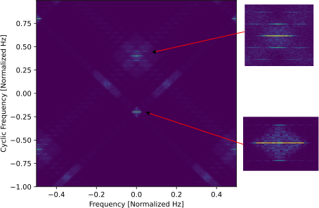
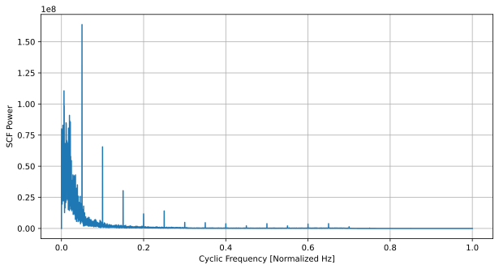

.. _freq-domain-chapter:

##########################
Циклічно-стаціонарна обробка
##########################

.. raw:: html

 У співавторстві з <a href="https://www.linkedin.com/in/samuel-brown-vt">Sam Brown</a>

У цьому розділі ми розкриваємо суть обробки циклостаціонарних сигналів (cyclostationary signal processing, або CSP) — відносно нішової галузі обробки радіочастотних сигналів (RF), яка використовується для аналізу або виявлення сигналів із циклостаціонарними властивостями (часто з дуже низьким рівнем сигнал шум SNR!), до цих сигналів зокрема відносяться більшісті сигналів з сучасними схемами цифрової модуляції. В цьому розділі ми розглянемо циклічну автокореляційну функцію (CAF), спектральну кореляційну функцію (SCF), функцію спектральної когерентності (COH), їхні спряжені варіанти та способи застосування.  Розділ містить кілька повних реалізацій на Python з прикладами, що охоплюють BPSK, QPSK, OFDM та суміш кількох одночасних сигналів.

****************
Вступ
****************

Циклостаціонарна обробка сигналів (CSP або просто циклостаціонарна обробка) — це набір технік, що дозволяє використовувати циклостаціонарну властивість, притаманну багатьом реальним сигналам зв'язку. Це можуть бути модульовані сигнали, як-от трансляції AM/FM/ТБ мовлення, сигнали стільникового та WiFi зв’язку, а також сигнали радари й інші сигнали, статистика яких має періодичність. Значна частина класичних методів обробки сигналів ґрунтується на припущенні, що сигнал стаціонарний, тобто його статистичні характеристики, такі як середнє значення, дисперсія та моменти вищих порядків, не змінюються з часом. Однак більшість реальних RF-сигналів є циклостаціонарними, тобто їхня статистика змінюється *періодично* з часом. Техніки CSP використовують цю циклостаціонарну властивість і можуть застосовуватися для виявлення зашумлених сигналів, розпізнавання модуляції та розділення сигналів, що перетинаються як по часу, так і по частоті.

Якщо після читання цього розділу та експериментів з Python ви захочете глибше зануритися в CSP, перегляньте підручник Вільяма Гарднера 1994 року `Cyclostationarity in Communications and Signal Processing <https://faculty.engineering.ucdavis.edu/gardner/wp-content/uploads/sites/146/2014/05/Cyclostationarity.pdf>`_, його підручник 1987 року `Statistical Spectral Analysis <https://faculty.engineering.ucdavis.edu/gardner/wp-content/uploads/sites/146/2013/02/Statistical_Spectral_Analysis_A_Nonprobabilistic_Theory.pdf>`_, або `збірку публікацій у блозі Чада Спунера <https://cyclostationary.blog/>`_.

Ресурс, який ви знайдете лише тут і ні в жодному підручнику: наприкінці розділу про SCF на вас чекає інтерактивний JavaScript-додаток, що дає змогу експериментувати зі SCF для сигналу прикладу та спостерігати, як SCF змінюється за різних параметрів сигналу, а також самої SCF. І усе це просто у вашому браузері!  Хоча ці інтерактивні демонстрації безкоштовні для всіх, здебільшого вони стали можливими завдяки підтримці учасників `Patreon PySDR <https://www.patreon.com/PySDR>`_.

*************************
Огляд фунції автокореляції
*************************

Навіть якщо ви вважаєте, що знайомі з автокореляційною функцією, варто зробити паузу й пригадати її, адже вона лежить в основі CSP. Автокореляційна функція — це міра подібності (кореляції) між сигналом і його копією, зсуненою в часі.  Інтуїтивно вона відображає, наскільки сигнал демонструє повторювану поведінку.  Автокореляція сигналу :math:`x(t)` визначається так:

.. math::
    R_x(\tau) = E[x(t)x^*(t-\tau)]

де :math:`E` — оператор математичного сподівання, :math:`\tau` — часовий зсув, а :math:`*` позначає комплексне спряження.  У дискретному часі з обмеженою кількістю відліків, що нас і цікавить, маємо:

.. math::
    R_x(\tau) = \frac{1}{N} \sum_{n=-N/2}^{N/2} x\left[ n+\frac{\tau}{2} \right] x^*\left[ n-\frac{\tau}{2} \right]

де :math:`N` — кількість відліків сигналу.

Якщо сигнал має певну періодичність, наприклад періодичну форму символів у QPSK, то автокореляція, обчислена на проміжку різних :math:`\tau`, теж буде періодичною.  Наприклад, якщо QPSK-сигнал має 8 відліків на символ, то для :math:`\tau`, кратних 8, міра «подібності» значно вища, ніж для інших значень :math:`\tau`.  Період автокореляції — це те, що зрештою виявляють методи CSP.

************************************************
Циклічна автокореляційна функція (CAF)
************************************************

Як зазначено вище, ми прагнемо визначити, чи є періодичність в автокореляції.  Пригадаємо формулу перетворення Фур’є: якщо ми хочемо з’ясувати, наскільки сильно в деякому сигналі :math:`x(t)` присутня певна частота :math:`f`, ми можемо обчислити:

.. math::
    X(f) = \int x(t) e^{-j2\pi ft} dt

Тож, щоб знайти періодичність в автокореляції, просто обчислимо:

.. math::
    R_x(\tau, \alpha) = \lim_{T\rightarrow\infty} \frac{1}{T} \int_{-T/2}^{T/2} x(t + \tau/2)x^*(t - \tau/2)e^{-j2\pi \alpha t}dt.

або в дискретному випадку:

.. math::
    R_x(\tau, \alpha) = \frac{1}{N} \sum_{n=-N/2}^{N/2} x\left[ n+\frac{\tau}{2} \right] x^*\left[ n-\frac{\tau}{2} \right] e^{-j2\pi \alpha n}

Це дозволяє перевірити, наскільки сильною є частота :math:`\alpha`.  Наведений вище вираз називається циклічною автокореляційною функцією (CAF).  Інший спосіб інтерпретації CAF — це набір коефіцієнтів ряду Фур’є, які описують згадану періодичність.  Іншими словами, CAF — це амплітуда та фаза гармонік, присутніх в автокореляції сигналу.  Ми використовуємо термін «циклічно-стаціонарний», щоб описати сигнали, автокореляція яких є періодичною або майже періодичною.  CAF є розширенням традиційної автокореляційної функції для циклічно-стаціонарних сигналів.

Видно, що CAF залежить від двох змінних: затримки :math:`\tau` (tau) та циклічної частоти :math:`\alpha`.  Циклічні частоти в CSP відображають швидкість зміни статистики сигналу, що у випадку CAF означає момент другого порядку або дисперсію. Тож циклічні частоти часто відповідають виразним періодичним явищам, таким як символи, що модулюються в сигналах зв'язку. Ми побачимо, наприклад, як символьна швидкість сигналу BPSK та її цілі кратні (гармоніки) проявляються як циклічні частоти у CAF.

У Python CAF базового сигналу :code:`samples` для заданих :code:`alpha` та :code:`tau` можна обчислити за допомогою такого фрагмента коду (незабаром додамо обрамлювальний код):

.. code-block:: python

 CAF = (np.exp(1j * np.pi * alpha * tau) *
        np.sum(samples * np.conj(np.roll(samples, tau)) *
               np.exp(-2j * np.pi * alpha * np.arange(N))))

Ми використовуємо :code:`np.roll()` для зсуву одного набору відліків на :code:`tau`, адже потрібно зміщувати на ціле число відліків.  Якби ми зсували обидва набори у протилежних напрямках, ми пропускали б кожне друге зміщення.  Також необхідно додати частотний зсув, щоб компенсувати те, що ми зміщуємо на 1 відлік за раз і лише з одного боку (замість половини відліку в обидва боки, як у базовому рівнянні CAF).  Частота цього зсуву дорівнює :code:`alpha/2`.

Щоб погратися з CAF у Python, спершу змоделюємо приклад сигналу. Поки що використаємо прямокутний сигнал BPSK (тобто BPSK без формування імпульсу) з 20 відліками на символ та додамо білий гаусів шум (AWGN).  Ми навмисне внесемо частотний зсув у сигнал BPSK, аби пізніше продемонструвати, як циклічно-стаціонарна обробка допомагає оцінювати і частотний зсув, і циклічну частоту.  Цей зсув відповідає ситуації, коли приймач не ідеально налаштований на частоту сигналу: або трохи хибить, або суттєво, але не настільки, щоб сигнал виходив за межі смуги дискретизації.

Наведений нижче код генерує IQ-відліки, які ми будемо використовувати впродовж двох наступних розділів:

.. code-block:: python

 N = 100000 # number of samples to simulate
 f_offset = 0.2 # Hz normalized
 sps = 20 # cyclic freq (alpha) will be 1/sps or 0.05 Hz normalized

 symbols = np.random.randint(0, 2, int(np.ceil(N/sps))) * 2 - 1 # random 1's and -1's
 bpsk = np.repeat(symbols, sps)  # repeat each symbol sps times to make rectangular BPSK
 bpsk = bpsk[:N]  # clip off the extra samples
 bpsk = bpsk * np.exp(2j * np.pi * f_offset * np.arange(N)) # Freq shift up the BPSK, this is also what makes it complex
 noise = np.random.randn(N) + 1j*np.random.randn(N) # complex white Gaussian noise
 samples = bpsk + 0.1*noise  # add noise to the signal

Оскільки абсолютні швидкість дискретизації та швидкість символів у цьому розділі не відіграють важливої ролі, ми використовуємо нормалізовані частоти, що еквівалентно припущенню, що частота дискретизації = 1 Гц.  Це означає, що сигнал мусить лежати в діапазоні від -0.5 до +0.5 Гц.  Тому ви *не* побачите змінної :code:`sample_rate` у коді: ми працюємо з кількістю відліків на символ (:code:`sps`).

Для розігріву погляньмо на щільність спектральної потужності (PSD, тобто FFT) сигналу до будь-якої обробки CSP:

.. image:: ../_images/psd_of_bpsk_used_for_caf.svg
   :align: center
   :target: ../_images/psd_of_bpsk_used_for_caf.svg
   :alt: PSD прямокутного сигналу BPSK, що використовується для CAF

На графіку видно частотний зсув 0.2 Гц, який ми додали, і те, що 20 відліків на символ формують доволі вузький сигнал, але через відсутність формування імпульсу спектр спадає дуже повільно.

Тепер обчислимо CAF для правильного :math:`\alpha` та діапазону :math:`\tau` (візьмемо від -50 до +50). Правильне :math:`\alpha` у нашому випадку — це обернена величина кількості відліків на символ, тобто 1/20 = 0.05 Гц.  Щоб отримати CAF у Python, проітеруємося за :math:`\tau`:

.. code-block:: python

    # CAF only at the correct alpha
    alpha_of_interest = 1/sps # equates to 0.05 Hz
    taus = np.arange(-50, 51)
    CAF = np.zeros(len(taus), dtype=complex)
    for i in range(len(taus)):
        CAF[i] = (np.exp(1j * np.pi * alpha_of_interest * taus[i]) * # This term is to make up for the fact we're shifting by 1 sample at a time, and only on one side
                  np.sum(samples * np.conj(np.roll(samples, taus[i])) *
                         np.exp(-2j * np.pi * alpha_of_interest * np.arange(N))))

Побудуємо дійсну частину :code:`CAF` за допомогою :code:`plt.plot(taus, np.real(CAF))`:

.. image:: ../_images/caf_at_correct_alpha.svg
   :align: center
   :target: ../_images/caf_at_correct_alpha.svg
   :alt: CAF для правильного значення alpha

Вигляд трохи дивний, але зважайте, що :math:`\tau` представляє часову вісь, а найважливіше — велика енергія CAF для цього :math:`\alpha`, адже воно відповідає циклічній частоті нашого сигналу.  Щоб переконатися, розгляньмо CAF для «неправильного» :math:`\alpha`, скажімо 0.08 Гц:

Зверніть увагу на вісь Y — енергії CAF тепер значно менше.  Конкретні шаблони поки не такі важливі; вони стануть зрозумілішими після вивчення SCF у наступному розділі.

Ще один підхід — обчислити CAF у діапазоні :math:`\alpha`, а для кожного :math:`\alpha` знайти потужність CAF, взявши модуль і суму (або середнє — тут не суттєво).  Потім, якщо побудувати цю потужність залежно від :math:`\alpha`, побачимо сплески на циклічних частотах сигналу.  Наступний код додає цикл :code:`for` та використовує крок :math:`\alpha` 0.005 Гц (зверніть увагу, що виконання триватиме довго!):

.. code-block:: python

    alphas = np.arange(0, 0.5, 0.005)
    CAF = np.zeros((len(alphas), len(taus)), dtype=complex)
    for j in range(len(alphas)):
        for i in range(len(taus)):
            CAF[j, i] = (np.exp(1j * np.pi * alphas[j] * taus[i]) *
                         np.sum(samples * np.conj(np.roll(samples, taus[i])) *
                                np.exp(-2j * np.pi * alphas[j] * np.arange(N))))
    CAF_magnitudes = np.average(np.abs(CAF), axis=1) # at each alpha, calc power in the CAF
    plt.plot(alphas, CAF_magnitudes)
    plt.xlabel('Alpha')
    plt.ylabel('CAF Power')

.. image:: ../_images/caf_avg_over_alpha.svg
   :align: center
   :target: ../_images/caf_avg_over_alpha.svg
   :alt: Середня потужність CAF залежно від alpha

Бачимо очікуваний пік на 0.05 Гц, а також на цілих кратних 0.05 Гц.  Це тому, що CAF — це ряд Фур’є, і гармоніки основної частоти присутні в CAF, особливо для PSK/QAM без формування імпульсу.  Енергія на :math:`\alpha = 0` відповідає загальній потужності у PSD сигналу, хоча зазвичай ми її занулюємо, адже 1) PSD часто будують окремо і 2) вона псує динамічний діапазон колірної карти, коли ми починаємо відображати 2D-дані.

Хоч CAF цікавий, ми зазвичай хочемо побачити циклічну частоту *як функцію RF-частоти*, а не лише циклічну частоту, як у графіку вище.  Це приводить нас до спектральної кореляційної функції (SCF), яку розглянемо далі.

************************************************
Спектральна кореляційна функція (SCF)
************************************************

Подібно до того, як CAF показує періодичність в автокореляції сигналу, SCF демонструє періодичність у PSD сигналу. Автокореляція та PSD є парою перетворення Фур’є, тож не дивно, що CAF і SCF також є парою перетворення Фур’є. Це співвідношення називають *циклічним співвідношенням Вінера* (Cyclic Wiener Relationship). Воно стає ще зрозумілішим, якщо згадати, що CAF і SCF при :math:`\alpha = 0` відповідають автокореляції та PSD відповідно.

SCF можна отримати простим перетворенням Фур’є CAF.  Повернімося до нашого BPSK із 20 відліками на символ і розгляньмо SCF для правильного :math:`\alpha` (0.05 Гц). Все, що треба, — взяти FFT від CAF та побудувати модуль. Наведений нижче код доповнює попередній приклад, де ми обчислювали одне значення :math:`\alpha`:

.. code-block:: python

 f = np.linspace(-0.5, 0.5, len(taus))
 SCF = np.fft.fftshift(np.fft.fft(CAF))
 plt.plot(f, np.abs(SCF))
 plt.xlabel('Frequency')
 plt.ylabel('SCF')

Зверніть увагу, що видно частотний зсув 0.2 Гц, який ми внесли під час симуляції BPSK (він не пов’язаний із циклічною частотою чи кількістю відліків на символ).  Саме тому CAF у часовій області виглядав синусоїдальним — домінувала RF-частота, яка у нашому прикладі досить висока.

На жаль, повторювати цю операцію для тисяч або мільйонів :math:`\alpha` надзвичайно витратно обчислювально.  Інший недолік простого FFT від CAF — відсутність усереднення. Практичні алгоритми обчислення SCF зазвичай включають певне усереднення — за часом або частотою, як ми побачимо у двох наступних розділах.

Нижче наведено інтерактивний JavaScript-додаток, що реалізує SCF та дозволяє експериментувати з різними параметрами сигналу і SCF, формуючи інтуїцію.  Частота сигналу — доволі очевидний регулятор, він показує, наскільки добре SCF може визначити RF-частоту.  Спробуйте вимкнути прямокутні імпульси (Rectangular Pulse) і попрацювати з різними коефіцієнтами згладжування (roll-off).  Зауважте, що з типовим кроком по :math:`\alpha` не всі значення відліків на символ призведуть до видимого піку в SCF.  Ви можете зменшити крок, але це збільшить час обробки.

.. raw:: html

    <form id="mainform" name="mainform">
        <label>Samples to Simulate </label>
        <select id="N">
            <option value="1024">1024</option>
            <option value="2048">2048</option>
            <option value="4096">4096</option>
            <option value="8192" selected="selected">8192</option>
            <option value="16384">16384</option>
            <option value="32768">32768</option>
            <option value="65536">65536</option>
            <option value="131072">131072</option>
            <option value="262144">262144</option>
        </select>
         
        <label>Frequency [normalized Hz] </label>
        <input type="range" id="freq" value="0.2" min="-0.5" max="0.5" step="0.05">
        0.2
         
        <label>Samples per Symbol [int] </label>
        <input type="range" id="sps" value="20" min="4" max="30" step="1">
        20
         
        <label>RC Rolloff [0 to 1] </label>
        <input type="number" id="rolloff" value="0.5" min="0" max="1" step="0.0001">
        <label>Rectangular Pulses </label>
        <input type="checkbox" id="rect" checked>
         
        <label>Alpha Start </label>
        <input type="number" id="alpha_start" value="0" min="0" max="100" step="0.0001">
         
        <label>Alpha Stop </label>
        <input type="number" id="alpha_stop" value="0.3" min="0" max="1" step="0.0001">
         
        <label>Alpha Step </label>
        <input type="number" id="alpha_step" value="0.001" min="0.0001" max="0.1" step="0.0001">
         
        <label>Noise Level </label>
        <input type="number" id="noise" value="0.001" min="0" max="10" step="0.0001">
         
        <button type="submit" id="submit_button">Submit</button>
    </form>
    <form id="resetform" name="resetform">
        <button type="submit" id="submit_button">Reset</button>
    </form>
    <canvas id="scf_canvas"></canvas>
    
    </body>

********************************
Метод згладжування за частотою (FSM)
********************************

Тепер, коли ми маємо гарне інтуїтивне уявлення про SCF, розгляньмо, як обчислити її ефективно.  Спершу пригадаємо періодограму — це просто квадрат модуля амплітуд перетворення Фур’є сигналу:

.. math::

 I(u,f) = \frac{1}{N}\left|X(u,f)\right|^2

Циклічну періодограму можна отримати, перемноживши два спектри Фур’є, зсунуті за частотою:

.. math::

 I(u,f,\alpha) = \frac{1}{N}X(u,f + \alpha/2) X^*(u,f - \alpha/2)

Обидва вирази є оцінками PSD та SCF, але щоб отримати істинне значення SCF, потрібно усереднити або за часом, або за частотою.  Усереднення за часом відоме як метод згладжування за часом (TSM):

.. math::
    S_X(f, \alpha) = \lim_{T\rightarrow\infty} \frac{1}{T} \lim_{U\rightarrow\infty} \frac{1}{U} \int_{-U/2}^{U/2} X(t,f + \alpha/2) X^*(t,f - \alpha/2) dt

а усереднення за частотою називається методом згладжування за частотою (FSM):

.. math::
    S_X(f, \alpha) = \lim_{\Delta\rightarrow 0} \lim_{T\rightarrow \infty} \frac{1}{T} g_{\Delta}(f) \otimes \left[X(t,f + \alpha/2) X^*(t,f - \alpha/2)\right]

де функція :math:`g_{\Delta}(f)` виконує згладжування за невеликим діапазоном частот.

Нижче наведено мінімальну реалізацію FSM на Python — частотно-орієнтований метод усереднення для обчислення SCF сигналу.  Спершу обчислюється циклічна періодограма через множення двох зсунених FFT, а потім кожен зріз фільтрується вікном, довжина якого визначає роздільну здатність отриманої оцінки SCF. Отже, довші вікна дають більш згладжений результат із нижчою роздільністю, коротші — навпаки.

.. code-block:: python

    alphas = np.arange(0, 0.3, 0.001)
    Nw = 256 # window length
    N = len(samples) # signal length
    window = np.hanning(Nw)

    X = np.fft.fftshift(np.fft.fft(samples)) # FFT of entire signal

    num_freqs = int(np.ceil(N/Nw)) # freq resolution after decimation
    SCF = np.zeros((len(alphas), num_freqs), dtype=complex)
    for i in range(len(alphas)):
        shift = int(alphas[i] * N/2)
        SCF_slice = np.roll(X, -shift) * np.conj(np.roll(X, shift))
        SCF[i, :] = np.convolve(SCF_slice, window, mode='same')[::Nw] # apply window and decimate by Nw
    SCF = np.abs(SCF)
    SCF[0, :] = 0 # null out alpha=0 which is just the PSD of the signal, it throws off the dynamic range

    extent = (-0.5, 0.5, float(np.max(alphas)), float(np.min(alphas)))
    plt.imshow(SCF, aspect='auto', extent=extent, vmax=np.max(SCF)/2)
    plt.xlabel('Frequency [Normalized Hz]')
    plt.ylabel('Cyclic Frequency [Normalized Hz]')
    plt.show()

Обчислимо SCF для прямокутного BPSK, який ми використовували раніше, із 20 відліками на символ, у діапазоні циклічних частот від 0 до 0.3 з кроком 0.001:

.. image:: ../_images/scf_freq_smoothing.svg
   :align: center
   :target: ../_images/scf_freq_smoothing.svg
   :alt: SCF, обчислена методом згладжування за частотою (FSM)

Цей метод вимагає лише одного великого FFT, але потребує численних операцій згортки для згладжування.  Зверніть увагу на проріджування після згортки :code:`[::Nw]`; воно не обов’язкове, але дуже бажане, щоб зменшити кількість пікселів для відображення, і завдяки способу обчислення SCF ми не «викидаємо» інформацію, проріджуючи по :code:`Nw`.

***************************
Метод згладжування за часом (TSM)
***************************

Далі розглянемо реалізацію TSM у Python. Наведений нижче код ділить сигнал на *num_windows* блоків, кожен довжини *Nw* з перекриттям *Noverlap*.  Зверніть увагу, що перекриття не є обов’язковим, але зазвичай дає приємніший результат.  Сигнал множиться на віконну функцію (у цьому прикладі — вікно Ганна, але можна використовувати будь-яке) і береться FFT.  Потім SCF обчислюється шляхом усереднення результатів для кожного блоку.  Довжина вікна відіграє таку саму роль, як і в FSM, визначаючи компроміс між роздільністю та згладженістю.

.. code-block:: python

    alphas = np.arange(0, 0.3, 0.001)
    Nw = 256 # window length
    N = len(samples) # signal length
    Noverlap = int(2/3*Nw) # block overlap
    num_windows = int((N - Noverlap) / (Nw - Noverlap)) # Number of windows
    window = np.hanning(Nw)

    SCF = np.zeros((len(alphas), Nw), dtype=complex)
    for ii in range(len(alphas)): # Loop over cyclic frequencies
        neg = samples * np.exp(-1j*np.pi*alphas[ii]*np.arange(N))
        pos = samples * np.exp( 1j*np.pi*alphas[ii]*np.arange(N))
        for i in range(num_windows):
            pos_slice = window * pos[i*(Nw-Noverlap):i*(Nw-Noverlap)+Nw]
            neg_slice = window * neg[i*(Nw-Noverlap):i*(Nw-Noverlap)+Nw]
            SCF[ii, :] += np.fft.fft(neg_slice) * np.conj(np.fft.fft(pos_slice)) # Cross Cyclic Power Spectrum
    SCF = np.fft.fftshift(SCF, axes=1) # shift the RF freq axis
    SCF = np.abs(SCF)
    SCF[0, :] = 0 # null out alpha=0 which is just the PSD of the signal, it throws off the dynamic range

    extent = (-0.5, 0.5, float(np.max(alphas)), float(np.min(alphas)))
    plt.imshow(SCF, aspect='auto', extent=extent, vmax=np.max(SCF)/2)
    plt.xlabel('Frequency [Normalized Hz]')
    plt.ylabel('Cyclic Frequency [Normalized Hz]')
    plt.show()

.. image:: ../_images/scf_time_smoothing.svg
   :align: center
   :target: ../_images/scf_time_smoothing.svg
   :alt: SCF, обчислена методом згладжування за часом (TSM)

Результат дуже схожий на FSM!

*****************
BPSK із формуванням імпульсу
*****************

Досі ми розглядали CSP лише для *прямокутного* сигналу BPSK.  Проте в реальних RF-системах майже ніколи не зустрінеш прямокутних імпульсів (виняток — чипова послідовність BPSK у DSSS, яка приблизно прямокутна).

Розгляньмо тепер сигнал BPSK із формуванням імпульсу за допомогою фільтра з піднятим косинусом (raised-cosine, RC) — це поширений варіант у цифрових системах, що дозволяє зменшити зайняту смугу порівняно з прямокутним BPSK.  Як пояснюється в розділі :ref:`pulse-shaping-chapter`, RC-імпульс у часовій області описується:

.. math::
 h(t) = \mathrm{sinc}\left( \frac{t}{T} \right) \frac{\cos\left(\frac{\pi\beta t}{T}\right)}{1 - \left( \frac{2 \beta t}{T}   \right)^2}

Параметр :math:`\beta` визначає, наскільки швидко фільтр спадає в часі, що обернено пропорційно швидкості спадання у частоті:

.. image:: ../_images/raised_cosine_freq.svg
   :align: center
   :target: ../_images/raised_cosine_freq.svg
   :alt: Частотна характеристика фільтра з піднятим косинусом для різних коефіцієнтів roll-off

Зверніть увагу: :math:`\beta=0` відповідає нескінченно довгому імпульсу, тож такий варіант непрактичний.  Також :math:`\beta=1` *не* означає прямокутний імпульс.  На практиці коефіцієнт roll-off зазвичай вибирають у діапазоні 0.2–0.4.

Змоделювати сигнал BPSK із формуванням імпульсу RC можна наступним кодом; зауважте, що перші 5 рядків і останні 4 — ті самі, що й для прямокутного BPSK:

.. code-block:: python

    N = 100000 # number of samples to simulate
    f_offset = 0.2 # Hz normalized
    sps = 20 # cyclic freq (alpha) will be 1/sps or 0.05 Hz normalized
    num_symbols = int(np.ceil(N/sps))
    symbols = np.random.randint(0, 2, num_symbols) * 2 - 1 # random 1's and -1's

    pulse_train = np.zeros(num_symbols * sps)
    pulse_train[::sps] = symbols # easier explained by looking at an example output
    print(pulse_train[0:96].astype(int))

    # Raised-Cosine Filter for Pulse Shaping
    beta = 0.3 # roll-off parameter (avoid exactly 0.2, 0.25, 0.5, and 1.0)
    num_taps = 101 # somewhat arbitrary
    t = np.arange(num_taps) - (num_taps-1)//2
    h = np.sinc(t/sps) * np.cos(np.pi*beta*t/sps) / (1 - (2*beta*t/sps)**2) # RC equation
    bpsk = np.convolve(pulse_train, h, 'same') # apply the pulse shaping

    bpsk = bpsk[:N]  # clip off the extra samples
    bpsk = bpsk * np.exp(2j * np.pi * f_offset * np.arange(N)) # Freq shift up the BPSK, this is also what makes it complex
    noise = np.random.randn(N) + 1j*np.random.randn(N) # complex white Gaussian noise
    samples = bpsk + 0.1*noise  # add noise to the signal

Змінна :code:`pulse_train` — це наші символи, між якими вставлено :code:`sps - 1` нулів, напр.:

.. code-block:: bash

 [ 1  0  0  0  0  0  0  0  0  0  0  0  0  0  0  0  0  0  0  0  1  0  0  0
   0  0  0  0  0  0  0  0  0  0  0  0  0  0  0  0  1  0  0  0  0  0  0  0
   0  0  0  0  0  0  0  0  0  0  0  0  1  0  0  0  0  0  0  0  0  0  0  0
   0  0  0  0  0  0  0  0 -1  0  0  0  0  0  0  0  0  0  0  0  0  0  0  0...

Нижче показано сигнал BPSK із формуванням імпульсу в часовій області, до додавання шуму і частотного зсуву:

.. image:: ../_images/pulse_shaped_BSPK.svg
   :align: center
   :target: ../_images/pulse_shaped_BSPK.svg
   :alt: Сигнал BPSK із формуванням імпульсу RC

Обчислимо SCF цього сигналу з коефіцієнтом roll-off 0.3, 0.6 та 0.9. Використаємо той самий частотний зсув 0.2 Гц і реалізацію FSM з тими самими параметрами, що й у прикладі з прямокутним BPSK, для чесного порівняння:

:code:`beta = 0.3`:

:code:`beta = 0.6`:

.. image:: ../_images/scf_freq_smoothing_pulse_shaped_bpsk2.svg
   :align: center
   :target: ../_images/scf_freq_smoothing_pulse_shaped_bpsk2.svg
   :alt: SCF сигналу BPSK із формуванням імпульсу (FSM), beta = 0.6

:code:`beta = 0.9`:

В усіх трьох випадках ми більше не бачимо бічних пелюсток на осі частоти, а на осі циклічної частоти відсутні потужні гармоніки базової циклічної частоти.  Це тому, що RC-фільтр забезпечує набагато краще обмеження спектра порівняно з прямокутними імпульсами, тож бічні пелюстки значно слабші.  У результаті сигнали з формуванням імпульсу мають набагато «чистішу» SCF, схожу на один пік із розмиттям над ним.  Це стосується всіх одноносійних цифрових сигналів, не лише BPSK.  Зі збільшенням :math:`\beta` пік на осі частоти розширюється, оскільки сигнал займає більшу смугу.

********************************
SNR та кількість символів
********************************

Незабаром!  Ми розглянемо, чому після певного порогу збільшення SNR не допомагає — натомість потрібна більша кількість символів, і як пакетні хвилі призводять до обмеженої кількості символів у передачі.

********************************
QPSK та модуляції вищих порядків
********************************

Незабаром! У розділі буде QPSK, вищі порядки PSK, QAM та короткий вступ до циклічних моментів і кумулянтів вищих порядків.

********************************
Кілька перекривних сигналів
********************************

Досі ми розглядали по одному сигналу, але що, якщо в отриманому сигналі одночасно присутні кілька сигналів, які перекриваються за частотою, часом і навіть циклічною частотою (тобто мають однакову кількість відліків на символ)?  Якщо сигнали зовсім не перекриваються в частоті, можна застосувати просте фільтрування та PSD для їх виявлення (за умови, що вони вище шумового порога).  Якщо вони не перекриваються в часі, можна визначити моменти увімкнення/вимкнення кожної передачі й обробляти кожну окремо.  У CSP нас зазвичай цікавить виявлення сигналів на різних циклічних частотах, які перекриваються одночасно і за часом, і за частотою.

Змоделюємо три сигнали з різними властивостями:

* Сигнал 1: прямокутний BPSK із 20 відліками на символ і частотним зсувом 0.2 Гц
* Сигнал 2: BPSK із формуванням імпульсу, 20 відліків на символ, частотний зсув -0.1 Гц, коефіцієнт roll-off 0.35
* Сигнал 3: QPSK із формуванням імпульсу, 4 відліки на символ, частотний зсув 0.2 Гц, коефіцієнт roll-off 0.21

Отже, маємо два сигнали з однаковою циклічною частотою та два — з однаковою RF-частотою.  Це дозволить дослідити різні ступені перекриття параметрів.

До кожного сигналу додається фільтр дробової затримки з довільною (нецілою) затримкою, щоб уникнути артефактів, пов’язаних із синхронним розташуванням відліків (докладніше про це в розділі :ref:`sync-chapter`).  Потужність прямокутного BPSK зменшено порівняно з двома іншими, оскільки сигнали з прямокутними імпульсами мають дуже виражені циклічно-стаціонарні властивості й схильні домінувати в SCF.

.. raw:: html

   

   
Показати код Python для симуляції трьох сигналів

.. code-block:: python

    N = 1000000 # number of samples to simulate

    def fractional_delay(x, delay):
        N = 21 # number of taps
        n = np.arange(-N//2, N//2) # ...-3,-2,-1,0,1,2,3...
        h = np.sinc(n - delay) # calc filter taps
        h *= np.hamming(N) # window the filter to make sure it decays to 0 on both sides
        h /= np.sum(h) # normalize to get unity gain, we don't want to change the amplitude/power
        return np.convolve(x, h, 'same') # apply filter

    # Signal 1, Rect BPSK
    sps = 20
    f_offset = 0.2
    signal1 = np.repeat(np.random.randint(0, 2, int(np.ceil(N/sps))) * 2 - 1, sps)
    signal1 = signal1[:N] * np.exp(2j * np.pi * f_offset * np.arange(N))
    signal1 = fractional_delay(signal1, 0.12345)

    # Signal 2, Pulse-shaped BPSK
    sps = 20
    f_offset = -0.1
    beta = 0.35
    symbols = np.random.randint(0, 2, int(np.ceil(N/sps))) * 2 - 1
    pulse_train = np.zeros(int(np.ceil(N/sps)) * sps)
    pulse_train[::sps] = symbols
    t = np.arange(101) - (101-1)//2
    h = np.sinc(t/sps) * np.cos(np.pi*beta*t/sps) / (1 - (2*beta*t/sps)**2)
    signal2 = np.convolve(pulse_train, h, 'same')
    signal2 = signal2[:N] * np.exp(2j * np.pi * f_offset * np.arange(N))
    signal2 = fractional_delay(signal2, 0.52634)

    # Signal 3, Pulse-shaped QPSK
    sps = 4
    f_offset = 0.2
    beta = 0.21
    data = x_int = np.random.randint(0, 4, int(np.ceil(N/sps))) # 0 to 3
    data_degrees = data*360/4.0 + 45 # 45, 135, 225, 315 degrees
    symbols = np.cos(data_degrees*np.pi/180.0) + 1j*np.sin(data_degrees*np.pi/180.0)
    pulse_train = np.zeros(int(np.ceil(N/sps)) * sps, dtype=complex)
    pulse_train[::sps] = symbols
    t = np.arange(101) - (101-1)//2
    h = np.sinc(t/sps) * np.cos(np.pi*beta*t/sps) / (1 - (2*beta*t/sps)**2)
    signal3 = np.convolve(pulse_train, h, 'same')
    signal3 = signal3[:N] * np.exp(2j * np.pi * f_offset * np.arange(N))
    signal3 = fractional_delay(signal3, 0.3526)

    # Add noise
    noise = np.random.randn(N) + 1j*np.random.randn(N)
    samples = 0.5*signal1 + signal2 + 1.5*signal3 + 0.1*noise

.. raw:: html

   

Перш ніж перейти до CSP, подивімося на PSD цього сигналу:

.. image:: ../_images/psd_of_multiple_signals.svg
   :align: center
   :target: ../_images/psd_of_multiple_signals.svg
   :alt: PSD трьох різних сигналів

Сигнали 1 і 3, розташовані на додатній частоті, перекриваються, і вузький сигнал 1 ледве виглядає.  Також за графіком видно рівень шуму.

Тепер використаємо FSM для обчислення SCF суми цих сигналів:

Зауважте, що сигнал 1, хоч і з прямокутними імпульсами, переважно маскується «конусом» над сигналом 3.  На PSD сигнал 1 «ховався» за сигналом 3.  Завдяки CSP ми можемо виявити присутність сигналу 1 та приблизно визначити його циклічну частоту, яку потім можна використати для синхронізації.  Ось у чому сила циклічно-стаціонарної обробки!

************************
Альтернативні ознаки CSP
************************

SCF — не єдиний спосіб виявляти циклічно-стаціонарність сигналу, особливо якщо вам не потрібно розглядати циклічну частоту як функцію RF-частоти.  Проста (і концептуально, і обчислювально) техніка передбачає взяття **FFT від модуля** сигналу й пошук піків.  У Python це виглядає так:

.. code-block:: python

    samples_mag = np.abs(samples)
    #samples_mag = samples * np.conj(samples) # pretty much the same as line above
    magnitude_metric = np.abs(np.fft.fft(samples_mag))

Зверніть увагу, що цей метод еквівалентний множенню сигналу на власне комплексне спряження з наступним взяттям FFT.

Перед побудовою графіка занулімо DC-компонент, бо вона містить багато енергії й псує динамічний діапазон.  Також відкиньмо половину виходу FFT, оскільки вхід реальний, а отже результат симетричний.  Після цього можна побудувати графік і побачити піки:

.. code-block:: python

    magnitude_metric = magnitude_metric[:len(magnitude_metric)//2] # only need half because input is real
    magnitude_metric[0] = 0 # null out the DC component
    f = np.linspace(-0.5, 0.5, len(samples))
    plt.plot(f, magnitude_metric)

Далі можна застосувати алгоритм пошуку піків, наприклад :code:`signal.find_peaks()` зі SciPy.  На рисунку нижче показано :code:`magnitude_metric` для кожного з трьох сигналів із попереднього розділу (спершу окремо, потім разом):

Гармоніки прямокутного BPSK, на жаль, перекриваються з циклічними частотами інших сигналів — це демонструє недолік цього альтернативного підходу: він не дозволяє розглядати циклічну частоту як функцію RF-частоти, як це робить SCF.

Хоч цей метод і використовує циклічно-стаціонарність сигналів, його зазвичай не відносять до «технік CSP», можливо, через простоту...

Для пошуку RF-частоти сигналу, тобто зсуву несучої, існує схожий прийом.  Для сигналів BPSK достатньо взяти FFT від сигналу у квадраті (вхід FFT буде комплексним).  Це дасть пік на частоті, що дорівнює подвоєному зсуву несучої.  Для QPSK можна взяти FFT від сигналу в четвертій степені й отримати пік на частоті, що дорівнює зсуву несучої, помноженому на 4.

.. code-block:: python

    samples_squared = samples**2
    squared_metric = np.abs(np.fft.fftshift(np.fft.fft(samples_squared)))/len(samples)
    squared_metric[len(squared_metric)//2] = 0 # null out the DC component

    samples_quartic = samples**4
    quartic_metric = np.abs(np.fft.fftshift(np.fft.fft(samples_quartic)))/len(samples)
    quartic_metric[len(quartic_metric)//2] = 0 # null out the DC component

Спробуйте цей метод на своїх симульованих чи записаних сигналах — він дуже корисний і поза CSP.

*********************************
Функція спектральної когерентності (COH)
*********************************

*Коротко: функція спектральної когерентності — це нормалізована версія SCF, яка в деяких випадках є кориснішою за звичайну SCF.*

Ще одна міра циклічно-стаціонарності, що в багатьох випадках може дати більше інформації, ніж «сире» SCF, — це функція спектральної когерентності (COH).  COH нормалізує SCF так, що результат лежить у діапазоні від -1 до 1 (ми розглядатимемо модуль, тобто 0–1).  Це корисно, адже із результату вилучається інформація про спектр потужності сигналу, яку містить «сире» SCF. Нормалізація залишає лише впливи циклічної кореляції.

Щоб краще зрозуміти COH, згадаємо `коефіцієнт кореляції <https://en.wikipedia.org/wiki/Pearson_correlation_coefficient>`_ зі статистики.  Коефіцієнт кореляції :math:`\rho_{X,Y}` вимірює зв’язок між двома випадковими величинами :math:`X` і :math:`Y` у діапазоні -1…1.  Він визначається як ковариація, поділена на добуток стандартних відхилень:

.. math::
    \rho_{X,Y} = \frac{E[(X-\mu_X)(Y-\mu_Y)]}{\sigma_X \sigma_Y}

COH розширює цю концепцію на спектральну кореляцію: він оцінює, наскільки PSD сигналу на одній частоті пов’язана з PSD того самого сигналу на іншій частоті.  Ці дві частоти — це частотні зсуви, які ми застосовуємо під час обчислення SCF.  Щоб обчислити COH, спершу обчислюємо SCF (позначимо його :math:`S_X(f,\alpha)`), а потім нормалізуємо, поділивши на добуток двох зсунених PSD, аналогічно до поділу на добуток стандартних відхилень:

.. math::
    \rho = C_x(f, \alpha) = \frac{S_X(f,\alpha)}{\sqrt{C_x^0(f + \alpha/2) C_x^0(f - \alpha/2)}}

Знаменник — ключовий новий елемент: :math:`C_x^0(f + \alpha/2)` та :math:`C_x^0(f - \alpha/2)` — це PSD, зсунуті на :math:`\alpha/2` та :math:`-\alpha/2`.  Іншими словами, SCF — це крос-спектральна густина (спектр потужності з двома вхідними сигналами), а нормувальні члени в знаменнику — автоспектральні густини (спектри потужності для одного сигналу).

Застосуймо це до нашого коду, зокрема до SCF, обчисленого методом FSM.  Оскільки FSM виконує усереднення в частотній області, ми вже маємо :math:`C_x^0(f + \alpha/2)` та :math:`C_x^0(f - \alpha/2)`, які в коді відповідають :code:`np.roll(X, -shift)` та :code:`np.roll(X, shift)`, адже :code:`X` — це FFT сигналу.  Тож залишилось перемножити їх, взяти корінь і поділити зріз SCF на цей результат (зверніть увагу, що це відбувається всередині циклу за :math:`\alpha`):

.. code-block:: python

    COH_slice = SCF_slice / np.sqrt(np.roll(X, -shift) * np.roll(X, shift))

Нарешті повторимо згортку та проріджування, як і для SCF:

.. code-block:: python

    COH[i, :] = np.convolve(COH_slice, window, mode='same')[::Nw]

.. raw:: html

   

   
Показати повний код для побудови SCF та COH

.. code-block:: python

    alphas = np.arange(0, 0.3, 0.001)
    Nw = 256 # window length
    N = len(samples) # signal length
    window = np.hanning(Nw)

    X = np.fft.fftshift(np.fft.fft(samples)) # FFT of entire signal

    num_freqs = int(np.ceil(N/Nw)) # freq resolution after decimation
    SCF = np.zeros((len(alphas), num_freqs), dtype=complex)
    COH = np.zeros((len(alphas), num_freqs), dtype=complex)
    for i in range(len(alphas)):
        shift = int(alphas[i] * N/2)
        SCF_slice = np.roll(X, -shift) * np.conj(np.roll(X, shift))
        SCF[i, :] = np.convolve(SCF_slice, window, mode='same')[::Nw] # apply window and decimate by Nw
        COH_slice = SCF_slice / np.sqrt(np.roll(X, -shift) * np.roll(X, shift))
        COH[i, :] = np.convolve(COH_slice, window, mode='same')[::Nw] # apply the same windowing + decimation
    SCF = np.abs(SCF)
    COH = np.abs(COH)

    # null out alpha=0 for both so that it doesnt hurt our dynamic range and ability to see the non-zero alphas
    SCF[np.argmin(np.abs(alphas)), :] = 0
    COH[np.argmin(np.abs(alphas)), :] = 0

    extent = (-0.5, 0.5, float(np.max(alphas)), float(np.min(alphas)))
    fig, [ax0, ax1] = plt.subplots(1, 2, figsize=(10, 5))
    ax0.imshow(SCF, aspect='auto', extent=extent, vmax=np.max(SCF)/2)
    ax0.set_xlabel('Frequency [Normalized Hz]')
    ax0.set_ylabel('Cyclic Frequency [Normalized Hz]')
    ax0.set_title('Regular SCF')
    ax1.imshow(COH, aspect='auto', extent=extent, vmax=np.max(COH)/2)
    ax1.set_xlabel('Frequency [Normalized Hz]')
    ax1.set_title('Spectral Coherence Function (COH)')
    plt.show()

.. raw:: html

   

Обчислимо COH (та звичайну SCF) для прямокутного BPSK із 20 відліками на символ і частотним зсувом 0.2 Гц:

.. image:: ../_images/scf_coherence.svg
   :align: center
   :target: ../_images/scf_coherence.svg
   :alt: SCF і COH прямокутного сигналу BPSK із 20 відліками на символ і зсувом 0.2 Гц

Бачимо, що в COH значно виразніші високі значення :math:`\alpha`, ніж у SCF.  Якщо запустити той самий код для BPSK із формуванням імпульсу, різниця буде не такою помітною:

.. image:: ../_images/scf_coherence_pulse_shaped.svg
   :align: center
   :target: ../_images/scf_coherence_pulse_shaped.svg
   :alt: SCF і COH сигналу BPSK з формуванням імпульсу, 20 відліків на символ, зсув 0.2 Гц

Спробуйте обчислити SCF і COH для вашої задачі, щоб визначити, який варіант підходить краще!

**********
Спряжені варіанти
**********

Досі ми використовували такі формули для CAF і SCF, де в другому множнику застосовується комплексне спряження (:math:`*`):

.. math::
    R_x(\tau,\alpha) = \lim_{T\rightarrow\infty} \frac{1}{T} \int_{-T/2}^{T/2} x(t + \tau/2)x^*(t - \tau/2)e^{-j2\pi \alpha t}dt \\
    S_X(f,\alpha) = \lim_{T\rightarrow\infty} \frac{1}{T} \lim_{U\rightarrow\infty} \frac{1}{U} \int_{-U/2}^{U/2} X(t,f + \alpha/2) X^*(t,f - \alpha/2) dt

Однак існує альтернативна форма CAF і SCF без спряження.  Їх називають *спряженою CAF* та *спряженою SCF*.  Назва трохи заплутана, але головне пам’ятати, що існує «звичайна» версія CAF/SCF і спряжена версія.  Спряжені варіанти дозволяють отримати більше інформації із сигналу, але не завжди потрібні залежно від ситуації.  Визначення спряжених функцій:

.. math::
    R_{x^*}(\tau,\alpha) = \lim_{T\rightarrow\infty} \frac{1}{T} \int_{-T/2}^{T/2} x(t + \tau/2)x(t - \tau/2)e^{-j2\pi \alpha t}dt \\
    S_{x^*}(f,\alpha) = \lim_{T\rightarrow\infty} \frac{1}{T} \lim_{U\rightarrow\infty} \frac{1}{U} \int_{-U/2}^{U/2} X(t,f + \alpha/2) X(t,f - \alpha/2) dt

Це ті самі вирази, що й для оригінальних CAF і SCF, але без спряження.  Дискретні версії відрізняються лише відсутністю спряження.

Щоб зрозуміти сенс спряжених форм, розгляньмо квадратурне представлення реального смугового сигналу:

.. math::
    y(t) = x_I(t) \cos(2\pi f_c t + \phi) + x_Q(t) \sin(2\pi f_c t + \phi)

де :math:`x_I(t)` та :math:`x_Q(t)` — відповідно інфазна та квадратурна компоненти сигналу, тобто IQ-відліки, які ми обробляємо на базовій частоті.

Використовуючи формулу Ейлера :math:`e^{jx} = \cos(x) + j \sin(x)`, перепишемо вище наведений вираз через комплексні експоненти:

.. math::
    y(t) = \frac{x_I(t) - j x_Q(t)}{2} e^{j 2\pi f_c t + j \phi} + \frac{x_I(t) + j x_Q(t)}{2} e^{-j 2\pi f_c t - j \phi}

Можемо представити реальний сигнал :math:`y(t)` через комплексну огинаючу :math:`z(t)`, припускаючи, що смуга сигналу значно вужча за несучу :math:`f_c`, що типовою для RF-застосувань:

.. math::
    y(t) = z(t) e^{j 2 \pi f_c t + j \phi} + z^*(t) e^{-j 2 \pi f_c t - j \phi}

Це називається комплексно-базовим представленням.

Повернімося до CAF і спробуймо обчислити «лаговий добуток», тобто частину :math:`x(t + \tau/2) x(t - \tau/2)`:

.. math::
    \left(z(t + \tau/2) e^{j 2 \pi f_c (t + \tau/2) + j \phi} + z^*(t + \tau/2) e^{-j 2 \pi f_c (t + \tau/2) - j \phi}\right) \times \\
    \left(z(t - \tau/2) e^{j 2 \pi f_c (t - \tau/2) + j \phi} + z^*(t - \tau/2) e^{-j 2 \pi f_c (t - \tau/2) - j \phi}\right)

Хоч це неочевидно одразу, результат містить чотири доданки — усі комбінації спряжених і неспряжених :math:`z(t)`:

.. math::
    z(t + \tau/2) z(t - \tau/2) e^{(\ldots)} \\
    z(t + \tau/2) z^*(t - \tau/2) e^{(\ldots)} \\
    z^*(t + \tau/2) z(t - \tau/2) e^{(\ldots)} \\
    z^*(t + \tau/2) z^*(t - \tau/2) e^{(\ldots)}

Виявляється, що перший та четвертий доданки по суті несуть однакову інформацію, як і другий із третім.  Тож залишаються дві справді важливі комбінації — зі спряженням і без нього.  Підсумовуючи: щоб отримати всю статистичну інформацію зі :math:`y(t)`, потрібно розглянути всі комбінації спряжених та неспряжених членів.

Щоб реалізувати спряжену SCF методом FSM, потрібно зробити ще один крок понад просте видалення :code:`conj()`, адже ми беремо один великий FFT і усереднюємо в частотній області.  Існує властивість перетворення Фур’є: комплексне спряження у часовій області відповідає перевернутому й спряженому спектру:

.. math::
    x^*(t) \leftrightarrow X^*(-f)

Оскільки в звичайній SCF ми вже брали комплексне спряження другого множника (пригадайте код :code:`SCF_slice = np.roll(X, -shift) * np.conj(np.roll(X, shift))`), при додатковому спряженні воно просто зникає, і залишається таке:

.. code-block:: python

    SCF_slice = np.roll(X, -shift) * np.flip(np.roll(X, -shift - 1))

Зверніть увагу на доданий :code:`np.flip()` та те, що зсув :code:`roll()` відбувається в протилежному напрямку.  Повна реалізація FSM для спряженої SCF виглядає так:

.. code-block:: python

    alphas = np.arange(-1, 1, 0.01) # Conj SCF should be calculated from -1 to +1
    Nw = 256 # window length
    N = len(samples) # signal length
    window = np.hanning(Nw)

    X = np.fft.fftshift(np.fft.fft(samples)) # FFT of entire signal

    num_freqs = int(np.ceil(N/Nw)) # freq resolution after decimation
    SCF = np.zeros((len(alphas), num_freqs), dtype=complex)
    for i in range(len(alphas)):
        shift = int(np.round(alphas[i] * N/2))
        SCF_slice = np.roll(X, -shift) * np.flip(np.roll(X, -shift - 1)) # THIS LINE IS THE ONLY DIFFERENCE
        SCF[i, :] = np.convolve(SCF_slice, window, mode='same')[::Nw]
    SCF = np.abs(SCF)

    extent = (-0.5, 0.5, float(np.min(alphas)), float(np.max(alphas)))
    plt.imshow(SCF, aspect='auto', extent=extent, vmax=np.max(SCF)/2, origin='lower')
    plt.xlabel('Frequency [Normalized Hz]')
    plt.ylabel('Cyclic Frequency [Normalized Hz]')
    plt.show()

Ще одна важлива відмінність спряженої SCF — необхідність обчислювати :math:`\alpha` у діапазоні від -1 до +1, тоді як у звичайній SCF ми використовували 0.0–0.5 через симетрію.  Ви зрозумієте чому, коли побачите приклади спряженої SCF.

Що ж нам дає спряжена SCF?  Для початку подивімося на спряжену SCF нашого базового прямокутного BPSK із 20 відліками на символ (циклічна частота 0.05 Гц) і частотним зсувом 0.2 Гц:

.. image:: ../_images/scf_conj_rect_bpsk.svg
   :align: center
   :target: ../_images/scf_conj_rect_bpsk.svg
   :alt: Спряжена SCF прямокутного BPSK, обчислена методом FSM

Головний висновок: у спряженій SCF з’являються піки на циклічній частоті +/- **подвійний** зсув несучої, позначимо його :math:`f_c`.  На осі частоти вони зосереджені навколо 0 Гц, а не :math:`f_c`.  У нашому прикладі :math:`f_c = 0.2` Гц, тож спостерігаємо піки на 0.4 +/- 0.05 Гц.  Якщо запам’ятати щось одне про спряжену SCF, то це таке співвідношення:

.. math::
    2f_c \pm \alpha

Розгляньмо BPSK із формуванням імпульсу з тими ж параметрами (зсув 0.2 Гц, 20 відліків на символ, roll-off 0.3):

.. image:: ../_images/scf_conj_pulseshaped_bpsk.svg
   :align: center
   :target: ../_images/scf_conj_pulseshaped_bpsk.svg
   :alt: Спряжена SCF BPSK із формуванням імпульсу RC, обчислена методом FSM

Результат цілком відповідає очікуваному з урахуванням звичайної SCF для BPSK.

А тепер найцікавіше — розглянемо спряжену SCF прямокутного QPSK з тими ж 0.2 Гц і 20 відліками на символ:

.. image:: ../_images/scf_conj_rect_qpsk.svg
   :align: center
   :target: ../_images/scf_conj_rect_qpsk.svg
   :alt: Спряжена SCF прямокутного QPSK, обчислена методом FSM

Спершу може здатися, що в коді помилка, але погляньте на кольорову шкалу — вона показує, які значення відповідають кольорам.  Якщо використовувати :code:`plt.imshow()` зі стандартним масштабуванням, треба пам’ятати, що кольори (у нас — від фіолетового до жовтого) завжди масштабуються від мінімального до максимального значення вхідного 2D-масиву.  У випадку спряженої SCF QPSK весь результат дуже малий, адже *піки відсутні*.  Ось той самий результат, але зі шкалою, як у попередніх прикладах BPSK:

.. image:: ../_images/scf_conj_rect_qpsk_scaled.svg
   :align: center
   :target: ../_images/scf_conj_rect_qpsk_scaled.svg
   :alt: Спряжена SCF прямокутного QPSK (FSM) із переналаштованою шкалою

Зверніть увагу на діапазон кольорової шкали.

Спряжена SCF для QPSK, а також для PSK та QAM вищих порядків, фактично дорівнює нулю/шуму.  Це означає, що спряжену SCF можна використати для виявлення сигналів BPSK (наприклад, чипової послідовності в DSSS), навіть якщо одночасно присутні численні сигнали QPSK/QAM.  Дуже потужний інструмент у наборі CSP!

Розгляньмо спряжену SCF для сценарію з трьома сигналами, який ми використовували раніше:

* Сигнал 1: прямокутний BPSK із 20 відліками на символ і частотним зсувом 0.2 Гц
* Сигнал 2: BPSK із формуванням імпульсу, 20 відліків на символ, частотний зсув -0.1 Гц, коефіцієнт roll-off 0.35
* Сигнал 3: QPSK із формуванням імпульсу, 4 відліки на символ, частотний зсув 0.2 Гц, коефіцієнт roll-off 0.21

Бачимо обидва сигнали BPSK, а сигнал QPSK не проявляється — інакше ми б побачили пік на :math:`\alpha = 0.65` та 0.15 Гц.  Якщо придивитися, видно піки на 0.4 +/- 0.05 Гц і -0.2 +/- 0.05 Гц.

********************************
Метод накопичення FFT (FAM)
********************************

Методи FSM і TSM чудово працюють, особливо коли потрібно обчислити конкретний набір циклічних частот (зверніть увагу, що в обох реалізаціях зовнішнім циклом є перебір :math:`\alpha`). Проте існує ще ефективніша реалізація SCF — метод накопичення FFT (FFT Accumulation Method, FAM), який автоматично обчислює *всі* циклічні частоти (тобто ті, що відповідають кожному цілочисельному зсуву сигналу; їх кількість залежить від довжини сигналу).  Існує схожий підхід, відомий як `Strip Spectral Correlation Analyzer (SSCA) <https://cyclostationary.blog/2016/03/22/csp-estimators-the-strip-spectral-correlation-analyzer/>`_, який також обчислює всі циклічні частоти за раз, але щоб уникнути повторів, ми не розглядатимемо його тут.  Цей клас методів іноді називають «сліпими оцінювачами», адже їх використовують, коли наперед невідомо, які циклічні частоти очікуються (інакше можна було б оцінити потрібні :math:`\alpha` за допомогою FSM чи TSM).  FAM належить до методів згладжування за часом (сприймайте його як удосконалений TSM), тоді як SSCA — як удосконалений FSM.

Мінімальна реалізація FAM на Python досить проста, хоча через відсутність явного циклу за :math:`\alpha` складніше співвіднести її з математикою.  Як і в TSM, ми ділимо сигнал на часові вікна з певним перекриттям та застосовуємо вікно Ганна.  Алгоритм FAM виконує два етапи FFT; зверніть увагу, що перше FFT застосовується до 2D-масиву, тож за один рядок виконується багато окремих FFT.  Після частотного зсуву виконується друге FFT для побудови SCF (потім беремо квадрат модуля).  Детальніше про FAM можна прочитати в матеріалах наприкінці розділу.

.. code-block:: python

    N = 2**14
    x = samples[0:N]
    Np = 512 # Number of input channels, should be power of 2
    L = Np//4 # Offset between points in the same column at consecutive rows in the same channelization matrix. It should be chosen to be less than or equal to Np/4
    num_windows = (len(x) - Np) // L + 1
    Pe = int(np.floor(int(np.log(num_windows)/np.log(2))))
    P = 2**Pe
    N = L*P

    # channelization
    xs = np.zeros((num_windows, Np), dtype=complex)
    for i in range(num_windows):
        xs[i,:] = x[i*L:i*L+Np]
    xs2 = xs[0:P,:]

    # windowing
    xw = xs2 * np.tile(np.hanning(Np), (P,1))

    # first FFT
    XF1 = np.fft.fftshift(np.fft.fft(xw))

    # freq shift down
    f = np.arange(Np)/float(Np) - 0.5
    f = np.tile(f, (P, 1))
    t = np.arange(P)*L
    t = t.reshape(-1,1) # make it a column vector
    t = np.tile(t, (1, Np))
    XD = XF1 * np.exp(-2j*np.pi*f*t)

    # main calcs
    SCF = np.zeros((2*N, Np))
    Mp = N//Np//2
    for k in range(Np):
        for l in range(Np):
            XF2 = np.fft.fftshift(np.fft.fft(XD[:,k]*np.conj(XD[:,l]))) # second FFT
            i = (k + l) // 2
            a = int(((k - l) / Np + 1) * N)
            SCF[a-Mp:a+Mp, i] = np.abs(XF2[(P//2-Mp):(P//2+Mp)])**2

.. image:: ../_images/scf_fam.svg
   :align: center
   :target: ../_images/scf_fam.svg
   :alt: SCF, обчислена методом накопичення FFT (FAM)

Збільшимо ділянку навколо 0.2 Гц і низьких циклічних частот, щоб побачити деталі:

.. image:: ../_images/scf_fam_zoomedin.svg
   :align: center
   :target: ../_images/scf_fam_zoomedin.svg
   :alt: Збільшений фрагмент SCF, обчисленої методом FAM

Помітний яскравий максимум на 0.05 Гц і менш виразний на 0.1 Гц (його може бути важко розгледіти з такою шкалою).

Можна також «сплющити» вісь RF-частоти та побудувати SCF в 1D, щоб легше побачити присутні циклічні частоти:

Одне з підводних каменів FAM — дуже велика кількість пікселів (залежно від довжини сигналу). Якщо енергія зосереджена лише в кількох рядках :code:`imshow()`, їх може бути важко побачити через масштабування при відображенні на екрані.  Зверніть увагу на розмір 2D-матриці SCF; якщо хочете зменшити кількість пікселів за циклічною частотою, можна застосувати max pooling або average pooling.  Розмістіть наступний код після обчислення SCF і до відображення (можливо, доведеться виконати :code:`pip install scikit-image`):

.. code-block:: python

    # Max pooling in cyclic domain
    import skimage.measure
    print("Old shape of SCF:", SCF.shape)
    SCF = skimage.measure.block_reduce(SCF, block_size=(16, 1), func=np.max) # type: ignore
    print("New shape of SCF:", SCF.shape)

Додаткові джерела про FAM:

* R.S. Roberts, W. A. Brown, and H. H. Loomis, Jr., "Computationally Efficient Algorithms for Cyclic Spectral Analysis," IEEE Signal Processing Magazine, April 1991, pp. 38-49. `Доступно тут <https://www.researchgate.net/profile/Faxin-Zhang-2/publication/353071530_Computationally_efficient_algorithms_for_cyclic_spectral_analysis/links/60e69d2d30e8e50c01eb9484/Computationally-efficient-algorithms-for-cyclic-spectral-analysis.pdf>`_
* Da Costa, Evandro Luiz. Detection and identification of cyclostationary signals. Diss. Naval Postgraduate School, 1996. `Доступно тут <https://apps.dtic.mil/sti/pdfs/ADA311555.pdf>`_
* Публікація Chada про FAM: https://cyclostationary.blog/2018/06/01/csp-estimators-the-fft-accumulation-method/

********************************
OFDM
********************************

Циклічно-стаціонарність особливо виражена в OFDM-сигналах через використання циклічного префікса (CP), коли кілька останніх відліків кожного OFDM-символу копіюються на його початок.  Це створює сильну циклічну частоту, що відповідає довжині OFDM-символу (яка дорівнює оберненій величині міжсубдіапазонного інтервалу плюс тривалість CP).

Змоделюймо OFDM-сигнал.  Нижче наведено код, який генерує OFDM із CP, використовуючи 64 піднесучі, 25% CP і QPSK на кожній піднесучій.  Ми інтерполюємо сигнал удвічі, щоб змоделювати приймання з достатньо високою швидкістю дискретизації, тому довжина OFDM-символу в відліках становитиме (64 + (64*0.25)) * 2 = 160.  Це означає, що очікуємо піки на :math:`\alpha`, кратних 1/160 (0.00625, 0.0125, 0.01875 тощо).  Симулюємо 100 тис. відліків, що відповідає 625 OFDM-символам (кожен символ доволі довгий).

.. code-block:: python

    from scipy.signal import resample
    N = 100000 # number of samples to simulate
    num_subcarriers = 64
    cp_len = num_subcarriers // 4 # length of the cyclic prefix in symbols, in this case 25% of the starting OFDM symbol
    print("CP length in samples", cp_len*2) # remember there is 2x interpolation at the end
    print("OFDM symbol length in samples", (num_subcarriers+cp_len)*2) # remember there is 2x interpolation at the end
    num_symbols = int(np.floor(N/(num_subcarriers+cp_len))) // 2 # remember the interpolate by 2
    print("Number of OFDM symbols:", num_symbols)

    qpsk_mapping = {
        (0,0) : 1+1j,
        (0,1) : 1-1j,
        (1,0) : -1+1j,
        (1,1) : -1-1j,
    }
    bits_per_symbol = 2

    samples = np.empty(0, dtype=np.complex64)
    for _ in range(num_symbols):
        data = np.random.binomial(1, 0.5, num_subcarriers*bits_per_symbol) # 1's and 0's
        data = data.reshape((num_subcarriers, bits_per_symbol)) # group into subcarriers
        symbol_freq = np.array([qpsk_mapping[tuple(b)] for b in data]) # remember we start in the freq domain with OFDM
        symbol_time = np.fft.ifft(symbol_freq)
        symbol_time = np.hstack([symbol_time[-cp_len:], symbol_time]) # take the last CP samples and stick them at the start of the symbol
        samples = np.concatenate((samples, symbol_time)) # add symbol to samples buffer

    samples = resample(samples, len(samples)*2) # interpolate by 2x
    samples = samples[:N] # clip off the few extra samples

    # Add noise
    SNR_dB = 5
    n = np.sqrt(np.var(samples) * 10**(-SNR_dB/10) / 2) * (np.random.randn(N) + 1j*np.random.randn(N))
    samples = samples + n

Використаймо FSM для обчислення SCF з високою роздільністю за циклічною частотою (крок 0.0001):

.. image:: ../_images/scf_freq_smoothing_ofdm.svg
   :align: center
   :target: ../_images/scf_freq_smoothing_ofdm.svg
   :alt: SCF OFDM-сигналу, обчислена методом FSM

Зверніть увагу на горизонтальну смугу у верхній частині — вона вказує на низьку циклічну частоту.  Якщо наблизити нижній діапазон :math:`\alpha`, добре видно циклічну частоту, що відповідає довжині OFDM-символу (:math:`\alpha = 0.0125`).  Не зовсім зрозуміло, чому ми бачимо пік лише на подвоєній частоті, а не на одинарній/потрійній/четвертній...  Навіть зменшення роздільності в 10 разів не показує інших піків; якщо знаєте відповідь — натисніть «Suggest an Edit» внизу сторінки.

.. image:: ../_images/scf_freq_smoothing_ofdm_zoomed_in.svg
   :align: center
   :target: ../_images/scf_freq_smoothing_ofdm_zoomed_in.svg
   :alt: SCF OFDM-сигналу (FSM) у збільшеній області низьких циклічних частот

Додаткові джерела про OFDM у контексті CSP:

#. Sutton, Paul D., Keith E. Nolan, and Linda E. Doyle. "Cyclostationary signatures in practical cognitive radio applications." IEEE Journal on selected areas in Communications 26.1 (2008): 13-24. `Доступно тут <https://ieeexplore.ieee.org/stamp/stamp.jsp?arnumber=4413137&casa_token=81U1yMeRKMsAAAAA:6sQr9-VngNa2p_OW4zVyeQsRdUrZPkx3L-6ZPsH9LCo-pnTxs_AhjfAx27MFBbo4kl3YlgdkQJk&tag=1>`_

********************************************
Виявлення сигналів із відомою циклічною частотою
********************************************

В окремих застосунках CSP використовують для виявлення сигналу/хвилі, який вже відомий, наприклад варіантів 802.11, LTE, 5G тощо.  Якщо відома циклічна частота сигналу та частота дискретизації, достатньо обчислити один :math:`\alpha` і один :math:`\tau`.  Найближчим часом ми додамо приклад такої задачі на основі RF-запису WiFi.
