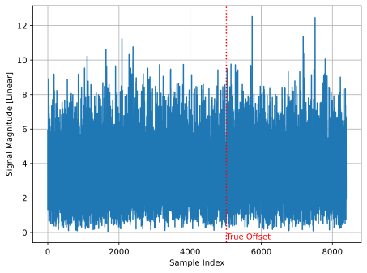
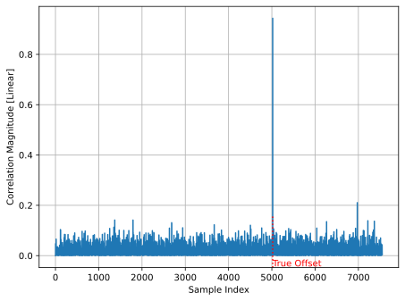
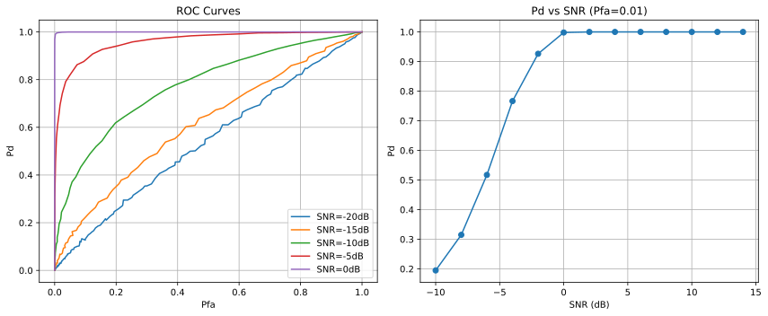
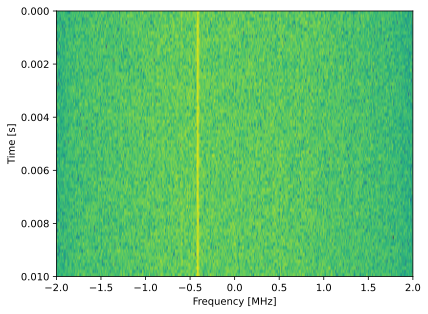
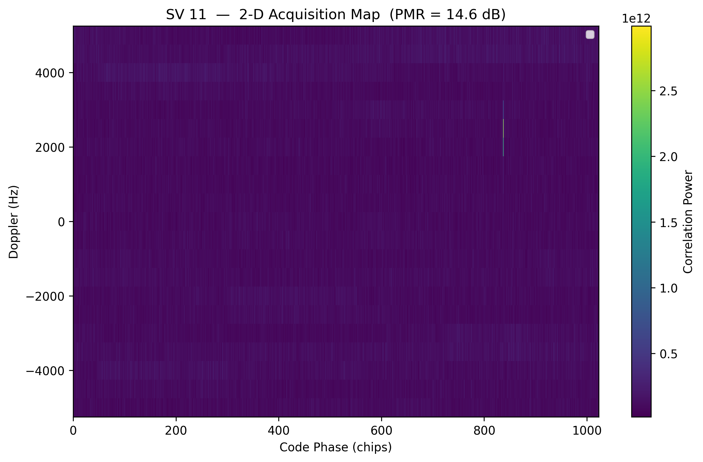
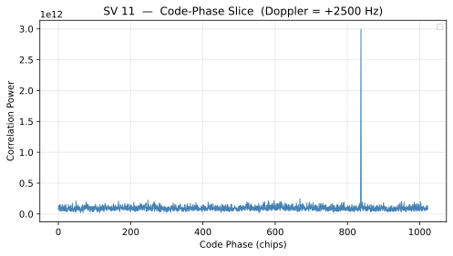
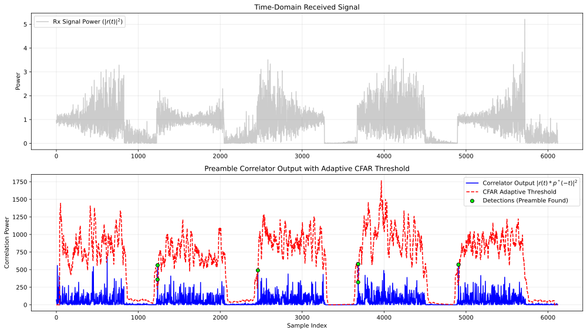
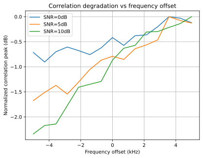
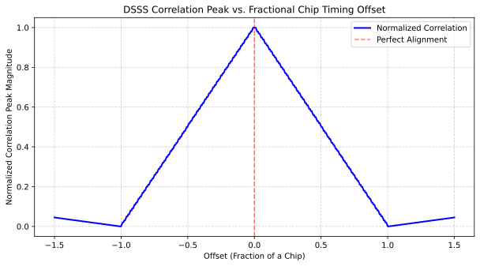
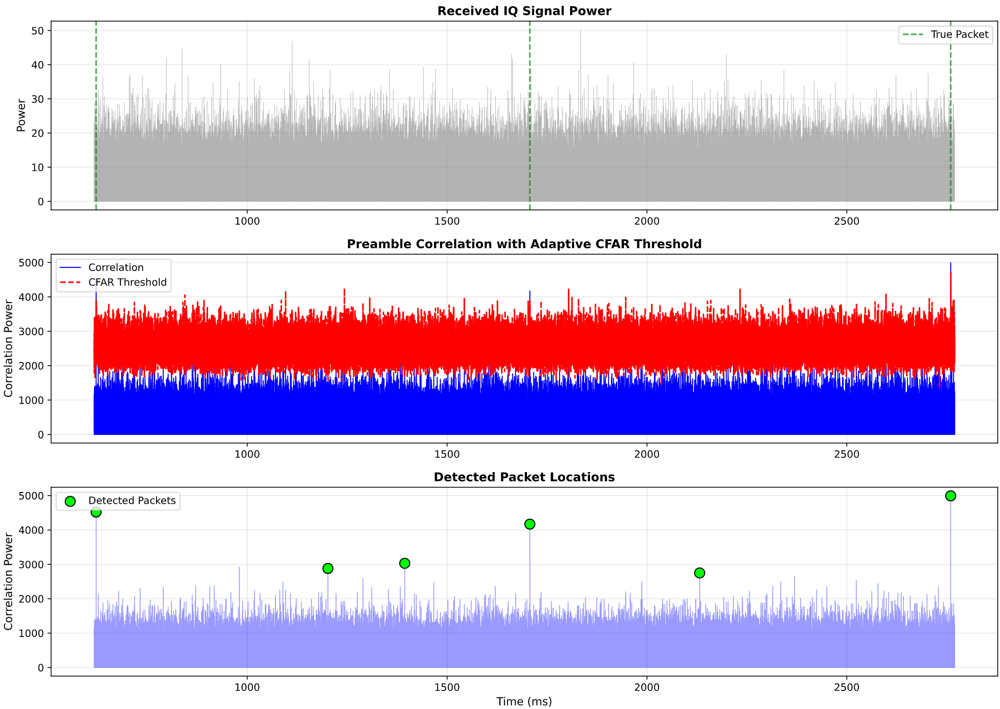

.. _detection-chapter:

#####################################################
Виявлення за допомогою кореляції
#####################################################

.. raw:: html

 У співавторстві із <a href="https://www.linkedin.com/in/samuel-brown-vt">Семом Брауном</a>

У цьому розділі ми навчимося виявляти наявність сигналів і відновлювати їхню часову прив'язку, обчислюючи взаємну кореляцію прийнятих відліків із заздалегідь відомою частиною сигналу, наприклад преамбулою пакета. Звідси природно випливає проста форма класифікації за допомогою банку кореляторів. Ми введемо основні поняття виявлення сигналів і зосередимося на тому, як вирішити, чи присутній заданий сигнал у шумному середовищі. Водночас розглянемо теорію та практичні методи ухвалення надійних рішень в умовах невизначеності.

****************************************************
Основи виявлення сигналів і кореляторів
****************************************************

Виявлення сигналу — це задача визначення, чи є спостережуваний сплеск енергії корисним сигналом, чи лише фоновим шумом.

Складність полягає в тому, що в радіолокаційних і гідроакустичних системах шум присутній усюди. Надто чутливий детектор створює хибні тривоги, а недостатньо чутливий пропускає справжню ціль.

Розв'язання починається з детектора Неймана—Пірсона, який математично знаходить оптимальний компроміс: максимізує ймовірність виявлення сигналу, водночас утримуючи хибні тривоги нижче заданої межі. Детектори CFAR розвивають цю ідею, пристосовуючись до змін рівня шуму. Вони особливо корисні, коли статистика шуму нестаціонарна, тобто шумовий поріг і розподіл змінюються через завади або мінливі умови каналу. Мета полягає в автоматичному регулюванні порога виявлення разом із фоновим шумом зі збереженням заданої частоти хибних тривог. Для цього потрібно оцінювати шумовий поріг у часі.

Коли система визначила, що сигнал присутній, їй ще потрібно знайти точний початок даних. Цифрові пакети LTE, 5G і WiFi починаються з преамбули — відомого повторюваного цифрового шаблону. Корелятор преамбули працює подібно до замка з ключем: ключем є відома приймачу послідовність символів, унікальна для відновлюваного сигналу. Приймач переміщує копію преамбули вздовж вхідного сигналу та для кожної затримки обчислює скалярний добуток, вимірюючи подібність шаблону до прийнятих відліків у кожному положенні. Коли вони точно суміщаються, виникає гострий максимум, який указує, звідки починати читати дані. Складніші варіанти також ураховують частотні зсуви через невелику різницю налаштування телефона й базової станції або через ефект Доплера.

Коли відомий сигнал або преамбула передається каналом, спотвореним лише адитивним білим гаусовим шумом (AWGN), потрібно визначити, чи присутній сигнал. Це найпростіша й фундаментальна задача виявлення.

Функція взаємної кореляції
##########################

У найпростішому вигляді корелятор обчислює взаємну кореляцію між прийнятим сигналом і шаблоном. Взаємна кореляція — це скалярний добуток двох векторів, коли один із них ковзає вздовж іншого. Якщо ви вже вивчали згортку, операція майже така сама, але другий вектор не перевертається, тому вона трохи простіша. Для комплексних сигналів, із якими ми працюватимемо, один із входів також потрібно комплексно спрягати. У Python це можна реалізувати так:

.. code-block:: python

    def correlate(a, v):
        n = len(a)
        m = len(v)
        result = []
        for i in range(n - m + 1):
            s = 0
            for j in range(m):
                s += a[i + j] * v[j].conjugate()
            result.append(s)
        return result

    # Example usage:
    a = [1+2j, 2+1j, 3+0j, 4-1j, 5-2j]
    v = [0+1j, 1+0j, 0.5-0.5j]
    correlate(a, v)

Зверніть увагу, як ми переміщуємо :code:`a`, комплексно спряжуючи :code:`v`, і що цикл із :code:`j` та :code:`s` насправді лише обчислює скалярний добуток векторів. На щастя, реалізовувати взаємну кореляцію з нуля не потрібно: у Python можна скористатися функцією NumPy :code:`correlate`. У SciPy також є власна версія для експериментів.

Приклад взаємної кореляції в Python
###################################

Для простого прикладу корелятора спочатку потрібний сигнал із відомою преамбулою, зануреною в шум. Як преамбулу використаємо послідовність Задова—Чу завдяки її чудовим автокореляційним властивостям і поширеності в системах зв'язку. Іншу частину сигналу моделювати не будемо, хоча в більшості систем після відомої преамбули йдуть невідомі дані. Послідовність Задова—Чу можна згенерувати так:

.. code-block:: python

    import numpy as np
    import matplotlib.pyplot as plt
    N = 839  # Length of Zadoff-Chu sequence
    u = 25  # Root of ZC sequence
    t = np.arange(N)
    zadoff_chu = np.exp(-1j * np.pi * u * t * (t + 1) / N)

Отримана послідовність сама є сигналом. IQ-відліки в :code:`zadoff_chu` представляють комплексний сигнал основної смуги, подібний до багатьох уже розглянутих у підручнику, але не представляють біти. Реалістичний сценарій можна змоделювати, додавши сигнал Задова—Чу у випадковій позиції до довшого потоку AWGN:

.. code-block:: python

    signal_length = 10 * N # overall simulated signal length
    offset = np.random.randint(N, signal_length - N)
    print(f"True offset: {offset}")
    snr_db = -15
    noise_power = 1 / (2 * (10**(snr_db / 10)))
    signal = np.sqrt(noise_power/2) * (np.random.randn(signal_length) + 1j * np.random.randn(signal_length))
    signal[offset:offset+N] += zadoff_chu # place our ZC signal at the random offset

Зауважте, що використовується дуже низьке SNR. Воно настільки мале, що в часовій області послідовність Задова—Чу взагалі не видно. Вона має 839 відліків серед приблизно 8000 змодельованих і настільки глибоко занурена в шум, що неможливо помітити навіть невелике збільшення модуля сигналу.

Тепер реалізуємо корелятор, обчисливши взаємну кореляцію прийнятого сигналу з відомою послідовністю Задова—Чу за допомогою :code:`np.correlate()`. Припускається, що приймач знає точну використану преамбулу. У попередньому коді :code:`zadoff_chu` спочатку створено для моделювання сигналу, а тепер та сама змінна є шаблоном преамбули на приймачі. Корелятор реалізується одним рядком:

.. code-block:: python

 correlation = np.correlate(signal, zadoff_chu, mode='valid')

Режим :code:`valid` буде пояснено нижче. Також нормалізуємо результат на довжину послідовності та беремо квадрат модуля, щоб отримати потужність, хоча можна було б узяти лише модуль. Головною операцією є саме :code:`np.correlate()`.

.. code-block:: python

 correlation = np.abs(correlation / N)**2 # normalize by N, and take magnitude squared

Побудуємо графік квадрата модуля й позначимо справжній початок послідовності, щоб перевірити роботу корелятора:

Попри дуже низьке SNR, на виході корелятора видно чіткий максимум саме там, де розміщено послідовність Задова—Чу. Він позначає початок послідовності, тож наступні 839 відліків містять преамбулу. У цьому й полягає сила кореляційного виявлення в поєднанні з довгою преамбулою. Поріг, який визначає, чи є максимум цільовим сигналом або лише шумом, ми ще не задали — поки що лише розглядаємо результат візуально. Решта розділу присвячена автоматизації цього рішення, особливо за змінного шумового порога та фонових завад.

Режими valid, same і full
#########################

Можливо, ви помітили, що :code:`np.correlate()` і :code:`np.convolve()` підтримують три режими: :code:`valid`, :code:`same` та :code:`full`. Вони визначають довжину вихідного масиву відносно вхідних. Ми використали :code:`valid`, тому вихід містить лише точки, у яких два вхідні масиви повністю перекриваються. Довжина результату становить :code:`len(signal) - len(zadoff_chu) + 1`. У режимі :code:`same` вихід мав би довжину довшого вхідного сигналу. Режим :code:`full` дає повну дискретну лінійну згортку — дещо довший масив довжиною :code:`max(M, N) - min(M, N) + 1`, де :code:`M` і :code:`N` — довжини входів. У радіочастотній обробці згортку часто застосовують як FIR-фільтр, де однакова довжина входу й виходу зручна, тому поширений режим :code:`same`. Для кореляційного виявлення зазвичай потрібний :code:`valid`, адже нас цікавлять лише точки повного перекриття преамбули з прийнятим сигналом, особливо якщо передбачається, що сигнал почався вже після початку приймання.

Детектор Неймана—Пірсона
########################

Еталонним способом вибору порога для виходу корелятора є детектор Неймана—Пірсона. Теорія дає оптимальне рішення за конкретного обмеження: знаходить поріг, який максимізує ймовірність виявлення :math:`P_{D}` за фіксованої допустимої ймовірності хибної тривоги :math:`P_{FA}`. Простіше кажучи, ви визначаєте прийнятну кількість хибних виявлень, наприклад одну хибну тривогу на годину, а детектор Неймана—Пірсона задає найкращий поріг, щоб виявити якомога більше справжніх сигналів. Для відомої преамбули в AWGN підхід простий: обчислюється кореляція між прийнятим сигналом і відомим шаблоном. Якщо значення перевищує наперед заданий поріг :math:`\tau`, сигнал вважається присутнім; інакше вважається, що є лише шум.

Характеристики детектора, вимірювані :math:`P_{D}` і :math:`P_{FA}`, залежать від порога :math:`\tau`, SNR та довжини преамбули :math:`L`. Імовірність хибної тривоги залежить від порога й дисперсії шуму :math:`\sigma_n^2`:

:math:`P_{FA} = Q\left(\frac{\tau}{\sigma_n}\right)`

Імовірність виявлення є функцією порога, дисперсії шуму та енергії преамбули (:math:`E_s = L \cdot S`, де :math:`S` — середня потужність символу):

:math:`P_{D} = Q\left(\frac{\tau - \sqrt{E_s}}{\sigma_n}\right) = Q\left(\frac{\tau - \sqrt{L \cdot S}}{\sigma_n}\right)`

Тут :math:`Q(x)` — Q-функція, тобто хвостова ймовірність стандартного нормального розподілу: імовірність того, що стандартна нормальна випадкова величина перевищить :math:`x`.

Аналіз характеристик: ROC і залежність Pd від SNR
##################################################

Для кількісної оцінки кореляційного детектора за наявності шуму використовують дві основні візуалізації: робочу характеристику приймача (Receiver Operating Characteristic, ROC) і графік імовірності виявлення :math:`P_d` залежно від SNR.

ROC показує ймовірність виявлення :math:`P_D` залежно від імовірності хибної тривоги :math:`P_{FA}` за фіксованого SNR. Змінюючи поріг на виході корелятора, ми вибираємо точку на цій кривій, тобто фундаментальний компроміс. Нижчий поріг збільшує :math:`P_D`, бо знаходить більше справжніх сигналів, але водночас збільшує :math:`P_{FA}`, частіше спрацьовуючи на шум. Чим сильніше крива вигинається до верхнього лівого кута, тим кращий детектор. Ідеальний детектор досягає цього кута зі 100% :math:`P_D` і 0% :math:`P_{FA}`, тоді як діагональ відповідає випадковому вгадуванню.

Рівняння та інтуїція разом показують, що довжина преамбули :math:`L` є критичним параметром проєктування, бо безпосередньо визначає виграш обробки, а отже, якість виявлення. За фіксованих порога та SNR імовірність :math:`P_D` зростає з :math:`L`. Довша преамбула дає змогу накопичити більше енергії сигналу й легше відрізнити його від фонового шуму. Це поліпшення називають виграшем обробки й зазвичай вимірюють у децибелах як :math:`10\log_{10}(L)`. Воно критично важливе для виявлення слабких сигналів, які інакше було б пропущено. Інтегруючи енергію більшої кількості відліків, можна витягнути сигнал із шуму, навіть коли він лежить нижче шумового порога. Хороший реальний приклад — GPS, приймач якого має відновлювати надзвичайно слабкі сигнали з відомою кодовою структурою.

****************************************************
Приклад: виявлення GPS нижче шумового порога
****************************************************

Короткий вступ до сигналів GPS
##############################

Станом на березень 2026 року американське сузір'я GPS містить 31 діючий супутник на середній навколоземній орбіті (MEO), кожен із яких двічі на добу облітає Землю. Усі супутники передають на одній несній частоті 1575,42 МГц, яка називається L1. На поверхні Землі сигнал надзвичайно слабкий і лежить далеко нижче шумового порога. Ортогональність супутників забезпечується унікальним для кожного 1023-чиповим псевдовипадковим шумовим кодом (PRN), що називається C/A-кодом; тому сигнал також позначають L1 C/A. C/A-коди є кодами Голда й спеціально побудовані так, щоб будь-яка їхня пара була майже ортогональною: взаємна кореляція кодів двох супутників майже нульова. C/A-код передається зі швидкістю 1,023 мільйона чипів за секунду й має лише 1023 чипи, тому повторюється кожну 1 мс. Поверх повторюваного коду кожен супутник повільно модулює навігаційні дані, зокрема параметри орбіти й поправки годинника, зі швидкістю лише 50 біт/с. Один біт даних охоплює 20 повних повторень коду. Використання окремого коду для кожного передавача називається кодовим розділенням каналів (Code Division Multiple Access, CDMA); ту саму ідею застосовували в мобільному зв'язку 3G.

На боці приймача пошук одного з 31 супутника означає генерування локальної копії його PRN-послідовності й використання корелятора для знаходження початку кодового періоду. Хоча GPS передає безперервно, цей початок можна розглядати як початок пакета або кадру. Точне положення кореляційного максимуму також використовують для оцінювання пройденої сигналом відстані. Маючи такі оцінки для чотирьох або більше супутників, приймач визначає своє положення на Землі трилатерацією. Супутники рухаються відносно вас приблизно зі швидкістю 4 км/с, тому приймач також має перебрати сітку можливих частотних зсувів і знайти найбільший кореляційний максимум. Це двовимірний пошук. Максимальний доплерівський зсув становить приблизно +/-20 кГц (:code:`4e3 / 3e8 * 1.575e9`). Процес повторюється кожну 1 мс, але приймач відстежує затримку та доплерівський зсув, тому не виконує повний пошук щоразу. Початковий пошук супутника називають захопленням, а подальше супроводження сигналу — стеженням. Захоплення обчислювально складніше й може тривати кілька хвилин, якщо приймач починає без попередньої інформації про видимі супутники, доплерівські зсуви або власне положення.

Кореляційний підхід
###################

Обчислюємо взаємну кореляцію вхідного сигналу — у цьому випадку запису L1 — із локально згенерованою копією коду кожного супутника. Великий максимум означає, що супутник видно, і задає початок кодового періоду 1 мс. Для одночасного пошуку за частотою використовуємо кореляцію на основі ШПФ у частотній області. Вона дає змогу ефективно перевіряти багато частотних зсувів, переміщуючи відліки ШПФ локальної копії коду. Нарешті, накопичуємо квадрат модуля кореляції для кількох блоків по 1 мс, щоб підвищити SNR. Це називають некогерентним інтегруванням; воно допомагає виявляти GPS-сигнали, прийняті нижче шумового порога. Для нормалізації порівнюємо з порогом відношення виходу корелятора до середньої потужності кореляції за всіма затримками.

Приклад запису
##############

Скористаємося прикладом запису GPS від Даніеля Естевеса, який можна `завантажити тут <https://raw.githubusercontent.com/777arc/PySDR/refs/heads/master/figure-generating-scripts/GPS_L1_recording_10ms_4MHz_cf32.iq>`_. Це файл комплексних float32 із частотою дискретизації 4 МГц і центральною частотою 1575,42 МГц.

Нижче показано спектрограму запису. На ній майже нічого не видно, а вертикальна лінія не є справжнім GPS-сигналом — імовірно, це вузькосмугова завада. Сигнали GPS L1 використовують швидкість 1,023 Мчип/с із дуже повільними даними поверх коду, тому займають приблизно 2 МГц. Проте на спектрограмі цієї смуги просто не видно. Це наочний приклад приймання GPS нижче шумового порога й причини, чому для його пошуку потрібне кореляційне виявлення.

Для зацікавлених: цей запис є невеликою частиною значно більшого файла на `IQEngine <https://iqengine.org/>`_ у каталозі :code:`estevez/GPS and other GNSS`; знайдіть запис :code:`GPS-L1-2022-03-27`. На IQEngine це файл int16 у форматі SigMF.

Приклад Python
##############

Змініть :code:`filename` відповідно до розташування завантаженого IQ-файла. Параметр :code:`num_integrations` визначає обсяг запису, який читається й обробляється. Загальна тривалість дорівнює цьому числу, помноженому на 1 мс; для скороченого запису максимальне значення становить 10.

.. code-block:: python

    import numpy as np
    import matplotlib.pyplot as plt

    filename = "GPS_L1_recording_10ms_4MHz_cf32.iq"
    sample_rate = 4e6
    chip_rate = 1023000 # chips / sec (part of the GPS spec)
    num_chips = 1023 # chips per C/A code period
    samples_per_code = int(round(sample_rate / chip_rate * num_chips))  # Exact number of samples in one 1 ms code period at 4 MHz
    doppler_min_hz = -5e3 # GPS Doppler ≈ ±4 kHz for stationary receiver
    doppler_max_hz = 5e3
    doppler_step_hz = 500 # good enough for a coarse search
    num_integrations = 10 # non-coherent power integrations (so 10 ms total), determines how much of the IQ recording we read in and process!
    detection_thresh_dB =  14.0 # Peak-to-mean ratio (PMR) threshold in dB to declare a detection, GPS C/A signals are typically 14–20 dB PMR above threshold with 10ms of integration
    gps_svs = list(range(1, 33)) # 1–32

    ##### C/A Code Generation #####
    # The GPS C/A code is a Gold code formed by XOR-ing two 10-stage maximal-length
    # shift registers (G1 and G2).  G2 is effectively delayed by a satellite-
    # specific number of chips before the XOR
    # Reference: IS-GPS-200, Table 3-Ia
    G2_DELAY = [ # G2 phase delay (chips) for gps_svs 1–32
        5,   6,   7,   8,  17,  18, 139, 140,   #  1– 8
        141, 251, 252, 254, 255, 256, 257, 258,   #  9–16
        469, 470, 471, 472, 473, 474, 509, 512,   # 17–24
        513, 514, 515, 516, 859, 860, 861, 862,   # 25–32
    ]

    """G1 LFSR: polynomial x^10 + x^3 + 1, all-ones init, output at stage 10."""
    reg = np.ones(10, dtype=np.int8)
    G1 = np.empty(num_chips, dtype=np.int8)
    for i in range(num_chips):
        G1[i] = reg[9]
        fb = reg[2] ^ reg[9] # stages 3 and 10 (0-indexed: 2 and 9)
        reg = np.roll(reg, 1)
        reg[0] = fb

    """G2 LFSR: polynomial x^10+x^9+x^8+x^6+x^3+x^2+1, all-ones init."""
    reg = np.ones(10, dtype=np.int8)
    G2 = np.empty(num_chips, dtype=np.int8)
    for i in range(num_chips):
        G2[i] = reg[9]
        fb = reg[1]^reg[2]^reg[5]^reg[7]^reg[8]^reg[9]  # taps 2,3,6,8,9,10
        reg = np.roll(reg, 1)
        reg[0] = fb

    # 1023-chip C/A PRN code for SV sv (1-32) as float32, 1's and -1's, so BPSK
    def make_prn(sv: int) -> np.ndarray:
        g2_delayed = np.roll(G2, G2_DELAY[sv - 1])
        bits = G1 ^ g2_delayed           # {0, 1}
        return (1 - 2 * bits).astype(np.float32)   # BPSK: {+1, −1}

    def upsample_prn(sv: int) -> np.ndarray:
        """Nearest-neighbour upsample 1023-chip C/A code → samples_per_code samples."""
        code = make_prn(sv)
        idx = (np.arange(samples_per_code) * num_chips / samples_per_code).astype(int)
        return code[idx]

    # Pre-compute template signals - conjugate FFTs of all upsampled PRN codes
    template_signals = {sv: np.conj(np.fft.fft(upsample_prn(sv))) for sv in gps_svs}

    # Read in IQ file
    n_needed = samples_per_code * num_integrations
    iq = np.fromfile(filename, dtype=np.complex64, count=n_needed)
    # For the full version from IQEngine use the following instead
    #iq = np.fromfile(filename, dtype=np.int16, count=n_needed * 2)
    #iq = (iq[0::2] + 1j * iq[1::2]).astype(np.complex64)

    # Search each satellite across Doppler and code phase
    results = []
    detected = []
    print(f"  {'SV':>3}  {'Doppler (Hz)':>13}  {'Phase (chips)':>14}"
            f"  {'Phase (samp)':>13}  {'Delay (µs)':>11}  {'PMR (dB)':>9}")
    doppler_bins = np.arange(doppler_min_hz, doppler_max_hz + doppler_step_hz, doppler_step_hz)
    for sv in gps_svs:
        corr_map = np.zeros((len(doppler_bins), samples_per_code))
        n_total = samples_per_code * num_integrations
        for di, f_d in enumerate(doppler_bins):
            t = np.arange(n_total) / sample_rate # Time vector
            mixed = iq[:n_total] * np.exp(-2j*np.pi*float(f_d)*t) # Apply the frequency shift

            # Accumulate squared correlation magnitude non-coherently
            for k in range(num_integrations):
                blk = mixed[k * samples_per_code:(k + 1) * samples_per_code]
                sig_fft = np.fft.fft(blk)
                corr = np.fft.ifft(sig_fft * template_signals[sv]) # Frequency-domain correlation
                corr_map[di] += np.abs(corr)**2

        # Normalize by the mean and convert to dB
        peak_val = float(np.max(corr_map))
        mean_val = float(np.mean(corr_map))
        pmr_db = 10.0 * np.log10(peak_val / mean_val)

        peak_idx = np.unravel_index(np.argmax(corr_map), corr_map.shape)
        best_doppler_hz   = float(doppler_bins[peak_idx[0]])
        best_phase_samp   = int(peak_idx[1])
        best_phase_chips  = best_phase_samp * num_chips / samples_per_code

        r = {
            "sv": sv,
            "detected": pmr_db >= detection_thresh_dB,
            "doppler_hz": best_doppler_hz,
            "code_phase_samp": best_phase_samp, # sample offset = "start of packet"
            "code_phase_chip": best_phase_chips,
            "pmr_db": pmr_db,
            "corr_map": corr_map,
            "doppler_bins": doppler_bins,
        }
        results.append(r)

        # Print the result row
        delay_us = r['code_phase_samp'] / sample_rate * 1e6
        flag = "  ← DETECTED" if r['detected'] else ""
        print(f"  {sv:>3}  {r['doppler_hz']:>+13.0f}  {r['code_phase_chip']:>14.2f}"
            f"  {r['code_phase_samp']:>13d}  {delay_us:>11.3f}  {r['pmr_db']:>9.1f}{flag}")

Цей код має дати такий результат:

.. code-block::

   SV   Doppler (Hz)   Phase (chips)   Phase (samp)   Delay (µs)   PMR (dB)
    1          -3000          757.79           2963      740.750        5.6
    2          +1500          264.19           1033      258.250        9.1
    3          -2000          316.62           1238      309.500        5.8
    4          +5000          577.48           2258      564.500        5.0
    5          +1000           64.96            254       63.500        5.3
    6          +1500          511.76           2001      500.250        5.0
    7          -4000          763.41           2985      746.250        5.0
    8          +3500          961.62           3760      940.000        5.4
    9          +3500          118.67            464      116.000        4.9
   10             +0          890.52           3482      870.500        5.4
   11          +2500          837.33           3274      818.500       14.6  ← DETECTED
   12           -500          871.60           3408      852.000       16.4  ← DETECTED
   13          +1000          137.85            539      134.750        5.9
   14          +2500          287.72           1125      281.250        5.0
   15          -5000          908.68           3553      888.250        5.3
   16          +1500          292.58           1144      286.000        5.9
   17           +500          994.61           3889      972.250        5.3
   18          +4500         1005.61           3932      983.000        5.4
   19          +5000          588.48           2301      575.250        5.0
   20             +0          768.53           3005      751.250        5.4
   21          -3000          749.60           2931      732.750        5.0
   22          +2500          558.05           2182      545.500       14.4  ← DETECTED
   23          -5000          390.02           1525      381.250        5.3
   24          +2500          955.48           3736      934.000        5.9
   25          +1500          597.94           2338      584.500       15.5  ← DETECTED
   26          -1500          239.89            938      234.500        6.2
   27          -2500          488.74           1911      477.750        4.7
   28          +3000          858.81           3358      839.500        5.2
   29          -4000          998.70           3905      976.250        5.2
   30          -2000          937.58           3666      916.500        5.2
   31          +5000          463.42           1812      453.000       15.9  ← DETECTED
   32          +1000          342.45           1339      334.750       16.2  ← DETECTED

Як бачимо, виявлено шість супутників. Хоча поріг дорівнював 14,0, зі списку легко визначити, що більшість інших супутників не перебувала в зоні видимості. Винятком є SV-2, який, імовірно, було видно, але він трохи не досяг порога. Для охочих перевірити: запис зроблено 2022-03-27 о 11:32:04 десь в Іспанії.

Побудова графіків
#################

Побудуймо результати для супутника 11 — першого з виявлених. Перший графік є двовимірною картою кореляції за доплерівським зсувом і часом/затримкою. Другий — зріз карти в найкращому доплерівському відліку, який показує потужність кореляції в часі, як у попередньому розділі.

.. code-block:: python

    # Plotting
    sv = 11 # we detected 11, 12, 22, 25, 31, 32 although try looking at one we didnt find as well!
    r = results[sv - 1] # print the dict of results for this SV to see what we got
    cmap = r['corr_map'] # 2-D array of correlation power vs Doppler and code phase
    d_bins = r['doppler_bins'] # Doppler bins corresponding
    chips_axis = np.arange(samples_per_code) * num_chips / samples_per_code

    # 2-D Doppler × code-phase map
    plt.figure(0, figsize=(10, 6))
    im = plt.pcolormesh(chips_axis, d_bins, cmap, shading='auto', cmap='viridis')
    plt.xlabel("Code Phase (chips)")
    plt.ylabel("Doppler (Hz)")
    plt.title(f"SV {sv}  —  2-D Acquisition Map  (PMR = {r['pmr_db']:.1f} dB)")
    plt.legend(fontsize=8, loc='upper right')
    plt.colorbar(im, label="Correlation Power")

    # Code-phase slice at the best Doppler
    best_di = int(np.argmin(np.abs(d_bins - r['doppler_hz'])))
    plt.figure(1, figsize=(10, 6))
    plt.plot(chips_axis, cmap[best_di], lw=1, color='steelblue')
    plt.xlabel("Code Phase (chips)")
    plt.ylabel("Correlation Power")
    plt.title(f"SV {sv}  —  Code-Phase Slice  (Doppler = {r['doppler_hz']:+.0f} Hz)")
    plt.legend(fontsize=8)
    plt.grid(True, alpha=0.3)

    plt.show()

Трилатерацію тут не розглядатимемо, але саме точне положення цього максимуму зрештою дає GPS-приймачу змогу визначити відстань до супутника. Поєднавши таку інформацію від чотирьох або більше супутників, він визначає своє положення на Землі.

****************************************************
Детектори CFAR у мінливому середовищі
****************************************************

Детектор Неймана—Пірсона оптимальний за сталого рівня шуму, але реальні умови рідко бувають настільки стабільними. У динамічному середовищі — наприклад, коли радар супроводжує літак крізь дощ або бездротовий приймач працює в переповненому місті — рівні фонового шуму й завад постійно змінюються. Саме тут потрібний детектор зі сталою частотою хибних тривог (Constant False Alarm Rate, CFAR).

CFAR є основним інструментом систем, де непередбачуваний фон не дає підтримувати фіксований поріг:

- Радіолокація та гідроакустика виявляють цілі, як-от літаки чи підводні човни, на тлі «місцевих предметів» — відбиттів від хвиль, дощу або землі, які змінюються під час руху сенсора.
- Системи бездротового зв'язку, зокрема когнітивне радіо та LTE/5G, застосовують CFAR для пошуку вільного спектра або вхідних пакетів за імпульсних і непередбачуваних завад від інших пристроїв.
- У медичній візуалізації CFAR допомагає автоматичному аналізу УЗД або МРТ відрізняти справжні особливості тканин від змінного електронного шуму.

Літера «C» у CFAR означає Constant («сталий»), бо мета полягає в утриманні ймовірності хибної тривоги :math:`P_{FA}` на сталому передбачуваному рівні.

Для встановлення порога потрібно прийняти статистичну модель шуму, тобто його розподіл. У простому AWGN шум має гаусів розподіл. Радіолокаційні відбиття від місцевих предметів можуть натомість мати розподіл Релея або Вейбулла. Якщо модель неправильна, :math:`P_{FA}` «дрейфуватиме», через що система або перестане бачити цілі, або буде перевантажена хибними спрацьовуваннями.

Замість жорстко заданого значення CFAR оцінює потужність шуму в локальному «околі» сигналу й множить її на коефіцієнт масштабування :math:`T`, отриманий із бажаного :math:`P_{FA}`. Тому разом зі зростанням шумового порога зростає й поріг виявлення.

Хибні тривоги для однієї затримки та всієї системи
##################################################

Це важлива відмінність, яку початківці часто пропускають. Під час пошуку преамбули зазвичай виконується ковзна кореляція, а поріг щосекунди перевіряється в тисячах часових зсувів, або затримок.

:math:`P_{FA}` **для однієї затримки** — імовірність того, що одна конкретна перевірка кореляції дасть хибну тривогу. Якщо розрахунок задає :math:`P_{FA}=0.001`, кожна окрема затримка має шанс 1 до 1000 стати «примарним» сигналом.

:math:`P_{FA}` **рівня системи (глобальна)** — імовірність того, що система створить хоча б одну хибну тривогу протягом усього вікна пошуку, наприклад серед 2048 затримок.

Якщо :math:`P_{FA}` для однієї затримки дорівнює :math:`p`, то ймовірність принаймні однієї хибної тривоги серед :math:`N` затримок приблизно дорівнює :math:`1-(1-p)^{N}`.

Отже, для 1000 затримок і :math:`P_{FA}=0.001` на одну затримку система насправді видаватиме хибну тривогу майже в 63% пошуків. Щоб глобальна частота хибних тривог залишалася низькою, :math:`P_{FA}` для однієї затримки має бути надзвичайно малим.

Приклад Python
##############

Щоб поекспериментувати з власним CFAR, спочатку змоделюємо повторювані QPSK-пакети з відомою преамбулою, які проходять каналом зі змінним у часі шумовим порогом. Потім реалізуємо простий CFAR з усередненням комірок (Cell-Averaging CFAR, CA-CFAR), щоб знаходити преамбули в прийнятому сигналі. Наступний код генерує прийнятий сигнал:

.. code-block:: python

    import numpy as np
    import matplotlib.pyplot as plt
    from scipy.signal import correlate

    def generate_qpsk_packets(num_packets, sps, preamble):
        """Generates repeating QPSK packets with gaps and varying noise."""
        qpsk_map = np.array([1+1j, -1+1j, -1-1j, 1-1j]) / np.sqrt(2)
        data_len = 200
        gap_len = 100
        full_signal = []
        
    # Precompute the upsampled preamble for correlation
        upsampled_preamble = np.repeat(preamble, sps)
        
        for _ in range(num_packets):
            data = qpsk_map[np.random.randint(0, 4, data_len)]
            packet = np.concatenate([preamble, data])
            full_signal.extend(np.repeat(packet, sps))
            full_signal.extend(np.zeros(gap_len * sps))
        
        return np.array(full_signal), upsampled_preamble

    # Simulation parameters
    sps = 4
    preamble_syms = np.array([1+1j, 1+1j, -1-1j, -1-1j, 1-1j, -1+1j]) / np.sqrt(2)
    tx_signal, ref_preamble = generate_qpsk_packets(5, sps, preamble_syms)

    # Time-varying noise floor
    t = np.arange(len(tx_signal))
    noise_env = 0.05 + 0.3 * np.sin(2 * np.pi * 0.0003 * t)**2
    noise = (np.random.randn(len(tx_signal)) + 1j*np.random.randn(len(tx_signal))) * noise_env
    rx_signal = tx_signal + noise

Перший крок — один раз обчислити кореляцію прийнятого сигналу з відомою преамбулою. На практиці це зазвичай роблять блоками відліків, але поки що обробимо все одним блоком:

.. code-block:: python

    # Correlation spike appears when the reference matches the received segment
    corr_out = correlate(rx_signal, ref_preamble, mode='same')
    corr_power = np.abs(corr_out)**2

Тепер реалізуємо CFAR, застосуємо його до виходу корелятора й покажемо результат:

.. code-block:: python

    # CFAR detection on the correlator output
    def ca_cfar_adaptive(data, num_train, num_guard, pfa):
        num_cells = len(data)
        thresholds = np.zeros(num_cells)
        alpha = num_train * (pfa**(-1/num_train) - 1)  # Scaling factor
        half_window = (num_train + num_guard) // 2
        guard_half = num_guard // 2
        for i in range(half_window, num_cells - half_window):
            # Build the training set around the cell under test (CUT)
            lagging_win = data[i - half_window : i - guard_half]
            leading_win = data[i + guard_half + 1 : i + half_window + 1]
            noise_floor_est = np.mean(np.concatenate([lagging_win, leading_win]))
            thresholds[i] = alpha * noise_floor_est
        return thresholds

    # Detect peaks in correlator power
    cfar_thresholds = ca_cfar_adaptive(corr_power, num_train=60, num_guard=20, pfa=1e-5)
    detections = np.where(corr_power > cfar_thresholds)[0]
    # Remove edge detections where the threshold is undefined
    detections = detections[cfar_thresholds[detections] > 0]

    # Subplot 1: received signal and raw power
    plt.figure(figsize=(14, 8))
    plt.subplot(2, 1, 1)
    plt.plot(np.abs(rx_signal)**2, color='gray', alpha=0.4, label='Rx Signal Power ($|r(t)|^2$)')
    plt.title("Time-Domain Received Signal")
    plt.ylabel("Power")
    plt.legend()
    plt.grid(True, alpha=0.3)

    # Subplot 2: correlator output vs adaptive threshold
    plt.subplot(2, 1, 2)
    plt.plot(corr_power, label='Correlator Output $|r(t) * p^*(-t)|^2$', color='blue')
    plt.plot(cfar_thresholds, label='CFAR Adaptive Threshold', color='red', linestyle='--', linewidth=1.5)
    if len(detections) > 0: # Overlay the detections
        plt.scatter(detections, corr_power[detections], color='lime', edgecolors='black', label='Detections (Preamble Found)', zorder=5)
    plt.title("Preamble Correlator Output with Adaptive CFAR Threshold")
    plt.xlabel("Sample Index")
    plt.ylabel("Correlation Power")
    plt.legend()
    plt.grid(True, alpha=0.3)
    plt.show()

Корелятори преамбули, стійкі до частотного зсуву
#################################################

Коли центральна частота невідома, виявлення преамбули перетворюється на багатовимірний пошук. В ідеально синхронізованій системі когерентний корелятор працює як узгоджений фільтр і максимізує SNR. Однак частотний зсув створює змінне в часі обертання фази, яке декорелює сигнал із локальним шаблоном і значно знижує чутливість виявлення.

Вплив частотного зсуву :math:`\Delta f` залежить від його величини відносно тривалості преамбули :math:`T_p`.

Невеликий зсув, наприклад через ефект Доплера або дрейф годинника, зазвичай спричинений неточністю локального генератора в ppm або повільним рухом. У цьому випадку :math:`\Delta f \cdot T_p \ll 1`. Кореляційний максимум трохи послаблюється, але часову прив'язку все ще можна відновити.

Якщо частотний зсув зовсім невідомий, наприклад під час холодного захоплення супутника або у високодинамічному каналі БПЛА, когерентна сума може стати нульовою, коли фаза за час преамбули повернеться більш ніж на :math:`180^{\circ}` (:math:`\Delta f > 1/(2T_p)`). Тоді виявлення стає неможливим незалежно від SNR.

Втрату модуля кореляції через частотний зсув описує ядро Діріхле, або періодична sinc-функція. Зі збільшенням зсуву когерентна сума повернутих векторів спадає за sinc-подібним законом.

Втрату в децибелах можна наближено обчислити так:

:math:`L_{dB}(\Delta f) = 20 \log_{10} \left| \frac{\sin(\pi \Delta f N T_{s})}{N \sin(\pi \Delta f T_{s})} \right|`

де:

   - :math:`N` — кількість символів преамбули;
   - :math:`T_s` — період символу;
   - :math:`\Delta f` — частотний зсув у герцах.

Зі збільшенням :math:`\Delta f` чисельник коливається, а знаменник зростає, утворюючи нулі чутливості детектора. Для звичайного корелятора перший нуль виникає при :math:`\Delta f = 1/(N T_s)`. Якщо зсув дорівнює половині ширини частотного відліку, втрата становить приблизно 3,9 дБ, що істотно погіршує ефективні SNR і :math:`P_d`.

Методи стійкості до частотного зсуву
####################################

А. Когерентний сегментований корелятор

Преамбула довжиною :math:`N` ділиться на :math:`M` сегментів довжиною :math:`L=N/M`. Кожен сегмент корелюється когерентно, а результати поєднуються з компенсацією дрейфу фази між сегментами:

:math:`Y_{coh} = \sum_{m=0}^{M-1} \left( \sum_{k=0}^{L-1} r[k+mL] \cdot p^{*}[k] \right) e^{-j \hat{\phi}_m}`

Тут :math:`\hat{\phi}_m` — оцінка повороту фази відповідного сегмента. Метод зберігає виграш SNR повної преамбули, але для суміщення фаз потребує точної оцінки частоти.

Б. Некогерентний сегментований корелятор

Сегменти корелюються когерентно, але додаються квадрати модулів, тож інформація про фазу відкидається:

:math:`Y_{non-coh} = \sum_{m=0}^{M-1} \left| \sum_{k=0}^{L-1} r[k+mL] \cdot p^{*}[k] \right|^{2}`

Цей підхід надзвичайно стійкий до частотних зсувів аж до :math:`1/(L T_s)`. Проте він має втрати некогерентного інтегрування. Додавання модулів замість комплексних значень дає шуму змогу накопичуватися швидше за сигнал, фактично зменшуючи SNR після детектування.

В. Повний перебір частоти

Приймач запускає кілька паралельних кореляторів, кожен із яких зсунутий на окрему частоту :math:`\Delta f_i`.

Цей метод дає найкращу якість за SNR, тобто повний когерентний виграш, але потребує найбільше обчислень. Крок частотних відліків потрібно вибрати за формулою Діріхле досить малим, щоб найгірша втрата між ними залишалася прийнятною, наприклад меншою за 1 дБ.

Під час реалізації в часовій області відліки згортаються з фіксованим набором ваг. Для частотного пошуку потрібний окремий банк FIR для кожного частотного відліку. Для коротких преамбул це ефективно реалізується у FPGA за допомогою блоків Xilinx DSP48. У частотній області для пошуку виконують ШПФ вхідного сигналу й преамбули, адже множення у спектрі відповідає кореляції. Існує корисний прийом частотного зсуву: для перевірки різних зсувів не потрібні окремі ШПФ. Достатньо циклічно переміщувати відліки ШПФ преамбули відносно сигналу перед поелементним множенням і оберненим ШПФ. Для безперервних потоків застосовують обробку блоками Overlap-Save або Overlap-Add, щоб не втрачати кореляційні максимуми на межах вікон ШПФ.

Стійкість до частотного зсуву є компромісом між виграшем обробки та обчислювальною складністю. Некогерентна сегментована кореляція найстійкіша за великої невизначеності, але потребує більшого енергетичного запасу каналу. Когерентні сегментовані методи та повний пошук на основі ШПФ мають вищу чутливість, але споживають значно більше апаратних ресурсів. Розуміння втрат за законом Діріхле критично важливе для вибору щільності частотних відліків у будь-якому приймачі з частотним пошуком.

*****************************************************************
Виявлення сигналів DSSS
*****************************************************************

У системі прямого розширення спектра (Direct Sequence Spread Spectrum, DSSS) кореляційний детектор витягує змістовний сигнал із того, що спочатку нагадує випадковий шум. Високошвидкісна чипова послідовність, або код розширення, розподіляє енергію сигналу в значно ширшій смузі, ніж потрібно початковим даним. Загальна потужність залишається сталою, тому її розподіл у ширшому діапазоні знижує спектральну густину потужності (PSD). Таке спектральне розрідження може опустити сигнал нижче теплового шумового порога, зробивши його майже невидимим для звичайних вузькосмугових приймачів. Цільовий приймач натомість застосовує ту саму чипову послідовність для зворотного стискання спектра: енергія концентрується в початковій вузькій смузі, а вузькосмугові завади, навпаки, розширюються. Саме це забезпечує надійне виявлення навіть у дуже шумному середовищі. Далі розглянемо часову сторону цієї задачі.

Роль автокореляційних властивостей
##################################

Правильний вибір послідовності критично важливий для синхронізації та придушення багатопроменевості. В ідеалі вона повинна мати досконалу автокореляцію: високий максимум за точного суміщення й майже нульові значення за будь-якого іншого часового зсуву. Гострий автокореляційний максимум дає приймачу змогу синхронізуватися із субчиповою точністю. Якщо сигнал відбивається від будівлі й приходить пізніше, хороша автокореляція дає змогу сприйняти затриману копію як некорельований шум, а не руйнівну заваду, послаблюючи багатопроменевість.

Поширені послідовності розширення
#################################

Різним застосуванням потрібні різні математичні властивості послідовностей. Ось кілька прикладів:

- Коди Баркера мають найкращі можливі автокореляційні властивості для коротких довжин до 13 і відомі застосуванням у Wi-Fi 802.11b.
- M-послідовності максимальної довжини генеруються регістрами зсуву з лінійним зворотним зв'язком (LFSR) і мають чудову випадковість та автокореляцію протягом дуже довгих періодів.
- Коди Голда, утворені з пар m-послідовностей, дають велику множину кодів із контрольованою взаємною кореляцією. Тому вони є стандартом GPS і CDMA, де одночасно співіснує багато сигналів.
- Послідовності Задова—Чу (ZC) — комплексні послідовності зі сталою амплітудою та нульовою автокореляцією для всіх ненульових зсувів; нині вони широко застосовуються для синхронізації LTE і 5G.
- Коди Касамі подібні до кодів Голда, але мають ще нижчу взаємну кореляцію за тієї самої довжини, що корисно в середовищах із великою щільністю сигналів.

Синхронізація чипів у DSSS
##########################

Здатність DSSS-приймача відновлювати дані повністю залежить від синхронізації з вхідною чиповою послідовністю. Чипи значно коротші за біти даних, тому навіть мала дробова похибка часу, коли приймач бере відлік між чипами, істотно зменшує кореляційний максимум. Дослідимо вплив дробового часового зсуву, змоделювавши просту DSSS-систему й побудувавши кореляційний вихід для зсувів від 0 до 1 чипа. Тут не виконується повна кореляція: ми лише беремо скалярний добуток за нульової затримки, бо вже знаємо, що саме там буде максимум.

.. code-block:: python

    import numpy as np
    import matplotlib.pyplot as plt

    # Barker 11 sequence
    barker11 = np.array([1, -1, 1, 1, -1, 1, 1, 1, -1, -1, -1])
    samples_per_chip = 100

    # Upsample the sequence to simulate continuous time
    sig = np.repeat(barker11, samples_per_chip)

    offsets = np.linspace(-1.5, 1.5, 500) # Fractional chip offsets
    peaks = []

    for offset in offsets:
        # Shift the signal by a fractional number of chips, converted to samples
        shift_samples = int(offset * samples_per_chip)
        if shift_samples > 0:
            shifted_sig = np.pad(sig, (shift_samples, 0))[:len(sig)]
        elif shift_samples < 0:
            shifted_sig = np.pad(sig, (0, abs(shift_samples)))[abs(shift_samples):]
        else:
            shifted_sig = sig
            
        # Compute normalized correlation at zero lag for this offset
        correlation = np.vdot(sig, shifted_sig) / np.vdot(sig, sig)
        peaks.append(np.abs(correlation))

    plt.figure(figsize=(10, 5))
    plt.plot(offsets, peaks, label='Normalized Correlation', color='blue', linewidth=2)
    plt.axvline(0, color='red', linestyle='--', alpha=0.5, label='Perfect Alignment')
    plt.title('DSSS Correlation Peak vs. Fractional Chip Timing Offset')
    plt.xlabel('Offset (Fraction of a Chip)')
    plt.ylabel('Normalized Correlation Peak Magnitude')
    plt.grid(True, which='both', linestyle='--', alpha=0.6)
    plt.legend()
    plt.savefig('../_images/detection_dsss.svg', bbox_inches='tight')
    plt.show()

Як і очікувалося, максимум виникає за нульового зсуву й лінійно спадає, досягаючи половини значення при зсуві на пів чипа. Після зсуву більш ніж на один чип кореляція може начебто знову зростати, але справжній максимум залишається низьким, бо сигнал уже не суміщений із послідовністю.

****************************************************
Виявлення пакетів у безперервному IQ-потоці
****************************************************

Досі ми розглядали теоретичні основи виявлення сигналів: корелятори, CFAR і системи з розширеним спектром. Тепер поєднаємо їх для розв'язання поширеної практичної задачі — **виявлення переривчастих пакетів у безперервному потоці IQ-відліків від SDR**. Уявімо, що модем або пристрій IoT передає пакет даних раз на секунду чи з нерегулярними інтервалами. SDR безперервно приймає, наприклад, мільйон відліків за секунду. Пакети надходять у непередбачувані моменти й занурені в шум та завади. Потрібно:

1. Виявити момент надходження пакета.
2. Визначити точний індекс його першого відліку.
3. Виділити пакет для подальшої обробки — демодуляції, декодування тощо.
4. Робити це в реальному часі, не пропускаючи пакетів.

Це принципово відрізняється від обробки заздалегідь записаного IQ-файла, де весь сигнал доступний одразу. Тут відліки надходять безперервно, а рішення потрібно ухвалювати в реальному часі за обмежених обчислювальних ресурсів. Поєднаємо кілька розглянутих методів:

1. **Взаємну кореляцію** для пошуку відомої преамбули.
2. **CFAR** для адаптивного встановлення порога за змінного шуму.
3. **Керування буферами** для роботи з безперервним потоком.
4. **Пошук максимумів** для точного визначення часу пакета.

Для роботи в реальному часі накопичуватимемо відліки в **буферах**, наприклад по 100 000 відліків, запускатимемо детектор для кожного буфера й зберігатимемо стан між ними, щоб не втрачати пакети, які перетинають межу двох буферів.

Реалізація
##########

Детектор працює за такою схемою:

.. mermaid::

 flowchart TD
    A("Безперервний IQ-потік від SDR (частота дискретизації 1 МГц)")
    B("Накопичення буфера (100 тис. відліків = 0,1 с)")
    C("Взаємна кореляція з відомою преамбулою")
    D("Обчислення порога CFAR")
    E("Пошук максимумів (кореляція > поріг)")
    F("Виділення та перевірка пакета")
    A --> B --> C --> D --> E --> F

Щоб не пропустити пакет на межі буферів, застосуємо **overlap-save**: кожен буфер міститиме останні ``N_preamble`` відліків попереднього. Тоді пакет, який починається наприкінці буфера ``i``, повністю потрапить до буфера ``i+1``. Обсяг додаткових обчислень невеликий і значно менш шкідливий, ніж пропущені пакети.

Побудуймо повний детектор пакетів у Python крок за кроком. Використаємо коротшу, ніж раніше, преамбулу Задова—Чу й адаптивний CFAR.

Крок 1. Преамбула та параметри
******************************

.. code-block:: python

    import numpy as np
    import matplotlib.pyplot as plt
    from scipy.signal import correlate
    
    # Preamble: Zadoff-Chu sequence (excellent correlation properties)
    N_zc = 63  # ZC sequence length (typically prime or power of 2 - 1)
    u = 5      # ZC root
    t = np.arange(N_zc)
    preamble = np.exp(-1j * np.pi * u * t * (t + 1) / N_zc)
    
    # System parameters
    sample_rate = 1e6  
    buffer_size = 100000
    overlap_size = len(preamble)  # Overlap to catch boundary packets
    
    # CFAR parameters
    cfar_guard = 10
    cfar_train = 50
    pfa_target = 1e-6
    
    # Packet parameters (for simulation)
    packet_length = 500  # Total packet length in samples (preamble + data)
    snr_db = -5

Крок 2. Функція детектора CFAR
******************************

Скористаємося CA-CFAR із попереднього прикладу, трохи його оптимізувавши:

.. code-block:: python

    def ca_cfar_1d(signal, num_train, num_guard, pfa):
        """
        1D Cell-Averaging CFAR detector.
        
        Args:
            signal: Input signal (typically correlation magnitude)
            num_train: Number of training cells (on each side)
            num_guard: Number of guard cells (on each side)
            pfa: Target probability of false alarm
            
        Returns:
            threshold: Adaptive threshold array
        """
        n = len(signal)
        threshold = np.zeros(n)
        alpha = num_train * (pfa**(-1/num_train) - 1)
        
        for i in range(n):
            # Define training window indices
            train_start_left = max(0, i - num_guard - num_train)
            train_end_left = max(0, i - num_guard)
            train_start_right = min(n, i + num_guard + 1)
            train_end_right = min(n, i + num_guard + num_train + 1)
            
            # Collect training cells (avoid guard cells and CUT)
            train_cells = np.concatenate([
                signal[train_start_left:train_end_left],
                signal[train_start_right:train_end_right]
            ])
            
            if len(train_cells) > 0:
                noise_est = np.mean(train_cells)
                threshold[i] = alpha * noise_est
        
        return threshold

Крок 3. Функція виявлення пакетів
*********************************

.. code-block:: python

    def detect_packets(buffer, preamble, cfar_guard, cfar_train, pfa, 
                      min_spacing=None):
        """
        Detect packets in a buffer of IQ samples.
        
        Args:
            buffer: Complex IQ samples
            preamble: Known preamble sequence
            cfar_guard: CFAR guard cells
            cfar_train: CFAR training cells
            pfa: Target false alarm probability
            min_spacing: Minimum samples between detections (prevents duplicates)
            
        Returns:
            detections: List of sample indices where packets start
        """
        # Correlate buffer with preamble
        corr = correlate(buffer, preamble, mode='same')
        corr_power = np.abs(corr)**2
        
        # Compute adaptive threshold
        threshold = ca_cfar_1d(corr_power, cfar_train, cfar_guard, pfa)
        
        # Find peaks above threshold
        detections_raw = np.where(corr_power > threshold)[0]

        # Compensate for correlation offset (peak occurs at len(preamble)//2 after true start)
        half_preamble = len(preamble) // 2
        detections_raw = detections_raw - half_preamble
        
        # Remove edge detections (unreliable)
        half_preamble = len(preamble) // 2
        detections_raw = detections_raw[
            (detections_raw > half_preamble) & 
            (detections_raw < len(buffer) - half_preamble)
        ]
        
        # Remove duplicate detections (peaks close together)
        if min_spacing is None:
            min_spacing = len(preamble)
        
        detections = []
        if len(detections_raw) > 0:
            detections.append(detections_raw[0])
            for det in detections_raw[1:]:
                if det - detections[-1] > min_spacing:
                    detections.append(det)
        
        return detections, corr_power, threshold

Крок 4. Моделювання тестового сигналу
*************************************

.. code-block:: python

    def generate_packet_stream(preamble, packet_length, num_packets, 
                               sample_rate, snr_db):
        """
        Generate a simulated IQ stream with intermittent packets.
        
        Returns:
            signal: Complex IQ samples
            true_starts: Ground truth packet start indices
        """
        # Calculate noise power from SNR
        signal_power = 1.0  # Normalized preamble power
        noise_power = signal_power / (10**(snr_db/10))
        noise_std = np.sqrt(noise_power / 2)  # Complex noise
        
        # Generate QPSK data (random payload after preamble)
        qpsk_map = np.array([1+1j, -1+1j, -1-1j, 1-1j]) / np.sqrt(2)
        
        # Time between packets (1 second +/- 20% jitter)
        packets_per_sec = 1
        avg_gap = int(sample_rate / packets_per_sec)
        
        signal = []
        true_starts = []
        
        for i in range(num_packets):
            # Add gap (noise only)
            if i == 0:
                gap_length = np.random.randint(avg_gap//2, avg_gap)
            else:
                gap_length = np.random.randint(int(avg_gap*0.8), int(avg_gap*1.2))
            
            noise = noise_std * (np.random.randn(gap_length) + 
                                1j*np.random.randn(gap_length))
            signal.extend(noise)
            
            # Record true packet start
            true_starts.append(len(signal))
            
            # Add packet (preamble + data)
            data_length = packet_length - len(preamble)
            data = qpsk_map[np.random.randint(0, 4, data_length)]
            packet = np.concatenate([preamble, data])
            
            # Add noise to packet
            packet_noisy = packet + noise_std * (np.random.randn(len(packet)) + 
                                                 1j*np.random.randn(len(packet)))
            signal.extend(packet_noisy)
        
        # Add final gap
        gap_length = np.random.randint(avg_gap//2, avg_gap)
        noise = noise_std * (np.random.randn(gap_length) + 
                            1j*np.random.randn(gap_length))
        signal.extend(noise)
        
        return np.array(signal), true_starts

    # Generate 5 seconds of signal with ~5 packets
    signal, true_starts = generate_packet_stream(
        preamble, packet_length, num_packets=5, 
        sample_rate=sample_rate, snr_db=snr_db
    )
    
    print(f"Generated {len(signal)} samples ({len(signal)/sample_rate:.1f} sec)")
    print(f"True packet starts: {true_starts}")

Крок 5. Виявлення в потоковому режимі
*************************************

Тепер обробимо сигнал блоками, імітуючи потік у реальному часі:

.. code-block:: python

    def process_stream(signal, preamble, buffer_size, overlap_size,
                      cfar_guard, cfar_train, pfa):
        """
        Process continuous IQ stream in buffers (simulates real-time).
        
        Returns:
            all_detections: List of detected packet starts (global indices)
        """
        all_detections = []
        n_samples = len(signal)
        current_pos = 0
        
        while current_pos < n_samples:
            # Define buffer with overlap
            buffer_start = max(0, current_pos - overlap_size)
            buffer_end = min(n_samples, current_pos + buffer_size)
            buffer = signal[buffer_start:buffer_end]
            
            # Detect packets in this buffer
            detections, corr_power, threshold = detect_packets(
                buffer, preamble, cfar_guard, cfar_train, pfa
            )
            
            # Convert buffer-relative indices to global indices
            for det in detections:
                global_idx = buffer_start + det
                
                # Avoid duplicate detections from overlap region
                if len(all_detections) == 0 or \
                   global_idx - all_detections[-1] > len(preamble):
                    all_detections.append(global_idx)
            
            current_pos += buffer_size
        
        return all_detections
    

    detected_starts = process_stream(
        signal, preamble, buffer_size, overlap_size,
        cfar_guard, cfar_train, pfa_target
    )
    
    print(f"\nDetection Results:")
    print(f"True packets:     {len(true_starts)}")
    print(f"Detected packets: {len(detected_starts)}")
    print(f"Detected starts:  {detected_starts}")

Крок 6. Оцінювання характеристик
********************************

.. code-block:: python

    # Calculate detection statistics
    tolerance = len(preamble)
    
    matched_detections = []
    false_alarms = []
    
    for det in detected_starts:
        # Check if detection matches any true packet
        matched = False
        for true_start in true_starts:
            if abs(det - true_start) <= tolerance:
                matched_detections.append(det)
                matched = True
                break
        if not matched:
            false_alarms.append(det)
    
    missed_packets = len(true_starts) - len(matched_detections)
    
    print(f"\nPerformance Metrics:")
    print(f"  Correct detections: {len(matched_detections)}/{len(true_starts)}")
    print(f"  Missed packets:     {missed_packets}")
    print(f"  False alarms:       {len(false_alarms)}")
    
    # Calculate timing errors
    timing_errors = []
    for det in matched_detections:
        errors = [abs(det - ts) for ts in true_starts]
        timing_errors.append(min(errors))
    
    if len(timing_errors) > 0:
        print(f"  Timing error (avg): {np.mean(timing_errors):.1f} samples")
        print(f"  Timing error (max): {np.max(timing_errors):.1f} samples")

Крок 7. Візуалізація результатів
********************************

.. code-block:: python

    # Process one buffer for detailed visualization
    buffer_start = max(0, true_starts[0] - 5000)
    buffer_end = min(len(signal), true_starts[0] + 20000)
    viz_buffer = signal[buffer_start:buffer_end]
    
    detections_viz, corr_viz, thresh_viz = detect_packets(
        viz_buffer, preamble, cfar_guard, cfar_train, pfa_target
    )
    
    # Convert to global indices for plotting
    detections_viz_global = [d + buffer_start for d in detections_viz]
    
    # Create visualization
    fig, axes = plt.subplots(3, 1, figsize=(14, 10))
    time_axis = (np.arange(len(viz_buffer)) + buffer_start) / sample_rate * 1000  # ms
    
    # Subplot 1: Received signal power
    axes[0].plot(time_axis, np.abs(viz_buffer)**2, 'gray', alpha=0.6, linewidth=0.5)
    axes[0].set_ylabel('Power')
    axes[0].set_title('Received IQ Signal Power')
    axes[0].grid(True, alpha=0.3)
    
    # Mark true packet locations
    for ts in true_starts:
        if buffer_start <= ts <= buffer_end:
            t_ms = ts / sample_rate * 1000
            axes[0].axvline(t_ms, color='green', linestyle='--', alpha=0.7, 
                          label='True Packet' if ts == true_starts[0] else '')
    axes[0].legend()
    
    # Subplot 2: Correlation output
    axes[1].plot(time_axis, corr_viz, 'blue', linewidth=1, label='Correlation')
    axes[1].plot(time_axis, thresh_viz, 'red', linestyle='--', linewidth=1.5, 
                label='CFAR Threshold')
    axes[1].set_ylabel('Correlation Power')
    axes[1].set_title('Preamble Correlation with Adaptive CFAR Threshold')
    axes[1].grid(True, alpha=0.3)
    axes[1].legend()
    
    # Subplot 3: Detections
    detection_mask = np.zeros(len(viz_buffer))
    for det in detections_viz:
        detection_mask[det] = corr_viz[det]
    
    axes[2].plot(time_axis, corr_viz, 'blue', alpha=0.4, linewidth=0.8)
    axes[2].scatter(time_axis[detection_mask > 0], detection_mask[detection_mask > 0],
                   color='lime', edgecolors='black', s=100, zorder=5, 
                   label='Detected Packets')
    axes[2].set_xlabel('Time (ms)')
    axes[2].set_ylabel('Correlation Power')
    axes[2].set_title('Detected Packet Locations')
    axes[2].grid(True, alpha=0.3)
    axes[2].legend()
    
    plt.tight_layout()
    plt.show()

Візуалізація має показати:

1. **Верхній графік** — необроблену потужність сигналу з позначеними справжніми положеннями пакетів.
2. **Середній графік** — вихід корелятора й адаптивний поріг CFAR, який слідує за шумовим порогом.
3. **Нижній графік** — виявлені пакети, виділені як максимуми над порогом.

Практичні міркування та налаштування
####################################

Компроміси розміру буфера
*************************

**Більші буфери**, наприклад 1 млн відліків:

- ✅ Краще оцінювання шуму CFAR завдяки більшій кількості навчальних комірок.
- ✅ Менші накладні обчислювальні витрати через рідші виклики обробки.
- ❌ Вища затримка, бо потрібно чекати заповнення буфера.
- ❌ Більше споживання пам'яті.

**Менші буфери**, наприклад 10 тис. відліків:

- ✅ Нижча затримка й швидша реакція.
- ✅ Менше споживання пам'яті.
- ❌ Гірша робота CFAR через меншу кількість навчальних комірок.
- ❌ Вище завантаження процесора через частішу обробку.

**Рекомендація:** почніть із буфера, довжина якого у 10–100 разів більша за преамбулу. Для преамбули з 63 відліків і частоти 1 Мвідл/с спробуйте від 10 до 100 тис. відліків.

Налаштування параметрів CFAR
****************************

Поведінку детектора визначають три параметри:

**num_guard** — захисні комірки:

- Не дають енергії сигналу потрапити в оцінку шуму.
- Надто мале значення: сигнал потрапляє в навчальну область, підвищує поріг і спричиняє пропуски.
- Надто велике: залишається менше навчальних комірок, тому оцінка шуму погіршується.
- Практичне правило: приблизно 0,5–1,0 довжини преамбули.

**num_train** — навчальні комірки:

- Оцінюють локальний шумовий поріг.
- Надто мале значення: шумний поріг і більше хибних тривог або пропусків.
- Надто велике: поріг недостатньо швидко реагує на зміни шуму.
- Практичне правило: приблизно 3–5 довжин преамбули.

**pfa** — імовірність хибної тривоги:

- Керує чутливістю виявлення.
- Надто високе значення, наприклад 1e-2: багато хибних тривог.
- Надто низьке, наприклад 1e-10: пропуски слабких пакетів.
- Практичне правило: почніть із 1e-5 для однієї затримки, а потім налаштуйте за глобальною частотою хибних тривог системи.

Пам'ятайте наведений раніше зв'язок між імовірністю хибної тривоги для однієї затримки й усієї системи.

****************
Rake-приймачі
****************

Уявіть, що ви стоїте надворі з телефоном, а сигнал базової станції доходить до вас кількома шляхами. Частина енергії надходить прямо, інша копія відбивається від будівлі за 150 м і приходить трохи пізніше, а третя, можливо, відбивається від схилу й затримується ще більше. Кожен шлях має різну довжину, тому копії потрапляють до приймача в різні моменти, з різною потужністю та фазою. Це багатопроменеве поширення — звичайний стан будь-якого реального бездротового середовища, а не рідкісний виняток.

Як багатопроменевість виглядає на виході корелятора? Коли преамбула або чипова послідовність ковзає вздовж прийнятих відліків, виникає не один чистий максимум, а кілька: один для прямого шляху й менші для кожного відлуння. Найпростіше було б вибрати найвищий максимум, а решту відкинути. Проте менші максимуми — не шум, а ті самі дані, що прийшли іншим маршрутом. Відкидаючи їх, ми втрачаємо корисну енергію сигналу.

Rake-приймач відповідає на просте запитання: навіщо відкидати відлуння, якщо їх можна зібрати й додати? Назва походить від садових грабель, кожен зубець яких збирає окрему смугу. Тут кожен «палець» є окремим корелятором, налаштованим на одну з багатопроменевих затримок. Перший палець синхронізується з прямим шляхом, другий — із відбиттям від будівлі, третій — із відбиттям від схилу тощо. Кожен виконує ту саму взаємну кореляцію, що використовувалася протягом розділу, але його шаблон зсунутий на іншу затримку й відстежує конкретну копію сигналу.

Пошук пальців
#############

Перш ніж rake-приймач зможе щось об'єднати, він має визначити положення копій. Для цього використовується вже знайомий вихід корелятора. Набір багатопроменевих затримок і їхніх відносних потужностей називають *профілем потужності затримок* каналу. Це просто графік модулів кореляційних максимумів залежно від затримки. Для налаштування rake-приймача профіль переглядають, вибирають кілька найсильніших максимумів і призначають кожному окремий палець. Приймач може мати три або чотири пальці, адже виділяти палець для крихітного максимуму, зануреного в шум, коштує більше, ніж дає користі.

Канал змінюється, коли ви рухаєтеся, повз проїжджають автомобілі або змінюється середовище, тому пальці не можна налаштувати один раз і забути. Приймач постійно повторно сканує профіль затримок і перепризначає пальці, коли максимуми зростають, завмирають або зміщуються в часі. Якщо сильне відбиття, яке відстежував палець, згасає, приймач перепризначає його новому шляху, що став потужнішим.

Об'єднання пальців
##################

Після синхронізації кожного пальця зі своєю копією приймач має кілька незалежних вимірювань тих самих переданих символів. Як перетворити їх на одне рішення? Просте додавання було б помилкою, адже сильна чиста копія та слабка зашумлена не заслуговують однакової ваги. Слабкий палець переважно містить шум, тому рівне зважування погіршило б спільний результат.

Стандартне рішення — *об'єднання з максимальним відношенням* (Maximal Ratio Combining, MRC), яке перед сумуванням зважує кожен палець відповідно до його потужності. Максимум із високим SNR отримує велику вагу, а палець ледве над шумом — малу. Позначимо комплексний вихід пальця :math:`k` для заданого символу як :math:`r_k`, а коефіцієнт каналу цього пальця як :math:`h_k`. Тоді об'єднаний вихід дорівнює

.. math::

    y = \sum_{k} h_k^{*} \, r_k

Інакше кажучи, вихід кожного пальця множиться на комплексно спряжений коефіцієнт його каналу, після чого всі результати додаються. Спряження одночасно виконує дві дії: модуль :math:`|h_k|` масштабує пальці за їхньою потужністю, тому сильні мають більший вплив, а фаза повертає внесок кожного пальця так, щоб усі копії суміщалися й додавалися конструктивно, а не частково компенсували одна одну.

Виграш має дві складові. Перша — просто більша енергія сигналу: збираючи відлуння замість їх відкидання, rake-приймач повертає потужність, яку детектор одного максимуму втратив би. Друга, часто важливіша перевага — *рознесення*. Глибокі завмирання, що руйнують бездротовий канал, виникають, коли шляхи в певній точці тимчасово взаємно компенсуються. Малоймовірно, що кілька шляхів із різними затримками завмруть одночасно. Тому коли прямий шлях потрапляє в завмирання, одне з відбиттів, імовірно, залишається сильним, а rake-приймач спирається на ті пальці, які в цей момент мають кращу якість.

Зауважте, що rake-приймачі можливі лише для широкосмугових сигналів із гострою автокореляцією, коли багатопроменеві копії утворюють чітко розділені максимуми в профілі затримок. Вузькосмугові сигнали розмивають копії так, що їх неможливо розрізнити, тому rake-приймач для них не працює.
