.. _doa-chapter:

#########################
Формування променя та DOA
#########################

У цій главі ми розглядаємо поняття формування променя, пеленгації (направлення приходу сигналу, DOA) та фазованих решіток загалом. Ми порівнюємо різні типи та геометрії решіток, а також те, яку важливу роль відіграє відстань між елементами. Такі методи, як MVDR/Capon та MUSIC, представлені та продемонстровані на прикладах симуляції на Python.

************************
Огляд формування променя
************************

Фазована решітка, також відома як решітка з електронним керуванням, - це решітка (сукупність) антен, яку можна використовувати як на стороні передачі, так і на стороні прийому в системах зв'язку та радіолокації. Фазовані решітки зустрічаються в наземних, повітряних та супутникових системах. Зазвичай ми називаємо антени, з яких складається решітка, елементами, а іноді решітку називають "датчиком" (sensor). Ці елементи решітки найчастіше є всеспрямованими антенами, розташованими на однаковій відстані одна від одної, або по прямій лінії, або у двох вимірах.

Формування променя - це операція обробки сигналу, яка застосовується до антенних решіток для створення *просторового* фільтра; він відфільтровує сигнали з усіх напрямків, окрім бажаного напрямку (напрямків). Формування променя можна використовувати для підвищення SNR бажаних сигналів, обнулення перешкод, формування діаграми спрямованості або навіть для одночасної передачі/прийому декількох потоків даних на одній і тій самій частоті. У процесі формування променя ми використовуємо ваги (так звані коефіцієнти), які застосовуються до кожного елемента решітки, як у цифровому вигляді, так і в аналоговій схемотехніці. Ми маніпулюємо вагами, щоб сформувати промінь (промені) решітки, звідси й назва - формування променя! Ми можемо керувати цими променями (і нулями) надзвичайно швидко - значно швидше, ніж це можливо з механічно керованими антенами, які можна розглядати як альтернативу фазованим решіткам. Зазвичай ми обговорюватимемо формування променя в контексті лінії зв'язку, де приймач прагне отримати один або кілька сигналів з якомога більшим SNR. Решітки також відіграють величезну роль у радіолокації, де мета - виявляти та відстежувати цілі.

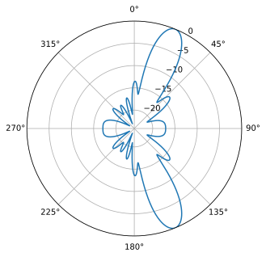

Підходи до формування променя можна розділити на три категорії: звичайне (conventional), адаптивне (adaptive) та сліпе (blind). Звичайне формування променя найбільш корисне, коли ви вже знаєте напрямок приходу бажаного сигналу, і процес формування променя полягає у виборі ваг, які максимізують підсилення решітки в цьому напрямку. Це можна використовувати як на стороні прийому, так і на стороні передачі системи зв'язку. Адаптивне формування променя, з іншого боку, зазвичай передбачає коригування ваг на основі вхідного сигналу формувача променя для оптимізації певного критерію (наприклад, обнулення перешкоди, наявність декількох головних променів тощо). Через замкнутий контур і адаптивну природу адаптивне формування променя, як правило, використовується лише на стороні прийому, тому "вхідним сигналом формувача" є просто ваш прийнятий сигнал, а адаптивне формування променя передбачає коригування ваг на основі статистики цих отриманих даних.

Наведена нижче таксономія намагається класифікувати численні напрямки формування променя, наводячи приклади відповідних методів:

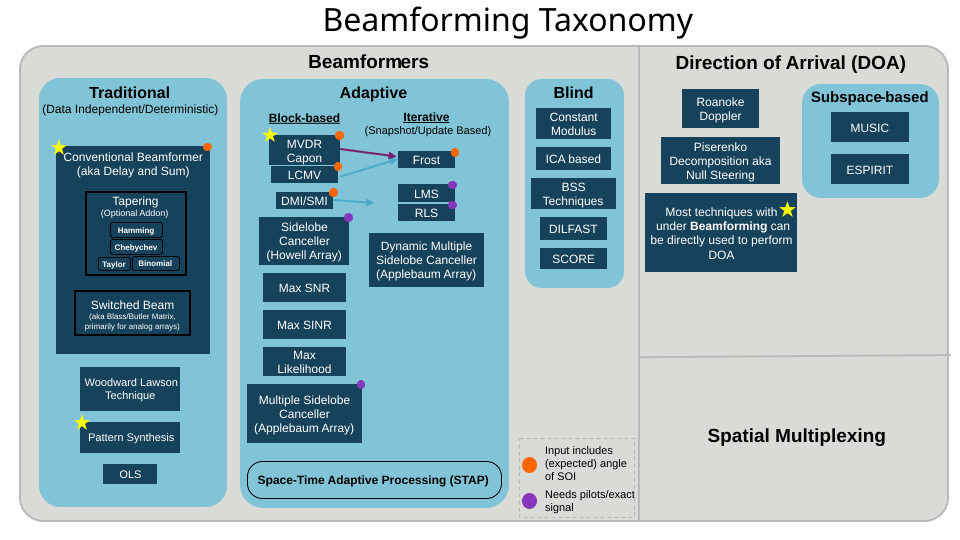

**********************
Огляд пеленгації (DOA)
**********************

Пеленгація, або визначення напрямку приходу (Direction-of-Arrival, DOA), у ЦОС/SDR - це процес використання решітки антен для виявлення та оцінки напрямків приходу одного або декількох сигналів, отриманих цією решіткою (на відміну від формування променя, яке зосереджене на процесі прийому сигналу з відхиленням якомога більшої кількості шуму та перешкод). Хоча DOA, безумовно, підпадає під загальну тему формування променя, ці два терміни можуть заплутувати. Деякі методи, такі як звичайне та MVDR-формування променя, можуть застосовуватися як для DOA, так і для формування променя, оскільки той самий метод, що використовується для формування променя, застосовується для виконання DOA шляхом розгортання кута інтересу та виконання операції формування променя для кожного кута з подальшим пошуком піків у результаті (кожен пік - це сигнал, але ми не знаємо, чи це сигнал, який нас цікавить, перешкода, чи навіть багатопроменеве відбиття сигналу, який нас цікавить). Ці методи DOA можна розглядати як обгортку навколо конкретного формувача променя. Інші формувачі променя не можуть бути просто "обгорнуті" в процедуру DOA, наприклад, через додаткові вхідні дані, які будуть недоступні в контексті DOA. Існують також методи DOA, такі як MUSIC та ESPRIT, які призначені виключно для DOA і не є формувачами променя. Оскільки більшість методів формування променя передбачають, що ви знаєте кут приходу сигналу, який вас цікавить, якщо ціль рухається або рухається решітка, вам доведеться постійно виконувати DOA як проміжний крок, навіть якщо вашою основною метою є прийом і демодуляція сигналу, який вас цікавить.

Фазовані решітки та формування променя/DOA знаходять застосування в найрізноманітніших сферах, хоча найчастіше їх можна побачити в різних видах радарів, нових стандартах WiFi, mmWave-зв'язку в рамках 5G, супутниковому зв'язку та придушенні завад (jamming). Загалом, будь-які застосування, що потребують антени з високим коефіцієнтом підсилення або антени з високим коефіцієнтом підсилення, що швидко рухається, є хорошими кандидатами для використання фазованих решіток.

************
Типи решіток
************

Фазовані решітки можна розділити на три типи:

1. **Аналогові**, також відомі як пасивні електронно-скановані решітки (PESA) або традиційні фазовані решітки, в яких для керування променем використовуються аналогові фазообертачі. На стороні прийому всі елементи підсумовуються після фазового зсуву (і, за бажанням, регульованого підсилення) і перетворюються в один канал, який знижується за частотою та приймається. На стороні передачі відбувається зворотний процес: з цифрової сторони виводиться один цифровий сигнал, а на аналоговій стороні використовуються фазообертачі та каскади підсилення для формування вихідного сигналу, що йде на кожну антену. Ці цифрові фазообертачі мають обмежену розрядність (кількість бітів роздільної здатності) та затримку керування. Величезна перевага аналогового формування променя полягає в тому, що сильні перешкоди можна обнулити в аналоговій області ще до АЦП, що може запобігти насиченню приймача.
2. **Цифрові**, також відомі як активні електронно-скановані решітки (AESA), де кожен окремий елемент має власний радіочастотний тракт, а формування променя виконується повністю в цифровій області. Це найдорожчий підхід, оскільки радіочастотні компоненти дорогі, але він забезпечує набагато більшу гнучкість і швидкість, ніж PESA, і дозволяє використовувати методи адаптивного формування променя, які ми розглянемо далі в цій главі. Цифрові решітки популярні серед SDR, хоча кількість каналів прийому чи передачі SDR обмежує кількість елементів у вашій решітці.
3. **Гібридні**, де решітка складається з багатьох підрешіток, кожна з яких окремо нагадує аналогову решітку, причому кожна підрешітка має власний радіочастотний тракт, так само як і в цифрових решітках. Це найпоширеніший підхід для сучасних фазованих решіток, оскільки він поєднує найкраще з обох світів. Гібридна решітка допускає адаптивні методи, а також може обнуляти сильні перешкоди в аналоговій області ще до АЦП, що особливо важливо для радіолокаційних застосувань, де ціль часто набагато слабша за перешкоди, або для зв'язку у ворожому радіочастотному середовищі.

Зауважте, що терміни PESA та AESA використовуються в основному в контексті радіолокації, і існує певна неоднозначність щодо того, що саме є PESA чи AESA. Тому використання термінів "аналогова/цифрова/гібридна решітка" є більш чітким і застосовним до будь-якого типу застосування.

Приклад реального пристрою кожного типу показано нижче:

.. image:: ../_images/beamforming_examples.svg
   :align: center
   :target: ../_images/beamforming_examples.svg
   :alt: Приклад фазованих решіток, включаючи пасивну решітку з електронним скануванням (PESA), активну решітку з електронним скануванням (AESA), гібридну решітку, показуючи радар MIM-104 Patriot компанії Raytheon, ізраїльський багатоцільовий радар ELM-2084, термінал користувача Starlink, також відомий як Dishy

На додаток до цих трьох типів, існує також геометрія решітки. Найпростіша геометрія - це рівномірна лінійна решітка (Uniform Linear Array, ULA), де антени розташовані по прямій лінії з рівними відстанями (тобто в 1 вимірі). ULA страждають від неоднозначності на 180 градусів, про яку ми поговоримо пізніше, і одне з рішень - розмістити антени по колу, що ми називаємо рівномірною круговою решіткою (Uniform Circular Array, UCA). Нарешті, для 2D-променів ми зазвичай використовуємо рівномірну прямокутну решітку (Uniform Rectangular Array, URA), де антени розташовані у вигляді сітки.

У цій главі ми зосередимося на цифрових решітках, оскільки вони більше підходять для моделювання та ЦОС, але ці концепції застосовні й до аналогових та гібридних решіток. У наступній главі ми попрацюємо безпосередньо з SDR "Phaser" від Analog Devices, який має 10 ГГц 8-елементну аналогову решітку з фазовими та амплітудними зсувачами, підключену до Pluto та Raspberry Pi. Ми також зосередимося на геометрії ULA, оскільки вона забезпечує найпростішу математику й код, але всі концепції поширюються і на інші геометрії, а наприкінці глави ми торкнемося UCA.

*************
Вимоги до SDR
*************

Аналогові фазовані решітки передбачають один фазообертач (а часто й один регульований каскад підсилення) на канал/елемент, реалізований в аналоговій радіочастотній схемотехніці. Це означає, що аналогова фазована решітка - це окремий апаратний пристрій, який має йти разом з SDR, або бути спеціально розробленим для конкретного застосування. З іншого боку, будь-яку SDR, що містить більше одного каналу, можна використовувати як цифрову решітку без додаткового обладнання, за умови, що канали фазово когерентні і дискретизуються з використанням одного й того ж тактового генератора, що зазвичай є справедливим для SDR з кількома вбудованими каналами прийому. Існує багато SDR, що містять **два** канали прийому, наприклад Ettus USRP B210 та Analog Devices Pluto (другий канал виведено за допомогою роз'єму uFL на самій платі). На жаль, вихід за межі двох каналів означає перехід у сегмент SDR вартістю понад $10 тис. (принаймні станом на 2023 рік), наприклад Ettus USRP N310 або Analog Devices QuadMXFE (16 каналів). Основна складність полягає в тому, що недорогі SDR зазвичай не можна "з'єднати в ланцюг" для масштабування кількості каналів. Винятком є KerberosSDR (4 канали) та KrakenSDR (5 каналів), які використовують кілька RTL-SDR зі спільним гетеродином (LO) для формування недорогої цифрової решітки; недоліком є дуже обмежена частота дискретизації (до 2,56 МГц) та діапазон налаштування (до 1766 МГц). Плата KrakenSDR та приклад конфігурації антен показані нижче.

.. image:: ../_images/krakensdr.jpg
   :align: center
   :alt: KrakenSDR
   :target: ../_images/krakensdr.jpg

У цій главі ми не використовуємо жодних конкретних SDR; натомість ми моделюємо прийом сигналів за допомогою Python, а потім розглядаємо ЦОС, що використовується для виконання формування променя/DOA для цифрових решіток.

********************************************
Вступ до матричної математики в Python/NumPy
********************************************

Python має багато переваг перед MATLAB, зокрема те, що він безкоштовний і з відкритим кодом, різноманітність застосувань, жвава спільнота, індексація з 0, як і в більшості інших мов, використання в AI/ML, і, здається, існує бібліотека для будь-чого, що можна собі уявити. Але в чому він програє, так це в тому, як представлені/закодовані операції з матрицями (з точки зору обчислень/швидкості він достатньо швидкий, оскільки функції ефективно реалізовані "під капотом" на C/C++). Не допомагає й те, що існує кілька способів представлення матриць у Python, причому метод :code:`np.matrix` визнано застарілим на користь :code:`np.ndarray`. У цьому розділі ми наведемо короткий огляд матричної математики в Python з використанням NumPy, щоб коли ми дійдемо до прикладів DOA, вам було зручніше.

Почнемо з найдратівливішої частини матричної математики в NumPy: вектори трактуються як 1D-масиви, тому немає способу відрізнити вектор-рядок від вектора-стовпця (за замовчуванням він трактуватиметься як вектор-рядок), тоді як у MATLAB вектор - це 2D-об'єкт. У Python можна створити новий вектор за допомогою :code:`a = np.array([2,3,4,5])` або перетворити список у вектор за допомогою :code:`mylist = [2, 3, 4, 5]`, а потім :code:`a = np.asarray(mylist)`, але як тільки ви захочете виконати будь-яку матричну математику, орієнтація починає мати значення, і ці вектори трактуватимуться як вектори-рядки. Спроба виконати транспонування цього вектора, наприклад за допомогою :code:`a.T`, **не** перетворить його на вектор-стовпець! Спосіб зробити з нормального вектора :code:`a` вектор-стовпець - це використати :code:`a = a.reshape(-1,1)`. Значення :code:`-1` наказує NumPy автоматично визначити розмір цього виміру, залишаючи довжину другого виміру рівною 1. Те, що при цьому створюється, технічно є 2D-масивом, але другий вимір має довжину 1, тому з математичної точки зору він фактично залишається 1D. Це лише один додатковий рядок, але він може добряче збити з пантелику потік коду з матричною математикою.

Тепер швидкий приклад матричної математики в Python: ми помножимо матрицю :code:`3x10` на матрицю :code:`10x1`. Пам'ятайте, що :code:`10x1` означає 10 рядків та 1 стовпець, тобто вектор-стовпець, оскільки це лише один стовпець. Ще зі школи ми знаємо, що це коректне матричне множення, оскільки внутрішні розміри збігаються, а розмір результуючої матриці - це зовнішні розміри, тобто :code:`3x1`. Для зручності ми використаємо :code:`np.random.randn()` для створення матриці :code:`3x10` та :code:`np.arange()` для створення :code:`10x1`:

.. code-block:: python

 A = np.random.randn(3,10) # 3x10
 B = np.arange(10) # 1D array of length 10
 B = B.reshape(-1,1) # 10x1
 C = A @ B # matrix multiply
 print(C.shape) # 3x1
 C = C.squeeze() # see next subsection
 print(C.shape) # 1D array of length 3, easier for plotting and other non-matrix Python code

Після виконання матричної математики ви можете виявити, що ваш результат виглядає приблизно так: :code:`[[ 0.  0.125  0.251  -0.376  -0.251 ...]]`, що явно має лише один вимір даних, але якщо ви спробуєте побудувати графік, ви або отримаєте помилку, або графік, на якому нічого не буде показано. Це тому, що результат технічно є 2D-масивом, і його потрібно перетворити на 1D-масив за допомогою :code:`a.squeeze()`. Функція :code:`squeeze()` видаляє будь-які виміри довжиною 1 і стає в пригоді при виконанні матричної математики в Python. У наведеному вище прикладі результатом буде :code:`[ 0.  0.125  0.251  -0.376  -0.251 ...]` (зверніть увагу на відсутність других дужок), який можна побудувати графічно або використати в іншому Python-коді, що очікує щось одновимірне.

Під час написання коду з матричною математикою найкраща перевірка розсудливості, яку ви можете зробити, - це вивести розміри (за допомогою :code:`A.shape`), щоб переконатися, що вони такі, як ви очікуєте. Варто залишати розмірність у коментарях після кожного рядка для подальшого використання, щоб було легко переконатися, що розміри збігаються під час матричного або поелементного множення.

Нижче наведено кілька загальних операцій як у MATLAB, так і в Python - своєрідну шпаргалку для довідки:

.. list-table::
   :widths: 35 25 40
   :header-rows: 1

   * - Операція
     - MATLAB
     - Python/NumPy
   * - Створити вектор-рядок, розмір :code:`1 x 4`
     - :code:`a = [2 3 4 5];`
     - :code:`a = np.array([2,3,4,5])`
   * - Створити вектор-стовпець, розмір :code:`4 x 1`
     - :code:`a = [2; 3; 4; 5];` або :code:`a = [2 3 4 5].'`
     - :code:`a = np.array([[2],[3],[4],[5]])` або |br| :code:`a = np.array([2,3,4,5])` потім |br| :code:`a = a.reshape(-1,1)`
   * - Створити 2D-матрицю
     - :code:`A = [1 2; 3 4; 5 6];`
     - :code:`A = np.array([[1,2],[3,4],[5,6]])`
   * - Отримати розмір
     - :code:`size(A)`
     - :code:`A.shape`
   * - Транспонування, тобто :math:`A^T`
     - :code:`A.'`
     - :code:`A.T`
   * - Комплексне спряжене транспонування, |br| також зване спряженим транспонуванням, |br| також зване ермітовим транспонуванням, |br| тобто :math:`A^H`
     - :code:`A'`
     - :code:`A.conj().T` |br| |br| (на жаль, для ndarray немає :code:`A.H`)
   * - Поелементне множення
     - :code:`A .* B`
     - :code:`A * B` або :code:`np.multiply(a,b)`
   * - Матричне множення
     - :code:`A * B`
     - :code:`A @ B` або :code:`np.matmul(A,B)`
   * - Скалярний добуток двох векторів (1D)
     - :code:`dot(a,b)`
     - :code:`np.dot(a,b)` (ніколи не використовуйте np.dot для 2D)
   * - Конкатенація
     - :code:`[A A]`
     - :code:`np.concatenate((A,A))`

************************************
Вектор спрямування (Steering Vector)
************************************

Щоб дістатися до цікавої частини, нам потрібно пройти через невелику кількість математики, але наступний розділ написано так, щоб математика була відносно простою і супроводжувалася діаграмами, використовуючи лише найпростіші властивості тригонометрії та експоненти. Важливо розуміти базову математику, що лежить в основі того, що ми будемо робити в Python для виконання DOA.

Розглянемо одновимірну триелементну рівномірно розташовану решітку:

.. image:: ../_images/doa.svg
   :align: center
   :target: ../_images/doa.svg
   :alt: Діаграма, що показує напрямок приходу (DOA) сигналу, який падає на рівномірно розташовану антенну решітку, із зазначенням кута нахилу та відстані між елементами або діафрагмами

У цьому прикладі сигнал надходить справа, тому спочатку він потрапляє на крайній правий елемент. Обчислимо затримку між моментом, коли сигнал потрапляє на цей перший елемент, і моментом, коли він досягає наступного елемента. Це можна зробити, сформувавши наступну тригонометричну задачу - спробуйте уявити, як цей трикутник утворився з наведеної вище діаграми. Відрізок, виділений червоним кольором, показує відстань, яку сигнал має пройти *після* того, як він досяг першого елемента, перш ніж потрапити на наступний.

.. image:: ../_images/doa_trig.svg
   :align: center
   :target: ../_images/doa_trig.svg
   :alt: Тригонометрія, пов'язана з напрямком приходу (DOA) рівномірно розташованої решітки

Якщо ви пам'ятаєте мнемонічне правило SOH CAH TOA, у цьому випадку нас цікавить "прилегла" сторона, і в нас є довжина гіпотенузи (:math:`d`), тому нам потрібно скористатися косинусом:

.. math::
  \cos(90 - \theta) = \frac{\mathrm{adjacent}}{\mathrm{hypotenuse}}

Нам потрібно знайти прилеглу сторону, оскільки саме вона скаже нам, яку відстань має пройти сигнал між потраплянням на перший і другий елемент, тож вона стає прилегла :math:`= d \cos(90 - \theta)`. Тепер існує тригонометрична тотожність, яка дозволяє перетворити це на прилегла :math:`= d \sin(\theta)`. Але це лише відстань, нам потрібно перетворити її на час, використовуючи швидкість світла: минулий час :math:`= d \sin(\theta) / c` секунд. Це рівняння застосовується між будь-якими сусідніми елементами нашої решітки, хоча ми можемо помножити все це на ціле число, щоб обчислити значення для несуміжних елементів, оскільки вони розташовані рівномірно (ми зробимо це пізніше).

Тепер зв'яжемо цю тригонометрію та математику швидкості світла зі світом обробки сигналів. Позначимо наш переданий сигнал на базовій частоті як :math:`x(t)`, і він передається на деякій несучій частоті, :math:`f_c`, тому переданий сигнал дорівнює :math:`x(t) e^{2j \pi f_c t}`. Ми будемо використовувати :math:`d_m` для позначення відстані між антенами в метрах. Скажімо, цей сигнал потрапляє на перший елемент у момент часу :math:`t = 0`, а значить, він потрапляє на наступний елемент через :math:`d_m \sin(\theta) / c` секунд, як ми обчислили вище. Це означає, що 2-й елемент отримує:

.. math::
 x(t - \Delta t) e^{2j \pi f_c (t - \Delta t)}

.. math::
 \mathrm{where} \quad \Delta t = d_m \sin(\theta) / c

пригадайте, що коли є часовий зсув, він віднімається від аргументу часу.

Коли приймач або SDR виконує процес пониження частоти для прийому сигналу, він, по суті, множить його на несучу частоту, але у зворотному напрямку, тож після виконання пониження частоти приймач бачить:

.. math::
 x(t - \Delta t) e^{2j \pi f_c (t - \Delta t)} e^{-2j \pi f_c t}

.. math::
 = x(t - \Delta t) e^{-2j \pi f_c \Delta t}

Тепер ми можемо зробити невеликий трюк, щоб спростити це ще більше: розглянемо, як під час дискретизації сигналу її можна змоделювати, підставивши :math:`t` на :math:`nT`, де :math:`T` - період дискретизації, а :math:`n` - це просто 0, 1, 2, 3... Підставивши це, отримуємо :math:`x(nT - \Delta t) e^{-2j \pi f_c \Delta t}`. Для вузькосмугового сигналу обвідна сигналу змінюється настільки повільно за час затримки поширення :math:`\Delta t`, що ми можемо наближено вважати :math:`x(nT - \Delta t) \approx x(nT)`, залишаючи нам :math:`x(nT) e^{-2j \pi f_c \Delta t}`. Якщо частота дискретизації колись стане достатньо високою, щоб наблизитися до швидкості світла на крихітній відстані, ми зможемо повернутися до цього питання, але пам'ятайте, що наша частота дискретизації повинна бути лише трохи більшою за смугу пропускання сигналу, який нас цікавить.

Продовжимо цю математику, але почнемо представляти речі в дискретних термінах, щоб вона більше нагадувала наш код на Python. Останнє рівняння можна подати наступним чином, підставимо назад :math:`\Delta t`:

.. math::
 x[n] e^{-2j \pi f_c \Delta t}

.. math::
 = x[n] e^{-2j \pi f_c d_m \sin(\theta) / c}

Ми майже закінчили, але, на щастя, є ще одне спрощення, яке ми можемо зробити. Пригадаймо співвідношення між центральною частотою та довжиною хвилі: :math:`\lambda = \frac{c}{f_c}`, або навпаки, :math:`f_c = \frac{c}{\lambda}`. Підставивши це, отримуємо:

.. math::
 x[n] e^{-2j \pi d_m \sin(\theta) / \lambda}

У прикладному формуванні променя та DOA нам зручно представляти :math:`d`, відстань між сусідніми елементами, як частку довжини хвилі (замість метрів). Найпоширеніше значення, що обирається для :math:`d` у процесі проєктування решітки, - це половина довжини хвилі. Незалежно від того, чому дорівнює :math:`d`, надалі ми будемо представляти :math:`d` як частку довжини хвилі замість метрів, що спрощує рівняння та весь наш код. Тобто :math:`d` (без індексу :math:`m`) представляє нормалізовану відстань і дорівнює :math:`d = d_m / \lambda`. Це означає, що ми можемо спростити наведене вище рівняння до:

.. math::
 x[n] e^{-2j \pi d \sin(\theta)}

Наведене вище рівняння стосується сусідніх елементів; для сигналу, отриманого :math:`k`-м елементом, нам просто потрібно помножити :math:`d` на :math:`k`:

.. math::
 x[n] e^{-2j \pi d k \sin(\theta)}

Тепер розглянемо систему координат, яку ми хочемо використовувати. У цьому підручнику 0 градусів буде представляти напрямок, дотичний до розташування решітки (тобто лінії, на якій знаходяться елементи), як показано на діаграмі вище, і кут тета зростатиме за годинниковою стрілкою. Ми також вважатимемо перший/еталонний елемент крайнім лівим, а кожен наступний елемент буде розташований на відстані :math:`d_m` праворуч. Це протилежно до нашої діаграми вище, тому нам потрібно інвертувати напрямок фазового зсуву, тобто прибрати знак мінус:

.. math::
 x[n] e^{2j \pi d k \sin(\theta)}

Ми можемо представити це в матричній формі, просто розташувавши наведене вище рівняння для всіх :code:`Nr` елементів решітки, від :math:`k = 0, 1, ... , N-1`:

.. math::

   x
   \begin{bmatrix}
           e^{2j \pi d (0) \sin(\theta)} \\
           e^{2j \pi d (1) \sin(\theta)} \\
           e^{2j \pi d (2) \sin(\theta)} \\
           \vdots \\
           e^{2j \pi d (N_r - 1) \sin(\theta)} \\
    \end{bmatrix}

де :math:`x` - це одновимірний вектор-рядок, що містить переданий сигнал, а виписаний вектор-стовпець - це те, що ми називаємо "вектором спрямування" (steering vector, часто позначається як :math:`s`, а в коді :code:`s`), і ми представляємо його як масив: одновимірний масив для одновимірної антенної решітки і т.д. Оскільки :math:`e^{0} = 1`, перший елемент вектора спрямування завжди дорівнює 1, а решта - це фазові зсуви відносно першого елемента:

.. math::

   s =
   \begin{bmatrix}
           1 \\
           e^{2j \pi d (1) \sin(\theta)} \\
           e^{2j \pi d (2) \sin(\theta)} \\
           \vdots \\
           e^{2j \pi d (N_r - 1) \sin(\theta)} \\
    \end{bmatrix}

І ось ми закінчили! Цей вектор вище - це те, що ви побачите в наукових статтях з DOA та в реалізаціях ULA всюди! Ви також можете побачити його з :math:`2\pi\sin(\theta)`, вираженим символом на кшталт :math:`\psi`, у цьому випадку вектор спрямування буде просто :math:`e^{jd\psi}`, що є більш загальною формою (ми, однак, не будемо використовувати цю форму). У python :code:`s` це:

.. code-block:: python

 s = [np.exp(2j*np.pi*d*0*np.sin(theta)), np.exp(2j*np.pi*d*1*np.sin(theta)), np.exp(2j*np.pi*d*2*np.sin(theta)), ...] # note the increasing k
 # or
 s = np.exp(2j * np.pi * d * np.arange(Nr) * np.sin(theta)) # where Nr is the number of receive antenna elements

Зверніть увагу, як елемент 0 дає 1+0j (тому що :math:`e^{0}=1`); це має сенс, оскільки все вищенаведене було відносним до цього першого елемента, тож він приймає сигнал таким, яким він є, без будь-яких відносних фазових зсувів. Це чисто те, як виходить математика; насправді будь-який елемент можна було б вважати еталонним, але, як ви побачите в нашій математиці/коді пізніше, важливою є різниця у фазі/амплітуді, отриманій між елементами. Все відносно.

Пам'ятайте, що наше :code:`d` вимірюється в довжинах хвиль, а не в метрах!

**************
Прийом сигналу
**************

Скористаємося концепцією вектора спрямування, щоб змоделювати сигнал, що надходить на решітку. Як переданий сигнал ми поки що просто використаємо тон:

.. code-block:: python

 import numpy as np
 import matplotlib.pyplot as plt

 sample_rate = 1e6
 N = 10000 # number of samples to simulate

 # Create a tone to act as the transmitter signal
 t = np.arange(N)/sample_rate # time vector
 f_tone = 0.02e6
 tx = np.exp(2j * np.pi * f_tone * t)

Тепер змоделюємо решітку, що складається з трьох всеспрямованих антен по прямій лінії, з відстанню в 1/2 довжини хвилі між сусідніми (так звана "інтервал у півхвилі"). Ми змоделюємо сигнал передавача, що надходить на цю решітку під певним кутом, тета. Розуміння вектора спрямування :code:`s` нижче - ось для чого ми пройшли через усю ту математику вище.

.. code-block:: python

 d = 0.5 # half wavelength spacing
 Nr = 3
 theta_degrees = 20 # direction of arrival (feel free to change this, it's arbitrary)
 theta = theta_degrees / 180 * np.pi # convert to radians
 s = np.exp(2j * np.pi * d * np.arange(Nr) * np.sin(theta)) # Steering Vector
 print(s) # note that it's 3 elements long, it's complex, and the first element is 1+0j

Щоб застосувати вектор спрямування, нам потрібно виконати матричне множення :code:`s` і :code:`tx`, тож спочатку перетворимо обидва на 2D, використовуючи підхід, який ми обговорювали раніше, коли розглядали виконання матричної математики в Python. Почнемо з перетворення обох на вектори-стовпці за допомогою :code:`ourarray.reshape(-1,1)`. Потім ми виконуємо матричне множення, позначене символом :code:`@`. Нам також потрібно перетворити :code:`tx` з вектора-рядка на вектор-стовпець за допомогою операції транспонування (уявіть, що він повертається на 90 градусів), щоб внутрішні розміри матричного множення збігалися.

.. code-block:: python

 s = s.reshape(-1,1) # make s a column vector
 print(s.shape) # 3x1
 tx = tx.reshape(1,-1) # make tx a row vector
 print(tx.shape) # 1x10000

 X = s @ tx # Simulate the received signal X through a matrix multiply
 print(X.shape) # 3x10000.  X is now going to be a 2D array, 1D is time and 1D is the spatial dimension

На цьому етапі :code:`X` є 2D-масивом розміром 3 x 10000, оскільки в нас є три елементи решітки та 10000 змодельованих відліків. Ми використовуємо велику літеру :code:`X`, щоб позначити, що це кілька отриманих сигналів, об'єднаних (складених) разом. Ми можемо витягти кожен окремий сигнал і побудувати графік перших 200 відліків; нижче ми побудуємо графік лише дійсної частини, але є ще й уявна частина, як і в будь-якого сигналу на базовій частоті. Однією з дратівливих особливостей матричної математики в Python є необхідність додавати :code:`.squeeze()`, яка видаляє всі виміри довжиною 1, щоб повернутися до звичайного 1D-масиву NumPy, якого очікують побудова графіків та інші операції.

.. code-block:: python

 plt.plot(np.asarray(X[0,:]).squeeze().real[0:200]) # the asarray and squeeze are just annoyances we have to do because we came from a matrix
 plt.plot(np.asarray(X[1,:]).squeeze().real[0:200])
 plt.plot(np.asarray(X[2,:]).squeeze().real[0:200])
 plt.show()

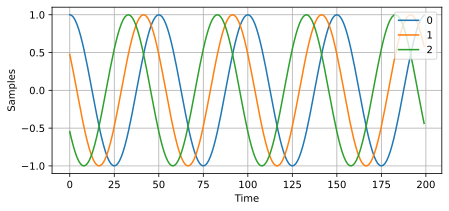

Зверніть увагу на фазові зсуви між елементами, як ми й очікуємо (якщо тільки сигнал не приходить у напрямку нормалі решітки (boresight), у такому разі він досягне всіх елементів одночасно, і зсуву не буде - встановіть theta на 0, щоб побачити це). Спробуйте змінити кут і подивіться, що станеться.

Наостанок додамо шум до цього отриманого сигналу, оскільки будь-який сигнал, з яким ми матимемо справу, містить певну кількість шуму. Ми хочемо застосувати шум після застосування вектора спрямування, тому що кожен елемент відчуває незалежний шумовий сигнал (ми можемо це зробити, оскільки AWGN із застосованим фазовим зсувом усе одно залишається AWGN):

.. code-block:: python

 n = np.random.randn(Nr, N) + 1j*np.random.randn(Nr, N)
 X = X + 0.1*n # X and n are both 3x10000

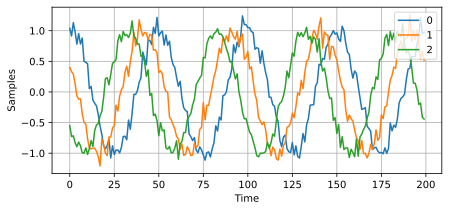

**********************************
Звичайне формування променя та DOA
**********************************

Тепер ми обробимо ці відліки :code:`X`, вдаючи, що не знаємо кута приходу, і виконаємо DOA, що передбачає оцінку кута(ів) приходу за допомогою ЦОС і невеликого коду на Python! Як обговорювалося раніше в цій главі, дії формування променя та виконання DOA дуже схожі і часто базуються на одних і тих самих методах. Протягом решти цієї глави ми дослідимо різні "формувачі променя", і для кожного з них ми почнемо з математики/коду формувача променя, який обчислює ваги, :math:`w`. Ці ваги можна "застосувати" до вхідного сигналу :code:`X` за простим рівнянням :math:`w^H X`, або в Python :code:`w.conj().T @ X`. У наведеному вище прикладі :code:`X` - це матриця :code:`3x10000`, але після застосування ваг ми отримуємо :code:`1x10000`, ніби наш приймач мав лише одну антену, і ми можемо використовувати звичайну ЦОС для радіочастотних сигналів для обробки цього сигналу. Розробивши формувач променя, ми застосуємо його до задачі DOA.

Почнемо зі "звичайного" (conventional) підходу до формування променя, також відомого як формування променя методом затримки та суми (delay-and-sum). Наш вектор ваг :code:`w` має бути одновимірним масивом для рівномірної лінійної решітки; у нашому прикладі з трьома елементами :code:`w` - це масив :code:`3x1` комплексних ваг. При звичайному формуванні променя ми залишаємо величину ваг рівною 1 і коригуємо лише фази так, щоб сигнал конструктивно складався в напрямку нашого бажаного сигналу, який ми позначатимемо :math:`\theta`. Виявляється, що це та сама математика, яку ми виконали вище, тобто наші ваги - це наш вектор спрямування!

.. math::
 w_{conv} = e^{2j \pi d k \sin(\theta)}

або в Python:

.. code-block:: python

 w = np.exp(2j * np.pi * d * np.arange(Nr) * np.sin(theta)) # Conventional, aka delay-and-sum, beamformer
 X_weighted = w.conj().T @ X # example of applying the weights to the received signal (i.e., perform the beamforming)
 print(X_weighted.shape) # 1x10000

де :code:`Nr` - кількість елементів у нашій рівномірній лінійній решітці з відстанню :code:`d` часток довжини хвилі (найчастіше ~0.5). Як бачите, ваги не залежать ні від чого, окрім геометрії решітки та кута інтересу. Якщо наша решітка передбачає калібрування фази, ми б включили і ці калібрувальні значення. Ви могли помітити з рівняння для :code:`w`, що ваги є комплексними, а їхні величини всі дорівнюють одиниці (унітарні).

Але як нам дізнатися кут інтересу :code:`theta`? Ми повинні почати з виконання DOA, що передбачає сканування (вибірку) всіх напрямків приходу від -π до +π (від -180 до +180 градусів), наприклад, із кроком в 1 градус. У кожному напрямку ми обчислюємо ваги за допомогою формувача променя; почнемо зі звичайного формувача променя. Застосування ваг до нашого сигналу :code:`X` дасть нам одновимірний масив відліків, ніби ми отримали його за допомогою однієї спрямованої антени. Потім ми можемо обчислити потужність сигналу, взявши дисперсію за допомогою :code:`np.var()`, і повторити для кожного кута нашого сканування. Ми побудуємо графік результатів і подивимося на нього нашими людськими очима/мозком, але в більшості радіочастотних ЦОС знаходять кут максимальної потужності (за допомогою алгоритму пошуку піків) і називають його оцінкою DOA.

.. code-block:: python

 theta_scan = np.linspace(-1*np.pi, np.pi, 1000) # 1000 different thetas between -180 and +180 degrees
 results = []
 for theta_i in theta_scan:
    w = np.exp(2j * np.pi * d * np.arange(Nr) * np.sin(theta_i)) # Conventional, aka delay-and-sum, beamformer
    X_weighted = w.conj().T @ X # apply our weights. remember X is 3x10000
    results.append(10*np.log10(np.var(X_weighted))) # power in signal, in dB so its easier to see small and large lobes at the same time
 results -= np.max(results) # normalize (optional)

 # print angle that gave us the max value
 print(theta_scan[np.argmax(results)] * 180 / np.pi) # 19.99999999999998

 plt.plot(theta_scan*180/np.pi, results) # lets plot angle in degrees
 plt.xlabel("Theta [Degrees]")
 plt.ylabel("DOA Metric")
 plt.grid()
 plt.show()

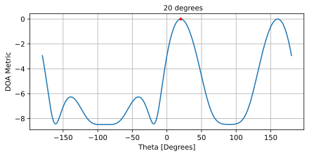

Ми знайшли наш сигнал! Ви, мабуть, уже починаєте розуміти, звідки береться термін "решітка з електронним керуванням". Спробуйте збільшити кількість шуму, щоб перевірити межу можливостей, - можливо, вам знадобиться змоделювати отримання більшої кількості відліків для низьких SNR. Також спробуйте змінити напрямок приходу.

Якщо вам більше подобається переглядати результати DOA на полярному графіку, скористайтеся наступним кодом:

.. code-block:: python

 fig, ax = plt.subplots(subplot_kw={'projection': 'polar'})
 ax.plot(theta_scan, results) # MAKE SURE TO USE RADIAN FOR POLAR
 ax.set_theta_zero_location('N') # make 0 degrees point up
 ax.set_theta_direction(-1) # increase clockwise
 ax.set_rlabel_position(55)  # Move grid labels away from other labels
 plt.show()

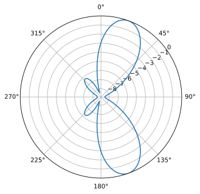

Ми й далі бачитимемо цю схему: перебір кутів у циклі, певний метод обчислення ваг формування променя, а потім застосування їх до отриманого сигналу. У наступному методі формування променя (MVDR) ми будемо використовувати наш отриманий сигнал :code:`X` як частину обчислення ваг, що зробить його адаптивним методом. Але спершу дослідимо кілька цікавих явищ, що відбуваються з фазованими решітками, зокрема чому в нас є другий пік на 160 градусах.

****************************
Неоднозначність 180 градусів
****************************

Поговорімо про те, чому є другий пік на 160 градусах; DOA, який ми змоделювали, становив 20 градусів, і це не випадковість, що 180 - 20 = 160. Уявіть собі три всеспрямовані антени в лінію, розміщені на столі. Нормаль решітки (boresight) розташована під кутом 90 градусів до осі решітки, як позначено на першій діаграмі в цій главі. Тепер уявіть передавач перед антенами, також на (дуже великому) столі, так, що його сигнал надходить під кутом +20 градусів від нормалі. Що ж, решітка бачить той самий ефект незалежно від того, чи сигнал надходить із переду, чи з тилу - фазова затримка однакова, як показано нижче, де елементи решітки позначені червоним, а два можливих DOA передавача - зеленим. Тому, коли ми виконуємо алгоритм DOA, завжди виникатиме така неоднозначність на 180 градусів; єдиний спосіб її уникнути - це мати 2D-решітку або другу 1D-решітку, розташовану під будь-яким іншим кутом відносно першої решітки. Можливо, ви задаєтеся питанням, чи означає це, що можна обчислювати лише від -90 до +90 градусів, щоб заощадити обчислювальні ресурси, - і ви маєте рацію!

.. image:: ../_images/doa_from_behind.svg
   :align: center
   :target: ../_images/doa_from_behind.svg

Спробуймо розгорнути кут приходу (AoA) від -90 до +90 градусів замість того, щоб тримати його постійним на рівні 20:

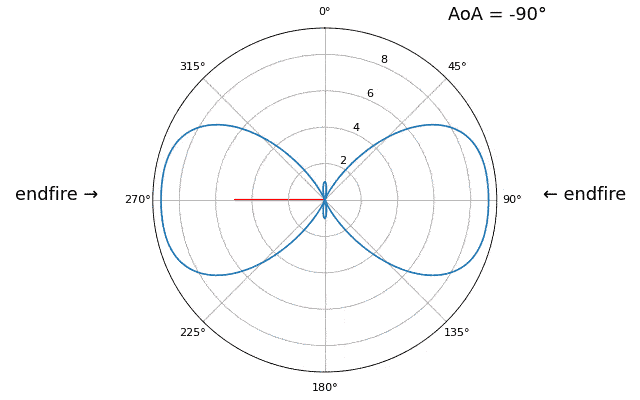

Коли ми наближаємося до "кінцевого вогню" (endfire) решітки, тобто коли сигнал надходить на вісь решітки або поблизу неї, продуктивність падає. Ми спостерігаємо два основних погіршення: 1) головна пелюстка стає ширшою, і 2) виникає неоднозначність, і ми не знаємо, чи сигнал надходить зліва, чи справа. Ця неоднозначність додається до неоднозначності на 180 градусів, обговореної раніше, коли ми отримуємо додаткову пелюстку на 180 - theta, через що певні AoA призводять до трьох пелюсток приблизно однакового розміру. Ця неоднозначність кінцевого вогню має сенс, адже фазові зсуви, що виникають між елементами, ідентичні незалежно від того, чи сигнал надходить зліва, чи справа відносно осі решітки. Так само, як і з неоднозначністю на 180 градусів, рішенням є використання 2D-решітки або двох 1D-решіток під різними кутами. Загалом, формування променя працює найкраще, коли кут ближчий до нормалі решітки.

З цього моменту ми будемо показувати на наших полярних графіках лише діапазон від -90 до +90 градусів, оскільки картина завжди дзеркальна відносно осі решітки, принаймні для 1D лінійних решіток (а це все, що ми розглядаємо в цій главі).

*************************************
Діаграма спрямованості (Beam Pattern)
*************************************

Графіки, які ми показували досі, - це результати DOA; вони відповідають отриманій потужності під кожним кутом після застосування формувача променя. Вони були специфічні для сценарію, що передбачав передавачі, які приходять під певними кутами. Але ми також можемо поглянути на саму діаграму спрямованості, ще до отримання будь-якого сигналу; це іноді називають "власною діаграмою спрямованості антени" (quiescent antenna pattern) або "відгуком решітки" (array response).

Пригадаємо наш вектор спрямування, який ми весь час бачимо,

.. code-block:: python

 np.exp(2j * np.pi * d * np.arange(Nr) * np.sin(theta))

він втілює геометрію ULA, і єдиний інший його параметр - це напрямок, у який ви хочете спрямувати промінь. Ми можемо обчислити та побудувати графік власної діаграми спрямованості антени (відгуку решітки), коли вона спрямована в певному напрямку, що покаже нам природний відгук решітки, якщо ми не виконуємо жодного додаткового формування променя. Це можна зробити, взявши БПФ (FFT) комплексно спряжених ваг - жодного циклу for не потрібно! Складна частина - це доповнення нулями (padding) для підвищення роздільної здатності та відображення бінів БПФ у кут у радіанах або градусах, що передбачає арксинус, як бачите в повному прикладі нижче:

.. code-block:: python

    Nr = 3
    d = 0.5
    N_fft = 512
    theta_degrees = 20 # there is no SOI, we arent processing samples, this is just the direction we want to point at
    theta = theta_degrees / 180 * np.pi
    w = np.exp(2j * np.pi * d * np.arange(Nr) * np.sin(theta)) # conventional beamformer
    w_padded = np.concatenate((w, np.zeros(N_fft - Nr))) # zero pad to N_fft elements to get more resolution in the FFT
    w_fft_dB = 10*np.log10(np.abs(np.fft.fftshift(np.fft.fft(w_padded)))**2) # magnitude of fft in dB
    w_fft_dB -= np.max(w_fft_dB) # normalize to 0 dB at peak

    # Map the FFT bins to angles in radians
    theta_bins = np.arcsin(np.linspace(-1, 1, N_fft)) # in radians

    # find max so we can add it to plot
    theta_max = theta_bins[np.argmax(w_fft_dB)]

    fig, ax = plt.subplots(subplot_kw={'projection': 'polar'})
    ax.plot(theta_bins, w_fft_dB) # MAKE SURE TO USE RADIAN FOR POLAR
    ax.plot([theta_max], [np.max(w_fft_dB)],'ro')
    ax.text(theta_max - 0.1, np.max(w_fft_dB) - 4, np.round(theta_max * 180 / np.pi))
    ax.set_theta_zero_location('N') # make 0 degrees point up
    ax.set_theta_direction(-1) # increase clockwise
    ax.set_rlabel_position(55)  # Move grid labels away from other labels
    ax.set_thetamin(-90) # only show top half
    ax.set_thetamax(90)
    ax.set_ylim([-30, 1]) # because there's no noise, only go down 30 dB
    plt.show()

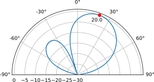

Виявляється, що ця картина майже точно збігається з картиною, яку ви отримуєте при виконанні DOA за допомогою звичайного формувача променя (затримка та сума), коли присутній єдиний тон на `theta_degrees` і мало або зовсім немає шуму. Графік може виглядати по-різному через те, наскільки низько опускається вісь y в дБ, або через розмір БПФ, використаного для створення цієї власної картини відгуку. Спробуйте поекспериментувати з :code:`theta_degrees` або кількістю елементів :code:`Nr`, щоб побачити, як змінюється відгук.

Просто заради цікавості наступна анімація показує діаграму спрямованості звичайного формувача променя для 8-елементної решітки, що скановано від -90 до +90 градусів. Також показано вісім ваг, відображених на комплексній площині (дійсна та уявна осі).

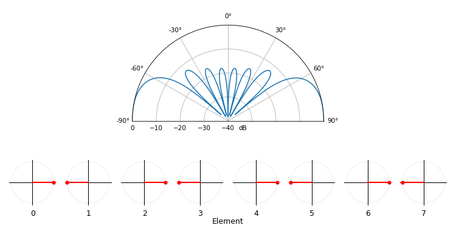

Зверніть увагу, що всі ваги мають одиничну величину (вони залишаються на одиничному колі), а старші за номером елементи "обертаються" швидше. Якщо придивитеся уважно, то помітите, що на 0 градусах вони всі вирівнюються; всі вони дорівнюють фазовому зсуву 0 (1+0j).

****************************************
Ширина променя решітки (Array Beamwidth)
****************************************

Для тих, кому цікаво, існують рівняння, які апроксимують ширину головної пелюстки залежно від кількості елементів, хоча вони добре працюють лише коли кількість елементів велика (наприклад, 8 або більше). Ширина променя за половинною потужністю (half power beamwidth, HPBW) визначається як ширина на рівні -3 дБ від піка головної пелюстки і приблизно дорівнює :math:`\frac{0.9 \lambda}{N_rd\cos(\theta)}` [1], що для відстані у півхвилі спрощується до:

.. math::

 \text{HPBW} \approx \frac{1.8}{N_r\cos(\theta)} \text{ [радіани]} \qquad \text{коли } d = \lambda/2

Ширина променя за першим нулем (first null beamwidth, FNBW), тобто ширина головної пелюстки від нуля до нуля, приблизно дорівнює :math:`\frac{2\lambda}{N_rd}` [1], що для відстані у півхвилі спрощується до:

.. math::

 \text{FNBW} \approx \frac{4}{N_r} \text{ [радіани]} \qquad \text{коли } d = \lambda/2

Скористаємося попереднім кодом, але збільшимо :code:`Nr` до 16 елементів. Використовуючи наведені вище рівняння, HPBW при спрямуванні на 20 градусів (0.35 радіана) має становити приблизно 0.12 радіана, або **6.8 градуса**. FNBW має становити приблизно 0.25 радіана, або **14.3 градуса**. Проведемо симуляцію, щоб побачити, наскільки ми близькі. Для перегляду ширини променя ми зазвичай використовуємо прямокутні графіки замість полярних. Нижче показано результати з позначеними зеленим HPBW і червоним FNBW:

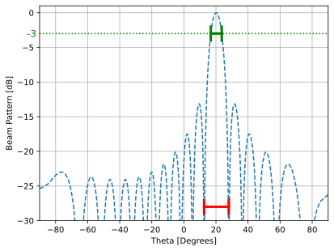

На графіку це може бути важко побачити, але якщо сильно наблизити, виявляється, що HPBW становить близько 6.8 градуса, а FNBW - близько 15.4 градуса, тобто досить близько до наших обчислень, особливо для HPBW!

**********************
Коли d не дорівнює λ/2
**********************

Досі ми використовували відстань між елементами, d, що дорівнює половині довжини хвилі. Так, наприклад, решітка, розроблена для WiFi 2,4 ГГц з відстанню λ/2, матиме відстань 3e8/2.4e9/2 = 12,5 см, або близько 5 дюймів, а значить, решітка 4x4 елементи матиме розмір приблизно 15" x 15" плюс висоту антен. Бувають випадки, коли решітка не може точно забезпечити відстань λ/2, наприклад, коли простір обмежений, або коли одна й та сама решітка повинна працювати на різних несучих частотах.

Розглянемо випадок, коли відстань більша за λ/2, тобто занадто велика, змінюючи d від λ/2 до 4λ. Ми приберемо нижню половину полярного графіка, оскільки вона все одно є дзеркальним відображенням верхньої.

.. image:: ../_images/doa_d_is_large_animation.gif
   :scale: 100 %
   :align: center
   :alt: Анімація напрямку приходу (DOA), яка показує, що відбувається, коли відстань d набагато більша за півхвилі

Як бачите, на додаток до неоднозначності на 180 градусів, обговореної раніше, тепер у нас з'являється додаткова неоднозначність, і вона посилюється зі збільшенням d (утворюються зайві/некоректні пелюстки). Ці додаткові пелюстки відомі як пелюстки решітки (grating lobes), і вони є результатом "просторового аліасингу" (spatial aliasing). Як ми дізналися в главі :ref:`sampling-chapter`, коли ми не дискретизуємо достатньо швидко, виникає аліасинг. Те саме відбувається і в просторовій області; якщо наші елементи розташовані недостатньо близько один до одного відносно несучої частоти сигналу, що спостерігається, ми отримуємо сміттєві результати в нашому аналізі. Можна думати про рознесення антен як про просторову дискретизацію! У цьому прикладі бачимо, що пелюстки решітки не стають надто проблематичними, поки d > λ, але вони з'являються, щойно ви перевищите відстань λ/2. Це тому, що теорема Найквіста стверджує, що ми повинні дискретизувати щонайменше вдвічі частіше, ніж сигнал, який ми спостерігаємо, тобто два відліки за один цикл. Ми вимірюємо нашу просторову частоту дискретизації у відліках на метр, і оскільки еквівалент кутової частоти в просторі дорівнює 2π/λ радіан на метр, а в одному циклі міститься 2π радіан (360 градусів), ми повинні дискретизувати простір щонайменше:

.. math::

 \text{частота просторової дискретизації} \geq 2 \text{ [відліки/цикл]} \cdot \frac{2\pi/\lambda \text{ [радіан/метр]}}{2\pi \text{ [радіан/цикл]}}

  \text{частота просторової дискретизації} \geq 2/\lambda \text{ [відліки/метр]}

або в термінах відстані між елементами, :math:`d`, що по суті є метрами на просторовий відлік:

.. math::

 d \leq \lambda/2

Поки :math:`d \leq \lambda/2`, у нас не буде жодних пелюсток решітки!

А що відбувається, коли d менше за λ/2, наприклад, коли нам потрібно розмістити решітку в невеликому просторі? Ми знаємо, що пелюсток решітки не буде, але станеться дещо інше... Повторимо ту саму симуляцію, але почнемо з 0.5λ і зменшуватимемо :math:`d`:

.. image:: ../_images/doa_d_is_small_animation.gif
   :scale: 100 %
   :align: center
   :alt: Анімація напрямку приходу (DOA), яка показує, що відбувається, коли відстань d набагато менша за півхвилі

Хоча зі зменшенням d головна пелюстка стає ширшою, вона все ще має максимум на 20 градусах, і пелюсток решітки немає, тож теоретично це все ще мало б працювати (принаймні за високого SNR і якщо взаємна індукція між елементами не стає серйозною проблемою). Щоб краще зрозуміти, що ламається, коли d стає занадто малим, повторимо експеримент, але з додатковим сигналом, що надходить з кута -40 градусів:

.. image:: ../_images/doa_d_is_small_animation2.gif
   :scale: 100 %
   :align: center
   :alt: Анімація напрямку приходу (DOA), яка показує, що відбувається, коли відстань d набагато менша за півхвилі і присутні два сигнали

Щойно відстань стає меншою за λ/4, розрізнити два різні шляхи стає неможливо, і решітка працює погано. Як ми побачимо далі в цій главі, існують методи формування променя, що забезпечують точніші промені, ніж звичайне формування променя, але тримати d якомога ближче до λ/2 залишатиметься актуальною темою.

..
   COMMENTED OUT BECAUSE IT"S NOT CLEAR WHAT THIS SECTION IS PROVIDING TO THE READER BESIDES AN ALTERNATIVE EQUATION AND TERM WHICH COULD BE PRESENTED A LOT MORE CONCISE
   **********************
   Bartlett Beamformer
   **********************

   Now that we've covered the basics, we will take a quick detour into some notational and algebraic details of what we just did, to gain knowledge on how to mathematically represent sweeping beams across space in a condensed and elegant manner.  The following algebriac notations renders itself well to vectorization, making it suitable for real-time processing.

   The process of sweeping beams across space to get an estimate of DOA actually has a technical name; it goes by "Bartlett Beamforming" (a.k.a. Fourier beamforming to some, but note that Fourier beamforming can also mean a different technique altogether).  Let's do a quick recap of what we did earlier in order to calculate our DOA, using what we now know is called Bartlett beamforming:

   #. We picked a bunch of directions to point at (e.g., -90 to +90 degrees at some interval)
   #. We calculated the beamforming weights at each direction, to point our beam in that direction
   #. The outputs of the array elements were multiplied with their corresponding wieght, and all results were summed
   #. We calculated the signal power at each direction, then plotted the results
   #. Peaks were found, each one inferring that a signal was likely received from that direction

   We are now going to write the series of steps we just reiterated mathematically.  Let the signal received by the array be represented by the steering vector :math:`\mathbf{s}`. This received signal is a function of the direction of arrival (DOA) of the signal, which we will denote as :math:`\theta`. Let the weight applied to the steering vector be represented by :math:`\mathbf{w}`. The output of the array is the dot product of the steering vector and the weight, which we will denote as :math:`\mathbf{w}^{H} \mathbf{s}`.  Now, the power of the received signal can be obtained by squaring the magnitude of the output of the array. This is represented as :math:`\left| \mathbf{w}^{H} \mathbf{s} \right|^{2} = \mathbf{w}^{H} \mathbf{s} \mathbf{s}^{H} \mathbf{w} = \mathbf{w} \mathbf{R_{ss}} \mathbf{w}`, where :math:`\mathbf{R}` is the spatial covariance matrix estimate. The spatial covariance matrix measures the similarity between the samples received from the different elements of the array. We repeat for each direction we want to scan, but note that the only thing that changes between direction is \mathbf{w}.  We are also free to pick the list of directions, it doesn't have to be a -90 to +90 degree sweep, and we can process them all in parallel if we wish, using the same value of :math:`\mathbf{R}` for all.  This is the essence of Bartlett beamforming, i.e the beam sweep that we described using the earlier generated python code.

   .. math::
      P = \left\| \mathbf{w} \mathbf{s}\right\|^2

      = (\mathbf{w}^H\mathbf{s})(\mathbf{w}^H\mathbf{s})^*

      = \mathbf{s}^H\mathbf{w}\mathbf{w}^H\mathbf{s}

      = \mathbf{s}^H\mathbf{R}\mathbf{s}

   This mathematical representation extends to other DOA techniques as well.

****************************************
Просторове зважування (Spatial Tapering)
****************************************

Просторове зважування (spatial tapering) - це метод, що використовується разом зі звичайним формувачем променя, при якому величина ваг коригується для досягнення певних характеристик. Хоча навіть якщо ви не використовуєте звичайний формувач променя, розуміти концепцію зважування все одно важливо. Пригадайте, що коли ми обчислювали ваги звичайного формувача променя, це була послідовність комплексних чисел, усі величини яких дорівнювали одиниці. При просторовому зважуванні ми будемо множити ваги на скаляри, щоб масштабувати їхню величину. Почнемо з того, що подивимося, що станеться, якщо помножити ваги на випадкові значення від 0 до 1, тобто:

.. code-block:: python

    tapering = np.random.uniform(0, 1, Nr) # random tapering
    w *= tapering

Ми змоделюємо сигнал, що приймається під нормаллю решітки (0 градусів) при високому SNR, щоб побачити, що станеться. Зауважте, що цей процес еквівалентний і матиме той самий результат, що й моделювання власної діаграми спрямованості антени для заданих ваг, як ми обговоримо наприкінці цієї глави.

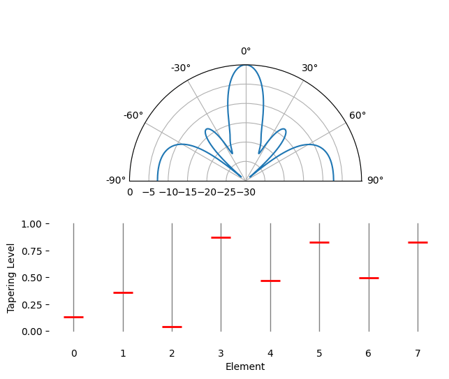

Спробуйте простежити за шириною головної пелюстки та розташуванням нулів.

Виявляється, що зважування може зменшити бічні пелюстки, що часто бажано, шляхом зменшення величини ваг на **краях** решітки. Наприклад, як значення зважування можна використати віконну функцію Хеммінга наступним чином:

.. code-block:: python

    tapering = np.hamming(Nr) # Hamming window function
    w *= tapering

Просто заради цікавості ми перейдемо від використання прямокутного вікна (без вікна) до вікна Хеммінга як функції зважування:

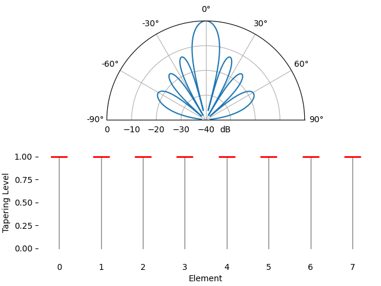

Тут ми помічаємо кілька змін. По-перше, ширину головної пелюстки можна зробити ширшою або вужчою залежно від використаної функції зважування (менше бічних пелюсток зазвичай означає ширшу головну пелюстку). Прямокутне зважування (тобто без зважування) призведе до найвужчої головної пелюстки, але й до найвищих бічних пелюсток. Друге, що ми помічаємо, - це те, що підсилення головної пелюстки зменшується при застосуванні зважування, і це тому, що ми, зрештою, отримуємо менше енергії сигналу, не використовуючи повне підсилення всіх елементів, що може бути суттєвим недоліком у ситуаціях з дуже низьким SNR.

Якщо вам цікаво, чому виникає так багато бічних пелюсток при використанні прямокутного вікна (без зважування), причина та сама, чому прямокутне вікно в часовій області призводить до спектрального витоку в частотній області. Перетворення Фур'є прямокутного вікна - це sinc-функція, :math:`sin(x)/x`, яка має бічні пелюстки, що тягнуться до нескінченності. У решітках ми виконуємо дискретизацію в просторовій області, і діаграма спрямованості - це перетворення Фур'є цього процесу просторової дискретизації у поєднанні з вагами, тому ми й змогли раніше в цій главі побудувати діаграму спрямованості за допомогою БПФ. Пригадайте розділ про віконні функції в главі про частотну область, де ми порівнювали частотну характеристику кожного типу вікна:

.. image:: ../_images/windows.svg
   :align: center
   :target: ../_images/windows.svg

*******************************************
Ручна зміна ваг (Manually Changing Weights)
*******************************************

Звичайний формувач променя дає нам рівняння для обчислення ваг, щоб спрямувати промінь у певному напрямку, але на мить уявімо, що в нас немає жодного методу обчислення ваг, і замість цього ми будемо вручну "гратися" з вагами (як величиною, так і фазою), щоб побачити, що станеться. Нижче наведено невеликий застосунок, написаний на JavaScript, для моделювання діаграми спрямованості 8-елементної решітки, з повзунками для керування підсиленням і фазою кожного елемента. Ви можете спробувати додати зважування або змоделювати менше 8 елементів, обнуливши величину одного або кількох з них.

.. raw:: html

    
<!-- Plotly chart will be drawn inside this DIV -->

     
    Element &nbsp;&nbsp;&nbsp; Magnitude (Gain) &nbsp;&nbsp;&nbsp;&nbsp;&nbsp;&nbsp;&nbsp;&nbsp;&nbsp;&nbsp;&nbsp;&nbsp;&nbsp;&nbsp;&nbsp;&nbsp; Phase
    

    
    

***************************************************
Адаптивне формування променя (Adaptive Beamforming)
***************************************************

Звичайний формувач променя, який ми обговорювали раніше, є простим та ефективним способом виконання формування променя, але має певні обмеження. Наприклад, він погано працює, коли є кілька сигналів, що надходять з різних напрямків, або коли рівень шуму високий. У таких випадках нам потрібно використовувати більш просунуті методи формування променя, які часто називають "адаптивним" формуванням променя. Ідея адаптивного формування променя полягає в тому, щоб використовувати отриманий сигнал для обчислення ваг, замість використання фіксованого набору ваг, як ми робили зі звичайним формувачем променя. Це дозволяє формувачу променя адаптуватися до середовища та забезпечувати кращу продуктивність, оскільки тепер ваги базуються на статистиці отриманих даних.

Методи адаптивного формування променя можна далі розділити на звичайні та методи на основі підпростору (subspace-based). Методи підпростору, такі як MUSIC та ESPRIT, дуже потужні, але вони вимагають оцінки кількості присутніх сигналів, і для їхньої роботи потрібно щонайменше три елементи (хоча рекомендується мати щонайменше чотири).

Перший метод адаптивного формування променя, який ми дослідимо, - це MVDR, який зазвичай є алгоритмом за замовчуванням, коли люди говорять про адаптивне формування променя.

****************************************************
MVDR/Формувач променя Капона (MVDR/Capon Beamformer)
****************************************************

Тепер розглянемо формувач променя, дещо складніший за звичайний метод затримки та суми, але який зазвичай працює значно краще, - формувач променя з мінімальною дисперсією без спотворень (Minimum Variance Distortionless Response, MVDR), також відомий як формувач променя Капона (Capon). Пригадайте, що дисперсія сигналу відповідає тому, скільки потужності міститься в сигналі. Ідея MVDR полягає в тому, щоб утримувати сигнал під кутом інтересу з фіксованим підсиленням 1 (0 дБ), одночасно мінімізуючи загальну дисперсію/потужність результуючого сформованого сигналу. Якщо наш бажаний сигнал утримується фіксованим, то мінімізація загальної потужності означає мінімізацію перешкод і шуму настільки, наскільки це можливо. Його часто називають "статистично оптимальним" формувачем променя.

Формувач променя MVDR/Капона можна узагальнити наступним рівнянням:

.. math::

 w_{mvdr} = \frac{R^{-1} s}{s^H R^{-1} s}

Вектор :math:`s` - це вектор спрямування, що відповідає бажаному напрямку, і про нього йшлося на початку цієї глави. :math:`R` - це оцінка просторової коваріаційної матриці на основі наших отриманих відліків, яку можна знайти за допомогою :code:`R = np.cov(X)` або обчислити вручну, помноживши :code:`X` на її власне комплексне спряжене транспонування, тобто :math:`R = X X^H`. Просторова коваріаційна матриця - це матриця розміром :code:`Nr` x :code:`Nr` (3x3 у прикладах, які ми бачили досі), яка показує, наскільки подібні відліки, отримані з трьох елементів. Хоча це рівняння може спершу здатися заплутаним, корисно знати, що знаменник в основному потрібен для масштабування, а чисельник - це важлива частина, на якій варто зосередитися, - це просто обернена коваріаційна матриця, помножена на вектор спрямування. Тим не менш, нам все одно потрібно включити знаменник, він діє як нормувальна константа, щоб зі зміною :math:`R` з часом величина ваг не змінювалася.

.. raw:: html

   

   
Розгорніть цей розділ, якщо цікавить виведення формули MVDR

**Вихід формувача променя** - Вихід формувача променя з вектором ваг :math:`\mathbf{w}` визначається як:

.. math::

 y(t) = \mathbf{w}^H \mathbf{x}(t)

**Задача оптимізації** - Мета полягає в тому, щоб знайти такі ваги формувача променя, які мінімізують вихідну потужність за умови безспотворної (distortionless) реакції у бажаному напрямку :math:`\theta_0`. Формально задачу можна записати так:

.. math::

 \min_{\mathbf{w}} \, \mathbf{w}^H \mathbf{R} \mathbf{w} \quad \text{subject to} \quad \mathbf{w}^H \mathbf{s} = 1

де:

* :math:`\mathbf{R} = E[\mathbf{X}\mathbf{X}^H]` - коваріаційна матриця прийнятих сигналів
* :math:`\mathbf{s}` - вектор спрямування в напрямку бажаного сигналу :math:`\theta_0`

**Метод множників Лагранжа** - Введемо множник Лагранжа :math:`\lambda` і складемо лагранжіан:

.. math::

 L(\mathbf{w}, \lambda) = \mathbf{w}^H \mathbf{R} \mathbf{w} - \lambda (\mathbf{w}^H \mathbf{s} - 1)

**Розв'язання задачі оптимізації** - Диференціюючи лагранжіан за :math:`\mathbf{w^H}` і прирівнюючи похідну до нуля, отримуємо:

.. math::

 \frac{\partial L}{\partial \mathbf{w}^*} = 2\mathbf{R}\mathbf{w} - \lambda \mathbf{s} = 0

 \mathbf{w} = \lambda \mathbf{R}^{-1} \mathbf{s}

Щоб знайти :math:`\lambda`, застосуємо обмеження :math:`\mathbf{w}^H \mathbf{s} = 1`:

.. math::

 \implies (\lambda \mathbf{s^{H}}\mathbf{{R^{-1}}})s = 1

 \implies \lambda = \frac{1}{\mathbf{s}^{H}\mathbf{R}^{-1}\mathbf{s}}

 \mathbf{R}\mathbf{w} = \lambda \mathbf{s}

 \mathbf{w_{mvdr}} = \frac{\mathbf{R}^{-1} \mathbf{s}}{\mathbf{s}^H \mathbf{R}^{-1} \mathbf{s}}

.. raw:: html

   

Якщо ми вже знаємо напрямок бажаного сигналу, і цей напрямок не змінюється, нам потрібно обчислити ваги лише один раз і просто використовувати їх для прийому бажаного сигналу. Хоча навіть якщо напрямок не змінюється, нам вигідно періодично перераховувати ці ваги, щоб врахувати зміни в перешкодах/шумі, тому ми й називаємо ці нетрадиційні цифрові формувачі променя "адаптивними" - вони використовують інформацію в сигналі, який ми приймаємо, для обчислення найкращих ваг. Просто для нагадування: ми можемо *виконати* формування променя за допомогою MVDR, обчисливши ці ваги і застосувавши їх до сигналу за допомогою :code:`w.conj().T @ X`, точно так само, як ми робили зі звичайним методом, - єдина відмінність полягає у способі обчислення ваг.

Щоб виконати DOA за допомогою формувача променя MVDR, ми просто повторюємо обчислення MVDR, сканую всі кути інтересу. Тобто ми вдаємо, що наш сигнал надходить під кутом :math:`\theta`, навіть якщо це не так. Під кожним кутом ми обчислюємо ваги MVDR, потім застосовуємо їх до отриманого сигналу, а потім обчислюємо потужність сигналу. Кут, що дає нам найвищу потужність, є нашою оцінкою DOA, або, ще краще, ми можемо побудувати графік потужності як функції кута, щоб побачити діаграму спрямованості, як ми зробили вище зі звичайним формувачем променя; так нам не потрібно припускати, скільки сигналів присутні.

У Python ми можемо реалізувати формувач променя MVDR/Капона наступним чином, це буде зроблено у вигляді функції, щоб її було легко використовувати надалі:

.. code-block:: python

 # theta is the direction of interest, in radians, and X is our received signal
 def w_mvdr(theta, X):
    s = np.exp(2j * np.pi * d * np.arange(Nr) * np.sin(theta)) # steering vector in the desired direction theta
    s = s.reshape(-1,1) # make into a column vector (size 3x1)
    R = (X @ X.conj().T)/X.shape[1] # Calc covariance matrix. gives a Nr x Nr covariance matrix of the samples
    Rinv = np.linalg.pinv(R) # 3x3. pseudo-inverse tends to work better/faster than a true inverse
    w = (Rinv @ s)/(s.conj().T @ Rinv @ s) # MVDR/Capon equation! numerator is 3x3 * 3x1, denominator is 1x3 * 3x3 * 3x1, resulting in a 3x1 weights vector
    return w

Використовуючи цей формувач променя MVDR в контексті DOA, отримуємо наступний приклад на Python:

.. code-block:: python

 theta_scan = np.linspace(-1*np.pi, np.pi, 1000) # 1000 different thetas between -180 and +180 degrees
 results = []
 for theta_i in theta_scan:
    w = w_mvdr(theta_i, X) # 3x1
    X_weighted = w.conj().T @ X # apply weights
    power_dB = 10*np.log10(np.var(X_weighted)) # power in signal, in dB so its easier to see small and large lobes at the same time
    results.append(power_dB)
 results -= np.max(results) # normalize

Застосувавши це до попередньої симуляції прикладу DOA, отримуємо наступне:

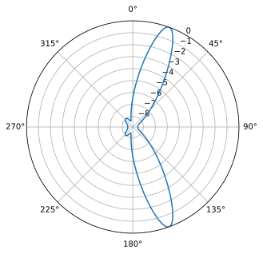

Схоже, що це працює нормально, але щоб дійсно порівняти цей метод з іншими, нам потрібно створити цікавішу задачу. Налаштуємо симуляцію з 8-елементною решіткою, що приймає три сигнали з різних кутів: 20, 25 і 40 градусів, причому сигнал під кутом 40 градусів приймається зі значно нижчою потужністю, ніж два інші, щоб трохи ускладнити задачу. Нашою метою буде виявити всі три сигнали, тобто ми хочемо бачити помітні піки (достатньо високі, щоб алгоритм пошуку піків міг їх виділити). Код для генерації цього нового сценарію такий:

.. code-block:: python

 Nr = 8 # 8 elements
 theta1 = 20 / 180 * np.pi # convert to radians
 theta2 = 25 / 180 * np.pi
 theta3 = -40 / 180 * np.pi
 s1 = np.exp(2j * np.pi * d * np.arange(Nr) * np.sin(theta1)).reshape(-1,1) # 8x1
 s2 = np.exp(2j * np.pi * d * np.arange(Nr) * np.sin(theta2)).reshape(-1,1)
 s3 = np.exp(2j * np.pi * d * np.arange(Nr) * np.sin(theta3)).reshape(-1,1)
 # we'll use 3 different frequencies.  1xN
 tone1 = np.exp(2j*np.pi*0.01e6*t).reshape(1,-1)
 tone2 = np.exp(2j*np.pi*0.02e6*t).reshape(1,-1)
 tone3 = np.exp(2j*np.pi*0.03e6*t).reshape(1,-1)
 X = s1 @ tone1 + s2 @ tone2 + 0.1 * s3 @ tone3 # note the last one is 1/10th the power
 n = np.random.randn(Nr, N) + 1j*np.random.randn(Nr, N)
 X = X + 0.05*n # 8xN

Цей код можна розмістити на початку вашого скрипта, оскільки ми генеруємо інший сигнал, ніж у початковому прикладі. Якщо ми запустимо наш формувач променя MVDR на цьому новому сценарії, отримаємо наступні результати:

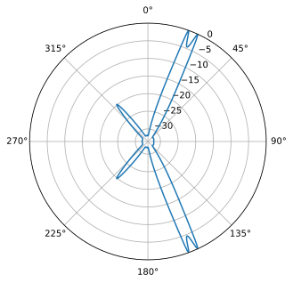

Це працює досить добре: ми бачимо два сигнали, отримані лише з різницею у 5 градусів, а також бачимо 3-й сигнал (на -40, або 320 градусах), отриманий з потужністю в десять разів меншою, ніж інші. Тепер запустимо звичайний формувач променя на цьому новому сценарії:

Хоча це може виглядати як гарна фігура, вона взагалі не знаходить усі три сигнали... Порівнюючи ці два результати, ми бачимо перевагу використання більш складного та "адаптивного" формувача променя.

Як швидкий відступ для зацікавленого читача: насправді існує оптимізація, яку можна зробити під час виконання DOA за допомогою MVDR, використовуючи один трюк. Пригадайте, що ми обчислюємо потужність сигналу, беручи дисперсію, яка є середнім квадратом величини (за умови, що середнє значення нашого сигналу дорівнює нулю, що майже завжди справедливо для радіочастотного сигналу на базовій частоті). Ми можемо представити взяття потужності нашого сигналу після застосування ваг як:

.. math::

 P_{mvdr} = \frac{1}{N} \sum_{n=0}^{N-1} \left| w^H_{mvdr} r_n \right|^2

Якщо ми перейдемо від суми до оператора математичного сподівання і підставимо рівняння для ваг MVDR, отримаємо:

.. math::

   P_{mvdr} = E \left( \left| w^H_{mvdr} X_n \right| ^2 \right)

   = w^H_{mvdr} E \left( X X^H \right) w_{mvdr}

   = w^H_{mvdr} R w_{mvdr}

   = \frac{s^H R^{-1} s}{s^H R^{-1} s} \cdot R \cdot \frac{R^{-1} s}{s^H R^{-1} s}

   = \frac{s^H R^{-1} s}{(s^H R^{-1} s)(s^H R^{-1} s)}

   = \frac{1}{s^H R^{-1} s}

Це означає, що нам взагалі не потрібно застосовувати ваги: це кінцеве рівняння для потужності вище можна використовувати безпосередньо в нашому скануванні DOA, заощаджуючи певні обчислення:

.. code-block:: python

    def power_mvdr(theta, X):
        s = np.exp(2j * np.pi * d * np.arange(X.shape[0]) * np.sin(theta)) # steering vector in the desired direction theta_i
        s = s.reshape(-1,1) # make into a column vector (size 3x1)
        R = (X @ X.conj().T)/X.shape[1] # Calc covariance matrix. gives a Nr x Nr covariance matrix of the samples
        Rinv = np.linalg.pinv(R) # 3x3. pseudo-inverse tends to work better than a true inverse
        return 1/(s.conj().T @ Rinv @ s).squeeze()

Щоб використати це в попередній симуляції, всередині циклу for залишається зробити лише :code:`10*np.log10()`, і все - жодних ваг застосовувати не потрібно, ми пропустили обчислення ваг!

Існує ще багато формувачів променя, але далі ми зробимо паузу, щоб обговорити, як кількість елементів впливає на нашу здатність виконувати формування променя та DOA.

****************************************
Коваріаційна матриця (Covariance Matrix)
****************************************

Приділимо трохи часу обговоренню просторової коваріаційної матриці, яка є ключовим поняттям в *адаптивному* формуванні променя. Коваріаційна матриця - це математичне представлення подібності між парами елементів у випадковому векторі (у нашому випадку - це елементи нашої решітки, тому ми називаємо її *просторовою* коваріаційною матрицею). Коваріаційна матриця завжди квадратна, а значення на діагоналі відповідають коваріації кожного елемента із самим собою. Ми обчислюємо *оцінку* просторової коваріаційної матриці; це лише оцінка, оскільки в нас обмежена кількість відліків.

Загалом, коваріаційна матриця визначається як:

:math:`\mathrm{cov}(X) = E \left[ (X - E[X])(X - E[X])^H \right]`

для бездротових сигналів на базовій частоті :math:`E[X]` зазвичай дорівнює нулю або дуже близьке до нуля, тож це спрощується до:

:math:`\mathrm{cov}(X) = E[X X^H]`

Маючи обмежену кількість IQ-відліків, :math:`\boldsymbol{X}`, ми можемо оцінити цю коваріацію, яку позначимо як :math:`\hat{R}`:

.. math::

 \hat{R} = \frac{\boldsymbol{X} \boldsymbol{X}^H}{N}

         = \frac{1}{N} \sum^N_{n=1} X_n X_n^H

де :math:`N` - кількість відліків (не кількість елементів). У Python це виглядає так:

:code:`R = (X @ X.conj().T)/X.shape[1]`

Крім того, можна використати вбудовану функцію NumPy:

:code:`R = np.cov(X)`

Як приклад розглянемо просторову коваріаційну матрицю для сценарію, де ми мали лише один передавач і три елементи:

.. code-block:: python

   [[ 1.494+0.j    0.486+0.881j -0.543+0.839j]
    [ 0.486-0.881j 1.517 +0.j    0.483+0.886j]
    [-0.543-0.839j 0.483-0.886j  1.499+0.j   ]]

Зверніть увагу, як діагональні елементи є дійсними та приблизно однаковими; це тому, що вони насправді просто повідомляють нам про потужність отриманого сигналу на кожному елементі, яка буде приблизно однаковою між елементами, оскільки всі вони налаштовані на однакове підсилення. Позадіагональні елементи - це насправді ті, де містяться важливі значення, хоча погляд на сирі значення не каже нам багато, окрім того, що між елементами є значна кореляція.

У рамках адаптивного формування променя ви побачите закономірність, коли ми беремо обернену просторову кореляційну матрицю. Ця обернена матриця показує нам, як два елементи пов'язані один з одним після усунення впливу інших елементів. У статистиці її називають "матрицею точності" (precision matrix), а в радіолокації - "вибілювальною матрицею" (whitening matrix).

***************************************
LCMV-формувач променя (LCMV Beamformer)
***************************************

Хоча MVDR потужний, що робити, якщо в нас більше одного бажаного сигналу (SOI)? На щастя, з невеликою модифікацією MVDR ми можемо реалізувати схему, яка обробляє кілька SOI, - формувач променя з лінійно обмеженою мінімальною дисперсією (Linearly Constrained Minimum Variance, LCMV). Це узагальнення MVDR, де ми задаємо бажаний відгук для кількох напрямків, щось на кшталт просторової версії функції :code:`firwin2()` з SciPy для тих, хто з нею знайомий. Оптимальний вектор ваг для формувача променя LCMV можна узагальнити наступним рівнянням:

.. math::

   w_{lcmv} = R^{-1} C [C^H R^{-1} C]^{-1} f

де :math:`C` - це матриця, що складається з векторів спрямування відповідних SOI та перешкод, а :math:`f` - вектор бажаного відгуку. Вектор :math:`f` для конкретного рядка приймає значення 0, коли відповідний вектор спрямування потрібно обнулити, і приймає значення 1, коли ми хочемо, щоб на нього був спрямований промінь. Наприклад, якщо в нас є два бажані джерела та два джерела перешкод, ми можемо встановити :code:`f = [1,1,0,0]`. Формувач променя LCMV - це потужний інструмент, який можна використовувати для придушення перешкод і шуму з кількох напрямків, одночасно посилюючи бажаний сигнал з кількох напрямків. Заковика в тому, що загальна кількість нулів і променів, які можна сформувати одночасно, обмежена розміром решітки (кількістю елементів). Крім того, вам потрібно сформувати вектор спрямування для кожного з SOI та перешкод, що не завжди легко доступно в практичних застосуваннях. Коли замість цього використовуються оцінки, продуктивність формувача променя LCMV може погіршитися. Саме тому ми віддаємо перевагу керуванню нулями за допомогою просторової коваріаційної матриці :math:`R` (на основі статистики отриманого сигналу), а не "жорсткому" завданню нулів шляхом оцінки AoA перешкоди (яка може містити похибку) та формування вектора спрямування в цьому напрямку з доданим 0 у :math:`f`.

Що стосується виконання LCMV у Python, це дуже схоже на MVDR, але нам потрібно задати :code:`C`, яка складається з потенційно кількох векторів спрямування, і :code:`f`, що є одновимірним масивом одиниць і нулів, як згадувалося раніше. Наступний фрагмент коду демонструє, як реалізувати формувач променя LCMV для двох SOI (15 та 60 градусів); пригадайте, що MVDR підтримує лише 1 SOI за раз. Тому наше :code:`f = [1; 1]` без нулів, оскільки ми не будемо включати жодних "жорстко заданих" нулів. Ми змоделюємо сценарій із чотирма перешкодами, що надходять з кутів -60, -30, 0 та 30 градусів.

.. code-block:: python

    # Let's point at the SOI at 15 deg, and another potential SOI that we didn't actually simulate at 60 deg
    soi1_theta = 15 / 180 * np.pi # convert to radians
    soi2_theta = 60 / 180 * np.pi

    # LCMV weights
    R_inv = np.linalg.pinv(np.cov(X)) # 8x8
    s1 = np.exp(2j * np.pi * d * np.arange(Nr) * np.sin(soi1_theta)).reshape(-1,1) # 8x1
    s2 = np.exp(2j * np.pi * d * np.arange(Nr) * np.sin(soi2_theta)).reshape(-1,1) # 8x1
    C = np.concatenate((s1, s2), axis=1) # 8x2
    f = np.ones(2).reshape(-1,1) # 2x1

    # LCMV equation
    #    8x8   8x2                    2x8        8x8   8x2  2x1
    w = R_inv @ C @ np.linalg.pinv(C.conj().T @ R_inv @ C) @ f # output is 8x1

Ми можемо побудувати діаграму спрямованості :code:`w`, використовуючи метод БПФ, показаний раніше:

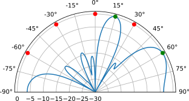

Як бачите, у нас є промені, спрямовані на два бажані напрямки, і нулі в місцях розташування перешкод (як і з MVDR, нам не потрібно повідомляти йому, де знаходяться випромінювачі, він визначає це на основі отриманого сигналу). На графік додано зелені та червоні точки, щоб показати AoA SOI та перешкод відповідно.

.. raw:: html

   

   
Розгорніть цей розділ, щоб побачити повний код

.. code-block:: python

    # Simulate received signal
    Nr = 8 # 8 elements
    theta1 = -60 / 180 * np.pi # convert to radians
    theta2 = -30 / 180 * np.pi
    theta3 = 0 / 180 * np.pi
    theta4 = 30 / 180 * np.pi
    s1 = np.exp(2j * np.pi * d * np.arange(Nr) * np.sin(theta1)).reshape(-1,1) # 8x1
    s2 = np.exp(2j * np.pi * d * np.arange(Nr) * np.sin(theta2)).reshape(-1,1)
    s3 = np.exp(2j * np.pi * d * np.arange(Nr) * np.sin(theta3)).reshape(-1,1)
    s4 = np.exp(2j * np.pi * d * np.arange(Nr) * np.sin(theta4)).reshape(-1,1)
    # we'll use 3 different frequencies.  1xN
    tone1 = np.exp(2j*np.pi*0.01e6*t).reshape(1,-1)
    tone2 = np.exp(2j*np.pi*0.02e6*t).reshape(1,-1)
    tone3 = np.exp(2j*np.pi*0.03e6*t).reshape(1,-1)
    tone4 = np.exp(2j*np.pi*0.04e6*t).reshape(1,-1)
    X = s1 @ tone1 + s2 @ tone2 + s3 @ tone3 + s4 @ tone4
    n = np.random.randn(Nr, N) + 1j*np.random.randn(Nr, N)
    X = X + 0.5*n # 8xN

    # Let's point at the SOI at 15 deg, and another potential SOI that we didn't actually simulate at 60 deg
    soi1_theta = 15 / 180 * np.pi # convert to radians
    soi2_theta = 60 / 180 * np.pi

    # LCMV weights
    R_inv = np.linalg.pinv(np.cov(X)) # 8x8
    s1 = np.exp(2j * np.pi * d * np.arange(Nr) * np.sin(soi1_theta)).reshape(-1,1) # 8x1
    s2 = np.exp(2j * np.pi * d * np.arange(Nr) * np.sin(soi2_theta)).reshape(-1,1) # 8x1
    C = np.concatenate((s1, s2), axis=1) # 8x2
    f = np.ones(2).reshape(-1,1) # 2x1

    # LCMV equation
    #    8x8   8x2                    2x8        8x8   8x2  2x1
    w = R_inv @ C @ np.linalg.pinv(C.conj().T @ R_inv @ C) @ f # output is 8x1

    # Plot beam pattern
    w = w.squeeze() # reduce to a 1D array
    N_fft = 1024
    w_padded = np.concatenate((w, np.zeros(N_fft - Nr))) # zero pad to N_fft elements to get more resolution in the FFT
    w_fft_dB = 10*np.log10(np.abs(np.fft.fftshift(np.fft.fft(w_padded)))**2) # magnitude of fft in dB
    w_fft_dB -= np.max(w_fft_dB) # normalize to 0 dB at peak
    theta_bins = np.arcsin(np.linspace(-1, 1, N_fft)) # Map the FFT bins to angles in radians

    fig, ax = plt.subplots(subplot_kw={'projection': 'polar'})
    ax.plot(theta_bins, w_fft_dB) # MAKE SURE TO USE RADIAN FOR POLAR
    # Add dots where interferers and SOIs are
    ax.plot([theta1], [0], 'or')
    ax.plot([theta2], [0], 'or')
    ax.plot([theta3], [0], 'or')
    ax.plot([theta4], [0], 'or')
    ax.plot([soi1_theta], [0], 'og')
    ax.plot([soi2_theta], [0], 'og')
    ax.set_theta_zero_location('N') # make 0 degrees point up
    ax.set_theta_direction(-1) # increase clockwise
    ax.set_thetagrids(np.arange(-90, 105, 15)) # it's in degrees
    ax.set_rlabel_position(55)  # Move grid labels away from other labels
    ax.set_thetamin(-90) # only show top half
    ax.set_thetamax(90)
    ax.set_ylim([-30, 1]) # because there's no noise, only go down 30 dB
    plt.show()

.. raw:: html

   

Існує особливий випадок використання LCMV, про який ви, можливо, вже подумали: скажімо, замість того, щоб спрямовувати головний промінь точно на 20 градусів, наприклад, ви хочете отримати промінь ширший за той, який зазвичай забезпечує звичайний формувач променя. Це можна зробити, встановивши вектор бажаного відгуку :code:`f` як вектор одиниць у діапазоні кутів (наприклад, кілька значень від 10 до 30 градусів) та нулів усюди інде. Це потужний інструмент, який можна використовувати для створення діаграми спрямованості, ширшої за головну пелюстку звичайного формувача променя, що завжди є плюсом у реальних сценаріях, де точний кут приходу невідомий. Такий самий підхід можна використати для створення нуля в певному напрямку, розтягнутого на відносно широкий діапазон кутів. Просто пам'ятайте, що це використає кілька ступенів вільності! Як приклад цього підходу, змоделюємо 18-елементну решітку та спрямуємо кут інтересу від 15 до 30 градусів, використовуючи 4 різні тета, а нуль - від 45 до 60 градусів, також використовуючи 4 різні тета. Ми не будемо моделювати жодних реальних перешкод.

.. code-block:: python

    Nr = 18
    X = np.random.randn(Nr, N) + 1j*np.random.randn(Nr, N) # Simulate received signal of just noise

    # Let's point at the SOI from 15 to 30 degrees using 4 different thetas
    soi_thetas = np.linspace(15, 30, 4) / 180 * np.pi # convert to radians

    # Let's make a null from 45 to 60 degrees using 4 different thetas
    null_thetas = np.linspace(45, 60, 4) / 180 * np.pi # convert to radians

    # LCMV weights
    R_inv = np.linalg.pinv(np.cov(X))
    s = []
    for soi_theta in soi_thetas:
        s.append(np.exp(2j * np.pi * d * np.arange(Nr) * np.sin(soi_theta)).reshape(-1,1))
    for null_theta in null_thetas:
        s.append(np.exp(2j * np.pi * d * np.arange(Nr) * np.sin(null_theta)).reshape(-1,1))
    C = np.concatenate(s, axis=1)
    f = np.asarray([1]*len(soi_thetas) + [0]*len(null_thetas)).reshape(-1,1)
    w = R_inv @ C @ np.linalg.pinv(C.conj().T @ R_inv @ C) @ f # LCMV equation

    # Plot beam pattern as before...

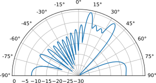

Промінь та нуль розтягнуті на запитаний нами діапазон! Спробуйте змінити кількість значень тета для головного променя та/або нуля, а також кількість елементів, щоб побачити, чи здатні отримані ваги задовольнити бажаний відгук.

********************************
Керування нулями (Null Steering)
********************************

Тепер, коли ми розглянули LCMV, варто дослідити простіший метод, який можна використовувати як в аналогових, так і в цифрових решітках, - керування нулями (null steering). Думайте про нього як про розширення звичайного формувача променя, але, окрім спрямування променя в напрямку інтересу, ми також можемо розмістити нулі під конкретними кутами. Цей метод не передбачає зміни ваг на основі отриманого сигналу (наприклад, ми ніколи не обчислюємо :code:`R`), і тому не вважається адаптивним. У симуляції нижче нам навіть не потрібно моделювати сигнал: ми можемо просто сформувати ваги нашого формувача променя за допомогою керування нулями, щоб розмістити нулі під заздалегідь визначеними кутами, а потім візуалізувати діаграму спрямованості.

Ваги для керування нулями обчислюються, починаючи зі звичайного формувача променя, спрямованого в напрямок інтересу, а потім ми використовуємо рівняння придушення бічної пелюстки (sidelobe-canceler), щоб оновити ваги, включивши нулі, по одному за раз. Рівняння придушення бічної пелюстки таке:

.. math::

 w_{\text{new}} = w_{\text{orig}} - \frac{w_{\text{null}}^H w_{\text{orig}}}{w_{\text{null}}^H w_{\text{null}}} w_{\text{null}}

де :math:`w_{\text{null}}` - вектор спрямування в напрямку нуля, який ми хочемо додати до :math:`w_{\text{orig}}`. Ваги оновлюються шляхом віднімання масштабованого вектора спрямування нуля від поточних ваг. Масштабувальний коефіцієнт обчислюється проєктуванням поточних ваг на вектор спрямування нуля та діленням на проєкцію вектора спрямування нуля на самого себе. Це потім повторюється для кожного напрямку нуля (:math:`w_{\text{orig}}` спочатку дорівнює вагам звичайного формування променя, але потім оновлюється після додавання кожного нуля). Повний процес виглядає так:

.. math::

 \text{1:} \qquad w_{\text{orig}} = e^{2j \pi d k \sin(\theta_{SOI})} \qquad

 \text{2:} \qquad w_{\text{null}} = e^{2j \pi d k \sin(\theta_{null})} \qquad

 \text{3:} \qquad w_{\text{new}} = w_{\text{orig}} - \frac{w_{\text{null}}^H w_{\text{orig}}}{w_{\text{null}}^H w_{\text{null}}} w_{\text{null}}

 \text{4:} \qquad w_{\text{orig}} = w_{\text{new}} \qquad \qquad \qquad

 \text{5:} \qquad \text{ПЕРЕЙТИ до 2, щоб додати наступний нуль}

Змоделюємо 8-елементну решітку та розмістимо чотири нулі:

.. code-block:: python

    d = 0.5
    Nr = 8

    theta_soi = 30 / 180 * np.pi # convert to radians
    nulls_deg = [-60, -30, 0, 60] # degrees
    nulls_rad = np.asarray(nulls_deg) / 180 * np.pi

    # Start out with conventional beamformer pointed at theta_soi
    w = np.exp(2j * np.pi * d * np.arange(Nr) * np.sin(theta_soi)).reshape(-1,1)

    # Loop through nulls
    for null_rad in nulls_rad:
        # weights equal to steering vector in target null direction
        w_null = np.exp(2j * np.pi * d * np.arange(Nr) * np.sin(null_rad)).reshape(-1,1)

        # scaling_factor (complex scalar) for w at nulled direction
        scaling_factor = w_null.conj().T @ w / (w_null.conj().T @ w_null)
        print("scaling_factor:", scaling_factor, scaling_factor.shape)

        # Update weights to include the null
        w = w - w_null @ scaling_factor # sidelobe-canceler equation

    # Plot beam pattern
    N_fft = 1024
    w_padded = np.concatenate((w.squeeze(), np.zeros(N_fft - Nr))) # zero pad to N_fft elements to get more resolution in the FFT
    w_fft_dB = 10*np.log10(np.abs(np.fft.fftshift(np.fft.fft(w_padded)))**2) # magnitude of fft in dB
    w_fft_dB -= np.max(w_fft_dB) # normalize to 0 dB at peak
    theta_bins = np.arcsin(np.linspace(-1, 1, N_fft)) # Map the FFT bins to angles in radians

    fig, ax = plt.subplots(subplot_kw={'projection': 'polar'})
    ax.plot(theta_bins, w_fft_dB)
    # Add dots where nulls and SOI are
    for null_rad in nulls_rad:
        ax.plot([null_rad], [0], 'or')
    ax.plot([theta_soi], [0], 'og')
    ax.set_theta_zero_location('N') # make 0 degrees point up
    ax.set_theta_direction(-1) # increase clockwise
    ax.set_thetagrids(np.arange(-90, 105, 15)) # it's in degrees
    ax.set_rlabel_position(55) # Move grid labels away from other labels
    ax.set_thetamin(-90) # only show top half
    ax.set_thetamax(90)
    ax.set_ylim([-40, 1]) # because there's no noise, only go down -40 dB
    plt.show()

Отримуємо наступну діаграму спрямованості. Ви можете помітити нулі в позиціях, які ви не запитували; це очікувано і є результатом обмеженої кількості елементів. Ви також можете виявити, що при занадто малій кількості елементів у вас або немає нулів/променя точно там, де ви хотіли, або їх взагалі неможливо розмістити відповідно до критеріїв через нестачу ступенів вільності (кількість елементів мінус 1).

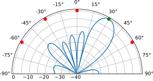

*****
MUSIC
*****

Тепер ми змінимо напрямок і поговоримо про інший тип формувача променя. Усі попередні підпадали під категорію "затримка та сума", але зараз ми зануримося в методи "підпростору" (sub-space). Вони передбачають поділ підпростору сигналу та підпростору шуму, а це означає, що ми повинні оцінити, скільки сигналів приймає решітка, щоб отримати хороший результат. Метод класифікації множинних сигналів (MUltiple SIgnal Classification, MUSIC) - дуже популярний метод підпростору, що передбачає обчислення власних векторів коваріаційної матриці (що, до речі, є обчислювально інтенсивною операцією). Ми розділяємо власні вектори на дві групи: підпростір сигналу та підпростір шуму, а потім проєктуємо вектори спрямування в підпростір шуму і шукаємо нулі. Спочатку це може здатися заплутаним, що частково пояснює, чому MUSIC здається чорною магією!

Основне рівняння MUSIC таке:

.. math::
 \hat{\theta} = \mathrm{argmax}\left(\frac{1}{s^H V_n V^H_n s}\right)

де :math:`V_n` - це той самий список власних векторів підпростору шуму, про який ми згадували (2D-матриця). Його знаходять, спочатку обчисливши власні вектори :math:`R`, що в Python робиться просто за допомогою :code:`w, v = np.linalg.eig(R)`, а потім розбивши власні вектори (:code:`v`) на основі того, скільки сигналів, на нашу думку, приймає решітка. Існує трюк для оцінки кількості сигналів, про який ми поговоримо пізніше, але вона має бути між 1 та :code:`Nr - 1`. Тобто, якщо ви проєктуєте решітку, обираючи кількість елементів, ви повинні мати на один елемент більше, ніж очікувана кількість сигналів. Варто зауважити, що :math:`V_n` у наведеному вище рівнянні не залежить від вектора спрямування :math:`s`, тож ми можемо обчислити його заздалегідь, до того, як почнемо цикл за theta. Повний код MUSIC такий:

.. code-block:: python

 num_expected_signals = 3 # Try changing this!

 # part that doesn't change with theta_i
 R = np.cov(X) # Calc covariance matrix. gives a Nr x Nr covariance matrix
 w, v = np.linalg.eig(R) # eigenvalue decomposition, v[:,i] is the eigenvector corresponding to the eigenvalue w[i]
 eig_val_order = np.argsort(np.abs(w)) # find order of magnitude of eigenvalues
 v = v[:, eig_val_order] # sort eigenvectors using this order
 # We make a new eigenvector matrix representing the "noise subspace", it's just the rest of the eigenvalues
 V = np.zeros((Nr, Nr - num_expected_signals), dtype=np.complex64)
 for i in range(Nr - num_expected_signals):
    V[:, i] = v[:, i]

 theta_scan = np.linspace(-1*np.pi, np.pi, 1000) # -180 to +180 degrees
 results = []
 for theta_i in theta_scan:
     s = np.exp(2j * np.pi * d * np.arange(Nr) * np.sin(theta_i)) # Steering Vector
     s = s.reshape(-1,1)
     metric = 1 / (s.conj().T @ V @ V.conj().T @ s) # The main MUSIC equation
     metric = np.abs(metric.squeeze()) # take magnitude
     metric = 10*np.log10(metric) # convert to dB
     results.append(metric)

 results /= np.max(results) # normalize

Запустивши цей алгоритм на складному сценарії, який ми використовували, отримуємо наступні дуже точні результати, що демонструють силу MUSIC:

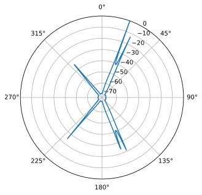

А що, якщо ми взагалі не знаємо, скільки сигналів присутні? Що ж, є трюк: відсортуйте величини власних значень від найбільшого до найменшого і побудуйте графік (може бути корисно побудувати його в дБ):

.. code-block:: python

 plot(10*np.log10(np.abs(w)),'.-')

.. image:: ../_images/doa_eigenvalues.svg
   :align: center
   :target: ../_images/doa_eigenvalues.svg

Власні значення, пов'язані з підпростором шуму, будуть найменшими, і всі вони будуть тяжіти до одного й того самого значення, тож ми можемо трактувати ці низькі значення як "рівень шуму", а будь-яке власне значення, що перевищує рівень шуму, представляє сигнал. Тут ми чітко бачимо, що приймаються три сигнали, і відповідно налаштовуємо наш алгоритм MUSIC. Якщо у вас небагато IQ-відліків для обробки, або сигнали мають низький SNR, кількість сигналів може бути не такою очевидною. Не соромтеся поекспериментувати, змінюючи :code:`num_expected_signals` від 1 до 7 - ви побачите, що заниження кількості призведе до пропущених сигналів, тоді як завищення лише трохи погіршить продуктивність.

Ще один експеримент, вартий спроби з MUSIC, - подивитися, наскільки близько (за кутом) можуть підійти два сигнали, залишаючись при цьому розрізненими; методи підпростору особливо добре з цим справляються. Анімація нижче показує приклад, де один сигнал знаходиться на 18 градусах, а інший повільно змінює кут приходу.

.. image:: ../_images/doa_music_animation.gif
   :scale: 100 %
   :align: center

**********
Root MUSIC
**********

Кожен розглянутий нами досі метод DOA, включно зі звичайним формуванням променя, MVDR та самим MUSIC, працює шляхом сканування сітки кандидатів-кутів та обчислення метрики для кожного з них (часто паралельно). Root MUSIC повністю усуває це сканування! Замість пошуку піків у спектрі він знаходить напрямки сигналів аналітично, розв'язуючи задачу пошуку коренів многочлена. Це дає Root MUSIC потенціал бути одночасно швидшим і точнішим за спектральний MUSIC, оскільки положення піка більше не обмежене кутовою роздільною здатністю вашої сітки сканування. Одне з обмежень Root MUSIC полягає в тому, що він працює лише для ULA; для 2D-решіток або 1D-решіток, що не є ULA, існують варіації/розширення Root MUSIC, які можна використовувати, але вони набагато складніші. Нам також, як і в MUSIC, все ще потрібне значення :code:`num_expected_signals`, що можна розглядати як обмеження.

Root MUSIC використовує той факт, що вектор спрямування ULA має чітку структуру Вандермонда, тобто це будь-який вектор (або матриця), кожен рядок якого будується як послідовна степінь певного базового значення, наприклад :code:`[1, x, x², x³, ..., x^(n-1)]`. За відстані між елементами в півхвилі елементи вектора спрямування - це просто послідовні степені єдиного комплексного числа :math:`z = e^{j\pi\sin\theta}`, як ми бачили на початку цієї глави.

Щоб виконати Root MUSIC, ми формуємо многочлен з матриці проєкції підпростору шуму. Ми використовуємо ту саму функцію вартості MUSIC, що й у попередньому розділі, але тепер вона набуває вигляду:

.. math::
 P(z) = z^{N_r-1} \, s^H(z) \, V_n V_n^H \, s(z)

де :math:`V_n` - це матриця підпростору шуму з розкладу за власними значеннями коваріаційної матриці :math:`R`, точно так само, як у MUSIC. Розкриваючи добуток, отримуємо многочлен степеня :math:`2(N_r-1)`. Там, де :math:`P(z)` має корінь на одиничному колі :math:`|z|=1`, функція вартості MUSIC була б нескінченною, а це означає, що ця точка є напрямком сигналу. На практиці, за скінченної кількості відліків, корені не потрапляють точно на одиничне коло, а групуються поблизу нього, тож ми шукаємо :math:`D` коренів (де :math:`D` - кількість очікуваних сигналів), найближчих до одиничного кола.

Коефіцієнти многочлена формуються підсумовуванням діагоналей матриці проєкції підпростору шуму :math:`D = V_n V_n^H`:

.. math::
 p_k = \sum_{\substack{m,n=0 \\ n-m = k-(N_r-1)}}^{N_r-1} [D]_{m,n}, \quad k = 0, 1, \ldots, 2(N_r-1)

що є просто сумою вздовж :math:`(k-(N_r-1))`-ї діагоналі :math:`D`. Отримавши многочлен :math:`P(z) = p_0 + p_1 z + \cdots + p_{2(N_r-1)} z^{2(N_r-1)}`, ми чисельно знаходимо його корені та перетворюємо сигнальні корені назад у кути:

.. math::
 \hat{\theta} = \arcsin\!\left(\frac{\angle z}{2\pi d}\right)

Повний код Root MUSIC, що використовує той самий отриманий сигнал :code:`X` та параметри з прикладу MUSIC, такий:

.. code-block:: python

 num_expected_signals = 3

 # Same eigendecomposition as MUSIC
 R = np.cov(X)
 w, v = np.linalg.eig(R)
 eig_val_order = np.argsort(np.abs(w))
 v = v[:, eig_val_order]
 V = v[:, :Nr - num_expected_signals]  # noise subspace eigenvectors

 # Build the Root MUSIC polynomial from diagonals of noise-subspace projection
 D = V @ V.conj().T
 p = np.zeros(2*Nr - 1, dtype=np.complex128)
 for k in range(2*Nr - 1):
     p[k] = np.sum(np.diag(D, k - (Nr - 1)))

 # Find roots, keep those inside the unit circle, pick the num_expected_signals roots closest to the unit circle
 roots = np.roots(p[::-1])  # np.roots expects highest-degree coefficient first
 roots = roots[np.abs(roots) <= 1.0] # remove the conjugate-reciprocal partners which correspond to the same DOA estimate anyway
 roots = roots[np.argsort(-np.abs(roots))]  # sort closest-to-unit-circle first
 doa_roots = roots[:num_expected_signals]

 # Convert roots to angles in degrees
 doas_deg = np.sort(np.arcsin(np.angle(doa_roots) / (2 * np.pi * d)) * 180 / np.pi)
 print("Estimated DOAs (degrees):", doas_deg)

Основну роботу виконує функція :code:`np.roots()` з NumPy, яка використовує метод супровідної матриці для знаходження коренів многочлена.

Запуск цього на тому самому сценарії з трьома сигналами дає досить точні оцінені кути, без жодного сканування, роздільної здатності чи пошуку піків:

.. code-block:: console

 Estimated DOAs (degrees): [-39.98674197  19.99724883  25.00387589]
 True DOAs (degrees):      [-40.  20.  25.]

Порівняйте це зі спектральним MUSIC, для якого знадобилося сканування theta з тисячею точок, щоб знайти ті самі три піки. Точність, яку ви отримуєте з Root MUSIC, обмежена, по суті, лише оцінкою коваріаційної матриці, а не будь-яким обраним вами кроком сітки. Обчислювальна економія особливо помітна, коли :code:`Nr` велике, оскільки побудова та розв'язання многочлена степеня :math:`2(N_r-1)` значно дешевша, ніж ітерування рівняння MUSIC по тисячах кутів спрямування.

Варто пам'ятати одне: Root MUSIC успадковує ті самі вимоги, що й MUSIC. Вам все ще потрібно знати (або оцінити) кількість сигналів, і вам все ще потрібно достатньо елементів, щоб :math:`N_r > D`. Трюк із графіком власних значень, описаний у розділі про MUSIC, тут працює так само добре для оцінки кількості сигналів перед запуском Root MUSIC.

***
LMS
***

Формувач променя за методом найменших середніх квадратів (Least Mean Squares, LMS) - це формувач променя низької складності, представлений Бернардом Відроу (Bernard Widrow). Він відрізняється від усіх формувачів променя, які ми показували досі, у двох аспектах: 1) він вимагає знання SOI, або принаймні його частини (наприклад, послідовності синхронізації, пілот-сигналів тощо), і 2) він ітеративний, тобто ваги уточнюються протягом певної кількості ітерацій. Він працює, мінімізуючи середню квадратичну похибку між бажаним сигналом (SOI) та виходом формувача променя (тобто ваг, застосованих до отриманих відліків). Традиційна реалізація LMS полягає в тому, щоб трактувати кожен отриманий відлік як наступний крок ітеративного процесу, застосовуючи поточні ваги до одного відліку та обчислюючи похибку. Ця похибка потім використовується для тонкого підлаштування ваг, і процес повторюється. Формувач променя LMS можна використовувати як в аналоговому, так і в цифровому формуванні променя. Алгоритм LMS задається наступним рівнянням:

.. math::

 w_{n+1} = w_n + \mu \underbrace{\left(y_n -  w_{n}^H x_n\right)^*}_{error} x_n

де :math:`w_n` - вектор ваг на ітерації/відліку :math:`n`, :math:`\mu` - розмір кроку, :math:`x_n` - отриманий відлік на кроці :math:`n`, :math:`y_n` - очікуване значення на цій ітерації (тобто відомий SOI), а :math:`*` - комплексне спряження. Не дозволяйте члену :math:`w_{n}^H x_n` зробити рівняння складнішим, ніж воно є, - цей член є просто застосуванням поточних ваг до вхідного сигналу, тобто стандартним рівнянням формування променя. Розмір кроку :math:`\mu` контролює, наскільки швидко ваги сходяться до своїх оптимальних значень. Мале значення :math:`\mu` призведе до повільної збіжності (наприклад, ви можете не досягти "найкращих" ваг до того, як відомий сигнал зникне), тоді як велике значення :math:`\mu` може спричинити нестабільність алгоритму. Алгоритм LMS - потужний інструмент для адаптивного формування променя, але він має певні обмеження. Він вимагає відомого SOI, який не завжди доступний на практиці, і вам потрібно виконати синхронізацію за часом і частотою як частину процесу LMS, щоб ваш "шаблон" SOI був вирівняний з отриманими відліками.

У прикладі коду на Python нижче ми моделюємо 8-елементну решітку з SOI, що складається з повторюваного коду Голда (Gold code), переданого як BPSK. Коди Голда використовуються в 5G та GPS і мають чудові властивості взаємної кореляції, що робить їх чудовими для сигналів синхронізації. У симуляції ми також включаємо дві тональні перешкоди, під кутами 60 та -50 градусів. Зауважте, що ця симуляція не включає жодного зсуву за часом чи частотою; якби включала, нам довелося б синхронізуватися з SOI як частиною процесу LMS (тобто спільне формування променя та синхронізація). У наступній анімації ми розгортаємо кут приходу SOI і будуємо графік діаграми спрямованості, яку LMS створив для нас після 10 тис. відліків. Зауважте, як LMS утримує підсилення в напрямку SOI точно на 0 дБ (якщо тільки перешкода не накладається на нього), одночасно розміщуючи нулі на перешкодах.

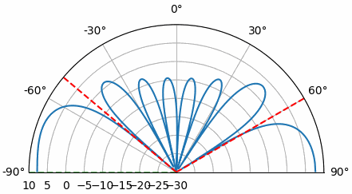

.. code-block:: python

 # Scenario
 sample_rate = 1e6
 d = 0.5 # half wavelength spacing
 N = 100000 # number of samples to simulate
 Nr = 8 # elements
 theta_soi = 20 / 180 * np.pi # convert to radians
 theta2    = 60 / 180 * np.pi
 theta3   = -50 / 180 * np.pi
 t = np.arange(N)/sample_rate # time vector
 s1 = np.exp(2j * np.pi * d * np.arange(Nr) * np.sin(theta_soi)).reshape(-1,1) # 8x1
 s2 = np.exp(2j * np.pi * d * np.arange(Nr) * np.sin(theta2)).reshape(-1,1)
 s3 = np.exp(2j * np.pi * d * np.arange(Nr) * np.sin(theta3)).reshape(-1,1)

 # SOI is a gold code, repeated, length 127
 gold_code = np.array([-1, 1, 1, -1, 1, 1, 1, 1, -1, -1, -1, 1, 1, -1, -1, -1, -1, -1, 1, 1, 1, -1, -1, 1, 1, 1, -1, 1, 1, 1, 1, 1, 1, -1, -1, -1, 1, 1, 1, -1, -1, 1, 1, -1, -1, 1, -1, 1, -1, -1, 1, -1, -1, -1, -1, -1, -1, 1, 1, -1, 1, -1, 1, -1, 1, 1, -1, -1, -1, -1, 1, 1, 1, -1, 1, -1, 1, 1, 1, 1, 1, -1, -1, -1, -1, 1, 1, 1, -1, 1, -1, -1, -1, 1, 1, 1, 1, -1, 1, 1, 1, -1, 1, -1, -1, -1, -1, 1, -1, 1, 1, -1, -1, -1, -1, 1, -1, 1, 1, -1, -1, -1, -1, -1, -1, 1, 1])
 soi_samples_per_symbol = 8
 soi = np.repeat(gold_code, soi_samples_per_symbol)
 num_sequence_repeats = int(N / soi.shape[0]) + 1 # number of times to repeat the sequence for N samples
 soi = np.tile(soi, num_sequence_repeats)[:N] # repeat the sequence to fill simulated time, then trim
 soi = soi.reshape(1, -1) # 1xN

 # Interference, eg tone jammers, from different directions
 tone2 = np.exp(2j*np.pi*0.02e6*t).reshape(1,-1)
 tone3 = np.exp(2j*np.pi*0.03e6*t).reshape(1,-1)

 # Simulate received signal
 r = s1 @ soi + s2 @ tone2 + s3 @ tone3
 n = np.random.randn(Nr, N) + 1j*np.random.randn(Nr, N)
 r = r + 0.5*n # 8xN

 # LMS, not knowing the direction of SOI but knowing the SOI signal itself
 mu = 0.5e-5 # LMS step size
 w_lms = np.zeros((Nr, 1), dtype=np.complex128) # start with all zeros

 # Loop through received samples
 error_log = []
 for i in range(N):
    r_sample = r[:, i].reshape(-1, 1) # 8x1
    soi_sample = soi[0, i] # scalar
    y = w_lms.conj().T @ r_sample # apply the weights
    y = y.squeeze() # make it a scalar
    error = soi_sample - y
    error_log.append(np.abs(error)**2)
    w_lms += mu * np.conj(error) * r_sample # weights are still 8x1

 w_lms /= np.linalg.norm(w_lms) # normalize weights

 plt.plot(error_log)
 plt.xlabel('Iteration')
 plt.ylabel('Mean Square Error')
 plt.show()

 # Plot the beam pattern as shown previously

Спробуйте змінити :code:`theta_soi`, кількість шуму (тобто :code:`0.5*n`) та розмір кроку :code:`mu`, щоб побачити, як поводиться алгоритм LMS.

********************************
Тренувальні дані (Training Data)
********************************

У контексті обробки сигналів решітки існує поняття "тренування" (training), коли ви встановлюєте коваріаційну матрицю :code:`R` до того, як з'явиться потенційний SOI. Це особливо використовується в радіолокації, де здебільшого SOI відсутній, а весь процес виявлення полягає в перевірці серії кутів на наявність SOI. Коли ми обчислюємо :code:`R` до того, як з'явиться SOI, це дозволяє нам обчислити ваги за допомогою таких методів, як MVDR, з урахуванням лише перешкод і шумового середовища, закладених у коваріаційну матрицю. Так у MVDR не буде жодного шансу розмістити нуль на напрямку SOI або поблизу нього. Потім ми використовуємо ці ваги та застосовуємо їх до отриманого сигналу, щоб перевірити, чи присутній тепер SOI під цим кутом.

Щоб продемонструвати цінність використання тренувальних даних, ми виконаємо MVDR на записі, зробленому реальною 16-елементною решіткою (з використанням платформи QUAD-MxFE від Analog Devices). Спочатку ми виконаємо MVDR як зазвичай, використовуючи весь отриманий сигнал для обчислення :code:`R` та ваг. Потім ми скористаємося окремим записом, зробленим до того, як SOI було увімкнено, щоб обчислити :code:`R` та ваги.

Ці записи були зроблені на радіочастоті 3,3 ГГц, з решіткою з відстанню 0,045 метра, тож d дорівнює 0,495. Використовувалася частота дискретизації 30 МГц. Ми називатимемо три сигнали A, B та C. Сигнал C буде призначеним SOI, тоді як A та B будуть перешкодами. Тому нам потрібен запис лише з A та B, щоб створити тренувальні дані, за умови, що A і B не рухалися між записом тренувальних даних і записом, що включає C. Нижче наведено посилання на два записи, які вам знадобляться:

https://github.com/777arc/777arc.github.io/raw/master/3p3G_A_B.npy

https://github.com/777arc/777arc.github.io/raw/master/3p3G_A_B_C.npy

Почнемо з виконання звичайного MVDR на записі A_B_C. Ми можемо завантажити запис, що є форматом :code:`np.save()`, який містить 2D-масив, де перший вимір - це кількість елементів решітки, а другий - кількість відліків:

.. code-block:: python

   import matplotlib.pyplot as plt
   import numpy as np

   # Array params
   center_freq = 3.3e9
   sample_rate = 30e6
   d = 0.045 * center_freq / 3e8
   print("d:", d)

   # Includes all three signals, we'll call C our SOI
   filename = '3p3G_A_B_C.npy'
   X = np.load(filename)
   Nr = X.shape[0]

Далі ми виконаємо базовий DOA з MVDR, щоб визначити кути приходу трьох сигналів:

.. code-block:: python

   # Perform DOA to find angle of arrival of C
   theta_scan = np.linspace(-1*np.pi/2, np.pi/2, 10000) # between -90 and +90 degrees
   results = []
   R = X @ X.conj().T # Calc covariance matrix. gives a Nr x Nr covariance matrix of the samples
   Rinv = np.linalg.pinv(R) # pseudo-inverse tends to work better than a true inverse
   for theta_i in theta_scan:
      a = np.exp(2j * np.pi * d * np.arange(X.shape[0]) * np.sin(theta_i)) # steering vector in the desired direction theta_i
      a = a.reshape(-1,1) # make into a column vector
      power = 1/(a.conj().T @ Rinv @ a).squeeze() # MVDR power equation
      power_dB = 10*np.log10(np.abs(power)) # power in signal, in dB so its easier to see small and large lobes at the same time
      results.append(power_dB)
   results -= np.max(results) # normalize to 0 dB at peak

Це один із тих випадків, коли простіше просто скористатися прямокутним графіком замість полярного. Ми позначили сигнали A, B та C.

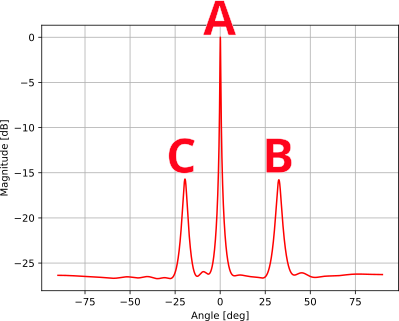

Далі, якщо ми хочемо назвати C нашим SOI і використати MVDR для створення ваг, що обнулять A та B і збережуть C, нам потрібно знати точний кут приходу C. Ми зробимо це за допомогою argmax на результатах DOA, які щойно створили вище, але лише після обнулення кутів, що відповідають A і B (робимо це, встановлюючи верхні 60% наших результатів DOA у дуже-дуже низьке значення).

.. code-block:: python

   # Pull out angle of C, after zeroing out the angles that include the interferers
   results_temp = np.array(results)
   results_temp[int(len(results)*0.4):] = -9999*np.ones(int(len(results)*0.6))
   max_angle = theta_scan[np.argmax(results_temp)] # radians
   print("max_angle:", max_angle)

Виявляється, що C надходить під кутом -0,3407 радіана, тож саме це значення нам потрібно використати при обчисленні наших ваг MVDR. Ви робили це вже багато разів, це просто рівняння MVDR:

.. code-block:: python

   # Calc MVDR weights
   s = np.exp(2j * np.pi * d * np.arange(Nr) * np.sin(max_angle)) # steering vector in the desired direction theta
   s = s.reshape(-1,1) # make into a column vector
   w = (Rinv @ s)/(s.conj().T @ Rinv @ s) # MVDR/Capon equation

Насамкінець побудуємо графік діаграми спрямованості ваг MVDR, які ми щойно обчислили, а також результати DOA, що були в нас раніше, і пунктирну зелену лінію на :code:`max_angle`:

.. raw:: html

   

   
Розгорніть цей розділ, щоб побачити код побудови графіка (нічого нового)

.. code-block:: python

   # Calc beam pattern
   w = w.squeeze()
   N_fft = 2048
   w_padded = np.concatenate((w, np.zeros(N_fft - Nr))) # zero pad to N_fft elements to get more resolution in the FFT
   w_fft_dB = 10*np.log10(np.abs(np.fft.fftshift(np.fft.fft(w_padded)))**2) # magnitude of fft in dB
   w_fft_dB -= np.max(w_fft_dB) # normalize to 0 dB at peak
   theta_bins = np.arcsin(np.linspace(-1, 1, N_fft)) # Map the FFT bins to angles in radians

   # Plot beam pattern and DOA results
   plt.plot(theta_bins * 180 / np.pi, w_fft_dB) # MAKE SURE TO USE RADIAN FOR POLAR
   plt.plot(theta_scan * 180 / np.pi, results, 'r')
   plt.vlines(ymax=np.max(results), ymin=np.min(results) , x=max_angle*180/np.pi, color='g', linestyle='--')
   plt.xlabel("Angle [deg]")
   plt.ylabel("Magnitude [dB]")
   plt.title("Beam Pattern and DOA Results, Without Training")
   plt.grid()
   plt.show()

.. raw:: html

   

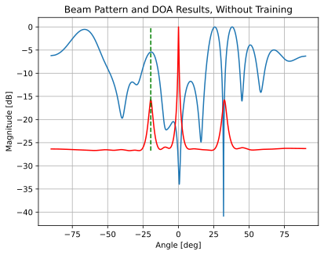

Нам вдалося створити нулі на A та B. У позиції C (зелена пунктирна лінія) у нас немає нуля, але немає й того, що можна назвати "головною пелюсткою" - це щось на кшталт зменшеної пелюстки. Це частково тому, що з напрямків, відмінних від A, B та C, надходило мало або зовсім не надходило енергії, тож навіть якщо ви бачите деякі пелюстки (наприклад, приблизно на -70, 25 та 40 градусах), вони насправді не мають значення, оскільки з того напрямку сигнал не надходить. Ще одна причина, чому пелюстка на C не така сильна, полягає в тому, що головна пелюстка ніби бореться з нулями, які були б створені MVDR, якби ми не були спрямовані точно в цьому напрямку. Тим не менш, було б добре мати сильну головну пелюстку в нашій позиції :code:`max_angle`, і для цього нам знадобляться **тренувальні дані**.

Тепер ми завантажимо запис лише A та B, щоб створити тренувальні дані. У радіолокаційному сценарії це еквівалентно обчисленню :code:`R` до того, як ви передасте будь-який радіолокаційний імпульс (в ідеалі - надзвичайно незадовго до цього).

.. code-block:: python

   # Load "training data" which is just A and B, then calc Rinv
   filename = '3p3G_A_B.npy'
   X_A_B = np.load(filename)
   R_training = X_A_B @ X_A_B.conj().T # Calc covariance matrix
   Rinv_training = np.linalg.pinv(R_training)

Цього разу велика відмінність полягає в тому, що ми використаємо :code:`Rinv_training` при обчисленні ваг MVDR. Ми повторно використаємо :code:`max_angle`, який уже знайшли. Таким чином, ми спрямовані в напрямку C, але не включаємо C до отриманого сигналу, що використовується при обчисленні :code:`R` та :code:`R_inv`.

.. code-block:: python

   # Calc MVDR weights using training Rinv
   s = np.exp(2j * np.pi * d * np.arange(Nr) * np.sin(max_angle)) # steering vector in the desired direction theta
   s = s.reshape(-1,1) # make into a column vector (size 3x1)
   w = (Rinv_training @ s)/(s.conj().T @ Rinv_training @ s) # MVDR/Capon equation

Використовуючи той самий метод побудови графіка, отримуємо:

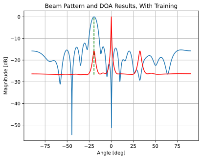

Зауважте, що ми все ще отримуємо нулі від A та B (нуль B менш виражений, але B також слабший сигнал), але цього разу є величезна головна пелюстка, спрямована в наш кут інтересу, C. Ось у чому сила тренувальних даних і чому вона така важлива в радіолокаційних застосуваннях.

*********************************************************************
Моделювання широкосмугових перешкод (Simulating Wideband Interferers)
*********************************************************************

Метод, який ми використовували протягом усієї цієї глави для моделювання сигналів, що потрапляють на нашу решітку під певним кутом приходу (шляхом множення вектора спрямування на переданий сигнал), спирається на вузькосмугове припущення, тобто передбачає, що сигнал є одночастотним, і вектор спрямування обчислюється на цій частоті. Це гарне наближення для багатьох сигналів, але воно погано працює для широкосмугових сигналів, наприклад, тих, що мають смугу пропускання, більшу за приблизно 5% від центральної частоти. Ми коротко розглянемо трюк, який можна використати для моделювання широкосмугового **шуму**, що надходить з певного напрямку (наприклад, загороджувальна завада (barrage jamming), що надходить з одного AoA).

Цей метод працює шляхом побудови коваріаційної матриці :code:`R`, яка формується підсумовуванням внесків від кожного джерела широкосмугового шуму. Обчислюється матриця квадратного кореня :code:`A`, і набір відліків :code:`X` генерується шляхом "забарвлення" (coloring) стандартного комплексного гаусового шуму за допомогою :code:`A`. Ключовим параметром є :code:`fractional_bw` - смуга пропускання шумового сигналу, поділена на центральну частоту. Коли :code:`fractional_bw=0`, наведений нижче код повинен давати той самий сценарій, що й традиційний метод моделювання отриманих сигналів. Код на Python нижче можна підставити в попередні приклади для моделювання отриманого сигналу :code:`X`.

.. code-block:: python

 N = 10 # number of elements in ULA
 num_samples = 10000
 d = 0.5

 num_jammers = 3
 jammer_pow_dB = np.array([30, 30, 30]) # Jammer powers in dB
 jammer_aoa_deg = np.array([-70, -20, 40])  # Jammer angles in degrees
 jammer_aoa = np.sin(np.deg2rad(jammer_aoa_deg)) * np.pi
 element_gain_dB = np.zeros(N) # Gains in dB for the array elements (all 0 dB in our case)
 element_gain_linear = 10.0 ** (element_gain_dB / 10) # Convert array gains to linear numbers
 fractional_bw = 0.1 # if this is 0, the method matches the traditional way of using array factor to simulate received signals

 # Build NxN jammer covariance matrix R
 R = np.zeros((N, N), dtype=complex)
 for m in range(N):
     for n in range(N):
         for j in range(num_jammers):
             total_element_gain = np.sqrt(element_gain_linear[m] * element_gain_linear[n])
             sinc_term = np.sinc(0.5 * fractional_bw * (m - n) * jammer_aoa[j] / np.pi)
             exp_term = np.exp(1j * (m - n) * jammer_aoa[j])
             R[m, n] += 10.0 ** (jammer_pow_dB[j] / 10) * total_element_gain * sinc_term * exp_term
 R = np.eye(N, dtype=complex) + R

 # Generate received samples
 A = fractional_matrix_power(R, 0.5) # Compute the matrix square-root (effective Cholesky factorization)
 A = A / np.sqrt(2)
 X = np.zeros((N, num_samples), dtype=complex)
 for k in range(num_samples):
     noise_vec = np.random.randn(N) + 1j * np.random.randn(N) # complex noise
     X[:, k] = A.conj().T @ noise_vec

На графіках нижче ваги MVDR обчислені при спрямуванні на 20 градусів і показані чорним, тоді як звичайний формувач променя, спрямований на 20 градусів, показаний пунктирним синім. Три джерела шуму позначені червоним. На цьому першому графіку використано дробову смугу пропускання 0, тобто ці ваги MVDR мають збігатися з попередніми сценаріями, що спиралися на вузькосмугове припущення. Судячи з графіка, все начебто працює чудово, але якщо виявиться, що реальний шум має широку смугу пропускання (а ваш SOI також широкосмуговий, тобто ви не можете просто відфільтрувати шум), то симуляція не відповідатиме реальному світу.

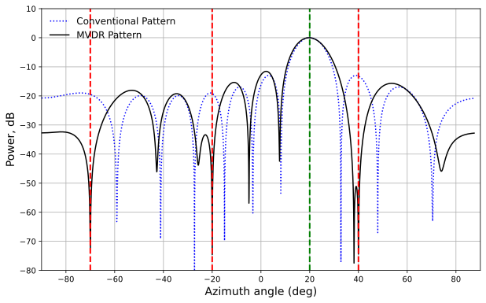

Тепер застосуємо дробову смугу пропускання 0,1, що фактично розтягує джерела шуму на широку смугу пропускання, змушуючи MVDR створювати набагато ширші нулі. Для багатьох реальних сценаріїв це представляє реалістичнішу симуляцію.

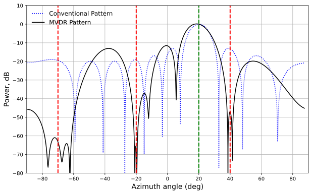

*********************************
Кругові решітки (Circular Arrays)
*********************************

Коротко поговоримо про рівномірну кругову решітку (Uniform Circular Array, UCA) - популярну геометрію решітки для DOA, оскільки вона дозволяє обійти проблему неоднозначності на 180 градусів, властиву ULA. KrakenSDR, наприклад, є 5-елементною решіткою, і поширеною практикою є розміщення цих п'яти елементів по колу з рівною відстанню між елементами. Теоретично для формування UCA потрібно лише три елементи, так само як ULA можна побудувати лише з двох елементів.

Увесь код, який ми вивчали досі, застосовний до UCA, нам потрібно лише замінити рівняння вектора спрямування на рівняння, специфічне для UCA:

.. code-block:: python

   radius = 0.05 # normalized by wavelength!
   d = np.sqrt(2 * radius**2 * (1 - np.cos(2*np.pi/Nr)))
   sf = 1.0 / (np.sqrt(2.0) * np.sqrt(1.0 - np.cos(2*np.pi/Nr))) # scaling factor based on geometry, eg for a hexagon it is 1.0
   x = d * sf * np.cos(2 * np.pi / Nr * np.arange(Nr))
   y = -1 * d * sf * np.sin(2 * np.pi / Nr * np.arange(Nr))
   s = np.exp(1j * 2 * np.pi * (x * np.cos(theta) + y * np.sin(theta)))
   s = s.reshape(-1, 1) # Nrx1

Насамкінець, вам захочеться сканувати від 0 до 360 градусів, а не лише від -90 до +90 градусів, як з ULA.

Про 2D-решітки (наприклад, прямокутні) дивіться в главі :ref:`2d-beamforming-chapter`.

******************************************
Висновки та список використаної літератури
******************************************

Увесь код на Python, включно з кодом, що використовується для генерації рисунків/анімацій, можна знайти `на сторінці підручника на GitHub <https://github.com/777arc/PySDR/blob/master/figure-generating-scripts/doa.py>`_.

* Реалізація DOA у GNU Radio - https://github.com/EttusResearch/gr-doa
* Реалізація DOA, що використовується у KrakenSDR - https://github.com/krakenrf/krakensdr_doa/blob/main/_signal_processing/krakenSDR_signal_processor.py

[1] Mailloux, Robert J. Phased Array Antenna Handbook. Second edition, Artech House, 2005

[2] Van Trees, Harry L. Optimum Array Processing: Part IV of Detection, Estimation, and Modulation Theory. Wiley, 2002.

.. |br| raw:: html

       
