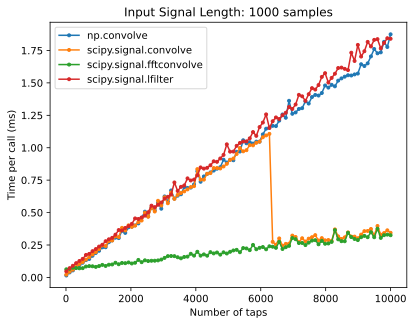
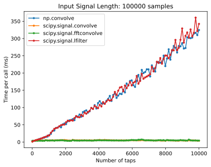
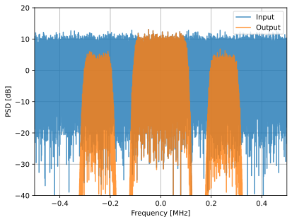
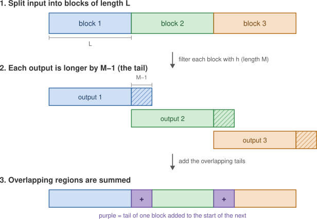
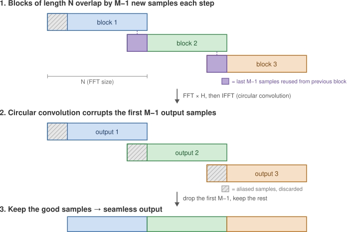

.. _filters-chapter:

#############
Фільтри
#############

У цій главі ми дізнаємося про цифрові фільтри за допомогою Python.  Ми розглянемо типи фільтрів (FIR/IIR та низькочастотні/високочастотні/смугові/режекторні), способи представлення фільтрів у цифровому вигляді, а також їхнє проектування.  Ми завершимо вступом до формування імпульсів, який детальніше розглянемо в розділі :ref:`pulse-shaping-chapter`.

*************************
Основи фільтрів
*************************

Фільтри використовуються у багатьох дисциплінах. Наприклад, обробка зображень широко використовує двовимірні фільтри, де вхідними і вихідними даними є зображення.  Ви можете щоранку використовувати фільтр для приготування кави, який відфільтровує тверді частинки від рідини.  В DSP фільтри в першу чергу використовуються для:

1. Розділення об'єднаних сигналів (наприклад, для виділення потрібного вам сигналу)
2. Видалення надлишкового шуму після отримання сигналу
3. Відновлення сигналів, які були певним чином спотворені (наприклад, звуковий еквалайзер є фільтром)

Безумовно, є й інші способи використання фільтрів, але ця глава призначена для того, щоб представити концепцію, а не пояснити всі способи, якими може відбуватися фільтрація.

Ви можете подумати, що нас цікавлять лише цифрові фільтри, адже цей підручник вивчає DSP. Однак важливо знати, що багато фільтрів будуть аналоговими, як ті, що стоять у наших SDR, розміщених перед аналого-цифровим перетворювачем (АЦП) на стороні приймача. На наступному зображенні порівнюється схема аналогового фільтра з блок-схемою, що представляє алгоритм цифрової фільтрації.

.. image:: ../_images/analog_digital_filter.png
   :scale: 70 %
   :align: center
   :alt: Аналогові та цифрові фільтри

У DSP, де вхід і вихід є сигналами, фільтр має один вхідний сигнал і один вихідний сигнал:

.. raw:: html

   

.. tikz:: [font=\sffamily\Large, scale=2]
   \definecolor{babyblueeyes}{rgb}{0.36, 0.61, 0.83}
   \node [draw,
    color=white,
    fill=babyblueeyes,
    minimum width=4cm,
    minimum height=2.4cm
   ]  (filter) {Filter};
   \draw[<-, very thick] (filter.west) -- ++(-2,0) node[left,align=center]{Input\\(time domain)} ;
   \draw[->, very thick] (filter.east) -- ++(2,0) node[right,align=center]{Output\\(time domain)};
   :libs: positioning
   :xscale: 100

.. raw:: html

   

Ви не можете подати два різних сигнали на один фільтр, не склавши їх попередньо або не виконавши якусь іншу операцію.  Аналогічно, на виході завжди буде один сигнал, тобто одновимірний масив чисел.

Існує чотири основні типи фільтрів: низькочастотні, високочастотні, смугові та режекторні. Кожен тип модифікує сигнали, фокусуючись на різних діапазонах частот всередині них. Наведені нижче графіки демонструють, як частоти в сигналах фільтруються для кожного типу, спочатку представлені лише додатні частоти (простіше для розуміння), а потім також і від'ємні.

.. image:: ../_images/filter_types.png
   :scale: 70 %
   :align: center
   :alt: Типи фільтрів, зокрема низькочастотна, високочастотна, смугова та режекторна фільтрація у частотній області

.. START OF FILTER TYPES TIKZ
.. raw:: html

   <table style="max-width: 700px; margin: 0 auto;"><tbody><tr><td>

.. This draw the lowpass filter
.. tikz:: [font=\sffamily\large]
   \draw[->, thick] (-5,0) -- (5,0) node[below]{Frequency};
   \draw[->, thick] (0,-0.5) node[below]{0 Hz} -- (0,5) node[left=1cm]{\textbf{Low-Pass}};
   \draw[red, thick, smooth] plot[tension=0.5] coordinates{(-5,0) (-2.5,0.5) (-1.5,3) (1.5,3) (2.5,0.5) (5,0)};
   :xscale: 100

.. raw:: html

   </td><td  style="padding: 0px">

.. this draws the highpass filter
.. tikz:: [font=\sffamily\large]
   \draw[->, thick] (-5,0) -- (5,0) node[below]{Frequency};
   \draw[->, thick] (0,-0.5) node[below]{0 Hz} -- (0,5) node[left=1cm]{\textbf{High-Pass}};
   \draw[red, thick, smooth] plot[tension=0.5] coordinates{(-5,3) (-2.5,2.5) (-1.5,0.3) (1.5,0.3) (2.5,2.5) (5,3)};
   :xscale: 100

.. raw:: html

   </td></tr><tr><td>

.. this draws the bandpass filter
.. tikz:: [font=\sffamily\large]
   \draw[->, thick] (-5,0) -- (5,0) node[below]{Frequency};
   \draw[->, thick] (0,-0.5) node[below]{0 Hz} -- (0,5) node[left=1cm]{\textbf{Band-Pass}};
   \draw[red, thick, smooth] plot[tension=0.5] coordinates{(-5,0) (-4.5,0.3) (-3.5,3) (-2.5,3) (-1.5,0.3) (1.5, 0.3) (2.5,3) (3.5, 3) (4.5,0.3) (5,0)};
   :xscale: 100

.. raw:: html

   </td><td>

.. and finally the bandstop filter
.. tikz:: [font=\sffamily\large]
   \draw[->, thick] (-5,0) -- (5,0) node[below]{Frequency};
   \draw[->, thick] (0,-0.5) node[below]{0 Hz} -- (0,5) node[left=1cm]{\textbf{Band-Stop}};
   \draw[red, thick, smooth] plot[tension=0.5] coordinates{(-5,3) (-4.5,2.7) (-3.5,0.3) (-2.5,0.3) (-1.5,2.7) (1.5, 2.7) (2.5,0.3) (3.5, 0.3) (4.5,2.7) (5,3)};
   :xscale: 100

.. raw:: html

   </td></tr></tbody></table>

.. .......................... end of filter plots in tikz

Кожен фільтр дозволяє певним частотам залишатися в сигналі, блокуючи інші частоти.  Діапазон частот, які пропускає фільтр, називається "смугою пропускання", а "смуга затримання" - це те, що блокується.  У випадку низькочастотного фільтра, він пропускає низькі частоти і затримує високі, тому 0 Гц завжди буде в смузі пропускання.  Для фільтрів високих частот і смугових фільтрів 0 Гц завжди буде в смузі затримання.

Не плутайте ці типи фільтрації з алгоритмічною реалізацією фільтра (наприклад, IIR проти FIR).  Найпоширенішим типом на сьогоднішній день є фільтр нижніх частот (ФНЧ), оскільки ми часто представляємо сигнали в базовій смузі.  ФНЧ дозволяє нам відфільтрувати все "навколо" нашого сигналу, видаляючи надлишковий шум та інші сигнали.

*************************
Представлення фільтрів
*************************

Для більшості фільтрів, які ми побачимо (відомих як фільтри типу FIR, або фільтри зі скінченною імпульсною характеристикою), ми можемо представити сам фільтр за допомогою одного масиву чисел з рухомою комою.  Для симетричних у частотній області фільтрів ці числа будуть дійсними (а не комплексними), і їхня кількість, як правило, буде непарною.  Ми називаємо цей масив чисел "відводами фільтра".  Ми часто використовуємо :math:`h` як символ для позначення відводів фільтра.  Ось приклад набору відводів фільтра, які визначають один фільтр:

.. code-block:: python

    h =  [ 9.92977939e-04  1.08410297e-03  8.51595307e-04  1.64604862e-04
     -1.01714338e-03 -2.46268845e-03 -3.58236429e-03 -3.55412543e-03
     -1.68583512e-03  2.10562324e-03  6.93100252e-03  1.09302641e-02
      1.17766532e-02  7.60955496e-03 -1.90555639e-03 -1.48306750e-02
     -2.69313236e-02 -3.25659606e-02 -2.63400086e-02 -5.04184562e-03
      3.08099470e-02  7.64264738e-02  1.23536693e-01  1.62377258e-01
      1.84320776e-01  1.84320776e-01  1.62377258e-01  1.23536693e-01
      7.64264738e-02  3.08099470e-02 -5.04184562e-03 -2.63400086e-02
     -3.25659606e-02 -2.69313236e-02 -1.48306750e-02 -1.90555639e-03
      7.60955496e-03  1.17766532e-02  1.09302641e-02  6.93100252e-03
      2.10562324e-03 -1.68583512e-03 -3.55412543e-03 -3.58236429e-03
     -2.46268845e-03 -1.01714338e-03  1.64604862e-04  8.51595307e-04
      1.08410297e-03  9.92977939e-04]

Приклад використання
########################

Щоб дізнатися, як використовуються фільтри, давайте розглянемо приклад, де ми налаштовуємо наш SDR на частоту існуючого сигналу і хочемо ізолювати його від інших сигналів.  Пам'ятайте, що ми вказуємо нашому SDR, на яку частоту налаштуватися, але відліки, які він захоплює, знаходяться в базовій смузі, тобто сигнал буде відображатися з центром близько 0 Гц. Нам доведеться відстежувати, на яку частоту ми сказали SDR налаштуватися.  Ось що ми можемо отримати:

.. image:: ../_images/filter_use_case.png
   :scale: 70 %
   :align: center
   :alt: Графік GNU Radio у частотній області сигналу, що нас цікавить, та завадового сигналу і рівня шуму

Оскільки наш сигнал вже відцентровано на постійній складовій (0 Гц), ми знаємо, що нам потрібен фільтр нижніх частот.  Ми повинні вибрати "частоту зрізу" (так звану кутову частоту), яка визначатиме, коли смуга пропускання переходить у смугу затримання.  Частота зрізу завжди буде в одиницях Гц.  У цьому прикладі 3 кГц здається хорошим значенням:

.. image:: ../_images/filter_use_case2.png
   :scale: 70 %
   :align: center

Однак, за принципом роботи більшості фільтрів нижніх частот, межа від'ємних частот також буде -3 кГц.  Тобто, вона симетрична відносно постійної складової (пізніше ви зрозумієте чому).  Наші частоти зрізу виглядатимуть приблизно так (смуга пропускання - це область між ними):

.. image:: ../_images/filter_use_case3.png
   :scale: 70 %
   :align: center

Після створення та застосування фільтра з частотою зрізу 3 кГц, маємо:

.. image:: ../_images/filter_use_case4.png
   :scale: 70 %
   :align: center
   :alt: Графік GNU Radio у частотній області сигналу, що нас цікавить, та завадового сигналу і рівня шуму, з відфільтрованими завадами

Цей відфільтрований сигнал виглядатиме заплутано, доки ви не згадаєте, що наш рівень шуму *був* на зеленій лінії біля -65 дБ.  Незважаючи на те, що ми все ще бачимо завадовий сигнал з центром на частоті 10 кГц, ми *значно* зменшили потужність цього сигналу. Тепер вона нижча за той рівень, де був рівень шуму!  Ми також видалили більшу частину шуму, що існував у смузі затримання.

На додаток до частоти зрізу, інший основний параметр нашого фільтра нижніх частот називається "ширина переходу".  Ширина переходу, яка також вимірюється в Гц, вказує фільтру, як швидко він повинен перейти від смуги пропускання до смуги затримання, оскільки миттєвий перехід неможливий.

Давайте візуалізуємо ширину переходу.  На діаграмі нижче :green:`зелена` лінія представляє ідеальну характеристику переходу між смугою пропускання і смугою затримання, яка, по суті, має ширину переходу, рівну нулю.  :red:`Червона` лінія демонструє результат реалістичного фільтра, який має деяку пульсацію і певну ширину переходу.

.. image:: ../_images/realistic_filter.png
   :scale: 100 %
   :align: center
   :alt: Частотна характеристика фільтра нижніх частот, що показує пульсації та ширину переходу

Вам може бути цікаво, чому ми просто не встановили ширину переходу якомога меншою.  Причина в тому, що менша ширина переходу призводить до більшої кількості відводів, а більша кількість відводів означає більше обчислень - незабаром ми побачимо, чому.  Фільтр на 50 відводів може працювати цілий день, використовуючи 1% процесора Raspberry Pi.  Тим часом, фільтр на 50 000 відводів призведе до того, що ваш процесор вибухне!
Зазвичай ми використовуємо інструмент для проектування фільтрів, потім дивимося, скільки відводів він видає, і якщо їх занадто багато (наприклад, більше 100), ми збільшуємо ширину переходу.  Звичайно, все залежить від застосунку та обладнання, на якому працює фільтр.

Наведений нижче `інтерактивний потоковий граф GNU Radio <https://gnuradioworld.com/examples/filter/filters-lowpass-interference/>`_ відтворює точно той самий сценарій, що й у цьому розділі, просто у вашому браузері.  Тут є корисний сигнал на 0 Гц, завада на 10 кГц і рівень шуму, і все це подається на фільтр нижніх частот, частота зрізу та ширина переходу якого регулюються повзунками.  Перетягніть частоту зрізу нижче 10 кГц і подивіться, як завада опускається нижче того рівня, де раніше був шум.  Потім відрегулюйте ширину переходу, стежачи за кількістю відводів, що відображається поруч із повзунками; це той самий компроміс, описаний вище, але в реальних числах, де звуження перехідної смуги дає крутіший спад і коштує вам відводів.

.. raw:: html

   <!-- ════════ GNU RADIO WORLD EMBED ════════ -->
   <iframe
             src="https://gnuradioworld.com/?embed=1&zoom=60%#example=filter/filters_lowpass_interference"
             title="PySDR: Low-Pass Filtering Out an Interferer"
             loading="lazy"
             allow="cross-origin-isolated; fullscreen"
             style="display:block; width:100%; aspect-ratio:21/9; min-height:345px; border:0; margin:18px auto 26px;"
           ></iframe>
   <!-- ════════ /GNU RADIO WORLD EMBED ════════ -->

У наведеному вище прикладі фільтрації ми використовували частоту зрізу 3 кГц і ширину переходу 1 кГц (на цих скріншотах насправді важко побачити ширину переходу).  Отриманий фільтр мав 77 відводів.

Повернемося до представлення фільтрів.  Незважаючи на те, що ми можемо показати список відводів для фільтра, ми зазвичай представляємо фільтри візуально в частотній області.  Ми називаємо це "частотною характеристикою" фільтра, і вона показує нам поведінку фільтра в частотній області. Ось частотна характеристика фільтра, який ми щойно використовували:

.. image:: ../_images/filter_use_case5.png
   :scale: 100 %
   :align: center

Зауважте, що те, що я показую тут, *не* є сигналом - це лише представлення фільтра у частотній області.  Спочатку це може бути трохи важко зрозуміти, але коли ми подивимося на приклади і код, все стане зрозумілим.

Даний фільтр також має представлення в часовій області; його називають "імпульсною характеристикою" фільтра, тому що це те, що ви побачите в часовій області, якщо візьмете імпульс і пропустите його через фільтр. (Щоб дізнатися більше про те, що таке імпульс, погуглите "дельта-функція Дірака"). Для фільтра типу FIR імпульсна характеристика - це просто самі відводи.  Для фільтра з 77 відводами, який ми використовували раніше, відводи такі:

.. code-block:: python

    h =  [-0.00025604525581002235, 0.00013669139298144728, 0.0005385575350373983,
    0.0008378280326724052, 0.000906112720258534, 0.0006353431381285191,
    -9.884083502996931e-19, -0.0008822851814329624, -0.0017323142383247614,
    -0.0021665366366505623, -0.0018335371278226376, -0.0005912294145673513,
    0.001349081052467227, 0.0033936649560928345, 0.004703888203948736,
    0.004488115198910236, 0.0023609865456819534, -0.0013707970501855016,
    -0.00564080523326993, -0.008859002031385899, -0.009428252466022968,
    -0.006394983734935522, 4.76480351940553e-18, 0.008114570751786232,
    0.015200719237327576, 0.018197273835539818, 0.01482443418353796,
    0.004636279307305813, -0.010356673039495945, -0.025791890919208527,
    -0.03587324544787407, -0.034922562539577484, -0.019146423786878586,
    0.011919975280761719, 0.05478153005242348, 0.10243935883045197,
    0.1458890736103058, 0.1762896478176117, 0.18720689415931702,
    0.1762896478176117, 0.1458890736103058, 0.10243935883045197,
    0.05478153005242348, 0.011919975280761719, -0.019146423786878586,
    -0.034922562539577484, -0.03587324544787407, -0.025791890919208527,
    -0.010356673039495945, 0.004636279307305813, 0.01482443418353796,
    0.018197273835539818, 0.015200719237327576, 0.008114570751786232,
    4.76480351940553e-18, -0.006394983734935522, -0.009428252466022968,
    -0.008859002031385899, -0.00564080523326993, -0.0013707970501855016,
    0.0023609865456819534, 0.004488115198910236, 0.004703888203948736,
    0.0033936649560928345, 0.001349081052467227, -0.0005912294145673513,
    -0.0018335371278226376, -0.0021665366366505623, -0.0017323142383247614,
    -0.0008822851814329624, -9.884083502996931e-19, 0.0006353431381285191,
    0.000906112720258534, 0.0008378280326724052, 0.0005385575350373983,
    0.00013669139298144728, -0.00025604525581002235]

І хоча ми ще не перейшли до проектування фільтрів, ось код на Python, який згенерував цей фільтр:

.. code-block:: python

    import numpy as np
    from scipy import signal
    import matplotlib.pyplot as plt

    num_taps = 51 # it helps to use an odd number of taps
    cut_off = 3000 # Hz
    sample_rate = 32000 # Hz

    # create our low pass filter
    h = signal.firwin(num_taps, cut_off, fs=sample_rate)

    # plot the impulse response
    plt.plot(h, '.-')
    plt.show()

Простий графік цього масиву чисел з рухомою комою дає нам імпульсну характеристику фільтра:

.. image:: ../_images/impulse_response.png
   :scale: 100 %
   :align: center
   :alt: Приклад імпульсної характеристики фільтра з відображенням відводів у часовій області

А ось код, який було використано для створення частотної характеристики, показаної раніше.  Він трохи складніший, оскільки нам потрібно створити масив частот по осі x.

.. code-block:: python

    # plot the frequency response
    H = np.abs(np.fft.fft(h, 1024)) # take the 1024-point FFT and magnitude
    H = np.fft.fftshift(H) # make 0 Hz in the center
    w = np.linspace(-sample_rate/2, sample_rate/2, len(H)) # x axis
    plt.plot(w, H, '.-')
    plt.show()

Дійсні та комплексні фільтри
############################

Фільтр, який я вам показав, мав дійсні відводи, але відводи можуть бути і комплексними.  Те, чи є відводи дійсними, чи комплексними, не обов'язково повинно відповідати сигналу, який ви пропускаєте через фільтр, тобто ви можете пропустити комплексний сигнал через фільтр з дійсними відводами і навпаки.  Коли відводи дійсні, частотна характеристика фільтра буде симетричною відносно постійної складової (0 Гц).  Зазвичай ми використовуємо комплексні відводи, коли нам потрібна асиметрія, що трапляється не дуже часто.

.. draw real vs complex filter
.. raw:: html

   

.. tikz:: [font=\sffamily\Large,scale=2]
   \definecolor{babyblueeyes}{rgb}{0.36, 0.61, 0.83}
   \draw[->, thick] (-5,0) node[below]{$-\frac{f_s}{2}$} -- (5,0) node[below]{$\frac{f_s}{2}$};
   \draw[->, thick] (0,-0.5) node[below]{0 Hz} -- (0,1);
   \draw[babyblueeyes, smooth, line width=3pt] plot[tension=0.1] coordinates{(-5,0) (-1,0) (-0.5,2) (0.5,2) (1,0) (5,0)};
   \draw[->,thick] (6,0) node[below]{$-\frac{f_s}{2}$} -- (16,0) node[below]{$\frac{f_s}{2}$};
   \draw[->,thick] (11,-0.5) node[below]{0 Hz} -- (11,1);
   \draw[babyblueeyes, smooth, line width=3pt] plot[tension=0] coordinates{(6,0) (11,0) (11,2) (11.5,2) (12,0) (16,0)};
   \draw[font=\huge\bfseries] (0,2.5) node[above,align=center]{Example Low-Pass Filter\\with Real Taps};
   \draw[font=\huge\bfseries] (11,2.5) node[above,align=center]{Example Low-Pass Filter\\with Complex Taps};
   :xscale: 100

.. raw:: html

   

Як приклад комплексних відводів, повернімося до прикладу фільтрації, за винятком того, що цього разу ми хочемо прийняти інший, завадовий сигнал (без необхідності переналаштування радіоприймача).  Це означає, що нам потрібен смуговий фільтр, але не симетричний. Ми хочемо залишити (тобто "пропустити") лише частоти приблизно від 7 кГц до 13 кГц (ми не хочемо також пропускати від -13 кГц до -7 кГц):

.. image:: ../_images/filter_use_case6.png
   :scale: 70 %
   :align: center

Один із способів спроектувати такий фільтр - це створити фільтр нижніх частот з частотою зрізу 3 кГц, а потім зсунути його за частотою.  Пам'ятайте, що ми можемо зсунути за частотою x(t) (у часовій області), помноживши його на :math:`e^{j2\pi f_0t}`.  У цьому випадку :math:`f_0` має дорівнювати 10 кГц, що зсуває наш фільтр на 10 кГц вгору. Нагадаємо, що в нашому Python-коді вище :math:`h` було відводами фільтра нижніх частот.  Для того, щоб створити наш смуговий фільтр, нам просто потрібно помножити ці відводи на :math:`e^{j2\pi f_0t}`, хоча це передбачає створення вектора для представлення часу на основі нашого періоду дискретизації (оберненого до частоти дискретизації):

.. code-block:: python

    # (h was found using the first code snippet)

    # Shift the filter in frequency by multiplying by exp(j*2*pi*f0*t)
    f0 = 10e3 # amount we will shift
    Ts = 1.0/sample_rate # sample period
    t = np.arange(0.0, Ts*len(h), Ts) # time vector. args are (start, stop, step)
    exponential = np.exp(2j*np.pi*f0*t) # this is essentially a complex sine wave

    h_band_pass = h * exponential # do the shift

    # plot impulse response
    plt.figure('impulse')
    plt.plot(np.real(h_band_pass), '.-')
    plt.plot(np.imag(h_band_pass), '.-')
    plt.legend(['real', 'imag'], loc=1)

    # plot the frequency response
    H = np.abs(np.fft.fft(h_band_pass, 1024)) # take the 1024-point FFT and magnitude
    H = np.fft.fftshift(H) # make 0 Hz in the center
    w = np.linspace(-sample_rate/2, sample_rate/2, len(H)) # x axis
    plt.figure('freq')
    plt.plot(w, H, '.-')
    plt.xlabel('Frequency [Hz]')
    plt.show()

Нижче наведено графіки імпульсної та частотної характеристик:

.. image:: ../_images/shifted_filter.png
   :scale: 60 %
   :align: center

Оскільки наш фільтр не симетричний відносно 0 Гц, він повинен використовувати комплексні відводи. Тому нам потрібні дві лінії для відображення цих комплексних відводів.  Те, що ми бачимо на лівому графіку вище, все ще є імпульсною характеристикою.  Наш графік частотної характеристики - це те, що дійсно підтверджує, що ми створили саме такий фільтр, на який сподівалися, і що він відфільтрує все, окрім сигналу з центром близько 10 кГц.  Знову ж таки, пам'ятайте, що графік вище - це *не* реальний сигнал: це лише представлення фільтра.  Це може бути дуже складно зрозуміти, тому що коли ви застосовуєте фільтр до сигналу і будуєте графік вихідного сигналу в частотній області, в багатьох випадках він буде виглядати приблизно так само, як і частотна характеристика самого фільтра.

Якщо цей підрозділ додав плутанини, не хвилюйтеся, у 99% випадків ви все одно матимете справу з простими фільтрами нижніх частот з дійсними відводами.

.. _convolution-section:

***********
Згортка
***********

Ми зробимо невеликий відступ, щоб представити оператор згортки. Ви можете пропустити цей розділ, якщо ви вже знайомі з ним.

Додавання двох сигналів є одним із способів об'єднання двох сигналів в один. У розділі :ref:`freq-domain-chapter` ми розглянули, як застосовується властивість лінійності при додаванні двох сигналів.  Згортка - це ще один спосіб об'єднання двох сигналів в один, але він дуже відрізняється від простого додавання.  Згортка двох сигналів схожа на ковзання одного по іншому та інтегрування.  Це *дуже* схоже на взаємну кореляцію, якщо ви знайомі з цією операцією.  Насправді у багатьох випадках вона їй еквівалентна.  Ми зазвичай використовуємо символ :code:`*` для позначення згортки, особливо у математичних рівняннях.

Я вважаю, що операцію згортки найкраще вивчати на прикладах.  У цьому першому прикладі ми згорнемо два прямокутних імпульси разом:

.. image:: ../_images/rect_rect_conv.gif
   :scale: 90 %
   :align: center

Ми маємо два вхідних сигнали (один червоний, один синій), а потім вихід згортки відображається чорним кольором.  Ви можете бачити, що результатом є інтегрування двох сигналів, коли один з них ковзає по іншому.  Оскільки це просто ковзне інтегрування, результатом є трикутник з максимумом у точці, де обидва прямокутні імпульси ідеально вирівнялися.

Давайте розглянемо ще кілька згорток:

.. image:: ../_images/rect_fat_rect_conv.gif
   :scale: 90 %
   :align: center

|

.. image:: ../_images/rect_exp_conv.gif
   :scale: 90 %
   :align: center

|

.. image:: ../_images/gaussian_gaussian_conv.gif
   :scale: 90 %
   :align: center

Зверніть увагу, що гаусіан, згорнутий з гаусіаном, є ще одним гаусіаном, але з ширшим імпульсом і меншою амплітудою.

Через цю "ковзну" природу довжина вихідного сигналу фактично довша за вхідний.  Якщо один сигнал має :code:`M` відліків, а інший сигнал має :code:`N` відліків, згортка цих двох сигналів може дати :code:`N+M-1` відліків.  Однак у таких функціях, як :code:`numpy.convolve()`, є можливість вказати, чи хочете ви отримати весь результат (:code:`max(M, N)` відліків), чи лише ті відліки, де сигнали повністю перекриваються (:code:`max(M, N) - min(M, N) + 1`, якщо вам цікаво).  Не потрібно зациклюватися на цих деталях. Просто знайте, що довжина результату згортки - це не просто довжина вхідних даних.

Так чому ж згортка важлива в DSP?  Для початку, щоб відфільтрувати сигнал, ми можемо просто взяти імпульсну характеристику цього фільтра і згорнути її з сигналом.  FIR-фільтрація - це просто операція згортки.

.. image:: ../_images/filter_convolve.png
   :scale: 70 %
   :align: center

Це може бути незрозуміло, оскільки раніше ми згадували, що згортка приймає два *сигнали*, а видає один.  Ми можемо розглядати імпульсну характеристику як сигнал, а згортка - це, зрештою, математичний оператор, який оперує двома одновимірними масивами.  Якщо один з цих одновимірних масивів є імпульсною характеристикою фільтра, інший одновимірний масив може бути фрагментом вхідного сигналу, і на виході ми отримаємо відфільтровану версію вхідного сигналу.

Давайте розглянемо ще один приклад, щоб усе стало на свої місця.  У наведеному нижче прикладі трикутник представлятиме імпульсну характеристику нашого фільтра, а :green:`зелений` сигнал - це наш сигнал, що фільтрується.

.. image:: ../_images/convolution.gif
   :scale: 70 %
   :align: center

:red:`Червоний` сигнал на виході є відфільтрованим сигналом.

Питання: Яким типом фільтра був трикутник?

.. raw:: html

   

   
Відповіді

Він згладжував високочастотні складові зеленого сигналу (тобто різкі переходи прямокутника), тому він діє як фільтр нижніх частот.

.. raw:: html

   

Тепер, коли ми починаємо розуміти, що таке згортка, я представлю математичне рівняння для неї.  Зірочка (*) зазвичай використовується як символ згортки:

.. math::

 (f * g)(t) = \int f(\tau) g(t - \tau) d\tau

У наведеному вище виразі :math:`g(t)` - це сигнал або вхідні дані, які перевертаються і ковзають по :math:`f(t)`, але :math:`g(t)` і :math:`f(t)` можна поміняти місцями, і це буде той самий вираз.  Зазвичай коротший масив використовується як :math:`g(t)`.  Згортка дорівнює взаємній кореляції, що визначається як :math:`\int f(\tau) g(t+\tau) d\tau`, коли :math:`g(t)` симетричний, тобто не змінюється при перевертанні відносно початку координат.

*************************
Реалізація фільтрів
*************************

Ми не будемо надто заглиблюватися в реалізацію фільтрів. Натомість я зосереджуся на проектуванні фільтрів (готові до використання реалізації ви все одно знайдете будь-якою мовою програмування).  Наразі, ось один висновок: щоб відфільтрувати сигнал за допомогою FIR-фільтра, ви просто згортаєте імпульсну характеристику (масив відводів) із вхідним сигналом.  У дискретному світі ми використовуємо дискретну згортку (приклад нижче).  Трикутники, позначені як b, - це відводи.  На блок-схемі квадрати, позначені :math:`z^{-1}` над трикутниками, означають затримку на один часовий крок.

.. image:: ../_images/discrete_convolution.png
   :scale: 80 %
   :align: center
   :alt: Реалізація фільтра зі скінченною імпульсною характеристикою (FIR) із затримками, відводами та підсумовуванням

Тепер ви, можливо, зрозумієте, чому ми називаємо їх "відводами" фільтра, виходячи з того, як реалізовано сам фільтр.

FIR проти IIR
##############

Існує два основних класи цифрових фільтрів: FIR та IIR

1. Скінченна імпульсна характеристика (FIR)
2. Нескінченна імпульсна характеристика (IIR)

Ми не будемо надто заглиблюватися в теорію, але поки що просто запам'ятайте: FIR-фільтри легше проектувати, і вони можуть робити все, що завгодно, якщо використати достатню кількість відводів.  IIR-фільтри складніші і потенційно можуть бути нестабільними, але вони ефективніші (використовують менше процесора і пам'яті для заданого фільтра). Якщо хтось просто дає вам список відводів, вважається, що це відводи FIR-фільтра.  Якщо починають згадувати "полюси", то мова йде про IIR-фільтри.  У цьому підручнику ми зупинимося на FIR-фільтрах.

Нижче наведено приклад частотної характеристики для порівняння FIR- та IIR-фільтрів, які виконують майже однакову фільтрацію; вони мають схожу ширину переходу, яка, як ми вже дізналися, визначає, скільки відводів потрібно.  FIR-фільтр має 50 відводів, а IIR-фільтр має 12 полюсів, що з точки зору необхідних обчислень дорівнює 12 відводам.

.. image:: ../_images/FIR_IIR.png
   :scale: 70 %
   :align: center
   :alt: Порівняння фільтрів зі скінченною імпульсною характеристикою (FIR) та нескінченною імпульсною характеристикою (IIR) за частотною характеристикою

Урок полягає в тому, що FIR-фільтр вимагає набагато більше обчислювальних ресурсів, ніж IIR-фільтр, щоб виконати приблизно ту саму операцію фільтрації.

Ось кілька реальних прикладів FIR- та IIR-фільтрів, які ви, можливо, використовували раніше.

Якщо ви обчислюєте "ковзне середнє" для списку чисел, то це просто FIR-фільтр з відводами, що дорівнюють одиницям:
- h = [1 1 1 1 1 1 1 1 1 1] для фільтра ковзного середнього з розміром вікна 10.  Він також є фільтром нижніх частот; чому це так?  Яка різниця між використанням одиниць і використанням відводів, що спадають до нуля?

.. raw:: html

   

   
Відповіді

Фільтр ковзного середнього - це фільтр нижніх частот, оскільки він згладжує "високочастотні" зміни, і саме тому його зазвичай використовують.  Причина використання відводів, які спадають до нуля на обох кінцях, полягає в тому, щоб уникнути раптових змін на виході, наприклад, якщо сигнал, який фільтрується, деякий час був нульовим, а потім раптово підскочив вгору.

.. raw:: html

   

Тепер приклад IIR.  Хто-небудь з вас коли-небудь робив це:

    x = x*0.99 + new_value*0.01

де 0.99 і 0.01 представляють швидкість оновлення значення (або швидкість спадання, що одне й те саме).  Це зручний спосіб повільно оновлювати деяку змінну без необхідності запам'ятовувати останні кілька значень.  Це фактично різновид низькочастотного IIR-фільтра.  Сподіваюся, ви розумієте, чому IIR-фільтри менш стабільні, ніж FIR.  Значення ніколи не зникають повністю!

*************************
Проектування FIR-фільтрів
*************************

На практиці більшість людей використовують інструмент для проектування фільтрів або функцію в коді (наприклад, Python/SciPy), яка проектує фільтр.  Ми почнемо з того, що можна зробити в Python, а потім перейдемо до сторонніх інструментів.  Ми зосередимося на FIR-фільтрах, оскільки вони є найпоширенішими в DSP.

У межах Python
#################

У межах проектування фільтра, яке передбачає генерування відводів фільтра для бажаної характеристики, ми повинні визначити тип фільтра (нижніх частот, верхніх частот, смуговий або режекторний), частоту (або частоти) зрізу, кількість відводів і, за бажанням, ширину переходу.

У SciPy є дві основні функції, які ми використовуємо для проектування FIR-фільтрів, обидві використовують так званий віконний метод.  По-перше, це :code:`scipy.signal.firwin()`, найпростіша з них; вона надає відводи FIR-фільтра з лінійною фазою.  Функції потрібно вказати кількість відводів і частоту зрізу (для фільтрів нижніх/верхніх частот) або дві частоти зрізу для смугового/режекторного фільтра.  За бажанням ви можете вказати ширину переходу.  Якщо ви передаєте частоту дискретизації через :code:`fs`, то одиницями вимірювання вашої частоти зрізу та ширини переходу будуть Гц, але якщо ви її не передаєте, то вони будуть у нормованих Гц (від 0 до 1 Гц).  Параметр :code:`pass_zero` за замовчуванням дорівнює :code:`True`, але якщо вам потрібен фільтр верхніх частот або смуговий фільтр, ви повинні встановити його в :code:`False`; він вказує, чи має бути 0 Гц включено до смуги пропускання.  Рекомендується використовувати непарну кількість відводів, і 101 відвід - це хороша відправна точка.  Наприклад, згенеруємо смуговий фільтр від 100 кГц до 200 кГц з частотою дискретизації 1 МГц:

.. code-block:: python

   from scipy.signal import firwin
   sample_rate = 1e6
   h = firwin(101, [100e3, 200e3], pass_zero=False, fs=sample_rate)
   print(h)

Друга функція - :code:`scipy.signal.firwin2()`, яка є гнучкішою і може використовуватися для проектування фільтрів із довільними частотними характеристиками, оскільки ви передаєте їй список частот і бажаний коефіцієнт підсилення на кожній частоті.   Вона також потребує кількості відводів і підтримує той самий параметр :code:`fs`, згаданий вище.  Наприклад, згенеруємо фільтр із низькочастотною ділянкою до 100 кГц і окремою смуговою ділянкою від 200 кГц до 300 кГц, але з удвічі меншим підсиленням, ніж у низькочастотної ділянки, і використаємо ширину переходу 10 кГц:

.. code-block:: python

   from scipy.signal import firwin2
   sample_rate = 1e6
   freqs = [0, 100e3, 110e3, 190e3, 200e3, 300e3, 310e3, 500e3]
   gains = [1, 1,     0,     0,     0.5,   0.5,   0,     0]
   h2 = firwin2(101, freqs, gains, fs=sample_rate)
   print(h2)

Щоб дійсно застосувати FIR-фільтр до сигналу, є кілька варіантів, і всі вони передбачають виконання операції згортки між відліками, які ми хочемо відфільтрувати, і відводами фільтра, згенерованими вище:

- :code:`np.convolve`
- :code:`scipy.signal.convolve`
- :code:`scipy.signal.fftconvolve`
- :code:`scipy.signal.lfilter`

Усі наведені вище функції на основі згортки мають параметр :code:`mode`, який приймає значення: :code:`'full'`, :code:`'valid'` або :code:`'same'`.  Різниця полягає в розмірі вихідних даних, тому що під час виконання згортки, як ми бачили раніше в цій главі, на самому початку і в кінці виникають перехідні процеси.  Варіант :code:`'valid'` не міститиме перехідних процесів, але вихідні дані будуть трохи меншими за розміром, ніж сигнал, поданий у функцію.  Варіант :code:`'same'` дасть вихідні дані того ж розміру, що й вхідний сигнал, що корисно для відстеження часу або інших часових характеристик сигналу.  Нарешті, варіант :code:`'full'` включатиме всі перехідні процеси; він виводить повний результат згортки.

Тепер ми використаємо всі чотири функції на відводах firwin2, які ми створили вище, і на тестовому сигналі, зробленому з білого гаусового шуму. Зверніть увагу, що :code:`lfilter` має додатковий аргумент (другий), який для FIR-фільтра завжди дорівнює 1.

.. code-block:: python

    import numpy as np
    from scipy.signal import firwin2, convolve, fftconvolve, lfilter

    # Create a test signal, we'll use Gaussian noise
    sample_rate = 1e6 # Hz
    N = 1000 # samples to simulate
    x = np.random.randn(N) + 1j * np.random.randn(N)

    # Create an FIR filter, same one as 2nd example above
    freqs = [0, 100e3, 110e3, 190e3, 200e3, 300e3, 310e3, 500e3]
    gains = [1, 1,     0,     0,     0.5,   0.5,   0,     0]
    h2 = firwin2(101, freqs, gains, fs=sample_rate)

    # Apply filter using the four different methods
    x_numpy = np.convolve(h2, x)
    x_scipy = convolve(h2, x) # scipys convolve
    x_fft_convolve = fftconvolve(h2, x)
    x_lfilter = lfilter(h2, 1, x) # 2nd arg is always 1 for FIR filters

    # Prove they are all giving the same output
    print(x_numpy[0:2])
    print(x_scipy[0:2])
    print(x_fft_convolve[0:2])
    print(x_lfilter[0:2])

Наведений вище код показує базове використання цих чотирьох методів, але вам може бути цікаво, який із них найкращий.  На графіках нижче показано всі чотири методи з різною кількістю відводів, на вхідному сигналі з 1 тис. відліків і 100 тис. відліків відповідно.  Тест виконувався на Intel Core i9-10900K.

Як бачите, :code:`scipy.signal.convolve` насправді автоматично перемикає свій метод на заснований на FFT за певного розміру вхідних даних.  У будь-якому разі :code:`fftconvolve` є явним переможцем для таких розмірів відводів і вхідних даних, які є досить типовими в радіочастотних застосунках.  Значна частина коду в PySDR насправді використовує :code:`np.convolve` просто тому, що це на один імпорт менше, а різниця в продуктивності незначна для застосунків з низькою швидкістю передачі даних або тих, що не працюють у реальному часі.

Нарешті, ми покажемо вихідний сигнал у частотній області, щоб нарешті перевірити, чи дав нам метод firwin2 фільтр, який відповідає нашим проектним параметрам.  Починаючи з наведеного вище коду, який дав нам :code:`h2`:

.. code-block:: python

    # Simulate signal comprising of Gaussian noise
    N = 100000 # signal length
    x = np.random.randn(N) + 1j * np.random.randn(N) # complex signal

    # Save PSD of the input signal
    PSD_input = 10*np.log10(np.fft.fftshift(np.abs(np.fft.fft(x))**2)/len(x))

    # Apply filter
    x = fftconvolve(x, h2, 'same')

    # Look at PSD of the output signal
    PSD_output = 10*np.log10(np.fft.fftshift(np.abs(np.fft.fft(x))**2)/len(x))
    f = np.linspace(-sample_rate/2/1e6, sample_rate/2/1e6, len(PSD_output))
    plt.plot(f, PSD_input, alpha=0.8)
    plt.plot(f, PSD_output, alpha=0.8)
    plt.xlabel('Frequency [MHz]')
    plt.ylabel('PSD [dB]')
    plt.axis([sample_rate/-2/1e6, sample_rate/2/1e6, -40, 20])
    plt.legend(['Input', 'Output'], loc=1)
    plt.grid()
    plt.savefig('../_images/fftconvolve.svg', bbox_inches='tight')
    plt.show()

Ми бачимо, що смугова ділянка на 3 дБ нижча за низькочастотну:

До речі, є ще один маловідомий варіант застосування фільтра до сигналу, який називається :code:`scipy.signal.filtfilt` і виконує "фільтрацію з нульовою фазою", що допомагає зберегти особливості відфільтрованої часової форми сигналу точно там, де вони трапляються у невідфільтрованому сигналі.  Він робить це, застосовуючи відводи фільтра двічі: спочатку у прямому напрямку, а потім у зворотному.  Тож частотна характеристика буде піднесеною до квадрата версією тієї, яку ви зазвичай отримали б.  Для отримання додаткової інформації див. https://www.mathworks.com/help/signal/ref/filtfilt.html або https://docs.scipy.org/doc/scipy/reference/generated/scipy.signal.filtfilt.html.

Фільтрація зі станом
####################

Якщо ви створюєте застосунок реального часу і вам потрібно викликати функцію фільтрації для послідовних блоків відліків, вам буде корисно, щоб ваш фільтр був із збереженням стану, тобто щоб кожному виклику ви передавали початкові умови, взяті з результату попереднього виклику фільтра.  Це позбавляє перехідних процесів, які виникають, коли сигнал починається і закінчується (адже відліки, які ви подаєте в наступних блоках, є суміжними, за умови, що ваш застосунок встигає їх обробляти).  Стан має зберігатися між викликами, а також має бути ініціалізований на самому початку вашого коду задля першого виклику фільтра.  На щастя, SciPy містить :code:`lfilter_zi`, яка створює початкові умови для lfilter.  Нижче показано приклад обробки блоків суміжних відліків за допомогою фільтрації зі станом:

.. code-block:: python

    b = taps
    a = 1 # for FIR, but non-1 for IIR
    zi = lfilter_zi(b, a) # calc initial conditions
    while True:
        samples = sdr.read_samples(num_samples) # Replace with your SDR's receive samples function
        samples_filtered, zi = lfilter(b, a, samples, zi=zi) # apply filter

Сторонні інструменти
#######################

Ви також можете використовувати інструменти поза Python для проектування власного FIR-фільтра.  Студентам я рекомендую цей простий у використанні вебзастосунок Пітера Ізи, який покаже вам імпульсну та частотну характеристику: http://t-filter.engineerjs.com.  Використовуючи значення за замовчуванням, принаймні на момент написання цих рядків, він налаштований на проектування фільтра нижніх частот зі смугою пропускання від 0 до 400 Гц і смугою затримання від 500 Гц і вище.  Частота дискретизації становить 2 кГц, тому максимальна частота, яку ми можемо "побачити", - 1 кГц.

.. image:: ../_images/filter_designer1.png
   :scale: 70 %
   :align: center

Натисніть кнопку "Design Filter", щоб створити відводи і побудувати частотну характеристику.

.. image:: ../_images/filter_designer2.png
   :scale: 70 %
   :align: center

Клацніть текст "Impulse Response" над графіком, щоб побачити імпульсну характеристику, яка є графіком відводів, оскільки це FIR-фільтр.

.. image:: ../_images/filter_designer3.png
   :scale: 70 %
   :align: center

Ця програма навіть містить вихідний код C++ для реалізації та використання цього фільтра.  Вебзастосунок не містить жодного способу проектування IIR-фільтрів, які загалом набагато складніше проектувати.

********************************
Довільна частотна характеристика
********************************

Тепер розглянемо один зі способів самостійно спроектувати FIR-фільтр у Python, починаючи з бажаної характеристики в частотній області і рухаючись у зворотному напрямку, щоб знайти імпульсну характеристику. Зрештою, саме так представлений наш фільтр (своїми відводами).

Ви починаєте зі створення вектора бажаної частотної характеристики.  Давайте спроектуємо фільтр нижніх частот довільної форми, показаний нижче:

.. image:: ../_images/filter_design1.png
   :scale: 70 %
   :align: center

Код, який використовується для створення цього фільтра, досить простий:

.. code-block:: python

    import numpy as np
    import matplotlib.pyplot as plt
    H = np.hstack((np.zeros(20), np.arange(10)/10, np.zeros(20)))
    w = np.linspace(-0.5, 0.5, 50)
    plt.plot(w, H, '.-')
    plt.show()

:code:`hstack()` - це один зі способів конкатенації масивів у numpy.  Ми знаємо, що це призведе до фільтра з комплексними відводами. Чому?

.. raw:: html

   

   
Відповідь

Він не симетричний відносно 0 Гц.

.. raw:: html

   

Наша кінцева мета - знайти відводи цього фільтра, щоб ми могли його використовувати.  Як нам отримати відводи, маючи частотну характеристику?  Ну а як нам перетворити частотну область назад у часову?  Обернене ШПФ (IFFT)!  Нагадаємо, що функція IFFT майже точно така сама, як і функція FFT.  Нам також потрібно застосувати IFFTshift до нашої бажаної частотної характеристики перед IFFT, а потім потрібен ще один IFFTshift після IFFT (ні, вони не скасовують один одного, можете спробувати).  Цей процес може здатися заплутаним. Просто пам'ятайте, що ви завжди повинні робити FFTshift після FFT і IFFTshift після IFFT.

.. code-block:: python

    h = np.fft.ifftshift(np.fft.ifft(np.fft.ifftshift(H)))
    plt.plot(np.real(h))
    plt.plot(np.imag(h))
    plt.legend(['real','imag'], loc=1)
    plt.show()

.. image:: ../_images/filter_design2.png
   :scale: 90 %
   :align: center

Ми будемо використовувати ці показані вище відводи як наш фільтр.  Ми знаємо, що імпульсна характеристика - це графік відводів, тому те, що ми бачимо вище, *і є* нашою імпульсною характеристикою.  Давайте візьмемо FFT наших відводів, щоб побачити, як насправді виглядає частотна область.  Ми зробимо 1024-точкове ШПФ, щоб отримати високу роздільну здатність:

.. code-block:: python

    H_fft = np.fft.fftshift(np.abs(np.fft.fft(h, 1024)))
    plt.plot(H_fft)
    plt.show()

.. image:: ../_images/filter_design3.png
   :scale: 70 %
   :align: center

Подивіться, наскільки нерівною є частотна характеристика... вона не дуже добре відповідає нашій вихідній, якщо ви пам'ятаєте форму, для якої ми спочатку хотіли зробити фільтр.  Основна причина полягає в тому, що наша імпульсна характеристика не встигла спасти, тобто ліва і права частини не досягають нуля.  У нас є два варіанти, які дозволять їй спасти до нуля:

**Варіант 1:** Ми застосовуємо "вікно" до нашої поточної імпульсної характеристики, щоб вона спадала до 0 з обох боків.  Це передбачає множення нашої імпульсної характеристики на "віконну функцію", яка починається і закінчується на нулі.

.. code-block:: python

    # After creating h using the previous code, create and apply the window
    window = np.hamming(len(h))
    h = h * window

.. image:: ../_images/filter_design4.png
   :scale: 70 %
   :align: center

**Варіант 2:** Ми повторно генеруємо нашу імпульсну характеристику, використовуючи більше точок, щоб вона встигла спасти.  Нам потрібно додати роздільної здатності до нашого початкового масиву в частотній області (це називається інтерполяцією).

.. code-block:: python

    H = np.hstack((np.zeros(200), np.arange(100)/100, np.zeros(200)))
    w = np.linspace(-0.5, 0.5, 500)
    plt.plot(w, H, '.-')
    plt.show()
    # (the rest of the code is the same)

.. image:: ../_images/filter_design5.png
   :scale: 60 %
   :align: center

.. image:: ../_images/filter_design6.png
   :scale: 70 %
   :align: center

.. image:: ../_images/filter_design7.png
   :scale: 50 %
   :align: center

Обидва варіанти спрацювали.  Який би ви обрали?  Другий метод дав більше відводів, але перший метод дав частотну характеристику, яка не була дуже гострою і мала не дуже крутий спад.  Існує безліч способів спроектувати фільтр, кожен зі своїми компромісами. Багато хто вважає проектування фільтрів мистецтвом.

*****************************
Вступ до формування імпульсів
*****************************

Ми коротко представимо дуже цікаву тему в рамках DSP - формування імпульсів. Пізніше ми розглянемо цю тему в окремій главі, див. :ref:`pulse-shaping-chapter`. Варто згадати її поряд з фільтрацією, оскільки формування імпульсів - це, зрештою, різновид фільтра, який використовується з певною метою і має особливі властивості.

Як ми вже дізналися, цифрові сигнали використовують символи для представлення одного або декількох бітів інформації.  Ми використовуємо схему цифрової модуляції, таку як ASK, PSK, QAM, FSK тощо, для модуляції несучої, щоб інформацію можна було передавати бездротовим способом.  Коли ми моделювали QPSK у розділі :ref:`modulation-chapter`, ми моделювали лише один відлік на символ, тобто кожне комплексне число, яке ми створили, було однією з точок сузір'я - це був один символ.  На практиці ми зазвичай генеруємо декілька відліків на символ, і причина цього пов'язана з фільтрацією.

Ми використовуємо фільтри для створення "форми" наших символів, оскільки форма в часовій області змінює форму в частотній області.  Частотна область інформує нас про те, скільки спектру/смуги пропускання буде використовувати наш сигнал, і ми зазвичай хочемо це мінімізувати.  Важливо розуміти, що спектральні характеристики (частотна область) символів базової смуги не змінюються, коли ми модулюємо несучу; це просто зміщує базову смугу вгору по частоті, у той час як форма залишається незмінною, що означає, що обсяг смуги пропускання, яку вона використовує, залишається незмінним.  Коли ми використовуємо 1 відлік на символ, це схоже на передачу прямокутних імпульсів. Насправді BPSK з використанням 1 відліку на символ - це *просто* прямокутна хвиля випадкових 1 і -1:

.. image:: ../_images/bpsk.svg
   :align: center
   :target: ../_images/bpsk.svg

І як ми вже з'ясували, прямокутні імпульси не є ефективними, оскільки вони використовують надмірну кількість спектру:

.. image:: ../_images/square-wave.svg
   :align: center

Отже, ми "формуємо імпульси" цих схожих на блоки символів таким чином, щоб вони займали меншу смугу пропускання у частотній області.  Ми "формуємо імпульси" за допомогою фільтра нижніх частот, оскільки він відкидає високочастотні складові наших символів.  Нижче показано приклад символів у часовій (вгорі) і частотній (внизу) областях до і після застосування фільтра, що формує імпульси:

.. image:: ../_images/pulse_shaping.png
   :scale: 70 %
   :align: center

|

.. image:: ../_images/pulse_shaping_freq.png
   :scale: 90 %
   :align: center
   :alt: Демонстрація формування імпульсів радіочастотного сигналу для зменшення зайнятої смуги пропускання

Зверніть увагу, наскільки швидше спадає сигнал за частотою. Бічні пелюстки стали на ~30 дБ нижчими після формування імпульсів; це в 1000 разів менше!  І що важливіше, головна пелюстка вужча, тому використовується менше спектру для тієї ж кількості біт на секунду.

Наразі майте на увазі, що поширені фільтри, які формують імпульси, включають:

1. Фільтр піднесеного косинуса
2. Фільтр кореня з піднесеного косинуса
3. Sinc-фільтр
4. Гаусів фільтр

Ці фільтри зазвичай мають параметр, який ви можете регулювати для зменшення використаної смуги пропускання.  Нижче продемонстровано часову та частотну області фільтра піднесеного косинуса з різними значеннями :math:`\beta` - параметра, який визначає, наскільки крутим є спад.

.. image:: ../_images/pulse_shaping_rolloff.png
   :scale: 40 %
   :align: center

Ви можете бачити, що менше значення :math:`\beta` зменшує використаний спектр (для тієї ж кількості даних). Однак, якщо значення занадто мале, то символам у часовій області знадобиться більше часу, щоб спасти до нуля. Насправді, коли :math:`\beta=0`, символи ніколи повністю не спадають до нуля, що означає, що ми не можемо передавати такі символи на практиці.  Значення :math:`\beta` близько 0.35 є поширеним.

Ви дізнаєтеся набагато більше про формування імпульсів, зокрема про деякі особливі властивості, яким мають задовольняти фільтри, що формують імпульси, у розділі :ref:`pulse-shaping-chapter`.

************************
Фільтрація блоками
************************

Досі ми фільтрували сигнали, які комфортно вміщалися в пам'ять: ми передаємо весь масив у :code:`np.convolve` і отримуємо назад весь результат.  Але що робити, коли сигнал величезний, скажімо, запис на десятки гігабайтів, або коли сигнал потрібно обробляти в реальному часі?  Нам потрібен спосіб фільтрувати сигнал шматок за шматком, отримуючи при цьому точно такий самий результат, який ми отримали б, відфільтрувавши його весь за один раз.

Спочатку це звучить тривіально: просто відфільтруй кожен блок і зший результати разом.  Але спробуйте, і ви побачите збої на кожній межі блоків.  Причина випливає безпосередньо з того, як працює FIR-фільтр: щоб обчислити один вихідний відлік, фільтр сягає назад на попередні :math:`M-1` вхідних відліків, де :math:`M` - кількість відводів.  На самому початку нового блоку ці попередні відліки знаходяться в *попередньому* блоці, який ми вже викинули.  Тож перші :math:`M-1` вихідних відліків кожного блоку є хибними, тому що фільтру не було до чого сягнути, окрім нулів.  Простіше кажучи, FIR-фільтр має *пам'ять*, і якщо ми фільтруємо блок за блоком, ми повинні переносити цю пам'ять через шви.

Простий спосіб: переносити стан
###############################

Найпряміше вирішення - зберігати останні :math:`M-1` відліків кожного блоку і приклеювати їх на початок наступного блоку перед фільтрацією.  Ці перенесені відліки дають фільтру ту історію, яка йому потрібна, тож межа більше не голодує без контексту.  Далі ми використовуємо :code:`mode='valid'`, щоб повертались лише ті вихідні відліки, які не залежать від доповнення нулями:

.. code-block:: python

    import numpy as np

    h = np.load('taps.npy')  # our FIR filter taps, length M
    M = len(h)

    state = np.zeros(M - 1, dtype=np.complex64)  # the filter's "memory"

    def process_chunk(x):  # x is one chunk from the SDR, length L
        global state
        x_padded = np.concatenate([state, x])      # prepend last chunk's tail
        y = np.convolve(x_padded, h, mode='valid') # length L, all valid outputs
        state = x_padded[-(M - 1):]                # save tail for next chunk
        return y

Кожен виклик повертає рівно :code:`len(x)` вихідних відліків, і якщо ви об'єднаєте виходи всіх блоків, це збігатиметься з тим, що ви отримали б, відфільтрувавши весь сигнал за один раз.  Насправді цього цілком достатньо для багатьох задач реального часу, і SciPy навіть надає це напряму: :code:`scipy.signal.lfilter` приймає масив початкових умов :code:`zi`, який містить саме цей стан, і повертає вам оновлений стан на кожному виклику:

.. code-block:: python

    from scipy.signal import lfilter, lfilter_zi

    zi = np.zeros(len(h) - 1, dtype=np.complex64)  # filter state
    y1, zi = lfilter(h, 1.0, chunk1, zi=zi)        # filter first chunk
    y2, zi = lfilter(h, 1.0, chunk2, zi=zi)        # state carries over
    # ...and so on for every chunk

То навіщо ж узагалі щось складніше?  Пряма згортка коштує порядку :math:`M` операцій множення-додавання на кожен вихідний відлік.  Коли фільтр довгий, наприклад гострий фільтр із тисячами відводів, це стає дорого.  Для довгих фільтрів набагато дешевше виконувати згортку в частотній області за допомогою FFT (пригадайте, що згортка в часі - це множення в частоті).  Але FFT потребує скінченного блоку відліків, тож ми знову повертаємося до проблеми блоків, цього разу з нюансом: множення двох FFT і взяття оберненого FFT дає вам *циклічну* згортку, яка загортає кінці блоку один на одного, а не *лінійну* згортку, якої ми насправді хочемо.  Overlap-add і overlap-save - це два класичні прийоми для отримання правильної лінійної згортки з поблокових FFT.

Overlap-Add
###########

Overlap-add починається з простого спостереження: згортка лінійна, тож ми можемо розрізати вхідні дані на неперекривні блоки, відфільтрувати кожен блок окремо і додати результати.  Заковика в тому, що фільтрація блоку довжиною :math:`L` фільтром довжиною :math:`M` дає результат довжиною :math:`L + M - 1`, тобто він *довший* за блок, з якого ми почали.  Ці додаткові :math:`M-1` відліків "хвоста" - це фільтр, що продовжує звучати за межами кінця блоку, і вони заходять в область, яка належить наступному блоку.  Виправлення закладене прямо в назві: ми даємо виходам блоків перекриватися і додаємо перекривні частини разом, як показано нижче.

Конкретно, ми беремо FFT кожного вхідного блоку (доповненого нулями до :math:`N \ge L + M - 1`), множимо на FFT відводів і робимо обернене FFT, щоб отримати повнодовжинний вихід цього блоку.  Ми видаємо перші :math:`L` відліків і запам'ятовуємо хвіст із :math:`M-1` відліків, щоб додати його на початок наступного блоку:

.. code-block:: python

    import numpy as np

    h = np.load('taps.npy')
    M = len(h)
    L = 1024              # input block size (samples per chunk)
    N = L + M - 1         # FFT size (round up to a power of 2 if you like)
    H = np.fft.fft(h, N)  # precompute the filter's FFT once

    tail = np.zeros(M - 1, dtype=np.complex64)  # leftover from previous block

    def process_chunk(x):  # x has length L
        global tail
        conv = np.fft.ifft(np.fft.fft(x, N) * H)  # length N, linear conv
        y = conv[:L].copy()
        y[:M - 1] += tail   # add in the tail that rang over from last block
        tail = conv[L:]     # this block's tail rings into the next one
        return y

Зверніть увагу, що тут нічого не викидається: кожен відлік, який видає фільтр, потрапляє у вихід, просто деякі з них розділяються між двома блоками і додаються назад разом.

Overlap-Save
############

Overlap-save (іноді його називають overlap-discard, що, мабуть, є зрозумілішою назвою) підходить до тієї ж проблеми з іншого боку.  Замість того щоб додавати перекривні виходи, ми перекриваємо *входи* і викидаємо ті виходи, про які ми знаємо, що вони зіпсовані.  Пригадайте, що загортання від циклічної згортки псує рівно перші :math:`M-1` вихідних відліків блоку.  Тож план такий: подавати у фільтр перекривні вхідні блоки, де кожен блок повторно використовує останні :math:`M-1` відліків попереднього, а потім просто відкидати ці перші :math:`M-1` зіпсованих вихідних відліків і залишати решту, як показано нижче.

Тут ми обираємо розмір FFT :math:`N` і споживаємо :math:`N - (M-1)` нових відліків на блок, додаючи спереду :math:`M-1` відліків перекриття з минулого разу, щоб знову заповнити блок до :math:`N`:

.. code-block:: python

    import numpy as np

    h = np.load('taps.npy')
    M = len(h)
    N = 2048               # FFT / block size, must be larger than M
    step = N - (M - 1)     # number of NEW samples consumed per block
    H = np.fft.fft(h, N)   # precompute the filter's FFT once

    overlap = np.zeros(M - 1, dtype=np.complex64)  # carried-over input samples

    def process_chunk(x):  # x has length 'step'
        global overlap
        block = np.concatenate([overlap, x])       # length N
        conv = np.fft.ifft(np.fft.fft(block) * H)  # circular conv, length N
        overlap = block[-(M - 1):]                 # save tail for next block
        return conv[M - 1:]                        # discard the aliased outputs

Компроміс між цими двома підходами здебільшого є справою смаку та зручності реалізації.  Overlap-add виконує трохи додаткової роботи, додаючи перекривні хвости, тоді як overlap-save виконує трохи додаткової роботи, повторно обробляючи перекривні вхідні відліки лише для того, щоб викинути результати.  Обидва дають ідентичний вихід, і обидва збігаються зі звичайним :code:`np.convolve` по всьому сигналу.

Зверніть увагу, що :code:`scipy.signal.oaconvolve` зі SciPy виконує згортку методом overlap-add за вас, а всередині вона викликає :code:`scipy.signal.fftconvolve`, яка автоматично обере ефективний підхід на основі FFT.  Цінність розуміння overlap-add і overlap-save полягає в тому, що коли ви приймаєте потік із живого радіоприймача, межі блоків належать *вам*, і саме знання того, як пам'ять фільтра перетинає ці межі, дозволяє вам фільтрувати нескінченний сигнал без жодного збою на швах.

