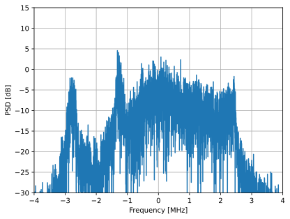
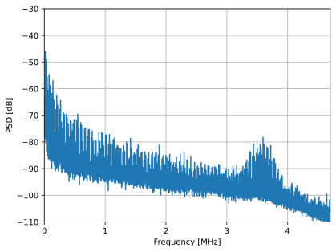
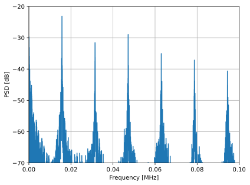
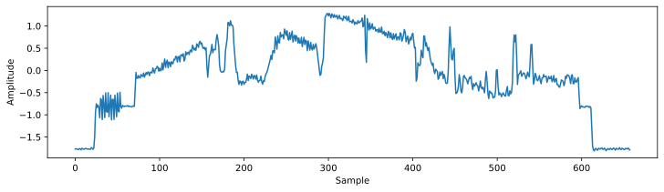
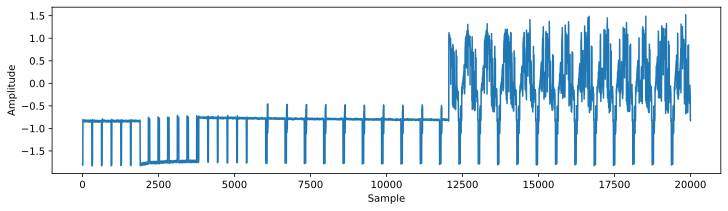
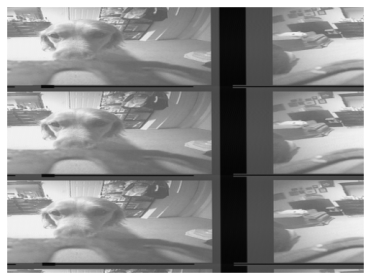
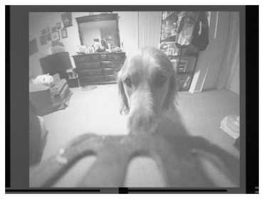

.. _fpv-chapter:

############################
Аналогові відеосигнали FPV
############################

У цьому розділі ми розглянемо аналогові відеосигнали, які використовують у більшості аматорських і саморобних FPV-дронів. Вони являють собою ЧМ-модульовані сигнали NTSC або PAL. Ми проаналізуємо ці сигнали та покажемо, як їх демодулювати, щоб відновити відеозображення.

****************
Вступ
****************

Аналоговий FPV (First-Person View, «вид від першої особи») — це традиційний спосіб передавання відео в реальному часі з радіокерованої моделі, найчастіше дрона або квадрокоптера, до пілота. Замість цифрового кодування відео аналогова система передає сигнал з камери у форматі NTSC або PAL, модулює ним частоту несної та випромінює його, зазвичай у діапазоні 5,8 ГГц (хоча також використовують діапазони 1,2–1,3 ГГц і 2,4 ГГц). Це не цифровий сигнал: тут немає ані стиснення, ані шифрування. Визначальна перевага аналогового FPV — надзвичайно мала затримка. Оскільки відео не стискається й майже не обробляється, пілот бачить зображення з камери практично миттєво, що критично важливо для швидкого й точного керування. Такі системи зазвичай недорогі: аналоговий FPV-відеопередавач можна придбати приблизно за 10 доларів, а моноблок із камерою та антеною — приблизно за 20 доларів. Більшість аналогових FPV-відеопередавачів також можуть передавати звуковий сигнал, який додається до відеосигналу. Для керування моделлю аналогове відео зазвичай поєднують з окремою радіосистемою, наприклад FrSky, FlySky, Spektrum або ELRS.

****************
Будова сигналу
****************

З погляду приймача після частотної демодуляції сигнал складається з таких компонентів:

Одна з приємних переваг ЧМ полягає в тому, що приймач не обов'язково має бути ідеально налаштований на центр сигналу. Поки весь сигнал перебуває в смузі огляду приймача, частотний демодулятор працюватиме належним чином. Причина в тому, що частотна демодуляція спирається на зміни частоти, а не на її абсолютне значення. Отже, достатньо, щоб сигнал мав належну потужність і вміщувався в смугу пропускання приймача. Проте бажано все ж розташувати його приблизно по центру, щоб перед частотною демодуляцією відфільтрувати зайвий шум.

Розгляньмо приклад. IQ-запис сигналу NTSC, використаний у коді цього розділу, можна завантажити `тут <https://raw.githubusercontent.com/777arc/PySDR/refs/heads/master/figure-generating-scripts/ntsc_remy_10MHz_5925Hz_500ksamples_cf32.iq>`_. Зауважте, що запис містить лише кілька кадрів.

На графіку спектральної густини потужності необробленого радіочастотного сигналу видно ЧМ-сигнал із центром на 0 Гц. Це відповідає частоті 5,925 ГГц, на яку було налаштовано SDR. Вона є центральною частотою одного зі стандартних каналів FPV. Ширина смуги сигналу становить приблизно 6 МГц.

Після частотної демодуляції, яку можна виконати одним рядком Python — :code:`np.angle(x[1:] * np.conj(x[:-1]))`, — отримаємо таку спектральну густину потужності:

У цьому прикладі звукового сигналу немає. Натомість добре видно складову кольоровості. Якщо збільшити низькочастотну ділянку, побачимо гармоніки на частотах, кратних 15,734 кГц (для PAL — 15,625 кГц). Вони відповідають сигналу горизонтальної синхронізації, який з'являється один раз у кожному рядку відео.

Щоб краще зрозуміти сигнал, погляньмо на нього в часовій області. На наступному рисунку показано один рядок відеосигналу, знову ж таки після частотної демодуляції. На початку та наприкінці бачимо імпульс горизонтальної синхронізації, а невеликі коливання одразу після нього — це пакет колірної синхронізації (color burst). Він слугує опорним сигналом, за яким приймач декодує інформацію про колір. Решта сигналу містить відеодані — як яскравість чорно-білого зображення, так і інформацію про колір.

Якщо збільшити часовий масштаб, можна побачити особливу послідовність синхронізації, яка з'являється один раз на кадр і називається імпульсом вертикальної синхронізації. Це незмінна послідовність імпульсів, яка повідомляє приймачу про початок нового кадру. На рисунку нижче її показано в першій половині графіка. Далі наведено ще 13 рядків сигналу, подібних до розглянутого вище, але в меншому масштабі.

********************************
Демодуляція відео
********************************

Щоб демодулювати відеосигнал і відновити зображення, виконаємо такі кроки:

#. Відфільтруємо звуковий сигнал.
#. Передискретизуємо сигнали яскравості та кольоровості рівно до 508 відліків на рядок, щоб кожен відлік відповідав одному пікселю.
#. Перетворимо одновимірний масив відліків на двовимірне зображення.
#. Масштабуємо значення до діапазону 0–255 і покажемо результат як зображення у відтінках сірого.

Зауважте, що цей процес відновлює лише чорно-білу складову. Інформація про колір закодована інакше, тому відновити її складніше.

Нижче наведено повний робочий приклад для запису, який можна завантажити `тут <https://raw.githubusercontent.com/777arc/PySDR/refs/heads/master/figure-generating-scripts/ntsc_remy_10MHz_5925Hz_500ksamples_cf32.iq>`_.

.. code-block:: python

    import numpy as np
    import matplotlib.pyplot as plt
    import scipy.signal as signal

    filename = 'ntsc_remy_10MHz_5925Hz_500ksamples_cf32.iq'
    x = np.fromfile(filename, dtype=np.complex64)
    sample_rate = 10e6
    color_subcarrier_freq = 3.579545e6 # NTSC. higher than luma carrier, not relative to center freq
    # color_subcarrier_freq = 4.43361875e6 # PAL and SECAM
    relative_audio_subcarrier_freq = 3.5e6 # the audio might show up at 5.5, 6.0, or 6.5 MHz

    # NTSC constants
    samples_per_line = 508
    lines_per_frame = 525
    refresh_Hz = 30.0/1.001 # almost exactly 29.97 # not exactly 30 Hz!! makes difference

    # PAL constants
    #samples_per_line = 512
    #lines_per_frame = 625 # (576 visible lines)
    #refresh_Hz = 25

    samples_per_frame = samples_per_line * lines_per_frame // 2 # NTSC's vertical sync repeats every field (half-frame), not every full frame
    line_Hz = refresh_Hz * lines_per_frame

    # FM demodulation
    x_demod = np.angle(x[1:] * np.conj(x[:-1]))

    # Filter out audio from demodded signal
    h = signal.firwin(301, 3e6, fs=sample_rate) # for the 10 Mhz recording
    x_demod = np.convolve(x_demod, h, 'same')

    # Resample luma and chroma to exactly L samples per line
    resampling_rate = samples_per_line / (sample_rate / line_Hz)
    resampling_rate *= 1.00003 # fixes the drift, not 100% sure where it comes from, perhaps sample clock offset
    x_demod = signal.resample(x_demod, int(len(x_demod)*resampling_rate))
    print("Resampling rate:", resampling_rate)

    # crop to 1 frames worth of samples (essentially a manual sync)
    if False:
        manually_tuned_offset = 122250 # for both frame sync and horizontal sync
        x_demod = x_demod[manually_tuned_offset:manually_tuned_offset+samples_per_frame]

    # reshape into 2D
    x_demod = x_demod[:len(x_demod) - (len(x_demod) % samples_per_line)] # trim to multiple of samples_per_line
    frame = x_demod.reshape(-1, samples_per_line) # type: ignore

    # Normalize to 0-255 and convert to uint8
    frame_norm = frame - np.min(frame)
    frame_norm = frame_norm / np.max(frame_norm)
    frame_uint8 = (frame_norm * 255).astype(np.uint8)

    # Display as single image with fixed scaling
    plt.imshow(frame_uint8, cmap='gray', aspect='auto', vmin=0, vmax=255)
    plt.axis('off')
    plt.show()

Якщо запустити цей код без змін, обробка почнеться від початку запису, тобто з випадкового моменту часу. Без синхронізації за імпульсом горизонтальної розгортки кожен рядок просто зсувається на однакову величину. Тому зображення все одно залишається зрозумілим, але зміщується по горизонталі та вертикалі. Крім того, ми одночасно бачимо відліки з кількох кадрів.

Обмежити дані одним кадром нескладно, адже значення :code:`samples_per_frame` ми вже обчислили. Проте спочатку потрібно синхронізуватися з початком кадру. Це можна зробити різними способами. Наприклад, можна знайти послідовність вертикальної синхронізації за допомогою кореляції — відтворивши її самостійно або використавши її запис із високим відношенням сигнал/шум. Також можна побудувати сигнал у часовій області й знайти послідовність візуально. Нижче показано зображення після синхронізації. У наведеному коді її виконано вручну: відомо, що новий кадр починається з відліку 122250.

Якщо хтось захоче запропонувати надійний демодулятор кольору мовою Python, будь ласка, зв'яжіться з автором. Водночас потрібно показати, що він працює з різними записами — наприклад, як із синтетичними, так і з реальними сигналами — без ручного налаштування параметрів.
