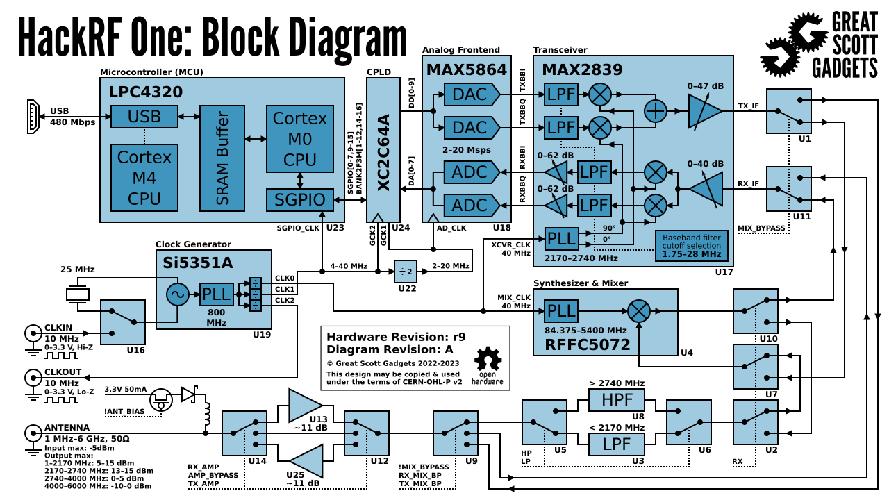

.. _hackrf-chapter:

####################
HackRF One у Python
####################

`HackRF One <https://greatscottgadgets.com/hackrf/one/>`_ від Great Scott Gadgets — це SDR з інтерфейсом USB 2.0, який може передавати або приймати сигнали в діапазоні від 1 МГц до 6 ГГц із частотою дискретизації від 2 до 20 МГц.  Його випустили у 2014 році й з того часу декілька разів незначно оновлювали.  Це один із небагатьох недорогих SDR з можливістю передавання, що працює від 1 МГц, тож він чудово підходить для застосувань у діапазоні КХ (наприклад, аматорський радіозв'язок), а також для експериментів на вищих частотах.  Максимальна потужність передавача 15 дБм також вища, ніж у більшості інших SDR; повну специфікацію передавальної потужності дивіться `на цій сторінці <https://hackrf.readthedocs.io/en/latest/faq.html#what-is-the-transmit-power-of-hackrf>`_.  HackRF працює у напівдуплексному режимі, тобто в будь-який момент часу він або передає, або приймає, і використовує 8-бітові АЦП/ЦАП.

.. image:: ../_images/hackrf1.jpeg
   :scale: 60 %
   :align: center
   :alt: HackRF One

********************************
Архітектура HackRF
********************************

HackRF побудований довкола мікросхеми Analog Devices MAX2839, яка є трансивером у діапазоні 2,3–2,7 ГГц і першопочатково була розроблена для WiMAX, у поєднанні з мікросхемою радіочастотного тракту MAX5864 (фактично це просто АЦП і ЦАП) та широкосмуговим синтезатором/VCO RFFC5072 (використовується для перетворення сигналу на вищу або нижчу частоту).  Це відрізняється від більшості інших недорогих SDR, які використовують єдину мікросхему типу RFIC.  Окрім встановлення частоти, яку генерує RFFC5072, усі інші параметри, що ми налаштовуємо, як-от атенюацію чи аналогові фільтри, розташовані в MAX2839.  Замість використання ПЛІС або системи на кристалі (SoC), як у багатьох SDR, HackRF застосовує програмовану логічну інтегральну схему (CPLD), що виконує функції «клейової» логіки, та мікроконтролер LPC4320 на базі ARM, який відповідає за всю вбудовану DSP-обробку та взаємодію з хостом через USB (передавання IQ-відліків в обох напрямках і керування налаштуваннями SDR).  Нижче наведено чудову блок-схему від Great Scott Gadgets, яка демонструє архітектуру останньої ревізії HackRF One:

HackRF One легко розширювати й модифікувати.  Усередині пластикового корпуса розташовано чотири шлейфи (P9, P20, P22 і P28); подробиці можна `знайти тут <https://hackrf.readthedocs.io/en/latest/expansion_interface.html>`_, але зверніть увагу, що 8 виводів GPIO і 4 аналогові входи АЦП знаходяться на шлейфі P20, тоді як SPI, I2C та UART — на P22.  Шлейф P28 можна використовувати для запуску/синхронізації операцій передавання/приймання з іншим пристроєм (наприклад, TR-перемикачем, зовнішнім підсилювачем або іншим HackRF) через входи та виходи тригера з затримкою менше одного періоду дискретизації.

.. image:: ../_images/hackrf2.jpeg
   :scale: 50 %
   :align: center
   :alt: Друкована плата HackRF One

Тактовий сигнал, що використовується і для гетеродина, і для АЦП/ЦАП, може надходити або з вбудованого генератора на 25 МГц, або з зовнішнього 10-МГц опорного генератора, поданого через SMA.  Незалежно від джерела такту, HackRF видає на виході CLKOUT сигнал 10 МГц — стандартну прямокутну хвилю 3,3 В, розраховану на високоомне навантаження.  Порт CLKIN призначений для подавання аналогічної 10-МГц прямокутної хвилі 3,3 В, і HackRF One використовуватиме зовнішній такт замість внутрішнього кварцу, щойно виявить сигнал на вході (зверніть увагу, перехід на CLKIN або назад відбувається лише під час початку операції передавання чи приймання).

********************************
Налаштування програмного й апаратного забезпечення
********************************

Установлення програмного забезпечення відбувається у два етапи: спершу ми встановимо основну бібліотеку HackRF від Great Scott Gadgets, а потім — Python API.

Встановлення бібліотеки HackRF
#############################

Наведені нижче дії були перевірені на Ubuntu 22.04 (використовувався коміт 17f3943 у березні 2025 року):

.. code-block:: bash

    git clone https://github.com/greatscottgadgets/hackrf.git
    cd hackrf
    git checkout 17f3943
    cd host
    mkdir build
    cd build
    cmake ..
    make
    sudo make install
    sudo ldconfig
    sudo cp /usr/local/bin/hackrf* /usr/bin/.

Після встановлення :code:`hackrf` ви зможете запускати такі утиліти:

* :code:`hackrf_info` — зчитування інформації про пристрій HackRF, як-от серійний номер і версія прошивки.
* :code:`hackrf_transfer` — передавання та приймання сигналів за допомогою HackRF. Вхідні/вихідні файли містять 8-бітові підписані квадратичні відліки.
* :code:`hackrf_sweep` — консольний аналізатор спектра.
* :code:`hackrf_clock` — читання й запис конфігурації вхідного та вихідного тактових сигналів.
* :code:`hackrf_operacake` — налаштування комутатора антен Opera Cake, підключеного до HackRF.
* :code:`hackrf_spiflash` — інструмент для запису нової прошивки в HackRF. Див. оновлення прошивки.
* :code:`hackrf_debug` — читання й запис регістрів та іншої низькорівневої конфігурації для налагодження.

Якщо ви використовуєте Ubuntu у WSL, на стороні Windows потрібно пробросити USB-пристрій HackRF у WSL. Спершу встановіть найновіший `usbipd utility msi <https://github.com/dorssel/usbipd-win/releases>`_ (у цьому посібнику передбачається, що у вас usbipd-win 4.0.0 або новіший), потім відкрийте PowerShell від імені адміністратора й виконайте:

.. code-block:: bash

    usbipd list
    <знайдіть BUSID із позначкою HackRF One та підставте його в обидві команди нижче>
    usbipd bind --busid 1-10
    usbipd attach --wsl --busid 1-10

У WSL ви маєте змогу запустити :code:`lsusb` і побачити новий запис :code:`Great Scott Gadgets HackRF One`.  За потреби ви можете додати прапорець :code:`--auto-attach` до команди :code:`usbipd attach`, щоб налаштувати автоматичне повторне підключення.  Нарешті, необхідно додати правило udev такою командою:

.. code-block:: bash

    echo 'ATTR{idVendor}=="1d50", ATTR{idProduct}=="6089", SYMLINK+="hackrf-one-%k", MODE="660", TAG+="uaccess"' | sudo tee /etc/udev/rules.d/53-hackrf.rules
    sudo udevadm trigger

Після цього від'єднайте та знову під'єднайте ваш HackRF One (і повторіть :code:`usbipd attach`).  Зверніть увагу, що в мене виникали проблеми з правами доступу на наступному кроці, доки я не перейшов на використання `WSL USB Manager <https://gitlab.com/alelec/wsl-usb-gui/-/releases>`_ на стороні Windows для керування пробросом у WSL — схоже, він також автоматично налаштовує правила udev.

Незалежно від того, працюєте ви на «чистому» Linux чи в WSL, на цьому етапі ви маєте змогу виконати :code:`hackrf_info` і побачити щось на кшталт:

.. code-block:: bash

    hackrf_info version: git-17f39433
    libhackrf version: git-17f39433 (0.9)
    Found HackRF
    Index: 0
    Serial number: 00000000000000007687865765a765
    Board ID Number: 2 (HackRF One)
    Firmware Version: 2024.02.1 (API:1.08)
    Part ID Number: 0xa000cb3c 0x004f4762
    Hardware Revision: r10
    Hardware appears to have been manufactured by Great Scott Gadgets.
    Hardware supported by installed firmware: HackRF One

Також зробімо запис IQ-сигналу FM-діапазону шириною 10 МГц із центром на 100 МГц, збережемо 1 мільйон відліків:

.. code-block:: bash

    hackrf_transfer -r out.iq -f 100000000 -s 10000000 -n 1000000 -a 0 -l 30 -g 50

Ця утиліта створює двійковий IQ-файл із відліками типу int8 (2 байти на IQ-відлік), у нашому випадку його розмір має становити 2 МБ.  Якщо цікаво, запис можна прочитати в Python за допомогою такого коду:

.. code-block:: python

    import numpy as np
    samples = np.fromfile('out.iq', dtype=np.int8)
    samples = samples[::2] + 1j * samples[1::2]
    print(len(samples))
    print(samples[0:10])
    print(np.max(samples))

Якщо максимальне значення дорівнює 127 (це означає, що ви наситили АЦП), зменште два значення підсилення наприкінці команди.

Встановлення Python API
#########################

Нарешті, потрібно встановити `Python-зв'язки <https://github.com/GvozdevLeonid/python_hackrf>`_ для HackRF One, які підтримує `GvozdevLeonid <https://github.com/GvozdevLeonid>`_.  Ці інструкції були перевірені на Ubuntu 22.04 04.11.2024 з використанням останньої гілки main.

.. code-block:: bash

    sudo apt install libusb-1.0-0-dev
    pip install python_hackrf==1.2.7

Перевірити встановлення можна, виконавши наведений нижче код; якщо помилок немає (і вивід теж відсутній), усе працює як слід!

.. code-block:: python

    from python_hackrf import pyhackrf  # type: ignore
    pyhackrf.pyhackrf_init()
    sdr = pyhackrf.pyhackrf_open()
    sdr.pyhackrf_set_sample_rate(10e6)
    sdr.pyhackrf_set_antenna_enable(False)
    sdr.pyhackrf_set_freq(100e6)
    sdr.pyhackrf_set_amp_enable(False)
    sdr.pyhackrf_set_lna_gain(30) # підсилення LNA — від 0 до 40 дБ із кроком 8 дБ
    sdr.pyhackrf_set_vga_gain(50) # підсилення VGA — від 0 до 62 дБ із кроком 2 дБ
    sdr.pyhackrf_close()

Для фактичної перевірки приймання відліків дивіться приклад коду нижче.

********************************
Підсилення передавача та приймача
********************************

Приймальна частина
############

HackRF One на прийомі має три каскади підсилення:

* РЧ (:code:`amp`, або 0, або 11 дБ)
* ПЧ (:code:`lna`, від 0 до 40 дБ із кроком 8 дБ)
* базова смуга (:code:`vga`, від 0 до 62 дБ із кроком 2 дБ)

Для приймання більшості сигналів рекомендується залишати РЧ-підсилювач вимкненим (0 дБ), якщо тільки ви не працюєте з украй слабким сигналом і поруч точно немає потужних сигналів.  Найважливіший каскад — підсилення ПЧ (LNA); саме його слід регулювати першим, щоб максимізувати SNR і не наситити АЦП.  Підсилення базової смуги можна залишити відносно високим, наприклад 50 дБ.

Передавальна частина
#############

На передаванні є два каскади підсилення:

* РЧ (або 0, або 11 дБ)
* ПЧ (від 0 до 47 дБ із кроком 1 дБ)

Зазвичай варто вмикати РЧ-підсилювач, а потім налаштовувати підсилення ПЧ відповідно до ваших потреб.

**************************************************
Приймання IQ-відліків у Python за допомогою HackRF
**************************************************

Наразі пакет :code:`python_hackrf` не містить жодних зручних функцій для приймання відліків — це лише набір Python-зв'язків до C++ API HackRF.  Це означає, що для отримання IQ-відліків нам доведеться написати доволі багато коду.  Пакет Python використовує функцію зворотного виклику для передавання чергової порції відліків; ми маємо її реалізувати, але вона викликатиметься автоматично, щойно HackRF підготує нові дані.  Ця функція зворотного виклику завжди повинна мати три конкретні аргументи і повертати :code:`0`, якщо ми хочемо отримати наступний блок відліків.  У наведеному нижче коді в кожному виклику нашого зворотного виклику ми перетворюємо відліки на комплексний тип NumPy, масштабуємо їх у діапазон від –1 до +1 і зберігаємо в більшому масиві :code:`samples`.

Після виконання коду, якщо на графіку часу відліки досягають меж АЦП –1 та +1, зменшуйте :code:`lna_gain` на 3 дБ, доки значення явно не перестануть впиратися в обмеження.

.. code-block:: python

    from python_hackrf import pyhackrf  # type: ignore
    import matplotlib.pyplot as plt
    import numpy as np
    import time

    # Ці налаштування мають збігатися з прикладом hackrf_transfer у підручнику,
    # і отриманий водоспад повинен виглядати приблизно так само
    recording_time = 1  # секунди
    center_freq = 100e6  # Гц
    sample_rate = 10e6
    baseband_filter = 7.5e6
    lna_gain = 30 # від 0 до 40 дБ із кроком 8 дБ
    vga_gain = 50 # від 0 до 62 дБ із кроком 2 дБ

    pyhackrf.pyhackrf_init()
    sdr = pyhackrf.pyhackrf_open()

    allowed_baseband_filter = pyhackrf.pyhackrf_compute_baseband_filter_bw_round_down_lt(baseband_filter) # обчислюємо підтримувану смугу відносно бажаної

    sdr.pyhackrf_set_sample_rate(sample_rate)
    sdr.pyhackrf_set_baseband_filter_bandwidth(allowed_baseband_filter)
    sdr.pyhackrf_set_antenna_enable(False)  # схоже, цей параметр вмикає або вимикає живлення на антенному порту. False за замовчуванням, прошивка автоматично вимикає його після повернення до режиму IDLE

    sdr.pyhackrf_set_freq(center_freq)
    sdr.pyhackrf_set_amp_enable(False)  # False за замовчуванням
    sdr.pyhackrf_set_lna_gain(lna_gain)  # підсилення LNA — від 0 до 40 дБ із кроком 8 дБ
    sdr.pyhackrf_set_vga_gain(vga_gain)  # підсилення VGA — від 0 до 62 дБ із кроком 2 дБ

    print(f'center_freq: {center_freq} sample_rate: {sample_rate} baseband_filter: {allowed_baseband_filter}')

    num_samples = int(recording_time * sample_rate)
    samples = np.zeros(num_samples, dtype=np.complex64)
    last_idx = 0

    def rx_callback(device, buffer, buffer_length, valid_length):  # ця функція зворотного виклику завжди має приймати саме ці чотири аргументи
        global samples, last_idx

        accepted = valid_length // 2
        accepted_samples = buffer[:valid_length].astype(np.int8) # від -128 до 127
        accepted_samples = accepted_samples[0::2] + 1j * accepted_samples[1::2]  # перетворюємо на комплексний тип (деінтерливуємо IQ)
        accepted_samples /= 128 # від -1 до +1
        samples[last_idx: last_idx + accepted] = accepted_samples

        last_idx += accepted

        return 0

    sdr.set_rx_callback(rx_callback)
    sdr.pyhackrf_start_rx()
    print('is_streaming', sdr.pyhackrf_is_streaming())

    time.sleep(recording_time)

    sdr.pyhackrf_stop_rx()
    sdr.pyhackrf_close()
    pyhackrf.pyhackrf_exit()

    samples = samples[100000:] # на всяк випадок відкидаємо перші 100 тис. відліків через перехідні процеси

    fft_size = 2048
    num_rows = len(samples) // fft_size
    spectrogram = np.zeros((num_rows, fft_size))
    for i in range(num_rows):
        spectrogram[i, :] = 10 * np.log10(np.abs(np.fft.fftshift(np.fft.fft(samples[i * fft_size:(i+1) * fft_size]))) ** 2)
    extent = [(center_freq + sample_rate / -2) / 1e6, (center_freq + sample_rate / 2) / 1e6, len(samples) / sample_rate, 0]

    plt.figure(0)
    plt.imshow(spectrogram, aspect='auto', extent=extent) # type: ignore
    plt.xlabel("Частота [МГц]")
    plt.ylabel("Час [с]")

    plt.figure(1)
    plt.plot(np.real(samples[0:10000]))
    plt.plot(np.imag(samples[0:10000]))
    plt.xlabel("Відліки")
    plt.ylabel("Амплітуда")
    plt.legend(["Дійсна", "Уявна"])

    plt.show()

Під час використання антени, здатної приймати FM-діапазон, ви маєте отримати щось подібне до наведеного нижче, із декількома FM-станціями, видимими на водоспаді:

.. image:: ../_images/hackrf_time_screenshot.png
   :align: center
   :scale: 50 %
   :alt: Часовий графік відліків, отриманих із HackRF

.. image:: ../_images/hackrf_freq_screenshot.png
   :align: center
   :scale: 50 %
   :alt: Водоспад (частота в часі) для відліків, отриманих із HackRF

