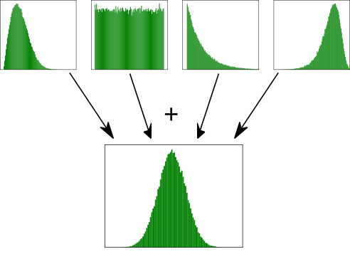
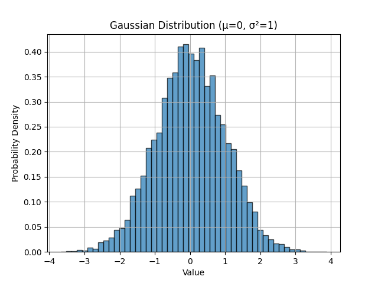
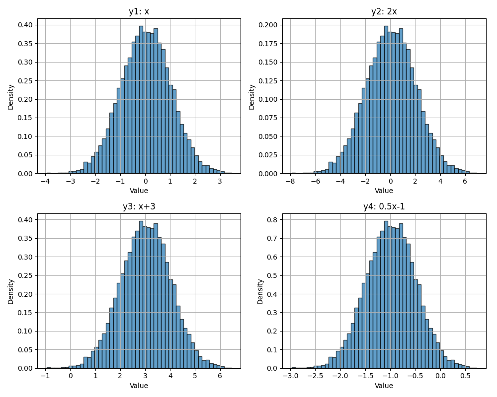
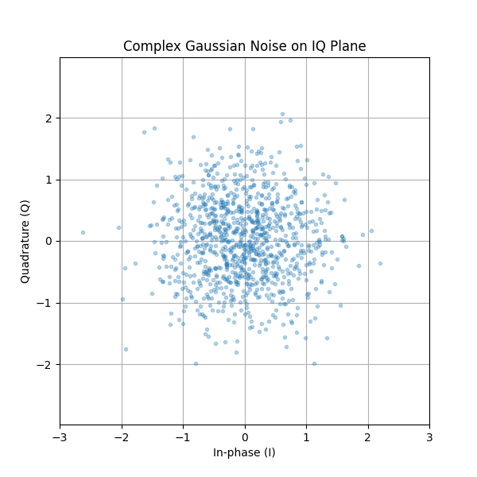

.. _noise-chapter:

##########################
Шум і випадкові величини
##########################

У цій главі ми обговоримо шум, включаючи те, як він моделюється й обробляється в системі бездротового зв'язку.  Поняття включають AWGN, комплексний шум і SNR/SINR.  Ми також познайомимося з децибелами (дБ), оскільки вони широко використовуються в бездротовому зв'язку та SDR.  Насамкінець ми глибше зануримося у фундаментальні поняття випадкових величин і випадкових процесів, які є необхідними для розуміння шуму, впливу каналу та багатьох методів обробки сигналів у бездротовому зв'язку. Ми розглянемо розподіли ймовірностей, математичне сподівання, дисперсію, а також те, як випадкові процеси змінюються в часі. Ці поняття утворюють математичний фундамент для аналізу шуму та багатьох інших тем у SDR і DSP.

************************
Гауссівський шум
************************

Більшість людей знайомі з поняттям шуму: небажані флуктуації, які можуть затьмарювати бажаний сигнал (сигнали). Шум виглядає приблизно так:

.. image:: ../_images/noise.png
   :scale: 70 %
   :align: center
   :target: ../_images/noise.png

Зверніть увагу, що середнє значення дорівнює нулю на часовому графіку.  Якби середнє значення не дорівнювало нулю, то ми могли б відняти середнє значення, назвати його зсувом, і у нас залишилося б середнє значення, що дорівнює нулю.  Також зверніть увагу, що окремі точки на графіку *не* "рівномірно випадкові", тобто більші значення зустрічаються рідше, більшість точок ближче до нуля.

Ми називаємо цей тип шуму "гаусівським шумом". Це хороша модель для типу шуму, який походить від багатьох природних джерел, таких як теплові коливання атомів у кремнії радіочастотних компонентів нашого приймача.  **Центральна гранична теорема** говорить нам, що сума багатьох випадкових процесів буде мати гаусівський розподіл, навіть якщо окремі процеси мають інші розподіли.  Іншими словами, коли відбувається і накопичується багато випадкових подій, результат виглядає приблизно гауссівським, навіть якщо окремі події не розподілені за гауссівським законом.

Розподіл Гауса також називають "нормальним" розподілом (згадайте криву дзвону).

Розподіл Гауса має два параметри: середнє значення і дисперсію.  Ми вже обговорювали, як середнє значення можна вважати нульовим, тому що ви завжди можете вилучити середнє значення, або зміщення, якщо воно не дорівнює нулю.  Дисперсія показує, наскільки "сильним" є шум.  Вища дисперсія призводить до більших чисел.  Саме з цієї причини дисперсія визначає потужність шуму.

Дисперсія дорівнює середньоквадратичному відхиленню в квадраті (:math:`\sigma^2`).

************************
Децибели (дБ)
************************

Ми зробимо невеликий екскурс, щоб формально ввести дБ.  Можливо, ви вже чули про дБ, і якщо ви вже знайомі з ним, можете пропустити цей розділ.

Робота в дБ надзвичайно корисна, коли нам потрібно мати справу з малими і великими числами одночасно, або просто з купою дуже великих чисел. Розглянемо, наскільки громіздкою була б робота з числами шкали в Прикладі 1 і Прикладі 2.

Приклад 1: Сигнал 1 приймається потужністю 2 Вт, а рівень шуму становить 0,0000002 Вт.

Приклад 2: Сміттєпровід працює в 100 000 разів голосніше, ніж у тихій сільській місцевості, а ланцюгова пила в 10 000 разів голосніше, ніж сміттєпровід (з точки зору потужності звукових хвиль).

Без децибел, тобто працюючи в звичайних "лінійних" термінах, ми повинні використовувати багато 0 для представлення значень у прикладах 1 і 2. Чесно кажучи, якби ми побудували графік чогось подібного до сигналу 1 у часі, ми б навіть не побачили рівень шуму. Наприклад, якби шкала осі Y змінювалася від 0 до 3 Вт, шум був би надто малим, щоб його можна було побачити на графіку. Щоб представити ці шкали одночасно, ми працюємо в логарифмічній шкалі.

Щоб ще більше проілюструвати проблеми масштабу, з якими ми стикаємося при обробці сигналів, розглянемо наведені нижче водоспади трьох однакових сигналів. Ліворуч — вихідний сигнал у лінійному масштабі, а праворуч — сигнали, перетворені в логарифмічну шкалу (дБ).  Обидва представлення використовують однакову кольорову карту, де синій колір означає найнижче значення, а жовтий — найвище.  Ви ледве можете побачити сигнал зліва в лінійній шкалі.

.. image:: ../_images/linear_vs_log.png
   :scale: 70 %
   :align: center
   :alt: Зображення того, чому важливо розуміти дБ або децибели, показуючи спектрограму з використанням лінійної та логарифмічної шкали
   :target: ../_images/linear_vs_log.png

Для заданого значення x ми можемо представити x у дБ за допомогою наступної формули:

.. math::
    x_{dB} = 10 \log_{10} x

У мові Python:

.. code-block:: python

 x_db = 10.0 * np.log10(x)

Ви могли бачити, що :code:`10 *` може бути :code:`20 *` в інших галузях.  Щоразу, коли ви маєте справу з якоюсь потужністю, ви використовуєте 10, і ви використовуєте 20, якщо ви маєте справу з неенергетичними величинами, такими як напруга або струм.  В DSP ми, як правило, маємо справу з потужністю.

Ми перетворюємо з дБ назад в лінійні (звичайні числа) за допомогою:

.. math::
    x = 10^{x_{dB}/10}

У Python:

.. code-block:: python

 x = 10.0 ** (x_db / 10.0)

Не зациклюйтеся на формулі, оскільки тут є ключова концепція, яку потрібно винести.  В DSP ми маємо справу з дуже великими і дуже малими числами одночасно (наприклад, рівень сигналу в порівнянні з рівнем шуму). Логарифмічна шкала в дБ дозволяє нам мати більший динамічний діапазон, коли ми виражаємо числа або будуємо графіки.  Вона також надає деякі зручності, наприклад, можливість додавання, коли ми зазвичай множимо (як ми побачимо у розділі :ref:`link-budgets-chapter`).

Деякі типові помилки, з якими можуть зіткнутися новачки у дБ, такі:

1. Використання натурального лога замість лога з основою 10, оскільки функція log() у більшості мов програмування насправді є натуральним логом.
2. Забути включити дБ при вираженні числа або позначенні осі.  Якщо ми маємо справу з дБ, нам потрібно десь його позначити.
3. Коли ви використовуєте дБ, ви додаєте/віднімаєте значення замість того, щоб множити/ділити, наприклад:

.. image:: ../_images/db.png
   :scale: 80 %
   :align: center
   :target: ../_images/db.png

Також важливо розуміти, що дБ технічно не є "одиницею".  Значення в дБ саме по собі не має одиниць виміру, наприклад, якщо щось в 2 рази більше, то одиниць виміру немає, поки я не скажу вам одиниці виміру. дБ — це відносна величина.  В аудіо, коли говорять дБ, насправді мають на увазі дБА, що є одиницею вимірювання рівня звуку (A — це одиниці). У бездротовому зв'язку ми зазвичай використовуємо вати для позначення фактичного рівня потужності.  Тому ви можете побачити dBW як одиницю, яка відноситься до 1 Вт. Ви також можете побачити dBmW (часто пишуть dBm для скорочення), яка відноситься до 1 мВт.   Наприклад, хтось може сказати "наш передавач налаштований на 3 дБВт" (тобто 2 Вт).  Іноді ми використовуємо дБ сам по собі, маючи на увазі, що він відносний і не має одиниць виміру. Можна сказати: "наш сигнал був прийнятий на 20 дБ вище рівня шуму".  Ось невелика підказка: 0 дБм = -30 дБВт.

Ось кілька поширених перетворень, які я рекомендую запам'ятати:

========  ======
Лінійні     дБ
========  ======
1x        0 дБ
2x        3 дБ
10x       10 дБ
0.5x      -3 дБ
0.1x      -10 дБ
100x      20 дБ
1000x     30 дБ
10000x    40 дБ
========  ======

Нарешті, щоб розглянути ці цифри в перспективі, нижче наведені деякі приклади рівнів потужності в дБм:

=========== ============================================================================================
80 дБм      Передавальна потужність сільської FM-радіостанції
62 дБм      Максимальна потужність радіоаматорського передавача
60 дБм      Потужність типової домашньої мікрохвильової печі
37 дБм      Максимальна потужність типової портативної радіостанції CB або радіоаматорської радіостанції
27 дБм      Типова потужність передавача мобільного телефону
15 дБм      Типова потужність передачі WiFi
10 дБм      Максимальна потужність передачі Bluetooth (версія 4)
-10 дБм     Максимальна потужність прийому для WiFi
-70 дБм     Приклад прийнятої потужності для радіоаматорського сигналу
-100 дБм    Мінімальна потужність прийому для WiFi
-127 дБм    Типова потужність прийому від супутників GPS
=========== ============================================================================================

*************************
Шум у частотній області
*************************

У розділі :ref:`freq-domain-chapter` ми розглянули "пари Фур'є", тобто те, як певний сигнал часової області виглядає у частотній області.  Як же виглядає гаусівський шум у частотній області?  На наступних графіках показано деякий змодельований шум у часовій області (вгорі) і графік спектральної щільності потужності (PSD) цього шуму (внизу).  Ці графіки взято з GNU Radio.

.. image:: ../_images/noise_freq.png
   :scale: 110 %
   :align: center
   :alt: AWGN у часовій області - це також гаусівський шум у частотній області, хоча він виглядає як плоска лінія, якщо взяти амплітуду і виконати усереднення
   :target: ../_images/noise_freq.png

Ми бачимо, що він виглядає приблизно однаково на всіх частотах і є досить плоским.  Виходить, що гаусівський шум у часовій області є також гаусівським шумом у частотній області.  Так чому ж два графіки вище не виглядають однаково?  Це тому, що графік в частотній області показує величину ШПФ, тому там будуть тільки додатні числа. Важливо, що він використовує логарифмічну шкалу, або показує величину в дБ.  Інакше ці графіки виглядали б однаково.  Ми можемо довести це собі, згенерувавши деякий шум (у часовій області) у Python, а потім отримавши ШПФ.

.. code-block:: python

 import numpy as np
 import matplotlib.pyplot as plt
 
 N = 1024 # number of samples to simulate, choose any number you want
 x = np.random.randn(N)
 plt.plot(x, '.-')
 plt.show()
 
 X = np.fft.fftshift(np.fft.fft(x))
 X = X[N//2:] # only look at positive frequencies.  remember // is just an integer divide
 plt.plot(np.real(X), '.-')
 plt.show()

Зверніть увагу, що функція :code:`randn()` за замовчуванням використовує mean = 0 і variance = 1.  Обидва графіки будуть виглядати приблизно так:

.. image:: ../_images/noise_python.png
   :scale: 100 %
   :align: center
   :alt: Приклад імітації білого шуму у Python
   :target: ../_images/noise_python.png

Наведена нижче схема GNU Radio генерує комплексний гаусівський шум і показує його трьома способами одночасно: у часі, у частоті та у вигляді гістограми.  Коли ви запустите її вперше, графік у частотній області виглядатиме як трава, а не як пласка лінія на рисунку вище.  Відкрийте панель керування частотного стоку й увімкніть усереднення — і графік одразу вирівняється, адже це той самий шум, лише усереднений по багатьох ШПФ.  Гістограма є гарною перевіркою того, що відліки справді мають гаусівський розподіл.  Там також домішано тон із регульованою амплітудою, тож ви можете зміщувати сигнал і шум один відносно одного й у найбуквальніший спосіб спостерігати, як змінюється SNR.

.. raw:: html

   <!-- ════════ GNU RADIO WORLD EMBED ════════ -->
   <iframe
             src="https://gnuradioworld.com/?embed=1&zoom=60%#example=analog/noise_awgn_psd"
             title="PySDR: AWGN in Time, Frequency, and Distribution"
             loading="lazy"
             allow="cross-origin-isolated; fullscreen"
             style="display:block; width:100%; aspect-ratio:21/9; min-height:345px; border:0; margin:18px auto 26px;"
           ></iframe>
   <!-- ════════ /GNU RADIO WORLD EMBED ════════ -->

Потім ви можете створити пласку PSD, яку ми мали у GNU Radio, взявши логарифм і усереднивши багато таких графіків разом.  Сигнал, який ми згенерували і взяли ШПФ, був дійсним сигналом (а не комплексним), і ШПФ будь-якого дійсного сигналу матиме відповідні від'ємні та додатні частини, тому ми зберегли лише додатну частину результату ШПФ (2-гу половину).  Але чому ми згенерували лише "дійсний" шум, і як комплексні сигнали пов'язані з цим?

Більше інформації про цей приклад GNU Radio World можна знайти `тут <https://gnuradioworld.com/examples/analog/noise-awgn-psd/>`_.

*************************
Комплексний шум
*************************

"Комплексний гаусівський" шум — це те, що ми відчуваємо, коли маємо сигнал в основній смузі частот; потужність шуму ділиться між дійсною та уявною частинами порівну.  І найголовніше, що дійсна та уявна частини не залежать одна від одної; знаючи значення однієї з них, ви не отримаєте значення іншої.

Ми можемо згенерувати комплексний гаусівський шум у Python за допомогою:

.. code-block:: python

 n = np.random.randn() + 1j * np.random.randn()

Але зачекайте!  Наведене вище рівняння не генерує таку ж "кількість" шуму, як :code:`np.random.randn()`, з точки зору потужності (відомої як потужність шуму).  Ми можемо знайти середню потужність сигналу (або шуму) з нульовим середнім значенням за допомогою:

.. code-block:: python

 power = np.var(x)

де np.var() — функція для дисперсії.  Тут потужність нашого сигналу n дорівнює 2.  Для того, щоб згенерувати комплексний шум з "одиничною потужністю", тобто потужністю 1 (що робить речі зручними), ми повинні використовувати:

.. code-block:: python

 n = (np.random.randn(N) + 1j*np.random.randn(N))/np.sqrt(2) # AWGN with unity power

Для побудови графіка комплексного шуму в часовій області, як і будь-якого комплексного сигналу, нам знадобляться два рядки:

.. code-block:: python

 n = (np.random.randn(N) + 1j*np.random.randn(N))/np.sqrt(2)
 plt.plot(np.real(n),'.-')
 plt.plot(np.imag(n),'.-')
 plt.legend(['real','imag'])
 plt.show()

.. image:: ../_images/noise3.png
   :scale: 80 %
   :align: center
   :alt: Комплексний шум, змодельований у Python
   :target: ../_images/noise3.png

Ви можете бачити, що дійсна та уявна частини повністю незалежні.

Як виглядає комплексний гаусівський шум на IQ-діаграмі?  Пам'ятайте, що графік IQ показує дійсну частину (горизонтальна вісь) і уявну частину (вертикальна вісь), обидві з яких є незалежними випадковими гаусівськими величинами.

.. code-block:: python

 plt.plot(np.real(n),np.imag(n),'.')
 plt.grid(True, which='both')
 plt.axis([-2, 2, -2, 2])
 plt.show()

.. image:: ../_images/noise_iq.png
   :scale: 60 %
   :align: center
   :alt: Комплексний шум на графіку IQ або сузір'їв, змодельований у Python
   :target: ../_images/noise_iq.png

Це виглядає так, як ми і очікували: випадкова пляма з центром в 0 + 0j, або в початку координат.  Заради інтересу спробуємо додати шум до QPSK-сигналу, щоб побачити, як виглядає IQ-діаграма:

.. image:: ../_images/noisey_qpsk.png
   :scale: 60 %
   :align: center
   :alt: Симуляція зашумленого QPSK у Python
   :target: ../_images/noisey_qpsk.png

А що станеться, коли шум буде сильнішим?

.. image:: ../_images/noisey_qpsk2.png
   :scale: 50 %
   :align: center
   :alt: Зашумлений QPSK із сильнішим шумом, змодельований у Python
   :target: ../_images/noisey_qpsk2.png

Ми починаємо розуміти, чому передача даних бездротовим способом не така проста. Ми хочемо відправити якомога більше бітів на символ, але якщо шум занадто високий, ми отримаємо помилкові біти на приймальному боці.

*************************
AWGN
*************************

Additive White Gaussian Noise (AWGN) — це абревіатура, яку ви часто чуєте в світі DSP і SDR.  Про GN, гауссівський шум, ми вже говорили.  Адитивний просто означає, що шум додається до прийнятого сигналу.  Білий у частотній області означає, що спектр є плоским у всій смузі спостереження.  На практиці він майже завжди буде білим, або приблизно білим.  У цьому підручнику ми будемо використовувати AWGN як єдину форму шуму, коли маємо справу з лініями зв'язку, бюджетами ліній зв'язку тощо.  Шум, який не є AWGN, як правило, є вузькоспеціалізованою темою.

*************************
SNR і SINR
*************************

Відношення сигнал/шум (SNR) — це те, як ми будемо вимірювати різницю в силі між сигналом і шумом. Це відношення не має одиниць виміру.  На практиці SNR майже завжди вимірюється в дБ.  Часто при моделюванні ми кодуємо сигнали таким чином, щоб вони мали одиничну потужність (потужність = 1).  Таким чином, ми можемо створити SNR 10 дБ, генеруючи шум потужністю -10 дБ, регулюючи дисперсію під час генерації шуму.

.. math::
   \mathrm{SNR} = \frac{P_{signal}}{P_{noise}}

.. math::
   \mathrm{SNR_{dB}} = P_{signal\_dB} - P_{noise\_dB}

Якщо хтось каже "SNR = 0 дБ", це означає, що потужність сигналу і шуму однакова.  Додатне значення SNR означає, що наш сигнал має більшу потужність, ніж шум, тоді як від'ємне значення SNR означає, що шум має більшу потужність.  Виявлення сигналів з від'ємним SNR зазвичай досить складне.

Як ми вже згадували раніше, потужність сигналу дорівнює дисперсії сигналу.  Отже, ми можемо представити SNR як відношення дисперсії сигналу до дисперсії шуму:

.. math::
   \mathrm{SNR} = \frac{P_{signal}}{P_{noise}} = \frac{\sigma^2_{signal}}{\sigma^2_{noise}}

Відношення сигнал/завада плюс шум (SINR) по суті те саме, що й SNR, за винятком того, що до знаменника ви додаєте заваду разом із шумом.

.. math::
   \mathrm{SINR} = \frac{P_{signal}}{P_{interference} + P_{noise}}

Що є завадою, залежить від застосування/ситуації, але зазвичай це інший сигнал, який заважає сигналу, що становить інтерес (SOI), і який або перекриває SOI по частоті, або не може бути відфільтрований з якихось причин.

*************************************
Глибше занурення у випадкові величини
*************************************

Досі ми уникали надмірної математики, але тепер ми зробимо крок назад і введемо поняття випадкових величин та того, як вони використовуються в контексті бездротового зв'язку і SDR. **Випадкова величина** — це математичне поняття, яке ставить у відповідність результатам випадкового експерименту числові значення. Випадкові величини представляють величини, значення яких є невизначеними, доки їх не спостерігають або не виміряють, як наші відліки шуму.  Уявіть кидання шестигранного кубика. Перш ніж ви його кинете, ви не знаєте, яке число випаде. Ми можемо визначити випадкову величину :math:`X`, яка представляє результат кидка. Значення :math:`X` є одним із {1, 2, 3, 4, 5, 6}, але ми не знаємо, яким саме, доки насправді не кинемо кубик.

У контексті бездротового зв'язку і SDR випадкові величини зустрічаються всюди:

* Тепловий шум у приймачі моделюється як випадкова величина в кожен момент часу
* Амплітуда прийнятого сигналу, на який впливає багатопроменеве завмирання, є випадковою
* Фазовий зсув, внесений змінним каналом, можна змоделювати як випадкову величину між :math:`0` і :math:`2\pi`
* Навіть біти даних, які ми передаємо, можна розглядати як випадкові величини

**Один відлік проти багатьох відліків**

Це надзвичайно важлива відмінність, яка часто спричиняє плутанину:

* **Одна реалізація** або **один відлік** випадкової величини — це просто одне число, один результат випадкового експерименту
* Щоб охарактеризувати випадкову величину (знайти її середнє, розкид тощо), нам потрібно **багато реалізацій** — багато результатів

Наприклад, якщо ви викличете ``np.random.randn()`` у Python без жодних аргументів, вона поверне одне випадкове число, взяте з гауссівського розподілу. Це одне число майже нічого не говорить вам про сам розподіл. Але якщо ви викличете ``np.random.randn(10000)`` і згенеруєте 10 000 відліків, ви зможете оцінити властивості розподілу, такі як його середнє значення і дисперсія.

.. code-block:: python

 import numpy as np

 # Single sample - just one number
 x_single = np.random.randn()
 print(x_single)  # might be 0.534, -1.23, or any other value

 # Many samples - now we can characterize the distribution
 x_many = np.random.randn(10000)
 print(np.mean(x_many))  # will be close to 0
 print(np.var(x_many))   # will be close to 1

Спільні розподіли
##################

Досі ми зосереджувалися на окремих випадкових величинах. Коли ми маємо справу з двома або більше випадковими величинами одночасно, ми використовуємо **спільний розподіл**.

Для неперервних величин :math:`X` і :math:`Y` він описується **спільною щільністю ймовірності (PDF)**:

.. math::
   f_{X,Y}(x,y)

Спільна щільність ймовірності говорить нам, наскільки ймовірно, що :math:`X` набуде значення :math:`x` *і* :math:`Y` набуде значення :math:`y` одночасно.

Зі спільної щільності ймовірності ми можемо обчислити:

* Маргінальні щільності (наприклад, :math:`f_X(x)` або :math:`f_Y(y)`)
* Математичні сподівання, такі як :math:`E[XY]`
* Коваріацію і кореляцію
* Ймовірності, що стосуються обох величин

Наприклад, маргінальна щільність :math:`X` отримується інтегруванням по :math:`Y`:

.. math::
   f_X(x) = \int_{-\infty}^{\infty} f_{X,Y}(x,y)\,dy

Спільні розподіли є математичним фундаментом для розуміння залежності, кореляції та незалежності між випадковими величинами.

Розподіли ймовірностей
#######################

**Розподіл ймовірностей** описує, наскільки ймовірними є різні значення випадкової величини. Для неперервної випадкової величини ми використовуємо **функцію щільності ймовірності (PDF)**, що позначається :math:`f_X(x)`. Щільність ймовірності говорить нам про відносну правдоподібність того, що випадкова величина набуде тих чи інших значень.

Найважливішим розподілом у SDR і зв'язку є **гауссівський (нормальний) розподіл**. Гауссівська випадкова величина :math:`X` із середнім значенням :math:`\mu` і дисперсією :math:`\sigma^2` має щільність:

.. math::
   f_X(x) = \frac{1}{\sqrt{2\pi\sigma^2}} e^{-\frac{(x-\mu)^2}{2\sigma^2}}

Це та сама відома "крива дзвону", яку ви, ймовірно, вже бачили. Розподіл повністю характеризується двома параметрами:

* **Середнє значення** :math:`\mu`: центр розподілу
* **Дисперсія** :math:`\sigma^2`: наскільки розтягнутим є розподіл (середньоквадратичне відхилення :math:`\sigma` є квадратним коренем із дисперсії)

У Python ``np.random.randn()`` генерує відліки зі **стандартного гауссівського** розподілу з :math:`\mu = 0` і :math:`\sigma^2 = 1`. Ми можемо це візуалізувати:

.. code-block:: python

 import numpy as np
 import matplotlib.pyplot as plt

 # Generate 10,000 samples from standard Gaussian
 x = np.random.randn(10000)

 # Create histogram to visualize the distribution
 plt.hist(x, bins=50, density=True, alpha=0.7, edgecolor='black')
 plt.xlabel('Value')
 plt.ylabel('Probability Density')
 plt.title('Gaussian Distribution (μ=0, σ²=1)')
 plt.grid(True)
 plt.show()

Математичне сподівання (середнє значення)
##########################################

**Математичне сподівання**, або **очікуване значення** випадкової величини, що позначається :math:`E[X]` або :math:`\mu`, представляє її середнє значення по багатьох реалізаціях. Для неперервної випадкової величини зі щільністю :math:`f_X(x)` математичне сподівання дорівнює:

.. math::
   E[X] = \int_{-\infty}^{\infty} x \cdot f_X(x) \, dx

На практиці, коли ми маємо :math:`N` відліків :math:`x_1, x_2, \ldots, x_N`, взятих із розподілу, ми оцінюємо математичне сподівання за допомогою **вибіркового середнього**:

.. math::
   \hat{\mu} = \frac{1}{N} \sum_{n=1}^{N} x_n

Математичне сподівання є **лінійним оператором**, а це означає, що:

* :math:`E[aX + b] = aE[X] + b` для констант :math:`a` і :math:`b`
* :math:`E[X + Y] = E[X] + E[Y]` для будь-яких двох випадкових величин

Ця лінійність є надзвичайно корисною в обробці сигналів!

Дисперсія та середньоквадратичне відхилення
############################################

**Дисперсія** випадкової величини, що позначається :math:`\text{Var}(X)` або :math:`\sigma^2`, вимірює, наскільки її значення розкидані навколо середнього. Вона визначається як математичне сподівання квадрата відхилення від середнього:

.. math::
   \text{Var}(X) = E[(X - \mu)^2] = E[X^2] - (E[X])^2

Коли ми маємо :math:`N` відліків, ми оцінюємо дисперсію за допомогою:

.. math::
   \hat{\sigma}^2 = \frac{1}{N} \sum_{n=1}^{N} (x_n - \hat{\mu})^2

**Середньоквадратичне відхилення** :math:`\sigma` — це просто квадратний корінь із дисперсії: :math:`\sigma = \sqrt{\sigma^2}`.

Зверніть увагу на символ :math:`\enspace \hat{} \enspace`, відомий як "капелюшок", у наведеному вище рівнянні над :math:`\sigma`, а також над вибірковим середнім. Капелюшок символізує, що ми оцінюємо середнє значення/дисперсію. Оцінка не завжди точно дорівнює справжньому середньому/дисперсії, але вона наближається до справжнього значення зі збільшенням кількості відліків.

**Ключова властивість:** Якщо :math:`X` — випадкова величина з дисперсією :math:`\sigma^2`, то:

* Масштабування: :math:`\text{Var}(aX) = a^2 \text{Var}(X)`
* Зсув: :math:`\text{Var}(X + b) = \text{Var}(X)` (додавання константи не змінює розкид)

І, як наслідок, для середньоквадратичного відхилення :math:`\sigma`:

* Масштабування: :math:`\sigma(aX) = a\sigma(X)`
* Зсув: :math:`\sigma(X+b) = \sigma(X)`

Масштабування і зсув гауссівського розподілу (зверніть увагу на шкали осей x та y)

**Дисперсія і потужність**

В обробці сигналів для сигналу з **нульовим середнім** (середнє ~ 0) дисперсія дорівнює **середній потужності**. Саме тому ми часто вживаємо ці терміни як взаємозамінні:

.. math::
   P = \text{Var}(X) = E[X^2] \quad \text{(when } E[X] = 0\text{)}

Це співвідношення є фундаментальним при аналізі потужності шуму, відношення сигнал/шум (SNR) і бюджетів ліній зв'язку.

.. code-block:: python

 noise_power = 2.0
 n = np.random.randn(N) * np.sqrt(noise_power)
 print(np.var(n))  # will be approximately 2.0

Коваріація
###########

**Коваріація** між двома випадковими величинами :math:`X` і :math:`Y` визначається як:

.. math::
   \text{Cov}(X,Y) = E[(X - E[X])(Y - E[Y])]

Еквівалентною і часто зручнішою формою є:

.. math::
   \text{Cov}(X,Y) = E[XY] - E[X]E[Y]

Коваріація вимірює, як дві величини змінюються разом:

* Додатна коваріація: вони мають тенденцію зростати і спадати разом
* Від'ємна коваріація: одна має тенденцію зростати, коли інша спадає
* Нульова коваріація: вони некорельовані

Якщо обидві величини мають нульове середнє, це спрощується до:

.. math::
   \text{Cov}(X,Y) = E[XY]

Коваріація має одиниці виміру (вона не нормована), і саме тому на практиці ми часто використовуємо **коефіцієнт кореляції** (або просто кореляцію):

.. math::
   \rho_{XY} = \frac{\text{Cov}(X,Y)}{\sigma_X \sigma_Y}

Це дає безрозмірне значення в межах від −1 до +1.

Дисперсія суми випадкових величин
##################################

В обробці сигналів ми часто маємо справу із сумами випадкових величин, наприклад сигнал плюс шум:

.. math::
   Z = X + Y

Дисперсія цієї суми залежить від того, чи є :math:`X` і :math:`Y` незалежними (або, у загальнішому випадку, корельованими).

У повній загальності:

.. math::
   \text{Var}(X + Y) = \text{Var}(X) + \text{Var}(Y) + 2\,\text{Cov}(X,Y)

де :math:`\text{Cov}(X,Y)` — це **коваріація** між :math:`X` і :math:`Y`.

**Незалежний випадок**

Якщо :math:`X` і :math:`Y` незалежні (або просто некорельовані), то вираз спрощується до:

.. math::
   \text{Var}(X + Y) = \text{Var}(X) + \text{Var}(Y)

Цей результат є надзвичайно важливим у зв'язку. Наприклад, якщо прийнятий сигнал має вигляд:

.. math::
   R = S + N

де :math:`S` — сигнал, а :math:`N` — незалежний шум, то повна потужність є просто сумою потужності сигналу і потужності шуму.

Саме тому обчислення SNR є настільки простими.

*****************************
Комплексні випадкові величини
*****************************

У SDR ми інтенсивно працюємо з **комплексними сигналами**, а це означає, що ми також працюємо з комплексними випадковими величинами. Комплексна випадкова величина має вигляд:

.. math::
   Z = X + jY

де :math:`X` і :math:`Y` — обидві дійсні випадкові величини, що представляють синфазну (I) і квадратурну (Q) складові.

**Комплексний гаусівський шум**

Найпоширенішою комплексною випадковою величиною у бездротовому зв'язку є **комплексний гаусівський шум**, де і :math:`X`, і :math:`Y` є незалежними гауссівськими випадковими величинами з однаковою дисперсією.

Наприклад, якщо :math:`X \sim \mathcal{N}(\alpha_1, \sigma_1^2)` і :math:`Y \sim \mathcal{N}(\alpha_2, \sigma_2^2)` незалежні, то комплексна випадкова величина :math:`Z = X + jY` має:

* Середнє значення: :math:`E[Z] = E[X] + jE[Y] = \alpha_1 + j\alpha_2`
* Дисперсію: :math:`\text{Var}(Z) = \text{Var}(X) + \text{Var}(Y) = \sigma_1^2 + \sigma_2^2`

Саме тому, коли ми створюємо комплексний гаусівський шум з одиничною потужністю (дисперсія = 1), ми використовуємо:

.. code-block:: python

 N = 10000
 n = (np.random.randn(N) + 1j*np.random.randn(N)) / np.sqrt(2)
 print(np.var(n))  # ~ 1

Ділення на :math:`\sqrt{2}` гарантує, що повна потужність (сума дисперсій I та Q) дорівнює 1.

.. code-block:: python

 # Without normalization:
 n_raw = np.random.randn(N) + 1j*np.random.randn(N)
 print(np.var(np.real(n_raw)))  # ~ 1
 print(np.var(np.imag(n_raw)))  # ~ 1
 print(np.var(n_raw))            # ~ 2 (total power)

 # With normalization:
 n_norm = n_raw / np.sqrt(2)
 print(np.var(n_norm))           # ~ 1 (unit power)

******************
Випадкові процеси
******************

Досі ми обговорювали випадкові величини — випадкові значення в одній точці. **Випадковий процес** (який також називають **стохастичним процесом**) — це набір випадкових величин, індексований часом:

.. math::
   X(t) \quad \text{or} \quad X[n] \text{ for discrete time}

У кожен момент часу :math:`t` величина :math:`X(t)` є випадковою величиною. Уявіть випадковий процес як сигнал, що випадковим чином змінюється в часі.

Приклади у бездротовому зв'язку:

* Шум у приймачі: :math:`N(t)` або :math:`N[n]`
* Сигнал, що зазнає змінних у часі завмирань: :math:`H(t)S(t)`
* Відліки з SDR: кожна пачка є реалізацією випадкового процесу

**Стаціонарні процеси**

Випадковий процес є **стаціонарним**, якщо його статистичні властивості не змінюються з часом. Зокрема, процес, **стаціонарний у широкому сенсі (WSS)**, має:

* Стале середнє значення: :math:`E[X(t)] = \mu` для всіх :math:`t`
* Автокореляцію, яка залежить лише від різниці в часі: :math:`E[X(t)X^*(t+\tau)]` залежить лише від :math:`\tau`, а не від :math:`t`

Багато джерел шуму у бездротових системах є приблизно стаціонарними, що суттєво спрощує аналіз.

**Білий шум**

**Білий шум** — це випадковий процес, у якому відліки в різні моменти часу є некорельованими, а спектральна щільність потужності є сталою на всіх частотах. Адитивний білий гаусівський шум (AWGN) є водночас:

* **Білим**: некорельованим у часі, з пласким спектром потужності
* **Гауссівським**: кожен відлік має гауссівський розподіл

Коли ми генеруємо шум у Python за допомогою ``np.random.randn(N)``, кожен із :math:`N` відліків є незалежною гауссівською випадковою величиною, що утворює процес білого шуму.

Незалежність і кореляція
#########################

Дві випадкові величини :math:`X` і :math:`Y` є **незалежними**, якщо знання значення однієї з них не говорить нічого про іншу. Математично їхня спільна щільність ймовірності розкладається на множники:

.. math::
   f_{X,Y}(x,y) = f_X(x) \cdot f_Y(y)

Незалежність є сильною умовою. Слабшою умовою є **некорельованість**, яка означає:

.. math::
   E[XY] = E[X]E[Y]

Для гауссівських випадкових величин некорельованість означає незалежність (це особлива властивість гауссівських величин).

У комплексному гаусівському шумі складові I та Q є незалежними:

.. code-block:: python

 N = 10000
 I = np.random.randn(N)
 Q = np.random.randn(N)

 # Check independence via correlation
 correlation = np.corrcoef(I, Q)[0, 1]
 print(f"Correlation between I and Q: {correlation:.4f}")  # ~ 0

***************************
Подальше читання
***************************

1. Papoulis, A., & Pillai, S. U. (2002). *Probability, Random Variables, and Stochastic Processes*. McGraw-Hill.
2. Kay, S. M. (2006). *Intuitive Probability and Random Processes using MATLAB®*. Springer.
3. https://en.wikipedia.org/wiki/Random_variable
4. https://en.wikipedia.org/wiki/Normal_distribution
5. https://en.wikipedia.org/wiki/Stochastic_process
6. https://en.wikipedia.org/wiki/Additive_white_Gaussian_noise
7. https://en.wikipedia.org/wiki/Signal-to-noise_ratio
