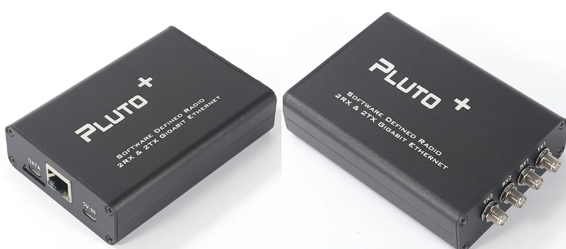
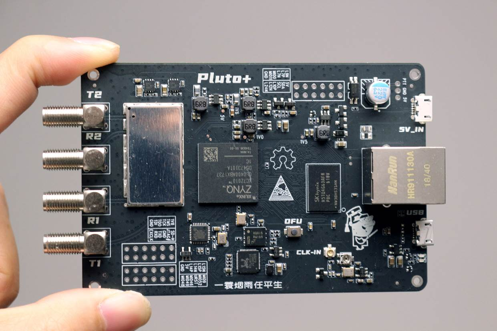
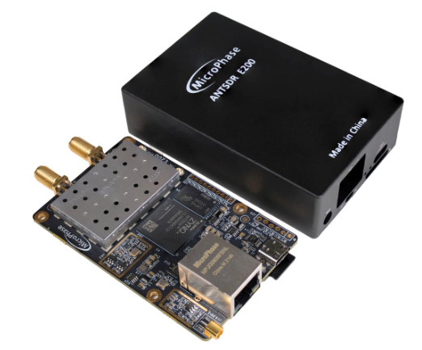
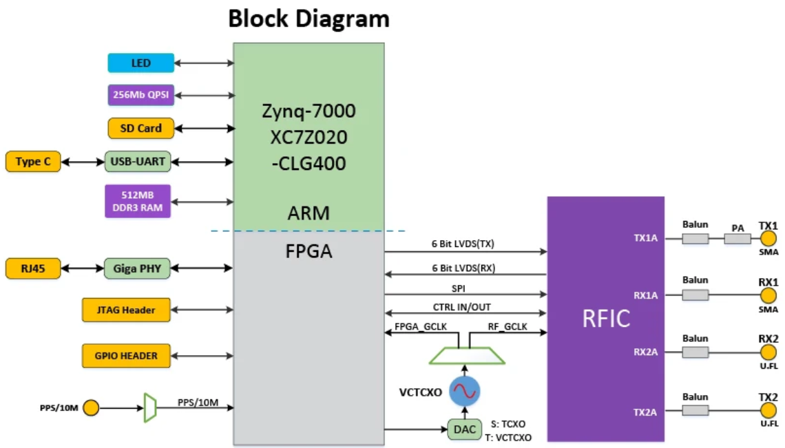
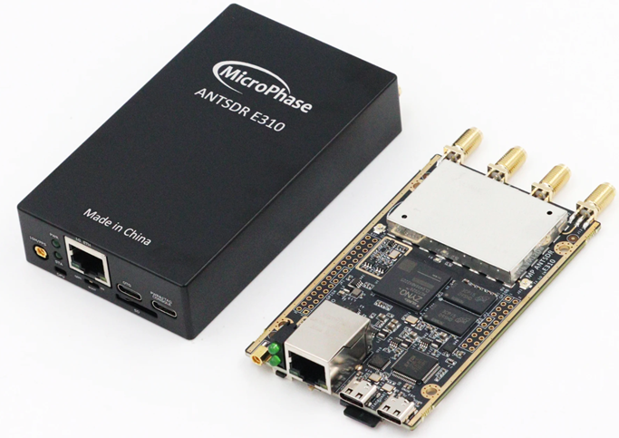
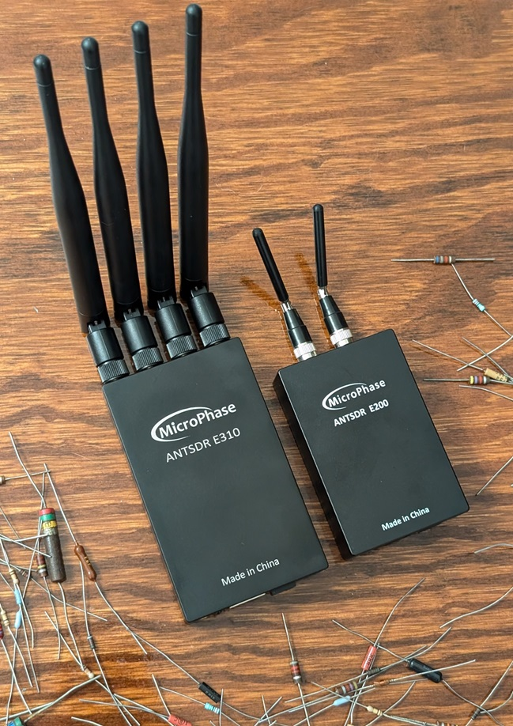

.. _pluto-chapter:

####################################
PlutoSDR на Python
####################################

.. image:: ../_images/pluto.png
   :scale: 50 % 
   :align: center
   :alt: PlutoSDR від Analog Devices
   
У цьому розділі ми навчимося використовувати API Python для `PlutoSDR <https://www.analog.com/en/design-center/evaluation-hardware-and-software/evaluation-boards-kits/adalm-pluto.html>`_, який є недорогим SDR від Analog Devices.  Ми розглянемо кроки встановлення PlutoSDR для запуску драйверів/програмного забезпечення, а потім обговоримо передачу та прийом даних за допомогою PlutoSDR у Python.  Нарешті, ми покажемо, як використовувати `Maia SDR <https://maia-sdr.org/>`_ та `IQEngine <https://iqengine.org/>`_, щоб перетворити PlutoSDR на потужний аналізатор спектра!

************************
Огляд PlutoSDR
************************

PlutoSDR (також відомий як ADALM-PLUTO) — недорогий SDR (трохи більше $200), здатний передавати та приймати сигнали в діапазоні від 70 МГц до 6 ГГц.  Це чудовий SDR для тих, хто вже «виріс» з RTL-SDR за $20.  Pluto використовує інтерфейс USB 2.0, що обмежує частоту дискретизації приблизно 5 МГц, якщо ви хочете отримувати 100% відліків у часі.  Водночас він може дискретизувати до 61 МГц і дозволяє захоплювати неперервні серії довжиною до приблизно 10 мільйонів відліків за раз, тому Pluto здатен охоплювати величезну смугу спектра одним махом.  Технічно це пристрій 2x2, але другий канал передавача та приймача доступні лише через роз'єми U.FL усередині корпусу, і вони використовують ті самі генератори, тож ви не зможете приймати на двох різних частотах одночасно.  Нижче наведено блок-схему Pluto, а також AD936x — радіочастотну інтегральну схему (RFIC) всередині Pluto.

.. image:: ../_images/adi-adalm-pluto-diagram-large.jpg
   :scale: 60 %
   :align: center
   :alt: Блок-схема PlutoSDR

.. image:: ../_images/ad9361.svg
   :align: center
   :target: ../_images/ad9361.svg
   :alt: Блок-схема RFIC AD9361/AD9363 усередині PlutoSDR

***********************************************
Встановлення програмного забезпечення/драйверів
***********************************************

Налаштування віртуальної машини
###############################

Хоча код на Python, наведений у цьому підручнику, має працювати під Windows, Mac і Linux, наведені нижче інструкції з встановлення стосуються лише Ubuntu 22. Якщо у вас виникли проблеми з встановленням програмного забезпечення у вашій ОС за "інструкціями, наданими Analog Devices <https://wiki.analog.com/university/tools/pluto/users/quick_start>", я рекомендую встановити віртуальну машину Ubuntu 22 і спробувати скористатися наведеними нижче інструкціями.  Крім того, якщо ви використовуєте Windows 11, підсистема Windows для Linux (WSL) з використанням Ubuntu 22 працює досить добре і підтримує графіку "з коробки". 

1. Встановіть і відкрийте `VirtualBox <https://www.virtualbox.org/wiki/Downloads>`_.
2. Створіть нову віртуальну машину.  Для розміру пам'яті я рекомендую використовувати 50% оперативної пам'яті вашого комп'ютера.
3. Створіть віртуальний жорсткий диск, виберіть VDI і динамічно розподіліть обсяг.  15 ГБ повинно бути достатньо. Якщо ви хочете бути дійсно в безпеці, ви можете використовувати більше.
4. Завантажте Ubuntu 22 Desktop .iso - https://ubuntu.com/download/desktop
5. Запустіть віртуальну машину. Вона запитає вас про інсталяційний носій. Виберіть файл Ubuntu 22 desktop .iso.  Виберіть "встановити ubuntu", скористайтеся параметрами за замовчуванням, і спливаюче вікно попередить вас про зміни, які ви збираєтеся зробити. Натисніть "продовжити".  Виберіть ім'я/пароль і зачекайте, поки віртуальна машина закінчить ініціалізацію.  Після завершення ВМ перезавантажиться, але вам слід вимкнути ВМ після перезавантаження.
6. Перейдіть до налаштувань ВМ (іконка з шестернею).
7. У розділі система > процесор > виберіть принаймні 3 процесори.  Якщо у вас справжня відеокарта, то в розділі дисплей > відеопам'ять > виберіть щось набагато більше.
8. Запустіть віртуальну машину.
9. Я рекомендую встановити гостьові доповнення до ВМ. У віртуальній машині перейдіть до Пристрої > Вставити компакт-диск з гостьовими доповненнями > натисніть запустити, коли з'явиться вікно.  Дотримуйтесь інструкцій. Перезапустіть ВМ.  Спільний буфер обміну можна увімкнути за допомогою Пристрої > Спільний буфер обміну > Двонаправлений.

Підключення PlutoSDR
####################

1. Якщо ви працюєте під управлінням OSX, то в OSX, а не у віртуальній машині, у системних налаштуваннях увімкніть "розширення ядра".  Потім встановіть HoRNDIS (після цього може знадобитися перезавантаження).
2. Якщо ви використовуєте Windows, встановіть цей драйвер: https://github.com/analogdevicesinc/plutosdr-m2k-drivers-win/releases/download/v0.7/PlutoSDR-M2k-USB-Drivers.exe
3. Якщо ви використовуєте Linux, вам не потрібно робити нічого особливого.
4. Підключіть Pluto до комп'ютера через USB. Переконайтеся, що ви використовуєте середній порт USB на Pluto, оскільки інший призначений лише для живлення.  Підключення Плутона має створити віртуальний мережевий адаптер, тобто Плутон буде виглядати як адаптер USB ethernet.
5. На хост-машині (не віртуальній машині) відкрийте термінал або ваш улюблений інструмент ping і виконайте ping 192.168.2.1.  Якщо це не спрацює, зупиніться і налагодьте мережевий інтерфейс.
6. У віртуальній машині відкрийте новий термінал
7. Пропінгуйте 192.168.2.1.  Якщо це не спрацює, зупиніться тут і налагодьте.  Під час пінгування відключіть Pluto від мережі і переконайтеся, що пінг припинився, якщо він продовжує пінгувати, значить в мережі є щось ще з цією IP-адресою, і вам доведеться змінити IP-адресу Pluto (або іншого пристрою), перш ніж рухатися далі.
8. Запишіть IP-адресу Pluto, оскільки вона вам знадобиться, коли ми почнемо використовувати Pluto у Python.

Встановлення драйвера PlutoSDR
##############################

Команди терміналу, наведені нижче, повинні зібрати і встановити останню версію:

1. **libiio**, "крос-платформної" бібліотеки Analog Device для взаємодії з апаратним забезпеченням
2. **libad9361-iio**, AD9361 - спеціальна радіочастотна мікросхема всередині PlutoSDR
3. **pyadi-iio**, Python API Pluto, *це наша кінцева мета*, але вона залежить від попередніх двох бібліотек

.. code-block:: bash

 sudo apt-get update
 sudo apt-get install build-essential git libxml2-dev bison flex libcdk5-dev cmake python3-pip libusb-1.0-0-dev libavahi-client-dev libavahi-common-dev libaio-dev
 cd ~
 git clone --branch v0.23 https://github.com/analogdevicesinc/libiio.git
 cd libiio
 mkdir build
 cd build
 cmake -DPYTHON_BINDINGS=ON ..
 make -j$(nproc)
 sudo make install
 sudo ldconfig

 cd ~
 git clone https://github.com/analogdevicesinc/libad9361-iio.git
 cd libad9361-iio
 mkdir build
 cd build
 cmake ..
 make -j$(nproc)
 sudo make install

 cd ~
 git clone --branch v0.0.14 https://github.com/analogdevicesinc/pyadi-iio.git
 cd pyadi-iio
 pip3 install --upgrade pip
 pip3 install -r requirements.txt
 sudo python3 setup.py install

Тестування драйверів PlutoSDR
#############################

Відкрийте новий термінал (у вашій віртуальній машині) і введіть такі команди:

.. code-block:: bash

 python3
 import adi
 sdr = adi.Pluto('ip:192.168.2.1') # або IP-адреса вашого Pluto
 sdr.sample_rate = int(2.5e6)
 sdr.rx()

Якщо ви дійшли до цього етапу без помилок, переходьте до наступних кроків.

Зміна IP-адреси Pluto
####################################

Якщо з якихось причин IP-адреса за замовчуванням 192.168.2.1 не працює, тому що у вас вже є підмережа 192.168.2.0 або ви хочете підключити кілька Pluto одночасно, ви можете змінити IP-адресу, виконавши такі дії:

1. Відредагуйте файл ``config.txt`` на пристрої масового зберігання PlutoSDR (тобто на USB-накопичувачі, який з'являється після підключення Pluto).  Введіть нову IP-адресу.
2. Безпечно витягніть пристрій масового зберігання (не відключайте Pluto!). В Ubuntu 22 у файловому менеджері є піктограма витягнення поруч із пристроєм PlutoSDR.
3. Зачекайте кілька секунд, а потім вимкніть і знову увімкніть Pluto, від'єднавши його і підключивши знову.  Поверніться до ``config.txt``, щоб переконатися, що зміни збереглися.

Зауважте, що цю процедуру також використовують для прошивання іншого образу прошивки на Pluto. Докладніше див. https://wiki.analog.com/university/tools/pluto/users/firmware.

Як "зламати" PlutoSDR, щоб збільшити радіус дії
###############################################

PlutoSDR має обмежений діапазон центральних частот і частоту дискретизації, але мікросхема, що лежить в його основі, здатна працювати на значно вищих частотах.  Виконайте ці кроки, щоб розблокувати повний частотний діапазон мікросхеми.  Будь ласка, майте на увазі, що цей процес надається компанією Analog Devices, тому він має мінімальний ризик.  Обмеження частоти PlutoSDR пов'язане з тим, що компанія Analog Devices "розбила" AD9364 на частини на основі суворих вимог до продуктивності на високих частотах. .... Як ентузіасти та експериментатори SDR, ми не надто переймаємося цими вимогами до продуктивності.

Час хакнути! Відкрийте термінал (на хості або віртуальній машині, не має значення):

.. code-block:: bash

 ssh root@192.168.2.1

Пароль за замовчуванням: :code:`analog`.

Ви повинні побачити екран привітання PlutoSDR. Ви отримали доступ по SSH до процесора ARM на самому Pluto!
Якщо у вас Pluto з прошивкою версії 0.31 або нижче, введіть наступні команди:

.. code-block:: bash

 fw_setenv attr_name compatible
 fw_setenv attr_val ad9364
 reboot

А для версій 0.32 і вище використовуйте

.. code-block:: bash

 fw_setenv compatible ad9364
 reboot

Тепер ви зможете налаштовуватися на частоту до 6 ГГц і до 70 МГц, не кажучи вже про використання частоти дискретизації до 56 МГц!  Ура!

************************
Отримання
************************

Здійснювати вибірки за допомогою Python API PlutoSDR дуже просто.  З будь-яким SDR-додатком ми знаємо, що повинні повідомити йому центральну частоту, частоту дискретизації та коефіцієнт підсилення (або чи використовувати автоматичне регулювання підсилення).  Можуть бути й інші деталі, але ці три параметри необхідні для того, щоб SDR мав достатньо інформації для отримання семплів.  Деякі SDR мають команду для початку дискретизації, тоді як інші, такі як Pluto, починають дискретизацію одразу після ініціалізації. Як тільки внутрішній буфер SDR заповнюється, найстаріші зразки відкидаються.  Всі SDR API мають функцію "отримати вибірки", а для Pluto це rx(), яка повертає пакет вибірки.  Конкретна кількість семплів у пакеті визначається розміром буфера, встановленим заздалегідь.

Наведений нижче код передбачає, що у вас встановлено Python API Pluto.  Цей код ініціалізує Pluto, встановлює частоту дискретизації 1 МГц, центральну частоту 100 МГц і коефіцієнт підсилення 70 дБ з вимкненим автоматичним регулюванням підсилення.  Зауважте, що зазвичай не має значення порядок, у якому ви встановлюєте центральну частоту, коефіцієнт підсилення та частоту дискретизації.  У наведеному нижче фрагменті коду ми вказуємо Плутону, що хочемо, щоб він видавав нам 10 000 відліків за один виклик rx().  Ми виводимо перші 10 відліків.

.. code-block:: python

    import numpy as np
    import adi
    
    sample_rate = 1e6 # Гц
    center_freq = 100e6 # Hz
    num_samps = 10000 # кількість відліків, що повертаються за один виклик rx()
    
    sdr = adi.Pluto('ip:192.168.2.1')
    sdr.gain_control_mode_chan0 = 'manual'
    sdr.rx_hardwaregain_chan0 = 70.0 # дБ
    sdr.rx_lo = int(center_freq)
    sdr.sample_rate = int(sample_rate)
    sdr.rx_rf_bandwidth = int(sample_rate) # ширина фільтра, поки що встановлюємо рівною частоті дискретизації
    sdr.rx_buffer_size = num_samps
    
    samples = sdr.rx() # отримуємо семпли з Плутона
    print(samples[0:10])

Наразі ми не будемо робити з цими прикладами нічого цікавого, але решта цього підручника заповнена кодом на Python, який працює з прикладами IQ, подібно до того, що ми отримали вище.

Отримання приросту
##################

Pluto можна налаштувати на фіксоване або автоматичне посилення прийому. Автоматичне регулювання підсилення (АРУ) автоматично підлаштовує коефіцієнт підсилення для підтримання високого рівня сигналу (-12 дБFS для тих, кому цікаво).  АРУ не слід плутати з аналого-цифровим перетворювачем (АЦП), який оцифровує сигнал.  Технічно кажучи, АРУ - це замкнутий ланцюг зворотного зв'язку, який контролює коефіцієнт підсилення підсилювача у відповідь на отриманий сигнал.  Його мета - підтримувати постійний рівень вихідної потужності, незважаючи на зміну рівня вхідної потужності.  Зазвичай АРУ регулює коефіцієнт підсилення, щоб уникнути насичення приймача (тобто досягнення верхньої межі діапазону АЦП), одночасно дозволяючи сигналу "заповнити" якомога більше бітів АЦП.

Радіочастотна інтегральна схема, або RFIC, всередині PlutoSDR має модуль АРУ з кількома різними налаштуваннями.  (RFIC - це мікросхема, яка функціонує як приймач: вона передає і приймає радіохвилі).  По-перше, зверніть увагу, що коефіцієнт підсилення прийому на Pluto має діапазон від 0 до 74,5 дБ.  У "ручному" режимі АРУ вимкнено, і ви повинні вказати Плутону, який коефіцієнт підсилення прийому використовувати, наприклад:

.. code-block:: python
  
  sdr.gain_control_mode_chan0 = "manual" # вимкнути АРУ
  gain = 50.0 # допустимий діапазон від 0 до 74.5 дБ
  sdr.rx_hardwaregain_chan0 = gain # встановити коефіцієнт підсилення прийому

Якщо ви хочете увімкнути АРУ, ви повинні вибрати один з двох режимів:

1. :code:`sdr.gain_control_mode_chan0 = "slow_attack"`
2. :code:`sdr.gain_control_mode_chan0 = "fast_attack"`.

А з увімкненим АРУ ви не вказуєте значення для :code:`rx_hardwaregain_chan0`. Він буде проігнорований, оскільки Плутон сам підлаштовує коефіцієнт підсилення під сигнал. Плутон має два режими АРУ: швидка атака і повільна атака, як показано у наведеному вище коді. Різниця між ними інтуїтивно зрозуміла, якщо подумати. Режим швидкої атаки швидше реагує на сигнали.  Іншими словами, значення коефіцієнта підсилення змінюється швидше, коли рівень сигналу змінюється.  Пристосування до рівня потужності сигналу може бути важливим, особливо для дуплексних систем з часовим розділенням каналів (TDD), які використовують ту саму частоту для передавання і приймання. Встановлення регулятора підсилення в режим швидкої атаки для цього сценарію обмежує згасання сигналу.  У будь-якому з цих режимів, якщо немає сигналу, а є лише шум, АРУ максимально збільшить налаштування посилення; коли сигнал з'являється, він ненадовго насичує приймач, доки АРУ не зможе відреагувати і зменшити посилення.  Ви завжди можете перевірити поточний рівень підсилення у реальному часі за допомогою:

.. code-block:: python
 
 sdr._get_iio_attr('voltage0','hardwaregain', False)

Для отримання більш детальної інформації про АРУ Pluto, зокрема про те, як змінити розширені налаштування АРУ, зверніться до `розділу "Керування коефіцієнтом підсилення RX" на цій сторінці <https://wiki.analog.com/resources/tools-software/linux-drivers/iio-transceiver/ad9361>`_.

************************
Передача
************************

Перш ніж передавати будь-який сигнал за допомогою Pluto, переконайтеся, що ви підключили SMA-кабель між портом TX Pluto і будь-яким пристроєм, який буде виконувати роль приймача.  Важливо завжди починати з передачі по кабелю, особливо коли ви вчитеся "як" передавати, щоб переконатися, що SDR поводиться так, як ви плануєте.  Завжди тримайте потужність передачі на дуже низькому рівні, щоб не перевантажувати приймач, оскільки кабель не послаблює сигнал так, як це робить бездротовий канал.  Якщо у вас є атенюатор (наприклад, 30 дБ), зараз саме час ним скористатися.  Якщо у вас немає іншої SDR або аналізатора спектра, який би виконував роль приймача, теоретично ви можете використовувати порт RX на тому ж Pluto, але це може бути складно.  Я б рекомендував придбати RTL-SDR за $10, щоб використовувати його в якості приймача SDR.

Передача дуже схожа на прийом, за винятком того, що замість того, щоб сказати SDR отримати певну кількість семплів, ми дамо йому певну кількість семплів для передачі.  Замість :code:`rx_lo` ми будемо задавати :code:`tx_lo`, щоб вказати, на якій несучій частоті передавати.  Частота дискретизації є спільною для RX і TX, тому ми будемо задавати її як зазвичай.  Повний приклад передачі показано нижче, де ми генеруємо синусоїду на частоті +100 кГц, а потім передаємо складний сигнал на несучій частоті 915 МГц, в результаті чого приймач бачить несучу на частоті 915,1 МГц.  Насправді немає ніякої практичної причини робити це, ми могли б просто встановити center_freq на 915.1e6 і передати масив одиниць, але ми хотіли згенерувати складні зразки для демонстраційних цілей. 

.. code-block:: python
    
    import numpy as np
    import adi

    sample_rate = 1e6 # Гц
    center_freq = 915e6 # Hz

    sdr = adi.Pluto("ip:192.168.2.1")
    sdr.sample_rate = int(sample_rate)
    sdr.tx_rf_bandwidth = int(sample_rate) # смуга пропускання фільтра, просто встановіть її рівною частоті дискретизації
    sdr.tx_lo = int(center_freq)
    sdr.tx_hardwaregain_chan0 = -50 # Збільшення для збільшення потужності tx, допустимий діапазон від -90 до 0 дБ
    
    N = 10000 # кількість відліків для передачі за один раз
    t = np.arange(N)/sample_rate
    samples = 0.5*np.exp(2.0j*np.pi*100e3*t) # Імітуємо синусоїду з частотою 100 кГц, тому на приймачі вона має з'явитися на частоті 915.1 МГц
    samples *= 2**14 # PlutoSDR очікує, що відліки будуть між -2^14 та +2^14, а не між -1 та +1, як у деяких SDR

    # Передамо нашу партію відліків 100 разів, таким чином, це має бути 1 секунда відліків сумарно, якщо USB витримає
    for i in range(100):
        sdr.tx(samples) # передаємо пакет семплів один раз

Ось кілька зауважень щодо цього коду.  По-перше, ви хочете змоделювати ваші IQ-зразки так, щоб вони були між -1 і 1, але потім перед передачею ми повинні масштабувати їх на 2^14 через те, як Analog Devices реалізували функцію :code:`tx()`.  Якщо ви не впевнені, які ваші min/max значення, просто роздрукуйте їх за допомогою :code:`print(np.min(samples), np.max(samples))` або напишіть інструкцію if, щоб переконатися, що вони ніколи не будуть вищими за 1 або нижчими за -1 (припускаючи, що код йде перед масштабуванням на 2^14).  Що стосується коефіцієнта підсилення передачі, то діапазон становить від -90 до 0 дБ, тобто 0 дБ - це найвища потужність передачі.  Ми завжди хочемо починати з низької потужності передачі, а потім збільшувати її, якщо це необхідно, тому за замовчуванням ми встановили коефіцієнт підсилення на -50 дБ, що є нижньою межею діапазону.  Не встановлюйте його на 0 дБ лише тому, що ваш сигнал не з'являється; можливо, щось ще не так, і ви не хочете підсмажити свій приймач. 

Передача семплів у режимі повтору
#################################

Якщо ви хочете безперервно передавати один і той самий набір семплів на повторі, замість того, щоб використовувати цикл for/while в Python, як ми робили вище, ви можете сказати Pluto, щоб він це робив, використовуючи лише один рядок:

.. code-block:: python

 sdr.tx_cyclic_buffer = True # Увімкнути циклічні буфери

Після цього ви передасте свої семпли як зазвичай: :code:`sdr.tx(samples)` лише один раз, а Pluto продовжить передачу сигналу безперервно, доки не буде викликано деструктор об'єкта sdr.  Щоб змінити семпли, які безперервно передаються, не можна просто викликати :code:`sdr.tx(samples)` знову з новим набором семплів, потрібно спочатку викликати :code:`sdr.tx_destroy_buffer()`, а потім викликати :code:`sdr.tx(samples)`.

Легальна передача в ефір
########################

Незліченну кількість разів студенти запитували мене, на яких частотах їм дозволено передавати за допомогою антени (у Сполучених Штатах).  Наскільки мені відомо, коротка відповідь - жодної.  Зазвичай, коли люди вказують на конкретні правила, які говорять про обмеження потужності передачі, вони мають на увазі "Розділ 47, частина 15" (47 CFR 15) правил FCC <https://www.ecfr.gov/cgi-bin/text-idx?SID=7ce538354be86061c7705af3a5e17f26&mc=true&node=pt47.1.15&rgn=div5>`_.  Але це правила для виробників, які створюють і продають пристрої, що працюють у діапазонах ISM, і в цих правилах обговорюється, як їх слід тестувати.  Пристрої, що підпадають під дію Частини 15, не потребують ліцензії на експлуатацію в будь-якому спектрі, але сам пристрій повинен мати дозвіл/сертифікат, який підтверджує, що він працює відповідно до правил FCC, перш ніж його можна буде продавати.  Правила Частини 15 визначають максимальні рівні потужності передачі та прийому для різних частин спектра, але жоден з них насправді не стосується людини, яка передає сигнал за допомогою SDR або саморобного радіоприймача.  Єдині правила, які я зміг знайти щодо радіоприймачів, які не є продуктами, що продаються, стосуються роботи малопотужних радіостанцій у діапазонах AM або FM.  Існує також розділ про "саморобні пристрої", але в ньому конкретно сказано, що він не поширюється на все, що зібрано з набору, і було б великою натяжкою сказати, що передавальна установка, яка використовує SDR, є саморобним пристроєм.  Таким чином, правила FCC - це не просто "ви можете передавати на цих частотах тільки нижче цих рівнів потужності", а скоріше величезний набір правил, призначених для тестування і дотримання вимог.

Інший спосіб подивитися на це - сказати: "Ну, це не пристрої Частини 15, але давайте дотримуватися правил Частини 15, як якщо б це були пристрої Частини 15".  Для діапазону 915 МГц ISM правила такі: "Напруженість поля будь-яких випромінювань, що випромінюються в зазначеному діапазоні частот, не повинна перевищувати 500 мікровольт/метр на відстані 30 метрів. Межа випромінювання в цьому пункті базується на вимірювальних приладах, що використовують середній детектор".  Отже, як бачите, це не так просто, як максимальна потужність передачі у ватах.

Тепер, якщо у вас є ліцензія на аматорське радіо (ham), FCC дозволяє вам використовувати певні діапазони, відведені для аматорського радіо.  Існують певні правила, яких слід дотримуватися, і максимальні потужності передачі, але, принаймні, ці цифри вказані у ватах 
ефективної випромінюваної потужності.  `Ця інфографіка <https://www.arrl.org/files/file/Regulatory/Band%20Chart/Hambands4_Color_11x8_5.pdf>`_ показує, які діапазони доступні для використання залежно від класу вашої ліцензії (Технік, General та Extra).  Я б рекомендував усім, хто зацікавлений у передаванні з використанням SDR, отримати ліцензію радіоаматора, див. `ARRL's Getting Licensed page <http://www.arrl.org/getting-licensed>`_ для отримання додаткової інформації.

Якщо хтось має більш детальну інформацію про те, що дозволено, а що ні, будь ласка, напишіть мені.

************************************************
Одночасна передача і прийом
************************************************

Використовуючи трюк tx_cyclic_buffer, ви можете легко приймати і передавати одночасно, запускаючи передавач, а потім приймаючи. 
Наступний код показує робочий приклад передачі QPSK-сигналу в смузі 915 МГц, його прийому і побудови PSD.

.. code-block:: python

    import numpy as np
    import adi
    import matplotlib.pyplot as plt

    sample_rate = 1e6 # Hz
    center_freq = 915e6 # Hz
    num_samps = 100000 # кількість відліків за виклик rx()

    sdr = adi.Pluto("ip:192.168.2.1")
    sdr.sample_rate = int(sample_rate)

    # Конфігурація Tx
    sdr.tx_rf_bandwidth = int(sample_rate) # смуга пропускання фільтра, просто встановіть її рівною частоті дискретизації
    sdr.tx_lo = int(center_freq)
    sdr.tx_hardwaregain_chan0 = -50 # Збільшення для збільшення потужності tx, допустимий діапазон від -90 до 0 дБ

    # Конфігурація Rx
    sdr.rx_lo = int(center_freq)
    sdr.rx_rf_bandwidth = int(sample_rate)
    sdr.rx_buffer_size = num_samps
    sdr.gain_control_mode_chan0 = 'manual'
    sdr.rx_hardwaregain_chan0 = 0.0 # dB, збільшуйте, щоб збільшити коефіцієнт підсилення прийому, але будьте обережні, щоб не наситити АЦП

    # Створити форму сигналу передачі (QPSK, 16 відліків на символ)
    num_symbols = 1000
    x_int = np.random.randint(0, 4, num_symbols) # від 0 до 3
    x_degrees = x_int*360/4.0 + 45 # 45, 135, 225, 315 градусів
    x_radians = x_degrees*np.pi/180.0 # sin() і cos() беруть в радіанах
    x_symbols = np.cos(x_radians) + 1j*np.sin(x_radians) # отримуємо наші комплексні символи QPSK
    samples = np.repeat(x_symbols, 16) # 16 відліків на символ (прямокутні імпульси)
    samples *= 2**14 # PlutoSDR очікує, що відліки будуть між -2^14 та +2^14, а не -1 та +1, як у деяких SDR

    # Запустити передавач
    sdr.tx_cyclic_buffer = True # Увімкнути циклічні буфери
    sdr.tx(samples) # почати передачу

    # Про всяк випадок очистимо буфер
    for i in range (0, 10):
        raw_data = sdr.rx()
        
    # Отримуємо зразки
    rx_samples = sdr.rx()
    print(rx_samples)

    # Зупинити передачу
    sdr.tx_destroy_buffer()

    # Обчислити спектральну щільність потужності (частотна версія сигналу)
    psd = np.abs(np.fft.fftshift(np.fft.fft(rx_samples)))**2
    psd_dB = 10*np.log10(psd)
    f = np.linspace(sample_rate/-2, sample_rate/2, len(psd))

    # Побудова часової області графіка
    plt.figure(0)
    plt.plot(np.real(rx_samples[::100]))
    plt.plot(np.imag(rx_samples[::100]))
    plt.xlabel("Time")

    # Побудувати область частот
    plt.figure(1)
    plt.plot(f/1e6, psd_dB)
    plt.xlabel("Частота [МГц]")
    plt.ylabel("PSD")
    plt.show()

Ви повинні побачити щось на зразок цього, якщо у вас справні антени або підключений кабель:

.. image:: ../_images/pluto_tx_rx.svg
   :align: center 

Корисно повільно відрегулювати :code:`sdr.tx_hardwaregain_chan0` і :code:`sdr.rx_hardwaregain_chan0`, щоб переконатися, що отриманий сигнал слабшає/посилюється відповідно до очікувань.

************************
Довідковий API
************************

Повний список властивостей і функцій sdr, які можна викликати, наведено у коді `pyadi-iio Pluto Python (AD936X) <https://github.com/analogdevicesinc/pyadi-iio/blob/master/adi/ad936x.py>`_.

************************
Вправи з Python
************************

Замість того, щоб надавати вам код для виконання, я створив кілька вправ, де 95% коду надано, а решту коду досить просто написати на Python, щоб ви могли його створити.  Вправи не мають бути складними. У них бракує лише достатньої кількості коду, щоб змусити вас подумати.

Вправа 1: Визначення пропускної здатності USB
#############################################

Давайте спробуємо отримати зразки з PlutoSDR, і в процесі подивимося, скільки зразків в секунду ми зможемо пропустити через USB 2.0 з'єднання.  

**Ваше завдання - створити Python-скрипт, який визначатиме швидкість отримання семплів у Python, тобто підраховуватиме отримані семпли і відстежуватиме час, щоб визначити швидкість.  Потім спробуйте використовувати різні значення sample_rate і buffer_size, щоб побачити, як це впливає на максимальну досяжну швидкість.**.

Майте на увазі, якщо ви отримуєте менше семплів на секунду, ніж вказано sample_rate, це означає, що ви втрачаєте/відкидаєте певну частину семплів, що, швидше за все, станеться на високих sample_rate. Pluto використовує лише USB 2.0.

Наступний код буде відправною точкою, але містить інструкції, необхідні для виконання цього завдання.

.. code-block:: python

 import numpy as np
 import adi
 import matplotlib.pyplot as plt
 import time
 
 sample_rate = 10e6 # Hz
 center_freq = 100e6 # Hz
 
 sdr = adi.Pluto("ip:192.168.2.1")
 sdr.sample_rate = int(sample_rate)
 sdr.rx_rf_bandwidth = int(sample_rate) # смуга пропускання фільтра, просто встановіть її рівною частоті дискретизації
 sdr.rx_lo = int(center_freq)
 sdr.rx_buffer_size = 1024 # це буфер, який плутон використовує для буферизації семплів
 samples = sdr.rx() # отримуємо вибірки з Плутона

Крім того, для того, щоб засікти час виконання чогось, ви можете використати наступний код:

.. code-block:: python

 start_time = time.time()
 # робимо щось
 end_time = time.time()
 print('пройшло секунд:', end_time - start_time)

Ось кілька підказок, які допоможуть вам розпочати роботу.

Порада 1: Вам потрібно помістити рядок "samples = sdr.rx()" у цикл, який виконується багато разів (наприклад, 100 разів). Ви повинні порахувати, скільки зразків ви отримаєте при кожному виклику sdr.rx(), відстежуючи при цьому, скільки часу пройшло.

Підказка 2: Те, що ви підраховуєте кількість відліків за секунду, не означає, що ви повинні отримувати відліки рівно за 1 секунду. Ви можете розділити кількість отриманих відліків на кількість часу, що минув.

Підказка 3: Почніть з sample_rate = 10e6, як показано у коді, оскільки ця швидкість набагато більша, ніж може підтримувати USB 2.0. Ви зможете побачити, скільки даних проходить.  Потім ви можете змінити rx_buffer_size. Зробіть його набагато більшим і подивіться, що станеться.  Після того, як у вас буде робочий скрипт і ви погралися з rx_buffer_size, спробуйте відрегулювати sample_rate. Визначте, наскільки низько вам потрібно опуститися, щоб отримувати 100% відліків у Python (тобто, відліки зі 100% робочим циклом).

Порада 4: У вашому циклі, де ви викликаєте sdr.rx(), намагайтеся робити якомога менше, щоб не додавати додаткової затримки у часі виконання. Не робіть нічого інтенсивного, наприклад, не друкуйте зсередини циклу.

У цій вправі ви отримаєте уявлення про максимальну пропускну здатність USB 2.0. Ви можете знайти інформацію в Інтернеті, щоб перевірити свої висновки.

Як бонус, спробуйте змінити center_freq і rx_rf_bandwidth, щоб побачити, чи впливає це на швидкість отримання зразків з Pluto.

Вправа 2: Створення спектрограми/водоспаду
##########################################

У цій вправі ви створите спектрограму, так званий водоспад, про який ми дізналися наприкінці розділу :ref:`freq-domain-chapter`.  Спектрограма - це просто набір відображених БПФ, накладених один на одного. Іншими словами, це зображення, одна вісь якого представляє частоту, а інша - час.

У розділі :ref:`freq-domain-chapter` ми вивчили код Python для виконання ШПФ.  Для цієї вправи ви можете використовувати фрагменти коду з попередньої вправи, а також трохи базового коду Python.

Підказки:

1. Спробуйте встановити розмір буфера sdr.rx_buffer_size рівним розміру ШПФ, щоб завжди виконувати 1 ШПФ для кожного виклику `sdr.rx()`.
2. Створіть двовимірний масив для зберігання всіх результатів ШПФ, де кожен рядок - це 1 ШПФ.  Створити двовимірний масив, заповнений нулями, можна за допомогою `np.zeros((num_rows, fft_size))`.  Доступ до рядка i масиву з допомогою: `waterfall_2darray[i,:]`.
3. `plt.imshow()` - зручний спосіб виведення на екран двовимірного масиву. Він автоматично масштабує колір.

Як варіант, зробіть оновлення спектрограми в реальному часі.

******
Pluto+
******

Pluto+ (також відомий як Pluto Plus) — неофіційна вдосконалена версія оригінального PlutoSDR, яку переважно можна придбати на AliExpress.  Він має порт Gigabit Ethernet, обидва канали RX і обидва канали TX, виведені на SMA, слот MicroSD, VCTCXO з точністю 0,5 ppm та вхід зовнішнього тактового сигналу через роз'єм U.FL на друкованій платі.

Порт Ethernet — це величезне оновлення, адже він суттєво збільшує частоту дискретизації, яку можна отримати під час прийому або передавання із 100% робочим циклом.  Pluto та Pluto+ за замовчуванням використовують 16 біт для I та Q, хоча АЦП має лише 12 біт, тому це 4 байти на IQ-відлік.  Gigabit Ethernet з ефективністю 90% забезпечує приблизно 900 Мбіт/с або 112,5 МБ/с, а це відповідає максимально можливій частоті дискретизації близько 28 МГц, якщо ви хочете отримувати всі відліки протягом тривалого часу (наприклад, більше секунди).  Для порівняння, USB 3.0 може досягати приблизно 56 МГц, а USB 2.0 — близько 5 МГц.  Існує також обмеження на те, скільки даних Python може прийняти, залежно від продуктивності вашого комп'ютера, а також від конкретної задачі DSP, яку ви хочете виконувати над відліками (або швидкості запису на диск, якщо ви просто зберігаєте їх у файл).  Реалістичніші частоти дискретизації для застосунків на Python із Pluto+ через Ethernet лежать ближче до 10 МГц.

Щоб задати IP-адресу для Ethernet-порту, підключіть Pluto+ через USB і відкрийте пристрій масового зберігання, відредагувавши ``config.txt`` та заповнивши секцію :code:`[USB_ETHERNET]`.  Перезавантажте Pluto+.  Після цього ви зможете підключатися до Pluto+ по SSH через Ethernet, використовуючи введену IP-адресу.  Якщо все працює, можете переключити кабель micro USB до порту 5 В, щоб він лише живив Pluto+, а всі дані передавалися через Ethernet.  Пам'ятайте, що навіть звичайний PlutoSDR (і Pluto+) може дискретизувати до 61 МГц смуги та отримувати неперервні блоки приблизно по 10 млн відліків за раз, якщо робити паузи між блоками, що дозволяє будувати потужні системи спектрального моніторингу.

Код на Python для Pluto+ буде таким самим, як і для PlutoSDR, лише замініть :code:`192.168.2.1` на IP-адресу Ethernet, яку ви задали.  Спробуйте приймати відліки у циклі, підраховуючи їх кількість, щоб побачити, наскільки високо можна підняти частоту дискретизації, все ще отримуючи приблизно стільки відліків на секунду, скільки задає частота дискретизації.  Підказка: збільшення ``rx_buffer_size`` до дуже великого значення допомагає підвищити пропускну здатність.

************
AntSDR E200
************

AntSDR E200, який далі називатимемо просто AntSDR, — недорогий SDR на базі AD936X, дуже схожий на Pluto та Pluto+, що його виробляє шанхайська компанія MicroPhase.  Як і Pluto+, він використовує гігабітний Ethernet, хоча AntSDR не має опції передавання даних через USB.  Унікальність AntSDR у тому, що він може працювати як Pluto, використовуючи бібліотеку IIO, або як USRP, використовуючи бібліотеку UHD.  За замовчуванням він постачається в режимі Pluto, але перехід до режиму USRP/UHD — це проста заміна прошивки.  Обидва варіанти прошивок практично повністю запозичені в Analog Devices/Ettus із мінімальними змінами для підтримки апаратного забезпечення AntSDR.  Ще одна особливість — можливість придбати плату як із чипом 9363, так і 9361; хоча це функціонально однакові мікросхеми, на заводі 9361 відбирають за вищими ВЧ-характеристиками на верхніх частотах.  Зауважте, що Pluto та Pluto+ постачаються лише з 9363.  У специфікації AntSDR для версії на 9363 вказано максимум 3,8 ГГц і 20 МГц частоти дискретизації, але на практиці це не так: він досягає повних 6 ГГц і приблизно 60 МГц частоти дискретизації (хоча через інтерфейс 1GbE не завжди вдається передати 100% відліків).  Як і інші Pluto, AntSDR — це пристрій 2x2, причому другі канали передавача та приймача доступні через роз'єми U.FL на платі.  Інші ВЧ-характеристики та технічні параметри дуже схожі або ідентичні Pluto/Pluto+.  Придбати AntSDR можна на `Crowd Supply <https://www.crowdsupply.com/microphase-technology/antsdr-e200#products>`_ та на AliExpress.

Невеликий DIP-перемикач на AntSDR визначає, завантажуватися з SD-карти чи з вбудованої флеш-пам'яті Quad SPI (QSPI).  На момент написання E200 постачається з прошивкою Pluto у QSPI та прошивкою USRP/UHD на SD-карті, тож перемикач дозволяє миттєво перемикатися між режимами без додаткових дій.

Блок-схему E200 наведено нижче.

Налаштування та використання AntSDR у режимі Pluto схоже на Pluto+: зверніть увагу, що IP-адреса за замовчуванням — 192.168.1.10, і пристрій не має USB-підключення для передавання даних, тож немає пристрою масового зберігання для оновлення прошивки чи зміни налаштувань.  Натомість для оновлення прошивки можна використати SD-карту, а для зміни налаштувань — SSH.  Крім того, якщо ви можете підключитися по SSH, змінити IP-адресу пристрою можна командою :code:`fw_setenv ipaddr_eth 192.168.2.1`, підставивши бажану адресу.  Прошивку Pluto/IIO можна знайти тут: https://github.com/MicroPhase/antsdr-fw-patch, а прошивку USRP/UHD — тут: https://github.com/MicroPhase/antsdr_uhd.

Якщо на SD-карті немає драйвера USRP/UHD або ви хочете встановити найновішу версію, дотримуйтеся `цих інструкцій <https://github.com/MicroPhase/antsdr_uhd?tab=readme-ov-file#quick-start-guide>`_, щоб встановити прошивку USRP/UHD на AntSDR, а також хостові драйвери на свій комп'ютер.  Це дещо модифікована версія стандартного коду UHD для хоста.  Після встановлення можна використовувати :code:`uhd_find_devices` та :code:`uhd_usrp_probe` як зазвичай (див. розділ :ref:`usrp-chapter` для додаткової інформації та прикладів коду, що працюватиме з AntSDR у режимі USRP).  Ось команди, які використовувалися для встановлення хостового коду на Ubuntu 22:

.. code-block:: bash

 sudo apt-get update
 sudo apt-get install autoconf automake build-essential ccache cmake cpufrequtils doxygen ethtool \
 g++ git inetutils-tools libboost-all-dev libncurses5 libncurses5-dev libusb-1.0-0 libusb-1.0-0-dev \
 libusb-dev python3-dev python3-mako python3-numpy python3-requests python3-scipy python3-setuptools \
 python3-ruamel.yaml
 cd ~
 git clone git@github.com:MicroPhase/antsdr_uhd.git
 cd host
 mkdir build
 cd build
 cmake -DENABLE_X400=OFF -DENABLE_N320=OFF -DENABLE_X300=OFF -DENABLE_USRP2=OFF -DENABLE_USRP1=OFF -DENABLE_N300=OFF -DENABLE_E320=OFF  -DENABLE_E300=OFF ../
 (NOTE - at this point, make sure in the "enabled components" you see ANT and LibUHD - Python API)
 make -j8
 sudo make install
 sudo ldconfig
 export PYTHONPATH="${PYTHONPATH}:/usr/local/lib/python3/dist-packages"
 sudo sysctl -w net.core.rmem_max=1000000
 sudo sysctl -w net.core.wmem_max=1000000

На самому пристрої використовувалася прошивка USRP із SD-карти, що постачалася разом з AntSDR, для цього потрібно перевести DIP-перемикач під Ethernet-портом у положення «SD».

AntSDR можна виявити та опитати за допомогою таких команд:

.. code-block:: bash

 uhd_find_devices --args addr=192.168.1.10
 uhd_usrp_probe --args addr=192.168.1.10

Нижче наведено приклад виводу у разі успішної роботи:

.. code-block:: bash

   $ uhd_find_devices --args addr=192.168.1.10
   [INFO] [UHD] linux; GNU C++ version 11.3.0; Boost_107400; UHD_4.1.0.0-0-d2f0b1b1
   --------------------------------------------------
   -- UHD Device 0
   --------------------------------------------------
   Device Address:
      serial: 0223D80FF0D767EBC6D3AAAA6793E64D
      addr: 192.168.1.10
      name: ANTSDR-E200
      product: E200  v1
      type: ant

   $ uhd_usrp_probe --args addr=192.168.1.10
   [INFO] [UHD] linux; GNU C++ version 11.3.0; Boost_107400; UHD_4.1.0.0-0-d2f0b1b1
   [INFO] [ANT] Detected Device: ANTSDR
   [INFO] [ANT] Initialize CODEC control...
   [INFO] [ANT] Initialize Radio control...
   [INFO] [ANT] Performing register loopback test...
   [INFO] [ANT] Register loopback test passed
   [INFO] [ANT] Performing register loopback test...
   [INFO] [ANT] Register loopback test passed
   [INFO] [ANT] Setting master clock rate selection to 'automatic'.
   [INFO] [ANT] Asking for clock rate 16.000000 MHz...
   [INFO] [ANT] Actually got clock rate 16.000000 MHz.
   _____________________________________________________
   /
   |       Device: B-Series Device
   |     _____________________________________________________
   |    /
   |   |       Mboard: B210
   |   |   magic: 45568
   |   |   eeprom_revision: v0.1
   |   |   eeprom_compat: 1
   |   |   product: MICROPHASE
   |   |   name: ANT
   |   |   serial: 0223D80FF0D767EBC6D3AAAA6793E64D
   |   |   FPGA Version: 16.0
   |   |
   |   |   Time sources:  none, internal, external
   |   |   Clock sources: internal, external
   |   |   Sensors: ref_locked
   |   |     _____________________________________________________
   |   |    /
   |   |   |       RX DSP: 0
   |   |   |
   |   |   |   Freq range: -8.000 to 8.000 MHz
   |   |     _____________________________________________________
   |   |    /
   |   |   |       RX DSP: 1
   |   |   |
   |   |   |   Freq range: -8.000 to 8.000 MHz
   |   |     _____________________________________________________
   |   |    /
   |   |   |       RX Dboard: A
   |   |   |     _____________________________________________________
   |   |   |    /
   |   |   |   |       RX Frontend: A
   |   |   |   |   Name: FE-RX1
   |   |   |   |   Antennas: TX/RX, RX2
   |   |   |   |   Sensors: temp, rssi, lo_locked
   |   |   |   |   Freq range: 50.000 to 6000.000 MHz
   |   |   |   |   Gain range PGA: 0.0 to 76.0 step 1.0 dB
   |   |   |   |   Bandwidth range: 200000.0 to 56000000.0 step 0.0 Hz
   |   |   |   |   Connection Type: IQ
   |   |   |   |   Uses LO offset: No
   |   |   |     _____________________________________________________
   |   |   |    /
   |   |   |   |       RX Frontend: B
   |   |   |   |   Name: FE-RX2
   |   |   |   |   Antennas: TX/RX, RX2
   |   |   |   |   Sensors: temp, rssi, lo_locked
   |   |   |   |   Freq range: 50.000 to 6000.000 MHz
   |   |   |   |   Gain range PGA: 0.0 to 76.0 step 1.0 dB
   |   |   |   |   Bandwidth range: 200000.0 to 56000000.0 step 0.0 Hz
   |   |   |   |   Connection Type: IQ
   |   |   |   |   Uses LO offset: No
   |   |   |     _____________________________________________________
   |   |   |    /
   |   |   |   |       RX Codec: A
   |   |   |   |   Name: B210 RX dual ADC
   |   |   |   |   Gain Elements: None
   |   |     _____________________________________________________
   |   |    /
   |   |   |       TX DSP: 0
   |   |   |
   |   |   |   Freq range: -8.000 to 8.000 MHz
   |   |     _____________________________________________________
   |   |    /
   |   |   |       TX DSP: 1
   |   |   |
   |   |   |   Freq range: -8.000 to 8.000 MHz
   |   |     _____________________________________________________
   |   |    /
   |   |   |       TX Dboard: A
   |   |   |     _____________________________________________________
   |   |   |    /
   |   |   |   |       TX Frontend: A
   |   |   |   |   Name: FE-TX1
   |   |   |   |   Antennas: TX/RX
   |   |   |   |   Sensors: temp, lo_locked
   |   |   |   |   Freq range: 50.000 to 6000.000 MHz
   |   |   |   |   Gain range PGA: 0.0 to 89.8 step 0.2 dB
   |   |   |   |   Bandwidth range: 200000.0 to 56000000.0 step 0.0 Hz
   |   |   |   |   Connection Type: IQ
   |   |   |   |   Uses LO offset: No
   |   |   |     _____________________________________________________
   |   |   |    /
   |   |   |   |       TX Frontend: B
   |   |   |   |   Name: FE-TX2
   |   |   |   |   Antennas: TX/RX
   |   |   |   |   Sensors: temp, lo_locked
   |   |   |   |   Freq range: 50.000 to 6000.000 MHz
   |   |   |   |   Gain range PGA: 0.0 to 89.8 step 0.2 dB
   |   |   |   |   Bandwidth range: 200000.0 to 56000000.0 step 0.0 Hz

Нарешті, ви можете перевірити роботу Python API за допомогою такого фрагмента коду (у терміналі Python або в скрипті):

.. code-block:: python

 import uhd
 usrp = uhd.usrp.MultiUSRP("addr=192.168.1.10")
 samples = usrp.recv_num_samps(10000, 100e6, 1e6, [0], 50)
 print(samples[0:10])

Це має прийняти 10 000 відліків із центральною частотою 100 МГц, частотою дискретизації 1 МГц і підсиленням 50 дБ.  Код виведе IQ-значення перших 10 відліків, щоб переконатися, що все працює.  Для подальших кроків і додаткових прикладів зверніться до розділу :ref:`usrp-chapter`.

Якщо при :code:`import uhd` ви бачите ModuleNotFoundError, додайте до файлу ``.bashrc`` такий рядок:

.. code-block:: bash

 export PYTHONPATH="${PYTHONPATH}:/usr/local/lib/python3/dist-packages"

************
AntSDR E310
************

Окрім E200, MicroPhase також випускає модель AntSDR E310.  AntSDR E310 дуже схожий на E200, але має другий канал приймача та другий канал передавача, виведені на SMA-роз'єми спереду, і наразі підтримує лише режим Pluto/IIO (режиму USRP немає).  Він використовує ту саму FPGA, що й E200.  Ще одна відмінність — додатковий порт USB-C, який працює як інтерфейс USB OTG (наприклад, для підключення USB-накопичувача).  AntSDR E310 доступний лише на `AliExpress <https://www.aliexpress.us/item/3256802994929985.html?gatewayAdapt=glo2usa4itemAdapt>`_ (на Crowd Supply, як E200, його немає).  На момент написання E310 коштує приблизно стільки ж, скільки й E200, тож якщо ви не плануєте використовувати «режим USRP» і цінуєте додаткові канали на SMA навіть за трохи більших габаритів, E310 — гарний вибір.

