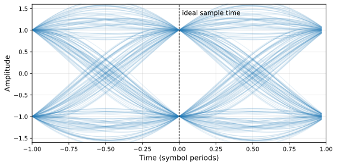
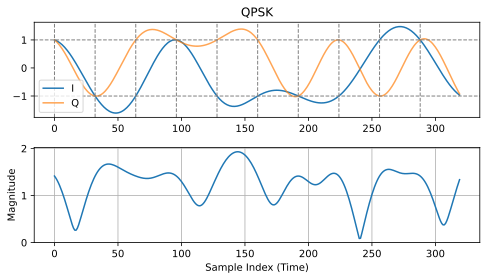
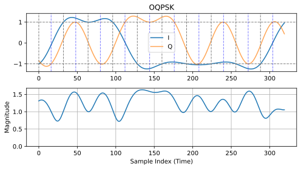
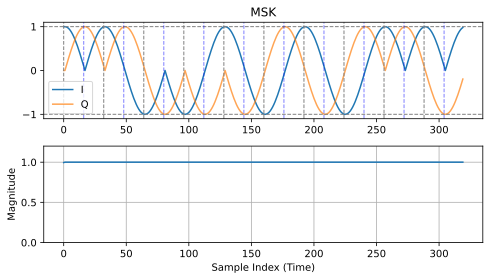
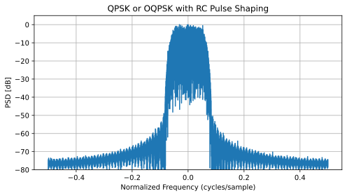
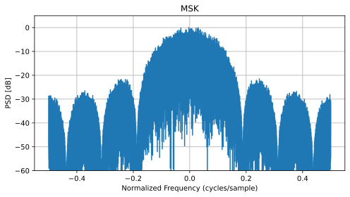
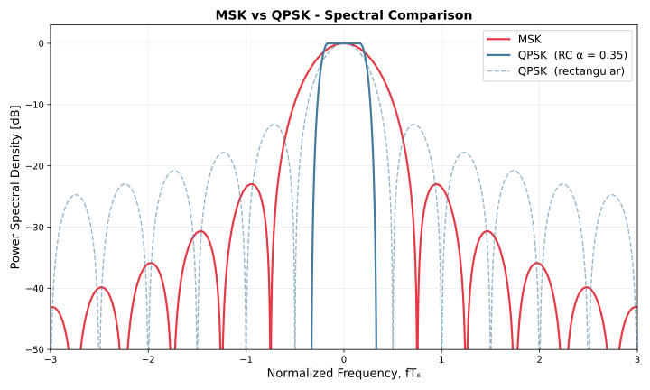
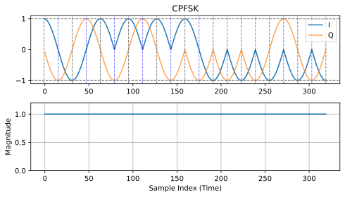

.. _pulse-shaping-chapter:

#######################
Pulse Shaping
#######################

У цій главі розглядається формування імпульсів, міжсимвольна інтерференція, узгоджена фільтрація та фільтри з підвищеною косинусністю.  Наприкінці ми використаємо Python для додавання формування імпульсів до символів BPSK.  Ви можете розглянути цей розділ у частині II розділу "Фільтри", де ми глибше зануримося у формування імпульсів.

**********************************
Міжсимвольна інтерференція (ISI)
**********************************

У розділі :ref:`filters-chapter` ми дізналися, що символи/імпульси блокової форми використовують надмірну кількість спектра, і ми можемо значно зменшити кількість спектра, що використовується, "формуючи" наші імпульси.  Однак, ви не можете використовувати будь-який низькочастотний фільтр, інакше ви можете отримати міжсимвольну інтерференцію (ISI), коли символи вливаються один в одного і заважають один одному.

Коли ми передаємо цифрові символи, ми передаємо їх один за одним (а не чекаємо деякий час між ними).  Коли ви застосовуєте фільтр, що формує імпульс, він подовжує імпульс у часовій області (щоб ущільнити його за частотою), що призводить до того, що сусідні символи накладаються один на одного.  Таке перекриття є нормальним, якщо ваш фільтр відповідає одному критерію: всі імпульси повинні дорівнювати нулю при кожному кратному періоді нашого символу :math:`T`, за винятком одного з імпульсів.  Найкраще цю ідею можна зрозуміти за допомогою наступної візуалізації:

.. image:: ../_images/pulse_train.svg
   :align: center 
   :target: ../_images/pulse_train.svg
   :alt: Імпульсна послідовність синусоїдальних імпульсів

Як ви можете бачити, на кожному інтервалі :math:`T` є один пік імпульсу, тоді як решта імпульсів дорівнює 0 (вони перетинають вісь x).  Коли приймач робить вибірку сигналу, він робить це в ідеальний момент часу (на піку імпульсів), тобто це єдиний момент часу, який має значення.  Зазвичай у приймачі є блок синхронізації символів, який забезпечує вибірку символів на піках.

**********************************
Узгоджений фільтр
**********************************

Один з трюків, який ми використовуємо в бездротовому зв'язку, називається узгодженою фільтрацією.  Щоб зрозуміти суть узгодженої фільтрації, ви повинні спочатку зрозуміти ці два моменти:

1. Імпульси, які ми обговорювали вище, повинні бути ідеально вирівняні лише на приймачі перед вибіркою.  До цього моменту не має значення, чи є ISI, тобто сигнали можуть летіти по повітрю з ISI і це нормально.

2. Нам потрібен фільтр низьких частот у передавачі, щоб зменшити кількість спектру, який використовує наш сигнал.  Але приймач також потребує низькочастотного фільтра, щоб усунути якомога більше шуму/перешкод поруч із сигналом.  В результаті ми маємо фільтр низьких частот на передавачі (Tx) і ще один на приймачі (Rx), а дискретизація відбувається після обох фільтрів (і впливу бездротового каналу).

Що ми робимо в сучасному зв'язку, так це ділимо фільтр формування імпульсів порівну між Tx і Rx.  Це не обов'язково повинні бути ідентичні фільтри, але теоретично оптимальним лінійним фільтром для максимізації SNR за наявності AWGN є використання *однакового* фільтра на Tx і Rx.  Ця стратегія називається концепцією "узгодженого фільтра".

Інший спосіб мислення про узгоджені фільтри полягає в тому, що приймач співвідносить отриманий сигнал з відомим шаблонним сигналом.  Шаблонний сигнал - це, по суті, імпульси, які надсилає передавач, незалежно від фазових/амплітудних зсувів, що застосовуються до них.  Нагадаємо, що фільтрація здійснюється шляхом згортки, яка по суті є кореляцією (насправді вони математично однакові, коли шаблон симетричний).  Цей процес кореляції отриманого сигналу з шаблоном дає нам найкращий шанс відновити те, що було надіслано, і саме тому він є теоретично оптимальним.  Як аналогію, уявіть собі систему розпізнавання зображень, яка шукає обличчя, використовуючи шаблон обличчя і двовимірну кореляцію:

.. image:: ../_images/face_template.png
   :scale: 70 
   :align: center 

**********************************
Розділення фільтра навпіл
**********************************

Як насправді розділити фільтр навпіл?  Згортання є асоціативним, що означає:

.. math::
 (f * g) * h = f * (g * h)

Уявімо собі :math:`f` як наш вхідний сигнал, а :math:`g` і :math:`h` - це фільтри.  Фільтрація :math:`f` за допомогою :math:`g`, а потім :math:`h` - це те ж саме, що і фільтрація одним фільтром, рівним :math:`g * h`.

Також нагадаємо, що згортка у часовій області - це множення у частотній області:

.. math::
 g(t) * h(t) \leftrightarrow G(f)H(f)
 
Щоб розділити фільтр навпіл, можна взяти квадратний корінь з частотної характеристики.

.. math::
 X(f) = X_H(f) X_H(f) \quad \mathrm{where} \quad X_H(f) = \sqrt{X(f)}

Нижче показано спрощену схему ланцюга передачі та прийому з фільтром піднесеного косинуса (RC), розділеним на два фільтри кореневого піднесеного косинуса (RRC); той, що на стороні передачі, є фільтром формування імпульсів, а той, що на стороні прийому, є узгодженим фільтром.  Разом вони призводять до того, що імпульси на демодуляторі виглядають так, ніби вони були сформовані одним RRC-фільтром.

.. image:: ../_images/splitting_rc_filter.svg
   :align: center 
   :target: ../_images/splitting_rc_filter.svg
   :alt: Схема ланцюжка передачі та прийому, де фільтр Raised Cosine (RC) розділено на два фільтри Root Raised Cosine (RRC)

********************************************
Специфічні фільтри формування імпульсів
********************************************

Ми знаємо, що ми хочемо:

1. Спроектувати фільтр, який зменшує смугу пропускання нашого сигналу (щоб використовувати менше спектру) і всі імпульси, крім одного, повинні дорівнювати нулю через кожний символьний інтервал.

2. Розділити фільтр навпіл, помістивши одну половину в Tx, а іншу в Rx.

Давайте розглянемо деякі конкретні фільтри, які зазвичай використовуються для формування імпульсів.

Фільтр піднесеного косинуса
############################

Найпопулярнішим фільтром, що формує імпульс, здається, є фільтр "піднесеного косинуса".  Це хороший фільтр низьких частот для обмеження смуги пропускання, яку займатиме наш сигнал, а також він має властивість обнулятися на інтервалах :math:`T`:

.. image:: ../_images/raised_cosine.svg
   :align: center 
   :target: ../_images/raised_cosine.svg
   :alt: Фільтр піднесеного косинуса у часовій області з різними значеннями зсуву

Зверніть увагу, що наведений вище графік наведено у часовій області. На ньому зображено імпульсну характеристику фільтра.  Параметр :math:`\beta` є єдиним параметром для фільтра піднесеного косинуса, і він визначає швидкість спадання фільтра в часовій області, яка буде обернено пропорційна швидкості спадання в частотній області:

.. image:: ../_images/raised_cosine_freq.svg
   :align: center 
   :target: ../_images/raised_cosine_freq.svg
   :alt: Фільтр піднесеного косинуса у частотній області з різноманітними значеннями зсуву

Причина, чому він називається фільтром з піднятим косинусом, полягає в тому, що частотна область при :math:`\beta = 1` являє собою півперіод косинусоїдальної хвилі, піднятої вгору, щоб розташуватися на осі x.

Рівняння, яке визначає імпульсну характеристику фільтра з піднятими косинусами, має вигляд:

.. math::
 h(t) = \frac{1}{T} \mathrm{sinc}\left( \frac{t}{T} \right) \frac{\cos\left(\frac{\pi\beta t}{T}\right)}{1 - \left( \frac{2 \beta t}{T} \right)^2}

Більш детальну інформацію про функцію :math:`\mathrm{sinc}()` можна знайти `тут <https://en.wikipedia.org/wiki/Sinc_function>`_.

Пам'ятайте: ми ділимо цей фільтр між Tx і Rx порівну.  Введіть фільтр кореневого піднесеного косинуса (RRC)!

Фільтр кореневого піднесеного косинуса
#######################################

Фільтр кореневого піднесеного косинуса (RRC) - це те, що ми фактично застосовуємо в наших Tx і Rx. Разом вони утворюють звичайний фільтр піднесеного косинуса, як ми вже обговорювали.  Оскільки поділ фільтра навпіл включає в себе квадратний корінь з частотної області, імпульсна характеристика стає трохи заплутаною:

.. image:: ../_images/rrc_filter.png
   :scale: 70 % 
   :align: center 

На щастя, цей фільтр широко використовується, і для нього існує багато реалізацій, зокрема `у Python <https://commpy.readthedocs.io/en/latest/generated/commpy.filters.rrcosfilter.html>`_.

Інші фільтри формування імпульсів
##################################

Інші фільтри включають фільтр Гауса, який має імпульсну характеристику, що нагадує функцію Гауса.  Існує також синусоїдальний фільтр, який еквівалентний фільтру піднесеного косинуса, коли :math:`\beta = 0`.  Синусоїдальний фільтр є більш ідеальним фільтром, тобто він усуває необхідні частоти без значної перехідної області.

**********************************
Коефіцієнт згортання
**********************************

Давайте розглянемо параметр :math:`\beta`.  Це число від 0 до 1, яке називають фактором "згортання" або іноді "надлишковою смугою пропускання".  Він визначає, як швидко у часовій області фільтр згортається до нуля.  Нагадаємо, що для використання в якості фільтра імпульсна характеристика повинна спадати до нуля з обох боків:

.. image:: ../_images/rrc_rolloff.svg
   :align: center 
   :target: ../_images/rrc_rolloff.svg
   :alt: Графік параметра піднятого косинуса зсуву

Чим нижче значення :math:`\beta`, тим більше потрібно відводів фільтра.  При :math:`\beta=0` імпульсна характеристика ніколи повністю не досягає нуля, тому ми намагаємося зробити :math:`\beta` якомога нижчою, не викликаючи інших проблем.  Чим меншим є спадання, тим більш компактним за частотою ми можемо створити наш сигнал для заданої швидкості передачі, що завжди важливо.

Загальне рівняння, яке використовується для наближеного обчислення смуги пропускання у Гц для заданої швидкості передачі символів і коефіцієнта рол-офф, має вигляд:

.. math::
    \mathrm{BW} = R_S(\beta + 1)

:math:`R_S` - це символьна швидкість у Гц.  Для бездротового зв'язку ми зазвичай використовуємо значення від 0,2 до 0,5.  Як правило, цифровий сигнал, який використовує частоту символів :math:`R_S`, займатиме трохи більше, ніж :math:`R_S` спектра, включаючи як позитивну, так і негативну частини спектра.  Після перетворення і передачі нашого сигналу, обидві сторони, безумовно, мають значення.  Якщо ми передаємо QPSK зі швидкістю 1 мільйон символів на секунду (MSps), це займе близько 1,3 МГц.  Швидкість передачі даних становитиме 2 Мбіт/с (нагадаємо, що QPSK використовує 2 біти на символ), включаючи всі накладні витрати, такі як кодування каналу і заголовки кадрів.

**********************************
Вправа на Python
**********************************

В якості вправи на Python давайте відфільтруємо і сформуємо деякі імпульси.  Ми будемо використовувати символи BPSK, щоб було легше візуалізувати - до етапу формування імпульсів, BPSK передбачає передачу 1 або -1 з частиною "Q", що дорівнює нулю.  З Q, що дорівнює нулю, ми можемо побудувати графік лише частини I, і на нього легше дивитися.

У цій симуляції ми використаємо 8 відліків на символ, і замість прямокутного сигналу, що складається з 1 та -1, ми використаємо імпульсну послідовність імпульсів.  Коли ви пропускаєте імпульс через фільтр, на виході виходить імпульсна характеристика (звідси і назва).  Тому, якщо ви хочете отримати серію імпульсів, вам потрібно використовувати імпульси з нулями між ними, щоб уникнути прямокутних імпульсів.

.. code-block:: python

    import numpy as np
    import matplotlib.pyplot as plt
    from scipy import signal

    num_symbols = 10
    sps = 8

    bits = np.random.randint(0, 2, num_symbols) # Наші дані для передачі, 1 та 0

    x = np.array([])
    for bit in bits:
        pulse = np.zeros(sps)
        pulse[0] = bit*2-1 # встановлюємо перше значення в 1 або -1
        x = np.concatenate((x, pulse)) # додаємо 8 відліків до сигналу
    plt.figure(0)
    plt.plot(x, '.-')
    plt.grid(True)
    plt.show()

.. image:: ../_images/pulse_shaping_python1.png
   :scale: 80 % 
   :align: center
   :alt: Послідовність імпульсів у часовій області, змодельована у Python

На цьому етапі наші символи все ще складаються з 1 та -1.  Не зациклюйтеся на тому, що ми використали імпульси.  Насправді, може бути простіше *не* візуалізувати реакцію на імпульси, а думати про неї як про масив:

.. code-block:: python

 bits: [0, 1, 1, 1, 1, 0, 0, 0, 1, 1]
 BPSK symbols: [-1, 1, 1, 1, 1, -1, -1, -1, 1, 1]
 Applying 8 samples per symbol: [-1, 0, 0, 0, 0, 0, 0, 0, 1, 0, 0, 0, 0, 0, 0, 0, 1, 0, 0, 0, 0, 0, 0, 0, ...]

Ми створимо фільтр підвищеного косинуса, використовуючи :math:`\beta` 0.35, і зробимо його довжиною 101 відведення, щоб дати сигналу достатньо часу для затухання до нуля.  Хоча рівняння піднесеного косинуса запитує наш період символу і вектор часу :math:`t`, ми можемо припустити, що період **вибірки** дорівнює 1 секунді, щоб "нормалізувати" нашу симуляцію.  Це означає, що наш період символу :math:`Ts` дорівнює 8, оскільки ми маємо 8 відліків на символ.  Тоді наш вектор часу буде списком цілих чисел.  Зважаючи на те, як працює рівняння піднесеного косинуса, ми хочемо, щоб точка :math:`t=0` була в центрі.  Ми згенеруємо вектор часу довжиною 101, починаючи з -51 і закінчуючи +51.

.. code-block:: python

    # Створюємо наш фільтр підвищеного косинуса
    num_taps = 101
    beta = 0.35
    Ts = sps # Припустимо, що частота дискретизації дорівнює 1 Гц, період дискретизації дорівнює 1, період *символу* дорівнює 8
    t = np.arange(num_taps) - (num_taps-1)//2
    h = np.sinc(t/Ts) * np.cos(np.pi*beta*t/Ts) / (1 - (2*beta*t/Ts)**2)
    plt.figure(1)
    plt.plot(t, h, '.')
    plt.grid(True)
    plt.show()

.. image:: ../_images/pulse_shaping_python2.png
   :scale: 80 % 
   :align: center 

Зверніть увагу, що вихідні дані однозначно спадають до нуля.  Той факт, що ми використовуємо 8 відліків на символ, визначає, наскільки вузьким виглядає цей фільтр і як швидко він спадає до нуля.  Наведена вище імпульсна характеристика виглядає як типовий низькочастотний фільтр, і ми не можемо визначити, що це саме фільтр, який формує імпульс, а не будь-який інший низькочастотний фільтр.

Нарешті, ми можемо відфільтрувати наш сигнал :math:`x` і дослідити результат.  Не зосереджуйтесь на введенні циклу for у наведеному коді.  Ми обговоримо, навіщо він тут, після блоку коду.

.. code-block:: python 
 
    # Фільтруємо наш сигнал, щоб застосувати формування імпульсу
    x_shaped = np.convolve(x, h)
    plt.figure(2)
    plt.plot(x_shaped, '.-')
    for i in range(num_symbols):
        plt.plot([i*sps+num_taps//2,i*sps+num_taps//2], [0, x_shaped[i*sps+num_taps//2]])
    plt.grid(True)
    plt.show()

.. image:: ../_images/pulse_shaping_python3.svg
   :align: center 
   :target: ../_images/pulse_shaping_python3.svg

Цей результуючий сигнал складається з багатьох наших імпульсних відгуків, приблизно половина з яких спочатку множиться на -1.  Це може виглядати складно, але ми пройдемо через це разом.

По-перше, через фільтр і спосіб роботи згортки є перехідні відліки до і після даних.  Ці додаткові відліки включаються в нашу передачу, але насправді вони не містять "піків" імпульсів.

По-друге, вертикальні лінії створено в циклі for заради наочності.  Вони показують, де припадають інтервали :math:`Ts`.  Ці інтервали позначають моменти, у які приймач дискретизуватиме цей сигнал.  Зверніть увагу, що на інтервалах :math:`Ts` крива має значення точно 1.0 або -1.0, що робить їх ідеальними моментами для взяття відліків.

Якби ми перенесли цей сигнал на несучу й передали його, приймачеві довелося б визначити, де саме проходять межі :math:`Ts` - наприклад, за допомогою алгоритму символьної синхронізації.  Так приймач знатиме *точно*, коли брати відліки, щоб отримати правильні дані.  Якщо приймач візьме відліки трохи зарано або запізно, він побачить значення, дещо спотворені через ISI, а якщо схибить сильно - отримає купу дивних чисел.

Ось приклад, створений у GNU Radio, який ілюструє, як виглядає IQ-діаграма (вона ж діаграма сузір'я), коли ми беремо відліки у правильні й неправильні моменти.  Вихідні імпульси підписано значеннями їхніх бітів.

.. image:: ../_images/symbol_sync1.png
   :scale: 50 % 
   :align: center 

Графік нижче показує ідеальний момент для взяття відліків разом з IQ-діаграмою:

.. image:: ../_images/symbol_sync2.png
   :scale: 40 % 
   :align: center
   :alt: GNU Radio simulation showing perfect sampling as far as timing

Порівняйте це з найгіршим моментом для взяття відліків.  Зверніть увагу на три кластери в сузір'ї.  Ми беремо відліки точно посередині між символами, тож наші відліки будуть дуже далекими від правильних.

.. image:: ../_images/symbol_sync3.png
   :scale: 40 % 
   :align: center 
   :alt: Симуляція GNU Radio, що демонструє недосконалу вибірку за часом

Ось ще один приклад поганого часу дискретизації, десь між нашим ідеальним і найгіршим випадками. Зверніть увагу на чотири кластери.  З високим SNR ми могли б уникнути такого інтервалу часу вибірки, хоча це і не рекомендується.

.. image:: ../_images/symbol_sync4.png
   :scale: 40 % 
   :align: center 
   
Пам'ятайте, що наші значення Q не показані на часовому графіку, оскільки вони приблизно дорівнюють нулю, що дозволяє графіку IQ поширюватися лише по горизонталі.

Якщо хочете попрацювати з цією ідеєю далі, інтерактивна схема GNU Radio нижче генерує `сигнал BPSK із формуванням імпульсів фільтром RRC <https://gnuradioworld.com/examples/filter/pulse-shaping-rrc-eye/>`_, пропускає його через зашумлений канал та узгоджений фільтр, а потім дискретизує.  Момент взяття відліку винесено на повзунок, в одиницях відліків.  Залиште його на 0 - і сузір'я матиме два щільні згустки; змістіть його від піку імпульсу - і побачите, як точки стягуються до початку координат, точно як на рисунках вище.  Коефіцієнт згортання теж можна регулювати, тож ви одночасно побачите, як бета впливає на зайняту смугу й на очну діаграму (тема наступного розділу).

.. raw:: html

   <!-- ════════ GNU RADIO WORLD EMBED ════════ -->
   <iframe
             src="https://gnuradioworld.com/?embed=1&zoom=60%#example=filter/pulse_shaping_rrc_eye"
             title="PySDR: RRC Pulse Shaping, Eye Diagram, and Sampling Instant"
             loading="lazy"
             allow="cross-origin-isolated; fullscreen"
             style="display:block; width:100%; aspect-ratio:21/9; min-height:345px; border:0; margin:18px auto 26px;"
           ></iframe>
   <!-- ════════ /GNU RADIO WORLD EMBED ════════ -->

*************
Очні діаграми
*************

Тепер, коли ми побудували й продискретизували сигнал із формуванням імпульсів, є класичний інструмент, який дозволяє оцінити стан усього сигналу з одного погляду: очна діаграма.  Ідея проста - взяти щойно створений сигнал із формуванням імпульсів після узгодженого фільтра на боці приймача, нарізати його на короткі фрагменти завдовжки по кілька символьних періодів кожен і накласти всі ці фрагменти один на одного.  Оскільки кожен фрагмент вирівняно за символьною синхронізацією, імпульси складаються один на одного й утворюють повторюваний візерунок, який, за певної уяви, схожий на око:

На що варто звернути увагу?  Сигнал збігається у щільні згустки біля :math:`+1` та :math:`-1` саме в моменти символів (штрихова лінія позначає ідеальний момент відліку, який ми навмисно розмістили на x=0), а між ідеальними моментами відліку він розходиться й перетинається.  Ця відкрита область посередині і є "оком", а її розмір показує, який запас ви маєте на похибку синхронізації та шум.  *Висота* отвору - це ваш запас за амплітудою, тобто скільки шуму сигнал витримає, перш ніж відліки опиняться не з того боку нуля.  *Ширина* отвору - це ваш запас за синхронізацією, тобто наскільки може зміститися тактовий генератор відліків приймача, перш ніж ISI почне закривати око.  Широко розкрите око означає, що сигнал легко приймати; закрите чи розмите око означає, що шум, ISI або похибка синхронізації з'їдають ваш запас.  Це та сама чутливість до синхронізації, яку ми досліджували вище на діаграмах сузір'я, лише показана в інший спосіб.

Усе описане вище стосувалося дійсного сигналу (BPSK), де достатньо дивитися лише на компоненту I.  Для комплексних модуляцій, як-от QPSK чи QAM, компоненти I та Q несуть власні символи, тому будують **окремі очні діаграми для I та для Q**.  Зазвичай їх показують поруч, і для надійного приймання обидва ока мають бути розкриті.

Щоб виробити інтуїцію, спробуйте інтерактивний застосунок нижче.  Він генерує випадкові символи, застосовує формування імпульсів піднесеним косинусом і накладає результати в живу очну діаграму.  Перетягуйте повзунки, щоб додати шуму (знизити SNR), внести тремтіння синхронізації (джитер) або змінити коефіцієнт згортання, і спостерігайте, як око розкривається й закривається.  Зверніть увагу, що шум закриває око вертикально (менший запас за амплітудою), тоді як джитер стискає його горизонтально (менший запас за синхронізацією), а перехід від BPSK до чотирирівневого сигналу (4-ASK, який передає два біти на символ за допомогою чотирьох амплітуд) розбиває його на три менші ока одне над одним.  Зауважте, що менший коефіцієнт згортання спричиняє більші значення в часовій області, але водночас призводить до того, що імпульс розтягується на кілька символів замість одного-двох, а отже дає більше можливих комбінацій значень при підсумовуванні наступних імпульсів.

.. raw:: html

    

    

************
OQPSK та MSK
************

Звичайна QPSK може мати великі коливання амплітуди - через те, що компоненти I та Q змінюються одночасно, а це може бути проблемою для деяких підсилювачів потужності, які найкраще працюють із менш мінливою обвідною. Нижче показано приклад QPSK із формуванням імпульсів піднесеним косинусом: угорі окремо показано I та Q у часовій області на низькій частоті, а внизу - модуль.  Зверніть увагу на великі коливання модуля, спричинені майже нульовими перетинами, коли I та Q змінюються одночасно.  Зверніть увагу на вертикальні штрихові лінії, що позначають межі символів: у цих точках і I, і Q дорівнюють точно 1 або -1.  Також зауважте, як у певних точках модуль підходить дуже близько до нуля.

**Offset QPSK (OQPSK)** - це невелика видозміна стандартної QPSK, яка вирішує цю проблему.  Вона працює так: компонента Q затримується на половину символьного періоду, тож I та Q ніколи не змінюються одночасно.  У результаті сигнал у будь-який момент робить лише 90-градусні фазові переходи (замість можливих стрибків на 180 градусів), завдяки чому обвідна залишається значно стабільнішою, і при цьому форма спектра не змінюється.  Нижче показано вже OQPSK; ми додали вертикальні штрихові лінії з інтервалами, зміщеними на половину символьного періоду, щоб показати, де змінюється компонента Q (тобто середину символу).

Код на Python для генерування OQPSK із формуванням імпульсів піднесеним косинусом має такий вигляд:

.. code-block:: python

   # Parameters
   num_symbols = 200
   sps = 32         # samples per symbol
   beta = 0.35      # roll-off factor
   span = 6         # filter span in symbols (each side)

   # Generate QPSK symbols
   bits = np.random.randint(0, 4, num_symbols)
   symbols = np.exp(1j * (np.pi/4 + bits * np.pi/2)).astype(complex)  # points at 45°, 135°, 225°, 315°

   # RC filter
   t = np.arange(-span * sps, span * sps + 1) / sps  # in symbol periods
   h = np.sinc(t) * np.cos(np.pi * beta * t) / (1 - (2 * beta * t)**2 + 1e-20)

   # Delay Q impulses by half a symbol before filtering so the pulse shaping  filter handles the ramp-up naturally (no post-filter roll/zero-fill artifact)
   half = sps // 2
   I_up = np.zeros(num_symbols * sps)
   Q_up = np.zeros(num_symbols * sps)
   I_up[::sps] = np.real(symbols)
   Q_up[half::sps] = np.imag(symbols)
   I_filt = np.convolve(I_up, h, mode='same')
   Q_filt = np.convolve(Q_up, h, mode='same')
   signal = I_filt + 1j * Q_filt

Можна зробити ще один крок: якщо замінити формування імпульсів піднесеним косинусом на новий тип формування - півсинусоїдою, - можна отримати ідеально сталу обвідну!  Фільтр формування імпульсів півсинусоїдою визначається як :math:`h(t) = \sin\left(\frac{\pi t}{T}\right)`, і його форма плавно згладжує кожен символ так, що фаза змінюється неперервно й лінійно від одного символу до наступного.  Результат називається **Minimum Shift Keying (MSK)** і є окремим випадком OQPSK.  Якщо взяти попередній код, але замінити фільтр піднесеного косинуса на наведений нижче код фільтра-півсинусоїди, ми отримаємо MSK:

.. code-block:: python

 # ...

 # Half-sine pulse shape (insert this in place of the RC Filter lines)
 t = np.arange(sps)
 h = np.sin(np.pi * t / sps)

 # ...

Обвідна, показана вище, буде практично сталою, що і є визначальною рисою MSK.

Зауважте, що для OQPSK та MSK терміни "символьний період" і "відліків на символ" можуть заплутувати, бо символ може означати або повний проміжок часу I + Q, або лише проміжок часу між змінами компоненти I чи Q (тобто вдвічі коротший).  У наведеному вище коді ми використовуємо перше визначення, тож символ - це повний проміжок часу I + Q, але так буває не завжди, і ви можете натрапити на множники 2 у рівняннях на кшталт визначення півсинусоїди.

Погляньмо коротко на форму цих сигналів у частотній області (спектральна густина потужності).  Для QPSK чи OQPSK із формуванням імпульсів піднесеним косинусом спектр однаковий: він дуже компактний і спадає відповідно до коефіцієнта згортання - саме тому формування імпульсів піднесеним косинусом таке популярне.

Для MSK форма півсинусоїди робить головну пелюстку значно ширшою, і сигнал має значно вищі бічні пелюстки.  Утім, для сигналів із низьким SNR ви навіть не побачите цих бічних пелюсток, бо вони будуть під рівнем шуму, оскільки лежать більш ніж на 20 дБ нижче.  Компромісом є те, що ми отримуємо ідеально сталу обвідну.

MSK часто застосовують у таких галузях, як супутниковий і далекокосмічний зв'язок, де стала обвідна дозволяє ефективніше підсилювати потужність, а зменшення зайнятої смуги спектра не таке критичне, як максимізація енергетичної ефективності.  І OQPSK, і MSK потребуватимуть дещо складнішого приймача порівняно зі звичайною QPSK через зсув між I та Q.

Ось порівняння на одному графіку, де для довідки додано також QPSK із прямокутними імпульсами.  Пам'ятайте: OQPSK і QPSK за використання того самого фільтра формування імпульсів (наприклад, піднесеного косинуса) мають однаковий спектр.

MSK можна вивести й із зовсім іншого боку - як окремий випадок **фазово-неперервної FSK (Continuous-Phase FSK, CPFSK)**.  У CPFSK кожен символ передається однією з двох частот, і, що важливо, фаза ніколи не скидається: вона плавно продовжується з того місця, де закінчився попередній символ.  Саме ця неперервність утримує обвідну сталою, а спектр - компактним.  MSK - це CPFSK з індексом модуляції :math:`h = 0.5`, тобто два тони рознесені рівно на :math:`\Delta f = \frac{1}{2T}` Гц, де :math:`T` - символьний період.  Сигнал на низькій частоті має вигляд:

.. math::

  s(t) = e^{j 2\pi \frac{h}{2T} \int_{-\infty}^{t} d(\tau)\, d\tau}

де :math:`d(\tau) \in \{-1, +1\}` - потік даних NRZ.  На практиці інтеграл просто накопичує фазу: кожен біт повертає фазу на :math:`\pm \frac{\pi}{2}` за один символьний період.  Код на Python для генерування MSK підходом CPFSK наведено нижче.  Зверніть увагу, що :code:`sps` скрізь поділено на 2, бо за підходу CPFSK символьний період удвічі коротший, оскільки кожен символ відповідає зміні або I, або Q, а не обох одразу.

.. code-block:: python

   bits = np.random.randint(0, 2, num_symbols)
   symbols = 2 * bits - 1 # map {0,1} → {-1, +1}

   # Build the instantaneous frequency deviation
   mod_index = 0.5
   t = np.arange(num_symbols * sps / 2) / (sps / 2)
   freq_dev = np.zeros(num_symbols * sps // 2)
   for k, a in enumerate(symbols):
      freq_dev[k * sps // 2 : (k + 1) * sps // 2] = a * mod_index / 2.0

   phase = 2.0 * np.pi * np.cumsum(freq_dev) / (sps / 2) # accumulate phase
   signal = np.exp(1j * phase)

І, як бачите, він виглядає точнісінько як наш попередній MSK, хоча згенерований у зовсім інший спосіб.

