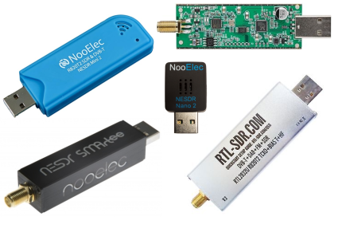
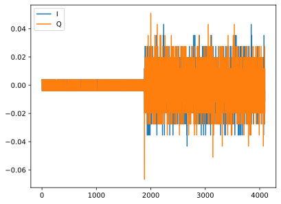
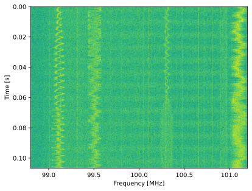

.. _rtlsdr-chapter:

##################
RTL-SDR у Python
##################

RTL-SDR є беззаперечно найдешевшим SDR (близько 30 доларів) і чудово підходить для початку знайомства.  Хоча він працює лише на прийом і може налаштовуватися лише до ~1,75 ГГц, існує безліч застосувань, де його можна використати.  У цьому розділі ми навчимося налаштовувати програмне забезпечення RTL-SDR та користуватися його Python API.

********************************
Передумови RTL-SDR
********************************

RTL-SDR з’явився приблизно у 2010 році, коли ентузіасти виявили, що можуть зламати недорогі DVB-T-адаптери з чипом Realtek RTL2832U.  DVB-T — це стандарт цифрового телебачення, що переважно використовується в Європі, але цікавинкою RTL2832U було те, що до сирих IQ-відліків можна було отримати прямий доступ, що дозволило застосовувати чип для побудови універсального приймального SDR.

Чип RTL2832U містить аналого-цифровий перетворювач (ADC) та USB-контролер, але його необхідно поєднати з ВЧ-тюнером.  Популярні тюнери — Rafael Micro R820T, R828D та Elonics E4000.  Діапазон налаштування залежить від тюнера і зазвичай становить приблизно 50–1700 МГц.  Максимальна частота дискретизації, своєю чергою, визначається RTL2832U та шиною USB вашого комп’ютера й зазвичай становить близько 2,4 МГц без значних втрат відліків.  Варто пам’ятати, що ці тюнери дуже дешеві й мають слабку чутливість RF, тож для прийому слабких сигналів часто доводиться додавати малошумний підсилювач (LNA) та смуговий фільтр.

RTL2832U завжди використовує 8-бітні відліки, тому хост-машина отримує два байти на один IQ-відлік.  Преміальні RTL-SDR зазвичай постачаються з термостабілізованим генератором (TCXO) замість дешевшого кварцового, що забезпечує кращу частотну стабільність.  Інша опціональна функція — це bias tee (bias-T): вбудоване коло, яке подає ~4,5 В постійної напруги на SMA-роз’єм для зручного живлення зовнішнього LNA чи інших RF-компонентів.  Ця додаткова постійна напруга подається на ВЧ-сторону SDR, тому не заважає основній роботі з прийому.

Для тих, хто цікавиться визначенням напряму приходу (DOA) чи іншими задачами формування променя, `KrakenSDR <https://www.crowdsupply.com/krakenrf/krakensdr>`_ — це фазово-узгоджений SDR, побудований з п’яти RTL-SDR, що мають спільні генератор та тактовий сигнал.

********************************
Встановлення програмного забезпечення
********************************

Ubuntu (або Ubuntu у WSL)
#############################

В Ubuntu 20, 22 та інших системах на базі Debian ви можете встановити програмне забезпечення RTL-SDR за допомогою такої команди.

.. code-block:: bash

 sudo apt install rtl-sdr

Це встановить бібліотеку librtlsdr та інструменти командного рядка, зокрема :code:`rtl_sdr`, :code:`rtl_tcp`, :code:`rtl_fm` і :code:`rtl_test`.

Далі встановіть Python-обгортку для librtlsdr командою:

.. code-block:: bash

 sudo pip install pyrtlsdr

Якщо ви використовуєте Ubuntu через WSL, на стороні Windows завантажте останню версію `Zadig <https://zadig.akeo.ie/>`_ і встановіть драйвер "WinUSB" для RTL-SDR (може бути два інтерфейси Bulk-In — у такому разі встановіть "WinUSB" для обох).  Після завершення роботи Zadig від’єднайте і знову під’єднайте RTL-SDR.

Далі потрібно пробросити USB-пристрій RTL-SDR у WSL.  Спершу встановіть останню `msi-версію утиліти usbipd <https://github.com/dorssel/usbipd-win/releases>`_ (у цьому посібнику передбачається, що у вас usbipd-win 4.0.0 або новіша), потім відкрийте PowerShell з правами адміністратора та виконайте:

.. code-block:: bash

    # (від’єднайте RTL-SDR)
    usbipd list
    # (під’єднайте RTL-SDR)
    usbipd list
    # (знайдіть новий пристрій і підставте його індекс у команді нижче)
    usbipd bind --busid 1-5
    usbipd attach --wsl --busid 1-5

У WSL ви повинні мати змогу запустити :code:`lsusb` і побачити новий запис під назвою RTL2838 DVB-T або щось подібне.

Якщо виникають проблеми з дозволами (наприклад, тест нижче працює лише з :code:`sudo`), потрібно налаштувати правила udev.  Спочатку виконайте :code:`lsusb`, щоб знайти ID вашого RTL-SDR, після чого створіть файл :code:`/etc/udev/rules.d/10-rtl-sdr.rules` з таким вмістом, підставивши idVendor та idProduct вашого пристрою, якщо вони відрізняються:

.. code-block::

 SUBSYSTEM=="usb", ATTRS{idVendor}=="0bda", ATTRS{idProduct}=="2838", MODE="0666"

Щоб перезапустити udev, виконайте:

.. code-block:: bash

    sudo udevadm control --reload-rules
    sudo udevadm trigger

Якщо ви користуєтесь WSL і отримуєте повідомлення :code:`Failed to send reload request: No such file or directory`, це означає, що служба udev не запущена.  Додайте в :code:`sudo nano /etc/wsl.conf` такі рядки:

.. code-block:: bash

 [boot]
 command="service udev start"

Після цього перезапустіть WSL у PowerShell з правами адміністратора командою :code:`wsl.exe --shutdown`.

Може також знадобитися знову від’єднати й під’єднати RTL-SDR (у WSL його доведеться знову підключити за допомогою :code:`usbipd attach`).

Windows
###################

Користувачам Windows варто звернутися до https://www.rtl-sdr.com/rtl-sdr-quick-start-guide/.

********************************
Тестування RTL-SDR
********************************

Якщо встановлення пройшло успішно, ви зможете виконати такий тест, що налаштує RTL-SDR на FM-діапазон і збереже 1 мільйон відліків у файл :code:`recording.iq` у каталозі :code:`/tmp`.

.. code-block:: bash

    rtl_sdr /tmp/recording.iq -s 2e6 -f 100e6 -n 1e6

Якщо ви отримуєте :code:`No supported devices found`, навіть із :code:`sudo`, це означає, що Linux взагалі не бачить RTL-SDR.  Якщо команда працює з :code:`sudo`, значить проблема у правилах udev; спробуйте перезавантажити комп’ютер після виконання вказівок з налаштування udev вище.  Або ж можете використовувати :code:`sudo` всюди, включно із запуском Python.

Перевірити, чи Python бачить RTL-SDR, можна таким скриптом:

.. code-block:: python

 from rtlsdr import RtlSdr

 sdr = RtlSdr()
 sdr.sample_rate = 2.048e6 # Hz
 sdr.center_freq = 100e6   # Hz
 sdr.freq_correction = 60  # PPM
 sdr.gain = 'auto'

 print(len(sdr.read_samples(1024)))
 sdr.close()

який має вивести:

.. code-block:: bash

 Found Rafael Micro R820T tuner
 [R82XX] PLL not locked!
 1024

********************************
Код RTL-SDR на Python
********************************

Код вище можна вважати базовим прикладом використання RTL-SDR у Python.  Далі ми детальніше розглянемо різні параметри та прийоми роботи.

Запобігання збоїв RTL-SDR
###############################

Наприкінці скрипта або щоразу, коли завершили зчитування відліків із RTL-SDR, викликайте :code:`sdr.close()`, щоб уникнути зависань пристрою, коли його доводиться фізично від’єднувати й під’єднувати.  Навіть із викликом close() це може статися — ви це зрозумієте, якщо RTL-SDR зависне під час :code:`read_samples()`.  Якщо так сталося, потрібно від’єднати і знову під’єднати RTL-SDR і, можливо, перезавантажити комп’ютер.  Якщо ви використовуєте WSL, доведеться повторно підключити RTL-SDR за допомогою usbipd.

Налаштування підсилення
#############

Параметр :code:`sdr.gain = 'auto'` вмикає автоматичне керування підсиленням (AGC), через що RTL-SDR регулює підсилення, намагаючись заповнити 8-бітний ADC без його насичення.  У багатьох випадках, наприклад для побудови аналізатора спектра, корисно тримати підсилення сталим, тобто доводиться задавати його вручну.  RTL-SDR не підтримує довільні значення підсилення; список допустимих значень можна отримати командою :code:`print(sdr.valid_gains_db)`.  Якщо задати інше значення, пристрій автоматично вибере найближче допустиме.  Поточне підсилення можна перевірити командою :code:`print(sdr.gain)`.  У прикладі нижче ми встановлюємо підсилення 49,6 дБ, зчитуємо 4096 відліків і будуємо їх у часовій області:

.. code-block:: python

 from rtlsdr import RtlSdr
 import numpy as np
 import matplotlib.pyplot as plt

 sdr = RtlSdr()
 sdr.sample_rate = 2.048e6 # Hz
 sdr.center_freq = 100e6   # Hz
 sdr.freq_correction = 60  # PPM
 print(sdr.valid_gains_db)
 sdr.gain = 49.6
 print(sdr.gain)

 x = sdr.read_samples(4096)
 sdr.close()

 plt.plot(x.real)
 plt.plot(x.imag)
 plt.legend(["I", "Q"])
 plt.savefig("../_images/rtlsdr-gain.svg", bbox_inches='tight')
 plt.show()

Тут варто звернути увагу на кілька моментів.  Перші ~2 тисячі відліків майже не містять енергії сигналу, бо це перехідні процеси.  Рекомендується щоразу відкидати перші 2 тисячі відліків, наприклад, виконавши :code:`sdr.read_samples(2048)` і не використовуючи результат.  Інше спостереження — pyrtlsdr повертає нам відліки у вигляді чисел з рухомою комою в діапазоні від -1 до +1.  Хоча пристрій використовує 8-бітний ADC і видає цілі числа, pyrtlsdr ділить їх на 127.0 для нашої зручності.

Допустимі частоти дискретизації
#####################

Більшість RTL-SDR вимагають, щоб частота дискретизації лежала або в діапазоні 230–300 кГц, або 900–3,2 МГц.  Зверніть увагу, що на високих частотах, особливо понад 2,4 МГц, через USB можуть не проходити всі відліки.  Якщо задати непідтримувану частоту, ви отримаєте помилку :code:`rtlsdr.rtlsdr.LibUSBError: Error code -22: Could not set sample rate to 899000 Hz`.  Після встановлення допустимого значення в консолі з’явиться точна частота дискретизації; цю ж величину можна отримати викликом :code:`sdr.sample_rate`.  У деяких застосунках може бути важливо враховувати саме точне значення в обчисленнях.

Як вправу встановімо частоту дискретизації 2,4 МГц і побудуємо спектрограму FM-діапазону:

.. code-block:: python

 # ...
 sdr.sample_rate = 2.4e6 # Hz
 # ...

 fft_size = 512
 num_rows = 500
 x = sdr.read_samples(2048) # позбавляємося початкових порожніх відліків
 x = sdr.read_samples(fft_size*num_rows) # зчитуємо всі відліки для спектрограми
 spectrogram = np.zeros((num_rows, fft_size))
 for i in range(num_rows):
     spectrogram[i,:] = 10*np.log10(np.abs(np.fft.fftshift(np.fft.fft(x[i*fft_size:(i+1)*fft_size])))**2)
 extent = [(sdr.center_freq + sdr.sample_rate/-2)/1e6,
             (sdr.center_freq + sdr.sample_rate/2)/1e6,
             len(x)/sdr.sample_rate, 0]
 plt.imshow(spectrogram, aspect='auto', extent=extent)
 plt.xlabel("Частота [МГц]")
 plt.ylabel("Час [с]")
 plt.show()

Параметр PPM
############

Щодо параметра ppm: кожен RTL-SDR має невелику частотну похибку через низьку вартість тюнерів та відсутність калібрування.  Це зміщення частоти здебільшого лінійне (а не сталий зсув), тож ми можемо компенсувати його, вказавши значення PPM у частинах на мільйон.  Наприклад, якщо налаштуватися на 100 МГц і задати PPM = 25, сигнал зміститься вгору на 100e6/1e6*25 = 2500 Гц.  Вужчі сигнали чутливіші до помилок частоти.  Водночас багато сучасних сигналів мають етап синхронізації частоти, який компенсує похибки на передавачі, приймачі або через доплерівський зсув.

********************************
Додаткові матеріали
********************************

#. `Сторінка "About" на RTL-SDR.com <https://www.rtl-sdr.com/about-rtl-sdr/>`_
#. https://hackaday.com/2019/07/31/rtl-sdr-seven-years-later/
#. https://osmocom.org/projects/rtl-sdr/wiki/Rtl-sdr
