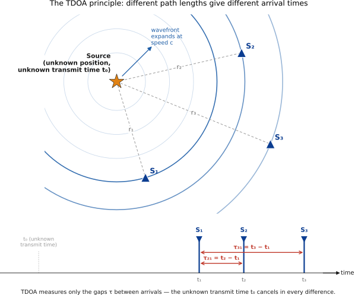
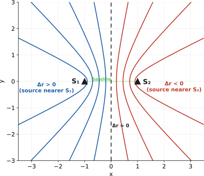
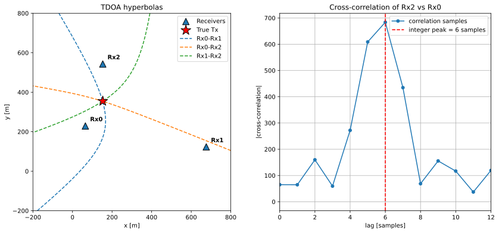
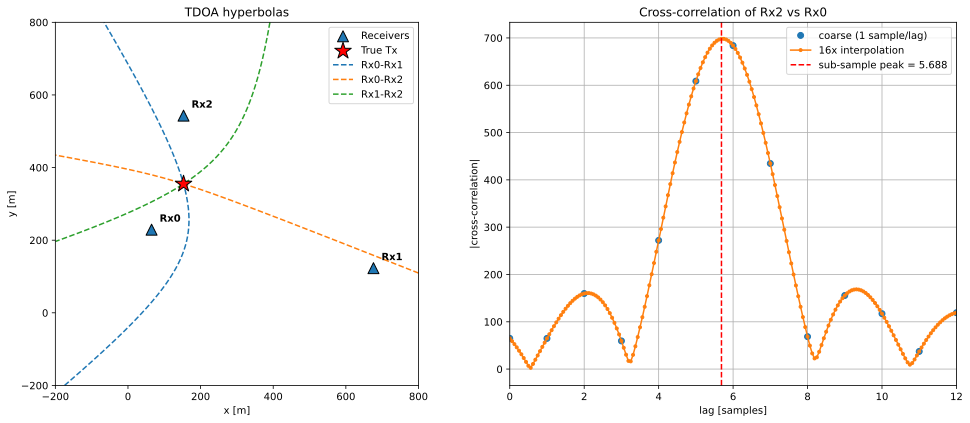
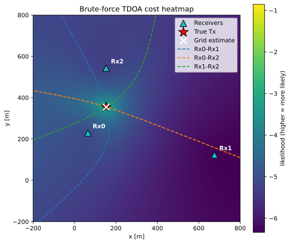
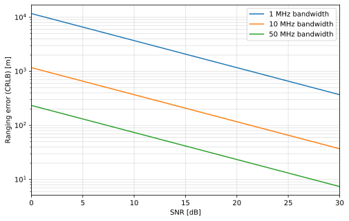
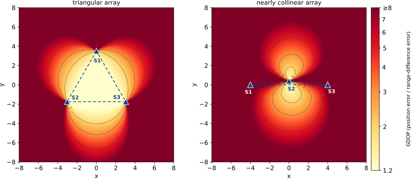

.. _tdoa-chapter:

####
TDOA
####

Різниця часу прибуття (Time Difference of Arrival, TDOA) — це метод визначення положення передавача (також званого випромінювачем) за допомогою кількох синхронізованих приймачів (також званих сенсорами) шляхом порівняння часу прибуття сигналу. У цьому розділі розглянуто весь ланцюжок TDOA: геометрію, оцінювання часової затримки методом GCC-PHAT, локалізацію в замкненій формі та методом максимальної правдоподібності, межі точності (CRLB і GDOP), а також такі проблеми, як синхронізація й багатопроменеве поширення. TDOA широко застосовують як у радіочастотних, так і в акустичних та гідроакустичних системах.

Перш ніж заглиблюватися в теорію, спробуйте інтерактивну демонстрацію нижче. Вона допоможе швидко відчути принцип роботи TDOA, заснований на перетині гіпербол.

.. raw:: html

    

    

************
Вступ
************

У радіотехніці, акустиці та гідроакустиці часто виникає потреба визначити положення випромінювача — виконати його геолокацію. Випромінювач може бути кооперативним, як мобільний телефон, який потрібно знайти, або некооперативним, як радіолокатор, оператор якого не бажає розкривати своє положення. Він може бути нерухомим чи рухомим, а середовищем поширення можуть бути повітря, вода або вільний простір. Локалізацію за TDOA використовують для визначення положення абонента під час екстреного виклику, в акустичних мікрофонних решітках (наприклад, у системах виявлення пострілів на міських ліхтарях), пасивній гідроакустиці, пасивній радіолокації, радіоелектронній боротьбі, радіотехнічній розвідці та навіть для стеження за дикими тваринами. Інженерні деталі в кожному випадку різні, але математична основа однакова.

Головна ідея TDOA полягає в тому, що різниця часу, коли один і той самий хвильовий фронт досягає двох сенсорів, залежить лише від геометрії, а не від моменту випромінювання. Розгляньмо час поширення від випромінювача до сенсора :math:`i`: :math:`t_i = t_0 + r_i / c`, де :math:`t_0` — невідомий момент початку передавання, :math:`r_i` — відстань від випромінювача до сенсора, а :math:`c` — швидкість поширення. Віднімемо час прибуття на два сенсори:

.. math::

   \tau_{ij} = t_i - t_j = \frac{r_i - r_j}{c},

Невідоме :math:`t_0` зникає, і це добре, адже ми, найімовірніше, ніколи його не дізнаємося. TDOA залежить лише від *різниці* дальностей, яка визначається тільки взаємним розташуванням випромінювача й сенсорів. Саме тому TDOA особливо корисний для некооперативних випромінювачів: нам не потрібно знати момент передавання, достатньо виміряти відносні затримки, з якими той самий хвильовий фронт досяг синхронізованих приймачів. Водночас сигнал потрібно виділити так, щоб спостерігався лише один випромінювач, тому можуть знадобитися виявлення, класифікація та фільтрація сигналу.

Кожна пара сенсорів дає одне значення TDOA, а кожному значенню TDOA відповідає одна гіпербола. Отже, кількість гіпербол дорівнює кількості пар сенсорів. Для :math:`N` сенсорів вона становить

.. math::

   \binom{N}{2} = \frac{N(N-1)}{2},

тобто три сенсори дають три гіперболи, чотири — шість, п'ять — десять тощо. Не всі ці вимірювання незалежні: як побачимо далі, нову геометричну інформацію несуть лише :math:`N-1` із них. Однак повний набір усе одно корисний для усереднення шуму.

Ціна такої можливості — вимога до приймачів мати спільну надзвичайно точну опору часу. Як буде показано далі, це саме по собі складне інженерне завдання: принаймні в радіочастотних системах похибка часу в одну наносекунду відповідає похибці дальності приблизно 0,3 метра.

****************
Геометрія TDOA
****************

Від різниці часу до різниці дальностей
======================================

Множення виміряної різниці часу на швидкість поширення перетворює її на *різницю дальностей*:

.. math::

   \Delta r_{ij} = c\,\tau_{ij} = r_i - r_j .

Для акустичних задач у повітрі :math:`c \approx 343` м/с, а для радіосигналів :math:`c \approx 2.998\times10^8` м/с. Звідси одразу видно наслідок для точності: у повітрі похибка часу :math:`0.1` мс відповідає лише приблизно :math:`\sim`\3 см, тоді як у вільному просторі та сама похибка дає 30 км. Тому радіочастотний TDOA потребує винятково точного вимірювання часу — до цієї теми ми ще неодноразово повернемося.

На схемі нижче показано випромінювач і три сенсори, а також часові графіки сигналу, який досягає кожного сенсора в різні моменти.

Гіпербола
=========

Що насправді повідомляє одна різниця дальностей? Припустімо, є два сенсори, а вимірювання показало, що випромінювач на 100 метрів ближчий до одного з них. Де він може перебувати? Не в одній конкретній точці, а будь-де вздовж кривої лінії. Під час руху вздовж цієї лінії обидві відстані до сенсорів змінюються, але їхня *різниця* весь час залишається рівною 100 метрам.

Ця крива називається **гіперболою**, а два сенсори розташовані в її фокусах. У тривимірному просторі та сама ідея утворює криву поверхню — гіперболоїд, проте двовимірний випадок простіше уявити, а всі міркування переносяться й у 3D. Позначимо положення випромінювача як :math:`\mathbf{u}`, а положення сенсорів як :math:`\mathbf{s}_i` і :math:`\mathbf{s}_j`. Тоді гіпербола є множиною точок, які задовольняють рівняння

.. math::

   |\mathbf{u}-\mathbf{s}_i| - |\mathbf{u}-\mathbf{s}_j| = \Delta r_{ij} = \text{constant},

яке читається так: відстань до одного сенсора мінус відстань до другого дорівнює виміряній різниці дальностей. Звідси безпосередньо випливають кілька практичних наслідків:

* **Різниця дальностей не може перевищувати відстань між двома сенсорами.** Інтуїтивно різниця двох відстаней найбільша, коли випромінювач лежить за одним із сенсорів на прямій, що їх сполучає. Навіть тоді вона може лише дорівнювати відстані між сенсорами, яку часто називають *базою*. Якщо виміряна різниця більша за базу, щось негаразд: найімовірнішими причинами є шум, багатопроменеве поширення або похибка часу чи синхронізації.
* **Знак указує, з якого боку розташований випромінювач.** Гіпербола має дві дзеркальні гілки, кожна з яких вигинається до одного із сенсорів. Додатний або від'ємний знак різниці дальностей вибирає гілку біля ближчого сенсора, усуваючи неоднозначність між половинами.
* **Форма залежить від виміряного значення.** Коли різниця дальностей близька до повної довжини бази, гіпербола притискається до прямої між сенсорами. Коли різниця близька до нуля, тобто випромінювач майже рівновіддалений від них, крива випрямляється в серединний перпендикуляр до бази. Поблизу обох крайніх випадків геометрія стає погано обумовленою: малі похибки вимірювань сильно зміщують оцінку положення, тому локалізація менш надійна.

Отже, одне значення TDOA обмежує положення випромінювача кривою, а не точкою. Щоб визначити точку, потрібно перетнути кілька таких кривих. Нижче показано два сенсори та кілька гілок гіпербол для :math:`\Delta r < 0`, :math:`\Delta r = 0` (серединний перпендикуляр) і :math:`\Delta r > 0`. На кожній гіперболі TDOA між двома сенсорами постійна. Маючи лише два сенсори, ми знали б, що випромінювач лежить десь на відповідній лінії; третій сенсор потрібний, щоб знайти конкретну точку на ній, тобто виконати геолокацію.

Мультилатерація
===============

Маючи :math:`N` сенсорів, можна утворити їхні пари й перетнути відповідні гіперболи; випромінювач лежить у точці або поблизу точки їхнього спільного перетину. Цей процес називають **гіперболічною мультилатерацією**. Підрахунок ступенів вільності показує потрібну кількість сенсорів:

* У **2D** положення випромінювача має дві невідомі координати :math:`(x,y)`. Кожне незалежне TDOA дає одне рівняння, тому потрібні щонайменше два незалежні TDOA, а отже, **три сенсори**. Наприклад, такий підхід придатний, якщо відомо, що випромінювач розташований на поверхні землі й кривизною Землі можна знехтувати.
* У **3D** положення має три невідомі координати :math:`(x,y,z)`, тому потрібні три незалежні TDOA і, відповідно, **чотири сенсори**.

За відсутності шуму гіперболи перетинаються в одній точці. Іноді виникає геометрична неоднозначність, яку усувають знаки гілок або додатковий сенсор. Якщо сенсорів більше за мінімальну кількість, система стає *перевизначеною*: через шум гіперболи вже не мають точної спільної точки, тож потрібно розв'язувати задачу найменших квадратів або максимальної правдоподібності, як описано далі.

Опорний сенсор і незалежні пари
===============================

Із :math:`N` сенсорів можна утворити :math:`\binom{N}{2}` попарних TDOA, але не всі вони незалежні. Виберімо один сенсор опорним, наприклад сенсор 1, і сформуймо :math:`\tau_{i1}` для :math:`i = 2,\dots,N`. Отримаємо :math:`N-1` TDOA, з яких можна відновити будь-яку іншу попарну різницю, оскільки :math:`\tau_{ij} = \tau_{i1} - \tau_{j1}`. Саме ці :math:`N-1` *незалежних* вимірювань несуть усю геометричну інформацію.

Спокусливо припустити, що надлишкові пари принаймні дають додаткове усереднення шуму, але це не так, і таке припущення є однією з класичних помилок у TDOA. Кожна пара, до якої входить сенсор :math:`i`, успадковує *ту саму* часову похибку сенсора :math:`i`, тому попарні вимірювання не є незалежними реалізаціями. За придатного відношення сигнал/шум похибка затримки пари розкладається, у першому наближенні, на внески шуму кожного з двох сенсорів, :math:`\delta\tau_{ij}\approx \epsilon_j-\epsilon_i`, де :math:`\epsilon_i` — часова похибка, що належить лише сенсору :math:`i`. Це означає, що *похибки* задовольняють те саме співвідношення замикання, що й вимірювання, :math:`\delta\tau_{ij} = \delta\tau_{i1}-\delta\tau_{j1}` (результат, що сягає праці Гана і Треттера). Отже, третя кореляція трикутника не містить жодної похибки, якої немає в інших двох, і не додає нової інформації: :math:`N` сенсорів дають :math:`N-1` незалежних чисел, скільки б кореляцій ви не обчислили.

То для чого ж потрібні надлишкові пари? Для двох речей. По-перше, для **узгодженості**: співвідношення замикання має виконуватися, тому пара, яка його грубо порушує, сигналізує про багатопроменевість, перекритий прямий промінь або збій синхронізації — саме на цьому ґрунтуються описані далі в цьому розділі перевірки на викиди. По-друге, для **симетрії**: якщо зважити пари правильною корельованою коваріацією, ви отримаєте однакову оцінку положення незалежно від того, чи використовуєте всі :math:`\binom{N}{2}` пар, чи будь-яку підмножину з одним опорним сенсором, тож довільний вибір опорного сенсора не впливає на результат. Ця інваріантність — зручна перевірка того, що зважування зроблено правильно, бо з неправильним (діагональним) ваговим множником відповідь змінюється залежно від того, який сенсор ви випадково назвали опорним.

Чого робити *не можна* — це подавати в оцінювач усі пари, вважаючи їх незалежними вимірюваннями. Так той самий шум сенсора враховується двічі, а отримані коваріація похибки й межа Крамера — Рао виходять оптимістичними, тобто на папері система виглядає точнішою, ніж вона є. У наступному підрозділі записано, який вигляд коваріація має насправді. (Одне практичне застереження: кожна кореляція обчислюється окремо, а пошук піка є нелінійним, тому реальні надлишкові оцінки не є *точно* різницею інших, і за низького відношення сигнал/шум чи грубої роздільної здатності за затримкою вони можуть дати трохи справжнього усереднення, але ніколи не будуйте на цьому свій бюджет похибок.)

Приклад: двовимірна локалізація за трьома сенсорами
===================================================

Розташуємо три сенсори в точках

.. math::

   \mathbf{s}_1=(0,0),\quad \mathbf{s}_2=(100,0),\quad \mathbf{s}_3=(0,100)\ \text{(meters)},

а справжнє положення випромінювача нехай дорівнює :math:`\mathbf{u}=(40,30)`. Відстані від випромінювача до сенсорів становлять

.. math::

   r_1=\sqrt{40^2+30^2}=50,\quad
   r_2=\sqrt{60^2+30^2}=\sqrt{4500}\approx 67.08,\quad
   r_3=\sqrt{40^2+70^2}=\sqrt{6500}\approx 80.62 .

Вибравши сенсор 1 опорним, отримаємо такі різниці дальностей:

.. math::

   \Delta r_{21}=r_2-r_1\approx 17.08\ \text{m},\qquad
   \Delta r_{31}=r_3-r_1\approx 30.62\ \text{m}.

Кожне рівняння задає гіперболу з фокусами :math:`\{\mathbf{s}_2,\mathbf{s}_1\}` і :math:`\{\mathbf{s}_3,\mathbf{s}_1\}` відповідно; точка їхнього перетину є положенням випромінювача. Розв'язувати два рівняння гіпербол вручну незручно. Саме тому далі буде розроблено алгебричну лінеаризацію, за допомогою якої ми відновимо :math:`(40,30)` із цих чисел у замкненій формі.

********************************
Модель сигналу та вимірювань
********************************

Модель прийнятого сигналу
=========================

Кожен сенсор приймає затриману в часі, масштабовану й зашумлену копію сигналу випромінювача. Нехай :math:`s(t)` — форма переданого сигналу. Тоді сенсор :math:`i` приймає

.. math::

   x_i(t) = a_i \, s(t - t_i) + n_i(t), \qquad i = 1,\dots,N,

де :math:`a_i` — дійсний (або комплексний для смугових сигналів) коефіцієнт підсилення, який враховує втрати поширення й характеристику антени; :math:`t_i = t_0 + r_i/c` — абсолютний час прибуття; :math:`n_i(t)` — адитивний шум. Ця модель передбачає один домінантний шлях прямої видимості. Багатопроменеве поширення та відсутність прямої видимості розглянуто в наступному розділі.

Визначення TDOA
===============

Попарна TDOA — це різниця часу прибуття:

.. math::

   \tau_{ij} = t_i - t_j = \frac{r_i - r_j}{c} = \frac{|\mathbf{u}-\mathbf{s}_i| - |\mathbf{u}-\mathbf{s}_j|}{c}.

Права частина явно показує, що TDOA є нелінійною функцією координат випромінювача :math:`\mathbf{u}`. Задача *вимірювання* полягає в оцінюванні :math:`\tau_{ij}` за сигналами :math:`x_i, x_j`, а задача *локалізації* — в оберненні нелінійного відображення від :math:`\mathbf{u}` до набору TDOA.

Припущення щодо шуму
====================

Припустімо, що кожен :math:`n_i(t)` має нульове середнє, є стаціонарним у широкому сенсі, гаусовим і незалежним від переданого сигналу та шуму інших сенсорів. Відношення сигнал/шум для окремого сенсора дорівнює

.. math::

   \mathrm{SNR}_i = \frac{a_i^2 \sigma_s^2}{\sigma_{n_i}^2},

де :math:`\sigma_s^2` і :math:`\sigma_{n_i}^2` — потужності сигналу та шуму. Це ідеалізовані припущення: реальний шум часто забарвлений і частково корельований між сенсорами. Проте вони приводять до оцінювачів і меж, які добре працюють на практиці, а за потреби цей підхід можна узагальнити на довільну коваріацію шуму.

Нелінійні рівняння вимірювань
=============================

Зберемо :math:`N-1` різниць дальностей відносно опорного сенсора у вектор :math:`\mathbf{m}` з елементами :math:`m_i = c\,\tau_{i1} = r_i - r_1`. Тоді модель без шуму має вигляд

.. math::

   \mathbf{m} = \mathbf{h}(\mathbf{u}), \qquad
   h_i(\mathbf{u}) = |\mathbf{u}-\mathbf{s}_i| - |\mathbf{u}-\mathbf{s}_1|,

а зашумлене вимірювання дорівнює :math:`\tilde{\mathbf{m}} = \mathbf{h}(\mathbf{u}) + \boldsymbol{\varepsilon}`, де :math:`\boldsymbol{\varepsilon}` — похибка різниці дальностей, спричинена похибками оцінювання часової затримки. Функція :math:`\mathbf{h}` нелінійна через евклідові норми, і ця нелінійність є джерелом усіх подальших алгоритмічних ускладнень. Є дві основні стратегії: алгебрично *лінеаризувати* задачу введенням допоміжної змінної, як описано в наступному розділі, або *ітеративно* лінеаризувати її біля поточної оцінки, як описано нижче.

Коваріація різниць дальностей
=============================

Кожному зваженому оцінювачу і кожній межі в решті цієї глави потрібна :math:`\mathbf{C}=\mathrm{Cov}(\boldsymbol{\varepsilon})` - коваріація тих самих похибок різниць дальностей, тож виведімо її, а не вгадуймо.

Почнемо на рівень нижче - з окремих сенсорів. Як зазначено вище, за придатного відношення сигнал/шум похибка затримки взаємної кореляції розкладається на внески від шуму кожного з двох сенсорів, тож кожну похибку різниці дальностей можна записати як різницю *посенсорних* похибок вимірювання дальності :math:`\epsilon_i` (ті самі посенсорні похибки, що й раніше, але тепер у метрах, а не в секундах),

.. math::

   \varepsilon_{ij} = \epsilon_j - \epsilon_i,

де :math:`\epsilon_i` мають дисперсію :math:`\sigma^2` і є незалежними *між сенсорами*, оскільки тепловий шум одного приймача жодним чином не пов'язаний із шумом іншого. Незалежність існує на рівні сенсорів, а не пар, і саме в цьому вся суть: дві пари, які мають спільний сенсор, мають і спільну похибку :math:`\epsilon` цього сенсора. Для набору відносно опорного сенсора :math:`m_i = r_i - r_1` кожне окреме вимірювання містить :math:`-\epsilon_1`, тому

.. math::

   \mathrm{var}(\varepsilon_{i1}) = 2\sigma^2, \qquad
   \mathrm{cov}(\varepsilon_{i1}, \varepsilon_{j1}) = \sigma^2 \quad (i \ne j),

або, зібравши :math:`N-1` вимірювань у матрицю,

.. math::

   \mathbf{C} = \sigma^2\bigl(\mathbf{I} + \mathbf{1}\mathbf{1}^\top\bigr),

де :math:`\mathbf{1}` - стовпець одиниць. Це читається так: кожна різниця дальностей має вдвічі більшу дисперсію, ніж похибка вимірювання дальності одного сенсора, а будь-які дві з них корельовані з коефіцієнтом кореляції :math:`1/2`. Ці позадіагональні половинки - не дрібниця, яку можна замести під килим: вони становлять половину діагоналі. Охайна :math:`\mathbf{C}=\sigma_{\text{TDOA}}^2\mathbf{I}`, яку за звичкою записують, - просто хибна модель для TDOA відносно опорного сенсора.

Для довільного набору пар найпростіший спосіб побудувати :math:`\mathbf{C}` - скористатися різницевою матрицею :math:`\mathbf{D}`, у якій один рядок відповідає одній парі й містить :math:`-1` у стовпці сенсора :math:`a` та :math:`+1` у стовпці сенсора :math:`b`:

.. math::

   \mathbf{C} = \mathbf{D}\,\mathrm{diag}(\sigma_1^2,\dots,\sigma_N^2)\,\mathbf{D}^\top .

Ця форма не коштує нічого додатково й безкоштовно враховує неоднакову якість сенсорів: сенсор із низьким SNR автоматично псує кожну пару, до якої він входить; а для опорного набору з однаковими посенсорними дисперсіями вона згортається назад до :math:`\sigma^2(\mathbf{I}+\mathbf{1}\mathbf{1}^\top)`. Якщо включити надлишкові пари, :math:`\mathbf{C}` виявиться **виродженою**, з рангом :math:`N-1`. Це не помилка, яку треба латати, - це попереднє твердження про те, що лише :math:`N-1` вимірювань є незалежними, сформульоване мовою лінійної алгебри. На практиці нічого не ламається: використовуйте псевдообернену :math:`\mathbf{C}^{+}` скрізь, де фігурує :math:`\mathbf{C}^{-1}`, і вона проігнорує саме ті напрямки, у яких вимірювання не несуть інформації.

Варто знати один зручний окремий випадок, бо він пояснює, чому деякий наївний код усе одно дає правильну відповідь. Якщо використати *всі* :math:`\binom{N}{2}` пар і сенсори однакової якості, :math:`\mathbf{C}` виявляється добутком :math:`N\sigma^2` на матрицю проєктування, а якобіан, з яким ми познайомимося далі, вже лежить у підпросторі, який ця проєкція зберігає. Тоді зважування повністю скорочується, і незважена підгонка методом найменших квадратів по всіх парах *і є* правильно зваженою. Перейдіть до підмножини відносно опорного сенсора або дайте сенсорам різне SNR - і цей збіг зникає.

****************************************************
Оцінювання часової затримки: вимірювальний тракт
****************************************************

Перш ніж використовувати геометрію, необхідно виділити затримки :math:`\tau_{ij}` із необроблених сигналів. Це задача *оцінювання часової затримки* (Time-Delay Estimation, TDE), і її точність зрештою обмежує точність усієї системи.

Взаємна кореляція
=================

Природний оцінювач використовує те, що :math:`x_i` і :math:`x_j` є зашумленими та зсунутими в часі копіями одного сигналу. Їхня взаємна кореляція

.. math::

   R_{x_i x_j}(\tau) = \mathbb{E}\!\left[ x_i(t)\, x_j(t+\tau) \right],

набуває максимуму, коли зсув :math:`\tau` суміщає дві копії, тобто при :math:`\tau = \tau_{ij}`. Отже, оцінка має вигляд

.. math::

   \hat{\tau}_{ij} = \arg\max_{\tau} \, \hat{R}_{x_i x_j}(\tau).

На практиці кореляцію зазвичай ефективно обчислюють у частотній області за допомогою ШПФ, подібно до великих згорток. Для цього використовують взаємну спектральну густину потужності :math:`G_{x_i x_j}(f) = \mathcal{F}\{R_{x_i x_j}(\tau)\}` і обернене перетворення.

Моделювання в Python
====================

Досить формул — погляньмо, як усе це працює в простому прикладі Python. Спочатку задаємо основні параметри моделювання: положення випромінювача й сенсорів та частоту дискретизації, яка фактично визначає ширину спектра, що його «бачать» приймачі.

.. code-block:: python

   import numpy as np
   import matplotlib.pyplot as plt
   from matplotlib.lines import Line2D
   from itertools import combinations
   from scipy.signal import firwin, lfilter
   
   sample_rate = 50e6
   c = 3e8  # speed of light [m/s]
   snr_db = 10  # SNR of the received signal at each receiver [dB]
   tx_len_samples = 1000 # samples to transmit
   rx_positions = np.array([
      [65,  229],   # Rx0
      [676, 123],  # Rx1
      [153, 543],  # Rx2
   ])
   num_rx = rx_positions.shape[0]
   tx_position = np.array([153, 355])
   pairs = list(combinations(range(num_rx), 2)) # For 3 receivers it's (Rx0,Rx1), (Rx0,Rx2), (Rx1,Rx2) -> 3 pairs

Робота TDOA мало залежить від конкретного сигналу передавача, хоча його ширина смуги має значення. Щоб спростити приклад, передаватимемо випадковий шум, обмежений заданою смугою. Якби замість нього використали, наприклад, QPSK із такою самою шириною смуги, принципово нічого не змінилося б.

.. code-block:: python

   bandwidth = 20e6
   taps = firwin(numtaps=129, cutoff=bandwidth / 2, fs=sample_rate)
   tx_signal = lfilter(taps, 1.0, np.random.randn(tx_len_samples) + 1j * np.random.randn(tx_len_samples))

Далі змоделюємо приймання сигналу із затримкою, що залежить від положення кожного приймача. Скористаємося фільтром дробової затримки, з яким ознайомилися в розділі :ref:`sync-chapter`. Решта коду доволі проста. Для кожного приймача обов'язково додаємо окрему реалізацію AWGN.

.. code-block:: python

   # Simulate what each receiver records
   true_distances = np.linalg.norm(rx_positions - tx_position, axis=1)
   true_delays = true_distances / c
   unknown_tx_time = 1.234e-5   # seconds. arbitrary, unknown to receivers and we won't use it in any TDOA calcs

   # Calc the actual TDOAs to act as ground truth
   for k, (a, b) in enumerate(pairs):
      true_rd = true_distances[b] - true_distances[a]

   # Figure out how many samples we have to simulate
   total_delay_samples = (unknown_tx_time + true_delays.max()) * sample_rate
   buffer_len = tx_len_samples + int(np.ceil(total_delay_samples)) + 10

   # Taken from Synchronization chapter
   def frac_delay_filter(delay): # delay is in samples, but it can (and will be) not an integer
      N = 21 # number of taps, keep this odd
      n = np.arange(-(N-1)//2, N//2+1) # -10,-9,...,0,...,9,10
      h = np.sinc(n - delay) # calc filter taps
      h *= np.hamming(N) # window the filter to make sure it decays to 0 on both sides
      h /= np.sum(h) # normalize to get unity gain, we don't want to change the amplitude/power
      return h

   # Simulate the delayed signal being received by each sensor
   rx_signals = np.zeros((num_rx, buffer_len), dtype=complex)
   for i in range(num_rx):
      tau = unknown_tx_time + true_delays[i] # absolute delay at this Rx, in seconds
      tau_samples = tau * sample_rate
      tau_integer_samps = int(np.round(tau_samples))
      tau_frac_samps = tau_samples - tau_integer_samps
      rx = np.zeros(buffer_len, dtype=complex)
      rx[tau_integer_samps:tau_integer_samps+tx_len_samples] = tx_signal
      frac_delay_i = frac_delay_filter(tau_frac_samps)
      rx = np.convolve(rx, frac_delay_i, "same")

      # Each receiver adds its own thermal noise, scaled to hit the SNR set at the top
      signal_power = np.mean(np.abs(tx_signal)**2)
      noise_power = signal_power / 10**(snr_db / 10)
      noise = np.sqrt(noise_power / 2) * (np.random.randn(buffer_len) + 1j * np.random.randn(buffer_len))
      rx_signals[i] = rx + noise

Увесь попередній код стосувався лише моделювання. Решта відтворює дії, які справді виконують для обчислення TDOA — зазвичай у центральному вузлі або на одному із сенсорів, що має доступ до відліків усіх трьох приймачів. Коду небагато: перебираємо всі пари сенсорів, обчислюємо взаємну кореляцію прийнятих сигналів і знаходимо її максимум. Далі розглянемо субдискретний варіант із вищою роздільною здатністю.

.. code-block:: python

   # Estimate the TDOAs using a normal cross-correlation
   range_diff = np.zeros(len(pairs)) # meters
   for k, (a, b) in enumerate(pairs):
      xcorr = np.correlate(rx_signals[b], rx_signals[a], mode='full') 
      peak_lag = np.argmax(np.abs(xcorr)) - (buffer_len - 1) # 'full' puts zero lag at index buffer_len-1
      range_diff[k] = (peak_lag / sample_rate) * c # meters

Ось і все. Отримаємо такий результат:

Зауважте, що код ще не «розв'язує» задачу повністю. На перший погляд може здаватися інакше, адже лінії перетинаються точно в положенні випромінювача. Проте останній крок розв'язання насправді виконує ваш мозок, коли знаходить перетин гіпербол на графіку. За більшого шуму всі гіперболи також не перетиналися б в одній точці. Автоматизовані способи розв'язання розглянемо далі в цьому розділі.

Повний код Python, включно з побудовою графіків, можна знайти `тут <https://raw.githubusercontent.com/777arc/PySDR/refs/heads/master/figure-generating-scripts/tdoa.py>`_.

Роздільна здатність і субдискретне оцінювання
=============================================

За частоти дискретизації :math:`f_s` кореляцію обчислюють на сітці затримок із кроком :math:`1/f_s`, тому найпростіша роздільна здатність максимуму становить один відлік, або :math:`c/f_s` за дальністю. Зазвичай це надто грубо, особливо коли сенсори й випромінювач розміщені близько, наприклад на відстанях менше 100 метрів. Є два способи субдискретного уточнення. Перший — інтерполювати сигнали під час обчислення взаємної кореляції. Другий — підігнати модель до відліків навколо дискретного максимуму. У другому випадку найпростішою є параболічна інтерполяція за максимумом і двома сусідніми відліками. Точнішу оцінку дає sinc-інтерполяція, адже справжня кореляція сигналу з обмеженою смугою має форму, подібну до sinc. Якісна інтерполяція зазвичай дає оцінки затримки в 10–100 разів точніші за період дискретизації. Нижче показано приклад інтерпольованої взаємної кореляції.

.. code-block:: python

   U = 16 # correlation upsampling factor
   half = (buffer_len + 1) // 2 # number of DC + positive-frequency bins
   range_diff = np.zeros(len(pairs)) # meters
   for k, (a, b) in enumerate(pairs):
      # Cross-correlation in the frequency domain
      X = np.conj(np.fft.fft(rx_signals[a])) * np.fft.fft(rx_signals[b])

      # Insert zeros in the high-frequency MIDDLE: DC + positive freqs at the front, negative freqs at the back, so it stays a valid FFT layout.
      X_padded = np.zeros(U * buffer_len, dtype=complex) 
      X_padded[:half] = X[:half]
      X_padded[U * buffer_len - (buffer_len - half):] = X[half:]

      # Now IFFT to finish the crosscorrelation
      xcorr = np.abs(np.fft.ifft(X_padded)) * U

      # Peak index -> signed lag; indices past the midpoint are negative lags
      peak_idx = np.argmax(xcorr)
      if peak_idx > U * buffer_len // 2:
         peak_idx -= U * buffer_len
      peak_lag = peak_idx / U # sub-sample lag, +ve => Rx_b farther
      range_diff[k] = (peak_lag / sample_rate) * c # meters

Повторивши попереднє моделювання із субдискретним оцінюванням, отримаємо такий результат. Щоб побачити різницю точності, лівий графік доведеться збільшити.

На правому графіку добре видно, наскільки значною була похибка початкового цілочислового методу.

Узагальнена взаємна кореляція
=============================

Звичайна взаємна кореляція нестійка: якщо переданий сигнал вузькосмуговий або канал має багатопроменевість, кореляційний максимум стає широким і легко зміщується під дією шуму. *Узагальнена взаємна кореляція* (Generalized Cross-Correlation, GCC) Кнаппа й Картера розв'язує цю проблему введенням частотної ваги :math:`\Psi(f)` перед зворотним перетворенням в область затримок:

.. math::

   R^{\mathrm{GCC}}_{x_i x_j}(\tau) = \int_{-\infty}^{\infty} \Psi(f)\, G_{x_i x_j}(f)\, e^{j 2\pi f \tau}\, df .

Вагова функція змінює форму спектра, загострюючи й стабілізуючи максимум. Різні варіанти :math:`\Psi(f)` відповідають класичним оцінювачам, а правильний вибір ваги є основою стійкого TDE. Поширені варіанти:

* **Взаємна кореляція** (:math:`\Psi = 1`): вибір максимальної правдоподібності лише для широкосмугового плаского спектра за високого SNR; в інших умовах неоптимальний.
* **Roth** (:math:`\Psi = 1/G_{x_i x_i}(f)`): пригнічує частоти, на яких один із сенсорів має багато шуму.
* **SCOT** (Smoothed Coherence Transform, :math:`\Psi = 1/\sqrt{G_{x_i x_i}G_{x_j x_j}}`): симетричне відбілювання обох каналів.
* **PHAT** (Phase Transform, :math:`\Psi = 1/|G_{x_i x_j}(f)|`): найпоширеніший в акустиці варіант.

Розгляньмо оцінювач **GCC-PHAT** докладніше. Ділення на модуль взаємного спектра залишає *лише фазу*:

.. math::

   R^{\mathrm{PHAT}}_{x_i x_j}(\tau) = \int \frac{G_{x_i x_j}(f)}{\bigl|G_{x_i x_j}(f)\bigr|} e^{j2\pi f \tau} df .

Затримку між двома копіями сигналу повністю закодовано в члені *лінійної фази* :math:`e^{-j2\pi f \tau_{ij}}`, тоді як модуль містить форму спектра та ревербераційне забарвлення, які часто лише заважають. Відбілювання до одиничного модуля надає всім частотам однакову вагу й утворює гострий, майже імпульсний максимум на справжній затримці. Саме тому PHAT напрочуд стійкий до багатопроменевого поширення. Його слабкість полягає в тому, що він також відбілює частоти, де переважає шум. За низького SNR рівне зважування підсилює шум, тому варіанти з урахуванням SNR повертають вагу на основі когерентності. У реальних системах більшість сигналів передаються не безперервно, тому перед TDOA зазвичай визначають часово-частотні межі цільового сигналу. Якщо завад небагато, це також дає змогу досить легко оцінити SNR.

Практичні міркування
====================

На точність TDOA впливають кілька чинників:

* **Вікно інтегрування** :math:`T` задає компроміс між дисперсією оцінки (довше вікно краще, оскільки дисперсія спадає приблизно як :math:`1/T`) і припущенням стаціонарності. Для рухомого випромінювача довге вікно також розмиває затримку. Часто його тривалість визначає сам сигнал, наприклад TDOA можна обчислювати окремо для кожного пакета.
* **Смуга когерентності** обмежує частоти, фаза яких справді придатна для вимірювання.
* **Ширина смуги сигналу** має вирішальне значення. Як покаже аналіз межі Крамера—Рао, дисперсія затримки зменшується пропорційно *квадрату* ширини смуги. Тому широкосмугові сигнали локалізуються набагато краще за вузькосмугові. Цим TDOA відрізняється від DOA, де ширина смуги не була важливою, а багато методів навіть спиралися на вузькосмугове припущення. Водночас для TDOA не обов'язково приймати весь спектр сигналу. Навіть якщо максимальна частота дискретизації SDR дає змогу захопити лише частину його смуги, TDOA усе одно можна виконати.

З погляду обчислень у TDOA переважають ШПФ зі складністю :math:`O(M\log M)` для кожної пари сенсорів і записів довжиною :math:`M`. Саме це робить практичними великі сенсорні мережі.

Приклад GCC-PHAT у Python
=========================

Перевага PHAT полягає в тому, що його можна додати до вже створеної моделі майже без нового коду. Наведений вище субдискретний оцінювач уже працював у частотній області: формував взаємний спектр :math:`X_a^*(f)\,X_b(f)`, доповнював його нулями для інтерполяції та виконував обернене ШПФ, щоб отримати кореляцію в області затримок. PHAT додає лише один рядок: перед зворотним перетворенням ділимо взаємний спектр на його модуль. Тоді кожен частотний відлік має одиничну вагу, а зберігається лише фаза, у якій міститься затримка.

.. code-block:: python

   U = 16 # correlation upsampling factor
   half = (buffer_len + 1) // 2 # number of DC + positive-frequency bins
   range_diff = np.zeros(len(pairs)) # meters
   for k, (a, b) in enumerate(pairs):
      # Cross-spectrum, same as the sub-sample example
      X = np.conj(np.fft.fft(rx_signals[a])) * np.fft.fft(rx_signals[b])

      # PHAT weighting: divide out the magnitude so only the phase remains
      X = X / (np.abs(X) + 1e-12) # small epsilon avoids divide-by-zero

      # Zero-pad in the high-frequency middle to interpolate, then IFFT
      X_padded = np.zeros(U * buffer_len, dtype=complex)
      X_padded[:half] = X[:half]
      X_padded[U * buffer_len - (buffer_len - half):] = X[half:]
      xcorr = np.abs(np.fft.ifft(X_padded)) * U

      # Peak index -> signed lag; indices past the midpoint are negative lags
      peak_idx = np.argmax(xcorr)
      if peak_idx > U * buffer_len // 2:
         peak_idx -= U * buffer_len
      peak_lag = peak_idx / U # sub-sample lag, +ve => Rx_b farther
      range_diff[k] = (peak_lag / sample_rate) * c # meters

Єдина відмінність від субдискретного коду — рядок ``X = X / (np.abs(X) + 1e-12)``. Мале значення епсилон у знаменнику не дає частотним відлікам із майже нульовою енергією необмежено зростати під час ділення. Для змодельованого широкосмугового сигналу з високим SNR результат майже не відрізняється від звичайної взаємної кореляції, адже саме в таких умовах PHAT і взаємна кореляція збігаються. Перевага проявляється у складніших умовах: коли спектр забарвлений або багатопроменевість розмиває максимум, відбілювання до одиничного модуля знову стискає кореляцію до гострого, майже імпульсного максимуму на справжній затримці. Саме тому PHAT є типовим вибором в акустиці.

***************************************
Алгоритми локалізації в замкненій формі
***************************************

Наведені вище рівняння вимірювань нелінійні й у прямому вигляді потребують ітеративного розв'язання з якісним початковим наближенням. *Оцінювачі в замкненій формі*, тобто неітеративні, обходять цю проблему алгебричним прийомом: вводять допоміжну змінну, яка поглинає нелінійність і перетворює систему на лінійну. Такі методи швидкі, не потребують початкової оцінки й не можуть застрягнути в локальному мінімумі. Тому вони корисні як самостійно, так і для ініціалізації описаних далі ітеративних методів.

Стратегія лінеаризації
======================

Потрібно піднести рівняння дальностей до квадрата й відняти їх попарно. Це усуває нелінійний член :math:`x^2+y^2` і вводить :math:`r_1`, дальність до опорного сенсора, як єдину допоміжну невідому. Почнімо з квадрата дальності від випромінювача :math:`\mathbf{u}=(x,y)` до сенсора :math:`i` у точці :math:`\mathbf{s}_i=(x_i,y_i)`:

.. math::

   r_i^2 = (x-x_i)^2 + (y-y_i)^2 = K_i - 2x_i x - 2y_i y + (x^2+y^2),
   \qquad K_i \equiv x_i^2 + y_i^2 .

Проблемний член :math:`x^2+y^2` однаковий для всіх сенсорів. Виберімо сенсор 1 опорним і віднімемо його рівняння від рівняння сенсора :math:`i`:

.. math::

   r_i^2 - r_1^2 = (K_i - K_1) - 2(x_i-x_1)x - 2(y_i-y_1)y .

Тепер використаємо виміряну різницю дальностей :math:`r_{i1}\equiv r_i - r_1 = c\,\tau_{i1}`. Оскільки :math:`r_i = r_{i1}+r_1`, маємо :math:`r_i^2 = r_{i1}^2 + 2r_{i1}r_1 + r_1^2`, а отже, :math:`r_i^2 - r_1^2 = r_{i1}^2 + 2 r_{i1} r_1`. Після підстановки й перегрупування:

.. math::

   \boxed{2(x_i-x_1)\,x + 2(y_i-y_1)\,y + 2 r_{i1} r_1 = K_i - K_1 - r_{i1}^2}

Це рівняння **лінійне** відносно невідомих :math:`(x, y, r_1)`, де дальність до опорного сенсора :math:`r_1` розглядається як допоміжна змінна. Об'єднавши рівняння для :math:`i=2,\dots,N`, отримаємо лінійну систему :math:`\mathbf{A}\boldsymbol{\theta} = \mathbf{b}` з :math:`\boldsymbol{\theta}=[x,y,r_1]^\top`, яку можна розв'язати звичайним або зваженим методом найменших квадратів. Уся нелінійність тепер зосереджена в єдиній додатковій невідомій :math:`r_1`.

Сферична інтерполяція та сферичний перетин
==========================================

Найперші оцінювачі в замкненій формі — сферична інтерполяція (Spherical Interpolation, SI) та сферичний перетин (Spherical Intersection, SX) Шау й Робінсона — використовують саме цю структуру. Спочатку вони розв'язують лінійну систему для :math:`(x,y)` як функції :math:`r_1`, а потім накладають зв'язувальне обмеження :math:`r_1^2 = (x-x_1)^2+(y-y_1)^2`, щоб визначити :math:`r_1`. Метод SI знаходить :math:`r_1` проєкцією за методом найменших квадратів. SX підставляє лінійний розв'язок у квадратичне обмеження й розв'язує отримане скалярне квадратне рівняння. Обидва методи прості та швидкі, але дещо грубо поводяться з допоміжною змінною, через що за вищого рівня шуму втрачають точність.

Метод Фанга
===========

Алгоритм Фанга дає точний алгебричний розв'язок для *мінімальної* конфігурації: трьох сенсорів у 2D або чотирьох у 3D. У такому разі система визначена, а не перевизначена. Метод елегантний і майже не потребує обчислень, але не використовує надлишкові сенсори, тому не може усереднювати шум вимірювань і чутливий до геометрії. Його можна розглядати як точно визначений окремий випадок, який методи найменших квадратів узагальнюють.

Щоб зрозуміти його роботу, знову погляньмо на рівняння в рамці. Для трьох сенсорів маємо рівно два такі рівняння (:math:`i=2,3`), але три невідомі :math:`(x,y,r_1)`. Система здається недовизначеною, проте :math:`r_1` не є вільною змінною: вона пов'язана з положенням рівнянням :math:`r_1^2=(x-x_1)^2+(y-y_1)^2`. Прийом Фанга полягає в тому, щоб *відкласти* це обмеження, тимчасово вважати :math:`r_1` відомою сталою й розв'язати два лінійні рівняння відносно :math:`x` і :math:`y`. Оскільки :math:`r_1` входить лінійно, обернення матриці :math:`2\times2`, яка добре обумовлена, якщо сенсори не лежать на одній прямій, дає координати як лінійні функції ще невідомої дальності:

.. math::

   x = g_x + h_x\,r_1, \qquad y = g_y + h_y\,r_1 ,

де сталі :math:`g_x,h_x,g_y,h_y` отримано з оберненої матриці. Тепер скористаємося відкладеним обмеженням. Підстановка цих виразів у :math:`r_1^2=(x-x_1)^2+(y-y_1)^2` зводить усе до одного скалярного квадратного рівняння :math:`a\,r_1^2 + b\,r_1 + c = 0`. Розв'язуємо його, залишаємо фізично допустимий корінь — дальність має бути додатною, а інший корінь зазвичай відповідає неправильній гілці гіперболи — і зворотною підстановкою знаходимо :math:`(x,y)`. Ось і весь метод: одне розв'язання системи :math:`2\times2`, одне квадратне рівняння, жодних ітерацій або початкового наближення. У наступному підрозділі цю процедуру буде виконано з конкретними числами.

Метод Чана: двоетапний зважений метод найменших квадратів
=========================================================

Практичним стандартом став двоетапний зважений метод найменших квадратів (Weighted Least Squares, WLS) Чана й Хо. Він спирається на наведену вище лінійну систему, але правильно враховує статистику похибок і уточнює допоміжну змінну. За малого та помірного шуму його точність наближається до межі Крамера—Рао.

**Перший етап.** Тимчасово вважатимемо три компоненти :math:`\boldsymbol{\theta}=[x,y,r_1]^\top` незалежними й розв'яжемо лінійну систему зваженим методом найменших квадратів:

.. math::

   \hat{\boldsymbol{\theta}} = (\mathbf{A}^\top \mathbf{W}\mathbf{A})^{-1}\mathbf{A}^\top \mathbf{W}\,\mathbf{b},

де вагу :math:`\mathbf{W}` вибирають як обернену коваріацію похибок рівнянь. Оскільки ця коваріація сама залежить від невідомих дальностей, на практиці спочатку розв'язують систему з :math:`\mathbf{W}=\mathbf{I}` або з початковою коваріацією шуму TDOA. Потім за отриманими дальностями повторно обчислюють :math:`\mathbf{W}` і розв'язують систему ще раз. Зазвичай достатньо одного-двох таких уточнень.

**Другий етап.** На першому етапі було проігноровано відомий зв'язок :math:`r_1^2 = (x-x_1)^2+(y-y_1)^2` між допоміжною змінною та положенням. Другий етап відновлює його: складається невелика нова задача найменших квадратів для квадратів :math:`[(x-x_1)^2,(y-y_1)^2,r_1^2]`, зважена коваріацією першого етапу, і знаходиться виправлене положення. Саме другий WLS усуває значну частину зміщення наївного лінійного розв'язку й наближає оцінювач Чана до оптимального.

Метод одразу повертає положення, а основні витрати зводяться до обернення малих матриць :math:`3\times3`, що є незначним порівняно з ШПФ у вимірювальному тракті. Обмеження проявляються за сильного шуму або несприятливої геометрії: операції з квадратами дальностей підсилюють похибки, а на другому етапі можна вибрати неправильний корінь. Типовий спосіб виправлення — використати результат Чана як початкове наближення для описаного нижче ітеративного уточнення.

Продовження прикладу: розв'язання задачі з трьома сенсорами
===========================================================

Повернімося до місця, де завершилося моделювання в Python. Масив ``range_diff`` уже містить одну виміряну різницю дальностей для кожної пари сенсорів. Раніше останній крок виконувався візуально — ми дивилися, де перетинаються гіперболи. Тепер замінимо це алгебричним розв'язком у замкненій формі й безпосередньо відновимо положення випромінювача за ``range_diff`` і ``rx_positions``. Оскільки в 2D маємо рівно три сенсори, це мінімальна конфігурація Фанга: два лінійні рівняння в рамці й одне квадратне рівняння, без ітерацій та початкового наближення.

Виберімо ``Rx0`` опорним сенсором. Пари сформовано як ``(0,1)``, ``(0,2)``, ``(1,2)``. Нагадаємо, що ``range_diff[k]`` для пари ``(a,b)`` дорівнює :math:`r_b-r_a`. Тому пари з опорним сенсором, ``(0,1)`` і ``(0,2)``, безпосередньо дають різниці :math:`r_{i0}=r_i-r_0`, потрібні для рівняння в рамці.

.. code-block:: python

   # Solve for the emitter position in closed form (Fang's method, 3 sensors in 2D)
   ref = 0 # use Rx0 as the reference sensor
   s = rx_positions.astype(float)
   K = np.sum(s**2, axis=1) # K_i = x_i^2 + y_i^2 for each sensor

   # Reference-based range differences r_i0 = r_i - r_ref for the two non-reference sensors
   others = [i for i in range(num_rx) if i != ref]
   r_i0 = np.array([range_diff[pairs.index((ref, i))] for i in others]) # pair (ref,i) holds r_i - r_ref

   # Build the 2x2 linear system that gives (x, y) as a function of the unknown range r_ref
   M = 2 * (s[others] - s[ref])     # rows: [2(x_i - x_ref), 2(y_i - y_ref)]
   d = K[others] - K[ref] - r_i0**2 # right-hand side constants
   Minv = np.linalg.inv(M)          # well-conditioned as long as the sensors aren't collinear
   g = Minv @ d                     # part of (x, y) that doesn't depend on r_ref
   h = -2 * (Minv @ r_i0)           # how (x, y) slide with r_ref:  [x, y] = g + h * r_ref

   # Cash in the deferred constraint r_ref^2 = (x - x_ref)^2 + (y - y_ref)^2 -> scalar quadratic in r_ref
   p = g - s[ref] # constant part of (x - x_ref, y - y_ref)
   a_q = h[0]**2 + h[1]**2 - 1
   b_q = 2 * (p[0]*h[0] + p[1]*h[1])
   c_q = p[0]**2 + p[1]**2
   roots = np.roots([a_q, b_q, c_q])

   # Keep the physical root (a range must be positive and real), then back-substitute
   r_ref = roots[(roots.real > 0) & (np.abs(roots.imag) < 1e-6)].real.max()
   emitter_est = g + h * r_ref

   print("Estimated emitter position:", emitter_est) # ~[153, 355]
   print("True emitter position:     ", tx_position)

Структура коду точно повторює математику. ``M`` і ``d`` задають два лінійні рівняння в рамці; ``g`` і ``h`` виражають :math:`x` та :math:`y` як лінійні функції ще невідомої опорної дальності :math:`r_1`, яка тут називається ``r_ref``. Підстановка цих функцій у :math:`r_1^2=(x-x_1)^2+(y-y_1)^2` зводить задачу до скалярного квадратного рівняння, яке розв'язує ``np.roots``. Відкидаємо нефізичний, тобто від'ємний або комплексний, корінь, залишаємо додатний дійсний і зворотною підстановкою знаходимо положення. У нашій широкосмуговій моделі з високим SNR оцінка точно збігається зі справжнім положенням :math:`(153, 355)` без ручного пошуку перетину гіпербол.

За зашумленіших вимірювань два лінійні рівняння вже не були б цілком узгодженими, а корінь квадратного рівняння змістився б. Три сенсори не дають надлишковості для усереднення, тому похибка безпосередньо перейшла б у результат. Саме тут корисними стають надлишкові пари, зважування та другий етап методу Чана: вони визначають, наскільки плавно погіршуватиметься оцінка.

****************************************
Ітеративне та статистичне оцінювання
****************************************

Методи в замкненій формі швидкі, але використовують алгебричні наближення, які знижують точність за сильного шуму або несприятливої геометрії. Коли потрібна найкраща можлива оцінка, нелінійну задачу розв'язують безпосередньо, зазвичай починаючи з результату методу в замкненій формі.

Нелінійний метод найменших квадратів
====================================

Визначимо залишок між виміряними й передбаченими різницями дальностей і мінімізуємо його зважену квадратичну норму:

.. math::

   \hat{\mathbf{u}} = \arg\min_{\mathbf{u}} \bigl[\tilde{\mathbf{m}} - \mathbf{h}(\mathbf{u})\bigr]^\top \mathbf{C}^{-1} \bigl[\tilde{\mathbf{m}} - \mathbf{h}(\mathbf{u})\bigr],

де :math:`\mathbf{C}` — коваріація похибок різниці дальностей. Через нелінійність :math:`\mathbf{h}` ця цільова функція не має розв'язку в замкненій формі, тому її мінімізують ітеративно.

Метод ряду Тейлора (Гаусса—Ньютона)
===================================

Класичний підхід Фоя лінеаризує :math:`\mathbf{h}` біля поточної оцінки :math:`\mathbf{u}^{(k)}` за допомогою якобіана :math:`\mathbf{J}`. Його рядок :math:`i` є градієнтом :math:`h_i`:

.. math::

   \frac{\partial h_i}{\partial \mathbf{u}} = \frac{\mathbf{u}-\mathbf{s}_i}{|\mathbf{u}-\mathbf{s}_i|} - \frac{\mathbf{u}-\mathbf{s}_1}{|\mathbf{u}-\mathbf{s}_1|}
   = \hat{\mathbf{e}}_i - \hat{\mathbf{e}}_1,

тобто різницею *одиничних векторів*, спрямованих від передбачуваного положення випромінювача до сенсора :math:`i` та опорного сенсора. Крок Гаусса—Ньютона має вигляд

.. math::

   \mathbf{u}^{(k+1)} = \mathbf{u}^{(k)} + (\mathbf{J}^\top \mathbf{C}^{-1}\mathbf{J})^{-1}\mathbf{J}^\top \mathbf{C}^{-1}\bigl[\tilde{\mathbf{m}}-\mathbf{h}(\mathbf{u}^{(k)})\bigr],

і повторюється до збіжності. На кожному кроці розв'язується мала лінійна система. Метод швидко збігається, *якщо початкова точка близька до розв'язку*. Саме тому оцінка Чана є бажаним початковим наближенням: вона потрапляє в область притягання глобального мінімуму й допомагає уникнути хибних локальних мінімумів гіперболічної цільової поверхні, особливо за несприятливої геометрії.

Оцінювання методом максимальної правдоподібності
=================================================

За гаусового шуму від'ємний логарифм правдоподібності з точністю до сталих збігається з наведеним вище зваженим квадратом залишку. Отже, **оцінювач максимальної правдоподібності збігається зі зваженим нелінійним методом найменших квадратів**. Ітерація Гаусса—Ньютона — не евристика, а статистично оптимальний оцінювач для прийнятої моделі. Саме його коваріацію передбачає наведена далі межа Крамера—Рао.

Продовжимо приклад Python. Уже маємо положення ``emitter_est`` від розв'язувача в замкненій формі. Теорія підказує, що оцінка максимальної правдоподібності є наведеною вище ітерацією Гаусса—Ньютона, а розв'язок у замкненій формі є ідеальною початковою точкою, бо лежить в області справжнього мінімуму. Почнемо з ``emitter_est`` і виконаємо кілька кроків. На кожному з них повторно лінеаризуємо модель різниць дальностей у поточній точці й розв'язуємо малу задачу найменших квадратів для поправки. На відміну від методу Фанга, який використовував лише дві пари з опорним сенсором, цей алгоритм бере *всі три* пари з ``range_diff``. Як ми бачили раніше, третя пара не є незалежним вимірюванням, тож вона не дає третього погляду на випромінювач; натомість вона дає симетрію: жоден сенсор не виділяється як опорний — за умови, що ми зважуємо пари корельованою коваріацією :math:`\mathbf{C}`, а не вдаємо, ніби вони незалежні. Тому спочатку будуємо :math:`\mathbf{C}` безпосередньо з різницевої матриці й переносимо її (псевдо)обернену в крок уточнення.

.. code-block:: python

   # The range-difference errors are NOT independent: pairs sharing a sensor share its timing error.
   # Build the covariance from the pair-differencing matrix D, row k is -1 at Rx_a and +1 at Rx_b
   D = np.zeros((len(pairs), num_rx))
   for k, (a, b) in enumerate(pairs):
      D[k, a], D[k, b] = -1.0, 1.0
   C = D @ D.T # = D diag(sigma_i^2) D^T with equal sensors, the common sigma^2 cancels out below
   W = np.linalg.pinv(C) # pseudo-inverse, C is singular because only num_rx-1 pairs are independent

   # Refine the closed-form fix with Gauss-Newton (= maximum likelihood under Gaussian noise)
   u = emitter_est.copy() # seed the iteration with the closed-form estimate
   for _ in range(10):
      h = np.zeros(len(pairs))      # predicted range differences at the current guess
      J = np.zeros((len(pairs), 2)) # Jacobian, one row per pair
      for k, (a, b) in enumerate(pairs):
         e_a = (u - s[a]) / np.linalg.norm(u - s[a]) # unit vector from Rx_a toward the guess
         e_b = (u - s[b]) / np.linalg.norm(u - s[b]) # unit vector from Rx_b toward the guess
         h[k] = np.linalg.norm(u - s[b]) - np.linalg.norm(u - s[a]) # predicted r_b - r_a
         J[k] = e_b - e_a # row of the Jacobian is a difference of unit bearing vectors

      residual = range_diff - h # measured minus predicted range differences
      delta = np.linalg.solve(J.T @ W @ J, J.T @ W @ residual) # weighted Gauss-Newton step
      u = u + delta
      if np.linalg.norm(delta) < 1e-9: # stop once the update stops moving the estimate
         break

   emitter_ml = u
   print("ML (Gauss-Newton) estimate:", emitter_ml) # ~[153, 355]
   print("True emitter position:     ", tx_position)

Варто звернути увагу на кілька деталей. ``C`` тут — це :math:`\mathbf{D}\,\mathrm{diag}(\sigma_i^2)\,\mathbf{D}^\top` з розділу про коваріацію; якщо її надрукувати, отримаємо ``[[2,1,-1],[1,2,1],[-1,1,2]]``, тобто позадіагональні елементи вдвічі менші за діагональні, а знаки просто фіксують, чи стоїть спільний сенсор двох пар з однакового боку. Її ранг дорівнює 2, а не 3, — це та сама виродженість, яку ми передбачили, тому й ``pinv``, а не ``inv``. Якщо ж запустити код обома способами, ви побачите, що саме в цьому прикладі звичайний незважений ``np.linalg.lstsq(J, residual)`` дає те саме положення, і варто чітко пояснити чому, бо причина не в тому, що похибки незалежні. Три сенсори на площині дають два незалежні вимірювання для двох невідомих, тож підгонка фактично *визначена*, і жоден вибір ваги, правильний чи хибний, не може зрушити визначений розв'язок. Зважування починає впливати лише тоді, коли незалежних вимірювань більше, ніж невідомих, а тут це означає четвертий сенсор (або п'ятий у 3D). Додайте цей четвертий сенсор — і різниця стане очевидною: розв'язавши задачу з трьома парами відносно опорного сенсора й правильною :math:`\mathbf{C}^{-1}`, ви отримаєте те саме положення незалежно від того, який із чотирьох сенсорів призначено опорним, тоді як незважений варіант дає чотири різні відповіді, рознесені десь на метр, і жодна з них не є оцінкою максимальної правдоподібності. Явний запис ``W`` коштує двох рядків і зберігає код чесним, коли ви масштабуєте групу сенсорів.

Рядки якобіана буквально є різницями одиничних векторів напрямку ``e_b - e_a`` з наведеного вище рівняння, тож у коді безпосередньо видно вплив геометрії. Починаючи з уже якісної початкової оцінки в замкненій формі, ітерація збігається за лічені кроки до справжнього положення випромінювача :math:`(153, 355)`. У нашій моделі з високим SNR вона майже не змінює відповідь у замкненій формі, але за шумніших вимірювань, і особливо з більшою кількістю сенсорів, саме тут ітеративне уточнення дає перевагу; і саме та сама матриця :math:`\mathbf{J}^\top\mathbf{C}^{-1}\mathbf{J}` — з корельованою :math:`\mathbf{C}`, а не з діагональною заміною — знову з'явиться в наведеній нижче межі Крамера—Рао як коваріація оцінювача.

Стійкі, рекурсивні та баєсівські розширення
===========================================

Реальні вимірювання містять викиди: TDOA, спотворене багатопроменевістю, може бути дуже хибним, тоді як решта значень правильні. Звичайний метод найменших квадратів підносить залишки до квадрата, тому викиди сильно викривляють результат. *Стійкі* оцінювачі замінюють квадратичну функцію втрат на повільніше зростаючу, наприклад функцію Г'юбера, або явно знаходять і відкидають неузгоджені TDOA за тестами залишків чи консенсусом на зразок RANSAC.

Коли випромінювач *рухається*, доцільно поєднувати вимірювання в часі, а не локалізувати кожен момент незалежно. Фільтрація в просторі станів моделює положення та швидкість як стан, що змінюється. **Фільтр Калмана** оптимальний для лінійної гаусової динаміки, але вимірювання TDOA нелінійне. Тому застосовують **розширений фільтр Калмана**, який лінеаризує вимірювання тим самим якобіаном; **ансцентний фільтр Калмана**, який проводить детермінований набір сигма-точок через нелінійність, не потребує явного якобіана й краще працює із сильнішою нелінійністю; або, для мультимодальних чи істотно негаусових задач, **частинковий фільтр**, що представляє апостеріорний розподіл зваженою хмарою відліків. Такі трекери природно забезпечують неперервність руху й пригнічують неоднозначності окремих статичних оцінок.

*********************************
Повний перебір із тепловою картою
*********************************

Усі попередні методи були алгебричними або ітеративними: ми перетворювали рівняння чи рухалися вздовж градієнта. Проте є напрочуд проста альтернатива, яка не потребує ні того, ні іншого. Накладемо сітку на область пошуку й у кожній можливій точці поставимо одне запитання: *якби випромінювач був тут, які різниці дальностей побачили б сенсори та наскільки вони відрізнялися б від виміряних?* Сума квадратів невідповідностей задає вартість кожної точки, а випромінювач розташований там, де ця вартість найменша. Результатом є теплова карта тієї самої цільової поверхні, уздовж якої непомітно рухалася ітерація Гаусса—Ньютона, але тепер ми бачимо всю поверхню одразу.

У прикладі Python для цього вже є всі потрібні змінні: ``range_diff``, ``rx_positions`` і ``pairs``.

.. code-block:: python

   # Evaluate the TDOA cost on a grid of candidate emitter positions
   gx = np.linspace(0, 700, 400)
   gy = np.linspace(0, 700, 400)
   GX, GY = np.meshgrid(gx, gy)

   cost = np.zeros_like(GX)
   for k, (a, b) in enumerate(pairs):
      r_a = np.hypot(GX - rx_positions[a, 0], GY - rx_positions[a, 1]) # range to Rx_a
      r_b = np.hypot(GX - rx_positions[b, 0], GY - rx_positions[b, 1]) # range to Rx_b
      cost += ((r_b - r_a) - range_diff[k])**2 # squared mismatch for this pair, summed over pairs

   # The best estimate is simply the grid cell with the lowest cost
   iy, ix = np.unravel_index(np.argmin(cost), cost.shape)
   emitter_grid = np.array([gx[ix], gy[iy]])
   print("Grid estimate:", emitter_grid) # ~[153, 355]

   # Invert the cost into a likelihood-style surface so higher = more likely emitter location
   likelihood = -np.log10(cost + 1e-9)

Зображення ``likelihood`` безпосередньо показує геометрію: яскраві гребені повторюють розглянуті раніше гіперболи й сходяться в одному яскравому максимумі на справжньому положенні випромінювача. Беремо від'ємний логарифм вартості, щоб найімовірніше положення було максимумом, а не мінімумом, — так графік легше читати. Компроміси цілком очікувані. Метод надзвичайно простий, не потребує початкового наближення, не може розбігтися чи вибрати неправильний корінь, тому є чудовою перевіркою та надійним способом *ініціалізувати* ітеративний оцінювач. Він також природно працює з мультимодальними поверхнями, бо бачить усі мінімуми, а не лише найближчий. Ціна — роздільна здатність і швидкість: точність обмежена кроком сітки, а обсяг обчислень зростає з кількістю її комірок. Для точного пошуку у великій області спочатку виконують грубу локалізацію, а потім уточнюють результат, збільшуючи масштаб сітки або передаючи оцінку методу Гаусса—Ньютона. Нижче показано теплову карту для нашого прикладу.

Перевага теплової карти полягає ще й у тому, що за великої похибки або непоміченого низького SNR деяких сенсорів на ній можуть виникнути кілька гарячих ділянок — людина легко це помітить. Карту навіть можна накласти на супутникове зображення місцевості.

Такий повний перебір обчислювально неефективний, а для тривимірного TDOA майже непридатний. Альтернатива, яка також залишається перебором, але не обчислює кожну точку сітки, — побудувати всі гіперболи в 2D із певною «шириною», наприклад застосувати вздовж кожної гіперболи пелюсткоподібну функцію зі спаданням убік.

******************************************
Аналіз характеристик і фундаментальні межі
******************************************

Маючи оцінювачі, поставимо два запитання: якої точності *в принципі* може досягти система TDOA і що цю точність визначає? Відповідь дають дві ідеї: межа Крамера—Рао задає обумовлену сигналом нижню межу шуму, а геометричний фактор погіршення точності описує, як взаємне розташування сенсорів і випромінювача підсилює цю межу.

Поширення похибок
=================

Точність системи формується у два етапи. Спочатку скінченні SNR і ширина смуги обмежують точність вимірювання кожної затримки, утворюючи похибку TDE. Потім геометрія перетворює похибки різниць дальностей на похибку положення. Позначимо похибку положення як :math:`\delta\mathbf{u}`, а похибки різниць дальностей як :math:`\boldsymbol{\varepsilon}`. Лінеаризований зв'язок поблизу розв'язку має вигляд :math:`\boldsymbol{\varepsilon}\approx \mathbf{J}\,\delta\mathbf{u}`, тому коваріація похибки положення дорівнює

.. math::

   \mathrm{Cov}(\hat{\mathbf{u}}) \approx (\mathbf{J}^\top \mathbf{C}^{-1}\mathbf{J})^{-1}.

Цей один вираз містить обидва етапи: :math:`\mathbf{C}` характеризує якість вимірювання TDE, а :math:`\mathbf{J}` — геометрію.

Межа оцінювання часової затримки
================================

Можна обмежити точність будь-якого оцінювача однієї затримки. Для сигналу із середньоквадратичною шириною смуги :math:`\beta`, який спостерігається протягом часу :math:`T`, дисперсія будь-якої незміщеної оцінки затримки задовольняє нерівність

.. math::

   \mathrm{var}(\hat\tau_{ij}) \gtrsim \frac{1}{8\pi^2 \beta^2 T \gamma},

де :math:`\beta` — середньоквадратична, або габорівська, ширина смуги сигналу, а :math:`\gamma` — ефективний коефіцієнт SNR, який поєднує SNR двох сенсорів. Звідси випливають три правила проєктування: дисперсія зменшується зі збільшенням **часу інтегрування** :math:`T`, **ефективного SNR** :math:`\gamma` і, що особливо важливо, **квадрата ширини смуги** :math:`\beta^2`. Подвоєння ширини смуги зменшує дисперсію затримки вчетверо. Саме тому широкосмугові сигнали та сигнали з розширеним спектром цінні для вимірювання дальності, а вузькосмугові випромінювачі за своєю природою складно локалізувати лише методом TDOA.

Нижня межа Крамера—Рао для локалізації
======================================

Поєднавши якість вимірювань і геометрію, отримаємо матрицю інформації Фішера для положення випромінювача:

.. math::

   \mathbf{F} = \mathbf{J}^\top \mathbf{C}^{-1} \mathbf{J}.

Нижня межа Крамера—Рао стверджує, що коваріація *будь-якого* незміщеного оцінювача не може бути меншою за обернену матрицю:

.. math::

   \mathrm{Cov}(\hat{\mathbf{u}}) \succeq \mathbf{F}^{-1} = (\mathbf{J}^\top \mathbf{C}^{-1}\mathbf{J})^{-1}.

Ця межа є еталоном для порівняння оцінювачів: метод, який її досягає, називають *ефективним*. Наведений вище оцінювач максимальної правдоподібності асимптотично досягає межі за великого :math:`T` і високого SNR, а метод Чана — за малого шуму. Саме тому обидва широко застосовують. CRLB також чітко розділяє два чинники точності: :math:`\mathbf{C}` описує якість сигналу й шуму, яку можна поліпшити ширшою смугою, більшою потужністю або довшим інтегруванням; :math:`\mathbf{J}` описує геометрію, яку поліпшують розташуванням сенсорів. Нижче для кількох значень ширини смуги показано нижню межу залежно від SNR. Це дає уявлення про очікувану похибку або принаймні її мінімум. Вісь ординат показує значення :math:`1\sigma`, тобто одне стандартне відхилення.

Геометричний фактор погіршення точності
=======================================

Припустімо, сенсори вимірюють різниці дальностей із точністю приблизно 1 м — цілком пристойний результат для добре синхронізованої радіосистеми. Можна було б очікувати, що положення випромінювача також визначатиметься приблизно до 1 м. Але де саме він розташований? Уявіть випромінювач усередині трикутника з трьох сенсорів. Гіперболи для кожної пари перетинаються під великими, майже прямими кутами, тому точка перетину визначена чітко, а метрова похибка дальності перетворюється, наприклад, на 1,5 м похибки положення. Тепер перемістімо той самий випромінювач далеко вбік, за межі групи сенсорів. Гіперболи торкаються одна одної під малим кутом, немов дві криві, які майже збігаються, а точка перетину розмивається вздовж їхнього спільного напрямку. Та сама метрова похибка може перетворитися на десятки метрів похибки положення. Апаратне забезпечення не змінилося — змінилася лише геометрія.

Цей коефіцієнт підсилення називають **геометричним фактором погіршення точності** (Geometric Dilution of Precision, GDOP). Він показує, наскільки розташування сенсорів і випромінювача збільшує похибку вимірювання під час перетворення на похибку положення. Вважатимемо всі сенсори однаково добрими, з похибкою вимірювання дальності :math:`\sigma` на сенсор, тож коваріація різниць дальностей є розглянутою раніше :math:`\mathbf{C}=\sigma^2(\mathbf{I}+\mathbf{1}\mathbf{1}^\top)`. Тоді

.. math::

   \mathrm{GDOP} = \frac{1}{\sigma}\sqrt{\mathrm{tr}\bigl[(\mathbf{J}^\top\mathbf{C}^{-1}\mathbf{J})^{-1}\bigr]}, \qquad
   \sigma_{\text{position}} = \mathrm{GDOP}\cdot \sigma .

Оскільки :math:`\mathbf{C}` пропорційна :math:`\sigma^2`, цей :math:`\sigma` одразу скорочується, і GDOP є суто геометричною величиною — безрозмірним числом, яке показує, у скільки разів похибка вимірювання дальності кожного сенсора збільшується в заданому положенні випромінювача. Часто GDOP записують в охайнішому вигляді :math:`\sqrt{\mathrm{tr}[(\mathbf{J}^\top\mathbf{J})^{-1}]}` — саме до цього зводиться наведений вище вираз, якби :math:`\mathbf{C}` справді дорівнювала :math:`\sigma^2\mathbf{I}`. Але це не так, і спрощення не є суто косметичним: для трьох сенсорів воно дає GDOP *менший за одиницю* в центрі решітки, що означало б визначення положення випромінювача точніше, ніж будь-який окремий сенсор здатен виміряти час приходу, і то з вимірювань, побудованих виключно з цих часів приходу.

Якщо ж коваріацію змодельовано правильно, нижня межа опиняється там, де й підказує інтуїція. Три сенсори у вершинах рівностороннього трикутника дають мінімум :math:`\mathrm{GDOP} = 2/\sqrt{3} \approx 1,15` точно в центрі, і далі значення круто зростає. Зауважте, що загалом GDOP не обмежений знизу одиницею: додавання сенсорів дає справді незалежні вимірювання, і вдало розміщене кільце з шести сенсорів досягає приблизно 0,8 поблизу свого центру.

Звідки береться це підсилення? Воно закладене в якобіані :math:`\mathbf{J}`, рядки якого є різницями одиничних векторів напрямку :math:`\hat{\mathbf{e}}_i - \hat{\mathbf{e}}_1`, тобто напрямку на один сенсор мінус напрямок на інший. Коли ці напрямки добре рознесені, :math:`\mathbf{J}^\top\mathbf{J}` добре обумовлена — далека від виродження, тож її обернена матриця залишається малою — і GDOP невеликий. Коли напрямки майже збігаються, матриця стає майже виродженою, а GDOP різко зростає. Тому для випромінювача, оточеного сенсорами, вектори напрямків рознесені, гіперболи перетинаються під великими кутами й GDOP малий. Якщо випромінювач далеко за межами групи або сенсори майже колінеарні, вектори майже паралельні, гіперболи перетинаються під малими кутами й GDOP дуже великий.

Це той самий ефект, який спостерігався під час виродження гіпербол біля кінців бази. Головний висновок: система TDOA може значно сильніше обмежуватися тим, *де розміщені її сенсори*, ніж тим, *наскільки точно вона вимірює час*. Навіть наносекундна синхронізація та широка смуга не врятують локалізацію в області з великим GDOP.

На рисунку нижче показано теплові карти GDOP на площині: ліворуч три сенсори розташовано у вершинах рівностороннього трикутника, праворуч — майже на одній прямій. Усередині трикутника видно широку область малого GDOP, тоді як колінеарна решітка має лише вузький придатний коридор. В обох випадках за межами опуклої оболонки GDOP швидко зростає.

Оптимізація розташування сенсорів
=================================

Оскільки геометрію часто можна вибирати під час проєктування, сенсори розміщують так, щоб мінімізувати похибку. Поширені критерії мінімізують скаляр, отриманий із :math:`\mathbf{F}^{-1}`: слід матриці, еквівалентний GDOP; визначник, що відповідає об'єму еліпса довіри; або найбільше власне значення, яке характеризує найгіршу похибку. Якісні висновки інтуїтивні: сенсори слід широко розносити, щоб довгі бази підвищували кутову роздільну здатність; оточувати ними область інтересу, щоб випромінювачі потрапляли всередину опуклої оболонки; уникати колінеарних і компланарних конфігурацій із погано обумовленими напрямками; додавати сенсори там, де надлишковість одночасно зменшує дисперсію та захищає від викидів. Для рухомої цілі або великої території розташування оптимізують по всій області, зазвичай чисельним пошуком мінімуму середнього чи найгіршого GDOP.

****************************************
Практичні проблеми реальних систем
****************************************

Використана досі модель не враховувала кількох ефектів, які зазвичай переважають у балансі похибок реальної системи TDOA. Три з них потребують докладного розгляду.

Синхронізація приймачів
=======================

Головна перевага TDOA — відсутність потреби в синхронізованому передавачі — нерозривно пов'язана з головною складністю: *приймачі* мають спільно використовувати точну опору часу, а будь-яка її похибка безпосередньо входить у вимірювання. Якщо годинник сенсора :math:`i` має зміщення :math:`\delta t_i`, виміряне TDOA містить похибку :math:`\delta t_i - \delta t_j`, яка під час перетворення на дальність множиться на :math:`c`. Для радіосистем масштаб дуже жорсткий:

.. math::

   c \times 1\ \text{ns} = (3\times10^8\,\text{m/s})(10^{-9}\,\text{s}) = 0.30\ \text{m}.

Отже, похибка синхронізації 1 нс уже дає приблизно :math:`\sim`\0,3 м, а 100 нс — 30 м. Досягнення й утримання наносекундної синхронізації розподілених сенсорів є центральним завданням проєктування. Поширені засоби включають генератори, дисципліновані GPS (кожен сенсор отримує від супутників опору часу з точністю приблизно 10–100 нс), протокол точного часу PTP (IEEE 1588), який розподіляє час мережею з точністю менше мікросекунди, а з апаратними часовими мітками — менше 100 нс, і White Rabbit для найвимогливіших систем, що забезпечує субнаносекундну синхронізацію оптоволокном. Важливі ще дві тонкощі. Годинник має не лише сталий *зсув*, а й *дрейф* у часі, тому його потрібно неперервно дисциплінувати. В акустичних системах швидкість :math:`c` приблизно в мільйон разів менша, тому та сама абсолютна похибка часу в мільйон разів менш шкідлива. Саме тому TDOA мікрофонних решіток порівняно невибагливий, тоді як успіх радіочастотного TDOA повністю залежить від годинників.

Серед готових SDR, які легко синхронізувати, є пристрої Ettus Research USRP із підтримкою генератора, дисциплінованого GPS (GPSDO), наприклад `B200 <https://www.ettus.com/all-products/ub200-kit/>`_ із модулем `TCXO <https://www.ettus.com/all-products/gpsdo-tcxo-module/>`_, що є різновидом GPSDO. Якщо сенсори розташовані достатньо близько, їм можна подати спільний сигнал PPS кабелем, наприклад від `OctoClock <https://www.ettus.com/all-products/octoclock/>`_. Він також формує сигнал 10 МГц для частотної синхронізації. Майже всі USRP мають входи PPS і 10 МГц, а більшість підтримують установлення GPSDO або вже комплектуються ним.

Багатопроменеве поширення та відсутність прямої видимості
=========================================================

Досі ми припускали єдиний шлях прямої видимості між випромінювачем і приймачами. У реальному середовищі виникають відбиття, тобто багатопроменевість, а прямий шлях іноді повністю перекритий. Багатопроменеве поширення накладає затримані копії сигналу, які спотворюють або розщеплюють кореляційний максимум і зміщують оцінку затримки. Саме проти цієї проблеми створено GCC-PHAT: відбілювання загострює максимум прямого шляху відносно розмитих відбиттів. Якщо прямий шлях повністю перекритий, навіть *найраніша* енергія проходить зайву відстань. Виміряне TDOA отримує систематичне завищення, якого не усуне жодне усереднення. Методи протидії включають статистичне виявлення каналів без прямої видимості — такі вимірювання часто мають більшу дисперсію або порушують геометричну узгодженість надлишкових сенсорів — зменшення їхньої ваги чи відкидання, для чого потрібно значно більше трьох сенсорів, і використання надлишковості, щоб стійкі оцінювачі могли виявити та відкинути кілька пошкоджених зв'язків. У щільному приміщенні з багатопроменевістю, яке є надзвичайно складним для TDOA, оцінювання затримки на основі моделі та методи машинного навчання дедалі частіше перевершують класичну кореляцію.

Невизначеність положення сенсорів і калібрування
================================================

У геометричній моделі координати сенсорів :math:`\mathbf{s}_i` вважалися точними. Їхні похибки переходять в оцінку положення так само, як похибки вимірювання, а для віддалених випромінювачів можуть підсилюватися тією самою несприятливою геометрією, що збільшує GDOP. Типовими рішеннями є точна геодезична прив'язка стаціонарних установок, GPS-позиціювання рухомих сенсорів і *самокалібрування* — спільне оцінювання положень сенсорів та випромінювачів за сторонніми випромінювачами з відомими або обмеженими положеннями. Повний баланс похибок має враховувати невизначеність координат сенсорів разом із похибками часу та TDE. У добре синхронізованих системах це часто наступна за величиною складова.

*******************
Додаткові теми
*******************

Спільне оцінювання TDOA/FDOA
============================

Коли випромінювач, сенсори або всі вони *рухаються*, відносний рух створює різний доплерівський зсув у різних сенсорах — **різницю частоти прибуття** (Frequency Difference of Arrival, FDOA). FDOA несе інформацію про *швидкість* випромінювача й, що особливо важливо, додає незалежне геометричне обмеження, яке покращує спостережуваність положення. Це корисно у складних випадках далекого поля та малої кількості сенсорів, де TDOA погано обумовлений. TDOA й FDOA спільно оцінюють максимізацією **комплексної функції невизначеності** (Complex Ambiguity Function, CAF) за затримкою та частотним зсувом:

.. math::

   A(\tau,\nu) = \int_0^T x_i(t)\, x_j^{*}(t-\tau)\, e^{-j2\pi \nu t}\, dt,

двовимірний максимум якої одночасно дає :math:`(\hat\tau_{ij},\hat\nu_{ij})`. CAF узагальнює наведену вище взаємну кореляцію, додаючи вимір частотного пошуку ціною більших обчислювальних витрат. Зауважте, що це не та сама CAF, яку в розділі про циклостаціонарність було введено як циклічну автокореляційну функцію. Спільна обробка TDOA/FDOA лежить в основі супутникової та повітряної геолокації радіовипромінювачів: одна пара рухомих платформ може визначити положення нерухомого випромінювача за спільними обмеженнями затримки й доплерівського зсуву.
