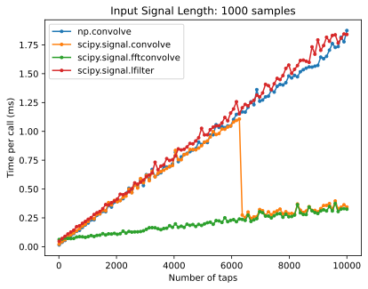
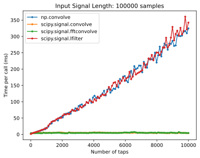
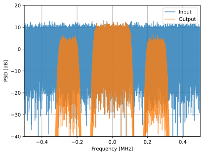

.. _filters-chapter:

#############
滤波器
#############

在本章中，我们将学习使用Python的数字滤波器。我们将介绍滤波器的类型（FIR/IIR和低通/高通/带通/带阻）、滤波器的数字表示方法以及设计方法。最后，我们将介绍脉冲整形，并在 :ref:`pulse-shaping-chapter` 一章中进一步探讨。

*************************
滤波器基础知识
*************************

滤波器应用于许多学科。例如，图像处理大量使用二维滤波器，此时输入和输出都是图像。你每天早上煮咖啡时可能会用到“滤波器”，它可以过滤掉液体中的固体。在数字信号处理中，滤波器主要用于：
 
1. 分离已合并的信号（例如，提取所需的信号）
2. 接收信号后去除多余噪声
3. 恢复以某种方式失真的信号（例如，音频均衡器就是一种滤波器）
 
当然，滤波器还有其他用途，但本章旨在介绍这一概念，而不是解释所有可能用到的过滤器。
 
也许你会认为我们只关心数字滤波器，毕竟本书探讨的是数字信号处理。但实际上很多滤波器都是模拟的，比如我们的SDR中位于接收端模数转换器 (ADC) 之前的那些滤波器。下图并列显示了模拟滤波器的电路原理图和数字滤波算法的流程图。

.. image:: ../_images/analog_digital_filter.png
   :scale: 70 % 
   :align: center
   :alt: Analog vs digital filters
   
在数字信号处理中，输入和输出都是信号，每个滤波器都有一个输入信号和一个输出信号：

.. tikz:: [font=\sffamily\Large, scale=2]
   \definecolor{babyblueeyes}{rgb}{0.36, 0.61, 0.83}
   \node [draw,
    color=white,
    fill=babyblueeyes,
    minimum width=4cm,
    minimum height=2.4cm
   ]  (filter) {Filter};
   \draw[<-, very thick] (filter.west) -- ++(-2,0) node[left,align=center]{Input\\(time domain)} ;
   \draw[->, very thick] (filter.east) -- ++(2,0) node[right,align=center]{Output\\(time domain)};   
   :libs: positioning
   :xscale: 80

所以，一个滤波器不能输入两个不同的信号，除非先将这两个信号相加或进行其他操作。同样，输出始终是一个信号，即一维数组。
 
滤波器有四种基本类型：低通、高通、带通和带阻。每种类型的滤波器都会改变信号，使其集中在不同的频率范围内。下面的图展示了每种类型的滤波器会怎样滤除信号中的频率，首先展示的是对正频率区间的处理（这更容易理解），然后是对负频率区间的处理。

.. image:: ../_images/filter_types.png
   :scale: 70 % 
   :align: center
   :alt: Filter types, including low-pass, high-pass, band-pass, and band-stop filtering in the frequency domain

.. START OF FILTER TYPES TIKZ
.. raw:: html

   <table><tbody><tr><td>

.. This draw the lowpass filter
.. tikz:: [font=\sffamily\large]    
   \draw[->, thick] (-5,0) -- (5,0) node[below]{Frequency};
   \draw[->, thick] (0,-0.5) node[below]{0 Hz} -- (0,5) node[left=1cm]{\textbf{Low-Pass}};
   \draw[red, thick, smooth] plot[tension=0.5] coordinates{(-5,0) (-2.5,0.5) (-1.5,3) (1.5,3) (2.5,0.5) (5,0)};
   :xscale: 100

.. raw:: html

   </td><td  style="padding: 0px">

.. this draws the highpass filter
.. tikz:: [font=\sffamily\large]    
   \draw[->, thick] (-5,0) -- (5,0) node[below]{Frequency};
   \draw[->, thick] (0,-0.5) node[below]{0 Hz} -- (0,5) node[left=1cm]{\textbf{High-Pass}};
   \draw[red, thick, smooth] plot[tension=0.5] coordinates{(-5,3) (-2.5,2.5) (-1.5,0.3) (1.5,0.3) (2.5,2.5) (5,3)};
   :xscale: 100

.. raw:: html

   </td></tr><tr><td>

.. this draws the bandpass filter
.. tikz:: [font=\sffamily\large]    
   \draw[->, thick] (-5,0) -- (5,0) node[below]{Frequency};
   \draw[->, thick] (0,-0.5) node[below]{0 Hz} -- (0,5) node[left=1cm]{\textbf{Band-Pass}};
   \draw[red, thick, smooth] plot[tension=0.5] coordinates{(-5,0) (-4.5,0.3) (-3.5,3) (-2.5,3) (-1.5,0.3) (1.5, 0.3) (2.5,3) (3.5, 3) (4.5,0.3) (5,0)};
   :xscale: 100

.. raw:: html

   </td><td>

.. and finally the bandstop filter
.. tikz:: [font=\sffamily\large]    
   \draw[->, thick] (-5,0) -- (5,0) node[below]{Frequency};
   \draw[->, thick] (0,-0.5) node[below]{0 Hz} -- (0,5) node[left=1cm]{\textbf{Band-Stop}};
   \draw[red, thick, smooth] plot[tension=0.5] coordinates{(-5,3) (-4.5,2.7) (-3.5,0.3) (-2.5,0.3) (-1.5,2.7) (1.5, 2.7) (2.5,0.3) (3.5, 0.3) (4.5,2.7) (5,3)};   
   :xscale: 100

.. raw:: html

   </td></tr></tbody></table>

.. .......................... end of filter plots in tikz

每个滤波器都允许在信号中保留某些频率，同时阻断其他频率。滤波器允许通过的频率范围称为“通带”，而“阻带”指的是被阻断的频率范围。就低通滤波器而言，它让信号的低频部分通过，而阻断高频的部分，因此0 Hz始终在通带内。而对于高通和带通滤波器，0 Hz始终处于阻带之内。
 
请不要将这些滤波类型与滤波器的算法实现（如 IIR 与 FIR）混淆。最常见的滤波器类型是低通滤波器（low-pass filter, LPF），因为我们通常以基带表示信号。LPF 允许我们滤除信号“周围”的其它东西，包括多余的噪声和其他信号。

*************************
滤波器的表示
*************************

对于我们下面要讲到的大多数滤波器（称为FIR或有限脉冲响应滤波器），我们可以用一个浮点数组来表示滤波器本身。对于在频域对称的滤波器，这些浮点数会是实数（而非复数），而且往往是奇数个浮点数构成这个数组。我们称这个浮点数组为“滤波器抽头”。我们通常使用 :math:`h` 作为滤波器抽头的符号。下面是一组滤波器抽头的示例，它们定义了一个滤波器：

.. code-block:: python

    h =  [ 9.92977939e-04  1.08410297e-03  8.51595307e-04  1.64604862e-04
     -1.01714338e-03 -2.46268845e-03 -3.58236429e-03 -3.55412543e-03
     -1.68583512e-03  2.10562324e-03  6.93100252e-03  1.09302641e-02
      1.17766532e-02  7.60955496e-03 -1.90555639e-03 -1.48306750e-02
     -2.69313236e-02 -3.25659606e-02 -2.63400086e-02 -5.04184562e-03
      3.08099470e-02  7.64264738e-02  1.23536693e-01  1.62377258e-01
      1.84320776e-01  1.84320776e-01  1.62377258e-01  1.23536693e-01
      7.64264738e-02  3.08099470e-02 -5.04184562e-03 -2.63400086e-02
     -3.25659606e-02 -2.69313236e-02 -1.48306750e-02 -1.90555639e-03
      7.60955496e-03  1.17766532e-02  1.09302641e-02  6.93100252e-03
      2.10562324e-03 -1.68583512e-03 -3.55412543e-03 -3.58236429e-03
     -2.46268845e-03 -1.01714338e-03  1.64604862e-04  8.51595307e-04
      1.08410297e-03  9.92977939e-04]

Example Use-Case
########################

为了解滤波器的使用方法，让我们来看一个例子：将SDR调到某个信号所在的频率，并希望将其与其他信号区分开来。请记住，我们告诉SDR调谐到哪个频率，但SDR捕获的采样是基带信号，这意味着信号将以0 Hz为中心，所以必须记住我们让SDR调谐到了哪个频率。我们获取到的信号可能是这样的：

.. image:: ../_images/filter_use_case.png
   :scale: 70 % 
   :align: center
   :alt: GNU Radio frequency domain plot of signal of interest and an interfering signal and noise floor

由于信号已经以直流（0 Hz）为中心，自然我们就需要一个低通滤波器。必须选择一个正确的“截止频率”（又称转折频率），它决定了通带和阻带之间的界限。截止频率始终以赫兹（Hz）为单位。在本例中，3 kHz似乎是一个合适的值：

.. image:: ../_images/filter_use_case2.png
   :scale: 70 % 
   :align: center 

不过，按照大多数低通滤波器的工作模式，此时负频率的边界将是-3 kHz。也就是说，它是以直流（0 Hz）为轴对称的（稍后你会知道为什么）。截止频率看起来会是这样的（通带则是截止频率之间的区域）：

.. image:: ../_images/filter_use_case3.png
   :scale: 70 % 
   :align: center 

建立并对信号使用了截止频率为3 kHz的滤波器后，我们得到了

.. image:: ../_images/filter_use_case4.png
   :scale: 70 % 
   :align: center 
   :alt: GNU Radio frequency domain plot of signal of interest and an interfering signal and noise floor, with interference filtered out

这个滤波后的信号也许不好理解，但是，回想一下之前信号的噪声本底是在-65 dB左右的绿线处，就会豁然开朗了。尽管我们仍然可以看到以10 kHz为中心的干扰信号，但我们已经大大地降低了该信号的功率。现在它已经低于之前的噪声本底！同时，阻带中的大部分噪声也都被消除了。
 
除了截止频率，低通滤波器的另一个主要参数称为“过渡宽度”。过渡宽度的单位也是赫兹，它表示滤波器在通带和阻带之间的过渡区域的宽度，无过渡的切换通带和阻带（过渡宽度为0）实际上是不可能的。
 
来形象的理解一下过渡宽度。在下图中，:green:`绿色` 线表示理想的通带和阻带之间的过渡，其过渡宽度基本上为零。:red:`红色` 线表示实际滤波器的结果，它有一些纹波和一定的过渡宽度。

.. image:: ../_images/realistic_filter.png
   :scale: 100 % 
   :align: center
   :alt: Frequency response of a low-pass filter, showing ripple and transition width

你可能想知道为什么不是把过渡宽度设置得越小越好。这主要是因为过渡宽度越小，抽头就越多，而抽头越多，计算量就越大--我们很快就会知道原因所在。在Raspberry Pi上，一个50个抽头的滤波器只需使用1%的CPU而运行一整天。与此同时，50,000 个抽头的滤波器会导致 CPU 爆炸！
通常情况下，我们使用滤波器设计工具，来估算需要的抽头数量，如果太多（例如超过100个），我们就增加过渡宽度。当然，这完全取决于运行滤波器的软硬件的要求和条件。
 
在上面的滤波示例中，我们使用了3 kHz的截止频率和1 kHz的过渡宽度（仅看这些图很难真正看到过渡宽度）。所用的滤波器实际有77个抽头。
 
回到滤波器的表示。尽管我们可以显示滤波器抽头的这一组数字，通常还是在频域上更直观地表示滤波器。我们称之为滤波器的“频率响应”，它展示了滤波器在频域中将起到的作用。下面是我们刚才使用的滤波器的频率响应：

.. image:: ../_images/filter_use_case5.png
   :scale: 100 % 
   :align: center 

请注意，我在这里显示的不是信号--它只是滤波器在频域的表示。这可能不太好理解，但当我们看完示例和代码后，你就会明白了。
 
一个给定的滤波器也可以在时域里表示；它被称为滤波器的“脉冲响应”，因为如果你把一个脉冲通过这个滤波器的话，这就是你在时域中将看到的结果。(搜索“狄拉克三角函数”可了解更多有关脉冲的信息）。对于FIR型滤波器来说，脉冲响应就是抽头本身。对于我们之前使用的77个抽头的滤波器，抽头为

.. code-block:: python

    h =  [-0.00025604525581002235, 0.00013669139298144728, 0.0005385575350373983,
    0.0008378280326724052, 0.000906112720258534, 0.0006353431381285191,
    -9.884083502996931e-19, -0.0008822851814329624, -0.0017323142383247614,
    -0.0021665366366505623, -0.0018335371278226376, -0.0005912294145673513,
    0.001349081052467227, 0.0033936649560928345, 0.004703888203948736,
    0.004488115198910236, 0.0023609865456819534, -0.0013707970501855016,
    -0.00564080523326993, -0.008859002031385899, -0.009428252466022968,
    -0.006394983734935522, 4.76480351940553e-18, 0.008114570751786232,
    0.015200719237327576, 0.018197273835539818, 0.01482443418353796,
    0.004636279307305813, -0.010356673039495945, -0.025791890919208527,
    -0.03587324544787407, -0.034922562539577484, -0.019146423786878586,
    0.011919975280761719, 0.05478153005242348, 0.10243935883045197,
    0.1458890736103058, 0.1762896478176117, 0.18720689415931702,
    0.1762896478176117, 0.1458890736103058, 0.10243935883045197,
    0.05478153005242348, 0.011919975280761719, -0.019146423786878586,
    -0.034922562539577484, -0.03587324544787407, -0.025791890919208527,
    -0.010356673039495945, 0.004636279307305813, 0.01482443418353796,
    0.018197273835539818, 0.015200719237327576, 0.008114570751786232,
    4.76480351940553e-18, -0.006394983734935522, -0.009428252466022968,
    -0.008859002031385899, -0.00564080523326993, -0.0013707970501855016,
    0.0023609865456819534, 0.004488115198910236, 0.004703888203948736,
    0.0033936649560928345, 0.001349081052467227, -0.0005912294145673513,
    -0.0018335371278226376, -0.0021665366366505623, -0.0017323142383247614,
    -0.0008822851814329624, -9.884083502996931e-19, 0.0006353431381285191,
    0.000906112720258534, 0.0008378280326724052, 0.0005385575350373983,
    0.00013669139298144728, -0.00025604525581002235]

尽管我们还没有开始学习设计滤波器，但下面给出了生成这个滤波器的Python代码：

.. code-block:: python

    import numpy as np
    from scipy import signal
    import matplotlib.pyplot as plt

    num_taps = 51 # it helps to use an odd number of taps
    cut_off = 3000 # Hz
    sample_rate = 32000 # Hz

    # create our low pass filter
    h = signal.firwin(num_taps, cut_off, fs=sample_rate)

    # plot the impulse response
    plt.plot(h, '.-')
    plt.show()

只需把这个浮点数组绘制出来，就得到了这个滤波器的脉冲响应：

.. image:: ../_images/impulse_response.png
   :scale: 100 % 
   :align: center
   :alt: Example of impulse response of a filter, plotting the taps in the time domain

下面是用于生成上述频率响应的代码。看起来有点复杂，是因为我们还得创建一个储存频率值（x轴）的数组。

.. code-block:: python

    # plot the frequency response
    H = np.abs(np.fft.fft(h, 1024)) # take the 1024-point FFT and magnitude
    H = np.fft.fftshift(H) # make 0 Hz in the center
    w = np.linspace(-sample_rate/2, sample_rate/2, len(H)) # x axis
    plt.plot(w, H, '.-')
    plt.show()

实数和复数滤波器
########################

之前展示的滤波器具有实数的抽头，但抽头也可以是复数的。抽头是实数还是复数，与通过滤波器的是实信号还是复信号无关，也就是说，你可以将复数信号通过实数抽头的滤波器，反之亦然。当抽头为实数时，滤波器的频率响应将以直流（0 Hz）为轴对称。通常情况下，我们在需要不对称时才会使用复数抽头，但这种情况并不常见。

.. draw real vs complex filter
.. tikz:: [font=\sffamily\Large,scale=2] 
   \definecolor{babyblueeyes}{rgb}{0.36, 0.61, 0.83}   
   \draw[->, thick] (-5,0) node[below]{$-\frac{f_s}{2}$} -- (5,0) node[below]{$\frac{f_s}{2}$};
   \draw[->, thick] (0,-0.5) node[below]{0 Hz} -- (0,1);
   \draw[babyblueeyes, smooth, line width=3pt] plot[tension=0.1] coordinates{(-5,0) (-1,0) (-0.5,2) (0.5,2) (1,0) (5,0)};
   \draw[->,thick] (6,0) node[below]{$-\frac{f_s}{2}$} -- (16,0) node[below]{$\frac{f_s}{2}$};
   \draw[->,thick] (11,-0.5) node[below]{0 Hz} -- (11,1);
   \draw[babyblueeyes, smooth, line width=3pt] plot[tension=0] coordinates{(6,0) (11,0) (11,2) (11.5,2) (12,0) (16,0)};
   \draw[font=\huge\bfseries] (0,2.5) node[above,align=center]{Example Low-Pass Filter\\with Real Taps};
   \draw[font=\huge\bfseries] (11,2.5) node[above,align=center]{Example Low-Pass Filter\\with Complex Taps};

作为复数抽头的一个例子，让我们回到滤波器用例，只不过这次我们想接收另一个干扰信号（无需重新调谐接收机）。这意味着我们需要一个带通滤波器，但不是对称的。我们只想保留（也就是“通过”）7 kHz到13 kHz之间的频率（并不想让-13 kHz到-7 kHz之间的信号通过）：

.. image:: ../_images/filter_use_case6.png
   :scale: 70 % 
   :align: center 

设计这种滤波器的一个方法是制作一个截止频率为3 kHz的低通滤波器，然后对其进行移频。请记住，对于信号x(t)（时域），我们可以通过乘以:math:`e^{j2\pi f_0t}` 来对它进行移频。在这种情况下，:math:`f_0` 应该是10 kHz，这就将我们的滤波器频率上移了10 kHz。记得在上面的 Python 代码中，:math:`h` 是低通滤波器的滤波器抽头。在下面的程序中，为了创建带通滤波器，只需将这些抽头乘以 :math:`e^{j2/pi f_0t}` ，同时需要根据采样周期（采样率的倒数）创建一个向量来储存时间值：

.. code-block:: python

    # (h was found using the first code snippet)

    # Shift the filter in frequency by multiplying by exp(j*2*pi*f0*t)
    f0 = 10e3 # amount we will shift
    Ts = 1.0/sample_rate # sample period
    t = np.arange(0.0, Ts*len(h), Ts) # time vector. args are (start, stop, step)
    exponential = np.exp(2j*np.pi*f0*t) # this is essentially a complex sine wave

    h_band_pass = h * exponential # do the shift

    # plot impulse response
    plt.figure('impulse')
    plt.plot(np.real(h_band_pass), '.-')
    plt.plot(np.imag(h_band_pass), '.-')
    plt.legend(['real', 'imag'], loc=1)

    # plot the frequency response
    H = np.abs(np.fft.fft(h_band_pass, 1024)) # take the 1024-point FFT and magnitude
    H = np.fft.fftshift(H) # make 0 Hz in the center
    w = np.linspace(-sample_rate/2, sample_rate/2, len(H)) # x axis
    plt.figure('freq')
    plt.plot(w, H, '.-')
    plt.xlabel('Frequency [Hz]')
    plt.show()

脉冲响应和频率响应图如下所示：

.. image:: ../_images/shifted_filter.png
   :scale: 60 % 
   :align: center 

由于我们的滤波器不是在0 Hz附近对称的，因此必须使用复数抽头，进而我们需要两条线来画出这些复数抽头。在左侧图中看到的仍然是脉冲响应。而从频率响应图中才能确认所创建的滤波器是否是我们想要的，即除了以10 kHz为中心的信号外，它能滤除其他所有信号。请再次记住，上图不是实际的信号：它只是滤波器的表示。这有点容易混淆，因为当你将滤波器应用于信号并在频域中画出输出图时，在很多情况下，它看起来会与滤波器本身的频率响应大致相同。
 
如果复数的抽头让你困惑，也不必太担心，因为99%的情况下你都会只用到实数抽头的低通滤波器。 

.. _convolution-section:

***********
卷积
***********

插播一下卷积算子的介绍。如果您已经熟悉卷积算子，可以跳过这一部分。
 
将两个信号相加是将两个信号合二为一的一种方法。在 :ref:`freq-domain-chapter` 一章中，我们探讨了将两个信号相加时所具有的线性特点。卷积是将两个信号合二为一的另一种方法，但它与简单的相加截然不同。两个信号的卷积就像是将一个信号滑过另一个信号并进行积分。如果你熟悉互相关的计算，卷积与它非常相似。事实上，它在很多情况下都等同于互相关。我们通常使用 :code:`*` 符号来表示卷积，尤其是在数学公式中。
 
我认为，卷积操作最好通过实例来学习。在第一个例子中，我们将两个方波脉冲卷积在一起：

.. image:: ../_images/rect_rect_conv.gif
   :scale: 90 % 
   :align: center 
   
我们有两个输入信号（一个红色，一个蓝色），卷积的输出显示为黑色。可以看到，输出是一个信号在另一个信号上滑动时两个信号的积分。因为只是滑动积分，所以结果是一个三角形，最大值位于两个方形脉冲完全重合的位置。  
 
让我们再看几个卷积的例子：

.. image:: ../_images/rect_fat_rect_conv.gif
   :scale: 90 % 
   :align: center 

|

.. image:: ../_images/rect_exp_conv.gif
   :scale: 90 % 
   :align: center 

|

.. image:: ../_images/gaussian_gaussian_conv.gif
   :scale: 90 % 
   :align: center 

可以看到高斯函数与高斯函数的卷积是另一个高斯函数，但脉冲宽度变得更宽，振幅更小。
 
由于这种“滑动”的原因，输出信号的长度实际上比输入信号要长。如果一个信号是 :code:`M` 个采样点，另一个信号是 :code:`N` 个采样点，两者的卷积可以产生 :code:`N+M-1` 个采样点。不过，:code:`numpy.convolve()` 等函数可以指定是要整个输出（:code:`max(M, N)` 个样本），还是只要信号完全重叠的部分（也就是 :code:`max(M, N) - min(M, N) + 1` 个采样点，如果你想知道的话）。其实不必过于纠缠这些细节，关键是记住卷积的输出长度不一定等于输入的长度。
 
那么，为什么卷积在数字信号处理中很重要呢？简单来说，要对信号进行滤波，我们只需将滤波器的脉冲响应与信号进行卷积即可。FIR滤波就是一种简单的卷积操作。

.. image:: ../_images/filter_convolve.png
   :scale: 70 % 
   :align: center 

说滤波器是卷积操作可能有点不好理解，因为我们在前面提到，卷积计算要输入两个信号并输出一个信号。可以试着这么理解：我们将滤波器的脉冲响应视为一个信号，而卷积就是一个数学运算符，它对两个一维数组进行运算。如果其中一个一维数组是滤波器的脉冲响应，那么另一个一维数组可以是一段输入信号，而输出则是输入信号的被滤波后的结果。
 
让我们再看一个例子来帮助理解。在下面的示例中，三角形代表滤波器的脉冲响应，而 :green:`绿色` 信号则是要被滤波的信号。

.. image:: ../_images/convolution.gif
   :scale: 70 % 
   :align: center 

:red:`红色` 是滤波后的信号。  
 
问：三角形的脉冲响应是来自什么类型的滤波器？

.. raw:: html

   

   
Answers

它平滑了绿色信号的高频成分（即方波的急剧变化的部分），因此起到了低通滤波器的作用。

.. raw:: html

   

现在我们对卷积已经有些了解了，那么就来介绍一下卷积的数学公式。星号 (*) 通常用作表示卷积的符号：

.. math::

 (f * g)(t) = \int f(\tau) g(t - \tau) d\tau
 
在上式中，:math:`g(t)` 是时间上颠倒并滑过 :math:`f(t)` 的信号或输入，但 :math:`g(t)` 和 :math:`f(t)` 可以互换，仍然是相同的表达式。通常，较短的数组将被当作 :math:`g(t)`。当 :math:`g(t)` 是对称的，即相对于原点翻转时不变，卷积等于互相关，上式可写为 :math:`\int f(\tau) g(t+/tau)`。

*************************
滤波器的实现
*************************

我们并不会太深入地探讨滤波器的实现，相反，将专注于介绍滤波器的设计（反正你可以在任何编程语言中找到现成可用的实现）。就目前而言，记住一个要点：使用FIR滤波器滤波信号时，就是把脉冲响应（抽头数组）与输入信号卷积即可。在离散信号的世界中，我们使用离散卷积（如下图所示）。标记着b的那些三角形表示抽头。在这个流程图中，三角形上方标有 :math:`z^{-1}` 的正方形表示延迟一个时间步长。

.. image:: ../_images/discrete_convolution.png
   :scale: 80 % 
   :align: center
   :alt: Implementation of a finite impulse response (FIR) filter with delays and taps and summations

从这个图里也许你能理解为什么叫滤波器的“抽头（taps）”，与图里所示的滤波器的实现方式有关。 

FIR与IIR
##############

数字滤波器有两大类：FIR 和 IIR
 
1. 有限脉冲响应（FIR）
2. 无限脉冲响应（IIR）
 
我们不对理论进行太深入的研究，但现在只需记住以下几点：FIR滤波器更容易设计，只要使用足够多的抽头，就能实现任何你想要做的事情。IIR滤波器更为复杂，有可能不稳定，但效率更高（对于给定的滤波器，CPU 和内存的使用量更少）。如果有人丢给你一个抽头的浮点数数组，那应该就是一个FIR滤波器。如果他们开始提到“极点（poles）”，那么他们说的就是IIR 滤波器。在本书中，我们只重点关注FIR滤波器。
 
下面是一个频率响应示例，比较的是两个效果几乎一样的FIR和IIR滤波器；它们具有相似的过渡宽度，而我们前面讲过过渡宽度将决定需要多少个抽头。这个FIR滤波器有50个抽头，而IIR滤波器有12个极点，就所消耗的计算资源而言，这就相当于12个抽头。

.. image:: ../_images/FIR_IIR.png
   :scale: 70 % 
   :align: center
   :alt: Comparing finite impulse response (FIR) and infinite impulse response (IIR) filters by observing frequency response

经验告诉我们，要执行大致相同的滤波操作，FIR滤波器所需的计算资源要比IIR滤波器多得多。
 
下面是一些你可能实际用过的FIR和IIR滤波器的例子。
 
如果对一个数组进行“滑动平均”，这就是一个抽头全为1的FIR滤波器：
- h = [1 1 1 1 1 1 1 1 1 1]，表示窗口大小为10的滑动平均滤波器。它恰好也是一个低通滤波器，为什么？使用全是1的和逐渐衰减到零的抽头有什么区别？

.. raw:: html

   

   
Answers

滑动平均滤波器是一种低通滤波器，因为它能平滑掉“高频”变化，这通常也是人们使用这种滤波器的原因。使用两端衰减到零的抽头是为了避免输出突然变化，比如被滤波的信号在一段时间内为零，然后突然跃升这种情况。

.. raw:: html

   

现在举一个IIR例子。你平时有没有做过类似这样的操作？

    x = x*0.99 + new_value*0.01

其中0.99和0.01代表数值更新的速度（或衰减率，是一个意思）。这是可以缓慢更新某个变量的一种简便方法，同时无需记住x的历史数值。这实际上是一种低通IIR滤波器。希望从这个例子你能明白为什么IIR滤波器的稳定性不如FIR滤波器。因为历史数值的影响永远不会完全消失！

*************************
FIR滤波器设计
*************************

在实践中，大多数人会使用滤波器设计工具或代码中的函数（如 Python/SciPy）来设计滤波器。我们将首先展示在Python中可以实现的功能，然后再介绍第三方工具。我们的重点将放在FIR滤波器上，因为这是当前数字信号处理中最常用的滤波器。

Python程序
#################

设计滤波器就是要得到满足我们所需的频率相应的抽头，其中关键一环是要确定滤波器的类型（低通、高通、带通或带阻）、截止频率、抽头数量以及过渡宽度。
 
在SciPy中，我们主要使用两个函数来设计FIR滤波器，这两个函数都使用所谓的窗口方法。首先，:code:`scipy.signal.firwin()` 是最直接的；它能给出线性相位FIR滤波器的抽头。该函数需要我们指定抽头数和一个截止频率（用于低通/高通），或者两个截止频率（用于带通/带阻），还可以选择指定过渡宽度。如果通过 :code:`fs` 指定采样率，则截止频率和过渡宽度的单位为Hz，但如果不指定采样率，则单位为归一化的Hz（0 至 1 Hz）。默认情况下，:code:`pass_zero` 参数为:code:`True` ，但如果需要高通或带通滤波器，则必须将其设置为:code:`False` ；它表示通带中是否应包含0 Hz。建议使用奇数个抽头，101个抽头是一个很好的起点。例如，让我们生成一个采样率为1 MHz、通带范围为100 kHz至200 kHz 的带通滤波器：

.. code-block:: python

   from scipy.signal import firwin
   sample_rate = 1e6
   h = firwin(101, [100e3, 200e3], pass_zero=False, fs=sample_rate)
   print(h)

第二个函数是 :code:`scipy.signal.firwin2()`，它更加灵活，可用于设计具有自定义频率响应的滤波器，因为可以指定多个频率以及每个频率上所需的增益。它也要求提供抽头数，并支持上一段提到的 :code:`fs` 参数。例如，下面的代码生成的滤波器具有一个低通区域，使100 kHz以下的频率可以通过，还具有一个带通区域，200 kHz至300 kHz，但这里的增益是低通区域的一半，同时要求过渡宽度为 10 kHz：

.. code-block:: python

   from scipy.signal import firwin2
   sample_rate = 1e6
   freqs = [0, 100e3, 110e3, 190e3, 200e3, 300e3, 310e3, 500e3]
   gains = [1, 1,     0,     0,     0.5,   0.5,   0,     0]
   h2 = firwin2(101, freqs, gains, fs=sample_rate)
   print(h2)

要在信号上实际使用FIR滤波器，有以下几个函数可选择使用，但它们实际上都是在要滤波的采样点和上面生成的滤波器抽头之间进行卷积操作：

- :code:`np.convolve`
- :code:`scipy.signal.convolve`
- :code:`scipy.signal.fftconvolve`
- :code:`scipy.signal.lfilter`

上述基于卷积的函数都有一个 :code:`mode`参数，可以选择 :code:`'full'`、:code:`'valid'` 或 :code:`'same'`，它们的作用是会影响函数输出数据量的大小。因为在执行卷积时，正如我们在本章前面所看到的，在开始和结束时会产生过渡值。使用 :code:`'valid'`选项将不会产生这些过渡值，输出数据的大小就会比输入信号略小。如果使用 :code:`'same'`选项，输出数据将与输入信号大小相同，这在追踪时间或其他时域信号特征时非常有用。最后，:code:`'full'` 选项将包括所有的过渡值，输出完整的卷积结果。
 
现在，我们将基于 :code:`scipy.signal.firwin2()` 生成的抽头，使用上面的四个函数处理一个由高斯白噪声构成的测试信号。请注意，:code:`lfilter` 有一个额外的参数（第二个参数），对于 FIR 滤波器来说，这个参数总是1。

.. code-block:: python

    import numpy as np
    from scipy.signal import firwin2, convolve, fftconvolve, lfilter

    # Create a test signal, we'll use Gaussian noise
    sample_rate = 1e6 # Hz
    N = 1000 # samples to simulate
    x = np.random.randn(N) + 1j * np.random.randn(N)

    # Create an FIR filter, same one as 2nd example above
    freqs = [0, 100e3, 110e3, 190e3, 200e3, 300e3, 310e3, 500e3]
    gains = [1, 1,     0,     0,     0.5,   0.5,   0,     0]
    h2 = firwin2(101, freqs, gains, fs=sample_rate)

    # Apply filter using the four different methods
    x_numpy = np.convolve(h2, x)
    x_scipy = convolve(h2, x) # scipys convolve
    x_fft_convolve = fftconvolve(h2, x)
    x_lfilter = lfilter(h2, 1, x) # 2nd arg is always 1 for FIR filters

    # Prove they are all giving the same output
    print(x_numpy[0:2])
    print(x_scipy[0:2])
    print(x_fft_convolve[0:2])
    print(x_lfilter[0:2])

上述代码展示了这四个函数的基本用法，但你可能想知道哪种方法最好。当这四种方法在英特尔酷睿 i9-10900K 上运行时，下面的图显示了使用不同数量的抽头时所耗费的计算时间，两个图分别是处理1k个和100k个采样点的情况。

可以看到，:code:`scipy.signal.convolve` 实际上是在输入数据达到一定大小时自动切换为基于FFT的方法。总的来说，对于给定的抽头和输入数据量（代表射频应用中相当典型的数据量大小）， :code:`fftconvolve` 都是明显的赢家。PySDR 中的许多代码实际上都使用 :code:`np.convolve:`，这只是因为它不需要导入scipy库，并且对于低数据率或非实时应用来说，性能差异可以忽略不计。
 
最后，我们将在频域显示输出，以便最终确认firwin2方法是否为我们提供了与设计参数相匹配的滤波器。从上面生成 :code:`h2` 的代码开始：

.. code-block:: python

    # Simulate signal comprising of Gaussian noise
    N = 100000 # signal length
    x = np.random.randn(N) + 1j * np.random.randn(N) # complex signal

    # Save PSD of the input signal
    PSD_input = 10*np.log10(np.fft.fftshift(np.abs(np.fft.fft(x))**2)/len(x))

    # Apply filter
    x = fftconvolve(x, h2, 'same')

    # Look at PSD of the output signal
    PSD_output = 10*np.log10(np.fft.fftshift(np.abs(np.fft.fft(x))**2)/len(x))
    f = np.linspace(-sample_rate/2/1e6, sample_rate/2/1e6, len(PSD_output))
    plt.plot(f, PSD_input, alpha=0.8)
    plt.plot(f, PSD_output, alpha=0.8)
    plt.xlabel('Frequency [MHz]')
    plt.ylabel('PSD [dB]')
    plt.axis([sample_rate/-2/1e6, sample_rate/2/1e6, -40, 20])
    plt.legend(['Input', 'Output'], loc=1)
    plt.grid()
    plt.savefig('../_images/fftconvolve.svg', bbox_inches='tight')
    plt.show()

我们可以看到，带通部分比低通部分低3分贝：

另外，还有一个不起眼的函数用于对信号进行滤波，叫做 :code:`scipy.signal.filtfilt`。它实现的是“零相位滤波”，有助于保留时域波形中的一些特征，使这些特征在滤波后和滤波前的信号中出现的位置保持不变。它通过使用两次滤波器抽头来实现这一点，正向使用一次，然后再反向使用一次。此时，频率响应将是正常情况下的平方。更多信息，请参阅 https://www.mathworks.com/help/signal/ref/filtfilt.html 或 https://docs.scipy.org/doc/scipy/reference/generated/scipy.signal.filtfilt.html。

状态滤波
##################

如果你正在创建一个实时应用程序，需要依次对采样数据块应用滤波函数，这时，能保存状态的滤波器就会非常有用。使用这种滤波器时，可以用上一次调用滤波器的输出提供这一次调用的初始条件。这样可以消除信号开始和结束时出现的过渡变化（毕竟，在程序连续运行时，输入滤波器的采样数据块实际是连续的）。状态必须在两次调用之间保存，而且还必须在代码一开始就初始化，以便进行第一次滤波器的调用。幸运的是，SciPy中的 :code:`lfilter_zi` 可以为 lfilter 构造初始条件。下面展示一个使用有状态滤波器处理连续采样数据的示例：

.. code-block:: python

    b = taps
    a = 1 # for FIR, but non-1 for IIR
    zi = lfilter_zi(b, a) # calc initial conditions
    while True:
        samples = sdr.read_samples(num_samples) # Replace with your SDR's receive samples function
        samples_filtered, zi = lfilter(b, a, samples, zi=zi) # apply filter

第三方工具
#######################

还可以使用Python以外的工具来设计自定义FIR滤波器。对于学生，我推荐Peter Isza设计的这款简单易用的网络应用程序，它可以显示脉冲响应和频率响应：http://t-filter.engineerjs.com。使用默认值，至少在撰写本文时，它就会设计一个低通滤波器，通带为 0至 400 Hz，阻带为 500 Hz 及以上。因为采样率为 2 kHz，所以我们能“看到”的最大频率为 1 kHz。

.. image:: ../_images/filter_designer1.png
   :scale: 70 % 
   :align: center 

点击“设计滤波器”按钮，创建抽头并绘制频率响应图。

.. image:: ../_images/filter_designer2.png
   :scale: 70 % 
   :align: center 

单击图上方的“脉冲响应”标签，查看脉冲响应，因为这是一个FIR滤波器，所以这里显示的是抽头的图。

.. image:: ../_images/filter_designer3.png
   :scale: 70 % 
   :align: center 

该应用程序甚至包括实现和使用该滤波器的 C++ 源代码。网络应用程序不包括任何设计 IIR 滤波器的方法，设计 IIR 滤波器一般要困难得多。

****************************
任意频率响应
****************************

现在，我们考虑一种用 Python 自行设计 FIR 滤波器的方法，从所需的频率响应开始，倒推找到脉冲响应。最终显示出我们的滤波器（通过画出其抽头的图）。
 
首先，创建一个所需的频率响应矢量。让我们设计一个任意形状的低通滤波器，如下图所示：

.. image:: ../_images/filter_design1.png
   :scale: 70 % 
   :align: center 

用于创建此滤波器的代码相当简单：

.. code-block:: python

    import numpy as np
    import matplotlib.pyplot as plt
    H = np.hstack((np.zeros(20), np.arange(10)/10, np.zeros(20)))
    w = np.linspace(-0.5, 0.5, 50)
    plt.plot(w, H, '.-')
    plt.show()

:code:`hstack()` 是在 numpy 中连接数组的一种方法。我们知道它会最终产生一个具有复数抽头的过滤器。为什么？

.. raw:: html

   

   
Answer

因为我们要求的频率响应并不以 0 Hz 对称。

.. raw:: html

   

我们的最终目标是找到该滤波器的抽头，以便实际使用。给定了频率响应，如何得到抽头呢？嗯，想想我们一般如何把信号从频域转换回时域呢？反向 FFT (IFFT)！回想一下，IFFT 函数与 FFT 函数几乎完全相同。我们还需要在 IFFT 之前对所需频率响应调用 IFFTshift，然后在 IFFT 之后再进行一次 IFFTshift（不，它们不会互相抵消，你可以试试）。这个过程可能看起来令人困惑。但请记住，在 FFT 之后总要进行 FFTshift，而在 IFFT 之后总要进行 IFFTshift。

.. code-block:: python

    h = np.fft.ifftshift(np.fft.ifft(np.fft.ifftshift(H)))
    plt.plot(np.real(h))
    plt.plot(np.imag(h))
    plt.legend(['real','imag'], loc=1)
    plt.show()

.. image:: ../_images/filter_design2.png
   :scale: 90 % 
   :align: center 

我们将使用上面显示的抽头作为滤波器。我们知道画出抽头就是脉冲响应，所以我们在上面看到的就是脉冲响应。让我们对抽头进行 FFT，看看频域的情况。进行 1,024 点 FFT，以获得高分辨率：

.. code-block:: python

    H_fft = np.fft.fftshift(np.abs(np.fft.fft(h, 1024)))
    plt.plot(H_fft)
    plt.show()

.. image:: ../_images/filter_design3.png
   :scale: 70 % 
   :align: center 

看，频率响应并不平直......如果你还记得我们最初设想的滤波器，那么它并不符合我们的期望。其中一个重要原因是我们的脉冲响应没有做到衰减，也就是说，左右两边的频率响应没有达到零。我们有两种方法可以让它衰减为零：

**方法 1：** 我们对当前的脉冲响应加窗，使其两边都衰减为 0。这需要将脉冲响应与一个起点和终点均为 0 的“窗口函数”相乘。

.. code-block:: python

    # After creating h using the previous code, create and apply the window
    window = np.hamming(len(h))
    h = h * window

.. image:: ../_images/filter_design4.png
   :scale: 70 % 
   :align: center 

**方法 2：** 我们使用更多的点重新生成脉冲响应，使其有时间衰减。我们需要在原始频域数组中增加分辨率（称为内插）。

.. code-block:: python

    H = np.hstack((np.zeros(200), np.arange(100)/100, np.zeros(200)))
    w = np.linspace(-0.5, 0.5, 500)
    plt.plot(w, H, '.-')
    plt.show()
    # (the rest of the code is the same)

.. image:: ../_images/filter_design5.png
   :scale: 60 % 
   :align: center 

.. image:: ../_images/filter_design6.png
   :scale: 70 % 
   :align: center 

.. image:: ../_images/filter_design7.png
   :scale: 50 % 
   :align: center 

两种方法都可行。你会选择哪一种？第二种方法产生了更多的抽头，但第一种方法产生的频率响应不是很尖锐，下降沿也不是很陡峭。可见，设计滤波器的方法有很多，每种方法都有自己的取舍。许多人认为滤波器设计是一门艺术。

*************************
脉冲整形简介
*************************

我们将简要介绍数字信号处理中一个非常有趣的主题--脉冲整形。后面还有专门的章节会深入探讨这一主题，请参见 :ref:`pulse-shaping-chapter`。在滤波器的部分要提一下脉冲整形，是因为它归根结底是一种滤波器，用于特定目的、具有特殊属性的滤波器。
 
前面我们讲到过，数字信号使用符号来表示一个或多个比特的信息。我们使用 ASK、PSK、QAM、FSK 等数字调制方案对载波进行调制，从而以无线方式发送信息。当我们在:ref:`modulation-chapter`一章中模拟 QPSK 时，我们只模拟了每个符号对应一个采样的情况，也就是说，我们创建的每个复数就是星座上的一个点--它就是一个符号。实际上，我们通常会为每个符号生成多个采样，原因就与滤波有关。
 
我们使用滤波器来修整符号的“形状”，因为改变时域的形状也就改变了频域的形状。信号在频域的形状告诉我们信号将使用多少频谱/带宽，我们通常希望将其最小化。需要理解的是，当我们对载波进行调制时，基带符号的频谱特性（频域）并不会改变；它只是将基带的频率上移，而形状保持不变，这意味着它使用的带宽保持不变。当我们使用每个符号 1 个采样点时，就像是在传输方形脉冲。事实上，使用每个符号 1 个采样的 BPSK 只是一个 1 和 -1 随机出现的方波：

.. image:: ../_images/bpsk.svg
   :align: center 
   :target: ../_images/bpsk.svg

正如我们已经了解到的，方形脉冲的效率不高，因为它们占用了过量的频谱：

.. image:: ../_images/square-wave.svg
   :align: center 

因此，我们要做的就是对这些块状符号进行“脉冲整形”，以减少它们在频域中所占的带宽。我们使用低通滤波器进行“脉冲整形”，因为它能剔除符号中的高频成分。下图显示了在应用脉冲整形滤波器之前和之后，符号在时域（上）和频域（下）中的样子：

.. image:: ../_images/pulse_shaping.png
   :scale: 70 % 
   :align: center 

|

.. image:: ../_images/pulse_shaping_freq.png
   :scale: 90 % 
   :align: center
   :alt: Demonstration of pulse shaping of an RF signal to reduce occupied bandwidth

请注意看一些频率上的信号能量下降的有多快。脉冲整形后，边带降低了约 30 dB，相当于降低了 1000 倍！更重要的是，主频带更窄了，因此每秒相同比特数信息使用的频谱更少了。
 
目前，常见的脉冲整形滤波器包括
 
1. 升余弦滤波器
2. 根升余弦滤波器
3. Sinc 滤波器
4. 高斯滤波器
 
这些滤波器一般都有一个参数，调整它可以减小所使用的带宽。下图展示了升余弦滤波器在时域和频域的形状，当 :math:`\beta` 取不同值的时候，改变了滚降的陡峭程度。

.. image:: ../_images/pulse_shaping_rolloff.png
   :scale: 40 % 
   :align: center 

可以看到，:math:`\beta` 的值越小（对于相同的数据量），使用的频谱就越少。但是，如果该值太低，时域符号衰减为零的时间会更长。实际上，当 :math:`\beta=0` 时，符号永远不会完全衰减为零，这意味着我们实际上无法传输这样的符号。常用的 :math:`\beta` 值为 0.35 左右。
 
你将在 :ref:`pulse-shaping-chapter` 章节了解到更多有关脉冲整形的信息，包括脉冲整形滤波器必须满足的一些特殊属性。

