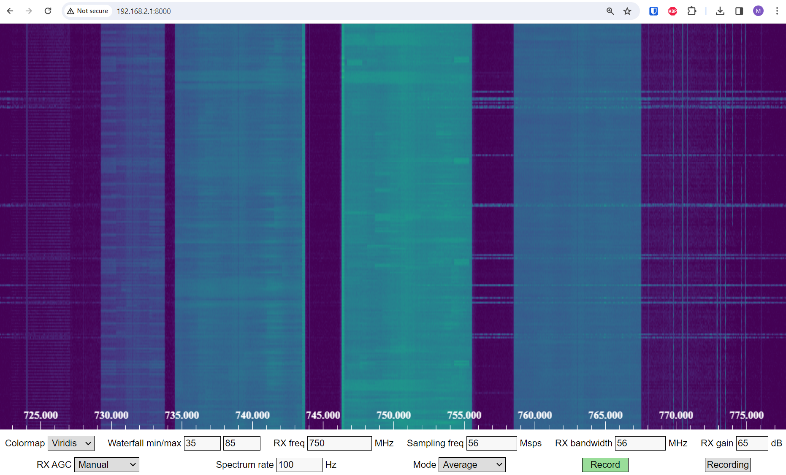
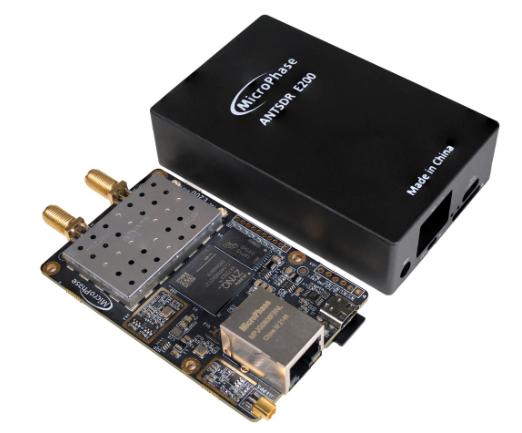

.. _pluto-chapter:

####################################
Python 玩转 PlutoSDR
####################################

.. image:: ../_images/pluto.png
   :scale: 50 %
   :align: center
   :alt: Analog Devices 推出的 PlutoSDR

在本章中，我们将学习如何使用 `PlutoSDR <https://www.analog.com/en/design-center/evaluation-hardware-and-software/evaluation-boards-kits/adalm-pluto.html>`_ 的 Python API，它是 Analog Devices 推出的一款低成本 SDR。
我们会先介绍 PlutoSDR 的安装步骤，确保驱动和软件正常运行，然后讨论如何在 Python 中使用 PlutoSDR 进行发射与接收。
最后，我们还会介绍如何借助 `Maia SDR <https://maia-sdr.org/>`_ 和 `IQEngine <https://iqengine.org/>`_ 把 PlutoSDR 变成一台强大的频谱分析仪！

************************
PlutoSDR 概述
************************

PlutoSDR（也叫 ADALM-PLUTO）是一款低成本 SDR（售价略高于 200 美元），能够收发 70 MHz 到 6 GHz 之间的信号。
如果你已经不满足于 20 美元级别的 RTL-SDR，那么它会是一个很不错的升级选择。
Pluto 使用 USB 2.0 接口，因此如果你想长期以 100% 占空比接收全部样本，采样率大约会被限制在 5 MHz 左右。
不过，它本身最高可以采样到 61 MHz，并且一次能够抓取长度约为 1000 万个样本的连续数据块，这使得 Pluto 能够一次覆盖非常宽的频谱范围。
严格来说，它是一台 2x2 设备，但第二路发射和第二路接收通道只能通过机壳内部的 U.FL 接头访问，而且它们共用同一组本振，因此你无法同时在两个不同频率上接收。
下图展示了 Pluto 的方框图，以及 Pluto 内部使用的 AD936x 射频集成电路（RFIC）的方框图。

.. image:: ../_images/adi-adalm-pluto-diagram-large.jpg
   :scale: 60 %
   :align: center
   :alt: PlutoSDR 方框图

.. image:: ../_images/ad9361.svg
   :align: center
   :target: ../_images/ad9361.svg
   :alt: PlutoSDR 内部 AD9361/AD9363 RFIC 的方框图

********************************
PlutoSDR 的软件与驱动安装
********************************

为 PlutoSDR 搭建 Ubuntu 22 VM
####################################

虽然本书提供的 Python 代码应当可以在 Windows、Mac 和 Linux 下运行，但下面的安装说明是针对 Ubuntu 22 编写的。
如果你按照 `Analog Devices 提供的说明 <https://wiki.analog.com/university/tools/pluto/users/quick_start>`_ 在自己的操作系统上安装软件时遇到困难，我建议安装一个 Ubuntu 22 的虚拟机（VM），然后按照下面的步骤操作。
另一种选择是，如果你使用的是 Windows 11，那么 Windows Subsystem for Linux（WSL）里的 Ubuntu 22 通常运行良好，并且开箱即用地支持图形界面。

1. 安装并打开 `VirtualBox <https://www.virtualbox.org/wiki/Downloads>`_ 。
2. 创建一个新的 VM。内存大小建议设置为你电脑总内存的 50%。
3. 创建虚拟硬盘时，选择 VDI，并使用动态分配。15 GB 通常就够了；如果你想更稳妥一些，也可以分配更大的空间。
4. 下载 Ubuntu 22 Desktop 的 .iso 文件 - https://ubuntu.com/download/desktop
5. 启动 VM。它会要求你选择安装介质，请选择 Ubuntu 22 Desktop 的 .iso 文件。选择 “install Ubuntu”，使用默认选项，期间会弹出一个提醒你即将进行更改的窗口，点击继续即可。然后设置用户名和密码，等待 VM 完成初始化。安装结束后 VM 会重启，但请在重启之后先让 VM 关机。
6. 进入 VM 设置（齿轮图标）。
7. 在 system > processor 中至少选择 3 个 CPU。如果你的电脑有独立显卡，那么在 display > video memory 中可以把显存设得更高一些。
8. 启动你的 VM。
9. 建议你安装 VM Guest Additions。在 VM 内选择 Devices > Insert Guest Additions CD，弹窗出现时点击运行。按照提示完成安装后重启 VM。共享剪贴板可以通过 Devices > Shared Clipboard > Bidirectional 开启。

连接 PlutoSDR
###################

1. 如果你使用的是 OSX，请在宿主机的 OSX 中而不是 VM 内，在系统偏好设置中启用 “kernel extensions”，然后安装 HoRNDIS（可能需要重启）。
2. 如果你使用的是 Windows，请安装这个驱动： https://github.com/analogdevicesinc/plutosdr-m2k-drivers-win/releases/download/v0.7/PlutoSDR-M2k-USB-Drivers.exe
3. 如果你使用的是 Linux，通常不需要做任何额外处理。
4. 通过 USB 把 Pluto 连接到宿主机。注意一定要使用 Pluto 中间的那个 USB 接口，因为另一个接口只负责供电。连接之后，Pluto 会表现为一个虚拟网卡，也就是说，它会像一个 USB 以太网适配器那样出现在系统里。
5. 在宿主机（不是 VM）上打开终端或你喜欢的 ping 工具，ping :code:`192.168.2.1`。如果不通，就先停下来排查网络接口问题。
6. 在 VM 内打开一个新的终端。
7. Ping :code:`192.168.2.1`。如果不通，也先停下来排查。当你在 ping 的时候，拔掉 Pluto，确认 ping 会立刻中断；如果它依然持续响应，那就说明网络里还有其他设备使用了这个 IP，继续之前你得先修改 Pluto（或那个其他设备）的 IP 地址。
8. 记下 Pluto 的 IP 地址，因为后面我们在 Python 中使用它时会用到。

安装 PlutoSDR 驱动及 Python API
####################################

下面这些终端命令会构建并安装以下库的最新版本：

1. **libiio**，Analog Devices 的 “跨平台” 硬件接口库
2. **libad9361-iio**，AD9361 是 PlutoSDR 内部使用的具体射频芯片
3. **pyadi-iio**，也就是 Pluto 的 Python API，*这才是我们的最终目标*，但它依赖前面两个库

.. code-block:: bash

 sudo apt-get update
 sudo apt-get install build-essential git libxml2-dev bison flex libcdk5-dev cmake python3-pip libusb-1.0-0-dev libavahi-client-dev libavahi-common-dev libaio-dev
 cd ~
 git clone --branch v0.23 https://github.com/analogdevicesinc/libiio.git
 cd libiio
 mkdir build
 cd build
 cmake -DPYTHON_BINDINGS=ON ..
 make -j$(nproc)
 sudo make install
 sudo ldconfig

 cd ~
 git clone https://github.com/analogdevicesinc/libad9361-iio.git
 cd libad9361-iio
 mkdir build
 cd build
 cmake ..
 make -j$(nproc)
 sudo make install

 cd ~
 git clone --branch v0.0.14 https://github.com/analogdevicesinc/pyadi-iio.git
 cd pyadi-iio
 pip3 install --upgrade pip
 pip3 install -r requirements.txt
 sudo python3 setup.py install

测试 PlutoSDR 驱动以及 Python API
####################################

在你的 VM 中新开一个终端，然后输入以下命令：

.. code-block:: bash

 python3
 import adi
 sdr = adi.Pluto('ip:192.168.2.1') # 或者改成你的 Pluto 实际 IP
 sdr.sample_rate = int(2.5e6)
 sdr.rx()

如果运行到这里都没有报错，那就可以继续后面的内容了。

修改 Pluto 的 IP 地址
####################################

如果默认的 :code:`192.168.2.1` 因为某些原因不适用，例如你的网络里已经存在 :code:`192.168.2.0` 这个子网，或者你想同时连接多台 Pluto，那么可以按照下面的步骤修改 IP：

1. 打开 PlutoSDR 的 :code:`config.txt` 文件进行编辑，它位于 Pluto 的大容量存储设备中（也就是你插上 Pluto 后出现的那个看起来像 U 盘的设备）。把你想使用的新 IP 写进去。
2. 弹出这个大容量存储设备（注意，不要拔掉 Pluto！）。在 Ubuntu 22 中，你会在文件管理器里 PlutoSDR 设备旁边看到一个弹出图标。
3. 等待几秒钟，然后通过拔下再重新插上 Pluto 的方式重新上电。之后再次打开 :code:`config.txt`，确认你的修改是否保存成功。

需要注意的是，这个流程也同样用于给 Pluto 刷入不同的固件镜像。更多细节请参见 https://wiki.analog.com/university/tools/pluto/users/firmware 。

“Hack” PlutoSDR 以扩展射频范围
####################################

PlutoSDR 出厂时的中心频率范围和采样率是受限制的，但其底层芯片实际上支持更高的频率。
按照下面的步骤可以解锁芯片的完整频率范围。
请注意，这个过程本身就是 Analog Devices 官方提供的，因此风险已经尽可能低。
PlutoSDR 的频率限制与 Analog Devices 对 AD936x 芯片按高频性能要求进行 “分档（binning）” 有关。
而对于 SDR 爱好者和实验者来说，我们通常并不会过分在意这些更高频率下的严格性能指标。

开始 hack 吧！打开一个终端（宿主机或 VM 都可以）：

.. code-block:: bash

 ssh root@192.168.2.1

默认密码是 :code:`analog`

你应该会看到 PlutoSDR 的欢迎界面。现在你已经通过 SSH 登录到了 Pluto 本体上的 ARM CPU！
如果你的 Pluto 固件版本是 0.31 或更低，请输入下面的命令：

.. code-block:: bash

 fw_setenv attr_name compatible
 fw_setenv attr_val ad9364
 reboot

如果是 0.32 及以上版本，则使用：

.. code-block:: bash

 fw_setenv compatible ad9364
 reboot

现在你应该就可以把中心频率调到最低 70 MHz、最高 6 GHz，并把采样率提高到最高 56 MHz 了！

************************
PlutoSDR 接收
************************

使用 PlutoSDR 的 Python API 进行采样是非常直接的。
对于任何一款 SDR，我们都知道至少要告诉它中心频率、采样率以及增益（或者是否启用自动增益控制）。
可能还有其他细节参数，但这三项是最基本的，没有它们 SDR 就不知道该如何接收样本。
有些 SDR 需要你显式发送一条命令才能开始采样，而 Pluto 这样的设备会在初始化完成后立即开始采样。
当 SDR 内部缓冲区被填满后，最旧的样本就会被丢弃。
所有 SDR API 基本都会提供某种 “接收样本” 函数，而 Pluto 中对应的就是 :code:`rx()`，它会返回一批样本。
每一批返回多少样本，则由你事先设置好的缓冲区大小决定。

下面的代码假设你已经安装好了 Pluto 的 Python API。
这段代码会初始化 Pluto，将采样率设置为 1 MHz，中心频率设置为 100 MHz，并将接收增益设置为 70 dB，同时关闭自动增益控制。
注意，设置中心频率、增益和采样率的顺序通常并不重要。
在下面的代码片段中，我们告诉 Pluto 每次调用 :code:`rx()` 时返回 10,000 个样本，并打印前 10 个样本。

.. code-block:: python

    import numpy as np
    import adi

    sample_rate = 1e6 # Hz
    center_freq = 100e6 # Hz
    num_samps = 10000 # 每次调用 rx() 返回的样本数

    sdr = adi.Pluto('ip:192.168.2.1')
    sdr.gain_control_mode_chan0 = 'manual'
    sdr.rx_hardwaregain_chan0 = 70.0 # dB
    sdr.rx_lo = int(center_freq)
    sdr.sample_rate = int(sample_rate)
    sdr.rx_rf_bandwidth = int(sample_rate) # 滤波器带宽，这里先直接设成和采样率一样
    sdr.rx_buffer_size = num_samps

    samples = sdr.rx() # 从 Pluto 接收样本
    print(samples[0:10])

目前我们还不会对这些样本做什么特别有趣的处理，但本书剩下的大部分内容都围绕这类 IQ 样本展开，并使用 Python 对它们进行处理。

PlutoSDR 接收增益（Receive Gain）
####################################

Pluto 可以配置成固定接收增益，也可以配置成自动接收增益。
自动增益控制（Automatic Gain Control，AGC）会自动调整接收增益，以维持一个较强的信号电平（如果你好奇的话，目标大约是 -12 dBFS）。
AGC 不要和负责把信号数字化的模数转换器（ADC）混淆。
从严格意义上说，AGC 是一个闭环反馈电路，它会根据接收到的信号情况来调节放大器的增益。
它的目标是在输入功率变化时维持相对恒定的输出功率，同时既避免接收机饱和（也就是碰到 ADC 动态范围的上限），又尽可能让信号 “填满” 更多 ADC 位数。

PlutoSDR 内部的射频集成电路（RFIC）包含一个支持多种设置的 AGC 模块。
（RFIC 指的是一种能够同时发射和接收无线电信号的芯片。）
首先需要注意，Pluto 的接收增益范围是 0 到 74.5 dB。
当设置为 “manual” 模式时，AGC 会被关闭，此时你必须显式告诉 Pluto 使用多大的接收增益，例如：

.. code-block:: python

  sdr.gain_control_mode_chan0 = "manual" # 关闭 AGC
  gain = 50.0 # 允许范围是 0 到 74.5 dB
  sdr.rx_hardwaregain_chan0 = gain # 设置接收增益

如果你想启用 AGC，则必须从以下两种模式中选择一种：

1. :code:`sdr.gain_control_mode_chan0 = "slow_attack"`
2. :code:`sdr.gain_control_mode_chan0 = "fast_attack"`

启用 AGC 后，你就不需要再给 :code:`rx_hardwaregain_chan0` 赋值了。
因为 Pluto 会自行调节增益，所以这个值会被忽略。
Pluto 的 AGC 提供 fast attack 和 slow attack 两种模式，正如上面的代码所示。
它们之间的差别其实很好理解：fast attack 模式对信号变化反应更快。
换句话说，当接收信号的强度变化时，增益值也会更快地跟着变化。
这种对信号功率变化的快速适应在时分双工（TDD）系统中尤其重要，因为 TDD 系统会在同一个频率上轮流发射和接收。
在这种场景下，把增益控制设为 fast attack 模式，可以减小信号被过度压低的程度。
无论使用哪种模式，如果当前没有信号、只有噪声，那么 AGC 都会把增益顶到最大；一旦信号突然出现，接收机会短暂饱和，直到 AGC 反应过来并把增益拉低。
你也可以通过下面的代码实时查看当前的增益值：

.. code-block:: python

 sdr._get_iio_attr('voltage0','hardwaregain', False)

关于 Pluto 的 AGC 的更多细节，例如如何修改更高级的 AGC 设置，请参考 `这个页面中的 “RX Gain Control” 部分 <https://wiki.analog.com/resources/tools-software/linux-drivers/iio-transceiver/ad9361>`_ 。

************************
PlutoSDR 发射
************************

在用 Pluto 发射任何信号之前，请务必先用一根 SMA 线缆把 Pluto 的 TX 端口和充当接收机的设备连接起来。
尤其是在你还在学习 *如何* 发射的时候，一定要先通过线缆发射，这样才能确认 SDR 的行为完全符合预期。
发射功率务必要从极低开始，因为线缆不像无线信道那样会对信号产生衰减，接收机的射频前端有可能会过载。
如果你手头有一个衰减器（例如 30 dB），现在正是派上用场的时候。
如果你没有另一台 SDR 或频谱分析仪来充当接收机，理论上可以用同一台 Pluto 的 RX 端口来接收，但那会变得有些复杂。
我更建议你买一个 10 美元级别的 RTL-SDR 作为接收端 SDR。

发射和接收非常相似，只不过这一次不再是告诉 SDR 要接收多少样本，而是把一批要发射的样本交给它。
我们不再设置 :code:`rx_lo`，而是设置 :code:`tx_lo`，用于指定载波发射频率。
采样率是 RX 和 TX 共用的，因此仍然像平常一样设置即可。
下面给出了一个完整的发射示例：我们生成一个 +100 kHz 的正弦，然后在 915 MHz 的载波频率上发射这组复信号，因此接收端会在 915.1 MHz 看到一个载波。
这在工程上其实没有什么实际意义，因为我们完全可以直接把 :code:`center_freq` 设为 :code:`915.1e6`，再发射一个全 1 的数组。
这里只是为了演示如何生成复数样本。

.. code-block:: python

    import numpy as np
    import adi

    sample_rate = 1e6 # Hz
    center_freq = 915e6 # Hz

    sdr = adi.Pluto("ip:192.168.2.1")
    sdr.sample_rate = int(sample_rate)
    sdr.tx_rf_bandwidth = int(sample_rate) # 滤波器截止频率，这里先直接设成和采样率一样
    sdr.tx_lo = int(center_freq)
    sdr.tx_hardwaregain_chan0 = -50 # 增大该值可以增大发射功率，有效范围是 -90 到 0 dB

    N = 10000 # 一次要发射的样本数
    t = np.arange(N)/sample_rate
    samples = 0.5*np.exp(2.0j*np.pi*100e3*t) # 模拟一个 100 kHz 正弦，因此接收端应在 915.1 MHz 看到它
    samples *= 2**14 # PlutoSDR 要求样本范围在 -2^14 到 +2^14 之间，而不是某些 SDR 使用的 -1 到 +1

    # 将这一批样本发射 100 次，如果 USB 跟得上，总共就相当于 1 秒的信号
    for i in range(100):
        sdr.tx(samples) # 发射这一批样本一次

关于这段代码，这里有几点需要说明。
首先，在仿真 IQ 样本时，你应当让它们的数值位于 -1 到 1 之间；但在真正发射之前，由于 Analog Devices 对 :code:`tx()` 函数的实现方式，我们必须把它们乘以 :math:`2^{14}`。
如果你不确定样本的最小值和最大值是多少，最简单的方法就是用 :code:`print(np.min(samples), np.max(samples))` 打印出来，或者写一个 if 语句确保它们在乘以 :math:`2^{14}` 之前从不超过 1 或低于 -1。
至于发射增益，它的范围是 -90 到 0 dB，其中 0 dB 对应最大的发射功率。
我们总是希望从较低的发射功率开始，必要时再逐步往上调，因此这里默认设置为 -50 dB，属于偏低的一侧。
不要因为信号没出现就直接把它拉到 0 dB，问题很可能出在别的地方，而你并不想把接收机烧坏。

重复发射样本
##############################

如果你想连续重复发射同一组样本，而不是像上面那样在 Python 里用 for/while 循环不断调用，可以只用一行代码告诉 Pluto 这么做：

.. code-block:: python

 sdr.tx_cyclic_buffer = True # 启用循环缓冲区

然后像平常一样调用一次 :code:`sdr.tx(samples)` 即可，Pluto 会无限循环发射这组信号，直到 :code:`sdr` 对象被析构。
如果你想更换正在循环发射的样本，不能直接再次调用 :code:`sdr.tx(samples)` 传入一组新样本，而必须先调用 :code:`sdr.tx_destroy_buffer()`，然后再调用 :code:`sdr.tx(samples)`。

如何合法地进行空口发射
#################################

我已经无数次被学生问到，在美国，使用天线配合 Pluto 发射时，哪些频率是允许发射的。
就我所知，简短答案是：没有。
通常，当人们引用某些提到发射功率限制的法规时，他们指的是 `FCC 的 “Title 47, Part 15” (47 CFR 15) 法规 <https://www.ecfr.gov/cgi-bin/text-idx?SID=7ce538354be86061c7705af3a5e17f26&mc=true&node=pt47.1.15&rgn=div5>`_ 。
但这些规定实际上是面向在 ISM 频段设计和销售设备的制造商，讨论的是这些设备应如何被测试。
所谓 Part 15 设备，是指个人在其所使用的频谱上操作该设备时不需要执照的设备，但设备本身在被营销和销售之前，必须先获得授权/认证，以证明其符合 FCC 法规。
Part 15 规定确实为不同频段规定了最大发射功率和接收功率级别，但这些规定实际上并不适用于个人使用 SDR 或自制无线电设备发射信号的情形。
我能找到的、与并非商品化产品的无线电设备相关的法规，主要只涉及在 AM/FM 广播频段运行低功率的 AM 或 FM 电台。
法规中还有一节提到 “自制设备（home-built devices）”，但它明确表示不适用于通过套件组装出来的设备，而把一个基于 SDR 的发射系统称作自制设备也有些牵强。
总之，FCC 法规并不是简单的 “你只能在这些频率、这些功率以下发射”，而是一整套围绕测试与合规构建出来的复杂规则。

换个角度看，也可以说：“这些不是 Part 15 设备，那我们就姑且按照 Part 15 的规则来约束自己。”
以 915 MHz ISM 频段为例，规则要求该频段内辐射发射的场强在 30 米处不得超过 500 微伏/米，并且测量应基于采用平均检波器的仪器。
所以你可以看到，这并不是一个简单的 “最大发射功率是多少瓦” 的问题。

如果你拥有业余无线电（ham radio）执照，那么 FCC 允许你使用专门划分给业余无线电业务的频段。
这些频段仍然有需要遵守的规则以及最大发射功率限制，但至少这些数值是以有效辐射功率多少瓦来规定的。
`这张信息图 <https://www.arrl.org/files/file/Regulatory/Band%20Chart/Hambands4_Color_11x8_5.pdf>`_ 展示了不同执照等级（Technician、General 和 Extra）可以使用哪些频段。
我建议所有想用 SDR 做发射的人都去考一个业余无线电执照，更多信息可参见 `ARRL 的 Getting Licensed 页面 <http://www.arrl.org/getting-licensed>`_ 。

如果有人对哪些行为被允许、哪些不被允许有更详细的信息，请给我发邮件。

************************************************
同时进行发射与接收
************************************************

借助 :code:`tx_cyclic_buffer` 这个技巧，你可以很容易地同时进行接收和发射，只需要先把发射机启动起来，再去接收即可。
下面的代码展示了一个可运行的例子：在 915 MHz 频段发射一个 QPSK 信号，同时接收它，并绘制功率谱密度（PSD）。

.. code-block:: python

    import numpy as np
    import adi
    import matplotlib.pyplot as plt

    sample_rate = 1e6 # Hz
    center_freq = 915e6 # Hz
    num_samps = 100000 # 每次调用 rx() 返回的样本数

    sdr = adi.Pluto("ip:192.168.2.1")
    sdr.sample_rate = int(sample_rate)

    # 配置发射
    sdr.tx_rf_bandwidth = int(sample_rate) # 滤波器截止频率，这里先直接设成和采样率一样
    sdr.tx_lo = int(center_freq)
    sdr.tx_hardwaregain_chan0 = -50 # 增大该值可以增大发射功率，有效范围是 -90 到 0 dB

    # 配置接收
    sdr.rx_lo = int(center_freq)
    sdr.rx_rf_bandwidth = int(sample_rate)
    sdr.rx_buffer_size = num_samps
    sdr.gain_control_mode_chan0 = 'manual'
    sdr.rx_hardwaregain_chan0 = 0.0 # dB，增大该值可以提高接收增益，但要小心不要让 ADC 饱和

    # 创建发射波形（QPSK，每个符号 16 个样本）
    num_symbols = 1000
    x_int = np.random.randint(0, 4, num_symbols) # 0 到 3
    x_degrees = x_int*360/4.0 + 45 # 45、135、225、315 度
    x_radians = x_degrees*np.pi/180.0 # sin() 和 cos() 使用的是弧度
    x_symbols = np.cos(x_radians) + 1j*np.sin(x_radians) # 生成我们的 QPSK 复符号
    samples = np.repeat(x_symbols, 16) # 每个符号 16 个样本（矩形脉冲）
    samples *= 2**14 # PlutoSDR 要求样本范围在 -2^14 到 +2^14 之间，而不是某些 SDR 使用的 -1 到 +1

    # 启动发射机
    sdr.tx_cyclic_buffer = True # 启用循环缓冲区
    sdr.tx(samples) # 开始发射

    # 为了稳妥起见先清空一下缓冲区
    for i in range (0, 10):
        raw_data = sdr.rx()

    # 接收样本
    rx_samples = sdr.rx()
    print(rx_samples)

    # 停止发射
    sdr.tx_destroy_buffer()

    # 计算功率谱密度（即信号的频域表示）
    psd = np.abs(np.fft.fftshift(np.fft.fft(rx_samples)))**2
    psd_dB = 10*np.log10(psd)
    f = np.linspace(sample_rate/-2, sample_rate/2, len(psd))

    # 绘制时域图
    plt.figure(0)
    plt.plot(np.real(rx_samples[::100]))
    plt.plot(np.imag(rx_samples[::100]))
    plt.xlabel("Time")

    # 绘制频域图
    plt.figure(1)
    plt.plot(f/1e6, psd_dB)
    plt.xlabel("Frequency [MHz]")
    plt.ylabel("PSD")
    plt.show()

如果你的天线或线缆连接正确，你应该会看到类似下图的结果：

.. image:: ../_images/pluto_tx_rx.svg
   :align: center

一个很好的练习是缓慢调整 :code:`sdr.tx_hardwaregain_chan0` 和 :code:`sdr.rx_hardwaregain_chan0`，确认接收到的信号会按预期变强或变弱。

**********************************
Maia SDR 与 IQEngine
**********************************

想把你的 Pluto 变成电脑或手机上的实时频谱分析仪吗？
开源的 `Maia SDR <https://maia-sdr.org/>`_ 项目为 Pluto 提供了一个修改过的固件镜像，它会在 Pluto 的 FPGA 上运行 FFT，并在 Pluto 的 ARM CPU 上运行一个 Web 服务器！
这个 Web 界面可以用来设置频率和其他 SDR 参数，并以瀑布图形式查看时频谱。
你还可以录制最大 400 MB 的原始 IQ 样本，并将它们下载到电脑或手机上，或者直接在 IQEngine 中查看。

安装最新版本的 Maia Pluto 固件时，先下载 `latest release <https://github.com/maia-sdr/plutosdr-fw/releases/>`_，具体要选文件名为 :code:`plutosdr-fw-maia-sdr-vX.Y.Z.zip` 的那个。
解压后，将其中的 :code:`pluto.frm` 文件复制到 Pluto 的大容量存储设备中（它看起来就像一个 U 盘），然后弹出 Pluto（不要拔线）。
这和升级 Pluto 固件的过程是一样的；设备会闪烁几分钟，然后自动重启。
最后，像我们在 “hack Pluto” 一节中那样，通过终端执行 :code:`ssh root@192.168.2.1` 来 SSH 登录 Pluto，默认密码为 :code:`analog`。
登录之后，你需要按顺序逐条执行下面这三条命令：

.. code-block:: bash

 fw_setenv ramboot_verbose 'adi_hwref;echo Copying Linux from DFU to RAM... && run dfu_ram;if run adi_loadvals; then echo Loaded AD936x refclk frequency and model into devicetree; fi; envversion;setenv bootargs console=ttyPS0,115200 maxcpus=${maxcpus} rootfstype=ramfs root=/dev/ram0 rw earlyprintk clk_ignore_unused uio_pdrv_genirq.of_id=uio_pdrv_genirq uboot="${uboot-version}" && bootm ${fit_load_address}#${fit_config}'

 fw_setenv qspiboot_verbose 'adi_hwref;echo Copying Linux from QSPI flash to RAM... && run read_sf && if run adi_loadvals; then echo Loaded AD936x refclk frequency and model into devicetree; fi; envversion;setenv bootargs console=ttyPS0,115200 maxcpus=${maxcpus} rootfstype=ramfs root=/dev/ram0 rw earlyprintk clk_ignore_unused uio_pdrv_genirq.of_id=uio_pdrv_genirq uboot="${uboot-version}" && bootm ${fit_load_address}#${fit_config} || echo BOOT failed entering DFU mode ... && run dfu_sf'

 fw_setenv qspiboot 'set stdout nulldev;adi_hwref;test -n $PlutoRevA || gpio input 14 && set stdout serial@e0001000 && sf probe && sf protect lock 0 100000 && run dfu_sf;  set stdout serial@e0001000;itest *f8000258 == 480003 && run clear_reset_cause && run dfu_sf; itest *f8000258 == 480007 && run clear_reset_cause && run ramboot_verbose; itest *f8000258 == 480006 && run clear_reset_cause && run qspiboot_verbose; itest *f8000258 == 480002 && run clear_reset_cause && exit; echo Booting silently && set stdout nulldev; run read_sf && run adi_loadvals; envversion;setenv bootargs console=ttyPS0,115200 maxcpus=${maxcpus} rootfstype=ramfs root=/dev/ram0 rw quiet loglevel=4 clk_ignore_unused uio_pdrv_genirq.of_id=uio_pdrv_genirq uboot="${uboot-version}" && bootm ${fit_load_address}#${fit_config} || set stdout serial@e0001000;echo BOOT failed entering DFU mode ... && sf protect lock 0 100000 && run dfu_sf'

（关于为什么需要这样设置，更多信息请参见 `Maia 的安装页面 <https://maia-sdr.org/installation/#set-up-the-u-boot-environment>`_ 。）

再重启一次 Pluto。
此时，Pluto 就应该已经运行 Maia 了！
在浏览器中打开 http://192.168.2.1:8000 ，你应该会看到 Maia 的实时频谱分析界面和 SDR 控制面板，如下图所示：

想测试 Maia 能跑多快，可以尝试把 :code:`Spectrum Rate` 调到 100 Hz 或更高。
除了频率、采样率和增益等常见 SDR 旋钮之外，你还可以点击底部的 :code:`Record` 按钮，把原始 IQ 样本录制到 Pluto 的板载内存中。
随后你可以点击 :code:`Recording` 按钮，再点击 :code:`View in IQEngine` 链接，在 IQEngine 中查看录制内容，如下图所示，或者把文件保存到你的设备上。

.. image:: ../_images/IQEngine_from_Maia.png
   :scale: 40 %
   :align: center
   :alt: 从 Maia SDR 打开的 IQEngine 截图

************************
参考 API
************************

如果你想查看完整的 SDR 属性和可调用函数列表，请参考 `pyadi-iio 中的 Pluto Python 代码（AD936X） <https://github.com/analogdevicesinc/pyadi-iio/blob/master/adi/ad936x.py>`_ 。

********************************
PlutoSDR Python 练习
********************************

与其直接给你一段现成代码去运行，不如通过几个练习来巩固。
这些练习中大约 95% 的代码已经给出，剩下的部分只是一些相对直接的 Python 内容，需要你自己补上。
这些练习并不是为了难住你，而是只留下足够少的空白，让你能主动思考一下。

练习 1：测出你的 USB 吞吐量
#########################################

让我们尝试从 PlutoSDR 接收样本，同时看看通过 USB 2.0 连接，每秒到底能推多少样本到主机上。

**你的任务是编写一个 Python 脚本，测量 Python 端每秒实际接收到的样本数。也就是说，要统计接收到的总样本数并记录所花费的时间，然后用它们算出速率。接着，尝试不同的 :code:`sample_rate` 和 :code:`buffer_size`，看看它们会如何影响可达到的最高速率。**

请记住，如果你每秒接收到的样本数小于设定的 :code:`sample_rate`，那就说明有一部分样本丢失了，而这在高采样率下很可能发生。
Pluto 只使用 USB 2.0。

下面这段代码可以作为起点，并且其中已经包含了完成任务所需的基础设置。

.. code-block:: python

 import numpy as np
 import adi
 import matplotlib.pyplot as plt
 import time

 sample_rate = 10e6 # Hz
 center_freq = 100e6 # Hz

 sdr = adi.Pluto("ip:192.168.2.1")
 sdr.sample_rate = int(sample_rate)
 sdr.rx_rf_bandwidth = int(sample_rate) # 滤波器截止频率，这里先直接设成和采样率一样
 sdr.rx_lo = int(center_freq)
 sdr.rx_buffer_size = 1024 # 这是 Pluto 用来缓存样本的缓冲区大小
 samples = sdr.rx() # 从 Pluto 接收样本

此外，为了测量某段代码执行了多久，你可以使用下面的方式：

.. code-block:: python

 start_time = time.time()
 # 做一些事情
 end_time = time.time()
 print('seconds elapsed:', end_time - start_time)

下面是一些提示，帮助你开始：

提示 1：你需要把 :code:`samples = sdr.rx()` 放进一个循环里反复执行很多次（例如 100 次）。每次调用 :code:`sdr.rx()` 时，都要统计返回了多少样本，同时记录经过了多少时间。

提示 2：虽然你要计算的是每秒样本数，但这并不意味着你必须刚好采 1 秒。你只需要把接收到的样本总数除以所经过的时间即可。

提示 3：就像示例里那样，先从 :code:`sample_rate = 10e6` 开始，因为这个速率已经远远超出了 USB 2.0 的承载能力。这样你就能看到究竟有多少数据真的传了过来。然后你可以调整 :code:`rx_buffer_size`，把它调得大很多，看看会发生什么。等你写好了可运行脚本并尝试过不同的 :code:`rx_buffer_size` 后，再去调整 :code:`sample_rate`。最终找出你需要把采样率降到多低，才能在 Python 中 100% 接收所有样本（也就是达到 100% 占空比采样）。

提示 4：在那个循环里调用 :code:`sdr.rx()` 时，尽量少做别的事情，避免额外增加执行延迟。不要在循环内部做昂贵操作，比如反复打印。

通过这个练习，你会对 USB 2.0 的最大吞吐量建立一个直观认识。
你也可以上网查找资料，验证自己的结果是否合理。

额外挑战：试着修改 :code:`center_freq` 和 :code:`rx_rf_bandwidth`，看看它们是否会影响你从 Pluto 接收样本的速率。

练习 2：创建时频谱/瀑布图
##########################################

在这个练习中，你将创建一个时频谱，也就是我们在 :ref:`freq-domain-chapter` 章节末尾学过的瀑布图。
时频谱本质上就是把一堆 FFT 结果一层层堆叠显示出来。
换句话说，它是一张图像，其中一个轴表示频率，另一个轴表示时间。

在 :ref:`freq-domain-chapter` 章节中，我们已经学过如何用 Python 执行 FFT。
这个练习里，你可以复用上一题里的代码片段，再加上一点基础 Python 代码就够了。

提示：

1. 可以尝试把 :code:`sdr.rx_buffer_size` 设成 FFT 大小，这样每次调用 :code:`sdr.rx()` 时就刚好执行 1 次 FFT。
2. 构建一个二维数组来保存所有 FFT 结果，其中每一行表示 1 次 FFT。一个填满 0 的 2D 数组可以通过下面的方式创建： :code:`np.zeros((num_rows, fft_size))` 。访问数组的第 :code:`i` 行可以使用： :code:`waterfall_2darray[i,:]` 。
3. :code:`plt.imshow()` 是显示二维数组的一个非常方便的方法，它会自动帮你缩放颜色。

额外挑战：让这个时频谱实时更新。

******
Pluto+
******

Pluto+（也叫 Pluto Plus）是原版 PlutoSDR 的非官方升级版本，主要可以在 AliExpress 上买到。
它带有千兆以太网接口、通过 SMA 引出的两路 RX 和两路 TX、MicroSD 插槽、0.5PPM 的 VCTCXO，以及 PCB 上通过 U.FL 提供的外部时钟输入。

.. image:: ../_images/pluto_plus.png
   :scale: 70 %
   :align: center
   :alt: Pluto Plus

以太网口是一个非常大的升级，因为它极大提高了你在 100% 占空比接收或发射时能够达到的采样率。
Pluto 和 Pluto+ 默认都用 16 位来表示 I 和 Q，尽管它实际上只有一个 12 位 ADC，因此每个 IQ 样本总共占 4 个字节。
按 90% 传输效率估算，千兆以太网约等于 900 Mb/s，也就是 112.5 MB/s，因此若每个 IQ 样本占 4 字节，那么如果你想在较长时间内（例如超过 1 秒）把所有样本都接收下来，对应的最大采样率大约是 28 MHz。
作为对比，USB 3.0 大约可以做到 56 MHz，而 USB 2.0 大约是 5 MHz。
除此之外，你的电脑性能、你打算在这些样本上运行的具体 DSP 应用（或者如果你只是录制到文件中，那么磁盘写入速度）也都会形成额外瓶颈。
对于基于 Python 的 SDR 应用来说，通过以太网使用 Pluto+ 时，更现实的采样率通常接近 10 MHz。

.. image:: ../_images/pluto_plus_pcb.jpg
   :scale: 30 %
   :align: center
   :alt: Pluto Plus 的 PCB 照片

要给以太网口设置 IP 地址，请先通过 USB 连接 Pluto+，打开它的大容量存储设备，编辑 :code:`config.txt` 里的 :code:`[USB_ETHERNET]` 部分。
然后给 Pluto+ 重新上电。
此时你应该就能通过刚刚填入的 IP 地址，经由以太网 SSH 到 Pluto+ 了。
如果这样可以工作，你就可以把 micro USB 线改插到 5V 供电口，让它只负责给 Pluto+ 供电，而所有通信都通过以太网完成。
请记住，即使是普通的 PlutoSDR（以及 Pluto+），也能够以最高 61 MHz 的带宽进行采样，并一次抓取大约 1000 万个连续样本，只要你在两次抓取之间稍作等待即可，因此它依然非常适合做强大的频谱感知应用。

Pluto+ 的 Python 代码与普通 PlutoSDR 完全一样，只需要把 :code:`192.168.2.1` 替换成你为以太网设置的 IP 地址即可。
你可以试着在循环中不断接收样本，并统计每秒接收到了多少，从而看看在 Python 端仍然能够每秒接收到接近设定采样率样本数的情况下，采样率究竟能推多高。
提示：把 :code:`rx_buffer_size` 调得非常大，会有助于提高吞吐量。

************
AntSDR E200
************

AntSDR E200（下文简称 AntSDR）是一款基于 936X 的低成本 SDR，由中国上海的一家公司 MicroPhase 制造，在设计上和 Pluto、Pluto+ 非常相似。
与 Pluto+ 类似，它使用 1 Gb 以太网连接，不过 AntSDR 不提供 USB 数据连接选项。
AntSDR 的独特之处在于，它既可以像 Pluto 一样使用 IIO 库工作，也可以像 USRP 一样使用 UHD 库工作。
默认情况下，它出厂时表现得像一台 Pluto，但切换到 USRP/UHD 模式只需要一次简单的固件更新。
这两套固件本质上都是在 Analog Devices/Ettus 原始固件基础上做了极少量修改，以适配 AntSDR 的硬件。
另一个特别之处是，你可以购买安装了 9363 或 9361 芯片的版本；虽然它们在功能上是同一类芯片，但 9361 在工厂分档时会被归为具有更高高频性能的版本。
注意，Pluto 和 Pluto+ 都只使用 9363。
AntSDR 的规格说明声称，基于 9363 的版本最高只能到 3.8 GHz、采样率最高 20 MHz，但事实并非如此；它实际上可以达到完整的 6 GHz，以及大约 60 MHz 的采样率（当然，1 Gb 以太网上无法长期传回 100% 的样本）。
和其他 Pluto 一样，AntSDR 也是一台 2x2 设备，第二路发射和接收通道可以通过板上的 U.FL 接头访问。
其余射频性能和技术指标则与 Pluto/Pluto+ 相近甚至完全相同。
它可以从 `Crowd Supply <https://www.crowdsupply.com/microphase-technology/antsdr-e200#products>`_ 和 AliExpress 购买。

AntSDR 上那个小小的 DIP 开关用于在 SD 卡启动和板载 Quad SPI（QSPI）闪存启动之间切换。
在写作本文时，E200 的 QSPI 中预装的是 Pluto 固件，而 SD 卡中预装的是 USRP/UHD 固件，因此只需拨动这个开关，就可以在两种模式之间切换，无需额外操作。

下面展示的是 E200 的方框图。

.. image:: ../_images/AntSDR_E200_block_diagram.png
   :scale: 80 %
   :align: center
   :alt: AntSDR E200 方框图

以 Pluto 模式配置和使用 AntSDR 的方法与 Pluto+ 类似，只需要注意它的默认 IP 是 :code:`192.168.1.10`，并且它没有 USB 数据连接，因此也就没有可以用来更新固件或修改设置的大容量存储设备。
相应地，你可以通过 SD 卡更新固件，通过 SSH 修改设置。
另外，如果你能够 SSH 登录到设备，也可以使用下面这条命令修改设备的 IP 地址： :code:`fw_setenv ipaddr_eth 192.168.2.1` ，只需把这里的 IP 替换成你想要的地址即可。
Pluto/IIO 固件可以在这里找到： `AntSDR Pluto 固件仓库`_ ，USRP/UHD 固件在这里： `AntSDR UHD 固件仓库`_ 。

如果你的 SD 卡里没有附带 USRP/UHD 驱动，或者你想安装最新版，那么可以参考 `MicroPhase 的 Quick Start Guide`_ ，在 AntSDR 上安装 USRP/UHD 固件，同时在你的主机上安装一份经过轻微修改的 UHD 主机端驱动。
之后你就可以像平常一样使用 ``uhd_find_devices`` 和 ``uhd_usrp_probe`` (更多信息以及适用于 AntSDR 的 USRP 模式示例代码，请参见 USRP 章节)。
下面这些命令是在 Ubuntu 22 上安装主机端代码时使用的：

.. code-block:: bash

 sudo apt-get update
 sudo apt-get install autoconf automake build-essential ccache cmake cpufrequtils doxygen ethtool \
 g++ git inetutils-tools libboost-all-dev libncurses5 libncurses5-dev libusb-1.0-0 libusb-1.0-0-dev \
 libusb-dev python3-dev python3-mako python3-numpy python3-requests python3-scipy python3-setuptools \
 python3-ruamel.yaml
 cd ~
 git clone git@github.com:MicroPhase/antsdr_uhd.git
 cd host
 mkdir build
 cd build
 cmake -DENABLE_X400=OFF -DENABLE_N320=OFF -DENABLE_X300=OFF -DENABLE_USRP2=OFF -DENABLE_USRP1=OFF -DENABLE_N300=OFF -DENABLE_E320=OFF  -DENABLE_E300=OFF ../
 # 注意：此时请确认在 “enabled components” 中能看到 ANT 和 LibUHD - Python API
 make -j8
 sudo make install
 sudo ldconfig
 export PYTHONPATH="${PYTHONPATH}:/usr/local/lib/python3/dist-packages"
 sudo sysctl -w net.core.rmem_max=1000000
 sudo sysctl -w net.core.wmem_max=1000000

设备端则直接使用随 AntSDR 附带的 SD 卡中已有的 USRP 固件，只需把以太网口下方的 DIP 开关拨到 “SD” 即可。

可以使用下面的命令识别并探测 AntSDR：

.. code-block:: bash

 uhd_find_devices --args addr=192.168.1.10
 uhd_usrp_probe --args addr=192.168.1.10

下面是工作正常时的一段示例输出：

.. code-block:: bash

   $ uhd_find_devices --args addr=192.168.1.10
   [INFO] [UHD] linux; GNU C++ version 11.3.0; Boost_107400; UHD_4.1.0.0-0-d2f0b1b1
   --------------------------------------------------
   -- UHD Device 0
   --------------------------------------------------
   Device Address:
      serial: 0223D80FF0D767EBC6D3AAAA6793E64D
      addr: 192.168.1.10
      name: ANTSDR-E200
      product: E200  v1
      type: ant

   $ uhd_usrp_probe --args addr=192.168.1.10
   [INFO] [UHD] linux; GNU C++ version 11.3.0; Boost_107400; UHD_4.1.0.0-0-d2f0b1b1
   [INFO] [ANT] Detected Device: ANTSDR
   [INFO] [ANT] Initialize CODEC control...
   [INFO] [ANT] Initialize Radio control...
   [INFO] [ANT] Performing register loopback test...
   [INFO] [ANT] Register loopback test passed
   [INFO] [ANT] Performing register loopback test...
   [INFO] [ANT] Register loopback test passed
   [INFO] [ANT] Setting master clock rate selection to 'automatic'.
   [INFO] [ANT] Asking for clock rate 16.000000 MHz...
   [INFO] [ANT] Actually got clock rate 16.000000 MHz.
   _____________________________________________________
   /
   |       Device: B-Series Device
   |     _____________________________________________________
   |    /
   |   |       Mboard: B210
   |   |   magic: 45568
   |   |   eeprom_revision: v0.1
   |   |   eeprom_compat: 1
   |   |   product: MICROPHASE
   |   |   name: ANT
   |   |   serial: 0223D80FF0D767EBC6D3AAAA6793E64D
   |   |   FPGA Version: 16.0
   |   |
   |   |   Time sources:  none, internal, external
   |   |   Clock sources: internal, external
   |   |   Sensors: ref_locked
   |   |     _____________________________________________________
   |   |    /
   |   |   |       RX DSP: 0
   |   |   |
   |   |   |   Freq range: -8.000 to 8.000 MHz
   |   |     _____________________________________________________
   |   |    /
   |   |   |       RX DSP: 1
   |   |   |
   |   |   |   Freq range: -8.000 to 8.000 MHz
   |   |     _____________________________________________________
   |   |    /
   |   |   |       RX Dboard: A
   |   |   |     _____________________________________________________
   |   |   |    /
   |   |   |   |       RX Frontend: A
   |   |   |   |   Name: FE-RX1
   |   |   |   |   Antennas: TX/RX, RX2
   |   |   |   |   Sensors: temp, rssi, lo_locked
   |   |   |   |   Freq range: 50.000 to 6000.000 MHz
   |   |   |   |   Gain range PGA: 0.0 to 76.0 step 1.0 dB
   |   |   |   |   Bandwidth range: 200000.0 to 56000000.0 step 0.0 Hz
   |   |   |   |   Connection Type: IQ
   |   |   |   |   Uses LO offset: No
   |   |   |     _____________________________________________________
   |   |   |    /
   |   |   |   |       RX Frontend: B
   |   |   |   |   Name: FE-RX2
   |   |   |   |   Antennas: TX/RX, RX2
   |   |   |   |   Sensors: temp, rssi, lo_locked
   |   |   |   |   Freq range: 50.000 to 6000.000 MHz
   |   |   |   |   Gain range PGA: 0.0 to 76.0 step 1.0 dB
   |   |   |   |   Bandwidth range: 200000.0 to 56000000.0 step 0.0 Hz
   |   |   |   |   Connection Type: IQ
   |   |   |   |   Uses LO offset: No
   |   |   |     _____________________________________________________
   |   |   |    /
   |   |   |   |       RX Codec: A
   |   |   |   |   Name: B210 RX dual ADC
   |   |   |   |   Gain Elements: None
   |   |     _____________________________________________________
   |   |    /
   |   |   |       TX DSP: 0
   |   |   |
   |   |   |   Freq range: -8.000 to 8.000 MHz
   |   |     _____________________________________________________
   |   |    /
   |   |   |       TX DSP: 1
   |   |   |
   |   |   |   Freq range: -8.000 to 8.000 MHz
   |   |     _____________________________________________________
   |   |    /
   |   |   |       TX Dboard: A
   |   |   |     _____________________________________________________
   |   |   |    /
   |   |   |   |       TX Frontend: A
   |   |   |   |   Name: FE-TX1
   |   |   |   |   Antennas: TX/RX
   |   |   |   |   Sensors: temp, lo_locked
   |   |   |   |   Freq range: 50.000 to 6000.000 MHz
   |   |   |   |   Gain range PGA: 0.0 to 89.8 step 0.2 dB
   |   |   |   |   Bandwidth range: 200000.0 to 56000000.0 step 0.0 Hz
   |   |   |   |   Connection Type: IQ
   |   |   |   |   Uses LO offset: No
   |   |   |     _____________________________________________________
   |   |   |    /
   |   |   |   |       TX Frontend: B
   |   |   |   |   Name: FE-TX2
   |   |   |   |   Antennas: TX/RX
   |   |   |   |   Sensors: temp, lo_locked
   |   |   |   |   Freq range: 50.000 to 6000.000 MHz
   |   |   |   |   Gain range PGA: 0.0 to 89.8 step 0.2 dB
   |   |   |   |   Bandwidth range: 200000.0 to 56000000.0 step 0.0 Hz
   |   |   |   |   Connection Type: IQ
   |   |   |   |   Uses LO offset: No
   |   |   |     _____________________________________________________
   |   |   |    /
   |   |   |   |       TX Codec: A
   |   |   |   |   Name: B210 TX dual DAC
   |   |   |   |   Gain Elements: None

最后，你可以用下面这段 Python 代码在 Python 终端或脚本里测试 Python API：

.. code-block:: python

 import uhd
 usrp = uhd.usrp.MultiUSRP("addr=192.168.1.10")
 samples = usrp.recv_num_samps(10000, 100e6, 1e6, [0], 50)
 print(samples[0:10])

这段代码会在中心频率 100 MHz、采样率 1 MHz、增益 50 dB 的设置下接收 10,000 个样本。
它会打印前 10 个样本的 IQ 值，以确认一切正常。
后续步骤以及更多示例，请参见 :ref:`usrp-chapter` 章节。

如果 :code:`import uhd` 报出 :code:`ModuleNotFoundError`，你可能需要把下面这一行加入你的 :code:`.bashrc` 文件：

.. code-block:: bash

 export PYTHONPATH="${PYTHONPATH}:/usr/local/lib/python3/dist-packages"

.. _AntSDR Pluto 固件仓库: https://github.com/MicroPhase/antsdr-fw-patch
.. _AntSDR UHD 固件仓库: https://github.com/MicroPhase/antsdr_uhd
.. _MicroPhase 的 Quick Start Guide: https://github.com/MicroPhase/antsdr_uhd?tab=readme-ov-file#quick-start-guide

************
AntSDR E310
************

除了 E200 之外，MicroPhase 还推出了一款名为 AntSDR E310 的型号。
AntSDR E310 与 E200 非常相似，只不过它把第二路接收和第二路发射通道也通过前面板 SMA 接口引出，并且目前只支持 Pluto/IIO 模式（不支持 USRP 模式）。
它使用与 E200 相同的 FPGA。
另一个区别是，它多了一个 USB-C 接口，可以作为 USB OTG 接口使用（例如连接一个 U 盘）。
AntSDR E310 只能在 `AliExpress <https://www.aliexpress.us/item/3256802994929985.html?gatewayAdapt=glo2usa4itemAdapt>`_ 上购买（不像 E200 那样也会在 Crowd Supply 销售）。
在写作本文时，E310 的价格和 E200 差不多，因此如果你不打算使用 “USRP 模式”，并且更看重通过 SMA 暴露出来的额外通道，即便这意味着体积稍微更大一些，那么 E310 会是一个不错的选择。

.. image:: ../_images/AntSDR_E310.png
   :scale: 80 %
   :align: center
   :alt: 带可选外壳的 AntSDR E310

.. image:: ../_images/AntSDR_Comparison.jpg
   :scale: 70 %
   :align: center
   :alt: AntSDR E200 和 E310 对比图
