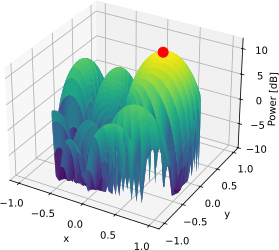

.. _2d-beamforming-chapter:

##############
2D Beamforming
##############

This chapter extends the 1D beamforming/DOA chapter to 2D arrays.  We will start with a simple rectangular array and develop the steering vector equation and MVDR beamformer, then we will work with some actual data from a 3x5 array.  Lastly, we will use the interactive tool to explore the effects of different array geometries and element spacings.

*************************************
Rectangular Arrays and 2D Beamforming
*************************************

Rectangular arrays (a.k.a. planar arrays) involve a 2D array of elements.  With an extra dimension we get some added complexity, but the same basic principles apply, and the hardest part will be visualizing the results (e.g. no more simple polar plots, now we'll need 3D surface plots).  Even though our array is now 2D, that does not mean we have to start adding a dimension to every data structure we've been dealing with.  For example, we will keep our weights as a 1D array of complex numbers.  However, we will need to represent the positions of our elements in 2D (x and y), and we're going to go ahead and add in z, even though it will be equal to zero, for the sake of math later on.  We will keep using :code:`theta` to refer to the azimuth angle, but now we will introduce a new angle, :code:`phi`, which is the elevation angle.  

.. image:: ../_images/Spherical_Coordinates.svg
   :align: center 
   :target: ../_images/Spherical_Coordinates.svg
   :alt: Spherical coordinate system showing theta and phi

We will also switch to using a generalized steering vector equation, which is not specific to any array geometry:

.. math::

   s = e^{-2j \pi \boldsymbol{p} u / \lambda}

where :math:`\boldsymbol{p}` is the set of element x/y/z positions in meters (size :code:`Nr` x 3) and :math:`u` is the direction we want to point at as a unit vector in x/y/z (size 3x1).  In Python this looks like:

.. code-block:: python

 def steering_vector(pos, dir):
     #                           Nrx3  3x1   
     return np.exp(-2j * np.pi * pos @ dir / wavelength) # outputs Nr x 1 (column vector)

Let's try using this generalized steering vector equation with a simple ULA with 4 elements, to make the connection back to what we have previously learned. We will now represent :code:`d` in meters instead of relative to wavelength.

.. code-block:: python

 Nr = 4
 fc = 5e9
 wavelength = 3e8 / fc
 d = 0.5 * wavelength # in meters

 # We will store our element positions in a list of (x,y,z)'s, even though it's just a ULA along the x-axis
 pos = np.zeros((Nr, 3)) # Element positions, as a list of x,y,z coordinates in meters
 for i in range(Nr):
     pos[i,0] = d * i # x position
     pos[i,1] = 0     # y position
     pos[i,2] = 0     # z position

The following graphic shows a top-down view of the ULA, with an example theta of 20 degrees.

.. image:: ../_images/2d_beamforming_ula.svg
   :align: center 
   :target: ../_images/2d_beamforming_ula.svg
   :alt: ULA with theta of 20 degrees

The only thing left is to connect our old :code:`theta` with this new unit vector approach.  We can calculate :code:`dir` based on :code:`theta` pretty easily, we know that the y and z component of our unit vector will be 0 because we are still in 1D space, and the x component will be :code:`np.cos(theta)`, meaning the full code is :code:`dir = np.asmatrix([np.cos(theta_i), 0, 0]).T`. At this point you should be able to connect our generalized steering vector equation with the ULA steering vector equation we have been using.  Give this new code a try, pick a :code:`theta` between 0 and 360 degrees (remember to convert to radians!), and the steering vector should be a 4x1 array.

Now let's move on to the 2D case.  We will represent our element positions in the exact same way, except the y component will be nonzero:

.. code-block:: python

 # Now let's switch to 2D, using a 4x4 array with half wavelength spacing, so 16 elements total
 Nr = 16
 
 # Element positions, still as a list of x,y,z coordinates in meters
 pos = np.zeros((Nr,3))
 for i in range(Nr):
     pos[i,0] = d * (i % 4)  # x position
     pos[i,1] = d * (i // 4) # y position
     pos[i,2] = 0            # z position

The top-down view of our rectangular 4x4 array:

.. image:: ../_images/2d_beamforming_element_pos.svg
   :align: center 
   :target: ../_images/2d_beamforming_element_pos.svg
   :alt: Rectangular array element positions

In order to point towards a certain theta and phi, we will need to convert those angles into a unit vector.  Using a little bit of trig, we find that the x component is :code:`np.sin(theta) * np.sin(phi)`, the y component is :code:`np.cos(theta) * np.sin(phi)`, and the z component is 0.  This means we can use the same generalized steering vector equation as before, but now we will need to calculate the unit vector based on both theta and phi:

.. code-block:: python

 # Let's point towards an arbitrary direction
 theta = np.deg2rad(60) # azimith angle
 phi = np.deg2rad(30) # elevation angle

 # The direction unit vector in this direction now has two nonzero components:
 # Let's make a function out of it, because we will be using it a lot
 def get_unit_vector(theta, phi):
     return np.asmatrix([np.sin(theta) * np.sin(phi), # x component
                         np.cos(theta) * np.sin(phi), # y component
                         0]                           # z component
                         ).T

 dir = get_unit_vector(theta, phi)
 # dir is a 3x1
 # [[0.4330127]
 #  [0.25     ]
 #  [0.       ]]

Now let's use our generalized steering vector function to calculate the steering vector:

.. code-block:: python

 s = steering_vector(pos, dir)
 
 # Use the conventional beamformer, which is simply the weights equal to the steering vector, plot the beam pattern
 w = s # 16x1 vector of weights

At this point it's worth pointing out that we didn't actually change the dimensions of anything, going from 1D to 2D, we just have a non-zero y component, the steering vector equation is still the same and the weights are still a 1D array.  It might be tempting to assemble your weights as a 2D array so that visually it matches the array geometry, but it's not necessary and best to keep it 1D.  For every element, there is a corresponding weight, and the list of weights is in the same order as the list of element positions.

Visualizing the beam pattern associated with these weights is a little more complicated because we need a 3D plot.  We will scan :code:`theta` and :code:`phi` to get a 2D array of power levels, and then plot that as a surface plot.  The code below does just that, and the result is shown in the figure below, along with a dot at the maximum point.

.. code-block:: python

    resolution = 100 # number of points in each direction
    theta_scan = np.linspace(0, 2*np.pi, resolution) # azimuth angles
    phi_scan = np.linspace(0, np.pi, resolution) # elevation angles
    results = np.zeros((resolution, resolution)) # 2D array to store results
    for i, theta_i in enumerate(theta_scan):
        for j, phi_i in enumerate(phi_scan):
            dir_i = get_unit_vector(theta_i, phi_i)
            a = steering_vector(pos, dir_i) # array factor
            resp = w.conj().T @ a # scalar
            results[i, j] = 10*np.log10(np.abs(resp)[0,0]) # power in signal, in dB
    # plot_surface needs x,y,z form
    results[results < -10] = -10 # crop the z axis to -10 dB
    fig, ax = plt.subplots(subplot_kw={"projection": "3d", "computed_zorder": False})
    surf = ax.plot_surface(np.sin(theta_scan[:,None]) * np.sin(phi_scan[None,:]), # x
                           np.cos(theta_scan[:,None]) * np.sin(phi_scan[None,:]), # y
                           results, cmap='viridis')
    # Plot a dot at the maximum point
    max_idx = np.unravel_index(np.argmax(results, axis=None), results.shape)
    ax.scatter(np.sin(theta_scan[max_idx[0]]) * np.sin(phi_scan[max_idx[1]]), # x
               np.cos(theta_scan[max_idx[0]]) * np.sin(phi_scan[max_idx[1]]), # y
               results[max_idx], color='red', s=100)
    ax.set_zlim(-10, results[max_idx])
    ax.set_xlabel('x')
    ax.set_ylabel('y')
    ax.set_zlabel('Power [dB]')

If anyone has a better 3D polar-style plot in Python, please use the "Suggest an Edit" link at the bottom of this page, or email Marc at marc@pysdr.org.

Let's simulate some actual samples now; we'll add two tone jammers arriving from different directions:

.. code-block:: python

 N = 10000 # number of samples to simulate
 
 jammer1_theta = np.deg2rad(-30)
 jammer1_phi = np.deg2rad(10)
 jammer1_dir = get_unit_vector(jammer1_theta, jammer1_phi)
 jammer1_s = steering_vector(pos, jammer1_dir) # Nr x 1
 jammer1_tone = np.exp(2j*np.pi*0.1*np.arange(N)).reshape(1,-1) # make a row vector
 
 jammer2_theta = np.deg2rad(10)
 jammer2_phi = np.deg2rad(50)
 jammer2_dir = get_unit_vector(jammer2_theta, jammer2_phi)
 jammer2_s = steering_vector(pos, jammer2_dir)
 jammer2_tone = np.exp(2j*np.pi*0.2*np.arange(N)).reshape(1,-1) # make a row vector
 
 noise = np.random.normal(0, 1, (Nr, N)) + 1j * np.random.normal(0, 1, (Nr, N)) # complex Gaussian noise
 r = jammer1_s @ jammer1_tone + jammer2_s @ jammer2_tone + noise # produces 16 x 10000 matrix of samples

Just for fun let's calculate the MVDR beamformer weights towards the theta and phi we were using earlier (a unit vector in that direction is still saved as :code:`dir`):

.. code-block:: python

 s = steering_vector(pos, dir) # 16 x 1
 R = np.cov(r) # Covariance matrix, 16 x 16
 Rinv = np.linalg.pinv(R)
 w = (Rinv @ s)/(s.conj().T @ Rinv @ s) # MVDR/Capon equation

Instead of looking at the beam pattern in the crummy 3D plot, we'll use an alternative method of checking if these weights make sense; we will evaluate the response of the weights towards different directions and calculate the power in dB.  Let's start with the direction we were pointing:

.. code-block:: python

 # Power in the direction we are pointing (theta=60, phi=30, which is still saved as dir):
 a = steering_vector(pos, dir) # array factor
 resp = w.conj().T @ a # scalar
 print("Power in direction we are pointing:", 10*np.log10(np.abs(resp)[0,0]), 'dB')

This outputs 0 dB, which is what we expect because MVDR's goal is to achieve unit power in the desired direction.  Now let's check the power in the directions of the two jammers, as well as a random direction and a direction that is one degree off of our desired direction (the same code is used, just update :code:`dir`).  The results are shown in the table below:

.. list-table::
   :widths: 70 30
   :header-rows: 1

   * - Direction Pointed
     - Gain
   * - :code:`dir` (direction used to find MVDR weights)
     - 0 dB
   * - Jammer 1
     - -20.816 dB
   * - Jammer 2
     - -27.347 dB
   * - 1 degree off from :code:`dir` in both :math:`\theta` and :math:`\phi`
     - -0.0131 dB
   * - A random direction
     - -14.285 dB

Your results may vary due to the random noise being used to calculate the received samples, which get used to calculate :code:`R`.  But the main take-away is that the jammers will be in a null and very low power, the 1 degree off from :code:`dir` will be slightly below 0 dB, but still in the main lobe, and then a random direction is going to be lower than 0 dB but higher than the jammers, and very different every run of the simulation.  Note that with MVDR you get a gain of 0 dB for the main lobe, but if you were to use the conventional beamformer, you would get :math:`10 \log_{10}(Nr)`, so about 12 dB for our 16-element array, showing one of the trade-offs of using MVDR.

************************
Example 2D Array Signals
************************

Coming soon!

***********************
Interactive Design Tool
***********************

The following interactive tool was created by Jason Durbin, a free-lancing phased array engineer, who graciously allowed it to be embedded within PySDR; feel free to visit the `full project <https://jasondurbin.github.io/PhasedArrayVisualizer>`_ or his `consulting business <https://neonphysics.com/>`_.  This tool allows you to change a phased array's geometry, element spacing, steering position, add sidelobe tapering, and other features.

Some details on this tool: Antenna elements are assumed to be isotropic. However, the directivity calculation assumes half-hemisphere radiation (e.g. no back lobes). Therefore, the computed directivity will be 3 dBi higher than using pure isotropic (i.e., the individual element gain is +3.0 dBi). The mesh can be made finer by increasing theta/phi, u/v, or az/el points. Clicking (or long pressing) elements in the phase/attenuation plots allows you to manually set phase/attenuation ("be sure to select "enable override"). Additionally, the attenuation pop-up allows you to disable elements. Hovering (or touching) the 2D farfield plot or geometry plots will show the value of the plot under the cursor.

.. raw:: html

	<input type="text" id="pa-atten-manual" hidden />
	<input type="text" id="pa-phase-manual" hidden />
	

		

			

				<h3>Geometry</h3>
			

			

				<h3>Steering</h3>
				<select id="pa-steering-domain" style="width:100%;"></select>
				

					<label for="pa-theta">Theta (deg)</label>
					<input type="number" min="-90" max="90" value="0" id="pa-theta" name="pa-theta" />
				

				

					<label for="pa-phi">Phi (deg)</label>
					<input type="number" min="-90" max="90" value="0" id="pa-phi" name="pa-phi" />
				

			

			

				<h3>Taper(s)</h3>
				

					<label for="pa-taper-sampling">Sampling</label>
					<select id="pa-taper-sampling"><option>X & Y</option><option>Radial</option></select>
				

				

				

			

			

				<h3>Quantization</h3>
				

					<label for="pa-phase-bits">Phase Bits</label>
					<input type="number" min="0" max="10" value="0" step="1" id="pa-phase-bits" name="pa-phase-bits" />
				

				

					<label for="pa-atten-bits">Atten. Bits</label>
					<input type="number" min="0" max="10" value="0" step="1" id="pa-atten-bits" name="pa-atten-bits" />
				

				

					<label for="pa-atten-lsb">Atten. LSB (dB)</label>
					<input type="number" min="0" max="5" value="0.5" step="0.25" id="pa-atten-lsb" name="pa-atten-lsb" />
				

				

					0 bits would be no quantization.
				

			

		

		

			
<button id="pa-refresh">Update</button><button id="pa-reset">Reset</button>

			<progress id="pa-progress" max="100" value="70"></progress>
			
Loading...

		

	

	

		

			
<h2>Element Phase</h2>&nbsp;

			

				<canvas id="pa-geometry-phase-canvas" class="canvas-grid"></canvas>
			

			

				

					<label for="pa-geometry-phase-colormap">Colormap</label>
					<select id="pa-geometry-phase-colormap" name="pa-geometry-phase-colormap"></select>
				

			

		

		

			
<h2>Element Attenuation</h2>&nbsp;

			

				<canvas id="pa-geometry-magnitude-canvas" class="canvas-grid"></canvas>
			

			

				

					<label for="pa-atten-scale">Scale</label>
					<input type="number" max="200" min="5" value="40" id="pa-atten-scale" name="pa-atten-scale">
				

				

					<label for="pa-geometry-magnitude-colormap">Colormap</label>
					<select id="pa-geometry-magnitude-colormap" name="pa-geometry-magnitude-colormap"></select>
				

			

		

		

			
<h2>2-D Radiation Pattern</h2>&nbsp;

			

				<canvas id="pa-farfield-canvas-2d" class="canvas-grid"></canvas>
			

			

				

					

						<label for="pa-farfield-domain">Domain</label>
						<select id="pa-farfield-domain"></select>
					

					

						<label for="pa-farfield-2d-scale">Scale</label>
						<input type="number" max="200" min="5" value="40" id="pa-farfield-2d-scale" name="pa-farfield-2d-scale">
					

					

						<label for="pa-farfield-2d-colormap">Colormap</label>
						<select id="pa-farfield-2d-colormap" name="pa-farfield-2d-colormap"></select>
					

					

						<label for="pa-farfield-ax1-points">Theta Points</label>
						<input type="number" min="11" max="513" value="257" size="6" id="pa-farfield-ax1-points" name="pa-farfield-ax1-points">
					

					

						<label for="pa-farfield-ax2-points">Phi Points</label>
						<input type="number" min="11" max="513" value="257" size="6" id="pa-farfield-ax2-points" name="pa-farfield-ax2-points">
					

				

			

		

	

	

		

			
<h2>1-D Pattern Cuts</h2>

			

				<canvas id="pa-farfield-canvas-1d"></canvas>
			

			

				

					Phi = 0 deg
					Phi = 90 deg
					Click to hide/show trace.
				

				

					<label for="pa-farfield-1d-scale">Scale</label>
					<input type="number" max="200" min="5" value="40" id="pa-farfield-1d-scale" name="pa-farfield-1d-scale">
					<label for="pa-farfield-1d-colormap">Colormap</label>
					<select id="pa-farfield-1d-colormap" name="pa-farfield-1d-colormap"></select>
				

			

		

	

	

		

			
<h2>Taper</h2>

			

				<canvas id="pa-taper-canvas-1d"></canvas>
			

			

				

					X-Axis
					Y-Axis
					Click to hide/show trace.
				

				

					<label for="pa-taper-1d-colormap">Colormap</label>
					<select id="pa-taper-1d-colormap" name="pa-taper-1d-colormap"></select>
				

			

		

	

