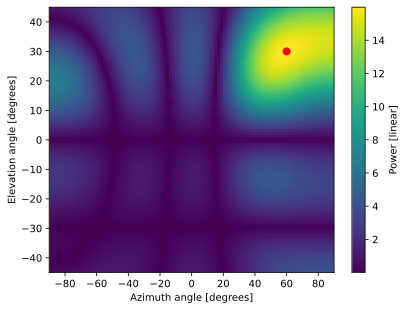
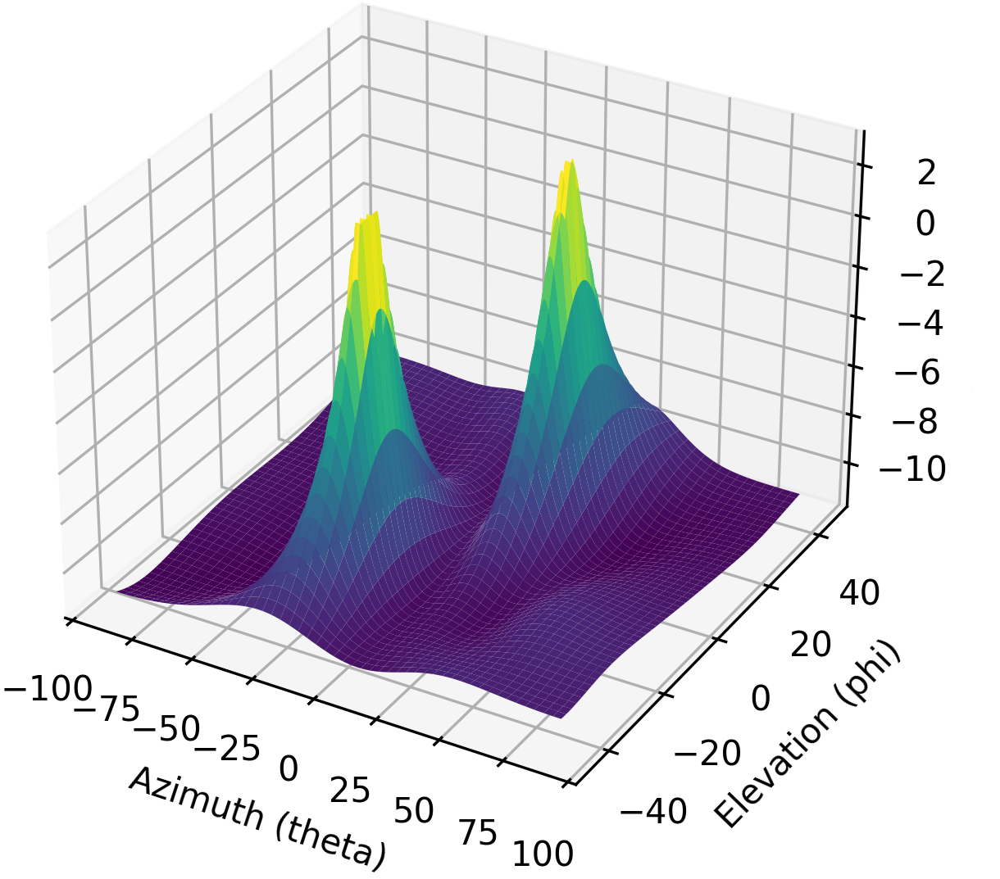

.. _2d-beamforming-chapter:

##############
2D Beamforming
##############

This chapter extends the 1D beamforming/DOA chapter to 2D arrays.  We will start with a simple rectangular array and develop the steering vector equation and MVDR beamformer, then we will work with some actual data from a 3x5 array.  Lastly, we will use the interactive tool to explore the effects of different array geometries and element spacing.

*************************************
Rectangular Arrays and 2D Beamforming
*************************************

Rectangular arrays (a.k.a. planar arrays) involve a 2D array of elements.  With an extra dimension we get some added complexity, but the same basic principles apply, and the hardest part will be visualizing the results (e.g. no more simple polar plots, now we'll need 3D surface plots).  Even though our array is now 2D, that does not mean we have to start adding a dimension to every data structure we've been dealing with.  For example, we will keep our weights as a 1D array of complex numbers.  However, we will need to represent the positions of our elements in 2D.  We will keep using :code:`theta` to refer to the azimuth angle, but now we will introduce a new angle, :code:`phi`, which is the elevation angle.  There are many spherical coordinate conventions, but we will be using the following:

Which corresponds to:

.. math::

 x = \sin(\theta) \cos(\phi)

 y = \cos(\theta) \cos(\phi)

 z = \sin(\phi)

We will also switch to using a generalized steering vector equation, which is not specific to any array geometry:

.. math::

   s = e^{-2j \pi \boldsymbol{p} u / \lambda}

where :math:`\boldsymbol{p}` is the set of element x/y/z positions in meters (size :code:`Nr` x 3) and :math:`u` is the direction we want to point at as a unit vector in x/y/z (size 3x1).  In Python this looks like:

.. code-block:: python

 def steering_vector(pos, dir):
     #                           Nrx3  3x1   
     return np.exp(-2j * np.pi * pos @ dir / wavelength) # outputs Nr x 1 (column vector)

Let's try using this generalized steering vector equation with a simple ULA with 4 elements, to make the connection back to what we have previously learned. We will now represent :code:`d` in meters instead of relative to wavelength.  We will place the elements along the y-axis:

.. code-block:: python

 Nr = 4
 fc = 5e9
 wavelength = 3e8 / fc
 d = 0.5 * wavelength # in meters

 # We will store our element positions in a list of (x,y,z)'s, even though it's just a ULA along the y-axis
 pos = np.zeros((Nr, 3)) # Element positions, as a list of x,y,z coordinates in meters
 for i in range(Nr):
     pos[i,0] = 0     # x position
     pos[i,1] = d * i # y position
     pos[i,2] = 0     # z position

The following graphic shows a top-down view of the ULA, with an example theta of 20 degrees.

.. image:: ../_images/2d_beamforming_ula.svg
   :align: center 
   :target: ../_images/2d_beamforming_ula.svg
   :alt: ULA with theta of 20 degrees

The only thing left is to connect our old :code:`theta` with this new unit vector approach.  We can calculate :code:`dir` based on :code:`theta` pretty easily, we know that the x and z component of our unit vector will be 0 because we are still in 1D space, and based on our spherical coordinate convention the y component will be :code:`np.cos(theta)`, meaning the full code is :code:`dir = np.asmatrix([0, np.cos(theta_i), 0]).T`. At this point you should be able to connect our generalized steering vector equation with the ULA steering vector equation we have been using.  Give this new code a try, pick a :code:`theta` between 0 and 360 degrees (remember to convert to radians!), and the steering vector should be a 4x1 array.

Now let's move on to the 2D case.  We will place our array in the X-Z plane, with boresight pointing horizontally towards the positive y-axis (:math:`\theta = 0`, :math:`\phi = 0`).  We will use the same element spacing as before, but now we will have 16 elements total:

.. code-block:: python

 # Now let's switch to 2D, using a 4x4 array with half wavelength spacing, so 16 elements total
 Nr = 16
 
 # Element positions, still as a list of x,y,z coordinates in meters, we'll place the array in the X-Z plane
 pos = np.zeros((Nr,3))
 for i in range(Nr):
     pos[i,0] = d * (i % 4)  # x position
     pos[i,1] = 0            # y position
     pos[i,2] = d * (i // 4) # z position

The top-down view of our rectangular 4x4 array:

.. image:: ../_images/2d_beamforming_element_pos.svg
   :align: center 
   :target: ../_images/2d_beamforming_element_pos.svg
   :alt: Rectangular array element positions

In order to point towards a certain theta and phi, we will need to convert those angles into a unit vector.  We can use the same generalized steering vector equation as before, but now we will need to calculate the unit vector based on both theta and phi, using the equations at the beginning of this chapter:

.. code-block:: python

 # Let's point towards an arbitrary direction
 theta = np.deg2rad(60) # azimith angle
 phi = np.deg2rad(30) # elevation angle

 # Using our spherical coordinate convention, we can calculate the unit vector:
 def get_unit_vector(theta, phi):  # angles are in radians
     return np.asmatrix([np.sin(theta) * np.cos(phi), # x component
                         np.cos(theta) * np.cos(phi), # y component
                         np.sin(phi)]).T              # z component
 
 dir = get_unit_vector(theta, phi)
 # dir is a 3x1
 # [[0.75     ]
 #  [0.4330127]
 #  [0.5      ]]

Now let's use our generalized steering vector function to calculate the steering vector:

.. code-block:: python

 s = steering_vector(pos, dir)
 
 # Use the conventional beamformer, which is simply the weights equal to the steering vector, plot the beam pattern
 w = s # 16x1 vector of weights

At this point it's worth pointing out that we didn't actually change the dimensions of anything, going from 1D to 2D, we just have a non-zero x/y/z components, the steering vector equation is still the same and the weights are still a 1D array.  It might be tempting to assemble your weights as a 2D array so that visually it matches the array geometry, but it's not necessary and best to keep it 1D.  For every element, there is a corresponding weight, and the list of weights is in the same order as the list of element positions.

Visualizing the beam pattern associated with these weights is a little more complicated because we need a 3D plot or a 2D heatmap.  We will scan :code:`theta` and :code:`phi` to get a 2D array of power levels, and then plot that using :code:`imshow()`.  The code below does just that, and the result is shown in the figure below, along with a dot at the angle we entered earlier:

.. code-block:: python

    resolution = 100 # number of points in each direction
    theta_scan = np.linspace(-np.pi/2, np.pi/2, resolution) # azimuth angles
    phi_scan = np.linspace(-np.pi/4, np.pi/4, resolution) # elevation angles
    results = np.zeros((resolution, resolution)) # 2D array to store results
    for i, theta_i in enumerate(theta_scan):
        for j, phi_i in enumerate(phi_scan):
            a = steering_vector(pos, get_unit_vector(theta_i, phi_i)) # array factor
            results[i, j] = np.abs(w.conj().T @ a)[0,0] # power in signal, in dB
    plt.imshow(results.T, extent=(theta_scan[0]*180/np.pi, theta_scan[-1]*180/np.pi, phi_scan[0]*180/np.pi, phi_scan[-1]*180/np.pi), origin='lower', aspect='auto', cmap='viridis')
    plt.colorbar(label='Power [dB]')
    plt.scatter(theta*180/np.pi, phi*180/np.pi, color='red', s=50) # Add a dot at the correct theta/phi
    plt.xlabel('Azimuth angle [degrees]')
    plt.ylabel('Elevation angle [degrees]')
    plt.show()

Let's simulate some actual samples now; we'll add two tone jammers arriving from different directions:

.. code-block:: python

 N = 10000 # number of samples to simulate
 
 jammer1_theta = np.deg2rad(-30)
 jammer1_phi = np.deg2rad(10)
 jammer1_dir = get_unit_vector(jammer1_theta, jammer1_phi)
 jammer1_s = steering_vector(pos, jammer1_dir) # Nr x 1
 jammer1_tone = np.exp(2j*np.pi*0.1*np.arange(N)).reshape(1,-1) # make a row vector
 
 jammer2_theta = np.deg2rad(10)
 jammer2_phi = np.deg2rad(50)
 jammer2_dir = get_unit_vector(jammer2_theta, jammer2_phi)
 jammer2_s = steering_vector(pos, jammer2_dir)
 jammer2_tone = np.exp(2j*np.pi*0.2*np.arange(N)).reshape(1,-1) # make a row vector
 
 noise = np.random.normal(0, 1, (Nr, N)) + 1j * np.random.normal(0, 1, (Nr, N)) # complex Gaussian noise
 r = jammer1_s @ jammer1_tone + jammer2_s @ jammer2_tone + noise # produces 16 x 10000 matrix of samples

Just for fun let's calculate the MVDR beamformer weights towards the theta and phi we were using earlier (a unit vector in that direction is still saved as :code:`dir`):

.. code-block:: python

 s = steering_vector(pos, dir) # 16 x 1
 R = np.cov(r) # Covariance matrix, 16 x 16
 Rinv = np.linalg.pinv(R)
 w = (Rinv @ s)/(s.conj().T @ Rinv @ s) # MVDR/Capon equation

Instead of looking at the beam pattern in the crummy 3D plot, we'll use an alternative method of checking if these weights make sense; we will evaluate the response of the weights towards different directions and calculate the power in dB.  Let's start with the direction we were pointing:

.. code-block:: python

 # Power in the direction we are pointing (theta=60, phi=30, which is still saved as dir):
 a = steering_vector(pos, dir) # array factor
 resp = w.conj().T @ a # scalar
 print("Power in direction we are pointing:", 10*np.log10(np.abs(resp)[0,0]), 'dB')

This outputs 0 dB, which is what we expect because MVDR's goal is to achieve unit power in the desired direction.  Now let's check the power in the directions of the two jammers, as well as a random direction and a direction that is one degree off of our desired direction (the same code is used, just update :code:`dir`).  The results are shown in the table below:

.. list-table::
   :widths: 70 30
   :header-rows: 1

   * - Direction Pointed
     - Gain
   * - :code:`dir` (direction used to find MVDR weights)
     - 0 dB
   * - Jammer 1
     - -17.488 dB
   * - Jammer 2
     - -18.551 dB
   * - 1 degree off from :code:`dir` in both :math:`\theta` and :math:`\phi`
     - -0.00683 dB
   * - A random direction
     - -10.591 dB

Your results may vary due to the random noise being used to calculate the received samples, which get used to calculate :code:`R`.  But the main take-away is that the jammers will be in a null and very low power, the 1 degree off from :code:`dir` will be slightly below 0 dB, but still in the main lobe, and then a random direction is going to be lower than 0 dB but higher than the jammers, and very different every run of the simulation.  Note that with MVDR you get a gain of 0 dB for the main lobe, but if you were to use the conventional beamformer, you would get :math:`10 \log_{10}(Nr)`, so about 12 dB for our 16-element array, showing one of the trade-offs of using MVDR.

The code for this section can be found `here <https://github.com/777arc/PySDR/blob/master/figure-generating-scripts/doa_2d.py>`_.

**********************************************
Processing Signals from an Actual 2D Array
**********************************************

In this section we work with some actual data recorded from a 3x5 array made out of a `QUAD-MxFE <https://www.analog.com/en/resources/evaluation-hardware-and-software/evaluation-boards-kits/quad-mxfe.html#eb-overview>`_ platform from Analog Devices which supports up to 16 transmit and receive channels (we only used 15 and only in receive mode).  Two recordings are provided below, the first one contains one emitter located at boresight to the array, which we will use for calibration.  The second recording contains two emitters at different directions, which we will use for beamforming and DOA testing.

- `IQ recording of just C <https://github.com/777arc/RADAR-2025-Beamforming-Labs/raw/refs/heads/main/Lab%207%20-%202D%20Rectangular%20Array/C_only_capture1.npy>`_ (used for calibration, as C is at boresight)
- `IQ recording of B and D <https://github.com/777arc/RADAR-2025-Beamforming-Labs/raw/refs/heads/main/Lab%207%20-%202D%20Rectangular%20Array/DandB_capture1.npy>`_ (used for beamforming/DOA testing)

The QUAD-MxFE was tuned to 2.8 GHz and all transmitters were using a simple tone within the observation bandwidth.  What's interesting about this DSP is that it doesn't actually matter what the sample rate is, none of the array processing techniques we use depend on the sample rate, they just make the assumption that the signal is somewhere in the baseband signal.  The DSP does depend on the center frequency, because the phase shift between elements depends on the frequency and angle of arrival.  This is opposite of most other signal processing where the sample rate is important, but the center frequency is not.

We can load these recordings into Python using the following code:

.. code-block:: python

    import numpy as np
    import matplotlib.pyplot as plt

    r = np.load("DandB_capture1.npy")[0:15] # 16th element is not connected but was still recorded
    r_cal = np.load("C_only_capture1.npy")[0:15] # only the calibration signal (at boresight) on

The spacing between antennas was 0.051 meters.  We can represent the element positions as a list of x,y,z coordinates in meters.  We will place the array in the X-Z plane, as the array was mounted vertically (with boresight pointing horizontally).

.. code-block:: python

	fc = 2.8e9 # center frequency in Hz
	d = 0.051 # spacing between antennas in meters
	wavelength = 3e8 / fc
	Nr = 15
	rows = 3
	cols = 5

	# Element positions, as a list of x,y,z coordinates in meters
	pos = np.zeros((Nr, 3))
	for i in range(Nr):
		pos[i,0] = d * (i % cols)  # x position
		pos[i,1] = 0 # y position
		pos[i,2] = d * (i // cols) # z position

	# Plot and label positions of elements
	fig = plt.figure()
	ax = fig.add_subplot(projection='3d')
	ax.scatter(pos[:,0], pos[:,1], pos[:,2], 'o')
	# Label indices
	for i in range(Nr):
		ax.text(pos[i,0], pos[i,1], pos[i,2], str(i), fontsize=10)
	plt.xlabel("X Position [m]")
	plt.ylabel("Y Position [m]")
	ax.set_zlabel("Z Position [m]")
	plt.grid()
	plt.show()

The plot labels each element with its index, which corresponds to the order of the elements in the :code:`r` and :code:`r_cal` IQ samples that were recorded.

.. image:: ../_images/2d_array_element_positions.svg
   :align: center 
   :target: ../_images/2d_array_element_positions.svg
   :alt: 2D array element positions

Calibration is performed using only the :code:`r_cal` samples, which were recorded with just the transmitter at boresight on. The goal is to find the phase and magnitude offsets for each element.  With perfect calibration, and assuming the transmitter was exactly at boresight, all of the individual receive elements should be receiving the same signal, all in phase with each other and at the same magnitude.  But because of imperfections in the array/cables/antennas, each element will have a different phase and magnitude offset.  The calibration process is to find these offsets, which we will later apply to the :code:`r` samples before attempting to do any array processing on them.

There are many ways to perform calibration, but we will use a method that involves taking the eigenvalue decomposition of the covariance matrix.  The covariance matrix is a square matrix of size :code:`Nr x Nr`, where :code:`Nr` is the number of receive elements.  The eigenvector corresponding to the largest eigenvalue is the one that represents the received signal, hopefully, and we will use it to find the phase offsets for each element by simply taking the phase of each element of the eigenvector and normalizing it to the first element which we will treat as the reference element.  The magnitude calibration does not actually use the eigenvector, but instead uses the mean magnitude of the received signal for each element.

.. code-block:: python

	# Calc covariance matrix, it's Nr x Nr
	R_cal = r_cal @ r_cal.conj().T

    # eigenvalue decomposition, v[:,i] is the eigenvector corresponding to the eigenvalue w[i]
	w, v = np.linalg.eig(R_cal) 

	# Plot eigenvalues to make sure we have just one large one
	w_dB = 10*np.log10(np.abs(w))
	w_dB -= np.max(w_dB) # normalize
	fig, (ax1) = plt.subplots(1, 1, figsize=(7, 3))
	ax1.plot(w_dB, '.-')
	ax1.set_xlabel('Index')
	ax1.set_ylabel('Eigenvalue [dB]')
	plt.show()

	# Use max eigenvector to calibrate
	v_max = v[:, np.argmax(np.abs(w))]
	mags = np.mean(np.abs(r_cal), axis=1)
	mags = mags[0] / mags # normalize to first element
	phases = np.angle(v_max)
	phases = phases[0] - phases # normalize to first element
	cal_table = mags * np.exp(1j * phases)
	print("cal_table", cal_table)

Below shows the plot of the eigenvalue distribution, we want to make sure that there's just one large value, and the rest are small, representing one signal being received.  Any interferers or multipath will degrade the calibration process. 

The calibration table is a list of complex numbers, one for each element, representing the phase and magnitude offsets (it is easier to represent it in rectangular form instead of polar).  The first element is the reference element, and will always be 1.0 + 0.j. The rest of the elements are the offsets for each element corresponding to the same order we used for :code:`pos`.

.. code-block:: python

	[1.        +0.j          0.99526771+0.76149029j -0.91754588-0.66825262j
	-0.96840297+0.37251012j  0.87866849+0.40446665j  0.56040169+1.50499875j
	-0.80109196-1.29299264j -1.28464742-0.31133052j  1.26622038+0.46047599j
	 2.01855809+9.77121302j -0.29249322-1.09413205j -1.0372309 -0.17983522j
	-0.70614339+0.78682873j -0.75612972+5.67234809j  1.00032754-0.60824109j]

We can apply these offsets to any set of samples recorded from the array simply by multiplying each element of the samples by the corresponding element of the calibration table:

.. code-block:: python

	# Apply cal offsets to r
	for i in range(Nr):
		r[i, :] *= cal_table[i]

As a side note, this is why we calculated the offsets using :code:`mags[0] / mags` and :code:`phases[0] - phases`, if we had reversed that order then we would need to do a division in order to apply the offsets, but we prefer to do the multiplication instead.

Next we will perform DOA estimation using the MUSIC algorithm.  We will use the :code:`steering_vector()` and :code:`get_unit_vector()` functions we defined earlier to calculate the steering vector for each element of the array, and then use the MUSIC algorithm to estimate the DOA of the two emitters in the :code:`r` samples.  The MUSIC algorithm was discussed in the previous chapter.

.. code-block:: python

	# DOA using MUSIC
	resolution = 400 # number of points in each direction
	theta_scan = np.linspace(-np.pi/2, np.pi/2, resolution) # azimuth angles
	phi_scan = np.linspace(-np.pi/4, np.pi/4, resolution) # elevation angles
	results = np.zeros((resolution, resolution)) # 2D array to store results
	R = np.cov(r) # Covariance matrix, 15 x 15
	Rinv = np.linalg.pinv(R)
	expected_num_signals = 4
	w, v = np.linalg.eig(R) # eigenvalue decomposition, v[:,i] is the eigenvector corresponding to the eigenvalue w[i]
	eig_val_order = np.argsort(np.abs(w))
	v = v[:, eig_val_order] # sort eigenvectors using this order
	V = np.zeros((Nr, Nr - expected_num_signals), dtype=np.complex64) # Noise subspace is the rest of the eigenvalues
	for i in range(Nr - expected_num_signals):
		V[:, i] = v[:, i]
	for i, theta_i in enumerate(theta_scan):
		for j, phi_i in enumerate(phi_scan):
			dir_i = get_unit_vector(theta_i, -1*phi_i)
			s = steering_vector(pos, dir_i) # 15 x 1
			music_metric = 1 / (s.conj().T @ V @ V.conj().T @ s)
			music_metric = np.abs(music_metric).squeeze()
			music_metric = np.clip(music_metric, 0, 2) # Useful for ABCD one
			results[i, j] = music_metric

Our results are in 2D, because the array is 2D, so we must either use a 3D plot or a 2D heatmap plot.  Let's try both. First, we will do a 3D plot that has elevation on one axis and azimuth on the other:

.. code-block:: python

	# 3D az-el DOA results
	results = 10*np.log10(results) # convert to dB
	results[results < -20] = -20 # crop the z axis to some level of dB
	fig, ax = plt.subplots(subplot_kw={"projection": "3d", "computed_zorder": False})
	surf = ax.plot_surface(np.rad2deg(theta_scan[:,None]), # type: ignore
							np.rad2deg(phi_scan[None,:]),
							results,
							cmap='viridis')
	#ax.set_zlim(-10, results[max_idx])
	ax.set_xlabel('Azimuth (theta)')
	ax.set_ylabel('Elevation (phi)')
	ax.set_zlabel('Power [dB]') # type: ignore
	fig.savefig('../_images/2d_array_3d_doa_plot.svg', bbox_inches='tight')
	plt.show()

Depending on the situation it might be annoying to read off numbers from a 3D plot, so we can also do a 2D heatmap with :code:`imshow()`:

.. code-block:: python

	# 2D, az-el heatmap (same as above, but 2D)
	extent=(np.min(theta_scan)*180/np.pi,
			np.max(theta_scan)*180/np.pi,
			np.min(phi_scan)*180/np.pi,
			np.max(phi_scan)*180/np.pi)
	plt.imshow(results.T, extent=extent, origin='lower', aspect='auto', cmap='viridis') # type: ignore
	plt.colorbar(label='Power [linear]')
	plt.xlabel('Theta (azimuth, degrees)')
	plt.ylabel('Phi (elevation, degrees)')
	plt.savefig('../_images/2d_array_2d_doa_plot.svg', bbox_inches='tight')
	plt.show()

.. image:: ../_images/2d_array_2d_doa_plot.svg
   :align: center 
   :target: ../_images/2d_array_2d_doa_plot.svg
   :alt: 2D DOA plot

Using this 2D plot we can easily read off the estimated azimuth and elevation of the two emitters (and see that there was just two).  Based on the test setup that was used to produce this recording, these results match reality, the *exact* azimuth and elevation of the emitters was never actually measured because that would require very specialized equipment. 

As an exercise, try using the conventional beamformer, as well as MVDR, and compare the results to MUSIC.

This code in its entirety can be found `here <https://github.com/777arc/PySDR/blob/master/figure-generating-scripts/2d_array_recording.py>`_.

***********************
Interactive Design Tool
***********************

The following interactive tool was created by Jason Durbin, a free-lancing phased array engineer, who graciously allowed it to be embedded within PySDR; feel free to visit the `full project <https://jasondurbin.github.io/PhasedArrayVisualizer>`_ or his `consulting business <https://neonphysics.com/>`_.  This tool allows you to change a phased array's geometry, element spacing, steering position, add sidelobe tapering, and other features.

Some details on this tool: Antenna elements are assumed to be isotropic. However, the directivity calculation assumes half-hemisphere radiation (e.g. no back lobes). Therefore, the computed directivity will be 3 dBi higher than using pure isotropic (i.e., the individual element gain is +3.0 dBi). The mesh can be made finer by increasing theta/phi, u/v, or azimuth/elevation points. Clicking (or long pressing) elements in the phase/attenuation plots allows you to manually set phase/attenuation ("be sure to select "enable override"). Additionally, the attenuation pop-up allows you to disable elements. Hovering (or touching) the 2D far field plot or geometry plots will show the value of the plot under the cursor.

.. raw:: html

	<input type="text" id="pa-atten-manual" hidden />
	<input type="text" id="pa-phase-manual" hidden />
	

		

			

				<h3>Geometry</h3>
			

			

				<h3>Steering</h3>
				<select id="pa-steering-domain" style="width:100%;"></select>
				

					<label for="pa-theta">Theta (deg)</label>
					<input type="number" min="-90" max="90" value="0" id="pa-theta" name="pa-theta" />
				

				

					<label for="pa-phi">Phi (deg)</label>
					<input type="number" min="-90" max="90" value="0" id="pa-phi" name="pa-phi" />
				

			

			

				<h3>Taper(s)</h3>
				

					<label for="pa-taper-sampling">Sampling</label>
					<select id="pa-taper-sampling"><option>X & Y</option><option>Radial</option></select>
				

				

				

			

			

				<h3>Quantization</h3>
				

					<label for="pa-phase-bits">Phase Bits</label>
					<input type="number" min="0" max="10" value="0" step="1" id="pa-phase-bits" name="pa-phase-bits" />
				

				

					<label for="pa-atten-bits">Atten. Bits</label>
					<input type="number" min="0" max="10" value="0" step="1" id="pa-atten-bits" name="pa-atten-bits" />
				

				

					<label for="pa-atten-lsb">Atten. LSB (dB)</label>
					<input type="number" min="0" max="5" value="0.5" step="0.25" id="pa-atten-lsb" name="pa-atten-lsb" />
				

				

					0 bits would be no quantization.
				

			

		

		

			
<button id="pa-refresh">Update</button><button id="pa-reset">Reset</button>

			<progress id="pa-progress" max="100" value="70"></progress>
			
Loading...

		

	

	

		

			
<h2>Element Phase</h2>&nbsp;

			

				<canvas id="pa-geometry-phase-canvas" class="canvas-grid"></canvas>
			

			

				

					<label for="pa-geometry-phase-colormap">Colormap</label>
					<select id="pa-geometry-phase-colormap" name="pa-geometry-phase-colormap"></select>
				

			

		

		

			
<h2>Element Attenuation</h2>&nbsp;

			

				<canvas id="pa-geometry-magnitude-canvas" class="canvas-grid"></canvas>
			

			

				

					<label for="pa-atten-scale">Scale</label>
					<input type="number" max="200" min="5" value="40" id="pa-atten-scale" name="pa-atten-scale">
				

				

					<label for="pa-geometry-magnitude-colormap">Colormap</label>
					<select id="pa-geometry-magnitude-colormap" name="pa-geometry-magnitude-colormap"></select>
				

			

		

		

			
<h2>2-D Radiation Pattern</h2>&nbsp;

			

				<canvas id="pa-farfield-canvas-2d" class="canvas-grid"></canvas>
			

			

				

					

						<label for="pa-farfield-domain">Domain</label>
						<select id="pa-farfield-domain"></select>
					

					

						<label for="pa-farfield-2d-scale">Scale</label>
						<input type="number" max="200" min="5" value="40" id="pa-farfield-2d-scale" name="pa-farfield-2d-scale">
					

					

						<label for="pa-farfield-2d-colormap">Colormap</label>
						<select id="pa-farfield-2d-colormap" name="pa-farfield-2d-colormap"></select>
					

					

						<label for="pa-farfield-ax1-points">Theta Points</label>
						<input type="number" min="11" max="513" value="257" size="6" id="pa-farfield-ax1-points" name="pa-farfield-ax1-points">
					

					

						<label for="pa-farfield-ax2-points">Phi Points</label>
						<input type="number" min="11" max="513" value="257" size="6" id="pa-farfield-ax2-points" name="pa-farfield-ax2-points">
					

				

			

		

	

	

		

			
<h2>1-D Pattern Cuts</h2>

			

				<canvas id="pa-farfield-canvas-1d"></canvas>
			

			

				

					Phi = 0 deg
					Phi = 90 deg
					Click to hide/show trace.
				

				

					<label for="pa-farfield-1d-scale">Scale</label>
					<input type="number" max="200" min="5" value="40" id="pa-farfield-1d-scale" name="pa-farfield-1d-scale">
					<label for="pa-farfield-1d-colormap">Colormap</label>
					<select id="pa-farfield-1d-colormap" name="pa-farfield-1d-colormap"></select>
				

			

		

	

	

		

			
<h2>Taper</h2>

			

				<canvas id="pa-taper-canvas-1d"></canvas>
			

			

				

					X-Axis
					Y-Axis
					Click to hide/show trace.
				

				

					<label for="pa-taper-1d-colormap">Colormap</label>
					<select id="pa-taper-1d-colormap" name="pa-taper-1d-colormap"></select>
				

			

		

	

