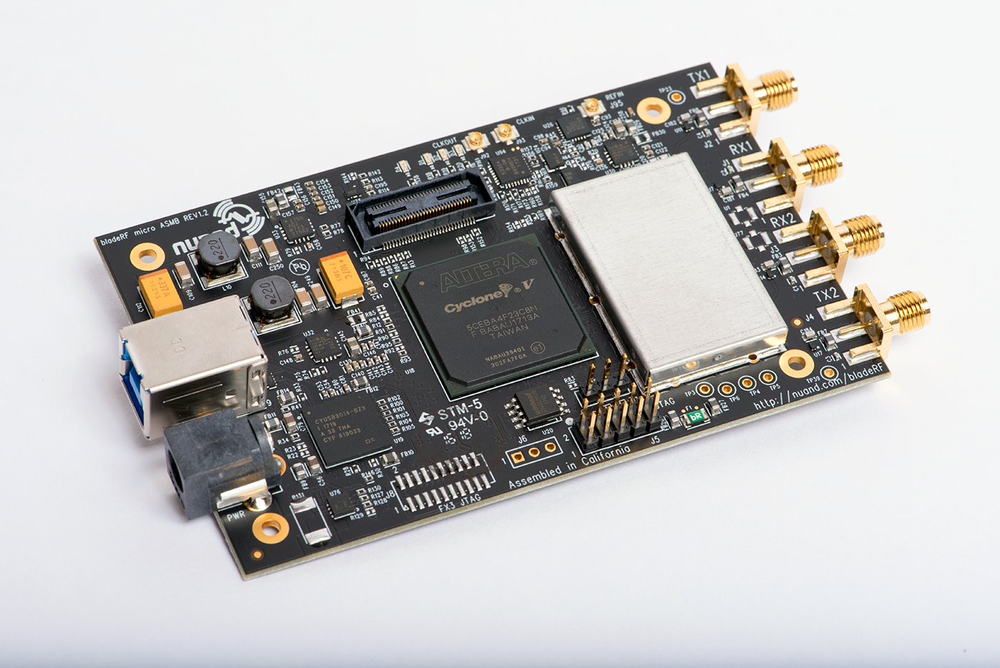
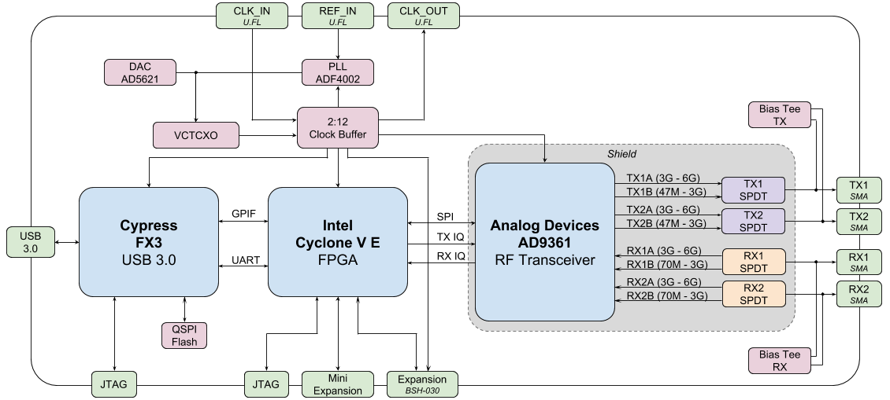
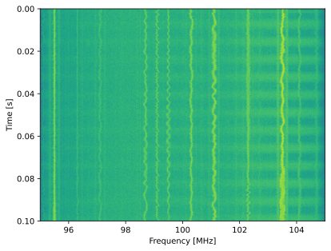
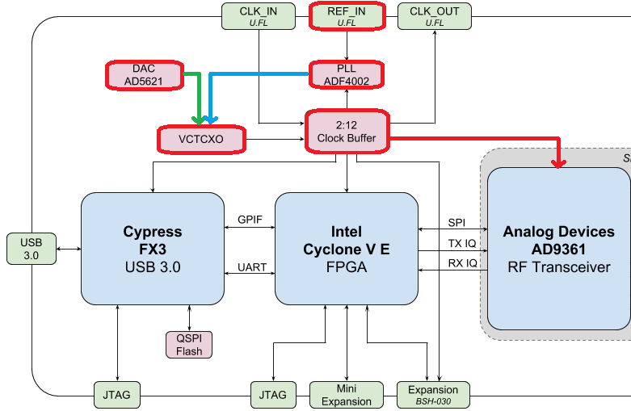

.. _bladerf-chapter:

##################
BladeRF in Python
##################

The bladeRF 2.0 (a.k.a. bladeRF 2.0 micro) from the company `Nuand <https://www.nuand.com>`_ is a USB 3.0-based SDR with two receive channels, two transmit channels, a tunable range of 47 MHz to 6 GHz, and the ability to sample up to 61 MHz or as high as 122 MHz when hacked.  It uses the AD9361 RF integrated circuit (RFIC) just like the USRP B210 and PlutoSDR, so RF performance will be similar.  The bladeRF 2.0 was released in 2021, maintains a small form factor at 2.5" x 4.5", and comes in two different FPGA sizes (xA4 and xA9).  While this chapter focuses on the bladeRF 2.0, a lot of the code will also apply to the original bladeRF which `came out in 2013 <https://www.kickstarter.com/projects/1085541682/bladerf-usb-30-software-defined-radio>`_.

********************************
bladeRF Architecture
********************************

At a high level, the bladeRF 2.0 is based on the AD9361 RFIC, combined with a Cyclone V FPGA (either the 49 kLE :code:`5CEA4` or 301 kLE :code:`5CEA9`), and a Cypress FX3 USB 3.0 controller that has a 200 MHz ARM9 core inside, loaded with custom firmware.  The block diagram of the bladeRF 2.0 is shown below:

The FPGA controls the RFIC, performs digital filtering, and frames packets for transfer over USB (among other things).  The `source code <https://github.com/Nuand/bladeRF/tree/master/hdl>`_ for the FPGA image is written in VHDL and requires the free Quartus Prime Lite design software to compile custom images.  Precompiled images are available `here <https://www.nuand.com/fpga_images/>`_.

The `source code <https://github.com/Nuand/bladeRF/tree/master/fx3_firmware>`_ for the Cypress FX3 firmware is open-source and includes code to:

1. Load the FPGA image
2. Transfer IQ samples between the FPGA and host over USB 3.0
3. Control GPIO of the FPGA over UART

From a signal flow perspective, there are two receive channels and two transmit channels, and each channel has a low and high frequency input/output to the RFIC, depending on which band is being used.  It is for this reason that a single pole double throw (SPDT) electronic RF switch is needed between the RFIC and SMA connectors.  The bias tee is an onboard circuit that provides ~4.5V DC on the SMA connector, and is used to conveniently power an external amplifier or other RF components.  This extra DC offset is on the RF side of the SDR so it does not interfere with the basic receiving/transmitting operation.

JTAG is a type of debugging interface, allowing for testing and verifying designs during the development process.

At the end of this chapter, we discuss the VCTCXO oscillator, PLL, and expansion port.

********************************
Software and Hardware Setup
********************************

Ubuntu (or Ubuntu within WSL)
#############################

On Ubuntu and other Debian-based systems, you can install the bladeRF software with the following commands:

.. code-block:: bash

 sudo apt update
 sudo apt install cmake python3-pip libusb-1.0-0
 cd ~
 git clone --depth 1 https://github.com/Nuand/bladeRF.git
 cd bladeRF/host
 mkdir build && cd build
 cmake ..
 make -j8
 sudo make install
 sudo ldconfig
 cd ../libraries/libbladeRF_bindings/python
 sudo python3 setup.py install

This will install the libbladerf library, Python bindings, bladerf command line tools, the firmware downloader, and the FPGA bitstream downloader.  To check which version of the library you installed, use :code:`bladerf-tool version` (this guide was written using libbladeRF version v2.5.0).

If you are using Ubuntu through WSL, on the Windows side you will need to forward the bladeRF USB device to WSL, first by installing the latest `usbipd utility msi <https://github.com/dorssel/usbipd-win/releases>`_ (this guide assumes you have usbipd-win 4.0.0 or higher), then opening PowerShell in administrator mode and running:

.. code-block:: bash

    usbipd list
    # (find the BUSID labeled bladeRF 2.0 and substitute it in the command below)
    usbipd bind --busid 1-23
    usbipd attach --wsl --busid 1-23

On the WSL side, you should be able to run :code:`lsusb` and see a new item called :code:`Nuand LLC bladeRF 2.0 micro`.  Note that you can add the :code:`--auto-attach` flag to the :code:`usbipd attach` command if you want it to auto reconnect.

(Might not be needed) For both native Linux and WSL, we must install the udev rules so that we don't get permissions errors:

.. code-block::

 sudo nano /etc/udev/rules.d/88-nuand.rules

and paste in the following line:

.. code-block::

 ATTRS{idVendor}=="2cf0", ATTRS{idProduct}=="5250", MODE="0666"

To save and exit from nano, use: control-o, then Enter, then control-x.  To refresh udev, run:

.. code-block:: bash

    sudo udevadm control --reload-rules && sudo udevadm trigger

If you are using WSL and it says :code:`Failed to send reload request: No such file or directory`, that means the udev service isn't running, and you will need to :code:`sudo nano /etc/wsl.conf` and add the lines:

.. code-block:: bash

 [boot]
 command="service udev start"

then restart WSL using the following command in PowerShell with admin: :code:`wsl.exe --shutdown`.

Unplug and replug your bladeRF (WSL users will have to reattach), and test permissions with:

.. code-block:: bash

 bladerf-tool probe
 bladerf-tool info

and you'll know it worked if you see your bladeRF 2.0 listed, and you **don't** see :code:`Found a bladeRF via VID/PID, but could not open it due to insufficient permissions`.  If it worked, note reported FPGA Version and Firmware Version.

(Optionally) Install the latest firmware and FPGA images (v2.4.0 and v0.15.0 respectively when this guide was written) using:

.. code-block:: bash

 cd ~/Downloads
 wget https://www.nuand.com/fx3/bladeRF_fw_latest.img
 bladerf-tool flash_fw bladeRF_fw_latest.img

 # for xA4 use:
 wget https://www.nuand.com/fpga/hostedxA4-latest.rbf
 bladerf-tool flash_fpga hostedxA4-latest.rbf

 # for xA9 use:
 wget https://www.nuand.com/fpga/hostedxA9-latest.rbf
 bladerf-tool flash_fpga hostedxA9-latest.rbf

Unplug and plug in your bladeRF to cycle power.

Now we will test its functionality by receiving 1M samples in the FM radio band, at 10 MHz sample rate, to a file /tmp/samples.sc16:

.. code-block:: bash

 bladerf-tool rx --num-samples 1000000 /tmp/samples.sc16 100e6 10e6

a couple :code:`Hit stall for buffer` is expected, but you'll know if it worked if you see a 4MB /tmp/samples.sc16 file.

Lastly, we will test the Python API with:

.. code-block:: bash

 python3
 import bladerf
 bladerf.BladeRF()
 exit()

You'll know it worked if you see something like :code:`<BladeRF(<DevInfo(...)>)>` and no warnings/errors.

Windows and macOS
###################

For Windows users, see https://github.com/Nuand/bladeRF/wiki/Getting-Started%3A-Windows, and for macOS users, see https://github.com/Nuand/bladeRF/wiki/Getting-started:-Mac-OSX.

********************************
bladeRF Python API Basics
********************************

To start with, let's poll the bladeRF for some useful information, using the following script.  **Do not name your script bladerf.py** or it will conflict with the bladeRF Python module itself!

.. code-block:: python

 from bladerf import _bladerf
 import numpy as np
 import matplotlib.pyplot as plt

 sdr = _bladerf.BladeRF()
 
 print("Device info:", _bladerf.get_device_list()[0])
 print("libbladeRF version:", _bladerf.version()) # v2.5.0
 print("Firmware version:", sdr.get_fw_version()) # v2.4.0
 print("FPGA version:", sdr.get_fpga_version())   # v0.15.0
 
 rx_ch = sdr.Channel(_bladerf.CHANNEL_RX(0)) # give it a 0 or 1
 print("sample_rate_range:", rx_ch.sample_rate_range)
 print("bandwidth_range:", rx_ch.bandwidth_range)
 print("frequency_range:", rx_ch.frequency_range)
 print("gain_modes:", rx_ch.gain_modes)
 print("manual gain range:", sdr.get_gain_range(_bladerf.CHANNEL_RX(0))) # ch 0 or 1

For the bladeRF 2.0 xA9, the output should look something like:

.. code-block:: python
 
    Device info: Device Information
        backend  libusb
        serial   f80a27b1010448dfb7a003ef7fa98a59
        usb_bus  2
        usb_addr 5
        instance 0
    libbladeRF version: v2.5.0 ("2.5.0-git-624994d")
    Firmware version: v2.4.0 ("2.4.0-git-a3d5c55f")
    FPGA version: v0.15.0 ("0.15.0")
    sample_rate_range: Range
        min   520834
        max   61440000
        step  2
        scale 1.0

    bandwidth_range: Range
        min   200000
        max   56000000
        step  1
        scale 1.0

    frequency_range: Range
        min   70000000
        max   6000000000
        step  2
        scale 1.0

    gain_modes: [<GainMode.Default: 0>, <GainMode.Manual: 1>, <GainMode.FastAttack_AGC: 2>, <GainMode.SlowAttack_AGC: 3>, <GainMode.Hybrid_AGC: 4>]

    manual gain range: Range
        min   -15
        max   60
        step  1
        scale 1.0

The bandwidth parameter sets the filter used by the SDR when performing the receive operation, so we typically set it to be equal or slightly less than the sample_rate/2.  The gain modes are important to understand, the SDR uses either a manual gain mode where you provide the gain in dB, or automatic gain control (AGC) which has three different settings (fast, slow, hybrid).  For applications such as spectrum monitoring, manual gain is advised (so you can see when signals come and go), but for applications such as receiving a specific signal you expect to exist, AGC will be more useful because it will automatically adjust the gain to allow the signal to fill the analog-to-digital converter (ADC).

To set the main parameters of the SDR, we can add the following code:

.. code-block:: python

 sample_rate = 10e6
 center_freq = 100e6
 gain = 50 # -15 to 60 dB
 num_samples = int(1e6)
 
 rx_ch.frequency = center_freq
 rx_ch.sample_rate = sample_rate
 rx_ch.bandwidth = sample_rate/2
 rx_ch.gain_mode = _bladerf.GainMode.Manual
 rx_ch.gain = gain

********************************
Receiving Samples in Python
********************************

Next, we will work off the previous code block to receive 1M samples in the FM radio band, at 10 MHz sample rate, just like we did before.  Any antenna on the RX1 port should be able to receive FM, since it is so strong.  The code below shows how the bladeRF synchronous stream API works; it must be configured and a receive buffer must be created, before the receiving begins.  The :code:`while True:` loop will continue to receive samples until the number of samples requested is reached.  The received samples are stored in a separate numpy array, so that we can process them after the loop finishes.

.. code-block:: python

 # Setup synchronous stream
 sdr.sync_config(layout = _bladerf.ChannelLayout.RX_X1, # or RX_X2
                 fmt = _bladerf.Format.SC16_Q11, # int16s
                 num_buffers    = 16,
                 buffer_size    = 8192,
                 num_transfers  = 8,
                 stream_timeout = 3500)
 
 # Create receive buffer
 bytes_per_sample = 4 # don't change this, it will always use int16s
 buf = bytearray(1024 * bytes_per_sample)
 
 # Enable module
 print("Starting receive")
 rx_ch.enable = True
 
 # Receive loop
 x = np.zeros(num_samples, dtype=np.complex64) # storage for IQ samples
 num_samples_read = 0
 while True:
     if num_samples > 0 and num_samples_read == num_samples:
         break
     elif num_samples > 0:
         num = min(len(buf) // bytes_per_sample, num_samples - num_samples_read)
     else:
         num = len(buf) // bytes_per_sample
     sdr.sync_rx(buf, num) # Read into buffer
     samples = np.frombuffer(buf, dtype=np.int16)
     samples = samples[0::2] + 1j * samples[1::2] # Convert to complex type
     samples /= 2048.0 # Scale to -1 to 1 (its using 12 bit ADC)
     x[num_samples_read:num_samples_read+num] = samples[0:num] # Store buf in samples array
     num_samples_read += num
 
 print("Stopping")
 rx_ch.enable = False
 print(x[0:10]) # look at first 10 IQ samples
 print(np.max(x)) # if this is close to 1, you are overloading the ADC, and should reduce the gain

A few :code:`Hit stall for buffer` is expected at the end.  The last number printed shows the maximum sample received; you will want to adjust your gain to try to get that value around 0.5 to 0.8.  If it is 0.999 that means your receiver is overloaded/saturated and the signal is going to be distorted (it will look smeared throughout the frequency domain).

In order to visualize the received signal, let's display the IQ samples using a spectrogram (see :ref:`spectrogram-section` for more details on how spectrograms work).  Add the following to the end of the previous code block:

.. code-block:: python

 # Create spectrogram
 fft_size = 2048
 num_rows = len(x) // fft_size # // is an integer division which rounds down
 spectrogram = np.zeros((num_rows, fft_size))
 for i in range(num_rows):
     spectrogram[i,:] = 10*np.log10(np.abs(np.fft.fftshift(np.fft.fft(x[i*fft_size:(i+1)*fft_size])))**2)
 extent = [(center_freq + sample_rate/-2)/1e6, (center_freq + sample_rate/2)/1e6, len(x)/sample_rate, 0]
 plt.imshow(spectrogram, aspect='auto', extent=extent)
 plt.xlabel("Frequency [MHz]")
 plt.ylabel("Time [s]")
 plt.show()

Each vertical squiggly line is an FM radio signal.  No clue what the pulsing on the right side is from, lowering the gain didn't make it go away.

********************************
Transmitting Samples in Python
********************************

The process of transmitting samples with the bladeRF is very similar to receiving.  The main difference is that we must generate the samples to transmit, and then write them to the bladeRF using the :code:`sync_tx` method which can handle our entire batch of samples at once (up to ~4B samples).  The code below shows how to transmit a simple tone, and then repeat it 30 times.  The tone is generated using numpy, and then scaled to be between -32767 and 32767, so that it can be stored as int16s.  The tone is then converted to bytes and used as the transmit buffer.  The synchronous stream API is used to transmit the samples, and the :code:`while True:` loop will continue to transmit samples until the number of repeats requested is reached.  If you want to transmit samples from a file instead, simply use :code:`samples = np.fromfile('yourfile.iq', dtype=np.int16)` (or whatever datatype they are) to read the samples, and then convert them to bytes using :code:`samples.tobytes()`.

.. code-block:: python

 from bladerf import _bladerf
 import numpy as np
 
 sdr = _bladerf.BladeRF()
 tx_ch = sdr.Channel(_bladerf.CHANNEL_TX(0)) # give it a 0 or 1
 
 sample_rate = 10e6
 center_freq = 100e6
 gain = 0 # -15 to 60 dB. for transmitting, start low and slowly increase, and make sure antenna is connected
 num_samples = int(1e6)
 repeat = 30 # number of times to repeat our signal
 print('duration of transmission:', num_samples/sample_rate*repeat, 'seconds')
 
 # Generate IQ samples to transmit (in this case, a simple tone)
 t = np.arange(num_samples) / sample_rate
 f_tone = 1e6
 samples = np.exp(1j * 2 * np.pi * f_tone * t) # will be -1 to +1
 samples = samples.astype(np.complex64)
 samples *= 32767 # scale so they can be stored as int16s
 samples = samples.view(np.int16)
 buf = samples.tobytes() # convert our samples to bytes and use them as transmit buffer
 
 tx_ch.frequency = center_freq
 tx_ch.sample_rate = sample_rate
 tx_ch.bandwidth = sample_rate/2
 tx_ch.gain = gain
  
 # Setup synchronous stream
 sdr.sync_config(layout=_bladerf.ChannelLayout.TX_X1, # or TX_X2
                 fmt=_bladerf.Format.SC16_Q11, # int16s
                 num_buffers=16,
                 buffer_size=8192,
                 num_transfers=8,
                 stream_timeout=3500)
 
 print("Starting transmit!")
 repeats_remaining = repeat - 1
 tx_ch.enable = True
 while True:
     sdr.sync_tx(buf, num_samples) # write to bladeRF
     print(repeats_remaining)
     if repeats_remaining > 0:
         repeats_remaining -= 1
     else:
         break
 
 print("Stopping transmit")
 tx_ch.enable = False

A few :code:`Hit stall for buffer`'s at the end is expected.

In order to transmit and receive at the same time, you have to use threads, and you might as well just use Nuand's example `txrx.py <https://github.com/Nuand/bladeRF/blob/624994d65c02ad414a01b29c84154260912f4e4f/host/examples/python/txrx/txrx.py>`_ which does exactly that.

***********************************
Oscillators, PLLs, and Calibration
***********************************

All direct-conversion SDRs (including all AD9361-based SDRs like the USRP B2X0, Analog Devices Pluto, and bladeRF) rely on a single oscillator to provide a stable clock for the RF transceiver.  Any offsets or jitter in the frequency produced by this oscillator will translate to frequency offset and frequency jitter in the received or transmitted signal.  This oscillator is onboard, but can optionally be "disciplined" using a separate square or sine wave fed into the bladeRF through a U.FL connector on the board.  

Onboard the bladeRF is an `Abracon VCTCXO <https://abracon.com/Oscillators/ASTX12_ASVTX12.pdf>`_ (Voltage-controlled 
temperature-compensated oscillator) with a frequency of 38.4 MHz. The "temperature-compensated" aspect means it is designed to be stable over a wide range of temperatures.  The voltage controlled aspect means that a voltage level is used to cause slight tweaks to the oscillator frequency, and on the bladeRF this voltage is provided by a separate 10-bit digital-to-analog converter (DAC) as shown in green in the block diagram below.  This means through software we can make fine adjustments to the frequency of the oscillator, and this is how we calibrate (a.k.a. trim) the bladeRF's VCTCXO.  Luckily, the bladeRFs are calibrated at the factory, as we discuss later in this section, but if you have the test equipment available you can always fine-tune this value, especially as years go by and the oscillator's frequency drifts.

When using an external frequency reference (which can be nearly any frequency up to 300 MHz), the reference signal is fed directly into the `Analog Devices ADF4002 <http://www.analog.com/en/adf4002>`_ PLL onboard the bladeRF.  This PLL locks on to the reference signal and sends a signal to the VCTCXO (as shown in blue above) that is proportional to the difference in frequency and phase between the (scaled) reference input and VCTCXO output. Once the PLL is locked, this signal between the PLL and VCTCXO is a steady-state DC voltage that keeps the VCTCXO output at "exactly" 38.4 MHz (assuming the reference was correct), and phase-locked to the reference input.  As part of using an external reference you must enable :code:`clock_ref` (either through Python or the CLI), and set the input reference frequency (a.k.a. :code:`refin_freq`), which is 10 MHz by default.  Reasons to use an external reference include better frequency accuracy, and the ability to synchronize multiple SDRs to the same reference.

Each bladeRF VCTCXO DAC trim value is calibrated at the factory to be within 1 Hz at 38.4 MHz at room temperature, and you can enter your serial number into `this page <https://www.nuand.com/calibration/>`_ to see what the factory calibrated value was (find your serial number on the board or using :code:`bladerf-tool probe`).  A fresh board should be well within 0.5 ppm and likely closer to 0.1 ppm, according to Nuand.  If you have test equipment to measure the frequency accuracy, or want to set it to the factory value, you can use the commands:

.. code-block:: bash

 $ bladeRF-cli -i
 bladeRF> flash_init_cal 301 0x2049

swapping :code:`301` with your bladeRF size and :code:`0x2049` with the hex format of your VCTCXO DAC trim value.  You must power cycle for it to go into effect.

***********************************
Sampling at 122 MHz
***********************************

Coming Soon!

***********************************
Expansion Ports
***********************************

The bladeRF 2.0 includes an expansion port using a BSH-030 connector.  More information on using this port coming soon!

********************************
Further Reading
********************************

#. `bladeRF Wiki <https://github.com/Nuand/bladeRF/wiki>`_
#. `Nuand's txrx.py example <https://github.com/Nuand/bladeRF/blob/master/host/examples/python/txrx/txrx.py>`_
