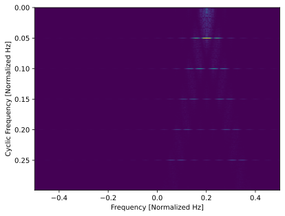
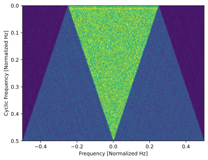

.. _freq-domain-chapter:

##########################
Cyclostationary Processing
##########################

.. raw:: html

 Co-authored by <a href="https://www.linkedin.com/in/samuel-brown-vt">Sam Brown</a>

In this chapter we introduce Cyclostationary signal processing (CSP), a relatively niche area of RF signal processing that is used to analyze or detect (often in very low SNR!) signals that exhibit cyclostationary properties, such as most modern digitial modulation schemes.  We cover the Cyclic Autocorrelation Function (CAF), Spectral Correlation Function (SCF), Spectral Coherence Function, conjugate versions of these functions, and efficient implementations using Python examples.

****************
Introduction
****************

Cyclostationary signal processing (a.k.a., CSP or simply cyclostationary processing) is a set of techniques for exploiting the cyclostationary property found in many real-world communication signals. These are signals such as modulated signals like AM/FM/TV broadcast, cellular, and WiFi as well as radar signals, and other signals that exhibit periodicity in their statistics. A large swath of traditional signal processing techniques are based on the assumption that the signal is stationary, i.e., the statistics of the signal like the mean, variance and higher-order moments do not change over time. However, many real-world signals are cyclostationary, i.e., the statistics of the signal change *periodically* over time. CSP techniques exploit this cyclostationary property, and can be used to detect the presence of signals in noise, perform modulation recognition, and separate signals that are overlapping in both time and frequency.

Talk about how for single carrier signals its really just an autocorrelation with an extra shift, and at the right shift the main lobe of each pulse will line up with the sidelobe of the same pulse.  And for OFDM it is the same thing but with the cyclic prefix added on to each symbol.  Explanations of CSP in textbooks and other resources tend to be very math-heavy, but we will try to keep things as simple as possible.

************************************************
The Cyclic Autocorrelation Function (CAF)
************************************************

A good place to start understanding CSP is the cyclic autocorrelation function (CAF). The CAF is an extension of the traditional autocorrelation function to cyclostationary signals. As a refresher, the autocorrelation of a random process is the expected product of two time instants of the process and is defined as: :math:`R_x(t_1, t_2) = E[x(t_1)x^*(t_2)]`. Intuitively, it represents the degree to which a signal exhibits repetitive behavior. This can alternatively be written as :math:`R_x(t, \tau) = E[x(t+\tau/2)x^*(t-\tau/2)]` where :math:`\tau` is the delay between the two signals and :math:`t` is the midpoint. Some signals exhibit the property where their autocorrelation does not depend upon the midpoint :math:`t` and only on the delay :math:`\tau`. These signals are stationary of order 2 or just stationary. For cyclostationary signals, however, the midpoint does matter, meaning that the autocorrelation depends on both the delay and the midpoint, a function of two lag parameters.

Cyclostationary signals possess a periodic or almost periodic autocorrelation, and the CAF is the set of Fourier series coefficients that describe this periodicity. In other words, the CAF is the amplitude and phase of the harmonics present in a signal's autocorrelation, giving it the following form: 

.. math::
    R_x(\tau, \alpha) = \lim_{T\rightarrow\infty} \frac{1}{T} \int_{-T/2}^{T/2} x(t + \tau/2)x^*(t - \tau/2)e^{-j2\pi \alpha t}dt.

It can be seen that the CAF is a function of two variables, the delay :math:`\tau` (tau) and the cycle frequency :math:`\alpha`. Cycle frequencies in CSP represent the rates at which a signals' statistics change which, in the case of the CAF, is the second-order moment or variance. Therefore, cycle frequencies often correspond to prominent periodic behavior such as modulated symbols in communications signals. We will see how the symbol rate and its integer multiples (harmonics) manifest as cycle frequencies in the CAF.

In Python, the CAF at a given alpha and tau value can be computed using the following code snippet (we'll fill out the surrounding code shortly):

.. code-block:: python
 
 np.sum(np.roll(samples, -1*tau//2) *
        np.conj(np.roll(samples, tau//2)) *
        np.exp(-2j * np.pi * alpha * np.arange(len(samples))))

In order to play with the CAF, we first need to simulate an example signal. For now we will use a rectangular BPSK signal (i.e., BPSK without pulse-shaping applied) with 20 samples per symbol, added to some AWGN.  We will apply a frequency offset to the BPSK signal, so that later we can show off how cyclostationary processing can be used to estimate the frequency offset as well as the cyclic frequency.  The following code snippet simulates the IQ samples we will use for the remainder of the next two sections:

.. code-block:: python

 N = 100000 # number of samples to simulate
 f_offset = 0.2 # Hz normalized
 sps = 20 # cyclic freq (alpha) will be 1/sps or 0.05 Hz normalized
 
 symbols = np.random.randint(0, 2, int(np.ceil(N/sps))) * 2 - 1 # random 1's and -1's
 bpsk = np.repeat(symbols, sps)  # repeat each symbol sps times to make rectangular BPSK
 bpsk = bpsk[:N]  # clip off the extra samples
 bpsk = bpsk * np.exp(2j * np.pi * f_offset * np.arange(N)) # Freq shift up the BPSK, this is also what makes it complex
 noise = np.random.randn(N) + 1j*np.random.randn(N) # complex white Gaussian noise
 samples = bpsk + 0.1*noise  # add noise to the signal

Just for fun let's look at the power spectral density (FFT) of the signal itself, *before* any CSP is performed:

.. image:: ../_images/psd_of_bpsk_used_for_caf.svg
   :align: center 
   :target: ../_images/psd_of_bpsk_used_for_caf.svg
   :alt: PSD of BPSK used for CAF

It has the 0.2 Hz frequency shift that we applied, and the samples per symbol of 20 leads to a fairly narrow signal.  Because we did not apply pulse shaping, the signal tapers off very slowly in frequency.

Now we will compute the CAF at the correct alpha, and over a range of tau values (we'll use tau from -100 to +100 as a starting point).  The correct alpha in our case is simply the samples per symbol inverted, or 0.05 Hz.  Keep in mind we are using normalized Hz, which essentially means our sample rate is 1 and all our frequencies will be between -0.5 and +0.5 Hz.  To generate the CAF in Python, we will loop over tau:

.. code-block:: python

 correct_alpha = 1/sps
 taus = np.arange(-100, 100)
 CAF = np.zeros(len(taus), dtype=complex)
 for i in range(len(taus)):
     CAF[i] = np.sum(np.roll(samples, -1*taus[i]//2) *
                     np.conj(np.roll(samples, taus[i]//2)) *
                     np.exp(-2j * np.pi * correct_alpha * np.arange(N)))

Let's plot the real part of :code:`CAF` using :code:`plt.plot(taus, np.real(CAF))`:

.. image:: ../_images/caf_at_correct_alpha.svg
   :align: center 
   :target: ../_images/caf_at_correct_alpha.svg
   :alt: CAF at correct alpha

It looks a little funky, but keep in mind that tau is still in the time domain, and the pattern we see above will make more sense after we study the SCF in the next section.

One thing we can do is calculate the CAF over a range of alphas, and at each alpha we can find the power in the CAF, by taking its magnitude and taking either the sum or average (doesn't make a difference in this case).  Then if we plot these powers over alpha, we should see spikes at the cyclic frequencies within our signal.  The following code adds the for loop, and uses an alpha step size of 0.005 Hz (note that this will take a long time to run!):

.. code-block:: python

 alphas = np.arange(0, 0.5, 0.005)
 CAF = np.zeros((len(alphas), len(taus)), dtype=complex)
 for j in range(len(alphas)):
     for i in range(len(taus)):
         CAF[j, i] = np.sum(np.roll(samples, -1*taus[i]//2) *
                         np.conj(np.roll(samples, taus[i]//2)) *
                         np.exp(-2j * np.pi * alphas[j] * np.arange(N)))
 plt.plot(alphas, np.average(np.abs(CAF), axis=1))
 plt.xlabel('Alpha')
 plt.ylabel('CAF Power')

.. image:: ../_images/caf_avg_over_alpha.svg
   :align: center 
   :target: ../_images/caf_avg_over_alpha.svg
   :alt: CAF average over alpha

Not only do we see the expected spike at 0.05 Hz, but we also see a spike at integer multiples of 0.05 Hz.  This is because the CAF is a Fourier series, and the harmonics of the fundamental frequency are present in the CAF, especially when we are looking at PSK/QAM signals without pulse shaping.

While the CAF is interesting, it is really just an intermediate step to reach our end-goal; the Spectral Correlation Function (SCF), which we will discuss next.

* Talk about the averaging the SCF over frequency

************************************************
The Spectral Correlation Function (SCF)
************************************************

Just as the CAF shows us the periodicity in the autocorrelation of a signal, the SCF shows us the periodicity in the power spectral density (PSD) of a signal. The autocorrelation and the PSD are in fact a Fourier Transform pair, and it therefore it should not come as a surprise that the CAF and the SCF are also a Fourier Transform pair.

* Discuss the Cyclic Wiener Relationship (says that the CAF and the SCF are Fourier transforms of each other)
* Discuss generalization of the power spectral density
* Frequency smoothing and time smoothing methods
* Include some illustrations of the SCF for simple cyclostationary signals like BPSK and QPSK with rect and SRRC pulse shapes

First let's look at the SCF at the correct alpha (0.05 Hz) for our rectangular BPSK signal.  All we need to do is take the FFT of the CAF and plot the magnitude.  The following code snippet goes along with the CAF code we wrote earlier when computing just one alpha:

.. code-block:: python

 f = np.linspace(-0.5, 0.5, len(taus))
 SCF = np.fft.fftshift(np.fft.fft(CAF))
 plt.plot(f, np.abs(SCF))
 plt.xlabel('Frequency')
 plt.ylabel('SCF')

.. image:: ../_images/fft_of_caf.svg
   :align: center 
   :target: ../_images/fft_of_caf.svg
   :alt: FFT of CAF

Note that we can see the 0.2 Hz frequency offset that we applied when simulating the BPSK signal (this has nothing to do with the cyclic frequency or samples per symbol). 

Below is an interactive JavaScript app that implements an SCF, so that you can play around with different signal and SCF parameters.  The frequency of the signal is a fairly straightforward knob, and shows how well the SCF can identify RF frequency.  Try adding pulse shaping by unchecking the Rectangular Pulse option, and play around with different rolloff values.  Note that using the default alpha-step, not all samples per symbols will lead to a visible spike in the SCF.  You can try lowering alpha-step, although it will increase the processing time. 

.. raw:: html

    <form id="mainform" name="mainform">
        <label>Samples to Simulate </label>
        <select id="N">
            <option value="1024">1024</option>
            <option value="2048">2048</option>
            <option value="4096">4096</option>
            <option value="8192" selected="selected">8192</option>
            <option value="16384">16384</option>
            <option value="32768">32768</option>
            <option value="65536">65536</option>
            <option value="131072">131072</option>
            <option value="262144">262144</option>
        </select>
         
        <label>Frequency [normalized Hz] </label>
        <input type="range" id="freq" value="0.2" min="-0.5" max="0.5" step="0.05">
        0.2
         
        <label>Samples per Symbol [int] </label>
        <input type="range" id="sps" value="20" min="4" max="30" step="1">
        20
         
        <label>RC Rolloff [0 to 1] </label>
        <input type="number" id="rolloff" value="0.5" min="0" max="1" step="0.0001">
        <label>Rectangular Pulses </label>
        <input type="checkbox" id="rect" checked>
         
        <label>Alpha Start </label>
        <input type="number" id="alpha_start" value="0" min="0" max="100" step="0.0001">
         
        <label>Alpha Stop </label>
        <input type="number" id="alpha_stop" value="0.3" min="0" max="1" step="0.0001">
         
        <label>Alpha Step </label>
        <input type="number" id="alpha_step" value="0.001" min="0.0001" max="0.1" step="0.0001">
         
        <label>Noise Level </label>
        <input type="number" id="noise" value="0.001" min="0" max="10" step="0.0001">
         
        <button type="submit" id="submit_button">Submit</button>
    </form>
    <form id="resetform" name="resetform">
        <button type="submit" id="submit_button">Reset</button>
    </form>
    <canvas id="scf_canvas"></canvas>
    
    </body>

********************************
Frequency Smoothing Method (FSM)
********************************

the number of samples ends up determining your freq domain resolution

talk about how window length impacts things, since it doesnt really change the resolution, just the window size used in the convolve

point out how even though there is only 1 FFT, you still need to do a ton of convolves

* Discuss the difference between the periodagram and the PSD, paraphrase blog

.. code-block:: python

    alphas = np.arange(0, 0.3, 0.001)
    Nw = 256 # window length
    N = len(samples) # signal length
    window = np.hanning(Nw)

    X = np.fft.fftshift(np.fft.fft(samples)) # FFT of entire signal
    
    num_freqs = int(np.ceil(N/Nw)) # freq resolution after decimation
    SCF = np.zeros((len(alphas), num_freqs), dtype=complex)
    for i in range(len(alphas)):
        shift = int(alphas[i] * N/2)
        SCF_slice = np.roll(X, -shift) * np.conj(np.roll(X, shift))
        SCF[i, :] = np.convolve(SCF_slice, window, mode='same')[::Nw] # apply window and decimate by Nw
    SCF = np.abs(SCF)
    SCF[0, :] = 0 # null out alpha=0 which is just the PSD of the signal, it throws off the dynamic range

    extent = (-0.5, 0.5, float(np.max(alphas)), float(np.min(alphas)))
    plt.imshow(SCF, aspect='auto', extent=extent, vmax=np.max(SCF)/2)
    plt.xlabel('Frequency [Normalized Hz]')
    plt.ylabel('Cyclic Frequency [Normalized Hz]')
    plt.show()

.. image:: ../_images/scf_freq_smoothing.svg
   :align: center 
   :target: ../_images/scf_freq_smoothing.svg
   :alt: SCF with the Frequency Smoothing Method (FSM), showing cyclostationary signal processing

External Resources on FSM:

* asdasd

***************************
Time Smoothing Method (TSM)
***************************

talk about the importance of the window length because it determines the resolution

note the addition of an overlap parameter

point out that the javascript app in the SCF section actually uses the TSM method, with 0 overlap for speed sake

* Talk about how the averaging happens by splitting up the time domain signal and recombining

.. code-block:: python

    alphas = np.arange(0, 0.3, 0.001)
    Nw = 256 # window length
    N = len(samples) # signal length
    Noverlap = int(2/3*Nw) # block overlap
    num_windows = int((N - Noverlap) / (Nw - Noverlap)) # Number of windows
    window = np.hanning(Nw)

    SCF = np.zeros((len(alphas), Nw), dtype=complex)
    for ii in range(len(alphas)): # Loop over cyclic frequencies
        neg = samples * np.exp(-1j*np.pi*alphas[ii]*np.arange(N))
        pos = samples * np.exp( 1j*np.pi*alphas[ii]*np.arange(N))
        for i in range(num_windows):
            pos_slice = window * pos[i*(Nw-Noverlap):i*(Nw-Noverlap)+Nw]
            neg_slice = window * neg[i*(Nw-Noverlap):i*(Nw-Noverlap)+Nw]
            SCF[ii, :] += np.fft.fft(neg_slice) * np.conj(np.fft.fft(pos_slice)) # Cross Cyclic Power Spectrum
    SCF = np.fft.fftshift(SCF, axes=1) # shift the RF freq axis
    SCF = np.abs(SCF)
    SCF[0, :] = 0 # null out alpha=0 which is just the PSD of the signal, it throws off the dynamic range

    extent = (-0.5, 0.5, float(np.max(alphas)), float(np.min(alphas)))
    plt.imshow(SCF, aspect='auto', extent=extent, vmax=np.max(SCF)/2)
    plt.xlabel('Frequency [Normalized Hz]')
    plt.ylabel('Cyclic Frequency [Normalized Hz]')
    plt.show()

Looks the same as the FSM!

External Resources on TSM:

* asdasd

********************************
Pulse-Shaped BPSK
********************************

********************************
SNR and Number of Symbols
********************************

********************************
QPSK and Higher-Order Modulation
********************************

* Mention higher-order cyclic moments and cummulants

********************************
OFDM
********************************

Cyclostationarity is especially strong in OFDM signals due to OFDM's use of a cyclic prefix (CP), which is where the last several samples of each OFDM symbol is copied and added to the beginning of the OFDM symbol.  This leads to a strong cyclic frequency corresponding to the OFDM symbol length (which is equal to the inverse of the subcarrier spacing, plus CP duration). 

Simulation of OFDM with a CP using 64 subcarriers, 25% CP, and QPSK modulation.  We'll interpolate by 2x to simulate receiving at a reasonable sample rate, so that means the OFDM symbol length in number of samples will be (64 + (64*0.25)) * 2 = 160 samples.  That means we should get spikes at alphas that are an integer multiple of 1/160, or 0.00625, 0.0125, 0.01875, etc. We will simulate 100k samples which corresponds to 625 OFDM symbols (recall that each OFDM symbol is fairly long).  

.. code-block:: python

    from scipy.signal import resample
    N = 100000 # number of samples to simulate
    num_subcarriers = 64
    cp_len = num_subcarriers // 4 # length of the cyclic prefix in symbols, in this case 25% of the starting OFDM symbol
    print("CP length in samples", cp_len*2) # remember there is 2x interpolation at the end
    print("OFDM symbol length in samples", (num_subcarriers+cp_len)*2) # remember there is 2x interpolation at the end
    num_symbols = int(np.floor(N/(num_subcarriers+cp_len))) // 2 # remember the interpolate by 2
    print("Number of OFDM symbols:", num_symbols)

    qpsk_mapping = {
        (0,0) : 1+1j,
        (0,1) : 1-1j,
        (1,0) : -1+1j,
        (1,1) : -1-1j,
    }
    bits_per_symbol = 2

    samples = np.empty(0, dtype=np.complex64)
    for _ in range(num_symbols):
        data = np.random.binomial(1, 0.5, num_subcarriers*bits_per_symbol) # 1's and 0's
        data = data.reshape((num_subcarriers, bits_per_symbol)) # group into subcarriers
        symbol_freq = np.array([qpsk_mapping[tuple(b)] for b in data]) # remember we start in the freq domain with OFDM
        symbol_time = np.fft.ifft(symbol_freq)
        symbol_time = np.hstack([symbol_time[-cp_len:], symbol_time]) # take the last CP samples and stick them at the start of the symbol
        samples = np.concatenate((samples, symbol_time)) # add symbol to samples buffer

    samples = resample(samples, len(samples)*2) # interpolate by 2x
    samples = samples[:N] # clip off the few extra samples

    # Add noise
    SNR_dB = 5
    n = np.sqrt(np.var(samples) * 10**(-SNR_dB/10) / 2) * (np.random.randn(N) + 1j*np.random.randn(N))
    samples = samples + n

Using the FSM to calculate the SCF at a relatively high cyclic resolution of 0.0001:

Note the horizontal line torwards the top, indicating there is a low cyclic frequency.  Zooming into the lower cyclic frequencies, we can clearly see the cyclic frequency corresponding to the OFDM symbol length (alpha = 0.0125).  Not sure why we only get a spike at 2x, and not 1x or 3x or 4x...  Even dropping the resolution by another 10x doesn't show anything else besides the 2x.

.. image:: ../_images/scf_freq_smoothing_ofdm_zoomed_in.svg
   :align: center 
   :target: ../_images/scf_freq_smoothing_ofdm_zoomed_in.svg
   :alt: SCF of OFDM using the Frequency Smoothing Method (FSM) zoomed into the lower cyclic freqs

********************************
Multiple Overlapping Signals
********************************

********************************
Spectral Coherence Function
********************************

The coherence version of the SCF, sometimes refered to as COH, is simply a normalized version of the SCF

External Resources on COH:

* asdasd

********************************
Conjugates
********************************

External Resources on Conjugate CSP:

* BPSK vs QPSK

********************************
FFT Accumulation Method (FAM)
********************************

The FSM and TSM techniques presented earlier work great, especially when you want to calculate a specific set of cyclic frequencies (note how both implementations involve looping over cyclic frequency as the outer loop). However, there is an even more efficient SCF implementation known as the FFT Accumulation Method (FAM), which inherently calculates the full set of cyclic frequencies (i.e., the cyclic frequencies corresponding to every integer shift of the signal, the number of which depend on signal length).  There is also a similar technique known as the `Strip Spectral Correlation Analyzer (SSCA) <https://cyclostationary.blog/2016/03/22/csp-estimators-the-strip-spectral-correlation-analyzer/>`_ which also calculates all cyclic frequencies at once.  These techniques that calculate all cyclic frequencies are sometimes refered to as blind estimators because they tend to be used when no prior knowledge of cyclic frequencies is known (otherwise, you would have a good idea of which cyclic frequencies to calculate and could use the FSM or TSM methods).

.. code-block:: python

    N = 2**14
    x = samples[0:N]
    Np = 512 # Number of input channels, should be power of 2
    L = Np//4 # Offset between points in the same column at consecutive rows in the same channelization matrix. It should be chosen to be less than or equal to Np/4
    num_windows = (len(x) - Np) // L + 1
    Pe = int(np.floor(int(np.log(num_windows)/np.log(2))))
    P = 2**Pe
    N = L*P

    # channelization
    xs = np.zeros((num_windows, Np), dtype=complex)
    for i in range(num_windows):
        xs[i,:] = x[i*L:i*L+Np]
    xs2 = xs[0:P,:]

    # windowing
    xw = xs2 * np.tile(np.hanning(Np), (P,1))

    # first FFT
    XF1 = np.fft.fftshift(np.fft.fft(xw))

    # freq shift down
    f = np.arange(Np)/float(Np) - 0.5
    f = np.tile(f, (P, 1))
    t = np.arange(P)*L
    t = t.reshape(-1,1) # make it a column vector
    t = np.tile(t, (1, Np))
    XD = XF1 * np.exp(-2j*np.pi*f*t)

    # main calcs
    SCF = np.zeros((2*N, Np))
    Mp = N//Np//2
    for k in range(Np):
        for l in range(Np):
            XF2 = np.fft.fftshift(np.fft.fft(XD[:,k]*np.conj(XD[:,l]))) # second FFT
            i = (k + l) // 2
            a = int(((k - l) / Np + 1) * N)
            SCF[a-Mp:a+Mp, i] = np.abs(XF2[(P//2-Mp):(P//2+Mp)])**2

.. image:: ../_images/scf_fam.svg
   :align: center 
   :target: ../_images/scf_fam.svg
   :alt: SCF with the FFT Accumulation Method (FAM), showing cyclostationary signal processing

Let's zoom into the interesting part around 0.2 Hz and the low cyclic frequencies, to see more detail:

There is a clear hot spot at 0.05 Hz, and a low one at 0.1 Hz that may be tough to see with this colorscale.

We can also squash the RF frequency axis and plot the SCF in 1D, in order to more easily see which cyclic frequencies are present:

.. image:: ../_images/scf_fam_1d.svg
   :align: center 
   :target: ../_images/scf_fam_1d.svg
   :alt: Cyclic freq plot using the FFT Accumulation Method (FAM), showing cyclostationary signal processing

External Resources on FAM:

* R.S. Roberts, W. A. Brown, and H. H. Loomis, Jr., "Computationally Efficient Algorithms for Cyclic Spectral Analysis," IEEE Signal Processing Magazine, April 1991, pp. 38-49. `Available here <https://www.researchgate.net/profile/Faxin-Zhang-2/publication/353071530_Computationally_efficient_algorithms_for_cyclic_spectral_analysis/links/60e69d2d30e8e50c01eb9484/Computationally-efficient-algorithms-for-cyclic-spectral-analysis.pdf>`_
* Da Costa, Evandro Luiz. Detection and identification of cyclostationary signals. Diss. Naval Postgraduate School, 1996. `Available here <https://apps.dtic.mil/sti/pdfs/ADA311555.pdf>`_
* Chad's blog post on FAM: https://cyclostationary.blog/2018/06/01/csp-estimators-the-fft-accumulation-method/

********************************
Signal Detection with known cyclic frequency
********************************

* Talk about the Tau

********************************
Cyclic Filtering
********************************