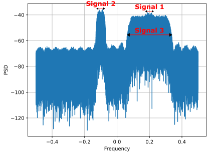

.. _freq-domain-chapter:

##########################
Cyclostationary Processing
##########################

.. raw:: html

 Co-authored by <a href="https://www.linkedin.com/in/samuel-brown-vt">Sam Brown</a>

In this chapter we demystify cyclostationary signal processing (a.k.a. CSP), a relatively niche area of RF signal processing that is used to analyze or detect (often in very low SNR!) signals that exhibit cyclostationary properties, such as most modern digital modulation schemes.  We cover the Cyclic Autocorrelation Function (CAF), Spectral Correlation Function (SCF), Spectral Coherence Function (COH), conjugate versions of these functions, and how they can be applied.  This chapter includes several full Python implementations, with examples that involve BPSK, QPSK, OFDM, and multiple combined signals.

****************
Introduction
****************

Cyclostationary signal processing (a.k.a., CSP or simply cyclostationary processing) is a set of techniques for exploiting the cyclostationary property found in many real-world communication signals. These are signals such as modulated signals like AM/FM/TV broadcast, cellular, and WiFi as well as radar signals, and other signals that exhibit periodicity in their statistics. A large swath of traditional signal processing techniques are based on the assumption that the signal is stationary, i.e., the statistics of the signal like the mean, variance and higher-order moments do not change over time. However, most real-world RF signals are cyclostationary, i.e., the statistics of the signal change *periodically* over time. CSP techniques exploit this cyclostationary property, and can be used to detect the presence of signals in noise, perform modulation recognition, and separate signals that are overlapping in both time and frequency.

If after reading through this chapter and playing around in Python, you want to dive deeper into CSP, check out William Gardner's 1994 textbook `Cyclostationarity in Communications and Signal Processing <https://faculty.engineering.ucdavis.edu/gardner/wp-content/uploads/sites/146/2014/05/Cyclostationarity.pdf>`_, his 1987 textbook `Statistical Spectral Analysis <https://faculty.engineering.ucdavis.edu/gardner/wp-content/uploads/sites/146/2013/02/Statistical_Spectral_Analysis_A_Nonprobabilistic_Theory.pdf>`_, or Chad Spooner's `collection of blog posts <https://cyclostationary.blog/>`_.

One resource that you will find here and in no other textbook: at the end of the SCF chapter you will be rewarded with an interactive JavaScript app that allows you to play around with the SCF of an example signal, to see how the SCF changes with different signal and SCF parameters, all in your browser!  While these interactive demos are free for everyone, they are largely made possible by the support of PySDR's `Patreon <https://www.patreon.com/PySDR>`_ members.

*************************
Review of Autocorrelation
*************************

Even if you think you're familiar with the autocorrelation function, it is worth taking a moment to review it, because it is the foundation of CSP. The autocorrelation function is a measure of the similarity (a.k.a., correlation) between a signal and the time-shifted version of itself.  Intuitively, it represents the degree to which a signal exhibits repetitive behavior.  The autocorrelation of signal :math:`x(t)` is defined as:

.. math::
    R_x(\tau) = E[x(t)x^*(t-\tau)]

where :math:`E` is the expectation operator, :math:`\tau` is the time delay,  and :math:`*` is the complex conjugate symbol.  In discrete time, with a limited number of samples, which is what we care about, this becomes:

.. math::
    R_x(\tau) = \frac{1}{N} \sum_{n=-N/2}^{N/2} x\left[ n+\frac{\tau}{2} \right] x^*\left[ n-\frac{\tau}{2} \right]

where :math:`N` is the number of samples in the signal.  

If the signal is periodic in some way, such as a QPSK signal's repeating symbol shape, then the autocorrelation evaluated over a range of tau will also be periodic.  For example, if a QPSK signal has 8 samples per symbol, then when tau is an integer multiple of 8, there will be a much stronger "measure of the similarity" than other values of tau.  The period of the autocorrelation is what we will ultimately be detecting as part of CSP techniques.

************************************************
The Cyclic Autocorrelation Function (CAF)
************************************************

As discussed in the previous section, we want to find out when there is periodicity in our autocorrelation.  Recall the Fourier transform equation, where if we want to test how strong a certain frequency :math:`f` exists within some arbitrary signal :math:`x(t)`, we can do so with:

.. math::
    X(f) = \int x(t) e^{-j2\pi ft} dt

So if we want to find periodicity in our autocorrelation, we simply calculate: 

.. math::
    R_x(\tau, \alpha) = \lim_{T\rightarrow\infty} \frac{1}{T} \int_{-T/2}^{T/2} x(t + \tau/2)x^*(t - \tau/2)e^{-j2\pi \alpha t}dt.

or in discrete time:

.. math::
    R_x(\tau, \alpha) = \frac{1}{N} \sum_{n=-N/2}^{N/2} x\left[ n+\frac{\tau}{2} \right] x^*\left[ n-\frac{\tau}{2} \right] e^{-j2\pi \alpha n}

which tests how strong frequency :math:`\alpha` is.  We call the above equation the Cyclic Autocorrelation Function (CAF).  Another way to think about the CAF is as a set of Fourier series coefficients that describe this periodicity. In other words, the CAF is the amplitude and phase of the harmonics present in a signal's autocorrelation.  We use the term "cyclostationary" to refer to signals that possess a periodic or almost periodic autocorrelation.  The CAF is an extension of the traditional autocorrelation function to cyclostationary signals.

It can be seen that the CAF is a function of two variables, the delay :math:`\tau` (tau) and the cycle frequency :math:`\alpha`. Cycle frequencies in CSP represent the rates at which a signals' statistics change, which in the case of the CAF, is the second-order moment or variance. Therefore, cycle frequencies often correspond to prominent periodic behavior such as modulated symbols in communications signals. We will see how the symbol rate of a BPSK signal and its integer multiples (harmonics) manifest as cycle frequencies in the CAF.

In Python, the CAF of baseband signal :code:`samples` at a given :code:`alpha` and :code:`tau` value can be computed using the following code snippet (we'll fill out the surrounding code shortly):

.. code-block:: python
 
 CAF = np.sum(samples *
              np.conj(np.roll(samples, tau)) *
              np.exp(-2j * np.pi * alpha * np.arange(N)))

We use :code:`np.roll()` to shift one of the sets of samples by tau, because you have to shift by an integer number of samples, so if we shifted both sets of samples in opposite directions we would skip every other shift.

In order to play with the CAF in Python, we first need to simulate an example signal. For now we will use a rectangular BPSK signal (i.e., BPSK without pulse-shaping applied) with 20 samples per symbol, added to some white Gaussian noise (AWGN).  We will apply a frequency offset to the BPSK signal, so that later we can show off how cyclostationary processing can be used to estimate the frequency offset as well as the cyclic frequency.  This frequency offset is equivalent to your radio receiving a signal while not perfectly centered on it; either a little off or way off (but not too much to cause the signal to extend past the sampled bandwidth).

The following code snippet simulates the IQ samples we will use for the remainder of the next two sections:

.. code-block:: python

 N = 100000 # number of samples to simulate
 f_offset = 0.2 # Hz normalized
 sps = 20 # cyclic freq (alpha) will be 1/sps or 0.05 Hz normalized
 
 symbols = np.random.randint(0, 2, int(np.ceil(N/sps))) * 2 - 1 # random 1's and -1's
 bpsk = np.repeat(symbols, sps)  # repeat each symbol sps times to make rectangular BPSK
 bpsk = bpsk[:N]  # clip off the extra samples
 bpsk = bpsk * np.exp(2j * np.pi * f_offset * np.arange(N)) # Freq shift up the BPSK, this is also what makes it complex
 noise = np.random.randn(N) + 1j*np.random.randn(N) # complex white Gaussian noise
 samples = bpsk + 0.1*noise  # add noise to the signal

Because the absolute sample rate and symbol rate doesn't really matter anywhere in this chapter, we will use normalized frequency, which is effectively the same as saying our sample rate = 1 Hz.  This means the signal must be between -0.5 to +0.5 Hz.  Regardless, you *won't* see the variable :code:`sample_rate` show up in any of the code snippets, on purpose, instead we will work with samples per symbol (:code:`sps`).

Just for fun, let's look at the power spectral density (i.e., FFT) of the signal itself, *before* any CSP is performed:

It has the 0.2 Hz frequency shift that we applied, and the samples per symbol of 20 leads to a fairly narrow signal, but because we did not apply pulse shaping, the signal tapers off very slowly in frequency.

Now we will compute the CAF at the correct alpha, and over a range of tau values (we'll use tau from -100 to +100 as a starting point).  The correct alpha in our case is simply the samples per symbol inverted, or 1/20 = 0.05 Hz.  To generate the CAF in Python, we will loop over tau:

.. code-block:: python

    correct_alpha = 1/sps # equates to 0.05 Hz
    taus = np.arange(-100, 101) # -100 to +100 in steps of 1
    CAF = np.zeros(len(taus), dtype=complex)
    for i in range(len(taus)):
        CAF[i] = np.sum(samples *
                        np.conj(np.roll(samples, taus[i])) *
                        np.exp(-2j * np.pi * correct_alpha * np.arange(N)))

Let's plot the real part of :code:`CAF` using :code:`plt.plot(taus, np.real(CAF))`:

It looks a little funny, but keep in mind that tau represents the time domain, and the important part is that there is a lot of energy in the CAF at this alpha, because it's the alpha corresponding to a cyclic frequency within our signal.  To prove this, let's look at the CAF at an incorrect alpha, say 0.08 Hz:

.. image:: ../_images/caf_at_incorrect_alpha.svg
   :align: center 
   :target: ../_images/caf_at_incorrect_alpha.svg
   :alt: CAF at incorrect alpha

Note the y-axis, there is way less energy in the CAF this time.  The specific patterns we see above are less important at the moment, and will make more sense after we study the SCF in the next section.

One thing we can do is calculate the CAF over a range of alphas, and at each alpha we can find the power in the CAF, by taking its magnitude and taking either the sum or average (doesn't make a difference in this case).  Then if we plot these powers over alpha, we should see spikes at the cyclic frequencies within our signal.  The following code adds a :code:`for` loop, and uses an alpha step size of 0.005 Hz (note that this will take a long time to run!):

.. code-block:: python

    alphas = np.arange(0, 0.5, 0.005)
    CAF = np.zeros((len(alphas), len(taus)), dtype=complex)
    for j in range(len(alphas)):
        for i in range(len(taus)):
            CAF[j, i] = np.sum(samples *
                        np.conj(np.roll(samples, taus[i])) *
                        np.exp(-2j * np.pi * alphas[j] * np.arange(N)))
    CAF_magnitudes = np.average(np.abs(CAF), axis=1) # at each alpha, calc power in the CAF
    plt.plot(alphas, CAF_magnitudes)
    plt.xlabel('Alpha')
    plt.ylabel('CAF Power')

.. image:: ../_images/caf_avg_over_alpha.svg
   :align: center 
   :target: ../_images/caf_avg_over_alpha.svg
   :alt: CAF average over alpha

Not only do we see the expected spike at 0.05 Hz, but we also see a spike at integer multiples of 0.05 Hz.  This is because the CAF is a Fourier series, and the harmonics of the fundamental frequency are present in the CAF, especially when we are looking at PSK/QAM signals without pulse shaping.  The energy at alpha = 0 is the total power in the power spectral density (PSD) of the signal, although we will typically null it out because 1) we often plot the PSD on its own and 2) it will throw off the dynamic range of our colormap when we start plotting 2D data with a colormap.

While the CAF is interesting, we often want to view cyclic frequency *over RF frequency*, instead of just cyclic frequency on its own like we see above.  This leads us to the Spectral Correlation Function (SCF), which we will discuss next.

************************************************
The Spectral Correlation Function (SCF)
************************************************

Just as the CAF shows us the periodicity in the autocorrelation of a signal, the SCF shows us the periodicity in the PSD of a signal. The autocorrelation and the PSD are in fact a Fourier transform pair, and therefore it should not come as a surprise that the CAF and the SCF are also a Fourier Transform pair. This relationship is known as the *Cyclic Wiener Relationship*. This fact should make even more sense when one considers that the CAF and SCF evaluated at a cycle frequency of :math:`\alpha=0` are the autocorrelation and PSD, respectively.

One can simply take the Fourier transform of the CAF to obtain the SCF.  Returning to our 20 sample-per-symbol BPSK signal, let's look at the SCF at the correct alpha (0.05 Hz). All we need to do is take the FFT of the CAF and plot the magnitude. The following code snippet goes along with the CAF code we wrote earlier when computing just one alpha:

.. code-block:: python

 f = np.linspace(-0.5, 0.5, len(taus))
 SCF = np.fft.fftshift(np.fft.fft(CAF))
 plt.plot(f, np.abs(SCF))
 plt.xlabel('Frequency')
 plt.ylabel('SCF')

.. image:: ../_images/fft_of_caf.svg
   :align: center 
   :target: ../_images/fft_of_caf.svg
   :alt: FFT of CAF

Note that we can see the 0.2 Hz frequency offset that we applied when simulating the BPSK signal (this has nothing to do with the cyclic frequency or samples per symbol).  This is why the CAF looked sinusoidal in the tau domain; it was primarily the RF frequency which in our example was relatively high.

Unfortunately, doing this for thousands or millions of alphas is extremely computationally intensive.  The other downside of just taking the FFT of the CAF is it does not involve any averaging. Efficient/practical computing of the SCF usually involves some form of averaging; either time-based or frequency-based, as we will discuss in the next two sections.

Below is an interactive JavaScript app that implements an SCF, so that you can play around with different signal and SCF parameters to build your intuition.  The frequency of the signal is a fairly straightforward knob, and shows how well the SCF can identify RF frequency.  Try adding pulse shaping by unchecking the Rectangular Pulse option, and play around with different roll-off values.  Note that using the default alpha-step, not all samples per symbols will lead to a visible spike in the SCF.  You can try lowering alpha-step, although it will increase the processing time. 

.. raw:: html

    <form id="mainform" name="mainform">
        <label>Samples to Simulate </label>
        <select id="N">
            <option value="1024">1024</option>
            <option value="2048">2048</option>
            <option value="4096">4096</option>
            <option value="8192" selected="selected">8192</option>
            <option value="16384">16384</option>
            <option value="32768">32768</option>
            <option value="65536">65536</option>
            <option value="131072">131072</option>
            <option value="262144">262144</option>
        </select>
         
        <label>Frequency [normalized Hz] </label>
        <input type="range" id="freq" value="0.2" min="-0.5" max="0.5" step="0.05">
        0.2
         
        <label>Samples per Symbol [int] </label>
        <input type="range" id="sps" value="20" min="4" max="30" step="1">
        20
         
        <label>RC Rolloff [0 to 1] </label>
        <input type="number" id="rolloff" value="0.5" min="0" max="1" step="0.0001">
        <label>Rectangular Pulses </label>
        <input type="checkbox" id="rect" checked>
         
        <label>Alpha Start </label>
        <input type="number" id="alpha_start" value="0" min="0" max="100" step="0.0001">
         
        <label>Alpha Stop </label>
        <input type="number" id="alpha_stop" value="0.3" min="0" max="1" step="0.0001">
         
        <label>Alpha Step </label>
        <input type="number" id="alpha_step" value="0.001" min="0.0001" max="0.1" step="0.0001">
         
        <label>Noise Level </label>
        <input type="number" id="noise" value="0.001" min="0" max="10" step="0.0001">
         
        <button type="submit" id="submit_button">Submit</button>
    </form>
    <form id="resetform" name="resetform">
        <button type="submit" id="submit_button">Reset</button>
    </form>
    <canvas id="scf_canvas"></canvas>
    
    </body>

********************************
Frequency Smoothing Method (FSM)
********************************

Nowassadsdasd that we have a good conceptual understanding of the SCF, let's look at how we can compute it efficiently.  First, consider the periodogram which is simply the squared magnitude of the Fourier transform of a signal:

.. math::

 I(u,f) = \frac{1}{N}\left|X(u,f)\right|^2
 
We can obtain the cyclic periodogram through the product of two Fourier transforms shifted in frequency:

.. math::

 I(u,f,\alpha) = \frac{1}{N}X(u,f + \alpha/2) X^*(u,f - \alpha/2)

Both of these represent estimates of the PSD and the SCF, but to obtain the true value of the SCF one must average over either time or frequency.  Averaging over time is known as the Time Smoothing Method (TSM):

.. math::
    S_X(f, \alpha) = \lim_{T\rightarrow\infty} \frac{1}{T} \lim_{U\rightarrow\infty} \frac{1}{U} \int_{-U/2}^{U/2} X(t,f + \alpha/2) X^*(t,f - \alpha/2) dt

while averaging over frequency is known as the Frequency Smoothing Method (FSM):

.. math::
    S_X(f, \alpha) = \lim_{\Delta\rightarrow 0} \lim_{T\rightarrow \infty} \frac{1}{T} g_{\Delta}(f) \otimes \left[X(t,f + \alpha/2) X^*(t,f - \alpha/2)\right]

where the function :math:`g_{\Delta}(f)` is a frequency smoothing function that averages over a small range of frequencies. 

Below is a minimal Python implementation of the FSM, which is a frequency-based averaging method for calculating the SCF of a signal.  First it computes the cyclic periodogram by multiplying two shifted versions of the FFT, and then each slice is filtered with a window function whose length determines the resolution of the resulting SCF estimate. So, longer windows will produce smoother results with lower resolution while shorter ones will do the opposite.

.. code-block:: python

    alphas = np.arange(0, 0.3, 0.001)
    Nw = 256 # window length
    N = len(samples) # signal length
    window = np.hanning(Nw)

    X = np.fft.fftshift(np.fft.fft(samples)) # FFT of entire signal
    
    num_freqs = int(np.ceil(N/Nw)) # freq resolution after decimation
    SCF = np.zeros((len(alphas), num_freqs), dtype=complex)
    for i in range(len(alphas)):
        shift = int(alphas[i] * N/2)
        SCF_slice = np.roll(X, -shift) * np.conj(np.roll(X, shift))
        SCF[i, :] = np.convolve(SCF_slice, window, mode='same')[::Nw] # apply window and decimate by Nw
    SCF = np.abs(SCF)
    SCF[0, :] = 0 # null out alpha=0 which is just the PSD of the signal, it throws off the dynamic range

    extent = (-0.5, 0.5, float(np.max(alphas)), float(np.min(alphas)))
    plt.imshow(SCF, aspect='auto', extent=extent, vmax=np.max(SCF)/2)
    plt.xlabel('Frequency [Normalized Hz]')
    plt.ylabel('Cyclic Frequency [Normalized Hz]')
    plt.show()

Let's calculate the SCF for the rectangular BPSK signal we used before, with 20 samples per symbol over a range of cyclic frequencies from 0 to 0.3 using a 0.001 step size:

.. image:: ../_images/scf_freq_smoothing.svg
   :align: center 
   :target: ../_images/scf_freq_smoothing.svg
   :alt: SCF with the Frequency Smoothing Method (FSM), showing cyclostationary signal processing

This method has the advantage that only one large FFT is required, but it also has the disadvantage that many convolution operations are required for the smoothing.  Note the decimation that occurs after the convolve using :code:`[::Nw]`; this is optional but highly recommended to reduce the number of pixels you'll ultimately need to display, and because of the way the SCF is calculated we're not "throwing away" information by decimating by :code:`Nw`.

***************************
Time Smoothing Method (TSM)
***************************

Next we will look at an implementation of the TSM in Python. The code snippet below divides the signal into *num_windows* blocks, each of length *Nw* with an overlap of *Noverlap*.  Note that the overlap functionality is not required, but tends to help make a nicer output.  The signal is then multiplied by a window function (in this case, Hanning, but it can be any window) and the FFT is taken. The SCF is then calculated by averaging the result from each block. The window length plays the same exact role as in the FSM determining the resolution/smoothness trade-off.

.. code-block:: python

    alphas = np.arange(0, 0.3, 0.001)
    Nw = 256 # window length
    N = len(samples) # signal length
    Noverlap = int(2/3*Nw) # block overlap
    num_windows = int((N - Noverlap) / (Nw - Noverlap)) # Number of windows
    window = np.hanning(Nw)

    SCF = np.zeros((len(alphas), Nw), dtype=complex)
    for ii in range(len(alphas)): # Loop over cyclic frequencies
        neg = samples * np.exp(-1j*np.pi*alphas[ii]*np.arange(N))
        pos = samples * np.exp( 1j*np.pi*alphas[ii]*np.arange(N))
        for i in range(num_windows):
            pos_slice = window * pos[i*(Nw-Noverlap):i*(Nw-Noverlap)+Nw]
            neg_slice = window * neg[i*(Nw-Noverlap):i*(Nw-Noverlap)+Nw]
            SCF[ii, :] += np.fft.fft(neg_slice) * np.conj(np.fft.fft(pos_slice)) # Cross Cyclic Power Spectrum
    SCF = np.fft.fftshift(SCF, axes=1) # shift the RF freq axis
    SCF = np.abs(SCF)
    SCF[0, :] = 0 # null out alpha=0 which is just the PSD of the signal, it throws off the dynamic range

    extent = (-0.5, 0.5, float(np.max(alphas)), float(np.min(alphas)))
    plt.imshow(SCF, aspect='auto', extent=extent, vmax=np.max(SCF)/2)
    plt.xlabel('Frequency [Normalized Hz]')
    plt.ylabel('Cyclic Frequency [Normalized Hz]')
    plt.show()

.. image:: ../_images/scf_time_smoothing.svg
   :align: center 
   :target: ../_images/scf_time_smoothing.svg
   :alt: SCF with the Time Smoothing Method (TSM), showing cyclostationary signal processing

Looks roughly the same as the FSM!

*****************
Pulse-Shaped BPSK
*****************

Up until this point, we have only investigated CSP of a *rectangular* BPSK signal.  However, in actual RF systems, we almost never see rectangular pulses, with the one exception being the BPSK chipping sequence within direct-sequence spread spectrum (DSSS) which tends to be approximately rectangular.  

Let's now look at a BPSK signal with a raised-cosine (RC) pulse shape, which is a common pulse shape used in digital communications, and is used to reduce the occupied bandwidth of the signal compared to rectangular BPSK.  As discussed in the :ref:`pulse-shaping-chapter` chapter, the RC pulse shape in the time domain is given by:

.. math::
 h(t) = \mathrm{sinc}\left( \frac{t}{T} \right) \frac{\cos\left(\frac{\pi\beta t}{T}\right)}{1 - \left( \frac{2 \beta t}{T}   \right)^2}

The :math:`\beta` parameter determines how quickly the filter tapers off in the time domain, which will be inversely proportional with how quickly it tapers off in frequency:

.. image:: ../_images/raised_cosine_freq.svg
   :align: center 
   :target: ../_images/raised_cosine_freq.svg
   :alt: The raised cosine filter in the frequency domain with a variety of roll-off values

Note that :math:`\beta=0` corresponds to an infinitely long pulse shape and thus is not practical.  Also note that :math:`\beta=1` does *not* correspond to a rectangular pulse shape.  The roll-off factor is typically chosen to be between 0.2 and 0.4 in practice.

We can simulate a BPSK signal with a raised-cosine pulse shaping using the following code snippet; note the first 5 lines and last 4 lines are the same as rectangular BPSK:

.. code-block:: python

    N = 100000 # number of samples to simulate
    f_offset = 0.2 # Hz normalized
    sps = 20 # cyclic freq (alpha) will be 1/sps or 0.05 Hz normalized
    num_symbols = int(np.ceil(N/sps))
    symbols = np.random.randint(0, 2, num_symbols) * 2 - 1 # random 1's and -1's

    pulse_train = np.zeros(num_symbols * sps)
    pulse_train[::sps] = symbols # easier explained by looking at an example output
    print(pulse_train[0:96].astype(int))

    # Raised-Cosine Filter for Pulse Shaping
    beta = 0.3 # roll-off parameter (avoid exactly 0.2, 0.25, 0.5, and 1.0)
    num_taps = 101 # somewhat arbitrary
    t = np.arange(num_taps) - (num_taps-1)//2
    h = np.sinc(t/sps) * np.cos(np.pi*beta*t/sps) / (1 - (2*beta*t/sps)**2) # RC equation
    bpsk = np.convolve(pulse_train, h, 'same') # apply the pulse shaping
    
    bpsk = bpsk[:N]  # clip off the extra samples
    bpsk = bpsk * np.exp(2j * np.pi * f_offset * np.arange(N)) # Freq shift up the BPSK, this is also what makes it complex
    noise = np.random.randn(N) + 1j*np.random.randn(N) # complex white Gaussian noise
    samples = bpsk + 0.1*noise  # add noise to the signal

Note that :code:`pulse_train` is simply our symbols with :code:`sps - 1` zeros after each one, in sequence, e.g.:

.. code-block:: bash

 [ 1  0  0  0  0  0  0  0  0  0  0  0  0  0  0  0  0  0  0  0  1  0  0  0
   0  0  0  0  0  0  0  0  0  0  0  0  0  0  0  0  1  0  0  0  0  0  0  0
   0  0  0  0  0  0  0  0  0  0  0  0  1  0  0  0  0  0  0  0  0  0  0  0
   0  0  0  0  0  0  0  0 -1  0  0  0  0  0  0  0  0  0  0  0  0  0  0  0...

The plot below shows the pulse-shaped BPSK in the time domain, before noise, and before the frequency shift is added:

Now let's calculate the SCF of this pulse-shaped BPSK signal with a roll-off of 0.3, 0.6, and 0.9. We will use the same frequency shift of 0.2 Hz, and the FSM implementation, with the same FSM parameters and symbol length as used in the rectangular BPSK example, to make it a fair comparison:

:code:`beta = 0.3`:

.. image:: ../_images/scf_freq_smoothing_pulse_shaped_bpsk.svg
   :align: center 
   :target: ../_images/scf_freq_smoothing_pulse_shaped_bpsk.svg
   :alt: SCF of pulse-shaped BPSK using the Frequency Smoothing Method (FSM) beta 0.3

:code:`beta = 0.6`:

:code:`beta = 0.9`:

.. image:: ../_images/scf_freq_smoothing_pulse_shaped_bpsk3.svg
   :align: center 
   :target: ../_images/scf_freq_smoothing_pulse_shaped_bpsk3.svg
   :alt: SCF of pulse-shaped BPSK using the Frequency Smoothing Method (FSM) beta 0.9

In all three, we no longer get the sidelobes in the frequency axis, and in the cyclic frequency axis we don't get the same powerful harmonics of the fundamental cyclic frequency.  This is because the raised-cosine pulse shape has a much better spectral containment than the rectangular pulse shape, and the sidelobes are much lower.  As a result, pulse-shaped signals tend to have a much "cleaner" SCF than rectangular signals, resembling a single spike with a smearing above it.  This will apply to all single carrier digitally modulated signals, not just BPSK.  As beta gets larger we get a broader spike in the frequency axis because the signal takes up more bandwidth.

********************************
SNR and Number of Symbols
********************************

Coming Soon!  We will cover how at a certain point, higher SNR doesn't help, and instead you need more symbols, and how packet-based waveforms will lead to a limited number of symbols per transmission.

********************************
QPSK and Higher-Order Modulation
********************************

Coming Soon! It will include QPSK, higher order PSK, QAM, and a brief intro into higher-order cyclic moments and cumulants.

********************************
Multiple Overlapping Signals
********************************

Up until now we have only looked at one signal at a time, but what if our received signal contains multiple individual signals that overlap in frequency, time, and even cyclic frequency (i.e., have the same samples per symbol)?  If signals don't overlap in frequency at all, you can use simple filtering to separate them, and a PSD to detect them, assuming they are above the noise floor.  If they don't overlap in time, then you can detect the rising and falling edge of each transmission, then use time-gating to separate the signal processing of each one.  In CSP we are often focused on detecting the presence of signals at different cyclic frequencies that overlap in both time and frequency. 

Let's simulate three signals, each with different properties:

* Signal 1: Rectangular BPSK with 20 samples per symbol and 0.2 Hz frequency offset
* Signal 2: Pulse-shaped BPSK with 20 samples per symbol, -0.1 Hz frequency offset, and 0.35 roll-off
* Signal 3: Pulse-shaped QPSK with 4 samples per symbol, 0.2 Hz frequency offset, and 0.21 roll-off

As you can see, we have two signals that have the same cyclic frequency, and two with the same RF frequency.  This will let us experiment with different degrees of parameter overlap.

A fractional delay filter with an arbitrary (non-integer) delay is applied to each signal, so that there are no weird artifacts caused by the signals being simulated with aligned samples (learn more about this in the :ref:`sync-chapter` chapter).  The rectangular BPSK signal is reduced in power compared to the other two, as rectangular-pulsed signals exhibit very strong cyclostationary properties so they tend to dominate the SCF.

.. raw:: html

   

   
Expand for Python code simulating the three signals

.. code-block:: python

    N = 1000000 # number of samples to simulate

    def fractional_delay(x, delay):
        N = 21 # number of taps
        n = np.arange(-N//2, N//2) # ...-3,-2,-1,0,1,2,3...
        h = np.sinc(n - delay) # calc filter taps
        h *= np.hamming(N) # window the filter to make sure it decays to 0 on both sides
        h /= np.sum(h) # normalize to get unity gain, we don't want to change the amplitude/power
        return np.convolve(x, h, 'same') # apply filter

    # Signal 1, Rect BPSK
    sps = 20
    f_offset = 0.2
    signal1 = np.repeat(np.random.randint(0, 2, int(np.ceil(N/sps))) * 2 - 1, sps)
    signal1 = signal1[:N] * np.exp(2j * np.pi * f_offset * np.arange(N))
    signal1 = fractional_delay(signal1, 0.12345)

    # Signal 2, Pulse-shaped BPSK
    sps = 20
    f_offset = -0.1
    beta = 0.35
    symbols = np.random.randint(0, 2, int(np.ceil(N/sps))) * 2 - 1
    pulse_train = np.zeros(int(np.ceil(N/sps)) * sps)
    pulse_train[::sps] = symbols
    t = np.arange(101) - (101-1)//2
    h = np.sinc(t/sps) * np.cos(np.pi*beta*t/sps) / (1 - (2*beta*t/sps)**2)
    signal2 = np.convolve(pulse_train, h, 'same')
    signal2 = signal2[:N] * np.exp(2j * np.pi * f_offset * np.arange(N))
    signal2 = fractional_delay(signal2, 0.52634)

    # Signal 3, Pulse-shaped QPSK
    sps = 4
    f_offset = 0.2
    beta = 0.21
    data = x_int = np.random.randint(0, 4, int(np.ceil(N/sps))) # 0 to 3
    data_degrees = data*360/4.0 + 45 # 45, 135, 225, 315 degrees
    symbols = np.cos(data_degrees*np.pi/180.0) + 1j*np.sin(data_degrees*np.pi/180.0)
    pulse_train = np.zeros(int(np.ceil(N/sps)) * sps, dtype=complex)
    pulse_train[::sps] = symbols
    t = np.arange(101) - (101-1)//2
    h = np.sinc(t/sps) * np.cos(np.pi*beta*t/sps) / (1 - (2*beta*t/sps)**2)
    signal3 = np.convolve(pulse_train, h, 'same')
    signal3 = signal3[:N] * np.exp(2j * np.pi * f_offset * np.arange(N))
    signal3 = fractional_delay(signal3, 0.3526)

    # Add noise
    noise = np.random.randn(N) + 1j*np.random.randn(N)
    samples = 0.5*signal1 + signal2 + 1.5*signal3 + 0.1*noise

.. raw:: html

   

Before we dive into the CSP, let's look at the PSD of this signal:

Signals 1 and 3, which are on the positive side of the PSD, overlap and you can barely see Signal 1 (which is narrower) sticking out.  We can also get a feel for the noise level.

We will now use the FSM to calculate the SCF of these combined signals:

.. image:: ../_images/scf_freq_smoothing_pulse_multiple_signals.svg
   :align: center 
   :target: ../_images/scf_freq_smoothing_pulse_multiple_signals.svg
   :alt: SCF of three different signals using the Frequency Smoothing Method (FSM)

Notice how Signal 1, even though it's rectangular pulse-shaped, has its harmonics mostly masked by the cone above Signal 3.  Recall that in the PSD, Signal 1 was "hiding behind" Signal 3.  Through CSP, we can detect that Signal 1 is present, and get a close approximation of its cyclic frequency, which can then be used to synchronize to it.  This is the power of cyclostationary signal processing!

************************
Alternative CSP Features
************************

The SCF is not the only way to detect cyclostationarity in a signal, especially if you don't care about seeing cyclic frequency over RF frequency.  One simple method (both in terms of conceptually and computational complexity) involves taking the **FFT of the magnitude** of the signal, and looking for spikes.  In Python this is extremely simple:

.. code-block:: python

    samples_mag = np.abs(samples)
    #samples_mag = samples * np.conj(samples) # pretty much the same as line above
    magnitude_metric = np.abs(np.fft.fft(samples_mag))

Note that this method is effectively the same as multiplying the signal by the complex conjugate of itself, then taking the FFT.

Before plotting the metric we will null out the DC component, as it will contain a lot of energy and throw off the dynamic range.  We will also get rid of half of the FFT output, because the input to the FFT is real, so the output is symmetric.  We can then plot the metric and see the spikes:

.. code-block:: python

    magnitude_metric = magnitude_metric[:len(magnitude_metric)//2] # only need half because input is real
    magnitude_metric[0] = 0 # null out the DC component
    f = np.linspace(-0.5, 0.5, len(samples))
    plt.plot(f, magnitude_metric)

You can then use a peak finding algorithm, such as scipy's :code:`signal.find_peaks()`.  Below we plot :code:`magnitude_metric` for each of the three signals used in the Multiple Overlapping Signals section, first individually, then combined:

.. image:: ../_images/non_csp_metric.svg
   :align: center 
   :target: ../_images/non_csp_metric.svg
   :alt: Metric for detecting cyclostationarity in a signal without using a CAF or SCF

The rectangular BPSK harmonics are unfortunately overlapping with the other signal's cyclic frequencies, but this shows one downside of this alternative approach: you can't view cyclic frequency over RF frequency like in the SCF.  

While this method exploits cyclostationarity in signals, it's typically not considered a "CSP technique", perhaps due to its simplicity...

For finding the RF frequency of a signal, i.e., the carrier frequency offset, there is a similar trick.  For BPSK signals, all you have to do is take the FFT of the signal squared (this will be a complex input to the FFT).  It will show a spike at the carrier frequency offset multiplied by two.  For QPSK signals, you can take the FFT of the signal to the 4th power, and it will show a spike at the carrier frequency offset multiplied by 4.

.. code-block:: python

    samples_squared = samples**2
    squared_metric = np.abs(np.fft.fftshift(np.fft.fft(samples_squared)))/len(samples)
    squared_metric[len(squared_metric)//2] = 0 # null out the DC component

    samples_quartic = samples**4
    quartic_metric = np.abs(np.fft.fftshift(np.fft.fft(samples_quartic)))/len(samples)
    quartic_metric[len(quartic_metric)//2] = 0 # null out the DC component

You can try this method out on your own simulated or captured signals, it's very useful outside of CSP.

*********************************
Spectral Coherence Function (COH)
*********************************

*TLDR: The spectral coherence function is a normalized version of the SCF that, in some situations, is worth using in place of the regular SCF.*

Another measure of cyclostationarity, which can prove more insightful than the raw SCF in many cases, is the Spectral Coherence Function (COH). The COH takes the SCF and normalizes it such that the result lies between -1 and 1 (although we will be looking at magnitude which is between 0 and 1). This is useful because it isolates the information about the cyclostationarity of the signal from information about the signal's power spectrum, both of which are contained in the raw SCF. By normalizing, the power spectrum information is removed from the result leaving only the effects of cyclic correlation.

To aide in one's understanding of the COH, it is helpful to review the concept of the `correlation coefficient <https://en.wikipedia.org/wiki/Pearson_correlation_coefficient>`_ from statistics. The correlation coefficient :math:`\rho_{X,Y}` quantifies the degree to which two random variables :math:`X` and :math:`Y` are related, on a scale from -1 to 1. It is defined as the covariance divided by the product of the standard deviations:

.. math::
    \rho_{X,Y} = \frac{E[(X-\mu_X)(Y-\mu_Y)]}{\sigma_X \sigma_Y}

The COH extends this concept to spectral correlation such that it quantifies the degree to which the power spectral density (PSD) of a signal at one frequency is related to the PSD of the same signal at another frequency.  These two frequencies are simply the frequency shifts that we apply as part of calculating the SCF.  To calculate the COH, we first calculate the SCF as before, denoted :math:`S_X(f,\alpha)`, and then normalize by the product of two shifted PSD terms, analogous to normalizing by the product of standard deviations:

.. math::
    \rho = C_x(f, \alpha) = \frac{S_X(f,\alpha)}{\sqrt{X(f + \alpha/2) X(f - \alpha/2)}}

The denominator is the important/new part, the two terms :math:`X(f + \alpha/2)` and :math:`X(f - \alpha/2)` are simply the PSD shifted by :math:`\alpha/2` and :math:`-\alpha/2`. Another way to think about this is that the SCF is a cross-spectral density (a power spectrum that involves two input signals) while the normalizing terms in the denominator are the auto-spectral densities (power spectra that involve only one input signal).

We will now apply this to our Python code, specifically the SCF using the frequency smoothing method (FSM).  Because the FSM does the averaging in the frequency domain, we already have :math:`X(f + \alpha/2)` and :math:`X(f - \alpha/2)` at our disposal, in the Python code they are simply :code:`np.roll(X, -shift)` and :code:`np.roll(X, shift)` because :code:`X` is our signal after taking the FFT.  So all we have to do is multiply them together, take the square root, and divide our SCF slice by that result (note that this happens within the for loop over alpha):

.. code-block:: python

    COH_slice = SCF_slice / np.sqrt(np.roll(X, -shift) * np.roll(X, shift))

Lastly, we will repeat the same convolve and decimation that we did to calculate the final SCF slice 

.. code-block:: python

    COH[i, :] = np.convolve(COH_slice, window, mode='same')[::Nw]

.. raw:: html

   

   
Expand for the full code to generate and plot both the SCF and COH

.. code-block:: python

    alphas = np.arange(0, 0.3, 0.001)
    Nw = 256 # window length
    N = len(samples) # signal length
    window = np.hanning(Nw)
    
    X = np.fft.fftshift(np.fft.fft(samples)) # FFT of entire signal
    
    num_freqs = int(np.ceil(N/Nw)) # freq resolution after decimation
    SCF = np.zeros((len(alphas), num_freqs), dtype=complex)
    COH = np.zeros((len(alphas), num_freqs), dtype=complex)
    for i in range(len(alphas)):
        shift = int(alphas[i] * N/2)
        SCF_slice = np.roll(X, -shift) * np.conj(np.roll(X, shift))
        SCF[i, :] = np.convolve(SCF_slice, window, mode='same')[::Nw] # apply window and decimate by Nw
        COH_slice = SCF_slice / np.sqrt(np.roll(X, -shift) * np.roll(X, shift))
        COH[i, :] = np.convolve(COH_slice, window, mode='same')[::Nw] # apply the same windowing + decimation
    SCF = np.abs(SCF)
    COH = np.abs(COH)

    # null out alpha=0 for both so that it doesnt hurt our dynamic range and ability to see the non-zero alphas
    SCF[np.argmin(np.abs(alphas)), :] = 0
    COH[np.argmin(np.abs(alphas)), :] = 0

    extent = (-0.5, 0.5, float(np.max(alphas)), float(np.min(alphas)))
    fig, [ax0, ax1] = plt.subplots(1, 2, figsize=(10, 5))
    ax0.imshow(SCF, aspect='auto', extent=extent, vmax=np.max(SCF)/2)
    ax0.set_xlabel('Frequency [Normalized Hz]')
    ax0.set_ylabel('Cyclic Frequency [Normalized Hz]')
    ax0.set_title('Regular SCF')
    ax1.imshow(COH, aspect='auto', extent=extent, vmax=np.max(COH)/2)
    ax1.set_xlabel('Frequency [Normalized Hz]')
    ax1.set_title('Spectral Coherence Function (COH)')
    plt.show()

.. raw:: html

   

Now let us calculate the COH (as well as regular SCF) for a rectangular BPSK signal with 20 samples per symbol and 0.2 Hz frequency offset:

As you can see, the higher alphas are much more pronounced in the COH than in the SCF.  Running the same code on the pulse-shaped BPSK signal we find there is not a ton of difference:

Try generating both the SCF and COH for your application to see which one works best!

**********
Conjugates
**********

Up until this point, we have been using the following formulas for the CAF and the SCF where the complex conjugate (:math:`*` symbol) of the signal is used in the second term:

.. math::
    R_x(\tau,\alpha) = \lim_{T\rightarrow\infty} \frac{1}{T} \int_{-T/2}^{T/2} x(t + \tau/2)x^*(t - \tau/2)e^{-j2\pi \alpha t}dt \\
    S_X(f,\alpha) = \lim_{T\rightarrow\infty} \frac{1}{T} \lim_{U\rightarrow\infty} \frac{1}{U} \int_{-U/2}^{U/2} X(t,f + \alpha/2) X^*(t,f - \alpha/2) dt

There is, however, an alternate form for the CAF and SCF in which there is no conjugate included. These forms are called the *conjugate CAF* and the *conjugate SCF*, respectively.  The naming convention it's a little confusing, but the main thing to remember is that there's a "normal" version of the CAF/SCF, and a conjugate version.  The conjugate version is useful when you want to extract more information from the signal, but it's not always necessary depending on the signal.  The conjugate CAF and SCF are defined as:

.. math::
    R_{x^*}(\tau,\alpha) = \lim_{T\rightarrow\infty} \frac{1}{T} \int_{-T/2}^{T/2} x(t + \tau/2)x(t - \tau/2)e^{-j2\pi \alpha t}dt \\
    S_{x^*}(f,\alpha) = \lim_{T\rightarrow\infty} \frac{1}{T} \lim_{U\rightarrow\infty} \frac{1}{U} \int_{-U/2}^{U/2} X(t,f + \alpha/2) X(t,f - \alpha/2) dt

which is the same as the original CAF and SCF, but without the conjugate.  The discrete time versions are also all the same except for the conjugate being removed.

To understand the significance of the conjugate forms, consider the quadrature representation of a real-valued bandpass signal:

.. math::
    y(t) = x_I(t) \cos(2\pi f_c t + \phi) + x_Q(t) \sin(2\pi f_c t + \phi)

:math:`x_I(t)` and :math:`x_Q(t)` are the in-phase (I) and quadrature (Q) components of the signal, respectively, and it is these IQ samples that we are ultimately processing with CSP at baseband.

Using Euler's formula, :math:`e^{jx} = \cos(x) + j \sin(x)`, we can rewrite the above equation using complex exponentials:

.. math::
    y(t) = \frac{x_I(t) - j x_Q(t)}{2} e^{j 2\pi f_c t + j \phi} + \frac{x_I(t) + j x_Q(t)}{2} e^{-j 2\pi f_c t - j \phi}

We can use complex envelope, which we will call :math:`z(t)`, to represent the real-valued signal :math:`y(t)`, assuming that the signal bandwidth is much smaller than the carrier frequency :math:`f_c` which is typically the case in RF applications:

.. math::
    y(t) = z(t) e^{j 2 \pi f_c t + j \phi} + z^*(t) e^{-j 2 \pi f_c t - j \phi}

This is known as the complex-baseband representation.

Coming back to the CAF, let's try computing the portion of the CAF known as the "lag product", which is just the :math:`x(t + \tau/2) x(t - \tau/2)` part:

.. math::
    \left(z(t + \tau/2) e^{j 2 \pi f_c (t + \tau/2) + j \phi} + z^*(t + \tau/2) e^{-j 2 \pi f_c (t + \tau/2) - j \phi}\right) \times \\ \left(z(t - \tau/2) e^{j 2 \pi f_c (t - \tau/2) + j \phi} + z^*(t - \tau/2) e^{-j 2 \pi f_c (t - \tau/2) - j \phi}\right)

Although it may not be immediately obvious, this result contains four terms corresponding to the four combinations of conjugated and non-conjugated :math:`z(t)`:

.. math::
    z(t + \tau/2) z(t - \tau/2) e^{(\ldots)} \\
    z(t + \tau/2) z^*(t - \tau/2) e^{(\ldots)} \\
    z^*(t + \tau/2) z(t - \tau/2) e^{(\ldots)} \\
    z^*(t + \tau/2) z^*(t - \tau/2) e^{(\ldots)}

It turns out that the 1st and 4th ones are effectively the same thing as far as information we can obtain from them, as are the 2nd and 3rd.  So there are really only two cases we care about, the conjugate case and the non-conjugate case.  In summary, if one wishes to obtain the full extent of statistical information from :math:`y(t)`, each combination of conjugated and non-conjugated terms must be considered.

In order to implement the conjugate SCF using the frequency smoothing method, there is one extra step beyond removing the :code:`conj()`, because we are doing one big FFT and then averaging in the frequency domain.  There is a property of the Fourier transform that states that a complex conjugate in the time domain corresponds to the frequency domain being flipped and conjugated:

.. math::
    x^*(t) \leftrightarrow X^*(-f)

Now because we were already complex conjugating the second term in the normal SCF (recall that we were using the code :code:`SCF_slice = np.roll(X, -shift) * np.conj(np.roll(X, shift))`), when we complex conjugate it again it just goes away, so what we are left with is the following:

.. code-block:: python

    SCF_slice = np.roll(X, -shift) * np.flip(np.roll(X, -shift - 1))

Note the added :code:`np.flip()`, and the :code:`roll()` needs to happen in the reverse direction.  The full FSM implementation of the conjugate SCF is as follows:

.. code-block:: python

    alphas = np.arange(-1, 1, 0.01) # Conj SCF should be calculated from -1 to +1
    Nw = 256 # window length
    N = len(samples) # signal length
    window = np.hanning(Nw)

    X = np.fft.fftshift(np.fft.fft(samples)) # FFT of entire signal
    
    num_freqs = int(np.ceil(N/Nw)) # freq resolution after decimation
    SCF = np.zeros((len(alphas), num_freqs), dtype=complex)
    for i in range(len(alphas)):
        shift = int(np.round(alphas[i] * N/2))
        SCF_slice = np.roll(X, -shift) * np.flip(np.roll(X, -shift - 1)) # THIS LINE IS THE ONLY DIFFERENCE
        SCF[i, :] = np.convolve(SCF_slice, window, mode='same')[::Nw]
    SCF = np.abs(SCF)

    extent = (-0.5, 0.5, float(np.min(alphas)), float(np.max(alphas)))
    plt.imshow(SCF, aspect='auto', extent=extent, vmax=np.max(SCF)/2, origin='lower')
    plt.xlabel('Frequency [Normalized Hz]')
    plt.ylabel('Cyclic Frequency [Normalized Hz]')
    plt.show()

Another big change with the conjugate SCF is that we want to calculate alphas between -1 and +1, whereas with the normal SCF we just did 0.0 to 0.5 due to symmetry.  You will see why this is the case first-hand once we start looking at the conjugate SCF of example signals.

Now what is the importance of doing the conjugate SCF?  To demonstrate, let's look at the conjugate SCF of our basic rectangular BPSK signal with 20 samples per symbol (leading to a cyclic frequency of 0.05 Hz) and 0.2 Hz frequency offset:

Here is the big take-away from this section: what you ultimately get in the conjugate SCF are spikes at the cyclic frequency +/- **twice** the carrier frequency offset, which we will refer to as :math:`f_c`. In the frequency axis it will be centered at 0 Hz instead of :math:`f_c`.  Our frequency offset was 0.2 Hz, so we end up getting spikes at 0.4 Hz +/- the cyclic frequency of 0.05 Hz.  If there is one thing to remember about the conjugate SCF, it is to expect spikes at:

.. math::
    2f_c \pm \alpha

Let's now look at pulse-shaped BPSK with the same 0.2 Hz offset, 20 samples per symbol, and a 0.3 roll-off:

Seems reasonable given the normal SCF pattern we saw with BPSK.

Now for the fun part, let's look at the conjugate SCF of rectangular QPSK with the same 0.2 Hz and 20 samples per symbol:

.. image:: ../_images/scf_conj_rect_qpsk.svg
   :align: center 
   :target: ../_images/scf_conj_rect_qpsk.svg
   :alt: Conjugate SCF of rectangular QPSK using the Frequency Smoothing Method (FSM)

At first it might seem like there was a bug in our code, but take a look at the colorbar, which indicates what values the colors correspond to.  When using :code:`plt.imshow()` with automatic scaling, you have to be aware that it's always going to scale the colors (in our case, purple through yellow) from the lowest value to the highest value of the 2D array we give it.  In the case of our conjugate SCF of QPSK, the entire output is relatively low, because it turns out *there are no spikes in the conjugate SCF when using QPSK*.  Here is the same QPSK output but using the scaling to match our previous BPSK examples:

Note the range of the colorbar.

The conjugate SCF for QPSK, as well as higher order PSK and QAM, is essentially zero/noise.  This means we can use the conjugate SCF to detect the presence of BPSK (e.g., the chipping sequence in DSSS) even if there are a bunch of QPSK/QAM signals overlapping with it.  This is a very powerful tool in the CSP toolbox!

Let's try running the conjugate SCF on the three-signal scenario we've been using several times throughout this tutorial, which includes the following signals:

* Signal 1: Rectangular BPSK with 20 samples per symbol and 0.2 Hz frequency offset
* Signal 2: Pulse-shaped BPSK with 20 samples per symbol, -0.1 Hz frequency offset, and 0.35 roll-off
* Signal 3: Pulse-shaped QPSK with 4 samples per symbol, 0.2 Hz frequency offset, and 0.21 roll-off

.. image:: ../_images/scf_conj_multiple_signals.svg
   :align: center 
   :target: ../_images/scf_conj_multiple_signals.svg
   :alt: Conjugate SCF of three different signals using the Frequency Smoothing Method (FSM)

Notice how we can see the two BPSK signals but the QPSK signal doesn't show up, or else we would see a spike at alpha = 0.65 and 0.15 Hz.  It might be hard to see without zooming in, but there are spikes at 0.4 +/- 0.05 Hz and -0.2 +/- 0.05 Hz.

********************************
FFT Accumulation Method (FAM)
********************************

The FSM and TSM techniques presented earlier work great, especially when you want to calculate a specific set of cyclic frequencies (note how both implementations involve looping over cyclic frequency as the outer loop). However, there is an even more efficient SCF implementation known as the FFT Accumulation Method (FAM), which inherently calculates the full set of cyclic frequencies (i.e., the cyclic frequencies corresponding to every integer shift of the signal, the number of which depend on signal length).  There is also a similar technique known as the `Strip Spectral Correlation Analyzer (SSCA) <https://cyclostationary.blog/2016/03/22/csp-estimators-the-strip-spectral-correlation-analyzer/>`_ which also calculates all cyclic frequencies at once, but is not covered in this chapter to avoid repetition.  This class of techniques that calculate all cyclic frequencies are sometimes referred to as "blind estimators" because they tend to be used when no prior knowledge of cyclic frequencies is known (otherwise, you would have a good idea of which cyclic frequencies to calculate and could use the FSM or TSM methods).  The FAM is a time-smoothing method (think of it like a fancy TSM), while the SSCA is like a fancy FSM.

The minimal Python code to implement the FAM is actually fairly simple, although because we are no longer looping over alpha it is not as easy to tie back to the math.  Just like the TSM, we break the signal into a bunch of time windows, with some overlap.  A Hanning window is applied to each chunk of samples.  There are two stages of FFTs performed as part of the FAM algorithm, and within the code note that the first FFT is performed on a 2D array, so it's doing a bunch of FFTs in one line of code.  After a frequency shift, we do a second FFT to build the SCF (we then take the magnitude squared).  For a more thorough explanation of the FAM, refer to the external resources at the end of this section.

.. code-block:: python

    N = 2**14
    x = samples[0:N]
    Np = 512 # Number of input channels, should be power of 2
    L = Np//4 # Offset between points in the same column at consecutive rows in the same channelization matrix. It should be chosen to be less than or equal to Np/4
    num_windows = (len(x) - Np) // L + 1
    Pe = int(np.floor(int(np.log(num_windows)/np.log(2))))
    P = 2**Pe
    N = L*P

    # channelization
    xs = np.zeros((num_windows, Np), dtype=complex)
    for i in range(num_windows):
        xs[i,:] = x[i*L:i*L+Np]
    xs2 = xs[0:P,:]

    # windowing
    xw = xs2 * np.tile(np.hanning(Np), (P,1))

    # first FFT
    XF1 = np.fft.fftshift(np.fft.fft(xw))

    # freq shift down
    f = np.arange(Np)/float(Np) - 0.5
    f = np.tile(f, (P, 1))
    t = np.arange(P)*L
    t = t.reshape(-1,1) # make it a column vector
    t = np.tile(t, (1, Np))
    XD = XF1 * np.exp(-2j*np.pi*f*t)

    # main calcs
    SCF = np.zeros((2*N, Np))
    Mp = N//Np//2
    for k in range(Np):
        for l in range(Np):
            XF2 = np.fft.fftshift(np.fft.fft(XD[:,k]*np.conj(XD[:,l]))) # second FFT
            i = (k + l) // 2
            a = int(((k - l) / Np + 1) * N)
            SCF[a-Mp:a+Mp, i] = np.abs(XF2[(P//2-Mp):(P//2+Mp)])**2

Let's zoom into the interesting part around 0.2 Hz and the low cyclic frequencies, to see more detail:

.. image:: ../_images/scf_fam_zoomedin.svg
   :align: center 
   :target: ../_images/scf_fam_zoomedin.svg
   :alt: Zoomed in version of SCF with the FFT Accumulation Method (FAM), showing cyclostationary signal processing

There is a clear hot spot at 0.05 Hz, and a low one at 0.1 Hz that may be tough to see with this colorscale.

We can also squash the RF frequency axis and plot the SCF in 1D, in order to more easily see which cyclic frequencies are present:

.. image:: ../_images/scf_fam_1d.svg
   :align: center 
   :target: ../_images/scf_fam_1d.svg
   :alt: Cyclic freq plot using the FFT Accumulation Method (FAM), showing cyclostationary signal processing

One big gotcha with the FAM is that it will generate an enormous number of pixels, depending on your signal size, and when only one or two rows in the :code:`imshow()` contain the energy, they can sometimes be masked due to the scaling done to display it on your monitor.  Make sure to note the size of the 2D SCF matrix, and if you want to reduce the number of pixels in the cyclic frequency axis, you can use a max pooling or mean pooling operation.  Place this code after the SCF calculation and before plotting (you may need to :code:`pip install scikit-image`):

.. code-block:: python

    # Max pooling in cyclic domain
    import skimage.measure
    print("Old shape of SCF:", SCF.shape)
    SCF = skimage.measure.block_reduce(SCF, block_size=(16, 1), func=np.max) # type: ignore
    print("New shape of SCF:", SCF.shape)

External Resources on FAM:

* R.S. Roberts, W. A. Brown, and H. H. Loomis, Jr., "Computationally Efficient Algorithms for Cyclic Spectral Analysis," IEEE Signal Processing Magazine, April 1991, pp. 38-49. `Available here <https://www.researchgate.net/profile/Faxin-Zhang-2/publication/353071530_Computationally_efficient_algorithms_for_cyclic_spectral_analysis/links/60e69d2d30e8e50c01eb9484/Computationally-efficient-algorithms-for-cyclic-spectral-analysis.pdf>`_
* Da Costa, Evandro Luiz. Detection and identification of cyclostationary signals. Diss. Naval Postgraduate School, 1996. `Available here <https://apps.dtic.mil/sti/pdfs/ADA311555.pdf>`_
* Chad's blog post on FAM: https://cyclostationary.blog/2018/06/01/csp-estimators-the-fft-accumulation-method/

********************************
OFDM
********************************

Cyclostationarity is especially strong in OFDM signals due to OFDM's use of a cyclic prefix (CP), which is where the last several samples of each OFDM symbol is copied and added to the beginning of the OFDM symbol.  This leads to a strong cyclic frequency corresponding to the OFDM symbol length (which is equal to the inverse of the subcarrier spacing, plus CP duration). 

Let's play around with an OFDM signal.  Below is the simulation of an OFDM signal with a CP using 64 subcarriers, 25% CP, and QPSK modulation on each subcarrier.  We'll interpolate by 2x to simulate receiving at a reasonable sample rate, so that means the OFDM symbol length in number of samples will be (64 + (64*0.25)) * 2 = 160 samples.  That means we should get spikes at alphas that are an integer multiple of 1/160, or 0.00625, 0.0125, 0.01875, etc. We will simulate 100k samples which corresponds to 625 OFDM symbols (recall that each OFDM symbol is fairly long).  

.. code-block:: python

    from scipy.signal import resample
    N = 100000 # number of samples to simulate
    num_subcarriers = 64
    cp_len = num_subcarriers // 4 # length of the cyclic prefix in symbols, in this case 25% of the starting OFDM symbol
    print("CP length in samples", cp_len*2) # remember there is 2x interpolation at the end
    print("OFDM symbol length in samples", (num_subcarriers+cp_len)*2) # remember there is 2x interpolation at the end
    num_symbols = int(np.floor(N/(num_subcarriers+cp_len))) // 2 # remember the interpolate by 2
    print("Number of OFDM symbols:", num_symbols)

    qpsk_mapping = {
        (0,0) : 1+1j,
        (0,1) : 1-1j,
        (1,0) : -1+1j,
        (1,1) : -1-1j,
    }
    bits_per_symbol = 2

    samples = np.empty(0, dtype=np.complex64)
    for _ in range(num_symbols):
        data = np.random.binomial(1, 0.5, num_subcarriers*bits_per_symbol) # 1's and 0's
        data = data.reshape((num_subcarriers, bits_per_symbol)) # group into subcarriers
        symbol_freq = np.array([qpsk_mapping[tuple(b)] for b in data]) # remember we start in the freq domain with OFDM
        symbol_time = np.fft.ifft(symbol_freq)
        symbol_time = np.hstack([symbol_time[-cp_len:], symbol_time]) # take the last CP samples and stick them at the start of the symbol
        samples = np.concatenate((samples, symbol_time)) # add symbol to samples buffer

    samples = resample(samples, len(samples)*2) # interpolate by 2x
    samples = samples[:N] # clip off the few extra samples

    # Add noise
    SNR_dB = 5
    n = np.sqrt(np.var(samples) * 10**(-SNR_dB/10) / 2) * (np.random.randn(N) + 1j*np.random.randn(N))
    samples = samples + n

Using the FSM to calculate the SCF at a relatively high cyclic resolution of 0.0001:

.. image:: ../_images/scf_freq_smoothing_ofdm.svg
   :align: center 
   :target: ../_images/scf_freq_smoothing_ofdm.svg
   :alt: SCF of OFDM using the Frequency Smoothing Method (FSM)

Note the horizontal line towards the top, indicating there is a low cyclic frequency.  Zooming into the lower cyclic frequencies, we can clearly see the cyclic frequency corresponding to the OFDM symbol length (alpha = 0.0125).  Not sure why we only get a spike at 2x, and not 1x or 3x or 4x...  Even dropping the resolution by another 10x doesn't show anything else besides the 2x, if anyone knows feel free to use the "Suggest an Edit" link at the bottom of this page.

External resources on OFDM within the context of CSP:

#. Sutton, Paul D., Keith E. Nolan, and Linda E. Doyle. "Cyclostationary signatures in practical cognitive radio applications." IEEE Journal on selected areas in Communications 26.1 (2008): 13-24. `Available here <https://ieeexplore.ieee.org/stamp/stamp.jsp?arnumber=4413137&casa_token=81U1yMeRKMsAAAAA:6sQr9-VngNa2p_OW4zVyeQsRdUrZPkx3L-6ZPsH9LCo-pnTxs_AhjfAx27MFBbo4kl3YlgdkQJk&tag=1>`_

********************************************
Signal Detection With Known Cyclic Frequency
********************************************

In some applications you may want to use CSP to detect a signal/waveform that is already known, such as variants of 802.11, LTE, 5G, etc.  If you know the cyclic frequency of the signal, and you know your sample rate, then you really only need to calculate a single alpha and single tau.  Coming soon will be an example of this type of problem using an RF recording of WiFi.

***********************************
Cyclic Filtering with FRESH Filters
***********************************

Coming Soon!
