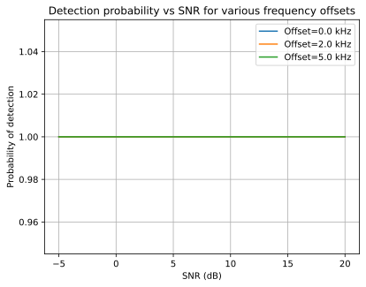

.. _detection-chapter:

#####################################################
Detection using Correlation
#####################################################

.. raw:: html

 Co-authored by <a href="https://www.linkedin.com/in/samuel-brown-vt">Sam Brown</a>

In this chapter, we learn how to detect the presence of signals by cross-correlating received samples with a portion of the signal known to us, such as the preamble of a packet. This method inherently leads to a simple form of classification, using a bank of correlators. We introduce the fundamental concepts of signal detection, focusing on how to decide if a specific signal is present or absent in a noisy environment. We explore the theoretical foundations and practical techniques for making optimal decisions amidst uncertainty.

****************************************************
Signal Detection: Making the First "Call"
****************************************************

Signal detection is the task of deciding whether an observed energy spike is a meaningful signal or just background noise.

The Challenge - In systems like radar or sonar, noise is everywhere. If the detector is too sensitive, it creates "False Alarms." If it's not sensitive enough, it "Misses" the actual target.

The Solutions - The first and simplest option is the Neyman-Pearson Detector, which provides a mathematical "sweet spot" by maximizing the chance of finding a signal while keeping false alarms below a strictly defined limit. A second option is to use the CFAR (Constant False Alarm Rate) approach. CFAR detectors are used in situations where the noise statistics are not stationary; i.e., the noise floor and noise distribution change due to interference and evolving channel conditions. The goal is to automatically adjust the detection threshold as the background noise fluctuates. This involves estimating the noise floor over time.

Preamble Correlators: Finding the Handshake
####################################################

Once a system knows something is there, it needs to find exactly where the data starts. Digital packets in LTE, 5G, or WiFi begin with a "preamble"—a known, repeated digital pattern. A Preamble Correlator acts like a "lock and key" mechanism. It slides a copy of the expected preamble over the incoming signal; when they align perfectly, a sharp spike occurs, telling the receiver exactly when to start reading the data. Advanced versions even account for "Frequency Offsets"—the slight tuning differences between your phone and a cell tower.

When a known signal, or preamble, is transmitted over a channel corrupted only by Additive White Gaussian Noise (AWGN), the task is to decide if the signal is present. This is the simplest yet most fundamental detection problem.

Python Implementation of a Cross-Correlation
########################################################

A correlator in its simplest form is just a cross-correlation, which can be implemented in Python using NumPy's `correlate` function. Here's a basic example:

.. code-block:: python

    TODO

Valid, Same, Full Modes
#######################################

TODO

The Neyman-Pearson Detector
############################

The theoretical gold standard for this decision is the Neyman-Pearson detector. This powerful criterion helps us make an optimal decision under a specific constraint: it finds a decision threshold that maximizes the probability of detection, :math:`P_{D}`, for a fixed, acceptable level of the probability of false alarm, :math:`P_{FA}`. In simple terms, you decide the maximum number of false detections you can tolerate (e.g., one false alarm per hour), and the Neyman-Pearson detector tells you the best threshold to use to catch the most actual signals possible. For detecting a known preamble in AWGN, this detector uses a simple approach: it computes a correlation value between the received signal and the known preamble pattern. If this value exceeds a predetermined threshold :math:`\tau`, it declares the signal is present, denoted as :math:`H_{1}`; otherwise, it assumes only noise is present, or :math:`H_{0}`.

Basic Formulas for Probability of Detection and False Alarm
#################################################################

The performance of this detector—measured by :math:`P_{D}` and :math:`P_{FA}`—depends on the threshold (:math:`\tau`), the signal-to-noise ratio (SNR), and the preamble length (:math:`L`).

Assuming the preamble is a sequence of :math:`L` complex symbols, the probability of a false alarm is a function of the threshold and the noise variance, :math:`\sigma_n^2`:

:math:`P_{FA} = Q\left(\frac{\tau}{\sigma_n}\right)`

The probability of detection is a function of the threshold, noise variance, and the energy of the preamble (:math:`E_s = L \cdot S`, where :math:`S` is the average symbol power):

:math:`P_{D} = Q\left(\frac{\tau - \sqrt{E_s}}{\sigma_n}\right) = Q\left(\frac{\tau - \sqrt{L \cdot S}}{\sigma_n}\right)`

Here, :math:`Q(x)` is the Q-function (the tail probability of the standard normal distribution), representing the probability that a standard normal random variable exceeds :math:`x`.

Performance Analysis: ROC and Pd vs. SNR Curves
#################################################################

To quantify how well a correlator detector performs in the presence of noise, engineers rely on two primary visualizations: the Receiver Operating Characteristic (ROC) curve and the Probability of Detection (:math:`P_{d}`) vs. SNR curve.

The ROC Curve: Balancing Sensitivity and Specificity
#################################################################

The ROC curve plots the Probability of Detection (:math:`P_{d}`) against the Probability of False Alarm (:math:`P_{fa}`) for a fixed SNR. The Trade-off: By adjusting the detection threshold at the correlator output, you choose a point on this curve. A lower threshold increases :math:`P_{d}` (finding the signal) but also increases :math:`P_{fa}` (triggering on noise). Performance Metric: The "bow" of the curve toward the top-left corner indicates detector quality. A perfect detector reaches the top-left (100% :math:`P_{d}`, 0% :math:`P_{fa}`), while a diagonal line represents a random guess.

.. image:: ../_images/detection_pd_vs_snr.svg
   :align: center 
   :target: ../_images/detection_pd_vs_snr.svg
   :alt: Pd vs SNR Curve and ROC curve

The Significance of Preamble Length and Processing Gain
#################################################################

The preamble length (:math:`L`) is a critical design parameter because it directly controls a system's processing gain and, therefore, its detection performance.

Impact on Performance: As shown in the formulas above, :math:`P_{D}` increases with :math:`L` for a fixed threshold and SNR. A longer preamble means more signal energy can be collected, making it easier to distinguish the signal from the background noise.

Processing Gain: The increase in performance due to a longer preamble is known as the processing gain. It is often measured as :math:`10\log_{10}(L)` in decibels (dB). This gain is crucial for detecting weak signals that might otherwise be missed. In essence, by integrating energy over more samples, we can pull signals out of noise that are even below the noise floor.

****************************************************
CFAR Detectors: Thriving in Changing Environments
****************************************************

While the Neyman-Pearson detector is optimal for a fixed noise level, real-world conditions are rarely that stable. In a dynamic environment—like a radar tracking a plane through rain or a wireless receiver in a crowded city—the background noise and interference levels fluctuate constantly. This is where the Constant False Alarm Rate (CFAR) detector becomes essential.

Common Use Cases
##########################

CFAR detectors are the workhorses of systems where an unpredictable background makes a fixed threshold impossible to maintain:

- Radar and Sonar: Used to detect targets (planes, submarines) against "clutter"—reflections from waves, rain, or land that change as the sensor moves.
- Wireless Communications: In Cognitive Radio and LTE/5G systems, CFAR helps identify available spectrum or detect incoming packets when interference from other devices is bursty and unpredictable.
- Medical Imaging: Used in automated ultrasound or MRI analysis to distinguish actual tissue features from varying levels of electronic noise.

Choosing the Right Threshold
#######################################

The "C" in CFAR stands for Constant because the goal is to keep the Probability of False Alarm (:math:`P_{FA}`) at a steady, predictable level.

Noise Distribution: To set a threshold, you must assume a statistical model for the noise. In simple AWGN, noise follows a Gaussian distribution. However, in radar clutter, it might follow a Rayleigh or Weibull distribution. If your model is wrong, your :math:`P_{FA}` will "drift," causing the system to either go blind or be overwhelmed by false triggers.

The Adaptive Threshold: Instead of a hard-coded value, a CFAR detector estimates the noise power in the local "neighborhood" of the signal. It then multiplies this estimate by a scaling factor (:math:`T`) derived from your desired :math:`P_{FA}`. This ensures that as the noise floor rises, the threshold rises with it. 

Per-Lag vs. System-Level False Alarm Rates
####################################################

This is a crucial distinction often missed by beginners. When you are searching for a preamble, you are usually performing a sliding correlation, checking the threshold at thousands of different time offsets (or "lags") every second.

Per-Lag :math:`P_{FA}`: This is the probability that a single specific correlation check results in a false alarm. If you set your math for a :math:`P_{FA}` of 0.001, each individual lag has a 1-in-1,000 chance of being a "ghost" signal.

System-Level (Global) :math:`P_{FA}`: This is the probability that the system triggers at least one false alarm during an entire search window (e.g., across 2,048 lags).

The Math: If your per-lag :math:`P_{FA}` is :math:`p`, the probability of at least one false alarm over :math:`N` lags is approximately :math:`1-(1-p)^{N}`.

The Consequence: If you have 1,000 lags and a per-lag :math:`P_{FA}` of 0.001, your system will actually report a false alarm almost 63% of the time you search! To keep the system-level false alarm rate low, the per-lag :math:`P_{FA}` must be set to an extremely small value.

Python Example
###############

As a way to play around with our own CFAR detector, we'll first simulate a scenario that invovles transmitting repeating QPSK packets with a known preamble over a channel with a time-varying noise floor. We'll then implement a simple Cell-Averaging CFAR (CA-CFAR) algorithm to detect the preambles in the received signal.  The following Python code generates the received signal:

.. code-block:: python

    import numpy as np
    import matplotlib.pyplot as plt
    from scipy.signal import correlate

    def generate_qpsk_packets(num_packets, sps, preamble):
        """Generates repeating QPSK packets with gaps and varying noise."""
        qpsk_map = np.array([1+1j, -1+1j, -1-1j, 1-1j]) / np.sqrt(2)
        data_len = 200
        gap_len = 100
        full_signal = []
        
        # Pre-calculate preamble upsampled for correlation
        upsampled_preamble = np.repeat(preamble, sps)
        
        for _ in range(num_packets):
            data = qpsk_map[np.random.randint(0, 4, data_len)]
            packet = np.concatenate([preamble, data])
            full_signal.extend(np.repeat(packet, sps))
            full_signal.extend(np.zeros(gap_len * sps))
        
        return np.array(full_signal), upsampled_preamble

    # Setup Parameters
    sps = 4
    preamble_syms = np.array([1+1j, 1+1j, -1-1j, -1-1j, 1-1j, -1+1j]) / np.sqrt(2)
    tx_signal, ref_preamble = generate_qpsk_packets(5, sps, preamble_syms)

    # Channel: Time-Varying Noise Floor
    t = np.arange(len(tx_signal))
    noise_env = 0.05 + 0.3 * np.sin(2 * np.pi * 0.0003 * t)**2
    noise = (np.random.randn(len(tx_signal)) + 1j*np.random.randn(len(tx_signal))) * noise_env
    rx_signal = tx_signal + noise

The first step is doing a single correlation of the received signal against the known preamble, in practice this is usually done in batches of samples, but we will do it in one batch for now:

.. code-block:: python

    # Preamble Correlation, Correlation spike occurs when the reference matches the received segment
    corr_out = correlate(rx_signal, ref_preamble, mode='same')
    corr_power = np.abs(corr_out)**2

TODO: look at just the raw output of this step

Now we will implement the CFAR detector, apply it to the correlator output, and visualize the results:

.. code-block:: python

    # CFAR Detection on Correlator Output
    def ca_cfar_adaptive(data, num_train, num_guard, pfa):
        num_cells = len(data)
        thresholds = np.zeros(num_cells)
        alpha = num_train * (pfa**(-1/num_train) - 1)  # Scaling factor
        half_window = (num_train + num_guard) // 2
        guard_half = num_guard // 2
        for i in range(half_window, num_cells - half_window):
            # Extract training cells (excluding guard cells and CUT)
            lagging_win = data[i - half_window : i - guard_half]
            leading_win = data[i + guard_half + 1 : i + half_window + 1]
            noise_floor_est = np.mean(np.concatenate([lagging_win, leading_win]))
            thresholds[i] = alpha * noise_floor_est
        return thresholds

    # Detect on correlator power
    cfar_thresholds = ca_cfar_adaptive(corr_power, num_train=60, num_guard=20, pfa=1e-5)
    detections = np.where(corr_power > cfar_thresholds)[0]
    # Filter detections to only include those where threshold is non-zero (avoid edges)
    detections = detections[cfar_thresholds[detections] > 0]

    # Subplot 1: Received Signal and Raw Power
    plt.figure(figsize=(14, 8))
    plt.subplot(2, 1, 1)
    plt.plot(np.abs(rx_signal)**2, color='gray', alpha=0.4, label='Rx Signal Power ($|r(t)|^2$)')
    plt.title("Time-Domain Received Signal")
    plt.ylabel("Power")
    plt.legend()
    plt.grid(True, alpha=0.3)

    # Subplot 2: Correlator Output vs Adaptive Threshold
    plt.subplot(2, 1, 2)
    plt.plot(corr_power, label='Correlator Output $|r(t) * p^*(-t)|^2$', color='blue')
    plt.plot(cfar_thresholds, label='CFAR Adaptive Threshold', color='red', linestyle='--', linewidth=1.5)
    if len(detections) > 0: # Overlay detections
        plt.scatter(detections, corr_power[detections], color='lime', edgecolors='black', label='Detections (Preamble Found)', zorder=5)
    plt.title("Preamble Correlator Output with Adaptive CFAR Threshold")
    plt.xlabel("Sample Index")
    plt.ylabel("Correlation Power")
    plt.legend()
    plt.grid(True, alpha=0.3)
    plt.show()

.. image:: ../_images/detection_cfar.svg
   :align: center 
   :target: ../_images/detection_cfar.svg
   :alt: CFAR Detector Output Example

Frequency Offset Resilient Preamble Correlators
####################################################

Detecting a preamble becomes a multi-dimensional search problem when the center frequency is unknown. In a perfectly synchronized system, a coherent correlator acts as a matched filter, maximizing the SNR. However, frequency offsets introduce a time-varying phase rotation that decorrelates the signal from the local template, leading to a catastrophic loss of detection sensitivity.

The Challenge of Frequency Uncertainty
#######################################

The impact of frequency offset :math:`\Delta f` depends on its magnitude relative to the preamble duration (:math:`T_{p}`):

Slightly Shifted (Doppler/Clock Drift): Typically caused by local oscillator (LO) ppm inaccuracies or low-velocity motion. Here, :math:`\Delta f \cdot T_{p} \ll 1`. The correlation peak is slightly attenuated, but the timing can still be recovered.

Completely Unknown: Common in "cold start" satellite acquisitions or high-dynamic UAV links. If the phase rotates by more than :math:`180^{\circ}` over the preamble (:math:`\Delta f > 1/(2T_{p})`), the coherent sum can actually null out to zero, making detection impossible regardless of the SNR.

Quantifying Loss: The Dirichlet Function
####################################################

The loss in correlation magnitude due to a frequency offset is described by the Dirichlet kernel (or the periodic sinc function). As the frequency offset increases, the coherent sum of rotated vectors follows this sinc-like roll-off.

The Correlation Loss Formula: The loss in dB can be approximated by:

:math:`L_{dB}(\Delta f) = 20 \log_{10} \left| \frac{\sin(\pi \Delta f N T_{s})}{N \sin(\pi \Delta f T_{s})} \right|`

Where:

   - :math:`N`: Number of symbols in the preamble.
   - :math:`T_{s}`: Symbol period.
   - :math:`\Delta f`: Frequency offset in Hz.

Explanation: As :math:`\Delta f` increases, the numerator oscillates while the denominator grows, creating "nulls" in the detector's sensitivity. For a standard correlator, the first null occurs at :math:`\Delta f = 1/(N T_{s})`. If your offset is half of the bin width, you suffer approximately 3.9 dB of loss, significantly degrading your effective SNR and :math:`P_{d}`. 

Methods for Resilience
##########################

A. Coherent Segmented Correlator

The preamble of length :math:`N` is divided into :math:`M` segments of length :math:`L = N/M`. Each segment is correlated coherently, and the results are combined by compensating for the phase drift between segments.

Mathematical Representation:

:math:`Y_{coh} = \sum_{m=0}^{M-1} \left( \sum_{k=0}^{L-1} r[k+mL] \cdot p^{*}[k] \right) e^{-j \hat{\phi}_m}`

Where :math:`\hat{\phi}_m` is an estimate of the phase rotation for that segment. This preserves the SNR gain of a full-length preamble but requires an accurate frequency estimate to align the phases.

B. Non-Coherent Segmented Correlator

Segments are correlated coherently, but their magnitudes are summed, discarding phase information.

Mathematical Representation:

:math:`Y_{non-coh} = \sum_{m=0}^{M-1} \left| \sum_{k=0}^{L-1} r[k+mL] \cdot p^{*}[k] \right|^{2}`

Trade-off: This is extremely robust to frequency offsets (up to :math:`1/(L T_{s})`). However, it suffers from Non-Coherent Integration Loss. Summing magnitudes instead of complex values allows noise to accumulate faster than the signal, effectively reducing the "post-detection" SNR.

C. Brute-Force Frequency Search

The receiver runs multiple parallel correlators, each shifted by a discrete frequency :math:`\Delta f_{i}`.

Trade-off: This provides the best SNR performance (full coherent gain) but is the most computationally expensive. The "bin spacing" must be tight enough (based on the Dirichlet formula) to ensure the worst-case loss between bins is acceptable (e.g., < 1 dB).

.. image:: ../_images/detection_freq_offset.svg
   :align: center 
   :target: ../_images/detection_freq_offset.svg
   :alt: Frequency Offset Impact on Correlation

Efficient Implementation
##########################

Time-Domain Tapping: Samples are convolved with a fixed set of weights. In a frequency search, this requires a separate FIR bank for every frequency bin. This is efficient for short preambles on FPGAs using Xilinx DSP48 slices.
Frequency-Domain (FFT) Processing: To perform a search, you take the FFT of the incoming signal and the preamble. Multiplication in the frequency domain is equivalent to correlation.
The "Frequency Shift Trick": To test different frequency offsets, you don't need multiple FFTs. You can simply circularly shift the FFT bins of the preamble relative to the signal before performing the point-wise multiplication and IFFT.
Chunking: For continuous streams, the Overlap-Save or Overlap-Add methods are used to process data in chunks without losing the correlation peaks at the edges of the FFT windows. 

Summary
#############

Frequency offset resilience is a trade-off between processing gain and computational complexity. Non-coherent segmented correlation is the most robust for high-uncertainty environments but requires a higher link margin. Coherent segmented and brute-force FFT searches provide superior sensitivity but require significantly more hardware resources. Understanding the Dirichlet-driven loss is critical for determining the necessary "bin density" in any frequency-searching receiver. 

*****************************************************************
Correlator Detectors in DSSS: Hiding in Plain Sight
*****************************************************************

In a Direct Sequence Spread Spectrum (DSSS) system, the correlator detector acts as the vital link that pulls a meaningful signal out of what appears to be random noise. By leveraging a high-rate chip sequence (or "chipping code"), the system spreads the signal's energy across a much wider bandwidth than the original data requires. 

Energy Spreading and Noise Camouflage
####################################################

Spectral Thinning: Because the total power remains constant, spreading it over a broad frequency range drastically lowers the Power Spectral Density (PSD).
Below the Noise Floor: This "thinning" effect can drive the signal level below the thermal noise floor, making it nearly invisible to conventional narrow-band receivers.
Signal Recovery: While the signal looks like background noise to others, a correlator detector at the intended receiver applies the same chip sequence to "despread" the energy, concentrating it back into the original narrow bandwidth while simultaneously spreading out any narrow-band interference. 

The Role of Auto-Correlation Properties
####################################################

Choosing the right sequence is critical for synchronization and multipath rejection. Ideally, a sequence should have perfect auto-correlation: a high peak when perfectly aligned and near-zero values at any other time offset. 
Timing Precision: Sharp auto-correlation peaks allow the receiver to lock onto the signal with sub-chip timing accuracy.
Multipath Mitigation: If a signal reflects off a building and arrives late, good auto-correlation ensures the receiver treats the delayed version as uncorrelated noise rather than destructive interference.

Common Spreading Sequences
##########################

Different applications require different mathematical properties in their sequences:

   - Barker Codes: Known for having the best possible auto-correlation properties for short lengths (up to 13), famously used in 802.11b Wi-Fi.
   - M-Sequences (Maximal Length): Generated using linear-feedback shift registers (LFSRs), these provide excellent randomness and auto-correlation over very long periods.
   - Gold Codes: Derived from pairs of m-sequences, these offer a large set of sequences with controlled cross-correlation, making them the standard for GPS and CDMA where multiple signals must coexist.
   - Zadoff-Chu (ZC) Sequences: These complex-valued sequences have constant amplitude and zero auto-correlation for all non-zero shifts, and are now a staple in LTE and 5G for synchronization.
   - Kasami Codes: Similar to Gold codes but with even lower cross-correlation for a given sequence length, used in high-density environments.

Chip-Timing Synchronization in DSSS
####################################################

In a DSSS system, the receiver's ability to recover data is entirely dependent on its synchronization with the incoming chip sequence. Because chips are much shorter than data bits, even a small fractional timing error—where the receiver samples "between" chips—can significantly degrade the correlation peak.

.. image:: ../_images/detection_dsss.svg
   :align: center 
   :target: ../_images/detection_dsss.svg
   :alt: DSSS

The Impact of Fractional Offsets
#######################################

Triangle Property: For standard rectangular pulses, the auto-correlation function is triangular. If the timing offset is exactly zero, the correlation peak is normalized to 1.0. As the offset increases toward half a chip (:math:`0.5`), the peak drops linearly toward 0.5, effectively halving the signal-to-noise ratio (SNR) available for detection.

Acquisition vs. Tracking: Synchronization occurs in two stages. First, Acquisition performs a coarse "sliding" search to find the peak within one chip duration. Second, Tracking (often using a Delay-Locked Loop) fine-tunes the sampling point to stay at the absolute apex of the correlation triangle.

