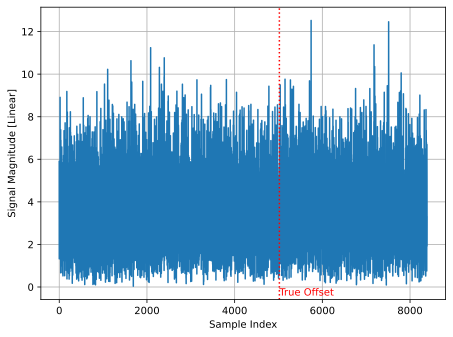
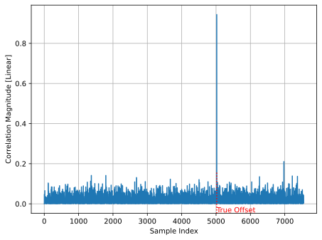
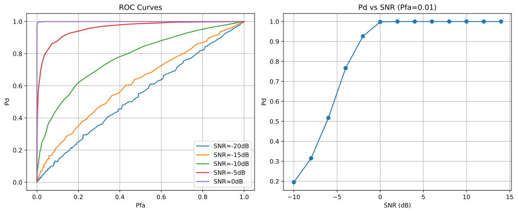
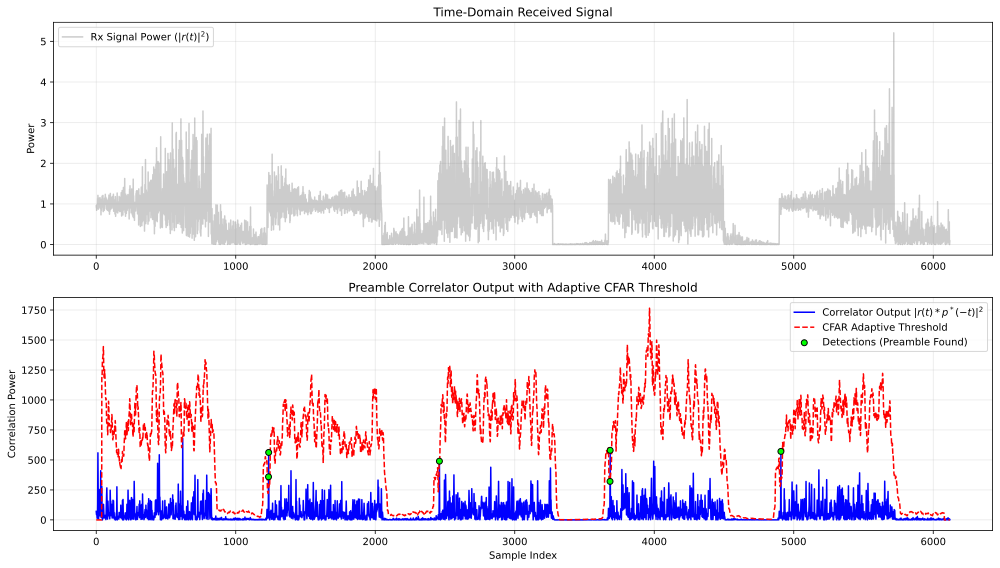
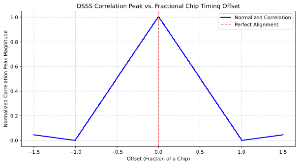

.. _detection-chapter:

#####################################################
Detection using Correlation
#####################################################

.. raw:: html

 Co-authored by <a href="https://www.linkedin.com/in/samuel-brown-vt">Sam Brown</a>

In this chapter, we learn how to detect the presence of signals and recover their timing by cross-correlating received samples with a portion of the signal known to us, such as the preamble of a packet. This method inherently leads to a simple form of classification, using a bank of correlators. We introduce the fundamental concepts of signal detection, focusing on how to decide if a specific signal is present or absent in a noisy environment. We explore the theoretical foundations and practical techniques for making optimal decisions amidst uncertainty.

****************************************************
Signal Detection and Correlator Basics
****************************************************

Signal detection is the task of deciding whether an observed energy spike is a meaningful signal or just background noise.

The Challenge - In systems like radar or sonar, noise is everywhere. If the detector is too sensitive, it creates "False Alarms." If it's not sensitive enough, it "Misses" the actual target.

The Solutions - The first and simplest option is the Neyman-Pearson Detector, which provides a mathematical "sweet spot" by maximizing the chance of finding a signal while keeping false alarms below a strictly defined limit. CFAR detectors expand upon Neyman Pearson detectors by making them adaptive to changes in the noise level. More specifically, CFAR detectors are used in situations where the noise statistics are not stationary; i.e., the noise floor and noise distribution change due to interference and evolving channel conditions. The goal is to automatically adjust the detection threshold as the background noise fluctuates so as to guarantee a set false-alarm rate. This involves estimating the noise floor over time.

Once a system knows something is there, it needs to find exactly where the data starts. Digital packets in LTE, 5G, or WiFi begin with a "preamble"—a known, repeated digital pattern. A Preamble Correlator acts like a "lock and key" mechanism wherein the "key" is some sequence of symbols known at the receiver that is unique to the signal being recovered. By sliding a copy of the preamble sequence over the incoming signal and performing a dot product at every delay, the receiver can measure the similarity between the template sequence and the received sequence at that delay. When the template and the received signal line up near-perfectly, a sharp spike occurs, telling the receiver exactly when to start reading the data. Advanced versions even account for frequency offsets caused by the slight tuning differences between your phone and a cell tower or Doppler shifts.

When a known signal, or preamble, is transmitted over a channel corrupted only by Additive White Gaussian Noise (AWGN), the task is to decide if the signal is present. This is the simplest yet most fundamental detection problem.

The Cross-Correlation Function
###############################

A correlator in its simplest form is just a cross-correlation between a received signal and a template of what to search for.  A cross-correlation is a dot product between two vectors as one vector slides across the other.  If you learned about the convolution operation, it's exactly the same except you don't flip the second vector, so it's actually slightly simpler.  For complex signals, which is what we'll be dealing with, you also have to complex conjugate one of the inputs.  In Python this can be implemented as follows:

.. code-block:: python

    def correlate(a, v):
        n = len(a)
        m = len(v)
        result = []
        for i in range(n - m + 1):
            s = 0
            for j in range(m):
                s += a[i + j] * v[j].conjugate()
            result.append(s)
        return result

    # Example usage:
    a = [1+2j, 2+1j, 3+0j, 4-1j, 5-2j]
    v = [0+1j, 1+0j, 0.5-0.5j]
    correlate(a, v)

Note how we slide :code:`a` and complex conjugate :code:`v`, and how the loop involving :code:`j` and :code:`s` is actually just a vector dot product.  Luckily we don't have to implement a cross-correlation from scratch, in Python we can use NumPy's :code:`correlate` function (there is also a SciPy version that you're welcome to play with).  

Python Example of a Cross-Correlation
########################################################

In order to put together a basic Python example of a correlator, we first need to create an example signal with a known preamble embedded in noise. We will use a Zadoff-Chu sequence as our known preamble due to its excellent auto-correlation properties and common use in communication systems.  We won't bother with any other "data" portion of the signal, but in most systems there will be unknown data following the known preamble.  We can generate a Zadoff-Chu sequence as follows:

.. code-block:: python

    import numpy as np
    import matplotlib.pyplot as plt
    N = 839  # Length of Zadoff-Chu sequence
    u = 25  # Root of ZC sequence
    t = np.arange(N)
    zadoff_chu = np.exp(-1j * np.pi * u * t * (t + 1) / N)

The resulting sequence *is* a signal, the IQ samples of :code:`zadoff_chu` represent a baseband complex signal similar to many signals we have dealt with in this textbook, it just doesn't represent bits.  We can emulate a real scenario by adding this Zadoff-Chu signal into a longer stream of AWGN at a random offset:

.. code-block:: python

    signal_length = 10 * N # overall simulated signal length
    offset = np.random.randint(N, signal_length - N)
    print(f"True offset: {offset}")
    snr_db = -15
    noise_power = 1 / (2 * (10**(snr_db / 10)))
    signal = np.sqrt(noise_power/2) * (np.random.randn(signal_length) + 1j * np.random.randn(signal_length))
    signal[offset:offset+N] += zadoff_chu # place our ZC signal at the random offset

Note that we are using a *very* low SNR, in fact it's so low that if you look at the time domain signal you won't be able to see the Zadoff-Chu sequence at all!  Our Zadoff-Chu sequence is 839 samples long, out of the ~8000 simulated samples, and it's buried so deep into the noise that you can't even see a slight increase in signal magnitude.

Now we can implement the correlator by performing a cross-correlation of the received signal against our known Zadoff-Chu sequence, using :code:`np.correlate()`.  This assumes the receiver is aware of the exact preamble that was used; :code:`zadoff_chu` in our code initially was created to simulate a scenario, but now it's also going to represent a template preamble that the receiver uses in its correlator.  The correlator can be implemented in one line of Python:

.. code-block:: python

 correlation = np.correlate(signal, zadoff_chu, mode='valid')

The :code:`valid` portion will be addressed shortly.  We will also normalize the output by the length of the sequence, and take the magnitude squared to get the power, although you could also just take the magnitude and leave it at that, and it would work fine, the important part is the :code:`np.correlate()` operation.

.. code-block:: python

 correlation = np.abs(correlation / N)**2 # normalize by N, and take magnitude squared

Below we plot the magnitude squared and annotate the actual starting position of the sequence to see if the correlator was able to find it:

Even though the SNR is very low, we can see a very clear spike in the correlator output exactly where the Zadoff-Chu sequence was placed!  This shows us the *start* of the sequence; the 839 samples starting at that spike contain the sequence.  This is the power of correlation-based detection, combined with a very long preamble.  Note that we have not yet set any sort of threshold for how to decide if this spike is our signal of interest or just noise, instead we are visually inspecting the output, to automate the process we would need a threshold.  However, the bulk of this chapter revolves around how to come up with the best threshold, especially when the noise floor and background interference is constantly changing.

Valid, Same, Full Modes
#######################################

You may have noticed that the :code:`np.correlate()` function, as well as :code:`np.convolve()`, have three different modes: :code:`valid`, :code:`same`, and :code:`full`.  These modes determine the length of the output array compared to the input arrays.  In our case, we used :code:`valid`, which means that the output only contains points where the two input arrays fully overlap.  This results in an output length of :code:`len(signal) - len(zadoff_chu) + 1`.  If we had used :code:`same`, the output would be the same length as the (longer) input signal, and if we had used :code:`full`, the output would be the full discrete linear convolution, resulting in a slightly longer output array of length :code:`max(M, N) - min(M, N) + 1` where :code:`M` and :code:`N` are the lengths of the two input arrays.  In a lot of RF signal processing, we use a convolution to apply an FIR filter, and it is convenient when the input and output are the same length, so we often use :code:`same` in those cases.  However, for correlation-based detection, we typically want to use :code:`valid`, since we only care about the points where the preamble fully overlaps with the received signal, especially if we assume that the signal does not start until after we start receiving.

The Neyman-Pearson Detector
############################

The gold standard for deciding on a good threshold to compare our correlator output against is the Neyman-Pearson detector. This powerful piece of theory helps us make an optimal decision under a specific constraint: it finds a decision threshold that maximizes the probability of detection, :math:`P_{D}`, for a fixed, acceptable level of the probability of false alarm, :math:`P_{FA}`. In simple terms, you decide the maximum number of false detections you can tolerate (e.g., one false alarm per hour), and the Neyman-Pearson detector tells you the best threshold to use to catch the most actual signals possible. For detecting a known preamble in AWGN, this detector uses a simple approach: it computes a correlation value between the received signal and the known preamble pattern. If this value exceeds a predetermined threshold :math:`\tau`, it declares the signal is present, otherwise it assumes only noise is present.

The performance of this detector, measured by :math:`P_{D}` and :math:`P_{FA}`, depends on the threshold :math:`\tau`, the SNR, and the preamble length :math:`L`. The probability of a false alarm is a function of the threshold and the noise variance, :math:`\sigma_n^2`:

:math:`P_{FA} = Q\left(\frac{\tau}{\sigma_n}\right)`

The probability of detection is a function of the threshold, noise variance, and the energy of the preamble (:math:`E_s = L \cdot S`, where :math:`S` is the average symbol power):

:math:`P_{D} = Q\left(\frac{\tau - \sqrt{E_s}}{\sigma_n}\right) = Q\left(\frac{\tau - \sqrt{L \cdot S}}{\sigma_n}\right)`

Here, :math:`Q(x)` is the Q-function (the tail probability of the standard normal distribution), representing the probability that a standard normal random variable exceeds :math:`x`.

Performance Analysis: ROC Curves and Pd vs. SNR Curves
#################################################################

To quantify how well a correlator detector performs in the presence of noise, engineers rely on two primary visualizations: the Receiver Operating Characteristic (ROC) curve and the Probability of Detection (:math:`P_{d}`) vs. SNR curve.

The ROC curve plots the Probability of Detection (:math:`P_{d}`) against the Probability of False Alarm (:math:`P_{fa}`) for a fixed SNR. By adjusting the detection threshold at the correlator output, you choose a point on this curve, it's a trade-off. A lower threshold increases :math:`P_{d}` (finding the signal) but also increases :math:`P_{fa}` (triggering on noise). The "bow" of the curve toward the top-left corner indicates detector quality. A perfect detector reaches the top-left (100% :math:`P_{d}`, 0% :math:`P_{fa}`), while a diagonal line represents a random guess.

Based on the above equations (also, intuition), we can see that the preamble length :math:`L` is a critical design parameter because it directly controls a system's processing gain and, therefore, its detection performance.  :math:`P_{D}` increases with :math:`L` for a fixed threshold and SNR. A longer preamble means more signal energy can be collected, making it easier to distinguish the signal from the background noise.  The increase in performance due to a longer preamble is known as the "processing gain". It is often measured in dB, as :math:`10\log_{10}(L)`. This gain is crucial for detecting weak signals that might otherwise be missed. In essence, by integrating energy over more samples, we can pull signals out of noise that are even below the noise floor.

****************************************************
CFAR Detectors: Thriving in Changing Environments
****************************************************

While the Neyman-Pearson detector is optimal for a fixed noise level, real-world conditions are rarely that stable. In a dynamic environment—like a radar tracking a plane through rain or a wireless receiver in a crowded city—the background noise and interference levels fluctuate constantly. This is where the Constant False Alarm Rate (CFAR) detector becomes essential.

CFAR detectors are the workhorses of systems where an unpredictable background makes a fixed threshold impossible to maintain:

- Radar and Sonar are used to detect targets (planes, submarines) against "clutter"—reflections from waves, rain, or land that change as the sensor moves.
- Wireless Communications, such as Cognitive Radio and LTE/5G systems, use CFAR to help identify available spectrum or detect incoming packets when interference from other devices is burst-y and unpredictable.
- Medical Imaging applies CFAR in automated ultrasound or MRI analysis to distinguish actual tissue features from varying levels of electronic noise.

The "C" in CFAR stands for Constant because the goal is to keep the Probability of False Alarm (:math:`P_{FA}`) at a steady, predictable level.

To set a threshold, you must assume a statistical model for the noise, which is called the noise distribution. In simple AWGN, noise follows a Gaussian distribution. However, in radar clutter, it might follow a Rayleigh or Weibull distribution. If your model is wrong, your :math:`P_{FA}` will "drift," causing the system to either go blind or be overwhelmed by false triggers.

Instead of a hard-coded value, a CFAR detector estimates the noise power in the local "neighborhood" of the signal and multiplies this estimate by a scaling factor (:math:`T`) derived from your desired :math:`P_{FA}`. This ensures that as the noise floor rises, the threshold rises with it. 

Per-Lag vs. System-Level False Alarm Rates
####################################################

This is a crucial distinction often missed by beginners. When you are searching for a preamble, you are usually performing a sliding correlation, checking the threshold at thousands of different time offsets (or "lags") every second.

Per-Lag :math:`P_{FA}`: This is the probability that a single specific correlation check results in a false alarm. If you set your math for a :math:`P_{FA}` of 0.001, each individual lag has a 1-in-1,000 chance of being a "ghost" signal.

System-Level (Global) :math:`P_{FA}`: This is the probability that the system triggers at least one false alarm during an entire search window (e.g., across 2,048 lags).

Mathematically, if your per-lag :math:`P_{FA}` is :math:`p`, the probability of at least one false alarm over :math:`N` lags is approximately :math:`1-(1-p)^{N}`.

As a consequence, if you have 1,000 lags and a per-lag :math:`P_{FA}` of 0.001, your system will actually report a false alarm almost 63% of the time you search! To keep the system-level false alarm rate low, the per-lag :math:`P_{FA}` must be set to an extremely small value.

Python Example
###############

As a way to play around with our own CFAR detector, we'll first simulate a scenario that involves transmitting repeating QPSK packets with a known preamble over a channel with a time-varying noise floor. We'll then implement a simple Cell-Averaging CFAR (CA-CFAR) algorithm to detect the preambles in the received signal.  The following Python code generates the received signal:

.. code-block:: python

    import numpy as np
    import matplotlib.pyplot as plt
    from scipy.signal import correlate

    def generate_qpsk_packets(num_packets, sps, preamble):
        """Generates repeating QPSK packets with gaps and varying noise."""
        qpsk_map = np.array([1+1j, -1+1j, -1-1j, 1-1j]) / np.sqrt(2)
        data_len = 200
        gap_len = 100
        full_signal = []
        
        # Pre-calculate preamble upsampled for correlation
        upsampled_preamble = np.repeat(preamble, sps)
        
        for _ in range(num_packets):
            data = qpsk_map[np.random.randint(0, 4, data_len)]
            packet = np.concatenate([preamble, data])
            full_signal.extend(np.repeat(packet, sps))
            full_signal.extend(np.zeros(gap_len * sps))
        
        return np.array(full_signal), upsampled_preamble

    # Setup Parameters
    sps = 4
    preamble_syms = np.array([1+1j, 1+1j, -1-1j, -1-1j, 1-1j, -1+1j]) / np.sqrt(2)
    tx_signal, ref_preamble = generate_qpsk_packets(5, sps, preamble_syms)

    # Channel: Time-Varying Noise Floor
    t = np.arange(len(tx_signal))
    noise_env = 0.05 + 0.3 * np.sin(2 * np.pi * 0.0003 * t)**2
    noise = (np.random.randn(len(tx_signal)) + 1j*np.random.randn(len(tx_signal))) * noise_env
    rx_signal = tx_signal + noise

The first step is doing a single correlation of the received signal against the known preamble, in practice this is usually done in batches of samples, but we will do it in one batch for now:

.. code-block:: python

    # Preamble Correlation, Correlation spike occurs when the reference matches the received segment
    corr_out = correlate(rx_signal, ref_preamble, mode='same')
    corr_power = np.abs(corr_out)**2

TODO: look at just the raw output of this step

Now we will implement the CFAR detector, apply it to the correlator output, and visualize the results:

.. code-block:: python

    # CFAR Detection on Correlator Output
    def ca_cfar_adaptive(data, num_train, num_guard, pfa):
        num_cells = len(data)
        thresholds = np.zeros(num_cells)
        alpha = num_train * (pfa**(-1/num_train) - 1)  # Scaling factor
        half_window = (num_train + num_guard) // 2
        guard_half = num_guard // 2
        for i in range(half_window, num_cells - half_window):
            # Extract training cells (excluding guard cells and CUT)
            lagging_win = data[i - half_window : i - guard_half]
            leading_win = data[i + guard_half + 1 : i + half_window + 1]
            noise_floor_est = np.mean(np.concatenate([lagging_win, leading_win]))
            thresholds[i] = alpha * noise_floor_est
        return thresholds

    # Detect on correlator power
    cfar_thresholds = ca_cfar_adaptive(corr_power, num_train=60, num_guard=20, pfa=1e-5)
    detections = np.where(corr_power > cfar_thresholds)[0]
    # Filter detections to only include those where threshold is non-zero (avoid edges)
    detections = detections[cfar_thresholds[detections] > 0]

    # Subplot 1: Received Signal and Raw Power
    plt.figure(figsize=(14, 8))
    plt.subplot(2, 1, 1)
    plt.plot(np.abs(rx_signal)**2, color='gray', alpha=0.4, label='Rx Signal Power ($|r(t)|^2$)')
    plt.title("Time-Domain Received Signal")
    plt.ylabel("Power")
    plt.legend()
    plt.grid(True, alpha=0.3)

    # Subplot 2: Correlator Output vs Adaptive Threshold
    plt.subplot(2, 1, 2)
    plt.plot(corr_power, label='Correlator Output $|r(t) * p^*(-t)|^2$', color='blue')
    plt.plot(cfar_thresholds, label='CFAR Adaptive Threshold', color='red', linestyle='--', linewidth=1.5)
    if len(detections) > 0: # Overlay detections
        plt.scatter(detections, corr_power[detections], color='lime', edgecolors='black', label='Detections (Preamble Found)', zorder=5)
    plt.title("Preamble Correlator Output with Adaptive CFAR Threshold")
    plt.xlabel("Sample Index")
    plt.ylabel("Correlation Power")
    plt.legend()
    plt.grid(True, alpha=0.3)
    plt.show()

Frequency Offset Resilient Preamble Correlators
####################################################

Detecting a preamble becomes a multi-dimensional search problem when the center frequency is unknown. In a perfectly synchronized system, a coherent correlator acts as a matched filter, maximizing the SNR. However, frequency offsets introduce a time-varying phase rotation that decorrelates the signal from the local template, leading to a catastrophic loss of detection sensitivity.

The impact of frequency offset :math:`\Delta f` depends on its magnitude relative to the preamble duration (:math:`T_{p}`):

Slightly Shifted (Doppler/Clock Drift): Typically caused by local oscillator (LO) ppm inaccuracies or low-velocity motion. Here, :math:`\Delta f \cdot T_{p} \ll 1`. The correlation peak is slightly attenuated, but the timing can still be recovered.

In cases where the frequency offset is completely unknown, such as in "cold start" satellite acquisitions or high-dynamic UAV links, if the phase rotates by more than :math:`180^{\circ}` over the preamble (:math:`\Delta f > 1/(2T_{p})`), the coherent sum can actually null out to zero, making detection impossible regardless of the SNR.

The loss in correlation magnitude due to a frequency offset is described by the Dirichlet kernel (or the periodic sinc function). As the frequency offset increases, the coherent sum of rotated vectors follows this sinc-like roll-off.

The loss in dB due to frequency offset can be approximated by the following formula:

:math:`L_{dB}(\Delta f) = 20 \log_{10} \left| \frac{\sin(\pi \Delta f N T_{s})}{N \sin(\pi \Delta f T_{s})} \right|`

Where:

   - :math:`N`: Number of symbols in the preamble.
   - :math:`T_{s}`: Symbol period.
   - :math:`\Delta f`: Frequency offset in Hz.

As :math:`\Delta f` increases, the numerator oscillates while the denominator grows, creating "nulls" in the detector's sensitivity. For a standard correlator, the first null occurs at :math:`\Delta f = 1/(N T_{s})`. If your offset is half of the bin width, you suffer approximately 3.9 dB of loss, significantly degrading your effective SNR and :math:`P_{d}`. 

Methods for Resilience to Frequency Offsets
###########################################

A. Coherent Segmented Correlator

The preamble of length :math:`N` is divided into :math:`M` segments of length :math:`L = N/M`. Each segment is correlated coherently, and the results are combined by compensating for the phase drift between segments.

:math:`Y_{coh} = \sum_{m=0}^{M-1} \left( \sum_{k=0}^{L-1} r[k+mL] \cdot p^{*}[k] \right) e^{-j \hat{\phi}_m}`

Where :math:`\hat{\phi}_m` is an estimate of the phase rotation for that segment. This preserves the SNR gain of a full-length preamble but requires an accurate frequency estimate to align the phases.

B. Non-Coherent Segmented Correlator

Segments are correlated coherently, but their magnitudes are summed, discarding phase information.

:math:`Y_{non-coh} = \sum_{m=0}^{M-1} \left| \sum_{k=0}^{L-1} r[k+mL] \cdot p^{*}[k] \right|^{2}`

This approach is extremely robust to frequency offsets (up to :math:`1/(L T_{s})`). However, it suffers from Non-Coherent Integration Loss. Summing magnitudes instead of complex values allows noise to accumulate faster than the signal, effectively reducing the "post-detection" SNR.

C. Brute-Force Frequency Search

The receiver runs multiple parallel correlators, each shifted by a discrete frequency :math:`\Delta f_{i}`.

This method provides the best SNR performance (full coherent gain) but is the most computationally expensive. The "bin spacing" must be tight enough (based on the Dirichlet formula) to ensure the worst-case loss between bins is acceptable (e.g., < 1 dB).

In time-domain tapping, samples are convolved with a fixed set of weights. In a frequency search, this requires a separate FIR bank for every frequency bin. This is efficient for short preambles on FPGAs using Xilinx DSP48 slices.
Frequency-Domain (FFT) Processing: To perform a search, you take the FFT of the incoming signal and the preamble. Multiplication in the frequency domain is equivalent to correlation.
The "Frequency Shift Trick": To test different frequency offsets, you don't need multiple FFTs. You can simply circularly shift the FFT bins of the preamble relative to the signal before performing the point-wise multiplication and IFFT.
For continuous streams, chunking methods such as Overlap-Save or Overlap-Add are used to process data in chunks without losing the correlation peaks at the edges of the FFT windows. 

Frequency offset resilience is a trade-off between processing gain and computational complexity. Non-coherent segmented correlation is the most robust for high-uncertainty environments but requires a higher link margin. Coherent segmented and brute-force FFT searches provide superior sensitivity but require significantly more hardware resources. Understanding the Dirichlet-driven loss is critical for determining the necessary "bin density" in any frequency-searching receiver. 

TODO: Explain this plot and add some portion of the Python to the section

.. image:: ../_images/detection_freq_offset.svg
   :align: center 
   :target: ../_images/detection_freq_offset.svg
   :alt: Frequency Offset Impact on Correlation

*****************************************************************
Detecting Direct Sequence Spread Spectrum (DSSS) Signals
*****************************************************************

In a Direct Sequence Spread Spectrum (DSSS) system, the correlator detector acts as the vital link that pulls a meaningful signal out of what appears to be random noise. By leveraging a high-rate chip sequence (or "chipping code"), the system spreads the signal's energy across a much wider bandwidth than the original data requires. Because the total power remains constant, spreading it over a broad frequency range drastically lowers the Power Spectral Density (PSD).  This "spectral thinning" effect can drive the signal level below the thermal noise floor, making it nearly invisible to conventional narrow-band receivers.  While the signal looks like background noise to others, a correlator detector at the intended receiver applies the same chip sequence to "de-spread" the energy, concentrating it back into the original narrow bandwidth while simultaneously spreading out any narrow-band interference, allowing for reliable detection even in extremely noisy environments (both for the intended receiver and for eavesdroppers who are aware of the chip sequence).

The Role of Auto-Correlation Properties
########################################

Choosing the right sequence is critical for synchronization and multipath rejection. Ideally, a sequence should have perfect auto-correlation; a high peak when perfectly aligned and near-zero values at any other time offset. Sharp auto-correlation peaks allow the receiver to lock onto the signal with sub-chip timing accuracy.  If a signal reflects off a building and arrives late, good auto-correlation ensures the receiver treats the delayed version as uncorrelated noise rather than destructive interference, thus mitigating multipath.

Common Spreading Sequences
##########################

Different applications require different mathematical properties in their sequences. Some examples include:

- Barker Codes, which are known for having the best possible auto-correlation properties for short lengths (up to 13), and are famously used in 802.11b Wi-Fi.
- M-Sequences (Maximal Length), generated using linear-feedback shift registers (LFSRs), provide excellent randomness and auto-correlation over very long periods.
- Gold Codes, derived from pairs of m-sequences, offer a large set of sequences with controlled cross-correlation, making them the standard for GPS and CDMA where multiple signals must coexist.
- Zadoff-Chu (ZC) Sequences are complex-valued sequences with constant amplitude and zero auto-correlation for all non-zero shifts, and are now a staple in LTE and 5G for synchronization.
- Kasami Codes are similar to Gold codes but have even lower cross-correlation for a given sequence length, making them useful in high-density environments.

Chip-Timing Synchronization in DSSS
####################################################

In a DSSS system, the receiver's ability to recover data is entirely dependent on its synchronization with the incoming chip sequence. Because chips are much shorter than data bits, even a small fractional timing error—where the receiver samples "between" chips—can significantly degrade the correlation peak. We can play around with the impact of a fractional timing offset by simulating a simple DSSS system and plotting the correlation output as we vary the timing offset from 0 to 1 chip.  Note that we don't do a full correlation here, we just do a dot product at 0 lag, because we know that will be the position of the peak.

.. code-block:: python

    import numpy as np
    import matplotlib.pyplot as plt

    # Barker 11 sequence: +1, -1, +1, +1, -1, +1, +1, +1, -1, -1, -1
    barker11 = np.array([1, -1, 1, 1, -1, 1, 1, 1, -1, -1, -1])
    samples_per_chip = 100

    # Upsample the sequence to simulate continuous-ish time
    sig = np.repeat(barker11, samples_per_chip)

    offsets = np.linspace(-1.5, 1.5, 500) # Fractional chip offsets
    peaks = []

    for offset in offsets:
        # Shift the signal by a fractional number of chips (converted to samples)
        shift_samples = int(offset * samples_per_chip)
        if shift_samples > 0:
            shifted_sig = np.pad(sig, (shift_samples, 0))[:len(sig)]
        elif shift_samples < 0:
            shifted_sig = np.pad(sig, (0, abs(shift_samples)))[abs(shift_samples):]
        else:
            shifted_sig = sig
            
        # Compute normalized correlation at zero lag for this specific offset
        correlation = np.vdot(sig, shifted_sig) / np.vdot(sig, sig)
        peaks.append(np.abs(correlation))

    plt.figure(figsize=(10, 5))
    plt.plot(offsets, peaks, label='Normalized Correlation', color='blue', linewidth=2)
    plt.axvline(0, color='red', linestyle='--', alpha=0.5, label='Perfect Alignment')
    plt.title('DSSS Correlation Peak vs. Fractional Chip Timing Offset')
    plt.xlabel('Offset (Fraction of a Chip)')
    plt.ylabel('Normalized Correlation Peak Magnitude')
    plt.grid(True, which='both', linestyle='--', alpha=0.6)
    plt.legend()
    plt.savefig('../_images/detection_dsss.svg', bbox_inches='tight')
    plt.show()

The peak occurs at zero offset as expected, and it drops linearly, i.e. it gets to half the peak value at a half-chip offset.  After more than one chip offset the correlation might seem like it's going back up, but the actual peak will be low because it's not aligned to the sequence anymore.

****************************************************
Real-Time Packet Detection in Continuous IQ Streams
****************************************************

So far we have explored the theoretical foundations of signal detection, from correlators to CFAR detectors to spread spectrum systems. Now we bring it all together to solve a common practical problem: **detecting intermittent packets in a continuous stream of IQ samples from an SDR**.  Consider this scenario: You have a modem or IoT device that transmits a data packet once per second (or at irregular intervals). Your SDR is continuously receiving samples at, say, 1 MHz. The packets arrive at unpredictable times, buried in noise and interference. You need to:

1. Detect when a packet arrives
2. Determine the exact sample index where it starts
3. Extract the packet for further processing (demodulation, decoding, etc.)
4. Do this in real-time without missing packets

This is fundamentally different from processing a pre-recorded IQ file where you can analyze the entire signal at once. Here, samples arrive continuously, and you must make decisions in real-time with limited computational resources.  We will combine several techniques covered in this chapter:

1. **Cross-Correlation**: To find the known preamble pattern
2. **CFAR Detection**: To adaptively set thresholds despite varying noise
3. **Buffer Management**: To handle continuous streaming data
4. **Peak Detection**: To extract precise packet timing

To operate in real-time, we will accumulate samples in **buffers** (chunks of, say, 100,000 samples), run our detector on each buffer, and maintain state across buffer boundaries to avoid missing packets that span two buffers.

Implementation
##############
Our detector will follow this workflow:

.. mermaid::

   flowchart TD

       A("Continuous IQ Stream from SDR (1 MHz sample rate)")
       B("Buffer Accumulation (100k samples = 0.1 sec)")
       C("Cross-Correlation with Known Preamble")
       D("CFAR Threshold Computation")
       E("Peak Detection (correlation > threshold)")
       F("Packet Extraction & Validation")

       A --> B --> C --> D --> E --> F

To avoid missing packets that straddle buffer boundaries, we use an **overlap-save** approach, where each buffer includes the last ``N_preamble`` samples from the previous buffer.  This ensures any packet starting near the end of buffer ``i`` will be fully contained in buffer ``i+1``.  This requires a small additional computational overhead but we don't want to miss packets just because they straddle buffer boundaries.

Let's build a complete packet detector in Python one step at a time.  We'll use a Zadoff-Chu preamble as introduced earlier, but with a shorter length, and implement an adaptive CFAR detector.

Step 1: Define the Preamble and Parameters
*******************************************

.. code-block:: python

    import numpy as np
    import matplotlib.pyplot as plt
    from scipy.signal import correlate
    
    # Preamble: Zadoff-Chu sequence (excellent correlation properties)
    N_zc = 63  # ZC sequence length (typically prime or power of 2 - 1)
    u = 5      # ZC root
    t = np.arange(N_zc)
    preamble = np.exp(-1j * np.pi * u * t * (t + 1) / N_zc)
    
    # System parameters
    sample_rate = 1e6  
    buffer_size = 100000
    overlap_size = len(preamble)  # Overlap to catch boundary packets
    
    # CFAR parameters
    cfar_guard = 10
    cfar_train = 50
    pfa_target = 1e-6
    
    # Packet parameters (for simulation)
    packet_length = 500  # Total packet length in samples (preamble + data)
    snr_db = -5

Step 2: CFAR Detector Function
*******************************

We'll use the Cell-Averaging CFAR (CA-CFAR) from earlier, slightly optimized:

.. code-block:: python

    def ca_cfar_1d(signal, num_train, num_guard, pfa):
        """
        1D Cell-Averaging CFAR detector.
        
        Args:
            signal: Input signal (typically correlation magnitude)
            num_train: Number of training cells (on each side)
            num_guard: Number of guard cells (on each side)
            pfa: Target probability of false alarm
            
        Returns:
            threshold: Adaptive threshold array
        """
        n = len(signal)
        threshold = np.zeros(n)
        alpha = num_train * (pfa**(-1/num_train) - 1)
        
        for i in range(n):
            # Define training window indices
            train_start_left = max(0, i - num_guard - num_train)
            train_end_left = max(0, i - num_guard)
            train_start_right = min(n, i + num_guard + 1)
            train_end_right = min(n, i + num_guard + num_train + 1)
            
            # Collect training cells (avoid guard cells and CUT)
            train_cells = np.concatenate([
                signal[train_start_left:train_end_left],
                signal[train_start_right:train_end_right]
            ])
            
            if len(train_cells) > 0:
                noise_est = np.mean(train_cells)
                threshold[i] = alpha * noise_est
        
        return threshold

Step 3: Packet Detection Function
**********************************

.. code-block:: python

    def detect_packets(buffer, preamble, cfar_guard, cfar_train, pfa, 
                      min_spacing=None):
        """
        Detect packets in a buffer of IQ samples.
        
        Args:
            buffer: Complex IQ samples
            preamble: Known preamble sequence
            cfar_guard: CFAR guard cells
            cfar_train: CFAR training cells
            pfa: Target false alarm probability
            min_spacing: Minimum samples between detections (prevents duplicates)
            
        Returns:
            detections: List of sample indices where packets start
        """
        # Correlate buffer with preamble
        corr = correlate(buffer, preamble, mode='same')
        corr_power = np.abs(corr)**2
        
        # Compute adaptive threshold
        threshold = ca_cfar_1d(corr_power, cfar_train, cfar_guard, pfa)
        
        # Find peaks above threshold
        detections_raw = np.where(corr_power > threshold)[0]

        # Compensate for correlation offset (peak occurs at len(preamble)//2 after true start)
        half_preamble = len(preamble) // 2
        detections_raw = detections_raw - half_preamble
        
        # Remove edge detections (unreliable)
        half_preamble = len(preamble) // 2
        detections_raw = detections_raw[
            (detections_raw > half_preamble) & 
            (detections_raw < len(buffer) - half_preamble)
        ]
        
        # Remove duplicate detections (peaks close together)
        if min_spacing is None:
            min_spacing = len(preamble)
        
        detections = []
        if len(detections_raw) > 0:
            detections.append(detections_raw[0])
            for det in detections_raw[1:]:
                if det - detections[-1] > min_spacing:
                    detections.append(det)
        
        return detections, corr_power, threshold

Step 4: Simulation - Generate Test Signal
******************************************

.. code-block:: python

    def generate_packet_stream(preamble, packet_length, num_packets, 
                               sample_rate, snr_db):
        """
        Generate a simulated IQ stream with intermittent packets.
        
        Returns:
            signal: Complex IQ samples
            true_starts: Ground truth packet start indices
        """
        # Calculate noise power from SNR
        signal_power = 1.0  # Normalized preamble power
        noise_power = signal_power / (10**(snr_db/10))
        noise_std = np.sqrt(noise_power / 2)  # Complex noise
        
        # Generate QPSK data (random payload after preamble)
        qpsk_map = np.array([1+1j, -1+1j, -1-1j, 1-1j]) / np.sqrt(2)
        
        # Time between packets (1 second +/- 20% jitter)
        packets_per_sec = 1
        avg_gap = int(sample_rate / packets_per_sec)
        
        signal = []
        true_starts = []
        
        for i in range(num_packets):
            # Add gap (noise only)
            if i == 0:
                gap_length = np.random.randint(avg_gap//2, avg_gap)
            else:
                gap_length = np.random.randint(int(avg_gap*0.8), int(avg_gap*1.2))
            
            noise = noise_std * (np.random.randn(gap_length) + 
                                1j*np.random.randn(gap_length))
            signal.extend(noise)
            
            # Record true packet start
            true_starts.append(len(signal))
            
            # Add packet (preamble + data)
            data_length = packet_length - len(preamble)
            data = qpsk_map[np.random.randint(0, 4, data_length)]
            packet = np.concatenate([preamble, data])
            
            # Add noise to packet
            packet_noisy = packet + noise_std * (np.random.randn(len(packet)) + 
                                                 1j*np.random.randn(len(packet)))
            signal.extend(packet_noisy)
        
        # Add final gap
        gap_length = np.random.randint(avg_gap//2, avg_gap)
        noise = noise_std * (np.random.randn(gap_length) + 
                            1j*np.random.randn(gap_length))
        signal.extend(noise)
        
        return np.array(signal), true_starts

    # Generate 5 seconds of signal with ~5 packets
    signal, true_starts = generate_packet_stream(
        preamble, packet_length, num_packets=5, 
        sample_rate=sample_rate, snr_db=snr_db
    )
    
    print(f"Generated {len(signal)} samples ({len(signal)/sample_rate:.1f} sec)")
    print(f"True packet starts: {true_starts}")

Step 5: Run Detection in Streaming Mode
****************************************

Now we process the signal in chunks, simulating real-time streaming:

.. code-block:: python

    def process_stream(signal, preamble, buffer_size, overlap_size,
                      cfar_guard, cfar_train, pfa):
        """
        Process continuous IQ stream in buffers (simulates real-time).
        
        Returns:
            all_detections: List of detected packet starts (global indices)
        """
        all_detections = []
        n_samples = len(signal)
        current_pos = 0
        
        while current_pos < n_samples:
            # Define buffer with overlap
            buffer_start = max(0, current_pos - overlap_size)
            buffer_end = min(n_samples, current_pos + buffer_size)
            buffer = signal[buffer_start:buffer_end]
            
            # Detect packets in this buffer
            detections, corr_power, threshold = detect_packets(
                buffer, preamble, cfar_guard, cfar_train, pfa
            )
            
            # Convert buffer-relative indices to global indices
            for det in detections:
                global_idx = buffer_start + det
                
                # Avoid duplicate detections from overlap region
                if len(all_detections) == 0 or \
                   global_idx - all_detections[-1] > len(preamble):
                    all_detections.append(global_idx)
            
            current_pos += buffer_size
        
        return all_detections
    

    detected_starts = process_stream(
        signal, preamble, buffer_size, overlap_size,
        cfar_guard, cfar_train, pfa_target
    )
    
    print(f"\nDetection Results:")
    print(f"True packets:     {len(true_starts)}")
    print(f"Detected packets: {len(detected_starts)}")
    print(f"Detected starts:  {detected_starts}")

Step 6: Evaluate Performance
*****************************

.. code-block:: python

    # Calculate detection statistics
    tolerance = len(preamble)
    
    matched_detections = []
    false_alarms = []
    
    for det in detected_starts:
        # Check if detection matches any true packet
        matched = False
        for true_start in true_starts:
            if abs(det - true_start) <= tolerance:
                matched_detections.append(det)
                matched = True
                break
        if not matched:
            false_alarms.append(det)
    
    missed_packets = len(true_starts) - len(matched_detections)
    
    print(f"\nPerformance Metrics:")
    print(f"  Correct detections: {len(matched_detections)}/{len(true_starts)}")
    print(f"  Missed packets:     {missed_packets}")
    print(f"  False alarms:       {len(false_alarms)}")
    
    # Calculate timing errors
    timing_errors = []
    for det in matched_detections:
        errors = [abs(det - ts) for ts in true_starts]
        timing_errors.append(min(errors))
    
    if len(timing_errors) > 0:
        print(f"  Timing error (avg): {np.mean(timing_errors):.1f} samples")
        print(f"  Timing error (max): {np.max(timing_errors):.1f} samples")

Step 7: Visualize Results
**************************

.. code-block:: python

    # Process one buffer for detailed visualization
    buffer_start = max(0, true_starts[0] - 5000)
    buffer_end = min(len(signal), true_starts[0] + 20000)
    viz_buffer = signal[buffer_start:buffer_end]
    
    detections_viz, corr_viz, thresh_viz = detect_packets(
        viz_buffer, preamble, cfar_guard, cfar_train, pfa_target
    )
    
    # Convert to global indices for plotting
    detections_viz_global = [d + buffer_start for d in detections_viz]
    
    # Create visualization
    fig, axes = plt.subplots(3, 1, figsize=(14, 10))
    time_axis = (np.arange(len(viz_buffer)) + buffer_start) / sample_rate * 1000  # ms
    
    # Subplot 1: Received signal power
    axes[0].plot(time_axis, np.abs(viz_buffer)**2, 'gray', alpha=0.6, linewidth=0.5)
    axes[0].set_ylabel('Power')
    axes[0].set_title('Received IQ Signal Power')
    axes[0].grid(True, alpha=0.3)
    
    # Mark true packet locations
    for ts in true_starts:
        if buffer_start <= ts <= buffer_end:
            t_ms = ts / sample_rate * 1000
            axes[0].axvline(t_ms, color='green', linestyle='--', alpha=0.7, 
                          label='True Packet' if ts == true_starts[0] else '')
    axes[0].legend()
    
    # Subplot 2: Correlation output
    axes[1].plot(time_axis, corr_viz, 'blue', linewidth=1, label='Correlation')
    axes[1].plot(time_axis, thresh_viz, 'red', linestyle='--', linewidth=1.5, 
                label='CFAR Threshold')
    axes[1].set_ylabel('Correlation Power')
    axes[1].set_title('Preamble Correlation with Adaptive CFAR Threshold')
    axes[1].grid(True, alpha=0.3)
    axes[1].legend()
    
    # Subplot 3: Detections
    detection_mask = np.zeros(len(viz_buffer))
    for det in detections_viz:
        detection_mask[det] = corr_viz[det]
    
    axes[2].plot(time_axis, corr_viz, 'blue', alpha=0.4, linewidth=0.8)
    axes[2].scatter(time_axis[detection_mask > 0], detection_mask[detection_mask > 0],
                   color='lime', edgecolors='black', s=100, zorder=5, 
                   label='Detected Packets')
    axes[2].set_xlabel('Time (ms)')
    axes[2].set_ylabel('Correlation Power')
    axes[2].set_title('Detected Packet Locations')
    axes[2].grid(True, alpha=0.3)
    axes[2].legend()
    
    plt.tight_layout()
    plt.savefig('../_images/detection_realtime.svg', bbox_inches='tight')
    plt.show()

The visualization should show:

1. **Top plot**: Raw signal power with true packet locations marked
2. **Middle plot**: Correlation output with adaptive CFAR threshold tracking the noise floor
3. **Bottom plot**: Detected packets highlighted as peaks above threshold

.. image:: ../_images/detection_realtime.svg
   :align: center 
   :target: ../_images/detection_realtime.svg
   :alt: Real-time packet detection results

Practical Considerations and Tuning
####################################

Buffer Size Trade-offs
***********************

**Larger buffers (e.g., 1M samples):**

- ✅ Better CFAR noise estimation (more training cells)
- ✅ Lower computational overhead (fewer processing calls)
- ❌ Higher latency (must wait for buffer to fill)
- ❌ More memory required

**Smaller buffers (e.g., 10k samples):**

- ✅ Lower latency (faster response)
- ✅ Less memory usage
- ❌ CFAR performance degrades (fewer training cells)
- ❌ Higher CPU usage (more frequent processing)

**Recommendation**: Start with buffer size = 10× to 100× your preamble length. For a 63-sample preamble at 1 Msps, try 10k-100k samples.

CFAR Parameter Tuning
**********************

The three CFAR parameters control detector behavior:

**num_guard** (guard cells):

- Purpose: Prevents signal leakage into noise estimate
- Too small: Signal leaks into training region → raised threshold → missed detections
- Too large: Fewer training cells → poor noise estimate
- **Rule of thumb**: Set to ~0.5 to 1.0× preamble length

**num_train** (training cells):

- Purpose: Estimates local noise floor
- Too small: Noisy threshold → false alarms or missed detections
- Too large: Threshold doesn't adapt quickly enough to noise changes
- **Rule of thumb**: Set to ~3 to 5× preamble length

**pfa** (probability of false alarm):

- Purpose: Controls detection sensitivity
- Too high (e.g., 1e-2): Many false alarms
- Too low (e.g., 1e-10): Misses weak packets
- **Rule of thumb**: Start with 1e-5 for per-lag PFA, then adjust based on system-level false alarm rate

Remember the relationship between per-lag and system-level false alarm rates from earlier in the chapter!
