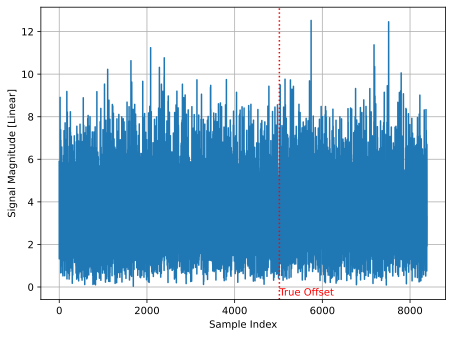
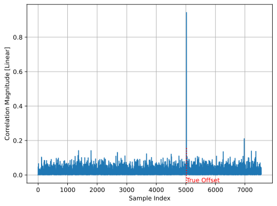
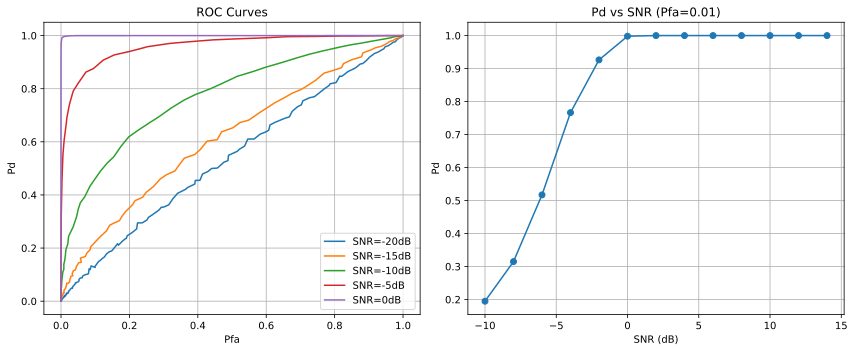
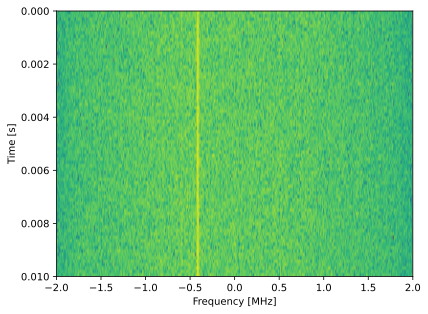
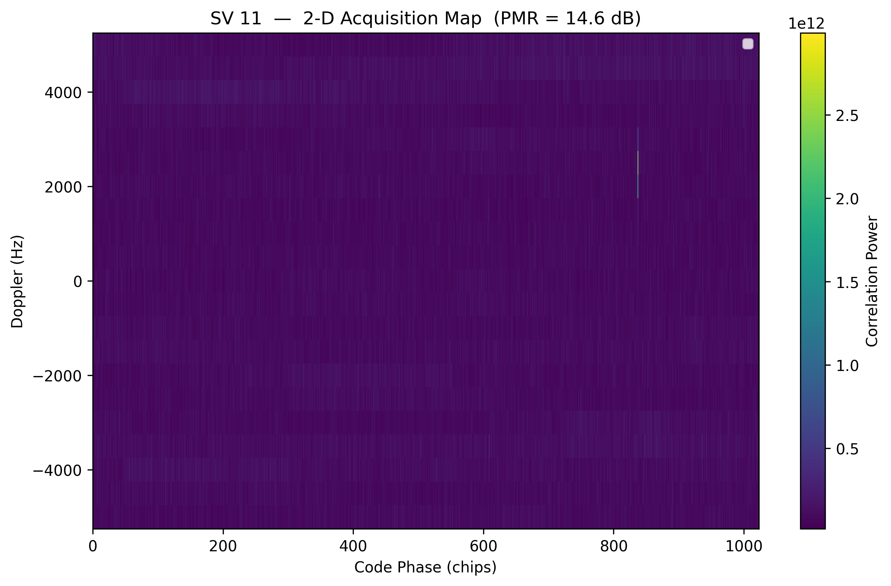
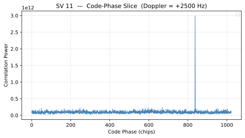
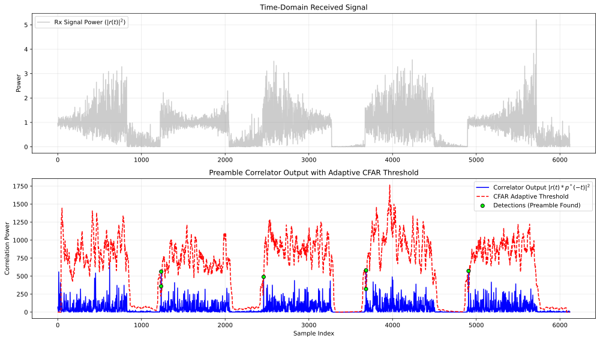
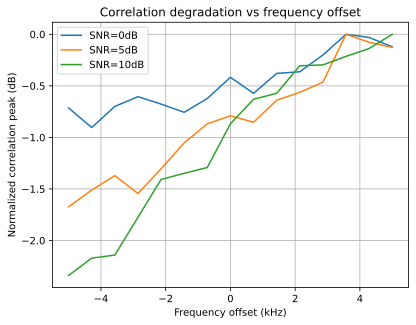
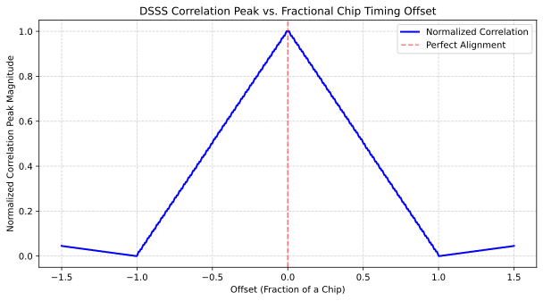
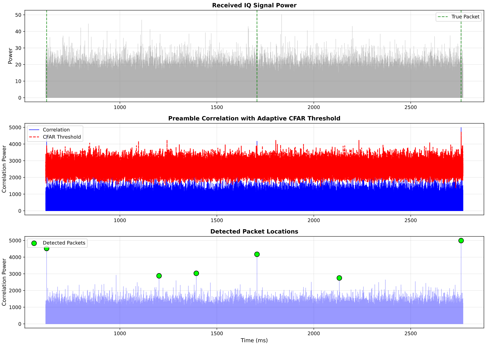

.. _detection-chapter:

#####################################################
Detection using Correlation
#####################################################

.. raw:: html

 Co-authored by <a href="https://www.linkedin.com/in/samuel-brown-vt">Sam Brown</a>

In this chapter, we learn how to detect the presence of signals and recover their timing by cross-correlating received samples with a portion of the signal that is already known to us, such as a packet preamble. That naturally leads to a simple form of classification using a bank of correlators. We introduce the core ideas of signal detection, focusing on how to decide whether a specific signal is present or absent in a noisy environment. Along the way, we cover the theory and the practical techniques used to make good decisions under uncertainty.

****************************************************
Signal Detection and Correlator Basics
****************************************************

Signal detection is the task of deciding whether an observed energy spike is a meaningful signal or just background noise.

The challenge: in systems like radar or sonar, noise is everywhere. If the detector is too sensitive, it creates false alarms. If it is not sensitive enough, it misses the actual target.

The solution starts with the Neyman-Pearson detector, which provides a mathematical sweet spot by maximizing the chance of finding a signal while keeping false alarms below a defined limit. CFAR detectors build on that idea by adapting to changes in the noise level. They are especially useful when the noise statistics are not stationary, meaning the noise floor and noise distribution change because of interference or evolving channel conditions. The goal is to adjust the detection threshold automatically as the background noise fluctuates, while maintaining a chosen false-alarm rate. That requires estimating the noise floor over time.

Once a system knows that something is present, it still needs to find exactly where the data starts. Digital packets in LTE, 5G, or WiFi begin with a preamble, which is a known repeated digital pattern. A preamble correlator acts like a lock-and-key mechanism: the key is a sequence of symbols known at the receiver and unique to the signal being recovered. By sliding a copy of the preamble over the incoming signal and taking a dot product at every delay, the receiver measures how similar the template is to the received samples at each position. When the two line up closely, a sharp spike appears and tells the receiver where to start reading the data. More advanced versions also account for frequency offsets caused by small tuning differences between a phone and a cell tower, or by Doppler shifts.

When a known signal, or preamble, is transmitted over a channel corrupted only by Additive White Gaussian Noise (AWGN), the task is to decide whether the signal is present. This is the simplest and most fundamental detection problem.

The Cross-Correlation Function
###############################

A correlator in its simplest form is a cross-correlation between a received signal and a template. Cross-correlation is just a dot product between two vectors as one vector slides across the other. If you learned about convolution, it is almost the same operation except that you do not flip the second vector, so it is slightly simpler. For complex signals, which is what we will be dealing with, one of the inputs must also be complex conjugated. In Python, this can be implemented as follows:

.. code-block:: python

    def correlate(a, v):
        n = len(a)
        m = len(v)
        result = []
        for i in range(n - m + 1):
            s = 0
            for j in range(m):
                s += a[i + j] * v[j].conjugate()
            result.append(s)
        return result

    # Example usage:
    a = [1+2j, 2+1j, 3+0j, 4-1j, 5-2j]
    v = [0+1j, 1+0j, 0.5-0.5j]
    correlate(a, v)

Note how we slide :code:`a` while complex conjugating :code:`v`, and how the loop involving :code:`j` and :code:`s` is really just a vector dot product. Luckily, we do not have to implement cross-correlation from scratch; in Python, we can use NumPy's :code:`correlate` function. There is also a SciPy version if you want to experiment with it.

Python Example of a Cross-Correlation
########################################################

To build a basic Python example of a correlator, we first need an example signal with a known preamble embedded in noise. We will use a Zadoff-Chu sequence as the preamble because of its excellent auto-correlation properties and common use in communication systems. We will not bother with any other data portion of the signal, but in most systems there would be unknown data following the known preamble. A Zadoff-Chu sequence can be generated as follows:

.. code-block:: python

    import numpy as np
    import matplotlib.pyplot as plt
    N = 839  # Length of Zadoff-Chu sequence
    u = 25  # Root of ZC sequence
    t = np.arange(N)
    zadoff_chu = np.exp(-1j * np.pi * u * t * (t + 1) / N)

The resulting sequence is itself a signal. The IQ samples in :code:`zadoff_chu` represent a baseband complex signal similar to many signals we have already seen in this textbook, but it does not represent bits. We can emulate a realistic scenario by adding the Zadoff-Chu signal into a longer stream of AWGN at a random offset:

.. code-block:: python

    signal_length = 10 * N # overall simulated signal length
    offset = np.random.randint(N, signal_length - N)
    print(f"True offset: {offset}")
    snr_db = -15
    noise_power = 1 / (2 * (10**(snr_db / 10)))
    signal = np.sqrt(noise_power/2) * (np.random.randn(signal_length) + 1j * np.random.randn(signal_length))
    signal[offset:offset+N] += zadoff_chu # place our ZC signal at the random offset

Note that we are using a very low SNR. In fact, it is so low that if you look at the time-domain signal, you will not be able to see the Zadoff-Chu sequence at all. Our sequence is 839 samples long, out of roughly 8,000 simulated samples, and it is buried so deeply in the noise that you cannot even see a slight increase in signal magnitude.

Now we can implement the correlator by cross-correlating the received signal against our known Zadoff-Chu sequence with :code:`np.correlate()`. This assumes the receiver knows the exact preamble that was used. In the code above, :code:`zadoff_chu` was originally created to simulate the signal, but it now also represents the template preamble used by the receiver. The correlator can be implemented in one line of Python:

.. code-block:: python

 correlation = np.correlate(signal, zadoff_chu, mode='valid')

The :code:`valid` mode will be addressed shortly. We also normalize the output by the length of the sequence and take the magnitude squared to get the power, although taking only the magnitude would also work. The important part is the :code:`np.correlate()` operation itself.

.. code-block:: python

 correlation = np.abs(correlation / N)**2 # normalize by N, and take magnitude squared

Below we plot the magnitude squared and annotate the actual starting position of the sequence to see if the correlator was able to find it:

Even though the SNR is very low, the correlator output shows a clear spike exactly where the Zadoff-Chu sequence was placed. That spike marks the start of the sequence, so the 839 samples beginning there contain the preamble. This is the power of correlation-based detection combined with a long preamble. At this point we have not yet set a threshold to decide whether the spike is our signal of interest or just noise; we are only inspecting the output visually. The rest of the chapter is about automating that decision, especially when the noise floor and background interference are changing.

Valid, Same, Full Modes
#######################################

You may have noticed that both :code:`np.correlate()` and :code:`np.convolve()` support three modes: :code:`valid`, :code:`same`, and :code:`full`. These modes determine the length of the output array relative to the input arrays. In our case, we used :code:`valid`, which means the output only contains points where the two input arrays fully overlap. This results in an output length of :code:`len(signal) - len(zadoff_chu) + 1`. If we had used :code:`same`, the output would be the same length as the longer input signal. If we had used :code:`full`, the output would be the full discrete linear convolution, which gives a slightly longer array of length :code:`max(M, N) - min(M, N) + 1`, where :code:`M` and :code:`N` are the input lengths. In RF signal processing, convolution is often used to apply an FIR filter, where having the input and output at the same length is convenient, so :code:`same` is common in that context. For correlation-based detection, however, we usually want :code:`valid` because we only care about the points where the preamble fully overlaps the received signal, especially if we assume the signal starts after we begin receiving.

The Neyman-Pearson Detector
############################

The gold standard for choosing a threshold for our correlator output is the Neyman-Pearson detector. This theory helps us make an optimal decision under a specific constraint: it finds the threshold that maximizes the probability of detection, :math:`P_{D}`, for a fixed and acceptable probability of false alarm, :math:`P_{FA}`. In simple terms, you decide how many false detections you can tolerate, such as one false alarm per hour, and the Neyman-Pearson detector gives you the best threshold for catching as many real signals as possible. For detecting a known preamble in AWGN, it uses a straightforward approach: it computes the correlation between the received signal and the known preamble pattern. If that value exceeds a predetermined threshold :math:`\tau`, it declares that the signal is present; otherwise, it assumes only noise is present.

The performance of this detector, measured by :math:`P_{D}` and :math:`P_{FA}`, depends on the threshold :math:`\tau`, the SNR, and the preamble length :math:`L`. The probability of a false alarm depends on the threshold and the noise variance, :math:`\sigma_n^2`:

:math:`P_{FA} = Q\left(\frac{\tau}{\sigma_n}\right)`

The probability of detection is a function of the threshold, noise variance, and the energy of the preamble (:math:`E_s = L \cdot S`, where :math:`S` is the average symbol power):

:math:`P_{D} = Q\left(\frac{\tau - \sqrt{E_s}}{\sigma_n}\right) = Q\left(\frac{\tau - \sqrt{L \cdot S}}{\sigma_n}\right)`

Here, :math:`Q(x)` is the Q-function (the tail probability of the standard normal distribution), representing the probability that a standard normal random variable exceeds :math:`x`.

Performance Analysis: ROC Curves and Pd vs. SNR Curves
#################################################################

To quantify how well a correlator detector performs in the presence of noise, engineers rely on two primary visualizations: the Receiver Operating Characteristic (ROC) curve and the Probability of Detection (:math:`P_{d}`) vs. SNR curve.

The ROC curve plots the Probability of Detection (:math:`P_{D}`) against the Probability of False Alarm (:math:`P_{FA}`) for a fixed SNR. By adjusting the detection threshold at the correlator output, you choose a point on this curve, so it is fundamentally a trade-off. A lower threshold increases :math:`P_{D}` by finding more real signals, but it also increases :math:`P_{FA}` by triggering more often on noise. The bow of the curve toward the top-left corner indicates a better detector. A perfect detector reaches the top-left corner, with 100% :math:`P_{D}` and 0% :math:`P_{FA}`; a diagonal line represents random guessing.

Taken together, the equations and intuition show that the preamble length :math:`L` is a critical design parameter because it directly controls processing gain and therefore detection performance. For a fixed threshold and SNR, :math:`P_{D}` increases with :math:`L`. A longer preamble lets us collect more signal energy, making it easier to distinguish the signal from the background noise. This improvement is called processing gain, usually measured in dB as :math:`10\log_{10}(L)`. It is crucial for detecting weak signals that would otherwise be missed. By integrating energy over more samples, we can pull signals out of noise even when they are below the noise floor. GPS is a good real-world example of that effect, because the receiver has to recover very weak signals with a known code structure.

****************************************************
Example: Detecting GPS Signals Below the Noise Floor
****************************************************

Quick Primer on GPS Signals
###############################

As of March 2026, there are 31 operational satellites in the U.S. GPS constellation, flying in medium Earth orbit (MEO) and circling the Earth twice per day. All satellites transmit a signal centered at 1575.42 MHz, called L1, and they all use the same carrier frequency. By the time the signal reaches the surface of the Earth, it is extremely weak and well below the noise floor. Orthogonality between satellites is achieved by assigning each one a unique 1023-chip pseudo-random noise (PRN) code, called the C/A code, which is why you may see the signal referred to as L1 C/A. These C/A codes use Gold codes and are carefully designed so that any two of them are nearly orthogonal; if you correlate any two satellites' codes against each other, you get almost zero output. The C/A code runs at 1.023 million chips per second and is only 1023 chips long, so it repeats every 1 ms. On top of that repeating code, each satellite slowly modulates navigation data, such as orbital position and clock corrections, at only 50 bits per second, so one data bit spans 20 full code repetitions. This use of a different code per transmitter is known as CDMA (Code Division Multiple Access), the same idea used in 3G cell phones.

On the receiver side, finding one of the 31 satellites means generating a local copy of that satellite's PRN sequence and using a correlator to find the start of the code period. In GPS, that start can be treated like the start of a packet or frame, even though the system transmits continuously. The precise peak of the correlation is also used to estimate how far the signal has traveled before reaching the receiver; once that is known for four or more satellites, the receiver can trilaterate its position on Earth. Because the satellites are moving at about 4 km/s relative to you, the receiver must also search across a grid of possible frequency offsets to find the best correlation peak. Think of it as a 2-D search. The maximum Doppler is about +/-20 kHz (:code:`4e3 / 3e8 * 1.575e9`). This process repeats every 1 ms, although the receiver tracks delay and Doppler so it does not need to perform a full search every time. The initial search for each satellite is called acquisition, and the process of following the signal after that is called tracking. Acquisition is the more computationally expensive part, and it can take minutes if the receiver starts from scratch with no prior information about visible satellites, Doppler shifts, or its own location.

Correlation Approach
###############################

We cross-correlate the incoming signal, in this case a recording of L1, against a locally generated replica of each satellite's code. A large correlation peak means the satellite is visible and gives us the start of the 1 ms code period. To search across frequency as well, we use an FFT-based correlation in the frequency domain, which lets us test multiple frequency offsets efficiently by shifting the FFT bins of the local code replica. Finally, we accumulate correlation magnitude squared over multiple 1 ms blocks to improve SNR. This is called non-coherent integration, and it helps detect GPS signals that are received below the noise floor. We threshold the result against the correlation output divided by the average correlation power across all delays, which normalizes the result.

Example Recording
###############################

We will use an example GPS recording provided by Daniel Estévez, which you can `download here <https://raw.githubusercontent.com/777arc/PySDR/refs/heads/master/figure-generating-scripts/GPS_L1_recording_10ms_4MHz_cf32.iq>`_. It is a complex float32 file sampled at 4 MHz and centered at 1575.42 MHz.

Below is the spectrogram of the recording. There is not much to see, and the vertical line is not the actual GPS signal; it is likely narrowband interference. The actual GPS L1 signals use a chip rate of 1.023 MHz with a very low-rate data signal modulated on top, so the signal ends up being about 2 MHz wide, which we simply do not see in the spectrogram. This is a good example of how GPS signals are received well below the noise floor, and why we need correlation-based detection to find them.

For those interested, this recording is a small portion of a much larger file hosted on `IQEngine <https://iqengine.org/>`_ under :code:`estevez/GPS and other GNSS`; look for the recording called :code:`GPS-L1-2022-03-27`. On IQEngine, it is an int16 file in SigMF format.

Python Example
#####################

Make sure to change the :code:`filename` to match the location where you downloaded the IQ file. Note that :code:`num_integrations` determines how much of the recording we read in and process; the total duration is simply this number times 1 ms, with 10 being the maximum value for the shorter recording.

.. code-block:: python

    import numpy as np
    import matplotlib.pyplot as plt

    filename = "GPS_L1_recording_10ms_4MHz_cf32.iq"
    sample_rate = 4e6
    chip_rate = 1023000 # chips / sec (part of the GPS spec)
    num_chips = 1023 # chips per C/A code period
    samples_per_code = int(round(sample_rate / chip_rate * num_chips))  # Exact number of samples in one 1 ms code period at 4 MHz
    doppler_min_hz = -5e3 # GPS Doppler ≈ ±4 kHz for stationary receiver
    doppler_max_hz = 5e3
    doppler_step_hz = 500 # good enough for a coarse search
    num_integrations = 10 # non-coherent power integrations (so 10 ms total), determines how much of the IQ recording we read in and process!
    detection_thresh_dB =  14.0 # Peak-to-mean ratio (PMR) threshold in dB to declare a detection, GPS C/A signals are typically 14–20 dB PMR above threshold with 10ms of integration
    gps_svs = list(range(1, 33)) # 1–32

    ##### C/A Code Generation #####
    # The GPS C/A code is a Gold code formed by XOR-ing two 10-stage maximal-length
    # shift registers (G1 and G2).  G2 is effectively delayed by a satellite-
    # specific number of chips before the XOR
    # Reference: IS-GPS-200, Table 3-Ia
    G2_DELAY = [ # G2 phase delay (chips) for gps_svs 1–32
        5,   6,   7,   8,  17,  18, 139, 140,   #  1– 8
        141, 251, 252, 254, 255, 256, 257, 258,   #  9–16
        469, 470, 471, 472, 473, 474, 509, 512,   # 17–24
        513, 514, 515, 516, 859, 860, 861, 862,   # 25–32
    ]

    """G1 LFSR: polynomial x^10 + x^3 + 1, all-ones init, output at stage 10."""
    reg = np.ones(10, dtype=np.int8)
    G1 = np.empty(num_chips, dtype=np.int8)
    for i in range(num_chips):
        G1[i] = reg[9]
        fb = reg[2] ^ reg[9] # stages 3 and 10 (0-indexed: 2 and 9)
        reg = np.roll(reg, 1)
        reg[0] = fb

    """G2 LFSR: polynomial x^10+x^9+x^8+x^6+x^3+x^2+1, all-ones init."""
    reg = np.ones(10, dtype=np.int8)
    G2 = np.empty(num_chips, dtype=np.int8)
    for i in range(num_chips):
        G2[i] = reg[9]
        fb = reg[1]^reg[2]^reg[5]^reg[7]^reg[8]^reg[9]  # taps 2,3,6,8,9,10
        reg = np.roll(reg, 1)
        reg[0] = fb

    # 1023-chip C/A PRN code for SV sv (1-32) as float32, 1's and -1's, so BPSK
    def make_prn(sv: int) -> np.ndarray:
        g2_delayed = np.roll(G2, G2_DELAY[sv - 1])
        bits = G1 ^ g2_delayed           # {0, 1}
        return (1 - 2 * bits).astype(np.float32)   # BPSK: {+1, −1}

    def upsample_prn(sv: int) -> np.ndarray:
        """Nearest-neighbour upsample 1023-chip C/A code → samples_per_code samples."""
        code = make_prn(sv)
        idx = (np.arange(samples_per_code) * num_chips / samples_per_code).astype(int)
        return code[idx]

    # Pre-compute template signals - conjugate FFTs of all upsampled PRN codes
    template_signals = {sv: np.conj(np.fft.fft(upsample_prn(sv))) for sv in gps_svs}

    # Read in IQ file
    n_needed = samples_per_code * num_integrations
    iq = np.fromfile(filename, dtype=np.complex64, count=n_needed)
    # For the full version from IQEngine use the following instead
    #iq = np.fromfile(filename, dtype=np.int16, count=n_needed * 2)
    #iq = (iq[0::2] + 1j * iq[1::2]).astype(np.complex64)

    # Search each satellite across Doppler and code phase
    results = []
    detected = []
    print(f"  {'SV':>3}  {'Doppler (Hz)':>13}  {'Phase (chips)':>14}"
            f"  {'Phase (samp)':>13}  {'Delay (µs)':>11}  {'PMR (dB)':>9}")
    doppler_bins = np.arange(doppler_min_hz, doppler_max_hz + doppler_step_hz, doppler_step_hz)
    for sv in gps_svs:
        corr_map = np.zeros((len(doppler_bins), samples_per_code))
        n_total = samples_per_code * num_integrations
        for di, f_d in enumerate(doppler_bins):
            t = np.arange(n_total) / sample_rate # Time vector
            mixed = iq[:n_total] * np.exp(-2j*np.pi*float(f_d)*t) # Apply the frequency shift

            # Accumulate squared correlation magnitude non-coherently
            for k in range(num_integrations):
                blk = mixed[k * samples_per_code:(k + 1) * samples_per_code]
                sig_fft = np.fft.fft(blk)
                corr = np.fft.ifft(sig_fft * template_signals[sv]) # Frequency-domain correlation
                corr_map[di] += np.abs(corr)**2

        # Normalize by the mean and convert to dB
        peak_val = float(np.max(corr_map))
        mean_val = float(np.mean(corr_map))
        pmr_db = 10.0 * np.log10(peak_val / mean_val)

        peak_idx = np.unravel_index(np.argmax(corr_map), corr_map.shape)
        best_doppler_hz   = float(doppler_bins[peak_idx[0]])
        best_phase_samp   = int(peak_idx[1])
        best_phase_chips  = best_phase_samp * num_chips / samples_per_code

        r = {
            "sv": sv,
            "detected": pmr_db >= detection_thresh_dB,
            "doppler_hz": best_doppler_hz,
            "code_phase_samp": best_phase_samp, # sample offset = "start of packet"
            "code_phase_chip": best_phase_chips,
            "pmr_db": pmr_db,
            "corr_map": corr_map,
            "doppler_bins": doppler_bins,
        }
        results.append(r)

        # Print the result row
        delay_us = r['code_phase_samp'] / sample_rate * 1e6
        flag = "  ← DETECTED" if r['detected'] else ""
        print(f"  {sv:>3}  {r['doppler_hz']:>+13.0f}  {r['code_phase_chip']:>14.2f}"
            f"  {r['code_phase_samp']:>13d}  {delay_us:>11.3f}  {r['pmr_db']:>9.1f}{flag}")

This should give the following output:

.. code-block::

   SV   Doppler (Hz)   Phase (chips)   Phase (samp)   Delay (µs)   PMR (dB)
    1          -3000          757.79           2963      740.750        5.6
    2          +1500          264.19           1033      258.250        9.1
    3          -2000          316.62           1238      309.500        5.8
    4          +5000          577.48           2258      564.500        5.0
    5          +1000           64.96            254       63.500        5.3
    6          +1500          511.76           2001      500.250        5.0
    7          -4000          763.41           2985      746.250        5.0
    8          +3500          961.62           3760      940.000        5.4
    9          +3500          118.67            464      116.000        4.9
   10             +0          890.52           3482      870.500        5.4
   11          +2500          837.33           3274      818.500       14.6  ← DETECTED
   12           -500          871.60           3408      852.000       16.4  ← DETECTED
   13          +1000          137.85            539      134.750        5.9
   14          +2500          287.72           1125      281.250        5.0
   15          -5000          908.68           3553      888.250        5.3
   16          +1500          292.58           1144      286.000        5.9
   17           +500          994.61           3889      972.250        5.3
   18          +4500         1005.61           3932      983.000        5.4
   19          +5000          588.48           2301      575.250        5.0
   20             +0          768.53           3005      751.250        5.4
   21          -3000          749.60           2931      732.750        5.0
   22          +2500          558.05           2182      545.500       14.4  ← DETECTED
   23          -5000          390.02           1525      381.250        5.3
   24          +2500          955.48           3736      934.000        5.9
   25          +1500          597.94           2338      584.500       15.5  ← DETECTED
   26          -1500          239.89            938      234.500        6.2
   27          -2500          488.74           1911      477.750        4.7
   28          +3000          858.81           3358      839.500        5.2
   29          -4000          998.70           3905      976.250        5.2
   30          -2000          937.58           3666      916.500        5.2
   31          +5000          463.42           1812      453.000       15.9  ← DETECTED
   32          +1000          342.45           1339      334.750       16.2  ← DETECTED

As you can see, we detected 6 satellites, and even though our threshold was 14.0, we can look at this list and tell pretty easily that most of the other satellites were not in view, with the exception of SV-2 which was probably in view but didn't quite reach the threshold.  If anyone feels like verifying this, the recording was taken at 2022-03-27T11:32:04 somewhere in Spain.

Plotting
###########

Let's try plotting the results for satellite 11; the first one we detected.  The first plot is the 2-D correlation map across Doppler and time/delay, and the second plot is a slice of the correlation map at the best Doppler bin, showing correlation power over time like we have seen in the previous section.

.. code-block:: python

    # Plotting
    sv = 11 # we detected 11, 12, 22, 25, 31, 32 although try looking at one we didnt find as well!
    r = results[sv - 1] # print the dict of results for this SV to see what we got
    cmap = r['corr_map'] # 2-D array of correlation power vs Doppler and code phase
    d_bins = r['doppler_bins'] # Doppler bins corresponding
    chips_axis = np.arange(samples_per_code) * num_chips / samples_per_code

    # 2-D Doppler × code-phase map
    plt.figure(0, figsize=(10, 6))
    im = plt.pcolormesh(chips_axis, d_bins, cmap, shading='auto', cmap='viridis')
    plt.xlabel("Code Phase (chips)")
    plt.ylabel("Doppler (Hz)")
    plt.title(f"SV {sv}  —  2-D Acquisition Map  (PMR = {r['pmr_db']:.1f} dB)")
    plt.legend(fontsize=8, loc='upper right')
    plt.colorbar(im, label="Correlation Power")

    # Code-phase slice at the best Doppler
    best_di = int(np.argmin(np.abs(d_bins - r['doppler_hz'])))
    plt.figure(1, figsize=(10, 6))
    plt.plot(chips_axis, cmap[best_di], lw=1, color='steelblue')
    plt.xlabel("Code Phase (chips)")
    plt.ylabel("Correlation Power")
    plt.title(f"SV {sv}  —  Code-Phase Slice  (Doppler = {r['doppler_hz']:+.0f} Hz)")
    plt.legend(fontsize=8)
    plt.grid(True, alpha=0.3)

    plt.show()

We won't get into the process of trilateration here, but the precise position of that spike is ultimately what allows the GPS receiver to determine how far the satellite is, and when combined with the same information from 4 or more satellites, it can determine its position on Earth.

****************************************************
CFAR Detectors: Thriving in Changing Environments
****************************************************

While the Neyman-Pearson detector is optimal for a fixed noise level, real-world conditions are rarely that stable. In a dynamic environment—like a radar tracking a plane through rain or a wireless receiver in a crowded city—the background noise and interference levels fluctuate constantly. This is where the Constant False Alarm Rate (CFAR) detector becomes essential.

CFAR detectors are the workhorses of systems where an unpredictable background makes a fixed threshold impossible to maintain:

- Radar and Sonar are used to detect targets (planes, submarines) against "clutter"—reflections from waves, rain, or land that change as the sensor moves.
- Wireless Communications, such as Cognitive Radio and LTE/5G systems, use CFAR to help identify available spectrum or detect incoming packets when interference from other devices is burst-y and unpredictable.
- Medical Imaging applies CFAR in automated ultrasound or MRI analysis to distinguish actual tissue features from varying levels of electronic noise.

The "C" in CFAR stands for Constant because the goal is to keep the Probability of False Alarm (:math:`P_{FA}`) at a steady, predictable level.

To set a threshold, you must assume a statistical model for the noise, which is called the noise distribution. In simple AWGN, noise follows a Gaussian distribution. However, in radar clutter, it might follow a Rayleigh or Weibull distribution. If your model is wrong, your :math:`P_{FA}` will "drift," causing the system to either go blind or be overwhelmed by false triggers.

Instead of a hard-coded value, a CFAR detector estimates the noise power in the local "neighborhood" of the signal and multiplies this estimate by a scaling factor (:math:`T`) derived from your desired :math:`P_{FA}`. This ensures that as the noise floor rises, the threshold rises with it. 

Per-Lag vs. System-Level False Alarm Rates
####################################################

This is a crucial distinction often missed by beginners. When you are searching for a preamble, you are usually performing a sliding correlation, checking the threshold at thousands of different time offsets (or "lags") every second.

Per-Lag :math:`P_{FA}`: This is the probability that a single specific correlation check results in a false alarm. If you set your math for a :math:`P_{FA}` of 0.001, each individual lag has a 1-in-1,000 chance of being a "ghost" signal.

System-Level (Global) :math:`P_{FA}`: This is the probability that the system triggers at least one false alarm during an entire search window (e.g., across 2,048 lags).

Mathematically, if your per-lag :math:`P_{FA}` is :math:`p`, the probability of at least one false alarm over :math:`N` lags is approximately :math:`1-(1-p)^{N}`.

As a consequence, if you have 1,000 lags and a per-lag :math:`P_{FA}` of 0.001, your system will actually report a false alarm almost 63% of the time you search! To keep the system-level false alarm rate low, the per-lag :math:`P_{FA}` must be set to an extremely small value.

Python Example
###############

As a way to play around with our own CFAR detector, we'll first simulate a scenario that involves transmitting repeating QPSK packets with a known preamble over a channel with a time-varying noise floor. We'll then implement a simple Cell-Averaging CFAR (CA-CFAR) algorithm to detect the preambles in the received signal.  The following Python code generates the received signal:

.. code-block:: python

    import numpy as np
    import matplotlib.pyplot as plt
    from scipy.signal import correlate

    def generate_qpsk_packets(num_packets, sps, preamble):
        """Generates repeating QPSK packets with gaps and varying noise."""
        qpsk_map = np.array([1+1j, -1+1j, -1-1j, 1-1j]) / np.sqrt(2)
        data_len = 200
        gap_len = 100
        full_signal = []
        
    # Precompute the upsampled preamble for correlation
        upsampled_preamble = np.repeat(preamble, sps)
        
        for _ in range(num_packets):
            data = qpsk_map[np.random.randint(0, 4, data_len)]
            packet = np.concatenate([preamble, data])
            full_signal.extend(np.repeat(packet, sps))
            full_signal.extend(np.zeros(gap_len * sps))
        
        return np.array(full_signal), upsampled_preamble

    # Simulation parameters
    sps = 4
    preamble_syms = np.array([1+1j, 1+1j, -1-1j, -1-1j, 1-1j, -1+1j]) / np.sqrt(2)
    tx_signal, ref_preamble = generate_qpsk_packets(5, sps, preamble_syms)

    # Time-varying noise floor
    t = np.arange(len(tx_signal))
    noise_env = 0.05 + 0.3 * np.sin(2 * np.pi * 0.0003 * t)**2
    noise = (np.random.randn(len(tx_signal)) + 1j*np.random.randn(len(tx_signal))) * noise_env
    rx_signal = tx_signal + noise

The first step is doing a single correlation of the received signal against the known preamble, in practice this is usually done in batches of samples, but we will do it in one batch for now:

.. code-block:: python

    # Correlation spike appears when the reference matches the received segment
    corr_out = correlate(rx_signal, ref_preamble, mode='same')
    corr_power = np.abs(corr_out)**2

TODO: look at just the raw output of this step

Now we will implement the CFAR detector, apply it to the correlator output, and visualize the results:

.. code-block:: python

    # CFAR detection on the correlator output
    def ca_cfar_adaptive(data, num_train, num_guard, pfa):
        num_cells = len(data)
        thresholds = np.zeros(num_cells)
        alpha = num_train * (pfa**(-1/num_train) - 1)  # Scaling factor
        half_window = (num_train + num_guard) // 2
        guard_half = num_guard // 2
        for i in range(half_window, num_cells - half_window):
            # Build the training set around the cell under test (CUT)
            lagging_win = data[i - half_window : i - guard_half]
            leading_win = data[i + guard_half + 1 : i + half_window + 1]
            noise_floor_est = np.mean(np.concatenate([lagging_win, leading_win]))
            thresholds[i] = alpha * noise_floor_est
        return thresholds

    # Detect peaks in correlator power
    cfar_thresholds = ca_cfar_adaptive(corr_power, num_train=60, num_guard=20, pfa=1e-5)
    detections = np.where(corr_power > cfar_thresholds)[0]
    # Remove edge detections where the threshold is undefined
    detections = detections[cfar_thresholds[detections] > 0]

    # Subplot 1: received signal and raw power
    plt.figure(figsize=(14, 8))
    plt.subplot(2, 1, 1)
    plt.plot(np.abs(rx_signal)**2, color='gray', alpha=0.4, label='Rx Signal Power ($|r(t)|^2$)')
    plt.title("Time-Domain Received Signal")
    plt.ylabel("Power")
    plt.legend()
    plt.grid(True, alpha=0.3)

    # Subplot 2: correlator output vs adaptive threshold
    plt.subplot(2, 1, 2)
    plt.plot(corr_power, label='Correlator Output $|r(t) * p^*(-t)|^2$', color='blue')
    plt.plot(cfar_thresholds, label='CFAR Adaptive Threshold', color='red', linestyle='--', linewidth=1.5)
    if len(detections) > 0: # Overlay the detections
        plt.scatter(detections, corr_power[detections], color='lime', edgecolors='black', label='Detections (Preamble Found)', zorder=5)
    plt.title("Preamble Correlator Output with Adaptive CFAR Threshold")
    plt.xlabel("Sample Index")
    plt.ylabel("Correlation Power")
    plt.legend()
    plt.grid(True, alpha=0.3)
    plt.show()

Frequency Offset Resilient Preamble Correlators
####################################################

Detecting a preamble becomes a multi-dimensional search problem when the center frequency is unknown. In a perfectly synchronized system, a coherent correlator acts as a matched filter and maximizes SNR. However, frequency offsets introduce a time-varying phase rotation that decorrelates the signal from the local template, leading to a major loss of detection sensitivity.

The impact of frequency offset :math:`\Delta f` depends on its magnitude relative to the preamble duration (:math:`T_{p}`):

Slightly shifted signals, such as those affected by Doppler or clock drift, are typically caused by local oscillator (LO) ppm inaccuracies or low-velocity motion. In this case, :math:`\Delta f \cdot T_{p} \ll 1`. The correlation peak is slightly attenuated, but the timing can still be recovered.

When the frequency offset is completely unknown, such as in cold-start satellite acquisition or high-dynamic UAV links, the coherent sum can null out to zero if the phase rotates by more than :math:`180^{\circ}` over the preamble (:math:`\Delta f > 1/(2T_{p})`). In that case, detection becomes impossible regardless of SNR.

The loss in correlation magnitude due to a frequency offset is described by the Dirichlet kernel (or the periodic sinc function). As the frequency offset increases, the coherent sum of rotated vectors follows this sinc-like roll-off.

The loss in dB due to frequency offset can be approximated by the following formula:

:math:`L_{dB}(\Delta f) = 20 \log_{10} \left| \frac{\sin(\pi \Delta f N T_{s})}{N \sin(\pi \Delta f T_{s})} \right|`

Where:

   - :math:`N`: Number of symbols in the preamble.
   - :math:`T_{s}`: Symbol period.
   - :math:`\Delta f`: Frequency offset in Hz.

As :math:`\Delta f` increases, the numerator oscillates while the denominator grows, creating nulls in the detector's sensitivity. For a standard correlator, the first null occurs at :math:`\Delta f = 1/(N T_{s})`. If your offset is half of the bin width, you lose approximately 3.9 dB, which significantly degrades your effective SNR and :math:`P_{d}`.

Methods for Resilience to Frequency Offsets
###########################################

A. Coherent Segmented Correlator

The preamble of length :math:`N` is divided into :math:`M` segments of length :math:`L = N/M`. Each segment is correlated coherently, and the results are combined by compensating for the phase drift between segments.

:math:`Y_{coh} = \sum_{m=0}^{M-1} \left( \sum_{k=0}^{L-1} r[k+mL] \cdot p^{*}[k] \right) e^{-j \hat{\phi}_m}`

Where :math:`\hat{\phi}_m` is an estimate of the phase rotation for that segment. This preserves the SNR gain of a full-length preamble but requires an accurate frequency estimate to align the phases.

B. Non-Coherent Segmented Correlator

Segments are correlated coherently, but their magnitudes are summed, discarding phase information.

:math:`Y_{non-coh} = \sum_{m=0}^{M-1} \left| \sum_{k=0}^{L-1} r[k+mL] \cdot p^{*}[k] \right|^{2}`

This approach is extremely robust to frequency offsets (up to :math:`1/(L T_{s})`). However, it suffers from Non-Coherent Integration Loss. Summing magnitudes instead of complex values allows noise to accumulate faster than the signal, effectively reducing the "post-detection" SNR.

C. Brute-Force Frequency Search

The receiver runs multiple parallel correlators, each shifted by a discrete frequency :math:`\Delta f_{i}`.

This method provides the best SNR performance (full coherent gain) but is the most computationally expensive. The "bin spacing" must be tight enough (based on the Dirichlet formula) to ensure the worst-case loss between bins is acceptable (e.g., < 1 dB).

In time-domain tapping, samples are convolved with a fixed set of weights. In a frequency search, this requires a separate FIR bank for every frequency bin. This is efficient for short preambles on FPGAs using Xilinx DSP48 slices.
Frequency-Domain (FFT) Processing: To perform a search, you take the FFT of the incoming signal and the preamble. Multiplication in the frequency domain is equivalent to correlation.
The "Frequency Shift Trick": To test different frequency offsets, you don't need multiple FFTs. You can simply circularly shift the FFT bins of the preamble relative to the signal before performing the point-wise multiplication and IFFT.
For continuous streams, chunking methods such as Overlap-Save or Overlap-Add are used to process data in chunks without losing the correlation peaks at the edges of the FFT windows. 

Frequency-offset resilience is a trade-off between processing gain and computational complexity. Non-coherent segmented correlation is the most robust choice for high-uncertainty environments, but it requires a higher link margin. Coherent segmented and brute-force FFT searches provide better sensitivity, but they require significantly more hardware resources. Understanding the Dirichlet-driven loss is critical when choosing the bin density for any frequency-searching receiver.

TODO: Explain this plot and add some portion of the Python to the section

*****************************************************************
Detecting Direct Sequence Spread Spectrum (DSSS) Signals
*****************************************************************

In a Direct Sequence Spread Spectrum (DSSS) system, the correlator detector is the link that pulls a meaningful signal out of what initially looks like random noise. By using a high-rate chip sequence, or chipping code, the system spreads the signal energy across a much wider bandwidth than the original data requires. Because the total power stays constant, spreading it over a broader frequency range lowers the power spectral density (PSD). This spectral thinning effect can drive the signal level below the thermal noise floor, making it nearly invisible to conventional narrow-band receivers. To the intended receiver, however, the same chip sequence can be applied to de-spread the signal, concentrating the energy back into the original narrow bandwidth while also spreading out narrow-band interference. That is what allows reliable detection even in very noisy environments. The next subsection looks at the timing side of that problem.

The Role of Auto-Correlation Properties
########################################

Choosing the right sequence is critical for synchronization and multipath rejection. Ideally, a sequence should have perfect auto-correlation: a high peak when perfectly aligned and near-zero values at any other time offset. Sharp auto-correlation peaks allow the receiver to lock onto the signal with sub-chip timing accuracy. If a signal reflects off a building and arrives late, good auto-correlation ensures the receiver treats the delayed version as uncorrelated noise rather than destructive interference, which helps mitigate multipath.

Common Spreading Sequences
##########################

Different applications require different mathematical properties in their spreading sequences. Some examples include:

- Barker Codes, which are known for having the best possible auto-correlation properties for short lengths (up to 13), and are famously used in 802.11b Wi-Fi.
- M-Sequences (Maximal Length), generated using linear-feedback shift registers (LFSRs), provide excellent randomness and auto-correlation over very long periods.
- Gold Codes, derived from pairs of m-sequences, offer a large set of sequences with controlled cross-correlation, making them the standard for GPS and CDMA where multiple signals must coexist.
- Zadoff-Chu (ZC) Sequences are complex-valued sequences with constant amplitude and zero auto-correlation for all non-zero shifts, and are now a staple in LTE and 5G for synchronization.
- Kasami Codes are similar to Gold codes but have even lower cross-correlation for a given sequence length, making them useful in high-density environments.

Chip-Timing Synchronization in DSSS
####################################################

In a DSSS system, the receiver's ability to recover data depends entirely on synchronization with the incoming chip sequence. Because chips are much shorter than data bits, even a small fractional timing error, where the receiver samples between chips, can significantly reduce the correlation peak. We can explore the impact of a fractional timing offset by simulating a simple DSSS system and plotting the correlation output as the timing offset varies from 0 to 1 chip. Note that we do not do a full correlation here; we just take a dot product at 0 lag because we already know that is where the peak will be.

.. code-block:: python

    import numpy as np
    import matplotlib.pyplot as plt

    # Barker 11 sequence
    barker11 = np.array([1, -1, 1, 1, -1, 1, 1, 1, -1, -1, -1])
    samples_per_chip = 100

    # Upsample the sequence to simulate continuous time
    sig = np.repeat(barker11, samples_per_chip)

    offsets = np.linspace(-1.5, 1.5, 500) # Fractional chip offsets
    peaks = []

    for offset in offsets:
        # Shift the signal by a fractional number of chips, converted to samples
        shift_samples = int(offset * samples_per_chip)
        if shift_samples > 0:
            shifted_sig = np.pad(sig, (shift_samples, 0))[:len(sig)]
        elif shift_samples < 0:
            shifted_sig = np.pad(sig, (0, abs(shift_samples)))[abs(shift_samples):]
        else:
            shifted_sig = sig
            
        # Compute normalized correlation at zero lag for this offset
        correlation = np.vdot(sig, shifted_sig) / np.vdot(sig, sig)
        peaks.append(np.abs(correlation))

    plt.figure(figsize=(10, 5))
    plt.plot(offsets, peaks, label='Normalized Correlation', color='blue', linewidth=2)
    plt.axvline(0, color='red', linestyle='--', alpha=0.5, label='Perfect Alignment')
    plt.title('DSSS Correlation Peak vs. Fractional Chip Timing Offset')
    plt.xlabel('Offset (Fraction of a Chip)')
    plt.ylabel('Normalized Correlation Peak Magnitude')
    plt.grid(True, which='both', linestyle='--', alpha=0.6)
    plt.legend()
    plt.savefig('../_images/detection_dsss.svg', bbox_inches='tight')
    plt.show()

The peak occurs at zero offset as expected, and it drops linearly, reaching half the peak value at a half-chip offset. After more than one chip of offset, the correlation might appear to rise again, but the actual peak is low because the signal is no longer aligned to the sequence.

****************************************************
Real-Time Packet Detection in Continuous IQ Streams
****************************************************

So far we have explored the theoretical foundations of signal detection, from correlators to CFAR detectors to spread-spectrum systems. Now we bring them together to solve a common practical problem: **detecting intermittent packets in a continuous stream of IQ samples from an SDR**. Consider this scenario: a modem or IoT device transmits a data packet once per second, or at irregular intervals. Your SDR is continuously receiving samples at, say, 1 MHz. The packets arrive at unpredictable times, buried in noise and interference. You need to:

1. Detect when a packet arrives
2. Determine the exact sample index where it starts
3. Extract the packet for further processing (demodulation, decoding, etc.)
4. Do this in real-time without missing packets

This is fundamentally different from processing a pre-recorded IQ file, where you can analyze the entire signal at once. Here, samples arrive continuously, and you must make decisions in real time with limited computational resources. We will combine several techniques covered in this chapter:

1. **Cross-Correlation**: To find the known preamble pattern
2. **CFAR Detection**: To adaptively set thresholds despite varying noise
3. **Buffer Management**: To handle continuous streaming data
4. **Peak Detection**: To extract precise packet timing

To operate in real time, we accumulate samples in **buffers** of, say, 100,000 samples, run the detector on each buffer, and maintain state across buffer boundaries so that packets spanning two buffers are not missed.

Implementation
##############

Our detector follows this workflow:

.. mermaid::

 flowchart TD
    A("Continuous IQ Stream from SDR (1 MHz sample rate)")
    B("Buffer Accumulation (100k samples = 0.1 sec)")
    C("Cross-Correlation with Known Preamble")
    D("CFAR Threshold Computation")
    E("Peak Detection (correlation > threshold)")
    F("Packet Extraction & Validation")
    A --> B --> C --> D --> E --> F

To avoid missing packets that straddle buffer boundaries, we use an **overlap-save** approach, where each buffer includes the last ``N_preamble`` samples from the previous buffer. This ensures that any packet starting near the end of buffer ``i`` will be fully contained in buffer ``i+1``. It adds a small amount of computational overhead, but that is preferable to missing packets at the buffer edge.

Let's build a complete packet detector in Python one step at a time. We will use a shorter Zadoff-Chu preamble than before and implement an adaptive CFAR detector.

Step 1: Define the Preamble and Parameters
*******************************************

.. code-block:: python

    import numpy as np
    import matplotlib.pyplot as plt
    from scipy.signal import correlate
    
    # Preamble: Zadoff-Chu sequence (excellent correlation properties)
    N_zc = 63  # ZC sequence length (typically prime or power of 2 - 1)
    u = 5      # ZC root
    t = np.arange(N_zc)
    preamble = np.exp(-1j * np.pi * u * t * (t + 1) / N_zc)
    
    # System parameters
    sample_rate = 1e6  
    buffer_size = 100000
    overlap_size = len(preamble)  # Overlap to catch boundary packets
    
    # CFAR parameters
    cfar_guard = 10
    cfar_train = 50
    pfa_target = 1e-6
    
    # Packet parameters (for simulation)
    packet_length = 500  # Total packet length in samples (preamble + data)
    snr_db = -5

Step 2: CFAR Detector Function
*******************************

We'll use the Cell-Averaging CFAR (CA-CFAR) from earlier, slightly optimized:

.. code-block:: python

    def ca_cfar_1d(signal, num_train, num_guard, pfa):
        """
        1D Cell-Averaging CFAR detector.
        
        Args:
            signal: Input signal (typically correlation magnitude)
            num_train: Number of training cells (on each side)
            num_guard: Number of guard cells (on each side)
            pfa: Target probability of false alarm
            
        Returns:
            threshold: Adaptive threshold array
        """
        n = len(signal)
        threshold = np.zeros(n)
        alpha = num_train * (pfa**(-1/num_train) - 1)
        
        for i in range(n):
            # Define training window indices
            train_start_left = max(0, i - num_guard - num_train)
            train_end_left = max(0, i - num_guard)
            train_start_right = min(n, i + num_guard + 1)
            train_end_right = min(n, i + num_guard + num_train + 1)
            
            # Collect training cells (avoid guard cells and CUT)
            train_cells = np.concatenate([
                signal[train_start_left:train_end_left],
                signal[train_start_right:train_end_right]
            ])
            
            if len(train_cells) > 0:
                noise_est = np.mean(train_cells)
                threshold[i] = alpha * noise_est
        
        return threshold

Step 3: Packet Detection Function
**********************************

.. code-block:: python

    def detect_packets(buffer, preamble, cfar_guard, cfar_train, pfa, 
                      min_spacing=None):
        """
        Detect packets in a buffer of IQ samples.
        
        Args:
            buffer: Complex IQ samples
            preamble: Known preamble sequence
            cfar_guard: CFAR guard cells
            cfar_train: CFAR training cells
            pfa: Target false alarm probability
            min_spacing: Minimum samples between detections (prevents duplicates)
            
        Returns:
            detections: List of sample indices where packets start
        """
        # Correlate buffer with preamble
        corr = correlate(buffer, preamble, mode='same')
        corr_power = np.abs(corr)**2
        
        # Compute adaptive threshold
        threshold = ca_cfar_1d(corr_power, cfar_train, cfar_guard, pfa)
        
        # Find peaks above threshold
        detections_raw = np.where(corr_power > threshold)[0]

        # Compensate for correlation offset (peak occurs at len(preamble)//2 after true start)
        half_preamble = len(preamble) // 2
        detections_raw = detections_raw - half_preamble
        
        # Remove edge detections (unreliable)
        half_preamble = len(preamble) // 2
        detections_raw = detections_raw[
            (detections_raw > half_preamble) & 
            (detections_raw < len(buffer) - half_preamble)
        ]
        
        # Remove duplicate detections (peaks close together)
        if min_spacing is None:
            min_spacing = len(preamble)
        
        detections = []
        if len(detections_raw) > 0:
            detections.append(detections_raw[0])
            for det in detections_raw[1:]:
                if det - detections[-1] > min_spacing:
                    detections.append(det)
        
        return detections, corr_power, threshold

Step 4: Simulation - Generate Test Signal
******************************************

.. code-block:: python

    def generate_packet_stream(preamble, packet_length, num_packets, 
                               sample_rate, snr_db):
        """
        Generate a simulated IQ stream with intermittent packets.
        
        Returns:
            signal: Complex IQ samples
            true_starts: Ground truth packet start indices
        """
        # Calculate noise power from SNR
        signal_power = 1.0  # Normalized preamble power
        noise_power = signal_power / (10**(snr_db/10))
        noise_std = np.sqrt(noise_power / 2)  # Complex noise
        
        # Generate QPSK data (random payload after preamble)
        qpsk_map = np.array([1+1j, -1+1j, -1-1j, 1-1j]) / np.sqrt(2)
        
        # Time between packets (1 second +/- 20% jitter)
        packets_per_sec = 1
        avg_gap = int(sample_rate / packets_per_sec)
        
        signal = []
        true_starts = []
        
        for i in range(num_packets):
            # Add gap (noise only)
            if i == 0:
                gap_length = np.random.randint(avg_gap//2, avg_gap)
            else:
                gap_length = np.random.randint(int(avg_gap*0.8), int(avg_gap*1.2))
            
            noise = noise_std * (np.random.randn(gap_length) + 
                                1j*np.random.randn(gap_length))
            signal.extend(noise)
            
            # Record true packet start
            true_starts.append(len(signal))
            
            # Add packet (preamble + data)
            data_length = packet_length - len(preamble)
            data = qpsk_map[np.random.randint(0, 4, data_length)]
            packet = np.concatenate([preamble, data])
            
            # Add noise to packet
            packet_noisy = packet + noise_std * (np.random.randn(len(packet)) + 
                                                 1j*np.random.randn(len(packet)))
            signal.extend(packet_noisy)
        
        # Add final gap
        gap_length = np.random.randint(avg_gap//2, avg_gap)
        noise = noise_std * (np.random.randn(gap_length) + 
                            1j*np.random.randn(gap_length))
        signal.extend(noise)
        
        return np.array(signal), true_starts

    # Generate 5 seconds of signal with ~5 packets
    signal, true_starts = generate_packet_stream(
        preamble, packet_length, num_packets=5, 
        sample_rate=sample_rate, snr_db=snr_db
    )
    
    print(f"Generated {len(signal)} samples ({len(signal)/sample_rate:.1f} sec)")
    print(f"True packet starts: {true_starts}")

Step 5: Run Detection in Streaming Mode
****************************************

Now we process the signal in chunks, simulating real-time streaming:

.. code-block:: python

    def process_stream(signal, preamble, buffer_size, overlap_size,
                      cfar_guard, cfar_train, pfa):
        """
        Process continuous IQ stream in buffers (simulates real-time).
        
        Returns:
            all_detections: List of detected packet starts (global indices)
        """
        all_detections = []
        n_samples = len(signal)
        current_pos = 0
        
        while current_pos < n_samples:
            # Define buffer with overlap
            buffer_start = max(0, current_pos - overlap_size)
            buffer_end = min(n_samples, current_pos + buffer_size)
            buffer = signal[buffer_start:buffer_end]
            
            # Detect packets in this buffer
            detections, corr_power, threshold = detect_packets(
                buffer, preamble, cfar_guard, cfar_train, pfa
            )
            
            # Convert buffer-relative indices to global indices
            for det in detections:
                global_idx = buffer_start + det
                
                # Avoid duplicate detections from overlap region
                if len(all_detections) == 0 or \
                   global_idx - all_detections[-1] > len(preamble):
                    all_detections.append(global_idx)
            
            current_pos += buffer_size
        
        return all_detections
    

    detected_starts = process_stream(
        signal, preamble, buffer_size, overlap_size,
        cfar_guard, cfar_train, pfa_target
    )
    
    print(f"\nDetection Results:")
    print(f"True packets:     {len(true_starts)}")
    print(f"Detected packets: {len(detected_starts)}")
    print(f"Detected starts:  {detected_starts}")

Step 6: Evaluate Performance
*****************************

.. code-block:: python

    # Calculate detection statistics
    tolerance = len(preamble)
    
    matched_detections = []
    false_alarms = []
    
    for det in detected_starts:
        # Check if detection matches any true packet
        matched = False
        for true_start in true_starts:
            if abs(det - true_start) <= tolerance:
                matched_detections.append(det)
                matched = True
                break
        if not matched:
            false_alarms.append(det)
    
    missed_packets = len(true_starts) - len(matched_detections)
    
    print(f"\nPerformance Metrics:")
    print(f"  Correct detections: {len(matched_detections)}/{len(true_starts)}")
    print(f"  Missed packets:     {missed_packets}")
    print(f"  False alarms:       {len(false_alarms)}")
    
    # Calculate timing errors
    timing_errors = []
    for det in matched_detections:
        errors = [abs(det - ts) for ts in true_starts]
        timing_errors.append(min(errors))
    
    if len(timing_errors) > 0:
        print(f"  Timing error (avg): {np.mean(timing_errors):.1f} samples")
        print(f"  Timing error (max): {np.max(timing_errors):.1f} samples")

Step 7: Visualize Results
**************************

.. code-block:: python

    # Process one buffer for detailed visualization
    buffer_start = max(0, true_starts[0] - 5000)
    buffer_end = min(len(signal), true_starts[0] + 20000)
    viz_buffer = signal[buffer_start:buffer_end]
    
    detections_viz, corr_viz, thresh_viz = detect_packets(
        viz_buffer, preamble, cfar_guard, cfar_train, pfa_target
    )
    
    # Convert to global indices for plotting
    detections_viz_global = [d + buffer_start for d in detections_viz]
    
    # Create visualization
    fig, axes = plt.subplots(3, 1, figsize=(14, 10))
    time_axis = (np.arange(len(viz_buffer)) + buffer_start) / sample_rate * 1000  # ms
    
    # Subplot 1: Received signal power
    axes[0].plot(time_axis, np.abs(viz_buffer)**2, 'gray', alpha=0.6, linewidth=0.5)
    axes[0].set_ylabel('Power')
    axes[0].set_title('Received IQ Signal Power')
    axes[0].grid(True, alpha=0.3)
    
    # Mark true packet locations
    for ts in true_starts:
        if buffer_start <= ts <= buffer_end:
            t_ms = ts / sample_rate * 1000
            axes[0].axvline(t_ms, color='green', linestyle='--', alpha=0.7, 
                          label='True Packet' if ts == true_starts[0] else '')
    axes[0].legend()
    
    # Subplot 2: Correlation output
    axes[1].plot(time_axis, corr_viz, 'blue', linewidth=1, label='Correlation')
    axes[1].plot(time_axis, thresh_viz, 'red', linestyle='--', linewidth=1.5, 
                label='CFAR Threshold')
    axes[1].set_ylabel('Correlation Power')
    axes[1].set_title('Preamble Correlation with Adaptive CFAR Threshold')
    axes[1].grid(True, alpha=0.3)
    axes[1].legend()
    
    # Subplot 3: Detections
    detection_mask = np.zeros(len(viz_buffer))
    for det in detections_viz:
        detection_mask[det] = corr_viz[det]
    
    axes[2].plot(time_axis, corr_viz, 'blue', alpha=0.4, linewidth=0.8)
    axes[2].scatter(time_axis[detection_mask > 0], detection_mask[detection_mask > 0],
                   color='lime', edgecolors='black', s=100, zorder=5, 
                   label='Detected Packets')
    axes[2].set_xlabel('Time (ms)')
    axes[2].set_ylabel('Correlation Power')
    axes[2].set_title('Detected Packet Locations')
    axes[2].grid(True, alpha=0.3)
    axes[2].legend()
    
    plt.tight_layout()
    plt.show()

The visualization should show:

1. **Top plot**: Raw signal power with true packet locations marked
2. **Middle plot**: Correlation output with adaptive CFAR threshold tracking the noise floor
3. **Bottom plot**: Detected packets highlighted as peaks above threshold

Practical Considerations and Tuning
####################################

Buffer Size Trade-offs
***********************

**Larger buffers**, for example 1M samples:

- ✅ Better CFAR noise estimation (more training cells)
- ✅ Lower computational overhead (fewer processing calls)
- ❌ Higher latency (must wait for buffer to fill)
- ❌ More memory required

**Smaller buffers**, for example 10k samples:

- ✅ Lower latency (faster response)
- ✅ Less memory usage
- ❌ CFAR performance degrades (fewer training cells)
- ❌ Higher CPU usage (more frequent processing)

**Recommendation**: Start with a buffer size of 10x to 100x your preamble length. For a 63-sample preamble at 1 Msps, try 10k to 100k samples.

CFAR Parameter Tuning
**********************

The three CFAR parameters control detector behavior:

**num_guard**: guard cells

- Prevents signal leakage into the noise estimate
- Too small: signal leaks into the training region, raising the threshold and causing missed detections
- Too large: fewer training cells and a poorer noise estimate
- Rule of thumb: set this to about 0.5 to 1.0x the preamble length

**num_train**: training cells

- Estimates the local noise floor
- Too small: noisy threshold and more false alarms or missed detections
- Too large: threshold does not adapt quickly enough to noise changes
- Rule of thumb: set this to about 3 to 5x the preamble length

**pfa**: probability of false alarm

- Controls detection sensitivity
- Too high, for example 1e-2: many false alarms
- Too low, for example 1e-10: missed weak packets
- Rule of thumb: start with 1e-5 for per-lag PFA, then adjust based on the system-level false-alarm rate

Remember the relationship between per-lag and system-level false-alarm rates from earlier in the chapter.
