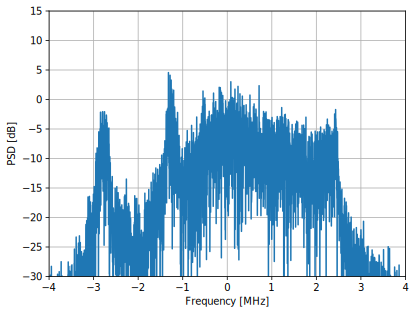
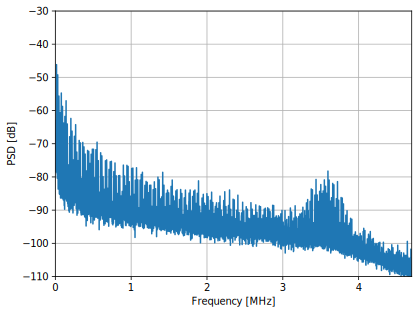
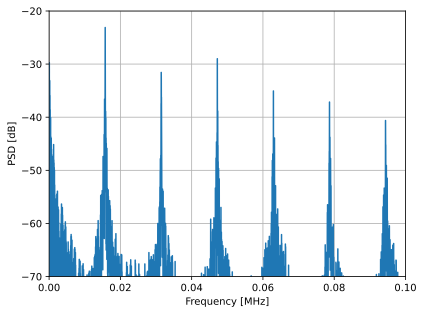
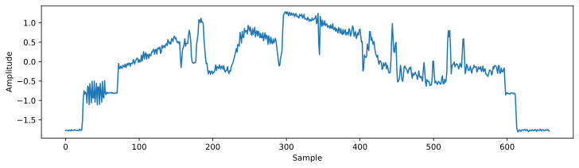
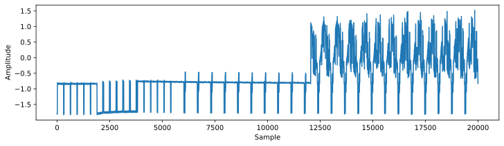
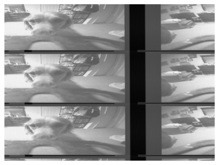
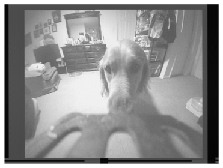

.. _fpv-chapter:

########################
Analog FPV Video Signals
########################

In this chapter we will look at the analog video signals used in most hobby/DIY FPV drones, which consist of FM modulated NTSC or PAL signals. We will analyze the signals and show how to demodulate them to recover the video image.

****************
Introduction
****************

Analog FPV (First-Person View) signals are a traditional method of transmitting live video from an RC vehicle (most commonly a drone or quadcopter) back to a pilot in real time. Rather than encoding the footage digitally, an analog system broadcasts the camera feed as an NTSC or PAL signal that is FM modulated and transmitted on a carrier, typically in the 5.8 GHz band (though 1.2-1.3 GHz, and 2.4 GHz are also used), and the standard channels are spaced out at 5 MHz intervals. It is not a digital signal, and there is no compression or encryption involved. The defining trait of analog FPV is its extremely low latency; because the video isn't compressed or processed, the pilot sees what the camera sees almost instantaneously, which is critical for fast, responsive flying. They also tend to be low-cost; an analog FPV video transmitter can be bought for $10 and an all-in-one unit (that adds a camera and antenna) for $20.  Most analog FPV video transmitters are also able to transmit an audio signal that gets added to the video signal.  Analog video is typically paired with a separate radio for RC control, such as FrSky, FlySky, Spektrum, and ELRS.

****************
Signal Details
****************

From the receiver's perspective, after FM demodulating the signal, we are left with the following components:

One nice perk of FM is that the receiver does not need to be perfectly centered on the signal, as long as it is “in view” of the signal, the FM demod will work just fine. This is because FM demodulation relies on changes in frequency rather than absolute frequency, so as long as the signal is strong enough and within the bandwidth of the receiver, it can be demodulated successfully, although ideally it will be somewhat centered so that excess noise can be filtered out before the FM demod.

Let's look at an example signal, you can download the example IQ recording of an NTSC signal used in this chapter's code `here <https://raw.githubusercontent.com/777arc/PySDR/refs/heads/master/figure-generating-scripts/ntsc_remy_10MHz_5925Hz_500ksamples_cf32.iq>`_, note that it is only a few frames worth of signal.

If we look at the power spectral density of the raw RF signal, we see the FM modulated signal centered at 5.925 GHz, which is the center frequency of one of the standard FPV channels. The bandwidth of the signal is around 6 MHz.

If we FM demod the signal, which can be done with one line of Python, :code:`np.angle(x[1:] * np.conj(x[:-1]))`, we are left with the following:

In this example there is no audio.  We can clearly see the color portion.  If we zoom into the low frequencies, we can see harmonics at multiples of 15.734 kHz (for PAL it will be at 15.625 kHz), this corresponds to the horizontal sync signal, which happens once per line of video.

We can look at the time domain to get a better understanding of the signal, the following shows one line's worth of the video signal (once again, after FM demodulation).  The horizontal sync pulse is what we see at the beginning and end, and the color burst is the small oscillation right after the horizontal sync pulse.  The rest of the signal is the video information, both black and white and color information.  The color burst is a reference signal that the receiver uses to decode the color information.

If we zoom out in time, we can look at a special synchronization sequence which happens once per frame, called the vertical sync pulse.  This is a special sequence of pulses (same every time) that tells the receiver that a new frame is starting.

In order to demodulate the video and recover the image, we will perform the following steps:

#. Filter out the audio signal
#. Resample luma and chroma to exactly 508 samples per line so that each sample corresponds to one pixel
#. Reshape the 1D array of samples into a 2D image
#. Scale it to 0-255 and display it as a grayscale image

Note that this process only recovers the black and white portion, the color information is encoded in a different way and is more complicated to recover.

Below is an entire working example that can be used with the example recording provided at the beginning of the chapter.

.. code-block:: python

    import numpy as np
    import matplotlib.pyplot as plt
    import scipy.signal as signal

    filename = 'ntsc_remy_10MHz_5925Hz_500ksamples_cf32.iq'
    x = np.fromfile(filename, dtype=np.complex64)
    sample_rate = 10e6
    color_subcarrier_freq = 3.579545e6 # NTSC. higher than luma carrier, not relative to center freq
    # color_subcarrier_freq = 4.43361875e6 # PAL and SECAM
    relative_audio_subcarrier_freq = 3.5e6 # the audio might show up at 5.5, 6.0, or 6.5 MHz

    # NTSC constants
    samples_per_line = 508
    lines_per_frame = 525
    refresh_Hz = 30.0/1.001 # almost exactly 29.97 # not exactly 30 Hz!! makes difference

    # PAL constants
    #samples_per_line = 512
    #lines_per_frame = 625 # (576 visible lines)
    #refresh_Hz = 25

    samples_per_frame = samples_per_line * lines_per_frame // 2 # NTSC's vertical sync repeats every field (half-frame), not every full frame
    line_Hz = refresh_Hz * lines_per_frame

    # FM demodulation
    x_demod = np.angle(x[1:] * np.conj(x[:-1]))

    # Filter out audio from demodded signal
    h = signal.firwin(301, 3e6, fs=sample_rate) # for the 10 Mhz recording
    x_demod = np.convolve(x_demod, h, 'same')

    # Resample luma and chroma to exactly L samples per line
    resampling_rate = samples_per_line / (sample_rate / line_Hz)
    resampling_rate *= 1.00003 # fixes the drift, not 100% sure where it comes from, perhaps sample clock offset
    x_demod = signal.resample(x_demod, int(len(x_demod)*resampling_rate))
    print("Resampling rate:", resampling_rate)

    # crop to 1 frames worth of samples (essentially a manual sync)
    if False:
        manually_tuned_offset = 122250 # for both frame sync and horizontal sync
        x_demod = x_demod[manually_tuned_offset:manually_tuned_offset+samples_per_frame]

    # reshape into 2D
    x_demod = x_demod[:len(x_demod) - (len(x_demod) % samples_per_line)] # trim to multiple of samples_per_line
    frame = x_demod.reshape(-1, samples_per_line) # type: ignore

    # Normalize to 0-255 and convert to uint8
    frame_norm = frame - np.min(frame)
    frame_norm = frame_norm / np.max(frame_norm)
    frame_uint8 = (frame_norm * 255).astype(np.uint8)

    # Display as single image with fixed scaling
    plt.imshow(frame_uint8, cmap='gray', aspect='auto', vmin=0, vmax=255)
    plt.axis('off')
    plt.show()

If we run this code as-is, it starts at the beginning of the recording, which represents a random point in time.  Without syncing to the horizontal line pulse, it just shifts every line by the same amount so our picture ends up still looking intelligible, it's just shifted horizontally and vertically.  We are also looking at multiple frames worth of samples.

Limiting it to one frame's worth of samples is easy, we already calculated :code:`samples_per_frame`, but we need to synchronize to the start of the frame.  There are many ways to do it, one way is to correlate for the vertical synchronization sequence, either by reproducing it or using a high-SNR recording of it.  It can also be done by plotting enough of the time domain to catch the start of frame sequence.  Below shows what the image looks like if you are synchronized, in the code above this is done manually (i.e., manually figuring out that for this recording, 122250 corresponds to the sample offset where a new frame starts). 

If anyone wants to contribute a robust color demodulator, please reach out, but it must be shown to work on a variety of recordings of NTSC or PAL.