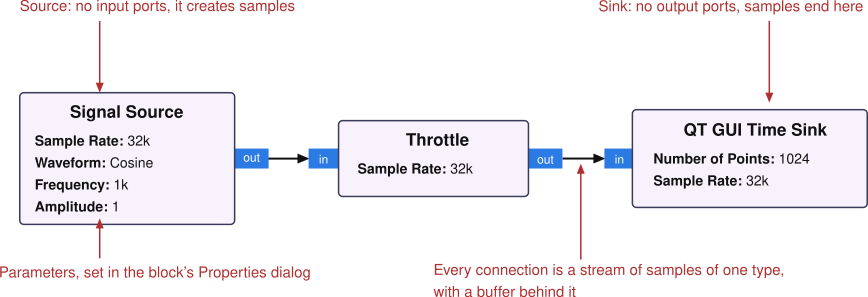
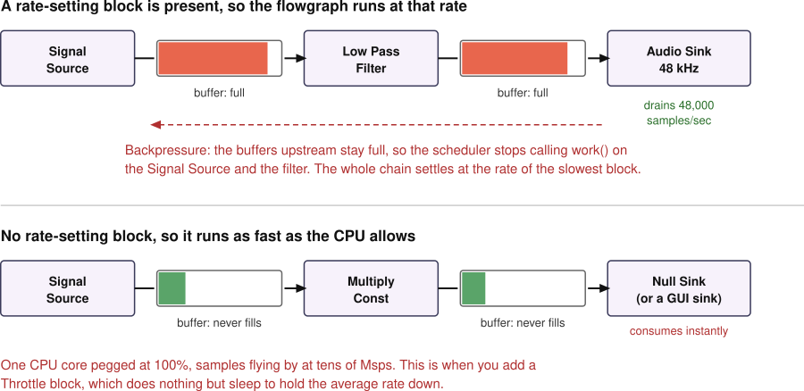

.. _gnuradio-chapter:

##################
Intro to GNU Radio
##################

Every other chapter in PySDR does its DSP in NumPy: read some samples into an array, do math on the array, plot the result.  This chapter is about the other way people write SDR software, using GNU Radio, where you draw a diagram of blocks and let a framework stream samples through it in real-time.  We will cover what a flowgraph is, how GNU Radio Companion turns one into Python, why the Throttle block exists, how to build a working FM receiver, and how to drop your own Python into the middle of it all.  Every example runs in your browser, so there is nothing to install to follow along.

********************************************
What GNU Radio Is, and Why You'd Leave NumPy
********************************************

GNU Radio is a free and open source framework for building real-time signal processing applications.  It has four parts worth naming up front:

#. A library of several hundred DSP **blocks** written in C++ (filters, resamplers, modulators, demodulators, synchronizers, FFTs, plots) that are already written, tested, and optimized.
#. A **runtime**, or scheduler, that streams samples from block to block, hands each block a thread, and manages the buffers in between.
#. **Python bindings**, so a flowgraph is ultimately just a Python (or C++) program.
#. **GNU Radio Companion (GRC)**, a graphical editor where you draw the program as a diagram and it writes the Python for you.

So why would you leave NumPy, which has served us well for the entire book so far?  For offline work you wouldn't.  If you have a recording on disk and you want to try an idea, NumPy is faster to write, easier to debug, and you get a plot at every step.  That is exactly why PySDR teaches DSP that way.

What NumPy does not give you is the plumbing for *continuous* processing.  The moment your script has to keep up with an SDR forever, at a rate you don't control, a pile of unglamorous problems shows up: reading from the radio in one thread while processing in another so you don't overflow, sizing and recycling buffers, spreading the work across CPU cores, keeping a live plot updating without stalling the DSP, and shutting the whole thing down cleanly.  None of that is signal processing, and all of it has to work.  GNU Radio solves that once, for everyone, and hands you a block library on top of it.  You get multithreading for free (each block runs in its own thread, so a long chain of blocks naturally spreads across cores), SIMD-accelerated math for free (through VOLK, GNU Radio's vector math library), and a uniform interface to essentially every SDR on the market, so swapping a USRP for a PlutoSDR is a one-block change.

The honest summary is that they are good at different things, and most people who use GNU Radio still use NumPy every week:

.. list-table::
   :header-rows: 1
   :widths: 50 50

   * - Reach for NumPy/Python when...
     - Reach for GNU Radio when...
   * - Processing a recording offline
     - Processing a live stream continuously
   * - Trying a new algorithm, or one that's easier to express as array math
     - Assembling a system out of DSP that already exists
   * - You want a plot after every step
     - You want it to run for hours without you watching
   * - The processing is one-shot or block-at-a-time
     - The processing must keep up in real-time, on multiple cores

And they mix.  You can write a NumPy algorithm and drop it into a flowgraph as a Python block (:ref:`we do exactly that later in this chapter <epy-section>`), or have a flowgraph write samples to a file or a network socket that a NumPy script reads.

A Note on Running This Chapter in Your Browser
==============================================

Every flowgraph in this chapter is embedded live using `GNU Radio World <https://gnuradioworld.com>`_, which is real GNU Radio compiled to WebAssembly.  The blocks are the same C++ blocks, the scheduler is the same scheduler, and the ``.grc`` files are the same files desktop GNU Radio uses.  Press Run inside any of the embeds and it executes in a tab, with no install.  You can also click the link in the corner of an embed to open that flowgraph in the full editor, where you can edit and rewire it.

A few things are different in the browser, and it's worth knowing them so nothing surprises you later:

* Throughput is a fraction of native, generally somewhere between a third and a half, depending on the block.  Fine for learning, not what you would run a radar off of.
* There is no full Python interpreter, so Python-only blocks and hierarchical blocks written in Python aren't available.  Embedded Python Blocks *do* work, using Pyodide (CPython compiled to WebAssembly).
* Parameter fields accept a useful subset of Python (arithmetic, lists, ``math``/``numpy``, the common ``firdes`` filter designers) rather than arbitrary expressions.
* Hardware works over WebUSB for RTL-SDR, PlutoSDR, and HackRF, but there is a curated set of hosted IQ recordings that we will use instead.

Everything else in this chapter is exactly what you'd type on a desktop install.  When you're ready for that, the install guide is linked at :ref:`the end of the chapter <gnuradio-next-steps>`.  The GNU Radio you install today is the 3.10 series; GNU Radio World tracks the development branch that will become 3.11, but nothing in this chapter differs between them.

*******************************
Flowgraphs, Blocks, and Streams
*******************************

A GNU Radio program is a **flowgraph**: a set of blocks with connections between them, drawn left to right, with samples flowing along the connections.  Three terms and you have the whole model:

* A **block** does one thing to samples.  It has zero or more input ports and zero or more output ports, plus parameters you set.
* A block with no inputs is a **source** (it creates samples: a radio, a file, a signal generator).  A block with no outputs is a **sink** (samples leave the flowgraph: a radio, a file, your speakers, a plot).
* A **connection** between an output port and an input port is a **stream**: an endless sequence of samples of one specific type, with a buffer behind it.

Here is the smallest flowgraph that is still a real one, with the parts labeled:

Note the data type on each connection.  Streams are typed, and both ends of a connection must agree.  The types you'll actually use are:

* **Complex Float 32** -- our IQ samples, identical to NumPy's ``np.complex64``, i.e. two 32-bit floats per sample
* **Float 32** -- real-valued samples, like audio or a magnitude, same as ``np.float32``
* **Int 32**, **Short**, **Byte** -- integers, often bits/symbols after a demodulator, same as ``np.int32``/``np.int16``/``np.uint8``
* Vectors of any of the above, e.g. the 1024-element vector coming out of an FFT block

This is why the block library has so many near-duplicates, like Multiply Const with a "cc" or "ff" suffix in the underlying C++ name.  In GRC you don't hunt for the right variant, you drop in one block and set its Type dropdown, and the port colors change to match.

The other half of the model is the scheduler, and the nice part is how little you have to know about it.  You never write a loop over samples.  GNU Radio runs each block in its own thread, and repeatedly hands the block whatever input samples are available along with room to write outputs.  The block processes as many as it can and says how many it produced.  Blocks don't have to be 1:1 either, a decimating filter might consume 10 samples for every 1 it produces, and an interpolator does the reverse.  The runtime keeps track of all of it.

Your First Flowgraph
====================

Below is that three-block flowgraph, live.  Press the Run button and you should see a 1 kHz cosine on the scope, about 32 cycles across the 1024-sample window (the sample rate is 32 kHz, so 1024 samples is 32 ms, and 32 ms of a 1 kHz tone is 32 cycles).

Then try this: press Stop, double-click the Signal Source block to open its Properties dialog, change Frequency to 4000, close the dialog and Run again.  Four times as many cycles in the same window.  That is the entire edit-run loop of GNU Radio in one gesture.  While you're in there, notice the Throttle block sitting in the middle doing nothing you can see; hold that thought, it gets a section of its own.

.. GNU RADIO WORLD EMBED #1 GOES HERE -- "First Flowgraph"
   Proposed example key: blocks/gnuradio_intro_first_flowgraph (new)
   Blocks and wiring: Signal Source -> Throttle -> QT GUI Time Sink.  Three blocks in a line, matching
   the flowgraph anatomy figure above.
   Parameters: one plain Variable samp_rate = 32000.  Signal Source: output type float, waveform Cosine,
   sample rate samp_rate, frequency 1000, amplitude 1, offset 0.  Throttle: float, samp_rate.
   QT GUI Time Sink: float, 1 input, 1024 points, sample rate samp_rate, autoscale off, Y range -1.5 to 1.5,
   grid on.  GUI Layout block gives the scope the full window.
   Float rather than complex on purpose: one real trace, one port color, nothing to explain twice.
   Complex arrives in the Sources and Sinks section with the blocks that produce it.
   What the reader does: presses Run and sees a 1 kHz cosine, roughly 32 cycles across the 1024-point
   window.  Then opens the Signal Source's Properties dialog, changes Frequency to 4000, and re-runs,
   getting four times as many cycles in the same window.  Then double-clicks Throttle and reads its
   sample rate, which is the thread the prose picks up in the Throttle section.
   Takeaway it carries: a block is a box with parameters, a connection is a stream of samples of one type,
   and the flowgraph is the whole thing between source and sink.  The reader also learns the embed's own
   controls here: Run/Stop, zoom, and the "Open in GNU Radio World" link that hands them the same
   flowgraph in the full editor.

********************************************
GNU Radio Companion: GRC as a Code Generator
********************************************

GRC is the GUI where you draw flowgraphs, and the single most useful thing to understand about it is that **GRC does not run anything**.  It is a code generator.  You draw the diagram, and it writes out a Python file.  Pressing Run writes that file and then executes it.  That's it.

Which means the ``.grc`` file you save is not a program, it's a description of one, stored as YAML: a list of blocks with their parameter values, and a list of connections.  It's human-readable and it diffs reasonably in git, which is why people share ``.grc`` files the way they share scripts.

Below is the editor itself, not a screenshot of it, with a simple flowgraph loaded: a Signal Source, a Throttle, and a QT GUI Number Sink, the same three-block shape you ran in the previous section.  This is GNU Radio World rather than desktop GRC, but the layout and the way you work in it are the same.  Poke at it while you read the next few paragraphs: double-click a block to open its Properties, drag a new one in from the library on the left, or press the Run button in the toolbar.

.. raw:: html

   <!-- ════════ GNU RADIO WORLD EMBED ════════ -->
   <iframe
             src="https://gnuradioworld.com/?zoom=75%#example=qtgui/number_sink"
             title="PySDR: The GNU Radio Companion Editor"
             loading="lazy"
             allow="cross-origin-isolated; fullscreen"
             style="display:block; width:100%; aspect-ratio:3/2; min-height:560px; border:0; margin:18px auto 26px;"
           ></iframe>
   <!-- ════════ /GNU RADIO WORLD EMBED ════════ -->

.. Deliberately NOT embed mode: this one is the whole application, because the section is a tour of the
   editor's regions (block library, canvas, console, menus), and ?embed=1 hides all of them.  The
   flowgraph is the existing qtgui/number_sink example, three blocks: Signal Source -> Throttle ->
   QT GUI Number Sink.

Four regions, and you'll use all of them within five minutes:

* The **block library** on the left, organized by category, with a search box.  Searching is how everyone actually finds blocks; nobody remembers whether Rational Resampler lives under Filters or Resamplers.
* The **canvas** in the middle, where blocks are dragged in, connected by clicking one port and then the other, and configured by double-clicking.
* The **console** at the bottom, which is where errors go.  When a flowgraph refuses to run, the reason is almost always sitting right there.
* Two blocks that are always on the canvas but aren't part of the signal path: **Options** (the flowgraph's title, author, and crucially its Generate Options) and **Variable** blocks like ``samp_rate``.

One difference in the embed above: on the desktop, Run ▸ Generate writes the Python file next to your ``.grc`` and you can go read it, while the browser build compiles and runs the flowgraph directly, so there's no file to open.  The code it would have written is what we're about to look at.

The Generated Python
====================

Let's look at what GRC writes for the three-block flowgraph from the previous section.  Here's the interesting part, with the Qt window boilerplate trimmed out:

.. code-block:: python

    class first_flowgraph(gr.top_block, Qt.QWidget):

        def __init__(self):
            gr.top_block.__init__(self, "First Flowgraph", catch_exceptions=True)
            # ... ~30 lines of Qt window setup snipped ...

            ##################################################
            # Variables
            ##################################################
            self.samp_rate = samp_rate = 32000

            ##################################################
            # Blocks
            ##################################################
            self.qtgui_time_sink_x_0 = qtgui.time_sink_f(
                1024,       # size
                samp_rate,  # samp_rate
                "",         # name
                1,          # number of inputs
                None        # parent
            )
            self.qtgui_time_sink_x_0.set_y_axis(-1.5, 1.5)
            self.qtgui_time_sink_x_0.enable_grid(True)
            # ... more sink configuration snipped ...
            self.blocks_throttle2_0 = blocks.throttle(gr.sizeof_float*1, samp_rate, True, 0)
            self.analog_sig_source_x_0 = analog.sig_source_f(samp_rate, analog.GR_COS_WAVE, 1000, 1, 0, 0)

            ##################################################
            # Connections
            ##################################################
            self.connect((self.analog_sig_source_x_0, 0), (self.blocks_throttle2_0, 0))
            self.connect((self.blocks_throttle2_0, 0), (self.qtgui_time_sink_x_0, 0))

        def get_samp_rate(self):
            return self.samp_rate

        def set_samp_rate(self, samp_rate):
            self.samp_rate = samp_rate
            self.blocks_throttle2_0.set_sample_rate(self.samp_rate)
            self.qtgui_time_sink_x_0.set_samp_rate(self.samp_rate)

Read it top to bottom and the structure of every GNU Radio program is right there.  A flowgraph is a class deriving from ``gr.top_block``.  Variables become plain Python assignments.  Each block becomes one object.  Connections become ``self.connect((src_block, port), (dst_block, port))``, where the port numbers are the little integers you'd expect.  And each variable gets a getter/setter pair, where the setter pushes the new value into every block that uses it, which is the machinery behind the sliders in the next section.

Three practical consequences:

#. **Reading GRC's output is the fastest way to learn the Python API.** Draw what you want, generate, and read.  Almost everyone who writes GNU Radio in Python learned it this way.
#. **Don't hand-edit the generated file.** It gets overwritten the next time you press Generate.  If you need custom code, that's what Python blocks, hierarchical blocks, or writing the flowgraph in Python from the start are for.
#. **The Options block's Generate Options decides what kind of program comes out.** ``QT GUI`` gives you the windowed application we've been running.  ``No GUI`` gives you a plain script suitable for running headless over SSH on a Raspberry Pi.  ``Hier Block`` turns the whole flowgraph into a *block* you can drop into other flowgraphs, which is how you keep large designs manageable.

******************************
Variables and Runtime Controls
******************************

Every parameter field in GRC is a Python expression, evaluated when the code is generated, in a namespace containing all the Variable blocks on the canvas.  So a Sample Rate field can say ``samp_rate``, a decimation field can say ``int(samp_rate/48000)``, and a taps field can say ``firdes.low_pass(1, samp_rate, 5000, 1000)``.  This is why ``samp_rate`` exists as a variable on essentially every flowgraph you'll ever see: change it in one place and every block that referenced it follows.

That's for values fixed when the flowgraph starts.  For values you want to change *while it runs*, GRC has a family of GUI widget variables:

* **QT GUI Range** -- a slider (or slider plus counter box), given a start, stop, step, and default value.  The one you'll use most.
* **QT GUI Chooser** -- a dropdown, radio buttons, or a combo box, mapping labels to values.
* **QT GUI Entry** and **QT GUI Numeric Entry** -- a text box for when a slider is too coarse or the range is too wide.
* **QT GUI Push Button**, **Toggle Button**, **Check Box**, **Digital Number Control** -- for state and one-shot actions.

A GUI widget variable is just a variable with a widget attached and a callback behind it.  When you drag the slider, Qt calls the ``set_samp_rate``-style setter we saw in the generated code, and that setter calls the corresponding method on each block using it, live, with samples still flowing.

There is a catch that trips up everyone at least once: **not every block parameter can be changed at runtime**.  A block only accepts a new value if it exposes a setter for it, which the block author has to provide.  A Signal Source can change frequency and amplitude while running, and a Multiply Const can change its constant, but the number of taps in a filter, the FFT size of a sink, or the item type on a port are structural, and changing those means stopping the flowgraph and starting it again.  GRC knows which is which, and if you wire a slider to a parameter that has no callback, the value simply gets used once at startup and then ignored.

In the flowgraph below, a plain Variable and a GUI Range variable sit side by side so you can feel the difference.  Run it and drag the sliders: the time domain plot and the spectrum both respond immediately, because Signal Source can retune and re-scale on the fly.  Then look at ``samp_rate``, which is a plain Variable block sitting on the canvas.  There is no widget for it, and there can't be one, because it was baked into the generated code before the program ever started.  To change that, you stop, edit, and run again.

.. GNU RADIO WORLD EMBED #2 GOES HERE -- "Variables and Runtime Controls"
   Proposed example key: qtgui/gnuradio_intro_variables_controls (new)
   Same skeleton as embed #1, rebuilt so that everything interesting is on a control.  The point is the
   split between a plain Variable (evaluated once, when the flowgraph is generated) and a QT GUI Range
   (a variable with a widget attached, changeable while running).
   Blocks and wiring: Signal Source -> Throttle -> fan-out to both QT GUI Time Sink and QT GUI Frequency
   Sink.  The fan-out is deliberate: it shows one output port feeding two inputs, which is the first
   structural thing beyond a straight line.
   Variables: plain Variable samp_rate = 32000.  QT GUI Range tone_freq: start 500, stop 8000, step 100,
   default 1000, counter_slider.  QT GUI Range amp: start 0, stop 1, step 0.01, default 0.7,
   counter_slider.  QT GUI Chooser waveform: Cosine / Square / Sawtooth, default Cosine, radio buttons.
   Parameters: Signal Source float, freq tone_freq, amplitude amp, waveform waveform.  Time Sink: float,
   1024 points, Y -1.2 to 1.2, autoscale off.  Frequency Sink: float, FFT 1024, sample rate samp_rate,
   Y -100 to 10.  GUI Layout: the three controls across the top row, scope and spectrum side by side
   beneath.
   What the reader does: runs it, drags tone_freq and watches both plots move together, the time trace
   tightening while the spectral peak slides right.  Drops amp and watches the peak fall while the trace
   shrinks.  Switches to Square and sees the odd harmonics appear in the spectrum.  Then the payoff:
   samp_rate is on the canvas as a plain Variable and cannot be touched while running; to change it you
   stop, edit, and run again, because it was baked into the generated Python at build time.
   Takeaway: every parameter field is a Python expression evaluated against the variables on the canvas;
   a GUI control is just a variable that can be reassigned at runtime and pushes a callback into the block.

*****************
Sources and Sinks
*****************

Sources and sinks are where samples enter and leave the flowgraph, and knowing the common ones saves a lot of searching.

**Hardware.**  Every SDR family has a source (receive) and usually a sink (transmit) block: USRP Source/Sink for Ettus radios via UHD, PlutoSDR Source/Sink, RTL-SDR and HackRF and most others through Soapy or osmocom blocks.  They all take the same handful of parameters you already know from the :ref:`Pluto <pluto-chapter>`, :ref:`USRP <usrp-chapter>`, and :ref:`RTL-SDR <rtlsdr-chapter>` chapters: sample rate, center frequency, gain, and sometimes bandwidth or antenna selection.  They output Complex Float 32, and they set the pace of the flowgraph, which we'll get to shortly.

**Files.**  File Source and File Sink read and write raw binary, with no header, exactly the format we've been using with ``np.tofile()`` and ``np.fromfile()`` all through the :ref:`IQ Files chapter <iq-files-chapter>`.  A file of complex64 written by NumPy plays straight into a File Source set to Complex Float 32.  Two options are worth remembering: File Source has a **Repeat** checkbox that loops the file forever, which is how most demos with recorded data work, and File Sink has an **Unbuffered** checkbox that you want off for throughput and on when you're watching a file grow.  There are also SigMF Source and Sink blocks if you'd rather carry metadata alongside the samples.

**Simulated signals.**  Signal Source (sine, cosine, square, saw, constant), Noise Source (Gaussian, uniform), Vector Source (repeat a Python list, great for tests and for sending a known bit pattern), Constant Source, and Null Source.  On the sink side, Null Sink throws samples away, which sounds useless until you need to terminate an unused branch or benchmark a block in isolation.

**Audio.**  Audio Sink sends float samples to your speakers, Audio Source reads your microphone.  Both are also clocks, which matters in the next section.  We'll use an Audio Sink in the FM receiver.

**Networking.**  UDP Source/Sink and ZMQ PUB/SUB blocks move samples between flowgraphs, between machines, or between GNU Radio and an ordinary Python script.  If you want GNU Radio to do the real-time front end and NumPy to do the analysis, a ZMQ sink on one side and a few lines of ``zmq`` plus ``np.frombuffer()`` on the other is the usual bridge.

**Measurement.**  Probe Rate reports the actual throughput at a point in the flowgraph, Probe Signal grabs the latest value for use elsewhere, and Vector Sink collects samples into a list you can pull out at the end.  These are the print statements of GNU Radio.

In the browser, the block that stands in for hardware is **GR World Recording**, which streams one of the hosted IQ recordings into the flowgraph the way a File Source would.  The FM receiver later in this chapter uses it, and swapping it for an RTL-SDR Source is a one-block change.

***********************************************
Throttle, Backpressure, and Sample Rate Reality
***********************************************

Here is the single most common misconception about GNU Radio, worth stating bluntly: **the** ``samp_rate`` **variable does not set the speed of anything.**  It is just a number you pass to blocks so they can compute filter coefficients, label plot axes, and so on.  Nothing in the runtime reads it and decides how fast to go.

So what does set the speed?  Only three things:

#. **Hardware.**  An SDR source produces samples at its configured rate because a physical clock says so.  An SDR sink accepts them at that rate for the same reason.
#. **An audio device.**  Audio Sink drains samples at 48 kHz (or whatever you set) because your sound card does.  Audio Source produces them the same way.
#. **A Throttle block**, which does nothing to your samples at all.  It just sleeps, letting through roughly the number of samples per second you asked for.

Everything else in the block library goes as fast as the CPU lets it.  If nothing in your flowgraph is one of those three things, the whole graph will run flat out, pegging a core and generating tens of millions of samples per second that a GUI sink then desperately tries to plot.

The mechanism that ties this together is **backpressure**.  Every connection has a finite buffer behind it.  The scheduler only calls a block's ``work()`` when there are input samples available *and* there's room in the output buffer.  So when a downstream block is slow, or is waiting on a physical clock, its input buffer fills up, and the block feeding it stops being called, and so on all the way back to the source.  The flowgraph settles at the rate of its slowest element, without you writing a line of flow control:

Which gives us a rule that will save you a lot of grief:

    **Exactly one rate-setting element per signal path.**  If your flowgraph has an SDR or an audio device in it, that's the one, and you do *not* add a Throttle.  If it's pure simulation, add exactly one Throttle, usually right after the source.

Both failure modes are worth recognizing.  A Throttle *plus* an SDR gives you two things trying to set the rate, and since they'll never agree exactly, you get periodic stalls and overflows.  No Throttle in an all-simulated flowgraph gives you a fan spinning up, a GUI you can't interact with, and a plot updating far too fast to read.  That's why the Throttle sat in our very first flowgraph, and it's the entire reason that block exists.

When a hardware flowgraph *can't* keep up, GNU Radio tells you in a terse but memorable way: an ``O`` printed to the console means an overflow, samples arrived from the radio faster than your flowgraph consumed them and some were dropped.  A ``U`` means an underrun on transmit, your flowgraph didn't feed the radio fast enough.  A stream of ``OOOO`` means something downstream is too slow, so profile, decimate earlier, or lower the sample rate.

Keeping Track of Rates
======================

The other half of "sample rate reality" is bookkeeping.  Decimating and interpolating blocks change the rate mid-flowgraph, and it's on you to know what the rate is at every point.  A decimating filter with decimation 10 fed at 1 MHz outputs at 100 kHz.  Every block downstream of it that takes a sample rate parameter, especially GUI sinks, needs to be told 100 kHz, not 1 MHz.  Get this wrong and nothing crashes, the flowgraph runs happily and simply lies to you about the frequency axis.  If a spectrum plot ever shows a signal at an impossible frequency, this is the first thing to check.

When the rate you have and the rate you need aren't related by a nice integer, the **Rational Resampler** block converts by interpolation ratio over decimation ratio, and we'll use it in the next section for exactly that reason.

*************
The GUI Sinks
*************

The QT GUI sinks are how you see what your flowgraph is doing, and by now you know what every one of these plots means:

* **QT GUI Time Sink** -- amplitude vs. time, real or complex (complex shows I and Q as two traces).  Has a trigger, like an oscilloscope.
* **QT GUI Frequency Sink** -- the FFT, exactly the spectrum plots from the :ref:`Frequency Domain chapter <freq-domain-chapter>`, with FFT size, window, and averaging settings.
* **QT GUI Waterfall Sink** -- spectrum over time.
* **QT GUI Constellation Sink** -- IQ plotted on the complex plane, the constellations from the :ref:`Digital Modulation chapter <modulation-chapter>`.
* **QT GUI Histogram Sink**, **Number Sink**, **Vector Sink**, and the **Eye/Raster** sinks for pulse shaping and timing work.

A handful of settings matter more than the rest:

* **Sample rate** on the sink is what labels the x-axis.  As noted above, it must match the actual rate at that point in the flowgraph.
* **Center frequency** shifts the frequency axis labels, so a spectrum plot can read in absolute MHz rather than baseband offset.  It changes labels only, not samples.
* **Number of points** on a time sink and **FFT size** on a frequency sink control how much data goes into each update, so they set your time or frequency resolution.
* **Update period** (0.1 seconds by default) is how often the plot redraws, and it's the main knob for how much CPU the GUI costs.
* **Control panel**, a checkbox that adds a live panel next to the plot for changing the FFT window, averaging, and axis limits while running.  Turn it on when you're exploring.
* **Autoscale** is convenient while you find the signal and misleading afterwards, since the y-axis meaning keeps changing.  Set fixed limits once you know what you're looking at.

One thing to internalize: **GUI sinks are not measurement tools, they're viewers.**  A frequency sink at a 1 MHz sample rate updating 10 times a second is showing you 10 FFTs of 1024 samples out of the million that went by.  It's a sampling of your signal, not all of it.  For anything you intend to quantify, tap the stream with a probe, or write it to a file and analyze it properly in NumPy.

On desktop GRC, each GUI block has a **GUI Hint** parameter that says where it lands in the window, given as a row/column position.  In GNU Radio World, that's replaced by a single **GUI Layout** block that holds a draggable grid of all the widgets, which you can rearrange while the flowgraph is running.  It's the block you see near the top of most of these embeds.

***************************************
Building Something Real: an FM Receiver
***************************************

Time to build something you'd actually use.  Broadcast FM is the traditional first real GNU Radio flowgraph, and it's a good one: the signal is strong, it's everywhere, and you can hear immediately whether it worked.  We covered how FM demodulation works in the :ref:`RDS chapter <rds-chapter>` using NumPy; this is the same operation assembled from blocks.

The chain is five blocks, and the interesting part is the arithmetic connecting them:

#. **Source** -- a 250 kHz IQ recording of the FM broadcast band, one station centered at 0 Hz.  On real hardware this would be an RTL-SDR Source tuned to your favorite station.
#. **Rational Resampler**, interpolation 24, decimation 25, converting 250 kHz to 240 kHz.
#. **WBFM Receive**, with a quadrature rate of 240 kHz and audio decimation of 5, producing 48 kHz audio.
#. **Multiply Const**, whose constant is a volume slider.
#. **Audio Sink** at 48 kHz, plus a Frequency Sink so you can see the audio as well as hear it.

Why the resampler?  Because 250 kHz doesn't divide evenly by anything that lands on 48 kHz, and WBFM Receive decimates by an integer.  24/25 gets us to 240 kHz, and 240/5 = 48 kHz exactly.  This is the rate bookkeeping from the previous section, in real numbers: you work backwards from the rate your output device demands, and you insert a resampler wherever the integers don't cooperate.

WBFM Receive is doing more than it looks.  Inside, it's a quadrature demodulator (the ``0.5 * np.angle(x[1:] * np.conj(x[:-1]))`` we wrote by hand in the RDS chapter), followed by a de-emphasis filter and a low-pass decimation filter down to audio rate.  It's a hierarchical block, which is to say a flowgraph packaged as a block, which is a preview of the last section of this chapter.

Note also what *isn't* there: no Throttle.  The Audio Sink is the clock, and backpressure paces everything upstream of it.  If you were to add a Throttle here, you'd have two clocks and the audio would stutter.

Run it below and you'll hear a real radio station demodulated in your browser.  Look at the RF spectrum and you can see the roughly 200 kHz wide FM signal; look at the audio spectrum and you'll see the 19 kHz stereo pilot tone standing up above the audio, which is a nice confirmation that you're looking at genuine broadcast FM rather than a simulation.  Drag the volume slider while it plays.

.. raw:: html

   <!-- ════════ GNU RADIO WORLD EMBED ════════ -->
   <iframe
             src="https://gnuradioworld.com/?embed=1&zoom=60%#example=audio/fm_receiver_recording"
             title="PySDR: FM Receiver from a Recording"
             loading="lazy"
             allow="cross-origin-isolated; fullscreen"
             style="display:block; width:100%; aspect-ratio:21/9; min-height:345px; border:0; margin:18px auto 26px;"
           ></iframe>
   <!-- ════════ /GNU RADIO WORLD EMBED ════════ -->

.. The embed above is the existing GNU Radio World example audio/fm_receiver_recording, reused rather
   than duplicated.  It streams the hosted 250 kHz IQ recording fm_rds_250k_1Msamples.  For reference:
     GR World Recording (recording fm_rds_250k_1Msamples, complex, repeat on) -> QT GUI Frequency Sink
       (RF spectrum) and also -> Rational Resampler
     Rational Resampler (ccc, interp 24, decim 25: 250 kHz -> 240 kHz) -> WBFM Receive
     WBFM Receive (quad rate quad_rate = 240000, audio decimation 5 -> 48 kHz) -> Multiply Const
     Multiply Const (constant = volume) -> Audio Sink (48 kHz) and also -> QT GUI Frequency Sink
       (audio spectrum)
   Variables: samp_rate = 250000, quad_rate = 240000, audio_rate = 48000, QT GUI Range volume 0 to 1,
   step 0.01, default 0.3.  No Throttle anywhere: the Audio Sink is the clock.

To run this on real hardware, you delete the recording block, drop in an RTL-SDR Source (or Pluto, or USRP), set its sample rate to 250 kHz and its center frequency to your station, and connect it to the resampler.  Nothing else in the flowgraph changes.  That hardware independence is a large part of why GNU Radio is worth learning: the DSP you build is not tied to the radio you built it with.

.. _epy-section:

*************************************************
Writing Your Own Block: the Embedded Python Block
*************************************************

Eventually you'll want something the block library doesn't have.  You have two options, and they're very different in effort.  The heavyweight one is an out-of-tree module, a proper installable package with C++ or Python blocks, which we'll point at in the next section.  The lightweight one, and the one you should reach for first, is the **Embedded Python Block**: a block whose source code lives inside the ``.grc`` file itself.  Nothing to install, nothing to build, and it's right there on the canvas with everything else.

Drop one in and you get this template, which is worth reading line by line since it's the whole API:

.. code-block:: python

    import numpy as np
    from gnuradio import gr

    class blk(gr.sync_block):
        """Embedded Python Block example - a simple multiply const"""

        def __init__(self, example_param=1.0):  # only default arguments here
            gr.sync_block.__init__(
                self,
                name='Embedded Python Block',   # will show up in GRC
                in_sig=[np.float32],
                out_sig=[np.float32])
            self.example_param = example_param

        def work(self, input_items, output_items):
            output_items[0][:] = input_items[0] * self.example_param
            return len(output_items[0])

Four things to notice:

* **The class name and its arguments become the block.**  Every argument to ``__init__`` shows up as a parameter field in GRC (which is why they all need default values), and the docstring becomes the block's documentation.
* **``in_sig`` and ``out_sig`` define the ports**, both how many and what type.  ``[np.complex64]`` gives one complex input, ``[np.float32, np.float32]`` gives two float inputs, and ``None`` gives none at all, making a source or a sink.
* **``work()`` is called by the scheduler** with NumPy arrays: ``input_items[0]`` is the samples available on the first input port, ``output_items[0]`` is where you write.  You don't control how many samples you get, and it changes call to call, so never assume a fixed length.
* **You return how many samples you produced.**  For a ``sync_block``, output length equals input length, so ``return len(output_items[0])`` is the standard ending.

Note the ``[:]`` in the assignment.  You must write *into* the output array, not rebind the name, or the samples never leave the block.  That's the single most common bug when writing these.

Now for something no stock block does.  Replace the body of ``work()`` with:

.. code-block:: python

    def work(self, input_items, output_items):
        np.tanh(self.gain * input_items[0], out=output_items[0])
        return len(output_items[0])

That's a soft limiter: for small inputs ``tanh`` is nearly linear, and for large ones it flattens out, so a sine wave driven hard comes out with rounded, squashed peaks rather than the hard corners of a clipper.  It's three lines, it's vectorized NumPy, and it drops into a real-time flowgraph next to a hardware-accelerated FIR filter.

In the flowgraph below, the stock template is wired up with the input and output going to the same two-trace scope, so you can see exactly what your code did.  Run it as-is first: the two traces sit on top of each other, because multiplying by 1.0 does nothing.  That's the point, you've confirmed the block is in the path and passing samples through.  Then open its Properties, change the parameter to 0.5 and re-run, and one trace is half the height.  Then edit ``work()`` to the ``tanh`` version above, press the button to re-read the code, and watch the output come back flat-topped.  Add a second argument to ``__init__``, re-read again, and a new parameter field appears on the block.

.. GNU RADIO WORLD EMBED #4 GOES HERE -- "Python Block Starter"
   Proposed example key: python/gnuradio_intro_python_block_starter (new)
   Ships with GRC's stock default source code, unmodified, so what the reader sees in the browser is what
   they would see on the desktop.  One change from the stock template: in_sig/out_sig are np.float32
   instead of np.complex64, so it drops into a real-valued chain and shows on a normal scope.
   Blocks and wiring: Signal Source -> Throttle -> fan-out to Python Block AND to input 1 of a two-input
   QT GUI Time Sink; Python Block -> input 0 of that same Time Sink.  Both traces on one scope is the
   whole design: input and output on top of each other, so the reader sees exactly what their code did to
   the samples.
   Parameters: samp_rate = 32000; Signal Source float, Cosine, 1 kHz, amplitude 1.  Time Sink: float,
   2 inputs, 1024 points, labels "Python Block output" and "Input", Y -2 to 2, autoscale off, legend on.
   example_param left at its default 1.
   What the reader does: runs it first and sees the two traces sitting exactly on top of each other,
   because a multiply by 1 is a pass-through, the "nothing happened, and that's the point" moment.  Then
   opens the block's Properties, changes example_param to 0.5 and re-runs: one trace at half height.
   Then edits the work() body itself, the suggested edit being
   np.tanh(3 * input_items[0], out=output_items[0]), presses the re-read button under the code box, and
   watches the output come back as a flat-topped, clipped wave no stock GNU Radio block produces.  Adding
   a second argument to __init__ and re-reading makes a new parameter field appear on the block, which is
   the thing about epy_block worth understanding.
   Two browser caveats the prose states plainly: the Python runs in Pyodide (~16 MB fetched on first use,
   so the first Run is slow), and input_items is a copy rather than a view of the flowgraph's buffer, so
   writing into it does nothing, unlike desktop GNU Radio.

Two caveats specific to running this in the browser.  The first Run of a flowgraph containing a Python block is slow, because the Python runtime (about 16 MB) has to be fetched.  And ``input_items`` here is a copy of the flowgraph's buffer rather than a view of it, so writing into the *input* array does nothing, whereas on desktop GNU Radio it would modify the buffer in place.  Since writing to your input is a bad idea anyway, this rarely matters.

The caveat that applies everywhere is performance.  A Python block is Python: there's per-call overhead, and it holds the interpreter lock while it runs, so several of them don't parallelize the way C++ blocks do.  Vectorized NumPy on decent-sized chunks is fine for most audio-rate and low-megasample-rate work.  Per-sample ``for`` loops are not.  If you need it faster, that's what C++ blocks are for.

.. _gnuradio-next-steps:

***************************************
Beyond sync_block, and Where to Go Next
***************************************

We used a ``sync_block``, which is the 1-in-1-out case.  The block base classes cover the rest:

* **``decim_block``** and **``interp_block``** for fixed integer rate changes, where you declare the ratio and the runtime handles the bookkeeping.
* **``basic_block``**, the general case, where inputs and outputs are decoupled.  You implement ``forecast()`` to say how many input samples you need for a given number of outputs, and ``general_work()`` to explicitly consume and produce.  Anything with a variable or data-dependent rate, like a packet deframer, ends up here.
* **``set_history(N)``** if your block needs the previous N-1 samples on each call, which is exactly what a filter needs.  The runtime keeps the overlap for you.

Beyond individual blocks, these are the concepts you'll meet next, roughly in the order most people meet them:

* **Hierarchical blocks**, a flowgraph saved as a reusable block, with input and output ports of its own.  WBFM Receive from the FM receiver is one.  In GRC it's just the Options block's Generate Options set to ``Hier Block``.
* **Stream tags**, small pieces of metadata attached to a specific sample index that flow along with the stream.  Hardware sources emit ``rx_time`` and ``rx_rate`` tags, and burst-based processing uses them heavily to mark packet boundaries.
* **Message passing and PMTs**, GNU Radio's asynchronous side, drawn as dashed lines in GRC.  Streams are for continuous samples; messages are for events, control, and decoded data (a demodulated packet, a retune command).  PMT is the polymorphic type they're carried in.
* **Out-of-tree modules (OOTs)**, the way you package your own blocks for real.  ``gr_modtool`` generates the skeleton of a module, a block, its QA test, and its GRC bindings, in Python or C++.  There's a large ecosystem of them: gr-satellites, gr-ieee802-11, gr-rds, gr-dvbs2rx, and many more.
* **GNU Radio 4**, a substantial rewrite currently in development, is worth knowing exists but not worth waiting for.

To install GNU Radio and keep going on your own machine, start with the official install guide at `wiki.gnuradio.org/index.php/InstallingGR <https://wiki.gnuradio.org/index.php/InstallingGR>`_.  On Linux it's usually your package manager or a Conda environment, and on Windows and macOS the Conda route is the smoothest.  From there, the `official tutorials <https://wiki.gnuradio.org/index.php/Tutorials>`_ walk through GRC and the Python API in far more depth than one chapter can, and the annual `GRCon <https://www.gnuradio.org/grcon/>`_ talks (all free on YouTube) are a good way to see what people build with it.

The rest of PySDR is the NumPy path, and this chapter was the flowgraph path.  Neither replaces the other.  Prototype an idea in NumPy where it's easy to see what's happening, then move it into a flowgraph as a Python block when you want it running live against a radio, and reach for C++ only when the sample rate forces your hand.
