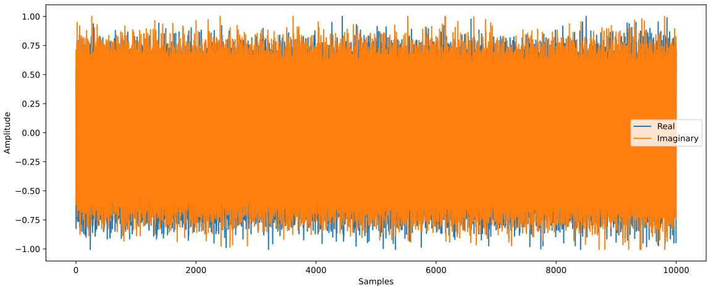

.. _hackrf-chapter:

####################
HackRF One in Python
####################

The `HackRF One <https://greatscottgadgets.com/hackrf/one/>`_ from Great Scott Gadgets is a USB 2.0 SDR that can transmit or receive from 1 MHz to 6 GHz and has a sample rate from 2 to 20 MHz.  It was released in 2014 and has had several minor refinements over the years.  It is one of the only low-cost transmit-capable SDRs that goes down to 1 MHz, making it great for HF applications (e.g., ham radio) in addition to higher frequency fun.  The max transmit power of 15 dBm is also higher than most other SDRs, see `this page <https://hackrf.readthedocs.io/en/latest/faq.html#what-is-the-transmit-power-of-hackrf>`_ for full transmit power specs.  It uses half-duplex operation, meaning it is either in transmit or receive mode at any given time, and it uses 8-bit ADC/DAC.

.. image:: ../_images/hackrf1.jpeg
   :scale: 60 %
   :align: center 
   :alt: HackRF One

********************************
HackRF Architecture
********************************

The HackRF is based around the Analog Devices MAX2839 chip which is a 2.3GHz to 2.7GHz transceiver initially designed for WiMAX, combined with a MAX5864 RF front-end chip (essentially just the ADC and DAC) and a RFFC5072 wideband synthesizer/VCO (used to upconvert and downconvert the signal in frequency).  This is in contract to most other low-cost SDRs which use a single chip known as an RFIC.  Aside from setting the frequency generated within the RFFC5072, all of the other parameters we will adjust like the attenuation and analog filtering are going to be in the MAX2839.  Instead of using an FPGA or System on Chip (SoC) like many SDRs, the HackRF uses a Complex Programmable Logic Device (CPLD) which acts as simple glue logic, and a microcontroller, the ARM-based LPC4320, which does all of the onboard DSP and interfacing over USB with the host (both transfer of IQ samples in either direction and control of the SDR settings).  The following beautiful block diagram from Great Scott Gadgets shows the architecture of the latest revision of the HackRF One:

.. image:: ../_images/hackrf_block_diagram.webp
   :align: center 
   :alt: HackRF One Block Diagram
   :target: ../_images/hackrf_block_diagram.webp

The HackRF One is highly expandable and hackable.  Inside the plastic case are four headers (P9, P20, P22, and P28), specifics can be `found here <https://hackrf.readthedocs.io/en/latest/expansion_interface.html>`_, but note that 8 GPIO pins and 4 ADC inputs are on the P20 header, while SPI, I2C, and UART are on the P22 header.  The P28 header can be used to trigger/synchronize transmit/receive operations with another device (e.g., TR-switch, external amp, or another HackRF), through the trigger input and output, with delay of less than one sample period.

.. image:: ../_images/hackrf2.jpeg
   :scale: 50 %
   :align: center 
   :alt: HackRF One PCB

The clock used for both the LO and ADC/DAC is derived from either the onboard 25 MHz oscillator, or from an external 10 MHz reference fed in over SMA.  Regardless of which clock is used, the HackRF produces a 10 MHz clock signal on CLKOUT; a standard 3.3V 10 MHz square wave intended for a high impedance load.  The CLKIN port is designed to take a similar 10 MHz 3.3V square wave, and the HackRF One will use the input clock instead of the internal crystal when a clock signal is detected (note, the transition to or from CLKIN only happens when a transmit or receive operation begins).  

********************************
Software and Hardware Setup
********************************

The software install process involves two steps: first we will install the main HackRF library from Great Scott Gadgets, and then we will install the Python API.

Installing the HackRF Library
#############################

The following was tested to work on Ubuntu 22.04 (using commit hash 17f3943 in Sept '24):

.. code-block:: bash

    git clone https://github.com/greatscottgadgets/hackrf.git
    cd hackrf/host
    mkdir build
    cd build
    cmake ..
    make
    sudo make install
    sudo ldconfig
    sudo cp /usr/local/bin/hackrf* /usr/bin/.

After installing :code:`hackrf` you will be able to run the following utilities:

* :code:`hackrf_info` - Read device information from HackRF such as serial number and firmware version.
* :code:`hackrf_transfer` - Send and receive signals using HackRF. Input/output files are 8-bit signed quadrature samples.
* :code:`hackrf_sweep` - a command-line spectrum analyzer.
* :code:`hackrf_clock` - Read and write clock input and output configuration.
* :code:`hackrf_operacake` - Configure Opera Cake antenna switch connected to HackRF.
* :code:`hackrf_spiflash` - A tool to write new firmware to HackRF. See: Updating Firmware.
* :code:`hackrf_debug` - Read and write registers and other low-level configuration for debugging.

If you are using Ubuntu through WSL, on the Windows side you will need to forward the bladeRF USB device to WSL, first by installing the latest `usbipd utility msi <https://github.com/dorssel/usbipd-win/releases>`_ (this guide assumes you have usbipd-win 4.0.0 or higher), then opening PowerShell in administrator mode and running:

.. code-block:: bash

    usbipd list
    <find the BUSID labeled HackRF One and substitute it in the two commands below>
    usbipd bind --busid 1-10
    usbipd attach --wsl --busid 1-10

On the WSL side, you should be able to run :code:`lsusb` and see a new item called :code:`Great Scott Gadgets HackRF One`.  Note that you can add the :code:`--auto-attach` flag to the :code:`usbipd attach` command if you want it to auto reconnect.  Lastly, you have to add the udev rules using the following command:

.. code-block:: bash

    echo 'ATTR{idVendor}=="1d50", ATTR{idProduct}=="6089", SYMLINK+="hackrf-one-%k", MODE="660", TAG+="uaccess"' | sudo tee /etc/udev/rules.d/53-hackrf.rules
    sudo udevadm trigger

Then unplug and replug your HackRF One (and redo the :code:`usbipd attach` part).  Note, I had permissions issues with the step below until I switched to using `WSL USB Manager <https://gitlab.com/alelec/wsl-usb-gui/-/releases>`_ on the Windows side, to manage forwarding to WSL, which apparently also deals with the udev rules.

Whether you're on native Linux or WSL, at this point you should be able to run :code:`hackrf_info` and see something like:

.. code-block:: bash

    hackrf_info version: git-17f39433
    libhackrf version: git-17f39433 (0.9)
    Found HackRF
    Index: 0
    Serial number: 00000000000000007687865765a765
    Board ID Number: 2 (HackRF One)
    Firmware Version: 2024.02.1 (API:1.08)
    Part ID Number: 0xa000cb3c 0x004f4762
    Hardware Revision: r10
    Hardware appears to have been manufactured by Great Scott Gadgets.
    Hardware supported by installed firmware: HackRF One

Let's also make an IQ recording of the FM band, 10 MHz wide centered at 100 MHz, and we'll grab 1 million samples:

.. code-block:: bash

    hackrf_transfer -r out.iq -f 100000000 -s 10000000 -n 1000000 -a 0 -l 30 -g 50

This utility produces a binary IQ file of int8 samples (2 bytes per IQ sample), which in our case should be 2MB.  If you're curious, the signal recording can be read in Python using the following code:

.. code-block:: python

    import numpy as np
    samples = np.fromfile('out.iq', dtype=np.int8)
    samples = samples[::2] + 1j * samples[1::2]
    print(len(samples))
    print(samples[0:10])
    print(np.max(samples))

If your max is 127 (which means you saturated the ADC) then lower the two gain values at the end of the command.

Installing the Python API
#########################

Lastly, we must install the HackRF One `Python bindings <https://github.com/GvozdevLeonid/python_hackrf>`_, maintained by `GvozdevLeonid <https://github.com/GvozdevLeonid>`_.  This was tested to work in Ubuntu 22.04 on 10/19/2024.

.. code-block:: bash

    sudo apt install libusb-1.0-0-dev
    cd ~
    git clone https://github.com/GvozdevLeonid/python_hackrf.git
    cd python_hackrf
    export LDFLAGS="-L/usr/lib/x86_64-linux-gnu -L/usr/local/lib"
    export CFLAGS="-I/usr/include/libusb-1.0 -I/usr/local/include/libhackrf"
    python setup.py build_ext --inplace
    pip install -e .

We can test the above install by running the following code, if there are no errors (there will also be no output) then everything should be good to go!

.. code-block:: python

    from python_hackrf import pyhackrf  # type: ignore
    pyhackrf.pyhackrf_init()
    sdr = pyhackrf.pyhackrf_open()
    sdr.pyhackrf_set_sample_rate(10e6)
    sdr.pyhackrf_set_antenna_enable(False)
    sdr.pyhackrf_set_freq(100e6)
    sdr.pyhackrf_set_amp_enable(False)
    sdr.pyhackrf_set_lna_gain(30) # LNA gain - 0 to 40 dB in 8 dB steps
    sdr.pyhackrf_set_vga_gain(50) # VGA gain - 0 to 62 dB in 2 dB steps
    sdr.pyhackrf_close()

For an actual test of receiving samples, see the example code below.

********************************
Tx and Rx Gain
********************************

Receive Side
############

The HackRF One on the receive side has three different gain stages:

* RF (:code:`amp`, either 0 or 11 dB)
* IF (:code:`lna`, 0 to 40 dB in 8 dB steps)
* baseband (:code:`vga`, 0 to 62 dB in 2 dB steps)

For receiving most signals, it is recommended to leave the RF amplifier off (0 dB), unless you are dealing with an extremely weak signal and there are definitely no strong signals nearby.  The IF (LNA) gain is the most important gain stage to adjust, to maximize your SNR while avoiding saturation of the ADC, that is the first knob to adjust.  The baseband gain can be left at a relatively high value, e.g., we will just leave it at 50 dB.

Transmit Side
#############

On the transmit side, there are two gain stages:

* RF [either 0 or 11 dB]
* IF [0 to 47 dB in 1 dB steps]

You will likely want the RF amplifier enabled, and then you can adjust the IF gain to suit your needs.

**************************************************
Receiving IQ Samples within Python with the HackRF
**************************************************

Currently the :code:`python_hackrf` Python package does not include any convenience functions for receiving samples, it is simply a set of Python bindings that map to the HackRF's C++ API.  That means in order to receive IQ, we have to use a decent amount of code.  The Python package is set up to use a callback function in order to receive more samples, this is a function that we must set up, but it will automatically get called whenever there are more samples ready from the HackRF.  This callback function always needs to have three specific arguments, and it needs to return :code:`0` if we want another set of samples.  In the code below, within each call to our callback function, we convert the samples to NumPy's complex type, scale them from -1 to +1, and then store them in a larger :code:`samples` array 

After running the code below, if in your time plot, the samples are reaching the ADC limits of -1 and +1, then reduce :code:`lna_gain` by 3 dB until it is clearly not hitting the limits.

.. code-block:: python

    from python_hackrf import pyhackrf  # type: ignore
    import matplotlib.pyplot as plt
    import numpy as np
    import time

    # These settings should match the hackrf_transfer example used in the textbook, and the resulting waterfall should look about the same
    recording_time = 1  # seconds
    center_freq = 100e6  # Hz
    sample_rate = 10e6
    baseband_filter = 7.5e6
    lna_gain = 30 # 0 to 40 dB in 8 dB steps
    vga_gain = 50 # 0 to 62 dB in 2 dB steps

    pyhackrf.pyhackrf_init()
    sdr = pyhackrf.pyhackrf_open()

    allowed_baseband_filter = pyhackrf.pyhackrf_compute_baseband_filter_bw_round_down_lt(baseband_filter) # calculate the supported bandwidth relative to the desired one
    allowed_lna_gain = round(max(0, min(40, lna_gain)) / 8) * 8
    allowed_vga_gain = round(max(0, min(62, vga_gain)) / 2) * 2

    sdr.pyhackrf_set_sample_rate(sample_rate)
    sdr.pyhackrf_set_baseband_filter_bandwidth(allowed_baseband_filter)
    sdr.pyhackrf_set_antenna_enable(False)  # It seems this setting enables or disables power supply to the antenna port. False by default. the firmware auto-disables this after returning to IDLE mode

    sdr.pyhackrf_set_freq(center_freq)
    sdr.pyhackrf_set_amp_enable(False)  # False by default
    sdr.pyhackrf_set_lna_gain(allowed_lna_gain)  # LNA gain - 0 to 40 dB in 8 dB steps
    sdr.pyhackrf_set_vga_gain(allowed_vga_gain)  # VGA gain - 0 to 62 dB in 2 dB steps

    print(f'center_freq: {center_freq} sample_rate: {sample_rate} baseband_filter: {allowed_baseband_filter} lna_gain: {allowed_lna_gain} vga_gain: {allowed_vga_gain}')

    num_samples = int(recording_time * sample_rate)
    samples = np.zeros(num_samples, dtype=np.complex64)
    last_idx = 0

    def rx_callback(buffer, buffer_length, valid_length):  # this callback function always needs to have these three args
        global samples, last_idx

        accepted = valid_length // 2
        accepted_samples = buffer[:valid_length].astype(np.int8) # -128 to 127
        accepted_samples = accepted_samples[0::2] + 1j * accepted_samples[1::2]  # Convert to complex type (de-interleave the IQ)
        accepted_samples /= 128 # -1 to +1
        samples[last_idx: last_idx + accepted] = accepted_samples

        last_idx += accepted

        return 0

    samples = samples[100000:] # get rid of the first 100k samples just to be safe, due to transients

    sdr.set_rx_callback(rx_callback)
    sdr.pyhackrf_start_rx()
    print('is_streaming', sdr.pyhackrf_is_streaming())

    time.sleep(recording_time)

    sdr.pyhackrf_stop_rx()
    sdr.pyhackrf_close()

    fft_size = 2048
    num_rows = len(samples) // fft_size
    spectrogram = np.zeros((num_rows, fft_size))
    for i in range(num_rows):
        spectrogram[i, :] = 10 * np.log10(np.abs(np.fft.fftshift(np.fft.fft(samples[i * fft_size:(i+1) * fft_size]))) ** 2)
    extent = [(center_freq + sample_rate / -2) / 1e6, (center_freq + sample_rate / 2) / 1e6, len(samples) / sample_rate, 0]

    plt.figure(0)
    plt.imshow(spectrogram, aspect='auto', extent=extent) # type: ignore
    plt.xlabel("Frequency [MHz]")
    plt.ylabel("Time [s]")

    plt.figure(1)
    plt.plot(np.real(samples[0:10000]))
    plt.plot(np.imag(samples[0:10000]))
    plt.xlabel("Samples")
    plt.ylabel("Amplitude")
    plt.legend(["Real", "Imaginary"])

    plt.show()

When using an antenna that can receive the FM band, you should get something like the following, with several FM stations visible in the waterfall plot:

