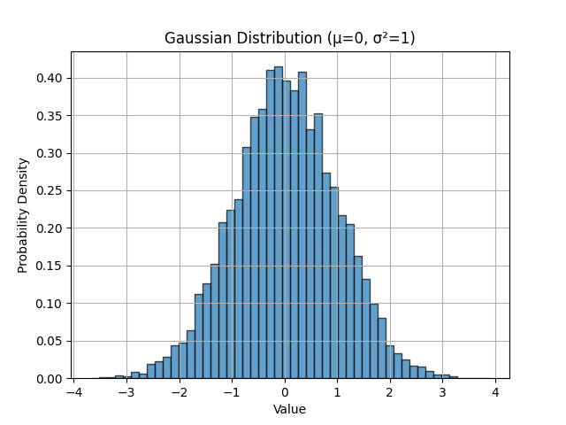

.. _noise-chapter:

##########################
Noise and Random Variables
##########################

In this chapter we will discuss noise, including how it is modeled and handled in a wireless communications system.  Concepts include AWGN, complex noise, and SNR/SINR.  We will also introduce decibels (dB) along the way, as it is widely within wireless communications and SDR.  Lastly, we take a deeper dive into the fundamental concepts of random variables and random processes, which are essential for understanding noise, channel effects, and many signal processing techniques in wireless communications. We'll cover probability distributions, expectation, variance, and how random processes evolve over time. These concepts form the mathematical foundation for analyzing noise and many other topics throughout SDR and DSP.

************************
Gaussian Noise
************************

Most people are aware of the concept of noise: unwanted fluctuations that can obscure our desired signal(s). Noise looks something like:

.. image:: ../_images/noise.png
   :scale: 70 % 
   :align: center
   :target: ../_images/noise.png

Note how the average value is zero in the time domain graph.  If the average value wasn't zero, then we could subtract the average value, call it a bias, and we would be left with an average of zero.  Also note that the individual points in the graph are *not* "uniformly random", i.e., larger values are rarer, most of the points are closer to zero.

We call this type of noise "Gaussian noise". It's a good model for the type of noise that comes from many natural sources, such as thermal vibrations of atoms in the silicon of our receiver's RF components.  The **central limit theorem** tells us that the summation of many random processes will tend to have a Gaussian distribution, even if the individual processes have other distributions.  In other words, when a lot of random things happen and accumulate, the result appears approximately Gaussian, even when the individual things are not Gaussian distributed.

.. image:: ../_images/central_limit_theorem.svg
   :align: center 
   :target: ../_images/central_limit_theorem.svg
   :alt: Central limit theorem visualized as the sum of many random processes leading to a normal distribution (a.k.a. gaussian distribution)

The Gaussian distribution is also called the "Normal" distribution (recall a bell curve).

The Gaussian distribution has two parameters: mean and variance.  We already discussed how the mean can be considered zero because you can always remove the mean, or bias, if it's not zero.  The variance changes how "strong" the noise is.  A higher variance will result in larger numbers.  It is for this reason that variance defines the noise power.

Variance equals standard deviation squared (:math:`\sigma^2`).

************************
Decibels (dB)
************************

We are going to take a quick tangent to formally introduce dB.  You may have heard of dB, and if you are already familiar with it feel free to skip this section.

Working in dB is extremely useful when we need to deal with small numbers and big numbers at the same time, or just a bunch of really big numbers. Consider how cumbersome it would be to work with numbers of the scale in Example 1 and Example 2.

Example 1: Signal 1 is received at 2 watts and the noise floor is at 0.0000002 watts.

Example 2: A garbage disposal is 100,000 times louder than a quiet rural area, and a chain saw is 10,000 times louder than a garbage disposal (in terms of power of sound waves).

Without dB, meaning working in normal "linear" terms, we need to use a lot of 0's to represent the values in Examples 1 and 2. Frankly, if we were to plot something like Signal 1 over time, we wouldn't even see the noise floor. If the scale of the y-axis went from 0 to 3 watts, for example, the noise would be too small to show up in the plot. To represent these scales simultaneously, we work in a log-scale.

To further illustrate the problems of scale we encounter in signal processing, consider the below waterfalls of three of the same signals. The left-hand side is the original signal in linear scale, and the right-hand side shows the signals converted to a logarithmic scale (dB).  Both representations use the exact same colormap, where blue is lowest value and yellow is highest.  You can barely see the signal on the left in the linear scale.

.. image:: ../_images/linear_vs_log.png
   :scale: 70 % 
   :align: center
   :alt: Depiction of why it's important to understand dB or decibels, showing a spectrogram using linear vs log scale
   :target: ../_images/linear_vs_log.png

For a given value x, we can represent x in dB using the following formula:

.. math::
    x_{dB} = 10 \log_{10} x

In Python:  

.. code-block:: python

 x_db = 10.0 * np.log10(x)

You may have seen that :code:`10 *` be a :code:`20 *` in other domains.  Whenever you are dealing with a power of some sort, you use 10, and you use 20 if you are dealing with a non-power value like voltage or current.  In DSP we tend to deal with a power.

We convert from dB back to linear (normal numbers) using:

.. math::
    x = 10^{x_{dB}/10}

In Python: 

.. code-block:: python

 x = 10.0 ** (x_db / 10.0)

Don't get caught up in the formula, as there is a key concept to take away here.  In DSP we deal with really big numbers and really small numbers together (e.g., the strength of a signal compared to the strength of the noise). The logarithmic scale of dB lets us have more dynamic range when we express numbers or plot them.  It also provides some conveniences like being able to add when we would normally multiply (as we will see in the :ref:`link-budgets-chapter` chapter).

Some common errors people will run into when new to dB are:

1. Using natural log instead of log base 10 because most programming language's log() function is actually the natural log.
2. Forgetting to include the dB when expressing a number or labeling an axis.  If we are in dB we need to identify it somewhere.
3. When you're in dB you add/subtract values instead of multiplying/dividing, e.g.:

.. image:: ../_images/db.png
   :scale: 80 % 
   :align: center 
   :target: ../_images/db.png

It is also important to understand that dB is not technically a "unit".  A value in dB alone is unit-less, like if something is 2x larger, there are no units until I tell you the units.  dB is a relative thing.  In audio when they say dB, they really mean dBA which is units for sound level (the A is the units). In wireless we typically use watts to refer to an actual power level.  Therefore, you may see dBW as a unit, which is relative to 1 W. You may also see dBmW (often written dBm for short) which is relative to 1 mW.   For example, someone can say "our transmitter is set to 3 dBW" (so 2 watts).  Sometimes we use dB by itself, meaning it is relative and there are no units. One can say, "our signal was received 20 dB above the noise floor".  Here's a little tip: 0 dBm = -30 dBW.

Here are some common conversions that I recommend memorizing:

======  =====
Linear   dB
======  ===== 
1x      0 dB 
2x      3 dB 
10x     10 dB 
0.5x    -3 dB  
0.1x    -10 dB
100x    20 dB
1000x   30 dB
10000x  40 dB
======  ===== 

Finally, to put these numbers into perspective, below are some example power levels, in dBm:

=========== ===
80 dBm      Tx power of rural FM radio station
62 dBm      Max power of a ham radio transmitter
60 dBm      Power of typical home microwave
37 dBm      Max power of typical handheld CB or ham radio
27 dBm      Typical cell phone transmit power
15 dBm      Typical WiFi transmit power
10 dBm      Bluetooth (version 4) max transmit power
-10 dBm     Max received power for WiFi
-70 dBm     Example received power for a ham signal
-100 dBm    Minimum received power for WiFi
-127 dBm    Typical received power from GPS satellites
=========== ===

*************************
Noise in Frequency Domain
*************************

In the :ref:`freq-domain-chapter` chapter we tackled "Fourier pairs", i.e., what a certain time domain signal looks like in the frequency domain.  Well, what does Gaussian noise look like in the frequency domain?  The following graphs show some simulated noise in the time domain (top) and a plot of the Power Spectral Density (PSD) of that noise (below).  These plots were taken from GNU Radio.

.. image:: ../_images/noise_freq.png
   :scale: 110 % 
   :align: center
   :alt: AWGN in the time domain is also Gaussian noise in the frequency domain, although it looks like a flat line when you take the magnitude and perform averaging
   :target: ../_images/noise_freq.png

We can see that it looks roughly the same across all frequencies and is fairly flat.  It turns out that Gaussian noise in the time domain is also Gaussian noise in the frequency domain.  So why don't the two plots above look the same?  It's because the frequency domain plot is showing the magnitude of the FFT, so there will only be positive numbers. Importantly, it's using a log scale, or showing the magnitude in dB.  Otherwise these graphs would look the same.  We can prove this to ourselves by generating some noise (in the time domain) in Python and then taking the FFT.

.. code-block:: python

 import numpy as np
 import matplotlib.pyplot as plt
 
 N = 1024 # number of samples to simulate, choose any number you want
 x = np.random.randn(N)
 plt.plot(x, '.-')
 plt.show()
 
 X = np.fft.fftshift(np.fft.fft(x))
 X = X[N//2:] # only look at positive frequencies.  remember // is just an integer divide
 plt.plot(np.real(X), '.-')
 plt.show()

Take note that the :code:`randn()` function by default uses mean = 0 and variance = 1.  Both of the plots will look something like this:

.. image:: ../_images/noise_python.png
   :scale: 100 % 
   :align: center
   :alt: Example of white noise simulated in Python
   :target: ../_images/noise_python.png

You can then produce the flat PSD that we had in GNU Radio by taking the log and averaging a bunch together.  The signal we generated and took the FFT of was a real signal (versus complex), and the FFT of any real signal will have matching negative and positive portions, so that's why we only saved the positive portion of the FFT output (the 2nd half).  But why did we only generate "real" noise, and how do complex signals work into this?

*************************
Complex Noise
*************************

"Complex Gaussian" noise is what we will experience when we have a signal at baseband; the noise power is split between the real and imaginary portions equally.  And most importantly, the real and imaginary parts are independent of each other; knowing the values of one doesn't give you the values of the other.

We can generate complex Gaussian noise in Python using:

.. code-block:: python

 n = np.random.randn() + 1j * np.random.randn()

But wait!  The equation above doesn't generate the same "amount" of noise as :code:`np.random.randn()`, in terms of power (known as noise power).  We can find the average power of a zero-mean signal (or noise) using:

.. code-block:: python

 power = np.var(x)

where np.var() is the function for variance.  Here the power of our signal n is 2.  In order to generate complex noise with "unit power", i.e., a power of 1 (which makes things convenient), we have to use:

.. code-block:: python

 n = (np.random.randn(N) + 1j*np.random.randn(N))/np.sqrt(2) # AWGN with unity power

To plot complex noise in the time domain, like any complex signal we need two lines:

.. code-block:: python

 n = (np.random.randn(N) + 1j*np.random.randn(N))/np.sqrt(2)
 plt.plot(np.real(n),'.-')
 plt.plot(np.imag(n),'.-')
 plt.legend(['real','imag'])
 plt.show()

.. image:: ../_images/noise3.png
   :scale: 80 % 
   :align: center
   :alt: Complex noise simulated in Python
   :target: ../_images/noise3.png

You can see that the real and imaginary portions are completely independent.

What does complex Gaussian noise look like on an IQ plot?  Remember the IQ plot shows the real portion (horizontal axis) and the imaginary portion (vertical axis), both of which are independent random Gaussians.

.. code-block:: python

 plt.plot(np.real(n),np.imag(n),'.')
 plt.grid(True, which='both')
 plt.axis([-2, 2, -2, 2])
 plt.show()

.. image:: ../_images/noise_iq.png
   :scale: 60 % 
   :align: center
   :alt: Complex noise on an IQ or constellation plot, simulated in Python
   :target: ../_images/noise_iq.png

It looks how we would expect; a random blob centered around 0 + 0j, or the origin.  Just for fun, let's try adding noise to a QPSK signal to see what the IQ plot looks like:

.. image:: ../_images/noisey_qpsk.png
   :scale: 60 % 
   :align: center
   :alt: Noisy QPSK simulated in Python
   :target: ../_images/noisey_qpsk.png

Now what happens when the noise is stronger?  

.. image:: ../_images/noisey_qpsk2.png
   :scale: 50 % 
   :align: center 
   :alt: Noisy QPSK with stronger noise simulated in Python
   :target: ../_images/noisey_qpsk2.png

We are starting to get a feel for why transmitting data wirelessly isn't that simple. We want to send as many bits per symbol as we can, but if the noise is too high then we will get erroneous bits on the receiving end.

*************************
AWGN
*************************

Additive White Gaussian Noise (AWGN) is an abbreviation you will hear a lot in the DSP and SDR world.  The GN, Gaussian Noise, we already discussed.  Additive just means the noise is being added to our received signal.  White, in the frequency domain, means the spectrum is flat across our entire observation band.  It will almost always be white in practice,or approximately white.  In this textbook we will use AWGN as the only form of noise when dealing with communications links and link budgets and such.  Non-AWGN noise tends to be a niche topic.

*************************
SNR and SINR
*************************

Signal-to-Noise Ratio (SNR) is how we will measure the differences in strength between the signal and noise. It's a ratio so it's unit-less.  SNR is almost always in dB, in practice.  Often in simulation we code in a way that our signals are one unit power (power = 1).  That way, we can create a SNR of 10 dB by producing noise that is -10 dB in power by adjusting the variance when we generate the noise.

.. math::
   \mathrm{SNR} = \frac{P_{signal}}{P_{noise}}

.. math::
   \mathrm{SNR_{dB}} = P_{signal\_dB} - P_{noise\_dB}

If someone says "SNR = 0 dB" it means the signal and noise power are the same.  A positive SNR means our signal is higher power than the noise, while a negative SNR means the noise is higher power.  Detecting signals at negative SNR is usually pretty tough.  

Like we mentioned before, the power in a signal is equal to the variance of the signal.  So we can represent SNR as the ratio of the signal variance to noise variance:

.. math::
   \mathrm{SNR} = \frac{P_{signal}}{P_{noise}} = \frac{\sigma^2_{signal}}{\sigma^2_{noise}}

Signal-to-Interference-plus-Noise Ratio (SINR) is essentially the same as SNR except you include interference along with the noise, in the denominator.  

.. math::
   \mathrm{SINR} = \frac{P_{signal}}{P_{interference} + P_{noise}}

What constitutes interference is based on the application/situation, but typically it is another signal that is interfering with the signal of interest (SOI), and is either overlapping with the SOI in frequency, and/or cannot be filtered out for some reason.  

*********************************
Deeper Dive into Random Variables
*********************************

So far we have avoided getting too mathematical, but now we are going to take a step back and introduce the concept of random variables and how they are used in the context of wireless communications and SDR. A **random variable** is a mathematical concept that maps outcomes of a random experiment to numerical values. Random variables represent quantities whose values are uncertain until they are observed or measured, like our noise samples.  Think of rolling a six-sided die. Before you roll it, you don't know what number will appear. We can define a random variable :math:`X` that represents the outcome of the roll. The value of :math:`X` is one of {1, 2, 3, 4, 5, 6}, but we don't know which one until we actually roll the die.

In the context of wireless communications and SDR, random variables are everywhere:

* The thermal noise in a receiver is modeled as a random variable at each instant in time
* The amplitude of a received signal affected by multipath fading is random
* The phase offset introduced by a changing channel can be modeled as a random variable between :math:`0` and :math:`2\pi`
* Even the data bits we transmit can be treated as random variables

**Single Sample vs. Many Samples**

This is a crucial distinction that often causes confusion:

* A **single realization** or **single sample** of a random variable is just one number—one outcome of the random experiment
* To characterize a random variable (find its average, spread, etc.), we need **many realizations**—many outcomes

For example, if you call ``np.random.randn()`` in Python without any arguments, it returns a single random number drawn from a Gaussian distribution. That single number tells you almost nothing about the distribution itself. But if you call ``np.random.randn(10000)`` and generate 10,000 samples, you can now estimate properties of the distribution like its mean and variance.

.. code-block:: python

 import numpy as np

 # Single sample - just one number
 x_single = np.random.randn()
 print(x_single)  # might be 0.534, -1.23, or any other value

 # Many samples - now we can characterize the distribution
 x_many = np.random.randn(10000)
 print(np.mean(x_many))  # will be close to 0
 print(np.var(x_many))   # will be close to 1

Joint Distributions
####################

So far we've focused on single random variables. When dealing with two or more random variables simultaneously, we use a **joint distribution**.

For continuous variables :math:`X` and :math:`Y`, this is described by the **joint PDF**:

.. math::
   f_{X,Y}(x,y)

The joint PDF tells us how likely it is for :math:`X` to take value :math:`x` *and* :math:`Y` to take value :math:`y` at the same time.

From the joint PDF, we can compute:

* Marginal PDFs (e.g., :math:`f_X(x)` or :math:`f_Y(y)`)
* Expectations such as :math:`E[XY]`
* Covariance and correlation
* Probabilities involving both variables

For example, the marginal PDF of :math:`X` is obtained by integrating out :math:`Y`:

.. math::
   f_X(x) = \int_{-\infty}^{\infty} f_{X,Y}(x,y)\,dy

Joint distributions are the mathematical foundation for understanding dependence, correlation, and independence between random variables.

Probability Distributions
#########################

A **probability distribution** describes how likely different values of a random variable are. For a continuous random variable, we use a **probability density function (PDF)**, denoted :math:`f_X(x)`. The PDF tells us the relative likelihood of the random variable taking on different values.

The most important distribution in SDR and communications is the **Gaussian (Normal) distribution**. A Gaussian random variable :math:`X` with mean :math:`\mu` and variance :math:`\sigma^2` has the PDF:

.. math::
   f_X(x) = \frac{1}{\sqrt{2\pi\sigma^2}} e^{-\frac{(x-\mu)^2}{2\sigma^2}}

This is the famous "bell curve" you've likely seen before. The distribution is completely characterized by two parameters:

* **Mean** :math:`\mu`: the center of the distribution
* **Variance** :math:`\sigma^2`: how spread out the distribution is (standard deviation :math:`\sigma` is the square root of variance)

In Python, ``np.random.randn()`` generates samples from a **standard Gaussian** distribution with :math:`\mu = 0` and :math:`\sigma^2 = 1`. We can visualize this:

.. code-block:: python

 import numpy as np
 import matplotlib.pyplot as plt

 # Generate 10,000 samples from standard Gaussian
 x = np.random.randn(10000)

 # Create histogram to visualize the distribution
 plt.hist(x, bins=50, density=True, alpha=0.7, edgecolor='black')
 plt.xlabel('Value')
 plt.ylabel('Probability Density')
 plt.title('Gaussian Distribution (μ=0, σ²=1)')
 plt.grid(True)
 plt.show()

Expectation (a.k.a. Mean)
#########################

The **expectation** or **expected value** of a random variable, denoted :math:`E[X]` or :math:`\mu`, represents its average value over many realizations. For a continuous random variable with PDF :math:`f_X(x)`, the expectation is:

.. math::
   E[X] = \int_{-\infty}^{\infty} x \cdot f_X(x) \, dx

In practice, when we have :math:`N` samples :math:`x_1, x_2, \ldots, x_N` drawn from the distribution, we estimate the expectation using the **sample mean**:

.. math::
   \hat{\mu} = \frac{1}{N} \sum_{n=1}^{N} x_n

The expectation is a **linear operator**, which means:

* :math:`E[aX + b] = aE[X] + b` for constants :math:`a` and :math:`b`
* :math:`E[X + Y] = E[X] + E[Y]` for any two random variables

This linearity is extremely useful in signal processing!

Variance and Standard Deviation
###############################

The **variance** of a random variable, denoted :math:`\text{Var}(X)` or :math:`\sigma^2`, measures how spread out its values are around the mean. It's defined as the expected value of the squared deviation from the mean:

.. math::
   \text{Var}(X) = E[(X - \mu)^2] = E[X^2] - (E[X])^2

When we have :math:`N` samples, we estimate variance using:

.. math::
   \hat{\sigma}^2 = \frac{1}{N} \sum_{n=1}^{N} (x_n - \hat{\mu})^2

The **standard deviation** :math:`\sigma` is simply the square root of variance: :math:`\sigma = \sqrt{\sigma^2}`.

Note the :math:`\enspace \hat{} \enspace` symbol, known as a "hat", in the above equation at :math:`\sigma` and that for sample mean. The hat symbolizes we're estimating the mean/variance. It's not always exactly equal to the true mean/variance, but it gets closer to the true value as we increase the number of samples.

**Key Property:** If :math:`X` is a random variable with variance :math:`\sigma^2`, then:

* Scaling: :math:`\text{Var}(aX) = a^2 \text{Var}(X)`
* Shifting: :math:`\text{Var}(X + b) = \text{Var}(X)` (adding a constant doesn't change the spread)

And consequently for standard deviation :math:`\sigma`:

* Scaling: :math:`\sigma(aX) = a\sigma(X)`
* Shifting: :math:`\sigma(X+b) = \sigma(X)`

.. image:: ../_images/gaussian_transformed.png
   :scale: 80%
   :align: center
   :alt: Scaling and shifting the Gaussian Distribution. (notice the scales on x and y axes) 
   :target: ../_images/gaussian_transformed.png

Scaling and shifting the Gaussian Distribution. (notice the scales on x and y axes)

**Variance and Power**

In signal processing, for a **zero-mean** signal (mean ~ 0), the variance equals the **average power**. This is why we often use the terms interchangeably:

.. math::
   P = \text{Var}(X) = E[X^2] \quad \text{(when } E[X] = 0\text{)}

This relationship is fundamental in analyzing noise power, signal-to-noise ratio (SNR), and link budgets.

.. code-block:: python

 noise_power = 2.0
 n = np.random.randn(N) * np.sqrt(noise_power)
 print(np.var(n))  # will be approximately 2.0

Covariance
##########

The **covariance** between two random variables :math:`X` and :math:`Y` is defined as:

.. math::
   \text{Cov}(X,Y) = E[(X - E[X])(Y - E[Y])]

An equivalent and often more convenient form is:

.. math::
   \text{Cov}(X,Y) = E[XY] - E[X]E[Y]

Covariance measures how two variables vary together:

* Positive covariance: they tend to increase and decrease together
* Negative covariance: one tends to increase when the other decreases
* Zero covariance: they are uncorrelated

If both variables are zero-mean, this simplifies to:

.. math::
   \text{Cov}(X,Y) = E[XY]

Covariance has units (it is not normalized), which is why we often use the **correlation coefficient** (or simply correlation) in practice:

.. math::
   \rho_{XY} = \frac{\text{Cov}(X,Y)}{\sigma_X \sigma_Y}

This produces a dimensionless value between −1 and +1.

Variance of a Sum of Variables
###############################

In signal processing we often deal with sums of random variables, such as a signal plus noise:

.. math::
   Z = X + Y

The variance of this sum depends on whether :math:`X` and :math:`Y` are independent (or more generally, correlated).

In full generality:

.. math::
   \text{Var}(X + Y) = \text{Var}(X) + \text{Var}(Y) + 2\,\text{Cov}(X,Y)

where :math:`\text{Cov}(X,Y)` is the **covariance** between :math:`X` and :math:`Y`.

**Independent Case**

If :math:`X` and :math:`Y` are independent (or simply uncorrelated), then the expression simplifies to:

.. math::
   \text{Var}(X + Y) = \text{Var}(X) + \text{Var}(Y)

This result is extremely important in communications. For example, if a received signal is:

.. math::
   R = S + N

where :math:`S` is the signal and :math:`N` is independent noise, then the total power is just the sum of signal power and noise power.

This is why SNR calculations are so straightforward.

************************
Complex Random Variables
************************

In SDR, we work extensively with **complex-valued signals**, which means we also work with complex random variables. A complex random variable has the form:

.. math::
   Z = X + jY

where :math:`X` and :math:`Y` are both real-valued random variables representing the in-phase (I) and quadrature (Q) components.

**Complex Gaussian Noise**

The most common complex random variable in wireless communications is **complex Gaussian noise**, where both :math:`X` and :math:`Y` are independent Gaussian random variables with the same variance.

For example, if :math:`X \sim \mathcal{N}(\alpha_1, \sigma_1^2)` and :math:`Y \sim \mathcal{N}(\alpha_2, \sigma_2^2)` are independent, then the complex random variable :math:`Z = X + jY` has:

* Mean: :math:`E[Z] = E[X] + jE[Y] = \alpha_1 + j\alpha_2`
* Variance (Power): :math:`\text{Var}(Z) = \text{Var}(X) + \text{Var}(Y) = \sigma_1^2 + \sigma_2^2`

.. image:: ../_images/gaussian_IQ.png
   :scale: 80%
   :align: center
   :alt: Complex Gaussian noise visualized as two independent Gaussian random variables on the I and Q axes
   :target: ../_images/gaussian_IQ.png

This is why when we create complex Gaussian noise with unit power (variance = 1), we use:

.. code-block:: python

 N = 10000
 n = (np.random.randn(N) + 1j*np.random.randn(N)) / np.sqrt(2)
 print(np.var(n))  # ~ 1

The division by :math:`\sqrt{2}` ensures that the total power (sum of I and Q variances) equals 1.

.. code-block:: python

 # Without normalization:
 n_raw = np.random.randn(N) + 1j*np.random.randn(N)
 print(np.var(np.real(n_raw)))  # ~ 1
 print(np.var(np.imag(n_raw)))  # ~ 1
 print(np.var(n_raw))            # ~ 2 (total power)

 # With normalization:
 n_norm = n_raw / np.sqrt(2)
 print(np.var(n_norm))           # ~ 1 (unit power)

****************
Random Processes
****************

So far we've discussed random variables—random values at a single point. A **random process** (also called a **stochastic process**) is a collection of random variables indexed by time:

.. math::
   X(t) \quad \text{or} \quad X[n] \text{ for discrete time}

At each time :math:`t`, :math:`X(t)` is a random variable. Think of a random process as a signal that evolves randomly over time.

Examples in wireless communications:

* Noise at the receiver: :math:`N(t)` or :math:`N[n]`
* A signal experiencing time-varying fading: :math:`H(t)S(t)`
* Samples from an SDR: each batch is a realization of a random process

**Stationary Processes**

A random process is **stationary** if its statistical properties don't change over time. In particular, a **wide-sense stationary (WSS)** process has:

* Constant mean: :math:`E[X(t)] = \mu` for all :math:`t`
* Autocorrelation that depends only on time difference: :math:`E[X(t)X(t+\tau)]` depends only on :math:`\tau`, not :math:`t`

Many noise sources in wireless systems are approximately stationary, which simplifies analysis significantly.

**White Noise**

**White noise** is a random process where samples at different times are uncorrelated, and the power spectral density is constant across all frequencies. Additive White Gaussian Noise (AWGN) is both:

* **White**: uncorrelated in time, flat power spectrum
* **Gaussian**: each sample is Gaussian distributed

When we generate noise in Python using ``np.random.randn(N)``, each of the :math:`N` samples is an independent Gaussian random variable, creating a white noise process.

Independence and Correlation
#############################

Two random variables :math:`X` and :math:`Y` are **independent** if knowing the value of one tells you nothing about the other. Mathematically, their joint PDF factors:

.. math::
   f_{X,Y}(x,y) = f_X(x) \cdot f_Y(y)

Independence is a strong condition. A weaker condition is **uncorrelated**, which means:

.. math::
   E[XY] = E[X]E[Y]

For Gaussian random variables, uncorrelated implies independent (this is a special property of Gaussians).

In complex Gaussian noise, the I and Q components are independent:

.. code-block:: python

 N = 10000
 I = np.random.randn(N)
 Q = np.random.randn(N)

 # Check independence via correlation
 correlation = np.corrcoef(I, Q)[0, 1]
 print(f"Correlation between I and Q: {correlation:.4f}")  # ~ 0

***************************
Further Reading
***************************

1. Papoulis, A., & Pillai, S. U. (2002). *Probability, Random Variables, and Stochastic Processes*. McGraw-Hill.
2. Kay, S. M. (2006). *Intuitive Probability and Random Processes using MATLAB®*. Springer.
3. https://en.wikipedia.org/wiki/Random_variable
4. https://en.wikipedia.org/wiki/Normal_distribution
5. https://en.wikipedia.org/wiki/Stochastic_process
6. https://en.wikipedia.org/wiki/Additive_white_Gaussian_noise
7. https://en.wikipedia.org/wiki/Signal-to-noise_ratio
