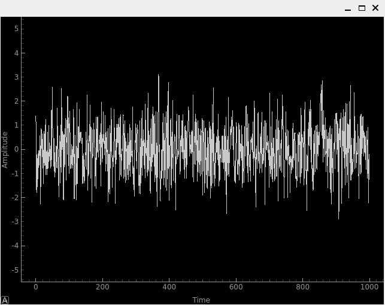
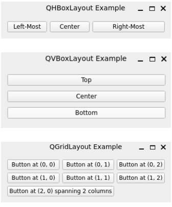
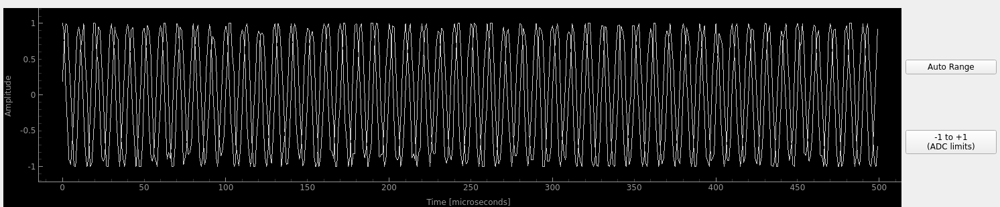
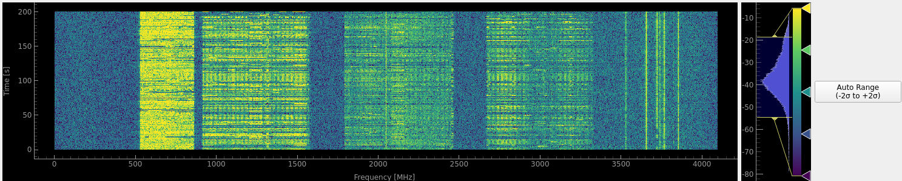

.. _freq-domain-chapter:

##########################
Real-Time GUIs with PyQt
##########################

In this chapter we learn how to create real-time graphical user interfaces (GUIs) within Python by leveraging PyQt, the Python bindings for Qt.  As part of this chapter we build a spectrum analyzer with time, frequency, and spectrogram/waterfall graphics, as well as input widgets for adjusting the various SDR parameters.  The example supports the PlutoSDR, USRP, or simulation-only mode.

****************
Introduction
****************

Qt (pronounced "cute") is a framework for creating GUI applications that can run on Linux, Windows, macOS, and even Android.  It is a very powerful framework that is used in many commercial applications, and is written in C++ for maximum performance.  PyQt is the Python bindings for Qt, providing a way to create GUI applications in Python, while harnessing the performance of an efficient C++ based framework.  In this chapter we will learn how to use PyQt to create a real-time spectrum analyzer that can be used with an SDR (or with a simulated signal).  The spectrum analyzer will have time, frequency, and spectrogram/waterfall graphics, as well as input widgets for adjusting the various SDR parameters.  We use `PyQtGraph <https://www.pyqtgraph.org/>`_, which is a separate library built on top of PyQt, to perform plotting.  On the input side, we use sliders, combo-box, and push-buttons.  The example supports the PlutoSDR, USRP, or simulation-only mode.  Even though the example code uses PyQt6, every single line is identical to PyQt5 (besides the :code:`import`), very little changed between the two versions from an API perspective.  Naturally, this chapter is extremely Python code heavy, as we explain through examples.  By the end of this chapter you will have gained familiarity with the building blocks used to create your own custom interactive SDR application!

****************
Qt Overview
****************

Qt is a very large framework, and we will only be scratching the surface of what it can do.  However, there are a few key concepts that are important to understand when working with Qt/PyQt:

- **Widgets**: Widgets are the building blocks of a Qt application, and are used to create the GUI.  There are many different types of widgets, including buttons, sliders, labels, and plots.  Widgets can be arranged in layouts, which determine how they are positioned on the screen.

- **Layouts**: Layouts are used to arrange widgets in a window.  There are several types of layouts, including horizontal, vertical, grid, and form layouts.  Layouts are used to create complex GUIs that are responsive to changes in window size.

- **Signals and Slots**: Signals and slots are a way to communicate between different parts of a Qt application.  A signal is emitted by an object when a particular event occurs, and is connected to a slot, which is a callback function that is called when the signal is emitted.  Signals and slots are used to create an event-driven structure in a Qt application, and keep the GUI responsive.

- **Style Sheets**: Style sheets are used to customize the appearance of widgets in a Qt application.  Style sheets are written in a CSS-like language, and can be used to change the color, font, and size of widgets.

- **Graphics**: Qt has a powerful graphics framework that can be used to create custom graphics in a Qt application.  The graphics framework includes classes for drawing lines, rectangles, ellipses, and text, as well as classes for handling mouse and keyboard events.

- **Multithreading**: Qt has built-in support for multithreading, and provides classes for creating worker threads that run in the background.  Multithreading is used to run long-running operations in a Qt application without blocking the main GUI thread.

- **OpenGL**: Qt has built-in support for OpenGL, and provides classes for creating 3D graphics in a Qt application.  OpenGL is used to create applications that require high-performance 3D graphics.  In this chapter we will only be focusing on 2D applications.

*************************
Basic Application Layout
*************************

Before we dive into the different Qt widgets, let's look at the layout of a typical Qt application.  A Qt application is composed of a main window, which contains a central widget, which in turn contains the main content of the application.  Using PyQt we can create a minimal Qt application, containing just a single QPushButton as follows:

.. code-block:: python

    from PyQt6.QtWidgets import QApplication, QMainWindow, QPushButton

    # Subclass QMainWindow to customize your application's main window
    class MainWindow(QMainWindow):
        def __init__(self):
            super().__init__()
            
            # Example GUI component
            example_button = QPushButton('Push Me')
            def on_button_click():
                print("beep")
            example_button.clicked.connect(on_button_click)

            self.setCentralWidget(example_button)

    app = QApplication([])
    window = MainWindow()
    window.show() # Windows are hidden by default
    app.exec() # Start the event loop

Try running the code yourself, you will likely need to :code:`pip install PyQt6`.  Note how the very last line is blocking, anything you add after that line wont run until you close the window.  The QPushButton we create has its :code:`clicked` signal connected to a callback function that prints "beep" to the console.

*******************************
Application with Worker Thread
*******************************

There is one problem with the minimal example above- it doesn't leave us any spot to put SDR/DSP oriented code.  The :code:`MainWindow`'s :code:`__init__` is where the GUI is configured and callbacks are defined, but you absolutely do not want to add any other code (such as SDR or DSP code) to it.  The reason is that the GUI is single-threaded, and if you block the GUI thread with long-running code, the GUI will freeze/stutter, and we want the smoothest GUI possible.  To get around this, we can use a worker thread to run the SDR/DSP code in the background.

The example below extends the minimal example above to include a worker thread that runs code (in the :code:`run` function) nonstop.  We don't use a :code:`while True:` though, because of the way PyQt works under the hood, we want our :code:`run` function to finish and start over periodically.  In order to do this, the worker thread's :code:`end_of_run` signal (which we discuss more in the next section) is connected to a callback function that triggers the worker thread's :code:`run` function again.  We also must initialize the worker thread in the :code:`MainWindow` code, which involves creating a new :code:`QThread` and assigning our custom worker to it.  This code might seem complicated, but it is a very common pattern in PyQt applications and the main take-away is that the GUI-oriented code goes in :code:`MainWindow`, and the SDR/DSP-oriented code goes in the worker thread's :code:`run` function.

.. code-block:: python

    from PyQt6.QtCore import QThread, pyqtSignal, QObject, QTimer
    from PyQt6.QtWidgets import QApplication, QMainWindow, QPushButton
    import time

    # Non-GUI operations (including SDR) need to run in a separate thread
    class SDRWorker(QObject):
        end_of_run = pyqtSignal()

        # Main loop
        def run(self):
            print("Starting run()")
            time.sleep(1)
            self.end_of_run.emit() # let MainWindow know we're done

    # Subclass QMainWindow to customize your application's main window
    class MainWindow(QMainWindow):
        def __init__(self):
            super().__init__()

            # Initialize worker and thread
            self.sdr_thread = QThread()
            worker = SDRWorker()
            worker.moveToThread(self.sdr_thread)
            
            # Example GUI component
            example_button = QPushButton('Push Me')
            def on_button_click():
                print("beep")
            example_button.clicked.connect(on_button_click)
            self.setCentralWidget(example_button)

            # This is what keeps the run() function repeating nonstop
            def end_of_run_callback():
                QTimer.singleShot(0, worker.run) # Run worker again immediately
            worker.end_of_run.connect(end_of_run_callback)

            self.sdr_thread.started.connect(worker.run) # kicks off the first run() when the thread starts
            self.sdr_thread.start() # start thread

    app = QApplication([])
    window = MainWindow()
    window.show() # Windows are hidden by default
    app.exec() # Start the event loop

Try running the above code, you should see a "Starting run()" in the console every 1 second, and the push-button should still work (without any delay).  Within the worker thread, all we are doing now is a print and a sleep, but soon we will be adding the SDR handling and DSP code to it.

*************************
Signals and Slots
*************************

In the above example, we used the :code:`end_of_run` signal to communicate between the worker thread and the GUI thread.  This is a common pattern in PyQt applications, and is known as the "signals and slots" mechanism.  A signal is emitted by an object (in this case, the worker thread) and is connected to a slot (in this case, the callback function :code:`end_of_run_callback` in the GUI thread).  The signal can be connected to multiple slots, and the slot can be connected to multiple signals.  The signal can also carry arguments, which are passed to the slot when the signal is emitted.  Note that we can also reverse things; the GUI thread is able to send a signal to the worker thread's slot.  The signal/slot mechanism is a powerful way to communicate between different parts of a PyQt application, creating an event-driven structure, and is used extensively in the example code that follows.  Just remember that a slot is simply a callback function, and a signal is a way to signal that callback function.  

*************************
PyQtGraph
*************************

PyQtGraph is a library built on top of PyQt and NumPy that provides fast and efficient plotting capabilities, as PyQt is too general purpose to come with plotting functionality.  It is designed to be used in real-time applications, and is optimized for speed.  It is similar in a lot of ways to Matplotlib, but meant for real-time applications instead of single plots.  Using the simple example below you can compare the performance of PyQtGraph to Matplotlib, simply change the :code:`if True:` to :code:`False:`.  On an Intel Core i9-10900K @ 3.70 GHz the PyQtGraph code updated at over 1000 FPS while the Matplotlib code updated at 40 FPS.  That being said, if you find yourself benefiting from using Matplotlib (e.g., to save development time, or because you want a specific feature that PyQtGraph doesn't support), you can incorporate Matplotlib plots into a PyQt application, using the code below as a starting point.

.. raw:: html

   

   
Expand for comparison code

.. code-block:: python

    import numpy as np
    import time
    import matplotlib
    matplotlib.use('Qt5Agg')
    from PyQt6 import QtCore, QtWidgets
    from matplotlib.backends.backend_qtagg import FigureCanvasQTAgg as FigureCanvas
    from matplotlib.figure import Figure
    import pyqtgraph as pg # tested with pyqtgraph==0.13.7

    n_data = 1024

    if True:
        class MplCanvas(FigureCanvas):
            def __init__(self):
                fig = Figure(figsize=(13, 8), dpi=100)
                self.axes = fig.add_subplot(111)
                super(MplCanvas, self).__init__(fig)

        class MainWindow(QtWidgets.QMainWindow):
            def __init__(self):
                super(MainWindow, self).__init__()

                self.canvas = MplCanvas()
                self._plot_ref = self.canvas.axes.plot(np.arange(n_data), '.-r')[0]
                self.canvas.axes.set_xlim(0, n_data)
                self.canvas.axes.set_ylim(-5, 5)
                self.canvas.axes.grid(True)
                self.setCentralWidget(self.canvas)

                # Setup a timer to trigger the redraw by calling update_plot.
                self.timer = QtCore.QTimer()
                self.timer.setInterval(0) # causes the timer to start immediately
                self.timer.timeout.connect(self.update_plot) # causes the timer to start itself again automatically
                self.timer.start()
                self.start_t = time.time() # used for benchmarking

                self.show()

            def update_plot(self):
                self._plot_ref.set_ydata(np.random.randn(n_data))
                self.canvas.draw() # Trigger the canvas to update and redraw.
                print('FPS:', 1/(time.time()-self.start_t)) # got ~42 FPS on an i9-10900K
                self.start_t = time.time()

    else:
        class MainWindow(QtWidgets.QMainWindow):
            def __init__(self):
                super(MainWindow, self).__init__()
                
                self.time_plot = pg.PlotWidget()
                self.time_plot.setYRange(-5, 5)
                self.time_plot_curve = self.time_plot.plot([])
                self.setCentralWidget(self.time_plot)

                # Setup a timer to trigger the redraw by calling update_plot.
                self.timer = QtCore.QTimer()
                self.timer.setInterval(0) # causes the timer to start immediately
                self.timer.timeout.connect(self.update_plot) # causes the timer to start itself again automatically
                self.timer.start()
                self.start_t = time.time() # used for benchmarking

                self.show()

            def update_plot(self):
                self.time_plot_curve.setData(np.random.randn(n_data))
                print('FPS:', 1/(time.time()-self.start_t)) # got ~42 FPS on an i9-10900K
                self.start_t = time.time()

    app = QtWidgets.QApplication([])
    w = MainWindow()
    app.exec()

.. raw:: html

    

As far as using PyQtGraph, we import it with :code:`import pyqtgraph as pg` and then we can create a Qt widget that represents a 1D plot as follows (this code goes in the :code:`MainWindow`'s :code:`__init__`):

.. code-block:: python

        # Example PyQtGraph plot
        time_plot = pg.PlotWidget(labels={'left': 'Amplitude', 'bottom': 'Time'})
        time_plot_curve = time_plot.plot(np.arange(1000), np.random.randn(1000)) # x and y
        time_plot.setYRange(-5, 5)

        self.setCentralWidget(time_plot)

You can see how it's relatively straightforward to set up a plot, and the result is simply another widget to add to your GUI.  In addition to 1D plots, PyQtGraph also has an equivalent to Matplotlib's :code:`imshow()` which plots 2D using a colormap, which we will use for our real-time spectrogram/waterfall.  One nice part about PyQtGraph is that the plots it creates are simply Qt widgets and we add other Qt elements (e.g. a rectangle of a certain size at a certain coordinate) using pure PyQt.  This is because PyQtGraph makes use of PyQt's :code:`QGraphicsScene` class, which provides a surface for managing a large number of 2D graphical items, and nothing is stopping us from adding lines, rectangles, text, ellipses, polygons, and bitmaps, using straight PyQt.

*******
Layouts
*******

In the above examples, we used :code:`self.setCentralWidget()` to set the main widget of the window.  This is a simple way to set the main widget, but it doesn't allow for more complex layouts.  For more complex layouts, we can use layouts, which are a way to arrange widgets in a window.  There are several types of layouts, including :code:`QHBoxLayout`, :code:`QVBoxLayout`, :code:`QGridLayout`, and :code:`QFormLayout`.  The :code:`QHBoxLayout` and :code:`QVBoxLayout` arrange widgets horizontally and vertically, respectively.  The :code:`QGridLayout` arranges widgets in a grid, and the :code:`QFormLayout` arranges widgets in a two-column layout, with labels in the first column and input widgets in the second column.

To create a new layout and add widgets to it, try adding the following inside your :code:`MainWindow`'s :code:`__init__`:

.. code-block:: python

    layout = QHBoxLayout()
    layout.addWidget(QPushButton("Left-Most"))
    layout.addWidget(QPushButton("Center"), 1)
    layout.addWidget(QPushButton("Right-Most"), 2)
    self.setLayout(layout)

In this example we are stacking the widgets horizontally, but by swapping :code:`QHBoxLayout` for :code:`QVBoxLayout` we can stack them vertically instead.  The :code:`addWidget` function is used to add widgets to the layout, and the optional second argument is a stretch factor that determines how much space the widget should take up relative to the other widgets in the layout.  

:code:`QGridLayout` has extra parameters because you must specify the row and column of the widget, and you can optionally specify how many rows and columns the widget should span (default is 1 and 1).  Here is an example of a :code:`QGridLayout`:

.. code-block:: python

    layout = QGridLayout()
    layout.addWidget(QPushButton("Button at (0, 0)"), 0, 0)
    layout.addWidget(QPushButton("Button at (0, 1)"), 0, 1)
    layout.addWidget(QPushButton("Button at (0, 2)"), 0, 2)
    layout.addWidget(QPushButton("Button at (1, 0)"), 1, 0)
    layout.addWidget(QPushButton("Button at (1, 1)"), 1, 1)
    layout.addWidget(QPushButton("Button at (1, 2)"), 1, 2)
    layout.addWidget(QPushButton("Button at (2, 0) spanning 2 columns"), 2, 0, 1, 2)
    self.setLayout(layout)

For our spectrum analyzer we will use the :code:`QGridLayout` for the overall layout, but we will also be adding :code:`QHBoxLayout` to stack widgets horizontally within a space in the grid.  You can nest layouts simply by create a new layout and adding it to the top-level (or parent) layout, e.g.:

.. code-block:: python

    layout = QGridLayout()
    self.setLayout(layout)
    inner_layout = QHBoxLayout()
    layout.addLayout(inner_layout)

*******************
:code:`QPushButton`
*******************

The first actual widget we will cover is the :code:`QPushButton`, which is a simple button that can be clicked.  We have already seen how to create a :code:`QPushButton` and connect its :code:`clicked` signal to a callback function.  The :code:`QPushButton` has a few other signals, including :code:`pressed`, :code:`released`, and :code:`toggled`.  The :code:`toggled` signal is emitted when the button is checked or unchecked, and is useful for creating toggle buttons.  The :code:`QPushButton` also has a few properties, including :code:`text`, :code:`icon`, and :code:`checkable`.  The :code:`QPushButton` also has a method called :code:`click()` which simulates a click on the button.  For our SDR spectrum analyzer application we will be using buttons to trigger an auto-range for plots, using the current data to calculate the y limits.  Because we have already used the :code:`QPushButton`, we won't go into more detail here, but you can find more information in the `QPushButton documentation <https://doc.qt.io/qtforpython/PySide6/QtWidgets/QPushButton.html>`_.

***************
:code:`QSlider`
***************

The :code:`QSlider` is a widget that allows the user to select a value from a range of values.  The :code:`QSlider` has a few properties, including :code:`minimum`, :code:`maximum`, :code:`value`, and :code:`orientation`.  The :code:`QSlider` also has a few signals, including :code:`valueChanged`, :code:`sliderPressed`, and :code:`sliderReleased`.  The :code:`QSlider` also has a method called :code:`setValue()` which sets the value of the slider, we will be using this a lot.  The documentation page for `QSlider is here <https://doc.qt.io/qtforpython/PySide6/QtWidgets/QSlider.html>`_.

For our spectrum analyzer application we will be using :code:`QSlider`'s to adjust the center frequency and gain of the SDR.  Here is the snippet from the final application code that creates the gain slider:

.. code-block:: python

    # Gain slider with label
    gain_slider = QSlider(Qt.Orientation.Horizontal)
    gain_slider.setRange(0, 73) # min and max, inclusive. interval is always 1
    gain_slider.setValue(50) # initial value
    gain_slider.setTickPosition(QSlider.TickPosition.TicksBelow)
    gain_slider.setTickInterval(2) # for visual purposes only
    gain_slider.sliderMoved.connect(worker.update_gain)
    gain_label = QLabel()
    def update_gain_label(val):
        gain_label.setText("Gain: " + str(val))
    gain_slider.sliderMoved.connect(update_gain_label)
    update_gain_label(gain_slider.value()) # initialize the label
    layout.addWidget(gain_slider, 5, 0)
    layout.addWidget(gain_label, 5, 1)

One very important thing to know about :code:`QSlider` is it uses integers, so by setting the range from 0 to 73 we are allowing the slider to choose integer values between those numbers (inclusive of start and end).  The :code:`setTickInterval(2)` is purely a visual thing.  It is for this reason that we will use kHz as the units for the frequency slider, so that we can have granularity down to the 1 kHz.

Halfway into the code above you'll notice we create a :code:`QLabel`, which is just a text label for display purposes, but in order for it to display the current value of the slider we must create a slot (i.e., callback function) that updates the label.  We connect this callback function to the :code:`sliderMoved` signal, which is automatically emitted whenever the slider is moved.  We also call the callback function once to initialize the label with the current value of the slider (50 in our case).  We also have to connect the :code:`sliderMoved` signal to a slot that lives within the worker thread, which will update the gain of the SDR (remember, we don't like to manage the SDR or do DSP in the main GUI thread). The callback function that defines this slot will be discussed later.

*****************
:code:`QComboBox`
*****************

The :code:`QComboBox` is a dropdown-style widget that allows the user to select an item from a list of items.  The :code:`QComboBox` has a few properties, including :code:`currentText`, :code:`currentIndex`, and :code:`count`.  The :code:`QComboBox` also has a few signals, including :code:`currentTextChanged`, :code:`currentIndexChanged`, and :code:`activated`.  The :code:`QComboBox` also has a method called :code:`addItem()` which adds an item to the list, and :code:`insertItem()` which inserts an item at a specific index, although we will not be using them in our spectrum analyzer example.  The documentation page for `QComboBox is here <https://doc.qt.io/qtforpython/PySide6/QtWidgets/QComboBox.html>`_.

For our spectrum analyzer application we will be using :code:`QComboBox` to select the sample rate from a list we pre-define.  At the beginning of our code we define the possible sample rates using :code:`sample_rates = [56, 40, 20, 10, 5, 2, 1, 0.5]`.  Within the :code:`MainWindow`'s :code:`__init__` we create the :code:`QComboBox` as follows:

.. code-block:: python

    # Sample rate dropdown using QComboBox
    sample_rate_combobox = QComboBox()
    sample_rate_combobox.addItems([str(x) + ' MHz' for x in sample_rates])
    sample_rate_combobox.setCurrentIndex(0) # must give it the index, not string
    sample_rate_combobox.currentIndexChanged.connect(worker.update_sample_rate)
    sample_rate_label = QLabel()
    def update_sample_rate_label(val):
        sample_rate_label.setText("Sample Rate: " + str(sample_rates[val]) + " MHz")
    sample_rate_combobox.currentIndexChanged.connect(update_sample_rate_label)
    update_sample_rate_label(sample_rate_combobox.currentIndex()) # initialize the label
    layout.addWidget(sample_rate_combobox, 6, 0)
    layout.addWidget(sample_rate_label, 6, 1)

The only real difference between this and the slider is the :code:`addItems()` where you give it the list of strings to use as options, and :code:`setCurrentIndex()` which sets the starting value.

****************
Lambda Functions
****************

Recall in the above code where we did:

.. code-block:: python

    def update_sample_rate_label(val):
        sample_rate_label.setText("Sample Rate: " + str(sample_rates[val]) + " MHz")
    sample_rate_combobox.currentIndexChanged.connect(update_sample_rate_label)

We are creating a function that has only a single line of code inside of it, then passing that function (functions are objects too!) to :code:`connect()`.  To simplify things, let's rewrite this code pattern using basic Python:

.. code-block:: python

    def my_function(x):
        print(x)
    y.call_that_takes_in_function_obj(my_function)

In this situation, we have a function that only has one line of code inside of it, and we only reference that function once; when we are setting the :code:`connect` callback.  In these situations we can use a lambda function, which is a way to define a function in a single line.  Here is the above code rewritten using a lambda function:

.. code-block:: python

    y.call_that_takes_in_function_obj(lambda x: print(x))

If you have never used a lambda function before, this might seem foreign, and you certainly don't need to use them, but it gets rid of two lines of code and makes the code more concise.  The way it works is, the temporary argument name comes from after "lambda", and then everything after the colon is the code that will operate on that variable.  It supports multiple arguments as well, using commas, or even no arguments by using :code:`lambda : <code>`.  As an exercise, try rewriting the :code:`update_sample_rate_label` function above using a lambda function.

***********************
PyQtGraph's PlotWidget
***********************

PyQtGraph's :code:`PlotWidget` is a PyQt widget used to produce 1D plots, similar to Matplotlib's :code:`plt.plot(x,y)`.  We will be using it for the time and frequency (PSD) domain plots, although it is also good for IQ plots (which our spectrum analyzer does not contain).  For those curious, PlotWidget is a subclass of PyQt's `QGraphicsView <https://doc.qt.io/qtforpython-5/PySide2/QtWidgets/QGraphicsView.html>`_ which is a widget for displaying the contents of a `QGraphicsScene <https://doc.qt.io/qtforpython-5/PySide2/QtWidgets/QGraphicsScene.html#PySide2.QtWidgets.PySide2.QtWidgets.QGraphicsScene>`_, which is a surface for managing a large number of 2D graphical items in Qt.  But the important thing to know about PlotWidget is that it is simply a widget containing a single `PlotItem <https://pyqtgraph.readthedocs.io/en/latest/api_reference/graphicsItems/plotitem.html#pyqtgraph.PlotItem>`_, so from a documentation perspective you're better off just referring to the PlotItem docs: `<https://pyqtgraph.readthedocs.io/en/latest/api_reference/graphicsItems/plotitem.html>`_.  A PlotItem contains a ViewBox for displaying the data we want to plot, as well as AxisItems and labels for displaying the axes and title, as you may expect.

The simplest example of using a PlotWidget is as follows (which must be added inside of the :code:`MainWindow`'s :code:`__init__`):

.. code-block:: python

 import pyqtgraph as pg
 plotWidget = pg.plot(title="My Title")
 plotWidget.plot(x, y)

where x and y are typically numpy arrays just like with Matplotlib's :code:`plt.plot()`.  However, this represents a static plot where the data never changes.  For our spectrum analyzer we want to update the data inside of our worker thread, so when we initialize our plot we don't even need to pass it any data yet, we just have to set it up.  Here is how we initialize the Time Domain plot in our spectrum analyzer app:

.. code-block:: python

    # Time plot
    time_plot = pg.PlotWidget(labels={'left': 'Amplitude', 'bottom': 'Time [microseconds]'})
    time_plot.setMouseEnabled(x=False, y=True)
    time_plot.setYRange(-1.1, 1.1)
    time_plot_curve_i = time_plot.plot([]) 
    time_plot_curve_q = time_plot.plot([]) 
    layout.addWidget(time_plot, 1, 0)

You can see we are creating two different plots/curves, one for I and one for Q.  The rest of the code should be self-explanatory.  To be able to update the plot, we need to create a slot (i.e., callback function) within the :code:`MainWindow`'s :code:`__init__`:

.. code-block:: python

    def time_plot_callback(samples):
        time_plot_curve_i.setData(samples.real)
        time_plot_curve_q.setData(samples.imag)

We will connect this slot to the worker thread's signal that is emitted when new samples are available, as shown later.  

The final thing we will do in the :code:`MainWindow`'s :code:`__init__` is to add a couple buttons to the right of the plot that will trigger an auto-range of the plot.  One will use the current min/max, and another will set the range to -1.1 to 1.1 (which is the ADC limits of many SDRs, plus a 10% margin).  We will create an inner layout, specifically QVBoxLayout, to vertically stack these two buttons.  Here is the code to add the buttons:

.. code-block:: python

    # Time plot auto range buttons
    time_plot_auto_range_layout = QVBoxLayout()
    layout.addLayout(time_plot_auto_range_layout, 1, 1)
    auto_range_button = QPushButton('Auto Range')
    auto_range_button.clicked.connect(lambda : time_plot.autoRange()) # lambda just means its an unnamed function
    time_plot_auto_range_layout.addWidget(auto_range_button)
    auto_range_button2 = QPushButton('-1 to +1\n(ADC limits)')
    auto_range_button2.clicked.connect(lambda : time_plot.setYRange(-1.1, 1.1))
    time_plot_auto_range_layout.addWidget(auto_range_button2)

And what it ultimately looks like:

We will use a similar pattern for the frequency domain (PSD) plot.

*********************
PyQtGraph's ImageItem
*********************

A spectrum analyzer is not complete without a waterfall (a.k.a. real-time spectrogram), and for that we will use PyQtGraph's ImageItem, which renders images with 1, 3 or 4 "channels".  One channel just means you give it a 2D array of floats or ints, which then uses a lookup table (LUT) to apply a colormap and ultimately create the image.  Alternatively, you can give it RGB (3 channels) or RGBA (4 channels).  We will calculate our spectrogram as a 2D numpy array of floats, and pass it to the ImageItem directly.  We will pick a colormap, and even make use of the built-in functionality for showing a graphical LUT that can display our data's value distribution and how the colormap is applied.

The actual initialization of the waterfall plot is fairly straightforward, we use a PlotWidget as the container (so that we can still have our x and y axis displayed) and then add an ImageItem to it:

.. code-block:: python

    # Waterfall plot
    waterfall = pg.PlotWidget(labels={'left': 'Time [s]', 'bottom': 'Frequency [MHz]'})
    imageitem = pg.ImageItem(axisOrder='col-major') # this arg is purely for performance
    waterfall.addItem(imageitem)
    waterfall.setMouseEnabled(x=False, y=False)
    waterfall_layout.addWidget(waterfall)

The slot/callback associated with updating the waterfall data, which goes in :code:`MainWindow`'s :code:`__init__`, is as follows:

.. code-block:: python

    def waterfall_plot_callback(spectrogram):
        imageitem.setImage(spectrogram, autoLevels=False)
        sigma = np.std(spectrogram)
        mean = np.mean(spectrogram) 
        self.spectrogram_min = mean - 2*sigma # save to window state
        self.spectrogram_max = mean + 2*sigma

Where spectrogram will be a 2D numpy array of floats.  In addition to setting the image data, we will calculate a min and max for the colormap, based on the mean and variance of the data, which we will use later.  The last part of the GUI code for the spectrogram is creating the colorbar, which also sets the colormap used:

.. code-block:: python

    # Colorbar for waterfall
    colorbar = pg.HistogramLUTWidget()
    colorbar.setImageItem(imageitem) # connects the bar to the waterfall imageitem
    colorbar.item.gradient.loadPreset('viridis') # set the color map, also sets the imageitem
    imageitem.setLevels((-30, 20)) # needs to come after colorbar is created for some reason
    waterfall_layout.addWidget(colorbar)

The second line is important, it is what ultimately connects this colorbar to the ImageItem.  This code is also where we choose the colormap, and set the starting levels (-30 dB to +20 dB in our case).  Within the worker thread code you will see how the spectrogram 2D array is calculated/stored.  Below is a screenshot of this part of the GUI, showing the incredible built-in functionality of the colorbar and LUT display, note that the sideways bell-shaped curve is the distribution of spectrogram values, which is very useful to see.

***********************
Worker Thread
***********************

Recall towards the beginning of this chapter we learned how to create a separate thread, using a class we called SDRWorker with a run() function.  This is where we will put all of our SDR and DSP code, with the exception of initialization of the SDR which we will do globally for now.  The worker thread will also be responsible for updating the three plots, by emitting signals when new samples are available, to trigger the callback functions we have already created in :code:`MainWindow`, which ultimately updates the plots.  The SDRWorker class can be split up into three sections:

#. :code:`init()` - used to initialize any state, such as the spectrogram 2D array
#. PyQt Signals - we must define our custom signals that will be emitted
#. PyQt Slots - the callback functions that are triggered by GUI events like a slider moving
#. :code:`run()` - the main loop that runs nonstop

***********************
PyQt Signals
***********************

In the GUI code we didn't have to define any Signals, because they were built into the widgets we were using, like :code:`QSlider`s :code:`valueChanged`.  Our SDRWorker class is custom, and any Signals we want to emit must be defined before we start calling run().  Here is the code for the SDRWorker class, which defines four signals we will be using, and their corresponding data types:

.. code-block:: python

    # PyQt Signals
    time_plot_update = pyqtSignal(np.ndarray)
    freq_plot_update = pyqtSignal(np.ndarray)
    waterfall_plot_update = pyqtSignal(np.ndarray)
    end_of_run = pyqtSignal() # happens many times a second

The first three signals send a single object; a numpy array.  The last signal does not send any object with it.  You can also send multiple objects at a time, simply use commas between data types, but we don't need to do that for our application here.  Anywhere within run() we can emit a signal to the GUI thread, using just one line of code, for example:

.. code-block:: python

    self.time_plot_update.emit(samples)

There is one last step to make all of the signals/slots connections- in the GUI code (comes at the very end of :code:`MainWindow`'s :code:`__init__`) we must connect the worker thread's signals to the GUI's slots, for example:

.. code-block:: python

    worker.time_plot_update.connect(time_plot_callback) # connect the signal to the callback

Remember that :code:`worker` is the instance of the SDRWorker class that we created in the GUI code.  So what we are doing above is connecting the worker thread's signal called :code:`time_plot_update` to the GUI's slot called :code:`time_plot_callback` that we defined earlier.  Now is a good time to go back and review the code snippets we have shown so far, and see how they all fit together, to ensure you understand how the GUI and worker thread are communicating, as it is a crucial part of PyQt programming.

***********************
Worker Thread Slots
***********************

The worker thread's slots are the callback functions that are triggered by GUI events, like the gain slider moving.  They are pretty straightforward, for example, this slot updates the SDR's gain value to the new value chosen by the slider:

.. code-block:: python

    def update_gain(self, val):
        print("Updated gain to:", val, 'dB')
        sdr.set_rx_gain(val)

***********************
Worker Thread Run()
***********************

The :code:`run()` function is where all the fun DSP part happens!  In our application, we will start each run function by receiving a set of samples from the SDR (or simulating some samples if you don't have an SDR).  

.. code-block:: python

    # Main loop
    def run(self):
        if sdr_type == "pluto":
            samples = sdr.rx()/2**11 # Receive samples
        elif sdr_type == "usrp":
            streamer.recv(recv_buffer, metadata)
            samples = recv_buffer[0] # will be np.complex64
        elif sdr_type == "sim":
            tone = np.exp(2j*np.pi*self.sample_rate*0.1*np.arange(fft_size)/self.sample_rate)
            noise = np.random.randn(fft_size) + 1j*np.random.randn(fft_size)
            samples = self.gain*tone*0.02 + 0.1*noise
            # Truncate to -1 to +1 to simulate ADC bit limits
            np.clip(samples.real, -1, 1, out=samples.real)
            np.clip(samples.imag, -1, 1, out=samples.imag)
        
        ...

As you can see, for the simulated example, we generate a tone with some white noise, and then truncate the samples from -1 to +1.

Now for the DSP!  We know we will need to take the FFT for the frequency domain plot and spectrogram.  It turns out that we can simply use the PSD for that set of samples as one row of the spectrogram, so all we have to do is shift our spectrogram/waterfall up by a row, and add the new row to the bottom (or top, doesn't matter).  For each of the plot updates, we emit the signal which contains the updated data to plot.  We also signal the end of the :code:`run()` function so that the GUI thread immediately starts another call to :code:`run()` again.  Overall, it's actually not much code:

.. code-block:: python

        ...

        self.time_plot_update.emit(samples[0:time_plot_samples])
        
        PSD = 10.0*np.log10(np.abs(np.fft.fftshift(np.fft.fft(samples)))**2/fft_size)
        self.PSD_avg = self.PSD_avg * 0.99 + PSD * 0.01
        self.freq_plot_update.emit(self.PSD_avg)

        self.spectrogram[:] = np.roll(self.spectrogram, 1, axis=1) # shifts waterfall 1 row
        self.spectrogram[:,0] = PSD # fill last row with new fft results
        self.waterfall_plot_update.emit(self.spectrogram)

        self.end_of_run.emit() # emit the signal to keep the loop going
        # end of run()

Note how we don't send the entire batch of samples to the time plot, because it would be too many points to show, instead we only send the first 500 samples (configurable at the top of the script, not shown here).  For the PSD plot, we use a running average of the PSD, by storing the previous PSD and adding 1% of the new PSD to it.  This is a simple way to smooth out the PSD plot.  Note that it doesn't matter the order you call :code:`emit()` for the signals, they could have all just as easily gone at the end of :code:`run()`.

***********************
Final Example Full Code
***********************

Up until this point we have been looking at snippets of the spectrum analyzer app, but now we will finally take a look at the full code and try running it.  It currently supports the PlutoSDR, USRP, or simulation-mode.  If you don't have a Pluto or USRP, simply leave the code as-is, and it should use simulation mode, otherwise change :code:`sdr_type`.  In simulation mode, if you increase the gain all the way, you will notice the signal gets truncated in the time domain, which causes spurs to occur in the frequency domain.

Feel free to use this code as a starting point for your own real-time SDR app!  Below is also an animation of the app in action, using a Pluto to look at the 750 MHz cellular band, and then at 2.4 GHz WiFi.  A higher quality version is available on YouTube `here <https://youtu.be/hvofiY3Q_yo>`_.

.. image:: ../_images/pyqt_animation.gif
   :scale: 100 %
   :align: center
   :alt: Animated gif showing the PyQt spectrum analyzer app in action

Known bugs (to help fix them `edit this <https://github.com/777arc/PySDR/edit/master/figure-generating-scripts/pyqt_example.py>`_):

#. Waterfall x-axis doesn't update when changing center frequency (PSD plot does though)

Full code:

.. code-block:: python

    from PyQt6.QtCore import QSize, Qt, QThread, pyqtSignal, QObject, QTimer
    from PyQt6.QtWidgets import QApplication, QMainWindow, QGridLayout, QWidget, QSlider, QLabel, QHBoxLayout, QVBoxLayout, QPushButton, QComboBox  # tested with PyQt6==6.7.0
    import pyqtgraph as pg # tested with pyqtgraph==0.13.7
    import numpy as np
    import time
    import signal # lets control-C actually close the app

    # Defaults
    fft_size = 4096 # determines buffer size
    num_rows = 200
    center_freq = 750e6
    sample_rates = [56, 40, 20, 10, 5, 2, 1, 0.5] # MHz
    sample_rate = sample_rates[0] * 1e6
    time_plot_samples = 500
    gain = 50 # 0 to 73 dB. int

    sdr_type = "sim" # or "usrp" or "pluto"

    # Init SDR
    if sdr_type == "pluto":
        import adi
        sdr = adi.Pluto("ip:192.168.1.10")
        sdr.rx_lo = int(center_freq)
        sdr.sample_rate = int(sample_rate)
        sdr.rx_rf_bandwidth = int(sample_rate*0.8) # antialiasing filter bandwidth
        sdr.rx_buffer_size = int(fft_size)
        sdr.gain_control_mode_chan0 = 'manual'
        sdr.rx_hardwaregain_chan0 = gain # dB
    elif sdr_type == "usrp":
        import uhd
        #usrp = uhd.usrp.MultiUSRP(args="addr=192.168.1.10")
        usrp = uhd.usrp.MultiUSRP(args="addr=192.168.1.201")
        usrp.set_rx_rate(sample_rate, 0)
        usrp.set_rx_freq(uhd.libpyuhd.types.tune_request(center_freq), 0)
        usrp.set_rx_gain(gain, 0)

        # Set up the stream and receive buffer
        st_args = uhd.usrp.StreamArgs("fc32", "sc16")
        st_args.channels = [0]
        metadata = uhd.types.RXMetadata()
        streamer = usrp.get_rx_stream(st_args)
        recv_buffer = np.zeros((1, fft_size), dtype=np.complex64)

        # Start Stream
        stream_cmd = uhd.types.StreamCMD(uhd.types.StreamMode.start_cont)
        stream_cmd.stream_now = True
        streamer.issue_stream_cmd(stream_cmd)

        def flush_buffer():
            for _ in range(10):
                streamer.recv(recv_buffer, metadata)

    class SDRWorker(QObject):
        def __init__(self):
            super().__init__()
            self.gain = gain
            self.sample_rate = sample_rate
            self.freq = 0 # in kHz, to deal with QSlider being ints and with a max of 2 billion
            self.spectrogram = -50*np.ones((fft_size, num_rows))
            self.PSD_avg = -50*np.ones(fft_size)

        # PyQt Signals
        time_plot_update = pyqtSignal(np.ndarray)
        freq_plot_update = pyqtSignal(np.ndarray)
        waterfall_plot_update = pyqtSignal(np.ndarray)
        end_of_run = pyqtSignal() # happens many times a second

        # PyQt Slots
        def update_freq(self, val): # TODO: WE COULD JUST MODIFY THE SDR IN THE GUI THREAD
            print("Updated freq to:", val, 'kHz')
            if sdr_type == "pluto":
                sdr.rx_lo = int(val*1e3)
            elif sdr_type == "usrp":
                usrp.set_rx_freq(uhd.libpyuhd.types.tune_request(val*1e3), 0)
                flush_buffer()
        
        def update_gain(self, val):
            print("Updated gain to:", val, 'dB')
            self.gain = val
            if sdr_type == "pluto":
                sdr.rx_hardwaregain_chan0 = val
            elif sdr_type == "usrp":
                usrp.set_rx_gain(val, 0)
                flush_buffer()

        def update_sample_rate(self, val):
            print("Updated sample rate to:", sample_rates[val], 'MHz')
            if sdr_type == "pluto":
                sdr.sample_rate = int(sample_rates[val] * 1e6)
                sdr.rx_rf_bandwidth = int(sample_rates[val] * 1e6 * 0.8)
            elif sdr_type == "usrp":
                usrp.set_rx_rate(sample_rates[val] * 1e6, 0)
                flush_buffer()

        # Main loop
        def run(self):
            start_t = time.time()
                    
            if sdr_type == "pluto":
                samples = sdr.rx()/2**11 # Receive samples
            elif sdr_type == "usrp":
                streamer.recv(recv_buffer, metadata)
                samples = recv_buffer[0] # will be np.complex64
            elif sdr_type == "sim":
                tone = np.exp(2j*np.pi*self.sample_rate*0.1*np.arange(fft_size)/self.sample_rate)
                noise = np.random.randn(fft_size) + 1j*np.random.randn(fft_size)
                samples = self.gain*tone*0.02 + 0.1*noise
                # Truncate to -1 to +1 to simulate ADC bit limits
                np.clip(samples.real, -1, 1, out=samples.real)
                np.clip(samples.imag, -1, 1, out=samples.imag)

            self.time_plot_update.emit(samples[0:time_plot_samples])
            
            PSD = 10.0*np.log10(np.abs(np.fft.fftshift(np.fft.fft(samples)))**2/fft_size)
            self.PSD_avg = self.PSD_avg * 0.99 + PSD * 0.01
            self.freq_plot_update.emit(self.PSD_avg)
        
            self.spectrogram[:] = np.roll(self.spectrogram, 1, axis=1) # shifts waterfall 1 row
            self.spectrogram[:,0] = PSD # fill last row with new fft results
            self.waterfall_plot_update.emit(self.spectrogram)

            print("Frames per second:", 1/(time.time() - start_t))
            self.end_of_run.emit() # emit the signal to keep the loop going

    # Subclass QMainWindow to customize your application's main window
    class MainWindow(QMainWindow):
        def __init__(self):
            super().__init__()

            self.setWindowTitle("The PySDR Spectrum Analyzer")
            self.setFixedSize(QSize(1500, 1000)) # window size, starting size should fit on 1920 x 1080

            self.spectrogram_min = 0
            self.spectrogram_max = 0

            layout = QGridLayout() # overall layout

            # Initialize worker and thread
            self.sdr_thread = QThread()
            self.sdr_thread.setObjectName('SDR_Thread') # so we can see it in htop, note you have to hit F2 -> Display options -> Show custom thread names
            worker = SDRWorker()
            worker.moveToThread(self.sdr_thread)

            # Time plot
            time_plot = pg.PlotWidget(labels={'left': 'Amplitude', 'bottom': 'Time [microseconds]'})
            time_plot.setMouseEnabled(x=False, y=True)
            time_plot.setYRange(-1.1, 1.1)
            time_plot_curve_i = time_plot.plot([]) 
            time_plot_curve_q = time_plot.plot([]) 
            layout.addWidget(time_plot, 1, 0)

            # Time plot auto range buttons
            time_plot_auto_range_layout = QVBoxLayout()
            layout.addLayout(time_plot_auto_range_layout, 1, 1)
            auto_range_button = QPushButton('Auto Range')
            auto_range_button.clicked.connect(lambda : time_plot.autoRange()) # lambda just means its an unnamed function
            time_plot_auto_range_layout.addWidget(auto_range_button)
            auto_range_button2 = QPushButton('-1 to +1\n(ADC limits)')
            auto_range_button2.clicked.connect(lambda : time_plot.setYRange(-1.1, 1.1))
            time_plot_auto_range_layout.addWidget(auto_range_button2)

            # Freq plot
            freq_plot = pg.PlotWidget(labels={'left': 'PSD', 'bottom': 'Frequency [MHz]'})
            freq_plot.setMouseEnabled(x=False, y=True)
            freq_plot_curve = freq_plot.plot([]) 
            freq_plot.setXRange(center_freq/1e6 - sample_rate/2e6, center_freq/1e6 + sample_rate/2e6)
            freq_plot.setYRange(-30, 20)
            layout.addWidget(freq_plot, 2, 0)
            
            # Freq auto range button
            auto_range_button = QPushButton('Auto Range')
            auto_range_button.clicked.connect(lambda : freq_plot.autoRange()) # lambda just means its an unnamed function
            layout.addWidget(auto_range_button, 2, 1)

            # Layout container for waterfall related stuff
            waterfall_layout = QHBoxLayout()
            layout.addLayout(waterfall_layout, 3, 0)

            # Waterfall plot
            waterfall = pg.PlotWidget(labels={'left': 'Time [s]', 'bottom': 'Frequency [MHz]'})
            imageitem = pg.ImageItem(axisOrder='col-major') # this arg is purely for performance
            waterfall.addItem(imageitem)
            waterfall.setMouseEnabled(x=False, y=False)
            waterfall_layout.addWidget(waterfall)

            # Colorbar for waterfall
            colorbar = pg.HistogramLUTWidget()
            colorbar.setImageItem(imageitem) # connects the bar to the waterfall imageitem
            colorbar.item.gradient.loadPreset('viridis') # set the color map, also sets the imageitem
            imageitem.setLevels((-30, 20)) # needs to come after colorbar is created for some reason
            waterfall_layout.addWidget(colorbar)

            # Waterfall auto range button
            auto_range_button = QPushButton('Auto Range\n(-2σ to +2σ)')
            def update_colormap():
                imageitem.setLevels((self.spectrogram_min, self.spectrogram_max))
                colorbar.setLevels(self.spectrogram_min, self.spectrogram_max)
            auto_range_button.clicked.connect(update_colormap)
            layout.addWidget(auto_range_button, 3, 1)

            # Freq slider with label, all units in kHz
            freq_slider = QSlider(Qt.Orientation.Horizontal)
            freq_slider.setRange(0, int(6e6))
            freq_slider.setValue(int(center_freq/1e3))
            freq_slider.setTickPosition(QSlider.TickPosition.TicksBelow)
            freq_slider.setTickInterval(int(1e6))
            freq_slider.sliderMoved.connect(worker.update_freq) # there's also a valueChanged option
            freq_label = QLabel()
            def update_freq_label(val):
                freq_label.setText("Frequency [MHz]: " + str(val/1e3))
                freq_plot.autoRange()
            freq_slider.sliderMoved.connect(update_freq_label)
            update_freq_label(freq_slider.value()) # initialize the label
            layout.addWidget(freq_slider, 4, 0)
            layout.addWidget(freq_label, 4, 1)

            # Gain slider with label
            gain_slider = QSlider(Qt.Orientation.Horizontal)
            gain_slider.setRange(0, 73)
            gain_slider.setValue(gain)
            gain_slider.setTickPosition(QSlider.TickPosition.TicksBelow)
            gain_slider.setTickInterval(2)
            gain_slider.sliderMoved.connect(worker.update_gain)
            gain_label = QLabel()
            def update_gain_label(val):
                gain_label.setText("Gain: " + str(val))
            gain_slider.sliderMoved.connect(update_gain_label)
            update_gain_label(gain_slider.value()) # initialize the label
            layout.addWidget(gain_slider, 5, 0)
            layout.addWidget(gain_label, 5, 1)

            # Sample rate dropdown using QComboBox
            sample_rate_combobox = QComboBox()
            sample_rate_combobox.addItems([str(x) + ' MHz' for x in sample_rates])
            sample_rate_combobox.setCurrentIndex(0) # should match the default at the top
            sample_rate_combobox.currentIndexChanged.connect(worker.update_sample_rate)
            sample_rate_label = QLabel()
            def update_sample_rate_label(val):
                sample_rate_label.setText("Sample Rate: " + str(sample_rates[val]) + " MHz")
            sample_rate_combobox.currentIndexChanged.connect(update_sample_rate_label)
            update_sample_rate_label(sample_rate_combobox.currentIndex()) # initialize the label
            layout.addWidget(sample_rate_combobox, 6, 0)
            layout.addWidget(sample_rate_label, 6, 1)

            central_widget = QWidget()
            central_widget.setLayout(layout)
            self.setCentralWidget(central_widget)

            # Signals and slots stuff
            def time_plot_callback(samples):
                time_plot_curve_i.setData(samples.real)
                time_plot_curve_q.setData(samples.imag)
            
            def freq_plot_callback(PSD_avg):
                # TODO figure out if there's a way to just change the visual ticks instead of the actual x vals
                f = np.linspace(freq_slider.value()*1e3 - worker.sample_rate/2.0, freq_slider.value()*1e3 + worker.sample_rate/2.0, fft_size) / 1e6
                freq_plot_curve.setData(f, PSD_avg)
                freq_plot.setXRange(freq_slider.value()*1e3/1e6 - worker.sample_rate/2e6, freq_slider.value()*1e3/1e6 + worker.sample_rate/2e6)
            
            def waterfall_plot_callback(spectrogram):
                imageitem.setImage(spectrogram, autoLevels=False)
                sigma = np.std(spectrogram)
                mean = np.mean(spectrogram) 
                self.spectrogram_min = mean - 2*sigma # save to window state
                self.spectrogram_max = mean + 2*sigma

            def end_of_run_callback():
                QTimer.singleShot(0, worker.run) # Run worker again immediately
            
            worker.time_plot_update.connect(time_plot_callback) # connect the signal to the callback
            worker.freq_plot_update.connect(freq_plot_callback)
            worker.waterfall_plot_update.connect(waterfall_plot_callback)
            worker.end_of_run.connect(end_of_run_callback)

            self.sdr_thread.started.connect(worker.run) # kicks off the worker when the thread starts
            self.sdr_thread.start()

    app = QApplication([])
    window = MainWindow()
    window.show() # Windows are hidden by default
    signal.signal(signal.SIGINT, signal.SIG_DFL) # this lets control-C actually close the app
    app.exec() # Start the event loop

    if sdr_type == "usrp":
        stream_cmd = uhd.types.StreamCMD(uhd.types.StreamMode.stop_cont)
        streamer.issue_stream_cmd(stream_cmd)
