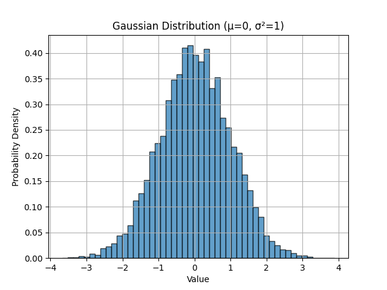
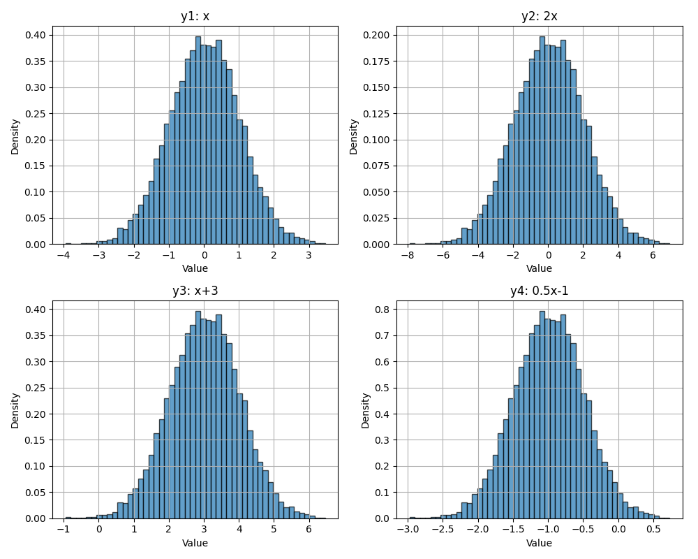
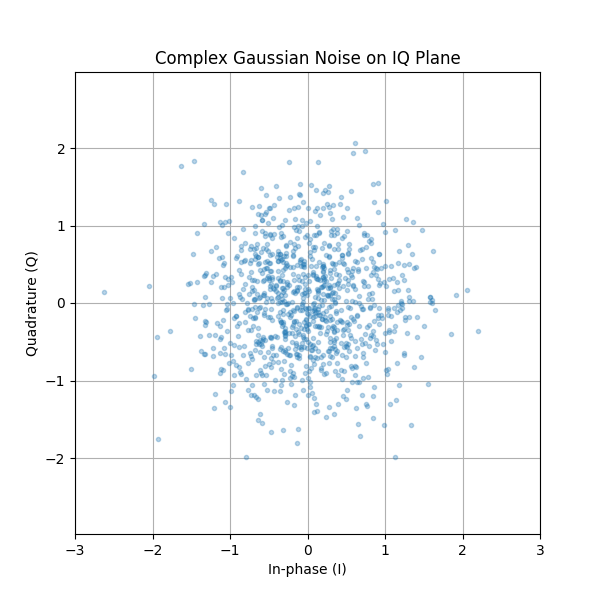

.. _random-variables-chapter:

######################################
Random Variables and Random Processes
######################################

In this chapter we introduce the fundamental concepts of random variables and random processes, which are essential for understanding noise, channel effects, and many signal processing techniques in wireless communications. We'll cover probability distributions, expectation, variance, and how random processes evolve over time. These concepts form the mathematical foundation for analyzing noise in the :ref:`noise-chapter` chapter and many other topics throughout SDR and DSP.

***************************
What is a Random Variable?
***************************

A **random variable** is a mathematical concept that maps outcomes of a random experiment to numerical values. Unlike the deterministic signals we've worked with so far, random variables represent quantities whose values are uncertain until they are observed or measured.

Think of rolling a six-sided die. Before you roll it, you don't know what number will appear. We can define a random variable :math:`X` that represents the outcome of the roll. The value of :math:`X` is one of {1, 2, 3, 4, 5, 6}, but we don't know which one until we actually roll the die.

In the context of wireless communications and SDR, random variables are everywhere:

* The thermal noise in a receiver is modeled as a random variable at each instant in time
* The amplitude of a received signal affected by fading is random
* The phase offset introduced by a channel can be modeled as random
* Even the data bits we transmit can be treated as random variables (if we don't know them ahead of time)

**Single Sample vs. Many Samples**

This is a crucial distinction that often causes confusion:

* A **single realization** or **single sample** of a random variable is just one number—one outcome of the random experiment
* To characterize a random variable (find its average, spread, etc.), we need **many realizations**—many outcomes

For example, if you call ``np.random.randn()`` in Python without any arguments, it returns a single random number drawn from a Gaussian distribution. That single number tells you almost nothing about the distribution itself. But if you call ``np.random.randn(10000)`` and generate 10,000 samples, you can now estimate properties of the distribution like its mean and variance.

.. code-block:: python

 import numpy as np

 # Single sample - just one number
 x_single = np.random.randn()
 print(x_single)  # might be 0.534, -1.23, or any other value

 # Many samples - now we can characterize the distribution
 x_many = np.random.randn(10000)
 print(np.mean(x_many))  # will be close to 0
 print(np.var(x_many))   # will be close to 1

Joint Distributions
####################

So far we've focused on single random variables. When dealing with two or more random variables simultaneously, we use a **joint distribution**.

For continuous variables :math:`X` and :math:`Y`, this is described by the **joint PDF**:

.. math::
   f_{X,Y}(x,y)

The joint PDF tells us how likely it is for :math:`X` to take value :math:`x` *and* :math:`Y` to take value :math:`y` at the same time.

From the joint PDF, we can compute:

* Marginal PDFs (e.g., :math:`f_X(x)` or :math:`f_Y(y)`)
* Expectations such as :math:`E[XY]`
* Covariance and correlation
* Probabilities involving both variables

For example, the marginal PDF of :math:`X` is obtained by integrating out :math:`Y`:

.. math::
   f_X(x) = \int_{-\infty}^{\infty} f_{X,Y}(x,y)\,dy

Joint distributions are the mathematical foundation for understanding dependence, correlation, and independence between random variables.

***************************
Probability Distributions
***************************

A **probability distribution** describes how likely different values of a random variable are. For a continuous random variable, we use a **probability density function (PDF)**, denoted :math:`f_X(x)`. The PDF tells us the relative likelihood of the random variable taking on different values.

The most important distribution in SDR and communications is the **Gaussian (Normal) distribution**. A Gaussian random variable :math:`X` with mean :math:`\mu` and variance :math:`\sigma^2` has the PDF:

.. math::
   f_X(x) = \frac{1}{\sqrt{2\pi\sigma^2}} e^{-\frac{(x-\mu)^2}{2\sigma^2}}

This is the famous "bell curve" you've likely seen before. The distribution is completely characterized by two parameters:

* **Mean** :math:`\mu`: the center of the distribution
* **Variance** :math:`\sigma^2`: how spread out the distribution is (standard deviation :math:`\sigma` is the square root of variance)

In Python, ``np.random.randn()`` generates samples from a **standard Gaussian** distribution with :math:`\mu = 0` and :math:`\sigma^2 = 1`. We can visualize this:

.. code-block:: python

 import numpy as np
 import matplotlib.pyplot as plt

 # Generate 10,000 samples from standard Gaussian
 x = np.random.randn(10000)

 # Create histogram to visualize the distribution
 plt.hist(x, bins=50, density=True, alpha=0.7, edgecolor='black')
 plt.xlabel('Value')
 plt.ylabel('Probability Density')
 plt.title('Gaussian Distribution (μ=0, σ²=1)')
 plt.grid(True)
 plt.show()

Expectation (Mean)
#######################

The **expectation** or **expected value** of a random variable, denoted :math:`E[X]` or :math:`\mu`, represents its average value over many realizations. For a continuous random variable with PDF :math:`f_X(x)`, the expectation is:

.. math::
   E[X] = \int_{-\infty}^{\infty} x \cdot f_X(x) \, dx

In practice, when we have :math:`N` samples :math:`x_1, x_2, \ldots, x_N` drawn from the distribution, we estimate the expectation using the **sample mean**:

.. math::
   \hat{\mu} = \frac{1}{N} \sum_{n=1}^{N} x_n

The expectation is a **linear operator**, which means:

* :math:`E[aX + b] = aE[X] + b` for constants :math:`a` and :math:`b`
* :math:`E[X + Y] = E[X] + E[Y]` for any two random variables

This linearity is extremely useful in signal processing!

Variance and Standard Deviation
#################################

The **variance** of a random variable, denoted :math:`\text{Var}(X)` or :math:`\sigma^2`, measures how spread out its values are around the mean. It's defined as the expected value of the squared deviation from the mean:

.. math::
   \text{Var}(X) = E[(X - \mu)^2] = E[X^2] - (E[X])^2

When we have :math:`N` samples, we estimate variance using:

.. math::
   \hat{\sigma}^2 = \frac{1}{N} \sum_{n=1}^{N} (x_n - \hat{\mu})^2

The **standard deviation** :math:`\sigma` is simply the square root of variance: :math:`\sigma = \sqrt{\sigma^2}`.

*Notice the* ^ (hat) *in the above equation at* :math:`\sigma` *and that for sample mean. The hat symbolizes we're estimating the mean/variance. It's not always exactly equal to the true mean/variance, but it gets closer to the true value as we increase the number of samples*

**Key Property:** If :math:`X` is a random variable with variance :math:`\sigma^2`, then:

* Scaling: :math:`\text{Var}(aX) = a^2 \text{Var}(X)`
* Shifting: :math:`\text{Var}(X + b) = \text{Var}(X)` (adding a constant doesn't change the spread)

And consequently for standard deviation :math:`\sigma`:

* Scaling: :math:`\sigma(aX) = a\sigma(X)`
* Shifting: :math:`\sigma(X+b) = \sigma(X)`

Scaling and shifting the Gaussian Distribution. (notice the scales on x and y axes)

**Variance and Power**

In signal processing, for a **zero-mean** signal (mean ~ 0), the variance equals the **average power**. This is why we often use the terms interchangeably:

.. math::
   P = \text{Var}(X) = E[X^2] \quad \text{(when } E[X] = 0\text{)}

This relationship is fundamental in analyzing noise power, signal-to-noise ratio (SNR), and link budgets.

.. code-block:: python

 noise_power = 2.0
 n = np.random.randn(N) * np.sqrt(noise_power)
 print(np.var(n))  # will be approximately 2.0

Covariance
------------------

The **covariance** between two random variables :math:`X` and :math:`Y` is defined as:

.. math::
   \text{Cov}(X,Y) = E[(X - E[X])(Y - E[Y])]

An equivalent and often more convenient form is:

.. math::
   \text{Cov}(X,Y) = E[XY] - E[X]E[Y]

Covariance measures how two variables vary together:

* Positive covariance: they tend to increase and decrease together
* Negative covariance: one tends to increase when the other decreases
* Zero covariance: they are uncorrelated

If both variables are zero-mean, this simplifies to:

.. math::
   \text{Cov}(X,Y) = E[XY]

Covariance has units (it is not normalized), which is why we often use the **correlation coefficient** (or simply correlation) in practice:

.. math::
   \rho_{XY} = \frac{\text{Cov}(X,Y)}{\sigma_X \sigma_Y}

This produces a dimensionless value between −1 and +1.

Variance of a Sum of Variables
###############################

In signal processing we often deal with sums of random variables, such as a signal plus noise:

.. math::
   Z = X + Y

The variance of this sum depends on whether :math:`X` and :math:`Y` are independent (or more generally, correlated).

In full generality:

.. math::
   \text{Var}(X + Y) = \text{Var}(X) + \text{Var}(Y) + 2\,\text{Cov}(X,Y)

where :math:`\text{Cov}(X,Y)` is the **covariance** between :math:`X` and :math:`Y`.

**Independent Case**

If :math:`X` and :math:`Y` are independent (or simply uncorrelated), then the expression simplifies to:

.. math::
   \text{Var}(X + Y) = \text{Var}(X) + \text{Var}(Y)

This result is extremely important in communications. For example, if a received signal is:

.. math::
   R = S + N

where :math:`S` is the signal and :math:`N` is independent noise, then the total power is just the sum of signal power and noise power.

This is why SNR calculations are so straightforward.

***********************************
Complex Random Variables
***********************************

In SDR, we work extensively with **complex-valued signals**, which means we also work with complex random variables. A complex random variable has the form:

.. math::
   Z = X + jY

where :math:`X` and :math:`Y` are both real-valued random variables representing the in-phase (I) and quadrature (Q) components.

**Complex Gaussian Noise**

The most common complex random variable in wireless communications is **complex Gaussian noise**, where both :math:`X` and :math:`Y` are independent Gaussian random variables with the same variance.

For example, if :math:`X \sim \mathcal{N}(\alpha_1, \sigma_1^2)` and :math:`Y \sim \mathcal{N}(\alpha_2, \sigma_2^2)` are independent, then the complex random variable :math:`Z = X + jY` has:

* Mean: :math:`E[Z] = E[X] + jE[Y] = \alpha_1 + j\alpha_2`
* Variance (Power): :math:`\text{Var}(Z) = \text{Var}(X) + \text{Var}(Y) = \sigma_1^2 + \sigma_2^2`

This is why when we create complex Gaussian noise with unit power (variance = 1), we use:

.. code-block:: python

 N = 10000
 n = (np.random.randn(N) + 1j*np.random.randn(N)) / np.sqrt(2)
 print(np.var(n))  # ~ 1

The division by :math:`\sqrt{2}` ensures that the total power (sum of I and Q variances) equals 1.

.. code-block:: python

 # Without normalization:
 n_raw = np.random.randn(N) + 1j*np.random.randn(N)
 print(np.var(np.real(n_raw)))  # ~ 1
 print(np.var(np.imag(n_raw)))  # ~ 1
 print(np.var(n_raw))            # ~ 2 (total power)

 # With normalization:
 n_norm = n_raw / np.sqrt(2)
 print(np.var(n_norm))           # ~ 1 (unit power)

***********************************
Random Processes
***********************************

So far we've discussed random variables—random values at a single point. A **random process** (also called a **stochastic process**) is a collection of random variables indexed by time:

.. math::
   X(t) \quad \text{or} \quad X[n] \text{ for discrete time}

At each time :math:`t`, :math:`X(t)` is a random variable. Think of a random process as a signal that evolves randomly over time.

Examples in wireless communications:

* Noise at the receiver: :math:`N(t)` or :math:`N[n]`
* A signal experiencing time-varying fading: :math:`H(t)S(t)`
* Samples from an SDR: each batch is a realization of a random process

**Stationary Processes**

A random process is **stationary** if its statistical properties don't change over time. In particular, a **wide-sense stationary (WSS)** process has:

* Constant mean: :math:`E[X(t)] = \mu` for all :math:`t`
* Autocorrelation that depends only on time difference: :math:`E[X(t)X(t+\tau)]` depends only on :math:`\tau`, not :math:`t`

Many noise sources in wireless systems are approximately stationary, which simplifies analysis significantly.

**White Noise**

**White noise** is a random process where samples at different times are uncorrelated, and the power spectral density is constant across all frequencies. Additive White Gaussian Noise (AWGN) is both:

* **White**: uncorrelated in time, flat power spectrum
* **Gaussian**: each sample is Gaussian distributed

When we generate noise in Python using ``np.random.randn(N)``, each of the :math:`N` samples is an independent Gaussian random variable, creating a white noise process.

Independence and Correlation
#############################

Two random variables :math:`X` and :math:`Y` are **independent** if knowing the value of one tells you nothing about the other. Mathematically, their joint PDF factors:

.. math::
   f_{X,Y}(x,y) = f_X(x) \cdot f_Y(y)

Independence is a strong condition. A weaker condition is **uncorrelated**, which means:

.. math::
   E[XY] = E[X]E[Y]

For Gaussian random variables, uncorrelated implies independent (this is a special property of Gaussians).

In complex Gaussian noise, the I and Q components are independent:

.. code-block:: python

 N = 10000
 I = np.random.randn(N)
 Q = np.random.randn(N)

 # Check independence via correlation
 correlation = np.corrcoef(I, Q)[0, 1]
 print(f"Correlation between I and Q: {correlation:.4f}")  # ~ 0

***************************
Further Reading
***************************

1. Papoulis, A., & Pillai, S. U. (2002). *Probability, Random Variables, and Stochastic Processes*. McGraw-Hill.
2. Kay, S. M. (2006). *Intuitive Probability and Random Processes using MATLAB®*. Springer.
3. https://en.wikipedia.org/wiki/Random_variable
4. https://en.wikipedia.org/wiki/Normal_distribution
5. https://en.wikipedia.org/wiki/Stochastic_process
